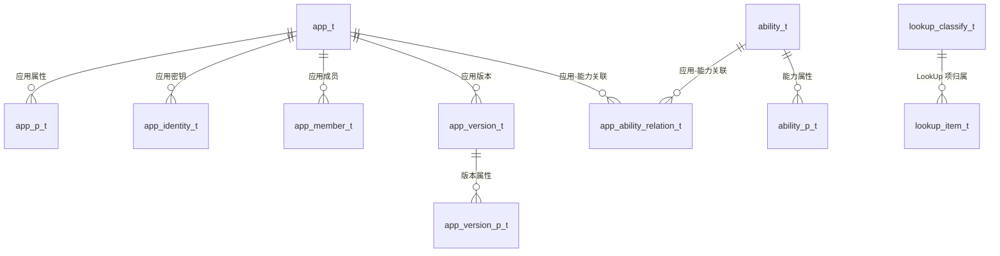
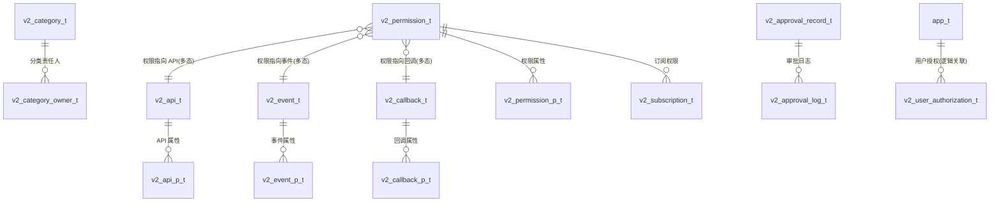
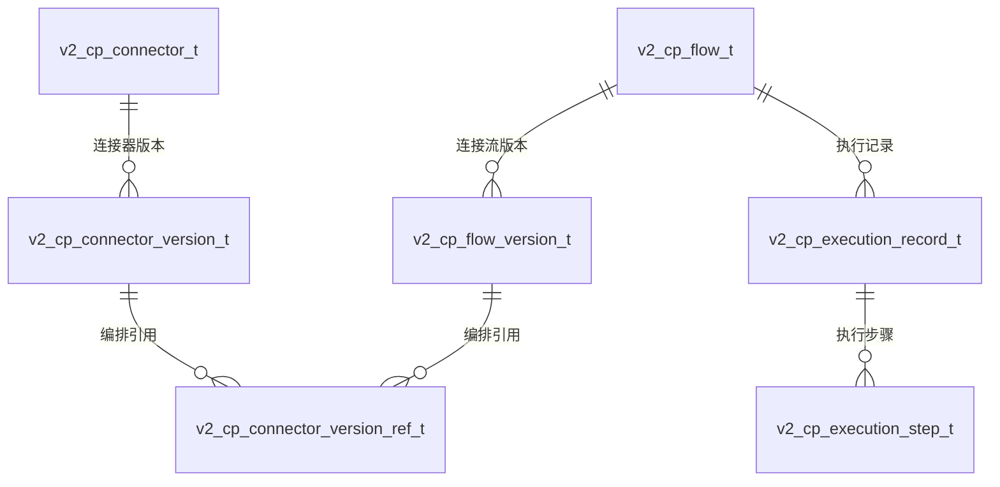

# open-app 数据库数据模型

> **文档定位**: sddu-docs-data — 数据模型文档 — 表结构、字段、索引、关联关系
> **输出文件名**: data.md
> **数据来源**: 代码扫描 + 设计文档聚合（open-flyway 迁移脚本 / entity 实体类）
> **创建人**: SDDU Docs Agent
> **创建时间**: 2026-08-03
> **版本**: v2.0 (BIZ-ARCH)

## 1. 数据模型概述

| 属性 | 值 |
|------|-----|
| **模型名称** | open-app 数据库全模型（40 张表） |
| **对应库名** | `openapp`（MySQL，192.168.3.155:3306） |
| **所属业务域** | 能力开放平台（数据层） |
| **存储引擎** | InnoDB（utf8mb4 / utf8mb4_unicode_ci） |

**设计约定**：
- 表前缀：`openplatform_`（V1 早期）/ `openplatform_v2_`（V2+）；连接器平台 `openplatform_v2_cp_`
- 表后缀：`_t`
- 主键：V1 部分自增，V2+ 应用层雪花 ID
- 无物理外键（逻辑外键）
- 审计字段 4 个：create_by / create_time / last_update_by / last_update_time
- 枚举统一 TINYINT(10) + COMMENT 映射

> 📖 本文档按**业务能力**组织 40 张表。迁移脚本执行顺序（V1~V7）仅为工程实现细节，见附录 §12，不作为业务分组依据。

---

## 2. 应用管理域（8 表）

> 对应能力：应用管理（应用/成员/AKSK/版本/能力关联/EAMAP）

### 2.1 `openplatform_app_t` — 应用主表

| 字段名 | 类型 | 约束 | 默认值 | 说明 |
|--------|------|------|--------|------|
| id | bigint | PK | — | 主键 |
| app_id | varchar(100) | UNIQUE | — | 应用ID |
| tenant_id | varchar(64) | — | '' | 租户id |
| icon_id | varchar(64) | — | '' | 图标id |
| app_name_cn | varchar(255) | UNIQUE | — | 应用中文名 |
| app_name_en | varchar(255) | UNIQUE | — | 应用英文名 |
| app_desc_cn | varchar(2000) | — | '' | 中文描述 |
| app_desc_en | varchar(2000) | — | '' | 英文描述 |
| app_type | tinyint(1) | — | 0 | 0-个人应用 1-业务应用 |
| app_sub_type | tinyint | — | NULL | 0-存量个人应用 1-技能 2-个人助理 3-业务助理 |
| status | tinyint | — | 1 | 0=失效 1=有效 |
| create_by / create_time / last_update_by / last_update_time | — | 审计字段 | — | 标准审计 |

索引：`uniq_app_id`(app_id), `uniq_name_cn`, `uniq_name_en`

### 2.2 `openplatform_app_p_t` — 应用属性表

| 字段名 | 类型 | 约束 | 说明 |
|--------|------|------|------|
| id | bigint | PK | 主键 |
| parent_id | bigint | INDEX | 应用主键ID |
| property_name | varchar(255) | — | 属性名 |
| property_value | varchar(2000) | — | 属性值 |
| tenant_id / status | — | — | 租户 / 状态 |

### 2.3 `openplatform_app_identity_t` — 应用身份（密钥）

| 字段名 | 类型 | 约束 | 说明 |
|--------|------|------|------|
| id | bigint | PK | 主键 |
| app_id | bigint | INDEX | 应用主键id |
| public_key | varchar(2000) | — | 公钥 pk |
| private_key | varchar(2000) | — | 私钥 |
| key_version | varchar(50) | — | 密钥对版本（yyyyMMddHHmmssSSS） |
| kit_version | varchar(50) | — | 算法套件版本 |
| ak | varchar(255) | INDEX | AK |
| tenant_id / status | — | — | 租户 / 状态 |

### 2.4 `openplatform_app_member_t` — 应用成员

| 字段名 | 类型 | 约束 | 说明 |
|--------|------|------|------|
| id | bigint | PK | 主键 |
| tenant_id | varchar(64) | — | 租户（默认 default） |
| app_id | bigint | INDEX | 应用主键ID |
| member_name_cn / member_name_en | varchar(255) | — | 成员中英文名 |
| account_id | varchar(255) | — | 成员账号id |
| member_type | tinyint(1) | — | 0:开发者 1:owner 2:管理员 |
| status | tinyint | — | 状态 |

### 2.5 `openplatform_app_version_t` — 应用版本

| 字段名 | 类型 | 约束 | 说明 |
|--------|------|------|------|
| id | bigint | PK | 主键 |
| app_id | bigint | INDEX | 应用主键id |
| version_desc_cn / version_desc_en | varchar(2000) | — | 版本中英文描述 |
| version_code | varchar(100) | — | 版本号 |
| tenant_id / status | — | — | 租户 / 状态 |

### 2.6 `openplatform_app_version_p_t` — 应用版本属性

| 字段名 | 类型 | 约束 | 说明 |
|--------|------|------|------|
| id | bigint | PK | 主键 |
| parent_id | bigint | INDEX | 版本主键id |
| property_name / property_value | — | — | 属性名/值 |
| tenant_id / status | — | — | 租户 / 状态 |

### 2.7 `openplatform_app_ability_relation_t` — 应用-能力关联

| 字段名 | 类型 | 约束 | 说明 |
|--------|------|------|------|
| id | bigint | PK | 主键 |
| app_id | bigint | UNIQUE+INDEX | 应用主键id |
| ability_id | bigint | UNIQUE | 能力主键id |
| ability_type | tinyint(1) | — | 1-群置顶 2-群通知 3-链接增强 4-点对点通知 5-we码 6-应用入群通知 7-助手广场卡片 |
| tenant_id / status | — | — | 租户 / 状态 |

### 2.8 `openplatform_eamap_t` — EAMAP 应用映射

| 字段名 | 类型 | 约束 | 说明 |
|--------|------|------|------|
| id | bigint | PK AUTO_INCREMENT | 主键 |
| eamap_app_code | varchar(100) | — | 应用编码 |
| name_cn / name_en | varchar(255) | — | 中英文名 |
| owner_account_id | varchar(100) | — | 负责人账号 |
| status | tinyint | — | 状态 |

---

## 3. 嵌入能力域（2 表）

> 对应能力：嵌入能力（能力目录/类型，V5 增管理字段）

### 3.1 `openplatform_ability_t` — 能力主表

| 字段名 | 类型 | 约束 | 说明 |
|--------|------|------|------|
| id | bigint | PK | 主键 |
| ability_name_cn / ability_name_en | varchar(255) | — | 能力中英文名 |
| ability_desc_cn / ability_desc_en | varchar(2000) | — | 能力中英文描述 |
| ability_type | tinyint(1) → TINYINT(10) UNSIGNED (V5) | INDEX | 能力类型（V5 后支持自定义类型编码） |
| order_num | int | — | 序号 |
| status | tinyint | — | 状态 |
| **entry_url** (V5) | varchar(1000) | — | 进入地址（微前端子应用入口） |
| **hidden** (V5) | tinyint | — | 0=展示 1=隐藏 |
| **route_path** (V5) | varchar(255) | — | 路由路径（子应用激活路由） |
| **alias_name** (V5) | varchar(100) | — | 别名（子应用唯一标识） |
| **require_release** (V5) | tinyint | — | 0=即时生效 1=需版本发布 |
| **load_type** (V5) | tinyint | — | 1=路由加载 2=微前端加载 |

### 3.2 `openplatform_ability_p_t` — 能力属性表

| 字段名 | 类型 | 约束 | 说明 |
|--------|------|------|------|
| id | bigint | PK | 主键 |
| parent_id | bigint | INDEX | 能力id |
| property_name / property_value | — | — | 属性名/值 |
| status | tinyint | — | 状态 |

---

## 4. 资源分类域（2 表）

> 对应能力：分类管理（API/事件/回调资源的统一分类树 + 责任人）

### 4.1 `openplatform_v2_category_t` — 分类表

| 字段名 | 类型 | 约束 | 说明 |
|--------|------|------|------|
| id | bigint | PK（雪花ID） | 主键 |
| category_alias | varchar(50) | INDEX | 分类别名（根分类）：app_type_a/app_type_b/personal_aksk |
| name_cn / name_en | varchar(100) | — | 中英文名称 |
| parent_id | bigint | INDEX | 父分类ID |
| path | varchar(500) | INDEX | 路径 /根ID/父ID/当前ID/ |
| sort_order | int | — | 排序号 |
| status | tinyint | — | 0=禁用 1=启用 |

### 4.2 `openplatform_v2_category_owner_t` — 分类责任人关联表

| 字段名 | 类型 | 约束 | 说明 |
|--------|------|------|------|
| id | bigint | PK | 主键 |
| category_id | bigint | UNIQUE(category_id,user_id)+INDEX | 分类ID |
| user_id | varchar(100) | INDEX | 用户ID |
| user_name | varchar(100) | — | 用户姓名 |

---

## 5. API 开放域（2 表）

> 对应能力：API 开放（公共连接能力 R1）

### 5.1 `openplatform_v2_api_t` — API 资源主表

| 字段名 | 类型 | 约束 | 说明 |
|--------|------|------|------|
| id | bigint | PK | 主键 |
| name_cn / name_en | varchar(100) | — | 中英文名称 |
| category_id | bigint | INDEX | 所属分类ID |
| path | varchar(500) | INDEX(path,method) | API路径 |
| method | varchar(10) | — | GET/POST/PUT/DELETE |
| auth_type | tinyint | INDEX | 0=Cookie 1=SOA 2=APIG 3=IAM 4=免认证 5=AKSK 6=CLITOKEN |
| status | tinyint | INDEX | 0=草稿 1=待审 2=已发布 3=已下线 |

### 5.2 `openplatform_v2_api_p_t` — API 资源属性表

| 字段名 | 类型 | 约束 | 说明 |
|--------|------|------|------|
| id | bigint | PK | 主键 |
| parent_id | bigint | INDEX | 关联API主表ID |
| property_name | varchar(100) | INDEX | 属性名称 |
| property_value | text | — | 属性值 |
| status | tinyint | — | 状态 |

---

## 6. 事件开放域（2 表）

> 对应能力：事件开放（公共连接能力 R2）

### 6.1 `openplatform_v2_event_t` — 事件资源主表

| 字段名 | 类型 | 约束 | 说明 |
|--------|------|------|------|
| id | bigint | PK | 主键 |
| name_cn / name_en | varchar(100) | — | 中英文名称 |
| category_id | bigint | INDEX | 所属分类ID |
| topic | varchar(200) | UNIQUE | Topic主题 |
| status | tinyint | INDEX | 0=草稿 1=待审 2=已发布 3=已下线 |

### 6.2 `openplatform_v2_event_p_t` — 事件资源属性表

（同 api_p_t 结构：id / parent_id / property_name / property_value / status）

---

## 7. 回调开放域（2 表）

> 对应能力：回调开放（公共连接能力 R3）

### 7.1 `openplatform_v2_callback_t` — 回调资源主表

| 字段名 | 类型 | 约束 | 说明 |
|--------|------|------|------|
| id | bigint | PK | 主键 |
| name_cn / name_en | varchar(100) | — | 中英文名称 |
| category_id | bigint | INDEX | 所属分类ID |
| status | tinyint | INDEX | 0=草稿 1=待审 2=已发布 3=已下线 |

### 7.2 `openplatform_v2_callback_p_t` — 回调资源属性表

（同 api_p_t 结构）

---

## 8. 权限与订阅域（4 表）

> 对应能力：权限中心（权限资源/订阅/Scope 授权）

### 8.1 `openplatform_v2_permission_t` — 权限资源主表

| 字段名 | 类型 | 约束 | 说明 |
|--------|------|------|------|
| id | bigint | PK | 主键 |
| name_cn / name_en | varchar(100) | — | 中英文名称 |
| scope | varchar(100) | UNIQUE | 权限标识，如 api:im:send-message |
| resource_type | varchar(20) | INDEX(resource_type,resource_id) | api/event/callback |
| resource_id | bigint | — | 关联资源ID |
| category_id | bigint | INDEX | 所属分类ID |
| need_approval | tinyint(1) | INDEX | 0=不需要 1=需要审批 |
| resource_nodes | varchar(2000) | — | 资源级审批节点配置（JSON） |
| status | tinyint | INDEX | 0=禁用 1=启用 |

### 8.2 `openplatform_v2_permission_p_t` — 权限资源属性表

（同 api_p_t 结构）

### 8.3 `openplatform_v2_subscription_t` — 订阅关系表

| 字段名 | 类型 | 约束 | 说明 |
|--------|------|------|------|
| id | bigint | PK | 主键 |
| app_id | bigint | UNIQUE(app_id,permission_id)+INDEX | 应用ID |
| permission_id | bigint | INDEX | 权限ID |
| status | tinyint | INDEX | 0=待审 1=已授权 2=已拒绝 3=已取消 |
| channel_type | tinyint | — | 0=内部消息队列 1=WebHook 2=SSE 3=WebSocket |
| channel_address | varchar(500) | — | 通道地址 |
| auth_type | tinyint | — | 认证方式 |
| approved_at / approved_by | — | — | 审批通过时间/人 |

### 8.4 `openplatform_v2_user_authorization_t` — 用户授权表

| 字段名 | 类型 | 约束 | 说明 |
|--------|------|------|------|
| id | bigint | PK | 主键 |
| user_id | varchar(100) | UNIQUE(user_id,app_id)+INDEX | 用户ID |
| app_id | bigint | INDEX | 应用ID |
| scopes | json | — | 权限范围数组（JSON） |
| expires_at | datetime(3) | — | 过期时间 |
| revoked_at | datetime(3) | — | 撤销时间 |

---

## 9. 审批管理域（3 表）

> 对应能力：审批管理（动态审批流引擎）

### 9.1 `openplatform_v2_approval_flow_t` — 审批流程模板表

| 字段名 | 类型 | 约束 | 说明 |
|--------|------|------|------|
| id | bigint | PK | 主键 |
| name_cn / name_en | varchar(100) | — | 中英文名称 |
| code | varchar(50) | UNIQUE → UNIQUE(code,app_id) | global / api_register / event_register / callback_register / api_permission_apply / event_permission_apply / callback_permission_apply |
| description_cn / description_en | text | — | 描述 |
| nodes | varchar(2000) | — | 审批节点配置（JSON） |
| status | tinyint | INDEX | 0=禁用 1=启用 |
| app_id | bigint | — | 应用ID（NULL=全局配置） |

### 9.2 `openplatform_v2_approval_record_t` — 审批记录表

| 字段名 | 类型 | 约束 | 说明 |
|--------|------|------|------|
| id | bigint | PK | 主键 |
| combined_nodes | varchar(4000) | — | 组合后的完整审批节点配置（JSON） |
| business_type | varchar(50) | INDEX(business_type,business_id) | api_register / event_register / callback_register / api_permission_apply / event_permission_apply / callback_permission_apply |
| business_id | bigint | — | 业务对象ID |
| applicant_id / applicant_name | varchar | INDEX | 申请人ID/姓名 |
| status | tinyint | INDEX | 0=待审 1=已通过 2=已拒绝 3=已撤销 |
| current_node | int | — | 当前审批节点索引 |
| completed_at | datetime(3) | — | 完成时间 |

### 9.3 `openplatform_v2_approval_log_t` — 审批操作日志表

| 字段名 | 类型 | 约束 | 说明 |
|--------|------|------|------|
| id | bigint | PK | 主键 |
| record_id | bigint | INDEX | 审批记录ID |
| node_index | int | — | 节点索引 |
| level | varchar(20) | INDEX | global=全局 scene=场景 resource=资源 |
| operator_id / operator_name | varchar | INDEX | 操作人ID/姓名 |
| action | tinyint | — | 0=同意 1=拒绝 2=撤销 3=转交 |
| comment | text | — | 审批意见 |

---

## 10. 连接器开放域（7 表）

> 对应能力：连接器开放（公共连接能力 R4 — 连接器/连接流/执行记录）

### 10.1 `openplatform_v2_cp_connector_t` — 连接器基本信息表

| 字段名 | 类型 | 约束 | 说明 |
|--------|------|------|------|
| id | bigint | PK | 雪花ID（应用层生成） |
| name_cn / name_en | varchar(128) | INDEX | 中英文名称 |
| description_cn / description_en | varchar(512) | — | 中英文描述 |
| icon_file_id | varchar(128) | — | 图标文件ID |
| connector_type | tinyint | INDEX | 1=HTTP（MVP仅支持HTTP） |
| status | tinyint | INDEX | 1=有效不可用 2=有效可用 3=已失效 4=物理删除 |
| app_id | bigint | INDEX(app_id,status) | 归属应用ID（0=全局） |

### 10.2 `openplatform_v2_cp_connector_version_t` — 连接器版本/配置表

| 字段名 | 类型 | 约束 | 说明 |
|--------|------|------|------|
| id | bigint | PK | 雪花ID |
| connector_id | bigint | INDEX(connector_id,version_number) | 关联连接器ID（逻辑外键） |
| connection_config | mediumtext | — | 连接配置JSON {protocol,protocolConfig,authTypeSchema,inputSchema,outputSchema,timeoutMs,rateLimit}（草稿可空） |
| version_number | int | — | 版本号，实体内从1递增 |
| status | tinyint | INDEX(connector_id,status) | 1=草稿 2=已发布 3=已失效 4=物理删除 |
| published_time / published_by | — | — | 发布时间/人 |

### 10.3 `openplatform_v2_cp_flow_t` — 连接流基本信息表

| 字段名 | 类型 | 约束 | 说明 |
|--------|------|------|------|
| id | bigint | PK | 雪花ID |
| name_cn / name_en | varchar(128) | INDEX | 中英文名称 |
| description_cn / description_en | varchar(512) | — | 中英文描述 |
| icon_file_id | varchar(128) | — | 图标文件ID |
| lifecycle_status | tinyint | INDEX | 1=已停止 2=运行中 3=已失效 4=物理删除 |
| deployed_version_id | bigint | INDEX | 当前部署的版本ID |
| deployed_version_number | int | — | 当前部署版本号（冗余） |
| app_id | bigint | INDEX(app_id,lifecycle_status) | 归属应用ID |

### 10.4 `openplatform_v2_cp_flow_version_t` — 连接流版本/配置表

| 字段名 | 类型 | 约束 | 说明 |
|--------|------|------|------|
| id | bigint | PK | 雪花ID |
| flow_id | bigint | INDEX(flow_id,version_number) | 关联连接流ID |
| orchestration_config | mediumtext | — | 编排配置JSON {trigger, nodes[], edges[]} 完整 DAG（草稿可空） |
| version_number | int | — | 版本号 |
| status | tinyint | INDEX(flow_id,status) | 1=草稿 2=待审批 3=已撤回 4=已驳回 5=已发布 6=已失效 7=物理删除 |
| published_time / published_by | — | — | 发布时间/人 |

### 10.5 `openplatform_v2_cp_connector_version_ref_t` — 连接器版本引用中间表

| 字段名 | 类型 | 约束 | 说明 |
|--------|------|------|------|
| id | bigint | PK | 雪花ID |
| flow_id | bigint | INDEX | 连接流ID（冗余） |
| flow_version_id | bigint | INDEX(flow_version_id,node_id) | 连接流版本ID |
| node_id | varchar(64) | — | 编排中连接器节点ID（React Flow node.id） |
| connector_id | bigint | INDEX(connector_id,flow_id,flow_version_id) | 连接器ID（冗余） |
| connector_version_id | bigint | INDEX(connector_version_id,flow_id,flow_version_id) | 连接器版本ID |

用途：M:N 中间表，记录编排中连接器节点引用特定 ConnectorVersion，用于「标记版本失效/删除」前置的「被引用」校验。

### 10.6 `openplatform_v2_cp_execution_record_t` — 执行记录表

| 字段名 | 类型 | 约束 | 说明 |
|--------|------|------|------|
| id | bigint | PK | 雪花ID |
| app_id | bigint | INDEX(app_id,id,status) | 归属应用ID（冗余） |
| flow_id | bigint | INDEX | 连接流ID |
| flow_version_id / flow_version_number | — | — | 版本ID/号 |
| flow_version_snapshot | mediumtext | — | 执行时版本完整快照JSON |
| flow_name_cn / flow_name_en | varchar(128) | INDEX | 触发时快照名称 |
| trigger_type | tinyint | — | 1=http 2=debug |
| trigger_account | varchar(100) | — | 触发账号 |
| status | tinyint | INDEX | 0=success 1=failed |
| rate_limit_status | tinyint | — | 0=未触发 1=触发（429） |
| cache_status | tinyint | — | 0=未命中 1=全流命中 2=部分命中 |
| cache_key / cache_ttl_remaining | — | — | 缓存键/剩余TTL |
| error_code / error_message | — | — | 错误码/信息 |
| duration_ms | int | — | 总耗时（毫秒） |
| trigger_time | datetime(3) | INDEX | 触发时间 |

### 10.7 `openplatform_v2_cp_execution_step_t` — 执行步骤详情表

| 字段名 | 类型 | 约束 | 说明 |
|--------|------|------|------|
| id | bigint | PK | 雪花ID |
| execution_id | bigint | INDEX | 关联执行记录ID |
| node_id | varchar(64) | — | 节点ID |
| node_type | tinyint | — | 1=trigger 2=connector 3=script 4=parallel 5=exit |
| node_label_cn / node_label_en | varchar(128) | — | 节点名称（执行时快照） |
| iteration | int | — | 循环轮次 |
| status | tinyint | — | 0=success 1=failed |
| cache_status / cache_key / cache_ttl_remaining | — | — | 节点级缓存 |
| input_data / output_data | mediumtext | — | 步骤输入/输出数据JSON |
| error_message / error_code | — | — | 错误信息/码 |
| duration_ms | int | — | 步骤耗时 |

---

## 11. 基础数据与基础设施域（8 表）

> 对应能力：数据字典 / LookUp 管理 / 操作审计 / 文件存储 / 员工

### 11.1 `openplatform_property_t` — 数据字典表

| 字段名 | 类型 | 约束 | 说明 |
|--------|------|------|------|
| id | bigint | PK | 主键 |
| code | varchar(100) | UNIQUE(path,code) | 编码 |
| name | varchar(100) | INDEX | 名称 |
| value | varchar(2000) | — | 值 |
| description | varchar(4000) | — | 描述 |
| path | varchar(100) | INDEX | 路径（层级归类） |
| language | tinyint | — | 1-中文 2-英文 |
| status | tinyint | — | 0-失效 1-有效 |

> 💡 数据字典管理（FR-DICTIONARY-001）对应表，market-server dictionary 模块维护。

### 11.2 `openplatform_lookup_classify_t` — LookUp 分类表

| 字段名 | 类型 | 约束 | 说明 |
|--------|------|------|------|
| classify_id | bigint | PK | 分类ID |
| classify_code | varchar(100) | UNIQUE(code,path) | 分类编码 |
| classify_name | varchar(100) | — | 分类名称 |
| path | varchar(100) | — | 层级路径 |
| classify_desc | varchar(4000) | — | 描述 |
| status | tinyint | INDEX | 状态 |

### 11.3 `openplatform_lookup_item_t` — LookUp 项表

| 字段名 | 类型 | 约束 | 说明 |
|--------|------|------|------|
| item_id | bigint | PK | 项ID |
| classify_id | bigint | UNIQUE(classify_id,item_code)+INDEX | 分类ID（外键） |
| item_code / item_name | varchar(100) | — | 项编码/名称 |
| item_value | varchar(2000) | — | 项值 |
| item_index | int | INDEX | 排序序号 |
| item_desc | varchar(4000) | — | 描述 |
| item_attr1~6 | varchar(500) | — | 6 个扩展属性 |

### 11.4 `openplatform_lookup_file_t` — LookUp 文件表

| 字段名 | 类型 | 约束 | 说明 |
|--------|------|------|------|
| file_id | bigint | PK AUTO_INCREMENT | 文件ID |
| file_name | varchar(255) | — | 文件名称 |
| file_path | varchar(500) | — | 文件路径 |
| file_size | bigint | — | 大小（字节） |
| file_type | varchar(100) | — | 文件类型 |
| biz_type | int | INDEX | 1-LookUp 2-数据字典 |
| create_by / create_time / last_update_time | — | — | 审计字段 |

### 11.5 `openplatform_operate_log_t` — 操作日志表

| 字段名 | 类型 | 约束 | 说明 |
|--------|------|------|------|
| id | bigint | PK | 主键 |
| app_id | varchar(100) | INDEX | 应用ID |
| operate_type | varchar(10) | — | 操作类型 |
| operate_object | varchar(64) | INDEX | 操作对象 |
| operate_desc_cn / operate_desc_en | text | — | 中英文描述 |
| operate_user | varchar(255) | — | 操作人 |
| ip_address | varchar(255) | — | 操作人地址 |
| before_data / after_data | text | — | 操作前后数据 |
| status | tinyint(1) | — | 0:失败 1:成功 |

### 11.6 `openplatform_file_t` — 文件表

| 字段名 | 类型 | 约束 | 说明 |
|--------|------|------|------|
| id | bigint | PK | 主键 |
| file_id | varchar(100) | UNIQUE | 文件ID |
| file_name / file_path / url | varchar | — | 文件名/路径/URL |
| biz_type | tinyint(1) | — | 1-图标 2-功能示意图 |
| file_size | bigint | — | 大小（字节） |
| content_type | varchar(100) | — | MIME类型 |
| tenant_id / status | — | — | 租户 / 状态 |

### 11.7 `openplatform_employee_t` — 员工表

| 字段名 | 类型 | 约束 | 说明 |
|--------|------|------|------|
| id | bigint | PK | 主键 |
| welink_id | varchar(255) | UNIQUE | WeLink账号ID（=member表account_id） |
| w3_account | varchar(100) | INDEX | W3工号 |
| chinese_name / english_name | varchar(255) | — | 中英文名 |
| department | varchar(255) | — | 部门 |
| status | tinyint | — | 状态 |

### 11.8 `openplatform_common_file_t` — 通用文件表

| 字段名 | 类型 | 约束 | 说明 |
|--------|------|------|------|
| id | bigint | PK AUTO_INCREMENT | 主键 |
| batch_id | varchar(100) | UNIQUE | 文件批次ID |
| file_name | varchar(500) | — | 原始文件名 |
| file_path | varchar(1000) | — | 磁盘路径 |
| biz_type | tinyint | — | 1=能力图标 2=能力示意图 |
| file_size | bigint | — | 大小（字节） |
| content_type | varchar(100) | — | MIME类型 |

> 💡 `openplatform_lookup_file_t`（LookUp 文件表，V7 新增）结构见附录 §12.4。

---

## 12. 附录：迁移脚本参考（工程实现细节）

> ⚠️ 以下仅为 Flyway 迁移执行顺序（V1~V7 = 执行序号，**非 schema 版本号**）。业务分组以上文 §2~§11 为准。

| Flyway 脚本 | 表数 | 涉及表 |
|------------|:----:|--------|
| V1 create_early_schema | 16 | 应用域 7 + 能力域 2 + 字典域 2 + 运维域 5 |
| V2 init_capability_open_platform | 15 | 分类/API/事件/回调/权限/订阅/审批/授权 |
| V3 init_connector_platform | 4 | v2_cp_connector_t, v2_cp_connector_version_t, v2_cp_flow_t, v2_cp_flow_version_t |
| V4 connector_platform_v3 | 3+5 ALTER | v2_cp_connector_version_ref_t, v2_cp_execution_record_t, v2_cp_execution_step_t + 5 表字段增强 |
| V5 add_ability_admin_fields | 0（ALTER） | ability_t 增 6 字段 |
| V6 create_common_file | 1 | common_file_t |
| V7 create_lookup_file | 1 | lookup_file_t |

### 12.1 V4 ALTER 变更汇总

| 表 | 变更 |
|----|------|
| connector_t | +app_id, status 语义变更（4 状态）, +idx_app_status/idx_app_name_cn/idx_app_name_en |
| connector_version_t | 移除 idx_connector_id 唯一性, connection_config 可空, +version_number/+status/+published_time/+published_by |
| flow_t | +deployed_version_id/+deployed_version_number/+app_id, lifecycle_status 4 状态 |
| flow_version_t | 移除 idx_flow_id 唯一性, orchestration_config 可空, +version_number/+status(7 状态)/+published_time/+published_by |
| approval_flow_t | +app_id, uk_code → uk_code_app(code,app_id) |

### 12.2 V5 ability_t 字段增强

| 字段 | 类型 | 说明 |
|------|------|------|
| entry_url | varchar(1000) | 进入地址（微前端子应用入口） |
| hidden | tinyint | 0=展示 1=隐藏 |
| route_path | varchar(255) | 路由路径（子应用激活路由） |
| alias_name | varchar(100) | 别名（子应用唯一标识） |
| require_release | tinyint | 0=即时生效 1=需版本发布 |
| load_type | tinyint | 1=路由加载 2=微前端加载 |

### 12.3 V6 通用文件表（common_file_t）

见 §11.8。

### 12.4 V7 LookUp 文件表

见 §11.4（lookup_file_t 已按业务能力归入基础数据域）。

---

## 13. 表间关联关系（ER 图）

> Mermaid ER 图按业务域分组。基数符号：`||` = 1，`o{` = 0..n，`|{` = 1..n，`}o` = 0..n（多侧），`}|` = 1..n（多侧）。

### 13.1 应用管理与基础数据域

### 13.2 能力开放域（分类/资源/权限/订阅/审批）

### 13.3 连接器开放域

### 13.4 关系速查表

| 关联模型 | 关联字段 | 关系类型 | 说明 |
|---------|---------|:------:|------|
| app_p_t → app_t | parent_id → id | 1:N | 应用属性 |
| app_identity_t → app_t | app_id → id | 1:N | 应用密钥 |
| app_member_t → app_t | app_id → id | 1:N | 应用成员 |
| app_version_t → app_t | app_id → id | 1:N | 应用版本 |
| app_version_p_t → app_version_t | parent_id → id | 1:N | 版本属性 |
| app_ability_relation_t → app_t + ability_t | app_id/ability_id | M:N | 应用-能力关联 |
| ability_p_t → ability_t | parent_id → id | 1:N | 能力属性 |
| lookup_item_t → lookup_classify_t | classify_id → classify_id | 1:N | LookUp 项归属分类 |
| v2_category_owner_t → v2_category_t | category_id → id | 1:N | 分类责任人 |
| v2_api_p_t → v2_api_t | parent_id → id | 1:N | API 属性 |
| v2_event_p_t → v2_event_t | parent_id → id | 1:N | 事件属性 |
| v2_callback_p_t → v2_callback_t | parent_id → id | 1:N | 回调属性 |
| v2_permission_t → v2_api_t/v2_event_t/v2_callback_t | resource_type + resource_id | 多态 N:1 | 权限指向资源 |
| v2_permission_p_t → v2_permission_t | parent_id → id | 1:N | 权限属性 |
| v2_subscription_t → v2_permission_t | permission_id → id | N:1 | 订阅权限 |
| v2_approval_log_t → v2_approval_record_t | record_id → id | 1:N | 审批日志 |
| v2_user_authorization_t → app_t (app_id 逻辑关联) | app_id → id | N:1 | 用户授权应用 |
| v2_cp_connector_version_t → v2_cp_connector_t | connector_id → id | 1:N | 连接器版本 |
| v2_cp_flow_version_t → v2_cp_flow_t | flow_id → id | 1:N | 连接流版本 |
| v2_cp_connector_version_ref_t → flow_version + connector_version | flow_version_id / connector_version_id | M:N | 编排引用 |
| v2_cp_execution_record_t → flow_t | flow_id → id | N:1 | 执行记录 |
| v2_cp_execution_step_t → execution_record_t | execution_id → id | 1:N | 执行步骤 |

---

## 修订记录

| 版本 | 变更说明 | 日期 | 修订人 |
|------|---------|------|--------|
| v2.0 | 业务视角重建：按业务能力组织 40 表（应用/嵌入/分类/API/事件/回调/权限/审批/连接器/基础数据），迁移脚本降级为附录；修正数据字典对应表为 property_t | 2026-08-03 | SDDU Docs Agent |
| v1.1 | 表间关联关系改为 ER 图 | 2026-08-03 | SDDU Docs Agent |
| v1.0 | 代码扫描全量生成（40 表） | 2026-08-03 | SDDU Docs Agent |
