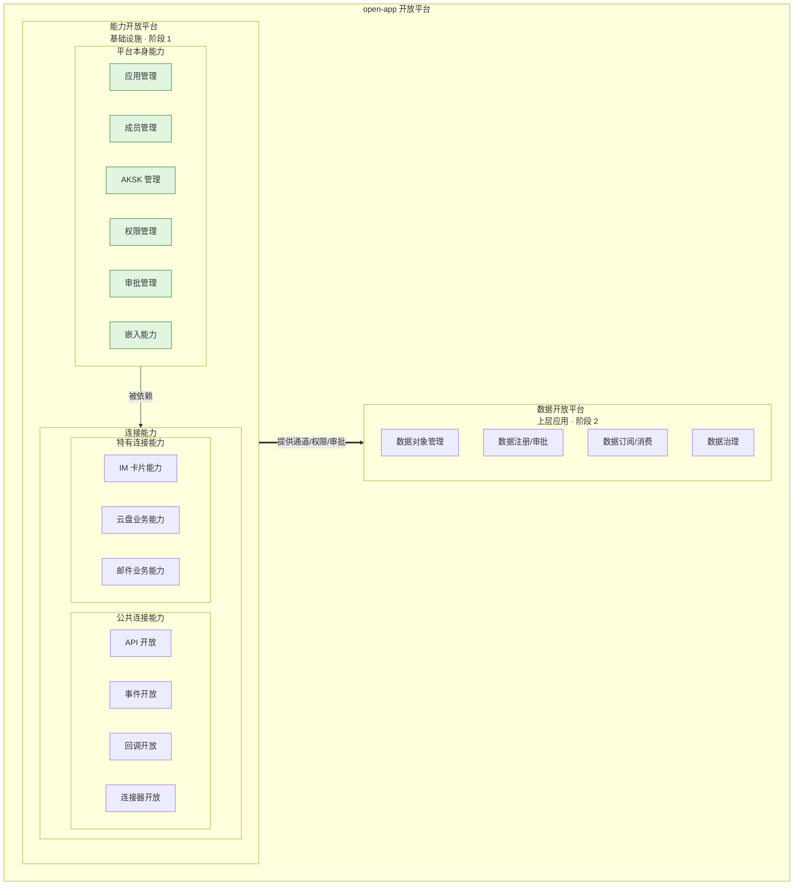

# open-app 项目全景 — 全景入口

> **文档定位**: sddu-docs-overview — 本级全景入口
> **输出文件名**: docs-overview.md
> **数据来源**: 业务架构聚合（specs-tree-root 设计文档）+ 代码扫描设计真相（40 表 / 184 API）
> **创建时间**: 2026-08-03
> **版本**: v2.0 (BIZ-ARCH)
> **更新说明**: 业务视角重建 — 以能力开放平台业务架构为骨架

---

## 1. 业务全景

### 1.1 核心定位

**open-app** 是**企业通讯能力开放平台**：将 **XXX 通讯系统**的核心能力（IM、Meeting、CloudBox 等）通过 API、事件、回调、连接器等形式开放给企业内业务应用和个人应用。

```
┌─────────────────────────────────────────────────────────────────────┐
│                 open-app 企业通讯能力开放平台                          │
├─────────────────────────────────────────────────────────────────────┤
│                                                                      │
│  资源提供者 (Provider)         能力开放 (API/事件/回调/连接器)          │
│  ┌───────────────┐  ┌───────────────┐        ┌───────────────────┐  │
│  │ IM 即时通讯    │  │ Meeting 会议   │        │  open-app 平台     │  │
│  │ CloudBox 云盘 │  │ Calendar 日历  │  ───►  │  (本全景)          │  │
│  │ Contact 通讯录│  │ Mail 邮件     │        │                   │  │
│  │ Drive 文档    │  │ Bot 机器人    │        │                   │  │
│  └───────────────┘  └───────────────┘        └─────────┬─────────┘  │
│                                                         │ 能力消费   │
│                                                         ▼           │
│  资源使用者 (Consumer)                                                 │
│  ┌───────────────┐  ┌───────────────┐  ┌───────────────┐           │
│  │ 业务应用 A     │  │ 业务应用 B     │  │ 外部系统       │           │
│  │ (CRM 系统)     │  │ (OA 系统)      │  │ (第三方)       │           │
│  └───────────────┘  └───────────────┘  └───────────────┘           │
│                                                                      │
└─────────────────────────────────────────────────────────────────────┘
```

### 1.2 能力地图（业务视角）

> 来源：能力开放平台 discovery-report §3.2 能力分类模型。open-app 平台 = **能力开放平台（基础设施）** + **数据开放平台（上层应用）**。



**能力清单**（对应 specs-tree-root Feature）：

| 分类 | 能力 | specs-tree Feature | 状态 |
|------|------|-------------------|------|
| 平台本身能力 · 基础能力 | 应用管理 | specs-tree-app-list（开放平台应用管理） | ✅ spec v6.5 + plan |
| 平台本身能力 · 基础能力 | 成员管理 | specs-tree-app-list（应用管理内） | ✅ 同上 |
| 平台本身能力 · 基础能力 | AKSK 管理 | 能力开放平台（凭证管理） | ✅ validated |
| 平台本身能力 · 基础能力 | 权限管理 | specs-tree-capability-open-platform | ✅ validated |
| 平台本身能力 · 基础能力 | 审批管理 | specs-tree-capability-open-platform | ✅ validated |
| 平台本身能力 · 基础能力 | 嵌入能力 | specs-tree-ability-embedding | 🟡 planned（58%） |
| 连接能力 · 公共连接能力 | API 开放 | specs-tree-capability-open-platform | ✅ validated |
| 连接能力 · 公共连接能力 | 事件开放 | specs-tree-capability-open-platform | ✅ validated |
| 连接能力 · 公共连接能力 | 回调开放 | specs-tree-capability-open-platform | ✅ validated |
| 连接能力 · 公共连接能力 | 连接器开放 | specs-tree-connector-platform (V1/V3) | ✅ validated |
| 连接能力 · 特有连接能力 | IM 卡片 / 云盘 / 邮件 | 业务模块构建，经嵌入能力接入 | 由业务模块建设 |
| 上层应用 · 阶段 2 | 数据开放平台 | specs-tree-data-open-platform | 🟡 suspended（搁置） |
| 基础数据支撑 | 数据字典 | specs-tree-dictionary | ✅ planned |
| 基础数据支撑 | LookUp 管理 | specs-tree-lookup | ✅ planned |

### 1.3 业务域组织

```
open-app 项目全景
├── 能力开放平台/        # 业务域 1：基础设施（阶段 1）— 平台本身能力 + 连接能力 + 基础数据
│   ├── docs-overview.md
│   ├── 应用管理.md      # 基础能力（含成员管理、AKSK、应用版本）
│   ├── 权限中心.md      # 基础能力（权限资源创建与关联）
│   ├── 审批管理.md      # 基础能力（动态审批流引擎）
│   ├── 嵌入能力.md      # 基础能力（特有连接能力接入的基础支撑）
│   ├── 数据字典.md      # 基础数据支撑
│   ├── LookUp管理.md    # 基础数据支撑
│   ├── API开放.md       # 公共连接能力 R1
│   ├── 事件开放.md      # 公共连接能力 R2
│   ├── 回调开放.md      # 公共连接能力 R3
│   ├── 连接器开放.md    # 公共连接能力 R4（第四种开放形式）
│   └── 数据开放平台.md  # 上层应用（阶段 2，搁置）
├── data.md              # 数据层（40 表，按业务归属标注）
├── api.md               # 全部接口清单（184 端点，按业务能力组织）
├── deploy.md            # 部署信息（拓扑/端口/环境变量）
├── security.md          # 全系统安全模型
├── relation-deps.md     # 服务依赖关系
├── relation-flow.md     # 跨域数据流
├── adr-index.md         # ADR 索引
└── source.md            # 产物溯源
```

> 📖 每个能力文档 = 业务说明（来自 spec/discovery 架构图）+ 设计真相（相关表/API/配置）+ 工程映射（由哪些服务实现）。

---

## 2. 技术全景

### 2.1 服务清单与业务归属

| 服务 | 端口 | 业务角色 | 支撑的业务能力 |
|------|:----:|---------|--------------|
| **open-server** | 18080 | 能力开放平台管理面 | 应用管理/成员/AKSK/权限/审批/API/事件/回调/连接器 CRUD |
| **market-server** | 18083 | 市场管理面 | 数据字典/LookUp/嵌入能力管理/应用审批 |
| **api-server** | 18081 | 消费网关（数据/API） | API 消费网关、用户授权、数据开放 |
| **event-server** | 18082 | 事件/回调网关 | 事件发布、回调触发、SSE/WebSocket |
| **connector-api** | 18180 | 连接流执行引擎 | 连接器开放（编排执行、GraalJS 脚本） |
| **open-flyway** | — | 数据库迁移 | 全部 40 表 DDL |
| **wecodesite** | — | 开发者控制台 | 应用/API/事件/回调/连接器管理前端 |
| **market-web** | — | 市场管理后台 | 审批/LookUp/字典/能力管理前端 |
| **qiankunProject** | — | 微前端容器 | 嵌入能力前端容器 |
| **wecodesiteDemo** | — | 静态演示 | 连接器/流编辑器原型 |

### 2.2 技术栈

| 技术 | 版本 | 用途 |
|------|------|------|
| **Java / Spring Boot** | 3.4.6 / 3.5.14 | 后端 5 服务（Web 4 + WebFlux 1） |
| **MySQL** | 5.7/8.x | 主数据库 `openapp`（192.168.3.155:3306） |
| **Flyway** | flyway-mysql | 数据库迁移（V1~V7 / 40 表） |
| **MyBatis** | 3.x | open-server / api-server / market-server 数据访问 |
| **R2DBC MySQL** | r2dbc-mysql | connector-api 响应式数据访问 |
| **Redis Cluster** | 6 节点（192.168.3.201~206） | 缓存 / 限流令牌桶 / 订阅列表缓存 |
| **GraalJS** | polyglot 24.2.1 | 脚本节点执行（connector-api） |
| **React** | 18.2 | wecodesite / market-web / qiankun 子应用 |
| **qiankun** | 2.10.16 | 微前端框架 |
| **antd** | 4.24 | UI 组件库 |
| **@xyflow/react** | 12.10 | 连接流编排画布（wecodesite） |

### 2.3 服务端口与 context-path

| 服务 | 端口 | context-path | Swagger |
|------|:----:|--------------|---------|
| open-server | 18080 | /open-server | /open-server/swagger-ui.html |
| api-server | 18081 | /api-server | /api-server/swagger-ui.html |
| event-server | 18082 | /event-server | /event-server/swagger-ui.html |
| market-server | 18083 | /market-server | /market-server/swagger-ui.html |
| connector-api | 18180 | /connector-api | /connector-api/swagger-ui.html |

### 2.4 数据库索引（40 表）

> 📖 完整表结构（字段/索引/关联/ER 图）见 [`data.md`](data.md)。表按**业务能力**分组。

| 业务能力 | 包含表 |
|---------|--------|
| **应用管理** | app_t, app_p_t, app_identity_t, app_member_t, app_version_t, app_version_p_t, app_ability_relation_t, eamap_t |
| **嵌入能力** | ability_t, ability_p_t（管理字段 6 个） |
| **资源分类** | v2_category_t, v2_category_owner_t |
| **API 开放** | v2_api_t, v2_api_p_t |
| **事件开放** | v2_event_t, v2_event_p_t |
| **回调开放** | v2_callback_t, v2_callback_p_t |
| **权限/订阅** | v2_permission_t, v2_permission_p_t, v2_subscription_t, v2_user_authorization_t |
| **审批管理** | v2_approval_flow_t, v2_approval_record_t, v2_approval_log_t |
| **连接器开放** | v2_cp_connector_t, v2_cp_connector_version_t, v2_cp_flow_t, v2_cp_flow_version_t, v2_cp_connector_version_ref_t, v2_cp_execution_record_t, v2_cp_execution_step_t |
| **基础数据** | property_t（数据字典）, lookup_classify_t, lookup_item_t, lookup_file_t |
| **基础设施** | operate_log_t, file_t, employee_t, common_file_t |

> 💡 迁移脚本（Flyway V1~V7）仅为工程执行顺序，非 schema 版本号，详见 `data.md` 附录 §12。

### 2.5 部署拓扑

```
┌───────────────────────────── 前端层 ─────────────────────────────┐
│ wecodesite (开发者控制台, qiankun 主应用)                          │
│   ├── qiankun 子应用: sub-app-b(5174) sub-app-c(8082)             │
│   │                   sub-app-d(8083) sub-app-e(5175)             │
│ market-web (市场管理后台)                                          │
│ wecodesiteDemo (静态原型)                                          │
└──────────────┬────────────────────────────────────────────────────┘
               │ HTTP
┌──────────────▼───────────────────── 管理面 (18080/18083) ─────────┐
│ open-server  ── MyBatis ──► MySQL openapp (192.168.3.155:3306)    │
│ market-server ── MyBatis ──► MySQL openapp                         │
│               └── Redis Cluster (192.168.3.201~206)               │
└──────────────┬────────────────────────────────────────────────────┘
               │ 内部调用
┌──────────────▼──────────── 消费网关 ──────────────────────────────┐
│ api-server (18081) ──► MySQL openapp / Redis Cluster              │
│ event-server (18082) ──► Redis                                    │
│   ├── SSE 通道 /sse/connect/{id}                                   │
│   ├── WebSocket 通道 /ws                                          │
│   └── WebHook 回调网关 /gateway/callbacks/invoke                   │
│ connector-api (18180, WebFlux) ── R2DBC ──► MySQL openapp         │
│   ├── 连接流执行 /api/v1/flows/{flowId}/invoke                     │
│   ├── 脚本节点 GraalJS 沙箱                                        │
│   └── Redis Reactive 集群                                          │
└────────────────────────────────────────────────────────────────────┘
```

### 2.6 跨域数据流

| 数据流 | 方向 | 说明 |
|--------|------|------|
| 能力订阅 | open-server → api-server / event-server | 消费方订阅 API/事件/回调后，由网关承载消费 |
| 数据查询 | 三方 → api-server → MySQL | DataQueryController 网关代理数据开放 |
| 连接流执行 | 外部 → connector-api → 下游连接器 | HTTP 触发同步执行编排 DAG |
| 事件发布 | 外部 → event-server → 订阅方 | EventGateway publish → SSE/WebSocket/内部消息 |
| 回调触发 | 外部 → event-server → 订阅方 | CallbackGateway invoke → 消费方 WebHook |
| 脚本引用 | connector-api → GraalJS | 脚本节点执行复杂逻辑 |
| 审批回调 | open-server/api-server → 审批平台 | ApprovalCallback 通知审批结果 |

---

## 3. 设计-实现一致性报告

> 代码扫描 vs specs-tree-root 设计文档（spec.md / plan.md / ADR），检测四类偏差（C1~C4）。

### 3.1 一致性摘要

| 冲突类型 | 数量 | 严重度 |
|---------|:----:|:-----:|
| C1 技术选型漂移 | 2 | 中 |
| C2 模块增删 | 1 | 中 |
| C3 API 差异 | 0 | — |
| C4 架构偏离 | 0 | — |

### 3.2 冲突清单

| 冲突类型 | specs-tree 记录 | 代码实际实现 | 建议操作 |
|---------|---------------|------------|---------|
| C1 技术选型漂移 | spec: 连接器平台 V3 使用 **React Flow** 编排画布（@xyflow/react） | wecodesite 依赖含 `@xyflow/react ^12.10.1`（一致）；但 qiankunProject 与 wecodesiteDemo 中存在 **AntV X6 / 独立 HTML 编辑器原型** | 🔧 确认生产编辑器以 @xyflow 为准，原型 HTML 归为演示资产 |
| C1 技术选型漂移 | spec: 数据面认证 **AKSK/OAuth** | api-server 认证头支持 SOA/APIG/AKSK，未发现 OAuth 授权码流程落地；FR-031 用户授权已落地为 `user_authorization` 表 + ScopeController | 🔧 OAuth 流程仅为授权模型，实际以 AKSK/SOA 凭证为主 |
| C2 模块增删 | spec: 连接器平台 V1 编排层 3 节点（触发器/连接器/数据输出），V3 新增脚本节点 | 代码 connector-api 支持 trigger/connector/script/parallel/exit 5 类节点，**数据输出节点并入 exit** | 🔧 更新 spec 或确认 exit 承载数据输出职责 |

### 3.3 结论

代码实现与设计文档整体一致，未发现阻塞性偏差。存在 3 处需人工确认的差异（C1×2、C2×1），建议由设计团队裁决是否更新 specs-tree 基线。

---

## 4. 目录导航

| 文档 | 说明 |
|------|------|
| `能力开放平台/docs-overview.md` | 能力开放平台域入口（基础设施） |
| `能力开放平台/应用管理.md` | 应用/成员/AKSK/版本管理 |
| `能力开放平台/权限中心.md` | 权限资源创建与关联 |
| `能力开放平台/审批管理.md` | 动态审批流引擎 |
| `能力开放平台/嵌入能力.md` | 特有连接能力接入基础支撑 |
| `能力开放平台/数据字典.md` | 基础数据支撑 |
| `能力开放平台/LookUp管理.md` | 基础数据支撑 |
| `能力开放平台/API开放.md` | 公共连接能力 R1 |
| `能力开放平台/事件开放.md` | 公共连接能力 R2 |
| `能力开放平台/回调开放.md` | 公共连接能力 R3 |
| `能力开放平台/连接器开放.md` | 公共连接能力 R4（第四种开放形式） |
| `能力开放平台/数据开放平台.md` | 上层应用（阶段 2，搁置） |
| `data.md` | 全部 40 张表结构（字段/索引/关联） |
| `api.md` | 全部接口清单（184 端点，按业务能力组织） |
| `deploy.md` | 部署信息（拓扑/端口/环境变量） |
| `security.md` | 全系统安全模型 |
| `relation-deps.md` | 服务依赖关系 |
| `relation-flow.md` | 跨域数据流 |
| `adr-index.md` | ADR 索引 |
| `source.md` | 产物溯源（扫描信息源） |

---

## 修订记录

| 版本 | 变更说明 | 日期 | 修订人 |
|------|---------|------|--------|
| v2.0 | 业务视角重建：以能力开放平台业务架构为骨架，能力文档平铺，工程降级为映射信息 | 2026-08-03 | SDDU Docs Agent |
| v1.0 | 代码扫描全量生成（工程视角） | 2026-08-03 | SDDU Docs Agent |
