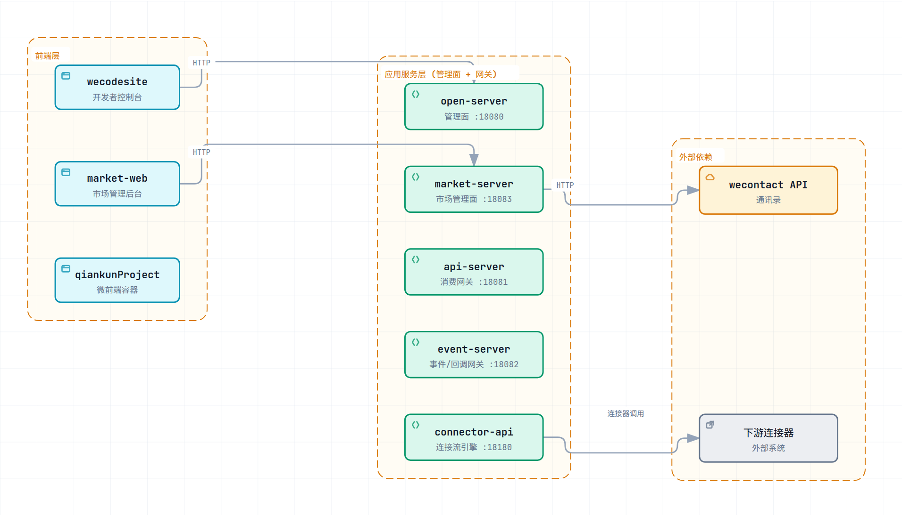
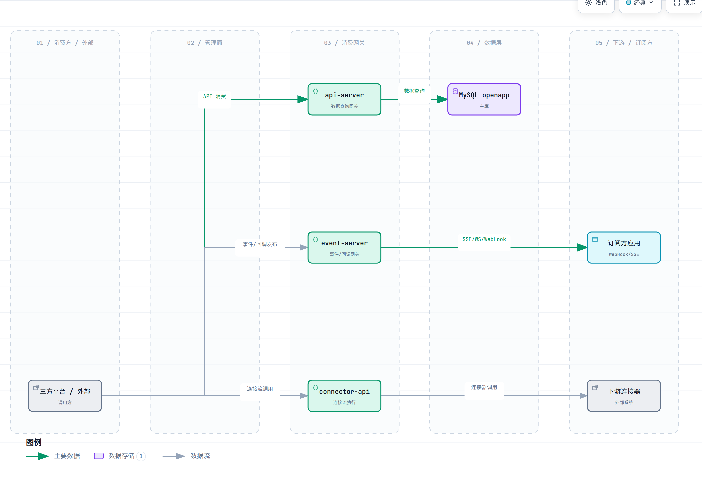

# open-app — 依赖关系

> **文档定位**: sddu-docs-relation-deps — 描述本级组件之间的调用依赖关系，含调用方、被调用方、调用类型和依赖方向  
> **输出文件名**: relation-deps.md  
> **数据来源**: 代码扫描生成 — 各服务调用关系 + 配置  
> **创建人**: SDDU Docs Agent  
> **创建时间**: 2026-08-03  
> **版本**: v1.0 (CODE-SCAN)  

## 1. 服务级依赖关系

| 调用方 | 被调用方 | 调用类型 | 依赖方向 | 说明 |
|--------|---------|:------:|:-------:|------|
| **wecodesite** | open-server | HTTP REST | → | 开发者控制台 → 管理面 |
| **wecodesite** | connector-api | HTTP REST | → | 编排调试/执行 |
| **wecodesite** | event-server | HTTP REST/SSE | → | 事件/回调管理 |
| **market-web** | market-server | HTTP REST | → | 市场管理 |
| **qiankunProject** | open-server | HTTP REST | → | 嵌入能力 |
| **api-server** | MySQL openapp | JDBC (MyBatis) | → | 数据查询 |
| **api-server** | open-server | HTTP 内部 | → | 订阅/权限同步 |
| **event-server** | api-server | HTTP 内部 | → | 认证凭证获取（getApiServerCredential） |
| **event-server** | Redis | Lettuce | → | 订阅缓存 |
| **connector-api** | MySQL openapp | R2DBC | → | 执行记录/版本读取 |
| **connector-api** | Redis | Reactive Lettuce | → | 限流/缓存 |
| **connector-api** | 下游连接器 | HTTP (connector 节点) | → | 连接流调用外部系统 |
| **open-server** | MySQL openapp | JDBC (MyBatis) | → | 主数据 |
| **open-server** | Redis | Lettuce | → | 缓存 |
| **market-server** | MySQL openapp | JDBC (MyBatis) | → | 主数据 |
| **market-server** | wecontact API | HTTP | → | 通讯录 |
| **open-flyway** | MySQL openapp | JDBC (Flyway) | → | 迁移 |

> 📊 **Archify 服务调用依赖关系**



> 🔗 打开可交互版本： [service-deps.html](archify/service-deps.html)

> 📊 **Archify 跨域数据流**



> 🔗 打开可交互版本： [cross-domain.flow.html](archify/cross-domain.flow.html)

## 2. 数据依赖方向

```
wecodesite ──► open-server ──► MySQL
    │              │
    │              └──► Redis
    │
    ├──► connector-api ──► MySQL (R2DBC)
    │        │
    │        └──► Redis Reactive
    │
    └──► event-server ──► Redis
market-web ──► market-server ──► MySQL
api-server ──► MySQL / Redis
event-server ──► api-server（凭证）
```

## 3. 关键耦合点

| 耦合 | 说明 |
|------|------|
| event-server → api-server | 凭证动态获取，api-server 故障影响事件服务启动 |
| connector-api → MySQL R2DBC | 与 MyBatis 服务共享同库，无独立 schema |
| open-server 订阅变更 | 依赖 event-server 缓存清除（手动/内部通知） |
| 微前端 → open-server | 嵌入能力（entry_url/alias_name/route_path）依赖 open-server 能力表 |

---

## 修订记录

| 版本 | 变更说明 | 日期 | 修订人 |
|------|---------|------|--------|
| v1.0 | 代码扫描全量生成 | 2026-08-03 | SDDU Docs Agent |
