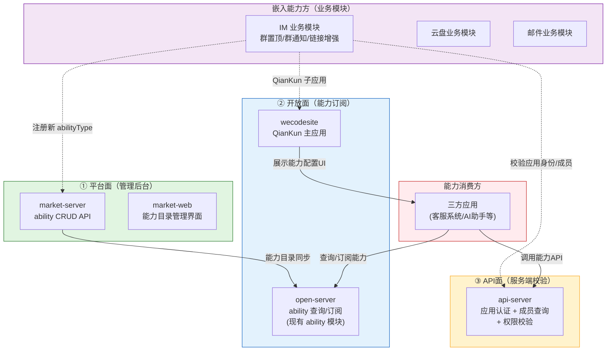

# 问题挖掘报告：狭义嵌入能力

> **文档定位**: SDDU 问题挖掘报告 — 记录"狭义嵌入能力"的用户问题、痛点和场景，作为 spec 阶段的输入  
> **前置依赖**: 能力开放平台 CAP-OPEN-001（独立但关联）  
> **创建人**: SDDU Discovery Agent  
> **创建时间**: 2026-07-13  
> **版本**: v1.0  
> **更新人**: SDDU Discovery Agent  
> **更新时间**: 2026-07-13  
> **更新说明**: 初始创建

## 1. 问题定义
> 概括核心问题及其业务影响，回答"为什么需要关注"

| 核心问题 | 业务影响 | 不解决的成本 |
|---------|---------|------------|
| 业务模块（IM、云盘、邮件等）的特有连接能力缺乏标准化的嵌入机制，每个能力方自行对接，无统一流程、无前端规范、无后端复用 | 特有连接能力无法被三方平台高效地发现和订阅，能力生态建设受阻；能力方各自重复建设，开发成本和维护成本高 | 能力对接继续依赖人工开发，效率低、成本高，无法规模化；能力方各自为政，治理失控，技术债务持续累积 |
| 现有 open-server `ability` 模块预置 7 种能力类型（群置顶、群通知等），但能力方无法注册新的能力类型，扩展性受限 | 业务模块新增能力必须由平台方硬编码，迭代周期长，无法满足业务快速变化需求 | 平台成为瓶颈，业务创新受阻，对比飞书/钉钉等竞品开放程度落后 |

### 1.1 架构全景

> 💡 **三层架构说明**：
> - **① 平台面（market）**：嵌入能力方在此注册新的 abilityType（名称/描述/图标/前端入口URL/排序），由市场后台管理能力目录
> - **② 开放面（open + wecodesite）**：开放面提供能力查询和订阅能力，嵌入能力方通过 QianKun 微前端将 UI 嵌入 wecodesite
> - **③ API面（api-server）**：嵌入能力方集成 api-server 接口完成应用身份认证和成员信息校验
> - **紫色虚线**=嵌入能力方需要做的工作；**实线**=平台自身流转

## 2. 用户画像
> 描述受影响用户角色及其场景，回答"谁遇到了什么问题"

| 用户角色 | 典型场景 | 关键痛点（用户原话） | 当前应对方式 |
|---------|---------|-------------------|------------|
| **嵌入能力方**（业务模块负责人，如 IM 模块 Owner） | 需要将"群置顶服务""链接增强"等特有连接能力嵌入开放平台，供三方应用订阅使用 | "不知道要提供什么、怎么接入开放平台，没有标准流程可以参考" | 自行对接，口口相传，缺乏规范文档和工具链 |
| **嵌入能力方前端**（业务模块前端开发者） | 需要在 wecodesite 中展示特有连接能力的配置界面 | "每个能力方都要自己搞一套前端，没有统一的嵌入规范" | 自建独立页面，与 wecodesite 风格不一致，维护成本高 |
| **嵌入能力方后端**（业务模块后端开发者） | 需要校验调用方应用身份、成员信息等，以完成特有能力自身的业务逻辑 | "每个能力方都自己对接应用系统和成员系统，重复造轮子" | 各自对接应用管理/成员管理接口，校验逻辑散落在各业务系统 |
| **三方应用开发方** | 在新应用中发现并订阅业务模块的特有连接能力（如群置顶） | "不知道还有这些能力可以用，也不知道怎么订阅" | 只能通过线下渠道了解，缺乏统一目录，与普通 API/事件体验割裂 |

## 3. 问题清单
> 按影响程度分级梳理所有识别到的问题，每项赋予唯一编号 Q-xxx

### 3.1 核心问题
> 影响面大、频率高、用户强烈感知

| ID | 问题描述 | 影响范围 |
|----|---------|---------|
| **Q-001** | **缺乏能力类型注册机制**：当前 `ability` 模块的 7 种能力类型由平台预置在 `AbilityTypeEnum` 中硬编码，业务模块无法自行注册新的能力类型。能力方要嵌入新能力必须等待平台方修改代码，流程缓慢。 | 所有嵌入能力方（IM、云盘、邮件等），制约能力生态扩展 |
| **Q-002** | **前端嵌入无规范**：wecodesite 已具备 QianKun 微前端基础，但缺乏"能力方前端嵌入"的标准流程。能力方不知道需要在 `microApps.js` 中注册什么、生命周期如何对接、菜单如何集成。 | 所有嵌入能力方前端开发者，每次嵌入需要自行调研 qiankun 接入方式 |
| **Q-003** | **后端校验逻辑重复建设**：每个嵌入能力方都需要校验调用方的应用身份、成员信息、权限等业务逻辑，目前各自对接应用管理系统，无统一的服务端接口可复用。api-server 已存在但未对嵌入能力方提供标准化的应用+成员查询接口。 | 所有嵌入能力方后端，每次嵌入需要重复对接应用/成员系统 |
| **Q-004** | **缺乏统一治理能力**：能力嵌入后，平台无法统一追踪使用情况（哪些应用订阅了什么能力、活跃度如何）。订阅记录仅在 `openplatform_app_ability_relation_t` 表中，无使用统计和分析。 | 平台管理员，无法评估能力价值和优化方向 |

### 3.2 次要问题
> 影响面中等、或为核心问题的衍生问题

| ID | 问题描述 | 影响范围 |
|----|---------|---------|
| **Q-005** | **market-server 缺乏 ability CRUD 能力**：平台管理面（market-server/market-web）尚无 ability 类型的管理界面，平台管理员无法通过后台管理能力目录（新增、编辑、排序、上下架能力类型）。 | 平台管理员，需要直接在数据库操作能力类型 |
| **Q-006** | **能力注册后缺乏与已有系统联动的扩展点**：`AbilityServiceImpl.autoSubscribeAfterAbility()` 为空实现，能力订阅后未自动关联对应的 API/事件权限，能力消费链路断裂。`subscribe` 与 `grant permission` 两阶段未打通。 | 能力消费方订阅能力后，还需单独申请 API/事件权限，体验割裂 |
| **Q-007** | **能力类型注册信息模型不完整**：当前 `Ability` 实体已有中英文名称、描述、排序、状态、图标/示意图等字段。但要支撑"注册新的能力类型"，需要补充**微前端入口URL**字段，以关联能力方提供的 QianKun 子应用。 | 嵌入能力方注册时无法录入前端入口，前端嵌入无法自动化关联 |

### 3.3 潜在问题
> 目前影响小但可能恶化，或信息不足待验证

| ID | 问题描述 | 影响范围 |
|----|---------|---------|
| **Q-008** | **QianKun 子应用入口标准化**：当前 wecodesite（主应用）和 qiankunProject（独立的另一套）各有 QianKun 配置。嵌入能力方应该使用哪套基座？能力方子应用的命名规范、entry 格式、`activeRule` 路由规则需要标准化。 | 嵌入能力方前端开发者，需进一步调研 wecodesite 与 qiankunProject 的关系 |
| **Q-009** | **能力生命周期管理**：能力类型注册后，是否支持下架、废弃、版本更新？当前 MVP 聚焦注册和嵌入机制，生命周期管理（下架通知、灰度发布等）未在范围。 | 长期治理需求，MVP 可后置 |
| **Q-010** | **能力与已有 API/Event 权限模型的融合**：已有 `permission` 模块管理 API/事件/回调权限，狭义 ability 通过 `autoSubscribeAfterAbility` 扩展点预留了桥接位置。但具体的权限映射规则（一个 abilityType 对应哪些 scope）尚未定义。 | 需要与 CAP-OPEN-001 的权限模型对齐 |

## 4. 竞品参考
> 记录竞品对类似问题的处理方式，回答"别人怎么做的、我们有什么不同"

| 竞品 | 是否处理过类似问题 | 处理方式 | 与我们场景的差异 |
|------|-------------------|---------|----------------|
| **飞书开放平台** | 是 | 飞书提供"应用能力"概念，开发者可在开放平台注册应用并选择需要的能力模块（如消息、日历、云文档等）。能力模块通过 SDK 方式嵌入，有统一的应用管理后台和权限审批流程。 | 飞书的能力模块是平台预置的，开发者只能选择开启/关闭，不能注册新的能力类型。我们的场景更灵活——业务模块可以注册新的连接能力。 |
| **钉钉开放平台** | 是 | 钉钉提供"接口权限"管理，应用需要申请接口权限才能调用对应 API。特有能力（如审批、考勤）作为独立服务包提供，需要单独开通。 | 钉钉的能力以"接口权限"粒度管理，而非"能力类型"粒度。我们的"狭义嵌入能力"更接近应用层面的功能模块封装，而非单接口级别的权限控制。 |
| **Shopify App Bridge** | 是 | Shopify 提供 App Bridge 作为应用嵌入商家后台的标准化方案，支持 UI 扩展点（如导航菜单、页面嵌入）、API 封装、身份验证。嵌入方提供配置即可接入。 | Shopify 是 SaaS 电商平台，场景与我们的企业通讯平台不同。但其"UI 扩展点 + 标准化 API"的架构值得参考。 |

## 5. 假设与风险
> 记录问题挖掘过程中识别的假设和风险，供后续阶段验证和关注

### 5.1 关键假设
> 记录我们对问题理解所基于的假设，标注待验证项

| # | 假设内容 | 验证方式 |
|---|---------|---------|
| A-001 | 业务模块（IM、云盘、邮件等）有能力开放并嵌入平台的意愿，且愿意投入前端+后端资源 | 与业务模块负责人确认，选取 IM 模块作为首个试点 |
| A-002 | wecodesite（QianKun 主应用）可以承载多个嵌入能力方的子应用，且性能可接受（同时挂载多个子应用） | 前端团队调研验证 QianKun 多子应用场景的性能和稳定性 |
| A-003 | api-server 现有的应用认证+成员查询能力可以封装为标准接口供应能力方使用 | 分析 api-server 现有接口，评估是否需要新增或扩展现有接口 |
| A-004 | 简单注册（无审批流）对于能力类型注册的治理风险可控 | 在 spec 阶段定义注册信息的校验规则和治理边界 |

### 5.2 主要风险
> 识别可能影响问题判断或后续决策的风险因素

| # | 风险描述 | 影响程度 |
|---|---------|---------|
| R-001 | wecodesite 与 qiankunProject 两套 QianKun 基座的关系不明确，可能导致嵌入能力方不知道该注册到哪套系统 | 高 |
| R-002 | 能力类型编码（abilityType）的设计：当前使用 int 枚举，扩展新类型时 ID 分配策略未定义，可能出现冲突 | 中 |
| R-003 | 嵌入能力方的前端子应用需要与 wecodesite 保持 UI/UX 一致性，缺乏设计规范可能导致体验割裂 | 中 |
| R-004 | 当前 `ability` 模块的表结构（`openplatform_ability_t`）缺少"前端入口 URL"字段，需要数据库迁移 | 低 |

## 6. 下一步建议
> 给出后续工作的优先级建议，回答"接下来优先做什么"

| 优先级 | 事项 | 说明 |
|--------|------|------|
| 高 | **先跑通一个嵌入能力方的全流程** | 选取 IM 模块（如"群置顶服务"）作为试点，从市场端注册→开放端订阅→前端嵌入→服务端校验走通全流程，验证框架可行性 |
| 高 | **明确三层架构的接口契约** | 规范 market-server ↔ open-server ↔ api-server 之间关于"狭义嵌入能力"的接口定义与数据模型 |
| 高 | **标准化嵌入流程文档** | 输出嵌入能力方的接入指南：① market 注册能力类型 ② wecodesite 注册 QianKun 子应用 ③ api-server 对接应用/成员校验 |
| 中 | **调研 wecodesite 与 qiankunProject 的关系** | 明确两个 QianKun 基座的定位差异，确定嵌入能力方应该用哪个基座 |
| 中 | **设计 abilityType 扩展策略** | 定义新能力类型的 ID 分配机制，是自增、UUID 还是业务编码 |
| 中 | **分析 api-server 现有接口** | 梳理 api-server 现有认证/成员/权限接口，识别需要新增或扩展的部分 |

## 修订记录
> 记录本文档的版本变更历史

| 版本 | 变更说明 | 日期 | 修订人 |
|------|---------|------|--------|
| v1.0 | 初始创建 | 2026-07-13 | SDDU Discovery Agent |
