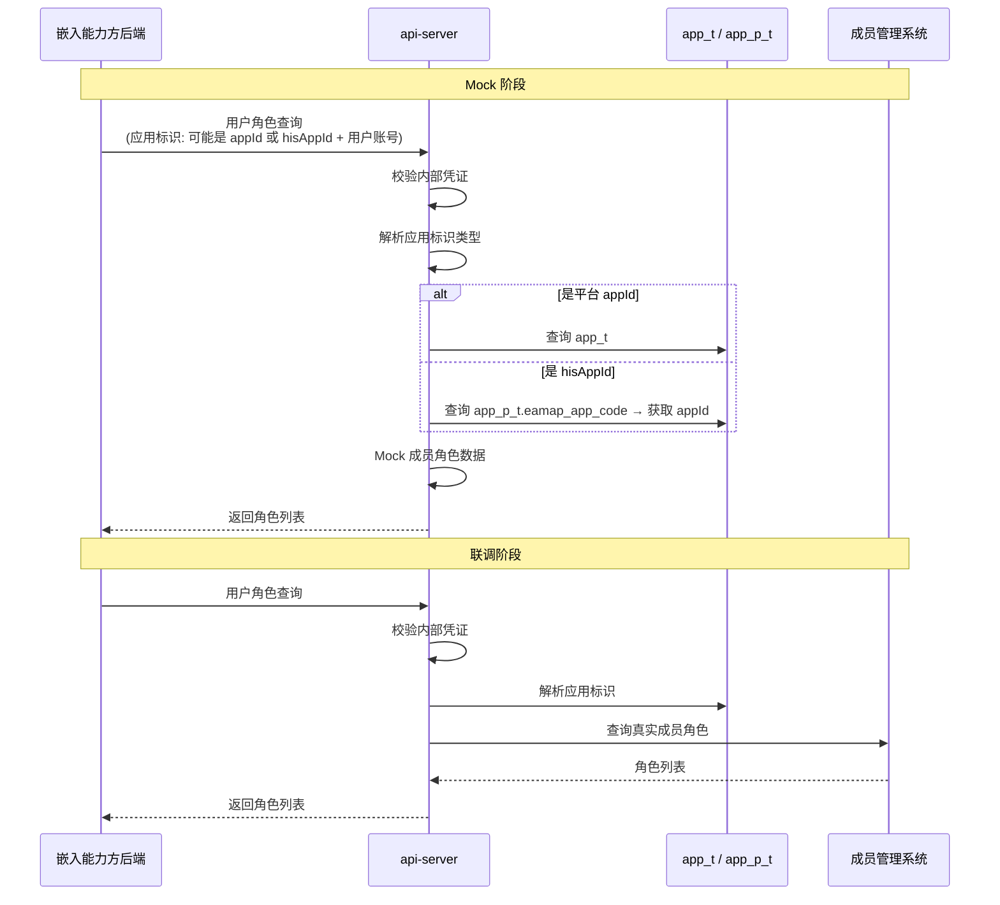
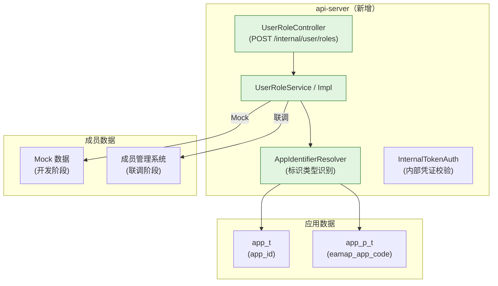

# 技术规划：嵌入能力API面

**Feature ID**: EMBED-API-001  
**规划版本**: v1.0  
**创建日期**: 2026-07-13  
**规划作者**: SDDU Plan Agent  
**规范版本**: spec.md v1.2

---

## 1. 架构分析

### 1.1 现有架构影响

**api-server 现有组件**：

| 组件 | 现状 | 影响 |
|------|------|------|
| `ApplicationService` | 接口：`getAppIdByAk(ak)`、`verifyApplication(appId, authType, authCredential)` | 当前与角色查询无关，考虑扩展或新建独立 Service |
| `ApplicationServiceMockImpl` | Mock 实现（AK→appId 模拟映射） | 角色查询 Mock 实现可参考此模式 |
| `ApiGatewayController` | 应用认证网关（已有内部凭证概念） | 接口鉴权可参考其内部凭证模式 |
| `ScopeController` | 用户授权管理（scope 授权） | 角色查询与之不同，新建独立 Controller |
| 成员管理 | 不存在 | 需新建：成员角色查询接口 + Mock 数据 |

**关键影响分析**：

应用标识需要支持两种类型（平台 `appId` 和 `hisAppId` 外部编码），意味着需要：
1. 一种识别策略：传入的应用标识是哪种类型？
2. 一种解析机制：将两种标识统一解析为内部应用标识
3. 角色查询：基于内部应用标识查询用户角色

当前 `app_t` 和 `app_p_t` 表在哪个服务？需要确认 api-server 是否可访问这些表。如果不可直接访问，则需通过 open-server 或其他服务代理。

> **假设**：api-server 可直连 `app_t` 和 `app_p_t` 表（或通过通用服务接口获取应用信息）。如果不可直连，则 API 面需新增一个代理层。

实际情况 api-server 已有 `ApplicationService` 接口，说明它已有对接应用系统的能力（目前为 Mock）。

### 1.2 新增组件

| 组件 | 说明 | 所属模块 |
|------|------|---------|
| `UserRoleController` | 用户角色查询接口 | api-server 新模块 |
| `UserRoleService` / `UserRoleServiceImpl` | 角色查询业务逻辑 | api-server 新模块 |
| `UserRoleRequest` | 请求 DTO（appId + userAccount） | api-server 新模块 |
| `UserRoleResponse` | 响应 DTO（角色列表） | api-server 新模块 |
| `AppIdentifierResolver` | 应用标识解析器（判断是平台 appId 还是 hisAppId | api-server 新模块 |
| `InternalTokenFilter` 或拦截器 | 内部凭证校验过滤器 | api-server（可能复用现有） |

### 1.3 数据流

### 1.4 依赖关系

## 2. 方案对比

### 方案 A：独立 UserRoleController + 策略切换（推荐）

**描述**：新建一个专用于嵌入能力方的 UserRoleController，接口路径 `/internal/` 前缀，内部凭证鉴权，Service 层支持 Mock/Real 策略切换。

| 维度 | 评价 |
|------|------|
| 优点 | 接口独立，不耦合现有代码；Mock/Real 切换灵活；路径前缀标识内部接口清晰 |
| 缺点 | 需要从零搭建 Controller + Service |
| 风险评估 | 低——单接口，逻辑简单 |

### 方案 B：扩展现有 ScopeController

**描述**：在 `ScopeController`（授权管理）中新增角色查询接口。

| 维度 | 评价 |
|------|------|
| 优点 | 代码复用；Scope 与用户角色有一定关联 |
| 缺点 | Scope 授权 与 角色查询 职责不同（Scope=权限范围，Role=角色）；接口混杂不利于后期维护 |
| 风险评估 | 中——职责混淆 |

## 3. 推荐方案

**选择方案 A**：新建独立 UserRoleController。

理由：
1. 单一职责——角色查询接口职责清晰
2. 内部接口路径（`/internal/`）与对外接口分离
3. 未来可扩展批量/其他场景而不影响现有接口
4. 应用标识解析器（AppIdentifierResolver）可复用，支持后续更多接口

## 4. 文件影响分析

### 新增文件

| 文件 | 说明 |
|------|------|
| `api-server/.../internal/controller/UserRoleController.java` | 用户角色查询控制器 |
| `api-server/.../internal/service/UserRoleService.java` | 角色查询业务接口 |
| `api-server/.../internal/service/impl/UserRoleServiceMockImpl.java` | Mock 实现 |
| `api-server/.../internal/service/impl/UserRoleServiceRealImpl.java` | 真实实现（联调阶段） |
| `api-server/.../internal/dto/UserRoleQueryRequest.java` | 请求 DTO |
| `api-server/.../internal/dto/UserRoleQueryResponse.java` | 响应 DTO |
| `api-server/.../internal/resolver/AppIdentifierResolver.java` | 应用标识解析器 |
| `api-server/.../internal/resolver/AppIdentifier.java` | 标识类型枚举（PLATFORM_ID / HIS_APP_ID） |
| `api-server/.../internal/auth/InternalTokenFilter.java` | 内部凭证校验过滤器/拦截器 |
| `api-server/.../internal/config/InternalAuthConfig.java` | 内部凭证配置（yml 映射） |

### 修改文件

| 文件 | 修改内容 |
|------|---------|
| `api-server/.../common/service/ApplicationService.java` | 可能不需要修改（独立 Service） |
| `api-server/src/main/resources/application.yml` | 新增 internal-token、mock/real 开关配置 |

## 5. 风险评估

| 风险 | 影响 | 缓解措施 |
|------|------|---------|
| app_t / app_p_t 表不在 api-server schema 中 | 无法直接解析应用标识 | 通过现有 ApplicationService 接口代理查询，或通过 open-server 服务间调用 |
| 成员管理系统无标准化角色查询接口 | 联调阶段对接困难 | 先以 Mock 数据交付开发，联调阶段根据实际接口适配 |
| 内部凭证管理无管理界面 | 凭证维护不灵活 | MVP 阶段配置在 yml 中，后续增量 |

## 6. ADR

### ADR-001: 新建独立 UserRoleController 而非扩展现有 ScopeController

**状态**: ACCEPTED

**背景**：
- 用户角色查询是 API 面新增的能力，与现有的 Scope 授权管理职责不同
- 接口使用 `/internal/` 前缀，与对外接口分离

**决策**：
新建 `UserRoleController`（包路径：`.../internal/controller/`），专用于嵌入能力方的服务端校验接口。

**后果**：
- 正面：职责单一、路径清晰、可独立演化和测试
- 负面：少量重复代码（如内部凭证校验逻辑需与其他内部接口保持一致）

### ADR-002: 应用标识解析采用识别器模式

**状态**: ACCEPTED

**背景**：
- 输入的应用标识可能是平台 `appId`（`app_t.app_id`）或 hisAppId（`app_p_t.eamap_app_code`）
- 系统需要自动判断类型并解析为内部应用标识

**决策**：
创建 `AppIdentifierResolver` 组件：
1. 先尝试按 `appId` 查 `app_t`，匹配到则类型为平台ID
2. 匹配不到则按 `eamap_app_code` 查 `app_p_t`，匹配到则类型为外部编码
3. 都匹配不到则返回"应用不存在"
最终统一为内部 `appId` 后查询角色。

**后果**：
- 正面：调用方无需关心应用标识类型，接口统一
- 负面：查询需要两次 DB 尝试（可优化为先加标识前缀判断逻辑）

---

## 7. 产物审查策略

| 审查产物 | 审查基准 |
|---------|---------|
| build.md | spec.md（规范基准） |
| UserRoleController.java | 接口参数校验、内部凭证校验、错误处理 |
| UserRoleServiceImpl | Mock/Real 切换逻辑 |
| AppIdentifierResolver | 两种标识类型的识别和解析逻辑 |
| InternalTokenFilter | 凭证校验机制 |

## 8. 产物验证策略

| 验证产物 | 验证基准 |
|---------|---------|
| 用户角色查询接口 | 输入不同 appId/hisAppId + userAccount → 返回角色列表 |
| 应用标识解析 | 平台 appId 和 hisAppId 均可正常解析 |
| 内部凭证鉴权 | 无凭证/无效凭证拒绝访问 |
| Mock 数据 | 返回预设固定结构，确保开发不阻塞 |
| 边界条件 | 不存在的应用返回"应用不存在"；用户无角色返回空列表 |
