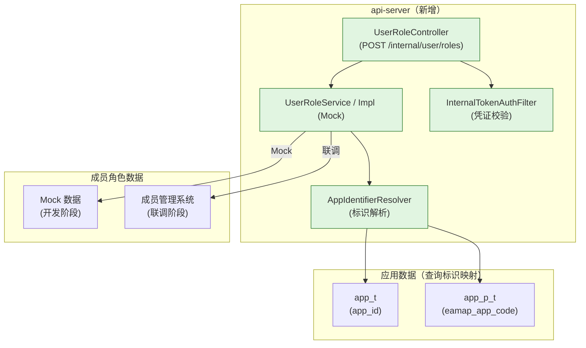
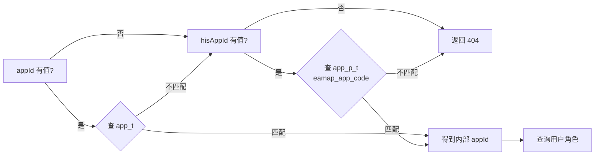
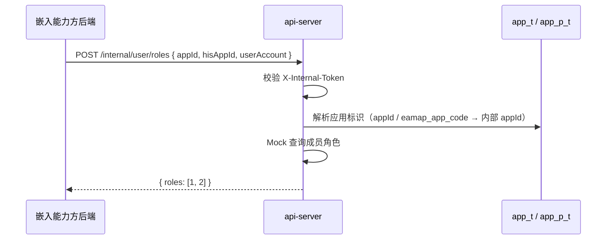

# 技术规划：嵌入能力API面

**Feature ID**: EMBED-API-001  
**规划版本**: v1.0  
**创建日期**: 2026-07-13  
**规划作者**: SDDU Plan Agent  
**规范版本**: spec.md v1.2

---

## 1. 架构分析

### 1.1 现有架构影响

**api-server 现有组件**：

| 组件 | 现状 | 影响 |
|------|------|------|
| `ApplicationService` | 接口：`getAppIdByAk(ak)`、`verifyApplication(appId, authType, authCredential)` | 当前与角色查询无关，需新建独立 Service |
| `ApplicationServiceMockImpl` | Mock 实现 | 角色查询 Mock 实现可参考此模式 |
| `ApiGatewayController` | 应用认证网关（已有内部凭证概念） | 内部凭证校验可参考其模式 |
| `ScopeController` | 用户授权管理 | 角色查询与之不同，新建独立 Controller |
| 成员角色查询 | 不存在，但 open-server 已有 `AppMember` 实体（`openplatform_app_member_t`）和成员管理服务 | 需新建角色查询接口，复用现有成员数据结构 |

**关键影响**：

应用标识需要支持两种类型（平台 `appId` 和外部 `hisAppId`），需要：
1. 标识解析器：判断传入的应用标识是哪种类型
2. 角色查询：基于解析后的内部 `appId` 查询用户角色

> **假设**：api-server 可直连 `app_t` 和 `app_p_t` 表查询应用标识映射。如不可直连，则通过现有 `ApplicationService` 接口代理。

### 1.2 新增组件

| 组件 | 说明 | 所属模块 |
|------|------|---------|
| `UserRoleController` | 用户角色查询控制器 | api-server 新模块 |
| `UserRoleService` / `UserRoleServiceImpl` | 角色查询业务（Mock 实现） | api-server 新模块 |
| `UserRoleQueryRequest` | 请求 DTO（appId/hisAppId + userAccount） | api-server 新模块 |
| `UserRoleQueryResponse` | 响应 DTO（角色列表） | api-server 新模块 |
| `AppIdentifierResolver` | 应用标识解析器 | api-server 新模块 |
| `InternalTokenAuthFilter` | 内部凭证校验过滤器 | api-server 新模块 |

### 1.3 依赖关系



## 2. 数据库设计

### 2.1 应用标识解析（查询）

API 面无独立 DDL，查询以下现有表：

| 表名 | 查询用途 | 关联字段 |
|------|---------|---------|
| `app_t` | 按平台 `app_id` 查找应用 | `app_id` |
| `app_p_t` | 按外部编码 `eamap_app_code`（hisAppId）查找应用 | `eamap_app_code` → `app_id` |

### 2.2 成员角色数据

**已有基础设施**：open-server 已有完整的成员管理模块，相关组件：

| 组件 | 说明 |
|------|------|
| `AppMember` 实体 | 映射表 `openplatform_app_member_t`，字段：appId、accountId（用户账号）、memberType（角色编码）等 |
| `MemberTypeEnum` | 角色枚举：`0=Developer`(开发者)、`1=Owner`(拥有者)、`2=Admin`(管理员)，带优先级排序 |
| `MemberService.getMemberList(appId, curPage, pageSize)` | 按应用查询成员列表及角色 |
| `AppMemberMapper` | MyBatis 映射，支持按 `appId` 查询成员 |

**数据来源策略**：

| 阶段 | 策略 | 说明 |
|------|------|------|
| Mock（开发） | api-server 内置模拟数据 | 不依赖外部服务，独立开发测试 |
| 联调（真实） | 直接查询 `openplatform_app_member_t` 表 或 调用 open-server MemberService | 按 appId + accountId 匹配 `accountId` 字段，取 `memberType` 映射为角色列表 |

> 💡 角色映射：`memberType=1` → 角色编码 `1`(拥有者)、`memberType=2` → `2`(管理员)、`memberType=0` → `0`(开发者)，与 `MemberTypeEnum` 一致

> ⚠️ 前提：需确认 api-server 可直连此表（与 open-server 共享 DB），否则通过 HTTP 调用 open-server 的成员查询接口。

## 3. API设计

### 3.1 设计规范

**基础路径**：`/service/open/v2/internal`

> ⚠️ 该接口仅限内部服务调用，非公开接口。

**认证方式**：内部凭证鉴权（`X-Internal-Token` 请求头），由平台管理员预配置。

**响应格式**：复用 api-server 现有 `ApiResponse` 信封：

```json
// 成功
{
  "code": "200",
  "messageZh": "查询成功",
  "messageEn": "Success",
  "data": {
    "appId": "1234567890123456789",
    "roles": [1, 2]
  },
  "page": null
}

// 凭证无效
{ "code": "401", "messageZh": "内部凭证无效", "messageEn": "Unauthorized", "data": null, "page": null }

// 应用不存在
{ "code": "404", "messageZh": "应用不存在", "messageEn": "Not Found", "data": null, "page": null }
```

**错误码**：

| 错误码 | 说明 |
|--------|------|
| 200 | 成功 |
| 400 | 参数错误 |
| 401 | 内部凭证无效或缺失 |
| 404 | 应用不存在 |

**字段命名**：驼峰命名（camelCase）：

| 字段 | 说明 |
|------|------|
| `appId` | 平台应用ID |
| `hisAppId` | 外部应用编码 |
| `userAccount` | 用户账号 |
| `roles` | 角色列表 |

**策略切换**：

| 阶段 | 策略 | 说明 |
|------|------|------|
| 开发 | Mock | 内置模拟角色数据 |
| 联调 | 真实接口 | 对接成员管理系统 |

### 3.2 接口清单

| # | 方法 | 路径 | 接口名称 | 对应 FR | 说明 |
|---|--------|------|---------|:------:|------|
| 1 | POST | `/internal/user/roles` | 查询用户角色 | FR-001 | 输入应用标识+用户账号，返回角色列表 |

### 3.3 接口详细定义

---

#### #1 查询用户角色

`POST /service/open/v2/internal/user/roles`

**请求头**

| 字段 | 类型 | 必填 | 说明 |
|------|------|:--:|------|
| X-Internal-Token | string | ✅ | 内部服务凭证，由平台管理员预配置 |

**请求体**

| 字段 | 类型 | 必填 | 说明 |
|------|------|:--:|------|
| `appId` | string | ⓪ | 平台应用ID（与 hisAppId 至少二选一） |
| `hisAppId` | string | ⓪ | 外部应用编码（与 appId 至少二选一） |
| `userAccount` | string | ✅ | 用户账号 |

> ⓪ = 条件必填：`appId` 和 `hisAppId` 至少传入一个，也可以同时传入（此时优先按 appId 匹配）。

**响应体 `data`**

| 字段 | 类型 | 说明 |
|------|------|------|
| appId | string | 解析后的内部应用ID |
| roles | integer[] | 用户在应用中的角色编码列表，可选值：`0`(开发者) / `1`(拥有者) / `2`(管理员)，对应 `MemberTypeEnum` |

**示例**

```json
// 请求头
// X-Internal-Token: xxxxxx

// 请求体（按平台 appId 查询）
{
  "appId": "1234567890123456789",
  "hisAppId": null,
  "userAccount": "zhangsan@xxx.com"
}

// 响应体 200
{
  "code": "200",
  "messageZh": "查询成功",
  "messageEn": "Success",
  "data": {
    "appId": "1234567890123456789",
    "roles": [1, 2]
  },
  "page": null
}

// 请求体（按 hisAppId 查询）
{
  "appId": null,
  "hisAppId": "EAMAP_APP_001",
  "userAccount": "lisi@xxx.com"
}

// 响应体 200
{
  "code": "200",
  "messageZh": "查询成功",
  "messageEn": "Success",
  "data": {
    "appId": "9876543210987654321",
    "roles": [0]
  },
  "page": null
}

// 响应体 401 — 凭证无效
{
  "code": "401",
  "messageZh": "内部凭证无效",
  "messageEn": "Unauthorized",
  "data": null,
  "page": null
}

// 响应体 404 — 应用不存在
{
  "code": "404",
  "messageZh": "应用不存在",
  "messageEn": "Not Found",
  "data": null,
  "page": null
}
```

**错误响应**

| code | 说明 |
|------|------|
| 401 | 内部凭证无效或缺失 |
| 404 | appId 和 hisAppId 均未匹配到有效应用 |

**应用标识解析逻辑**：



**数据流**：



## 4. 方案对比

### 方案 A：独立 UserRoleController + 策略切换（推荐）

**描述**：新建专用于嵌入能力方的 UserRoleController，内部凭证鉴权，Service 层支持 Mock/Real 策略切换。

| 维度 | 评价 |
|------|------|
| 优点 | 接口独立，不耦合现有代码；Mock/Real 切换灵活；路径前缀标识内部接口清晰 |
| 缺点 | 需要从零搭建 Controller + Service |
| 风险评估 | 低——单接口，逻辑简单 |

### 方案 B：扩展现有 ScopeController

**描述**：在 `ScopeController`（授权管理）中新增角色查询接口。

| 维度 | 评价 |
|------|------|
| 优点 | 代码复用 |
| 缺点 | Scope 授权与角色查询职责不同，接口混杂不利维护 |
| 风险评估 | 中——职责混淆 |

## 5. 推荐方案

**选择方案 A**：新建独立 UserRoleController。

理由：
1. 单一职责——角色查询接口职责清晰
2. 内部接口路径（`/internal/`）与对外接口分离
3. 未来可扩展批量/其他场景而不影响现有接口
4. 应用标识解析器（AppIdentifierResolver）可复用，支持后续更多接口

## 6. 文件影响分析

### 新增文件

| 文件 | 说明 |
|------|------|
| `api-server/.../internal/controller/UserRoleController.java` | 用户角色查询控制器 |
| `api-server/.../internal/service/UserRoleService.java` | 角色查询业务接口 |
| `api-server/.../internal/service/impl/UserRoleServiceMockImpl.java` | Mock 实现（开发阶段） |
| `api-server/.../internal/service/impl/UserRoleServiceRealImpl.java` | 真实实现（联调阶段预留） |
| `api-server/.../internal/dto/UserRoleQueryRequest.java` | 请求 DTO |
| `api-server/.../internal/dto/UserRoleQueryResponse.java` | 响应 DTO |
| `api-server/.../internal/resolver/AppIdentifierResolver.java` | 应用标识解析器 |
| `api-server/.../internal/resolver/AppIdentifier.java` | 标识类型枚举 |
| `api-server/.../internal/auth/InternalTokenAuthFilter.java` | 内部凭证校验过滤器 |
| `api-server/.../internal/config/InternalAuthConfig.java` | 内部凭证配置映射 |

### 修改文件

| 文件 | 修改内容 |
|------|---------|
| `api-server/src/main/resources/application.yml` | 新增 internal-token、mock/real 开关配置 |

## 7. 风险评估

| 风险 | 影响 | 缓解措施 |
|------|------|---------|
| app_t / app_p_t 表不在 api-server schema 中 | 无法直接解析应用标识 | 通过现有 ApplicationService 接口代理查询 |
| 成员管理系统标准化角色查询接口 | open-server 已有 `AppMember` + `MemberTypeEnum` | 联调阶段直接查询 `openplatform_app_member_t` 表或调用 open-server 的成员查询接口 |
| 内部凭证管理无管理界面 | 凭证维护不灵活 | MVP 阶段配置在 yml 中，后续增量补充管理 API |

## 8. ADR

### ADR-001: 新建独立 UserRoleController

**状态**: ACCEPTED

**背景**：
- 用户角色查询是 API 面新增的能力，与现有 Scope 授权管理职责不同
- 接口使用 `/internal/` 前缀，与对外接口分离

**决策**：
新建 `UserRoleController`（包路径 `.../internal/controller/`），专用于嵌入能力方服务端校验。

**后果**：
- 正面：职责单一、路径清晰、可独立演化和测试
- 负面：少量重复代码

### ADR-002: 应用标识解析采用识别器模式

**状态**: ACCEPTED

**背景**：
- 输入的应用标识可能是平台 `appId`（`app_t.app_id`）或 hisAppId（`app_p_t.eamap_app_code`）
- 系统需要自动判断类型并完成解析，对调用方透明

**决策**：
创建 `AppIdentifierResolver`：先按 `appId` 查 `app_t` → 匹配不上则按 `eamap_app_code` 查 `app_p_t` → 都未匹配返回 404。

**后果**：
- 正面：调用方不感知标识类型差异，接口统一
- 负面：最坏情况需两次 DB 查询

### ADR-003: 内部凭证鉴权方案

**状态**: ACCEPTED

**背景**：
- 内部接口仅限持有有效内部凭证的服务调用
- 凭证由平台管理员预配置

**决策**：
- MVP 阶段：内部凭证配置在 `application.yml` 中，支持多服务方独立配置
- 实现为 `HandlerInterceptor` 或 `Filter`，拦截 `/internal/` 路径
- 开发阶段可配置 bypass

**后果**：
- 正面：实现简单，MVP 阶段快速可用
- 负面：静态配置，凭证变更需重启服务

---

## 9. 产物审查策略

| 审查产物 | 审查基准 |
|---------|---------|
| build.md | spec.md（规范基准） |
| UserRoleController.java | 接口参数校验、内部凭证校验、错误处理 |
| UserRoleServiceImpl | Mock/Real 切换逻辑 |
| AppIdentifierResolver | 两种标识类型的识别和解析逻辑 |
| InternalTokenAuthFilter | 凭证校验机制 |

## 10. 产物验证策略

| 验证产物 | 验证基准 |
|---------|---------|
| 用户角色查询接口 | 输入不同 appId/hisAppId + userAccount → 返回角色列表 |
| 应用标识解析 | 平台 appId 和 hisAppId 均可正常解析 |
| 内部凭证鉴权 | 无凭证/无效凭证拒绝访问 |
| Mock 数据 | 返回预设固定结构，确保开发不阻塞 |
| 边界条件 | 不存在的应用返回 404；用户无角色返回空列表 |

## 修订记录

| 版本 | 变更说明 | 日期 | 修订人 |
|------|---------|------|--------|
| v1.0 | 初始创建 — API面技术规划 | 2026-07-13 | SDDU Plan Agent |
| v1.1 | 对齐平台面格式：独立数据库设计+API设计章节；接口含设计规范/请求响应/JSON示例/标识解析流程图 | 2026-07-13 | SDDU Plan Agent |
