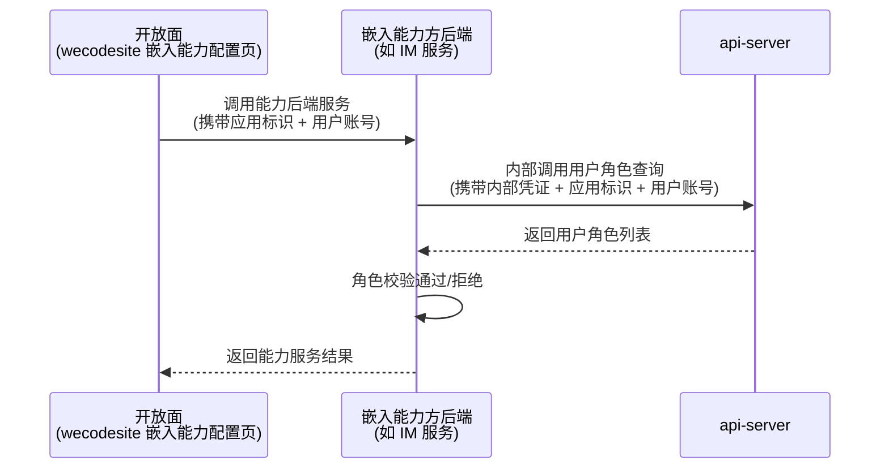

# Feature Specification：嵌入能力API面

> **文档定位**: SDDU 需求规范 — 定义嵌入能力API面的功能需求、非功能需求和边界情况，作为 plan 阶段的输入  
> **前置依赖**: `specs-tree-ability-embedding/discovery-report.md`、`specs-tree-ability-embedding/spec.md`（父规范）  
> **创建人**: SDDU Spec Agent  
> **创建时间**: 2026-07-13  
> **版本**: v1.0  
> **更新人**: SDDU Spec Agent  
> **更新时间**: 2026-07-13  
> **更新说明**: 初始创建

## 1. 元数据
> Feature 基本信息

| 字段 | 值 |
|------|-----|
| Feature ID | EMBED-API-001 |
| 名称 | 嵌入能力API面 |
| 父 Feature | EMBED-001（狭义嵌入能力） |
| 优先级 | P1 |
| 服务端 | api-server |
| 目标版本 | v1.0 |
| 现有基线 | 已有应用认证服务（Mock 实现）、API 网关、用户授权管理 |

## 2. 上下文
> 回顾问题背景和目标用户

本子 Feature 聚焦**为嵌入能力方提供标准化的服务端校验接口**。本期只提供一个核心场景接口。

### 2.1 问题背景

嵌入能力方的配置页面通过微前端嵌入 wecodesite（开放面）后，嵌入能力方需要对操作者进行权限校验。例如：只有应用的管理员才能配置群置顶内容。嵌入能力方需要根据**应用标识**（支持平台应用ID 或外部应用编码 hisAppId）和**用户账号**，查询该用户在应用中的**角色**。

当前现状：
- 每个嵌入能力方各自对接成员管理系统查询角色，重复造轮子
- api-server 尚无标准化的用户角色查询接口供嵌入能力方使用

### 2.2 目标用户

| 角色 | 说明 |
|------|------|
| **嵌入能力方后端**（IM、云盘、邮件等业务模块的后端服务） | 调用 api-server 查询用户在应用中的角色 |
| **平台管理员** | 配置内部凭证、管理接口授权 |

### 2.3 架构关系

## 3. 目标与非目标
> 明确需求范围，防止范围蔓延

### 3.1 目标 (Goals)
> 明确本次要达成的业务目标

| # | 目标描述 |
|---|---------|
| G-001 | 嵌入能力方可查询用户在应用中的角色（输入应用标识 + 用户账号，返回角色列表） |

### 3.2 非目标 (Non-Goals)
> 明确本次不涉及的范围，防止需求蔓延

| # | 明确不做 | 原因 |
|---|---------|------|
| NG-001 | 不做应用身份验证 | 本期聚焦角色查询，后续增量补充 |
| NG-002 | 不做应用信息查询 | 同上 |
| NG-003 | 不做完整成员列表查询 | 同上 |
| NG-004 | 不做批量查询 | 同上 |
| NG-005 | 不查询 ability 订阅关系 | 订阅关系是 open-server 的职责 |

## 4. 用户故事
> 以用户视角描述功能需求

| # | 作为… | 我想要… | 以便… |
|---|-------|---------|-------|
| US-001 | 嵌入能力方后端 | 查询用户在应用中的角色 | 在业务逻辑中执行角色级别的权限校验（如仅管理员可操作） |

## 5. 功能需求 (FR)
> 每个需求必须有唯一标识符且可测试

### 5.1 核心接口

> ⚠️ 所有内部接口需通过**内部凭证**鉴权，非公开接口。

| ID | 需求描述 | 验收标准 | 优先级 |
|----|---------|---------|--------|
| FR-001 | **用户角色查询**：嵌入能力方查询用户在指定应用中的角色 | • 输入：应用标识（支持两种：open-app 应用ID / 外部应用编码 hisAppId）、用户账号 • 系统自动识别传入的应用标识类型并解析为对应应用 • 输出：用户在该应用中的角色列表 • 角色枚举：拥有者、管理员、普通成员 • 请求需携带内部服务凭证，凭证由平台管理员预配置，无效或缺失时拒绝访问 • 开发阶段：Mock 数据 + 内部凭证可配置绕过；联调阶段：对接现有成员管理系统 + 正式凭证 | P0 |

### 5.2 策略切换机制

沿用能力开放平台（CAP-OPEN-001）的 Mock 策略设计：

| 阶段 | 策略 | 说明 |
|------|------|------|
| **开发** | Mock | api-server 内置模拟数据，不依赖外部系统，独立开发测试 |
| **联调** | 真实接口 | 通过配置开关一键切换，对接现有成员管理系统的真实接口 |

### 5.3 业务字段

**用户角色查询**：

| 业务字段 | 说明 |
|---------|------|
| 应用标识 | 应用唯一标识（输入），支持两种：平台应用ID / 外部应用编码（hisAppId），系统自动识别类型 |
| 用户账号 | 用户登录账号（输入） |
| 角色列表 | 用户在该应用中的角色集合（输出），可选值：拥有者 / 管理员 / 普通成员 |

### 5.4 业务接口

| 业务操作 | 说明 | 鉴权 |
|---------|------|------|
| 用户角色查询 | 输入应用标识（平台应用ID 或 hisAppId）+ 用户账号，返回该用户的角色列表 | 内部凭证 |

## 6. 非功能需求 (NFR)
> 性能、安全、可用性等跨切面需求

| ID | 类别 | 需求描述 | 验收标准 |
|----|------|---------|---------|
| NFR-001 | 安全 | 内部接口仅限持有有效内部凭证的服务调用 | 无凭证或无效凭证时拒绝访问，不泄露任何业务数据 |
| NFR-002 | 安全 | 内部凭证支持多服务方独立配置 | 每个嵌入能力方有独立的凭证，可独立授予/撤销 |
| NFR-003 | 性能 | 角色查询接口响应时间 | P99 < 200ms |
| NFR-004 | 可用性 | Mock 与真实接口切换不重启服务 | 通过配置动态切换，无需重启 |

## 7. 边界情况 (EC)
> 异常场景和边界条件的处理方式

| ID | 场景 | 处理方式 |
|----|------|---------|
| EC-001 | 查询不存在的应用标识 | 返回错误 "应用不存在" |
| EC-002 | 用户在应用中无角色（非成员） | 返回空角色列表 |
| EC-003 | 内部凭证过期或无效 | 拒绝访问，返回 "内部凭证无效" |
| EC-004 | Mock 阶段查询 | 返回预设的模拟数据（固定结构），确保开发不阻塞 |

## 8. 开放问题
> 待决策事项和需要进一步调研的内容

| # | 问题 | 影响范围 | 建议方案 | 状态 |
|---|------|---------|---------|:----:|
| 1 | 内部凭证的存储和验证方式？ | 安全架构 | 建议 MVP 阶段配置在配置文件中，后续如需动态管理可加管理 API | ⏳ 待决策 |
| 2 | 现有成员管理系统的对接方式？ | 联调集成 | 参考 CAP-OPEN-001 的策略控制模式，开发阶段 Mock，联调阶段对接 | ⏳ 待调研 |
| 3 | 角色枚举值是否与现有成员管理系统一致？ | 数据模型 | 需确认现有系统的角色定义（拥有者/管理员/普通成员），如不一致做映射转换 | ⏳ 待确认 |

## 修订记录
> 记录本文档的版本变更历史

| 版本 | 变更说明 | 日期 | 修订人 |
|------|---------|------|--------|
| v1.0 | 初始创建 — 嵌入能力API面完整规范 | 2026-07-13 | SDDU Spec Agent |
| v1.2 | 应用标识支持两种类型（平台应用ID + hisAppId）；FR-002 内部凭证鉴权融入 FR-001 | 2026-07-13 | SDDU Spec Agent |
