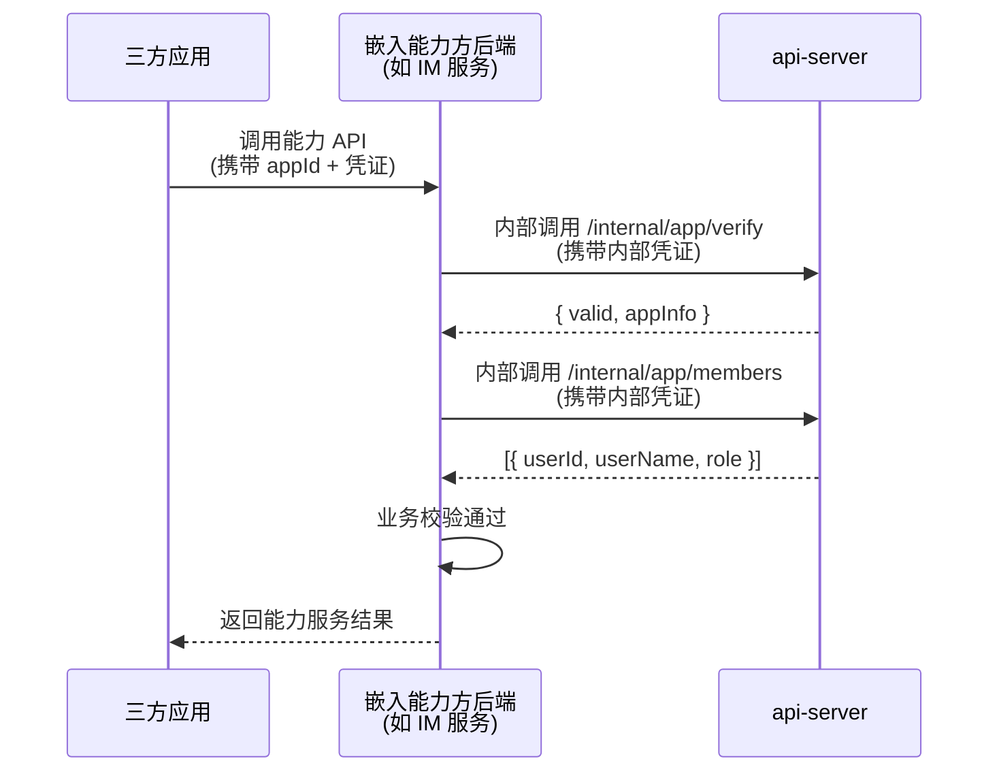

# Feature Specification：嵌入能力API面

> **文档定位**: SDDU 需求规范 — 定义嵌入能力API面的功能需求、非功能需求和边界情况，作为 plan 阶段的输入  
> **前置依赖**: `specs-tree-ability-embedding/discovery-report.md`、`specs-tree-ability-embedding/spec.md`（父规范）  
> **创建人**: SDDU Spec Agent  
> **创建时间**: 2026-07-13  
> **版本**: v1.0  
> **更新人**: SDDU Spec Agent  
> **更新时间**: 2026-07-13  
> **更新说明**: 初始创建

## 1. 元数据
> Feature 基本信息

| 字段 | 值 |
|------|-----|
| Feature ID | EMBED-API-001 |
| 名称 | 嵌入能力API面 |
| 父 Feature | EMBED-001（狭义嵌入能力） |
| 优先级 | P1 |
| 服务端 | api-server |
| 目标版本 | v1.0 |
| 现有基线 | `ApplicationService`（Mock 实现）、`ApiGatewayController`、`ScopeController` |

## 2. 上下文
> 回顾问题背景和目标用户

本子 Feature 聚焦**为嵌入能力方提供标准化的服务端校验接口**。

### 2.1 问题背景

当三方应用订阅了某个嵌入能力（如"群置顶服务"）后，该应用的请求会到达嵌入能力方（如 IM 业务模块）的后端服务。嵌入能力方需要：

1. **验证调用方身份**：这个请求是否来自一个真实、合法的应用？
2. **查询应用信息**：这个应用的名称、类型是什么？
3. **查询成员信息**：这个应用有哪些成员/角色？（用于嵌入能力方自身的业务校验，如"只有管理员才能配置群置顶"）

当前现状：
- 每个嵌入能力方各自对接应用管理系统，重复造轮子
- api-server 已有 `ApplicationService` 接口和 Mock 实现，但未暴露给嵌入能力方使用
- 无成员信息查询能力
- 无内部服务间调用的认证机制

### 2.2 目标用户

| 角色 | 说明 |
|------|------|
| **嵌入能力方后端**（IM、云盘、邮件等业务模块的后端服务） | 调用 api-server 的接口完成应用身份校验和成员查询 |
| **平台运营方** | 配置内部凭证、管理接口授权 |

### 2.3 架构关系



## 3. 目标与非目标
> 明确需求范围，防止范围蔓延

### 3.1 目标 (Goals)
> 明确本次要达成的业务目标

| # | 目标描述 |
|---|---------|
| G-001 | 嵌入能力方可调用 api-server 接口验证应用身份（appId + 凭证是否有效） |
| G-002 | 嵌入能力方可查询应用基本信息（名称、类型、状态等） |
| G-003 | 嵌入能力方可查询应用的成员列表及角色 |
| G-004 | API 面接口仅限内部服务调用，有内部凭证鉴权机制 |

### 3.2 非目标 (Non-Goals)
> 明确本次不涉及的范围，防止需求蔓延

| # | 明确不做 | 原因 |
|---|---------|------|
| NG-001 | 不查询 ability 订阅关系 | 订阅关系是 open-server 的职责，嵌入能力方如需校验应用是否已订阅某能力，应向 open-server 查询 |
| NG-002 | 不实现完整的 AKSK 验证系统 | 现有 mock 实现在开发阶段可用，生产环境需对接现有 AKSK 管理系统（策略切换保留） |
| NG-003 | 不实现用户级权限校验 | 嵌入能力方自身的业务权限由各自实现，api-server 仅提供应用和成员基础数据 |
| NG-004 | 不做应用生命周期管理（创建/编辑/删除应用） | 应用管理由现有应用管理系统负责 |

## 4. 用户故事
> 以用户视角描述功能需求

| # | 作为… | 我想要… | 以便… |
|---|-------|---------|-------|
| US-001 | 嵌入能力方后端 | 调用验证接口确认某应用的 appId 和凭证是否有效 | 拒绝无效请求 |
| US-002 | 嵌入能力方后端 | 查询应用的基本信息（名称、类型、状态等） | 了解请求方应用的身份和类型 |
| US-003 | 嵌入能力方后端 | 查询应用的成员列表及角色 | 在业务逻辑中执行成员级别的权限校验（如仅管理员可操作） |

## 5. 功能需求 (FR)
> 每个需求必须有唯一标识符且可测试

### 5.1 内部接口

> ⚠️ 所有接口均需通过**内部凭证**鉴权，非公开接口。接口路径前缀使用 `/internal/` 与对外接口区分。

| ID | 需求描述 | 验收标准 | 优先级 |
|----|---------|---------|--------|
| FR-001 | **应用身份验证**：嵌入能力方调用 api-server 验证应用身份 | • `POST /internal/app/verify`<br/>• 请求参数：`appId`(string)、`authType`(int)、`authCredential`(string)<br/>• 返回：`{ valid: boolean, appInfo: { appId, appName, appType, status } }`<br/>• `appInfo` 仅在 valid=true 时返回<br/>• 开发阶段使用 Mock 验证逻辑，保留策略切换接口 | P0 |
| FR-002 | **应用信息查询**：嵌入能力方查询应用基本信息 | • `GET /internal/app/info?appId={appId}`<br/>• 返回：`{ appId, appName, appNameEn, appType, status, createTime, description }`<br/>• 不存在的应用返回 404<br/>• 开发阶段返回 Mock 数据（固定字段），联调阶段切换为对接现有应用管理系统 | P0 |
| FR-003 | **成员列表查询**：嵌入能力方查询应用的成员列表 | • `GET /internal/app/members?appId={appId}`<br/>• 返回：`[{ userId, userName, userAccount, role, joinTime }]`<br/>• `role` 枚举：`owner`(拥有者)、`admin`(管理员)、`member`(普通成员)<br/>• 不存在的应用返回 404<br/>• 开发阶段返回 Mock 数据，联调阶段对接现有成员管理系统 | P0 |
| FR-004 | **内部凭证鉴权**：所有 `/internal/` 接口需校验调用方身份 | • 请求头 `X-Internal-Token` 携带内部服务凭证<br/>• 凭证由平台运营方预配置，支持多服务方独立凭证<br/>• 凭证无效/缺失返回 401<br/>• 开发阶段可支持绕过（配置开关） | P0 |
| FR-005 | **批量应用信息查询**：嵌入能力方批量查询多个应用的信息 | • `POST /internal/app/info/batch`<br/>• 请求参数：`appIds: string[]`<br/>• 返回：`{ apps: [...] }`<br/>• 单次最多查询 100 个应用<br/>• 不存在或不返回的应用在结果中省略（不抛错） | P1 |
| FR-006 | **批量成员查询**：嵌入能力方批量查询多个应用的成员信息 | • `POST /internal/app/members/batch`<br/>• 请求参数：`appIds: string[]`<br/>• 返回：`{ members: { [appId]: [...] } }`<br/>• 单次最多查询 20 个应用<br/>• 不存在或不返回的应用结果中省略 | P1 |

### 5.2 策略切换机制

沿用能力开放平台（CAP-OPEN-001）的 Mock 策略设计：

| 阶段 | 策略 | 说明 |
|------|------|------|
| **开发** | Mock | api-server 内置 Mock 数据，不依赖外部系统，独立开发测试 |
| **联调** | 真实接口 | 通过配置开关一键切换，对接现有应用管理系统/成员管理系统/AKSK 管理系统的真实接口 |

**实现方式**：`ApplicationService` 接口保持抽象，通过 Spring Profile 或配置开关切换 Mock/Real 实现。现有 `ApplicationServiceMockImpl` 作为默认实现。

### 5.3 数据模型

**Mock 阶段数据结构**（开发阶段使用）：

```
应用信息 Mock:
  appId: "mock-app-001"
  appName: "Mock应用"
  appType: 1  // 1=业务应用, 2=个人应用
  status: 1   // 1=启用

成员信息 Mock:
  userId: "user-001"
  userName: "张三"
  userAccount: "zhangsan@xx.com"
  role: "owner" | "admin" | "member"
```

### 5.4 接口清单

| 接口 | 方法 | 路径 | 鉴权 | 说明 |
|------|------|------|------|------|
| 应用身份验证 | POST | `/internal/app/verify` | Internal Token | 验证 appId + 凭证 |
| 应用信息查询 | GET | `/internal/app/info` | Internal Token | 查询单个应用基本信息 |
| 批量应用信息 | POST | `/internal/app/info/batch` | Internal Token | 批量查询应用信息 |
| 成员列表查询 | GET | `/internal/app/members` | Internal Token | 查询单个应用成员列表 |
| 批量成员查询 | POST | `/internal/app/members/batch` | Internal Token | 批量查询应用成员信息 |

## 6. 非功能需求 (NFR)
> 性能、安全、可用性等跨切面需求

| ID | 类别 | 需求描述 | 验收标准 |
|----|------|---------|---------|
| NFR-001 | 安全 | 内部接口仅限持有有效 Internal Token 的服务调用 | 无 Token 或无效 Token 返回 401，不泄露任何业务数据 |
| NFR-002 | 安全 | Internal Token 支持多服务方独立配置 | 每个嵌入能力方有独立的 Token，可独立授予/撤销 |
| NFR-003 | 性能 | 应用验证接口响应时间 | P99 < 100ms |
| NFR-004 | 性能 | 信息查询接口响应时间 | P99 < 200ms（单应用） |
| NFR-005 | 可用性 | Mock ↔ 真实接口切换不重启服务 | 通过配置中心/环境变量动态切换，无需重启 |
| NFR-006 | 可扩展 | 应用信息/成员信息的字段可扩展 | API 返回 JSON 对象，新增字段不破坏现有调用方 |

## 7. 边界情况 (EC)
> 异常场景和边界条件的处理方式

| ID | 场景 | 处理方式 |
|----|------|---------|
| EC-001 | 查询不存在的 appId | 返回 404，错误信息 "应用不存在" |
| EC-002 | Internal Token 过期或无效 | 返回 401，错误信息 "内部凭证无效" |
| EC-003 | 应用已被禁用（status=0） | 身份验证返回 `valid: false`，但信息查询正常返回（带禁用状态标记） |
| EC-004 | 批量查询部分 appId 不存在 | 结果中省略不存在项，不抛错，返回成功条数 |
| EC-005 | 批量查询超量（超 100 个应用） | 限制拒绝，返回 400 "批量查询数量超过上限" |
| EC-006 | Mock 阶段查询任意 appId | 返回预设的 Mock 数据（固定结构），确保前端开发不阻塞 |

## 8. 开放问题
> 待决策事项和需要进一步调研的内容

| # | 问题 | 影响范围 | 建议方案 | 状态 |
|---|------|---------|---------|:----:|
| 1 | Internal Token 的存储和验证方式？配置在 apiserver 的 yml 中？还是需要独立的管理接口？ | 安全架构 | 建议 MVP 阶段配置在 `application.yml` 中，后续如果需要动态管理可加管理 API | ⏳ 待决策 |
| 2 | 现有应用管理系统/成员管理系统/AKSK 管理系统的真实对接方式？开放平台现有代码中对接策略是什么？ | 联调集成 | 参考 CAP-OPEN-001 的 NFR-012 策略控制模式，开发阶段 Mock，联调阶段对接 | ⏳ 待调研 |
| 3 | `role` 枚举值是否与现有成员管理系统一致？ | 数据模型 | 需确认现有系统的角色定义（owner/admin/member），如不一致做映射转换 | ⏳ 待确认 |

## 修订记录
> 记录本文档的版本变更历史

| 版本 | 变更说明 | 日期 | 修订人 |
|------|---------|------|--------|
| v1.0 | 初始创建 — 嵌入能力API面完整规范 | 2026-07-13 | SDDU Spec Agent |
