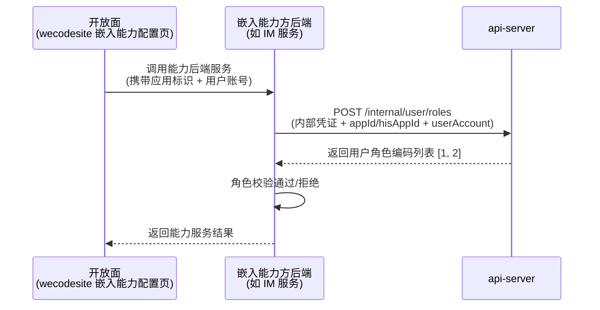
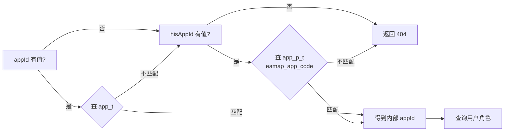
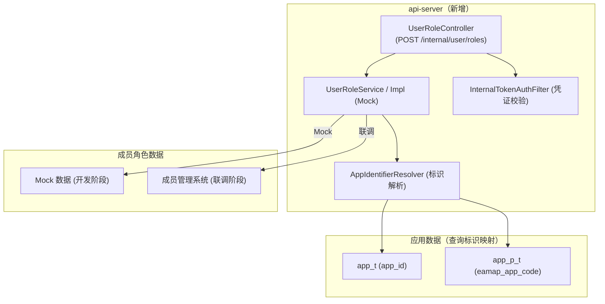
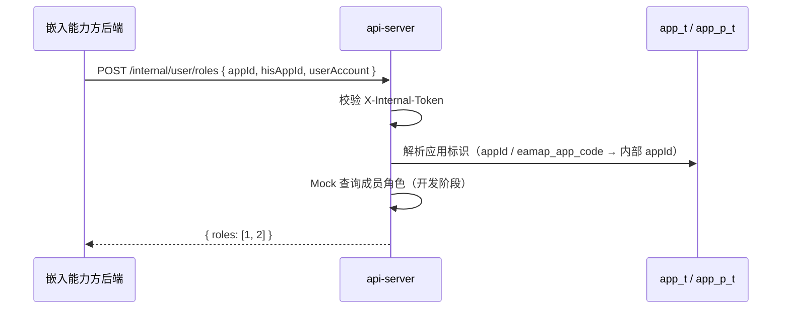

# 需求设计说明书 — 嵌入能力API面（业务面）

**Feature ID**: EMBED-API-001  
**版本**: v1.0  
**创建日期**: 2026-07-13  

---

## 修订记录

| 版本 | 变更说明 | 日期 | 修订人 |
|------|---------|------|--------|
| v1.0 | 初始创建 | 2026-07-13 | SDDU Plan Agent |

## 目录

- 定位和写作说明
- 需求价值和概述
- 上下文分析
- 初始需求分析
    - 初始需求场景分析
    - 机构化IR
- 需求影响分析
    - 特性影响分析
- 系统用例分析
    - 用例清单
    - 用例分析
- 功能设计
    - 业界方案实现
    - 功能实现整体设计方案
    - 功能实现
- 系统级非功能设计
    - 系统级的FMEA影响分析
    - 系统级安全影响分析
    - 兼容性
    - 可运维
    - 资料
- checkList
    - 设计自检清单要求

## 表目录

| 表编号 | 表名 | 所在章节 |
|--------|------|---------|
| 表1 | 元数据 | 需求价值和概述 |
| 表2 | 初始场景分析 | 初始需求分析 |
| 表3 | 机构化IR | 初始需求分析 |
| 表4 | 特性影响分析 | 需求影响分析 |
| 表5 | 用例清单 | 系统用例分析 |
| 表6-1 | 用户角色查询接口 | 功能设计-接口设计 |
| 表7 | 数据库查询说明 | 功能设计-数据模型设计 |
| 表8 | 设计自检清单 | checkList |

## 图目录

| 图编号 | 图名 | 所在章节 |
|--------|------|---------|
| 图1 | 架构关系图 | 上下文分析 |
| 图2 | 架构依赖关系图 | 功能实现整体设计方案 |
| 图3 | 应用标识解析流程图 | 功能设计-接口设计 |
| 图4 | 用户角色查询时序图 | 功能设计-接口设计 |

## Keywords 关键字

| 中文 | English |
|------|---------|
| API面 | API Surface |
| 用户角色查询 | User Role Query |
| 嵌入能力方 | Embedding Capability Provider |
| 内部凭证 | Internal Token |
| 应用标识解析 | App Identifier Resolution |

## Abstract 摘要

**中文摘要**：
本文档定义了嵌入能力API面（业务面）的需求设计，核心为一条标准化的服务端校验接口——用户角色查询。嵌入能力方可通过该接口（POST /internal/user/roles）查询指定用户在应用中的角色编码列表，用于在业务逻辑中做角色级权限校验。接口支持平台应用ID和外部应用编码（hisAppId）两种应用标识，使用内部凭证鉴权，开发阶段内置Mock数据。

**English Abstract**:
This document defines the requirement design for the embedding capability API surface, with the core being a standardized server-side validation interface — user role query. Embedding capability providers can use this interface (POST /internal/user/roles) to query a user's role code list within an application for role-based permission validation in business logic. The interface supports two types of app identifiers (platform appId and external hisAppId), uses internal token authentication, and has built-in mock data for the development phase.

## List 偶发abbreviations 缩略语清单

| Abbreviations缩略语 | Full spelling 英文全名 | Chinese explanation 中文解释 |
|---------------------|-----------------------|---------------------------|
| DTO | Data Transfer Object | 数据传输对象 |
| hisAppId | His Application ID | 外部应用编码（第三方系统） |
| NFR | Non-Functional Requirement | 非功能需求 |
| EC | Edge Case | 边界情况 |
| MVP | Minimum Viable Product | 最小可行产品 |
| TPS | Transactions Per Second | 每秒事务数 |
| P99 | 99th Percentile | 99分位 |

---

## 定位和写作说明

**需求分析**：
API面需求来源于能力开放平台狭义嵌入能力特性（EMBED-001）的子特性分解。嵌入能力方的配置页面通过微前端嵌入 wecodesite（开放面）后，嵌入能力方需要对操作者进行权限校验。当前每个嵌入能力方各自对接成员管理系统查询角色，重复造轮子，api-server 尚无标准化的用户角色查询接口。本文档通过"上下文分析 + 场景分析 + 系统用例"的分析方法，定义用户角色查询接口的系统功能规格。

**功能设计**：
根据功能规格要求，在 api-server 中新建独立 UserRoleController + UserRoleService，内部凭证鉴权，Service 层支持 Mock/Real 策略切换。应用标识解析采用识别器模式，支持平台 appId 和 hisAppId 两种标识输入，对调用方透明。

## 1 需求价值和概述

**Feature ID**: EMBED-API-001  
**名称**: 嵌入能力API面（业务面）  
**父 Feature**: EMBED-001（狭义嵌入能力）  
**优先级**: P1  
**服务端**: api-server  
**目标版本**: v1.0  
**现有基线**: 已有应用认证服务（Mock）、API 网关、用户授权管理

**表1：元数据**

| 字段 | 值 |
|------|-----|
| Feature ID | EMBED-API-001 |
| 名称 | 嵌入能力API面 |
| 父 Feature | EMBED-001（狭义嵌入能力） |
| 优先级 | P1 |
| 服务端 | api-server |
| 目标版本 | v1.0 |
| 现有基线 | 已有应用认证服务（Mock 实现）、API 网关、用户授权管理 |

### 包含需求的背景、来源、价值和要解决的客户问题

**背景**：
嵌入能力方的配置页面通过微前端嵌入 wecodesite（开放面）后，嵌入能力方需要对操作者进行权限校验。例如：只有应用的管理员才能配置群置顶内容。目前每个嵌入能力方各自对接成员管理系统查询角色，没有统一的标准接口。

**来源**：
能力开放平台狭义嵌入能力特性（EMBED-001）的子特性分解。

**价值**：
- 嵌入能力方通过统一接口查询用户角色，降低集成成本
- 避免每个能力方重复对接成员管理系统
- 接口支持应用ID和hisAppId两种标识，适配不同场景
- 内部凭证鉴权保障接口安全
- Mock/Real 切换机制支持开发阶段独立调试

**损失**：
如果没有该特性，每个嵌入能力方需要各自实现成员角色查询逻辑，包含重复的对接工作、不同的接口规范，增加开发成本和维护负担。

## 2 上下文分析（可选）

### 架构上下文



### 利益相关方

| 角色 | 说明 | 与API面的关系 |
|------|------|--------------|
| **嵌入能力方后端** | IM、云盘等业务模块的后端服务 | 调用角色查询接口做权限校验 |
| **平台管理员** | 开放平台管理人员 | 配置内部凭证、管理接口授权 |

## 3 初始需求分析（可选）

### 1. 初始需求场景分析

| 所属场景 | 场景名称 | 场景简要说明 | 涉及角色 |
|---------|---------|------------|---------|
| 角色校验 | 管理员权限校验 | 嵌入能力方后端收到配置请求后，调用API面查询操作者是否为管理员 | 嵌入能力方后端 |
| 角色校验 | 普通成员权限校验 | 嵌入能力方后端查询操作者角色，判断是否有操作权限 | 嵌入能力方后端 |
| 应用标识解析 | 平台应用ID查询 | 嵌入能力方传入平台 appId，系统解析后查询角色 | 嵌入能力方后端 |
| 应用标识解析 | hisAppId查询 | 嵌入能力方传入外部应用编码，系统解析为内部 appId 后查询角色 | 嵌入能力方后端 |
| 凭证鉴权 | 内部凭证鉴权 | 请求携带内部凭证，系统校验凭证有效性，无效时拒绝 | 嵌入能力方后端、平台管理员 |

### 2. 机构化IR（必选）

| IR属性 | 具体信息 |
|--------|---------|
| IR标识 | EMBED-API-IR-001 |
| 名称 | 嵌入式能力方服务端用户角色查询 |
| 描述 | 嵌入能力方后端通过统一接口查询用户在应用中的角色 |
| 优先级 | P1 |
| 需求描述（why） | 目前每个能力方各自对接成员管理系统，重复造轮子，缺乏统一标准 |
| what | 提供一个 POST 接口，输入 appId/hisAppId + userAccount，返回角色编码列表 |
| who | 嵌入能力方后端调用；平台管理员配置凭证 |
| 其他 | 内部凭证 MVP 阶段使用 yml 静态配置 |
| 对架构要素的影响 | 架构：api-server 新增内部接口模块；安全：内部凭证鉴权 |

## 4 需求影响分析

### 1. 特性影响分析（可选）

| 影响类型 | 特性 | 影响说明 |
|---------|------|---------|
| **新增** | 用户角色查询接口 | api-server 新建 UserRoleController + UserRoleService |
| **新增** | 应用标识解析器 | AppIdentifierResolver 识别 appId / hisAppId |
| **新增** | 内部凭证校验 | InternalTokenAuthFilter 拦截 `/internal/` 路径 |
| **不涉及** | 现有 ScopeController | 授权管理接口不变 |
| **不涉及** | 现有 ApiGatewayController | 应用认证接口不变 |
| **不涉及** | open-server ability 模块 | API面不修改 ability 相关代码 |

## 5 系统用例分析（可选）

### 1. 用例清单

| 角色名称 | UseCase名称 | UseCase简要说明 | 是否需要细化分析 |
|---------|------------|---------------|:-------------:|
| 嵌入能力方后端 | 用户角色查询 | 输入应用标识+用户账号，获取该用户在应用中的角色列表 | 是 |

### 2. 用例分析

#### 2.1 用例：用户角色查询

| 要素 | 描述 |
|------|------|
| **简要说明** | 嵌入能力方后端调用 API 面接口，查询指定用户在应用中的角色编码列表 |
| **Actor** | 嵌入能力方后端服务 |
| **前置条件** | 嵌入能力方持有有效的内部凭证（`X-Internal-Token`） |
| **最小保证** | 凭证校验失败时返回 401，不泄露业务数据 |
| **成功保证** | 返回用户在应用中的角色编码列表，应用标识正常解析 |
| **主成功场景** | 嵌入能力方 → POST /internal/user/roles { appId, userAccount } → 凭证校验 → 标识解析 → Mock 查询 → 返回 [1, 2] |
| **扩展场景** | appId 匹配失败则尝试 hisAppId；两者都失败返回 404；用户无角色返回空列表 [] |
| **DFX属性** | P99 < 200ms；仅限内部服务调用（内部凭证鉴权）；Mock/Real 动态切换 |

#### 2.2 用例流程

**应用标识解析流程**：



#### 2.3 影响的功能列表和需求分解

| 功能编号 | 功能名称 | 功能规格描述 | 类型 | 需求编号 | 需求名称 | 需求描述 |
|---------|---------|------------|----|---------|---------|---------|
| F-001 | 用户角色查询 | POST /internal/user/roles，输入 appId/hisAppId + userAccount，输出角色编码列表 | 新增 | FR-001 | 用户角色查询 | 嵌入能力方通过内部接口查询用户角色 |
| F-002 | 应用标识解析 | 自动识别平台 appId 或 hisAppId 并解析为内部 appId | 新增 | FR-001 | 应用标识解析 | 支持两种标识类型的透明解析 |
| F-003 | 内部凭证校验 | 校验 X-Internal-Token 请求头，无效/缺失时拒绝 | 新增 | NFR-001 | 内部凭证鉴权 | 仅限持有有效凭证的服务调用 |
| F-004 | 策略切换 | 开发阶段使用 Mock 数据，联调阶段切换到真实接口 | 新增 | NFR-004 | Mock/Real切换 | 配置动态切换，无需重启 |

## 6 功能设计

### 1. 业界方案实现（可选）

| 方案 | 典型产品 | 特点 |
|------|---------|------|
| 独立权限查询服务 | 大型中台 | 独立部署，功能完整但较重 |
| API 网关集成 | 通用 API 平台 | 通过网关做统一鉴权，但角色查询仍需后端实现 |
| 单接口模式（本方案） | 轻量级集成平台 | 单接口，Mock/Real 切换，适合 MVP 快速迭代 |

**对比结论**：当前场景单一（仅角色查询），使用单接口模式+策略切换，MVP 阶段快速交付，后续可扩展。

### 2. 功能实现整体设计方案

#### 2.1 整体方案

**设计原则**：
1. **单一职责**：新建独立 Controller，不与现有 Scope 授权管理混淆
2. **透明解析**：应用标识（appId/hisAppId）识别对调用方透明
3. **策略切换**：Mock 阶段内置数据，联调阶段无缝切换到真实成员数据
4. **安全优先**：内部凭证鉴权，非持有凭证的服务无法调用

**限制和约束**：
- 仅支持单个用户角色查询，不做批量
- MVP 阶段内部凭证静态配置在 yml 中（后续可加管理 API）
- 联调阶段依赖 api-server 对 `openplatform_app_member_t` 表的访问权限

#### 2.2 架构设计方案

##### 2.2.1 逻辑视图



##### 2.2.2 开发视图

| 模块 | 技术栈 | 说明 |
|------|--------|------|
| api-server | Spring Boot + MyBatis | 新建 internal 子包，含 controller/service/dto/resolver/auth |

##### 2.2.3 部署视图

```
嵌入能力方后端 → api-server (UserRoleController) → MySQL (app_t / app_p_t / openplatform_app_member_t)
```

##### 2.2.4 运行视图

```
嵌入能力方后端 → POST /internal/user/roles (X-Internal-Token) → InternalTokenAuthFilter 校验通过 
→ UserRoleController → UserRoleService → AppIdentifierResolver 解析标识 → Mock/Real 查询角色 → 返回
```

### 3. 功能实现

#### 3.1 实现思路

**技术方法**：
- 新建独立 `UserRoleController`（包路径 `.../internal/controller/`），专用于嵌入能力方服务端校验
- 新建 `UserRoleService` 接口 + `UserRoleServiceMockImpl`（开发阶段） + `UserRoleServiceRealImpl`（联调阶段预留）
- 新建 `AppIdentifierResolver` 解析器：先按 appId 查 app_t → 匹配不上则按 eamap_app_code 查 app_p_t
- 新建 `InternalTokenAuthFilter`：HandlerInterceptor 拦截 `/internal/` 路径，校验 `X-Internal-Token`
- 内部凭证配置在 `application.yml` 中，支持多服务方独立配置

**方案对比**（详见 plan.md §4）：

| 方案 | 描述 | 结论 |
|------|------|------|
| **A（推荐）** | 独立 UserRoleController + 策略切换 | 单一职责，路径清晰，可独立演化和测试 |
| B | 扩展现有 ScopeController | 角色查询与授权管理职责混淆，不利维护 |

#### 3.2 实现设计

##### 3.2.1 接口设计

**设计规范**：

| 项目 | 说明 |
|------|------|
| 基础路径 | `/service/open/v2/internal` |
| 接口路径 | `/internal/user/roles` |
| 认证方式 | 内部凭证（`X-Internal-Token` 请求头） |
| 响应格式 | api-server 现有 `ApiResponse` 信封 |
| 字段命名 | 驼峰命名（camelCase） |
| 错误码 | 200/400/401/404 |

**接口清单**：

| # | 方法 | 路径 | 功能 | 对应FR | 说明 |
|---|------|------|------|:------:|------|
| 1 | POST | `/internal/user/roles` | 查询用户角色 | FR-001 | 输入应用标识+用户账号，返回角色编码列表 |

**接口详细定义**：

`POST /service/open/v2/internal/user/roles`

**请求头**：

| 字段 | 类型 | 必填 | 说明 |
|------|------|:--:|------|
| X-Internal-Token | string | ✅ | 内部服务凭证，由平台管理员预配置 |

**请求体**：

| 字段 | 类型 | 必填 | 说明 |
|------|------|:--:|------|
| `appId` | string | ⓪ | 平台应用ID（与 hisAppId 至少二选一） |
| `hisAppId` | string | ⓪ | 外部应用编码（与 appId 至少二选一） |
| `userAccount` | string | ✅ | 用户账号 |

> ⓪ = 条件必填：`appId` 和 `hisAppId` 至少传入一个，同时传入时优先按 appId 匹配。

**响应体 data**：

| 字段 | 类型 | 说明 |
|------|------|------|
| appId | string | 解析后的内部应用ID |
| roles | integer[] | 用户在应用中的角色编码列表，可选值：`0`(开发者) / `1`(拥有者) / `2`(管理员)，对应 `MemberTypeEnum` |

**新增接口场景性能指标**：

| URL | method | 功能 | 增删改查 | 三切面 | 鉴权 | TPS | 时延 |
|-----|--------|------|---------|--------|------|-----|------|
| `/internal/user/roles` | POST | 用户角色查询 | 查 | 内部API、安全 | 内部凭证 | ≥50 | P99<200ms |

**示例**：

```json
// 请求头: X-Internal-Token: xxxxxx

// 请求体（按平台 appId 查询）
{
  "appId": "1234567890123456789",
  "hisAppId": null,
  "userAccount": "zhangsan@xxx.com"
}

// 响应体 200
{
  "code": "200",
  "data": {
    "appId": "1234567890123456789",
    "roles": [1, 2]
  }
}

// 请求体（按 hisAppId 查询）
{
  "appId": null,
  "hisAppId": "EAMAP_APP_001",
  "userAccount": "lisi@xxx.com"
}

// 响应体 200
{
  "code": "200",
  "data": {
    "appId": "9876543210987654321",
    "roles": [0]
  }
}

// 401 — 凭证无效
{ "code": "401", "messageZh": "内部凭证无效", "data": null }

// 404 — 应用不存在
{ "code": "404", "messageZh": "应用不存在", "data": null }
```

**数据流**：



##### 3.2.2 数据模型设计

API 面无独立 DDL，查询以下现有表：

| 表名 | 查询用途 | 关联字段 |
|------|---------|---------|
| `app_t` | 按平台 `app_id` 查找应用 | `app_id` |
| `app_p_t` | 按外部编码 `eamap_app_code`（hisAppId）查找应用 | `eamap_app_code` → `app_id` |
| `openplatform_app_member_t` | 联调阶段查询成员角色 | `appId` + `accountId` |

**角色映射**：
`memberType=0`(开发者) → 角色编码 `0`，`memberType=1`(拥有者) → 角色编码 `1`，`memberType=2`(管理员) → 角色编码 `2`

**策略切换**：

| 阶段 | 策略 | 数据来源 | 切换方式 |
|------|------|---------|---------|
| 开发 | Mock | api-server 内置模拟数据 | 配置开关 |
| 联调 | 真实接口 | `openplatform_app_member_t` 表 或 open-server MemberService | 配置开关，无需重启 |

##### 3.3 功能可靠性分析（可选）

| 场景 | 处理方式 |
|------|---------|
| 应用标识解析失败（两个标识都未匹配） | 返回 404 "应用不存在" |
| 用户在应用中无角色 | 返回空角色列表 `[]` |
| 内部凭证无效或缺失 | 返回 401 "内部凭证无效" |
| 策略切换配置错误 | 默认走 Mock 模式，保证开发不阻塞 |
| 联调阶段 DB 不可用 | 返回 500 错误，嵌入能力方降级处理 |

##### 3.4 功能安全分析（可选）

| 安全维度 | 措施 |
|---------|------|
| 内部凭证鉴权 | `InternalTokenAuthFilter` 拦截 `/internal/` 路径，校验 `X-Internal-Token` |
| 凭证配置 | MVP 阶段 yml 静态配置，支持多服务方独立凭证 |
| 开发阶段 bypass | 可通过配置项绕过凭证校验，方便开发调试 |
| 数据泄露防护 | 凭证无效时返回 401，不泄露业务数据；应用不存在时返回 404 |
| SQL注入 | 复用 MyBatis 参数绑定机制 |

##### 3.5 架构元素影响列表（可选）

| 元素 | 变更类型 | 变更说明 |
|------|---------|---------|
| `UserRoleController.java` | 新增 | 用户角色查询控制器 |
| `UserRoleService.java` | 新增 | 角色查询业务接口 |
| `UserRoleServiceMockImpl.java` | 新增 | Mock 实现（开发阶段） |
| `UserRoleServiceRealImpl.java` | 新增 | 真实实现（联调阶段预留） |
| `UserRoleQueryRequest.java` | 新增 | 请求 DTO |
| `UserRoleQueryResponse.java` | 新增 | 响应 DTO |
| `AppIdentifierResolver.java` | 新增 | 应用标识解析器 |
| `InternalTokenAuthFilter.java` | 新增 | 内部凭证校验过滤器 |
| `InternalAuthConfig.java` | 新增 | 内部凭证配置映射 |
| `application.yml` | 修改 | 新增 internal-token、mock/real 开关配置 |

##### 3.6 结构图元素实现列表（可选）

###### 3.6.1 接口设计

（已在 3.2.1 节详细描述，此处不再重复）

###### 3.6.2 数据模型设计

（已在 3.2.2 节详细描述，此处不再重复）

##### 3.7 功能实现分解分配清单

| 实现元素 | 职责 | 对应 Task |
|---------|------|----------|
| `UserRoleController` | 接收请求，参数校验，调用 Service | T-001 |
| `UserRoleService` + MockImpl | 角色查询业务逻辑（Mock 数据） | T-002 |
| `UserRoleServiceRealImpl` | 真实查询实现（联调阶段） | T-003 |
| `AppIdentifierResolver` | 应用标识解析（appId → app_t, hisAppId → app_p_t） | T-004 |
| `InternalTokenAuthFilter` + `InternalAuthConfig` | 内部凭证校验拦截器 | T-005 |
| `UserRoleQueryRequest` / `UserRoleQueryResponse` | 请求/响应 DTO | T-006 |
| `application.yml` 配置 | 内部凭证 + 策略开关 | T-007 |

## 7 系统级非功能设计

### 1. 系统及的FMEA影响分析

| 失效模式 | 影响 | 严重程度 | 检测方式 | 缓解措施 |
|---------|------|---------|---------|---------|
| 内部凭证泄露 | 非法调用接口 | 高 | 访问审计日志 | 支持多凭证独立管理，可单独撤销 |
| 共享 DB 不可用 | 身份解析/角色查询失败 | 中 | 接口返回异常 | 嵌入能力方自行降级（如允许操作或拒绝操作） |
| 策略切换配置错误 | 使用错误的查询策略 | 低 | 启动日志输出当前策略 | 默认 Mock 模式 |

### 2. 系统级安全影响分析

| 安全威胁 | 影响 | 缓解措施 |
|---------|------|---------|
| 内部凭证暴力破解 | 接口被未授权访问 | 凭证长度≥32位；可增加 IP 频率限制（后续迭代） |
| 接口被 DDoS | 服务不可用 | 复用 api-server 现有限流机制 |
| 用户账号遍历 | 枚举用户角色 | 响应中不区分"应用不存在"和"用户无角色"，统一返回 |

### 3. 兼容性

#### 后向兼容性确认

- 接口为全新路径（`/internal/`），不修改任何现有接口
- 不影响 api-server 已有的 ScopeController、ApiGatewayController 等组件
- 现有 `application.yml` 配置保持不变，新增配置项独立追加

#### 前向兼容性确认

- 未来扩展更多内部接口时，统一使用 `/internal/` 前缀
- 未来凭证管理从静态配置升级为管理 API 时，现有凭证继续有效
- 应用标识解析器可复用给后续其他内部接口

### 4. 可运维

| 运维场景 | 说明 |
|---------|------|
| 日志 | 角色查询请求输出 INFO 日志（脱敏处理凭证字段）；凭证校验失败输出 WARN |
| 监控 | 角色查询接口 TPS、时延、错误率；凭证校验失败次数告警 |
| 配置 | Mock/Real 策略配置项支持动态切换（配置中心或环境变量） |
| 审计 | 记录凭证使用方、调用时间、查询的应用标识（脱敏） |

### 5. 资料

| 资料类型 | 说明 |
|---------|------|
| API 接口文档 | 用户角色查询接口的完整请求/响应定义 |
| 嵌入能力方接入指南 | 如何申请内部凭证、调用接口、处理返回值 |
| 运维手册 | 内部凭证配置方法、策略切换方法 |

## 8 checkList（必填）

### 1. 设计自检清单要求（必填）

| check点 | 是否达标 |
|---------|:--------:|
| 需求与设计是否一致（FR→设计双向追溯） | ✅ |
| 是否覆盖了所有 FR 验收标准 | ✅ |
| 接口参数是否明确定义类型、取值范围、必填性 | ✅ |
| 响应格式是否明确定义成功/失败 | ✅ |
| 应用标识解析逻辑是否描述清楚 | ✅ |
| 策略切换机制是否明确定义 | ✅ |
| 是否分析了异常场景和边界条件 | ✅ |
| 安全控制措施是否到位（内部凭证、角色校验） | ✅ |
| 功能可靠性是否分析 | ✅ |
| DB 查询涉及的表和解析流程是否明确 | ✅ |
| 架构决策是否有 ADR 记录 | ✅（ADR-001、ADR-002、ADR-003） |
