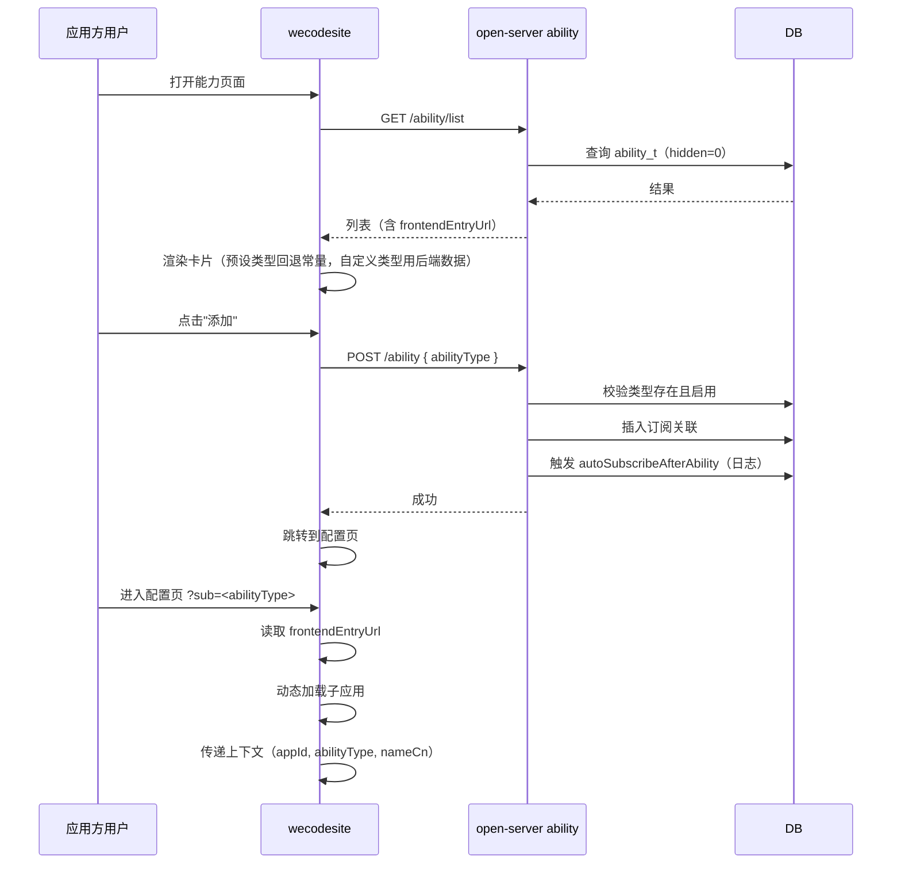
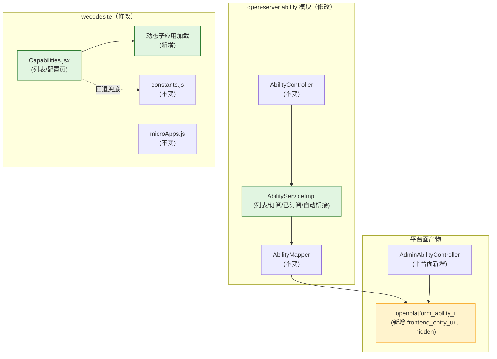

# 技术规划：嵌入能力开放面

**Feature ID**: EMBED-OPEN-001  
**规划版本**: v1.0  
**创建日期**: 2026-07-13  
**规划作者**: SDDU Plan Agent  
**规范版本**: spec.md v1.1

---

## 1. 架构分析

### 1.1 现有架构影响

**后端 — open-server ability 模块**：

| 组件 | 现状 | 变更 |
|------|------|------|
| `AbilityController` | `GET /list`、`POST /`、`GET /subscribed` | 接口参数和返回不变，内部逻辑调整 |
| `AbilityServiceImpl` | 列表查询硬编码排除 type=6；订阅通过 `AbilityTypeEnum.isValidCode()` 校验 | 列表：改为 `hidden` 字段过滤 + 返回 `frontendEntryUrl`；订阅：改为 DB 校验 |
| `AbilityVO` | 无 `frontendEntryUrl` 字段 | 新增字段 |
| `AppAbilityDetailVO` | 无 `frontendEntryUrl` 字段 | 新增字段 |
| `AbilityMapper` | 基础 CRUD | 可能需新增按 `abilityType` 查询方法 |
| `AbilityTypeEnum` | 7 个硬编码常量 | **不变**（只用于预置类型本地化展示，不用于校验） |

**前端 — wecodesite Capabilities 页**：

| 组件 | 现状 | 变更 |
|------|------|------|
| `Capabilities.jsx` | 列表: 硬编码过滤 type=6；配置页: 占位文本 | 列表: 使用后端 `hidden` 字段；配置页: 加载嵌入子应用 |
| `constants.js` | `ABILITY_TYPE_MAP` (7种) + `ABILITY_SCENE_MAP` (1个场景) | 保留，只作为预设类型兜底 |
| `microApps.js` | 静态注册 4 个子应用，无能力相关 | 能力配置页使用运行时动态加载，不需注册到 microApps.js |
| `thunk.js` | 3 个 API 调用函数 | 不变（后端 API 保持了向后兼容） |

### 1.2 新增/修改组件

| 组件 | 变更类型 | 说明 |
|------|---------|------|
| `AbilityVO.frontendEntryUrl` | 修改 | 新增字段 |
| `AppAbilityDetailVO.frontendEntryUrl` | 修改 | 新增字段 |
| `AbilityServiceImpl.getAbilityList()` | 修改 | type=6 硬编码排除 → `hidden` 字段过滤；新增 `frontendEntryUrl` |
| `AbilityServiceImpl.addAbility()` | 修改 | 枚举校验 → DB 校验 |
| `AbilityServiceImpl.getSubscribedAbilities()` | 修改 | 新增 `frontendEntryUrl` |
| `AbilityServiceImpl.autoSubscribeAfterAbility()` | 修改 | 空实现 → 打日志 |
| `Capabilities.jsx` | 修改 | type=6 过滤逻辑去掉；配置页加载子应用 |
| 动态子应用加载模块 | 新增 | 在配置页组件内运行时 `loadMicroApp` |
| `ABILITY_SCENE_MAP` | 修改（可选） | 扩展场景分组或新增"其他"场景 |

### 1.3 数据流

### 1.4 依赖关系

## 2. 方案对比

### 方案 A：增量修改现有 ability 模块（推荐）

**描述**：在现有 AbilityController/AbilityServiceImpl 基础上做最小修改，保持接口向后兼容。

| 维度 | 评价 |
|------|------|
| 优点 | 改动最小；前端兼容（新增字段为 optional）；现有订阅流程不变；不需要新接口 |
| 缺点 | 需要修改现有类，但不影响已有功能 |
| 工作量评估 | 后端 2 天 + 前端 3 天 |

### 方案 B：新建 AbilityV2 模块

**描述**：新建 AbilityV2Controller + AbilityV2Service，废弃旧接口。

| 维度 | 评价 |
|------|------|
| 优点 | 新旧接口隔离，不影响现有调用方 |
| 缺点 | 大量重复代码；数据源同一套，增加维护成本；前端需迁移 |
| 工作量评估 | 后端 5 天 + 前端 5 天 |

## 3. 推荐方案

**选择方案 A**：增量修改现有 ability 模块。

理由：
1. 后端变更范围可控：只需修改 `AbilityServiceImpl` 中两三处逻辑 + 两个 VO 加字段
2. 接口向后兼容：新增 `frontendEntryUrl` 为 optional 字段，不破坏现有前端
3. 前端配置页嵌入为新增功能（运行时动态加载），不修改现有导航和路由
4. 前置依赖（平台面 DB migration）后，开放面直接读取即可

## 4. 文件影响分析

### 修改文件

| 文件 | 修改内容 |
|------|---------|
| `open-server/.../ability/vo/AbilityVO.java` | 新增 `frontendEntryUrl` 字段 |
| `open-server/.../ability/vo/AppAbilityDetailVO.java` | 新增 `frontendEntryUrl` 字段 |
| `open-server/.../ability/service/impl/AbilityServiceImpl.java` | 列表: `hidden` 过滤 + `frontendEntryUrl`；订阅: DB 校验；自动桥接: 日志 |
| `open-server/.../ability/controller/AbilityController.java` | 可能小调整（如接口注释） |
| `wecodesite/.../pages/Capabilities/Capabilities.jsx` | 去掉 type=6 硬编码；配置页加载子应用 |
| `wecodesite/.../utils/constants.js` | 可能扩展 `ABILITY_SCENE_MAP` |

### 新增文件

| 文件 | 说明 |
|------|------|
| `wecodesite/.../pages/Capabilities/EmbeddedSubApp.jsx` | 配置页嵌入子应用组件（运行时动态加载） |

## 5. 风险评估

| 风险 | 影响 | 缓解措施 |
|------|------|---------|
| 现有前端已硬编码过滤 type=6 | 升级后老版本前端可能仍显示隐藏类型 | 后端控制 `hidden` 字段 + 前端升级，同时去掉前端硬编码 |
| 微前端动态加载方案不成熟 | 配置页无法正常加载子应用 | 兜底：无 `frontendEntryUrl` 的能力仍展示占位文本 |
| `autoSubscribeAfterAbility` 在现有流程中已有调用 | 日志不影响功能 | 仅加日志，不改逻辑 |

## 6. ADR

### ADR-001: 增量修改现有 ability 模块而非新建模块

**状态**: ACCEPTED

**背景**：
- 现有 ability 模块有 3 个接口，功能与开放面需求高度重合
- 变更范围可被现有类结构容纳

**决策**：
直接修改 `AbilityServiceImpl` 的现有方法（`getAbilityList()`、`addAbility()`、`getSubscribedAbilities()`），不新建 Controller 或 Service。VO 类新增 optional 字段 `frontendEntryUrl`。

**后果**：
- 正面：改动小、代码复用、兼容现有调用方
- 负面：旧代码中的 type=6 过滤需要替换为 `hidden` 字段，需确保逻辑等价

### ADR-002: 配置页动态子应用使用运行时 `loadMicroApp` API

**状态**: ACCEPTED

**背景**：
- 现有 `microApps.js` 使用静态注册方式，在应用启动时注册所有子应用
- 能力配置页的子应用由平台面录入 `frontendEntryUrl`，运行时才能确定

**决策**：
在 Capabilities 页配置视图组件内，使用 QianKun 的 `loadMicroApp` API 在运行时动态加载子应用。不修改 `microApps.js`。

**后果**：
- 正面：不污染全局注册列表，按需加载，切换能力时自动 unload
- 负面：依赖 wecodesite 的 QianKun 版本是否支持 `loadMicroApp`

---

## 7. 产物审查策略

| 审查产物 | 审查基准 |
|---------|---------|
| build.md | spec.md（规范基准） |
| AbilityServiceImpl.java | 列表 hidden 过滤逻辑、订阅 DB 校验逻辑 |
| AbilityVO / AppAbilityDetailVO | 新增字段的序列化正确性 |
| Capabilities.jsx | 配置页嵌入子应用、数据驱动渲染 |

## 8. 产物验证策略

| 验证产物 | 验证基准 |
|---------|---------|
| 能力列表查询 | hidden=1 的能力不出现在列表；自定义类型正常展示；frontendEntryUrl 正常返回 |
| 能力订阅 | 自定义类型可通过枚举校验正常订阅 |
| 已订阅列表 | 新增 frontendEntryUrl 字段 |
| 配置页 | 无 frontendEntryUrl 展示占位；有则加载子应用 |
