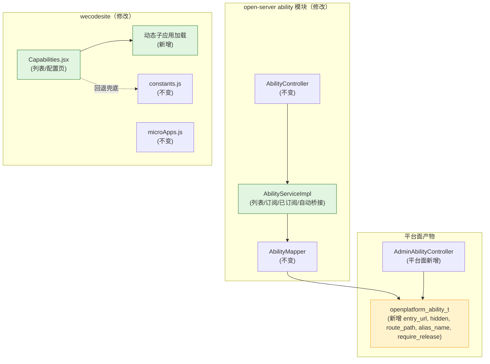
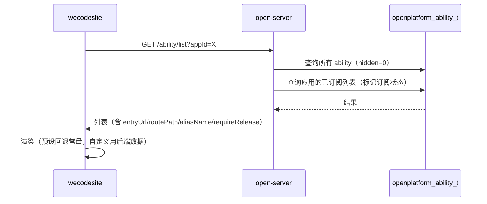
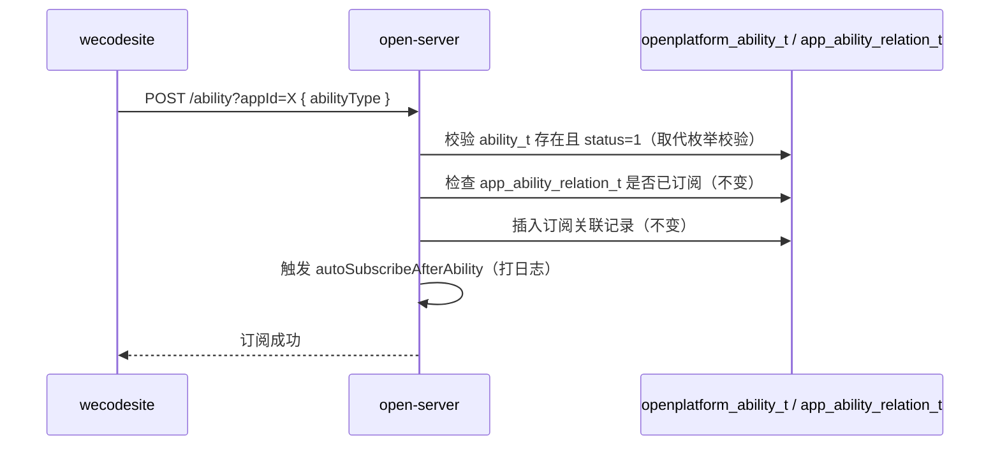
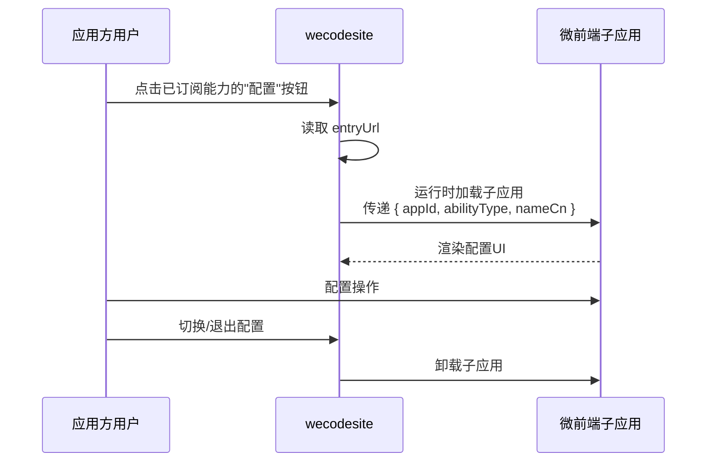

# 技术规划：嵌入能力开放面

**Feature ID**: EMBED-OPEN-001  
**规划版本**: v1.0  
**创建日期**: 2026-07-13  
**规划作者**: SDDU Plan Agent  
**规范版本**: spec.md v1.1

---

## 1. 架构分析

### 1.1 现有架构影响

**后端 — open-server ability 模块**：

| 组件 | 现状 | 变更 |
|------|------|------|
| `AbilityController` | 3 个接口（list / subscribe / subscribed） | 接口参数和返回不变，内部逻辑调整 |
| `AbilityServiceImpl` | 列表查询硬编码排除 type=6；订阅通过 `AbilityTypeEnum.isValidCode()` 校验；版本发布硬编码排除 type=6 | 列表：改为 `hidden` 字段过滤 + 返回 `entryUrl`/`routePath`/`aliasName`/`requireRelease`；订阅：改为 DB 校验；版本发布：改为按 `require_release` 字段过滤 |
| `AbilityVO` | 无 `entryUrl` 等字段 | 新增 `entryUrl`/`routePath`/`aliasName`/`requireRelease` |
| `AppAbilityDetailVO` | 无 `entryUrl` 等字段 | 新增 `entryUrl`/`routePath`/`aliasName`/`requireRelease` |
| `AbilityMapper` | 基础 CRUD | 可能需新增按 `abilityType` 查询方法 |
| `AbilityTypeEnum` | 7 个硬编码常量 | **不变**（只用于预置类型本地化展示，不用于校验） |

**前端 — wecodesite Capabilities 页**：

| 组件 | 现状 | 变更 |
|------|------|------|
| `Capabilities.jsx` | 列表: 硬编码过滤 type=6；配置页: 占位文本 | 列表: 使用后端 `hidden` 字段；配置页: 加载嵌入子应用 |
| `constants.js` | `ABILITY_TYPE_MAP` (7种) + `ABILITY_SCENE_MAP` (1个场景) | 保留，只作为预设类型兜底 |
| `microApps.js` | 静态注册 4 个子应用，无能力相关 | 不变（配置页使用运行时动态加载） |
| `thunk.js` | 3 个 API 调用函数 | 不变（后端 API 保持向后兼容） |

### 1.2 新增/修改组件

| 组件 | 变更类型 | 说明 |
|------|---------|------|
| `AbilityVO.entryUrl` / `routePath` / `aliasName` / `requireRelease` | 修改 | 新增字段；`frontendEntryUrl` 改为 `entryUrl` |
| `AppAbilityDetailVO.entryUrl` / `routePath` / `aliasName` / `requireRelease` | 修改 | 新增字段；`frontendEntryUrl` 改为 `entryUrl` |
| `AbilityServiceImpl.getAbilityList()` | 修改 | type=6 硬编码排除 → `hidden` 字段过滤；新增 `entryUrl`/`routePath`/`aliasName`/`requireRelease` |
| `AbilityServiceImpl.addAbility()` | 修改 | 枚举校验 → DB 校验 |
| `AbilityServiceImpl.getSubscribedAbilities()` | 修改 | 新增 `entryUrl`/`routePath`/`aliasName`/`requireRelease` |
| `AbilityServiceImpl.autoSubscribeAfterAbility()` | 修改 | 空实现 → 打日志 |
| `VersionServiceImpl.createVersion()` | 修改 | 硬编码排除 type=6 → 按 `require_release` 字段过滤 |
| `Capabilities.jsx` | 修改 | type=6 过滤逻辑去掉；配置页加载子应用 |
| 动态子应用加载模块 | 新增 | 在配置页组件内运行时 `loadMicroApp` |
| `ABILITY_SCENE_MAP` | 修改（可选） | 扩展场景分组或新增"其他"场景 |

### 1.3 依赖关系



## 2. 数据库设计

开放面**不新增数据库变更**。平台面已负责 `openplatform_ability_t` 新增 `entry_url`、`hidden`、`route_path`、`alias_name`、`require_release` 字段。开放面直接读取平台面写入的数据，无需独立迁移。

## 3. API设计

### 3.1 设计规范

**基础路径**：`/service/open/v2/ability`

**认证方式**：复用 open-server 现有 API 认证体系。

**响应格式**：复用 open-server 现有 `ApiResponse` 信封：

```json
{ "code": "200", "messageZh": "操作成功", "messageEn": "Success", "data": { ... }, "page": null }
```

**变更类型说明**：

| 类型 | 含义 |
|------|------|
| **修改** | 接口路径和方法不变，内部逻辑或返回字段有变化 |
| **不变** | 接口完全无变化 |

### 3.2 接口清单

| # | 方法 | 路径 | 接口名称 | 对应 FR | 变更类型 |
|---|--------|------|---------|:------:|:-------:|
| 1 | GET | `/ability/list` | 查询能力列表 | FR-001 | **修改** |
| 2 | POST | `/ability` | 订阅能力 | FR-002 | **修改** |
| 3 | GET | `/ability/subscribed` | 查询已订阅列表 | FR-004 | **修改** |

> 接口 #1~#3 均已有前端调用方，必须保持向后兼容（新增字段为 optional，不删除/修改现有字段）。

### 3.3 接口详细定义

---

#### #1 查询能力列表（修改）

`GET /service/open/v2/ability/list`

**请求参数**

| 字段 | 类型 | 必填 | 说明 |
|------|------|:--:|------|
| appId | string | ✅ | 应用 ID |

> 其余参数不变。

**响应变更**

| 变更 | 说明 |
|------|------|
| ✅ 新增 `entryUrl` (string) | 进入地址，有则返回，无则返回 null |
| ✅ 新增 `routePath` (string) | 路由路径 |
| ✅ 新增 `aliasName` (string) | 别名 |
| ✅ 新增 `requireRelease` (int) | 是否需要版本发布才生效（0=即时，1=需发布） |
| ✅ 过滤逻辑变更 | 不再硬编码排除 type=6，改为按 `hidden=1` 过滤 |
| ✅ 自定义类型 | 自定义类型（≥100）正常返回，不受 `AbilityTypeEnum` 限制 |

**响应体 `data[]`**（现有字段 + 新增字段）

| 字段 | 类型 | 说明 | 变更 |
|------|------|------|:----:|
| abilityType | int | 能力编码 | — |
| nameCn | string | 中文名 | — |
| nameEn | string | 英文名 | — |
| descCn | string | 中文描述 | — |
| descEn | string | 英文描述 | — |
| iconUrl | string | 图标 URL | — |
| diagramUrl | string | 示意图 URL | — |
| subscribed | boolean | 已订阅标记 | — |
| orderNum | int | 排序号 | — |
| entryUrl | string | 进入地址 | **新增** |
| routePath | string | 路由路径 | **新增** |
| aliasName | string | 别名 | **新增** |
| requireRelease | int | 是否需要版本发布才生效 | **新增** |

**数据流**：



---

#### #2 订阅能力（修改）

`POST /service/open/v2/ability`

**请求参数**

| 字段 | 类型 | 必填 | 说明 |
|------|------|:--:|------|
| appId | string | ✅ | 应用 ID（Query参数） |

**请求体**

| 字段 | 类型 | 必填 | 说明 |
|------|------|:--:|------|
| abilityType | int | ✅ | 能力编码 |

**逻辑变更**

| 变更 | 说明 |
|------|------|
| ✅ 校验逻辑 | 从 `AbilityTypeEnum.isValidCode()` 枚举校验 → 查询 DB 校验能力类型存在且 status=1 |
| — 重复检查 | 不变（检查 `app_ability_relation_t` 是否已订阅） |
| — 关联插入 | 不变（写入 `app_ability_relation_t`） |
| — 自动桥接 | 从空实现 → 打日志（FR-003） |

**数据流**：



---

#### #3 查询已订阅列表（修改）

`GET /service/open/v2/ability/subscribed`

**请求参数**

| 字段 | 类型 | 必填 | 说明 |
|------|------|:--:|------|
| appId | string | ✅ | 应用 ID |

**响应变更**

| 变更 | 说明 |
|------|------|
| ✅ 新增 `entryUrl` (string) | 进入地址 |
| ✅ 新增 `routePath` (string) | 路由路径 |
| ✅ 新增 `aliasName` (string) | 别名 |
| ✅ 新增 `requireRelease` (int) | 是否需要版本发布才生效 |
| ✅ 过滤逻辑变更 | 不再硬编码排除 type=6 |

**响应体 `data[]`**

| 字段 | 类型 | 说明 | 变更 |
|------|------|------|:----:|
| id | string | 订阅记录 ID | — |
| abilityType | int | 能力编码 | — |
| nameCn | string | 中文名 | — |
| nameEn | string | 英文名 | — |
| iconUrl | string | 图标 URL | — |
| orderNum | int | 排序号 | — |
| entryUrl | string | 进入地址 | **新增** |
| routePath | string | 路由路径 | **新增** |
| aliasName | string | 别名 | **新增** |
| requireRelease | int | 是否需要版本发布才生效 | **新增** |

### 3.4 前端变更说明

#### FR-101 动态能力目录

**Capabilities.jsx** 修改：

| 旧逻辑 | 新逻辑 |
|--------|--------|
| 列表渲染依赖 `ABILITY_TYPE_MAP` 常量获取中文名/图标 | 自定义类型直接使用后端返回的 `nameCn`/`iconUrl` |
| 硬编码过滤 `abilityType !== 6` | 使用后端 `hidden` 字段（后端已过滤） |
| 预设类型中文名从常量取 | 预设类型可回退到常量作为兜底 |

#### FR-102 配置页嵌入子应用

**Capabilities.jsx** 配置视图修改：

| 旧逻辑 | 新逻辑 |
|--------|--------|
| 配置页展示占位文本"该能力已添加，配置页面由能力方提供" | 从 `entryUrl` 获取子应用入口，运行时动态加载 |
| 无微前端加载 | 使用 QianKun `loadMicroApp` API 动态加载子应用 |
| - | 向子应用传递上下文：appId、abilityType、nameCn |

**交互流程**：



### 3.5 VersionServiceImpl 硬编码改造

**背景**：现有 `VersionServiceImpl.createVersion()` 第173行硬编码排除 `GROUP_JOIN_NOTIFICATION`（type=6）：

```java
// 旧逻辑：硬编码排除 type=6
.filter(r -> !Objects.equals(r.getAbilityType(), AbilityTypeEnum.GROUP_JOIN_NOTIFICATION.getCode()))
```

**改造内容**：将硬编码逻辑改为按 `require_release` 字段过滤：

```java
// 新逻辑：按 require_release 字段过滤
// 仅将 require_release=1 的能力纳入版本发布检查
.filter(r -> Boolean.TRUE.equals(r.getRequireRelease()))
```

**改造位置**：`open-server/.../version/service/impl/VersionServiceImpl.java`

**影响**：
- type=6（应用入群通知）的 `require_release` 默认值为 0（即时生效），行为与改造前一致
- 自定义能力通过平台面设置 `require_release` 控制是否需要版本发布
- 现有 `VersionServiceImpl` 其他逻辑不变

## 4. 方案对比

### 方案 A：增量修改现有 ability 模块（推荐）

**描述**：在现有 AbilityController/AbilityServiceImpl 基础上做最小修改，保持接口向后兼容。

| 维度 | 评价 |
|------|------|
| 优点 | 改动最小；前端兼容（新增字段为 optional）；现有订阅流程不变；不需要新接口 |
| 缺点 | 需要修改现有类，但不影响已有功能 |
| 工作量评估 | 后端 2 天 + 前端 3 天 |

### 方案 B：新建 AbilityV2 模块

**描述**：新建 AbilityV2Controller + AbilityV2Service，废弃旧接口。

| 维度 | 评价 |
|------|------|
| 优点 | 新旧接口隔离，不影响现有调用方 |
| 缺点 | 大量重复代码；数据源同一套，增加维护成本；前端需迁移 |
| 工作量评估 | 后端 5 天 + 前端 5 天 |

## 5. 推荐方案

**选择方案 A**：增量修改现有 ability 模块。

理由：
1. 后端变更范围可控：只需修改 `AbilityServiceImpl` 中两三处逻辑 + 两个 VO 加字段
2. 接口向后兼容：新增 `entryUrl`/`routePath`/`aliasName`/`requireRelease` 为 optional 字段，不破坏现有前端
3. 前端配置页嵌入为新增功能（运行时动态加载），不修改现有导航和路由
4. 前置依赖（平台面 DB migration）后，开放面直接读取即可

## 6. 文件影响分析

### 修改文件

| 文件 | 修改内容 |
|------|---------|
| `open-server/.../ability/vo/AbilityVO.java` | 新增 `entryUrl`/`routePath`/`aliasName`/`requireRelease` 字段 |
| `open-server/.../ability/vo/AppAbilityDetailVO.java` | 新增 `entryUrl`/`routePath`/`aliasName`/`requireRelease` 字段 |
| `open-server/.../ability/service/impl/AbilityServiceImpl.java` | 列表: `hidden` 过滤 + `entryUrl`/`routePath`/`aliasName`/`requireRelease`；订阅: DB 校验；自动桥接: 日志 |
| `open-server/.../version/service/impl/VersionServiceImpl.java` | 硬编码排除 type=6 改为按 `require_release` 字段过滤 |
| `open-server/.../ability/controller/AbilityController.java` | 可能小调整（如接口注释） |
| `wecodesite/.../pages/Capabilities/Capabilities.jsx` | 去掉 type=6 硬编码；配置页加载子应用 |
| `wecodesite/.../utils/constants.js` | 可能扩展 `ABILITY_SCENE_MAP` |

### 新增文件

| 文件 | 说明 |
|------|------|
| `wecodesite/.../pages/Capabilities/EmbeddedSubApp.jsx` | 配置页嵌入子应用组件（运行时动态加载） |

## 7. 风险评估

| 风险 | 影响 | 缓解措施 |
|------|------|---------|
| 现有前端已硬编码过滤 type=6 | 升级后老版本前端可能仍显示隐藏类型 | 后端控制 `hidden` 字段 + 前端升级同步去掉前端硬编码 |
| 微前端动态加载方案不成熟 | 配置页无法正常加载子应用 | 兜底：无 `entryUrl` 的能力仍展示占位文本 |
| `autoSubscribeAfterAbility` 在现有流程中已有调用 | 日志不影响功能 | 仅加日志，不改逻辑 |

## 8. ADR

### ADR-001: 增量修改现有 ability 模块而非新建模块

**状态**: ACCEPTED

**背景**：
- 现有 ability 模块有 3 个接口，功能与开放面需求高度重合
- 变更范围可被现有类结构容纳

**决策**：
直接修改 `AbilityServiceImpl` 的现有方法（`getAbilityList()`、`addAbility()`、`getSubscribedAbilities()`），不新建 Controller 或 Service。VO 类新增 optional 字段 `entryUrl`、`routePath`、`aliasName`、`requireRelease`。

**后果**：
- 正面：改动小、代码复用、兼容现有调用方
- 负面：旧代码中的 type=6 过滤需替换为 `hidden` 字段，需确保逻辑等价

### ADR-002: 配置页动态子应用使用运行时 `loadMicroApp`

**状态**: ACCEPTED

**背景**：
- 现有 `microApps.js` 使用静态注册方式
- 能力配置页的子应用 `entryUrl`/`routePath`/`aliasName` 由平台面录入，运行时才能确定

**决策**：
在 Capabilities 页配置视图组件内，使用 QianKun 的 `loadMicroApp` API 在运行时动态加载子应用。不修改 `microApps.js`。

**后果**：
- 正面：不污染全局注册列表，按需加载，切换能力时自动 unload
- 负面：依赖 wecodesite 的 QianKun 版本是否支持 `loadMicroApp`

---

## 9. 产物审查策略

| 审查产物 | 审查基准 |
|---------|---------|
| build.md | spec.md（规范基准） |
| AbilityServiceImpl.java | 列表 hidden 过滤逻辑、订阅 DB 校验逻辑 |
| AbilityVO / AppAbilityDetailVO | 新增字段的序列化正确性 |
| Capabilities.jsx | 配置页嵌入子应用、数据驱动渲染 |

## 10. 产物验证策略

| 验证产物 | 验证基准 |
|---------|---------|
| 能力列表查询 | hidden=1 不出现在列表；自定义类型正常展示；entryUrl/routePath/aliasName/requireRelease 正常返回 |
| 能力订阅 | 自定义类型可通过校验正常订阅 |
| 已订阅列表 | 新增 entryUrl/routePath/aliasName/requireRelease 字段 |
| 配置页 | 无 entryUrl 展示占位；有则加载子应用 |

## 修订记录

| 版本 | 变更说明 | 日期 | 修订人 |
|------|---------|------|--------|
| v1.0 | 初始创建 — 开放面技术规划 | 2026-07-13 | SDDU Plan Agent |
| v1.1 | 对齐平台面格式：独立数据库设计+API设计章节；接口详细定义含设计规范/接口清单/请求响应/数据流 | 2026-07-13 | SDDU Plan Agent |
| v1.2 | DB 字段更新：新增 route_path/alias_name/require_release 字段；frontendEntryUrl 改为 entryUrl；新增 §3.5 VersionServiceImpl 硬编码改造（按 require_release 过滤）；文件影响分析同步更新 | 2026-07-16 | SDDU Plan Agent |
