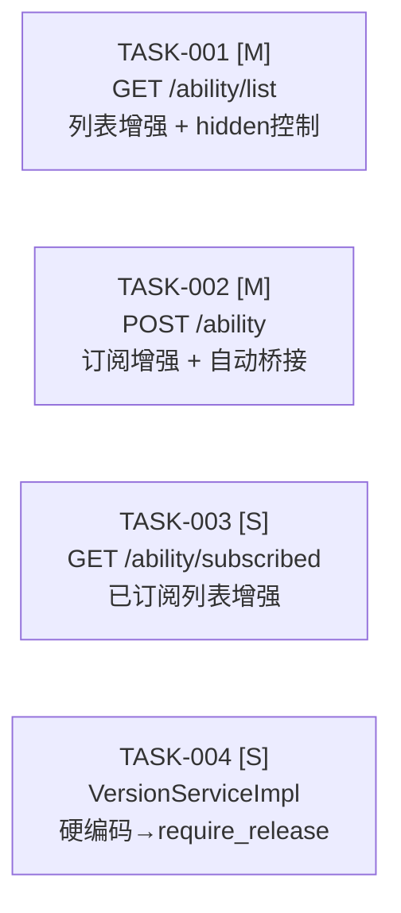

# 任务分解：嵌入能力开放面

> **文档定位**: SDDU 任务清单 — 按接口维度分解 4 个后端任务，作为 build 阶段的入口。前端 FR-101~103 由独立流程负责，不在本文档跟踪。
> **前置依赖**: plan.md（技术方案）、spec.md（需求规范）
> **创建人**: SDDU 路由调度专家
> **创建时间**: 2026-07-20
> **版本**: v1.0

---

## 1. 拆分原则

开放面为**增量修改**现有 open-server ability 模块，与平台面"从零构建 CRUD"不同，采用**按接口维度**拆分：

| 原则 | 说明 |
|------|------|
| 接口聚合 | 每个 API 端点为一个 Task，VO 字段/校验逻辑/桥接点等子变更聚合到对应接口的 Task 内 |
| 后端可并行 | 4 个后端接口各自修改 `AbilityServiceImpl` 的不同方法，无编译依赖 |

---

## 2. 依赖拓扑总览

4 个后端接口各自修改 `AbilityServiceImpl` 的不同方法，无代码依赖，**可并行开发**。推荐先 ①（含 VO 字段新增）→ ②③④ 并行。

> ⚠️ 前端 FR-101~103（动态目录、嵌入子应用、场景分组）由独立流程实现，不在本文档跟踪。后端 TASK-001/003 完成后 API 契约即对前端可用。

---

## 3. 任务索引

| # | 任务 | 子Feature 目录 | 接口/范围 | FR | 复杂度 | 服务 | 依赖 | 测试 |
|---|------|--------------|----------|:--:|:--:|------|------|------|
| 1 | 能力列表增强 | `specs-tree-open-01-list-api/` | `GET /ability/list` | FR-001, FR-005 | M | open-server | 无 | Java: Service 单测 + Python: 列表集成测试 |
| 2 | 能力订阅增强 + 自动桥接 | `specs-tree-open-02-subscribe-api/` | `POST /ability` | FR-002, FR-003 | M | open-server | 无 | Java: Service 单测 + Python: 订阅集成测试 |
| 3 | 已订阅列表增强 | `specs-tree-open-03-subscribed-api/` | `GET /ability/subscribed` | FR-004 | S | open-server | 无 | Java: Service 单测 + Python: 已订阅集成测试 |
| 4 | VersionServiceImpl 改造 | `specs-tree-open-04-version-service/` | `createVersion()` | ADR-004 | S | open-server | 无 | Java: 过滤逻辑单测 |

---

## 4. 任务详细定义

---

### TASK-001 [M] — 能力列表增强 + hidden 控制

**接口**: `GET /service/open/v2/ability/list`
**对应 FR**: FR-001（能力列表增强）、FR-005（hidden 控制）
**服务**: open-server
**复杂度**: M — 涉及过滤逻辑变更 + 5 个新字段 + VO 扩展

**变更文件**:

| 文件 | 变更类型 | 说明 |
|------|---------|------|
| `open-server/.../ability/vo/AbilityVO.java` | 修改 | 新增 `entryUrl`、`routePath`、`aliasName`、`requireRelease`、`loadType` 字段 |
| `open-server/.../ability/service/impl/AbilityServiceImpl.java` | 修改 | `getAbilityList()` 方法 |

**变更点**:
1. **VO 扩展**（共享基础）：AbilityVO 新增 5 字段，为所有接口统一数据结构
2. **过滤逻辑**：`abilityType != 6` 硬编码排除 → `WHERE hidden = 0` 过滤
3. **返回字段**：VO 映射增加 5 新字段（有则返回，无则 null）
4. **自定义类型**：不再受 `AbilityTypeEnum` 限制，DB 中所有 `status=1` 的能力均返回

**不变量**: 接口路径、请求参数（appId）、已订阅标记逻辑均不变。

**测试**:
- Java 单测：Mock Mapper，验证 hidden=1 被过滤、新字段非空、自定义类型返回
- Python 集成测试：真实 DB，验证列表含自定义类型、hidden 过滤生效、向后兼容

**验收标准** (来自 spec.md):
- 返回数据库中的所有启用能力（不再硬编码排除特定 type）
- 根据 hidden 字段决定是否在列表中展示（hidden=1 不出现）
- 新增返回 entryUrl/routePath/aliasName/requireRelease/loadType
- 已订阅标记逻辑不变

---

### TASK-002 [M] — 能力订阅增强 + 自动桥接

**接口**: `POST /service/open/v2/ability`
**对应 FR**: FR-002（订阅校验增强）、FR-003（自动桥接扩展点）
**服务**: open-server
**复杂度**: M — 校验逻辑变更 + 扩展点实现

**变更文件**:

| 文件 | 变更类型 | 说明 |
|------|---------|------|
| `open-server/.../ability/service/impl/AbilityServiceImpl.java` | 修改 | `addAbility()` + `autoSubscribeAfterAbility()` 方法 |

**变更点**:
1. **校验逻辑**：`AbilityTypeEnum.isValidCode(abilityType)` → 查询 DB 校验 `ability_t` 中存在且 `status=1`
2. **错误提示**：不存在或已失效返回 400 "能力不存在或已失效"
3. **自动桥接**：`autoSubscribeAfterAbility()` 空实现 → 打日志 + 预留钩子

**不变量**: 重复订阅检查、关联记录插入逻辑均不变。

**测试**:
- Java 单测：Mock Mapper，验证自定义类型可通过、失效类型被拒绝、订阅后日志含 appId+abilityType
- Python 集成测试：自定义类型订阅成功、预置类型行为不变、重复订阅拒绝

**验收标准** (来自 spec.md):
- 移除硬编码类型枚举校验
- 改为查询数据库校验能力存在且为启用状态
- 重复订阅检查、插入关联记录等其余逻辑不变
- 订阅后触发扩展点，当前阶段输出日志

---

### TASK-003 [S] — 已订阅列表增强

**接口**: `GET /service/open/v2/ability/subscribed`
**对应 FR**: FR-004（已订阅列表增强）
**服务**: open-server
**复杂度**: S — 仅新增返回字段

**变更文件**:

| 文件 | 变更类型 | 说明 |
|------|---------|------|
| `open-server/.../ability/vo/AppAbilityDetailVO.java` | 修改 | 新增 `entryUrl`、`routePath`、`aliasName`、`requireRelease`、`loadType` 字段 |
| `open-server/.../ability/service/impl/AbilityServiceImpl.java` | 修改 | `getSubscribedAbilities()` 方法 |

**变更点**:
1. **VO 扩展**：AppAbilityDetailVO 新增 5 字段
2. **返回字段**：VO 映射增加 5 新字段
3. **过滤逻辑**：移除硬编码排除 type=6（已订阅的不受 hidden 影响）

**不变量**: 接口路径、请求参数、关联查询逻辑均不变。

**测试**:
- Java 单测：验证新字段返回值、null 安全
- Python 集成测试：验证已订阅列表含 entryUrl/loadType 等字段

**验收标准** (来自 spec.md):
- 新增返回 entryUrl/routePath/aliasName/requireRelease/loadType
- 确保能力名称等完整返回
- 其余逻辑不变

---

### TASK-004 [S] — VersionServiceImpl 改造

**接口**: 无独立接口，修改 `createVersion()` 内部逻辑
**对应 ADR**: ADR-004（require_release 替代硬编码）
**服务**: open-server（version 模块）
**复杂度**: S — 单行过滤逻辑变更

**变更文件**:

| 文件 | 变更类型 | 说明 |
|------|---------|------|
| `open-server/.../version/service/impl/VersionServiceImpl.java` | 修改 | `createVersion()` 方法 |

**变更点**:
- `filter(r -> !Objects.equals(r.getAbilityType(), AbilityTypeEnum.GROUP_JOIN_NOTIFICATION.getCode()))`
- → `filter(r -> Boolean.TRUE.equals(r.getRequireRelease()))`

**设计考量**: 此变更属于 `version` 模块，与 `ability` 模块无代码依赖，可并行开发。

**测试**:
- Java 单测：Mock 数据，验证 `requireRelease=1` 纳入版本发布检查，`requireRelease=0` 跳过

**验收标准**:
- type=6 的 `require_release` 默认为 0，行为与改造前一致
- 自定义能力通过平台面设置 `require_release` 控制版本发布行为

---

## 5. 执行指南

**后端执行顺序**：TASK-001~004 无相互依赖，可并行开发。推荐先 ①（VO 字段新增为其他接口打好基础）→ ②③④ 并行。

**启动命令**：`@sddu-build TASK-001`（或指定子 Feature 目录名）

**完成标准**：实现文件 + 测试文件全部通过。Java 单测 + Python 集成测试。

---

*最后更新: 2026-07-20*
