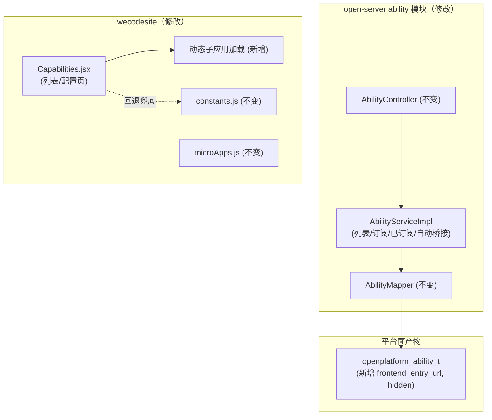
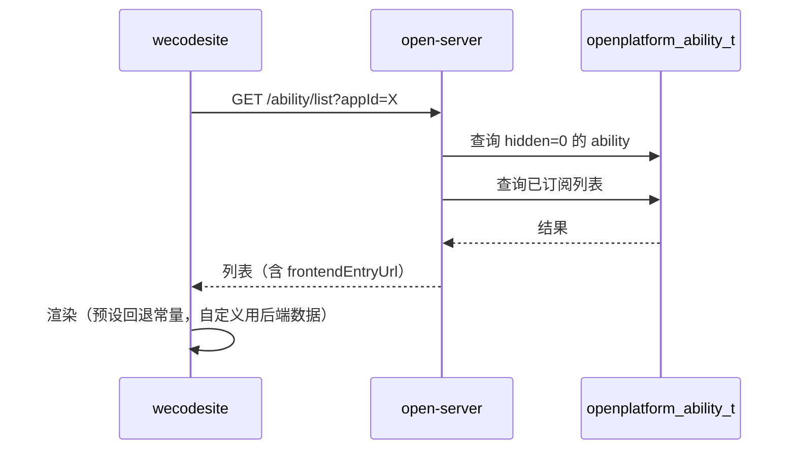
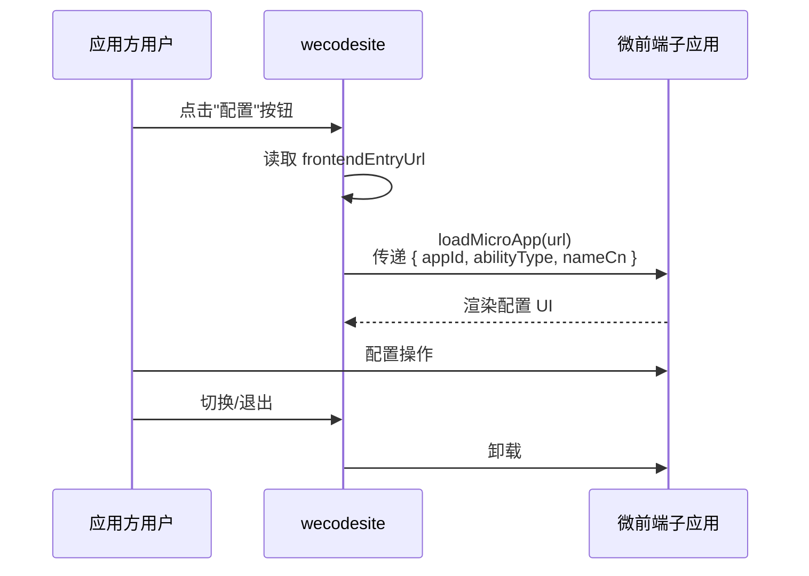

# 需求设计说明书 — 嵌入能力开放面

**Feature ID**: EMBED-OPEN-001  
**版本**: v1.0  
**创建日期**: 2026-07-13  

---

## 修订记录

| 版本 | 变更说明 | 日期 | 修订人 |
|------|---------|------|--------|
| v1.0 | 初始创建 | 2026-07-13 | SDDU Plan Agent |

## 目录

- 定位和写作说明
- 需求价值和概述
- 上下文分析
- 初始需求分析
    - 初始需求场景分析
    - 机构化IR
- 需求影响分析
    - 特性影响分析
- 系统用例分析
    - 用例清单
    - 用例分析
- 功能设计
    - 业界方案实现
    - 功能实现整体设计方案
    - 功能实现
- 系统级非功能设计
    - 系统级的FMEA影响分析
    - 系统级安全影响分析
    - 兼容性
    - 可运维
    - 资料
- checkList
    - 设计自检清单要求

## 表目录

| 表编号 | 表名 | 所在章节 |
|--------|------|---------|
| 表1 | 元数据 | 需求价值和概述 |
| 表2 | 初始场景分析 | 初始需求分析 |
| 表3 | 机构化IR | 初始需求分析 |
| 表4 | 特性影响分析 | 需求影响分析 |
| 表5 | 用例清单 | 系统用例分析 |
| 表6-1 | 能力列表接口（修改） | 功能设计-接口设计 |
| 表6-2 | 订阅能力接口（修改） | 功能设计-接口设计 |
| 表6-3 | 已订阅列表接口（修改） | 功能设计-接口设计 |
| 表7 | 前端变更说明 | 功能设计-功能实现 |
| 表8 | 设计自检清单 | checkList |

## 图目录

| 图编号 | 图名 | 所在章节 |
|--------|------|---------|
| 图1 | 架构依赖关系图 | 功能实现整体设计方案 |
| 图2 | 能力列表查询时序图 | 功能设计-接口设计 |
| 图3 | 订阅能力时序图 | 功能设计-接口设计 |
| 图4 | 配置页嵌入子应用交互图 | 功能设计-功能实现 |

## Keywords 关键字

| 中文 | English |
|------|---------|
| 开放面 | Open Surface |
| 能力订阅 | Ability Subscription |
| 配置页 | Configuration Page |
| 微前端 | Micro Frontend |
| 运行时加载 | Runtime Loading |

## Abstract 摘要

**中文摘要**：
本文档定义了嵌入能力开放面的需求设计，涵盖面向能力消费方（三方应用开发方）的能力浏览、订阅和配置全流程。后端层对现有 ability 模块进行增量修改，使能力列表支持自定义类型和隐藏控制；前端层将配置页从占位文本升级为实际加载嵌入能力方微前端子应用。

**English Abstract**:
This document defines the requirement design for the embedding capability open surface, covering the full flow of browsing, subscribing, and configuring capabilities for third-party application developers. The backend incrementally modifies the existing ability module to support custom types and hidden control; the frontend upgrades the configuration page from placeholder text to actually loading micro-frontend sub-applications provided by embedding capability providers.

## List 偶发abbreviations 缩略语清单

| Abbreviations缩略语 | Full spelling 英文全名 | Chinese explanation 中文解释 |
|---------------------|-----------------------|---------------------------|
| VO | View Object | 视图对象 |
| DB | Database | 数据库 |
| FR | Functional Requirement | 功能需求 |
| NFR | Non-Functional Requirement | 非功能需求 |
| EC | Edge Case | 边界情况 |

---

## 定位和写作说明

**需求分析**：
开放面需求来源于能力开放平台狭义嵌入能力特性（EMBED-001）的子特性分解，是嵌入能力对消费方（三方应用）的呈现层。当前开放面存在两个核心问题：①后端订阅校验依赖硬编码枚举，自定义类型无法通过校验；②前端配置页仅为占位文本，未实际加载嵌入能力方的 UI。本文档通过"上下文分析 + 场景分析 + 系统用例"的分析方法，定义满足开放面要求的系统功能规格。

**功能设计**：
根据功能规格要求，对 open-server ability 模块的 `AbilityServiceImpl` 做增量修改（不新建 Controller/Service），对 wecodesite Capabilities 页面做前端增强（动态能力目录 + 配置页运行时加载子应用），确保向后兼容。

## 1 需求价值和概述

**Feature ID**: EMBED-OPEN-001  
**名称**: 嵌入能力开放面  
**父 Feature**: EMBED-001（狭义嵌入能力）  
**优先级**: P1  
**服务端**: open-server（ability 模块增强）  
**前端**: wecodesite（Capabilities 页增强）  
**目标版本**: v1.0  
**前置依赖**: 平台面 `EMBED-PLATFORM-001`

**表1：元数据**

| 字段 | 值 |
|------|-----|
| Feature ID | EMBED-OPEN-001 |
| 名称 | 嵌入能力开放面 |
| 父 Feature | EMBED-001（狭义嵌入能力） |
| 优先级 | P1 |
| 服务端 | open-server（ability 模块增强） |
| 前端 | wecodesite（Capabilities 页增强） |
| 目标版本 | v1.0 |
| 前置依赖 | 平台面 EMBED-PLATFORM-001 |

### 包含需求的背景、来源、价值和要解决的客户问题

**背景**：
开放面是嵌入能力面向三方应用开发方的呈现和交互层。现有能力列表和订阅功能依赖后端硬编码的能力类型枚举，平台面创建的自定义类型无法通过校验；能力配置页仅展示"配置页面由能力方提供"占位文本，无法真正加载嵌入能力方提供的配置 UI。

**来源**：
能力开放平台狭义嵌入能力特性（EMBED-001）的子特性分解，上游依赖平台面输出的数据。

**价值**：
- 三方应用可浏览完整的 ability 目录（含平台管理员录入的自定义类型）
- 自定义能力可正常订阅，不受硬编码枚举限制
- 嵌入能力方通过提供微前端入口 URL，使配置 UI 嵌入 wecodesite，应用方无需跳转即可完成配置
- 能力隐藏控制让平台管理员可灵活管理目录展示

**损失**：
如果没有该特性，自定义能力无法被三方应用发现和订阅，配置页始终为占位文本，嵌入能力方的业务无法真正对接。

## 2 上下文分析（可选）

### 架构上下文


### 利益相关方

| 角色 | 说明 | 与开放面的关系 |
|------|------|--------------|
| **三方应用开发方** | 能力消费方 | 浏览目录、订阅能力、在配置页操作嵌入方 UI |
| **嵌入能力方** | 能力提供方（IM、云盘等） | 提供微前端入口 URL，嵌入到配置页 |
| **平台管理员** | 开放平台运维 | 验证能力目录是否正常展示（不直接操作本面） |

## 3 初始需求分析（可选）

### 1. 初始需求场景分析

| 所属场景 | 场景名称 | 场景简要说明 | 涉及角色 |
|---------|---------|------------|---------|
| 能力消费 | 浏览完整能力目录 | 三方应用开发方在能力页面查看所有可用能力（含自定义类型） | 三方应用开发方 |
| 能力消费 | 订阅能力 | 为应用订阅一个能力（支持自定义类型） | 三方应用开发方 |
| 能力消费 | 配置已订阅能力 | 在配置页操作嵌入能力方提供的实际 UI | 三方应用开发方、嵌入能力方 |
| 能力管理 | 隐藏能力 | 能力被平台管理员隐藏后不出现在目录中（已订阅不受影响） | 平台管理员 |

### 2. 机构化IR（必选）

| IR属性 | 具体信息 |
|--------|---------|
| IR标识 | EMBED-OPEN-IR-001 |
| 名称 | 开放面能力消费全流程 |
| 描述 | 三方应用在 wecodesite 浏览、订阅、配置嵌入能力 |
| 优先级 | P1 |
| 需求描述（why） | 目前能力目录无法展示自定义类型，配置页仅为占位文本 |
| what | 后端：列表增强、订阅校验改为 DB、隐藏控制；前端：动态目录 + 配置页嵌入子应用 |
| who | 三方应用开发方操作；嵌入能力方提供 UI；平台管理员维护 |
| 其他 | 保持接口向后兼容，新增字段为 optional |
| 对架构要素的影响 | 后端：增量修改 existing AbilityServiceImpl；前端：配置页动态加载微前端子应用 |

## 4 需求影响分析

### 1. 特性影响分析（可选）

| 影响类型 | 特性 | 影响说明 |
|---------|------|---------|
| **修改** | 能力列表查询 | 新增 `frontendEntryUrl` 字段；`hidden` 过滤替换硬编码 type=6 排除 |
| **修改** | 能力订阅 | 枚举校验 → DB 校验 |
| **修改** | 已订阅列表查询 | 新增 `frontendEntryUrl` 字段 |
| **修改** | wecodesite Capabilities 页 | 动态能力目录 + 配置页运行时加载子应用 |
| **新增** | 自动桥接扩展点实现 | 空实现 → 打日志，预留钩子 |
| **不涉及** | `microApps.js` 静态注册 | 配置页使用运行时 `loadMicroApp`，不修改静态注册 |
| **不涉及** | `AbilityTypeEnum` | 仅保留用于预置类型本地化展示，不再用于校验 |

## 5 系统用例分析（可选）

### 1. 用例清单

| 角色名称 | UseCase名称 | UseCase简要说明 | 是否需要细化分析 |
|---------|------------|---------------|:-------------:|
| 三方应用开发方 | 浏览能力目录 | 查看所有可用能力（含自定义类型），查看能力详情 | 是 |
| 三方应用开发方 | 订阅能力 | 为应用订阅一个能力 | 是 |
| 三方应用开发方 | 配置已订阅能力 | 在配置页操作嵌入能力方提供的 UI | 是 |

### 2. 用例分析

#### 2.1 用例：浏览能力目录

| 要素 | 描述 |
|------|------|
| **简要说明** | 三方应用开发方在 wecodesite 能力页面查看完整的能力目录 |
| **Actor** | 三方应用开发方 |
| **前置条件** | 用户已登录，已创建或拥有了应用 |
| **最小保证** | 接口异常时展示已缓存的本地数据（预设类型常量兜底） |
| **成功保证** | 展示所有可用能力（hidden=0 的），含自定义类型，卡片信息完整 |
| **主成功场景** | 进入能力页 → 请求能力列表 API → 根据后端数据渲染卡片 → 预设类型回退常量兜底 |
| **扩展场景** | 自定义类型无图标时展示默认占位图 |
| **DFX属性** | P99 < 200ms；向后兼容 |

#### 2.2 用例：订阅能力

| 要素 | 描述 |
|------|------|
| **简要说明** | 三方应用开发方为应用订阅一个能力 |
| **Actor** | 三方应用开发方 |
| **前置条件** | 用户已选择应用，目标能力未订阅 |
| **最小保证** | 订阅失败时数据不变，提示错误 |
| **成功保证** | 订阅成功，触发自动桥接扩展点（打日志） |
| **主成功场景** | 点击"添加" → 请求订阅 API → 校验能力存在 → 插入关联记录 → 返回成功 |
| **扩展场景** | 能力已被隐藏但仍可订阅（已订阅不受隐藏影响） |
| **DFX属性** | P99 < 500ms；不允许重复订阅 |

#### 2.3 用例：配置已订阅能力

| 要素 | 描述 |
|------|------|
| **简要说明** | 三方应用开发方在配置页操作嵌入能力方提供的微前端子应用 UI |
| **Actor** | 三方应用开发方、嵌入能力方 |
| **前置条件** | 能力已订阅，能力有 `frontendEntryUrl` |
| **最小保证** | 子应用加载超时（>10s）时展示加载失败提示 |
| **成功保证** | 子应用成功加载并渲染配置 UI，上下文信息正确传递 |
| **主成功场景** | 点击"配置" → 读取 frontendEntryUrl → loadMicroApp → 传递上下文 → 渲染子应用 |
| **扩展场景** | 无 frontendEntryUrl 展示占位文本；加载失败展示错误提示 |
| **DFX属性** | 子应用加载超时 10s；切换时自动卸载上一个 |

## 6 功能设计

### 1. 业界方案实现（可选）

| 方案 | 典型产品 | 特点 |
|------|---------|------|
| iframe 嵌入 | 传统集成平台 | 简单但隔离强，通信受限，UI 融合差 |
| 微前端（QianKun） | 企业级中台 | 应用间通信便捷，UI 融合好，共享全局上下文 |
| Web Component | 标准化集成 | 技术中立，但生态和工具链不如微前端成熟 |

**对比结论**：当前 wecodesite 已使用 QianKun 微前端架构，选择运行时 `loadMicroApp` API 动态加载，无需修改现有 `microApps.js` 静态注册。

### 2. 功能实现整体设计方案

#### 2.1 整体方案

**设计原则**：
1. **增量修改**：不新建模块/Service，在现有 `AbilityServiceImpl` 中做最小修改
2. **向后兼容**：接口路径、方法、参数不变，新增字段为 optional
3. **预设回退**：前端常量保留作为预设类型兜底，自定义类型使用后端数据
4. **运行时加载**：配置页子应用使用 QianKun `loadMicroApp` 动态加载，不修改静态注册

**限制和约束**：
- 前端已硬编码过滤 `type=6` 的逻辑需同步替换为后端 `hidden` 控制
- `autoSubscribeAfterAbility` 当前仅打日志，不实现具体权限映射
- 微前端子应用需支持标准生命周期（加载/挂载/卸载）

#### 2.2 架构设计方案

##### 2.2.1 逻辑视图



##### 2.2.2 开发视图

| 模块 | 技术栈 | 变更 |
|------|--------|------|
| open-server ability | Spring Boot + MyBatis | 修改 3 个 Service 方法 + 2 个 VO 加字段 |
| wecodesite Capabilities | React + QianKun | 修改列表渲染逻辑 + 配置页动态加载 |

##### 2.2.3 部署视图

```
wecodesite (前端) → open-server (后端 ability 接口, 不变) → MySQL (openplatform_ability_t)
```

> 开放面无独立数据变更，直接消费平台面写入的 `openplatform_ability_t` 表。

##### 2.2.4 运行视图

```
三方应用开发方 → wecodesite Capabilities 页 → open-server AbilityController (接口不变, 内部逻辑增强) → DB
配置页: wecodesite → loadMicroApp(frontendEntryUrl) → 微前端子应用
```

### 3. 功能实现

#### 3.1 实现思路

**后端技术方法**：
- **能力列表增强（FR-001）**：修改 `AbilityServiceImpl.getAbilityList()`，`where` 条件从硬编码 `type != 6` 改为 `hidden = 0`；返回 VO 新增 `frontendEntryUrl`
- **订阅校验增强（FR-002）**：修改 `AbilityServiceImpl.addAbility()`，将 `AbilityTypeEnum.isValidCode()` 校验替换为查 DB `ability_t` 校验存在且 `status = 1`
- **已订阅列表增强（FR-004）**：修改 `AbilityServiceImpl.getSubscribedAbilities()`，VO 新增 `frontendEntryUrl`
- **自动桥接（FR-003）**：修改 `AbilityServiceImpl.autoSubscribeAfterAbility()`，从空实现改为打印日志

**前端技术方法**：
- **动态能力目录（FR-101）**：Capabilities.jsx 列表渲染不再依赖 `ABILITY_TYPE_MAP` 常量，自定义类型直接使用后端返回的 `nameCn`/`iconUrl`
- **配置页嵌入子应用（FR-102）**：新建 `EmbeddedSubApp.jsx` 组件，使用 QianKun `loadMicroApp` API 动态加载子应用

**方案对比**（详见 plan.md §4）：

| 方案 | 描述 | 结论 |
|------|------|------|
| **A（推荐）** | 增量修改现有 ability 模块 | 改动最小，向后兼容 |
| B | 新建 AbilityV2 模块 | 重复代码多，前端需迁移 |

#### 3.2 实现设计

##### 3.2.1 接口设计

**设计规范**：

| 项目 | 说明 |
|------|------|
| 基础路径 | `/service/open/v2/ability` |
| 认证方式 | 复用 open-server 现有 API 认证体系 |
| 响应格式 | open-server 现有 `ApiResponse` 信封 |
| 变更类型 | 均为**修改**——接口路径不变，内部逻辑/返回字段变化 |

**接口清单**：

| # | 方法 | 路径 | 功能 | 对应FR | 变更类型 |
|---|------|------|------|:------:|:-------:|
| 1 | GET | `/ability/list` | 查询能力列表 | FR-001 | **修改** |
| 2 | POST | `/ability` | 订阅能力 | FR-002 | **修改** |
| 3 | GET | `/ability/subscribed` | 查询已订阅列表 | FR-004 | **修改** |

> 接口均已有前端调用方，必须保持向后兼容。

**接口详细变更**：

**#1 查询能力列表（修改）**

| 变更项 | 旧 | 新 |
|--------|---|----|
| 过滤逻辑 | 硬编码排除 `abilityType=6` | 按 `hidden=0` 过滤 |
| 返回字段 | 无 `frontendEntryUrl` | 新增 `frontendEntryUrl` (string, optional) |
| 自定义类型 | 不返回 | 正常返回（≥100） |

**输入参数**：GET, query: appId(string, ✅)

**响应 data[]**：

| 字段 | 类型 | 说明 | 变更 |
|------|------|------|:----:|
| abilityType | int | 能力编码 | — |
| nameCn | string | 中文名 | — |
| nameEn | string | 英文名 | — |
| descCn | string | 中文描述 | — |
| descEn | string | 英文描述 | — |
| iconUrl | string | 图标 URL | — |
| diagramUrl | string | 示意图 URL | — |
| subscribed | boolean | 已订阅标记 | — |
| orderNum | int | 排序号 | — |
| frontendEntryUrl | string | 前端入口URL | **新增** |

**#2 订阅能力（修改）**

| 变更项 | 旧 | 新 |
|--------|---|----|
| 校验逻辑 | `AbilityTypeEnum.isValidCode()` | 查 DB `ability_t` 存在且 `status=1` |
| 自动桥接 | 空实现 | 打日志（FR-003） |

**输入参数**：POST, query: appId(string, ✅), body: abilityType(int, ✅)

**#3 查询已订阅列表（修改）**

| 变更项 | 旧 | 新 |
|--------|---|----|
| 过滤逻辑 | 硬编码排除 type=6 | 移除硬编码过滤 |
| 返回字段 | 无 `frontendEntryUrl` | 新增 `frontendEntryUrl` (string, optional) |

**输入参数**：GET, query: appId(string, ✅)

**新增接口场景性能指标**：

| URL | method | 功能 | 增删改查 | 鉴权 | TPS | 时延 |
|-----|--------|------|---------|------|-----|------|
| `/ability/list` | GET | 能力列表 | 查 | 现有认证 | ≥100 | P99<200ms |
| `/ability` | POST | 订阅能力 | 增 | 现有认证 | ≥50 | P99<500ms |
| `/ability/subscribed` | GET | 已订阅列表 | 查 | 现有认证 | ≥100 | P99<200ms |

**数据流**：



##### 3.2.2 数据模型设计

开放面**不新增数据库变更**。`openplatform_ability_t` 的 `frontend_entry_url` 和 `hidden` 字段由平台面迁移脚本负责，开放面直接读取使用。

##### 3.3 前端变更详细设计

**Capabilities.jsx 修改（FR-101）**：

| 旧逻辑 | 新逻辑 |
|--------|--------|
| 列表渲染依赖 `ABILITY_TYPE_MAP` 常量 | 自定义类型直接使用后端 `nameCn`/`iconUrl` |
| 硬编码 `abilityType !== 6` 过滤 | 使用后端 `hidden` 字段（后端已过滤） |
| 预设类型中文名从常量取 | 预设类型可回退到常量作为兜底 |
| 无 `frontendEntryUrl` | 卡片和已订阅列表展示入口字段（仅用于配置页） |

**EmbeddedSubApp.jsx 新增（FR-102）**：

**交互流程**：



**上下文信息**：

| 参数 | 类型 | 说明 | 示例 |
|------|------|------|------|
| appId | string | 当前应用 ID | `wx_app_001` |
| abilityType | int | 能力编码 | `100` |
| nameCn | string | 能力中文名 | `群置顶服务` |

**界面原型**：
- 能力列表页：卡片网格布局 + 场景分组 tabs（不变）
- 配置页：URL `?appId=X&sub=<abilityType>` → 配置视图容器 → 动态加载子应用
- 无 frontendEntryUrl 时：展示原有占位文本

##### 3.4 功能可靠性分析（可选）

| 场景 | 处理方式 |
|------|---------|
| 子应用加载超过 10s | 展示"配置加载失败，请重试"提示，不阻塞其他功能 |
| 子应用 URL 错误/服务器宕机 | 加载失败提示，降级到占位文本 |
| 同时打开多个能力配置 | 每次仅一个子应用活跃，切换时自动卸载 |
| 上下文信息缺失 | 主应用完整性校验，缺失时提示"配置加载失败" |

##### 3.5 功能安全分析（可选）

| 安全维度 | 措施 |
|---------|------|
| XSS | 子应用 URL 来自平台面录入，前端做编码处理 |
| 子应用隔离 | 借助 QianKun 沙箱机制隔离子应用 JS/CSS |
| CSRF | 复用 wecodesite 现有 CSRF 防护 |

##### 3.6 架构元素影响列表（可选）

| 元素 | 变更类型 | 变更说明 |
|------|---------|---------|
| `AbilityServiceImpl.java` | 修改 | 3 个方法内部逻辑修改 + 自动桥接日志 |
| `AbilityVO.java` | 修改 | 新增 `frontendEntryUrl` 字段 |
| `AppAbilityDetailVO.java` | 修改 | 新增 `frontendEntryUrl` 字段 |
| `Capabilities.jsx` | 修改 | 动态渲染 + 配置页嵌入子应用 |
| `EmbeddedSubApp.jsx` | 新增 | 运行时加载子应用组件 |

##### 3.7 功能实现分解分配清单

| 实现元素 | 职责 | 对应 Task |
|---------|------|----------|
| `AbilityServiceImpl.getAbilityList()` 修改 | hidden 过滤 + frontendEntryUrl | T-001 |
| `AbilityServiceImpl.addAbility()` 修改 | DB 校验取代枚举校验 | T-002 |
| `AbilityServiceImpl.getSubscribedAbilities()` 修改 | 返回 frontendEntryUrl | T-003 |
| `AbilityServiceImpl.autoSubscribeAfterAbility()` 修改 | 空实现→打日志 | T-004 |
| `AbilityVO.java` / `AppAbilityDetailVO.java` 修改 | 新增 frontendEntryUrl 字段 | T-005 |
| `Capabilities.jsx` 修改 | 动态渲染 + 配置页动态加载 | T-006 |
| `EmbeddedSubApp.jsx` 新增 | 运行时 loadMicroApp 组件 | T-007 |

## 7 系统级非功能设计

### 1. 系统及的FMEA影响分析

| 失效模式 | 影响 | 严重程度 | 检测方式 | 缓解措施 |
|---------|------|---------|---------|---------|
| 子应用加载超时 | 配置页不可用 | 低 | 前端 timeout 检测 | 展示加载失败提示，降级到占位文本 |
| 能力列表查询缓慢 | 页面渲染延迟 | 中 | 接口响应时间监控 | DB 索引优化；缓存策略 |
| 订阅接口 DB 查询失败 | 订阅不可用 | 低 | 接口返回异常 | 事务回滚，保持数据一致性 |

### 2. 系统级安全影响分析

| 安全威胁 | 影响 | 缓解措施 |
|---------|------|---------|
| 子应用 URL 被篡改 | 加载恶意页面 | URL 来自可信数据源（平台面录入），传输过程 HTTPS |
| 子应用绕过认证 | 未授权访问 | 子应用自身需要校验用户登录态 |

### 3. 兼容性

#### 后向兼容性确认

- 三个接口的路径、方法、请求参数不变
- 新增字段 `frontendEntryUrl` 为 optional（null/不存在），老前端不受影响
- 现有前端逻辑（如 `ABILITY_TYPE_MAP` 常量渲染、场景分组 tabs）保持不变
- 现有预设 7 种类型的展示行为不变

#### 前向兼容性确认

- 未来移除 `hidden` 逻辑时，仅需改为查全部数据即可
- 未来扩展更多能力属性不影响现有接口

### 4. 可运维

| 运维场景 | 说明 |
|---------|------|
| 日志 | 订阅操作输出 INFO 日志；自动桥接扩展点输出日志 |
| 监控 | 能力列表/订阅接口的 TPS、时延、错误率 |
| 配置 | Mock/Real 策略动态切换（无需重启） |

### 5. 资料

| 资料类型 | 说明 |
|---------|------|
| 开放面 API 文档 | 三个接口的请求/响应变更说明 |
| 配置页集成指南 | 嵌入能力方如何提供微前端子应用、参数约定 |

## 8 checkList（必填）

### 1. 设计自检清单要求（必填）

| check点 | 是否达标 |
|---------|:--------:|
| 需求与设计是否一致（FR→设计双向追溯） | ✅ |
| 是否覆盖了所有 FR 验收标准 | ✅ |
| 接口向后兼容性是否保障（新增 optional 字段） | ✅ |
| 响应格式是否明确定义成功/失败 | ✅ |
| 数据模型设计是否考虑了兼容性 | ✅ |
| 是否分析了异常场景和边界条件 | ✅ |
| 安全控制措施是否到位 | ✅ |
| 配置页子应用加载失败降级处理 | ✅ |
| 前后端变更范围是否清晰对应 | ✅ |
| 架构决策是否有 ADR 记录 | ✅（ADR-001、ADR-002） |
