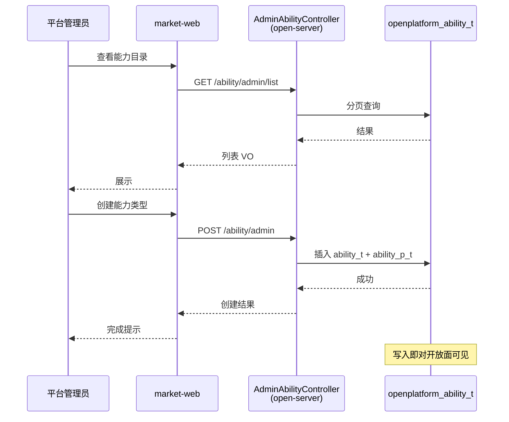
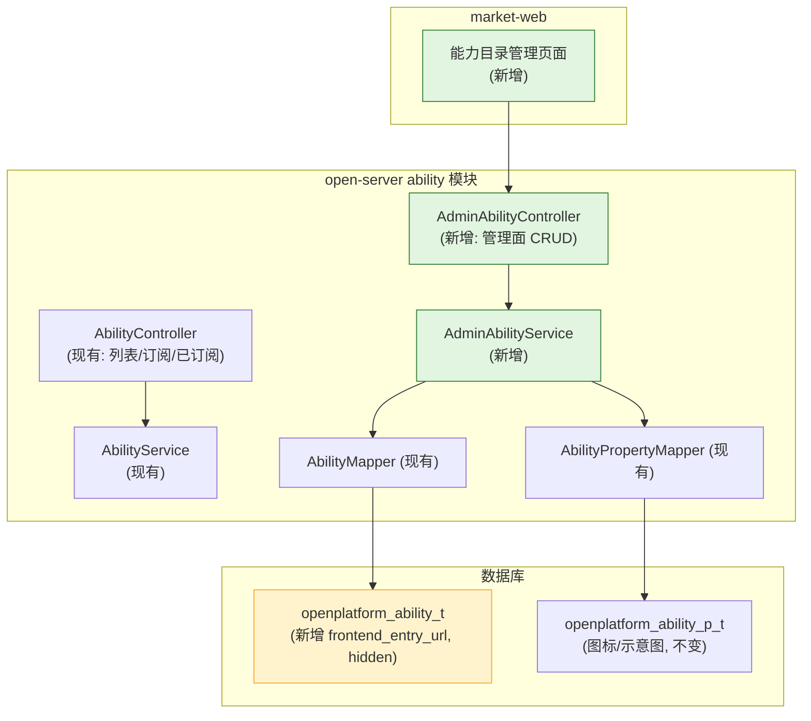

# 技术规划：嵌入能力平台面

**Feature ID**: EMBED-PLATFORM-001  
**规划版本**: v1.0  
**创建日期**: 2026-07-13  
**规划作者**: SDDU Plan Agent  
**规范版本**: spec.md v1.0

---

## 1. 架构分析

### 1.1 现有架构影响

**当前 ability 模块**（open-server）：

| 组件 | 现状 | 影响 |
|------|------|------|
| `AbilityTypeEnum` | 7 个硬编码常量 | 保持不动，新增自定义类型通过 DB 存储 |
| `AbilityController` | 3 个接口（list / subscribe / subscribed） | 不变，平台面新增独立 AdminController |
| `AbilityMapper` / `AbilityPropertyMapper` | 已有 CRUD 映射 | 平台面复用现有映射 |
| `Ability` 实体 | 映射 `openplatform_ability_t` | 新增字段 `frontendEntryUrl`、`hidden` |
| `AbilityProperty` 实体 | 映射 `openplatform_ability_p_t`（图标/示意图） | 不动，继续复用 |
| `AbilitySnapshotLoader` | 启动时加载 ability 到缓存 | 新增字段不影响 |

**关键决策**：admin 能力类型的 CRUD controller 放在 **market-server** 还是 **open-server**？

| 选项 | 说明 |
|------|------|
| 放在 open-server | 数据表 `openplatform_ability_t` 在 open-server 的 schema 中，复用现有 Mapper/Entity/Service |
| 放在 market-server | spec 指定"服务端：market-server"，但需跨服务访问 ability 数据 |

**决策**：AdminController 放在 **open-server** 中扩展，market-web 对接。数据直接写入 open-server 的已有表 `openplatform_ability_t`/`openplatform_ability_p_t`，由开放面直接读取，符合 NFR-003"写入即对开放面可见"的要求。

### 1.2 新增组件

| 组件 | 说明 | 所属模块 |
|------|------|---------|
| `AdminAbilityController` | 管理面控制器（列表/创建/编辑/删除） | open-server ability |
| `AdminAbilityService` / `AdminAbilityServiceImpl` | 管理面业务逻辑 | open-server ability |
| `AdminAbilityListRequest` | 列表请求 DTO（分页 + 模糊搜索） | open-server ability |
| `AdminAbilityVO` | 列表响应 VO（含新增字段） | open-server ability |
| `AdminAbilityCreateRequest` | 创建请求 DTO | open-server ability |
| `AdminAbilityUpdateRequest` | 编辑请求 DTO | open-server ability |
| Flyway migration 文件 | `openplatform_ability_t` 新增 `frontend_entry_url` / `hidden` 字段 | open-server DB |
| 前端页面（market-web） | 能力目录管理页面：列表页 + 创建/编辑表单 | market-web |

### 1.3 数据流

### 1.4 依赖关系图

## 2. 方案对比

### 方案 A：扩展 open-server ability 模块（推荐）

**描述**：在 open-server 的 ability 模块内新增 AdminAbilityController 和 AdminAbilityService，复用现有 Mapper/Entity。

| 维度 | 评价 |
|------|------|
| 优点 | 数据表在同一 schema，无需跨服务调用；复用现有能力（fileV2Service 文件上传、AbilityMapper）；写入即对开放面可见 |
| 缺点 | 与"服务端：market-server"的 spec 表述不一致 |
| 风险 | 低——只需新增 Controller+Service，不修改现有接口 |

### 方案 B：market-server 独立模块

**描述**：在 market-server 中新建独立 controller，跨服务访问 open-server 数据或直连同一 DB。

| 维度 | 评价 |
|------|------|
| 优点 | 与 spec"服务端：market-server"一致；体现职责分离 |
| 缺点 | 需要跨服务访问或重复创建 Mapper/Entity；增加部署耦合；写入操作与现有 open-server 异步问题 |
| 风险 | 中——跨服务调用的可靠性和数据一致性问题 |

## 3. 推荐方案

**选择方案 A**：在 open-server 的 ability 模块扩展 admin 能力。

理由：
1. `openplatform_ability_t` 表在 open-server 的 schema 中，直接操作最简洁
2. 复用现有 Mapper/Entity/Service，减少重复代码
3. 开放面（open-server 自身）读取同一数据源，写入即对开放面可见（NFR-003）
4. 不影响现有订阅/列表接口

> 注：spec 中"服务端：market-server"的表述在实际实现中调整为 open-server。market-web 作为前端调用 open-server 的 admin 接口。

## 4. 文件影响分析

### 新增文件

| 文件 | 说明 |
|------|------|
| `open-server/.../ability/controller/AdminAbilityController.java` | 管理面控制器 |
| `open-server/.../ability/service/AdminAbilityService.java` | 管理面业务接口 |
| `open-server/.../ability/service/impl/AdminAbilityServiceImpl.java` | 管理面业务实现 |
| `open-server/.../ability/dto/admin/AdminAbilityListRequest.java` | 列表请求 DTO |
| `open-server/.../ability/dto/admin/AdminAbilityCreateRequest.java` | 创建请求 DTO |
| `open-server/.../ability/dto/admin/AdminAbilityUpdateRequest.java` | 编辑请求 DTO |
| `open-server/.../ability/vo/admin/AdminAbilityVO.java` | 列表响应 VO |
| `open-server/.../ability/vo/admin/AdminAbilityDetailVO.java` | 详情 VO |
| `open-server/.../db/migration/V4__add_ability_admin_fields.sql` | DB 迁移 |
| `market-web/.../pages/AbilityAdmin/` | 前端管理页面（列表/创建/编辑/删除） |

### 修改文件

| 文件 | 修改内容 |
|------|---------|
| `open-server/.../ability/entity/Ability.java` | 新增 `frontendEntryUrl`、`hidden` 字段 |
| `open-server/.../ability/mapper/AbilityMapper.java` | 可能新增管理面查询方法 |
| `open-server/.../ability/mapper/AbilityPropertyMapper.java` | 可能新增按 abilityType 查询/删除方法 |
| `market-web/.../router/config.ts` | 新增能力目录管理路由 |

## 5. 风险评估

| 风险 | 影响 | 缓解措施 |
|------|------|---------|
| abilityType 编码手动输入可能不一致 | 数据混乱 | 前端提示推荐范围（≥100）；后端校验唯一性 |
| 文件上传（图标/示意图）依赖 fileV2Service | 联调阻塞 | Mock 阶段使用固定 URL 占位 |
| DB migration 与现有表结构冲突 | 部署失败 | 新增 migration V4，命名规范避免冲突 |

## 6. ADR

### ADR-001: Admin 能力类型 CRUD 放在 open-server 扩展

**状态**: ACCEPTED

**背景**：
- `openplatform_ability_t` 表位于 open-server 的 schema 中
- open-server ability 模块已有 AbilityMapper、AbilityPropertyMapper、fileV2Service
- spec 要求"写入即对开放面可见"
- spec 写"服务端：market-server"但实际数据在 open-server

**决策**：
在 open-server 的 ability 模块内新增 AdminAbilityController + AdminAbilityService。market-web 作为前端直接调用 open-server 的 admin 接口。

**后果**：
- 正面：复用现有 Mapper/Entity，无需跨服务，写入即时对开放面可见
- 负面：与 spec 中"服务端：market-server"的表述不符，需在 plan 中说明实际调整

### ADR-002: abilityType 编码规则

**状态**: ACCEPTED

**背景**：
- 现有 7 种预置类型使用 1-7 编码
- 自定义类型需要手动输入编码

**决策**：
- 1-7 保留给 `AbilityTypeEnum` 预置类型
- 自定义类型推荐编码 ≥ 100，后端校验唯一性（包括预置编码）
- 创建后不可修改

**后果**：
- 正面：业务字段可读性强，不依赖自增ID
- 负面：需要人工管理编码范围，无冲突时系统保障

---

## 7. 产物审查策略

| 审查产物 | 审查基准 |
|---------|---------|
| `build.md`（代码变更清单） | spec.md（规范基准） |
| AdminAbilityController.java | 接口参数校验、错误处理、权限校验 |
| AdminAbilityService.java | 业务逻辑完整性（创建/编辑/删除/列表） |
| V4 迁移文件 | 字段类型、默认值、约束 |

## 8. 产物验证策略

| 验证产物 | 验证基准 |
|---------|---------|
| AdminAbilityController 各接口 | spec.md FR-001 ~ FR-004 验收标准 |
| 数据库迁移 | 新增字段正确性、向前兼容 |
| 前端列表页面 | 字段展示完整、分页正常 |
| 创建/编辑表单 | 字段校验、文件上传、编码唯一性 |
| 删除操作 | 有订阅时禁止删除 |
