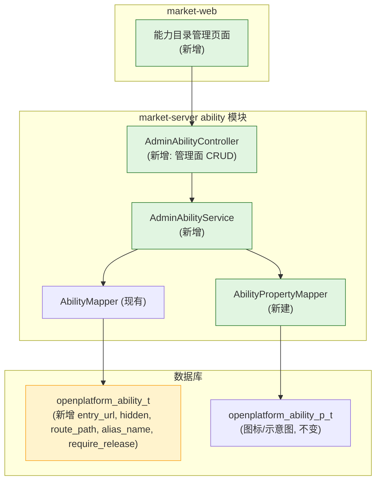
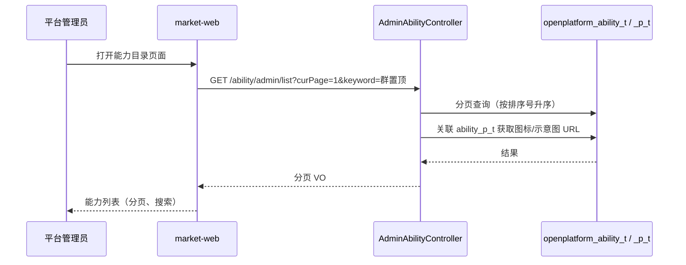
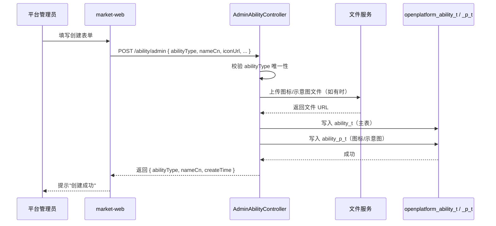
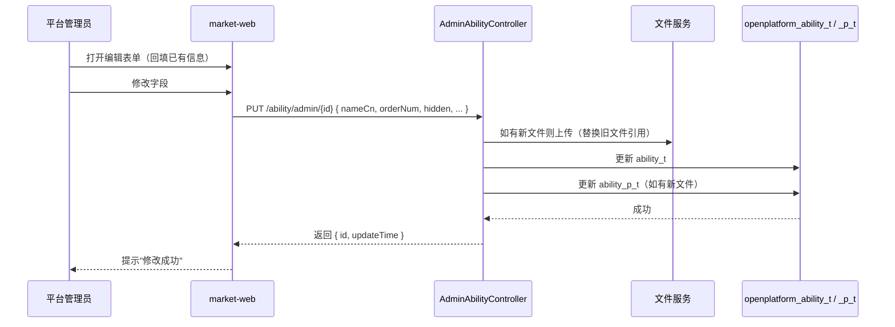
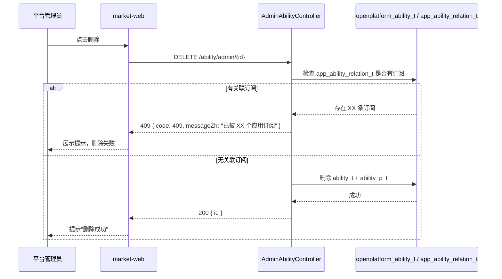

# 技术规划：嵌入能力平台面

**Feature ID**: EMBED-PLATFORM-001  
**规划版本**: v3.0  
**创建日期**: 2026-07-13  
**规划作者**: SDDU Plan Agent  
**规范版本**: spec.md v1.0

---

## 1. 架构分析

### 1.1 现有架构影响

**当前 ability 模块**（market-server ability 模块，从 approval 移出独立）：

| 组件 | 现状 | 影响 |
|------|------|------|
| `AbilityTypeEnum` | 7 个硬编码常量 | 保持不动，新增自定义类型通过 DB 存储 |
| `AbilityEntity` | 位于 `modules/approval/` | **移至** `modules/ability/`，新增 5 个字段 `entryUrl`、`hidden`、`routePath`、`aliasName`、`requireRelease`；`frontendEntryUrl` 改为 `entryUrl` |
| `AbilityMapper` | 位于 `modules/approval/` | **移至** `modules/ability/`，新增 CRUD 方法 |
| `AbilityPropertyMapper` (market-server) | 不存在 | **新建**（管理图标/示意图属性） |
| `AbilitySnapshotLoader` | 启动时加载 ability 到缓存 | 新增字段不影响 |

### 1.2 新增组件

| 组件 | 说明 | 路径 |
|------|------|------|
| `AdminAbilityController` | 管理面控制器（列表/创建/编辑/删除） | `market-server/.../ability/controller/AdminAbilityController.java` |
| `AdminAbilityService` / `AdminAbilityServiceImpl` | 管理面业务逻辑 | `market-server/.../ability/service/AdminAbilityService.java` |
| `AdminAbilityListRequest` | 列表请求 DTO（分页 + 模糊搜索） | `market-server/.../ability/dto/admin/AdminAbilityListRequest.java` |
| `AdminAbilityVO` | 列表响应 VO（含新增字段） | `market-server/.../ability/vo/admin/AdminAbilityVO.java` |
| `AdminAbilityDetailVO` | 详情 VO | `market-server/.../ability/vo/admin/AdminAbilityDetailVO.java` |
| `AdminAbilityCreateRequest` | 创建请求 DTO | `market-server/.../ability/dto/admin/AdminAbilityCreateRequest.java` |
| `AdminAbilityUpdateRequest` | 编辑请求 DTO | `market-server/.../ability/dto/admin/AdminAbilityUpdateRequest.java` |
| `AbilityPropertyMapper` | 图标/示意图属性 Mapper（新建） | `market-server/.../ability/mapper/AbilityPropertyMapper.java` |
| V4 迁移脚本 | `openplatform_ability_t` 新增 `entry_url`/`hidden`/`route_path`/`alias_name`/`require_release` 字段及 `ability_type` 类型调整 | `open-server/src/main/resources/db/migration/V4__add_ability_admin_fields.sql` |
| 前端页面（market-web） | 能力目录管理页面：列表页 + 创建/编辑表单 | market-web |

### 1.3 依赖关系图



## 2. 数据库设计

### 2.1 当前 `openplatform_ability_t`（迁移前）

```sql
CREATE TABLE `openplatform_ability_t`  (
  `id` bigint NOT NULL COMMENT '主键',
  `ability_name_cn` varchar(255) CHARACTER SET utf8mb4 COLLATE utf8mb4_unicode_ci NOT NULL COMMENT '能力中文名',
  `ability_name_en` varchar(255) CHARACTER SET utf8mb4 COLLATE utf8mb4_unicode_ci NOT NULL COMMENT '能力英文名',
  `ability_desc_cn` varchar(2000) CHARACTER SET utf8mb4 COLLATE utf8mb4_unicode_ci NOT NULL DEFAULT '' COMMENT '能力中文描述',
  `ability_desc_en` varchar(2000) CHARACTER SET utf8mb4 COLLATE utf8mb4_unicode_ci NOT NULL DEFAULT '' COMMENT '能力英文描述',
  `ability_type` tinyint(1) NOT NULL DEFAULT 0 COMMENT '能力类型 1-群置顶 2-群通知 3-链接增强 4-点对点通知 5-we码 6-应用入群通知 7-助手广场卡片',
  `order_num` int NOT NULL COMMENT '序号',
  `status` tinyint NULL DEFAULT 1 COMMENT '状态：0=失效, 1=有效',
  `create_by` varchar(100) CHARACTER SET utf8mb4 COLLATE utf8mb4_unicode_ci NULL DEFAULT NULL COMMENT '创建人',
  `create_time` datetime(3) NULL DEFAULT CURRENT_TIMESTAMP(3) COMMENT '创建时间',
  `last_update_by` varchar(100) CHARACTER SET utf8mb4 COLLATE utf8mb4_unicode_ci NULL DEFAULT NULL COMMENT '最后更新人',
  `last_update_time` datetime(3) NULL DEFAULT CURRENT_TIMESTAMP(3) ON UPDATE CURRENT_TIMESTAMP(3) COMMENT '最后更新时间',
  PRIMARY KEY (`id`) USING BTREE,
  INDEX `idx_ability_type`(`ability_type` ASC) USING BTREE
) ENGINE = InnoDB CHARACTER SET = utf8mb4 COLLATE = utf8mb4_unicode_ci COMMENT = '能力表' ROW_FORMAT = Dynamic;
```

### 2.2 当前 `openplatform_ability_p_t`（迁移前，本期不变）

```sql
CREATE TABLE `openplatform_ability_p_t`  (
  `id` bigint NOT NULL COMMENT '主键',
  `parent_id` bigint NOT NULL COMMENT '能力id',
  `property_name` varchar(255) CHARACTER SET utf8mb4 COLLATE utf8mb4_unicode_ci NOT NULL COMMENT '属性名',
  `property_value` varchar(2000) CHARACTER SET utf8mb4 COLLATE utf8mb4_unicode_ci NOT NULL DEFAULT '' COMMENT '属性值',
  `status` tinyint NULL DEFAULT 1 COMMENT '状态：0=失效, 1=有效',
  `create_by` varchar(100) CHARACTER SET utf8mb4 COLLATE utf8mb4_unicode_ci NULL DEFAULT NULL COMMENT '创建人',
  `create_time` datetime(3) NULL DEFAULT CURRENT_TIMESTAMP(3) COMMENT '创建时间',
  `last_update_by` varchar(100) CHARACTER SET utf8mb4 COLLATE utf8mb4_unicode_ci NULL DEFAULT NULL COMMENT '最后更新人',
  `last_update_time` datetime(3) NULL DEFAULT CURRENT_TIMESTAMP(3) ON UPDATE CURRENT_TIMESTAMP(3) COMMENT '最后更新时间',
  PRIMARY KEY (`id`) USING BTREE,
  INDEX `idx_parent_id`(`parent_id` ASC) USING BTREE
) ENGINE = InnoDB CHARACTER SET = utf8mb4 COLLATE = utf8mb4_unicode_ci COMMENT = '能力属性表' ROW_FORMAT = Dynamic;
```

### 2.3 本期修改后 `openplatform_ability_t`

```sql
CREATE TABLE `openplatform_ability_t`  (
  `id` bigint NOT NULL COMMENT '主键',
  `ability_name_cn` varchar(255) CHARACTER SET utf8mb4 COLLATE utf8mb4_unicode_ci NOT NULL COMMENT '能力中文名',
  `ability_name_en` varchar(255) CHARACTER SET utf8mb4 COLLATE utf8mb4_unicode_ci NOT NULL COMMENT '能力英文名',
  `ability_desc_cn` varchar(2000) CHARACTER SET utf8mb4 COLLATE utf8mb4_unicode_ci NOT NULL DEFAULT '' COMMENT '能力中文描述',
  `ability_desc_en` varchar(2000) CHARACTER SET utf8mb4 COLLATE utf8mb4_unicode_ci NOT NULL DEFAULT '' COMMENT '能力英文描述',
  `ability_type` tinyint NOT NULL DEFAULT 0 COMMENT '能力类型编码（1-7 预置，自定义类型统一分配，不区分范围）',
  `order_num` int NOT NULL COMMENT '序号',
  `status` tinyint NULL DEFAULT 1 COMMENT '状态：0=失效, 1=有效',
  `entry_url` varchar(512) CHARACTER SET utf8mb4 COLLATE utf8mb4_unicode_ci NULL DEFAULT NULL COMMENT '进入地址（微前端子应用入口）',
  `hidden` tinyint(1) NULL DEFAULT 0 COMMENT '是否在开放面展示：0=展示, 1=隐藏',
  `route_path` varchar(255) CHARACTER SET utf8mb4 COLLATE utf8mb4_unicode_ci NULL DEFAULT NULL COMMENT '路由路径（子应用激活路由）',
  `alias_name` varchar(100) CHARACTER SET utf8mb4 COLLATE utf8mb4_unicode_ci NULL DEFAULT NULL COMMENT '别名（子应用唯一标识）',
  `require_release` tinyint(1) NULL DEFAULT 0 COMMENT '是否需要版本发布才生效：0=即时生效, 1=需版本发布',
  `create_by` varchar(100) CHARACTER SET utf8mb4 COLLATE utf8mb4_unicode_ci NULL DEFAULT NULL COMMENT '创建人',
  `create_time` datetime(3) NULL DEFAULT CURRENT_TIMESTAMP(3) COMMENT '创建时间',
  `last_update_by` varchar(100) CHARACTER SET utf8mb4 COLLATE utf8mb4_unicode_ci NULL DEFAULT NULL COMMENT '最后更新人',
  `last_update_time` datetime(3) NULL DEFAULT CURRENT_TIMESTAMP(3) ON UPDATE CURRENT_TIMESTAMP(3) COMMENT '最后更新时间',
  PRIMARY KEY (`id`) USING BTREE,
  INDEX `idx_ability_type`(`ability_type` ASC) USING BTREE
) ENGINE = InnoDB CHARACTER SET = utf8mb4 COLLATE = utf8mb4_unicode_ci COMMENT = '能力表' ROW_FORMAT = Dynamic;
```

### 2.4 V4 迁移脚本

> ⚠️ 实际实施必须遵循 `../plan-code.md` §4 数据库脚本编写规范（幂等设计、每条语句独立、safe_add_column 等存储过程）。以下 SQL 仅为设计意图示意，不可直接用于生产。

```sql
-- V4__add_ability_admin_fields.sql

-- 1. 调整 ability_type 类型注释（去掉显示宽度，更新注释）
ALTER TABLE `openplatform_ability_t` 
  MODIFY COLUMN `ability_type` tinyint NOT NULL DEFAULT 0 COMMENT '能力类型编码（1-7 预置，自定义类型统一分配，不区分范围）';

-- 2. 新增嵌入能力相关字段
ALTER TABLE `openplatform_ability_t`
  ADD COLUMN `entry_url` varchar(512) CHARACTER SET utf8mb4 COLLATE utf8mb4_unicode_ci NULL DEFAULT NULL COMMENT '进入地址（微前端子应用入口）' AFTER `status`,
  ADD COLUMN `hidden` tinyint(1) NULL DEFAULT 0 COMMENT '是否在开放面展示：0=展示, 1=隐藏' AFTER `entry_url`,
  ADD COLUMN `route_path` varchar(255) CHARACTER SET utf8mb4 COLLATE utf8mb4_unicode_ci NULL DEFAULT NULL COMMENT '路由路径（子应用激活路由）' AFTER `hidden`,
  ADD COLUMN `alias_name` varchar(100) CHARACTER SET utf8mb4 COLLATE utf8mb4_unicode_ci NULL DEFAULT NULL COMMENT '别名（子应用唯一标识）' AFTER `route_path`,
  ADD COLUMN `require_release` tinyint(1) NULL DEFAULT 0 COMMENT '是否需要版本发布才生效：0=即时生效, 1=需版本发布' AFTER `alias_name`;
```

## 3. API设计

### 3.1 设计规范

**基础路径**：`/service/open/v2/ability/admin`

**认证方式**：管理面接口复用 market-server 自身的认证体系（Cookie/SSO），接口内校验当前用户角色是否为平台管理员（NFR-001）。

**响应格式**：统一使用 market-server 现有 `ApiResponse` 信封：

```json
// 成功
{ "code": "200", "messageZh": "操作成功", "messageEn": "Success", "data": { ... }, "page": null }

// 分页
{ "code": "200", "messageZh": "查询成功", "messageEn": "Success", "data": [ ... ], "page": { "curPage": 1, "pageSize": 20, "total": 123 } }

// 错误
{ "code": "400", "messageZh": "参数错误", "messageEn": "Bad Request", "data": null, "page": null }
```

**错误码**：

| 错误码 | 说明 |
|--------|------|
| 200 | 成功 |
| 400 | 参数错误/校验失败 |
| 403 | 无权限（非管理员） |
| 404 | 资源不存在 |
| 409 | 状态冲突（编码重复、有订阅等） |

**字段命名**：驼峰命名（camelCase），与现有 ability 模块保持一致。

| DB 列名 | Java 字段 | API 字段 |
|---------|----------|---------|
| `ability_type` | `abilityType` | `abilityType` |
| `ability_name_cn` | `abilityNameCn` | `nameCn` |
| `ability_name_en` | `abilityNameEn` | `nameEn` |
| `ability_desc_cn` | `abilityDescCn` | `descCn` |
| `ability_desc_en` | `abilityDescEn` | `descEn` |
| `order_num` | `orderNum` | `orderNum` |
| `entry_url` | `entryUrl` | `entryUrl` |
| `hidden` | `hidden` | `hidden` |
| `route_path` | `routePath` | `routePath` |
| `alias_name` | `aliasName` | `aliasName` |
| `require_release` | `requireRelease` | `requireRelease` |

### 3.2 接口清单

| # | 方法 | 路径 | 接口名称 | 对应 FR | 说明 |
|---|--------|------|---------|:------:|------|
| 1 | GET | `/ability/admin/list` | 查询能力列表 | FR-001 | 分页查询，支持关键字搜索 |
| 2 | POST | `/ability/admin` | 创建能力 | FR-002 | 创建新的能力类型 |
| 3 | PUT | `/ability/admin/{id}` | 更新能力 | FR-003 | 更新能力信息，abilityType 不可修改 |
| 4 | DELETE | `/ability/admin/{id}` | 删除能力 | FR-004 | 删除（含订阅检查） |

### 3.3 接口详细定义

---

#### #1 查询能力列表

`GET /service/open/v2/ability/admin/list`

**查询参数**

| 字段 | 类型 | 必填 | 说明 |
|------|------|:--:|------|
| curPage | int | ❌ | 页码，默认 1 |
| pageSize | int | ❌ | 每页数量，默认 20，最大 100 |
| keyword | string | ❌ | 按中文名/英文名模糊搜索 |
| sortField | string | ❌ | 排序字段，默认 `orderNum` |
| sortOrder | string | ❌ | 排序方向，`asc` / `desc`，默认 `asc` |

**响应体 `data[]`**

| 字段 | 类型 | 说明 |
|------|------|------|
| abilityType | int | 能力编码 |
| nameCn | string | 中文名 |
| nameEn | string | 英文名 |
| descCn | string | 中文描述 |
| descEn | string | 英文描述 |
| iconUrl | string | 图标 URL |
| diagramUrl | string | 示意图 URL（缩略图） |
| orderNum | int | 排序号 |
| entryUrl | string | 进入地址 |
| hidden | int | 是否在开放面展示（0=展示，1=隐藏） |
| routePath | string | 路由路径 |
| aliasName | string | 别名 |
| requireRelease | int | 是否需要版本发布才生效（0=即时生效，1=需版本发布） |
| createTime | string | 创建时间 |
| updateBy | string | 更新人 |
| updateTime | string | 更新时间 |

**数据流**：



---

#### #2 创建能力

`POST /service/open/v2/ability/admin`

**请求体**

| 字段 | 类型 | 必填 | 说明 |
|------|------|:--:|------|
| abilityType | int | ✅ | 能力编码（≥100），需唯一 |
| nameCn | string | ✅ | 中文名，最长 64 字符 |
| nameEn | string | ✅ | 英文名，最长 128 字符 |
| descCn | string | ❌ | 中文描述，最长 512 字符 |
| descEn | string | ❌ | 英文描述，最长 512 字符 |
| iconUrl | string | ❌ | 图标文件上传返回的 URL |
| diagramUrl | string | ❌ | 示意图文件上传返回的 URL |
| orderNum | int | ❌ | 排序号，默认 0 |
| entryUrl | string | ❌ | 进入地址（http/https 协议） |
| hidden | int | ❌ | 是否隐藏（0=展示，1=隐藏），默认 0 |
| routePath | string | ❌ | 路由路径（子应用激活路由） |
| aliasName | string | ❌ | 别名（子应用唯一标识） |
| requireRelease | int | ❌ | 是否需要版本发布才生效（0=即时生效，1=需版本发布），默认 0 |

**响应体 `data`**

| 字段 | 类型 | 说明 |
|------|------|------|
| abilityType | int | 创建的能力编码 |
| nameCn | string | 中文名 |
| createTime | string | 创建时间 |

**错误响应**

| code | 说明 |
|------|------|
| 400 | 参数校验失败（URL 格式、编码范围等） |
| 409 | abilityType 编码已被占用 |

**数据流**：



---

#### #3 更新能力

`PUT /service/open/v2/ability/admin/{id}`

**路径参数**

| 字段 | 类型 | 必填 | 说明 |
|------|------|:--:|------|
| id | string | ✅ | 能力 ID（数据库主键） |

**请求体**

| 字段 | 类型 | 必填 | 说明 |
|------|------|:--:|------|
| nameCn | string | ❌ | 中文名 |
| nameEn | string | ❌ | 英文名 |
| descCn | string | ❌ | 中文描述 |
| descEn | string | ❌ | 英文描述 |
| iconUrl | string | ❌ | 图标 URL（新文件上传后替换） |
| diagramUrl | string | ❌ | 示意图 URL |
| orderNum | int | ❌ | 排序号 |
| entryUrl | string | ❌ | 进入地址 |
| hidden | int | ❌ | 是否隐藏 |
| routePath | string | ❌ | 路由路径 |
| aliasName | string | ❌ | 别名 |
| requireRelease | int | ❌ | 是否需要版本发布才生效 |

> 所有字段可选，仅更新传入的字段。abilityType 不可修改。

**响应体 `data`**

| 字段 | 类型 | 说明 |
|------|------|------|
| id | string | 能力 ID |
| updateTime | string | 更新时间 |

**错误响应**

| code | 说明 |
|------|------|
| 404 | 能力不存在 |

**数据流**：



---

#### #4 删除能力

`DELETE /service/open/v2/ability/admin/{id}`

**路径参数**

| 字段 | 类型 | 必填 | 说明 |
|------|------|:--:|------|
| id | string | ✅ | 能力 ID |

**响应体 `data`**

| 字段 | 类型 | 说明 |
|------|------|------|
| id | string | 被删除的能力 ID |

**错误响应**

| code | 说明 |
|------|------|
| 404 | 能力不存在 |
| 409 | 有应用订阅该能力，无法删除 |

**数据流**：



## 4. 方案对比

### ~~方案 A：扩展 open-server ability 模块（已废弃：与 spec 矛盾）~~

~~**描述**：在 open-server 的 ability 模块内新增 AdminAbilityController 和 AdminAbilityService，复用现有 Mapper/Entity。~~

| ~~维度~~ | ~~评价~~ |
|:---:|:---:|
| ~~优点~~ | ~~数据表在同一 schema，无需跨服务调用；复用现有能力（fileV2Service 文件上传、AbilityMapper）；写入即对开放面可见~~ |
| ~~缺点~~ | ~~与"服务端：market-server"的 spec 表述不一致~~ |
| ~~风险~~ | ~~低——只需新增 Controller+Service，不修改现有接口~~ |

### ~~方案 B：market-server 扩展（已废弃：迁移脚本错放 market-server）~~

~~**描述**：在 market-server 新建独立 ability 模块，将 approval 模块中现有 AbilityEntity/AbilityMapper 迁移至独立模块，新建 AdminAbilityController + AdminAbilityService，直连同一 DB。~~

| ~~维度~~ | ~~评价~~ |
|:---:|:---:|
| ~~优点~~ | ~~与 spec"服务端：market-server"一致，职责分离清晰；ability 独立模块不再寄生 approval；market-server 已有 AbilityEntity + AbilityMapper，直连同库，无需跨服务；已有迁移基础设施~~ |
| ~~缺点~~ | ~~需要结构重组（将寄生在 approval 中的 ability 代码分离出来）~~ |
| ~~风险~~ | ~~中——需确保搬迁后 import 引用正确，全局替换无遗漏~~ |

### 方案 C：迁移放 open-server + CRUD 放 market-server 独立 ability 模块（推荐）

**描述**：V4 迁移脚本放 open-server（`openplatform_ability_t` 所在服务），Admin CRUD 代码放 market-server 新建独立 `modules/ability/` 模块，直连同一 DB。

| 维度 | 评价 |
|------|------|
| 优点 | 迁移在表所属服务管理，DB 一致性有保障；CRUD 与 spec"服务端：market-server"一致；ability 模块独立不寄生 approval |
| 缺点 | 需在两个服务各自维护部分代码 |
| 风险 | 低——迁移脚本单一文件，CRUD 模块独立清晰 |

## 5. 推荐方案

**选择方案 C**：迁移放 open-server + CRUD 放 market-server 独立 ability 模块。

理由：
1. V4 迁移脚本放在表所属服务（open-server）管理，DB 一致性有保障
2. CRUD 代码与 spec"服务端：market-server"一致，职责分离清晰
3. ability 独立模块不再寄生 approval，消除代码位置错误
4. market-server 已有 AbilityEntity + AbilityMapper 基线，直连同库 `openplatform_ability_t`，无需跨服务
5. 管理面与开放面代码分离，不污染 open-server 现有模块
6. 写入即对开放面可见（同一 DB，NFR-003）

## 6. 文件影响分析

> ⚠️ 文件按部署服务拆分：V4 迁移脚本在 **open-server**（表归属服务），其余所有 CRUD 代码在 **market-server**（ability 独立模块），前端页面在 **market-web**。

### 新增文件

| 文件 | 说明 |
|------|------|
| `market-server/.../ability/controller/AdminAbilityController.java` | 管理面控制器 |
| `market-server/.../ability/service/AdminAbilityService.java` | 管理面业务接口 |
| `market-server/.../ability/service/impl/AdminAbilityServiceImpl.java` | 管理面业务实现 |
| `market-server/.../ability/dto/admin/AdminAbilityListRequest.java` | 列表请求 DTO |
| `market-server/.../ability/dto/admin/AdminAbilityCreateRequest.java` | 创建请求 DTO |
| `market-server/.../ability/dto/admin/AdminAbilityUpdateRequest.java` | 编辑请求 DTO |
| `market-server/.../ability/vo/admin/AdminAbilityVO.java` | 列表响应 VO |
| `market-server/.../ability/vo/admin/AdminAbilityDetailVO.java` | 详情 VO |
| `market-server/.../ability/mapper/AbilityPropertyMapper.java` | 图标/示意图属性 Mapper（新建） |
| `open-server/src/main/resources/db/migration/V4__add_ability_admin_fields.sql` | DB 迁移（open-server） |
| `market-web/.../router/routeRedBlue/ability-admin/` | 前端管理页面（列表/创建/编辑/删除，含 index.tsx + components/ + thunk.ts） |

### 修改文件

| 文件 | 修改内容 |
|------|---------|
| `market-server/.../ability/entity/AbilityEntity.java` | `frontendEntryUrl` 改为 `entryUrl`；新增 `hidden`、`routePath`、`aliasName`、`requireRelease` 字段；包路径从 approval 修正为 ability |
| `market-server/.../ability/mapper/AbilityMapper.java` | 新增管理面查询方法（分页列表）；包路径从 approval 修正为 ability |
| `market-server/src/main/resources/mapper/AbilityMapper.xml` | 新增 resultMap 字段映射 + 分页查询 SQL |
| `market-web/.../router/index.tsx` | 新增 ability-admin import + Route |

## 7. 风险评估

| 风险 | 影响 | 缓解措施 |
|------|------|---------|
| abilityType 编码手动输入可能不一致 | 数据混乱 | 后端校验唯一性 |
| 文件上传（图标/示意图）需在 market-server 侧处理 | 联调阻塞 | Mock 阶段使用固定 URL 占位 |
| DB migration 与现有表结构冲突 | 部署失败 | 新增 migration V4，命名规范避免冲突 |
| market-server 需新建 AbilityPropertyMapper | 重复实现 | 参照 open-server 现有 AbilityPropertyMapper 实现简化版，仅包含 admin 所需方法 |

## 8. ADR

### ADR-001: Admin 能力 CRUD 放在 market-server 扩展（替代原 open-server 方案）

**状态**: ACCEPTED（原 open-server 方案已废弃）

**背景**：
- spec 指定"服务端：market-server"
- market-server 已有 AbilityEntity + AbilityMapper，直连 `openplatform_ability_t`
- market-server 已有迁移基础设施
- 原方案（open-server 扩展）已废弃，与 spec 矛盾

**决策**：
在 market-server 新建独立 ability 模块，将 approval 模块中现有 AbilityEntity/AbilityMapper 迁移至独立模块，新建 AdminAbilityController + AdminAbilityService。market-web 作为前端调用 market-server 的 admin 接口。

**后果**：
- 正面：与 spec 一致，职责分离清晰，管理面与开放面代码隔离
- 正面：market-server 已有基础设施，无需从零搭建
- 负面：需要在 market-server 侧新建 PropertyMapper（图标/示意图）

### ADR-002: abilityType 编码规则

**状态**: ACCEPTED（已更新）

**背景**：
- 现有 7 种预置类型使用 1-7 编码
- 自定义类型需要手动输入编码

**决策**：
- 1-7 保留给 `AbilityTypeEnum` 预置类型（群置顶、群通知、链接增强、点对点通知、we码、应用入群通知、助手广场卡片）
- 自定义类型统一在 tinyint 范围内分配，不区分类型大小
- 系统校验唯一性（包括已创建的记录和预置编码中的值）
- 创建后不可修改

**后果**：
- 正面：业务字段可读性强，不依赖自增ID；自定义不再受 ≥100 约束，更灵活
- 负面：需要前端提示避免与预置编码冲突，人工管理编码值

### ADR-004: require_release 字段替代硬编码能力类型排除

**状态**: ACCEPTED

**背景**：
- 现有 `VersionServiceImpl.createVersion()` 第173行硬编码排除 `GROUP_JOIN_NOTIFICATION`（type=6），逻辑为 `!Objects.equals(r.getAbilityType(), AbilityTypeEnum.GROUP_JOIN_NOTIFICATION.getCode())`
- 新增的自定义能力也需要按需控制是否需要版本发布后才生效，硬编码方式不可扩展

**决策**：
- `openplatform_ability_t` 新增 `require_release` 字段（tinyint, 默认0）
- 0 = 即时生效，订阅后无需等待版本发布即可使用（如 type=6 应用入群通知）
- 1 = 需要应用版本发布后才允许用户使用（如卡片类、群置顶等）
- 将 `VersionServiceImpl.createVersion()` 中的硬编码过滤逻辑改为按 `require_release = 1` 字段过滤
- 改造位置：`open-server/.../version/service/impl/VersionServiceImpl.java`

**后果**：
- 正面：能力是否需要版本发布由 DB 字段控制，新增自定义能力无需改代码
- 正面：与现有预置能力行为一致（type=6 现有即时生效行为不变）
- 负面：需确保迁移后 type=6 的 `require_release` 默认为 0，保持行为一致

> **关于 ADR-003 跳号说明**：修订记录中 v1.4 由 v1.3 直接新增 ADR-004，从未产生过 ADR-003。推测 ADR-003 在规划过程中被 ADR-004 吸收或废弃，故跳号处理，不再补录。

---

## 9. 产物审查策略

> 审查基准详见 `../plan-code.md`（父级共享代码规范）（代码规范，沿用能力开放平台已有技术标准）。以下列出本 Feature 的审查产物和对应检查项。

### 9.1 审查基准

| 类别 | 基准文档 |
|------|---------|
| 代码规范 | `../plan-code.md`（父级共享代码规范）（注释/命名/异常/日志/测试等 16 条规范） |
| 功能需求 | `spec.md`（FR-001 ~ FR-004 验收标准） |
| 数据库设计 | plan.md §2（字段类型/默认值/约束） |

### 9.2 审查清单

| 审查产物 | 计划审查内容 |
|---------|------------|
| `build.md`（代码变更清单） | spec.md（规范基准） |
| AdminAbilityController.java | 接口参数校验、错误处理、权限校验；对照 ../plan-code.md（父级共享代码规范）注释/异常规范 |
| AdminAbilityService.java | 业务逻辑完整性（创建/编辑/删除/列表）；对照 ../plan-code.md（父级共享代码规范）事务/日志规范 |
| AdminAbilityCreateRequest.java 等 DTO | 字段校验注解、命名规范 |
| AdminAbilityVO.java 等 VO | 字段映射、序列化规范 |
| AbilityEntity.java | 新增字段映射、Lombok 注解 |
| V4 迁移文件 | 字段类型、默认值、约束 |
| 前端页面（market-web） | 组件结构、API 调用、错误处理 |

## 10. 产物验证策略

验证分三层执行：数据库脚本 → 后端代码 → 前端页面，每层验证通过后才进入下一层。

---

### 10.1 数据库脚本验证

> **脚本编写规范**: V4 脚本实施时严格遵循 `../plan-code.md` §4（幂等设计 + 存储过程 + 无事务包裹），验证时确保脚本可重复执行不报错。

**⚠️ 安全原则**: 数据库变更影响面大，验证全程**禁止直接操作原库原表**。必须先在独立副本库上完成全部验证，确认无误后方可在原库执行。

**验证流程**: 创建隔离副本 → 全量复制原库数据 → 副本上执行迁移 → 验证 → 通过后推广到原库

---

#### 10.1.1 阶段一：创建隔离副本库

> 使用 root 账号创建独立测试库，避免与原库产生任何交叉影响。

**前置条件**: 已获取 MySQL root 凭证（`ROOT_USER` / `ROOT_PASS`），以下变量需提前配置：

```bash
# === 数据库连接配置 ===
ROOT_USER="root"
ROOT_PASS="root"
ORIGINAL_DB="openapp"                          # 原库名
COPY_DB="openapp_v4_migration_test"            # 副本库名（验证专用）
MYSQL_HOST="192.168.3.155"
MYSQL_PORT="3306"

export MYSQL_PWD="${ROOT_PASS}"
MYSQL_CMD="mysql -h ${MYSQL_HOST} -P ${MYSQL_PORT} -u ${ROOT_USER}"
MYSQLDUMP_CMD="mysqldump -h ${MYSQL_HOST} -P ${MYSQL_PORT} -u ${ROOT_USER}"
```

**步骤 1: 创建空副本库**

```bash
${MYSQL_CMD} -e "CREATE DATABASE IF NOT EXISTS ${COPY_DB}
  CHARACTER SET utf8mb4 COLLATE utf8mb4_unicode_ci;"
echo "✅ 副本库 ${COPY_DB} 创建成功"
```

**步骤 2: 全量复制原库表结构 + 数据到副本库**

```bash
# 导出原库全部表结构和数据（不含存储过程/函数/事件，以降低风险）
${MYSQLDUMP_CMD} --single-transaction --routines=0 --events=0 \
  --triggers=0 ${ORIGINAL_DB} \
  | ${MYSQL_CMD} ${COPY_DB}

echo "✅ 原库 ${ORIGINAL_DB} → 副本库 ${COPY_DB} 全量复制完成"
```

**步骤 3: 验证副本库数据完整性**

```bash
# 对比原库与副本库的表数量和行数
${MYSQL_CMD} -e "
SELECT '原库' AS source, TABLE_NAME, TABLE_ROWS
  FROM information_schema.TABLES
  WHERE TABLE_SCHEMA='${ORIGINAL_DB}' AND TABLE_NAME='openplatform_ability_t'
UNION ALL
SELECT '副本库', TABLE_NAME, TABLE_ROWS
  FROM information_schema.TABLES
  WHERE TABLE_SCHEMA='${COPY_DB}' AND TABLE_NAME='openplatform_ability_t';
"
# 预期: 原库和副本库 openplatform_ability_t 行数一致
```

---

#### 10.1.2 阶段二：副本库上执行 V4 迁移

> 使用 mysql 命令行在隔离环境执行迁移。

**步骤 4: mysql 命令行执行迁移**

通过 mysql 命令行指向副本库执行 V4 脚本：

```bash
mysql -h ${MYSQL_HOST} -P ${MYSQL_PORT} -u ${ROOT_USER} -p${ROOT_PASS} ${COPY_DB} \
  < open-server/src/main/resources/db/migration/V4__add_ability_admin_fields.sql
```

**检查迁移结果**:

```bash
# 验证 V4 脚本已执行（检查新字段是否存在）
${MYSQL_CMD} ${COPY_DB} -e "DESC openplatform_ability_t" \
  | grep -q "entry_url" && echo "✅ V4 脚本已执行" || echo "❌ V4 脚本未执行"
```

---

#### 10.1.3 阶段三：副本库上验证变更

> 在副本库执行所有验证，确认新字段正确、已有数据无损。

**步骤 5: 验证新字段结构**

```bash
# 5.1 检查 5 个新字段存在且类型正确
${MYSQL_CMD} ${COPY_DB} -e "DESC openplatform_ability_t" \
  | grep -E "entry_url|hidden|route_path|alias_name|require_release"

# 预期输出示例:
# entry_url      | varchar(512)  | YES  |     | NULL    |
# hidden         | tinyint(1)    | YES  |     | 0       |
# route_path     | varchar(255)  | YES  |     | NULL    |
# alias_name     | varchar(100)  | YES  |     | NULL    |
# require_release| tinyint(1)    | YES  |     | 0       |

# 5.2 验证 ability_type 类型已调整为 tinyint（无显示宽度）
${MYSQL_CMD} ${COPY_DB} -e "SHOW COLUMNS FROM openplatform_ability_t LIKE 'ability_type'\G"
# 预期: Type 列为 tinyint（不是 tinyint(1) 等其他形式）
```

**步骤 6: 验证已有数据完整性（无损检查）**

```bash
# 6.1 行数一致性
${MYSQL_CMD} -e "
SELECT
  (SELECT COUNT(*) FROM ${ORIGINAL_DB}.openplatform_ability_t) AS original_rows,
  (SELECT COUNT(*) FROM ${COPY_DB}.openplatform_ability_t) AS copy_rows;
"
# 预期: original_rows = copy_rows

# 6.2 已有行新增字段为 NULL 或默认值（不应有脏数据）
${MYSQL_CMD} ${COPY_DB} -e \
  "SELECT COUNT(*) AS rows_with_defaults,
          SUM(CASE WHEN entry_url IS NOT NULL THEN 1 ELSE 0 END) AS non_null_entry_url,
          SUM(CASE WHEN hidden != 0 THEN 1 ELSE 0 END) AS non_default_hidden,
          SUM(CASE WHEN route_path IS NOT NULL THEN 1 ELSE 0 END) AS non_null_route_path,
          SUM(CASE WHEN alias_name IS NOT NULL THEN 1 ELSE 0 END) AS non_null_alias_name,
          SUM(CASE WHEN require_release != 0 THEN 1 ELSE 0 END) AS non_default_require_release
   FROM openplatform_ability_t;"
# 预期: 已有行的新字段均为 NULL/0（迁移不应修改现有数据）

# 6.3 抽样对比已有行的核心字段是否一致
${MYSQL_CMD} -e \
  "SELECT a.id, a.ability_name_cn, a.ability_type, a.status,
          b.ability_name_cn AS orig_cn, b.ability_type AS orig_type
   FROM ${COPY_DB}.openplatform_ability_t a
   JOIN ${ORIGINAL_DB}.openplatform_ability_t b ON a.id = b.id
   WHERE a.ability_name_cn != b.ability_name_cn
      OR a.ability_type != b.ability_type
      OR a.status != b.status
   LIMIT 10;"
# 预期: empty set（核心业务字段无漂移）
```

**步骤 7: 功能验证 — CRUD 操作在迁移后的表上正常**

```bash
# 7.1 INSERT：创建新记录（含全部新字段）
${MYSQL_CMD} ${COPY_DB} -e \
  "INSERT INTO openplatform_ability_t
     (id, ability_name_cn, ability_name_en, ability_type, order_num,
      entry_url, hidden, route_path, alias_name, require_release,
      status, create_by, create_time, last_update_by, last_update_time)
   VALUES
     (99991, '迁移验证-创建', 'MigrationTest-Create', 200, 1,
      'http://example.com/test', 0, '/test', 'test-app', 0,
      1, 'migration_test', NOW(), 'migration_test', NOW());"
echo "✅ 新字段 INSERT 成功"

# 7.2 UPDATE：更新新字段值
${MYSQL_CMD} ${COPY_DB} -e \
  "UPDATE openplatform_ability_t
   SET entry_url = 'http://example.com/updated',
       hidden = 1,
       require_release = 1
   WHERE id = 99991;"
echo "✅ 新字段 UPDATE 成功"

# 7.3 SELECT：按新字段查询
${MYSQL_CMD} ${COPY_DB} -e \
  "SELECT id, entry_url, hidden, require_release
   FROM openplatform_ability_t
   WHERE hidden = 1 AND require_release = 1;"
echo "✅ 新字段 SELECT 条件查询成功"

# 7.4 DELETE：清理测试数据
${MYSQL_CMD} ${COPY_DB} -e "DELETE FROM openplatform_ability_t WHERE id = 99991;"
echo "✅ 测试数据清理完成"
```

**步骤 8: 关联表影响检查**

```bash
# 8.1 确认 openplatform_ability_p_t（属性表）数据未受影响
${MYSQL_CMD} -e \
  "SELECT (SELECT COUNT(*) FROM ${ORIGINAL_DB}.openplatform_ability_p_t) AS orig_prop_rows,
          (SELECT COUNT(*) FROM ${COPY_DB}.openplatform_ability_p_t) AS copy_prop_rows;"
# 预期: orig_prop_rows = copy_prop_rows

# 8.2 确认 openplatform_app_ability_relation_t（订阅关系表）数据未受影响
${MYSQL_CMD} -e \
  "SELECT (SELECT COUNT(*) FROM ${ORIGINAL_DB}.openplatform_app_ability_relation_t) AS orig_rel_rows,
          (SELECT COUNT(*) FROM ${COPY_DB}.openplatform_app_ability_relation_t) AS copy_rel_rows;"
# 预期: orig_rel_rows = copy_rel_rows
```

---

#### 10.1.4 阶段四：验证通过，推广到原库

> ⚠️ 仅当前三个阶段全部通过后，才允许在原库执行迁移。

**前置检查清单**（全部 ✅ 后方可继续）:

| # | 检查项 | 状态 |
|---|--------|:----:|
| 1 | V4 脚本已成功执行（新字段存在） | ☐ |
| 2 | 5 个新字段存在且类型正确 | ☐ |
| 3 | ability_type 类型已调整为 tinyint | ☐ |
| 4 | 原库与副本库行数一致（无数据丢失） | ☐ |
| 5 | 已有行新字段均为 NULL/默认值（无脏数据） | ☐ |
| 6 | 核心业务字段抽样对比一致（无漂移） | ☐ |
| 7 | INSERT/UPDATE/SELECT/DELETE 新字段均正常 | ☐ |
| 8 | 关联表（_p_t / _relation_t）数据未受影响 | ☐ |

**步骤 9: 原库执行迁移**

```bash
mysql -h ${MYSQL_HOST} -P ${MYSQL_PORT} -u ${ROOT_USER} -p${ROOT_PASS} ${ORIGINAL_DB} \
  < open-server/src/main/resources/db/migration/V4__add_ability_admin_fields.sql

# 验证原库新字段
${MYSQL_CMD} ${ORIGINAL_DB} -e "DESC openplatform_ability_t" \
  | grep -q "entry_url" && echo "✅ 原库 V4 脚本已执行" || echo "❌ 原库执行失败"
```

**步骤 10: 原库迁移后快速验证**

```bash
# 抽样验证原库新字段（至少检查首行和末行）
${MYSQL_CMD} ${ORIGINAL_DB} -e \
  "SELECT id, ability_name_cn, entry_url, hidden, route_path, alias_name, require_release
   FROM openplatform_ability_t ORDER BY id LIMIT 3;"

${MYSQL_CMD} ${ORIGINAL_DB} -e \
  "SELECT id, ability_name_cn, entry_url, hidden, route_path, alias_name, require_release
   FROM openplatform_ability_t ORDER BY id DESC LIMIT 3;"
```

**步骤 11: 清理副本库（可选，迁移成功后可删除）**

```bash
# ${MYSQL_CMD} -e "DROP DATABASE IF EXISTS ${COPY_DB};"
# echo "🗑️ 副本库 ${COPY_DB} 已清理"
```

---

#### 10.1.5 回滚预案

若原库迁移后发现问题，执行以下步骤回滚：

```bash
# 1. 确认回滚操作（无迁移记录表，直接执行逆向 DDL）

# 2. 删除新增字段（逆向 DDL）
${MYSQL_CMD} ${ORIGINAL_DB} -e \
  "ALTER TABLE openplatform_ability_t
   DROP COLUMN entry_url,
   DROP COLUMN hidden,
   DROP COLUMN route_path,
   DROP COLUMN alias_name,
   DROP COLUMN require_release;"

# 3. 恢复 ability_type 原类型（如有需要）
${MYSQL_CMD} ${ORIGINAL_DB} -e \
  "ALTER TABLE openplatform_ability_t
   MODIFY COLUMN ability_type tinyint(1) NOT NULL DEFAULT 0
   COMMENT '能力类型 1-群置顶 2-群通知 3-链接增强 4-点对点通知 5-we码 6-应用入群通知 7-助手广场卡片';"

echo "⚠️ 原库已回滚到 V4 迁移前状态"
```

**验证产物**:
- V4 脚本执行日志（副本库 + 原库两份）
- 数据完整性对比日志（行数 / 字段抽样 / 关联表）
- CRUD 功能验证截图
- 前置检查清单（8 项全部打勾）

---

### 10.2 后端代码验证

#### 10.2.1 Java 单元测试

**框架与规范**: JUnit 5 (Jupiter) + Mockito，参考 `open-server/src/test/java/com/xxx/it/works/wecode/v2/` 现有测试模式。

**测试目录**: `market-server/src/test/java/com/xxx/it/works/wecode/v2/modules/ability/`

**测试文件清单**:

| 测试类 | 测试对象 | 覆盖场景 |
|--------|---------|---------|
| `AdminAbilityControllerTest.java` | `AdminAbilityController` | 参数校验、正常响应、异常响应、权限校验(403) |
| `AdminAbilityServiceTest.java` | `AdminAbilityServiceImpl` | 列表分页查询、创建(编码唯一性)、编辑(部分更新/abilityType不可改)、删除(有订阅则拒绝) |
| `AbilityEntityTest.java` | `AbilityEntity` | entryUrl/hidden/routePath/aliasName/requireRelease 字段映射 |

**测试层级与标记**:

| Level | 说明 | 触发条件 | 预期时间 |
|:-----:|------|---------|:--------:|
| L0 | 基础单元测试（字段映射、DTO 序列化） | 每次 commit | <3s |
| L1 | 核心 CRUD（正常流程） | PR 门禁 | <30s |
| L2 | 业务规则（唯一性校验、订阅检查、乐观锁冲突） | 每日回归 | <1min |
| L4 | 边界/反向（空参数、超长字符串、非法 URL 格式、不存在的 ID） | 发布前 | <2min |

**测试示例 — AdminAbilityService 创建能力**:

```java
package com.xxx.it.works.wecode.v2.modules.ability.service;

import com.xxx.it.works.wecode.v2.modules.ability.dto.admin.AdminAbilityCreateRequest;
import com.xxx.it.works.wecode.v2.modules.ability.entity.AbilityEntity;
import com.xxx.it.works.wecode.v2.modules.ability.mapper.AbilityMapper;
import org.junit.jupiter.api.*;
import org.mockito.*;

import static org.junit.jupiter.api.Assertions.*;
import static org.mockito.ArgumentMatchers.any;
import static org.mockito.Mockito.*;

@DisplayName("AdminAbilityService — 能力管理业务逻辑")
class AdminAbilityServiceTest {

    @Mock
    private AbilityMapper abilityMapper;

    @InjectMocks
    private AdminAbilityServiceImpl adminAbilityService;

    @BeforeEach
    void setUp() {
        MockitoAnnotations.openMocks(this);
    }

    @Test
    @DisplayName("创建能力 — 成功")
    void testCreate_Success() {
        AdminAbilityCreateRequest req = AdminAbilityCreateRequest.builder()
            .abilityType(100)
            .nameCn("测试能力").nameEn("TestAbility")
            .entryUrl("http://example.com").build();

        when(abilityMapper.insert(any(AbilityEntity.class))).thenReturn(1);

        AbilityEntity result = adminAbilityService.create(req);
        assertNotNull(result);
        assertEquals(100, result.getAbilityType());
        assertEquals("测试能力", result.getAbilityNameCn());
    }

    @Test
    @DisplayName("创建能力 — abilityType 重复应拒绝")
    void testCreate_DuplicateAbilityType() {
        AdminAbilityCreateRequest req = AdminAbilityCreateRequest.builder()
            .abilityType(1).nameCn("冲突").nameEn("Conflict").build();

        when(abilityMapper.countByAbilityType(1)).thenReturn(1);

        assertThrows(BusinessException.class, () -> adminAbilityService.create(req));
    }

    @Test
    @DisplayName("创建能力 — entryUrl 格式非法应拒绝")
    void testCreate_InvalidEntryUrl() {
        AdminAbilityCreateRequest req = AdminAbilityCreateRequest.builder()
            .abilityType(101).nameCn("测试").nameEn("Test")
            .entryUrl("not-a-url").build();

        assertThrows(BusinessException.class, () -> adminAbilityService.create(req));
    }
}
```

**执行命令**:
```bash
# 运行所有 unit test
mvn -f market-server/pom.xml test

# 按测试标记运行
mvn -f market-server/pom.xml test -Dgroups="L0,L1"
```

#### 10.2.2 Python 集成测试

**框架与规范**: pytest + requests + pymysql，参考 `open-server/src/test/python/` 现有测试模式（L0-L4 标记、`api()` 客户端、`db()` 数据库助手、auto-cleanup fixtures）。

**测试目录**: `market-server/src/test/python/modules/ability/`

**基础设施复用**:
- API 客户端包装 `api(method, path, body)` — 复用 `common/client.py` 模式，base URL 指向 market-server
- DB 助手 `db(sql)` — 复用 `common/db.py` 模式
- 标记定义 — 复用 `pytest.ini` 的 L0-L4 标记
- 操作日志断言 `assert_operate_log(keyword)` — 复用 `conftest.py` 模式

**测试文件清单**:

| 文件 | 覆盖接口 | 标记 |
|------|---------|:----:|
| `test_admin_list.py` | `GET /service/open/v2/ability/admin/list` | L1, L2, L4 |
| `test_admin_create.py` | `POST /service/open/v2/ability/admin` | L1, L2, L4 |
| `test_admin_update.py` | `PUT /service/open/v2/ability/admin/{id}` | L1, L2, L4 |
| `test_admin_delete.py` | `DELETE /service/open/v2/ability/admin/{id}` | L1, L2, L4 |

**测试示例 — 创建能力接口**:

```python
# market-server/src/test/python/modules/ability/test_admin_create.py

import pytest
import re
from common import api, db, db_val

class TestAbilityAdminCreate:
    """能力创建接口 — 核心 CRUD 测试"""

    @pytest.mark.L1
    def test_create_basic(self):
        """创建能力 — 基本场景"""
        resp = api("POST", "/ability/admin", {
            "abilityType": 100,
            "nameCn": "集成测试能力",
            "nameEn": "IntegrationTestAbility",
            "descCn": "自动创建的测试能力",
            "orderNum": 0
        })
        assert resp.status_code == 200
        data = resp.json()
        assert data["code"] == "200"
        assert data["data"]["abilityType"] == 100
        assert data["data"]["nameCn"] == "集成测试能力"
        assert isinstance(data["data"]["createTime"], str)

        # 清理: 删除测试创建的能力
        ability_id = data["data"]["id"]
        api("DELETE", f"/ability/admin/{ability_id}")

    @pytest.mark.L1
    def test_create_with_all_fields(self):
        """创建能力 — 填写全部字段（含 QianKun 三要素）"""
        resp = api("POST", "/ability/admin", {
            "abilityType": 101,
            "nameCn": "全字段能力",
            "nameEn": "FullFieldAbility",
            "descCn": "包含了全部字段的能力",
            "descEn": "Ability with all fields",
            "orderNum": 10,
            "entryUrl": "http://localhost:8080/child-app",
            "hidden": 0,
            "routePath": "/full-ability",
            "aliasName": "full-ability-app",
            "requireRelease": 1
        })
        assert resp.status_code == 200
        data = resp.json()
        assert data["data"]["entryUrl"] == "http://localhost:8080/child-app"
        assert data["data"]["routePath"] == "/full-ability"
        assert data["data"]["aliasName"] == "full-ability-app"
        assert data["data"]["requireRelease"] == 1

        # 清理
        ability_id = resp.json()["data"]["id"]
        api("DELETE", f"/ability/admin/{ability_id}")

    @pytest.mark.L2
    def test_create_duplicate_ability_type(self):
        """创建能力 — abilityType 重复应返回 409"""
        # 先创建一个
        resp1 = api("POST", "/ability/admin", {
            "abilityType": 102,
            "nameCn": "首次创建",
            "nameEn": "FirstCreate"
        })
        assert resp1.status_code == 200

        # 再用相同编码创建
        resp2 = api("POST", "/ability/admin", {
            "abilityType": 102,
            "nameCn": "重复创建",
            "nameEn": "DuplicateCreate"
        })
        assert resp2.status_code == 409
        data = resp2.json()
        assert data["code"] == "409"

        # 清理
        ability_id = resp1.json()["data"]["id"]
        api("DELETE", f"/ability/admin/{ability_id}")

    @pytest.mark.L4
    def test_create_empty_name(self):
        """创建能力 — 中文名为空应返回 400"""
        resp = api("POST", "/ability/admin", {
            "abilityType": 103,
            "nameCn": "",
            "nameEn": "EmptyCn"
        })
        assert resp.status_code == 400

    @pytest.mark.L4
    def test_create_invalid_entry_url(self):
        """创建能力 — entryUrl 格式非法应返回 400"""
        resp = api("POST", "/ability/admin", {
            "abilityType": 104,
            "nameCn": "非法URL",
            "nameEn": "InvalidUrl",
            "entryUrl": "not-a-valid-url"
        })
        assert resp.status_code == 400
```

**执行命令**:
```bash
cd market-server/src/test/python

# L1 核心测试（PR 门禁）
pytest modules/ability/ -m L1 -v

# 全量测试（每日回归）
pytest modules/ability/ -v

# 生成 HTML 报告
pytest modules/ability/ --html=reports/ability-admin-report.html --self-contained-html
```

---

### 10.3 前端页面验证（Playwright / Python）

**目标**: 通过 Playwright + pytest 自动化交互测试，验证列表/创建/编辑/删除四个核心用户流程在真实浏览器中的行为。

> **语言选择**: 使用 Python 版 Playwright（`pytest-playwright`），与前端 JS 代码完全隔离，保持测试栈统一为 Python 生态（与 §10.2.2 集成测试一致）。

**验证环境**:
- 测试框架: `pytest` + `pytest-playwright` (sync API)
- 测试浏览器: Chromium (Playwright 内置)
- 目标地址: market-web 开发服务器 (如 `http://localhost:3000`)
- 前置条件: market-server 已启动，已有测试管理员账号登录态

---

#### 10.3.1 Playwright 配置

**依赖安装**:

```bash
pip install pytest-playwright
playwright install chromium
```

**pytest 配置**: `market-web/tests/conftest.py`

```python
# market-web/tests/conftest.py
import pytest


@pytest.fixture(scope="session")
def browser_context_args(browser_context_args):
    """全局浏览器上下文配置"""
    return {
        **browser_context_args,
        "viewport": {"width": 1920, "height": 1080},
        "locale": "zh-CN",
    }


@pytest.fixture(scope="session")
def base_url():
    """market-web 开发服务器地址"""
    return "http://localhost:3000"
```

**pytest 标记配置**: `market-web/tests/pytest.ini`

```ini
[pytest]
testpaths = .
python_files = test_*.py
markers =
    L1: 核心用户流程 — 列表/创建/编辑/删除正常场景
    L2: 交互细节 — 分页/搜索/回填/取消
    L4: 边界反向 — 空字段/重复编码/非法输入/权限
timeout = 60
addopts =
    -v
    --tb=short
    --browser chromium
    --headed=false
    --screenshot only-on-failure
```

---

#### 10.3.2 测试场景清单

**测试目录**: `market-web/tests/e2e/ability_admin/`

| 文件 | 场景 | 验证点 | 标记 |
|------|------|--------|:----:|
| `test_list.py` | 能力列表页 | 1) 页面正常加载，列表渲染 2) 分页控件可用 3) 搜索框输入关键词后列表过滤 4) 列字段完整（编码、中文名、英文名、状态、排序、操作按钮） | L1, L2 |
| `test_create.py` | 创建能力 | 1) 点击"新增"跳转到创建页 2) 填写所有必填字段并提交 3) 提交后跳回列表页，新记录可见 4) 空字段提交显示校验错误 5) abilityType 重复提交显示错误提示 6) 图标/示意图文件上传后预览正常 | L1, L2, L4 |
| `test_edit.py` | 编辑能力 | 1) 列表页点击"编辑"跳转到编辑页 2) 表单回填已有数据正确 3) abilityType 字段只读不可编辑 4) 修改字段后提交，列表页更新 5) 编辑页取消，数据不变 | L1, L2 |
| `test_delete.py` | 删除能力 | 1) 点击"删除"弹出确认对话框 2) 确认删除后列表页不再显示该记录 3) 取消删除，记录仍存在 4) 有关联订阅时删除失败，显示错误提示 | L1, L2, L4 |

---

#### 10.3.3 登录态准备

测试前需获取有效的管理员 Cookie 注入浏览器上下文。提供两种方式：

**方式一：手动登录导出 Cookie（推荐，本地调试）**

```python
# market-web/tests/conftest.py（追加）

import json
import os


@pytest.fixture(scope="session")
def browser_context_args(browser_context_args):
    """注入已保存的登录 Cookie"""
    cookie_file = os.path.join(os.path.dirname(__file__), "cookies.json")
    storage_state = None
    if os.path.exists(cookie_file):
        storage_state = cookie_file

    return {
        **browser_context_args,
        "viewport": {"width": 1920, "height": 1080},
        "locale": "zh-CN",
        "storage_state": storage_state,  # 注入 Cookie / localStorage
    }
```

Cookie 获取步骤：
```bash
# 1. 手动启动录制（会打开浏览器，人工登录一次）
playwright codegen --target python --save-storage=cookies.json http://localhost:3000

# 2. 登录完成后关闭浏览器，cookies.json 即包含完整登录态
```

**方式二：编程式登录（适合 CI）**

```python
# market-web/tests/conftest.py（追加）

@pytest.fixture(scope="session")
def authenticated_context(browser):
    """编程式登录获取认证上下文"""
    context = browser.new_context(
        viewport={"width": 1920, "height": 1080},
        locale="zh-CN",
    )
    page = context.new_page()

    # 跳转登录页并提交
    page.goto("http://localhost:3000/login")
    page.fill('input[name="username"]', os.getenv("TEST_ADMIN_USER", "admin"))
    page.fill('input[name="password"]', os.getenv("TEST_ADMIN_PASS", ""))
    page.click('button[type="submit"]')

    # 等待登录成功跳转
    page.wait_for_url("http://localhost:3000/**", timeout=10000)

    yield context
    context.close()


@pytest.fixture
def page(authenticated_context):
    """每个测试使用已验证的 page"""
    return authenticated_context.new_page()
```

---

#### 10.3.4 测试示例 — 列表页

```python
# market-web/tests/e2e/ability_admin/test_list.py

import pytest
from playwright.sync_api import Page, expect


class TestAbilityList:
    """能力列表页测试"""

    @pytest.mark.L1
    def test_page_loads_with_data(self, page: Page):
        """页面加载 — 列表正常渲染"""
        page.goto("/ability-admin")

        # 验证页面标题
        expect(page.locator("h1, .page-title, [class*='title']")).to_contain_text("能力")

        # 验证表格存在且有数据行
        table = page.locator("table, .ant-table")
        expect(table).to_be_visible(timeout=5000)

        rows = table.locator("tbody tr")
        row_count = rows.count()
        assert row_count > 0, "列表应至少有一条能力数据"

    @pytest.mark.L1
    def test_columns_complete(self, page: Page):
        """列字段 — 完整展示"""
        page.goto("/ability-admin")

        # 验证表头包含关键列
        header_text = page.locator("table thead, .ant-table-thead").inner_text()
        expected_columns = ["编码", "中文名", "英文名"]
        for col in expected_columns:
            assert col in header_text, f"表头应包含「{col}」列"

    @pytest.mark.L2
    def test_pagination(self, page: Page):
        """分页 — 控件可用"""
        page.goto("/ability-admin")

        pagination = page.locator(".ant-pagination, [class*='pagination']")
        if pagination.is_visible():
            # 点击下一页
            next_btn = pagination.locator("li[title='下一页'], .ant-pagination-next")
            if next_btn.is_enabled():
                next_btn.click()
                page.wait_for_timeout(500)

            # 验证 URL 或表格已刷新
            expect(page.locator("table tbody tr")).not_to_have_count(0)

    @pytest.mark.L2
    def test_search_keyword(self, page: Page):
        """搜索 — 关键词过滤"""
        page.goto("/ability-admin")

        # 输入搜索关键词
        search_input = page.locator("input[placeholder*='搜索'], input[placeholder*='search'], .ant-input-search input")
        if search_input.is_visible():
            search_input.fill("群置顶")
            search_input.press("Enter")
            page.wait_for_timeout(1000)

            # 验证列表仍然存在（结果可能为空也可能有数据）
            expect(page.locator("table")).to_be_visible()
```

---

#### 10.3.5 测试示例 — 创建能力

```python
# market-web/tests/e2e/ability_admin/test_create.py

import pytest
from playwright.sync_api import Page, expect


class TestAbilityCreate:
    """能力创建流程测试"""

    @pytest.mark.L1
    def test_create_with_required_fields(self, page: Page):
        """创建能力 — 必填字段提交成功"""
        page.goto("/ability-admin")

        # 点击新增按钮
        page.click('button:has-text("新增"), a:has-text("新增能力")')
        page.wait_for_url("**/ability-admin/create", timeout=5000)

        # 填写必填字段
        page.fill('input[name="abilityType"]', "201")
        page.fill('input[name="nameCn"]', "Python测试能力")
        page.fill('input[name="nameEn"]', "PythonTestAbility")
        page.fill('input[name="orderNum"]', "50")

        # 提交
        page.click('button[type="submit"]')

        # 验证跳回列表页
        page.wait_for_url("**/ability-admin", timeout=5000)
        expect(page.locator("table")).to_be_visible()

        # 验证新记录出现在列表中
        expect(page.locator('td:has-text("Python测试能力")')).to_be_visible()

        # 清理测试数据
        page.locator('tr:has(td:has-text("Python测试能力")) button:has-text("删除")').click()
        page.locator('button:has-text("确认"), button:has-text("确定")').click()

    @pytest.mark.L2
    def test_create_with_all_fields(self, page: Page):
        """创建能力 — 全部字段（含 QianKun 三要素）"""
        page.goto("/ability-admin/create")

        page.fill('input[name="abilityType"]', "202")
        page.fill('input[name="nameCn"]', "全字段能力")
        page.fill('input[name="nameEn"]', "FullFieldAbility")
        page.fill('input[name="descCn"]', "包含全部字段的测试能力")
        page.fill('input[name="descEn"]', "Test ability with all fields")
        page.fill('input[name="orderNum"]', "10")
        page.fill('input[name="entryUrl"]', "http://localhost:8080/child-app")
        page.fill('input[name="routePath"]', "/full-ability")
        page.fill('input[name="aliasName"]', "full-ability-app")

        # 勾选 requireRelease
        checkbox = page.locator('input[name="requireRelease"]')
        if not checkbox.is_checked():
            checkbox.check()

        page.click('button[type="submit"]')
        page.wait_for_url("**/ability-admin", timeout=5000)

        # 验证全部字段值
        expect(page.locator('td:has-text("全字段能力")')).to_be_visible()
        expect(page.locator('td:has-text("full-ability-app")')).to_be_visible()

        # 清理
        page.locator('tr:has(td:has-text("全字段能力")) button:has-text("删除")').click()
        page.locator('button:has-text("确认"), button:has-text("确定")').click()

    @pytest.mark.L4
    def test_duplicate_ability_type_rejected(self, page: Page):
        """创建能力 — abilityType 重复应显示冲突错误"""
        page.goto("/ability-admin/create")

        # 使用预置类型编码（已被占用）
        page.fill('input[name="abilityType"]', "1")
        page.fill('input[name="nameCn"]', "冲突测试")
        page.fill('input[name="nameEn"]', "ConflictTest")

        page.click('button[type="submit"]')

        # 验证错误提示
        error_locator = page.locator('.ant-message-error, [class*="error"], .ant-form-item-explain-error')
        expect(error_locator).to_contain_text("已被占用", timeout=5000)

    @pytest.mark.L4
    def test_empty_name_shows_validation_error(self, page: Page):
        """创建能力 — 空名称显示校验错误"""
        page.goto("/ability-admin/create")

        page.fill('input[name="abilityType"]', "203")
        page.fill('input[name="nameCn"]', "")
        page.fill('input[name="nameEn"]', "")

        page.click('button[type="submit"]')

        # 验证校验错误提示
        error_locator = page.locator('.ant-form-item-explain-error')
        expect(error_locator.first).to_contain_text("请输入", timeout=5000)

    @pytest.mark.L4
    def test_invalid_entry_url_rejected(self, page: Page):
        """创建能力 — 非法 entryUrl 格式应拒绝"""
        page.goto("/ability-admin/create")

        page.fill('input[name="abilityType"]', "204")
        page.fill('input[name="nameCn"]', "非法URL测试")
        page.fill('input[name="nameEn"]', "InvalidUrlTest")
        page.fill('input[name="entryUrl"]', "not-a-valid-url")

        page.click('button[type="submit"]')

        # 验证 URL 校验错误
        error_locator = page.locator('.ant-message-error, [class*="error"], .ant-form-item-explain-error')
        expect(error_locator).to_contain_text("URL", timeout=5000)
```

---

#### 10.3.6 测试示例 — 编辑能力

```python
# market-web/tests/e2e/ability_admin/test_edit.py

import pytest
from playwright.sync_api import Page, expect


class TestAbilityEdit:
    """能力编辑流程测试"""

    @pytest.mark.L1
    def test_edit_name_and_submit(self, page: Page):
        """编辑能力 — 修改中文名提交成功"""
        page.goto("/ability-admin")

        # 点击第一条记录的编辑按钮
        page.locator('table tbody tr').first.locator('button:has-text("编辑"), a:has-text("编辑")').click()
        page.wait_for_url("**/ability-admin/*/edit", timeout=5000)

        # 验证 abilityType 只读
        ability_type_input = page.locator('input[name="abilityType"]')
        assert ability_type_input.is_disabled() or ability_type_input.get_attribute("readonly") is not None, \
            "abilityType 应为只读"

        # 修改中文名
        name_input = page.locator('input[name="nameCn"]')
        original_name = name_input.input_value()
        name_input.fill(f"{original_name}-已编辑")

        # 提交
        page.click('button[type="submit"]')
        page.wait_for_url("**/ability-admin", timeout=5000)

    @pytest.mark.L2
    def test_cancel_edit_no_change(self, page: Page):
        """编辑能力 — 取消编辑，数据不变"""
        page.goto("/ability-admin")

        first_row = page.locator("table tbody tr").first
        original_text = first_row.inner_text()

        first_row.locator('button:has-text("编辑"), a:has-text("编辑")').click()
        page.wait_for_url("**/ability-admin/*/edit", timeout=5000)

        # 修改但不提交
        page.fill('input[name="nameCn"]', "不应保存的值")

        # 取消
        page.click('button:has-text("取消"), a:has-text("返回")')
        page.wait_for_url("**/ability-admin", timeout=5000)

        # 验证第一条记录未变
        current_text = page.locator("table tbody tr").first.inner_text()
        # 注意：因 inner_text 可能包含时间戳差异，只比对核心字段
        assert "不应保存的值" not in current_text, "取消编辑后数据不应变更"
```

---

#### 10.3.7 测试示例 — 删除能力

```python
# market-web/tests/e2e/ability_admin/test_delete.py

import pytest
from playwright.sync_api import Page, expect


class TestAbilityDelete:
    """能力删除流程测试"""

    @pytest.mark.L1
    def test_delete_confirm_dialog_appears(self, page: Page):
        """删除 — 点击删除弹出确认对话框"""
        page.goto("/ability-admin")

        # 点击第一条记录的删除按钮
        page.locator("table tbody tr").first.locator('button:has-text("删除"), a:has-text("删除")').click()

        # 验证确认对话框出现
        dialog = page.locator('.ant-modal-confirm, .ant-popconfirm, [class*="confirm"]')
        expect(dialog).to_be_visible(timeout=3000)

        # 对话框中应包含确认/取消按钮
        expect(dialog.locator('button:has-text("确认"), button:has-text("确定")')).to_be_visible()

    @pytest.mark.L1
    def test_cancel_delete_no_effect(self, page: Page):
        """删除 — 取消删除，记录仍存在"""
        page.goto("/ability-admin")

        row_count_before = page.locator("table tbody tr").count()

        # 点击删除按钮
        page.locator("table tbody tr").first.locator('button:has-text("删除"), a:has-text("删除")').click()

        # 点击取消
        dialog = page.locator('.ant-modal-confirm, .ant-popconfirm, [class*="confirm"]')
        dialog.locator('button:has-text("取消")').click()

        # 等待对话框关闭
        page.wait_for_timeout(500)

        # 验证行数未变
        row_count_after = page.locator("table tbody tr").count()
        assert row_count_after == row_count_before, "取消删除后行数不应变化"

    @pytest.mark.L4
    def test_delete_with_subscriptions_blocked(self, page: Page):
        """删除 — 有关联订阅时被阻止"""
        page.goto("/ability-admin")

        # 尝试删除一个可能有订阅的能力（如预置的"群置顶" type=1）
        target_row = page.locator('td:has-text("群置顶")')
        if target_row.count() == 0:
            pytest.skip("群置顶能力不存在，跳过此测试")

        row = page.locator(f'tr:has(td:has-text("群置顶"))')
        row.locator('button:has-text("删除"), a:has-text("删除")').click()

        # 点击确认
        dialog = page.locator('.ant-modal-confirm, .ant-popconfirm, [class*="confirm"]')
        dialog.locator('button:has-text("确认"), button:has-text("确定")').click()

        page.wait_for_timeout(1000)

        # 验证删除被阻止（应看到错误提示）
        error_locator = page.locator('.ant-message-error, [class*="error"]')
        expect(error_locator).to_contain_text(
            "订阅", timeout=5000
        )
```

---

#### 10.3.8 执行命令

```bash
cd market-web

# 1. 安装依赖（首次）
pip install pytest-playwright pytest-html
playwright install chromium

# 2. 准备登录 Cookie（首次）
playwright codegen --target python --save-storage=tests/cookies.json http://localhost:3000
# → 浏览器打开后手动登录，完成后关闭

# 3. 运行测试
# L1 核心流程（PR 门禁）
pytest tests/e2e/ability_admin/ -m L1 -v

# 全量测试（发布前）
pytest tests/e2e/ability_admin/ -v

# 运行时浏览器可见（调试用）
pytest tests/e2e/ability_admin/ -m L1 -v --headed

# 生成 HTML 报告
pytest tests/e2e/ability_admin/ --html=reports/ability-admin-report.html --self-contained-html
```

### 10.4 验证门禁矩阵

| 产物 | 验证方式 | 工具 | 通过标准 | 门禁 |
|------|---------|------|---------|:----:|
| V4 迁移脚本 | DDL 执行 + 字段验证 | MySQL CLI | 迁移成功执行，5 新字段存在且类型正确 | 开发完成 |
| AdminAbilityController | 单元测试 | JUnit 5 + Mockito | 所有 L0/L1 通过，覆盖率 ≥ 80% | PR |
| AdminAbilityService | 单元测试 | JUnit 5 + Mockito | 所有 L0/L1/L2 通过，覆盖率 ≥ 85% | PR |
| Admin CRUD 接口 | 集成测试 | pytest (L1/L2) | 所有 CRUD 正常场景 + 异常场景通过 | PR |
| 管理接口参数校验 | 集成测试 | pytest (L4) | 所有边界反向用例通过 | 发布前 |
| 前端列表/创建页 | E2E 测试 | Playwright | 完整用户流程通过，截图无异常 | 发布前 |
| 前端编辑/删除页 | E2E 测试 | Playwright | 编辑回填正确，删除确认+拒绝流程通过 | 发布前 |
| 操作日志 | 集成测试 | pytest | 创建/编辑/删除均有审计日志记录 | 发布前 |

## 修订记录

| 版本 | 变更说明 | 日期 | 修订人 |
|------|---------|------|--------|
| v1.0 | 初始创建 — 平台面技术规划 | 2026-07-13 | SDDU Plan Agent |
| v1.1 | 1.3 数据流重写：按4个FR场景逐一对应独立序列图 | 2026-07-13 | SDDU Plan Agent |
| v1.2 | 结构调整：独立数据库设计+API设计章节，数据流融入接口 | 2026-07-13 | SDDU Plan Agent |
| v1.3 | API设计重写：按 plan-api.md 格式，含设计规范/接口清单/请求响应JSON示例 | 2026-07-13 | SDDU Plan Agent |
| v1.4 | DB设计更新：新增 route_path/alias_name/require_release 字段；frontend_entry_url 改为 entry_url；ability_type 类型调整；编码规则简化（取消≥100约束）；新增 ADR-004；V4 迁移脚本更新 | 2026-07-16 | SDDU Plan Agent |
| v1.5 | **回退 ADR-001**：Admin CRUD 从 open-server 改回 market-server；§1/§4/§5/§6/§7/§8 全部对应修正 | 2026-07-16 | SDDU Plan Agent |
| v2.0 | **模块重组**：ability 代码从 approval 独立为 modules/ability/；全部路径 approval→ability 修正 | 2026-07-16 | SDDU Plan Agent |
| v3.0 | **方案 C 实施**：V4 迁移回退到 open-server；新增 01-restructure 子 Feature；TASK ID 全部重编号 | 2026-07-16 | SDDU Plan Agent |
| v3.1 | 第10章重写：补充数据库/后端/前端三层验证策略（含单元测试、集成测试、Playwright） | 2026-07-16 | SDDU Plan Agent |
| v3.2 | §10.1 数据库验证流程重构：隔离副本策略（root 建新库 → 全量复制 → 副本上验证 → 通过后才允许操作原库） | 2026-07-16 | SDDU Plan Agent |
| v3.3 | §10.3 Playwright 从 JS 改为 Python（pytest-playwright），避免与前端 JS 代码混淆 | 2026-07-16 | SDDU Plan Agent |
