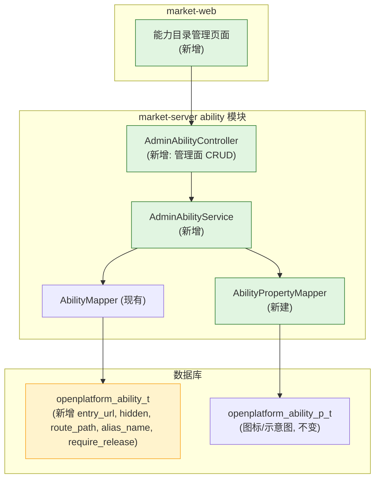
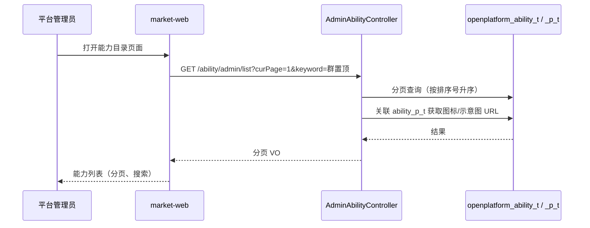
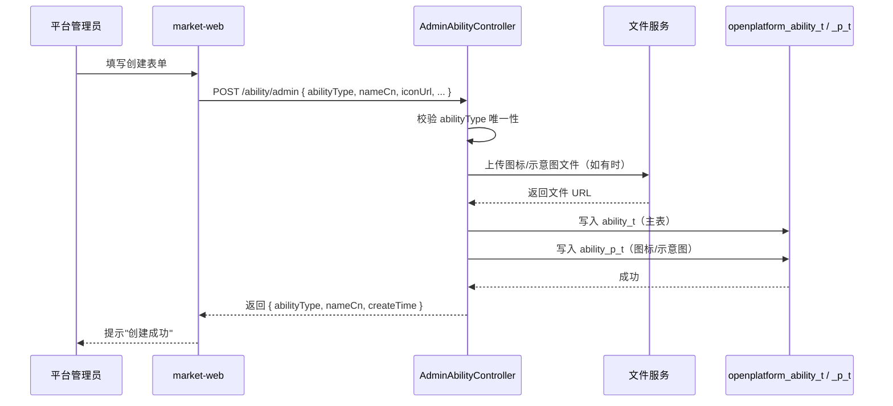
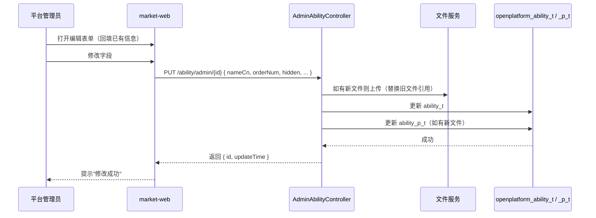
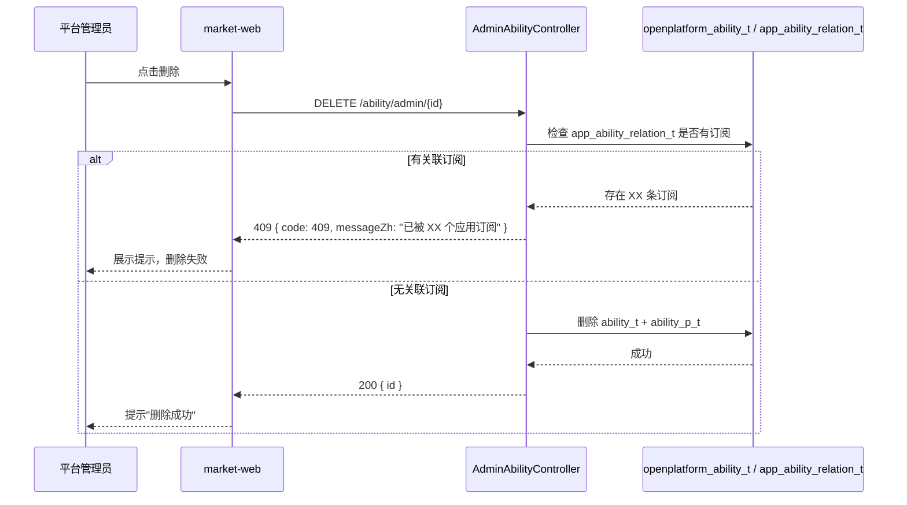

# 技术规划：嵌入能力平台面

**Feature ID**: EMBED-PLATFORM-001  
**规划版本**: v3.0  
**创建日期**: 2026-07-13  
**规划作者**: SDDU Plan Agent  
**规范版本**: spec.md v1.0

---

## 1. 架构分析

### 1.1 现有架构影响

**当前 ability 模块**（market-server ability 模块，从 approval 移出独立）：

| 组件 | 现状 | 影响 |
|------|------|------|
| `AbilityTypeEnum` | 7 个硬编码常量 | 保持不动，新增自定义类型通过 DB 存储 |
| `AbilityEntity` | 位于 `modules/approval/` | **移至** `modules/ability/`，新增 5 个字段 `entryUrl`、`hidden`、`routePath`、`aliasName`、`requireRelease`；`frontendEntryUrl` 改为 `entryUrl` |
| `AbilityMapper` | 位于 `modules/approval/` | **移至** `modules/ability/`，新增 CRUD 方法 |
| `AbilityPropertyMapper` (market-server) | 不存在 | **新建**（管理图标/示意图属性） |
| `AbilitySnapshotLoader` | 启动时加载 ability 到缓存 | 新增字段不影响 |

### 1.2 新增组件

| 组件 | 说明 | 路径 |
|------|------|------|
| `AdminAbilityController` | 管理面控制器（列表/创建/编辑/删除） | `market-server/.../ability/controller/AdminAbilityController.java` |
| `AdminAbilityService` / `AdminAbilityServiceImpl` | 管理面业务逻辑 | `market-server/.../ability/service/AdminAbilityService.java` |
| `AdminAbilityListRequest` | 列表请求 DTO（分页 + 模糊搜索） | `market-server/.../ability/dto/admin/AdminAbilityListRequest.java` |
| `AdminAbilityVO` | 列表响应 VO（含新增字段） | `market-server/.../ability/vo/admin/AdminAbilityVO.java` |
| `AdminAbilityDetailVO` | 详情 VO | `market-server/.../ability/vo/admin/AdminAbilityDetailVO.java` |
| `AdminAbilityCreateRequest` | 创建请求 DTO | `market-server/.../ability/dto/admin/AdminAbilityCreateRequest.java` |
| `AdminAbilityUpdateRequest` | 编辑请求 DTO | `market-server/.../ability/dto/admin/AdminAbilityUpdateRequest.java` |
| `AbilityPropertyMapper` | 图标/示意图属性 Mapper（新建） | `market-server/.../ability/mapper/AbilityPropertyMapper.java` |
| Flyway migration 文件 | `openplatform_ability_t` 新增 `entry_url`/`hidden`/`route_path`/`alias_name`/`require_release` 字段及 `ability_type` 类型调整 | `open-server/src/main/resources/db/migration/V4__add_ability_admin_fields.sql` |
| 前端页面（market-web） | 能力目录管理页面：列表页 + 创建/编辑表单 | market-web |

### 1.3 依赖关系图



## 2. 数据库设计

### 2.1 当前 `openplatform_ability_t`（迁移前）

```sql
CREATE TABLE `openplatform_ability_t`  (
  `id` bigint NOT NULL COMMENT '主键',
  `ability_name_cn` varchar(255) CHARACTER SET utf8mb4 COLLATE utf8mb4_unicode_ci NOT NULL COMMENT '能力中文名',
  `ability_name_en` varchar(255) CHARACTER SET utf8mb4 COLLATE utf8mb4_unicode_ci NOT NULL COMMENT '能力英文名',
  `ability_desc_cn` varchar(2000) CHARACTER SET utf8mb4 COLLATE utf8mb4_unicode_ci NOT NULL DEFAULT '' COMMENT '能力中文描述',
  `ability_desc_en` varchar(2000) CHARACTER SET utf8mb4 COLLATE utf8mb4_unicode_ci NOT NULL DEFAULT '' COMMENT '能力英文描述',
  `ability_type` tinyint(1) NOT NULL DEFAULT 0 COMMENT '能力类型 1-群置顶 2-群通知 3-链接增强 4-点对点通知 5-we码 6-应用入群通知 7-助手广场卡片',
  `order_num` int NOT NULL COMMENT '序号',
  `status` tinyint NULL DEFAULT 1 COMMENT '状态：0=失效, 1=有效',
  `create_by` varchar(100) CHARACTER SET utf8mb4 COLLATE utf8mb4_unicode_ci NULL DEFAULT NULL COMMENT '创建人',
  `create_time` datetime(3) NULL DEFAULT CURRENT_TIMESTAMP(3) COMMENT '创建时间',
  `last_update_by` varchar(100) CHARACTER SET utf8mb4 COLLATE utf8mb4_unicode_ci NULL DEFAULT NULL COMMENT '最后更新人',
  `last_update_time` datetime(3) NULL DEFAULT CURRENT_TIMESTAMP(3) ON UPDATE CURRENT_TIMESTAMP(3) COMMENT '最后更新时间',
  PRIMARY KEY (`id`) USING BTREE,
  INDEX `idx_ability_type`(`ability_type` ASC) USING BTREE
) ENGINE = InnoDB CHARACTER SET = utf8mb4 COLLATE = utf8mb4_unicode_ci COMMENT = '能力表' ROW_FORMAT = Dynamic;
```

### 2.2 当前 `openplatform_ability_p_t`（迁移前，本期不变）

```sql
CREATE TABLE `openplatform_ability_p_t`  (
  `id` bigint NOT NULL COMMENT '主键',
  `parent_id` bigint NOT NULL COMMENT '能力id',
  `property_name` varchar(255) CHARACTER SET utf8mb4 COLLATE utf8mb4_unicode_ci NOT NULL COMMENT '属性名',
  `property_value` varchar(2000) CHARACTER SET utf8mb4 COLLATE utf8mb4_unicode_ci NOT NULL DEFAULT '' COMMENT '属性值',
  `status` tinyint NULL DEFAULT 1 COMMENT '状态：0=失效, 1=有效',
  `create_by` varchar(100) CHARACTER SET utf8mb4 COLLATE utf8mb4_unicode_ci NULL DEFAULT NULL COMMENT '创建人',
  `create_time` datetime(3) NULL DEFAULT CURRENT_TIMESTAMP(3) COMMENT '创建时间',
  `last_update_by` varchar(100) CHARACTER SET utf8mb4 COLLATE utf8mb4_unicode_ci NULL DEFAULT NULL COMMENT '最后更新人',
  `last_update_time` datetime(3) NULL DEFAULT CURRENT_TIMESTAMP(3) ON UPDATE CURRENT_TIMESTAMP(3) COMMENT '最后更新时间',
  PRIMARY KEY (`id`) USING BTREE,
  INDEX `idx_parent_id`(`parent_id` ASC) USING BTREE
) ENGINE = InnoDB CHARACTER SET = utf8mb4 COLLATE = utf8mb4_unicode_ci COMMENT = '能力属性表' ROW_FORMAT = Dynamic;
```

### 2.3 本期修改后 `openplatform_ability_t`

```sql
CREATE TABLE `openplatform_ability_t`  (
  `id` bigint NOT NULL COMMENT '主键',
  `ability_name_cn` varchar(255) CHARACTER SET utf8mb4 COLLATE utf8mb4_unicode_ci NOT NULL COMMENT '能力中文名',
  `ability_name_en` varchar(255) CHARACTER SET utf8mb4 COLLATE utf8mb4_unicode_ci NOT NULL COMMENT '能力英文名',
  `ability_desc_cn` varchar(2000) CHARACTER SET utf8mb4 COLLATE utf8mb4_unicode_ci NOT NULL DEFAULT '' COMMENT '能力中文描述',
  `ability_desc_en` varchar(2000) CHARACTER SET utf8mb4 COLLATE utf8mb4_unicode_ci NOT NULL DEFAULT '' COMMENT '能力英文描述',
  `ability_type` tinyint NOT NULL DEFAULT 0 COMMENT '能力类型编码（1-7 预置，自定义类型统一分配，不区分范围）',
  `order_num` int NOT NULL COMMENT '序号',
  `status` tinyint NULL DEFAULT 1 COMMENT '状态：0=失效, 1=有效',
  `entry_url` varchar(512) CHARACTER SET utf8mb4 COLLATE utf8mb4_unicode_ci NULL DEFAULT NULL COMMENT '进入地址（微前端子应用入口）',
  `hidden` tinyint(1) NULL DEFAULT 0 COMMENT '是否在开放面展示：0=展示, 1=隐藏',
  `route_path` varchar(255) CHARACTER SET utf8mb4 COLLATE utf8mb4_unicode_ci NULL DEFAULT NULL COMMENT '路由路径（子应用激活路由）',
  `alias_name` varchar(100) CHARACTER SET utf8mb4 COLLATE utf8mb4_unicode_ci NULL DEFAULT NULL COMMENT '别名（子应用唯一标识）',
  `require_release` tinyint(1) NULL DEFAULT 0 COMMENT '是否需要版本发布才生效：0=即时生效, 1=需版本发布',
  `create_by` varchar(100) CHARACTER SET utf8mb4 COLLATE utf8mb4_unicode_ci NULL DEFAULT NULL COMMENT '创建人',
  `create_time` datetime(3) NULL DEFAULT CURRENT_TIMESTAMP(3) COMMENT '创建时间',
  `last_update_by` varchar(100) CHARACTER SET utf8mb4 COLLATE utf8mb4_unicode_ci NULL DEFAULT NULL COMMENT '最后更新人',
  `last_update_time` datetime(3) NULL DEFAULT CURRENT_TIMESTAMP(3) ON UPDATE CURRENT_TIMESTAMP(3) COMMENT '最后更新时间',
  PRIMARY KEY (`id`) USING BTREE,
  INDEX `idx_ability_type`(`ability_type` ASC) USING BTREE
) ENGINE = InnoDB CHARACTER SET = utf8mb4 COLLATE = utf8mb4_unicode_ci COMMENT = '能力表' ROW_FORMAT = Dynamic;
```

### 2.4 V4 Flyway 迁移脚本

```sql
-- V4__add_ability_admin_fields.sql

-- 1. 调整 ability_type 类型注释（去掉显示宽度，更新注释）
ALTER TABLE `openplatform_ability_t` 
  MODIFY COLUMN `ability_type` tinyint NOT NULL DEFAULT 0 COMMENT '能力类型编码（1-7 预置，自定义类型统一分配，不区分范围）';

-- 2. 新增嵌入能力相关字段
ALTER TABLE `openplatform_ability_t`
  ADD COLUMN `entry_url` varchar(512) CHARACTER SET utf8mb4 COLLATE utf8mb4_unicode_ci NULL DEFAULT NULL COMMENT '进入地址（微前端子应用入口）' AFTER `status`,
  ADD COLUMN `hidden` tinyint(1) NULL DEFAULT 0 COMMENT '是否在开放面展示：0=展示, 1=隐藏' AFTER `entry_url`,
  ADD COLUMN `route_path` varchar(255) CHARACTER SET utf8mb4 COLLATE utf8mb4_unicode_ci NULL DEFAULT NULL COMMENT '路由路径（子应用激活路由）' AFTER `hidden`,
  ADD COLUMN `alias_name` varchar(100) CHARACTER SET utf8mb4 COLLATE utf8mb4_unicode_ci NULL DEFAULT NULL COMMENT '别名（子应用唯一标识）' AFTER `route_path`,
  ADD COLUMN `require_release` tinyint(1) NULL DEFAULT 0 COMMENT '是否需要版本发布才生效：0=即时生效, 1=需版本发布' AFTER `alias_name`;
```

## 3. API设计

### 3.1 设计规范

**基础路径**：`/service/open/v2/ability/admin`

**认证方式**：管理面接口复用 market-server 自身的认证体系（Cookie/SSO），接口内校验当前用户角色是否为平台管理员（NFR-001）。

**响应格式**：统一使用 market-server 现有 `ApiResponse` 信封：

```json
// 成功
{ "code": "200", "messageZh": "操作成功", "messageEn": "Success", "data": { ... }, "page": null }

// 分页
{ "code": "200", "messageZh": "查询成功", "messageEn": "Success", "data": [ ... ], "page": { "curPage": 1, "pageSize": 20, "total": 123 } }

// 错误
{ "code": "400", "messageZh": "参数错误", "messageEn": "Bad Request", "data": null, "page": null }
```

**错误码**：

| 错误码 | 说明 |
|--------|------|
| 200 | 成功 |
| 400 | 参数错误/校验失败 |
| 403 | 无权限（非管理员） |
| 404 | 资源不存在 |
| 409 | 状态冲突（编码重复、有订阅等） |

**字段命名**：驼峰命名（camelCase），与现有 ability 模块保持一致。

| DB 列名 | Java 字段 | API 字段 |
|---------|----------|---------|
| `ability_type` | `abilityType` | `abilityType` |
| `ability_name_cn` | `abilityNameCn` | `nameCn` |
| `ability_name_en` | `abilityNameEn` | `nameEn` |
| `ability_desc_cn` | `abilityDescCn` | `descCn` |
| `ability_desc_en` | `abilityDescEn` | `descEn` |
| `order_num` | `orderNum` | `orderNum` |
| `entry_url` | `entryUrl` | `entryUrl` |
| `hidden` | `hidden` | `hidden` |
| `route_path` | `routePath` | `routePath` |
| `alias_name` | `aliasName` | `aliasName` |
| `require_release` | `requireRelease` | `requireRelease` |

### 3.2 接口清单

| # | 方法 | 路径 | 接口名称 | 对应 FR | 说明 |
|---|--------|------|---------|:------:|------|
| 1 | GET | `/ability/admin/list` | 查询能力列表 | FR-001 | 分页查询，支持关键字搜索 |
| 2 | POST | `/ability/admin` | 创建能力 | FR-002 | 创建新的能力类型 |
| 3 | PUT | `/ability/admin/{id}` | 更新能力 | FR-003 | 更新能力信息，abilityType 不可修改 |
| 4 | DELETE | `/ability/admin/{id}` | 删除能力 | FR-004 | 删除（含订阅检查） |

### 3.3 接口详细定义

---

#### #1 查询能力列表

`GET /service/open/v2/ability/admin/list`

**查询参数**

| 字段 | 类型 | 必填 | 说明 |
|------|------|:--:|------|
| curPage | int | ❌ | 页码，默认 1 |
| pageSize | int | ❌ | 每页数量，默认 20，最大 100 |
| keyword | string | ❌ | 按中文名/英文名模糊搜索 |
| sortField | string | ❌ | 排序字段，默认 `orderNum` |
| sortOrder | string | ❌ | 排序方向，`asc` / `desc`，默认 `asc` |

**响应体 `data[]`**

| 字段 | 类型 | 说明 |
|------|------|------|
| abilityType | int | 能力编码 |
| nameCn | string | 中文名 |
| nameEn | string | 英文名 |
| descCn | string | 中文描述 |
| descEn | string | 英文描述 |
| iconUrl | string | 图标 URL |
| diagramUrl | string | 示意图 URL（缩略图） |
| orderNum | int | 排序号 |
| entryUrl | string | 进入地址 |
| hidden | int | 是否在开放面展示（0=展示，1=隐藏） |
| routePath | string | 路由路径 |
| aliasName | string | 别名 |
| requireRelease | int | 是否需要版本发布才生效（0=即时生效，1=需版本发布） |
| createTime | string | 创建时间 |
| updateBy | string | 更新人 |
| updateTime | string | 更新时间 |

**数据流**：



---

#### #2 创建能力

`POST /service/open/v2/ability/admin`

**请求体**

| 字段 | 类型 | 必填 | 说明 |
|------|------|:--:|------|
| abilityType | int | ✅ | 能力编码（≥100），需唯一 |
| nameCn | string | ✅ | 中文名，最长 64 字符 |
| nameEn | string | ✅ | 英文名，最长 128 字符 |
| descCn | string | ❌ | 中文描述，最长 512 字符 |
| descEn | string | ❌ | 英文描述，最长 512 字符 |
| iconUrl | string | ❌ | 图标文件上传返回的 URL |
| diagramUrl | string | ❌ | 示意图文件上传返回的 URL |
| orderNum | int | ❌ | 排序号，默认 0 |
| entryUrl | string | ❌ | 进入地址（http/https 协议） |
| hidden | int | ❌ | 是否隐藏（0=展示，1=隐藏），默认 0 |
| routePath | string | ❌ | 路由路径（子应用激活路由） |
| aliasName | string | ❌ | 别名（子应用唯一标识） |
| requireRelease | int | ❌ | 是否需要版本发布才生效（0=即时生效，1=需版本发布），默认 0 |

**响应体 `data`**

| 字段 | 类型 | 说明 |
|------|------|------|
| abilityType | int | 创建的能力编码 |
| nameCn | string | 中文名 |
| createTime | string | 创建时间 |

**错误响应**

| code | 说明 |
|------|------|
| 400 | 参数校验失败（URL 格式、编码范围等） |
| 409 | abilityType 编码已被占用 |

**数据流**：



---

#### #3 更新能力

`PUT /service/open/v2/ability/admin/{id}`

**路径参数**

| 字段 | 类型 | 必填 | 说明 |
|------|------|:--:|------|
| id | string | ✅ | 能力 ID（数据库主键） |

**请求体**

| 字段 | 类型 | 必填 | 说明 |
|------|------|:--:|------|
| nameCn | string | ❌ | 中文名 |
| nameEn | string | ❌ | 英文名 |
| descCn | string | ❌ | 中文描述 |
| descEn | string | ❌ | 英文描述 |
| iconUrl | string | ❌ | 图标 URL（新文件上传后替换） |
| diagramUrl | string | ❌ | 示意图 URL |
| orderNum | int | ❌ | 排序号 |
| entryUrl | string | ❌ | 进入地址 |
| hidden | int | ❌ | 是否隐藏 |
| routePath | string | ❌ | 路由路径 |
| aliasName | string | ❌ | 别名 |
| requireRelease | int | ❌ | 是否需要版本发布才生效 |

> 所有字段可选，仅更新传入的字段。abilityType 不可修改。

**响应体 `data`**

| 字段 | 类型 | 说明 |
|------|------|------|
| id | string | 能力 ID |
| updateTime | string | 更新时间 |

**错误响应**

| code | 说明 |
|------|------|
| 404 | 能力不存在 |

**数据流**：



---

#### #4 删除能力

`DELETE /service/open/v2/ability/admin/{id}`

**路径参数**

| 字段 | 类型 | 必填 | 说明 |
|------|------|:--:|------|
| id | string | ✅ | 能力 ID |

**响应体 `data`**

| 字段 | 类型 | 说明 |
|------|------|------|
| id | string | 被删除的能力 ID |

**错误响应**

| code | 说明 |
|------|------|
| 404 | 能力不存在 |
| 409 | 有应用订阅该能力，无法删除 |

**数据流**：



## 4. 方案对比

### ~~方案 A：扩展 open-server ability 模块（已废弃：与 spec 矛盾）~~

~~**描述**：在 open-server 的 ability 模块内新增 AdminAbilityController 和 AdminAbilityService，复用现有 Mapper/Entity。~~

| ~~维度~~ | ~~评价~~ |
|:---:|:---:|
| ~~优点~~ | ~~数据表在同一 schema，无需跨服务调用；复用现有能力（fileV2Service 文件上传、AbilityMapper）；写入即对开放面可见~~ |
| ~~缺点~~ | ~~与"服务端：market-server"的 spec 表述不一致~~ |
| ~~风险~~ | ~~低——只需新增 Controller+Service，不修改现有接口~~ |

### ~~方案 B：market-server 扩展（已废弃：迁移脚本错放 market-server）~~

~~**描述**：在 market-server 新建独立 ability 模块，将 approval 模块中现有 AbilityEntity/AbilityMapper 迁移至独立模块，新建 AdminAbilityController + AdminAbilityService，直连同一 DB。~~

| ~~维度~~ | ~~评价~~ |
|:---:|:---:|
| ~~优点~~ | ~~与 spec"服务端：market-server"一致，职责分离清晰；ability 独立模块不再寄生 approval；market-server 已有 AbilityEntity + AbilityMapper，直连同库，无需跨服务；已有 Flyway 基础设施~~ |
| ~~缺点~~ | ~~需要结构重组（将寄生在 approval 中的 ability 代码分离出来）~~ |
| ~~风险~~ | ~~中——需确保搬迁后 import 引用正确，全局替换无遗漏~~ |

### 方案 C：迁移放 open-server + CRUD 放 market-server 独立 ability 模块（推荐）

**描述**：V4 迁移脚本放 open-server（`openplatform_ability_t` 所在服务），Admin CRUD 代码放 market-server 新建独立 `modules/ability/` 模块，直连同一 DB。

| 维度 | 评价 |
|------|------|
| 优点 | 迁移在表所属服务管理，DB 一致性有保障；CRUD 与 spec"服务端：market-server"一致；ability 模块独立不寄生 approval |
| 缺点 | 需在两个服务各自维护部分代码 |
| 风险 | 低——迁移脚本单一文件，CRUD 模块独立清晰 |

## 5. 推荐方案

**选择方案 C**：迁移放 open-server + CRUD 放 market-server 独立 ability 模块。

理由：
1. V4 迁移脚本放在表所属服务（open-server）管理，DB 一致性有保障
2. CRUD 代码与 spec"服务端：market-server"一致，职责分离清晰
3. ability 独立模块不再寄生 approval，消除代码位置错误
4. market-server 已有 AbilityEntity + AbilityMapper 基线，直连同库 `openplatform_ability_t`，无需跨服务
5. 管理面与开放面代码分离，不污染 open-server 现有模块
6. 写入即对开放面可见（同一 DB，NFR-003）

## 6. 文件影响分析

> ⚠️ 文件按部署服务拆分：V4 迁移脚本在 **open-server**（表归属服务），其余所有 CRUD 代码在 **market-server**（ability 独立模块），前端页面在 **market-web**。

### 新增文件

| 文件 | 说明 |
|------|------|
| `market-server/.../ability/controller/AdminAbilityController.java` | 管理面控制器 |
| `market-server/.../ability/service/AdminAbilityService.java` | 管理面业务接口 |
| `market-server/.../ability/service/impl/AdminAbilityServiceImpl.java` | 管理面业务实现 |
| `market-server/.../ability/dto/admin/AdminAbilityListRequest.java` | 列表请求 DTO |
| `market-server/.../ability/dto/admin/AdminAbilityCreateRequest.java` | 创建请求 DTO |
| `market-server/.../ability/dto/admin/AdminAbilityUpdateRequest.java` | 编辑请求 DTO |
| `market-server/.../ability/vo/admin/AdminAbilityVO.java` | 列表响应 VO |
| `market-server/.../ability/vo/admin/AdminAbilityDetailVO.java` | 详情 VO |
| `market-server/.../ability/mapper/AbilityPropertyMapper.java` | 图标/示意图属性 Mapper（新建） |
| `open-server/src/main/resources/db/migration/V4__add_ability_admin_fields.sql` | DB 迁移（open-server） |
| `market-web/.../router/routeRedBlue/ability-admin/` | 前端管理页面（列表/创建/编辑/删除，含 index.tsx + components/ + thunk.ts） |

### 修改文件

| 文件 | 修改内容 |
|------|---------|
| `market-server/.../ability/entity/AbilityEntity.java` | `frontendEntryUrl` 改为 `entryUrl`；新增 `hidden`、`routePath`、`aliasName`、`requireRelease` 字段；包路径从 approval 修正为 ability |
| `market-server/.../ability/mapper/AbilityMapper.java` | 新增管理面查询方法（分页列表）；包路径从 approval 修正为 ability |
| `market-server/src/main/resources/mapper/AbilityMapper.xml` | 新增 resultMap 字段映射 + 分页查询 SQL |
| `market-web/.../router/index.tsx` | 新增 ability-admin import + Route |

## 7. 风险评估

| 风险 | 影响 | 缓解措施 |
|------|------|---------|
| abilityType 编码手动输入可能不一致 | 数据混乱 | 后端校验唯一性 |
| 文件上传（图标/示意图）需在 market-server 侧处理 | 联调阻塞 | Mock 阶段使用固定 URL 占位 |
| DB migration 与现有表结构冲突 | 部署失败 | 新增 migration V4，命名规范避免冲突 |
| market-server 需新建 AbilityPropertyMapper | 重复实现 | 参照 open-server 现有 AbilityPropertyMapper 实现简化版，仅包含 admin 所需方法 |

## 8. ADR

### ADR-001: Admin 能力 CRUD 放在 market-server 扩展（替代原 open-server 方案）

**状态**: ACCEPTED（原 open-server 方案已废弃）

**背景**：
- spec 指定"服务端：market-server"
- market-server 已有 AbilityEntity + AbilityMapper，直连 `openplatform_ability_t`
- market-server 已有 Flyway 基础设施
- 原方案（open-server 扩展）已废弃，与 spec 矛盾

**决策**：
在 market-server 新建独立 ability 模块，将 approval 模块中现有 AbilityEntity/AbilityMapper 迁移至独立模块，新建 AdminAbilityController + AdminAbilityService。market-web 作为前端调用 market-server 的 admin 接口。

**后果**：
- 正面：与 spec 一致，职责分离清晰，管理面与开放面代码隔离
- 正面：market-server 已有基础设施，无需从零搭建
- 负面：需要在 market-server 侧新建 PropertyMapper（图标/示意图）

### ADR-002: abilityType 编码规则

**状态**: ACCEPTED（已更新）

**背景**：
- 现有 7 种预置类型使用 1-7 编码
- 自定义类型需要手动输入编码

**决策**：
- 1-7 保留给 `AbilityTypeEnum` 预置类型（群置顶、群通知、链接增强、点对点通知、we码、应用入群通知、助手广场卡片）
- 自定义类型统一在 tinyint 范围内分配，不区分类型大小
- 系统校验唯一性（包括已创建的记录和预置编码中的值）
- 创建后不可修改

**后果**：
- 正面：业务字段可读性强，不依赖自增ID；自定义不再受 ≥100 约束，更灵活
- 负面：需要前端提示避免与预置编码冲突，人工管理编码值

### ADR-004: require_release 字段替代硬编码能力类型排除

**状态**: ACCEPTED

**背景**：
- 现有 `VersionServiceImpl.createVersion()` 第173行硬编码排除 `GROUP_JOIN_NOTIFICATION`（type=6），逻辑为 `!Objects.equals(r.getAbilityType(), AbilityTypeEnum.GROUP_JOIN_NOTIFICATION.getCode())`
- 新增的自定义能力也需要按需控制是否需要版本发布后才生效，硬编码方式不可扩展

**决策**：
- `openplatform_ability_t` 新增 `require_release` 字段（tinyint, 默认0）
- 0 = 即时生效，订阅后无需等待版本发布即可使用（如 type=6 应用入群通知）
- 1 = 需要应用版本发布后才允许用户使用（如卡片类、群置顶等）
- 将 `VersionServiceImpl.createVersion()` 中的硬编码过滤逻辑改为按 `require_release = 1` 字段过滤
- 改造位置：`open-server/.../version/service/impl/VersionServiceImpl.java`

**后果**：
- 正面：能力是否需要版本发布由 DB 字段控制，新增自定义能力无需改代码
- 正面：与现有预置能力行为一致（type=6 现有即时生效行为不变）
- 负面：需确保迁移后 type=6 的 `require_release` 默认为 0，保持行为一致

---

## 9. 产物审查策略

| 审查产物 | 审查基准 |
|---------|---------|
| `build.md`（代码变更清单） | spec.md（规范基准） |
| AdminAbilityController.java | 接口参数校验、错误处理、权限校验 |
| AdminAbilityService.java | 业务逻辑完整性（创建/编辑/删除/列表） |
| V4 迁移文件 | 字段类型、默认值、约束 |

## 10. 产物验证策略

| 验证产物 | 验证基准 |
|---------|---------|
| AdminAbilityController 各接口 | spec.md FR-001 ~ FR-004 验收标准 |
| 数据库迁移 | 新增字段正确性、向前兼容 |
| 前端列表页面 | 字段展示完整、分页正常 |
| 创建/编辑表单 | 字段校验、文件上传、编码唯一性 |
| 删除操作 | 有订阅时禁止删除 |

## 修订记录

| 版本 | 变更说明 | 日期 | 修订人 |
|------|---------|------|--------|
| v1.0 | 初始创建 — 平台面技术规划 | 2026-07-13 | SDDU Plan Agent |
| v1.1 | 1.3 数据流重写：按4个FR场景逐一对应独立序列图 | 2026-07-13 | SDDU Plan Agent |
| v1.2 | 结构调整：独立数据库设计+API设计章节，数据流融入接口 | 2026-07-13 | SDDU Plan Agent |
| v1.3 | API设计重写：按 plan-api.md 格式，含设计规范/接口清单/请求响应JSON示例 | 2026-07-13 | SDDU Plan Agent |
| v1.4 | DB设计更新：新增 route_path/alias_name/require_release 字段；frontend_entry_url 改为 entry_url；ability_type 类型调整；编码规则简化（取消≥100约束）；新增 ADR-004；V4 迁移脚本更新 | 2026-07-16 | SDDU Plan Agent |
| v1.5 | **回退 ADR-001**：Admin CRUD 从 open-server 改回 market-server；§1/§4/§5/§6/§7/§8 全部对应修正 | 2026-07-16 | SDDU Plan Agent |
| v2.0 | **模块重组**：ability 代码从 approval 独立为 modules/ability/；全部路径 approval→ability 修正 | 2026-07-16 | SDDU Plan Agent |
| v3.0 | **方案 C 实施**：V4 迁移回退到 open-server；新增 01-restructure 子 Feature；TASK ID 全部重编号 | 2026-07-16 | SDDU Plan Agent |
