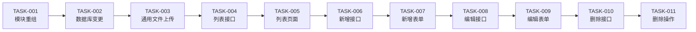

# 任务分解：嵌入能力平台面

> **文档定位**: SDDU 任务清单 — 聚合引用 10 个原子化子 Feature 的任务，作为 build 阶段的入口  
> **前置依赖**: plan.md（技术方案）、spec.md（需求规范）  
> **创建人**: SDDU Tasks Agent  
> **创建时间**: 2026-07-16  
> **版本**: v9.0  
> **更新人**: SDDU 路由调度专家  
> **更新时间**: 2026-07-17  
> **更新说明**: 插入 TASK-003 通用文件上传（FR-005），原 03~10 顺延为 04~11；总任务数 10→11

## 1. 依赖拓扑总览

```
串行链 ───（每个任务依赖前一个，严格串行）
  01. TASK-001 [M]  模块重组                       → specs-tree-platform-01-restructure/  🧪 5步脚本
  02. TASK-002 [S]  数据库变更                     → specs-tree-platform-02-db/           🧪 DB副本验证
  03. TASK-003 [M]  通用文件上传（后端）              → specs-tree-platform-03-upload/       🧪 Java单测 + Python集成
  04. TASK-004 [M]  列表接口（后端）                 → specs-tree-platform-04-list-api/     🧪 Java单测 + Python集成
  05. TASK-005 [L]  列表页面（前端）                 → specs-tree-platform-05-list-page/    🧪 Playwright E2E
  06. TASK-006 [M]  新增接口（后端）                 → specs-tree-platform-06-create-api/   🧪 Java单测 + Python集成
  07. TASK-007 [M]  新增表单（前端）                 → specs-tree-platform-07-create-page/  🧪 Playwright E2E
  08. TASK-008 [M]  编辑接口（后端）                 → specs-tree-platform-08-edit-api/     🧪 Java单测 + Python集成
  09. TASK-009 [M]  编辑表单（前端）                 → specs-tree-platform-09-edit-page/    🧪 Playwright E2E
  10. TASK-010 [S]  删除接口（后端）                 → specs-tree-platform-10-delete-api/   🧪 Java单测 + Python集成
  11. TASK-011 [S]  删除操作（前端）                 → specs-tree-platform-11-delete-page/  🧪 Playwright E2E
```



## 2. 子Feature任务索引

> 每个子 Feature 的详细任务定义见各自目录下的 `tasks.md`。以下为索引和依赖关系。

| # | 子Feature | 目录 | 任务ID | FR | 复杂度 | 顺序 | 依赖 | 测试 |
|---|-----------|------|--------|:--:|:--:|:--:|------|------|
| 1 | 模块重组 | `specs-tree-platform-01-restructure/` | TASK-001 | — | M | 01/11 | 无 | 5步脚本 |
| 2 | 数据库变更 | `specs-tree-platform-02-db/` | TASK-002 | FR-002 | S | 02/11 | TASK-001 | DB副本验证 |
| 3 | 通用文件上传（后端） | `specs-tree-platform-03-upload/` | TASK-003 | FR-005 | M | 03/11 | TASK-002 | Java: UploadController/Service + Python: test_upload |
| 4 | 列表接口（后端）<br/>└ Entity/Mapper 同步 | `specs-tree-platform-04-list-api/` | TASK-004 | FR-001 | M | 04/11 | TASK-003 | Java: ListController/Service + Python: test_list |
| 5 | 列表页面（前端） | `specs-tree-platform-05-list-page/` | TASK-005 | FR-001 | L | 05/11 | TASK-004 | Playwright: test_list |
| 6 | 新增接口（后端） | `specs-tree-platform-06-create-api/` | TASK-006 | FR-002 | M | 06/11 | TASK-005 | Java: CreateController/Service + Python: test_create |
| 7 | 新增表单（前端） | `specs-tree-platform-07-create-page/` | TASK-007 | FR-002 | M | 07/11 | TASK-006 | Playwright: test_create |
| 8 | 编辑接口（后端） | `specs-tree-platform-08-edit-api/` | TASK-008 | FR-003 | M | 08/11 | TASK-007 | Java: UpdateController/Service + Python: test_update |
| 9 | 编辑表单（前端） | `specs-tree-platform-09-edit-page/` | TASK-009 | FR-003 | M | 09/11 | TASK-008 | Playwright: test_edit |
| 10 | 删除接口（后端） | `specs-tree-platform-10-delete-api/` | TASK-010 | FR-004 | S | 10/11 | TASK-009 | Java: DeleteController/Service/Entity + Python: test_delete |
| 11 | 删除操作（前端） | `specs-tree-platform-11-delete-page/` | TASK-011 | FR-004 | S | 11/11 | TASK-010 | Playwright: test_delete |

## 3. 执行指南

所有任务严格串行执行，每个任务完成后才能开始下一个。按 TASK-001 → TASK-002 → ... → TASK-011 顺序依次推进。

启动命令: `@sddu-build TASK-001`（或指定子Feature目录名）

每个 task 完成标准：实现文件 + 测试文件全部通过。先写实现、再写测试、测试全部通过才算 task 完成。

---
*最后更新: 2026-07-17*
