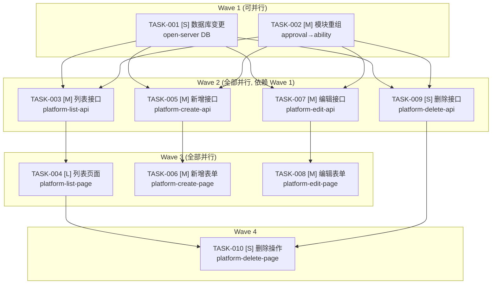

# 任务分解：嵌入能力平台面

> **文档定位**: SDDU 任务清单 — 聚合引用 10 个原子化子 Feature 的任务，作为 build 阶段的入口  
> **前置依赖**: plan.md（技术方案）、spec.md（需求规范）  
> **创建人**: SDDU Tasks Agent  
> **创建时间**: 2026-07-16  
> **版本**: v6.0  
> **更新人**: SDDU Plan Agent  
> **更新时间**: 2026-07-16  
> **更新说明**: 新增 01-restructure 子Feature；01-db 回退为纯 open-server 迁移；TASK ID 全部重编号；4 个前端子 Feature 文件路径对齐 routeRedBlue 模式

## 1. 依赖拓扑总览

```
Wave 1 ───（无依赖，TASK-001 与 TASK-002 可并行）
  TASK-001 [S]  数据库变更                  → specs-tree-platform-01-db/
  TASK-002 [M]  模块重组                    → specs-tree-platform-01-restructure/

Wave 2 ───（依赖 Wave 1 全部完成，全部并行）
  TASK-003 [M]  列表接口（后端）             → specs-tree-platform-02-list-api/
  TASK-005 [M]  新增接口（后端）             → specs-tree-platform-02-create-api/
  TASK-007 [M]  编辑接口（后端）             → specs-tree-platform-02-edit-api/
  TASK-009 [S]  删除接口（后端）             → specs-tree-platform-02-delete-api/

Wave 3 ───（依赖 Wave 2，全部并行）
  TASK-004 [L]  列表页面（前端）             → specs-tree-platform-03-list-page/
  TASK-006 [M]  新增表单（前端）             → specs-tree-platform-03-create-page/
  TASK-008 [M]  编辑表单（前端）             → specs-tree-platform-03-edit-page/

Wave 4 ───（依赖 Wave 2 + Wave 3）
  TASK-010 [S]  删除操作（前端）             → specs-tree-platform-04-delete-page/
```



## 2. 子Feature任务索引

> 每个子 Feature 的详细任务定义见各自目录下的 `tasks.md`。以下为索引和依赖关系。

| # | 子Feature | 目录 | 任务ID | FR | 复杂度 | 波次 | 依赖 |
|---|-----------|------|--------|:--:|:--:|:--:|------|
| 1 | 数据库变更 | `specs-tree-platform-01-db/` | TASK-001 | FR-002 | S | 1 | 无 |
| 2 | 模块重组 | `specs-tree-platform-01-restructure/` | TASK-002 | — | M | 1 | 无 |
| 3 | 列表接口（后端）<br/>└ Entity/Mapper 同步 | `specs-tree-platform-02-list-api/` | TASK-003 | FR-001 | M | 2 | TASK-001, TASK-002 |
| 4 | 列表页面（前端） | `specs-tree-platform-03-list-page/` | TASK-004 | FR-001 | L | 3 | TASK-003 |
| 5 | 新增接口（后端） | `specs-tree-platform-02-create-api/` | TASK-005 | FR-002 | M | 2 | TASK-001, TASK-002 |
| 6 | 新增表单（前端） | `specs-tree-platform-03-create-page/` | TASK-006 | FR-002 | M | 3 | TASK-005 |
| 7 | 编辑接口（后端） | `specs-tree-platform-02-edit-api/` | TASK-007 | FR-003 | M | 2 | TASK-001, TASK-002 |
| 8 | 编辑表单（前端） | `specs-tree-platform-03-edit-page/` | TASK-008 | FR-003 | M | 3 | TASK-007 |
| 9 | 删除接口（后端） | `specs-tree-platform-02-delete-api/` | TASK-009 | FR-004 | S | 2 | TASK-001, TASK-002 |
| 10 | 删除操作（前端） | `specs-tree-platform-04-delete-page/` | TASK-010 | FR-004 | S | 4 | TASK-004, TASK-009 |

## 3. 执行指南

1. **Wave 1 并行**: TASK-001（数据库迁移 open-server）与 TASK-002（模块重组 market-server）无依赖关系，可同时开工
2. **最大并行**: Wave 2 的 4 个后端任务（TASK-003/005/007/009）等待 Wave 1 全部完成后可并行
3. **前后解耦**: Wave 3 的 3 个前端任务可并行，仅依赖各自对应的后端任务
4. **收尾**: Wave 4 的 TASK-010 依赖列表页 + 删除后端，最后执行

启动命令: `@sddu-build TASK-001`（或指定子Feature目录名）

---
*最后更新: 2026-07-16*
