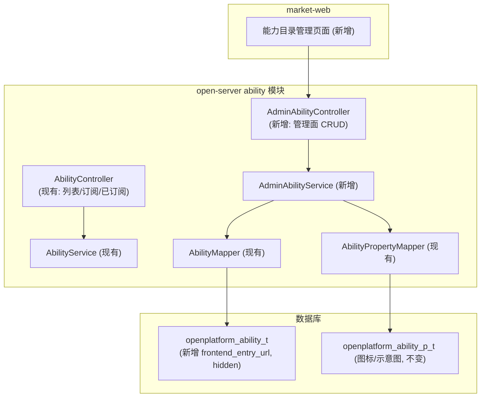
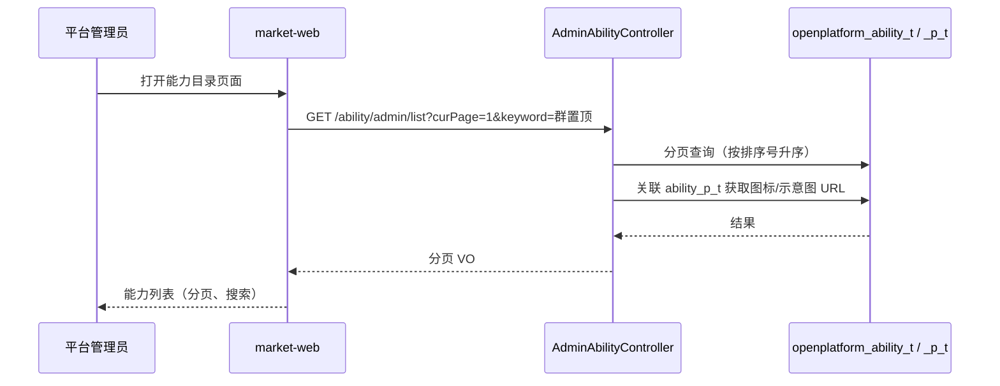
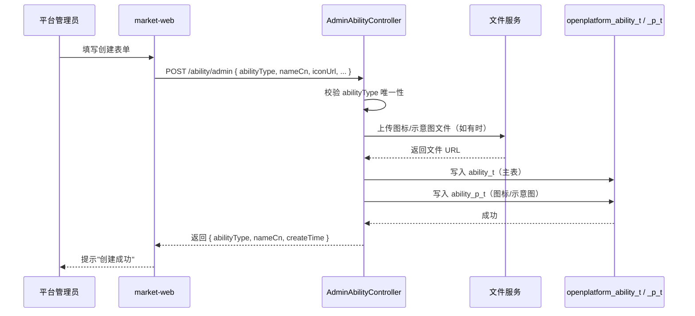
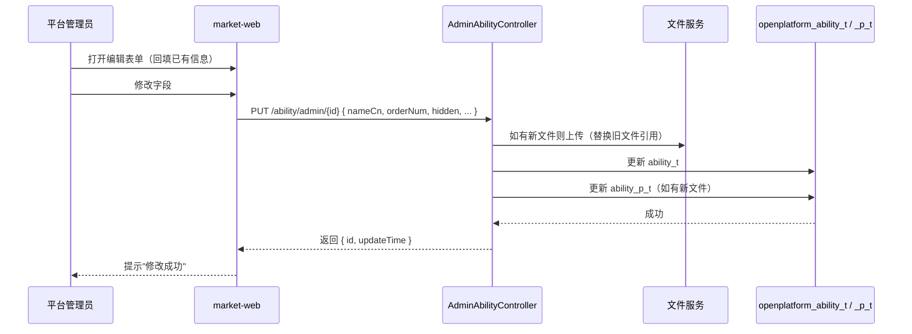
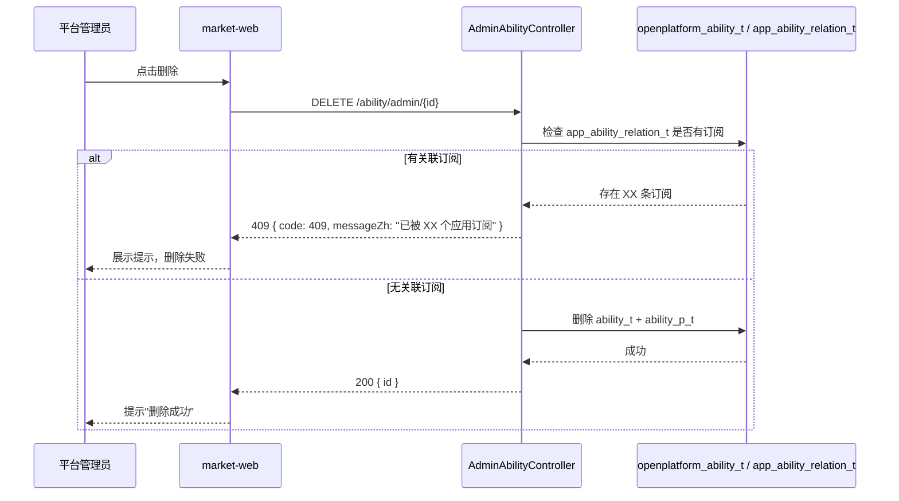

# 需求设计说明书 — 嵌入能力平台面

**Feature ID**: EMBED-PLATFORM-001  
**版本**: v1.0  
**创建日期**: 2026-07-13  

---

## 修订记录

| 版本 | 变更说明 | 日期 | 修订人 |
|------|---------|------|--------|
| v1.0 | 初始创建 | 2026-07-13 | SDDU Plan Agent |

## 目录

- 定位和写作说明
- 需求价值和概述
- 上下文分析
- 初始需求分析
    - 初始需求场景分析
    - 机构化IR
- 需求影响分析
    - 特性影响分析
- 系统用例分析
    - 用例清单
    - 用例分析
- 功能设计
    - 业界方案实现
    - 功能实现整体设计方案
    - 功能实现
- 系统级非功能设计
    - 系统级的FMEA影响分析
    - 系统级安全影响分析
    - 兼容性
    - 可运维
    - 资料
- checkList
    - 设计自检清单要求

## 表目录

| 表编号 | 表名 | 所在章节 |
|--------|------|---------|
| 表1 | 元数据 | 需求价值和概述 |
| 表2 | 初始场景分析 | 初始需求分析 |
| 表3 | 机构化IR | 初始需求分析 |
| 表4 | 特性影响分析 | 需求影响分析 |
| 表5 | 用例清单 | 系统用例分析 |
| 表6-1 | 能力列表接口 | 功能设计-接口设计 |
| 表6-2 | 创建能力接口 | 功能设计-接口设计 |
| 表6-3 | 编辑能力接口 | 功能设计-接口设计 |
| 表6-4 | 删除能力接口 | 功能设计-接口设计 |
| 表7 | 数据库变更 | 功能设计-数据模型设计 |
| 表8 | 设计自检清单 | checkList |

## 图目录

| 图编号 | 图名 | 所在章节 |
|--------|------|---------|
| 图1 | 架构依赖关系图 | 功能实现整体设计方案 |
| 图2 | 能力列表查询时序图 | 功能设计-接口设计 |
| 图3 | 创建能力时序图 | 功能设计-接口设计 |
| 图4 | 更新能力时序图 | 功能设计-接口设计 |
| 图5 | 删除能力时序图 | 功能设计-接口设计 |

## Keywords 关键字

| 中文 | English |
|------|---------|
| 能力 | Ability |
| 能力类型 | Ability Type |
| 平台管理面 | Admin Platform |
| 微前端 | Micro Frontend |
| 能力目录 | Ability Catalog |

## Abstract 摘要

**中文摘要**：
本文档定义了嵌入能力平台面的需求设计，涵盖平台管理员在 market-web 后台维护能力目录的完整功能，包括能力列表查看、创建、编辑、删除等 CRUD 操作，以及相关的数据库设计、接口设计和架构设计方案。

**English Abstract**:
This document defines the requirement design for the embedding capability admin platform, covering the complete CRUD operations for platform administrators to maintain the ability catalog on the market-web backend, including list view, create, edit, delete, along with related database design, API design, and architecture design.

## List 偶发abbreviations 缩略语清单

| Abbreviations缩略语 | Full spelling 英文全名 | Chinese explanation 中文解释 |
|---------------------|-----------------------|---------------------------|
| CRUD | Create, Read, Update, Delete | 增删改查 |
| ADR | Architecture Decision Record | 架构决策记录 |
| DB | Database | 数据库 |
| DTO | Data Transfer Object | 数据传输对象 |
| VO | View Object | 视图对象 |
| SSO | Single Sign-On | 单点登录 |

---

## 定位和写作说明

**需求分析**：
平台面需求来源于能力开放平台狭义嵌入能力特性（EMBED-001）的子特性分解。当前 ability 类型由 `AbilityTypeEnum` 硬编码预置（7 种），平台管理员无法通过管理后台新增/编辑/排序 ability 类型。业务模块要嵌入新能力，必须依赖平台方修改代码重新部署。本文档通过"上下文分析 + 场景分析 + 系统用例"的分析方法，定义平台管理员维护能力目录所需的系统功能规格。

**功能设计**：
根据功能规格要求，在 open-server ability 模块中新增管理面 AdminAbilityController 和 AdminAbilityService，复用现有 AbilityMapper 等基础设施，完成新增字段的数据库迁移，定义 market-web 前端管理页面的交互方式。

## 1 需求价值和概述

**Feature ID**: EMBED-PLATFORM-001  
**名称**: 嵌入能力平台面  
**父 Feature**: EMBED-001（狭义嵌入能力）  
**优先级**: P1  
**服务端**: open-server（ability 模块扩展）  
**前端**: market-web  
**目标版本**: v1.0  

**表1：元数据**

| 字段 | 值 |
|------|-----|
| Feature ID | EMBED-PLATFORM-001 |
| 名称 | 嵌入能力平台面 |
| 父 Feature | EMBED-001（狭义嵌入能力） |
| 优先级 | P1 |
| 服务端 | open-server（ability 模块扩展） |
| 前端 | market-web |
| 目标版本 | v1.0 |

### 包含需求的背景、来源、价值和要解决的客户问题

**背景**：
当前 ability 类型由 `AbilityTypeEnum` 硬编码预置（7 种：群置顶、群通知、链接增强、点对点通知、we码、应用入群通知、助手广场卡片）。当业务模块（如 IM、云盘、邮件等）需要将其特有连接能力注册到能力开放平台时，必须依赖平台方修改代码（新增枚举值）并重新部署，流程冗长，无法满足业务快速接入的需求。

**来源**：
能力开放平台狭义嵌入能力特性（EMBED-001）的子特性分解。

**价值**：
- 平台管理员可通过管理后台自助创建/编辑/删除 ability 类型，无需开发介入
- 业务模块（嵌入能力方）的接入流程从"改代码→发版"缩短为"线下沟通→管理员后台录入"
- 为开放面（能力订阅与配置）提供数据来源

**损失**：
如果没有该特性，每个新能力的接入都需要开发团队修改代码并重新部署，无法实现平台化的自助管理，严重制约业务模块的集成效率。

## 2 上下文分析（可选）

### 【目的】
平台面涉及平台管理员、能力目录数据与开放面消费者的交互，需要明确上下游关系和利益相关方。

### 架构上下文


### 利益相关方

| 角色 | 说明 | 与平台面的关系 |
|------|------|--------------|
| **平台管理员** | 开放平台运维管理人员 | 录入、编辑、删除能力 |
| **嵌入能力方** | IM、云盘等业务模块 | 通过线下沟通向管理员提出能力注册需求 |
| **三方应用开发方** | 订阅和使用能力的消费者 | 间接受益（数据经开放面呈现） |
| **开放面** | wecodesite Capabilities 页 | 消费平台面写入的数据 |

## 3 初始需求分析（可选）

### 1. 初始需求场景分析

| 所属场景 | 场景名称 | 场景简要说明 | 涉及角色 |
|---------|---------|------------|---------|
| 能力目录管理 | 查看能力列表 | 平台管理员打开能力管理页面，查看所有能力的完整信息 | 平台管理员 |
| 能力目录管理 | 创建新能力 | 业务模块需要注册新能力，平台管理员填写表单并提交 | 平台管理员、嵌入能力方 |
| 能力目录管理 | 编辑已有能力 | 能力信息变更，平台管理员修改相应字段 | 平台管理员 |
| 能力目录管理 | 删除废弃能力 | 能力不再需要，平台管理员删除（无订阅时才可删除） | 平台管理员 |

### 2. 机构化IR（必选）

| IR属性 | 具体信息 |
|--------|---------|
| IR标识 | EMBED-PLATFORM-IR-001 |
| 名称 | 平台管理员自服务能力目录管理 |
| 描述 | 平台管理员可在市场后台维护能力类型的完整 CRUD |
| 优先级 | P1 |
| 需求描述（why） | 减少新能力接入对开发团队的依赖，实现平台化管理 |
| what | 提供能力列表、创建、编辑、删除四个管理功能 |
| who | 平台管理员负责录入管理；嵌入能力方通过线下沟通提出需求 |
| 其他 | 编码规则 1-7 保留给预置类型，100+ 为自定义类型 |
| 对架构要素的影响 | 架构：扩展 open-server ability 模块；安全：仅限平台管理员操作 |

## 4 需求影响分析

### 1. 特性影响分析（可选）

| 影响类型 | 特性 | 影响说明 |
|---------|------|---------|
| **新增** | 能力管理 CRUD | 新增能力列表、创建、编辑、删除四个操作 |
| **修改** | open-server ability 模块 | 新增 AdminAbilityController + AdminAbilityService |
| **修改** | `openplatform_ability_t` 表 | 新增 `frontend_entry_url`、`hidden` 字段 |
| **影响** | 嵌入能力开放面 | 平台面写入的数据即时对开放面可见（同一 DB） |
| **不涉及** | 现有 7 种预置能力 | 保持 `AbilityTypeEnum` 不变 |

## 5 系统用例分析（可选）

### 1. 用例清单

| 角色名称 | UseCase名称 | UseCase简要说明 | 是否需要细化分析 |
|---------|------------|---------------|:-------------:|
| 平台管理员 | 能力目录列表 | 分页查看所有能力类型，支持关键字搜索 | 是 |
| 平台管理员 | 创建能力类型 | 填写表单创建新的能力类型 | 是 |
| 平台管理员 | 编辑能力类型 | 修改已有能力类型的字段 | 是 |
| 平台管理员 | 删除能力类型 | 删除未关联应用订阅的能力类型 | 是 |

### 2. 用例分析

#### 2.1 用例：能力目录列表

| 要素 | 描述 |
|------|------|
| **简要说明** | 平台管理员在 market-web 查看所有 ability 类型的分页列表 |
| **Actor** | 平台管理员 |
| **前置条件** | 平台管理员已登录 market-web，具备管理员角色 |
| **最小保证** | 网络异常等情况下，页面展示友好错误提示 |
| **成功保证** | 返回完整的能力列表（含新增字段），按排序号升序排列 |
| **主成功场景** | 打开页面 → 请求接口 → 获取数据 → 渲染列表（分页+搜索） |
| **扩展场景** | 搜索关键字过滤；页码切换 |
| **DFX属性** | 响应时间 P99 < 500ms；接口需校验管理员角色 |

#### 2.2 用例：创建能力类型

| 要素 | 描述 |
|------|------|
| **简要说明** | 平台管理员填写表单创建新的 ability 类型 |
| **Actor** | 平台管理员 |
| **前置条件** | 平台管理员已登录，具备管理员角色 |
| **最小保证** | 校验失败时保留已填数据，提示错误信息 |
| **成功保证** | 能力创建成功，数据同步写入 `ability_t` 和 `ability_p_t`，即时对开放面可见 |
| **主成功场景** | 填写表单 → 上传图标/示意图 → 提交 → 后端校验 → 写入数据库 → 返回成功 |
| **扩展场景** | abilityType 编码冲突（409）；文件上传失败；URL 格式不合法 |
| **DFX属性** | 创建必须幂等（编码唯一）；响应时间 P99 < 1s |

#### 2.3 用例：编辑能力类型

| 要素 | 描述 |
|------|------|
| **简要说明** | 平台管理员修改已有能力类型的信息 |
| **Actor** | 平台管理员 |
| **前置条件** | 能力已存在；管理员已登录 |
| **最小保证** | 编辑失败时数据回滚，保留原始状态 |
| **成功保证** | 能力信息更新成功，开放面即时看到更新后的数据 |
| **主成功场景** | 选择能力 → 回填已有数据 → 修改字段 → 提交 → 后端更新 → 返回成功 |
| **扩展场景** | 更新时其他管理员同时操作触发乐观锁冲突（EC-004） |
| **DFX属性** | 部分更新（仅更新传入的字段）；abilityType 不可修改 |

#### 2.4 用例：删除能力类型

| 要素 | 描述 |
|------|------|
| **简要说明** | 平台管理员删除未关联应用订阅的能力类型 |
| **Actor** | 平台管理员 |
| **前置条件** | 能力已存在；管理员已登录 |
| **最小保证** | 删除失败时数据不变 |
| **成功保证** | 能力及其图片/示意图属性被物理删除，开放面不再展示 |
| **主成功场景** | 点击删除 → 后端检查订阅 → 无订阅则删除 → 返回成功 |
| **扩展场景** | 有关联订阅则返回 409 并提示"已被 XX 个应用订阅" |
| **DFX属性** | 删除前需检查外键关联（订阅检查）；级联删除属性数据 |

## 6 功能设计

### 1. 业界方案实现（可选）

能力目录的管理在开放平台中常见实现方式：

| 方案 | 典型产品 | 特点 |
|------|---------|------|
| 代码枚举 | 简单项目 | 硬编码，修改需发版，缺乏灵活性 |
| 管理后台 CRUD | 通用开放平台 | 运营人员自服务，灵活度高 |
| 审批流+CRUD | 大型平台 | 引入审批，适合多租户场景 |

**对比结论**：本期选择"管理后台 CRUD"方式，平台管理员直接操作，不引入审批流（符合 NG-001）。

### 2. 功能实现整体设计方案

#### 2.1 整体方案

**设计原则**：
1. **最小修改**：复用现有 ability 模块的 Mapper/Entity/Service
2. **职责分离**：管理面使用独立 Controller，不影响现有开放面接口
3. **即时可见**：管理面写入数据后，开放面直接读库，无需缓存刷新
4. **向后兼容**：新增接口不修改现有接口，已有接口不受影响

**限制和约束**：
- abilityType 编码 1-7 保留给预置类型，自定义类型 ≥ 100
- abilityType 创建后不可修改
- 图标/示意图文件上传复用现有 `fileV2Service`

#### 2.2 架构设计方案

##### 2.2.1 逻辑视图



##### 2.2.2 开发视图

| 模块 | 技术栈 | 说明 |
|------|--------|------|
| open-server ability | Spring Boot + MyBatis + Flyway | Java 后端，新增 admin controller/service |
| market-web | React + QianKun | 前端管理页面 |

##### 2.2.3 部署视图

```
market-web (前端) → open-server (后端, admin 接口) → MySQL (openplatform_ability_t)
```

> 注：admin 接口放在 open-server（而非 market-server），由 ADR-001 决策。理由：数据表在 open-server schema 中，复用现有 Mapper/Entity，写入即时对开放面可见。

##### 2.2.4 运行视图

请求链路：`平台管理员 → market-web 前端页面 → AdminAbilityController → AdminAbilityService → DB`

### 3. 功能实现

#### 3.1 实现思路

**技术方法**：
- 在 open-server 的 ability 模块内新增 `AdminAbilityController` 和 `AdminAbilityService`
- 复用现有 `AbilityMapper`、`AbilityPropertyMapper`、`fileV2Service`
- 数据直接写入 `openplatform_ability_t` / `openplatform_ability_p_t`
- market-web 前端直接调用 open-server 的 admin 接口

**方案对比**（详见 plan.md §4）：

| 方案 | 描述 | 结论 |
|------|------|------|
| **A（推荐）** | 扩展 open-server ability 模块 | 复用现有组件，写入即时对开放面可见 |
| B | market-server 独立模块 | 需跨服务调用或直连同一 DB，增加复杂度 |

#### 3.2 实现设计

##### 3.2.1 接口设计

###### 3.2.1.1 设计规范

| 项目 | 说明 |
|------|------|
| 基础路径 | `/service/open/v2/ability/admin` |
| 认证方式 | Cookie/SSO 登录态 + 角色校验（仅平台管理员） |
| 响应格式 | open-server `ApiResponse` 信封 |
| 字段命名 | 驼峰命名（camelCase） |
| 错误码 | 200/400/403/404/409 |

###### 3.2.1.2 接口清单

| # | 方法 | 路径 | 功能 | 对应FR |
|---|---|------|------|:------:|
| 1 | GET | `/ability/admin/list` | 查询能力列表（分页+搜索） | FR-001 |
| 2 | POST | `/ability/admin` | 创建能力 | FR-002 |
| 3 | PUT | `/ability/admin/{id}` | 更新能力 | FR-003 |
| 4 | DELETE | `/ability/admin/{id}` | 删除能力（含订阅检查） | FR-004 |

---

###### 3.2.1.3 接口一：查询能力列表

`GET /service/open/v2/ability/admin/list`

**请求参数（Query）**：

| 字段 | 类型 | 必填 | 默认值 | 说明 |
|------|------|:--:|:-----:|------|
| curPage | int | ❌ | 1 | 页码 |
| pageSize | int | ❌ | 20 | 每页数量，最大 100 |
| keyword | string | ❌ | — | 按中文名/英文名模糊搜索 |
| sortField | string | ❌ | `orderNum` | 排序字段 |
| sortOrder | string | ❌ | `asc` | 排序方向：`asc` / `desc` |

**成功响应 data[]**：

| 字段 | 类型 | 说明 |
|------|------|------|
| abilityType | int | 能力编码 |
| nameCn | string | 中文名 |
| nameEn | string | 英文名 |
| descCn | string | 中文描述 |
| descEn | string | 英文描述 |
| iconUrl | string | 图标 URL |
| diagramUrl | string | 示意图 URL |
| orderNum | int | 排序号 |
| frontendEntryUrl | string | 前端入口 URL |
| hidden | int | 是否在开放面展示（0=展示，1=隐藏） |
| createTime | string | 创建时间 |
| updateBy | string | 更新人 |
| updateTime | string | 更新时间 |

**错误响应**：403 无权限

**性能指标**：TPS ≥ 50，P99 < 500ms

**数据流**：



---

###### 3.2.1.4 接口二：创建能力

`POST /service/open/v2/ability/admin`

**请求体（Body JSON）**：

| 字段 | 类型 | 必填 | 说明 |
|------|------|:--:|------|
| abilityType | int | ✅ | 能力编码（≥100），需唯一 |
| nameCn | string | ✅ | 中文名，最长 64 字符 |
| nameEn | string | ✅ | 英文名，最长 128 字符 |
| descCn | string | ❌ | 中文描述，最长 512 字符 |
| descEn | string | ❌ | 英文描述，最长 512 字符 |
| iconUrl | string | ❌ | 图标文件上传返回的 URL |
| diagramUrl | string | ❌ | 示意图文件上传返回的 URL |
| orderNum | int | ❌ | 排序号，默认 0 |
| frontendEntryUrl | string | ❌ | 前端入口 URL（http/https 协议） |
| hidden | int | ❌ | 是否隐藏（0=展示，1=隐藏），默认 0 |

**成功响应 data**：

| 字段 | 类型 | 说明 |
|------|------|------|
| abilityType | int | 创建的能力编码 |
| nameCn | string | 中文名 |
| createTime | string | 创建时间 |

**错误响应**：

| code | 说明 |
|:---:|------|
| 400 | 参数校验失败（URL 格式、编码范围等） |
| 409 | abilityType 编码已被占用 |

**性能指标**：TPS ≥ 20，P99 < 1s

**数据流**：



---

###### 3.2.1.5 接口三：更新能力

`PUT /service/open/v2/ability/admin/{id}`

**路径参数**：

| 字段 | 类型 | 必填 | 说明 |
|------|------|:--:|------|
| id | string | ✅ | 能力 ID（数据库主键） |

**请求体（Body JSON）—— 所有字段可选，仅更新传入的字段**：

| 字段 | 类型 | 必填 | 说明 |
|------|------|:--:|------|
| nameCn | string | ❌ | 中文名 |
| nameEn | string | ❌ | 英文名 |
| descCn | string | ❌ | 中文描述 |
| descEn | string | ❌ | 英文描述 |
| iconUrl | string | ❌ | 图标 URL（新文件上传后替换） |
| diagramUrl | string | ❌ | 示意图 URL |
| orderNum | int | ❌ | 排序号 |
| frontendEntryUrl | string | ❌ | 前端入口 URL |
| hidden | int | ❌ | 是否隐藏 |

> ⚠️ abilityType 不可修改。

**成功响应 data**：

| 字段 | 类型 | 说明 |
|------|------|------|
| id | string | 能力 ID |
| updateTime | string | 更新时间 |

**错误响应**：

| code | 说明 |
|:---:|------|
| 404 | 能力不存在 |

**性能指标**：TPS ≥ 20，P99 < 1s

**数据流**：



---

###### 3.2.1.6 接口四：删除能力

`DELETE /service/open/v2/ability/admin/{id}`

**路径参数**：

| 字段 | 类型 | 必填 | 说明 |
|------|------|:--:|------|
| id | string | ✅ | 能力 ID |

**成功响应 data**：

| 字段 | 类型 | 说明 |
|------|------|------|
| id | string | 被删除的能力 ID |

**错误响应**：

| code | 说明 |
|:---:|------|
| 404 | 能力不存在 |
| 409 | 有应用订阅该能力，无法删除 |

**性能指标**：TPS ≥ 10，P99 < 1s

**数据流**：



##### 3.2.2 数据模型设计

**数据库变更**：

**openplatform_ability_t（主表）**：

| 字段名 | 类型 | 说明 | 约束 |
|--------|------|------|------|
| `frontend_entry_url` | VARCHAR(512) | 微前端子应用入口 URL | nullable |
| `hidden` | TINYINT(1) | 是否在开放面展示（0=展示，1=隐藏） | 默认 0 |

> 其余字段保持现有结构不变。

**openplatform_ability_p_t（属性表）**：
不变，继续存储图标（`property_name = 'icon'`）和示意图（`property_name = 'illustration'`）。

**迁移版本**：
- Flyway migration: `V4__add_ability_admin_fields.sql`

##### 3.3 功能可靠性分析（可选）

**异常场景**：

| 场景 | 处理方式 |
|------|---------|
| DB 写入失败 | Spring 事务回滚，返回 500 错误码 |
| 文件上传失败 | 返回 400 错误，前端可重新上传 |
| 乐观锁冲突 | `last_update_time` 版本校验，冲突时提示刷新重试 |

##### 3.4 功能安全分析（可选）

| 安全维度 | 措施 |
|---------|------|
| 权限控制 | 所有 admin 接口校验当前用户角色为平台管理员 |
| 参数校验 | abilityType 唯一性校验；URL 格式校验 |
| XSS 防护 | 前端输入字段做转义处理 |
| CSRF | 复用 open-server 现有 CSRF 防护机制 |

##### 3.5 架构元素影响列表（可选）

| 元素 | 变更类型 | 变更说明 |
|------|---------|---------|
| `open-server/ability/controller/AdminAbilityController.java` | 新增 | 管理面控制器 |
| `open-server/ability/service/AdminAbilityService.java` | 新增 | 管理面业务接口 |
| `open-server/ability/service/impl/AdminAbilityServiceImpl.java` | 新增 | 管理面业务实现 |
| `open-server/ability/entity/Ability.java` | 修改 | 新增 `frontendEntryUrl`、`hidden` 字段 |
| Flyway V4 migration | 新增 | 数据库字段变更 |
| `market-web` 前端管理页面 | 新增 | 能力管理 CRUD 页面 |

##### 3.6 结构图元素实现列表（可选）

###### 3.6.1 接口设计

（已在 3.2.1 节详细描述，此处不再重复）

###### 3.6.2 数据模型设计

（已在 3.2.2 节详细描述，此处不再重复）

##### 3.7 功能实现分解分配清单

| 实现元素 | 职责 | 对应 Task |
|---------|------|----------|
| `AdminAbilityController` | 接收 HTTP 请求，参数校验，调用 Service | T-001 |
| `AdminAbilityService` / Impl | 业务逻辑：唯一性校验、CRUD操作、订阅检查 | T-002 |
| `Ability.java` 实体验改 | 新增字段映射 | T-003 |
| Flyway V4 迁移文件 | 数据库 DDL 执行 | T-004 |
| market-web 能力管理页面 | 前端列表页 + 表单页 + 删除确认 | T-005 |

## 7 系统级非功能设计

### 1. 系统及的FMEA影响分析

| 失效模式 | 影响 | 严重程度 | 检测方式 | 缓解措施 |
|---------|------|---------|---------|---------|
| DB 连接异常 | 管理面接口不可用 | 中 | 接口返回值异常 | 前端展示降级提示 |
| 文件上传服务不可用 | 图标/示意图无法上传 | 低 | fileV2Service 返回异常 | 允许创建时不上传图标，后续编辑补充 |
| 并发修改冲突 | 数据覆盖 | 低 | 乐观锁异常 | 提示用户刷新后重试 |

### 2. 系统级安全影响分析

| 安全威胁 | 影响 | 缓解措施 |
|---------|------|---------|
| 非管理员访问管理接口 | 数据被非法篡改 | 接口校验管理员角色，返回 403 |
| SQL注入 | 数据泄露/篡改 | 复用 MyBatis 参数绑定机制 |
| 文件上传恶意文件 | 服务器被攻击 | 文件上传经 fileV2Service 校验类型/大小 |

### 3. 兼容性

#### 后向兼容性确认

- 新增接口与原有能力接口（list/subscribe/subscribed）完全独立，不影响已有功能
- DB 新增字段使用 `DEFAULT NULL` / `DEFAULT 0`，现有代码不受影响
- 管理面新增操作不改变现有数据结构和数据内容

#### 前向兼容性确认

- 新版本移除管理面功能时，不影响开放面对 `ability_t` 表的只读查询
- DB 迁移回滚时，需同时回滚代码中的字段引用

### 4. 可运维

| 运维场景 | 说明 |
|---------|------|
| 审计日志 | 创建/编辑/删除操作记录操作用户、时间、变更内容 |
| 监控指标 | 管理面接口的 TPS、时延、错误率 |
| 告警 | 接口错误率超过阈值触发告警 |
| 日志 | 关键操作输出 INFO 日志，异常输出 ERROR 日志 |

### 5. 资料

| 资料类型 | 说明 |
|---------|------|
| 管理后台操作手册 | 能力目录管理的完整操作步骤 |
| API 文档 | 四个管理接口的请求/响应定义 |

## 8 checkList（必填）

### 1. 设计自检清单要求（必填）

| check点 | 是否达标 |
|---------|:--------:|
| 需求与设计是否一致（FR→设计双向追溯） | ✅ |
| 是否覆盖了所有 FR 验收标准 | ✅ |
| 接口参数是否明确定义类型、取值范围、必填性 | ✅ |
| 响应格式是否明确定义成功/失败 | ✅ |
| 数据模型设计是否考虑了兼容性 | ✅ |
| 是否分析了异常场景和边界条件 | ✅ |
| 安全控制措施是否到位（角色校验、凭证鉴权） | ✅ |
| 功能可靠性是否分析（事务、并发） | ✅ |
| 是否考虑审计和可运维性 | ✅ |
| DB migration 是否向前/向后兼容 | ✅ |
| 架构决策是否有 ADR 记录 | ✅（ADR-001、ADR-002） |
