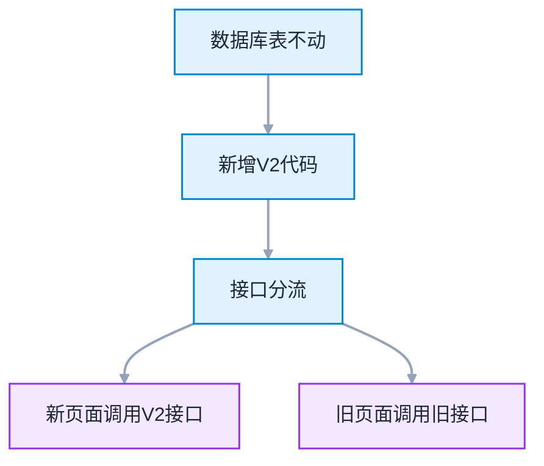
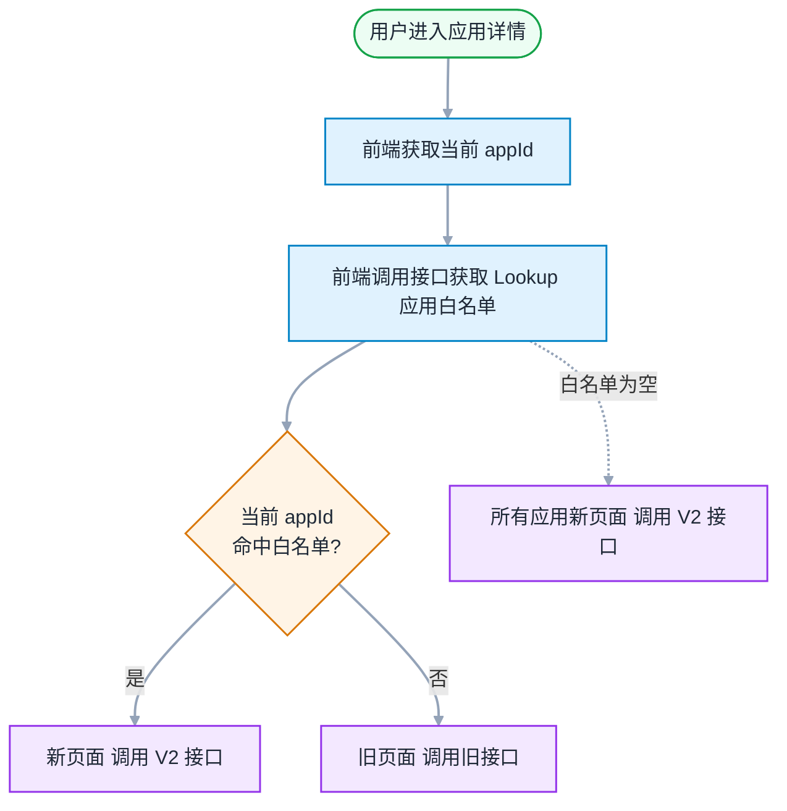
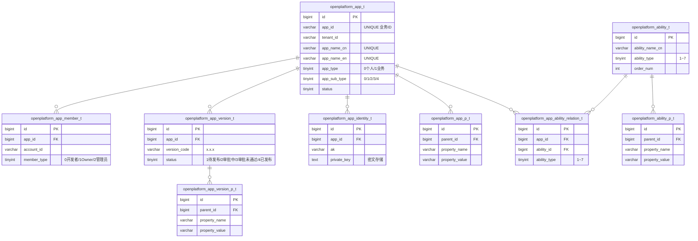
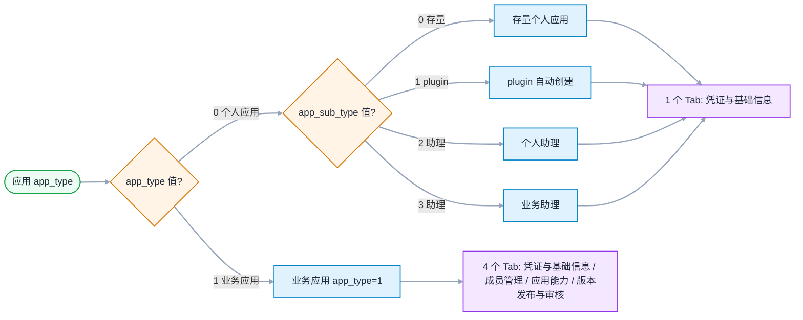
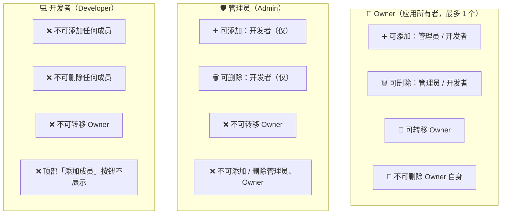
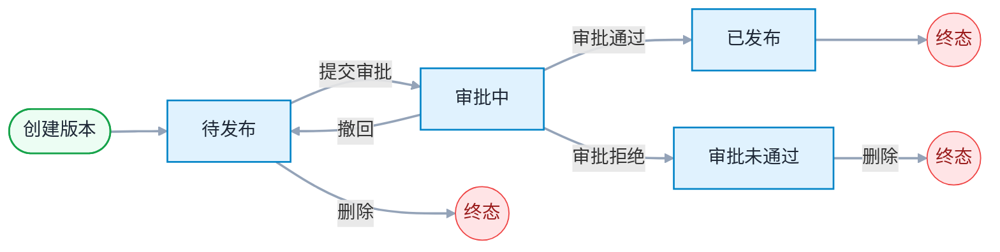

# 开放平台应用管理 - 整体设计

> 模板参照：需求设计说明书
> 业务素材：spec.md / plan.md / frontend-design.md / test-cases.md / tasks.md
> 编写日期：2026-06-12
> 文档版本：v1.0

---

## 修订记录

| 版本 | 日期 | 修订人 | 修订内容 |
|:----:|------|--------|----------|
| v1.0 | 2026-06-12 | SDDU | 依据需求设计说明书模板首次编写 |

---

## 目录

- 1 需求价值和概述
- 2 上下文分析（可选）
- 3 初始需求分析（可选）
    - 3.1 初始需求场景分析
    - 3.2 机构化IR（必选）
- 4 需求影响分析
    - 4.1 特性影响分析（可选）
- 5 系统用例分析（可选）
    - 5.1 用例清单
    - 5.2 用例分析
- 6 功能设计
    - 6.1 业界方案实现（可选）
    - 6.2 功能实现整体设计方案（可选）
    - 6.3 架构设计方案（可选）
    - 6.4 功能实现
- 7 系统级非功能设计
    - 7.1 系统级FMEA影响分析
    - 7.2 系统级安全影响分析
    - 7.3 兼容性
    - 7.4 可运维
- 8 checkList（必填）
    - 8.1 设计自检清单要求（必填）

---

## 1 需求价值和概述

### 1.1 价值主张

AI 重构开放平台 Open 面，提升稳定性、可维护性、开发效率。

### 1.2 需求概述

开放平台应用管理是企业内部开发者使用开放平台的核心入口。开发者通过此模块创建应用、配置能力、发布版本，实现与平台的功能集成。

**功能范围**：5 个模块，15 个功能需求（FR-001 ~ FR-015 + FR-019）

| 模块 | 功能 | 需求标号 | 详细设计 |
|------|------|---------|---------|
| 应用管理 | 应用列表、创建应用、凭证与基础信息、认证方式 | FR-001 ~ FR-005 | [design-01-app.md](./design-01-app.md) |
| 成员管理 | 成员列表、添加/删除成员、转移 Owner | FR-006 ~ FR-009 | [design-02-member.md](./design-02-member.md) |
| 能力管理 | 能力列表、添加/配置能力 | FR-010 | [design-03-ability.md](./design-03-ability.md) |
| 版本管理 | 版本列表、创建版本、版本详情、发布审批、撤回 | FR-011 ~ FR-015 | [design-04-version.md](./design-04-version.md) |
| 审计日志 | 13 个写接口全覆盖 | FR-019 | 本文档 §6.4 |

---

## 2 上下文分析（可选）

不涉及

---

## 3 初始需求分析（可选）

### 3.1 初始需求场景分析

**表 3-1 初始需求场景分析**

| 所属场景 | 场景名称 |
|----------|----------|
| 应用管理 | 创建应用 / 应用列表 / 凭证与基础信息 |
| 成员管理 | 成员管理 |
| 能力管理 | 添加应用能力 |
| 应用版本管理 | 版本发布与审核 |

### 3.2 机构化IR（必选）

**表 3-2 机构化IR**

| IR属性 | 具体信息 |
|--------|----------|
| **IR标识** | IR20260602000847 |
| **名称** | 前端界面重构 |
| **描述** | 业务中心前端界面进行重构，通过 AI 重写代码 |
| **优先级** | 中 |
| **需求描述（why）** | 现有前端代码可维护性差，需通过 AI 重构提升开发效率和代码质量 |
| **what** | 重写应用管理前端页面（应用列表 / 凭证与基础信息 / 成员管理 / 能力管理 / 版本管理） |
| **who** | 产品负责人 / 后端 owner（open-server）/ 前端 owner（wecodesite）/ 测试 owner（QA）|
| **其他** | - |
| **对架构要素的影响** | 新增 4 个后端 module（app / member / ability / version）；前端 5 个页面重写；灰度切换 |

---

## 4 需求影响分析

### 4.1 特性影响分析（可选）

> 本次设计原则（图 6-1）：数据库表不动 → 新增 V2 代码 → 接口分流（新页面调用 V2 接口 / 旧页面调用旧接口）。

**表 4-1 特性影响分析**

| 现有特性 | 影响方式 | 说明 |
|----------|----------|------|
| 开放平台应用管理 | 新增 | 全部为新模块、新接口、新页面；DB 9 张表不变；旧接口不变 |

---

## 5 系统用例分析（可选）

### 5.1 用例清单

| 角色名称 | 用例名称 | 用例简要说明 | 是否需要细化分析 | 详细设计 |
|----------|----------|-------------|:----------------:|---------|
| 开发者 | UC-01 浏览应用列表 | 查看有权限的应用，按卡片浏览和分页 | 否 | design-01-app |
| 登录用户 | UC-02 创建应用 | 填写表单创建新应用，自动生成凭证和 Owner | 是 | design-01-app |
| 应用成员 | UC-03 管理凭证与基本信息 | 查看凭证、编辑基本信息、配置认证方式 | 是 | design-01-app |
| Owner / 管理员 | UC-04 管理成员 | 添加/删除成员、转移 Owner | 是 | design-02-member |
| Owner / 管理员 | UC-05 管理应用能力 | 查看能力列表、添加/配置能力 | 否 | design-03-ability |
| Owner / 管理员 | UC-06 管理版本 | 创建版本、发布审批、撤回、删除 | 是 | design-04-version |
| 存量个人应用成员 | UC-07 绑定 EAMAP 升级 | 存量个人应用绑定 EAMAP 后升级为业务应用 | 是 | design-01-app |

### 5.2 用例分析

> 各用例的详细分析（前置条件、主成功场景、扩展场景、DFX 属性）见对应子设计文档。

### 5.3 影响的功能列表和需求分解

| 功能编号 | 功能名称 | 功能规格描述 | 类型 | 需求标号 | 需求名称 | 需求描述 |
|---------|---------|-------------|------|---------|---------|---------|
| F-01 | 应用列表 | 展示有权限的应用卡片列表，支持分页 | 新增 | FR-001 | 应用列表 | 按租户隔离展示有效应用 |
| F-02 | 创建应用 | 表单创建应用，自动生成凭证和 Owner | 新增 | FR-002 | 创建应用 | 必填名称/图标/EAMAP，名称唯一 |
| F-03 | 应用凭证 | 只读展示 APPID/Key/Secret | 新增 | FR-003 | 应用凭证 | Secret 支持显隐切换和复制 |
| F-04 | 基本信息编辑 | 编辑图标/名称/描述/示意图 | 新增 | FR-004 | 基本信息编辑 | 输入框达上限阻止继续输入 |
| F-05 | 认证方式 | 多选认证方式，SOAHeader 与 SOAURL 互斥 | 新增 | FR-005 | 认证方式 | 默认 Cookie，数字签名需 API Secret |
| F-06 | 成员列表 | 展示成员及角色，按权限矩阵动态操作 | 新增 | FR-006 | 成员列表 | 分页 + 拼音排序 + 权限矩阵 |
| F-07 | 添加成员 | 按角色添加成员，角色必选有默认值 | 新增 | FR-007 | 添加成员 | Owner 加管理员/开发者，管理员加开发者 |
| F-08 | 删除成员 | 删除指定角色记录，Owner 不可删 | 新增 | FR-008 | 删除成员 | 按权限矩阵，二次确认 |
| F-09 | 转移 Owner | 仅 Owner 可操作，事务原子完成 | 新增 | FR-009 | 转移 Owner | 删旧增新原子，保留其他角色 |
| F-10 | 能力管理 | 查看/添加/配置应用能力 | 新增 | FR-010 | 能力列表 | 按场景分组，添加后侧边栏出现入口 |
| F-11 | 版本列表 | 展示版本及状态，按状态-操作矩阵动态按钮 | 新增 | FR-011 | 版本列表 | 分页 + 状态-操作矩阵 |
| F-12 | 创建版本 | 填写版本号和描述，版本号递增 | 新增 | FR-012 | 创建版本 | x.x.x 格式，同应用唯一且递增 |
| F-13 | 版本详情 | 查看/编辑/发布版本 | 新增 | FR-013 | 版本详情 | 仅待发布可编辑 |
| F-14 | 发布审批 | 提交审批，状态 1→2 | 新增 | FR-014 | 发布审批 | 启动 V2 审批流程 |
| F-15 | 撤回版本 | 审批中撤回，状态 2→1 | 新增 | FR-015 | 撤回版本 | 调用审批引擎撤回 |
| F-16 | 操作审计 | 13 个写接口全覆盖 | 新增 | FR-019 | 操作审计 | 失败也记录，不阻塞主业务 |

---

## 6 功能设计

### 6.1 业界方案实现（可选）

不涉及

### 6.2 功能实现整体设计方案（可选）

| 维度 | 设计选择 |
|------|----------|
| 架构模式 | 前后端分离 + RESTful |
| 前端框架 | React 18 + Ant Design 4 |
| 后端框架 | Java 21 + Spring Boot + MyBatis |
| 持久化 | MySQL + 9 张表 |
| 缓存 | Redis |
| 通信 | RESTful API + JSON，统一 ApiResponse |
| 审计 | 复用 openplatform_operate_log_t + @AuditLog 切面 |

### 6.3 架构设计方案（可选）

#### 6.3.1 后端处理原则

**图 6-1 后端处理原则**



#### 6.3.2 灰度切换

**图 6-2 灰度切换（基于 Lookup 应用白名单）**

> Lookup 配置**应用白名单**（appId 列表）。白名单内的应用使用新页面 + V2 接口；不在白名单的应用使用旧页面 + 旧接口。**白名单为空时，所有应用都使用新页面**（即灰度全量）。



#### 6.3.3 目录结构

**图 6-3 目录结构**

```
open-server/modules/                 ← 后端 (wecode 仓)
├── app/                             # 应用管理（已有 resolver，新增业务代码）
│   ├── controller / service / mapper / entity / dto
├── member/                          # 新增 — 成员管理
│   ├── controller / service / mapper / entity / dto
├── ability/                         # 新增 — 能力管理
│   ├── controller / service / mapper / entity / dto
└── version/                         # 新增 — 版本管理
    ├── controller / service / mapper / entity / dto

wecodesite/src/                      ← 前端 (wecodesite 仓)
├── pages/
│   ├── AppList/                     # 应用列表
│   ├── BasicInfo/                   # 凭证与基础信息
│   ├── Members/                     # 成员管理
│   ├── Capabilities/                # 能力管理
│   └── VersionRelease/              # 版本管理
├── components/                      # 公共组件
├── configs/web.config.js            # 追加灰度配置
└── utils/constants.js               # 追加 APP 枚举
```

#### 6.3.4 数据库 ER 图

**图 6-4 数据库表关联关系（erDiagram）**

> 9 张表按 3 簇分组：应用主表（1）+ 应用子表（5：含 1 张 K-V 属性表）+ 能力主表与桥接（3：含 1 张 K-V 属性表）。



#### 6.3.5 应用类型分类

**图 6-5 应用类型分类**



#### 6.3.6 权限矩阵

**图 6-6 人员管理权限矩阵**

> 3 个角色，按"能做什么"展示。同一应用最多 1 个 Owner（唯一性约束），多角色共存（一人可同时是 admin+developer）。



#### 6.3.7 版本状态流转

**图 6-7 版本审批状态流转**



#### 6.3.8 能力类型

**表 6-8 能力类型枚举**

| ability_type | 名称 |
|:----:|------|
| 1 | 群置顶 |
| 2 | 群通知 |
| 3 | 链接增强 |
| 4 | 点对点通知 |
| 5 | we码 |
| 6 | 应用入群通知 |
| 7 | 助手广场卡片 |

### 6.4 功能实现

#### 6.4.1 实现思路

**表 6-1 后端实现思路**

| 维度 | 设计 |
|------|------|
| 分层 | Controller（参数校验+路由）→ Service（业务逻辑）→ Mapper（数据访问） |
| 权限校验 | 统一入口 `appContextResolver.resolveAndValidate(appId)`，ID 转换 + 成员资格校验 |
| 事务 | Service 方法粒度；创建应用 4 表、转 Owner 删旧增新均原子完成 |
| 审计 | `@AuditLog` + AOP 切面，13 个写接口全覆盖，不侵入业务代码 |

**表 6-2 前端实现思路**

| 维度 | 设计 |
|------|------|
| 页面 | 5 页 × 标准结构（index.jsx / route.js / thunk.js / constant.js / .m.less / components/） |
| 状态 | React useState 页面内管理 |
| 路由 | 按 `app_type` 动态侧边栏：业务应用 4 Tab / 个人应用 1 Tab |
| 表单 | Ant Design Form；达上限阻止输入；前端校验 + 后端二次校验 |

**表 6-3 接口规范**

| 维度 | 设计 |
|------|------|
| 协议 | RESTful + JSON |
| 响应 | 统一 ApiResponse（code / messageZh / messageEn / data） |
| 错误码 | 6 位分段：404xxx 不存在 / 403xxx 无权限 / 409xxx 冲突 / 400xxx 参数错 / 500xxx 系统异常 |

#### 6.4.2 接口设计

**表 6-4 后端 27 个核心端点**

| # | URL | method | 功能 | 鉴权 | 模块 |
|---|-----|--------|------|------|------|
| 1 | /service/open/v2/app | POST | 创建应用 | 登录 | app |
| 2 | /service/open/v2/app/{appId} | PUT | 更新应用 | 成员 | app |
| 3 | /service/open/v2/app/{appId} | GET | 获取应用详情 | 成员 | app |
| 4 | /service/open/v2/app?curPage=1&pageSize=10 | GET | 应用列表 | 登录 | app |
| 5 | /service/open/v2/app/eamap?curPage=1&pageSize=20 | GET | EAMAP 列表 | 登录 | app |
| 6 | /service/open/v2/app/icons | GET | 默认图标列表 | 登录 | app |
| 7 | /service/open/v2/app/{appId}/verify-type | PUT | 更新认证方式 | Owner/管理员 | app |
| 8 | /service/open/v2/app/{appId}/identity | GET | 获取凭证 | 成员 | app |
| 9 | /service/open/v2/app/{appId}/verify-type | GET | 获取认证方式 | 成员 | app |
| 10 | /service/open/v2/app/{appId}/bind-eamap | POST | 存量个人应用绑定 EAMAP | 成员 | app |
| 11 | /service/open/v2/app/{appId}/current-role | GET | 获取当前用户角色 | 登录 | app |
| 12 | /service/open/v2/file/upload?bizType=1 | POST | 上传图标/示意图 | 登录 | app |
| 13 | /service/open/v2/app/{appId}/members?curPage=1&pageSize=10 | GET | 成员列表 | 成员 | member |
| 14 | /service/open/v2/app/{appId}/members | POST | 添加成员 | Owner/管理员 | member |
| 15 | /service/open/v2/app/{appId}/members/{id} | DELETE | 删除成员 | Owner/管理员 | member |
| 16 | /service/open/v2/app/{appId}/transfer-owner | POST | 转移 Owner | Owner | member |
| 17 | /service/open/v2/app/{appId}/search-users?keyword=xxx | GET | 搜索企业成员 | 成员 | member |
| 18 | /service/open/v2/abilities?appId=xxx | GET | 能力列表 | 登录 | ability |
| 19 | /service/open/v2/app/{appId}/abilities | POST | 订阅能力 | Owner/管理员 | ability |
| 20 | /service/open/v2/app/{appId}/abilities | GET | 应用已订阅能力 | 成员 | ability |
| 21 | /service/open/v2/app/{appId}/versions?curPage=1&pageSize=10 | GET | 版本列表 | 成员 | version |
| 22 | /service/open/v2/app/{appId}/versions | POST | 创建版本 | Owner/管理员 | version |
| 23 | /service/open/v2/app/{appId}/versions/{versionId} | GET | 版本详情 | 成员 | version |
| 24 | /service/open/v2/app/{appId}/versions/{versionId}/publish | POST | 发布 | Owner/管理员 | version |
| 25 | /service/open/v2/app/{appId}/versions/{versionId}/withdraw | POST | 撤回版本 | Owner/管理员 | version |
| 26 | /service/open/v2/app/{appId}/versions/{versionId} | DELETE | 删除版本 | Owner/管理员 | version |
| 27 | /service/open/v2/app/{appId}/versions/{versionId} | PUT | 更新版本 | Owner/管理员 | version |

#### 6.4.3 数据模型设计

**核心数据模型（9 张表）**：

| # | 表名 | 关键字段 | 变更 |
|---|------|----------|:----:|
| 1 | openplatform_app_t | id, app_id, tenant_id, app_name_cn/en, app_type(0/1), app_sub_type(0/1/2/3/4), status | 不变 |
| 2 | openplatform_app_p_t | parent_id, property_name, property_value | 不变 |
| 3 | openplatform_app_member_t | app_id, account_id, member_type(0=开发者/1=Owner/2=管理员) | 不变 |
| 4 | openplatform_ability_t | ability_name_cn/en, ability_type(1~7), order_num | 不变 |
| 5 | openplatform_ability_p_t | parent_id, property_name, property_value | 不变 |
| 6 | openplatform_app_ability_relation_t | app_id, ability_id, UNIQUE(app_id,ability_id) | 不变 |
| 7 | openplatform_app_identity_t | app_id, public_key, private_key, ak | 不变 |
| 8 | openplatform_app_version_t | app_id, version_code, version_desc, status(1~4) | 不变 |
| 9 | openplatform_app_version_p_t | parent_id, property_name, property_value | 不变 |

**关键字段说明**：

| 字段 | 枚举值 |
|------|--------|
| `app_type` / `app_sub_type` | 0/0=存量个人应用, 0/1=plugin, 0/2=个人助理, 0/3=业务助理, 1/4=业务应用 |
| `member_type` | 0=开发者 / 1=Owner / 2=管理员 |
| `verify_type` | 0=Cookie / 1=SOAHeader / 2=数字签名 / 3=SOAURL / 4=APIG（多选逗号分隔）|
| `version.status` | 1=待发布 / 2=审批中 / 3=审批未通过 / 4=已发布 |

#### 6.4.4 架构元素影响列表

| 层 | 元素 | 改动 | 说明 |
|----|------|------|------|
| DB | 9 张业务表 | 不变 | DDL 不改，存量数据零迁移 |
| DB | openplatform_operate_log_t | 不变 | 复用现有审计日志表 |
| 后端 | modules/app/ | 追加 | 已有 resolver，新增 Controller / Service / Mapper / Entity / DTO |
| 后端 | modules/member/ | 新增 | 成员管理 |
| 后端 | modules/ability/ | 新增 | 能力管理 |
| 后端 | modules/version/ | 新增 | 版本管理 |
| 后端 | OperateEnum.java | 追加 | 末尾追加 13 个枚举值 |
| 后端 | OperateLogV2Aspect.java | 追加 | 追加策略分支 |
| 后端 | snapshot/ | 新增 | 4 个 EntitySnapshotLoader 实现 |
| 前端 | pages/ 下 5 个页面 | 新增 | AppList / BasicInfo / Members / Capabilities / VersionRelease |
| 前端 | components/ 下公共组件 | 新增 | AppHeader / TopNav / EmptyState / CardGrid |
| 前端 | web.config.js | 追加 | 灰度配置 |
| 前端 | constants.js | 追加 | APP 相关枚举映射 |

#### 6.4.5 功能实现分解分配清单

| Task ID | 模块 | 职责 |
|---------|------|------|
| TASK-001 ~ 007 | app | AppController / AppService / AppContextResolver / Mapper / Entity / DTO / 枚举 |
| TASK-008 ~ 010 | member | MemberController / MemberService / AppMemberMapper |
| TASK-011 ~ 013 | ability | AbilityController / AbilityService / Mapper |
| TASK-014 ~ 016 | version | VersionController / VersionService / Mapper |
| TASK-017 ~ 019 | common | @AuditLog 切面扩展 / OperateEnum 扩展 / EntitySnapshotLoader |
| TASK-020 ~ 022 | 前端 | AppListPage + 4 Tab + useState + axios 拦截器 |
| TASK-023 ~ 024 | 测试 | 单元 + 集成测试 |

---

## 7 系统级非功能设计

### 7.1 系统级FMEA影响分析

| 失效模式 | 影响 | 对策 |
|----------|------|------|
| 转移 Owner 事务失败 | 应用无 Owner | 事务回滚，原 Owner 保留 |
| 版本状态非法流转 | 数据不一致 | 后端状态机强校验，非法抛 409303 |
| 审计日志写入失败 | 操作不可追溯 | @Async + REQUIRES_NEW 独立事务，失败也记录 status=0 |
| APP Secret 泄露 | 应用被恶意调用 | 密文存储，前端不持久化 |
| 卡片服务通知失败 | 卡片数据陈旧 | AFTER_COMMIT 异步，失败不影响主流程 |

### 7.2 系统级安全影响分析

| 安全维度 | 措施 |
|----------|------|
| 身份认证 | 复用 SSO |
| 越权校验 | `appContextResolver.resolveAndValidate` 统一入口，非成员返回 403100 |
| 敏感数据 | APP Secret / API Secret 密文存储，前端不持久化 |
| 操作审计 | 13 个写接口全覆盖，失败也记录 |

### 7.3 兼容性

**后向兼容性确认**：
- DB：9 张表不变，存量数据零迁移
- API：全部新增 /v2/ 端点，不改旧接口
- 前端：新增 v2 路由，不改现有路由和页面

**前向兼容性确认**：
- 状态机扩展：新增状态需扩展枚举并刷新 UI 按钮
- 能力扩展：新增能力仅需插入 ability_t 记录
- 审计扩展：新增写接口仅需加 @AuditLog 注解
- 灰度全量：Lookup 应用白名单清空即所有应用都使用新页面

### 7.4 可运维

| 运维维度 | 措施 |
|----------|------|
| 灰度 | Lookup 应用白名单控制新旧 UI 切换（白名单空 = 全部新页面） |
| 回滚 | Lookup 加入 appId 即该应用回退旧页面；代码快速回滚 |
| 日志 | 业务日志（结构化 JSON + traceId）+ 审计日志 |
| 告警 | 错误率 > 1% 告警；状态机非法流转告警；卡片通知失败告警 |

---

## 8 checkList（必填）

### 8.1 设计自检清单要求（必填）

**表 8-1 设计自检清单**

| check 点 | 是否达标 | 备注 |
|----------|:--------:|------|
| 文档结构完整覆盖模板 8 大章节 | 是 | §1~§8 全部覆盖 |
| 包含需求价值/来源 | 是 | §1 |
| 包含初始需求场景分析 | 是 | §3.1（4 个一级菜单）|
| 包含结构化 IR | 是 | §3.2 |
| 包含特性影响分析 | 是 | §4.1 |
| 包含整体架构设计 | 是 | §6.2 |
| 包含接口设计 | 是 | §6.4.2（27 个端点）|
| 包含数据模型设计 | 是 | §6.4.3（9 张表）|
| 包含 FMEA 分析 | 是 | §7.1 |
| 包含系统级安全影响分析 | 是 | §7.2 |
| 包含兼容性确认 | 是 | §7.3 |
| 包含可运维设计 | 是 | §7.4 |
| 设计自检清单全部勾选完毕 | 是 | 本表 13 项全部达标 |

---

**文档结束**
