# 应用管理 - 详细设计

> 模板参照：需求设计说明书
> 父文档：[design-00-overview.md](./design-00-overview.md)
> 业务素材：plan.md §4.2.1 AppService / frontend-design.md §5~§8
> 编写日期：2026-06-12
> 文档版本：v1.0

---

## 修订记录

| 版本 | 日期 | 修订人 | 修订内容 |
|:----:|------|--------|----------|
| v1.0 | 2026-06-12 | SDDU | 依据需求设计说明书模板首次编写 |
| v1.1 | 2026-07-03 | Build Agent | 认证方式 DB 存储新增 `verify_type_v2` 字段（多选），修改时写 v2 不动旧字段；查询优先 v2 没值读旧字段；统一解析入口 `AppCommonService.resolveVerifyTypeList` |

---

## 目录

- 1 需求价值和概述
- 2 上下文分析（可选）
- 3 初始需求分析（可选）
- 4 需求影响分析
- 5 系统用例分析（可选）
    - 5.1 用例清单
    - 5.2 用例分析
- 6 功能设计
    - 6.1 业界方案实现（可选）
    - 6.2 功能实现整体设计方案（可选）
    - 6.3 架构设计方案（可选）
    - 6.4 功能实现
        - 6.4.1 实现思路
        - 6.4.2 实现设计
        - 6.4.3 功能可靠性分析（可选）
        - 6.4.4 功能安全分析（可选）
        - 6.4.5 架构元素影响列表（可选）
        - 6.4.6 接口设计
        - 6.4.7 数据模型设计
- 7 系统级非功能设计
- 8 checkList（必填）

---

## 1 需求价值和概述

### 1.1 价值主张

AI 重构开放平台 Open 面，提升稳定性、可维护性、开发效率。

### 1.2 需求概述

应用管理是开放平台的核心入口模块，包含应用列表浏览、创建应用、凭证管理、基本信息编辑、认证方式配置、EAMAP 绑定升级等功能。

**涉及需求**：FR-001 ~ FR-005、FR-016

| 需求标号 | 需求名称 | 需求描述 |
|---------|---------|---------|
| FR-001 | 应用列表 | 按租户隔离展示有效应用，卡片浏览+分页 |
| FR-002 | 创建应用 | 必填名称/图标/EAMAP，名称唯一，自动生成凭证和 Owner |
| FR-003 | 应用凭证 | 只读展示 APPID/Key/Secret，Secret 支持显隐切换和复制 |
| FR-004 | 基本信息编辑 | 编辑图标/名称/描述/示意图，输入框达上限阻止继续输入 |
| FR-005 | 认证方式 | 多选认证方式，SOAHeader 与 SOAURL 互斥，默认 Cookie |
| FR-016 | 绑定 EAMAP 升级 | 存量个人应用绑定 EAMAP 后升级为业务应用 |

---

## 2 上下文分析（可选）

不涉及

---

## 3 初始需求分析（可选）

不涉及

---

## 4 需求影响分析

### 4.1 特性影响分析

| 现有特性 | 影响方式 | 说明 |
|----------|----------|------|
| 应用列表 | 新增 | 新页面 + V2 接口 |
| 创建应用 | 新增 | 新 Modal + V2 接口 |
| 凭证与基础信息 | 新增 | 新页面 + V2 接口 |
| 认证方式 | 新增 | 新组件 + V2 接口 |
| EAMAP 绑定 | 新增 | 新 Modal + V2 接口 |

---

## 5 系统用例分析（可选）

### 5.1 用例清单

| 角色名称 | 用例名称 | 用例简要说明 | 是否需要细化分析 |
|----------|----------|-------------|:----------------:|
| 开发者 | UC-01 浏览应用列表 | 查看有权限的应用，按卡片浏览和分页 | 否 |
| 登录用户 | UC-02 创建应用 | 填写表单创建新应用，自动生成凭证和 Owner | 是 |
| 应用成员 | UC-03 管理凭证与基本信息 | 查看凭证、编辑基本信息、配置认证方式 | 是 |
| 存量个人应用成员 | UC-07 绑定 EAMAP 升级 | 存量个人应用绑定 EAMAP 后升级为业务应用 | 是 |

### 5.2 用例分析

#### 5.2.1 UC-02 创建应用

**简要说明**：开发者通过表单创建新应用，系统自动生成 APPID/Key/Secret，创建者自动成为 Owner

**Actor**：登录用户

**前置条件**：用户已登录；用户拥有某 EAMAP 的 owner 权限

**最小保证**：创建失败时返回明确错误码（409100 名称重复 / 409102 EAMAP 已绑定 / 403104 非 EAMAP owner），不产生任何脏数据

**成功保证**：4 张表原子写入（app + member + identity + property）；创建者成为 Owner；返回 appId；异步通知卡片服务

**主成功场景**：
1. 用户点击"创建应用"打开表单
2. 填写应用名称、图标、EAMAP 编码等必填项
3. 提交表单
4. 后端校验名称唯一性、EAMAP 未被绑定、当前用户是 EAMAP owner
5. 事务内写入 4 张表，事务提交
6. 异步通知卡片服务
7. 返回 appId，前端跳转详情页

**扩展场景**：
- 3a. 名称已存在 → 返回 409100，前端提示"应用名称已存在"
- 3b. EAMAP 已被其他应用绑定 → 返回 409102
- 3c. 当前用户不是 EAMAP owner → 返回 403104

**DFX属性**：事务原子性（4 表同事务）；DB UNIQUE 双重保障防并发

#### 5.2.2 UC-03 管理凭证与基本信息

**简要说明**：应用成员查看凭证、编辑基本信息、配置认证方式

**Actor**：应用成员（Owner / 管理员 / 开发者均可查看，编辑需 Owner 或管理员）

**前置条件**：用户已登录且为目标应用的成员

**最小保证**：操作失败时不改变应用信息；权限不足返回 40310x

**成功保证**：应用信息持久化；审计日志记录

**主成功场景**：
1. 用户从应用列表点击卡片进入详情页
2. 默认展示"凭证与基础信息"Tab
3. 查看 APPID/Key/Secret（Secret 默认密文，点击显示）
4. Owner/管理员点击"编辑"修改基本信息
5. 提交修改，后端校验并更新

**扩展场景**：
- 3a. Secret 显隐切换（纯前端，不调接口）
- 4a. 开发者点击编辑 → 按钮不渲染
- 5a. 名称已存在 → 返回 409100

#### 5.2.3 UC-07 绑定 EAMAP 升级

**简要说明**：存量个人应用（app_sub_type=0）绑定 EAMAP 后升级为业务应用

**Actor**：应用成员

**前置条件**：应用为存量个人应用（app_type=0, app_sub_type=0）

**最小保证**：绑定失败不改变应用类型；EAMAP 已被绑定返回 409102

**成功保证**：app_type 改为 1、app_sub_type 改为 4；侧边栏从 1 Tab 扩展为 4 Tab

**主成功场景**：
1. 用户在凭证与基础信息页点击"绑定 EAMAP"
2. 选择 EAMAP 编码
3. 后端校验 EAMAP 未被绑定
4. 事务内更新 app_type/app_sub_type + 写入 eamap_app_code 属性
5. 异步通知卡片服务

**扩展场景**：
- 2a. EAMAP 已被其他应用绑定 → 返回 409102
- 2b. 应用非存量个人应用 → 返回 409103

**DFX属性**：事务原子性；EAMAP 唯一约束防并发

---

## 6 功能设计

### 6.1 业界方案实现（可选）

不涉及

### 6.2 功能实现整体设计方案（可选）

不涉及（见 design-00-overview.md §6.2）

### 6.3 架构设计方案（可选）

不涉及（见 design-00-overview.md §6.3）

### 6.4 功能实现

#### 6.4.1 实现思路

**后端（AppService）**：

| 维度 | 设计 |
|------|------|
| 分层 | AppController → AppService → AppMapper / AppPropertyMapper / AppIdentityMapper |
| 权限校验 | 列表/创建无需 appId，其余调用 `appContextResolver.resolveAndValidate(appId)` |
| 事务 | 创建应用 4 表（app + member + identity + property）同事务 |
| 审计 | CREATE_APP / UPDATE_APP / UPDATE_APP_VERIFY_TYPE / BIND_APP_EAMAP |

**前端**：

| 页面 | 组件 | 说明 |
|------|------|------|
| AppList | AppListPage | 应用卡片列表 + 创建应用入口 |
| CreateAppModal | CreateAppModal | 创建应用表单弹窗 |
| BasicInfo | BasicInfoPage | 凭证与基础信息（4 卡片） |

#### 6.4.2 实现设计

应用管理流程较简单（列表展示 + 创建 + 编辑 + 认证配置），无复杂时序图。

**核心流程**：
1. 列表页加载 → 调用接口 1.4 获取应用列表
2. 用户点击"创建" → 弹出 Modal，填写表单 → 调用接口 1.1
3. 进入详情页 → 调用接口 1.3 获取基本信息 + 接口 1.8/1.9 获取凭证/认证方式
4. 用户编辑基本信息 → 调用接口 1.2
5. 用户配置认证方式 → 调用接口 1.7

#### 6.4.3 功能可靠性分析（可选）

| 可靠性风险 | 影响 | 措施 |
|------------|------|------|
| 创建应用 4 表写入中途失败 | 应用数据不完整 | 单事务保证原子性；任一失败全回滚 |
| 卡片服务通知失败 | 卡片服务数据陈旧 | AFTER_COMMIT 异步发送；失败不影响主流程 |

#### 6.4.4 功能安全分析（可选）

| 安全维度 | 措施 |
|----------|------|
| 身份认证 | 复用 SSO |
| 越权校验 | 创建应用需 EAMAP owner（403104）；编辑/凭证需应用成员（403100） |
| 敏感数据 | APP Secret / API Secret 密文存储；前端不持久化 |
| 操作审计 | 4 个写接口全覆盖（CREATE_APP / UPDATE_APP / UPDATE_APP_VERIFY_TYPE / BIND_APP_EAMAP） |

#### 6.4.5 架构元素影响列表（可选）

| 层 | 元素 | 改动 | 说明 |
|----|------|------|------|
| 后端 | modules/app/controller/ | 新增 | AppController（12 个端点） |
| 后端 | modules/app/service/ | 新增 | AppService + AppContextResolver |
| 后端 | modules/app/mapper/ | 新增 | AppMapper / AppPropertyMapper / AppIdentityMapper |
| 后端 | modules/app/entity/ | 新增 | App / AppProperty / AppIdentity |
| 后端 | modules/app/dto/ | 新增 | AppCreateRequest / AppUpdateRequest / AppResponse 等 |
| 前端 | pages/AppList/ | 新增 | 应用列表页 |
| 前端 | pages/BasicInfo/ | 新增 | 凭证与基础信息页 |
| 前端 | components/CreateAppModal/ | 复用 | 已有组件 |
| 前端 | components/BindEamapModal/ | 复用 | 已有组件 |

#### 6.4.6 接口设计

**表 6-1 应用管理接口（12 个端点）**

| # | URL | method | 功能 | 鉴权 | 审计 |
|---|-----|--------|------|------|:----:|
| 1.1 | /service/open/v2/app | POST | 创建应用 | 登录 | CREATE_APP |
| 1.2 | /service/open/v2/app?curPage=1&pageSize=10 | GET | 应用列表 | 登录 | - |
| 1.3 | /service/open/v2/app/{appId} | PUT | 更新应用 | 成员 | UPDATE_APP |
| 1.4 | /service/open/v2/app/{appId} | GET | 获取应用详情 | 成员 | - |
| 1.5 | /service/open/v2/app/eamap?curPage=1&pageSize=20 | GET | EAMAP 列表 | 登录 | - |
| 1.6 | /service/open/v2/app/icons | GET | 默认图标列表 | 登录 | - |
| 1.7 | /service/open/v2/app/{appId}/verify-type | PUT | 更新认证方式 | 成员 | UPDATE_APP_VERIFY_TYPE |
| 1.8 | /service/open/v2/app/{appId}/identity | GET | 获取凭证 | 成员 | - |
| 1.9 | /service/open/v2/app/{appId}/verify-type | GET | 获取认证方式 | 成员 | - |
| 1.10 | /service/open/v2/app/{appId}/bind-eamap | POST | 绑定 EAMAP | Owner/Admin | BIND_APP_EAMAP |
| 1.11 | /service/open/v2/app/{appId}/current-role | GET | 获取当前用户角色 | 登录 | - |
| 1.12 | /service/open/v2/file/upload?bizType=1 | POST | 上传图标/示意图 | 登录 | - |

**核心接口详细设计**：

##### 接口 1.1：创建应用

**REST**：`POST /service/open/v2/app`

**作用**：开发者创建新的 WeLink 应用。自动生成 APPID/Key/Secret，自动创建 Owner 成员记录。

**入参**：（`CreateAppRequest`）：

| 字段 | 类型 | 必填 | 说明 |
|------|------|:----:|------|
| `nameCn` | `string` | ✅ | 应用中文名，≤255 字符，全局唯一 |
| `nameEn` | `string` | ✅ | 应用英文名，≤255 字符，全局唯一 |
| `iconId` | `string` | ✅ | 应用图标 ID；来源二选一：<br>① **默认图标列表** — 系统预置若干图标供选择（接口 1.6）<br>② **自定义上传** — 用户上传 128×128px PNG/JPG/JPEG 图片，≤100KB，后端返回 fileId（接口 1.12, `bizType=1`） |
| `eamapAppCode` | `string` | ✅ | EAMAP 编码（业务应用必绑） |
| `descCn` | `string` | - | 应用中文描述，≤2000 字符 |
| `descEn` | `string` | - | 应用英文描述，≤2000 字符 |

**默认值**（系统自动设置）：

| 字段 | 默认值 | 说明 |
|------|--------|------|
| `appType` | 1 | 业务应用（创建时默认为业务应用） |
| `appSubType` | 4 | 业务应用-标准子类型 |
| `verifyType` | 0 | Cookie（认证方式默认为 Cookie）— 创建应用时写入旧字段 `verify_type`；修改认证方式后写入新字段 `verify_type_v2`（多选逗号分隔，如 `"0,2"`） |
| `status` | 1 | 有效 |

> 说明：`apiSecret` 不在 1.1 设置，由"更新认证方式"接口（1.7）单独配置。

**出参**：`CreateAppVO`

**执行逻辑**：

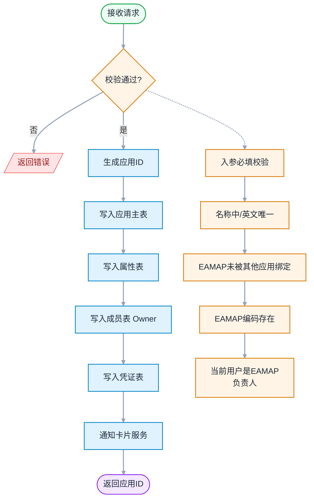

**权限要求**：登录用户 + 当前用户必须是 `eamapAppCode` 对应 EAMAP 的 owner

**相关表**：`openplatform_app_t`、`openplatform_app_member_t`、`openplatform_app_identity_t`、`openplatform_app_p_t`

**错误码**：
- `409100`（应用名称已存在）
- `400100`（应用参数错误）
- `409102`（EAMAP 已被其他应用绑定）
- `400103`（EAMAP 编码不存在）
- `403104`（当前用户不是 EAMAP 的 owner）
- `400101`（图标 ID 不存在）
- `401`（未登录）
- `500`（系统异常）

**入参示例**：

```json
POST /service/open/v2/app
Content-Type: application/json

{
  "nameCn": "WeLink 智能助手",
  "nameEn": "WeLink Smart Assistant",
  "iconId": "icon_abc123",
  "eamapAppCode": "eamap_workflow_001",
  "descCn": "基于 WeLink 平台的智能工作助手",
  "descEn": "Intelligent work assistant based on WeLink platform"
}
```

**出参示例**：

```json
{
  "code": "200",
  "messageZh": "成功",
  "messageEn": "success",
  "data": {
    "appId": "app_20260603_xyz789"
  }
}
```

> 说明：创建成功后仅返回 `appId`，前端拿到 `appId` 后跳转详情页时再调用"获取应用详情"接口（1.3）拉取完整数据。

**错误响应示例**：

```json
{
  "code": "409305",
  "messageZh": "仅待发布或审批未通过版本可删除: status=2（审批中）",
  "messageEn": "Only pending or rejected versions can be deleted: status=2 (Under Review)",
  "data": null
}
```

---


##### 接口 1.2：获取应用列表

**REST**：`GET /service/open/v2/app?curPage=1&pageSize=10`

**作用**：分页查询当前用户有权限的应用列表。

**入参**：（查询参数）：

| 字段 | 类型 | 必填 | 说明 |
|------|------|:----:|------|
| `curPage` | `int` | ✅ | 当前页码（从 1 开始） |
| `pageSize` | `int` | ✅ | 每页条数（10/20/50） |

**出参**：`ApiResponse<AppListItemVO[]>`

| 字段 | 类型 | 说明 |
|------|------|------|
| `code` | `string` | 响应码 |
| `messageZh` | `string` | 中文消息 |
| `messageEn` | `string` | 英文消息 |
| `data` | `AppListItemVO[]` | 应用列表 |
| `page` | `PageResponse` | 分页信息 |
| `page.curPage` | `int` | 当前页码 |
| `page.pageSize` | `int` | 每页条数 |
| `page.total` | `int` | 总记录数 |
| `page.totalPages` | `int` | 总页数 |
| `data[].appId` | `string` | 应用 ID |
| `data[].nameCn` | `string` | 应用中文名 |
| `data[].nameEn` | `string` | 应用英文名 |
| `data[].icon` | `FileVO` | 应用图标（单个对象，含 `fileId` + `url`） |
| `data[].appType` | `int` | 应用类型（1=业务应用，0=个人应用） |
| `data[].appSubType` | `int` | 应用子类型 |
| `data[].status` | `int` | 状态（1=有效，0=失效） |
| `data[].eamapBound` | `boolean` | 是否已绑定 EAMAP（`eamapAppCode` 非空则为 `true`） |
| `data[].owner` | `EmployeeInfoVO` | 所有者信息（含 welinkId / w3Account / memberNameCn / memberNameEn） |
| `data[].currentUserRole` | `int` | 当前用户在该应用的角色（按数据库 `member_type` 枚举：0=Developer，1=Owner，2=Admin） |
| `data[].lastUpdateTime` | `string` | 最后更新时间（ISO 8601） |

**`EmployeeInfoVO` 员工信息**（`common/vo/EmployeeInfoVO.java`，由三方员工服务提供 + Caffeine 缓存）：

| 字段 | 类型 | 说明 |
|------|------|------|
| `welinkId` | `string` | WeLink 账号 ID |
| `w3Account` | `string` | W3 工号 |
| `memberNameCn` | `string` | 中文名 |
| `memberNameEn` | `string` | 英文名 |

**执行逻辑**：

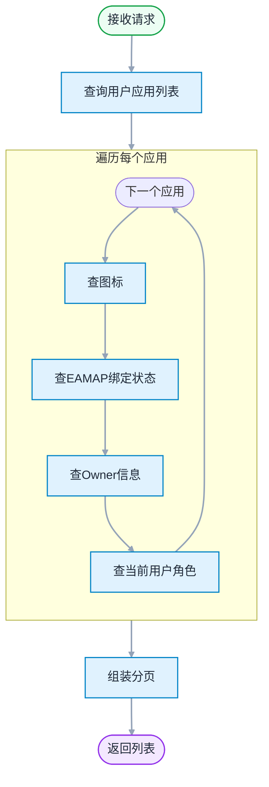

**权限要求**：登录用户

**错误码**：
- `401`（未登录）
- `500`（系统异常）

**入参示例**：

```json
GET /service/open/v2/app?curPage=1&pageSize=10
```

**出参示例**：

```json
{
  "code": "200",
  "messageZh": "成功",
  "messageEn": "success",
  "data": [
    {
      "appId": "app_20260603_xyz789",
      "nameCn": "WeLink 智能助手",
      "nameEn": "WeLink Smart Assistant",
      "icon": {
        "fileId": "icon_abc123",
        "url": "https://cdn.example.com/icons/abc123.png"
      },
      "appType": 1,
      "appSubType": 4,
      "status": 1,
      "eamapBound": true,
      "owner": {
        "welinkId": "user_10001",
        "w3Account": "E10001",
        "memberNameCn": "张三",
        "memberNameEn": "Zhang San"
      },
      "currentUserRole": 0,
      "lastUpdateTime": "2026-06-03 10:30:00"
    },
    {
      "appId": "app_20260520_abc456",
      "nameCn": "智能审批",
      "nameEn": "Smart Approval",
      "icon": {
        "fileId": "icon_def456",
        "url": "https://cdn.example.com/icons/def456.png"
      },
      "appType": 1,
      "appSubType": 4,
      "status": 1,
      "eamapBound": true,
      "owner": {
        "welinkId": "user_20002",
        "w3Account": "E20002",
        "memberNameCn": "李四",
        "memberNameEn": "Li Si"
      },
      "currentUserRole": 1,
      "lastUpdateTime": "2026-05-20 16:00:00"
    }
  ],
  "page": {
    "curPage": 1,
    "pageSize": 10,
    "total": 2,
    "totalPages": 1
  }
}
```

**错误响应示例**：

```json
{
  "code": "401",
  "messageZh": "未登录",
  "messageEn": "Unauthorized",
  "data": null
}
```


##### 接口 1.3：更新应用

**REST**：`PUT /service/open/v2/app/{appId}`

**作用**：更新应用基本信息（中文名/英文名/描述/图标）。

**入参**：：

| 字段 | 类型 | 必填 | 说明 |
|------|------|:----:|------|
| `appId` | `string` | ✅ | 应用 ID |
| `nameCn` | `string` | ✅ | 应用中文名，≤255 字符，全局唯一 |
| `nameEn` | `string` | ✅ | 应用英文名，≤255 字符，全局唯一 |
| `iconId` | `string` | ✅ | 应用图标 ID；来源二选一：<br>① **默认图标列表** — 系统预置若干图标供选择（接口 1.6）<br>② **自定义上传** — 用户上传 128×128px PNG/JPG/JPEG 图片，≤100KB，后端返回 fileId（接口 1.12, `bizType=1`） |
| `descCn` | `string` | - | 应用中文描述，≤2000 字符 |
| `descEn` | `string` | - | 应用英文描述，≤2000 字符 |
| `diagramIdList` | `string[]` | - | 功能示意图文件 ID 列表（前端只传 ID，后端解析 URL） |

**出参**：data 为空

**执行逻辑**：

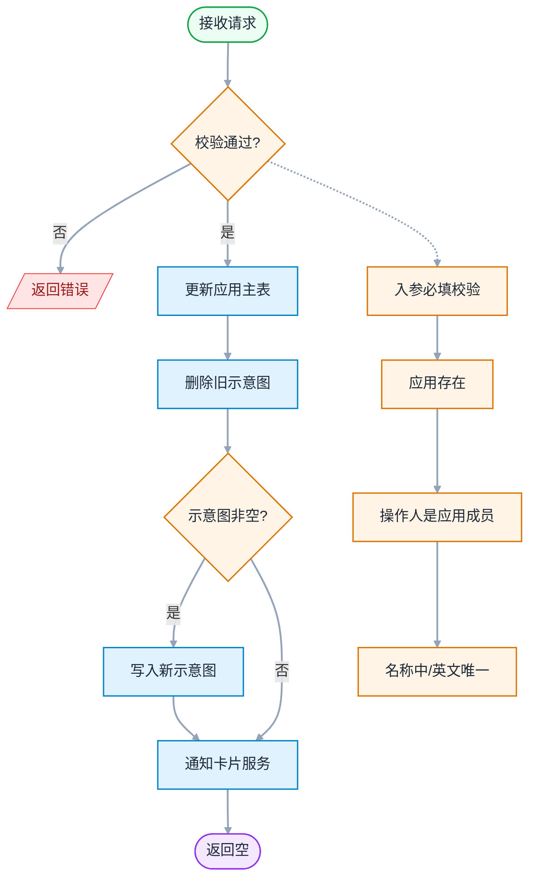

**权限要求**：操作人必须是该 `appId` 对应应用的成员

**错误码**：
- `404100`（应用不存在）
- `403100`（无权访问）
- `409100`（应用名称已存在）
- `400100`（应用参数错误）
- `400101`（图标 ID 不存在）
- `401`（未登录）
- `403`（无操作权限）
- `500`（系统异常）

**入参示例**：

```json
PUT /service/open/v2/app/app_20260603_xyz789
Content-Type: application/json

{
  "nameCn": "WeLink 智能助手 v2",
  "nameEn": "WeLink Smart Assistant v2",
  "iconId": "icon_abc123",
  "descCn": "升级版智能工作助手",
  "descEn": "Upgraded intelligent work assistant",
  "diagramIdList": ["file_diagram_001", "file_diagram_002"]
}
```

> 说明：`nameCn`、`nameEn`、`iconId` 均为必填；`descCn`、`descEn`、`diagramIdList` 可选。

**出参示例**：

```json
{
  "code": "200",
  "messageZh": "成功",
  "messageEn": "success",
  "data": null
}
```

> 说明：data 为空，前端需要时再调用"获取应用详情"接口（1.3）拉取最新数据。

**错误响应示例**：

```json
{
  "code": "409100",
  "messageZh": "应用英文名已存在: WeLink Smart Assistant",
  "messageEn": "Application English name already exists: WeLink Smart Assistant",
  "data": null
}
```

---


##### 接口 1.4：获取应用基本信息

**REST**：`GET /service/open/v2/app/{appId}`

**作用**：获取应用的**基本信息**（不包含应用凭证、认证方式，这些由独立接口提供）。

**出参**：`AppBasicInfoVO`

| 字段 | 类型 | 说明 |
|------|------|------|
| `appId` | `string` | 应用 ID |
| `nameCn` | `string` | 应用中文名 |
| `nameEn` | `string` | 应用英文名 |
| `icon` | `FileVO` | 应用图标（对象，含 `fileId` + `url`） |
| `descCn` | `string` | 应用中文描述 |
| `descEn` | `string` | 应用英文描述 |
| `appType` | `int` | 应用类型（1=业务应用，0=个人应用） |
| `appSubType` | `int` | 应用子类型 |
| `status` | `int` | 状态（1=有效，0=失效） |
| `eamapAppCode` | `string` | EAMAP 编码 |
| `eamapAppName` | `string` | EAMAP 名称（用于前端 AppHeader 展示「已绑定: EAMAP名称 EAMAP_CODE」，从 EAMAP 服务查询） |
| `diagramIdList` | `FileVO[]` | 功能示意图列表（元素含 `fileId` + `url`） |
| `createBy` | `string` | 创建者账号 |
| `createTime` | `string` | 创建时间（ISO 8601） |
| `lastUpdateBy` | `string` | 最后更新者账号 |
| `lastUpdateTime` | `string` | 最后更新时间（ISO 8601） |

**`FileVO` 通用文件值对象**（`common/model/FileVO.java`）：

| 字段 | 类型 | 说明 |
|------|------|------|
| `fileId` | `string` | 文件 ID（来自图标库 / 资源库） |
| `url` | `string` | 文件访问 URL |

**执行逻辑**：

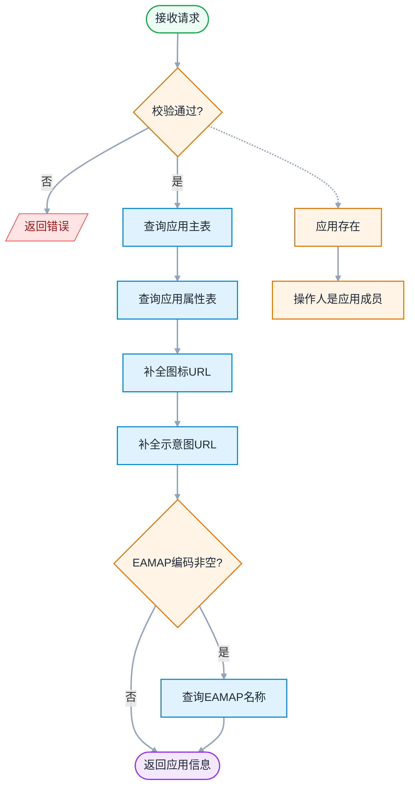

**权限要求**：操作人必须是该 `appId` 对应应用的成员

**错误码**：
- `404100`（应用不存在）
- `403100`（无权访问）
- `401`（未登录）
- `500`（系统异常）

**入参示例**：

```json
GET /service/open/v2/app/app_20260603_xyz789
```

**出参示例**：

```json
{
  "code": "200",
  "messageZh": "成功",
  "messageEn": "success",
  "data": {
    "appId": "app_20260603_xyz789",
    "nameCn": "WeLink 智能助手",
    "nameEn": "WeLink Smart Assistant",
    "icon": {
      "fileId": "icon_abc123",
      "url": "https://cdn.example.com/icons/icon_abc123.png"
    },
    "descCn": "基于 WeLink 平台的智能工作助手",
    "descEn": "Intelligent work assistant based on WeLink platform",
    "appType": 1,
    "appSubType": 4,
    "status": 1,
    "eamapAppCode": "eamap_workflow_001",
    "eamapAppName": "工作流引擎",
    "diagramIdList": [
      {
        "fileId": "file_diagram_001",
        "url": "https://cdn.example.com/diagrams/diagram_001.png"
      },
      {
        "fileId": "file_diagram_002",
        "url": "https://cdn.example.com/diagrams/diagram_002.png"
      }
    ],
    "createBy": "user_10001",
    "createTime": "2026-06-03 10:30:00",
    "lastUpdateBy": "user_10001",
    "lastUpdateTime": "2026-06-03 10:30:00"
  }
}
```

> 说明：本接口不返回凭证（APPID/Key/Secret）和认证方式（verifyType），由 1.8 和 1.9 独立接口提供。

**错误响应示例**：

```json
{
  "code": "403100",
  "messageZh": "无权访问应用: app_20260603_xyz789",
  "messageEn": "No access to the application: app_20260603_xyz789",
  "data": null
}
```

---

##### 接口 1.5：获取 EAMAP 列表

**REST**：`GET /service/open/v2/app/eamap?curPage=1&pageSize=20`

**作用**：分页获取可用 EAMAP 服务列表，供前端"创建应用/绑定 EAMAP"时下拉选择。

**入参**：（查询参数）：

| 字段 | 类型 | 必填 | 说明 |
|------|------|:----:|------|
| `curPage` | `int` | ✅ | 当前页码（从 1 开始） |
| `pageSize` | `int` | ✅ | 每页条数（10/20/50） |

**出参**：`ApiResponse<EamapVO[]>`

| 字段 | 类型 | 说明 |
|------|------|------|
| `code` | `string` | 响应码 |
| `messageZh` | `string` | 中文消息 |
| `messageEn` | `string` | 英文消息 |
| `data` | `EamapVO[]` | EAMAP 列表 |
| `page` | `PageResponse` | 分页信息 |
| `page.curPage` | `int` | 当前页码 |
| `page.pageSize` | `int` | 每页条数 |
| `page.total` | `int` | 总记录数 |
| `page.totalPages` | `int` | 总页数 |
| `data[].eamapAppCode` | `string` | EAMAP 编码 |
| `data[].eamapAppName` | `string` | EAMAP 名称 |

**执行逻辑**：

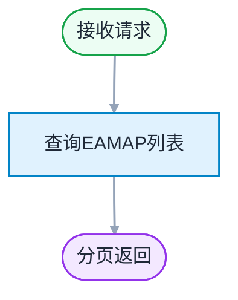

**权限要求**：登录用户

**错误码**：
- `401`（未登录）
- `500`（系统异常）

**入参示例**：

```json
GET /service/open/v2/app/eamap?curPage=1&pageSize=20
```

**出参示例**：

```json
{
  "code": "200",
  "messageZh": "成功",
  "messageEn": "success",
  "data": [
    {
      "eamapAppCode": "eamap_approval_003",
      "eamapAppName": "审批中心"
    },
    {
      "eamapAppCode": "eamap_notification_002",
      "eamapAppName": "消息通知中心"
    },
    {
      "eamapAppCode": "eamap_workflow_001",
      "eamapAppName": "工作流引擎"
    }
  ],
  "page": {
    "curPage": 1,
    "pageSize": 20,
    "total": 3,
    "totalPages": 1
  }
}
```

> 说明：当前为预留接口，可返回 mock 数据或对接外部 EAMAP 服务。

**错误响应示例**：

```json
{
  "code": "401",
  "messageZh": "未登录",
  "messageEn": "Unauthorized",
  "data": null
}
```

---

##### 接口 1.6：获取默认图标列表

**REST**：`GET /service/open/v2/app/icons`

**作用**：返回系统预置的图标库（fileId + url），供前端"创建应用/更新应用"时图标选择下拉。

**入参**：：无

**出参**：`FileVO[]`

| 字段 | 类型 | 说明 |
|------|------|------|
| `fileId` | `string` | 图标 ID（引用时使用） |
| `url` | `string` | 图标访问 URL |

**执行逻辑**：

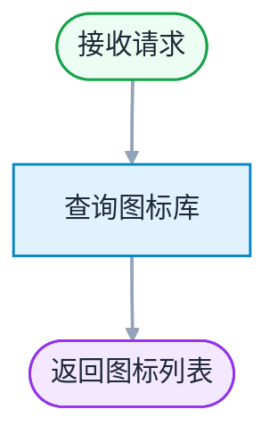

**权限要求**：登录用户

**错误码**：
- `401`（未登录）
- `500`（系统异常）

**入参示例**：

```json
GET /service/open/v2/app/icons
```

**出参示例**：

```json
{
  "code": "200",
  "messageZh": "成功",
  "messageEn": "success",
  "data": [
    {
      "fileId": "icon_chat_001",
      "url": "https://cdn.example.com/icons/chat_001.png"
    },
    {
      "fileId": "icon_chat_002",
      "url": "https://cdn.example.com/icons/chat_002.png"
    }
  ]
}
```

**错误响应示例**：

```json
{
  "code": "401",
  "messageZh": "未登录",
  "messageEn": "Unauthorized",
  "data": null
}
```

---

##### 接口 1.7：更新认证方式

**REST**：`PUT /service/open/v2/app/{appId}/verify-type`

**作用**：修改应用认证方式（**支持多选**）。为数字签名（verifyType=2）时必须传 apiSecret。**`SOAHeader`（1）和 `SOAURL`（3）互斥**，选中其中一个时另一个自动取消选中。**前端 UI 标题下方显示红色警告**：`认证方式切换后,将影响已发送卡片的数据回调,请谨慎选择。`

> **DB 存储说明**：修改时写入新字段 `verify_type_v2`（先删后插），**旧字段 `verify_type` 不动**。

**入参**：：

| 字段 | 类型 | 必填 | 说明 |
|------|------|:----:|------|
| `appId` | `string` | ✅ | 应用 ID |
| `verifyType` | `int[]` | ✅ | 新的认证方式**列表**（多选），如 `[0, 2]` 表示 Cookie+数字签名 |
| `apiSecret` | `string` | - | 为数字签名时必填（16 位，必须同时含字母+数字） |

**出参**：data 为空

**执行逻辑**：

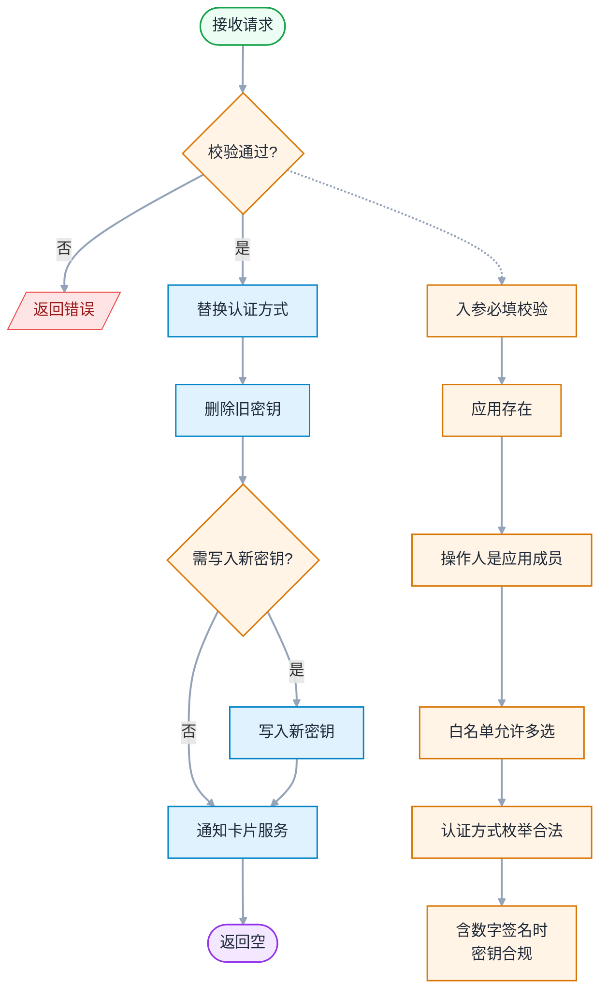

**权限要求**：操作人必须是该 `appId` 对应应用的成员

**错误码**：
- `404100`（应用不存在）
- `403100`（无权访问）
- `400110`（当前仅支持选择一种认证方式 — 白名单关闭时多选传入）
- `401`（未登录）
- `500`（系统异常）

**入参示例**：

```json
PUT /service/open/v2/app/app_20260603_xyz789/verify-type
Content-Type: application/json

{
  "verifyType": [0, 2],
  "apiSecret": "S8d2kF9mN3xQ7wE5"
}
```

> 说明：`verifyType` 是**数组**（**多选**），如 `[0, 2]` 表示 Cookie+数字签名。为数字签名（=2）时 `apiSecret` 必填。`verifyType` 不含 2 时 `apiSecret` 忽略。
>
> **互斥规则**：`SOAHeader`（`verifyType=1`）和 `SOAURL`（`verifyType=3`）**互斥**，选中其中一个时另一个自动取消选中（前端在 UI 层自动处理，后端校验兜底不可同时出现）。
>
> **前端 UI 提示**（与 spec.md FR-005 一致）：
> - 标题下方红色警告提示语：`认证方式切换后,将影响已发送卡片的数据回调,请谨慎选择。`

**出参示例**：

```json
{
  "code": "200",
  "messageZh": "成功",
  "messageEn": "success",
  "data": null
}
```

> 说明：data 为空，前端需要时再调用"获取应用详情"接口（1.3）拉取最新认证方式。

**错误响应示例**：

```json
{
  "code": "400100",
  "messageZh": "数字签名认证必须传入 apiSecret",
  "messageEn": "apiSecret is required for digital signature authentication",
  "data": null
}
```

---

##### 接口 1.8：获取应用凭证

**REST**：`GET /service/open/v2/app/{appId}/identity`

**作用**：获取应用的凭证信息（APPID/APP Key/APP Secret）。仅供查看，不可修改。

**入参**：

**出参**：`AppIdentityVO`

| 字段 | 类型 | 说明 |
|------|------|------|
| `ak` | `string` | APP Key（明文） |
| `sk` | `string` | APP Secret（明文，仅返回一次供开发者保存） |

**执行逻辑**：

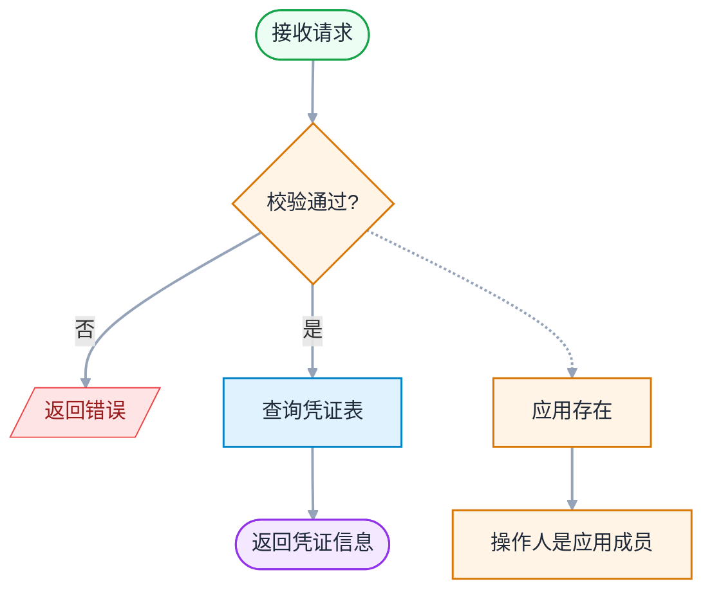

**权限要求**：操作人必须是该 `appId` 对应应用的成员

**错误码**：
- `404100`（应用不存在）
- `403100`（无权访问）
- `401`（未登录）
- `500`（系统异常）

**入参示例**：

```json
GET /service/open/v2/app/app_20260603_xyz789/identity
```

**出参示例**：

```json
{
  "code": "200",
  "messageZh": "成功",
  "messageEn": "success",
  "data": {
    "ak": "AK_20260603_a1b2c3d4e5f6g7h8",
    "sk": "SK_8d2kF9mN3xQ7wE5pR6tY"
  }
}
```

> 说明：`sk` 返回明文仅供查看凭证详情场景；前端应提示用户妥善保存，避免明文存储到前端。

**错误响应示例**：

```json
{
  "code": "403100",
  "messageZh": "无权访问应用: app_20260603_xyz789",
  "messageEn": "No access to the application: app_20260603_xyz789",
  "data": null
}
```

---

##### 接口 1.9：获取认证方式

**REST**：`GET /service/open/v2/app/{appId}/verify-type`

**作用**：获取应用的认证方式（`verifyType`，**多值数组**）及数字签名时使用的 `apiSecret`（明文）。

> **DB 读取说明**：优先读新字段 `verify_type_v2`，没值退回旧字段 `verify_type`，都没值按 `[0]`（Cookie）兜底。统一解析入口 `AppCommonService.resolveVerifyTypeList`。

**入参**：

**出参**：`AppVerifyTypeVO`

| 字段 | 类型 | 说明 |
|------|------|------|
| `verifyType` | `int[]` | 认证方式列表（0=Cookie，1=SOAHeader，2=数字签名，3=SOAURL，**4=APIG**）— **多选** |
| `apiSecret` | `string` | 数字签名 apiSecret 明文值（如 `S8d2kF9mN3xQ7wE5`），`verifyType` 不含 2 时为 `null` |

**执行逻辑**：

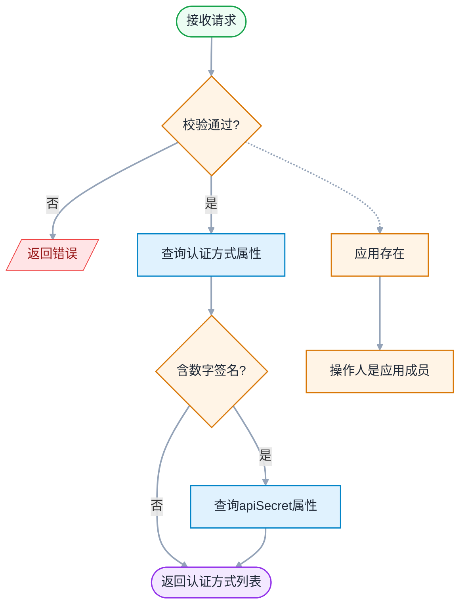

**权限要求**：操作人必须是该 `appId` 对应应用的成员

**错误码**：
- `404100`（应用不存在）
- `403100`（无权访问）
- `401`（未登录）
- `500`（系统异常）

**入参示例**：

```json
GET /service/open/v2/app/app_20260603_xyz789/verify-type
```

**出参示例**：

```json
{
  "code": "200",
  "messageZh": "成功",
  "messageEn": "success",
  "data": {
    "verifyType": [0, 2],
    "apiSecret": "S8d2kF9mN3xQ7wE5"
  }
}
```

> 说明：`verifyType` 是**数组**（**多选**），如 `[0, 2]` 表示 Cookie+数字签名。`apiSecret` 数据库加密存储，本接口解密后**明文返回**，便于前端复制粘贴使用。`verifyType` 不含 2 时 `apiSecret` 字段为 `null`。

**错误响应示例**：

```json
{
  "code": "403100",
  "messageZh": "无权访问应用: app_20260603_xyz789",
  "messageEn": "No access to the application: app_20260603_xyz789",
  "data": null
}
```

---

##### 接口 1.10：绑定 EAMAP

**REST**：`POST /service/open/v2/app/{appId}/bind-eamap`

**作用**：用于**存量个人应用升级**：未绑定 EAMAP 的存量个人应用（`app_sub_type=0`），绑定 EAMAP 后自动升级为业务应用。

**入参**：（`BindEamapRequest`）：

| 字段 | 类型 | 必填 | 说明 |
|------|------|:----:|------|
| `eamapAppCode` | `string` | ✅ | EAMAP 编码 |

**出参**：`BindEamapVO`

| 字段 | 类型 | 说明 |
|------|------|------|
| `appId` | `string` | 应用 ID |

**执行逻辑**：

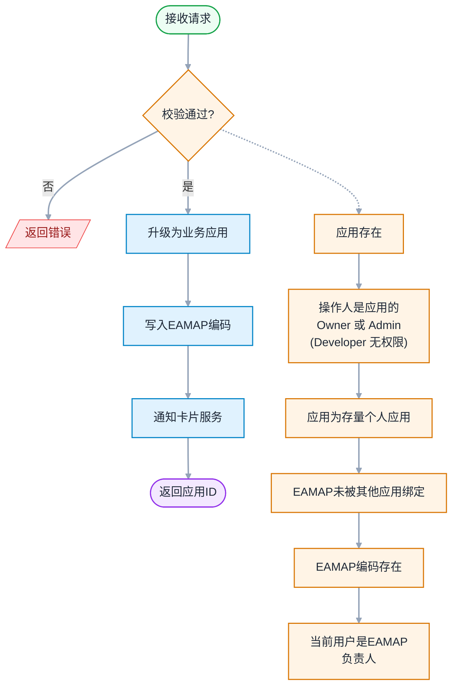

**权限要求**：操作人必须是该 `appId` 对应应用的 **Owner 或 Admin**（Developer 无操作权限）+ 当前用户必须是 `eamapAppCode` 对应 EAMAP 的 owner

**错误码**：
- `404100`（应用不存在）
- `403100`（无权访问）
- `409103`（应用类型不支持此操作）
- `400103`（EAMAP 编码不存在）
- `403104`（当前用户不是 EAMAP 的 owner）
- `409102`（EAMAP 已被其他应用绑定）
- `401`（未登录）
- `500`（系统异常）

**业务规则**（见 spec.md FR-018）：

| 当前应用状态 | 操作 | 结果 |
|------|------|------|
| 存量个人应用（`app_sub_type=0`） | 绑定 EAMAP | **升级**为业务应用（`app_type=1`、`app_sub_type=4`），触发事件通知 |
| 业务应用（`app_type=1`） | 调用本接口 | 拒绝（`409103`） |

**入参示例**：

```json
POST /service/open/v2/app/app_20260603_xyz789/bind-eamap
Content-Type: application/json

{
  "eamapAppCode": "eamap_workflow_002"
}
```

**出参示例**：

```json
{
  "code": "200",
  "messageZh": "成功",
  "messageEn": "success",
  "data": {
    "appId": "app_20260603_xyz789"
  }
}
```

**错误响应示例**：

```json
{
  "code": "409102",
  "messageZh": "EAMAP 已被其他应用绑定: eamap_workflow_002",
  "messageEn": "EAMAP has been bound to another application: eamap_workflow_002",
  "data": null
}
```

---


##### 接口 1.11：获取当前用户角色

**REST**：`GET /service/open/v2/app/{appId}/current-role`

**作用**：返回当前登录用户在该应用中的**最高权限角色**。同一成员可同时拥有多个角色（如同时是 Owner + 管理员），接口返回**最高权限角色**（Owner(1) > 管理员(2) > 开发者(0)）。用于前端 Tab 显隐、按钮级权限控制。

**入参**：

**出参**：`CurrentRoleVO`

| 字段 | 类型 | 说明 |
|------|------|------|
| `role` | `int` | 当前用户在该应用的**最高权限角色**（0=开发者，1=Owner，2=管理员）；非成员时为 `null` |

**执行逻辑**：

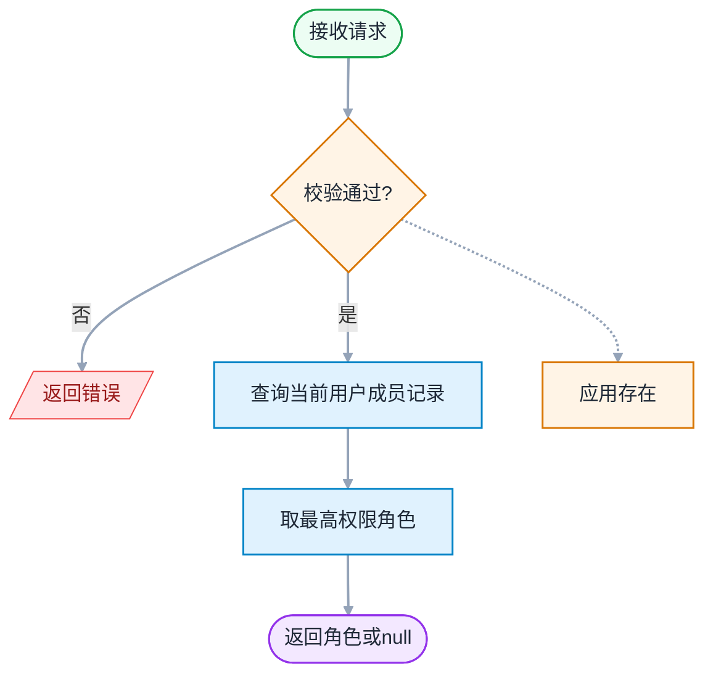

**权限要求**：登录用户（即使是应用非成员也可调用，用于前端判断）

**错误码**：
- `404100`（应用不存在）
- `401`（未登录）
- `500`（系统异常）

**入参示例**：

```json
GET /service/open/v2/app/app_20260603_xyz789/current-role
```

**出参示例**（Owner）：

```json
{
  "code": "200",
  "messageZh": "成功",
  "messageEn": "success",
  "data": {
    "role": 1
  }
}
```

**出参示例**（非成员）：

```json
{
  "code": "200",
  "messageZh": "成功",
  "messageEn": "success",
  "data": {
    "role": null
  }
}
```

> 说明：非成员也返回 200 + `role=null`，由前端根据 `role` 是否为 `null` 决定显示/隐藏应用入口。同一成员有多条角色记录时，后端按 Owner(1) > 管理员(2) > 开发者(0) 优先级返回最高权限角色，前端无需额外判断。

**错误响应示例**：

```json
{
  "code": "404100",
  "messageZh": "应用不存在: app_xxx",
  "messageEn": "Application does not exist: app_xxx",
  "data": null
}
```

---

##### 接口 1.12：上传图片

**REST**：`POST /service/open/v2/file/upload?bizType=1`

**Content-Type**：`multipart/form-data`

**作用**：通用文件上传接口，按 `bizType` 区分业务（应用图标 / 功能示意图），限制不同大小与文件类型。
- **`bizType=1` 应用图标**：**必填**（创建/更新应用时必须先调用此接口上传图标）。
- **`bizType=2` 功能示意图**：**选填**（用于应用基本信息编辑页面的"功能示意图"字段，详见 § 4.1.4 接口 1.4 步骤 2）。

**入参**：

| 字段 | 位置 | 类型 | 必填 | 说明 |
|------|------|------|:----:|------|
| `bizType` | query | `int` | ✅ | 业务类型：<br>`1`=**应用图标**（**必填**，128×128px PNG/JPG/JPEG，≤100KB；用于创建/更新应用时的 iconId 字段）<br>`2`=**功能示意图**（**选填**，用于基本信息编辑页面；详见 § 4.1.4 接口 1.4 步骤 2） |
| `file` | body | `binary` | ✅ | 文件二进制 |

**bizType 枚举**：

| 值 | 含义 | 大小上限 | 文件类型 |
|:--:|------|---------|---------|
| `1` | `app_icon` | 100KB | png / jpg / jpeg |
| `2` | `app_diagram` | 500KB | png / jpg / jpeg | 360×200px |

**出参**：`FileUploadVO`

| 字段 | 类型 | 说明 |
|------|------|------|
| `fileId` | `string` | 文件 ID（后续 1.1/1.2 引用） |
| `url` | `string` | 文件访问 URL |

**出参示例**：

```json
{
  "code": "200",
  "messageZh": "上传成功",
  "messageEn": "Success",
  "data": {
    "fileId": "file_20260603_abc123",
    "url": "https://cdn.example.com/files/2026/06/03/abc123.png"
  }
}
```

**执行逻辑**：

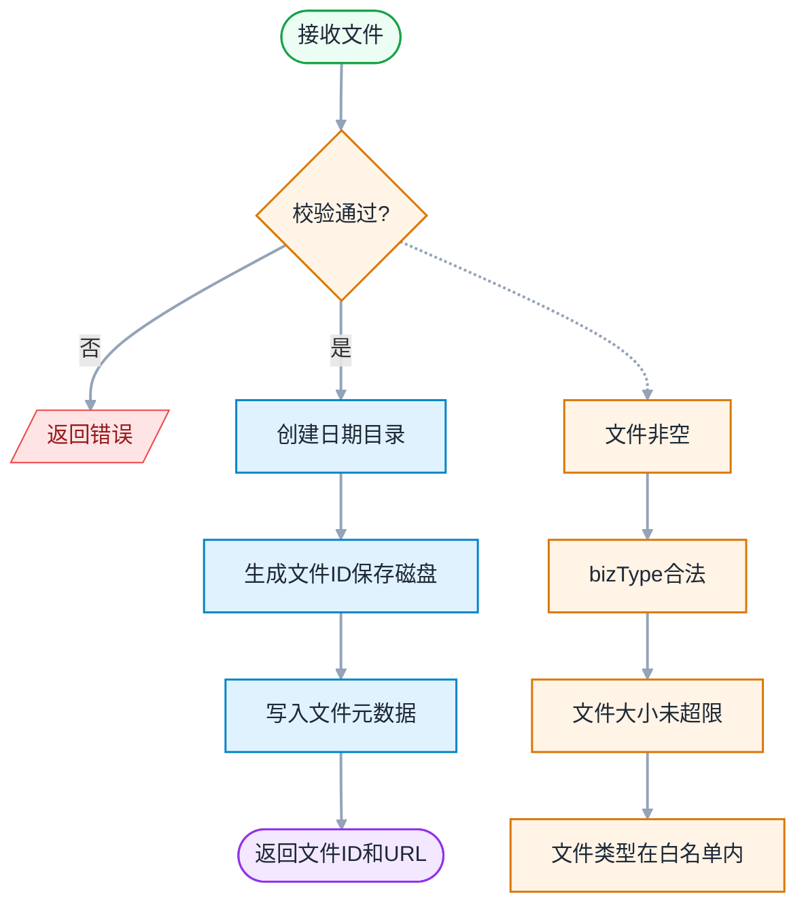

**错误码**：

| 错误码 | 中文消息 | 触发 |
|--------|---------|------|
| `400107` | 文件大小超限（按 bizType 提示上限） | 文件超 bizType 上限 |
| `400108` | 文件类型不支持 | MIME 不在白名单 |
| `400109` | bizType 非法 | bizType 不在 1/2 |
| `502100` | 文件服务调用失败 | 文件服务异常 |
| `401` | 未登录 | 未登录 |

---

#### 6.4.7 数据模型设计

**应用管理相关表（4 张）**：

| # | 表名 | 关键字段 | 说明 |
|---|------|----------|------|
| 1 | openplatform_app_t | id, app_id(UNIQUE), app_name_cn(UNIQUE), app_name_en(UNIQUE), app_type, app_sub_type, status | 应用主表 |
| 2 | openplatform_app_p_t | parent_id(FK→app_t.id), property_name, property_value | 应用属性表（K-V） |
| 3 | openplatform_app_identity_t | app_id(FK), public_key, private_key(密文), ak | 凭证表 |
| 4 | openplatform_app_member_t | app_id(FK), account_id, member_type | 成员表（创建时写入 Owner 记录） |

**属性表 key 值**：

| property_name | 说明 |
|---------------|------|
| `verify_type` | 认证方式（旧字段）：创建应用时写入默认值 `"0"`，修改认证方式时**不再写入此字段** |
| `verify_type_v2` | 认证方式（新字段）：多选逗号分隔，如 `"0,2"`。修改认证方式时写入此字段。**查询时优先取此字段，没值退回 `verify_type`** |
| `eamap_app_code` | EAMAP 编码 |
| `api_secret` | 数字签名的 apiSecret（仅 verifyType 含 2 时，密文存储） |
| `diagram_id_list` | 应用示意图（JSON 数组） |

---

## 7 系统级非功能设计

> 见 design-00-overview.md §7

---

## 8 checkList（必填）

### 8.1 设计自检清单要求（必填）

| check 点 | 是否达标 | 备注 |
|----------|:--------:|------|
| 覆盖应用管理全部 FR | 是 | FR-001~FR-005, FR-016 |
| 包含用例分析 | 是 | UC-02, UC-03, UC-07 |
| 包含接口详细设计 | 是 | 12 个端点 |
| 包含数据模型设计 | 是 | 4 张表 |
| 包含功能可靠性分析 | 是 | 2 项风险 |
| 包含功能安全分析 | 是 | 4 个维度 |
| 设计自检清单全部勾选完毕 | 是 | 本表 8 项全部达标 |

---

**文档结束**
