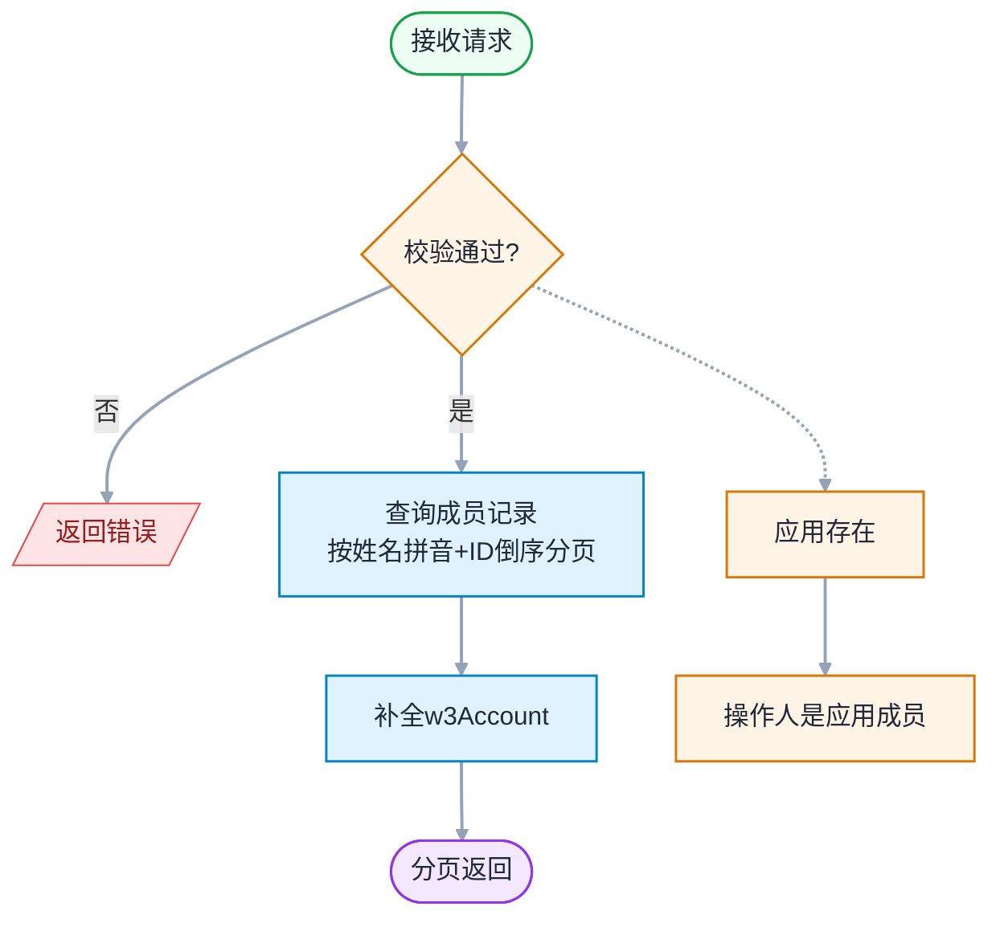
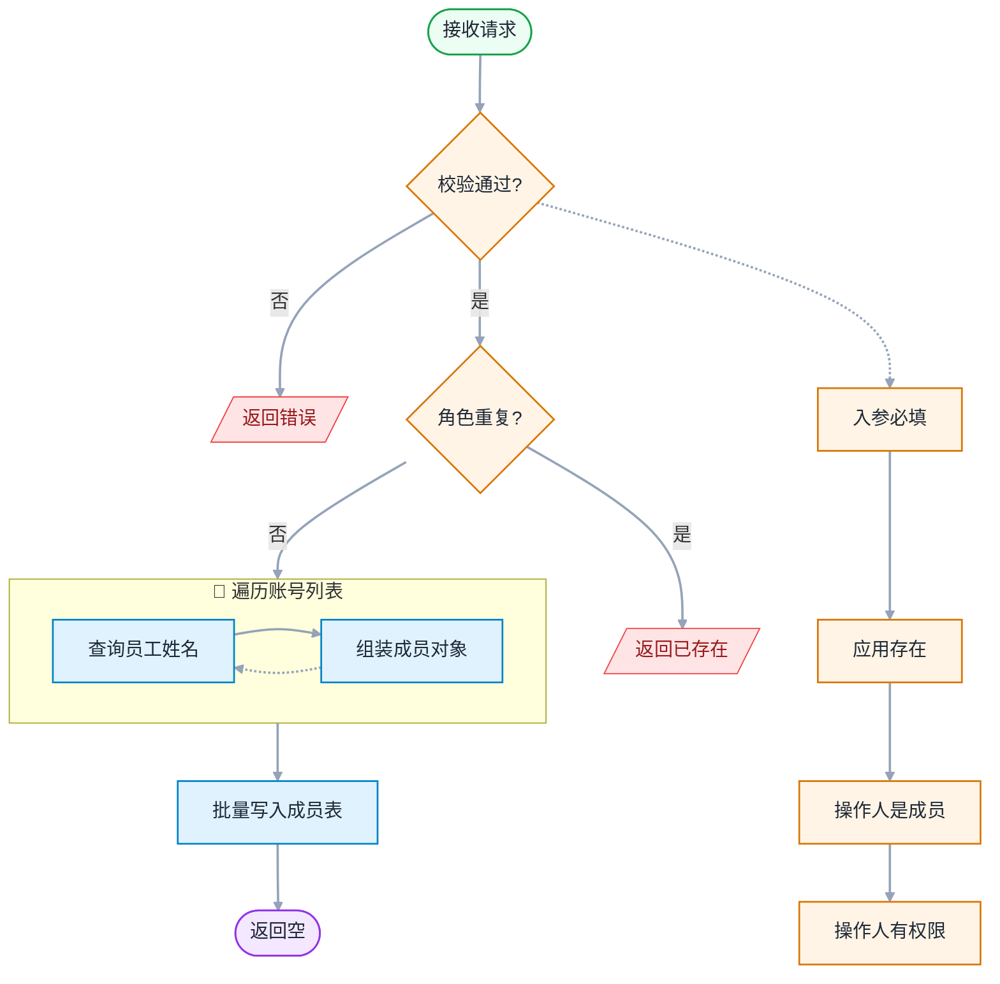
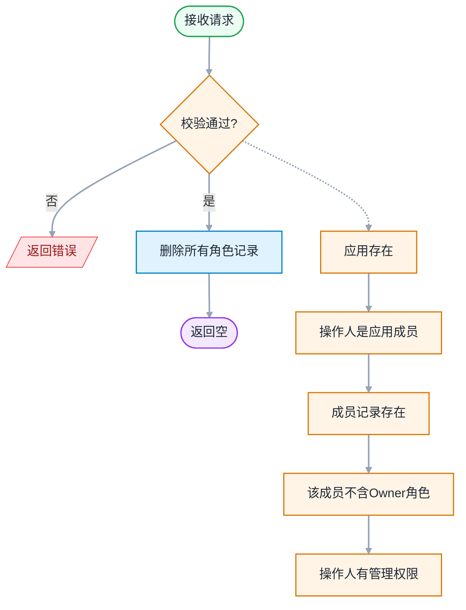
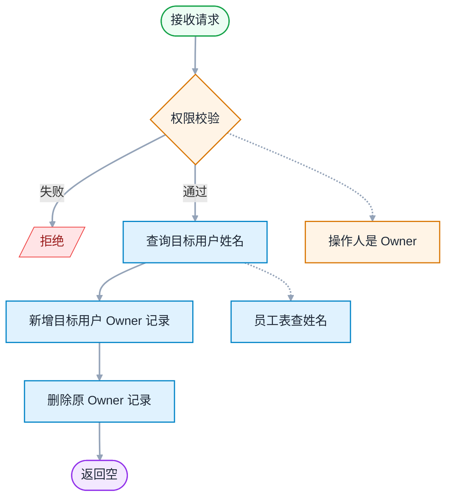
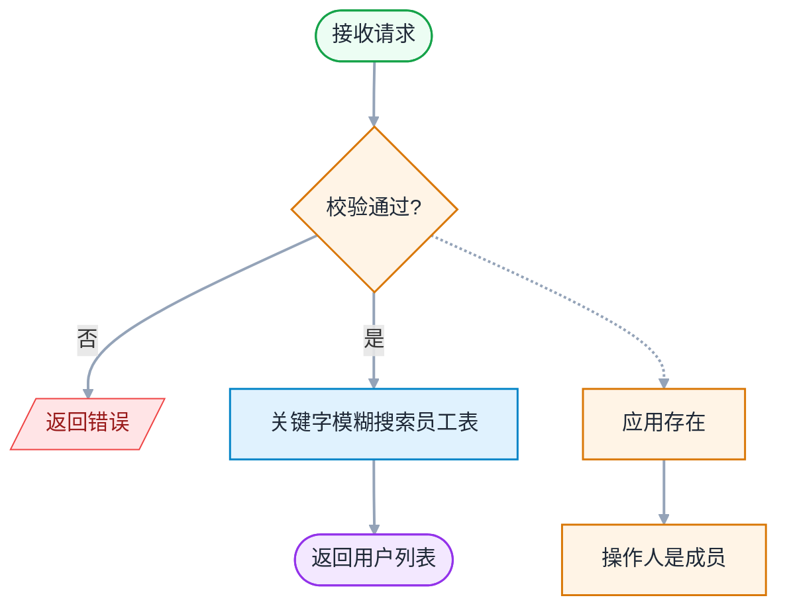

# 成员管理 - 详细设计

> 模板参照：需求设计说明书
> 父文档：[design-00-overview.md](./design-00-overview.md)
> 业务素材：plan.md §4.2.2 MemberService / frontend-design.md §9
> 编写日期：2026-06-12
> 文档版本：v1.0

---

## 修订记录

| 版本 | 日期 | 修订人 | 修订内容 |
|:----:|------|--------|----------|
| v1.0 | 2026-06-12 | SDDU | 依据需求设计说明书模板首次编写 |

---

## 目录

- 1 需求价值和概述
- 2 上下文分析（可选）
- 3 初始需求分析（可选）
- 4 需求影响分析
- 5 系统用例分析（可选）
    - 5.1 用例清单
    - 5.2 用例分析
- 6 功能设计
    - 6.1 业界方案实现（可选）
    - 6.2 功能实现整体设计方案（可选）
    - 6.3 架构设计方案（可选）
    - 6.4 功能实现
        - 6.4.1 实现思路
        - 6.4.2 实现设计
        - 6.4.3 功能可靠性分析（可选）
        - 6.4.4 功能安全分析（可选）
        - 6.4.5 架构元素影响列表（可选）
        - 6.4.6 接口设计
        - 6.4.7 数据模型设计
- 7 系统级非功能设计
- 8 checkList（必填）

---

## 1 需求价值和概述

### 1.1 价值主张

AI 重构开放平台 Open 面，提升稳定性、可维护性、开发效率。

### 1.2 需求概述

成员管理是业务应用的核心协作模块，Owner/管理员通过此模块管理应用的开发团队成员，包括添加成员、删除成员、转移 Owner 角色。

**涉及需求**：FR-006 ~ FR-009

| 需求标号 | 需求名称 | 需求描述 |
|---------|---------|---------|
| FR-006 | 成员列表 | 展示成员及角色，分页 + 拼音排序 + 按权限矩阵动态操作按钮 |
| FR-007 | 添加成员 | 按角色添加成员，角色必选有默认值；同一人可有多个角色 |
| FR-008 | 删除成员 | 按成员记录主键删除，Owner 角色不可删；二次确认 |
| FR-009 | 转移 Owner | 仅 Owner 可操作，事务原子完成（删旧增新） |

---

## 2 上下文分析（可选）

不涉及

---

## 3 初始需求分析（可选）

不涉及

---

## 4 需求影响分析

### 4.1 特性影响分析

| 现有特性 | 影响方式 | 说明 |
|----------|----------|------|
| 成员管理 | 新增 | 新页面 + V2 接口，旧页面保留 |

---

## 5 系统用例分析（可选）

### 5.1 用例清单

| 用例编号 | 用例名称 | 参与角色 | 用例简要说明 | 关联测试用例 | 需细化 |
|:--------:|----------|:--------:|-------------|:------------:|:------:|
| UC-M01 | 查看成员列表 | O / A / D | 进入成员管理页，调用接口 2.1 加载成员列表，按角色分块展示，标记"我"和 Owner | TC-5-01 ~ 06 | 否 |
| UC-M02 | 角色按钮显隐 | O / A / D | 根据当前用户角色控制"添加成员""删除""转移"按钮的可见性（前端控制 + 后端兜底） | TC-5-07 ~ 09 | 否 |
| UC-M03 | 搜索可添加用户 | O / A | 按关键字模糊搜索系统用户（接口 2.5），不过滤已有成员，供添加成员弹窗使用 | TC-5-13, 21 | 否 |
| UC-M04 | 添加成员 | O / A | 批量选择用户 + 选择角色 → 提交添加（接口 2.2）；权限矩阵校验、重复校验、允许多角色 | TC-5-10 ~ 20 | 是 |
| UC-M05 | 删除成员 | O / A | 删除成员的指定角色记录（接口 2.3）；Owner 受保护不可删除；按记录主键精确删除 | TC-5-22 ~ 32a | 是 |
| UC-M06 | 转移 Owner | O | 将 Owner 角色转移给其他账号（接口 2.4）；事务内增新删旧原子完成；原 Owner 其他角色保留 | TC-5-33 ~ 38 | 是 |

### 5.2 用例分析

#### 5.2.1 UC-M04 添加成员

**简要说明**：Owner / 管理员通过弹窗搜索系统用户，批量添加到应用并指定角色

**Actor**：Owner、管理员（开发者无权限）

**前置条件**：用户已登录且为业务应用（BA）的成员

**最小保证**：操作失败时不改变现有成员关系；权限不足返回 `403200`；目标角色越权返回 `403201`

**成功保证**：成员记录持久化；权限矩阵前后端双重校验；审计日志记录（`ADD_APP_MEMBER`）

**主成功场景**：
1. 用户在成员列表页点击"添加成员"，弹出 Modal
2. 搜索并勾选多个用户（接口 2.5）
3. 选择角色（Owner 视角默认管理员，管理员视角默认开发者）
4. 点击"添加"，后端校验操作人角色权限（`validateMemberOperationPermission`）
5. 逐个校验账号有效 + 同账号同角色不重复
6. 事务内批量插入成员记录，审计日志记录
7. 返回成功，前端关闭 Modal 并刷新列表

**扩展场景**：
- 1a. 开发者点击 → 按钮不渲染（前端）/ 返回 `403200`（后端兜底）
- 3a. 管理员尝试添加管理员 → 返回 `403201`
- 3b. 尝试添加 Owner（`role=1`）→ 返回 `409204`，引导走转移流程
- 5a. 成员已有相同角色 → 返回 `409200`
- 5b. 同账号已有不同角色 → **允许**，新增记录（多角色支持）
- 5c. 账号为空或无效 → 返回 `400200`

**DFX属性**：权限矩阵前后端双重校验；允许多角色（同账号对应多条不同 role 记录）

---

#### 5.2.2 UC-M05 删除成员

**简要说明**：Owner / 管理员删除指定成员的角色记录，Owner 角色受保护

**Actor**：Owner、管理员（开发者无权限）

**前置条件**：用户已登录且为目标应用的成员

**最小保证**：操作失败时不改变现有成员关系；权限不足返回 `403202`；目标角色越权返回 `403203`

**成功保证**：成员记录删除持久化；权限矩阵前后端双重校验；审计日志记录（`DELETE_APP_MEMBER`）

**主成功场景**：
1. 用户点击目标成员行的"删除"按钮
2. 弹出确认 Modal，显示"确认将 XXX 从应用中移除？该操作不可撤销"
3. 点击"确认删除"，后端校验操作人角色权限（`validateMemberOperationPermission`）
4. 逐条校验目标成员每条角色记录的权限
5. 事务内删除记录，审计日志记录
6. 返回成功，前端关闭 Modal 并刷新列表

**扩展场景**：
- 1a. Owner 行不显示"删除"按钮（只显示"转移"）
- 1b. 管理员视角：Admin 行不显示"删除"按钮
- 3a. 开发者调用 → 返回 `403202`
- 3b. 管理员删除管理员 → 返回 `403203`
- 4a. 目标是 Owner → 返回 `409201`（不能删除 Owner）
- 4b. 删除多角色成员的单条记录 → 仅删除该角色记录，其他角色保留
- 5a. 成员已不存在 → 返回 `404200`

**DFX属性**：按成员记录主键精确删除单条记录；多角色成员删除不影响其他角色

---

#### 5.2.3 UC-M06 转移 Owner

**简要说明**：Owner 将 Owner 角色转移给其他账号，原 Owner 的其他角色记录保留

**Actor**：Owner（仅 Owner 可操作）

**前置条件**：用户已登录且为目标应用的 Owner

**最小保证**：操作失败时原 Owner 保持不变；事务回滚则状态恢复

**成功保证**：新 Owner 记录插入 + 原 Owner 记录删除原子完成；审计日志记录（`TRANSFER_APP_OWNER`）

**主成功场景**：
1. Owner 点击 Owner 行的"转移"按钮，弹出 Modal
2. 搜索并单选目标用户，勾选"我已了解转移后果"二次确认
3. 点击"转移"，后端校验操作人是 Owner
4. 从人员表查目标用户姓名（单一来源，不区分是否已是成员）
5. 事务内：为目标用户新增 Owner 记录 + 删除原操作人 Owner 记录
6. 通知卡片服务 Owner 已变更
7. 返回成功，前端关闭 Modal 并刷新列表

**扩展场景**：
- 1a. 非 Owner 调用 → 返回 `403204`
- 2a. 未选用户 → "转移"按钮禁用
- 2b. 未勾二次确认 → "转移"按钮禁用
- 5a. 目标已是成员（有其他角色）→ 原角色记录保留不动，仅新增 Owner 记录
- 5b. 原 Owner 同时有其他角色 → 仅删除 Owner 记录，其他角色保留

**DFX属性**：单事务原子操作（增新删旧）；原 Owner 降级为普通成员（保留其他角色）

---

## 6 功能设计

### 6.1 业界方案实现（可选）

不涉及

### 6.2 功能实现整体设计方案（可选）

不涉及（见 design-00-overview.md §6.2）

### 6.3 架构设计方案（可选）

不涉及（见 design-00-overview.md §6.3）

### 6.4 功能实现

#### 6.4.1 实现思路

**后端（MemberService）**：

| 维度 | 设计 |
|------|------|
| 分层 | MemberController → MemberService → MemberMapper |
| 权限校验 | `appContextResolver.resolveAndValidate(appId)` + 角色二次校验 |
| 事务 | 转移 Owner：删旧 Owner 记录 + 增新 Owner 记录原子完成 |
| 审计 | ADD_APP_MEMBER / DELETE_APP_MEMBER / TRANSFER_APP_OWNER |

**权限矩阵**：

| 操作 | Owner | 管理员 | 开发者 |
|------|:-----:|:------:|:------:|
| 添加管理员 | ✅ | ❌ | ❌ |
| 添加开发者 | ✅ | ✅ | ❌ |
| 删除管理员 | ✅ | ❌ | ❌ |
| 删除开发者 | ✅ | ✅ | ❌ |
| 转移 Owner | ✅ | ❌ | ❌ |
| 删除 Owner | ❌ | ❌ | ❌ |

**前端**：

| 页面 | 组件 | 说明 |
|------|------|------|
| Members | MembersPage | 成员列表 + 添加/删除/转移操作 |
| AddMemberModal | AddMemberModal | 添加成员弹窗（搜索+角色选择） |
| DeleteConfirmModal | DeleteConfirmModal | 删除确认弹窗 |
| TransferOwnerModal | TransferOwnerModal | 转移 Owner 弹窗 |

#### 6.4.3 功能可靠性分析（可选）

| 可靠性风险 | 影响 | 措施 |
|------------|------|------|
| 转移 Owner 事务失败 | 应用无 Owner | 单事务：删旧 + 增新原子操作；事务回滚则原 Owner 保留 |

#### 6.4.4 功能安全分析（可选）

| 安全维度 | 措施 |
|----------|------|
| 越权校验 | `appContextResolver.resolveAndValidate` 统一入口 + 角色二次校验（40320x） |
| 操作审计 | 3 个写接口全覆盖（ADD_APP_MEMBER / DELETE_APP_MEMBER / TRANSFER_APP_OWNER） |

#### 6.4.5 架构元素影响列表（可选）

| 层 | 元素 | 改动 | 说明 |
|----|------|------|------|
| 后端 | modules/member/controller/ | 新增 | MemberController（5 个端点） |
| 后端 | modules/member/service/ | 新增 | MemberService |
| 后端 | modules/member/mapper/ | 新增 | MemberMapper |
| 后端 | modules/member/entity/ | 新增 | AppMember |
| 后端 | modules/member/dto/ | 新增 | MemberResponse / AddMemberRequest 等 |
| 前端 | pages/Members/ | 新增 | 成员管理页 |

#### 6.4.6 接口设计

**表 6-1 成员管理接口（5 个端点）**

| # | URL | method | 功能 | 鉴权 | 审计 |
|---|-----|--------|------|------|:----:|
| 2.1 | /service/open/v2/app/{appId}/members?curPage=1&pageSize=10 | GET | 成员列表 | 成员 | - |
| 2.2 | /service/open/v2/app/{appId}/members | POST | 添加成员 | Owner/管理员 | ADD_APP_MEMBER |
| 2.3 | /service/open/v2/app/{appId}/members/{id} | DELETE | 删除成员 | Owner/管理员 | DELETE_APP_MEMBER |
| 2.4 | /service/open/v2/app/{appId}/transfer-owner | POST | 转移 Owner | Owner | TRANSFER_APP_OWNER |
| 2.5 | /service/open/v2/app/{appId}/search-users?keyword=xxx | GET | 搜索企业成员 | 成员 | - |

**核心接口详细设计**：

##### 接口 2.1：获取应用成员列表

**REST**：`GET /service/open/v2/app/{appId}/members?curPage=1&pageSize=10`

**作用**：分页查询应用成员列表。

**入参**：：

| 字段 | 类型 | 必填 | 说明 |
|------|------|:----:|------|
| `appId` | `string` | ✅ | 应用 ID |
| `curPage` | `int` | ✅ | 当前页码（支持**跳转到某页**，如 `curPage=5` 直接到第 5 页） |
| `pageSize` | `int` | ✅ | 每页条数（10 / 20 / 50） |

**出参**：`ApiResponse<AppMemberVO[]>`

| 字段 | 类型 | 说明 |
|------|------|------|
| `code` | `string` | 响应码 |
| `messageZh` | `string` | 中文消息 |
| `messageEn` | `string` | 英文消息 |
| `data` | `AppMemberVO[]` | 成员列表 |
| `page` | `PageResponse` | 分页信息 |
| `page.curPage` | `int` | 当前页码 |
| `page.pageSize` | `int` | 每页条数 |
| `page.total` | `int` | 总记录数 |
| `page.totalPages` | `int` | 总页数 |
| `data[].id` | `string` | 成员记录 ID |
| `data[].accountId` | `string` | 成员账号 ID（welinkId） |
| `data[].w3Account` | `string` | W3 工号 |
| `data[].memberNameCn` | `string` | 中文名 |
| `data[].memberNameEn` | `string` | 英文名 |
| `data[].memberType` | `int` | 角色（0=开发者，1=Owner，2=管理员） |
| `data[].createdAt` | `string` | 创建时间（成员记录创建时间） |

**执行逻辑**：



**权限要求**：操作人必须是该 `appId` 对应应用的成员

**错误码**：
- `404100`（应用不存在）
- `403100`（无权访问）

**入参示例**：

```json
GET /service/open/v2/app/app_20260603_xyz789/members?curPage=1&pageSize=10
```

**出参示例**：

```json
{
  "code": "200",
  "messageZh": "成功",
  "messageEn": "success",
  "data": [
    {
      "id": "1",
      "accountId": "user_10001",
      "w3Account": "E10001",
      "memberNameCn": "张三",
      "memberNameEn": "Zhang San",
      "memberType": 0,
      "createdAt": "2026-06-03 10:30:00"
    },
    {
      "id": "2",
      "accountId": "user_20001",
      "w3Account": "E20001",
      "memberNameCn": "李四",
      "memberNameEn": "Li Si",
      "memberType": 2,
      "createdAt": "2026-06-03 10:35:00"
    },
    {
      "id": "3",
      "accountId": "user_20002",
      "w3Account": "E20002",
      "memberNameCn": "王五",
      "memberNameEn": "Wang Wu",
      "memberType": 2,
      "createdAt": "2026-06-03 10:35:00"
    }
  ],
  "page": {
    "curPage": 1,
    "pageSize": 10,
    "total": 3,
    "totalPages": 1
  }
}
```

> 说明：`memberType` 取值：0=开发者，1=Owner，2=管理员（按数据库 `member_type` 枚举）。

**错误响应示例**：

```json
{
  "code": "403100",
  "messageZh": "无权访问应用: app_20260603_xyz789",
  "messageEn": "No access to the application: app_20260603_xyz789",
  "data": null
}
```

---

##### 接口 2.2：添加成员

**REST**：`POST /service/open/v2/app/{appId}/members`

**作用**：批量添加成员到应用（不能添加 Owner，Owner 需通过"转移"接口产生）。**`role` 为必选**，弹窗打开时即有默认值（**Owner 视角默认「管理员」、Admin 视角默认「开发者」**），不存在"未选"状态。

**入参**：（`AddMemberRequest`）：

| 字段 | 类型 | 必填 | 说明 |
|------|------|:----:|------|
| `appId` | `string` | ✅ | 应用 ID |
| `accountIds` | `string[]` | ✅ | 成员账号 ID 列表 |
| `role` | `int` | ✅ | 目标角色（**必选**）：0=开发者，1=Owner（不允许），2=管理员；实际可选范围按权限矩阵：Owner 视角可选 admin / developer，Admin 视角仅 developer |

**出参**：data 为空

**执行逻辑**：



**权限要求**：操作人必须是该 `appId` 对应应用的成员 + 角色权限满足上表

**错误码**：
- `403100`（无权访问）
- `403200`（当前用户角色无添加成员权限）
- `403201`（当前用户角色无添加该目标角色成员的权限）
- `409200`（成员已存在）
- `400200`（成员账号无效）

**入参示例**：

```json
POST /service/open/v2/app/app_20260603_xyz789/members
Content-Type: application/json

{
  "accountIds": ["user_20001", "user_20002", "user_20003"],
  "role": 2
}
```

> 说明：`role` 取值与数据库 `member_type` 枚举一致：0=开发者、1=Owner（不允许通过此接口添加）、2=管理员。`accountIds` 数组元素为被添加成员的账号 ID 列表。**添加成员角色权限**：Owner（1）可添加管理员（2）和开发者（0），管理员（2）只能添加开发者（0），开发者（0）无添加权限。

**出参示例**：

```json
{
  "code": "200",
  "messageZh": "成功",
  "messageEn": "success",
  "data": null
}
```

> 说明：data 为空，完整成员列表由前端刷新"成员列表"（2.1）获取。

**错误响应示例**：

```json
{
  "code": "409200",
  "messageZh": "成员已存在: user_20001",
  "messageEn": "Member already exists: user_20001",
  "data": null
}
```

---

##### 接口 2.3：删除成员

**REST**：`DELETE /service/open/v2/app/{appId}/members/{id}`

**作用**：从应用成员列表中删除指定成员的**指定角色记录**。Owner 受保护，不能删除。**同一成员可在多个角色下存在**，删除操作按成员记录主键 `id` 精确删除单条记录，不影响该成员的其他角色记录。

**入参**：

| 字段 | 类型 | 必填 | 说明 |
|------|------|:----:|------|
| `appId` | `string` | ✅ | 应用 ID |
| `id` | `string` | ✅ | 成员记录主键 ID（`openplatform_app_member_t.id`），非账号 ID |

**出参**：data 为空

**执行逻辑**：



**权限要求**：操作人必须是该 `appId` 对应应用的成员 + 角色权限满足上表

**错误码**：
- `403100`（无权访问）
- `404200`（成员记录不存在）
- `409201`（不能删除 Owner）
- `403202`（当前用户角色无删除成员权限）
- `403203`（当前用户角色无删除该角色成员的权限）

**入参示例**：

```json
DELETE /service/open/v2/app/app_20260603_xyz789/members/3
```

**出参示例**：

```json
{
  "code": "200",
  "messageZh": "成功",
  "messageEn": "success",
  "data": null
}
```

> 说明：data 为空，前端刷新"成员列表"（2.1）获取最新数据。**删除成员角色权限**：Owner（1）可删除管理员（2）和开发者（0），管理员（2）只能删除开发者（0），开发者（0）无删除权限。**Owner 自身不可删除**（如需更换 Owner 走"转移 Owner"接口 2.4）。

**错误响应示例**：

```json
{
  "code": "409201",
  "messageZh": "不能删除 Owner 角色",
  "messageEn": "Cannot delete the Owner role",
  "data": null
}
```

---

##### 接口 2.4：转移 Owner

**REST**：`POST /service/open/v2/app/{appId}/transfer-owner`

**作用**：将 Owner 角色转移给其他账号（可不在当前成员列表中）。原 Owner **仅 Owner 角色下的记录被删除，其他角色下的记录（如有）保留**（对齐 spec FR-009 操作后效果）。

**入参**：（`TransferOwnerRequest`）：

| 字段 | 类型 | 必填 | 说明 |
|------|------|:----:|------|
| `appId` | `string` | ✅ | 应用 ID |
| `toAccountId` | `string` | ✅ | 新 Owner 账号（**无需是当前成员**） |

**出参**：data 为空

**执行逻辑**：



**权限要求**：操作人必须是该 `appId` 对应应用的 **Owner** 成员

**错误码**：
- `403100`（无权访问）
- `403204`（仅 Owner 可操作）

**入参示例**：

```json
POST /service/open/v2/app/app_20260603_xyz789/transfer-owner
Content-Type: application/json

{
  "toAccountId": "user_20001"
}
```

**出参示例**：

```json
{
  "code": "200",
  "messageZh": "成功",
  "messageEn": "success",
  "data": null
}
```

> 说明：data 为空，前端刷新"成员列表"（2.1）获取最新成员信息。

**错误响应示例**：

```json
{
  "code": "403204",
  "messageZh": "仅 Owner 可操作",
  "messageEn": "Only the Owner can perform this action",
  "data": null
}
```

---

##### 接口 2.5：搜索可添加的用户

**REST**：`GET /service/open/v2/app/{appId}/search-users?keyword=xxx`

**作用**：根据关键字搜索系统中可添加到该应用的用户，用于"添加成员"对话框的人员选择。**不做成员关系过滤**，由前端在"添加成员"接口（2.2）提交时校验。

**入参**：（查询参数）：

| 字段 | 类型 | 必填 | 说明 |
|------|------|:----:|------|
| `appId` | `string` | ✅ | 应用 ID（路径参数） |
| `keyword` | `string` | ✅ | 搜索关键字（账号/中英文名模糊匹配） |

**出参**：`ApiResponse<UserDataVO[]>`（**复用全局响应格式**）

| 字段 | 类型 | 说明 |
|------|------|------|
| `code` | `string` | 响应码 |
| `messageZh` | `string` | 中文消息 |
| `messageEn` | `string` | 英文消息 |
| `data` | `UserDataVO[]` | 用户数据列表 |
| `page` | `PageResponse` | 分页信息（`curPage` / `pageSize` / `total` / `totalPages`） |

**`UserDataVO` 用户数据**：

| 字段 | 类型 | 说明 |
|------|------|------|
| `welinkId` | `string` | WeLink 账号 ID |
| `memberNameCn` | `string` | 中文名 |
| `deptName` | `string` | 部门名称 |
| `w3Account` | `string` | W3 账号 |

**执行逻辑**：



**权限要求**：操作人必须是该 `appId` 对应应用的成员

**错误码**：
- `404100`（应用不存在）
- `403100`（无权访问）
- `500`（外部用户服务异常）

**入参示例**：

```json
GET /service/open/v2/app/app_20260603_xyz789/search-users?keyword=张
```

**出参示例**：

```json
{
  "code": "200",
  "messageZh": "成功",
  "messageEn": "Success",
  "data": [
    {
      "welinkId": "user_30001",
      "memberNameCn": "张三丰",
      "deptName": "技术部",
      "w3Account": "w3_zhangsanfeng"
    },
    {
      "welinkId": "user_30002",
      "memberNameCn": "张无忌",
      "deptName": "产品部",
      "w3Account": "w3_zhangwuji"
    }
  ],
  "page": {
    "curPage": 1,
    "pageSize": 20,
    "total": 2,
    "totalPages": 1
  }
}
```

**说明**：
- 外部用户搜索服务的分页参数由后端内部封装（`curPage` / `pageSize`），本接口不向外部暴露分页参数
- 用户字段（`welinkId` / `memberNameCn` / `deptName` / `w3Account`）由三方接口契约决定，不与本系统用户字段（`accountId` / `userNameCn` 等）混淆
- 出参**直接使用**全局 `ApiResponse + PageResponse` 格式，前端无需做字段映射
- **前端成员选择器映射**（spec §2.3 成员选择器规范）：下拉项展示 姓名（`memberNameCn`）/ 工号（`w3Account`）/ 部门（`deptName`）三字段，选中后输入框组合展示

**错误响应示例**：

```json
{
  "code": "403100",
  "messageZh": "无权访问应用: app_20260603_xyz789",
  "messageEn": "No access to the application: app_20260603_xyz789",
  "data": null,
  "page": null
}
```

---

#### 6.4.7 数据模型设计

**成员管理相关表（1 张）**：

| # | 表名 | 关键字段 | 说明 |
|---|------|----------|------|
| 1 | openplatform_app_member_t | id(PK), app_id(FK), account_id, member_type(0/1/2), status | 成员表 |

**完整 DDL**：

```sql
CREATE TABLE `openplatform_app_member_t` (
  `id` bigint(20) NOT NULL COMMENT '主键',
  `app_id` bigint(20) NOT NULL COMMENT '应用主键 ID',
  `member_name_cn` varchar(255) NOT NULL,
  `member_name_en` varchar(255) NOT NULL,
  `account_id` varchar(255) NOT NULL DEFAULT '' COMMENT '成员账号 id',
  `member_type` TINYINT(1) DEFAULT '0' COMMENT '成员类型: 0=开发者 1=owner 2=管理员',
  `status` tinyint DEFAULT '1',
  `create_by` varchar(100) DEFAULT NULL,
  `create_time` datetime(3) DEFAULT CURRENT_TIMESTAMP(3),
  `last_update_by` varchar(100) DEFAULT NULL,
  `last_update_time` datetime(3) DEFAULT CURRENT_TIMESTAMP(3) ON UPDATE CURRENT_TIMESTAMP(3),
  PRIMARY KEY (`id`),
  KEY `idx_app_id` (`app_id`)
) ENGINE=InnoDB COMMENT='应用成员表';
```

**索引设计**：

| 索引 | 字段 | 用途 |
|------|------|------|
| PRIMARY KEY | `id` | 主键（成员记录主键，删除/转移按此定位） |
| 普通索引 | `app_id` | 成员查询 |
| 复合索引 | `account_id, app_id` | 应用列表：覆盖 account_id 查询 + JOIN app_id |

> **多角色设计**：同一成员可在同一应用下拥有多个角色，对应多条记录（每条一个 `member_type`）。`account_id + member_type` 组合才唯一。**不加 `(app_id, account_id)` 唯一索引**——那会与多角色业务规则冲突。

---

## 7 系统级非功能设计

> 见 design-00-overview.md §7

---

## 8 checkList（必填）

### 8.1 设计自检清单要求（必填）

| check 点 | 是否达标 | 备注 |
|----------|:--------:|------|
| 覆盖成员管理全部 FR | 是 | FR-006~FR-009 |
| 包含用例分析 | 是 | UC-04 |
| 包含活动图 | 是 | 转移 Owner 活动图 |
| 包含接口详细设计 | 是 | 5 个端点 |
| 包含数据模型设计 | 是 | 1 张表 + 索引 + 多角色说明 |
| 包含权限矩阵 | 是 | 3 角色 × 6 操作 |
| 包含功能可靠性分析 | 是 | 1 项风险 |
| 设计自检清单全部勾选完毕 | 是 | 本表 8 项全部达标 |

---

**文档结束**
