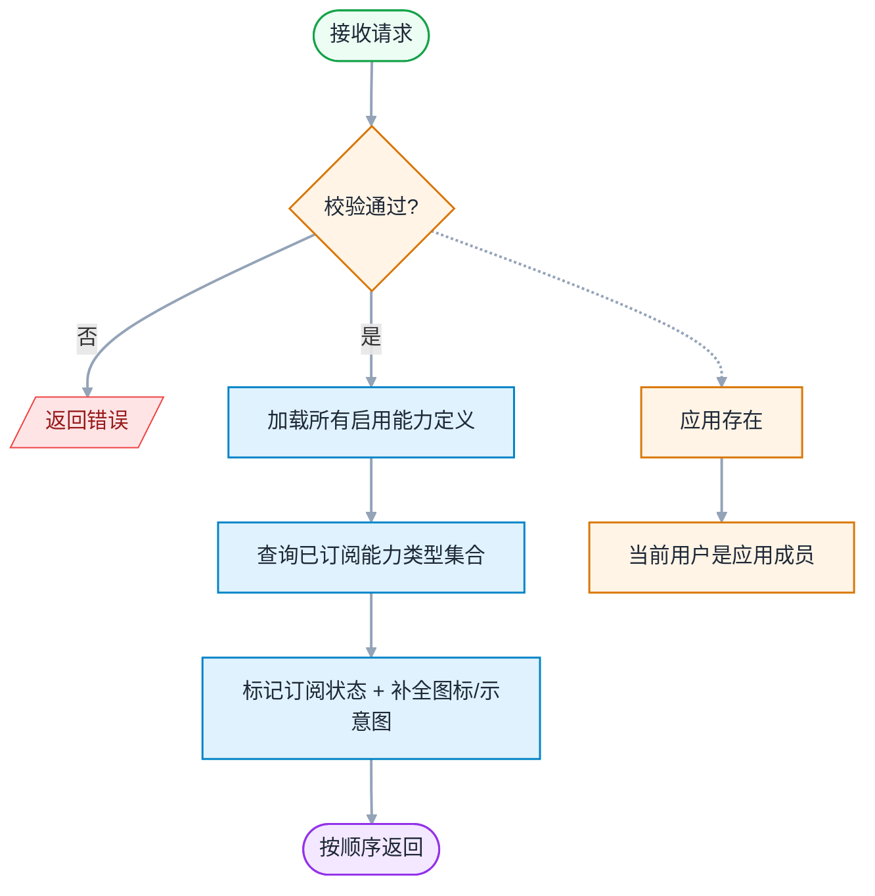
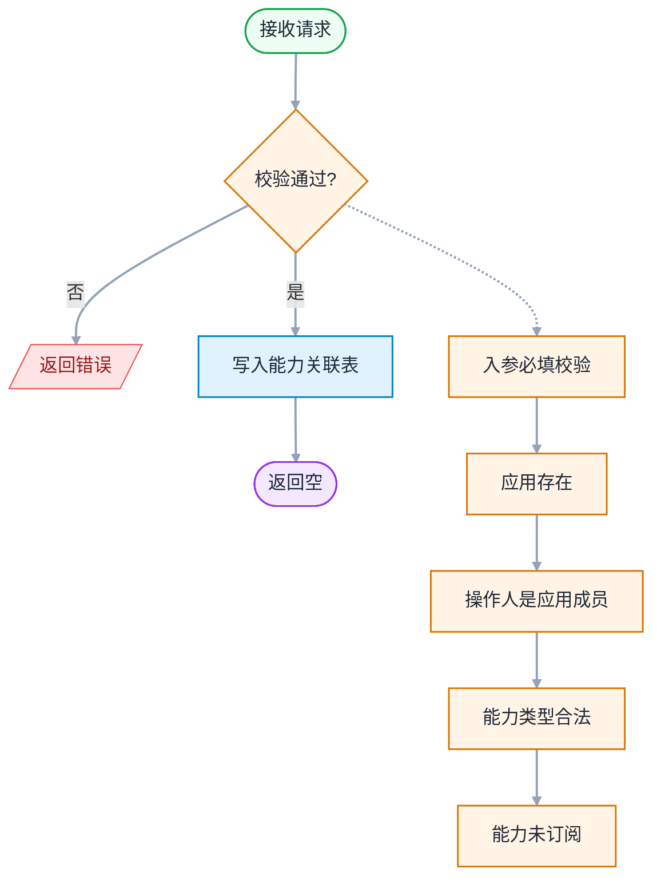
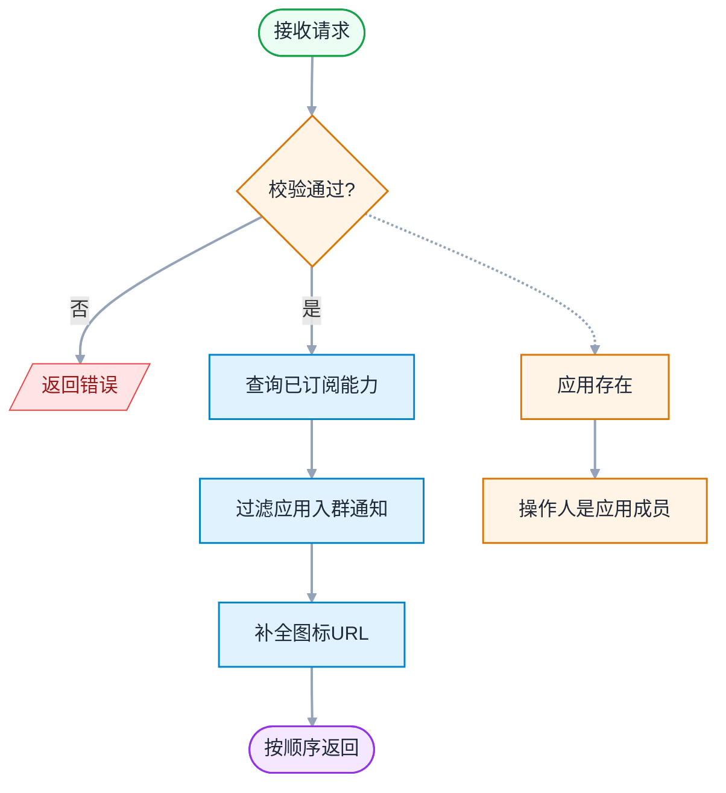

# 能力管理 - 详细设计

> 模板参照：需求设计说明书
> 父文档：[design-00-overview.md](./design-00-overview.md)
> 业务素材：plan.md §4.2.3 AbilityService / frontend-design.md §10
> 编写日期：2026-06-12
> 文档版本：v1.0

---

## 修订记录

| 版本 | 日期 | 修订人 | 修订内容 |
|:----:|------|--------|----------|
| v1.0 | 2026-06-12 | SDDU | 依据需求设计说明书模板首次编写 |

---

## 目录

- 1 需求价值和概述
- 2 上下文分析（可选）
- 3 初始需求分析（可选）
- 4 需求影响分析
- 5 系统用例分析（可选）
- 6 功能设计
    - 6.1 业界方案实现（可选）
    - 6.2 功能实现整体设计方案（可选）
    - 6.3 架构设计方案（可选）
    - 6.4 功能实现
        - 6.4.1 实现思路
        - 6.4.2 实现设计
        - 6.4.3 功能可靠性分析（可选）
        - 6.4.4 功能安全分析（可选）
        - 6.4.5 架构元素影响列表（可选）
        - 6.4.6 接口设计
        - 6.4.7 数据模型设计
- 7 系统级非功能设计
- 8 checkList（必填）

---

## 1 需求价值和概述

### 1.1 价值主张

AI 重构开放平台 Open 面，提升稳定性、可维护性、开发效率。

### 1.2 需求概述

能力管理是业务应用的功能扩展模块，Owner/管理员通过此模块为应用订阅开放能力（群置顶、群通知、链接增强等 7 种能力），订阅后侧边栏自动出现能力入口。

**涉及需求**：FR-010

| 需求标号 | 需求名称 | 需求描述 |
|---------|---------|---------|
| FR-010 | 能力列表 | 按场景分组展示可订阅能力，添加后侧边栏出现入口 |

---

## 2 上下文分析（可选）

不涉及

---

## 3 初始需求分析（可选）

不涉及

---

## 4 需求影响分析

### 4.1 特性影响分析

| 现有特性 | 影响方式 | 说明 |
|----------|----------|------|
| 能力管理 | 新增 | 新页面 + V2 接口 |

---

## 5 系统用例分析（可选）

> 能力管理无复杂用例，不需要细化分析。

---

## 6 功能设计

### 6.1 业界方案实现（可选）

不涉及

### 6.2 功能实现整体设计方案（可选）

不涉及（见 design-00-overview.md §6.2）

### 6.3 架构设计方案（可选）

不涉及（见 design-00-overview.md §6.3）

### 6.4 功能实现

#### 6.4.1 实现思路

**后端（AbilityService）**：

| 维度 | 设计 |
|------|------|
| 分层 | AbilityController → AbilityService → AbilityMapper / AppAbilityRelationMapper |
| 权限校验 | 能力列表无需 appId；订阅/查看已订阅需 `appContextResolver.resolveAndValidate(appId)` |
| 审计 | ADD_APP_ABILITY |

**能力类型枚举**：

| ability_type | 名称 |
|:----:|------|
| 1 | 群置顶 |
| 2 | 群通知 |
| 3 | 链接增强 |
| 4 | 点对点通知 |
| 5 | we码 |
| 6 | 应用入群通知 |
| 7 | 助手广场卡片 |

**前端**：

| 页面 | 组件 | 说明 |
|------|------|------|
| Capabilities | CapabilitiesPage | 能力卡片列表 + 添加能力 |

#### 6.4.2 实现设计

能力管理流程较简单（列表展示 + 订阅），无复杂时序图/活动图。

**核心流程**：
1. 页面加载 → 调用接口 3.1 获取全量能力列表 + 接口 3.3 获取已订阅能力
2. 前端合并展示：已订阅标记 ✓、未订阅显示"添加"按钮
3. 用户点击"添加" → 调用接口 3.2 订阅能力
4. 成功后刷新列表 + 侧边栏出现能力入口

#### 6.4.3 功能可靠性分析（可选）

| 可靠性风险 | 影响 | 措施 |
|------------|------|------|
| 重复订阅 | 能力重复 | `(app_id, ability_id)` UNIQUE 约束防并发；应用层校验 409400 |

#### 6.4.4 功能安全分析（可选）

| 安全维度 | 措施 |
|----------|------|
| 越权校验 | 订阅需 Owner/管理员权限；查看需应用成员 |
| 操作审计 | ADD_APP_ABILITY |

#### 6.4.5 架构元素影响列表（可选）

| 层 | 元素 | 改动 | 说明 |
|----|------|------|------|
| 后端 | modules/ability/controller/ | 新增 | AbilityController（3 个端点） |
| 后端 | modules/ability/service/ | 新增 | AbilityService |
| 后端 | modules/ability/mapper/ | 新增 | AbilityMapper / AppAbilityRelationMapper |
| 后端 | modules/ability/entity/ | 新增 | Ability / AppAbilityRelation |
| 后端 | modules/ability/dto/ | 新增 | AbilityResponse 等 |
| 前端 | pages/Capabilities/ | 新增 | 能力管理页 |

#### 6.4.6 接口设计

**表 6-1 能力管理接口（3 个端点）**

| # | URL | method | 功能 | 鉴权 | 审计 |
|---|-----|--------|------|------|:----:|
| 3.1 | /service/open/v2/abilities?appId=xxx | GET | 能力列表（全量） | 登录 | - |
| 3.2 | /service/open/v2/app/{appId}/abilities | POST | 订阅能力 | Owner/管理员 | ADD_APP_ABILITY |
| 3.3 | /service/open/v2/app/{appId}/abilities | GET | 应用已订阅能力 | 成员 | - |

**核心接口详细设计**：

##### 接口 3.1：能力列表

**REST**：`GET /service/open/v2/abilities?appId=xxx`

**作用**：列出系统所有可订阅的能力（供"添加能力"对话框选择）。根据该 `appId` 已订阅情况，为每个能力附带 `subscribed` 标记。

**入参**：（查询参数）：

| 字段 | 类型 | 必填 | 说明 |
|------|------|:----:|------|
| `appId` | `string` | ✅ | 应用 ID（必填，用于计算 `subscribed` 标记） |

**出参**：`AbilityVO[]`

| 字段 | 类型 | 说明 |
|------|------|------|
| `abilityId` | `string` | 能力主键 ID |
| `abilityType` | `int` | 能力类型 1-7 |
| `nameCn` | `string` | 能力中文名 |
| `nameEn` | `string` | 能力英文名 |
| `descCn` | `string` | 能力中文描述 |
| `descEn` | `string` | 能力英文描述 |
| `iconUrl` | `string` | 能力图标 URL（来自能力属性表的 `icon` 属性） |
| `diagramUrl` | `string` | 能力示意图 URL（来自能力属性表） |
| `subscribed` | `boolean` | 是否已订阅（`true` 已订阅，`false` 未订阅） |
| `orderNum` | `int` | 展示顺序 |

**执行逻辑**：



**权限要求**：应用成员（不限角色，只读接口）

**错误码**：
- `403100`（无权访问 — 非应用成员）
- `401`（未登录）
- `500`（系统异常）

**入参示例**：

```json
GET /service/open/v2/abilities?appId=app_20260603_xyz789
```

**出参示例**：

```json
{
  "code": "200",
  "messageZh": "成功",
  "messageEn": "success",
  "data": [
    {
      "abilityId": "1",
      "abilityType": 1,
      "nameCn": "群置顶",
      "nameEn": "Group Top",
      "descCn": "将应用消息置顶到群聊顶部",
      "descEn": "Pin app messages to the top of group chats",
      "iconUrl": "https://cdn.example.com/abilities/icon_001.png",
      "diagramUrl": "https://cdn.example.com/abilities/diagram_001.png",
      "subscribed": true,
      "orderNum": 1
    },
    {
      "abilityId": "2",
      "abilityType": 2,
      "nameCn": "群通知",
      "nameEn": "Group Notification",
      "descCn": "向群聊发送应用通知",
      "descEn": "Send app notifications to group chats",
      "iconUrl": "https://cdn.example.com/abilities/icon_002.png",
      "diagramUrl": "https://cdn.example.com/abilities/diagram_002.png",
      "subscribed": false,
      "orderNum": 2
    },
    {
      "abilityId": "3",
      "abilityType": 3,
      "nameCn": "应用菜单",
      "nameEn": "App Menu",
      "descCn": "在应用消息中添加自定义菜单",
      "descEn": "Add custom menu in app messages",
      "iconUrl": "https://cdn.example.com/abilities/icon_003.png",
      "diagramUrl": "",
      "subscribed": false,
      "orderNum": 3
    }
  ]
}
```

**错误响应示例**：

```json
{
  "code": "401",
  "messageZh": "未登录",
  "messageEn": "Unauthorized",
  "data": null
}
```

---

##### 接口 3.2：添加能力

**REST**：`POST /service/open/v2/app/{appId}/abilities`

**作用**：为应用订阅一个能力。

**入参**：（`AddAbilityRequest`）：

| 字段 | 类型 | 必填 | 说明 |
|------|------|:----:|------|
| `appId` | `string` | ✅ | 应用 ID |
| `abilityType` | `int` | ✅ | 能力类型 1-7 |

**出参**：`null`（`data` 为空）

**执行逻辑**：



**权限要求**：操作人必须是该 `appId` 对应应用的成员

**错误码**：`403100`、`409400`（能力已订阅）、`400104`（能力类型非法）

**入参示例**：

```json
POST /service/open/v2/app/app_20260603_xyz789/abilities
Content-Type: application/json

{
  "abilityType": 4
}
```

> 说明：`abilityType` 取值 1-7（群置顶/群通知/链接增强/点对点通知/we码/应用入群通知/助手广场卡片）。

**出参示例**：

```json
{
  "code": "200",
  "messageZh": "成功",
  "messageEn": "success",
  "data": null
}
```

> 说明：data 为空，前端刷新"已订阅能力列表"（接口 3.3）获取最新能力详情。

**错误响应示例**：

```json
{
  "code": "400104",
  "messageZh": "能力类型非法: 9",
  "messageEn": "Invalid ability type: 9",
  "data": null
}
```

---

##### 接口 3.3：获取已订阅能力列表

**REST**：`GET /service/open/v2/app/{appId}/abilities`

**作用**：获取应用已订阅的全部能力（含能力详情：图标）。

**入参**：

**出参**：`AppAbilityDetailVO[]`

| 字段 | 类型 | 说明 |
|------|------|------|
| `id` | `string` | 关联记录 ID |
| `abilityId` | `string` | 能力主键 ID |
| `abilityType` | `int` | 能力类型 1-7 |
| `nameCn` | `string` | 能力中文名 |
| `nameEn` | `string` | 能力英文名 |
| `iconUrl` | `string` | 能力图标 URL |

**执行逻辑**：



**权限要求**：操作人必须是该 `appId` 对应应用的成员

**错误码**：
- `404100`（应用不存在）
- `403100`（无权访问）

**入参示例**：

```json
GET /service/open/v2/app/app_20260603_xyz789/abilities
```

**出参示例**：

```json
{
  "code": "200",
  "messageZh": "成功",
  "messageEn": "success",
  "data": [
    {
      "id": "1001",
      "abilityId": "1",
      "abilityType": 1,
      "nameCn": "群置顶",
      "nameEn": "Group Top",
      "iconUrl": "https://cdn.example.com/abilities/icon_001.png"
    },
    {
      "id": "1002",
      "abilityId": "2",
      "abilityType": 2,
      "nameCn": "群通知",
      "nameEn": "Group Notification",
      "iconUrl": "https://cdn.example.com/abilities/icon_002.png"
    },
    {
      "id": "1003",
      "abilityId": "3",
      "abilityType": 3,
      "nameCn": "应用菜单",
      "nameEn": "App Menu",
      "iconUrl": "https://cdn.example.com/abilities/icon_003.png"
    }
  ]
}
```

**错误响应示例**：

```json
{
  "code": "403100",
  "messageZh": "无权访问应用: app_20260603_xyz789",
  "messageEn": "No access to the application: app_20260603_xyz789",
  "data": null
}
```

---

#### 6.4.7 数据模型设计

**能力管理相关表（3 张）**：

| # | 表名 | 关键字段 | 说明 |
|---|------|----------|------|
| 1 | openplatform_ability_t | id(PK), ability_name_cn/en, ability_type(1~7), order_num, status | 能力主表 |
| 2 | openplatform_ability_p_t | parent_id(FK→ability_t.id), property_name, property_value | 能力属性表（K-V：icon/example_diagram） |
| 3 | openplatform_app_ability_relation_t | id(PK), app_id(FK), ability_id(FK), ability_type, UNIQUE(app_id, ability_id) | 应用-能力关联表 |

**关联表索引**：

| 索引 | 字段 | 用途 |
|------|------|------|
| PRIMARY KEY | `id` | 主键 |
| UNIQUE | `(app_id, ability_id)` | 防重复订阅 |

---

## 7 系统级非功能设计

> 见 design-00-overview.md §7

---

## 8 checkList（必填）

### 8.1 设计自检清单要求（必填）

| check 点 | 是否达标 | 备注 |
|----------|:--------:|------|
| 覆盖能力管理 FR | 是 | FR-010 |
| 包含接口详细设计 | 是 | 3 个端点 |
| 包含数据模型设计 | 是 | 3 张表 |
| 包含功能可靠性分析 | 是 | 1 项风险 |
| 设计自检清单全部勾选完毕 | 是 | 本表 5 项全部达标 |

---

**文档结束**
