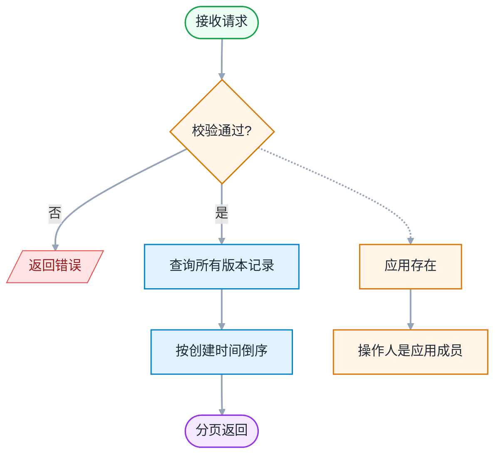
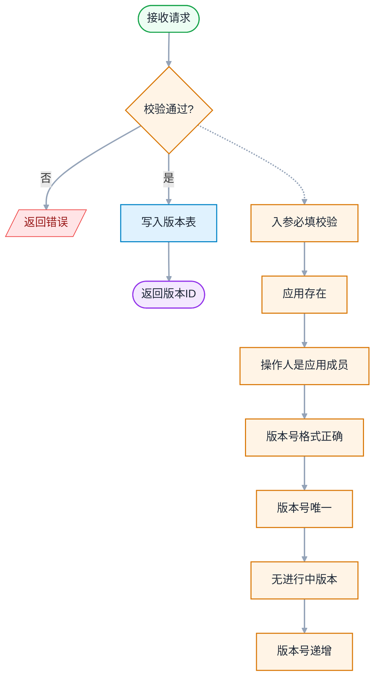
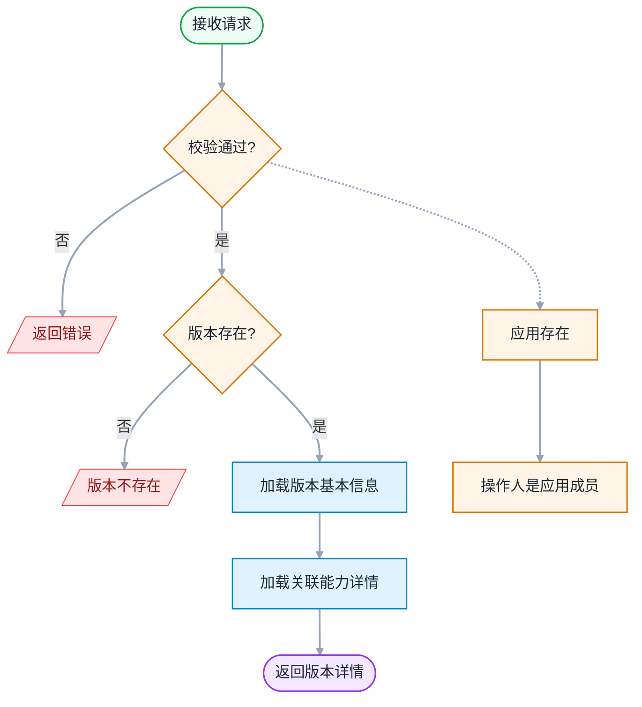
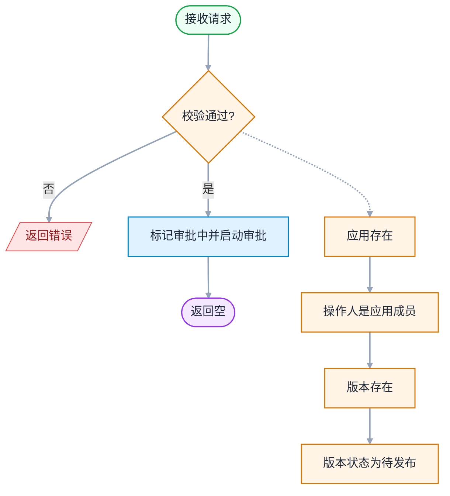
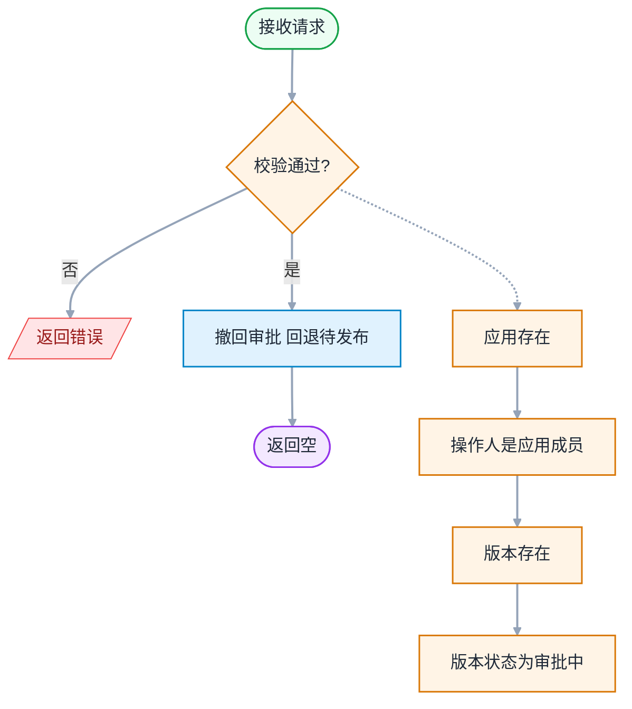
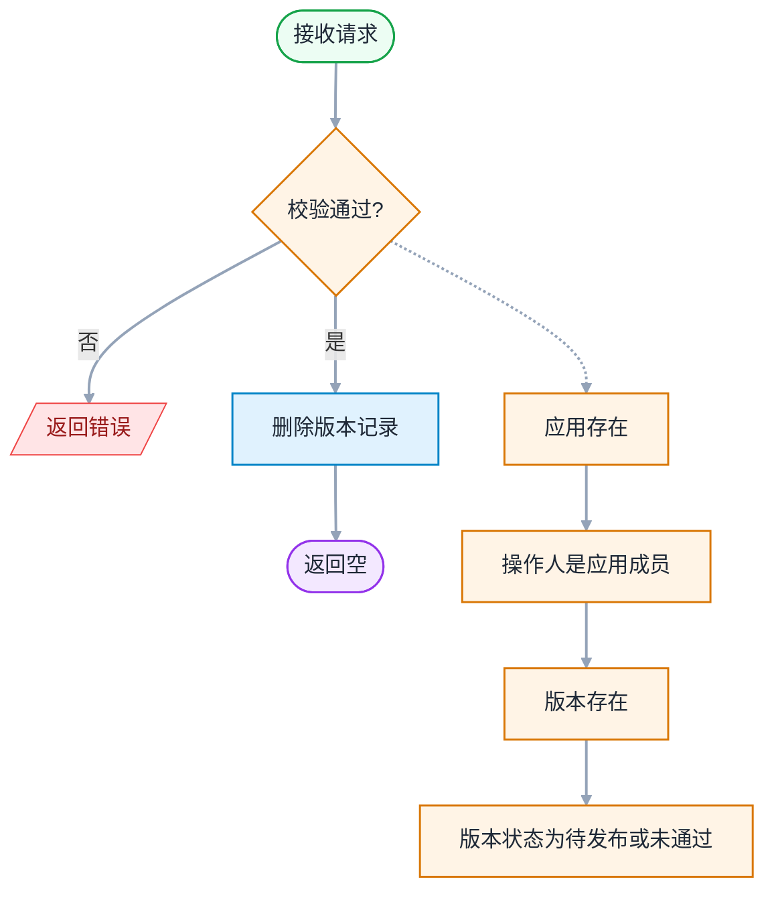
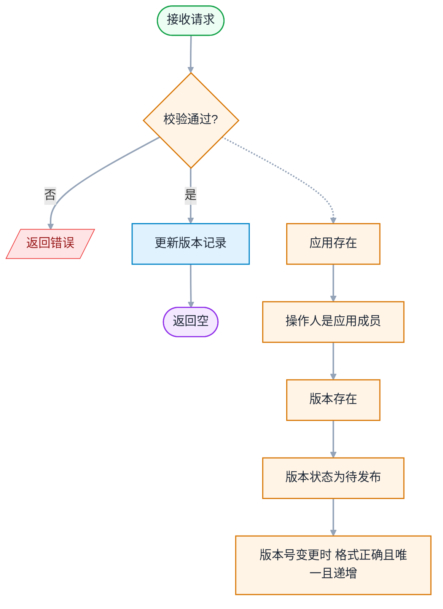

# 版本管理 - 详细设计

> 模板参照：需求设计说明书
> 父文档：[design-00-overview.md](./design-00-overview.md)
> 业务素材：plan.md §4.2.4 VersionService / frontend-design.md §11~§12
> 编写日期：2026-06-12
> 文档版本：v1.0

---

## 修订记录

| 版本 | 日期 | 修订人 | 修订内容 |
|:----:|------|--------|----------|
| v1.0 | 2026-06-12 | SDDU | 依据需求设计说明书模板首次编写 |

---

## 目录

- 1 需求价值和概述
- 2 上下文分析（可选）
- 3 初始需求分析（可选）
- 4 需求影响分析
- 5 系统用例分析（可选）
    - 5.1 用例清单
    - 5.2 用例分析
- 6 功能设计
    - 6.1 业界方案实现（可选）
    - 6.2 功能实现整体设计方案（可选）
    - 6.3 架构设计方案（可选）
    - 6.4 功能实现
        - 6.4.1 实现思路
        - 6.4.2 实现设计
        - 6.4.3 功能可靠性分析（可选）
        - 6.4.4 功能安全分析（可选）
        - 6.4.5 架构元素影响列表（可选）
        - 6.4.6 接口设计
        - 6.4.7 数据模型设计
- 7 系统级非功能设计
- 8 checkList（必填）

---

## 1 需求价值和概述

### 1.1 价值主张

AI 重构开放平台 Open 面，提升稳定性、可维护性、开发效率。

### 1.2 需求概述

版本管理是业务应用的发布审核模块，Owner/管理员通过此模块创建版本、提交审批、撤回版本、查看版本详情。版本状态严格按状态机流转，审批流程集成 V2 审批引擎。

**涉及需求**：FR-011 ~ FR-015

| 需求标号 | 需求名称 | 需求描述 |
|---------|---------|---------|
| FR-011 | 版本列表 | 展示版本及状态，分页 + 状态-操作矩阵 |
| FR-012 | 创建版本 | x.x.x 格式，同应用唯一且递增 |
| FR-013 | 版本详情 | 查看/编辑版本，仅待发布可编辑 |
| FR-014 | 发布审批 | 提交审批，状态 1→2，启动 V2 审批流程 |
| FR-015 | 撤回版本 | 审批中撤回，状态 2→1，调用审批引擎撤回 |

---

## 2 上下文分析（可选）

不涉及

---

## 3 初始需求分析（可选）

不涉及

---

## 4 需求影响分析

### 4.1 特性影响分析

| 现有特性 | 影响方式 | 说明 |
|----------|----------|------|
| 版本管理 | 新增 | 新页面 + V2 接口 + V2 审批引擎集成 |

---

## 5 系统用例分析（可选）

### 5.1 用例清单

| 用例编号 | 用例名称 | 参与角色 | 用例简要说明 | 关联测试用例 | 需细化 |
|:--------:|----------|:--------:|-------------|:------------:|:------:|
| UC-V01 | 查看版本列表 | O / A / D | 加载版本列表（接口 4.1），按状态显示徽标和操作按钮 | TC-7-01 ~ 07 | 否 |
| UC-V02 | 创建版本 | O / A / D | 行内表单创建版本（接口 4.2），校验版本号格式、唯一性、递增规则 | TC-7-08 ~ 18 | 是 |
| UC-V03 | 删除版本 | O / A / D | 删除待发布(1)或审批未通过(3)版本（接口 4.6），其他状态不可删 | TC-7-19 ~ 23 | 否 |
| UC-V04 | 撤回版本 | O / A / D | 撤回审批中(2)版本回退为待发布(1)（接口 4.5），同时调用审批引擎撤回 | TC-7-24 ~ 27 | 否 |
| UC-V05 | 查看版本详情 | O / A / D | 点击"查看"页面内组件切换为详情视图（接口 4.3），按状态控制操作按钮显隐 | TC-8-01 ~ 08 | 否 |
| UC-V06 | 编辑版本 | O / A / D | 仅待发布(1)版本可编辑版本号和描述（接口 4.7），关联能力只读不可改 | TC-8-09 ~ 17 | 是 |
| UC-V07 | 发布版本 | O / A / D | 待发布(1)版本提交审批（接口 4.4），状态流转至审批中(2)，审批引擎回调改状态 | TC-8-18 ~ 22 | 是 |

### 5.2 用例分析

#### 5.2.1 UC-V02 创建版本

**简要说明**：用户通过行内表单创建新版本，系统校验版本号格式、唯一性、递增规则

**Actor**：Owner、管理员、开发者

**前置条件**：用户已登录且为业务应用的成员

**最小保证**：操作失败时不改变现有版本数据；已有待发布/审批中/审批未通过版本时拒绝创建

**成功保证**：版本记录持久化（status=1 待发布）；审计日志记录（`CREATE_APP_VERSION`）

**主成功场景**：
1. 用户在版本列表页点击"创建版本"，展开行内表单
2. 输入版本号（SemVer 格式 X.Y.Z）+ 中文描述 + 英文描述
3. 前端校验格式通过后点击"提交"
4. 后端校验无待发布/审批中/审批未通过版本（`status ∉ {1, 2, 3}`）
5. 后端校验版本号唯一 + 版本号大于历史最大值
6. 写入版本记录（status=1），审计日志记录
7. 返回成功，列表刷新

**扩展场景**：
- 2a. 版本号格式非 X.Y.Z → 前端拦截，不调用接口
- 4a. 已有待发布(1)/审批中(2)/审批未通过(3)版本 → 返回 `409301`
- 5a. 版本号已存在 → 返回 `409300`
- 5b. 版本号不递增（小于历史最大值）→ 返回 `409306`
- 6. 关联能力由后端自动从应用已订阅能力带出，前端不传

**DFX属性**：版本号递增校验；同一应用同一时间最多一个待发布/审批中版本

---

#### 5.2.2 UC-V06 编辑版本

**简要说明**：用户编辑待发布版本(1)的版本号和描述，关联能力不可编辑

**Actor**：Owner、管理员、开发者

**前置条件**：版本状态为待发布(1)

**最小保证**：非待发布状态拒绝编辑；版本号变更需满足唯一性 + 递增规则

**成功保证**：版本记录更新持久化；审计日志记录

**主成功场景**：
1. 用户在版本详情页点击"编辑"，切换为编辑态
2. 修改版本号 / 中文描述 / 英文描述（关联能力只读）
3. 点击"保存"，后端校验状态仍为待发布(1)
4. 校验版本号唯一性 + 递增规则
5. 更新版本记录，审计日志记录
6. 返回成功，切回查看态

**扩展场景**：
- 3a. 状态非待发布 → 返回 `409303`（审批中/审批未通过/已发布均不可编辑）
- 4a. 版本号已存在 → 返回 `409300`
- 4b. 版本号不递增 → 返回 `409306`
- 关联能力不可编辑（只读展示，由创建时自动带出）

**DFX属性**：状态机强校验（仅 status=1 可编辑）

---

#### 5.2.3 UC-V07 发布版本

**简要说明**：用户将待发布版本提交审批，状态流转至审批中，由审批引擎回调决定最终状态

**Actor**：Owner、管理员、开发者

**前置条件**：版本状态为待发布(1)

**最小保证**：非待发布状态拒绝发布；审批引擎不可用时回滚

**成功保证**：版本状态流转至审批中(2)；审批引擎创建审批流；审计日志记录（`PUBLISH_APP_VERSION`）

**主成功场景**：
1. 用户在版本详情页点击"发布"，弹出确认 Modal
2. 点击"确认"，后端校验状态为待发布(1)
3. 状态流转至审批中(2)，调用审批引擎创建审批流
4. 审计日志记录
5. 返回成功，操作按钮消失（变为只读）

**扩展场景**：
- 2a. 状态非待发布 → 返回 `409303`
- 3a. 审批引擎不可用 → 返回 `502100`，事务回滚，状态保持待发布
- 审批通过（系统回调）→ 状态自动变为已发布(4)
- 审批拒绝（系统回调）→ 状态自动变为审批未通过(3)，需删除后重新创建

**DFX属性**：状态机强校验；审批引擎集成（失败可回滚）；审批未通过(3) ≠ 撤回后待发布(1)，不可直接重新发布

---

## 6 功能设计

### 6.1 业界方案实现（可选）

不涉及

### 6.2 功能实现整体设计方案（可选）

不涉及（见 design-00-overview.md §6.2）

### 6.3 架构设计方案（可选）

不涉及（见 design-00-overview.md §6.3）

### 6.4 功能实现

#### 6.4.1 实现思路

**后端（VersionService）**：

| 维度 | 设计 |
|------|------|
| 分层 | VersionController → VersionService → VersionMapper / VersionPropertyMapper |
| 权限校验 | `appContextResolver.resolveAndValidate(appId)` + Owner/管理员角色校验 |
| 状态机 | 待发布(1) → 审批中(2) → 已发布(4) / 审批未通过(3)；审批中可撤回→待发布 |
| 审批集成 | V2 审批引擎 `ApprovalEngine.createApproval()`，审批人由 `approval_flow` 表配置 |
| 审计 | CREATE_APP_VERSION / UPDATE_APP_VERSION / PUBLISH_APP_VERSION / WITHDRAW_APP_VERSION / DELETE_APP_VERSION |

**版本状态机**：

| 当前状态 | 操作 | 目标状态 | 触发者 |
|---------|------|---------|--------|
| - | 创建版本 | 1（待发布） | 用户 |
| 1（待发布） | 提交审批 | 2（审批中） | 用户 |
| 2（审批中） | 撤回 | 1（待发布） | 用户 |
| 2（审批中） | 审批通过 | 4（已发布） | 审批引擎钩子 |
| 2（审批中） | 审批拒绝 | 3（审批未通过） | 审批引擎钩子 |

**前端**：

| 页面 | 组件 | 说明 |
|------|------|------|
| VersionRelease | VersionReleasePage | 版本列表 + 创建/删除/撤回操作 |
| VersionDetail | VersionDetail 组件 | 版本详情（查看/编辑/发布） |

#### 6.4.2 实现设计

版本管理流程较简单（列表展示 + 创建/编辑/发布/撤回/删除），无复杂时序图/活动图。

**核心流程**：
1. 版本列表页加载 → 调用接口 4.1 获取版本列表
2. 用户创建版本（行内表单）→ 调用接口 4.2
3. 用户点击"查看" → 页面内组件切换为详情视图，调用接口 4.3
4. 用户编辑/发布 → 调用接口 4.7 / 4.4，状态机校验
5. 用户撤回/删除 → 调用接口 4.5 / 4.6

#### 6.4.3 功能可靠性分析（可选）

| 可靠性风险 | 影响 | 措施 |
|------------|------|------|
| 版本状态非法流转 | 数据不一致 | 后端状态机强校验；仅允许合法状态转换；非法抛 409303 |
| 审批服务不可用 | 发布失败 | 返回 502100；版本状态保持待发布，可重试 |
| 审批引擎钩子失败 | 状态不联动 | 审批引擎内部 try-catch；失败记录日志不阻塞 |

#### 6.4.4 功能安全分析（可选）

| 安全维度 | 措施 |
|----------|------|
| 越权校验 | 创建/发布/撤回/删除需 Owner/管理员权限；查看需应用成员 |
| 操作审计 | 5 个写接口全覆盖 |
| 状态机校验 | 后端强校验状态转换合法性 |

#### 6.4.5 架构元素影响列表（可选）

| 层 | 元素 | 改动 | 说明 |
|----|------|------|------|
| 后端 | modules/version/controller/ | 新增 | VersionController（7 个端点） |
| 后端 | modules/version/service/ | 新增 | VersionService |
| 后端 | modules/version/mapper/ | 新增 | VersionMapper / VersionPropertyMapper |
| 后端 | modules/version/entity/ | 新增 | AppVersion / AppVersionProperty |
| 后端 | modules/version/dto/ | 新增 | VersionCreateRequest / VersionResponse 等 |
| 后端 | ApprovalEngine | 复用 | 调用 createApproval / cancel |
| 前端 | pages/VersionRelease/ | 新增 | 版本管理页 |
| 前端 | components/VersionDetail/ | 新增 | 版本详情组件 |

#### 6.4.6 接口设计

**表 6-1 版本管理接口（7 个端点）**

| # | URL | method | 功能 | 鉴权 | 审计 |
|---|-----|--------|------|------|:----:|
| 4.1 | /service/open/v2/app/{appId}/versions?curPage=1&pageSize=10 | GET | 版本列表 | 成员 | - |
| 4.2 | /service/open/v2/app/{appId}/versions | POST | 创建版本 | Owner/管理员 | CREATE_APP_VERSION |
| 4.3 | /service/open/v2/app/{appId}/versions/{versionId} | GET | 版本详情 | 成员 | - |
| 4.4 | /service/open/v2/app/{appId}/versions/{versionId}/publish | POST | 发布（提交审批） | Owner/管理员 | PUBLISH_APP_VERSION |
| 4.5 | /service/open/v2/app/{appId}/versions/{versionId}/withdraw | POST | 撤回版本 | Owner/管理员 | WITHDRAW_APP_VERSION |
| 4.6 | /service/open/v2/app/{appId}/versions/{versionId} | DELETE | 删除版本 | Owner/管理员 | DELETE_APP_VERSION |
| 4.7 | /service/open/v2/app/{appId}/versions/{versionId} | PUT | 更新版本 | Owner/管理员 | UPDATE_APP_VERSION |

**核心接口详细设计**：

##### 接口 4.1：获取版本列表

**REST**：`GET /service/open/v2/app/{appId}/versions?curPage=1&pageSize=10`

**作用**：分页查询应用版本列表。

**入参**：（查询参数）：

| 字段 | 类型 | 必填 | 说明 |
|------|------|:----:|------|
| `appId` | `string` | ✅ | 应用 ID |
| `curPage` | `int` | ✅ | 当前页码（支持**跳转到某页**） |
| `pageSize` | `int` | ✅ | 每页条数（10 / 20 / 50） |

**出参**：`ApiResponse<AppVersionVO[]>`

| 字段 | 类型 | 说明 |
|------|------|------|
| `code` | `string` | 响应码 |
| `messageZh` | `string` | 中文消息 |
| `messageEn` | `string` | 英文消息 |
| `data` | `AppVersionVO[]` | 版本列表 |
| `page` | `PageResponse` | 分页信息 |
| `page.curPage` | `int` | 当前页码 |
| `page.pageSize` | `int` | 每页条数 |
| `page.total` | `int` | 总记录数 |
| `page.totalPages` | `int` | 总页数 |
| `data[].id` | `string` | 版本记录 ID |
| `data[].versionCode` | `string` | 版本号（x.x.x） |
| `data[].versionDescCn` | `string` | 中文描述 |
| `data[].versionDescEn` | `string` | 英文描述 |
| `data[].status` | `int` | 版本状态（1=待发布，2=审批中，3=审批未通过，4=已发布） |
| `data[].approvedTime` | `string` | 审核通过时间（**仅已发布时有值；待发布/审批中/审批未通过 时为 null，前端展示 `-`**） |
| `data[].createBy` | `string` | 创建人 |
| `data[].createTime` | `string` | 创建时间（ISO 8601） |

**执行逻辑**：



**权限要求**：操作人必须是该 `appId` 对应应用的成员

**错误码**：
- `404100`（应用不存在）
- `403100`（无权访问）

**入参示例**：

```json
GET /service/open/v2/app/app_20260603_xyz789/versions?curPage=1&pageSize=10
```

**出参示例**：

```json
{
  "code": "200",
  "messageZh": "成功",
  "messageEn": "success",
  "data": [
    {
      "id": "5001",
      "versionCode": "1.0.0",
      "versionDescCn": "首次发布版本",
      "versionDescEn": "Initial release version",
      "status": 1,
      "createBy": "user_10001",
      "createTime": "2026-06-03 14:00:00"
    }
  ],
  "page": {
    "curPage": 1,
    "pageSize": 10,
    "total": 1,
    "totalPages": 1
  }
}
```

> 说明：`status` 取值：1=待发布，2=审批中，3=审批未通过，4=已发布。`approvedTime` 字段：仅已发布（status=4）时有值；其他状态（待发布/审批中/审批未通过）时为 `null`，前端展示为 `-`。

**列表页状态-操作按钮矩阵**（与 spec.md FR-011 一致；列表页不含「编辑」「提交审批」按钮，这 2 个按钮在详情页）：

| 状态 \ 按钮 | 查看 | 删除 | 撤回 |
|------------|:----:|:----:|:----:|
| **待发布** | ✅ | ✅ | ❌ |
| **审批中** | ✅ | ❌ | ✅ |
| **审批未通过** | ✅ | ✅ | ❌ |
| **已发布** | ✅ | ❌ | ❌ |

**错误响应示例**：

```json
{
  "code": "403100",
  "messageZh": "无权访问应用: app_20260603_xyz789",
  "messageEn": "No access to the application: app_20260603_xyz789",
  "data": null
}
```

---

##### 接口 4.2：创建版本

**REST**：`POST /service/open/v2/app/{appId}/versions`

**作用**：为应用创建新版本（初始状态为 status=1 待发布）。自动从应用已订阅的能力中带出。

**入参**：（`CreateVersionRequest`）：

| 字段 | 类型 | 必填 | 说明 |
|------|------|:----:|------|
| `appId` | `string` | ✅ | 应用 ID |
| `versionCode` | `string` | ✅ | 版本号（x.x.x 格式，**必填**，**必须高于之前已存在版本号**） |
| `versionDescCn` | `string` | ✅ | 中文描述（**必填**，≤2000 字符） |
| `versionDescEn` | `string` | - | 英文描述（≤2000 字符） |

**出参**：`String`（`data` 为新建版本记录主键 ID）

**执行逻辑**：



**权限要求**：操作人必须是该 `appId` 对应应用的成员

**错误码**：
- `400105`（版本号格式错误）
- `409300`（版本号已存在）
- `409301`（存在**待审批/审核中/审核不通过**版本）
- `409306`（版本号必须**高于之前已存在版本号**）
- `403100`（无权访问）

**入参示例**：

```json
POST /service/open/v2/app/app_20260603_xyz789/versions
Content-Type: application/json

{
  "versionCode": "1.0.0",
  "versionDescCn": "首次发布版本",
  "versionDescEn": "Initial release version"
}
```

> 说明：
> - `versionCode`：版本号，格式 `^\d+\.\d+\.\d+$`，**必须高于之前已存在版本号（不区分状态）**（如 1.0.0 < 1.0.1 < 1.1.0 < 2.0.0）
> - 同一应用下已存在**待审批 / 审核中 / 审核不通过**的版本时，**不能再申请新版本**（需先撤回/删除）
> - 创建时 `status=1`（待发布），系统自动带出当前应用已配置的能力 ID 列表
> - `versionCode` + `versionDescCn` 均为**必填**；`versionDescCn` 达到 2000 字符上限后前端阻止继续输入

**出参示例**：

```json
{
  "code": "200",
  "messageZh": "成功",
  "messageEn": "success",
  "data": "323847348549582848"
}
```

> 说明：`data` 为新建版本记录主键 ID，前端创建成功后刷新"版本列表"（4.1）获取完整数据。

**错误响应示例**：

```json
{
  "code": "409300",
  "messageZh": "版本号已存在: 1.0.0",
  "messageEn": "Version code already exists: 1.0.0",
  "data": null
}
```

---

##### 接口 4.3：获取版本详情

**REST**：`GET /service/open/v2/app/{appId}/versions/{versionId}`

**作用**：获取指定版本的详情（版本号 + 描述 + 当前状态 + 关联能力列表）。

**入参**：

| 字段 | 类型 | 必填 | 说明 |
|------|------|:----:|------|
| `appId` | `string` | ✅ | 应用 ID |
| `versionId` | `string` | ✅ | 版本主键 ID |

**出参**：`AppVersionDetailVO`

| 字段 | 类型 | 说明 |
|------|------|------|
| `id` | `string` | 版本记录 ID |
| `versionCode` | `string` | 版本号（x.x.x） |
| `versionDescCn` | `string` | 中文描述 |
| `versionDescEn` | `string` | 英文描述 |
| `status` | `int` | 版本状态（1=待发布，2=审批中，3=审批未通过，4=已发布） |
| `abilityList` | `AppVersionAbilityVO[]` | 关联能力列表 |

**关联类型 `AppVersionAbilityVO`**：

| 字段 | 类型 | 说明 |
|------|------|------|
| `id` | `string` | 能力主键 ID |
| `abilityNameCn` | `string` | 能力中文名 |
| `abilityNameEn` | `string` | 能力英文名 |
| `iconUrl` | `string` | 能力图标 URL（完整访问地址） |

**执行逻辑**：



**权限要求**：操作人必须是该 `appId` 对应应用的成员

**错误码**：
- `404100`（应用不存在）
- `403100`（无权访问）
- `404300`（版本不存在）

**入参示例**：

```json
GET /service/open/v2/app/app_20260603_xyz789/versions/5001
```

**出参示例**：

```json
{
  "code": "200",
  "messageZh": "成功",
  "messageEn": "success",
  "data": {
    "id": "5001",
    "versionCode": "1.0.0",
    "versionDescCn": "首次发布版本",
    "versionDescEn": "Initial release version",
    "status": 1,
    "abilityList": [
      {
        "id": "1",
        "abilityNameCn": "群置顶",
        "abilityNameEn": "Group Top",
        "iconUrl": "https://cdn.example.com/abilities/icon_001.png"
      },
      {
        "id": "2",
        "abilityNameCn": "群通知",
        "abilityNameEn": "Group Notification",
        "iconUrl": "https://cdn.example.com/abilities/icon_002.png"
      }
    ]
  }
}
```

**错误响应示例**：

```json
{
  "code": "404300",
  "messageZh": "版本不存在: 5001",
  "messageEn": "Version does not exist: 5001",
  "data": null
}
```

---

##### 接口 4.4：发布版本（提交审批）

**REST**：`POST /service/open/v2/app/{appId}/versions/{versionId}/publish`

**作用**：将待发布版本（status=1）提交 V2 审批，状态变为审批中（status=2）。

**V2 审批集成**：复用 `ApprovalEngine.createApproval()` 启动审批，**审批人由 `approval_flow` 表的 `nodes` JSON 配置**。

**入参**：

| 字段 | 类型 | 必填 | 说明 |
|------|------|:----:|------|
| `appId` | `string` | ✅ | 应用 ID |
| `versionId` | `string` | ✅ | 版本主键 ID |

**出参**：`null`（`data` 为空）

**执行逻辑**：



**权限要求**：操作人必须是该 `appId` 对应应用的成员

**错误码**：
- `404100`（应用不存在）
- `403100`（无权访问）
- `404300`（版本不存在）
- `409303`（状态转换非法）
- `502100`（V2 审批启动失败）

**入参示例**：

```json
POST /service/open/v2/app/app_20260603_xyz789/versions/5001/publish
```

**出参示例**：

```json
{
  "code": "200",
  "messageZh": "成功",
  "messageEn": "Success",
  "data": null
}
```

> 说明：发布成功后 `versionId` 已处于审批中状态，前端刷新"版本列表"（4.1）获取最新状态。

**错误响应示例**：

```json
{
  "code": "409303",
  "messageZh": "状态转换非法: 当前状态=2（审批中），无法再次提交",
  "messageEn": "Illegal status transition: current status=2 (Under Review), cannot submit again",
  "data": null
}
```

**V2 终态 → version 状态映射**（由 `ApprovalEngine.updateResourceStatus()` 钩子完成）：

| V2 审批终态 | version.status |
|------------|----------------|
| `APPROVED` (1) | `4`（已发布） |
| `REJECTED` (2) | `3`（审批未通过） |
| `CANCELLED` (3) | `1`（待发布，撤回场景） |

---

##### 接口 4.5：撤回版本

**REST**：`POST /service/open/v2/app/{appId}/versions/{versionId}/withdraw`

**作用**：将审批中版本（status=2）撤回，状态变回待发布（status=1）。

**V2 审批集成**：调用 `ApprovalEngine.cancel()` 撤销 V2 审批，**version.status 由 V2 内部钩子联动修改**（无需 VersionService 自己改）。

**入参**：

| 字段 | 类型 | 必填 | 说明 |
|------|------|:----:|------|
| `appId` | `string` | ✅ | 应用 ID |
| `versionId` | `string` | ✅ | 版本主键 ID |

**出参**：`null`（`data` 为空）

**执行逻辑**：



**权限要求**：操作人必须是该 `appId` 对应应用的成员

**错误码**：
- `404100`（应用不存在）
- `403100`（无权访问）
- `404300`（版本不存在 / 无对应审批记录）
- `409303`（状态转换非法）
- `502100`（V2 审批撤销失败）

**入参示例**：

```json
POST /service/open/v2/app/app_20260603_xyz789/versions/5001/withdraw
```

**出参示例**：

```json
{
  "code": "200",
  "messageZh": "成功",
  "messageEn": "Success",
  "data": null
}
```

> 说明：撤回成功后 `versionId` 已回到待发布状态，前端刷新"版本列表"（4.1）获取最新状态。

**错误响应示例**：

```json
{
  "code": "409303",
  "messageZh": "状态转换非法: 当前状态=1（待发布），无法撤回",
  "messageEn": "Illegal status transition: current status=1 (Pending), cannot withdraw",
  "data": null
}
```

**V2 终态联动说明**：

`ApprovalEngine.cancel()` 内部自动调 `updateResourceStatus(APP_VERSION_PUBLISH)`：

```java
// V2 引擎内（已存在模式，扩展 switch case）
case BusinessType.APP_VERSION_PUBLISH:
    if (status == Status.CANCELLED) {
        version.setStatus(1);  // 撤回 → 待发布
    }
    versionMapper.update(version);
```

VersionService **不直接改 version.status**，完全靠 V2 钩子联动。

---

##### 接口 4.6：删除版本

**REST**：`DELETE /service/open/v2/app/{appId}/versions/{versionId}`

**作用**：物理删除版本记录（及关联属性）。

**入参**：

| 字段 | 类型 | 必填 | 说明 |
|------|------|:----:|------|
| `appId` | `string` | ✅ | 应用 ID |
| `versionId` | `string` | ✅ | 版本主键 ID |

**出参**：data 为空

**执行逻辑**：



**权限要求**：操作人必须是该 `appId` 对应应用的成员

**错误码**：
- `404100`（应用不存在）
- `403100`（无权访问）
- `404300`（版本不存在）
- `409305`（仅待发布或审批未通过版本可删除）

**入参示例**：

```json
DELETE /service/open/v2/app/app_20260603_xyz789/versions/5001
```

**出参示例**：

```json
{
  "code": "200",
  "messageZh": "成功",
  "messageEn": "success",
  "data": null
}
```

> 说明：data 为空，前端刷新"版本列表"（4.1）获取最新数据。

**错误响应示例**：

```json
{
  "code": "404300",
  "messageZh": "版本不存在: 5001",
  "messageEn": "Version does not exist: 5001",
  "data": null
}
```

---

##### 接口 4.7：更新版本

**REST**：`PUT /service/open/v2/app/{appId}/versions/{versionId}`

**作用**：在版本详情页编辑版本号或描述（**仅待发布状态可编辑**）。

**入参**：（`UpdateVersionRequest`）：

| 字段 | 类型 | 必填 | 说明 |
|------|------|:----:|------|
| `versionCode` | `string` | ✅ | 版本号（x.x.x 格式，同应用下唯一，**排除自己**） |
| `versionDescCn` | `string` | ✅ | 中文描述 |
| `versionDescEn` | `string` | - | 英文描述 |

**出参**：`null`（`data` 为空）

**执行逻辑**：



**权限要求**：操作人必须是该 `appId` 对应应用的成员

**错误码**：
- `404100`（应用不存在）
- `403100`（无权访问）
- `404300`（版本不存在）
- `409303`（当前状态非待发布，不可编辑）
- `400105`（版本号格式错误）
- `409300`（版本号已被其他版本占用）
- `409306`（版本号必须大于除自己外其他版本的最大值）
- `500`（系统异常）

**入参示例**：

```json
PUT /service/open/v2/app/app_20260603_xyz789/versions/5001
Content-Type: application/json

{
  "versionCode": "1.0.1",
  "versionDescCn": "修复已知问题"
}
```

**出参示例**：

```json
{
  "code": "200",
  "messageZh": "成功",
  "messageEn": "success",
  "data": null
}
```

> 说明：编辑成功后仅返回 `versionId`，前端刷新"版本详情"（4.3）获取最新数据。

**错误响应示例**：

```json
{
  "code": "409303",
  "messageZh": "当前状态非待发布，不可编辑: status=3（审批未通过）",
  "messageEn": "Current status is not pending, cannot edit: status=3 (Rejected)",
  "data": null
}
```

---

#### 6.4.7 数据模型设计

**版本管理相关表（2 张）**：

| # | 表名 | 关键字段 | 说明 |
|---|------|----------|------|
| 1 | openplatform_app_version_t | id(PK), app_id(FK), version_code(x.x.x), status(1~4), version_desc | 版本主表 |
| 2 | openplatform_app_version_p_t | parent_id(FK→version_t.id), property_name, property_value | 版本属性表（K-V：abilityIds） |

**版本状态枚举**：

| status | 名称 | 允许操作 |
|:------:|------|---------|
| 1 | 待发布 | 编辑、发布、删除 |
| 2 | 审批中 | 撤回 |
| 3 | 审批未通过 | 删除 |
| 4 | 已发布 | （终态） |

> **关键区分**：审批未通过(3) ≠ 撤回后回到待发布(1)。审批未通过不能编辑也不能重新发布，只能删除后重新创建。

---

## 7 系统级非功能设计

> 见 design-00-overview.md §7

---

## 8 checkList（必填）

### 8.1 设计自检清单要求（必填）

| check 点 | 是否达标 | 备注 |
|----------|:--------:|------|
| 覆盖版本管理全部 FR | 是 | FR-011~FR-015 |
| 包含用例分析 | 是 | UC-V02 / UC-V06 / UC-V07 |
| 包含接口详细设计 | 是 | 7 个端点 |
| 包含数据模型设计 | 是 | 2 张表 + 状态枚举 |
| 包含审批引擎集成说明 | 是 | createApproval / cancel / 钩子映射 |
| 包含功能可靠性分析 | 是 | 3 项风险 |
| 包含功能安全分析 | 是 | 3 个维度 |
| 设计自检清单全部勾选完毕 | 是 | 本表 9 项全部达标 |

---

**文档结束**
