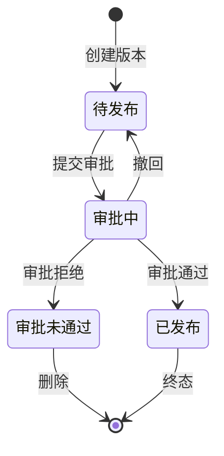

# 开放平台应用管理 - 技术规划与详细设计

## 文档元数据

| 字段 | 内容 |
|------|------|
| Feature ID | APP-MGMT-001 |
| Feature 名称 | 开放平台应用管理 |
| 文档版本 | 2.0 |
| 配套 Demo | `demo-app-list.html`（3963 行） |
| 配套规范 | `spec.md`（15 个核心 FR + FR-016 应用访问控制 + FR-017 应用类型区分 + FR-018 存量个人应用绑定 EAMAP + FR-019 操作审计日志 + FR-020 EAMAP 信息展示） |
| 计划阶段 | plan |
| 优先级 | P1 |
| 状态 | planned |
| 创建日期 | 2026-06-03 |
| 修订日期 | 2026-06-03（v2.0 重构：补全后端设计、整合前后端） |
| 作者 | SDDU 智能规划 |
| 目标读者 | 后端工程师、前端工程师、测试工程师、产品经理 |

---

## 1. 概述

### 1.1 项目背景

开放平台应用管理是企业内部开发者使用开放平台的核心入口。

**核心业务能力**：
- **应用管理**：开发者创建、编辑应用，配置应用凭证、认证方式、EAMAP 服务
- **成员管理**：团队协作，Owner/Admin/Developer 三级权限
- **应用能力**：订阅群置顶、群通知、链接增强等 7 种能力
- **版本管理**：版本创建、发布审批、状态机驱动的版本生命周期

---

## 2. 系统架构

### 2.1 整体架构图

```
┌─────────────────────────────────────────────────────────────────┐
│                          客户端 (Browser)                          │
│  ┌────────────────────────────────────────────────────────────┐ │
│  │  wecodesite/                                                │ │
│  │  React 18 + Ant Design 4 + Axios                          │ │
│  │  ┌──────────┐  ┌──────────┐  ┌──────────┐  ┌──────────┐  │ │
│  │  │  App     │  │ Member   │  │ Ability  │  │ Version  │  │ │
│  │  │  List    │  │  Tab     │  │   Tab    │  │   Tab    │  │ │
│  │  └──────────┘  └──────────┘  └──────────┘  └──────────┘  │ │
│  └────────────────────────────────────────────────────────────┘ │
└───────────────────────────────┬─────────────────────────────────┘
                                │ HTTPS / JSON
                                │
┌───────────────────────────────▼─────────────────────────────────┐
│                        open-server/                              │
│  ┌────────────────────────────────────────────────────────────┐ │
│  │  Java 21 + Spring Boot + MyBatis + Redis                  │ │
│  │  ┌──────────────────────────────────────────────────────┐ │ │
│  │  │  modules/                                             │ │ │
│  │  │  ├── app/        ← 新增（应用管理）                  │ │ │
│  │  │  ├── member/     ← 新增（成员管理）                  │ │ │
│  │  │  ├── ability/    ← 新增（能力管理）                  │ │ │
│  │  │  └── version/    ← 新增（版本管理）                  │ │ │
│  │  └──────────────────────────────────────────────────────┘ │ │
│  │  ┌──────────────────────────────────────────────────────┐ │ │
│  │  │  common/                                              │ │ │
│  │  │  exception / context / interceptor / security / ...   │ │ │
│  │  └──────────────────────────────────────────────────────┘ │ │
│  └────────────────────────────────────────────────────────────┘ │
└───────────────────────────────┬─────────────────────────────────┘
                                │ JDBC / MyBatis
                                │
┌───────────────────────────────▼─────────────────────────────────┐
│                          MySQL                                   │
│  ┌────────────────────────────────────────────────────────────┐ │
│  │  openplatform_app_t                  ← 应用表              │ │
│  │  openplatform_app_member_t          ← 成员表              │ │
│  │  openplatform_app_ability_relation_t ← 能力关联表        │ │
│  │  openplatform_app_version_t         ← 版本表              │ │
│  │  openplatform_app_identity_t        ← 凭证表              │ │
│  │  openplatform_app_p_t               ← 应用属性表（K-V）    │ │
│  └────────────────────────────────────────────────────────────┘ │
│                              ▲                                    │
│                              │                                    │
│  ┌───────────────────────────┴────────────────────────────┐    │
│  │                       Redis                              │    │
│  │  （应用上下文、用户信息等）                              │    │
│  └────────────────────────────────────────────────────────┘    │
└─────────────────────────────────────────────────────────────────┘
```

### 2.2 技术栈

| 类别 | 技术 | 版本 |
|------|------|------|
| 前端框架 | React | 18.2.x |
| 路由 | React Router | 6.20.x |
| UI 库 | Ant Design | 4.24.x |
| HTTP | Axios | 1.6.x |
| 构建 | Vite | 5.0.x |
| 样式 | LESS + CSS Modules | 4.2.x |
| 测试 | Jest | 30.x |

**后端**（`open-server/`）：
- Java 21 + Spring Boot
- MyBatis（持久层）
- Redis（缓存）
- Lombok（简化代码）
- JUnit + Mockito（测试）

**数据库**：
- MySQL（应用表已存在）

**前后端通信**：
- RESTful API
- JSON 格式
- 统一响应格式（`ApiResponse<T>`）

---

## 3. 数据模型

### 3.1 数据库表设计

本功能涉及 9 张表，均在 MySQL 中已存在（参考 `docs/app/app-sql.txt`）。

#### 3.1.1 应用表 `openplatform_app_t`

存储应用基本信息。

```sql
CREATE TABLE `openplatform_app_t` (
  `id` bigint(20) NOT NULL COMMENT '主键（内部 ID）',
  `app_id` varchar(100) NOT NULL COMMENT '应用 ID（外部 ID）',
  `tenant_id` varchar(64) NOT NULL DEFAULT '' COMMENT '租户 id',
  `icon_id` varchar(64) NOT NULL DEFAULT '' COMMENT '图标 id',
  `app_name_cn` varchar(255) NOT NULL COMMENT '应用中文名',
  `app_name_en` varchar(255) NOT NULL COMMENT '应用英文名',
  `app_desc_cn` varchar(2000) NOT NULL DEFAULT '' COMMENT '应用中文描述',
  `app_desc_en` varchar(2000) NOT NULL DEFAULT '' COMMENT '应用英文描述',
  `app_type` tinyint(1) DEFAULT '1' COMMENT '应用类型：0-个人应用 1-业务应用（创建时默认值）',
  `app_sub_type` tinyint(10) DEFAULT '4' COMMENT '应用子类型：0-存量个人应用 1-技能 2-个人助理 3-业务助理 4-业务应用-标准（appType=1时默认值）',
  `status` tinyint DEFAULT '1' COMMENT '状态：0=失效, 1=有效',
  `create_by` varchar(100) DEFAULT NULL,
  `create_time` datetime(3) DEFAULT CURRENT_TIMESTAMP(3),
  `last_update_by` varchar(100) DEFAULT NULL,
  `last_update_time` datetime(3) DEFAULT CURRENT_TIMESTAMP(3) ON UPDATE CURRENT_TIMESTAMP(3),
  PRIMARY KEY (`id`),
  UNIQUE KEY `uniq_app_id` (`app_id`),
  UNIQUE KEY `uniq_name_cn` (`app_name_cn`),
  UNIQUE KEY `uniq_name_en` (`app_name_en`)
) ENGINE=InnoDB COMMENT='应用表';
```

#### 3.1.2 应用属性表 `openplatform_app_p_t`

K-V 扩展表，存储应用的自定义属性。

```sql
CREATE TABLE `openplatform_app_p_t` (
  `id` bigint(20) NOT NULL,
  `parent_id` bigint(20) NOT NULL COMMENT '应用主键 ID',
  `property_name` varchar(255) NOT NULL,
  `property_value` varchar(2000) NOT NULL DEFAULT '',
  `tenant_id` varchar(64) NOT NULL DEFAULT '',
  `status` tinyint DEFAULT '1',
  `create_by` varchar(100) DEFAULT NULL,
  `create_time` datetime(3) DEFAULT CURRENT_TIMESTAMP(3),
  `last_update_by` varchar(100) DEFAULT NULL,
  `last_update_time` datetime(3) DEFAULT CURRENT_TIMESTAMP(3) ON UPDATE CURRENT_TIMESTAMP(3),
  PRIMARY KEY (`id`),
  KEY `idx_parent_id` (`parent_id`)
) ENGINE=InnoDB COMMENT='应用属性表';
```

**预定义属性**（property_name 枚举）：

| property_name | 说明 | 取值 |
|---------------|------|------|
| `eamap_app_code` | eamap 的编码 | 业务应用绑定的 EAMAP 编码 |
| `verify_type` | 认证方式 | 0-Cookie，1-SOAHeader，2-数字签名，3-SOAURL，**4-APIG** |
| `api_secret` | 数字签名的 apiSecret（仅 verify_type=2 时使用，**密文存储**） | 16 位字母数字（加密后存储） |
| `diagram_id_list` | 应用示意图（功能示意图） | JSON 数组（元素含 `fileId`、`url`），存储时序列化 |

#### 3.1.3 成员表 `openplatform_app_member_t`

存储应用成员（与角色）。

```sql
CREATE TABLE `openplatform_app_member_t` (
  `id` bigint(20) NOT NULL COMMENT '主键',
  `app_id` bigint(20) NOT NULL COMMENT '应用主键 ID',
  `member_name_cn` varchar(255) NOT NULL,
  `member_name_en` varchar(255) NOT NULL,
  `account_id` varchar(255) NOT NULL DEFAULT '' COMMENT '成员账号 id',
  `member_type` TINYINT(1) DEFAULT '0' COMMENT '成员类型: 0=开发者 1=owner 2:管理员',
  `status` tinyint DEFAULT '1',
  `create_by` varchar(100) DEFAULT NULL,
  `create_time` datetime(3) DEFAULT CURRENT_TIMESTAMP(3),
  `last_update_by` varchar(100) DEFAULT NULL,
  `last_update_time` datetime(3) DEFAULT CURRENT_TIMESTAMP(3) ON UPDATE CURRENT_TIMESTAMP(3),
  PRIMARY KEY (`id`),
  KEY `idx_app_id` (`app_id`)
) ENGINE=InnoDB COMMENT='应用成员表';
```

#### 3.1.4 能力主表 `openplatform_ability_t`

存储能力定义（哪些能力可被应用订阅）。

```sql
CREATE TABLE `openplatform_ability_t` (
  `id` bigint(20) NOT NULL COMMENT '主键',
  `ability_name_cn` varchar(255) NOT NULL COMMENT '能力中文名',
  `ability_name_en` varchar(255) NOT NULL COMMENT '能力英文名',
  `ability_desc_cn` varchar(2000) NOT NULL DEFAULT '' COMMENT '能力中文描述',
  `ability_desc_en` varchar(2000) NOT NULL DEFAULT '' COMMENT '能力英文描述',
  `ability_type` TINYINT(1) NOT NULL DEFAULT '0' COMMENT '能力类型 1-群置顶 2-群通知 3-链接增强 4-点对点通知 5-we码 6-应用入群通知 7-助手广场卡片',
  `order_num` int(11) NOT NULL COMMENT '序号',
  `status` tinyint DEFAULT '1' COMMENT '状态：0=失效, 1=有效',
  `create_by` varchar(100) DEFAULT NULL,
  `create_time` datetime(3) DEFAULT CURRENT_TIMESTAMP(3),
  `last_update_by` varchar(100) DEFAULT NULL,
  `last_update_time` datetime(3) DEFAULT CURRENT_TIMESTAMP(3) ON UPDATE CURRENT_TIMESTAMP(3),
  PRIMARY KEY (`id`),
  KEY `idx_ability_type` (`ability_type`)
) ENGINE=InnoDB COMMENT='能力表';
```

#### 3.1.5 能力属性表 `openplatform_ability_p_t`

K-V 扩展表，存储能力的额外配置属性。

```sql
CREATE TABLE `openplatform_ability_p_t` (
  `id` bigint(20) NOT NULL,
  `parent_id` bigint(20) NOT NULL COMMENT '能力 id',
  `property_name` varchar(255) NOT NULL,
  `property_value` varchar(2000) NOT NULL DEFAULT '',
  `status` tinyint DEFAULT '1',
  `create_by` varchar(100) DEFAULT NULL,
  `create_time` datetime(3) DEFAULT CURRENT_TIMESTAMP(3),
  `last_update_by` varchar(100) DEFAULT NULL,
  `last_update_time` datetime(3) DEFAULT CURRENT_TIMESTAMP(3) ON UPDATE CURRENT_TIMESTAMP(3),
  PRIMARY KEY (`id`),
  KEY `idx_parent_id` (`parent_id`)
) ENGINE=InnoDB COMMENT='能力属性表';
```

**预定义属性**（property_name 枚举）：

| property_name | 说明 | 取值 |
|---------------|------|------|
| `icon` | 能力图标 | fileId |
| `example_diagram` | 能力示意图（示例） | fileId（多个用逗号分隔） |

#### 3.1.6 应用能力关联表 `openplatform_app_ability_relation_t`

存储应用订阅了哪些能力。

```sql
CREATE TABLE `openplatform_app_ability_relation_t` (
  `id` bigint(20) NOT NULL,
  `app_id` bigint(20) NOT NULL COMMENT '应用主键 id',
  `ability_id` bigint(20) NOT NULL COMMENT '能力主键 id',
  `ability_type` tinyint(1) NOT NULL DEFAULT '0' COMMENT '能力类型 1-群置顶 2-群通知 3-链接增强 4-点对点通知 5-we码 6-应用入群通知 7-助手广场卡片',
  `tenant_id` varchar(64) NOT NULL DEFAULT '',
  `status` tinyint DEFAULT '1',
  `create_by` varchar(100) DEFAULT NULL,
  `create_time` datetime(3) DEFAULT CURRENT_TIMESTAMP(3),
  `last_update_by` varchar(100) DEFAULT NULL,
  `last_update_time` datetime(3) DEFAULT CURRENT_TIMESTAMP(3) ON UPDATE CURRENT_TIMESTAMP(3),
  PRIMARY KEY (`id`),
  UNIQUE KEY `uniq_app_ability_id` (`app_id`, `ability_id`),
  KEY `idx_app_id` (`app_id`)
) ENGINE=InnoDB COMMENT='应用能力关联表';
```

#### 3.1.7 凭证表 `openplatform_app_identity_t`

存储应用的 APPID / Key / Secret 等凭证信息。

```sql
CREATE TABLE `openplatform_app_identity_t` (
  `id` bigint(20) NOT NULL,
  `app_id` bigint(20) NOT NULL,
  `public_key` varchar(2000) DEFAULT NULL,
  `private_key` varchar(2000) NOT NULL DEFAULT '',
  `key_version` varchar(50) NOT NULL DEFAULT '',
  `kit_version` varchar(50) NOT NULL DEFAULT '',
  `ak` varchar(255) DEFAULT NULL,
  `tenant_id` varchar(64) NOT NULL DEFAULT '',
  `status` tinyint DEFAULT '1',
  `create_by` varchar(100) DEFAULT NULL,
  `create_time` datetime(3) DEFAULT CURRENT_TIMESTAMP(3),
  `last_update_by` varchar(100) DEFAULT NULL,
  `last_update_time` datetime(3) DEFAULT CURRENT_TIMESTAMP(3) ON UPDATE CURRENT_TIMESTAMP(3),
  PRIMARY KEY (`id`),
  KEY `idx_appid_keyversion_status` (`app_id`, `key_version`, `status`),
  KEY `idx_ak` (`ak`)
) ENGINE=InnoDB COMMENT='应用凭证表';
```

#### 3.1.8 版本表 `openplatform_app_version_t`

存储版本信息。

```sql
CREATE TABLE `openplatform_app_version_t` (
  `id` bigint(20) NOT NULL,
  `app_id` bigint(20) NOT NULL,
  `version_desc_cn` varchar(2000) DEFAULT NULL,
  `version_desc_en` varchar(2000) DEFAULT NULL,
  `version_code` varchar(100) NOT NULL COMMENT '版本号（x.x.x）',
  `tenant_id` varchar(64) NOT NULL DEFAULT '',
  `status` tinyint DEFAULT '1' COMMENT '版本状态：1-待发布 2-审批中 3-审批未通过 4-已发布',
  `create_by` varchar(100) DEFAULT NULL,
  `create_time` datetime(3) DEFAULT CURRENT_TIMESTAMP(3),
  `last_update_by` varchar(100) DEFAULT NULL,
  `last_update_time` datetime(3) DEFAULT CURRENT_TIMESTAMP(3) ON UPDATE CURRENT_TIMESTAMP(3),
  PRIMARY KEY (`id`),
  KEY `idx_app_id` (`app_id`)
) ENGINE=InnoDB COMMENT='应用版本表';
```

#### 3.1.9 版本属性表 `openplatform_app_version_p_t`

K-V 扩展表，存储版本的额外属性。

```sql
CREATE TABLE `openplatform_app_version_p_t` (
  `id` bigint(20) NOT NULL,
  `parent_id` bigint(20) NOT NULL COMMENT '版本主键 id',
  `property_name` varchar(255) DEFAULT NULL,
  `property_value` varchar(2000) NOT NULL DEFAULT '',
  `tenant_id` varchar(64) NOT NULL DEFAULT '',
  `status` tinyint DEFAULT '1',
  `create_by` varchar(100) DEFAULT NULL,
  `create_time` datetime(3) DEFAULT CURRENT_TIMESTAMP(3),
  `last_update_by` varchar(100) DEFAULT NULL,
  `last_update_time` datetime(3) DEFAULT CURRENT_TIMESTAMP(3) ON UPDATE CURRENT_TIMESTAMP(3),
  PRIMARY KEY (`id`),
  KEY `idx_parent_id` (`parent_id`)
) ENGINE=InnoDB COMMENT='版本属性表';
```

**预定义属性**（property_name 枚举）：

| property_name | 说明 | 取值 |
|---------------|------|------|
| `abilityIds` | 当前版本订阅的能力 id 列表 | 能力 id（多个用逗号隔开，如 `1,3,5`） |

### 3.3 索引设计

#### 3.3.1 `openplatform_app_t`（应用表）

| 索引 | 字段 | 用途 |
|------|------|------|
| PRIMARY KEY | `id` | 主键 |
| UNIQUE | `app_id` | 业务 ID 唯一 |
| UNIQUE | `app_name_cn` | 中文名唯一 |
| UNIQUE | `app_name_en` | 英文名唯一 |
| 普通索引 | `tenant_id` | 多租户查询 |

#### 3.3.2 `openplatform_app_p_t`（应用属性表）

| 索引 | 字段 | 用途 |
|------|------|------|
| PRIMARY KEY | `id` | 主键 |
| 普通索引 | `parent_id` | 属性查询 |

#### 3.3.3 `openplatform_app_member_t`（成员表）

| 索引 | 字段 | 用途 |
|------|------|------|
| PRIMARY KEY | `id` | 主键 |
| 普通索引 | `app_id` | 成员查询 |
| 复合索引 | `account_id, app_id` | 1.4 应用列表：覆盖 `account_id` 查询 + JOIN `app_id` |

> **多角色设计**：**同一成员可在同一应用下拥有多个角色**（如同时是 Owner + 管理员），对应 `openplatform_app_member_t` 中**多条记录**（每条一个 `member_type`）。`PRIMARY KEY id` 是成员记录主键，不是成员账号主键；`account_id` + `member_type` 组合才唯一。**故意不加 `(app_id, account_id)` 唯一索引**——那会与"多角色"业务规则冲突。

#### 3.3.4 `openplatform_ability_t`（能力主表）

| 索引 | 字段 | 用途 |
|------|------|------|
| PRIMARY KEY | `id` | 主键 |
| 普通索引 | `ability_type` | 能力类型查询 |

#### 3.3.5 `openplatform_ability_p_t`（能力属性表）

| 索引 | 字段 | 用途 |
|------|------|------|
| PRIMARY KEY | `id` | 主键 |
| 普通索引 | `parent_id` | 属性查询 |

#### 3.3.6 `openplatform_app_ability_relation_t`（应用能力关联表）

| 索引 | 字段 | 用途 |
|------|------|------|
| PRIMARY KEY | `id` | 主键 |
| UNIQUE | `(app_id, ability_id)` | 能力唯一 |
| 普通索引 | `app_id` | 应用能力查询 |

#### 3.3.7 `openplatform_app_identity_t`（凭证表）

| 索引 | 字段 | 用途 |
|------|------|------|
| PRIMARY KEY | `id` | 主键 |
| 复合索引 | `(app_id, key_version, status)` | 凭证查询 |
| 普通索引 | `ak` | AK 查询 |

#### 3.3.8 `openplatform_app_version_t`（版本表）

| 索引 | 字段 | 用途 |
|------|------|------|
| PRIMARY KEY | `id` | 主键 |
| 普通索引 | `app_id` | 版本查询 |

#### 3.3.9 `openplatform_app_version_p_t`（版本属性表）

| 索引 | 字段 | 用途 |
|------|------|------|
| PRIMARY KEY | `id` | 主键 |
| 普通索引 | `parent_id` | 属性查询 |

---

## 4. 后端设计

### 4.1 后端目录结构

#### 4.1.1 整体结构（`open-server/`）

```
open-server/
├── pom.xml
├── src/
│   ├── main/
│   │   ├── java/com/xxx/it/works/wecode/v2/
│   │   │   ├── OpenServerApplication.java        # 启动类
│   │   │   ├── common/                          # 公共部分（已有，复用）
│   │   │   └── modules/                         # 业务模块
│   │   └── resources/
│   │       ├── application.yml                  # 主配置
│   │       ├── application-dev.yml              # 开发环境
│   │       ├── application-prod.yml             # 生产环境
│   │       └── mapper/                          # MyBatis XML
│   └── test/
│       └── java/                                # 单元测试
```

#### 4.1.2 新增功能落点

本功能涉及 4 个业务模块，在 `modules/` 下**平级**新增 3 个子模块 + 在已有 `app/` 模块下**新增业务代码**。

每个子模块采用统一结构：`controller/`, `service/`, `mapper/`, `entity/`, `dto/`。

```
modules/
├── app/                  ← 应用管理（已有 resolver，新增业务代码）
│   ├── resolver/         ← 已有（AppContext、AppContextResolver、AppAccessException、impl）
│   ├── controller/AppController.java      ← 新增
│   ├── service/AppService.java            ← 新增
│   ├── mapper/AppMapper.java              ← 新增
│   ├── entity/App.java                    ← 新增
│   └── dto/
│       ├── CreateAppRequest.java         ← 新增
│       ├── UpdateAppRequest.java         ← 新增
│       ├── AppResponse.java              ← 新增
│       ├── UpdateVerifyTypeRequest.java  ← 新增
│       └── EamapResponse.java            ← 新增
├── member/               ← 新增子模块（成员管理）
│   ├── controller/MemberController.java
│   ├── service/MemberService.java
│   ├── mapper/AppMemberMapper.java
│   ├── entity/AppMember.java
│   └── dto/
│       ├── AddMemberRequest.java
│       └── TransferOwnerRequest.java
├── ability/              ← 新增子模块（能力管理）
│   ├── controller/AbilityController.java
│   ├── service/AbilityService.java
│   ├── mapper/AppAbilityRelationMapper.java
│   ├── entity/AppAbilityRelation.java
│   └── dto/
└── version/              ← 新增子模块（版本管理）
    ├── controller/VersionController.java
    ├── service/VersionService.java
    ├── mapper/AppVersionMapper.java
    ├── entity/AppVersion.java
    └── dto/
        ├── CreateVersionRequest.java
        └── UpdateVersionRequest.java
```

### 4.2 核心业务实现

#### 4.2.0 应用权限校验统一约定

**适用范围**：除 1.1（创建应用）、1.4（应用列表）、1.5（EAMAP 列表）外，所有针对具体应用的操作接口（1.2、1.3、1.7、1.8、1.9、1.10、1.11、2.x、3.x、4.x）均遵循以下约定：

1. **REST URL 必须包含 `appId`**（路径参数或请求体），用于定位目标应用
2. **Service 方法入口统一调用 `appContextResolver.resolveAndValidate(appId)`**，自动完成：
   - ID 转换：外部 `appId`（字符串） → 内部 `internalId`（Long）
   - 成员资格校验：当前用户必须是 `appId` 对应应用的成员（非成员抛 `403100`）

**全局错误码**：

| 错误码 | 中文消息 | 触发场景 |
|--------|---------|---------|
| `404100` | 应用不存在 | appId 无效 |
| `403100` | 无权访问应用 | 当前用户不是应用成员 |

#### 4.2.1 AppService

**位置**：`modules/app/service/AppService.java`

**应用类型与权限**：

| `app_type` | 类型 | 侧边栏显示 |
|:----------:|------|----------|
| 0 | 个人应用 | 仅"凭证与基础信息" |
| 1 | 业务应用 | 全部 4 个 Tab |

**关键点**：
- 应用类型**不可变更**（由 `app_type` 字段标识，数据库 + 后端无更新 API）
- 前端通过 `app_type` 字段决定侧边栏菜单
- 后端按 `app_type` 决定 Tab 路径的访问权限

**职责**：
- 应用 CRUD（创建/查询/更新/列表）
- 认证方式更新（**多选** Cookie / 数字签名 / SOAHeader / SOAURL / **APIG**）
- EAMAP 列表查询（前端创建应用时下拉选择）

---

##### 接口 1.1：创建应用

**REST**：`POST /service/open/v2/app`

**作用**：开发者创建新的 WeLink 应用。自动生成 APPID/Key/Secret，自动创建 Owner 成员记录。

**入参**：（`CreateAppRequest`）：

| 字段 | 类型 | 必填 | 说明 |
|------|------|:----:|------|
| `nameCn` | `string` | ✅ | 应用中文名，≤255 字符，全局唯一；**达到上限阻止继续输入**（不弹错） |
| `nameEn` | `string` | ✅ | 应用英文名，≤255 字符，全局唯一；**达到上限阻止继续输入**（不弹错） |
| `iconId` | `string` | ✅ | 应用图标 ID；来源二选一：<br>① **默认图标列表** — 系统预置若干图标供选择（接口 1.6）<br>② **自定义上传** — 用户上传 128×128px PNG/JPG/JPEG 图片，≤100KB，后端返回 fileId（接口 1.12, `bizType=1`） |
| `eamapAppCode` | `string` | ✅ | EAMAP 编码（业务应用必绑） |
| `descCn` | `string` | - | 应用中文描述，≤2000 字符；**达到上限阻止继续输入** |
| `descEn` | `string` | - | 应用英文描述，≤2000 字符；**达到上限阻止继续输入** |

**默认值**（系统自动设置）：

| 字段 | 默认值 | 说明 |
|------|--------|------|
| `appType` | 1 | 业务应用（创建时默认为业务应用） |
| `appSubType` | 4 | 业务应用-标准子类型 |
| `verifyType` | 0 | Cookie（认证方式默认为 Cookie）— **多值以逗号分隔存储**，如 `'0,2'` 表示 Cookie+数字签名 |
| `status` | 1 | 有效 |

> 说明：`apiSecret` 不在 1.1 设置，由"更新认证方式"接口（1.7）单独配置。

**出参**：`CreateAppVO`

**执行逻辑**：

| # | 步骤 | 类型 | 说明 / 错误码 |
|---|------|------|--------------|
| 1 | 校验 `nameCn` / `nameEn` 唯一性 | 校验 | `409100` |
| 2 | 校验 `eamapAppCode` 存在 | 校验 | `400103`（业务应用必绑 EAMAP） |
| 3 | 校验当前用户是 `eamapAppCode` 对应 EAMAP 的 owner | 校验 | `403104`（调用预留 EAMAP owner 校验方法） |
| 4 | 校验 `eamapAppCode` 未被其他应用绑定 | 校验 | `409102`（一码一应用） |
| 5 | 字段约束校验（长度、格式等） | 校验 | `400100` |
| 6 | 生成 `appId`（外部 ID，业务唯一） | 计算 | - |
| 7 | 事务开始 | - | - |
| 7.1 | 插入 `openplatform_app_t`（`appType=1`、`appSubType=4`、`verifyType=0`，`diagram_id_list` 为空） | 写入 | - |
| 7.2 | 插入 `openplatform_app_member_t`（创建者成为 Owner） | 写入 | - |
| 7.3 | 调用预留凭证保存方法，保存凭证表 | 调用 | - |
| 7.4 | 插入 `openplatform_app_p_t`（`verify_type='0'`、`eamap_app_code`）— verify_type 存储为逗号分隔字符串（**多选**） | 写入 | - |
| 8 | 事务提交 | - | - |
| 9 | 调用预留发送事件方法，通知卡片服务 | 调用 | `500101`（事件失败不影响主流程） |
| 10 | 返回 `appId` | 返回 | - |

**权限要求**：登录用户 + 当前用户必须是 `eamapAppCode` 对应 EAMAP 的 owner

**相关表**：`openplatform_app_t`、`openplatform_app_member_t`、`openplatform_app_identity_t`、`openplatform_app_p_t`

**错误码**：
- `409100`（应用名称已存在）
- `400100`（应用参数错误）
- `409102`（EAMAP 已被其他应用绑定）
- `400103`（EAMAP 编码不存在）
- `403104`（当前用户不是 EAMAP 的 owner）
- `400101`（图标 ID 不存在）
- `401`（未登录）
- `500`（系统异常）

**说明**：
- 创建时默认为**业务应用**（`appType=1`）
- 必须传入 `eamapAppCode`（业务应用必绑 EAMAP）
- 一个 EAMAP 编码**只能被一个应用绑定**，重复绑定返回 `409102`
- 认证方式默认为 **Cookie**（`verifyType=0`），**支持多选**（如 `verifyType='0,2'` 表示 Cookie+数字签名）。如需切换/增加，通过"更新认证方式"接口（接口 1.7）单独设置
- `appSubType=4`（业务应用-标准子类型）由系统自动设置
- `diagram_id_list` **创建时不设置**，保持为空，后续通过"更新应用"接口（1.2）补充
- 凭证表（`openplatform_app_identity_t`）由预留方法保存
- 事务提交后调用**预留发送事件方法**，通知卡片服务（事件失败不影响主流程）
- 创建者必须是 `eamapAppCode` 对应 EAMAP 的 owner（调用预留校验方法）

**入参示例**：

```json
POST /service/open/v2/app
Content-Type: application/json

{
  "nameCn": "WeLink 智能助手",
  "nameEn": "WeLink Smart Assistant",
  "iconId": "icon_abc123",
  "eamapAppCode": "eamap_workflow_001",
  "descCn": "基于 WeLink 平台的智能工作助手",
  "descEn": "Intelligent work assistant based on WeLink platform"
}
```

**出参示例**：

```json
{
  "code": "200",
  "messageZh": "成功",
  "messageEn": "success",
  "data": {
    "appId": "app_20260603_xyz789"
  }
}
```

> 说明：创建成功后仅返回 `appId`，前端拿到 `appId` 后跳转详情页时再调用"获取应用详情"接口（1.3）拉取完整数据。

**错误响应示例**：

```json
{
  "code": "409305",
  "messageZh": "仅待发布或审批未通过版本可删除: status=2（审批中）",
  "messageEn": "Only pending or rejected versions can be deleted: status=2 (Under Review)",
  "data": null
}
```

---

##### 接口 1.2：更新应用

**REST**：`PUT /service/open/v2/app/{appId}`

**作用**：更新应用基本信息（中文名/英文名/描述/图标）。

**入参**：：

| 字段 | 类型 | 必填 | 说明 |
|------|------|:----:|------|
| `appId` | `string` | ✅ | 应用 ID |
| `nameCn` | `string` | ✅ | 应用中文名，≤255 字符，全局唯一；**达到上限阻止继续输入**（不弹错） |
| `nameEn` | `string` | ✅ | 应用英文名，≤255 字符，全局唯一；**达到上限阻止继续输入**（不弹错） |
| `iconId` | `string` | ✅ | 应用图标 ID；来源二选一：<br>① **默认图标列表** — 系统预置若干图标供选择（接口 1.6）<br>② **自定义上传** — 用户上传 128×128px PNG/JPG/JPEG 图片，≤100KB，后端返回 fileId（接口 1.12, `bizType=1`） |
| `descCn` | `string` | - | 应用中文描述，≤2000 字符；**达到上限阻止继续输入** |
| `descEn` | `string` | - | 应用英文描述，≤2000 字符；**达到上限阻止继续输入** |
| `diagramIdList` | `string[]` | - | 功能示意图文件 ID 列表（前端只传 ID，后端解析 URL） |

**出参**：data 为空

**执行逻辑**：

| # | 步骤 | 类型 | 错误码 |
|---|------|------|--------|
| 1 | 校验 `appId` 存在 | 校验 | `404100` |
| 2 | 校验操作人是否应用成员 | 校验 | `403100`（非成员无权访问） |
| 3 | 校验 `nameCn` / `nameEn` 唯一性 | 校验 | `409100` |
| 4 | 字段约束校验 | 校验 | `400100` |
| 5 | 事务开始 | - | - |
| 5.1 | 更新 `openplatform_app_t` | 写入 | - |
| 5.2 | 解析 `diagramIdList` 各文件 ID 为 `FileVO`，序列化为 JSON 数组，写入 `openplatform_app_p_t.diagram_id_list` | 写入 | - |
| 6 | 事务提交 | - | - |
| 7 | 调用预留发送事件方法，通知卡片服务应用已更新 | 调用 | `500101`（事件失败不影响主流程） |

**权限要求**：操作人必须是该 `appId` 对应应用的成员

**错误码**：
- `404100`（应用不存在）
- `403100`（无权访问）
- `409100`（应用名称已存在）
- `400100`（应用参数错误）
- `400101`（图标 ID 不存在）
- `401`（未登录）
- `403`（无操作权限）
- `500`（系统异常）

**入参示例**：

```json
PUT /service/open/v2/app/app_20260603_xyz789
Content-Type: application/json

{
  "nameCn": "WeLink 智能助手 v2",
  "nameEn": "WeLink Smart Assistant v2",
  "iconId": "icon_abc123",
  "descCn": "升级版智能工作助手",
  "descEn": "Upgraded intelligent work assistant",
  "diagramIdList": ["file_diagram_001", "file_diagram_002"]
}
```

> 说明：`nameCn`、`nameEn`、`iconId` 均为必填；`descCn`、`descEn`、`diagramIdList` 可选。

**出参示例**：

```json
{
  "code": "200",
  "messageZh": "成功",
  "messageEn": "success",
  "data": null
}
```

> 说明：data 为空，前端需要时再调用"获取应用详情"接口（1.3）拉取最新数据。

**错误响应示例**：

```json
{
  "code": "409100",
  "messageZh": "应用英文名已存在: WeLink Smart Assistant",
  "messageEn": "Application English name already exists: WeLink Smart Assistant",
  "data": null
}
```

---

##### 接口 1.3：获取应用基本信息

**REST**：`GET /service/open/v2/app/{appId}`

**作用**：获取应用的**基本信息**（不包含应用凭证、认证方式，这些由独立接口提供）。

**出参**：`AppBasicInfoVO`

| 字段 | 类型 | 说明 |
|------|------|------|
| `appId` | `string` | 应用 ID |
| `nameCn` | `string` | 应用中文名 |
| `nameEn` | `string` | 应用英文名 |
| `icon` | `FileVO` | 应用图标（对象，含 `fileId` + `url`） |
| `descCn` | `string` | 应用中文描述 |
| `descEn` | `string` | 应用英文描述 |
| `appType` | `int` | 应用类型（1=业务应用，0=个人应用） |
| `appSubType` | `int` | 应用子类型 |
| `status` | `int` | 状态（1=有效，0=失效） |
| `eamapAppCode` | `string` | EAMAP 编码 |
| `eamapAppName` | `string` | EAMAP 名称（用于前端 AppHeader 展示「已绑定: EAMAP名称 EAMAP_CODE」，从 EAMAP 服务查询） |
| `diagramIdList` | `FileVO[]` | 功能示意图列表（元素含 `fileId` + `url`） |
| `createBy` | `string` | 创建者账号 |
| `createTime` | `string` | 创建时间（ISO 8601） |
| `lastUpdateBy` | `string` | 最后更新者账号 |
| `lastUpdateTime` | `string` | 最后更新时间（ISO 8601） |

**`FileVO` 通用文件值对象**（`common/model/FileVO.java`）：

| 字段 | 类型 | 说明 |
|------|------|------|
| `fileId` | `string` | 文件 ID（来自图标库 / 资源库） |
| `url` | `string` | 文件访问 URL |

**执行逻辑**：

| # | 步骤 | 说明 | 错误码 |
|---|------|------|--------|
| 1 | 校验当前用户是否为应用成员 | 通过 `appContextResolver.resolveAndValidate(appId)` 完成 | `403100` |
| 2 | 查询应用主表 | 读取应用基础信息（无记录则 `404100`） | `404100` |
| 3 | 查询应用属性表 | 读取 EAMAP 编码、示意图列表 | - |
| 4 | 字段补全与格式转换 | 调用文件服务根据 `iconId` 与 `diagram_id_list` 中各 fileId 获取 URL，反序列化为 `FileVO[]`；若 `eamapAppCode` 非空，调用 EAMAP 服务查询 `eamapAppName`；时间字段格式化为 `yyyy-MM-dd HH:mm:ss` | - |
| 5 | 返回 `AppBasicInfoVO` | 拼装响应数据 | - |

**权限要求**：操作人必须是该 `appId` 对应应用的成员

**错误码**：
- `404100`（应用不存在）
- `403100`（无权访问）
- `401`（未登录）
- `500`（系统异常）

**入参示例**：

```json
GET /service/open/v2/app/app_20260603_xyz789
```

**出参示例**：

```json
{
  "code": "200",
  "messageZh": "成功",
  "messageEn": "success",
  "data": {
    "appId": "app_20260603_xyz789",
    "nameCn": "WeLink 智能助手",
    "nameEn": "WeLink Smart Assistant",
    "icon": {
      "fileId": "icon_abc123",
      "url": "https://cdn.example.com/icons/icon_abc123.png"
    },
    "descCn": "基于 WeLink 平台的智能工作助手",
    "descEn": "Intelligent work assistant based on WeLink platform",
    "appType": 1,
    "appSubType": 4,
    "status": 1,
    "eamapAppCode": "eamap_workflow_001",
    "eamapAppName": "工作流引擎",
    "diagramIdList": [
      {
        "fileId": "file_diagram_001",
        "url": "https://cdn.example.com/diagrams/diagram_001.png"
      },
      {
        "fileId": "file_diagram_002",
        "url": "https://cdn.example.com/diagrams/diagram_002.png"
      }
    ],
    "createBy": "user_10001",
    "createTime": "2026-06-03 10:30:00",
    "lastUpdateBy": "user_10001",
    "lastUpdateTime": "2026-06-03 10:30:00"
  }
}
```

> 说明：本接口不返回凭证（APPID/Key/Secret）和认证方式（verifyType），由 1.8 和 1.9 独立接口提供。

**错误响应示例**：

```json
{
  "code": "403100",
  "messageZh": "无权访问应用: app_20260603_xyz789",
  "messageEn": "No access to the application: app_20260603_xyz789",
  "data": null
}
```

---

##### 接口 1.4：获取应用列表

**REST**：`GET /service/open/v2/app?curPage=1&pageSize=10`

**作用**：分页查询当前用户有权限的应用列表。

**入参**：（查询参数）：

| 字段 | 类型 | 必填 | 说明 |
|------|------|:----:|------|
| `curPage` | `int` | ✅ | 当前页码（从 1 开始） |
| `pageSize` | `int` | ✅ | 每页条数（10/20/50） |

**出参**：`ApiResponse<AppListItemVO[]>`

| 字段 | 类型 | 说明 |
|------|------|------|
| `code` | `string` | 响应码 |
| `messageZh` | `string` | 中文消息 |
| `messageEn` | `string` | 英文消息 |
| `data` | `AppListItemVO[]` | 应用列表 |
| `page` | `PageResponse` | 分页信息 |
| `page.curPage` | `int` | 当前页码 |
| `page.pageSize` | `int` | 每页条数 |
| `page.total` | `int` | 总记录数 |
| `page.totalPages` | `int` | 总页数 |
| `data[].appId` | `string` | 应用 ID |
| `data[].nameCn` | `string` | 应用中文名 |
| `data[].nameEn` | `string` | 应用英文名 |
| `data[].icon` | `FileVO` | 应用图标（单个对象，含 `fileId` + `url`） |
| `data[].appType` | `int` | 应用类型（1=业务应用，0=个人应用） |
| `data[].appSubType` | `int` | 应用子类型 |
| `data[].status` | `int` | 状态（1=有效，0=失效） |
| `data[].eamapBound` | `boolean` | 是否已绑定 EAMAP（`eamapAppCode` 非空则为 `true`） |
| `data[].owner` | `EmployeeInfoVO` | 所有者信息（含 welinkId / w3Account / memberNameCn / memberNameEn） |
| `data[].currentUserRole` | `int` | 当前用户在该应用的角色（按数据库 `member_type` 枚举：0=Developer，1=Owner，2=Admin） |
| `data[].lastUpdateTime` | `string` | 最后更新时间（ISO 8601） |

**`EmployeeInfoVO` 员工信息**（`common/vo/EmployeeInfoVO.java`，由三方员工服务提供 + Caffeine 缓存）：

| 字段 | 类型 | 说明 |
|------|------|------|
| `welinkId` | `string` | WeLink 账号 ID |
| `w3Account` | `string` | W3 工号 |
| `memberNameCn` | `string` | 中文名 |
| `memberNameEn` | `string` | 英文名 |
| `deptName` | `string` | 部门名称 |

**执行逻辑**：

| # | 步骤 | 类型 | 说明 |
|---|------|------|------|
| 1 | 按 `tenantId` 过滤 | 查询 | 多租户隔离 |
| 2 | 按 `accountId` 在 `openplatform_app_member_t` 中查用户有权限的应用 | 查询 | - |
| 3 | 按 `last_update_time` 倒序 | 排序 | - |
| 4 | 批量取 Owner 员工信息（含 w3 账户、姓名） | 调用 | `EmployeeService.batchGet(welinkIds)`，走 Caffeine 缓存 |
| 5 | 批量取应用图标 URL | 调用 | `FileService.batchGet(iconIds)`，走 Caffeine 缓存 |
| 6 | 分页返回 | 返回 | - |

**权限要求**：登录用户

**错误码**：
- `401`（未登录）
- `500`（系统异常）

**入参示例**：

```json
GET /service/open/v2/app?curPage=1&pageSize=10
```

**出参示例**：

```json
{
  "code": "200",
  "messageZh": "成功",
  "messageEn": "success",
  "data": [
    {
      "appId": "app_20260603_xyz789",
      "nameCn": "WeLink 智能助手",
      "nameEn": "WeLink Smart Assistant",
      "icon": {
        "fileId": "icon_abc123",
        "url": "https://cdn.example.com/icons/abc123.png"
      },
      "appType": 1,
      "appSubType": 4,
      "status": 1,
      "eamapBound": true,
      "owner": {
        "welinkId": "user_10001",
        "w3Account": "E10001",
        "memberNameCn": "张三",
        "memberNameEn": "Zhang San"
      },
      "currentUserRole": 0,
      "lastUpdateTime": "2026-06-03 10:30:00"
    },
    {
      "appId": "app_20260520_abc456",
      "nameCn": "智能审批",
      "nameEn": "Smart Approval",
      "icon": {
        "fileId": "icon_def456",
        "url": "https://cdn.example.com/icons/def456.png"
      },
      "appType": 1,
      "appSubType": 4,
      "status": 1,
      "eamapBound": true,
      "owner": {
        "welinkId": "user_20002",
        "w3Account": "E20002",
        "memberNameCn": "李四",
        "memberNameEn": "Li Si"
      },
      "currentUserRole": 1,
      "lastUpdateTime": "2026-05-20 16:00:00"
    }
  ],
  "page": {
    "curPage": 1,
    "pageSize": 10,
    "total": 2,
    "totalPages": 1
  }
}
```

**错误响应示例**：

```json
{
  "code": "401",
  "messageZh": "未登录",
  "messageEn": "Unauthorized",
  "data": null
}
```

##### 接口 1.5：获取 EAMAP 列表

**REST**：`GET /service/open/v2/app/eamap?curPage=1&pageSize=20`

**作用**：分页获取可用 EAMAP 服务列表，供前端"创建应用/绑定 EAMAP"时下拉选择。

**入参**：（查询参数）：

| 字段 | 类型 | 必填 | 说明 |
|------|------|:----:|------|
| `curPage` | `int` | ✅ | 当前页码（从 1 开始） |
| `pageSize` | `int` | ✅ | 每页条数（10/20/50） |

**出参**：`ApiResponse<EamapVO[]>`

| 字段 | 类型 | 说明 |
|------|------|------|
| `code` | `string` | 响应码 |
| `messageZh` | `string` | 中文消息 |
| `messageEn` | `string` | 英文消息 |
| `data` | `EamapVO[]` | EAMAP 列表 |
| `page` | `PageResponse` | 分页信息 |
| `page.curPage` | `int` | 当前页码 |
| `page.pageSize` | `int` | 每页条数 |
| `page.total` | `int` | 总记录数 |
| `page.totalPages` | `int` | 总页数 |
| `data[].eamapAppCode` | `string` | EAMAP 编码 |
| `data[].eamapAppName` | `string` | EAMAP 名称 |

**执行逻辑**：

| # | 步骤 | 类型 | 说明 |
|---|------|------|------|
| 1 | 预留接口（当前可返回 mock 数据或空列表） | 查询 | 后续对接外部 EAMAP 服务 |
| 2 | 分页返回 | 返回 | - |

**权限要求**：登录用户

**错误码**：
- `401`（未登录）
- `500`（系统异常）

**入参示例**：

```json
GET /service/open/v2/app/eamap?curPage=1&pageSize=20
```

**出参示例**：

```json
{
  "code": "200",
  "messageZh": "成功",
  "messageEn": "success",
  "data": [
    {
      "eamapAppCode": "eamap_approval_003",
      "eamapAppName": "审批中心"
    },
    {
      "eamapAppCode": "eamap_notification_002",
      "eamapAppName": "消息通知中心"
    },
    {
      "eamapAppCode": "eamap_workflow_001",
      "eamapAppName": "工作流引擎"
    }
  ],
  "page": {
    "curPage": 1,
    "pageSize": 20,
    "total": 3,
    "totalPages": 1
  }
}
```

> 说明：当前为预留接口，可返回 mock 数据或对接外部 EAMAP 服务。

**错误响应示例**：

```json
{
  "code": "401",
  "messageZh": "未登录",
  "messageEn": "Unauthorized",
  "data": null
}
```

---

##### 接口 1.6：获取默认图标列表

**REST**：`GET /service/open/v2/app/icons`

**作用**：返回系统预置的图标库（fileId + url），供前端"创建应用/更新应用"时图标选择下拉。

**入参**：：无

**出参**：`FileVO[]`

| 字段 | 类型 | 说明 |
|------|------|------|
| `fileId` | `string` | 图标 ID（引用时使用） |
| `url` | `string` | 图标访问 URL |

**执行逻辑**：

| # | 步骤 | 类型 | 说明 |
|---|------|------|------|
| 1 | 查询图标库（`icon_t` 或预置资源） | 查询 | - |
| 2 | 返回全部图标列表 | 返回 | - |

**权限要求**：登录用户

**错误码**：
- `401`（未登录）
- `500`（系统异常）

**入参示例**：

```json
GET /service/open/v2/app/icons
```

**出参示例**：

```json
{
  "code": "200",
  "messageZh": "成功",
  "messageEn": "success",
  "data": [
    {
      "fileId": "icon_chat_001",
      "url": "https://cdn.example.com/icons/chat_001.png"
    },
    {
      "fileId": "icon_chat_002",
      "url": "https://cdn.example.com/icons/chat_002.png"
    }
  ]
}
```

**错误响应示例**：

```json
{
  "code": "401",
  "messageZh": "未登录",
  "messageEn": "Unauthorized",
  "data": null
}
```

---

##### 接口 1.7：更新认证方式

**REST**：`PUT /service/open/v2/app/{appId}/verify-type`

**作用**：修改应用认证方式（verify_type，**支持多选**）。为数字签名（verifyType=2）时必须传 apiSecret。**`SOAHeader`（1）和 `SOAURL`（3）互斥**，选中其中一个时另一个自动取消选中。**前端 UI 标题下方显示红色警告**：`认证方式切换后,将影响已发送卡片的数据回调,请谨慎选择。`

**白名单控制**：通过数据字典表 `openplatform_property_t` 中的 `verify_type_multi_switch` 配置控制是否允许多选：
- **开启**（`value = 'true'`）或**未配置**：前端多选传入正常保存（默认行为，向下兼容）
- **关闭**（`value = 'false'`）：前端多选传入后端报错 `400110`，仅允许选择一种认证方式

> 前端始终支持多选 UI，不感知白名单状态，由后端统一校验控制。

**入参**：：

| 字段 | 类型 | 必填 | 说明 |
|------|------|:----:|------|
| `appId` | `string` | ✅ | 应用 ID |
| `verifyType` | `int[]` | ✅ | 新的认证方式**列表**（多选），如 `[0, 2]` 表示 Cookie+数字签名 |
| `apiSecret` | `string` | - | 为数字签名时必填（16 位，必须同时含字母和数字） |

**出参**：data 为空

**执行逻辑**：

| # | 步骤 | 类型 | 错误码 |
|---|------|------|--------|
| 1 | 校验 `appId` 存在 | 校验 | `404100` |
| 2 | 校验操作人是否应用成员 | 校验 | `403100` |
| 3 | **白名单校验**：查询数据字典 `openplatform_property_t` 中 `path='app'` + `code='verify_type_multi_switch'` 的记录，若 `value = 'false'` 且 `verifyType.length > 1`，拒绝 | 校验 | **`400110`** |
| 4 | 校验 `verifyType` 列表每个值合法（0-4）| 校验 | `400102` |
| 5 | 校验 **SOAHeader (1) 和 SOAURL (3) 互斥**（不可同时出现在 `verifyType` 列表中，前端应在选中时自动取消另一个）| 校验 | `400102` |
| 6 | 为数字签名（verifyType=2）时校验 `apiSecret` 格式 | 校验 | `400106` |
| 7 | 事务开始 | - | - |
| 7.1 | 更新 `openplatform_app_p_t` 中的 `verify_type`（**多值以逗号分隔**） | 写入 | - |
| 7.2 | 如为数字签名，插入/更新 `api_secret`（密文） | 写入 | - |
| 8 | 事务提交 | - | - |
| 9 | 调用预留发送事件方法，通知卡片服务 | 调用 | `500101`（事件失败不影响主流程） |

**权限要求**：操作人必须是该 `appId` 对应应用的成员

**错误码**：
- `404100`（应用不存在）
- `403100`（无权访问）
- **`400110`（当前仅支持选择一种认证方式 — 白名单关闭时多选传入）**
- `400102`（认证方式非法）
- `401`（未登录）
- `500`（系统异常）

**白名单数据字典配置**（`openplatform_property_t`，运维通过 SQL 或数据字典管理界面管理）：

| 字段 | 值 | 说明 |
|------|---|------|
| `path` | `app` | 应用级配置 |
| `code` | `verify_type_multi_switch` | 认证方式多选开关编码 |
| `name` | `认证方式多选开关` | 配置名称 |
| `value` | `true` / `false` / 无记录 | `true`=允许, `false`=单选, 无记录=默认允许 |
| `description` | `控制认证方式是否支持多选，true允许，false仅允许单选` | 配置描述 |
| `language` | `1` | 中文 |
| `status` | `1` | 有效 |

```sql
-- 初始化数据字典（允许多选）
INSERT INTO openplatform_property_t (id, code, name, value, description, path, language, status, create_time, last_update_time)
VALUES (NULL, 'verify_type_multi_switch', '认证方式多选开关', 'true', '控制认证方式是否支持多选，true允许，false仅允许单选', 'app', 1, 1, NOW(), NOW());

-- 关闭多选（仅允许单选）
UPDATE openplatform_property_t SET value = 'false'
WHERE path = 'app' AND code = 'verify_type_multi_switch';

-- 恢复多选
UPDATE openplatform_property_t SET value = 'true'
WHERE path = 'app' AND code = 'verify_type_multi_switch';
```

**入参示例**：

```json
PUT /service/open/v2/app/app_20260603_xyz789/verify-type
Content-Type: application/json

{
  "verifyType": [0, 2],
  "apiSecret": "S8d2kF9mN3xQ7wE5"
}
```

> 说明：`verifyType` 是**数组**（**多选**），如 `[0, 2]` 表示 Cookie+数字签名。为数字签名（=2）时 `apiSecret` 必填。`verifyType` 不含 2 时 `apiSecret` 忽略。
>
> **互斥规则**：`SOAHeader`（`verifyType=1`）和 `SOAURL`（`verifyType=3`）**互斥**，选中其中一个时另一个自动取消选中（前端在 UI 层自动处理，后端校验兜底不可同时出现）。
>
> **前端 UI 提示**（与 spec.md FR-005 一致）：
> - 标题下方红色警告提示语：`认证方式切换后,将影响已发送卡片的数据回调,请谨慎选择。`

**出参示例**：

```json
{
  "code": "200",
  "messageZh": "成功",
  "messageEn": "success",
  "data": null
}
```

> 说明：data 为空，前端需要时再调用"获取应用详情"接口（1.3）拉取最新认证方式。

**错误响应示例**：

```json
{
  "code": "400100",
  "messageZh": "数字签名认证必须传入 apiSecret",
  "messageEn": "apiSecret is required for digital signature authentication",
  "data": null
}
```

---

##### 接口 1.8：获取应用凭证

**REST**：`GET /service/open/v2/app/{appId}/identity`

**作用**：获取应用的凭证信息（APPID/APP Key/APP Secret）。仅供查看，不可修改。

**入参**：

**出参**：`AppIdentityVO`

| 字段 | 类型 | 说明 |
|------|------|------|
| `ak` | `string` | APP Key（明文） |
| `sk` | `string` | APP Secret（明文，仅返回一次供开发者保存） |

**执行逻辑**：

| # | 步骤 | 类型 | 错误码 |
|---|------|------|--------|
| 1 | 校验 `appId` 存在 | 校验 | `404100` |
| 2 | 校验操作人是否应用成员 | 校验 | `403100` |
| 3 | 查询 `openplatform_app_identity_t`，解密 `private_key` 得到明文 | 查询 | - |
| 4 | 返回凭证信息 | 返回 | - |

**权限要求**：操作人必须是该 `appId` 对应应用的成员

**错误码**：
- `404100`（应用不存在）
- `403100`（无权访问）
- `401`（未登录）
- `500`（系统异常）

**入参示例**：

```json
GET /service/open/v2/app/app_20260603_xyz789/identity
```

**出参示例**：

```json
{
  "code": "200",
  "messageZh": "成功",
  "messageEn": "success",
  "data": {
    "ak": "AK_20260603_a1b2c3d4e5f6g7h8",
    "sk": "SK_8d2kF9mN3xQ7wE5pR6tY"
  }
}
```

> 说明：`sk` 返回明文仅供查看凭证详情场景；前端应提示用户妥善保存，避免明文存储到前端。

**错误响应示例**：

```json
{
  "code": "403100",
  "messageZh": "无权访问应用: app_20260603_xyz789",
  "messageEn": "No access to the application: app_20260603_xyz789",
  "data": null
}
```

---

##### 接口 1.9：获取认证方式

**REST**：`GET /service/open/v2/app/{appId}/verify-type`

**作用**：获取应用的认证方式（`verifyType`，**多值数组**）及数字签名时使用的 `apiSecret`（明文）。

**入参**：

**出参**：`AppVerifyTypeVO`

| 字段 | 类型 | 说明 |
|------|------|------|
| `verifyType` | `int[]` | 认证方式列表（0=Cookie，1=SOAHeader，2=数字签名，3=SOAURL，**4=APIG**）— **多选** |
| `apiSecret` | `string` | 数字签名 apiSecret 明文值（如 `S8d2kF9mN3xQ7wE5`），`verifyType` 不含 2 时为 `null` |

**执行逻辑**：

| # | 步骤 | 类型 | 错误码 |
|---|------|------|--------|
| 1 | 校验 `appId` 存在 | 校验 | `404100` |
| 2 | 校验操作人是否应用成员 | 校验 | `403100` |
| 3 | 查询 `openplatform_app_p_t` 中的 `verify_type`（逗号分隔字符串）| 查询 | - |
| 4 | **如**`verifyType` **包含 2**（数字签名），从 `api_secret` 属性读取并解密 | 查询 | - |
| 5 | 解析字符串为 `int[]` 并返回 | 返回 | - |

**权限要求**：操作人必须是该 `appId` 对应应用的成员

**错误码**：
- `404100`（应用不存在）
- `403100`（无权访问）
- `401`（未登录）
- `500`（系统异常）

**入参示例**：

```json
GET /service/open/v2/app/app_20260603_xyz789/verify-type
```

**出参示例**：

```json
{
  "code": "200",
  "messageZh": "成功",
  "messageEn": "success",
  "data": {
    "verifyType": [0, 2],
    "apiSecret": "S8d2kF9mN3xQ7wE5"
  }
}
```

> 说明：`verifyType` 是**数组**（**多选**），如 `[0, 2]` 表示 Cookie+数字签名。`apiSecret` 数据库加密存储，本接口解密后**明文返回**，便于前端复制粘贴使用。`verifyType` 不含 2 时 `apiSecret` 字段为 `null`。

**错误响应示例**：

```json
{
  "code": "403100",
  "messageZh": "无权访问应用: app_20260603_xyz789",
  "messageEn": "No access to the application: app_20260603_xyz789",
  "data": null
}
```

---

##### 接口 1.10：绑定 EAMAP

**REST**：`POST /service/open/v2/app/{appId}/bind-eamap`

**作用**：用于**存量个人应用升级**：未绑定 EAMAP 的存量个人应用（`app_sub_type=0`），绑定 EAMAP 后自动升级为业务应用。

**入参**：（`BindEamapRequest`）：

| 字段 | 类型 | 必填 | 说明 |
|------|------|:----:|------|
| `eamapAppCode` | `string` | ✅ | EAMAP 编码 |

**出参**：`BindEamapVO`

| 字段 | 类型 | 说明 |
|------|------|------|
| `appId` | `string` | 应用 ID |

**执行逻辑**：

| # | 步骤 | 类型 | 错误码 |
|---|------|------|--------|
| 1 | 校验 `appId` 存在 | 校验 | `404100` |
| 2 | 校验操作人是否是应用的 Owner 或 Admin（Developer 无权限） | 校验 | `403100` |
| 3 | 校验应用当前为存量个人应用（`app_sub_type=0`） | 校验 | `409103` |
| 4 | 校验 `eamapAppCode` 存在 | 校验 | `400103` |
| 5 | 校验当前用户是 `eamapAppCode` 对应 EAMAP 的 owner | 校验 | `403104` |
| 6 | 校验 `eamapAppCode` 未被其他应用绑定 | 校验 | `409102` |
| 7 | 事务开始 | - | - |
| 7.1 | 更新 `openplatform_app_p_t.eamap_app_code` | 写入 | - |
| 7.2 | 更新 `openplatform_app_t.app_type` 从 `0` → `1` | 写入 | - |
| 7.3 | 更新 `openplatform_app_t.app_sub_type` 从 `0` → `4` | 写入 | - |
| 8 | 事务提交 | - | - |
| 9 | 调用预留发送事件方法，通知卡片服务应用类型已升级 | 调用 | `500101`（事件失败不影响主流程） |
| 10 | 返回 `appId` | 返回 | - |

**权限要求**：操作人必须是该 `appId` 对应应用的 **Owner 或 Admin**（Developer 无操作权限）+ 当前用户必须是 `eamapAppCode` 对应 EAMAP 的 owner

**错误码**：
- `404100`（应用不存在）
- `403100`（无权访问）
- `409103`（应用类型不支持此操作）
- `400103`（EAMAP 编码不存在）
- `403104`（当前用户不是 EAMAP 的 owner）
- `409102`（EAMAP 已被其他应用绑定）
- `401`（未登录）
- `500`（系统异常）

**业务规则**（见 spec.md FR-018）：

| 当前应用状态 | 操作 | 结果 |
|------|------|------|
| 存量个人应用（`app_sub_type=0`） | 绑定 EAMAP | **升级**为业务应用（`app_type=1`、`app_sub_type=4`），触发事件通知 |
| 业务应用（`app_type=1`） | 调用本接口 | 拒绝（`409103`） |

**入参示例**：

```json
POST /service/open/v2/app/app_20260603_xyz789/bind-eamap
Content-Type: application/json

{
  "eamapAppCode": "eamap_workflow_002"
}
```

**出参示例**：

```json
{
  "code": "200",
  "messageZh": "成功",
  "messageEn": "success",
  "data": null
}
```

**错误响应示例**：

```json
{
  "code": "409102",
  "messageZh": "EAMAP 已被其他应用绑定: eamap_workflow_002",
  "messageEn": "EAMAP has been bound to another application: eamap_workflow_002",
  "data": null
}
```

---

##### § 2.7 EAMAP管理（FR-018 + FR-020）

> **依据**：spec.md §2.7「EAMAP管理」。本节汇总 EAMAP 相关的完整业务规则，具体接口设计见 1.3（`eamapAppName` 出参）、1.10（绑定 EAMAP）。

**业务规则**：

| 规则 | 说明 |
|------|------|
| 业务应用必绑 EAMAP | 创建时即绑定（接口 1.1 入参 `eamapAppCode` 必填），绑定后不可更换 |
| 存量个人应用可升级 | 未绑定 EAMAP 的存量个人应用（`app_sub_type=0`）可通过接口 1.10 绑定 EAMAP 升级为业务应用 |
| 一码一应用 | 同一 EAMAP 编码只能被一个应用绑定，重复绑定返回 `409102` |
| 升级不可逆 | 绑定 EAMAP 升级为业务应用后，`app_type` 从 0→1、`app_sub_type` 从 0→4，不可降级回个人应用 |
| 升级后菜单扩展 | 升级后应用获得业务应用的全部 4 个 Tab 菜单（凭证 / 成员 / 能力 / 版本），前端刷新即可看到 |
| 升级触发事件 | 事务提交后调用预留发送事件方法通知卡片服务，事件失败不影响主流程 |

**FR-020 EAMAP 信息展示（应用详情页头部）**：

| 应用类型 | HOME 按钮旁展示 | 是否展示「绑定」按钮 |
|----------|----------------|:-------------------:|
| 业务应用（`app_type=1`） | `应用名称` + `已绑定: {eamapAppName} {eamapAppCode}` | ❌ 不展示 |
| 存量个人应用（`app_sub_type=0`） | `应用名称` | ✅ 展示（触发 FR-018 绑定流程）|
| 其他个人应用（`app_sub_type≠0`） | `应用名称` | ❌ 不展示 |

> **`eamapAppName`** 由接口 1.3（获取应用基本信息）出参提供，后端在 `eamapAppCode` 非空时调用 EAMAP 服务查询并返回。

---

##### 接口 1.11：获取当前用户角色

**REST**：`GET /service/open/v2/app/{appId}/current-role`

**作用**：返回当前登录用户在该应用中的**最高权限角色**。同一成员可同时拥有多个角色（如同时是 Owner + 管理员），接口返回**最高权限角色**（Owner(1) > 管理员(2) > 开发者(0)）。用于前端 Tab 显隐、按钮级权限控制。

**入参**：

**出参**：`CurrentRoleVO`

| 字段 | 类型 | 说明 |
|------|------|------|
| `appId` | `string` | 应用 ID |
| `accountId` | `string` | 当前用户账号 ID |
| `role` | `int` | 当前用户在该应用的**最高权限角色**（按数据库 `member_type` 枚举：0=开发者，1=Owner，2=管理员）；同一成员有多条角色记录时取最高权限；非成员时为 `null` |
| `roleName` | `string` | 角色中文名（"开发者" / "Owner" / "管理员"），与 `role` 对应；非成员时为 `null` |

**执行逻辑**：

| # | 步骤 | 类型 | 错误码 |
|---|------|------|--------|
| 1 | 校验 `appId` 存在 | 校验 | `404100` |
| 2 | 查询 `openplatform_app_member_t` 中 `account_id = 当前用户` 的**所有记录** | 查询 | - |
| 3 | 若记录不存在，返回 `role = null`（非成员但应用存在） | 返回 | - |
| 4 | 若记录存在，按权限优先级 Owner(1) > 管理员(2) > 开发者(0) 取**最高权限角色**返回 | 返回 | - |

**权限要求**：登录用户（即使是应用非成员也可调用，用于前端判断）

**错误码**：
- `404100`（应用不存在）
- `401`（未登录）
- `500`（系统异常）

**入参示例**：

```json
GET /service/open/v2/app/app_20260603_xyz789/current-role
```

**出参示例**（仅 Owner）：

```json
{
  "code": "200",
  "messageZh": "成功",
  "messageEn": "success",
  "data": {
    "appId": "app_20260603_xyz789",
    "accountId": "user_10001",
    "role": 1,
    "roleName": "Owner"
  }
}
```

**出参示例**（同时是 Owner + 管理员，返回最高权限角色 Owner）：

```json
{
  "code": "200",
  "messageZh": "成功",
  "messageEn": "success",
  "data": {
    "appId": "app_20260603_xyz789",
    "accountId": "user_10001",
    "role": 1,
    "roleName": "Owner"
  }
}
```

**出参示例**（非成员）：

```json
{
  "code": "200",
  "messageZh": "成功",
  "messageEn": "success",
  "data": {
    "appId": "app_20260603_xyz789",
    "accountId": "user_99999",
    "role": null,
    "roleName": null
  }
}
```

> 说明：非成员也返回 200 + `role=null`，由前端根据 `role` 是否为 `null` 决定显示/隐藏应用入口。同一成员有多条角色记录时，后端按 Owner(1) > 管理员(2) > 开发者(0) 优先级返回最高权限角色，前端无需额外判断。

**错误响应示例**：

```json
{
  "code": "404100",
  "messageZh": "应用不存在: app_xxx",
  "messageEn": "Application does not exist: app_xxx",
  "data": null
}
```

---

##### 接口 1.12：上传图片

**REST**：`POST /service/open/v2/file/upload?bizType=1`

**Content-Type**：`multipart/form-data`

**作用**：通用文件上传接口，按 `bizType` 区分业务（应用图标 / 功能示意图），限制不同大小与文件类型。
- **`bizType=1` 应用图标**：**必填**（创建/更新应用时必须先调用此接口上传图标）。
- **`bizType=2` 功能示意图**：**选填**（用于应用基本信息编辑页面的"功能示意图"字段，详见 § 4.1.4 接口 1.4 步骤 2）。

**入参**：

| 字段 | 位置 | 类型 | 必填 | 说明 |
|------|------|------|:----:|------|
| `bizType` | query | `int` | ✅ | 业务类型：<br>`1`=**应用图标**（**必填**，128×128px PNG/JPG/JPEG，≤100KB；用于创建/更新应用时的 iconId 字段）<br>`2`=**功能示意图**（**选填**，用于基本信息编辑页面；详见 § 4.1.4 接口 1.4 步骤 2） |
| `file` | body | `binary` | ✅ | 文件二进制 |

**bizType 枚举**：

| 值 | 含义 | 大小上限 | 文件类型 |
|:--:|------|---------|---------|
| `1` | `app_icon` | 100KB | png / jpg / jpeg |
| `2` | `app_diagram` | 500KB | png / jpg / jpeg | 360×200px |

**出参**：`FileUploadVO`

| 字段 | 类型 | 说明 |
|------|------|------|
| `fileId` | `string` | 文件 ID（后续 1.1/1.2 引用） |
| `url` | `string` | 文件访问 URL |

**出参示例**：

```json
{
  "code": "200",
  "messageZh": "上传成功",
  "messageEn": "Success",
  "data": {
    "fileId": "file_20260603_abc123",
    "url": "https://cdn.example.com/files/2026/06/03/abc123.png"
  }
}
```

**执行逻辑**：

| # | 步骤 | 错误码 |
|---|------|--------|
| 1 | 校验 `bizType` 合法（1 或 2） | `400109` |
| 2 | 校验文件大小（按 bizType 上限） | `400107` |
| 3 | 校验文件 MIME 类型（png / jpg / jpeg） | `400108` |
| 4 | 调文件服务上传 | `502100` |
| 5 | 写 DB（系统图标库 / 文件元数据） | - |
| 6 | 返回 `FileUploadVO` | - |

**错误码**：

| 错误码 | 中文消息 | 触发 |
|--------|---------|------|
| `400107` | 文件大小超限（按 bizType 提示上限） | 文件超 bizType 上限 |
| `400108` | 文件类型不支持 | MIME 不在白名单 |
| `400109` | bizType 非法 | bizType 不在 1/2 |
| `502100` | 文件服务调用失败 | 文件服务异常 |
| `401` | 未登录 | 未登录 |

---

#### 4.2.2 MemberService

**位置**：`modules/member/service/MemberService.java`

**职责**：
- 成员列表查询
- 添加成员
- 删除成员
- 转移 Owner

---

##### 接口 2.1：获取应用成员列表

**REST**：`GET /service/open/v2/app/{appId}/members?curPage=1&pageSize=10`

**作用**：分页查询应用成员列表。

**入参**：：

| 字段 | 类型 | 必填 | 说明 |
|------|------|:----:|------|
| `appId` | `string` | ✅ | 应用 ID |
| `curPage` | `int` | ✅ | 当前页码（支持**跳转到某页**，如 `curPage=5` 直接到第 5 页） |
| `pageSize` | `int` | ✅ | 每页条数（10 / 20 / 50） |

**出参**：`ApiResponse<AppMemberVO[]>`

| 字段 | 类型 | 说明 |
|------|------|------|
| `code` | `string` | 响应码 |
| `messageZh` | `string` | 中文消息 |
| `messageEn` | `string` | 英文消息 |
| `data` | `AppMemberVO[]` | 成员列表 |
| `page` | `PageResponse` | 分页信息 |
| `page.curPage` | `int` | 当前页码 |
| `page.pageSize` | `int` | 每页条数 |
| `page.total` | `int` | 总记录数 |
| `page.totalPages` | `int` | 总页数 |
| `data[].id` | `string` | 成员记录 ID |
| `data[].accountId` | `string` | 成员账号 ID |
| `data[].memberNameCn` | `string` | 中文名 |
| `data[].memberNameEn` | `string` | 英文名 |
| `data[].memberType` | `int` | 角色（0=开发者，1=Owner，2=管理员） |
| `data[].createdAt` | `string` | 创建时间（成员记录创建时间） |

**执行逻辑**：

| # | 步骤 | 类型 | 错误码 |
|---|------|------|--------|
| 1 | 校验 `appId` 存在 | 校验 | `404100` |
| 2 | 校验操作人是否应用成员 | 校验 | `403100` |
| 3 | 查询该应用的所有成员记录 | 查询 | - |
| 4 | **按姓名拼音字母顺序（A-Z 升序）排序；姓名相同时按 id 倒序排** | 排序 | - |
| 5 | 分页返回（**支持跳转到某页** `pageNum=N`） | 返回 | - |

**权限要求**：操作人必须是该 `appId` 对应应用的成员

**错误码**：
- `404100`（应用不存在）
- `403100`（无权访问）

**入参示例**：

```json
GET /service/open/v2/app/app_20260603_xyz789/members?curPage=1&pageSize=10
```

**出参示例**：

```json
{
  "code": "200",
  "messageZh": "成功",
  "messageEn": "success",
  "data": [
    {
      "id": "1",
      "appId": "1001",
      "accountId": "user_10001",
      "memberNameCn": "张三",
      "memberNameEn": "Zhang San",
      "memberType": 0,
      "createdAt": "2026-06-03 10:30:00"
    },
    {
      "id": "2",
      "appId": "1001",
      "accountId": "user_20001",
      "memberNameCn": "李四",
      "memberNameEn": "Li Si",
      "memberType": 2,
      "createdAt": "2026-06-03 10:35:00"
    },
    {
      "id": "3",
      "appId": "1001",
      "accountId": "user_20002",
      "memberNameCn": "王五",
      "memberNameEn": "Wang Wu",
      "memberType": 2,
      "createdAt": "2026-06-03 10:35:00"
    }
  ],
  "page": {
    "curPage": 1,
    "pageSize": 10,
    "total": 3,
    "totalPages": 1
  }
}
```

> 说明：`memberType` 取值：0=开发者，1=Owner，2=管理员（按数据库 `member_type` 枚举）。

**错误响应示例**：

```json
{
  "code": "403100",
  "messageZh": "无权访问应用: app_20260603_xyz789",
  "messageEn": "No access to the application: app_20260603_xyz789",
  "data": null
}
```

---

##### 接口 2.2：添加成员

**REST**：`POST /service/open/v2/app/{appId}/members`

**作用**：批量添加成员到应用（不能添加 Owner，Owner 需通过"转移"接口产生）。**`role` 为必选**，弹窗打开时即有默认值（**Owner 视角默认「管理员」、Admin 视角默认「开发者」**），不存在"未选"状态。

**入参**：（`AddMemberRequest`）：

| 字段 | 类型 | 必填 | 说明 |
|------|------|:----:|------|
| `appId` | `string` | ✅ | 应用 ID |
| `accountIds` | `string[]` | ✅ | 成员账号 ID 列表 |
| `role` | `int` | ✅ | 目标角色（**必选**）：0=开发者，1=Owner（不允许），2=管理员；实际可选范围按权限矩阵：Owner 视角可选 admin / developer，Admin 视角仅 developer |

**出参**：data 为空

**执行逻辑**：

| # | 步骤 | 类型 | 错误码 |
|---|------|------|--------|
| 1 | 校验 `appId` 存在 | 校验 | `404100` |
| 2 | 校验操作人是否应用成员 | 校验 | `403100` |
| 3 | 校验操作人角色权限（按 `member_type`） | 校验 | `403200` / `403201` |
| 3.1 | `0=开发者`：无权添加成员 | - | `403200` |
| 3.2 | `2=管理员`：只能添加 `role=0`（开发者） | - | `403201`（添加 `role=2` 时） |
| 3.3 | `1=Owner`：可添加 `role=0` 或 `role=2`（不能添加 `role=1`，走"转移"流程） | - | - |
| 4 | 遍历 `accountIds`，逐个校验 | 校验 | - |
| 4.1 | 校验账号有效 | 校验 | `400200` |
| 4.2 | 校验 `accountId + role` 不存在（**应用层校验，允许多角色**：同账号可对应多条不同 `role` 记录） | 校验 | `409200` |
| 5 | 事务开始 | - | - |
| 5.1 | 插入 `openplatform_app_member_t` | 写入 | - |
| 6 | 事务提交 | - | - |

**权限要求**：操作人必须是该 `appId` 对应应用的成员 + 角色权限满足上表

**错误码**：
- `403100`（无权访问）
- `403200`（当前用户角色无添加成员权限）
- `403201`（当前用户角色无添加该目标角色成员的权限）
- `409200`（成员已存在）
- `400200`（成员账号无效）

**入参示例**：

```json
POST /service/open/v2/app/app_20260603_xyz789/members
Content-Type: application/json

{
  "accountIds": ["user_20001", "user_20002", "user_20003"],
  "role": 2
}
```

> 说明：`role` 取值与数据库 `member_type` 枚举一致：0=开发者、1=Owner（不允许通过此接口添加）、2=管理员。`accountIds` 数组元素为被添加成员的账号 ID 列表。**添加成员角色权限**：Owner（1）可添加管理员（2）和开发者（0），管理员（2）只能添加开发者（0），开发者（0）无添加权限。

**出参示例**：

```json
{
  "code": "200",
  "messageZh": "成功",
  "messageEn": "success",
  "data": null
}
```

> 说明：data 为空，完整成员列表由前端刷新"成员列表"（2.1）获取。

**错误响应示例**：

```json
{
  "code": "409200",
  "messageZh": "成员已存在: user_20001",
  "messageEn": "Member already exists: user_20001",
  "data": null
}
```

---

##### 接口 2.3：删除成员

**REST**：`DELETE /service/open/v2/app/{appId}/members/{id}`

**作用**：从应用成员列表中删除指定成员的**指定角色记录**。Owner 受保护，不能删除。**同一成员可在多个角色下存在**，删除操作按成员记录主键 `id` 精确删除单条记录，不影响该成员的其他角色记录。

**入参**：

| 字段 | 类型 | 必填 | 说明 |
|------|------|:----:|------|
| `appId` | `string` | ✅ | 应用 ID |
| `id` | `string` | ✅ | 成员记录主键 ID（`openplatform_app_member_t.id`），非账号 ID |

**出参**：data 为空

**执行逻辑**：

| # | 步骤 | 类型 | 错误码 |
|---|------|------|--------|
| 1 | 校验 `appId` 存在 | 校验 | `404100` |
| 2 | 校验操作人是否应用成员 | 校验 | `403100` |
| 3 | 按 `id` 查询目标成员记录，校验记录存在 | 校验 | `404200` |
| 4 | 校验目标成员 `memberType != 1`（不能删 Owner） | 校验 | `409201` |
| 5 | 校验操作人角色权限（按 `member_type`） | 校验 | `403202` / `403203` |
| 5.1 | `0=开发者`：无权删除成员 | - | `403202` |
| 5.2 | `2=管理员`：只能删除 `memberType=0`（开发者） | - | `403203`（删 `memberType=2` 时） |
| 5.3 | `1=Owner`：可删除 `memberType=0` 或 `memberType=2` | - | - |
| 6 | 事务开始 | - | - |
| 6.1 | 按 `id` 删除 `openplatform_app_member_t` 中的**单条记录** | 写入 | - |
| 7 | 事务提交 | - | - |

**权限要求**：操作人必须是该 `appId` 对应应用的成员 + 角色权限满足上表

**错误码**：
- `403100`（无权访问）
- `404200`（成员记录不存在）
- `409201`（不能删除 Owner）
- `403202`（当前用户角色无删除成员权限）
- `403203`（当前用户角色无删除该角色成员的权限）

**入参示例**：

```json
DELETE /service/open/v2/app/app_20260603_xyz789/members/3
```

**出参示例**：

```json
{
  "code": "200",
  "messageZh": "成功",
  "messageEn": "success",
  "data": null
}
```

> 说明：data 为空，前端刷新"成员列表"（2.1）获取最新数据。**删除成员角色权限**：Owner（1）可删除管理员（2）和开发者（0），管理员（2）只能删除开发者（0），开发者（0）无删除权限。**Owner 自身不可删除**（如需更换 Owner 走"转移 Owner"接口 2.4）。

**错误响应示例**：

```json
{
  "code": "409201",
  "messageZh": "不能删除 Owner 角色",
  "messageEn": "Cannot delete the Owner role",
  "data": null
}
```

---

##### 接口 2.4：转移 Owner

**REST**：`POST /service/open/v2/app/{appId}/transfer-owner`

**作用**：将 Owner 角色转移给其他账号（可不在当前成员列表中）。原 Owner **仅 Owner 角色下的记录被删除，其他角色下的记录（如有）保留**（对齐 spec FR-009 操作后效果）。

**入参**：（`TransferOwnerRequest`）：

| 字段 | 类型 | 必填 | 说明 |
|------|------|:----:|------|
| `appId` | `string` | ✅ | 应用 ID |
| `toAccountId` | `string` | ✅ | 新 Owner 账号（**无需是当前成员**） |

**出参**：data 为空

**执行逻辑**：

| # | 步骤 | 类型 | 错误码 |
|---|------|------|--------|
| 1 | 校验 `appId` 存在 | 校验 | `404100` |
| 2 | 校验操作人是否应用成员 | 校验 | `403100` |
| 3 | 校验操作人角色为 Owner（`member_type=1`） | 校验 | `403204`（仅 Owner 可操作） |
| 4 | 事务开始 | - | - |
| 4.1 | 从人员表查 `toAccountId` 姓名（单一来源，无需区分是否已是成员） | 查询 | - |
| 4.2 | 为 `toAccountId` 新增一条 `member_type=1`（Owner）记录（若已有其他角色记录，保留不动） | 写入 | - |
| 4.3 | 删除操作人**仅 `member_type=1`（Owner）的那条记录**，其他角色下的记录（如有）保留 | 写入 | - |
| 5 | 事务提交 | - | - |
| 6 | 调用预留发送事件方法，通知卡片服务 Owner 已变更 | 调用 | `500101`（事件失败不影响主流程） |

**权限要求**：操作人必须是该 `appId` 对应应用的 **Owner** 成员

**错误码**：
- `403100`（无权访问）
- `403204`（仅 Owner 可操作）

**入参示例**：

```json
POST /service/open/v2/app/app_20260603_xyz789/transfer-owner
Content-Type: application/json

{
  "toAccountId": "user_20001"
}
```

**出参示例**：

```json
{
  "code": "200",
  "messageZh": "成功",
  "messageEn": "success",
  "data": null
}
```

> 说明：data 为空，前端刷新"成员列表"（2.1）获取最新成员信息。

**错误响应示例**：

```json
{
  "code": "403204",
  "messageZh": "仅 Owner 可操作",
  "messageEn": "Only the Owner can perform this action",
  "data": null
}
```

---

##### 接口 2.5：搜索可添加的用户

**REST**：`GET /service/open/v2/app/{appId}/search-users?keyword=xxx`

**作用**：根据关键字搜索系统中可添加到该应用的用户，用于"添加成员"对话框的人员选择。**不做成员关系过滤**，由前端在"添加成员"接口（2.2）提交时校验。

**入参**：（查询参数）：

| 字段 | 类型 | 必填 | 说明 |
|------|------|:----:|------|
| `appId` | `string` | ✅ | 应用 ID（路径参数） |
| `keyword` | `string` | ✅ | 搜索关键字（账号/中英文名模糊匹配） |

**出参**：`ApiResponse<UserDataVO[]>`（**复用全局响应格式**）

| 字段 | 类型 | 说明 |
|------|------|------|
| `code` | `string` | 响应码 |
| `messageZh` | `string` | 中文消息 |
| `messageEn` | `string` | 英文消息 |
| `data` | `UserDataVO[]` | 用户数据列表 |
| `page` | `PageResponse` | 分页信息（`curPage` / `pageSize` / `total` / `totalPages`） |

**`UserDataVO` 用户数据**：

| 字段 | 类型 | 说明 |
|------|------|------|
| `welinkId` | `string` | WeLink 账号 ID |
| `chineseName` | `string` | 中文名 |
| `deptName` | `string` | 部门名称 |
| `w3Account` | `string` | W3 账号 |

**执行逻辑**：

| # | 步骤 | 类型 | 错误码 |
|---|------|------|--------|
| 1 | 校验 `appId` 存在 | 校验 | `404100` |
| 2 | 校验操作人是否应用成员 | 校验 | `403100` |
| 3 | 内部调用外部用户搜索服务（HR/SSO）按 `keyword` 查询候选用户 | 调用 | `500`（外部用户服务异常） |
| 4 | 透传第三方结果（`UserDataVO[]` + 分页），按全局 `ApiResponse` 格式返回 | 返回 | - |

**权限要求**：操作人必须是该 `appId` 对应应用的成员

**错误码**：
- `404100`（应用不存在）
- `403100`（无权访问）
- `500`（外部用户服务异常）

**入参示例**：

```json
GET /service/open/v2/app/app_20260603_xyz789/search-users?keyword=张
```

**出参示例**：

```json
{
  "code": "200",
  "messageZh": "成功",
  "messageEn": "Success",
  "data": [
    {
      "welinkId": "user_30001",
      "chineseName": "张三丰",
      "deptName": "技术部",
      "w3Account": "w3_zhangsanfeng"
    },
    {
      "welinkId": "user_30002",
      "chineseName": "张无忌",
      "deptName": "产品部",
      "w3Account": "w3_zhangwuji"
    }
  ],
  "page": {
    "curPage": 1,
    "pageSize": 20,
    "total": 2,
    "totalPages": 1
  }
}
```

**说明**：
- 外部用户搜索服务的分页参数由后端内部封装（`curPage` / `pageSize`），本接口不向外部暴露分页参数
- 用户字段（`welinkId` / `chineseName` / `deptName` / `w3Account`）由三方接口契约决定，不与本系统用户字段（`accountId` / `userNameCn` 等）混淆
- 出参**直接使用**全局 `ApiResponse + PageResponse` 格式，前端无需做字段映射
- **前端成员选择器映射**（spec §2.3 成员选择器规范）：下拉项展示 姓名（`chineseName`）/ 工号（`w3Account`）/ 部门（`deptName`）三字段，选中后输入框组合展示

**错误响应示例**：

```json
{
  "code": "403100",
  "messageZh": "无权访问应用: app_20260603_xyz789",
  "messageEn": "No access to the application: app_20260603_xyz789",
  "data": null,
  "page": null
}
```

---

#### 4.2.3 AbilityService

**位置**：`modules/ability/service/AbilityService.java`

**职责**：
- 加载能力列表（系统所有可订阅的能力，供"添加能力"对话框选择）
- 获取应用已订阅的能力列表（含能力详情）
- 添加能力

---

##### 接口 3.1：能力列表

**REST**：`GET /service/open/v2/abilities?appId=xxx`

**作用**：列出系统所有可订阅的能力（供"添加能力"对话框选择）。根据该 `appId` 已订阅情况，为每个能力附带 `subscribed` 标记。

**入参**：（查询参数）：

| 字段 | 类型 | 必填 | 说明 |
|------|------|:----:|------|
| `appId` | `string` | ✅ | 应用 ID（必填，用于计算 `subscribed` 标记） |

**出参**：`AbilityVO[]`

| 字段 | 类型 | 说明 |
|------|------|------|
| `abilityId` | `string` | 能力主键 ID |
| `abilityType` | `int` | 能力类型 1-7 |
| `nameCn` | `string` | 能力中文名 |
| `nameEn` | `string` | 能力英文名 |
| `descCn` | `string` | 能力中文描述 |
| `descEn` | `string` | 能力英文描述 |
| `iconUrl` | `string` | 能力图标 URL（来自能力属性表的 `icon` 属性） |
| `diagramUrl` | `string` | 能力示意图 URL（来自能力属性表） |
| `subscribed` | `boolean` | 是否已订阅（`true` 已订阅，`false` 未订阅） |
| `orderNum` | `int` | 展示顺序 |

**执行逻辑**：

| # | 步骤 | 类型 | 错误码 |
|---|------|------|--------|
| 1 | 校验 `appId` 存在 | 校验 | `404100` |
| 2 | 加载系统所有启用的能力定义（`status=1`） | 查询 | - |
| 3 | 过滤掉"应用入群通知"（`ability_type=6`） | 过滤 | - |
| 4 | 加载该应用当前已订阅的能力 ID 集合 | 查询 | - |
| 5 | 为每个能力设置 `subscribed` 标记 | 计算 | - |
| 6 | 补全每个能力的图标 URL（来自能力属性表 `icon`） | 补全 | - |
| 7 | 补全每个能力的示意图 URL（来自能力属性表） | 补全 | - |
| 8 | 按业务展示顺序排序后返回 | 返回 | - |

**权限要求**：登录用户

**错误码**：
- `401`（未登录）
- `500`（系统异常）

**入参示例**：

```json
GET /service/open/v2/abilities?appId=app_20260603_xyz789
```

**出参示例**：

```json
{
  "code": "200",
  "messageZh": "成功",
  "messageEn": "success",
  "data": [
    {
      "abilityId": "1",
      "abilityType": 1,
      "nameCn": "群置顶",
      "nameEn": "Group Top",
      "descCn": "将应用消息置顶到群聊顶部",
      "descEn": "Pin app messages to the top of group chats",
      "iconUrl": "https://cdn.example.com/abilities/icon_001.png",
      "diagramUrl": "https://cdn.example.com/abilities/diagram_001.png",
      "subscribed": true,
      "orderNum": 1
    },
    {
      "abilityId": "2",
      "abilityType": 2,
      "nameCn": "群通知",
      "nameEn": "Group Notification",
      "descCn": "向群聊发送应用通知",
      "descEn": "Send app notifications to group chats",
      "iconUrl": "https://cdn.example.com/abilities/icon_002.png",
      "diagramUrl": "https://cdn.example.com/abilities/diagram_002.png",
      "subscribed": false,
      "orderNum": 2
    },
    {
      "abilityId": "3",
      "abilityType": 3,
      "nameCn": "应用菜单",
      "nameEn": "App Menu",
      "descCn": "在应用消息中添加自定义菜单",
      "descEn": "Add custom menu in app messages",
      "iconUrl": "https://cdn.example.com/abilities/icon_003.png",
      "diagramUrl": "",
      "subscribed": false,
      "orderNum": 3
    }
  ]
}
```

**错误响应示例**：

```json
{
  "code": "401",
  "messageZh": "未登录",
  "messageEn": "Unauthorized",
  "data": null
}
```

---

##### 接口 3.2：添加能力

**REST**：`POST /service/open/v2/app/{appId}/abilities`

**作用**：为应用订阅一个能力。

**入参**：（`AddAbilityRequest`）：

| 字段 | 类型 | 必填 | 说明 |
|------|------|:----:|------|
| `appId` | `string` | ✅ | 应用 ID |
| `abilityType` | `int` | ✅ | 能力类型 1-7 |

**出参**：`null`（`data` 为空）

**执行逻辑**：

| # | 步骤 | 类型 | 错误码 |
|---|------|------|--------|
| 1 | 校验 `appId` 存在 | 校验 | `404100` |
| 2 | 校验操作人是否应用成员 | 校验 | `403100` |
| 3 | 校验 `abilityType` 合法（1-7） | 校验 | `400104` |
| 4 | 事务开始 | - | - |
| 4.1 | 校验该能力未被该应用订阅 | 校验 | `409400` |
| 4.2 | 从能力定义中找到对应的 `abilityId` | 查询 | - |
| 4.3 | 在该应用的已订阅能力列表中新增该能力 | 写入 | - |
| 5 | 事务提交 | - | - |

**权限要求**：操作人必须是该 `appId` 对应应用的成员

**错误码**：`403100`、`409400`（能力已订阅）、`400104`（能力类型非法）

**入参示例**：

```json
POST /service/open/v2/app/app_20260603_xyz789/abilities
Content-Type: application/json

{
  "abilityType": 4
}
```

> 说明：`abilityType` 取值 1-7（群置顶/群通知/链接增强/点对点通知/we码/应用入群通知/助手广场卡片）。

**出参示例**：

```json
{
  "code": "200",
  "messageZh": "成功",
  "messageEn": "success",
  "data": null
}
```

> 说明：data 为空，前端刷新"已订阅能力列表"（接口 3.3）获取最新能力详情。

**错误响应示例**：

```json
{
  "code": "400104",
  "messageZh": "能力类型非法: 9",
  "messageEn": "Invalid ability type: 9",
  "data": null
}
```

---

##### 接口 3.3：获取已订阅能力列表

**REST**：`GET /service/open/v2/app/{appId}/abilities`

**作用**：获取应用已订阅的全部能力（含能力详情：图标）。

**入参**：

**出参**：`AppAbilityDetailVO[]`

| 字段 | 类型 | 说明 |
|------|------|------|
| `id` | `string` | 关联记录 ID |
| `abilityId` | `string` | 能力主键 ID |
| `abilityType` | `int` | 能力类型 1-7 |
| `nameCn` | `string` | 能力中文名 |
| `nameEn` | `string` | 能力英文名 |
| `iconUrl` | `string` | 能力图标 URL |

**执行逻辑**：

| # | 步骤 | 类型 | 错误码 |
|---|------|------|--------|
| 1 | 校验 `appId` 存在 | 校验 | `404100` |
| 2 | 校验操作人是否应用成员 | 校验 | `403100` |
| 3 | 加载该应用已订阅的全部能力（含能力主信息） | 查询 | - |
| 4 | 过滤掉"应用入群通知"（`ability_type=6`） | 过滤 | - |
| 5 | 补全每个能力的图标 URL | 补全 | - |
| 6 | 按业务展示顺序排序后返回 | 返回 | - |

**权限要求**：操作人必须是该 `appId` 对应应用的成员

**错误码**：
- `404100`（应用不存在）
- `403100`（无权访问）

**入参示例**：

```json
GET /service/open/v2/app/app_20260603_xyz789/abilities
```

**出参示例**：

```json
{
  "code": "200",
  "messageZh": "成功",
  "messageEn": "success",
  "data": [
    {
      "id": "1001",
      "abilityId": "1",
      "abilityType": 1,
      "nameCn": "群置顶",
      "nameEn": "Group Top",
      "iconUrl": "https://cdn.example.com/abilities/icon_001.png"
    },
    {
      "id": "1002",
      "abilityId": "2",
      "abilityType": 2,
      "nameCn": "群通知",
      "nameEn": "Group Notification",
      "iconUrl": "https://cdn.example.com/abilities/icon_002.png"
    },
    {
      "id": "1003",
      "abilityId": "3",
      "abilityType": 3,
      "nameCn": "应用菜单",
      "nameEn": "App Menu",
      "iconUrl": "https://cdn.example.com/abilities/icon_003.png"
    }
  ]
}
```

**错误响应示例**：

```json
{
  "code": "403100",
  "messageZh": "无权访问应用: app_20260603_xyz789",
  "messageEn": "No access to the application: app_20260603_xyz789",
  "data": null
}
```

---

#### 4.2.4 VersionService

**位置**：`modules/version/service/VersionService.java`

**职责**：
- 版本列表查询
- 创建版本（status=1 待发布）
- 发布版本（status=1 → status=2 提交审批）
- 撤回版本（status=2 → status=1 撤回）
- 删除版本（物理删除）

---

##### 接口 4.1：获取版本列表

**REST**：`GET /service/open/v2/app/{appId}/versions?curPage=1&pageSize=10`

**作用**：分页查询应用版本列表。

**入参**：（查询参数）：

| 字段 | 类型 | 必填 | 说明 |
|------|------|:----:|------|
| `appId` | `string` | ✅ | 应用 ID |
| `curPage` | `int` | ✅ | 当前页码（支持**跳转到某页**） |
| `pageSize` | `int` | ✅ | 每页条数（10 / 20 / 50） |

**出参**：`ApiResponse<AppVersionVO[]>`

| 字段 | 类型 | 说明 |
|------|------|------|
| `code` | `string` | 响应码 |
| `messageZh` | `string` | 中文消息 |
| `messageEn` | `string` | 英文消息 |
| `data` | `AppVersionVO[]` | 版本列表 |
| `page` | `PageResponse` | 分页信息 |
| `page.curPage` | `int` | 当前页码 |
| `page.pageSize` | `int` | 每页条数 |
| `page.total` | `int` | 总记录数 |
| `page.totalPages` | `int` | 总页数 |
| `data[].id` | `string` | 版本记录 ID |
| `data[].versionCode` | `string` | 版本号（x.x.x） |
| `data[].versionDescCn` | `string` | 中文描述 |
| `data[].versionDescEn` | `string` | 英文描述 |
| `data[].status` | `int` | 版本状态（1=待发布，2=审批中，3=审批未通过，4=已发布） |
| `data[].approvedTime` | `string` | 审核通过时间（**仅已发布时有值；待发布/审批中/审批未通过 时为 null，前端展示 `-`**） |
| `data[].createBy` | `string` | 创建人 |
| `data[].createTime` | `string` | 创建时间（ISO 8601） |

**执行逻辑**：

| # | 步骤 | 类型 | 错误码 |
|---|------|------|--------|
| 1 | 校验 `appId` 存在 | 校验 | `404100` |
| 2 | 校验操作人是否应用成员 | 校验 | `403100` |
| 3 | 查询该应用的所有版本记录 | 查询 | - |
| 4 | 按创建时间倒序 | 排序 | - |
| 5 | 分页返回 | 返回 | - |

**权限要求**：操作人必须是该 `appId` 对应应用的成员

**错误码**：
- `404100`（应用不存在）
- `403100`（无权访问）

**入参示例**：

```json
GET /service/open/v2/app/app_20260603_xyz789/versions?curPage=1&pageSize=10
```

**出参示例**：

```json
{
  "code": "200",
  "messageZh": "成功",
  "messageEn": "success",
  "data": [
    {
      "id": "5001",
      "versionCode": "1.0.0",
      "versionDescCn": "首次发布版本",
      "versionDescEn": "Initial release version",
      "status": 1,
      "createBy": "user_10001",
      "createTime": "2026-06-03 14:00:00"
    }
  ],
  "page": {
    "curPage": 1,
    "pageSize": 10,
    "total": 1,
    "totalPages": 1
  }
}
```

> 说明：`status` 取值：1=待发布，2=审批中，3=审批未通过，4=已发布。`approvedTime` 字段：仅已发布（status=4）时有值；其他状态（待发布/审批中/审批未通过）时为 `null`，前端展示为 `-`。

**列表页状态-操作按钮矩阵**（与 spec.md FR-011 一致；列表页不含「编辑」「提交审批」按钮，这 2 个按钮在详情页）：

| 状态 \ 按钮 | 查看 | 删除 | 撤回 |
|------------|:----:|:----:|:----:|
| **待发布** | ✅ | ✅ | ❌ |
| **审批中** | ✅ | ❌ | ✅ |
| **审批未通过** | ✅ | ✅ | ❌ |
| **已发布** | ✅ | ❌ | ❌ |

**错误响应示例**：

```json
{
  "code": "403100",
  "messageZh": "无权访问应用: app_20260603_xyz789",
  "messageEn": "No access to the application: app_20260603_xyz789",
  "data": null
}
```

---

##### 接口 4.2：创建版本

**REST**：`POST /service/open/v2/app/{appId}/versions`

**作用**：为应用创建新版本（初始状态为 status=1 待发布）。自动从应用已订阅的能力中带出。

**入参**：（`CreateVersionRequest`）：

| 字段 | 类型 | 必填 | 说明 |
|------|------|:----:|------|
| `appId` | `string` | ✅ | 应用 ID |
| `versionCode` | `string` | ✅ | 版本号（x.x.x 格式，**必填**，**必须高于之前已存在版本号**） |
| `versionDescCn` | `string` | ✅ | 中文描述（**必填**，≤2000 字符，**达到上限阻止继续输入**） |
| `versionDescEn` | `string` | - | 英文描述（≤2000 字符） |

**出参**：`String`（`data` 为新建版本记录主键 ID）

**执行逻辑**：

| # | 步骤 | 类型 | 错误码 |
|---|------|------|--------|
| 1 | 校验 `appId` 存在 | 校验 | `404100` |
| 2 | 校验操作人是否应用成员 | 校验 | `403100` |
| 3 | 校验 `versionCode` 格式（`^\d+\.\d+\.\d+$`） | 校验 | `400105` |
| 4 | 校验 `versionCode` 同应用下唯一 | 校验 | `409300` |
| 5 | 校验当前无**待发布 / 审批中 / 审批未通过**的版本（`status ∉ {1, 2, 3}`） | 校验 | `409301` |
| 6 | 校验 `versionCode` **必须高于之前已存在版本号（不区分状态）** | 校验 | `409306` |
| 7 | 写入新版本记录（`status=1`），从该应用已订阅能力带出 `abilityIds` | 写入 | - |
| 8 | 事务提交 | - | - |

**权限要求**：操作人必须是该 `appId` 对应应用的成员

**错误码**：
- `400105`（版本号格式错误）
- `409300`（版本号已存在）
- `409301`（存在**待发布/审批中/审批未通过**版本）
- `409306`（版本号必须**高于之前已存在版本号**）
- `403100`（无权访问）

**入参示例**：

```json
POST /service/open/v2/app/app_20260603_xyz789/versions
Content-Type: application/json

{
  "versionCode": "1.0.0",
  "versionDescCn": "首次发布版本",
  "versionDescEn": "Initial release version"
}
```

> 说明：
> - `versionCode`：版本号，格式 `^\d+\.\d+\.\d+$`，**必须高于之前已存在版本号（不区分状态）**（如 1.0.0 < 1.0.1 < 1.1.0 < 2.0.0）
> - 同一应用下已存在**待审批 / 审核中 / 审核不通过**的版本时，**不能再申请新版本**（需先撤回/删除）
> - 创建时 `status=1`（待发布），系统自动带出当前应用已配置的能力 ID 列表
> - `versionCode` + `versionDescCn` 均为**必填**；`versionDescCn` 达到 2000 字符上限后前端阻止继续输入

**出参示例**：

```json
{
  "code": "200",
  "messageZh": "成功",
  "messageEn": "success",
  "data": "323847348549582848"
}
```

> 说明：`data` 为新建版本记录主键 ID，前端创建成功后刷新"版本列表"（4.1）获取完整数据。

**错误响应示例**：

```json
{
  "code": "409300",
  "messageZh": "版本号已存在: 1.0.0",
  "messageEn": "Version code already exists: 1.0.0",
  "data": null
}
```

---

##### 接口 4.3：获取版本详情

**REST**：`GET /service/open/v2/app/{appId}/versions/{versionId}`

**作用**：获取指定版本的详情（版本号 + 描述 + 当前状态 + 关联能力列表）。

**入参**：

| 字段 | 类型 | 必填 | 说明 |
|------|------|:----:|------|
| `appId` | `string` | ✅ | 应用 ID |
| `versionId` | `string` | ✅ | 版本主键 ID |

**出参**：`AppVersionDetailVO`

| 字段 | 类型 | 说明 |
|------|------|------|
| `id` | `string` | 版本记录 ID |
| `versionCode` | `string` | 版本号（x.x.x） |
| `versionDescCn` | `string` | 中文描述 |
| `versionDescEn` | `string` | 英文描述 |
| `status` | `int` | 版本状态（1=待发布，2=审批中，3=审批未通过，4=已发布） |
| `abilityList` | `AppVersionAbilityVO[]` | 关联能力列表 |

**关联类型 `AppVersionAbilityVO`**：

| 字段 | 类型 | 说明 |
|------|------|------|
| `id` | `string` | 能力主键 ID |
| `abilityNameCn` | `string` | 能力中文名 |
| `abilityNameEn` | `string` | 能力英文名 |
| `iconUrl` | `string` | 能力图标 URL（完整访问地址） |

**执行逻辑**：

| # | 步骤 | 类型 | 错误码 |
|---|------|------|--------|
| 1 | 校验 `appId` 存在 | 校验 | `404100` |
| 2 | 校验操作人是否应用成员 | 校验 | `403100` |
| 3 | 查询版本，校验存在 | 校验 | `404300` |
| 4 | 加载该版本的基本信息 | 查询 | - |
| 5 | 根据版本关联的能力 ID 列表，加载能力详情并组装返回 | 查询 | - |
| 6 | 返回版本详情 | 返回 | - |

**权限要求**：操作人必须是该 `appId` 对应应用的成员

**错误码**：
- `404100`（应用不存在）
- `403100`（无权访问）
- `404300`（版本不存在）

**入参示例**：

```json
GET /service/open/v2/app/app_20260603_xyz789/versions/5001
```

**出参示例**：

```json
{
  "code": "200",
  "messageZh": "成功",
  "messageEn": "success",
  "data": {
    "id": "5001",
    "versionCode": "1.0.0",
    "versionDescCn": "首次发布版本",
    "versionDescEn": "Initial release version",
    "status": 1,
    "abilityList": [
      {
        "id": "1",
        "abilityNameCn": "群置顶",
        "abilityNameEn": "Group Top",
        "iconUrl": "https://cdn.example.com/abilities/icon_001.png"
      },
      {
        "id": "2",
        "abilityNameCn": "群通知",
        "abilityNameEn": "Group Notification",
        "iconUrl": "https://cdn.example.com/abilities/icon_002.png"
      }
    ]
  }
}
```

**错误响应示例**：

```json
{
  "code": "404300",
  "messageZh": "版本不存在: 5001",
  "messageEn": "Version does not exist: 5001",
  "data": null
}
```

---

##### 接口 4.4：发布版本（提交审批）

**REST**：`POST /service/open/v2/app/{appId}/versions/{versionId}/publish`

**作用**：将待发布版本（status=1）提交 V2 审批，状态变为审批中（status=2）。

**V2 审批集成**：复用 `ApprovalEngine.createApproval()` 启动审批，**审批人由 `approval_flow` 表的 `nodes` JSON 配置**。

**入参**：

| 字段 | 类型 | 必填 | 说明 |
|------|------|:----:|------|
| `appId` | `string` | ✅ | 应用 ID |
| `versionId` | `string` | ✅ | 版本主键 ID |

**出参**：`null`（`data` 为空）

**执行逻辑**：

| # | 步骤 | 类型 | 错误码 |
|---|------|------|--------|
| 1 | 校验 `appId` 存在 | 校验 | `404100` |
| 2 | 校验操作人是否应用成员 | 校验 | `403100` |
| 3 | 查询版本，校验存在 | 校验 | `404300` |
| 4 | 校验 `status=1`（待发布） | 校验 | `409303` |
| 5 | 事务开始 | - | - |
| 5.1 | 更新 `openplatform_app_version_t.status = 2`（审批中） | 写入 | - |
| 5.2 | 调用 `ApprovalEngine.createApproval(BusinessType.APP_VERSION_PUBLISH, null, versionId, currentUserId, currentUserName, currentUserId)` 启动 V2 审批 | 调用 | `502100`（V2 启动失败） |
| 6 | 事务提交 | - | - |

**权限要求**：操作人必须是该 `appId` 对应应用的成员

**错误码**：
- `404100`（应用不存在）
- `403100`（无权访问）
- `404300`（版本不存在）
- `409303`（状态转换非法）
- `502100`（V2 审批启动失败）

**入参示例**：

```json
POST /service/open/v2/app/app_20260603_xyz789/versions/5001/publish
```

**出参示例**：

```json
{
  "code": "200",
  "messageZh": "成功",
  "messageEn": "Success",
  "data": null
}
```

> 说明：发布成功后 `versionId` 已处于审批中状态，前端刷新"版本列表"（4.1）获取最新状态。

**错误响应示例**：

```json
{
  "code": "409303",
  "messageZh": "状态转换非法: 当前状态=2（审批中），无法再次提交",
  "messageEn": "Illegal status transition: current status=2 (Under Review), cannot submit again",
  "data": null
}
```

**V2 终态 → version 状态映射**（由 `ApprovalEngine.updateResourceStatus()` 钩子完成）：

| V2 审批终态 | version.status |
|------------|----------------|
| `APPROVED` (1) | `4`（已发布） |
| `REJECTED` (2) | `3`（审批未通过） |
| `CANCELLED` (3) | `1`（待发布，撤回场景） |

---

##### 接口 4.5：撤回版本

**REST**：`POST /service/open/v2/app/{appId}/versions/{versionId}/withdraw`

**作用**：将审批中版本（status=2）撤回，状态变回待发布（status=1）。

**V2 审批集成**：调用 `ApprovalEngine.cancel()` 撤销 V2 审批，**version.status 由 V2 内部钩子联动修改**（无需 VersionService 自己改）。

**入参**：

| 字段 | 类型 | 必填 | 说明 |
|------|------|:----:|------|
| `appId` | `string` | ✅ | 应用 ID |
| `versionId` | `string` | ✅ | 版本主键 ID |

**出参**：`null`（`data` 为空）

**执行逻辑**：

| # | 步骤 | 类型 | 错误码 |
|---|------|------|--------|
| 1 | 校验 `appId` 存在 | 校验 | `404100` |
| 2 | 校验操作人是否应用成员 | 校验 | `403100` |
| 3 | 查询版本，校验存在 | 校验 | `404300` |
| 4 | 校验 `status=2`（审批中） | 校验 | `409303` |
| 5 | 按 `business_type='app_version_publish'` + `business_id=versionId` 查 V2 审批记录 ID | 查询 | `404300`（无对应审批记录） |
| 6 | 调用 `ApprovalEngine.cancel(approvalId, currentUser)` 撤销 V2 审批 | 调用 | `502100`（V2 撤销失败） |
| 7 | **V2 内部自动**调 `updateResourceStatus(APP_VERSION_PUBLISH)` 钩子 → `version.status = 1` | - | - |

**权限要求**：操作人必须是该 `appId` 对应应用的成员

**错误码**：
- `404100`（应用不存在）
- `403100`（无权访问）
- `404300`（版本不存在 / 无对应审批记录）
- `409303`（状态转换非法）
- `502100`（V2 审批撤销失败）

**入参示例**：

```json
POST /service/open/v2/app/app_20260603_xyz789/versions/5001/withdraw
```

**出参示例**：

```json
{
  "code": "200",
  "messageZh": "成功",
  "messageEn": "Success",
  "data": null
}
```

> 说明：撤回成功后 `versionId` 已回到待发布状态，前端刷新"版本列表"（4.1）获取最新状态。

**错误响应示例**：

```json
{
  "code": "409303",
  "messageZh": "状态转换非法: 当前状态=1（待发布），无法撤回",
  "messageEn": "Illegal status transition: current status=1 (Pending), cannot withdraw",
  "data": null
}
```

**V2 终态联动说明**：

`ApprovalEngine.cancel()` 内部自动调 `updateResourceStatus(APP_VERSION_PUBLISH)`：

```java
// V2 引擎内（已存在模式，扩展 switch case）
case BusinessType.APP_VERSION_PUBLISH:
    if (status == Status.CANCELLED) {
        version.setStatus(1);  // 撤回 → 待发布
    }
    versionMapper.update(version);
```

VersionService **不直接改 version.status**，完全靠 V2 钩子联动。

---

##### 接口 4.6：删除版本

**REST**：`DELETE /service/open/v2/app/{appId}/versions/{versionId}`

**作用**：物理删除版本记录（及关联属性）。

**入参**：

| 字段 | 类型 | 必填 | 说明 |
|------|------|:----:|------|
| `appId` | `string` | ✅ | 应用 ID |
| `versionId` | `string` | ✅ | 版本主键 ID |

**出参**：data 为空

**执行逻辑**：

| # | 步骤 | 类型 | 错误码 |
|---|------|------|--------|
| 1 | 校验 `appId` 存在 | 校验 | `404100` |
| 2 | 校验操作人是否应用成员 | 校验 | `403100` |
| 3 | 查询版本，校验存在 | 校验 | `404300` |
| 4 | 校验版本状态为待发布或审批未通过（`status=1` 或 `status=3`） | 校验 | `409305` |
| 5 | 删除版本记录及关联属性 | 写入 | - |

**权限要求**：操作人必须是该 `appId` 对应应用的成员

**错误码**：
- `404100`（应用不存在）
- `403100`（无权访问）
- `404300`（版本不存在）
- `409305`（仅待发布或审批未通过版本可删除）

**入参示例**：

```json
DELETE /service/open/v2/app/app_20260603_xyz789/versions/5001
```

**出参示例**：

```json
{
  "code": "200",
  "messageZh": "成功",
  "messageEn": "success",
  "data": null
}
```

> 说明：data 为空，前端刷新"版本列表"（4.1）获取最新数据。

**错误响应示例**：

```json
{
  "code": "404300",
  "messageZh": "版本不存在: 5001",
  "messageEn": "Version does not exist: 5001",
  "data": null
}
```

---

##### 接口 4.7：更新版本

**REST**：`PUT /service/open/v2/app/{appId}/versions/{versionId}`

**作用**：在版本详情页编辑版本号或描述（**仅待发布状态可编辑**）。

**入参**：（`UpdateVersionRequest`）：

| 字段 | 类型 | 必填 | 说明 |
|------|------|:----:|------|
| `versionCode` | `string` | ✅ | 版本号（x.x.x 格式，同应用下唯一，**排除自己**） |
| `versionDescCn` | `string` | ✅ | 中文描述 |
| `versionDescEn` | `string` | - | 英文描述 |

**出参**：`null`（`data` 为空）

**执行逻辑**：

| # | 步骤 | 类型 | 错误码 |
|---|------|------|--------|
| 1 | 校验 `appId` 存在 | 校验 | `404100` |
| 2 | 校验操作人是否应用成员 | 校验 | `403100` |
| 3 | 查询版本，校验存在 | 校验 | `404300` |
| 4 | 校验 `status=1`（待发布，**仅待发布可编辑**） | 校验 | `409303` |
| 5 | 校验 `versionCode` 格式（`^\d+\.\d+\.\d+$`） | 校验 | `400105` |
| 6 | 校验 `versionCode` 同应用下唯一（**排除自己**） | 校验 | `409300` |
| 7 | 校验 `versionCode` **大于除自己外**其他版本的最大版本号 | 校验 | `409306` |
| 8 | 更新版本记录的 `versionCode`、`versionDescCn`、`versionDescEn` | 写入 | - |
| 9 | 系统自动更新 `lastUpdateBy` 和 `lastUpdateTime` | 自动 | - |

**权限要求**：操作人必须是该 `appId` 对应应用的成员

**错误码**：
- `404100`（应用不存在）
- `403100`（无权访问）
- `404300`（版本不存在）
- `409303`（当前状态非待发布，不可编辑）
- `400105`（版本号格式错误）
- `409300`（版本号已被其他版本占用）
- `409306`（版本号必须大于除自己外其他版本的最大值）
- `500`（系统异常）

**入参示例**：

```json
PUT /service/open/v2/app/app_20260603_xyz789/versions/5001
Content-Type: application/json

{
  "versionCode": "1.0.1",
  "versionDescCn": "修复已知问题"
}
```

**出参示例**：

```json
{
  "code": "200",
  "messageZh": "成功",
  "messageEn": "success",
  "data": null
}
```

> 说明：编辑成功后仅返回 `versionId`，前端刷新"版本详情"（4.3）获取最新数据。

**错误响应示例**：

```json
{
  "code": "409303",
  "messageZh": "当前状态非待发布，不可编辑: status=3（审批未通过）",
  "messageEn": "Current status is not pending, cannot edit: status=3 (Rejected)",
  "data": null
}
```

---

##### 版本状态机



**状态值**（`openplatform_app_version_t.status` 字段）：

| status | 状态 | 说明 |
|:------:|------|------|
| 1 | 待发布 | 初始创建后的状态 |
| 2 | 审批中 | 提交审批后的状态 |
| 3 | 审批未通过 | 审批拒绝后的状态 |
| 4 | 已发布 | 审批通过后的状态 |

**状态转换规则**：

| 当前状态 (status) | 事件 | 目标状态 | 触发条件 |
|:-----------------:|------|:--------:|---------|
| 1（待发布） | 提交审批 | 2（审批中） | 用户点击"发布"按钮 |
| 2（审批中） | 审批通过 | 4（已发布） | 审批人通过（系统流程） |
| 2（审批中） | 审批拒绝 | 3（审批未通过） | 审批人拒绝（系统流程） |
| 2（审批中） | 撤回 | **1（待发布）** | 用户点击"撤回"按钮（4.5） |
| 3（审批未通过） | - | - | 不可编辑（仅可查看或删除） |
| 4（已发布） | - | - | 已发布版本不可重复发布 |

### 4.3 异常处理与错误码

#### 4.3.1 响应码规范

**码段设计**：

| 码段 | 长度 | 用途 | 示例 |
|------|:----:|------|------|
| `2xx` | 3 位 | HTTP 成功 | `200` 成功 |
| `4xx` | 3 位 | HTTP 客户端错误（通用） | `400` 参数错误、`401` 未登录、`403` 无权限、`404` 资源不存在、`409` 资源冲突 |
| `5xx` | 3 位 | HTTP 服务端错误（通用） | `500` 系统异常、`502` 上游服务不可用、`503` 服务不可用 |
| `4xx1xx` ~ `4xx9xx` | 6 位 | 业务校验错误（按模块分段） | `400100` 应用参数错误、`409300` 版本冲突 |
| `5xx1xx` ~ `5xx9xx` | 6 位 | 业务系统/上游错误 | `500100` 数据库异常、`502100` 审批系统调用失败 |

**业务码分段**：

| 段 | 模块 | 用途 |
|----|------|------|
| `4xx100-4xx199` | APP | 应用模块业务校验 |
| `4xx200-4xx299` | MEM | 成员模块业务校验 |
| `4xx300-4xx399` | VER | 版本模块业务校验 |
| `4xx400-4xx499` | ABL | 能力模块业务校验 |
| `4xx500-4xx599` | AUTH | 认证模块业务校验 |
| `5xx100-5xx199` | SYS | 系统错误 |
| `5xx200-5xx299` | UPSTREAM | 上游服务错误 |

#### 4.3.2 完整错误码表

| 错误码 | 中文消息 | 英文消息 | 触发场景 |
|--------|---------|---------|---------|
| `200` | 成功 | Success | 接口调用成功 |
| `400` | 参数错误 | Bad Request | 通用参数校验失败 |
| `401` | 未登录 | Unauthorized | 未登录或 token 无效 |
| `403` | 无操作权限 | Forbidden | 通用无权限 |
| `404` | 资源不存在 | Not Found | 通用资源不存在 |
| `409` | 资源冲突 | Conflict | 通用资源冲突 |
| `500` | 系统异常，请稍后重试 | Internal Server Error | 通用系统异常 |
| `502` | 上游服务不可用 | Bad Gateway | 上游系统不可用 |
| `503` | 服务不可用 | Service Unavailable | 服务降级或限流 |
| `400100` | 应用参数错误 | Invalid application parameters | 字段校验失败 |
| `400101` | 图标 ID 不存在 | Icon ID does not exist | iconId 无效 |
| `400102` | 认证方式非法 | Invalid authentication type | verifyType 非法 |
| `400103` | EAMAP 编码不存在 | EAMAP code does not exist | eamapAppCode 无效 |
| `400104` | 能力类型非法 | Invalid ability type | abilityType 非法 |
| `400105` | 版本号格式错误 | Invalid version code format | 不符合 x.x.x |
| `400106` | 数字签名 apiSecret 格式错误 | Invalid digital signature apiSecret format | apiSecret 格式错误 |
| `400107` | 文件大小超限 | File size exceeds limit | 1.12 上传图片：超出 bizType 限制 |
| `400108` | 文件类型不支持 | Invalid file type | 1.12 上传图片：MIME 不在白名单 |
| `400109` | bizType 非法 | Invalid bizType | 1.12 上传图片：bizType 不在 1/2 |
| `400110` | 当前仅支持选择一种认证方式 | Only one verify type is allowed | 1.7 更新认证方式：白名单关闭时多选传入 |
| `400200` | 成员账号无效 | Invalid member account | accountId 无效 |
| `401001` | 会话已过期 | Session expired | token 过期 |
| `403100` | 无权访问应用 | No access to the application | 非成员 |
| `403104` | 当前用户不是 EAMAP 的 owner | Current user is not the owner of the EAMAP | 创建应用/绑定 EAMAP 时，调用预留校验方法 |
| `403200` | 当前用户角色无添加成员权限 | Current user role has no permission to add members | 2.2 添加成员：Developer 调用 |
| `403201` | 当前用户角色无添加该角色成员的权限 | Current user role cannot add members of this role | 2.2 添加成员：Admin 添加 Admin |
| `403202` | 当前用户角色无删除成员权限 | Current user role has no permission to remove members | 2.3 删除成员：Developer 调用 |
| `403203` | 当前用户角色无删除该角色成员的权限 | Current user role cannot remove members of this role | 2.3 删除成员：Admin 删除 Admin |
| `403204` | 仅 Owner 可操作 | Only the Owner can perform this action | 2.4 转移 Owner：非 Owner 调用 |
| `404100` | 应用不存在 | Application does not exist | appId 无效 |
| `404200` | 成员记录不存在 | Member record does not exist | 成员记录主键 id 不存在 |
| `404300` | 版本不存在 | Version does not exist | versionId 不存在 |
| `409100` | 应用名称已存在 | Application name already exists | 中文名/英文名重复 |
| `409101` | 应用类型不可变更 | Application type cannot be changed | 尝试修改 appType |
| `409102` | EAMAP 已被其他应用绑定 | EAMAP has been bound to another application | eamap 重复绑定 |
| `409103` | 应用类型不支持此操作 | Application type does not support this operation | 业务应用调用绑定 EAMAP 接口 |
| `409200` | 成员已存在 | Member already exists | 重复添加成员 |
| `409201` | 不能删除 Owner | Cannot delete the Owner | 删除 Owner 角色 |
| `409203` | 目标用户不是应用成员 | Target user is not a member of the application | 转移 Owner 时目标非成员 |
| `409204` | 不能直接添加 Owner | Cannot directly add the Owner | 2.2 添加成员时 role=1 |
| `409205` | 源账户不是当前 Owner | Source account is not the current Owner | 2.4 转移 Owner 时 fromAccountId 非 Owner |
| `409300` | 版本号已存在 | Version code already exists | 同应用下版本号重复 |
| `409301` | 存在待发布或审批中版本 | A pending or reviewing version already exists | 已有 status=1 或 2 的版本 |
| `409303` | 状态转换非法 | Illegal status transition | 非法状态机跳转 |
| `409305` | 仅待发布或审批未通过版本可删除 | Only pending or rejected versions can be deleted | status=2、4 不可删除 |
| `409306` | 版本号必须大于当前版本号的最大值 | Version code must be greater than the maximum version code | 4.2 创建版本：versionCode 不递增 |
| `409400` | 能力已订阅 | Ability already subscribed | 重复添加能力 |
| `500100` | 数据库异常 | Database error | DB 操作失败 |
| `500101` | 事件发送失败 | Event sending failed | 通知卡片服务失败 |
| `502100` | 审批系统调用失败 | Approval system invocation failed | 外部审批服务不可用 |

#### 4.3.3 响应码枚举 `ResponseCodeEnum`

**位置**：`common/exception/ResponseCodeEnum.java`

**职责**：将 4.4.2 表中的所有错误码定义为枚举，每个枚举值携带 `code`、`messageZh`、`messageEn` 三元组，避免 Service 各处硬编码。

**定义示例**（格式参考）：

```java
SUCCESS("200", "成功", "Success"),
APP_NOT_FOUND("404100", "应用不存在", "Application does not exist"),
```

#### 4.3.4 异常处理（复用 V2）

业务异常体系与全局异常处理**复用 open-server 现有 V2 版本**：

- `common/exception/BusinessException.java`：业务异常类
- `common/exception/GlobalExceptionHandlerV2.java`：全局异常处理器（`@RestControllerAdvice`）

**使用方式**：
- Service 抛出：`throw new BusinessException(ResponseCodeEnum.XXX);`
- 处理器自动捕获 `BusinessException`，返回 `ApiResponse.error(code, messageZh, messageEn)`
- 其他异常统一返回 `500` 系统异常

> 本期应用管理功能**不新增自定义异常类**，直接复用 V2 现有机制。

#### 4.3.5 统一响应格式 `ApiResponse<T>`

`ApiResponse<T>`（`common/model/ApiResponse.java`，**已存在，本节仅补充枚举值重载方法**）。

**设计要点**：
- 所有接口统一返回 `ApiResponse<T>` 格式
- 分页接口通过 `page` 字段（`ApiResponse.PageResponse` 类型）承载分页信息
- 非分页接口的 `page` 字段为 `null`
- **本期新增**：支持传入 `ResponseCodeEnum` 枚举值，避免 Service 重复拼装 `code` / `messageZh` / `messageEn`

**新增方法**（在现有 `ApiResponse` 类上追加）：

```java
/**
 * 错误响应（传枚举值，无 data）
 * @param codeEnum 错误码枚举（详见 4.4.3）
 */
public static <T> ApiResponse<T> error(ResponseCodeEnum codeEnum) {
    return ApiResponse.<T>builder()
            .code(codeEnum.getCode())
            .messageZh(codeEnum.getMessageZh())
            .messageEn(codeEnum.getMessageEn())
            .build();
}

/**
 * 错误响应（传枚举值 + data）
 * 用于"部分成功但带业务数据"场景（如：查询返回了部分数据但需提示异常）
 */
public static <T> ApiResponse<T> error(ResponseCodeEnum codeEnum, T data) {
    return ApiResponse.<T>builder()
            .code(codeEnum.getCode())
            .messageZh(codeEnum.getMessageZh())
            .messageEn(codeEnum.getMessageEn())
            .data(data)
            .build();
}
```

**分页响应结构示例**：

```json
{
  "code": "200",
  "messageZh": "成功",
  "messageEn": "Success",
  "data": [
    { "appId": "app_001", "nameCn": "应用 1" },
    { "appId": "app_002", "nameCn": "应用 2" }
  ],
  "page": {
    "curPage": 1,
    "pageSize": 10,
    "total": 25,
    "totalPages": 3
  }
}
```

**非分页响应结构示例**：

```json
{
  "code": "200",
  "messageZh": "成功",
  "messageEn": "Success",
  "data": {
    "appId": "app_001",
    "nameCn": "应用 1"
  }
}
```

### 4.4 安全设计

#### 4.4.1 授权模型（RBAC）

**角色 × 模块权限矩阵**（角色顺序按 `member_type` 枚举值，0/1/2）：

| `member_type` | 角色 | 应用管理 | 成员管理 | 能力管理 | 版本管理 |
|:-------------:|------|:--------:|:--------:|:--------:|:--------:|
| 0 | **Developer（开发者）** | ✅ 编辑 | 👁 只读 | ✅ 添加/删除 | ✅ 创建/发布 |
| 1 | **Owner** | ✅ 全权 | ✅ 全权 | ✅ 全权 | ✅ 全权 |
| 2 | **Admin（管理员）** | ✅ 编辑 | ✅ 添加/删除成员 | ✅ 添加/删除 | ✅ 创建/发布 |
| — | 未授权用户 | ❌ | ❌ | ❌ | ❌ |

**实现位置**：

- **Service 层**：每个方法入口调用 `appContextResolver.resolveAndValidate(appId)` 自动校验成员资格
- **每个方法**：根据角色判断操作权限（自行实现 `@PreAuthorize` 或代码校验）

#### 4.4.2 敏感数据加密

**加密对象**：

| 字段 | 来源 | 说明 |
|------|------|------|
| `private_key` | 凭证表 | APP Secret，密文存储，返回前端时按需解密 |
| `api_secret` | 应用属性表（`openplatform_app_p_t`） | 数字签名（`verify_type=2`）密钥，密文存储，仅应用成员可读写 |

**加密接口**：预留 `SecretEncryptor` 接口（`common/crypto/`），定义 `encrypt(plain)` / `decrypt(cipher)` 方法，具体算法实现后续按需提供。

#### 4.4.3 防越权

**水平越权**（访问其他应用的数据）：

- ✅ 通过 `appContextResolver` 自动校验（成员资格）
- ✅ 后端每次查询都按 `appId` 过滤

**垂直越权**（低权限用户访问高权限功能）：

- ✅ Service 层根据角色判断操作权限
- ✅ Controller 层隐藏无权限的端点
- ✅ 前端 UI 隐藏无权限的按钮

### 4.5 性能设计

不涉及

---

## 4.6 审计日志设计（FR-019）

> **依据**：spec.md FR-019（含 v1.7 修正：FR-002 新增应用纳入审计）。**复用**：`open-server` 现有 `@AuditLog` 注解 + `OperateLogV2Aspect` 切面 + `AuditLogService` 异步持久化 + `EntitySnapshotLoader` 策略 + 表 `openplatform_operate_log_t`。**本期产出**：13 个 `OperateEnum` 枚举值 + 4 个 `EntitySnapshotLoader` 实现 + `OperateLogV2Aspect` 切面扩展（varchar appId 解析 + 复合键传递 + 响应中提取 appId） + 13 个 Controller 方法的 `@AuditLog` 注解。
>
> **完整背景**：参见 `docs/open-servier-change/open-server-audit-log-technical-design.md`（v2.4.0）。

### 4.6.1 复用现有基础设施

应用管理模块**不新建**任何审计基础设施，全部复用：

| 复用组件 | 路径 | 职责 |
|---------|------|------|
| `@AuditLog` 注解 | `common/annotation/` | 标记需审计的 Controller 方法 |
| `OperateEnum` 枚举 | `common/enums/` | 维护 type / object / descCn / descEn（本期追加 13 个值） |
| `OperateLogV2Aspect` 切面 | `common/interceptor/` | `@Around` 四阶段错误隔离 + 异步落库 |
| `AuditLogService` | `modules/auditlog/service/` | `@Async + REQUIRES_NEW` 独立事务写入 |
| `EntitySnapshotLoaderFactory` | `common/snapshot/` | 根据 `operateObject` 自动路由到对应 Loader |
| `AppContextResolver` | `modules/app/resolver/` | varchar appId ↔ Long internalId 转换 |
| 线程池 `auditLogExecutor` | `common/config/AsyncConfig.java` | core=2 / max=5 / queue=200 / CallerRunsPolicy |
| 表 `openplatform_operate_log_t` | DB | **不变更 DDL**，字段完全复用 |

### 4.6.2 审计覆盖范围（13 个接口）

依据 FR-019（v1.7 修正）：**含新增应用（接口 1.1）**，所有增删改接口均须加 `@AuditLog`。GET 接口与文件上传不审计。

| 模块 | 接口# | REST | 是否审计 | OperateEnum |
|------|:-----:|------|:--------:|-------------|
| 应用 | 1.1 | POST `/app` | ✅ | CREATE_APP |
| 应用 | 1.2 | PUT `/app/{appId}` | ✅ | UPDATE_APP |
| 应用 | 1.7 | PUT `/app/{appId}/verify-type` | ✅ | UPDATE_APP_VERIFY_TYPE |
| 应用 | 1.10 | POST `/app/{appId}/bind-eamap` | ✅ | BIND_APP_EAMAP |
| 应用 | 1.12 | POST `/file/upload` | ❌ | — 文件上传豁免 |
| 应用 | 1.3~1.6 / 1.8 / 1.9 / 1.11 | GET 多个 | ❌ | — GET 豁免 |
| 成员 | 2.2 | POST `/app/{appId}/members` | ✅ | ADD_APP_MEMBER |
| 成员 | 2.3 | DELETE `/app/{appId}/members/{id}` | ✅ | DELETE_APP_MEMBER |
| 成员 | 2.4 | POST `/app/{appId}/transfer-owner` | ✅ | TRANSFER_APP_OWNER |
| 成员 | 2.1 / 2.5 | GET 多个 | ❌ | — GET 豁免 |
| 能力 | 3.2 | POST `/app/{appId}/abilities` | ✅ | ADD_APP_ABILITY |
| 能力 | 3.1 / 3.3 | GET 多个 | ❌ | — GET 豁免 |
| 版本 | 4.2 | POST `/app/{appId}/versions` | ✅ | CREATE_APP_VERSION |
| 版本 | 4.4 | POST `/app/{appId}/versions/{versionId}/publish` | ✅ | PUBLISH_APP_VERSION |
| 版本 | 4.5 | POST `/app/{appId}/versions/{versionId}/withdraw` | ✅ | WITHDRAW_APP_VERSION |
| 版本 | 4.6 | DELETE `/app/{appId}/versions/{versionId}` | ✅ | DELETE_APP_VERSION |
| 版本 | 4.7 | PUT `/app/{appId}/versions/{versionId}` | ✅ | UPDATE_APP_VERSION |
| 版本 | 4.1 / 4.3 | GET 多个 | ❌ | — GET 豁免 |

**合计**：13 个 `@AuditLog` 接口（应用 4 + 成员 3 + 能力 1 + 版本 5）。

### 4.6.3 新增 OperateEnum 枚举值（13 个）

在 `common/enums/OperateEnum.java` 末尾追加 13 个枚举值。每个值含 6 个属性：operateType、operateObject（英文路由 key）、operateObjectCn（中文落库）、descCn、descEn、templateCn、templateEn。

| 枚举值 | operateType | operateObject | operateObjectCn | templateCn | templateEn |
|--------|:-----------:|:-------------:|:---------------:|-----------|-----------|
| CREATE_APP | CREATE | APP | 应用基础信息 | `新增应用:${appNameCn}` | `Create application:${appNameEn}` |
| UPDATE_APP | UPDATE | APP | 应用基础信息 | `修改基础信息:\n${diffFields}` | `Update basic info:\n${diffFields}` |
| UPDATE_APP_VERIFY_TYPE | UPDATE | APP_VERIFY_TYPE | 认证方式 | `修改认证方式为${verifyType}` | `Update verify type to ${verifyType}` |
| BIND_APP_EAMAP | UPDATE | APP | 应用基础信息 | `绑定应用服务${eamapAppName}` | `Bind application service ${eamapAppName}` |
| ADD_APP_MEMBER | CREATE | APP_MEMBER | 成员管理 | `新增${memberType}:${accountIdStr}` | `Add ${memberType}:${accountIdStr}` |
| DELETE_APP_MEMBER | DELETE | APP_MEMBER | 成员管理 | `删除人员:${accountIdStr}` | `Delete member:${accountIdStr}` |
| TRANSFER_APP_OWNER | UPDATE | APP_MEMBER | 成员管理 | `转移Owner给${accountIdStr}` | `Transfer Owner to ${accountIdStr}` |
| ADD_APP_ABILITY | CREATE | APP_ABILITY | 应用能力 | `新增${abilityTypeDesc}` | `Add ${abilityTypeDesc}` |
| CREATE_APP_VERSION | CREATE | APP_VERSION | 版本 | `新增版本${versionCode}` | `Create version ${versionCode}` |
| UPDATE_APP_VERSION | UPDATE | APP_VERSION | 版本 | `更新版本${versionCode}:\n${diffFields}` | `Update version ${versionCode}:\n${diffFields}` |
| PUBLISH_APP_VERSION | UPDATE | APP_VERSION | 版本 | `发布版本${versionCode}` | `Publish version ${versionCode}` |
| WITHDRAW_APP_VERSION | UPDATE | APP_VERSION | 版本 | `撤回版本${versionCode}` | `Withdraw version ${versionCode}` |
| DELETE_APP_VERSION | DELETE | APP_VERSION | 版本 | `删除版本${versionCode}` | `Delete version ${versionCode}` |

**`needsBeforeData()` / `needsAfterData()` 行为**（现有方法已覆盖，无需扩展）：

| operateType | needsBeforeData | needsAfterData | afterData 取法 |
|-------------|:---------------:|:--------------:|---------------|
| CREATE | ❌ | ✅ | `extractEntityFromResult(ApiResponse.data)` |
| UPDATE | ✅ | ✅ | 操作后通过 Loader 重查 |
| DELETE | ✅ | ❌ | null（实体已删除） |

### 4.6.3.1 操作日志描述模板（11 类）

> 每个 `OperateEnum` 对应一条日志，**`descCn` 字段**按以下模板动态渲染（`${xxx}` 为占位符，运行时替换）：
> 来自 spec.md BUG-002 的业务需求。

| # | 模板 | 适用枚举 | templateCn | templateEn | 占位符说明 |
|:-:|------|---------|------------|------------|-----------|
| 0 | 新增应用 | CREATE_APP | `新增应用:${appNameCn}` | `Create application:${appNameEn}` | `appNameCn/En` = 应用中/英文名 |
| 1 | 修改基础信息 | UPDATE_APP | `修改基础信息:\n${diffFields}` | `Update basic info:\n${diffFields}` | `diffFields` = 仅列出实际修改的字段（按下方二级模板拼接） |
| 1.1 | 子模板：应用图标 | UPDATE_APP（图标字段） | `应用图标` | `App icon` | - |
| 1.2 | 子模板：中文名 | UPDATE_APP（nameCn 字段） | `中文名:由"${before}"改为"${after}"` | `Chinese name:from "${before}" to "${after}"` | before/after = 修改前/后的名称 |
| 1.3 | 子模板：英文名 | UPDATE_APP（nameEn 字段） | `英文名:由"${before}"改为"${after}"` | `English name:from "${before}" to "${after}"` | before/after = 修改前/后的名称 |
| 1.4 | 子模板：中文描述 | UPDATE_APP（descCn 字段） | `中文描述:由"${before}"改为"${after}"` | `Chinese desc:from "${before}" to "${after}"` | before/after = 修改前/后的描述 |
| 1.5 | 子模板：英文描述 | UPDATE_APP（descEn 字段） | `英文描述:由"${before}"改为"${after}"` | `English desc:from "${before}" to "${after}"` | before/after = 修改前/后的描述 |
| 1.6 | 子模板：功能示意图 | UPDATE_APP（diagramIdList 字段） | `功能示意图` | `Function diagram` | - |
| 2 | 修改认证方式 | UPDATE_APP_VERIFY_TYPE | `修改认证方式为${verifyType}` | `Update verify type to ${verifyType}` | `verifyType` = 中文用顿号拼接（如"Cookie、数字签名"），英文用逗号（如"Cookie,Digital Signature"） |
| 3 | 绑定 EAMAP | BIND_APP_EAMAP | `绑定应用服务${eamapAppName}` | `Bind application service ${eamapAppName}` | `eamapAppName` = EAMAP 名称 |
| 4 | 新增成员 | ADD_APP_MEMBER | `新增${memberType}:${accountIdStr}` | `Add ${memberType}:${accountIdStr}` | `memberType` = 中文"开发者/管理员"，英文"Developer/Admin"；`accountIdStr` = 成员账号 ID |
| 5 | 转移 Owner | TRANSFER_APP_OWNER | `转移Owner给${accountIdStr}` | `Transfer Owner to ${accountIdStr}` | `accountIdStr` = 新 Owner 账号 ID |
| 6 | 删除人员 | DELETE_APP_MEMBER | `删除人员:${accountIdStr}` | `Delete member:${accountIdStr}` | `accountIdStr` = 被删成员账号 ID |
| 7 | 添加能力 | ADD_APP_ABILITY | `新增${abilityTypeDesc}` | `Add ${abilityTypeDesc}` | `abilityTypeDesc` = 中文"群置顶"，英文"Group Top" |
| 8 | 新增版本 | CREATE_APP_VERSION | `新增版本${versionCode}` | `Create version ${versionCode}` | `versionCode` = 版本号 |
| 9 | 发布版本 | PUBLISH_APP_VERSION | `发布版本${versionCode}` | `Publish version ${versionCode}` | `versionCode` = 版本号 |
| 10 | 删除版本 | DELETE_APP_VERSION | `删除版本${versionCode}` | `Delete version ${versionCode}` | `versionCode` = 版本号 |
| 11 | 撤回版本 | WITHDRAW_APP_VERSION | `撤回版本${versionCode}` | `Withdraw version ${versionCode}` | `versionCode` = 版本号 |

> **说明**：
> - 模板 1 的子模板（1.1 ~ 1.6）仅在对应字段实际修改时拼接到 `diffFields`，未修改的字段不展示（如"用户修改了图标和中文名，则 descCn = `应用图标\n中文名:由"a"改为"b"`"）
> - `descCn` / `descEn` 字段最大 500 字符（`openplatform_operate_log_t.desc_cn / desc_en VARCHAR(500)`）
> - 模板渲染在 `OperateLogV2Aspect Phase 3.5` 触发（after 阶段），失败时回退为 `OperateEnum.descCn / descEn` 静态值
> - 英文模板中，能取英文字段的取英文字段（如 CREATE_APP 用 `appNameEn` 而非 `appNameCn`）；角色/认证方式/能力等映射表各有中英文两套

### 4.6.4 新增 EntitySnapshotLoader 实现（4 个）

应用管理涉及 4 类业务实体，每类新增一个 Loader（路径 `common/snapshot/`），注入对应 Mapper 加载快照。`EntitySnapshotLoaderFactory` 通过 `@PostConstruct` 自动扫描注册，**工厂代码不动**。

| Loader | 路由 key | 数据源 | 适用场景 |
|--------|---------|--------|---------|
| `AppSnapshotLoader` | `APP`, `APP_VERIFY_TYPE` | `AppMapper` + `AppPropertyMapper`（主表 + 属性表合并）| CREATE_APP / UPDATE_APP / UPDATE_APP_VERIFY_TYPE / BIND_APP_EAMAP |
| `AppMemberSnapshotLoader` | `APP_MEMBER` | `AppMemberMapper` | ADD_APP_MEMBER / DELETE_APP_MEMBER / TRANSFER_APP_OWNER |
| `AppAbilityRelationSnapshotLoader` | `APP_ABILITY` | `AppAbilityRelationMapper` | ADD_APP_ABILITY |
| `AppVersionSnapshotLoader` | `APP_VERSION` | `AppVersionMapper` + `AppVersionPropertyMapper` | CREATE / UPDATE / PUBLISH / WITHDRAW / DELETE_APP_VERSION |

**注册结果**（含已有 1 个）：

| operateObject | Loader 实现 |
|---------------|------------|
| APP | AppSnapshotLoader |
| APP_MEMBER | AppMemberSnapshotLoader |
| APP_ABILITY | AppAbilityRelationSnapshotLoader |
| APP_VERSION | AppVersionSnapshotLoader |
| API_PERMISSION / EVENT_PERMISSION / CALLBACK_PERMISSION | SubscriptionSnapshotLoader（已有） |
### 4.6.5 Controller `@AuditLog` 注解分配

13 个目标接口分布在 4 个 Controller。**12 个接口路径均含 `{appId}`**，`appIdSource=PATH_VARIABLE`；**1 个新增应用接口（POST /app）无 path 变量 appId**，需新增 `appIdSource=RESPONSE_FIELD` 策略（详见 4.6.6 切面扩展 ③）。`resourceIdParam` 按下表选取：

| Controller | 方法 | OperateEnum | resourceIdParam | 备注 |
|------------|------|-------------|----------------|------|
| AppController | createApp | CREATE_APP | 响应体 `data.appId` | CREATE 类型，before=null，after=新建应用；需新增 `appIdSource=RESPONSE_FIELD` 策略（4.6.6 切面扩展 ③） |
| AppController | updateApp | UPDATE_APP | `"appId"` | varchar appId 由切面扩展自动解析（4.6.6 切面扩展 ①） |
| AppController | updateVerifyType | UPDATE_APP_VERIFY_TYPE | `"appId"` | 同上 |
| AppController | bindEamap | BIND_APP_EAMAP | `"appId"` | 同上 |
| MemberController | addMember | ADD_APP_MEMBER | 默认 `"id"`（未指定）| CREATE 无 beforeData |
| MemberController | deleteMember | DELETE_APP_MEMBER | `"accountId"` | 复合键由切面传入 appId，Loader 内部按 (appId, accountId) 查（4.6.6 切面扩展 ②） |
| MemberController | transferOwner | TRANSFER_APP_OWNER | 请求体中目标成员 id | before=目标成员转移前 / after=转移后，记一条日志 |
| AbilityController | addAbility | ADD_APP_ABILITY | 默认 `"id"`（未指定）| CREATE 无 beforeData |
| VersionController | createVersion | CREATE_APP_VERSION | 默认 `"id"`（未指定）| CREATE 无 beforeData |
| VersionController | updateVersion | UPDATE_APP_VERSION | `"versionId"` | 直接是 Long 主键，Loader 可用 |
| VersionController | publishVersion | PUBLISH_APP_VERSION | `"versionId"` | 同上 |
| VersionController | withdrawVersion | WITHDRAW_APP_VERSION | `"versionId"` | 同上 |
| VersionController | deleteVersion | DELETE_APP_VERSION | `"versionId"` | 同上，afterData=null |

### 4.6.6 before/after 数据捕获矩阵

| OperateEnum | beforeData | afterData | 备注 |
|-------------|-----------|----------|------|
| CREATE_APP | null（CREATE） | `ApiResponse.data` 新建的应用 | resourceId 与 appId 均取响应中 `data.appId`（需切面扩展 ③） |
| UPDATE_APP | AppSnapshotLoader 操作前快照 | 同 Loader 操作后重查 | resourceIdParam=appId，切面扩展自动解析 varchar |
| UPDATE_APP_VERIFY_TYPE | 同上 | 同上 | 同上 |
| BIND_APP_EAMAP | 同上 | 同上（app_type / app_sub_type 已变更） | 同上 |
| ADD_APP_MEMBER | null（CREATE） | `ApiResponse.data` 新建的 MemberResponse | — |
| DELETE_APP_MEMBER | AppMemberSnapshotLoader 按 (appId, accountId) 查 | null（实体已删） | 复合键由切面传入 appId，详见下方切面扩展 |
| TRANSFER_APP_OWNER | AppMemberSnapshotLoader 加载目标成员转移前快照 | 同 Loader 操作后重查 | resourceIdParam=请求体中目标成员 id，记一条日志 |
| ADD_APP_ABILITY | null（CREATE） | `ApiResponse.data` 新建的能力关联记录 | — |
| CREATE_APP_VERSION | null（CREATE） | `ApiResponse.data` 新建的 AppVersionResponse | — |
| UPDATE_APP_VERSION | AppVersionSnapshotLoader 操作前快照 | 同 Loader 操作后重查 | — |
| PUBLISH_APP_VERSION | 同上（status=待发布） | 同上（status=审批中） | — |
| WITHDRAW_APP_VERSION | 同上（status=审批中） | 同上（status=待发布） | — |
| DELETE_APP_VERSION | 同上 | null（实体已删） | — |

> **TRANSFER_APP_OWNER**：一次转移操作记一条审计日志。`resourceIdParam` 取请求体中新 Owner 候选的成员 id，before 是该成员转移前记录，after 是转移后记录（role 变为 OWNER）。原 Owner 角色变化由审计消费端基于同 appId 的成员记录差异比对还原，无需在单条日志里塞两个实体。
>
> **CREATE_APP**：一次创建应用操作记一条审计日志。`resourceId` 与 `appId` 均从 `ApiResponse.data.appId` 提取（响应中提取），需新增 `appIdSource=RESPONSE_FIELD` 策略（详见下方切面扩展 ③）。

**切面扩展**（统一改动 `OperateLogV2Aspect` 一处，`@AuditLog` 注解、`EntitySnapshotLoader` 接口、`EntitySnapshotLoaderFactory` 均不变）：

现有 `extractResourceId()` 只支持纯数字 String → Long，且 `loadEntitySnapshot()` 只传 `resourceId` 给 Loader，无法满足**三类需求**：① varchar appId（UPDATE_APP 等）；② 复合键 (appId, accountId)（DELETE_APP_MEMBER）；③ 响应中提取 appId（CREATE_APP）。统一扩展如下：

| 改动点 | 现状 | 扩展后 |
|--------|------|--------|
| `extractResourceId()` | String → `Long.parseLong()`，失败返回 null | 失败时回退 `appContextResolver.resolveAndValidate(s).getInternalId()`（适用 varchar appId） |
| `loadEntitySnapshot()` | 仅按 `resourceId` 调 `loader.loadById(id)` | 额外把 `appId`（已在切面中由 `extractAppIdFromParams()` 提取）传给需要复合键的 Loader |
| `extractAppId()` 扩展 | 仅 `appIdSource=PATH_VARIABLE` 策略 | 新增 `appIdSource=RESPONSE_FIELD` 策略：方法正常返回后从 `ApiResponse.data.appId` 提取（适用 POST /app） |

**复合键 Loader 的处理**：`AppMemberSnapshotLoader` 新增 `loadByAppIdAndAccountId(String appId, Long accountId)` 方法。切面在 `loadEntitySnapshot()` 内判断 Loader 类型，对 `AppMemberSnapshotLoader` 调用该重载方法，其他 Loader 仍走 `loadById()`。**不修改 `EntitySnapshotLoader` 接口**。

**响应提取策略的处理**：`@AuditLog` 注解新增 `appIdSource` 取值 `RESPONSE_FIELD`，切面在 Phase 1 缓存 `ApiResponse`，Phase 4 从 `response.data.appId` 提取 appId。**不修改 `@AuditLog` 注解现有字段**（仅追加枚举值，向后兼容）。

**影响范围（2 个文件）**：

| 文件 | 改动 |
|------|------|
| `OperateLogV2Aspect.java` | 注入 `AppContextResolver`；`extractResourceId()` 加 varchar 回退；`loadEntitySnapshot()` 加 appId 上下文传递；`extractAppId()` 加 `RESPONSE_FIELD` 策略 |
| `AppMemberSnapshotLoader.java` | 新增 `loadByAppIdAndAccountId()` 重载方法 |

**向后兼容**：现有 11 个权限订阅审计接口的 `resourceIdParam` 均为 `"id"`（纯数字）或不指定，`extractResourceId()` 的新分支只在 `parseLong` 失败时才进入，**对存量接口零影响**。

### 4.6.7 与现有切面 / 注解的兼容性

| 维度 | 现状 | 应用管理模块的适配 |
|------|------|-------------------|
| `@AuditLog` 注解定义 | `value / appIdSource / resourceIdParam` 3 字段 | **不修改**，复用 |
| `OperateLogV2Aspect` 切面 | 四阶段错误隔离，已支持 CREATE/UPDATE/DELETE/WITHDRAW/CONFIG | **不修改**，复用 |
| `EntitySnapshotLoaderFactory` | `@PostConstruct` 自动注册所有实现 | **新增 4 个 Loader**，工厂代码不动 |
| `extractResourceId()` 类型支持 | 仅 String（可转 Long）/ Long | 本期扩展：`parseLong` 失败时回退 `appContextResolver.resolveAndValidate()`（4.6.6 切面扩展） |
| `extractAppIdFromParams()` | 扫描方法参数中名为 `appId` 的项 | 12 个接口含 `@PathVariable String appId`，1 个接口（POST /app）通过新策略 `RESPONSE_FIELD` 从 `ApiResponse.data.appId` 提取，**完全兼容** |
| 异步线程池 `auditLogExecutor` | core=2 / max=5 / queue=200 | 应用管理接口流量极低，**容量充裕** |
| 与连接流 `AuditLogAspect` | SLF4J 日志，无 DB 写入 | 无冲突 |
### 4.6.8 文件清单（应用管理新增）

> Java 路径基于 `open-server/src/main/java/com/xxx/it/works/wecode/v2/`

| # | 文件 | 类型 | 说明 |
|:-:|------|:----:|------|
| 1 | `common/enums/OperateEnum.java` | **修改** | 末尾追加 13 个枚举值（见 4.6.3） |
| 2 | `common/interceptor/OperateLogV2Aspect.java` | **修改** | 注入 `AppContextResolver`；`extractResourceId()` 加 varchar 回退；`loadEntitySnapshot()` 加 appId 上下文传递；`extractAppId()` 加 `RESPONSE_FIELD` 策略（4.6.6 切面扩展 ① ② ③） |
| 3 | `common/snapshot/AppSnapshotLoader.java` | **新建** | 应用快照（主表 + 属性表合并） |
| 4 | `common/snapshot/AppMemberSnapshotLoader.java` | **新建** | 成员快照；新增 `loadByAppIdAndAccountId(appId, accountId)` 重载 |
| 5 | `common/snapshot/AppAbilityRelationSnapshotLoader.java` | **新建** | 能力关联快照 |
| 6 | `common/snapshot/AppVersionSnapshotLoader.java` | **新建** | 版本快照（主表 + 属性表合并） |
| 7 | `modules/app/controller/AppController.java` | 新建（已规划） | 声明 4 个 `@AuditLog`（createApp / updateApp / updateVerifyType / bindEamap） |
| 8 | `modules/app/controller/MemberController.java` | 新建（已规划） | 声明 3 个 `@AuditLog`（addMember / deleteMember / transferOwner） |
| 9 | `modules/app/controller/AbilityController.java` | 新建（已规划） | 声明 1 个 `@AuditLog` |
| 10 | `modules/app/controller/VersionController.java` | 新建（已规划） | 声明 5 个 `@AuditLog` |

**完全不动**：`@AuditLog` 注解 / `AuditLogService` / `AsyncConfig` / `OperateLog` 实体 / `OperateLogMapper` / 表 DDL / `EntitySnapshotLoaderFactory` / `EntitySnapshotLoader` 接口。

### 4.6.9 验证场景

| # | 场景 | 请求 | 预期 `openplatform_operate_log_t` |
|:-:|------|------|----------------------------------|
| 1 | 更新应用名（varchar appId 自动解析） | `PUT /app/{appId}` body=`{appName:"新"}` | 新增 1 条：type=UPDATE / object=应用基础信息 / before=旧 JSON / after=新 JSON / status=1 |
| 2 | 删除成员（按主键 id 定位） | `DELETE /app/{appId}/members/{id}` | 新增 1 条：type=DELETE / object=成员管理 / before={appId,accountId,role,...} / after=null / status=1 |
| 3 | 转移 Owner | `POST /app/{appId}/transfer-owner` body=`{targetMemberId:...}` | 新增 1 条：type=UPDATE / object=成员管理 / before=目标成员转移前 / after=目标成员转移后（role=OWNER） / status=1 |
| 4 | 删除版本 | `DELETE /app/{appId}/versions/{versionId}` | 新增 1 条：type=DELETE / object=版本 / before=完整版本 JSON / after=null / status=1 |
| 5 | 创建应用 | `POST /app` body=`{appName:"测试"}` | 新增 1 条：type=CREATE / object=应用基础信息 / before=null / after=新应用 JSON / resourceId 与 appId 均为新应用 appId / status=1 |
| 6 | 异常隔离 | `PUT /app/{appId}/verify-type` body=非法值 | 接口返回 400；同时新增 1 条 status=0 失败日志 |
| 7 | 转移 Owner 业务失败回滚 | `POST /app/{appId}/transfer-owner` body=非法新 Owner | 接口返回 400；`openplatform_operate_log_t` **无新增**（`AFTER_COMMIT` 事件未触发） |

### 4.6.10 与 spec.md FR-019 的映射

| FR-019 业务规则 | 技术实现 |
|----------------|---------|
| 覆盖范围（含新增应用的全部增删改） | 13 个 `@AuditLog` 注解（4.6.5） |
| 审计字段（10 项） | `openplatform_operate_log_t` 既有字段（4.6.1） |
| 失败也要记录（status=失败） | `OperateLogV2Aspect` Phase 2 `record status=0` 后重抛 |
| 不阻塞主业务 | `@Async + REQUIRES_NEW + CallerRunsPolicy + 四阶段错误隔离` |
| 操作前后快照 | `EntitySnapshotLoader` 策略路由 + `extractEntityFromResult` 回退 |

---

## 4.7 新旧 UI 动态切换（基于 Lookup · 应用白名单）

### 4.7.1 设计目标

| # | 目标 | 说明 |
|:-:|------|------|
| 1 | **应用维度灰度** | 运维在 Lookup 配置**应用白名单**（appId 列表），白名单内的应用使用新 UI + V2 接口，不在白名单的应用使用旧 UI + 旧接口。**白名单为空时，所有应用都使用新页面**（灰度全量） |
| 2 | **热切换** | 运维修改 Lookup 后，前端路由切换/页面刷新时查询后端获取最新配置（后端不做缓存，直查 MySQL） |
| 3 | **按应用粒度** | 不同应用可独立灰度，同一用户访问白名单内应用走新页、访问白名单外应用走旧页 |
| 4 | **零停机** | 新旧代码在同一 Spring Boot 应用共存，Nginx 无需改配置，切换无中断 |
| 5 | **不引入配置中心** | 使用现有 Lookup 表 + 直接查 MySQL，不依赖 Apollo/Nacos 等配置中心 |

### 4.7.2 数据模型设计

利用现有 `openplatform_lookup_classify_t` + `openplatform_lookup_item_t` 两张表存储应用白名单配置。

**classify（分类）**：一个分类代表"应用管理 UI 灰度应用白名单"

| 字段 | 值 | 说明 |
|------|-----|------|
| `classify_code` | `APP_UI_WHITELIST` | 灰度白名单分类编码 |
| `classify_name` | `应用管理UI灰度应用白名单` | 分类名称 |
| `path` | `/app-mgmt` | 路径归类 |
| `classify_desc` | `应用管理新旧UI应用白名单（按应用粒度灰度）` | 描述 |
| `status` | `1` | 有效 |

**item（项）**：**每个白名单应用（appId）对应一行 item**

| 字段 | 说明 | 示例值 |
|------|------|--------|
| `item_code` | **填 appId** | `app_20260603_xyz789` |
| `item_name` | **填 appId** | `app_20260603_xyz789` |
| `item_value` | **填 appId** | `app_20260603_xyz789` |
| `item_index` | 排序序号 | `1`、`2`、… |
| `status` | `1`=启用 / `0`=停用（停用 = 该应用临时回退旧 UI） | `1` |

**典型配置示例**：

| `item_code` | `item_name` | `item_value` | `item_index` | `status` | 含义 |
|------|------|------|:---:|:---:|------|
| `app_20260603_xyz789` | `app_20260603_xyz789` | `app_20260603_xyz789` | `1` | `1` | 该应用走新 UI |
| `app_20260604_abc456` | `app_20260604_abc456` | `app_20260604_abc456` | `2` | `1` | 该应用走新 UI |

> 实际运维在 Lookup 管理界面新增/删除/启停 item 即可调整白名单，**无需修改任何代码**。

**核心规则**：

| 白名单状态 | 效果 |
|-----------|------|
| 白名单为空（无 item） | **所有应用都使用新页面**（灰度全量） |
| 白名单有应用 | 仅白名单内应用走新页面，白名单外应用走旧页面 |
| 白名单 API 失败 | 降级为所有应用走新页面（白名单空 = 全量新） |

**后端接口返回**：

接口直接返回该分类下所有 `status=1` 的 item 列表。前端对每条记录取 `itemCode` 字段即得到 appId。

```json
{
  "code": 200,
  "message": "success",
  "data": [
    { "itemCode": "app_20260603_xyz789" },
    { "itemCode": "app_20260604_abc456" }
  ]
}
```

> **关键点**：`data` 是对象数组，每条记录的 `itemCode` 字段（来自 `item_code` 列）就是 appId。前端必须从每个对象中取 `.itemCode` 字段。
> 
> 注：当前 Lookup item 列表接口（`/lookup/classify/{classifyId}/items`）原生返回的是 `ItemListVO[]`，因此后端可在 `WhitelistController` 中**做一层字段映射**返回精简结构 `{itemCode}`，前端无需感知 Lookup 全量字段。

---


