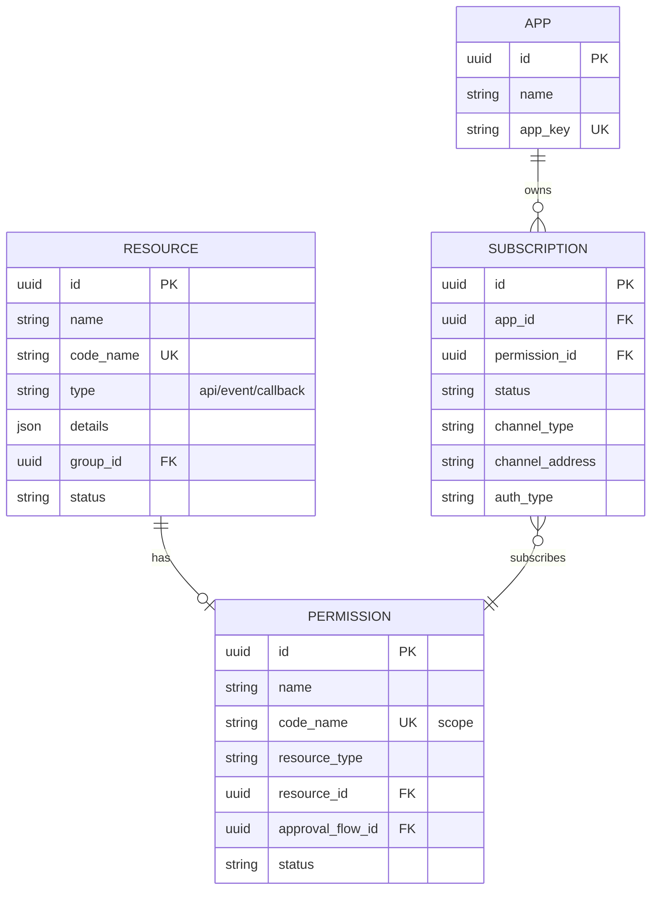
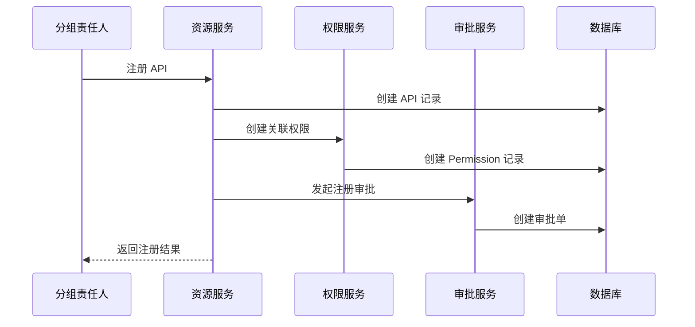

# ADR-003: 权限资源抽象设计

## 状态

ACCEPTED

## 背景

能力开放平台需要管理多种类型的资源：
- **API**：REST API 接口
- **事件**：业务事件推送
- **回调**：平台主动回调

每种资源都需要：
1. 注册到平台
2. 关联权限（Scope）
3. 被消费方订阅
4. 审批流程

### 现状问题

根据 spec.md §5.4 数据库表清单，现有系统存在以下问题：

| 问题 | 现状 | 影响 |
|------|------|------|
| API 与权限耦合 | API 主表直接存储权限信息 | 无法支持一个 API 多个权限场景 |
| 事件与权限无关联 | 应用直接申请权限 | 权限缺少资源绑定 |
| 回调无权限管理 | 不存在 | 无法控制回调订阅 |

## 决策

我们决定采用 **权限资源抽象** 设计，将权限作为独立实体与资源解耦。

### 决策内容

#### 1. 权限资源模型



#### 2. 表设计

```sql
-- 资源表（抽象父表，不实际创建）
-- APIs、Events、Callbacks 继承此结构

-- API 资源表
CREATE TABLE apis (
    id UUID PRIMARY KEY,
    name VARCHAR(100) NOT NULL,
    code_name VARCHAR(100) NOT NULL UNIQUE,
    path VARCHAR(500) NOT NULL,
    method VARCHAR(10) NOT NULL,
    description TEXT,
    doc_url VARCHAR(500),
    group_id UUID REFERENCES groups(id),
    status VARCHAR(20) DEFAULT 'draft',
    -- 公共字段
    created_at TIMESTAMP DEFAULT CURRENT_TIMESTAMP,
    updated_at TIMESTAMP DEFAULT CURRENT_TIMESTAMP,
    created_by UUID,
    updated_by UUID
);

-- 事件资源表
CREATE TABLE events (
    id UUID PRIMARY KEY,
    name VARCHAR(100) NOT NULL,
    code_name VARCHAR(100) NOT NULL UNIQUE,
    topic VARCHAR(200) NOT NULL UNIQUE,
    description TEXT,
    doc_url VARCHAR(500),
    group_id UUID REFERENCES groups(id),
    status VARCHAR(20) DEFAULT 'draft',
    -- 公共字段
    created_at TIMESTAMP DEFAULT CURRENT_TIMESTAMP,
    updated_at TIMESTAMP DEFAULT CURRENT_TIMESTAMP,
    created_by UUID,
    updated_by UUID
);

-- 回调资源表
CREATE TABLE callbacks (
    id UUID PRIMARY KEY,
    name VARCHAR(100) NOT NULL,
    code_name VARCHAR(100) NOT NULL UNIQUE,
    description TEXT,
    doc_url VARCHAR(500),
    group_id UUID REFERENCES groups(id),
    status VARCHAR(20) DEFAULT 'draft',
    -- 公共字段
    created_at TIMESTAMP DEFAULT CURRENT_TIMESTAMP,
    updated_at TIMESTAMP DEFAULT CURRENT_TIMESTAMP,
    created_by UUID,
    updated_by UUID
);

-- 权限资源表（核心抽象）
CREATE TABLE permissions (
    id UUID PRIMARY KEY,
    name VARCHAR(100) NOT NULL,
    code_name VARCHAR(100) NOT NULL UNIQUE, -- Scope 标识
    resource_type VARCHAR(20) NOT NULL, -- 'api', 'event', 'callback'
    resource_id UUID NOT NULL, -- 关联的资源 ID
    description TEXT,
    approval_flow_id UUID REFERENCES approval_flows(id),
    status VARCHAR(20) DEFAULT 'active',
    created_at TIMESTAMP DEFAULT CURRENT_TIMESTAMP,
    updated_at TIMESTAMP DEFAULT CURRENT_TIMESTAMP,
    created_by UUID,
    updated_by UUID
);

-- 订阅关系表
CREATE TABLE subscriptions (
    id UUID PRIMARY KEY,
    app_id UUID NOT NULL,
    permission_id UUID NOT NULL REFERENCES permissions(id),
    status VARCHAR(20) DEFAULT 'pending',
    -- 消费配置
    channel_type VARCHAR(20),
    channel_address VARCHAR(500),
    auth_type VARCHAR(20),
    created_at TIMESTAMP DEFAULT CURRENT_TIMESTAMP,
    updated_at TIMESTAMP DEFAULT CURRENT_TIMESTAMP,
    approved_at TIMESTAMP,
    approved_by UUID,
    UNIQUE(app_id, permission_id)
);
```

#### 3. 权限命名规范

Scope 命名遵循 `{module}:{resource}:{action}` 格式：

| 资源类型 | Scope 示例 | 说明 |
|----------|------------|------|
| API | `im:message:send` | 发送消息 API |
| API | `im:message:get` | 获取消息 API |
| Event | `im:message:received` | 消息接收事件 |
| Event | `meeting:started` | 会议开始事件 |
| Callback | `approval:completed` | 审批完成回调 |

#### 4. 服务层设计

```typescript
// 权限服务接口
export interface IPermissionService {
  // 创建权限（注册资源时调用）
  createPermission(dto: CreatePermissionDto): Promise<Permission>;
  
  // 获取权限树
  getPermissionTree(params: PermissionTreeParams): Promise<PermissionTreeNode[]>;
  
  // 订阅权限
  subscribePermission(dto: SubscribeDto): Promise<Subscription>;
  
  // 取消订阅
  unsubscribe(subscriptionId: string): Promise<void>;
  
  // 获取应用订阅列表
  getAppSubscriptions(appId: string): Promise<Subscription[]>;
}

// 资源注册服务接口
export interface IResourceService<T extends Resource> {
  // 注册资源（自动创建关联权限）
  register(dto: RegisterDto): Promise<T>;
  
  // 更新资源
  update(id: string, dto: UpdateDto): Promise<T>;
  
  // 删除资源（级联删除权限）
  delete(id: string): Promise<void>;
}
```

#### 5. 注册流程



## 理由

### 为什么抽象权限资源

| 维度 | 优势 |
|------|------|
| **解耦资源与权限** | 一个资源可关联多个权限（如读权限、写权限） |
| **统一订阅模型** | 消费方通过统一接口订阅各类资源权限 |
| **可扩展性** | 未来新增资源类型（如连接器）无需修改权限模型 |
| **权限治理** | 权限作为独立实体，便于权限审计和回收 |

### 为什么不直接在资源表存储权限

| 维度 | 劣势 |
|------|------|
| **一对多关系** | 无法支持一个资源多个权限场景 |
| **权限复用** | 无法实现权限模板 |
| **权限独立管理** | 权限状态变更与资源状态变更耦合 |

## 后果

### 正面影响

1. **灵活性强**：支持一个资源多个权限、权限模板等高级特性
2. **扩展性好**：新增资源类型只需新增资源表，权限模型不变
3. **统一订阅**：消费方通过统一接口订阅所有类型权限
4. **权限治理**：权限作为独立实体，便于审计和管理

### 负面影响

1. **查询复杂度增加**：需要 JOIN 多表查询
   - **缓解措施**：使用视图或物化视图优化查询
   
2. **注册流程增加一步**：需要显式创建权限
   - **缓解措施**：资源注册时自动创建默认权限

3. **数据一致性风险**：资源与权限需要同步删除
   - **缓解措施**：使用外键级联删除或事务保证

### 迁移策略

现有系统数据迁移：

| 现有表 | 迁移策略 |
|--------|----------|
| `openplatform_permission_api_t` | 1. 迁移数据到新的 `apis` 表<br/>2. 根据 API 信息创建 `permissions` 记录 |
| `openplatform_event_t` | 1. 迁移数据到新的 `events` 表<br/>2. 创建 `permissions` 记录（之前无关联） |
| `openplatform_app_permission_t` | 迁移到新的 `subscriptions` 表 |

```sql
-- 迁移示例：API 权限
INSERT INTO apis (id, name, code_name, path, method, status, created_at)
SELECT 
    id,
    name,
    code_name,
    path,
    method,
    status,
    created_at
FROM openplatform_permission_api_t;

INSERT INTO permissions (id, name, code_name, resource_type, resource_id, status, created_at)
SELECT 
    gen_random_uuid(),
    name,
    scope, -- 假设原有 scope 字段
    'api',
    id,
    'active',
    created_at
FROM openplatform_permission_api_t;
```

## 相关决策

- [ADR-001: 采用单体应用 + 模块化架构](./ADR-001.md)

## 参考

- [RBAC vs ABAC - NIST](https://csrc.nist.gov/projects/attribute-based-access-control)
- [OAuth 2.0 Scopes](https://oauth.net/2/scope/)
