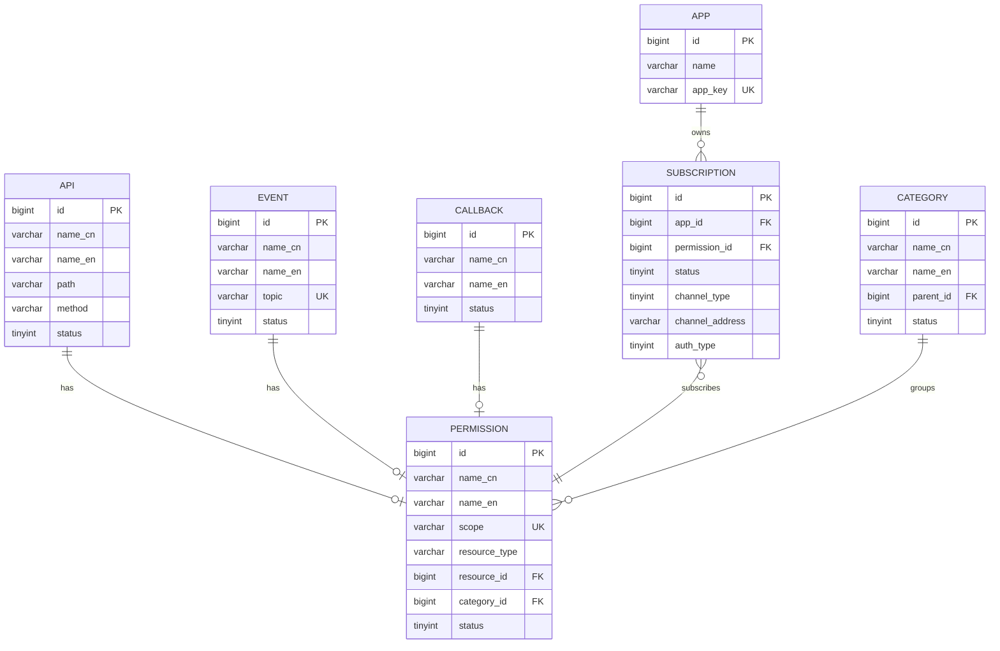

# ADR-003: 权限资源抽象设计

## 状态

ACCEPTED

## 背景

能力开放平台需要管理多种类型的资源：
- **API**：REST API 接口
- **事件**：业务事件推送
- **回调**：平台主动回调

每种资源都需要：
1. 注册到平台
2. 关联权限（Scope）
3. 被消费方订阅
4. 审批流程

### 现状问题

根据 spec.md §5.4 数据库表清单，现有系统存在以下问题：

| 问题 | 现状 | 影响 |
|------|------|------|
| API 与权限耦合 | API 主表直接存储权限信息 | 无法支持一个 API 多个权限场景 |
| 事件与权限无关联 | 应用直接申请权限 | 权限缺少资源绑定 |
| 回调无权限管理 | 不存在 | 无法控制回调订阅 |

## 决策

我们决定采用 **权限资源抽象** 设计，将权限作为独立实体与资源解耦。

### 决策内容

#### 1. 权限资源模型



#### 2. 表设计（MySQL）

```sql
-- API 资源主表
CREATE TABLE `openplatform_v2_api_t` (
    `id` BIGINT(20) PRIMARY KEY,
    `name_cn` VARCHAR(100) NOT NULL COMMENT '中文名称',
    `name_en` VARCHAR(100) NOT NULL COMMENT '英文名称',
    `path` VARCHAR(500) NOT NULL COMMENT 'API路径',
    `method` VARCHAR(10) NOT NULL COMMENT 'HTTP方法',
    `status` TINYINT(10) DEFAULT 0 COMMENT '0=草稿, 1=待审, 2=已发布, 3=已下线',
    `create_time` DATETIME(3) DEFAULT CURRENT_TIMESTAMP(3),
    `last_update_time` DATETIME(3) DEFAULT CURRENT_TIMESTAMP(3) ON UPDATE CURRENT_TIMESTAMP(3),
    `create_by` VARCHAR(100),
    `last_update_by` VARCHAR(100),
    KEY `idx_status` (`status`)
) ENGINE=InnoDB DEFAULT CHARSET=utf8mb4 COMMENT='API资源主表';

-- 事件资源主表
CREATE TABLE `openplatform_v2_event_t` (
    `id` BIGINT(20) PRIMARY KEY,
    `name_cn` VARCHAR(100) NOT NULL COMMENT '中文名称',
    `name_en` VARCHAR(100) NOT NULL COMMENT '英文名称',
    `topic` VARCHAR(200) NOT NULL UNIQUE COMMENT 'Topic',
    `status` TINYINT(10) DEFAULT 0 COMMENT '0=草稿, 1=待审, 2=已发布, 3=已下线',
    `create_time` DATETIME(3) DEFAULT CURRENT_TIMESTAMP(3),
    `last_update_time` DATETIME(3) DEFAULT CURRENT_TIMESTAMP(3) ON UPDATE CURRENT_TIMESTAMP(3),
    `create_by` VARCHAR(100),
    `last_update_by` VARCHAR(100),
    KEY `idx_topic` (`topic`),
    KEY `idx_status` (`status`)
) ENGINE=InnoDB DEFAULT CHARSET=utf8mb4 COMMENT='事件资源主表';

-- 回调资源主表
CREATE TABLE `openplatform_v2_callback_t` (
    `id` BIGINT(20) PRIMARY KEY,
    `name_cn` VARCHAR(100) NOT NULL COMMENT '中文名称',
    `name_en` VARCHAR(100) NOT NULL COMMENT '英文名称',
    `status` TINYINT(10) DEFAULT 0 COMMENT '0=草稿, 1=待审, 2=已发布, 3=已下线',
    `create_time` DATETIME(3) DEFAULT CURRENT_TIMESTAMP(3),
    `last_update_time` DATETIME(3) DEFAULT CURRENT_TIMESTAMP(3) ON UPDATE CURRENT_TIMESTAMP(3),
    `create_by` VARCHAR(100),
    `last_update_by` VARCHAR(100),
    KEY `idx_status` (`status`)
) ENGINE=InnoDB DEFAULT CHARSET=utf8mb4 COMMENT='回调资源主表';

-- 权限资源表（核心抽象）
CREATE TABLE `openplatform_v2_permission_t` (
    `id` BIGINT(20) PRIMARY KEY,
    `name_cn` VARCHAR(100) NOT NULL COMMENT '中文名称',
    `name_en` VARCHAR(100) NOT NULL COMMENT '英文名称',
    `scope` VARCHAR(200) NOT NULL UNIQUE COMMENT '权限标识',
    `resource_type` VARCHAR(20) NOT NULL COMMENT 'api/event/callback',
    `resource_id` BIGINT(20) NOT NULL COMMENT '关联的资源ID',
    `category_id` BIGINT(20) COMMENT '分类ID',
    `status` TINYINT(10) DEFAULT 1 COMMENT '0=禁用, 1=启用',
    `create_time` DATETIME(3) DEFAULT CURRENT_TIMESTAMP(3),
    `last_update_time` DATETIME(3) DEFAULT CURRENT_TIMESTAMP(3) ON UPDATE CURRENT_TIMESTAMP(3),
    `create_by` VARCHAR(100),
    `last_update_by` VARCHAR(100),
    UNIQUE KEY `uk_resource` (`resource_type`, `resource_id`),
    KEY `idx_scope` (`scope`),
    KEY `idx_category` (`category_id`)
) ENGINE=InnoDB DEFAULT CHARSET=utf8mb4 COMMENT='权限资源表';

-- 订阅关系表
CREATE TABLE `openplatform_v2_subscription_t` (
    `id` BIGINT(20) PRIMARY KEY,
    `app_id` BIGINT(20) NOT NULL COMMENT '应用ID',
    `permission_id` BIGINT(20) NOT NULL COMMENT '权限ID',
    `status` TINYINT(10) DEFAULT 0 COMMENT '0=待审, 1=已授权, 2=已拒绝, 3=已取消',
    `channel_type` TINYINT(10) COMMENT '通道类型',
    `channel_address` VARCHAR(500) COMMENT '通道地址',
    `auth_type` TINYINT(10) COMMENT '认证类型',
    `create_time` DATETIME(3) DEFAULT CURRENT_TIMESTAMP(3),
    `last_update_time` DATETIME(3) DEFAULT CURRENT_TIMESTAMP(3) ON UPDATE CURRENT_TIMESTAMP(3),
    `create_by` VARCHAR(100),
    `last_update_by` VARCHAR(100),
    UNIQUE KEY `uk_app_permission` (`app_id`, `permission_id`)
) ENGINE=InnoDB DEFAULT CHARSET=utf8mb4 COMMENT='订阅关系表';
```

#### 3. Scope 命名规范

Scope 命名遵循 `{资源类型}:{模块}:{资源标识}` 格式：

| 资源类型 | Scope 示例 | 说明 |
|----------|------------|------|
| API | `api:im:send-message` | IM 模块发送消息 API |
| API | `api:im:get-message` | IM 模块获取消息 API |
| Event | `event:im:message-received` | IM 模块消息接收事件 |
| Event | `event:meeting:meeting-started` | 会议模块会议开始事件 |
| Callback | `callback:approval:approval-completed` | 审批模块审批完成回调 |

#### 4. 服务层设计（Spring Boot）

```java
// 权限服务接口
public interface IPermissionService {
    // 创建权限（注册资源时调用）
    PermissionDTO createPermission(CreatePermissionDTO dto);
    
    // 获取权限树
    List<PermissionTreeNode> getPermissionTree(PermissionTreeParams params);
    
    // 订阅权限
    SubscriptionDTO subscribePermission(SubscribeDTO dto);
    
    // 取消订阅
    void unsubscribe(Long subscriptionId);
    
    // 获取应用订阅列表
    List<SubscriptionDTO> getAppSubscriptions(Long appId);
}

// 资源注册服务接口
public interface IResourceService<T extends Resource> {
    // 注册资源（自动创建关联权限）
    T register(RegisterDTO dto);
    
    // 更新资源
    T update(Long id, UpdateDTO dto);
    
    // 删除资源（级联删除权限）
    void delete(Long id);
}
```

#### 5. 注册流程


## 理由

### 为什么抽象权限资源

| 维度 | 优势 |
|------|------|
| **解耦资源与权限** | 一个资源可关联多个权限（如读权限、写权限） |
| **统一订阅模型** | 消费方通过统一接口订阅各类资源权限 |
| **可扩展性** | 未来新增资源类型（如连接器）无需修改权限模型 |
| **权限治理** | 权限作为独立实体，便于权限审计和回收 |

### 为什么不直接在资源表存储权限

| 维度 | 劣势 |
|------|------|
| **一对多关系** | 无法支持一个资源多个权限场景 |
| **权限复用** | 无法实现权限模板 |
| **权限独立管理** | 权限状态变更与资源状态变更耦合 |

## 后果

### 正面影响

1. **灵活性强**：支持一个资源多个权限、权限模板等高级特性
2. **扩展性好**：新增资源类型只需新增资源表，权限模型不变
3. **统一订阅**：消费方通过统一接口订阅所有类型权限
4. **权限治理**：权限作为独立实体，便于审计和管理

### 负面影响

1. **查询复杂度增加**：需要 JOIN 多表查询
   - **缓解措施**：使用视图或缓存优化查询
    
2. **注册流程增加一步**：需要显式创建权限
   - **缓解措施**：资源注册时自动创建默认权限

3. **数据一致性风险**：资源与权限需要同步删除
   - **缓解措施**：使用事务保证一致性

### 迁移策略

现有系统数据迁移：

| 现有表 | 迁移策略 |
|--------|----------|
| `openplatform_permission_api_t` | 1. 迁移数据到新的 `openplatform_v2_api_t` 表<br/>2. 根据 API 信息创建 `openplatform_v2_permission_t` 记录 |
| `openplatform_event_t` | 1. 迁移数据到新的 `openplatform_v2_event_t` 表<br/>2. 创建 `openplatform_v2_permission_t` 记录（之前无关联） |
| `openplatform_app_permission_t` | 迁移到新的 `openplatform_v2_subscription_t` 表 |

```sql
-- 迁移示例：API 权限
INSERT INTO openplatform_v2_api_t (id, name_cn, name_en, path, method, status, create_time)
SELECT 
    id,
    name,
    name,
    path,
    method,
    status,
    created_at
FROM openplatform_permission_api_t;

INSERT INTO openplatform_v2_permission_t (id, name_cn, name_en, scope, resource_type, resource_id, status, create_time)
SELECT 
    <雪花ID>,
    name,
    name,
    CONCAT('api:', <模块>, ':', <资源标识>),
    'api',
    id,
    1,
    created_at
FROM openplatform_permission_api_t;
```

## 相关决策

- [ADR-001: 采用单体应用 + 模块化架构](./ADR-001.md)

## 参考

- [RBAC vs ABAC - NIST](https://csrc.nist.gov/projects/attribute-based-access-control)
- [OAuth 2.0 Scopes](https://oauth.net/2/scope/)
