# 需求挖掘报告：能力开放平台

**报告 ID**: DISCOVERY-CAPABILITY-001  
**创建时间**: 2026-04-13  
**最后更新**: 2026-04-13  
**阶段**: 0.discovery（需求挖掘）  
**状态**: ✅ 已完成  
**会话 ID**: capability-session-001

---

## 一、执行摘要

### 1.1 核心定位

**能力开放平台**是 open-app 体系下的基础能力平台，作为开放平台的基础设施层，提供统一的连接能力（API、事件等）和管理能力（权限、审批等）。它不仅支撑数据开放平台等上层业务应用，也直接服务于企业内三方平台的业务集成，构建完整的企业内部能力生态。

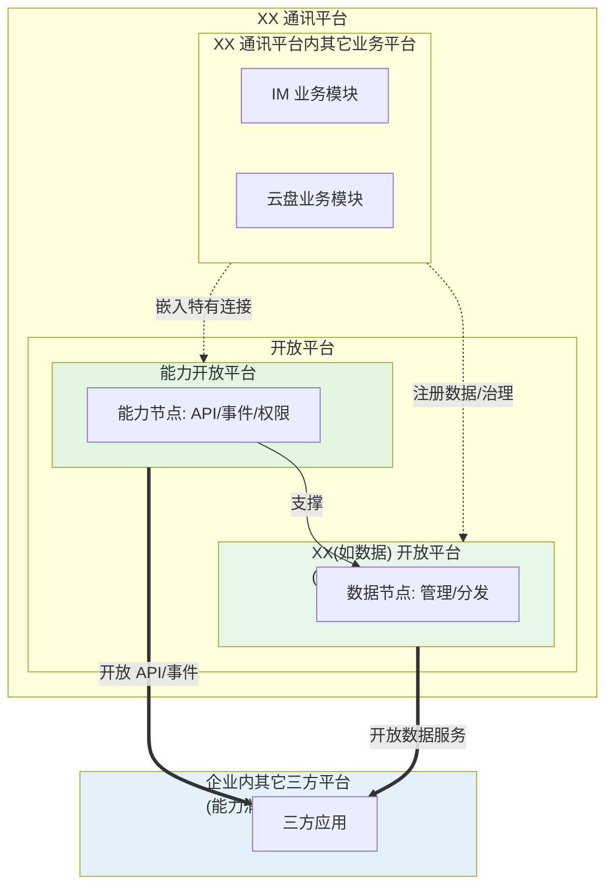

> 💡 **关系解读**：
> 1.  **包含关系**：能力开放平台和数据开放平台都是开放平台的一部分；XX 通讯平台包含开放平台和其他业务平台。
> 2.  **层级关系**：能力开放平台是**基础设施**（阶段 1），为数据开放平台（阶段 2）提供底层支撑（API 通道、权限、审批）。
> 3.  **供给关系**：XX 通讯平台内的业务模块（如 IM、云盘）提供原始能力/数据。特有连接能力嵌入能力开放平台；数据/治理走数据开放平台。
> 4.  **消费关系**：企业内三方平台（如 AI 应用、客服系统）作为消费者，既可以直接通过能力开放平台调用 API/事件，也可以通过数据开放平台获取高阶数据服务。

### 1.2 核心问题

| 维度 | 描述 |
|------|------|
| **核心痛点** | 能力开放较为薄弱：当前能力开放较为薄弱，亟需增强。各业务模块有能力但缺乏统一载体，导致开放效率低、管理混乱 |
| **现状** | 业务侧期望快速开放能力；为支撑后续的**高频迭代**，选用 AI 方式进行开发以提升**平台构建效率**（AI 是提效工具） |
| **目标** | 构建统一的**能力开放底座**：开放平台负责构建基础设施，各业务模块负责**注册已有能力**，实现标准化开放 |
| **价值主张** | **提效**：利用 AI 工具快速构建/迭代平台； **规范**：业务方掌控能力（注册/审批），消费方便捷接入 |

### 1.3 目标用户

| 角色 | 职责 | 诉求 |
|------|------|------|
| **能力提供方** | 业务模块负责人（如 IM 模块 Owner） | **注册**：将本模块**已有**的能力（API/事件等）注册接入开放平台（**非生成**）； **审批**：拥有审批权，负责审批消费方的使用申请；通过开放实现业务价值 |
| **能力管理方** | 开放平台研发/运营人员 | **建设**：构建并维护能力开放平台基础设施（利用 AI 提效），提供 API/事件管理底座； **服务**：提供统一的注册与审批工具，**不干预**业务方对具体能力的审批决策 |
| **能力消费方** | 企业内部三方平台负责人 | **发现**：浏览目录找到所需能力； **申请**：发起使用申请（**等待提供方审批**）； **消费**：获批后通过 API/事件调用能力 |

> 💡 **核心逻辑**：**能力提供方**是生态的供给源头（负责注册与审批），**开放平台**提供基础设施与工具（AI 提效），**消费方**是生态的受益者。

---

## 二、问题空间分析

### 2.1 现状痛点

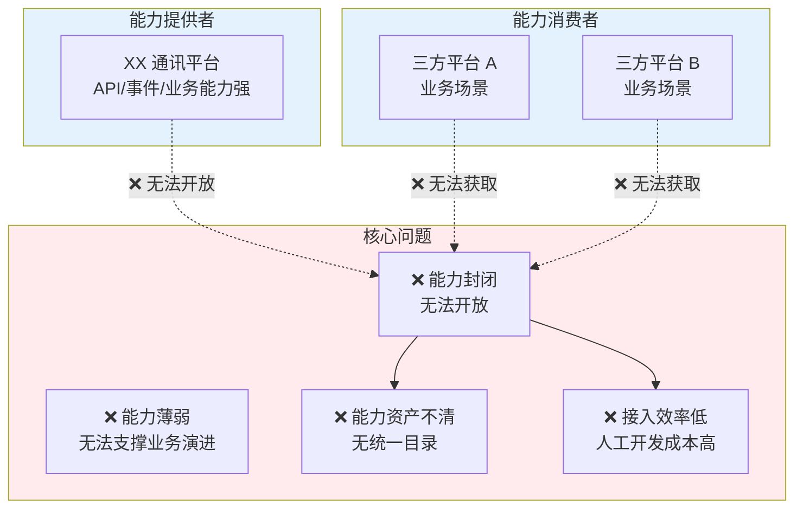

| 痛点维度 | 具体描述 |
|---------|---------|
| **能力封闭** | XX 平台的能力多数局限在平台内部使用，外部无法获取 |
| **能力薄弱** | 已有能力较为薄弱，无法满足业务发展需要，缺失的能力无法支撑业务演进 |
| **能力资产不清** | 没有统一的能力目录，三方平台不知道有哪些能力可用 |
| **接入效率低** | 没有统一的能力开放平台，三方平台接入能力成本高，人工开发工作量大 |

### 2.2 业务驱动

| 驱动因素 | 说明 |
|---------|------|
| **生态构建战略** | XX 平台需要快速将内部能力开放给三方平台，构建完整的企业内部能力生态，支撑业务创新 |
| **能力开放迫在眉睫** | 开放平台要开放哪些能力、怎么开放是重中之重，直接关系到平台业务价值的放大 |
| **提效降本诉求** | 业务侧期望快速开放能力，需要高效的平台构建方式以支撑高频迭代，**AI 是提效的实现手段之一** |
| **避免历史债** | 不在现有代码基础上继续增加历史债，相对独立的能力重新构建，保持系统可维护性 |
| **快速赋能业务** | 最终目标是快速赋能业务，通过能力开放让三方平台能够利用 XX 平台能力开展新业务 |

> 💡 **AI 定位**：AI 是提效工具，服务于业务价值目标（快速开放能力、构建生态、赋能业务），而非目的本身。

### 2.3 不做会怎样

| 影响维度 | 后果 |
|---------|------|
| **业务影响** | 三方平台无法利用 XX 平台能力开展新业务，生态建设受阻 |
| **效率影响** | 能力对接继续依赖人工开发，效率低、成本高 |
| **技术影响** | 在历史债上继续增加历史债，系统维护成本持续上升 |
| **竞争影响** | 相比飞书/钉钉等竞品，企业通讯平台能力开放程度落后 |

---

## 三、用户画像与场景

### 3.1 用户画像

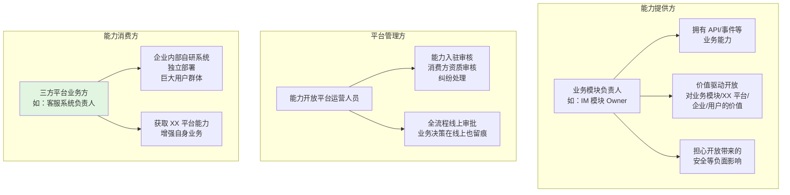

> 💡 **核心用户**：能力消费方（三方平台业务方），设计以消费方体验为中心

### 3.2 能力分类模型

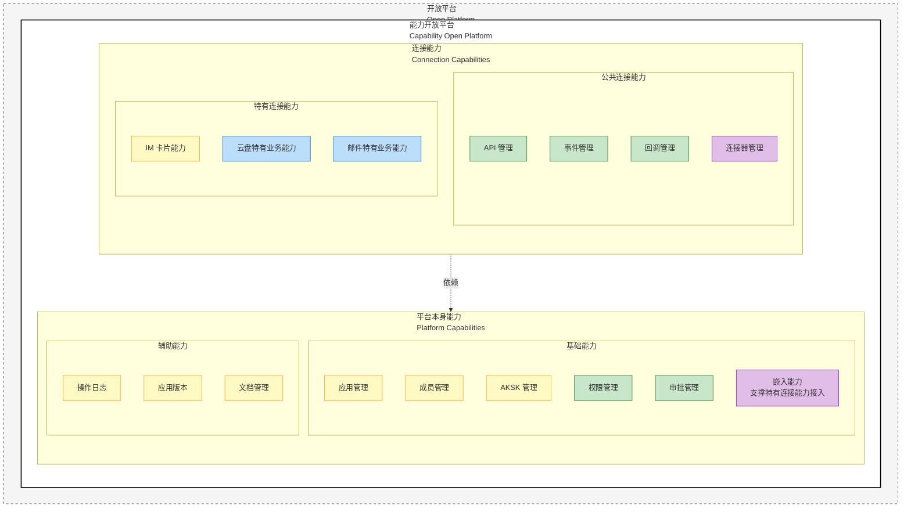

> 🎨 **建设策略图例**：
> - 🟡 `沿用现有`：应用管理、成员管理、AKSK 管理、操作日志、应用版本、文档管理、IM 卡片能力
> - 🟢 `重新构建`：权限管理、审批管理、API 管理、事件管理、回调管理
> - 🟣 `完全新建`：嵌入能力、连接器管理
> - 🔵 `业务模块建设`：云盘特有业务能力、邮件特有业务能力

**能力清单与建设策略**：

| 一级分类 | 二级分类 | 能力项 | 建设策略 | 归属/说明 |
|---------|---------|--------|---------|-----------|
| **平台本身能力** | 基础能力 | 应用管理 | 🟡 沿用现有 | 公共底座，被连接能力依赖复用 |
| | | 成员管理 | 🟡 沿用现有 | 公共底座，被连接能力依赖复用 |
| | | AKSK 管理 | 🟡 沿用现有 | 公共底座，被连接能力依赖复用 |
| | | 权限管理 | 🟢 重新构建 | 公共底座，统一权限模型，被连接能力复用 |
| | | 审批管理 | 🟢 重新构建 | 公共底座，统一审批流，被连接能力复用 |
| | | 嵌入能力 | 🟣 完全新建 | 特有连接能力接入开放平台的基础支撑 |
| | 辅助能力 | 操作日志 | 🟡 沿用现有 | 辅助记录与管理 |
| | | 应用版本 | 🟡 沿用现有 | 辅助记录与管理 |
| | | 文档管理 | 🟡 沿用现有 | 辅助记录与管理 |
| **连接能力** | **公共连接能力** | API 管理 | 🟢 重新构建 | 负责内/对外连接，依赖平台本身能力 |
| | | 事件管理 | 🟢 重新构建 | 负责内/对外连接，依赖平台本身能力 |
| | | 回调管理 | 🟢 重新构建 | 负责内/对外连接，依赖平台本身能力 |
| | | 连接器管理 | 🟣 完全新建 | 负责内/对外连接，依赖平台本身能力 |
| | **特有连接能力** | IM 卡片能力 | 🟡 沿用现有 | 业务模块构建，通过嵌入能力接入 |
| | | 云盘特有业务能力 | 🔵 业务模块建设 | 业务模块构建，通过嵌入能力接入 |
| | | 邮件特有业务能力 | 🔵 业务模块建设 | 业务模块构建，通过嵌入能力接入 |

> 💡 **依赖关系**：连接能力（公共 + 特有）均**依赖/对接**平台本身能力（特别是应用管理、权限管理、审批管理等），复用其基础身份、权限和应用信息。

### 3.3 典型场景

| 场景编号 | 场景名称 | 描述 |
|---------|---------|------|
| **S1** | IM 模块开放 API | IM 模块责任人注册 IM 的 API 能力，经过审批后开放给客服系统使用 |
| **S2** | 云盘模块开放能力 | 云盘模块责任人开放云盘文件 FTP/云盘自定义能力通道，供三方平台消费 |
| **S3** | 三方平台订阅 API | 客服系统（已持有凭证）浏览能力目录，申请订阅 IM API 能力，用于客服会话集成 |
| **S4** | AI 应用消费能力 | AI 助手应用通过标准 API 获取日程、会议能力，用于智能问答和推荐 |

### 3.4 用户旅程地图

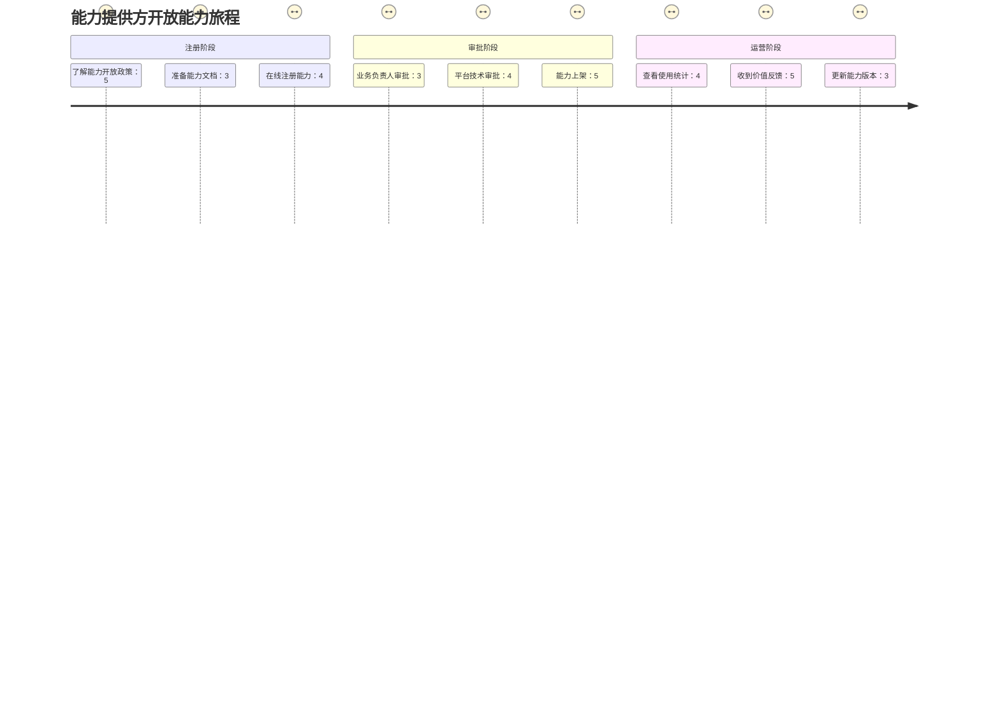

---

## 四、需求分层与优先级

### 4.1 需求分层

```mermaid
graph LR
    subgraph Must_Have[必备需求 - 没有无法使用]
        M1[权限管理]
        M2[审批管理]
        M3[API 管理]
        M4[事件管理]
    end
    
    subgraph Should_Have[期望需求 - 显著提升体验]
        S1[回调管理]
        S2[连接器管理]
        S3[特有能力嵌入]
        S4[能力消费网关]
        S5[能力目录/市场]
        S6[开发者工具链]
        S7[用量统计]
        S8[操作审计日志]
    end
    
    subgraph Could_Have[惊喜需求 - 超出预期]
        C1[沙箱环境]
        C2[自动化接入]
    end
    
    Must_Have -.-> Should_Have -.-> Could_Have
    
    style Must_Have fill:#e1f5e1,stroke:#2e7d32,stroke-width:2px
    style Should_Have fill:#fff3cd,stroke:#f57c00,stroke-width:2px
    style Could_Have fill:#f3e5f5,stroke:#7b1fa2,stroke-width:2px
```

### 4.2 需求清单

#### Must Have（必备）

**平台本身能力（公共底座）**：

| 需求编号 | 需求描述 | 核心本质 | 验收标准 |
|---------|---------|---------|---------|
| **MH-05** | **权限管理** | **核心底座**：资源的访问控制 | 建立统一的权限模型（Scope/RBAC）；支持将各类能力的权限分配给应用 |
| **MH-06** | **审批管理** | **核心底座**：业务流程审批 | 支持动态审批流配置（根据能力类型/敏感度生成审批链）；支持审批记录留痕 |

**连接能力**：

| 需求编号 | 需求描述 | 核心本质 | 验收标准 |
|---------|---------|---------|---------|
| **MH-01** | **API 管理能力** | 定义与管理 RESTful 接口资源 | 支持 API 的注册、分组、版本管理、在线文档维护；支持参数定义 |
| **MH-02** | **事件管理能力** | 定义与管理异步事件流（EventBus） | 支持事件源的注册、订阅关系管理；支持按 Topic 进行消息广播 |

#### Should Have（期望）

**连接能力**：

| 需求编号 | 需求描述 | 验收标准 |
|---------|---------|---------|
| **SH-05** | **回调管理能力** | 支持配置回调地址（URL）、重试策略、签名验证；支持回调状态监控 |
| **SH-06** | **连接器管理能力** | 提供连接器开发框架；支持参数映射、预置连接器运行与调度 |
| **SH-07** | **特有能力嵌入机制** | 提供 SDK/API，允许业务模块将特有 API/事件注册到统一平台；复用平台本身的权限与审批 |
| **SH-08** | **能力消费网关** | 提供统一 API 网关；复用现有应用身份（AppID/AKSK）进行鉴权；支持流控与日志记录 |

> ⚠️ **SH-08 备注**：能力消费网关已有代码涉及较多企业内部逻辑，可能考虑人工开发。

**辅助能力**：

| 需求编号 | 需求描述 | 验收标准 |
|---------|---------|---------|
| **SH-01** | **能力目录/市场** | 统一门户展示 API、事件、连接器；支持按场景（HR/客服/AI）分类检索 |
| **SH-02** | **开发者工具链** | 提供在线调试控制台；支持根据定义自动生成客户端 SDK 代码 |
| **SH-03** | **用量统计** | 记录各能力（API/事件）的调用频次；支持按应用维度统计 |
| **SH-04** | **操作审计日志** | 记录所有配置变更（注册/审批/权限分配）；集成现有日志系统 |

#### Could Have（惊喜）

| 需求编号 | 需求描述 | 验收标准 |
|---------|---------|---------|
| **CH-01** | **沙箱环境** | 提供隔离的测试环境，模拟真实数据供开发调试 |
| **CH-02** | **自动化接入** | 通过 AI 辅助生成连接器配置或 API 文档 |

---

## 五、核心流程设计

### 5.1 能力开放消费全流程

从平台视角展示能力从注册到消费的完整流程，涉及能力提供方、平台管理方、能力消费方三角色。

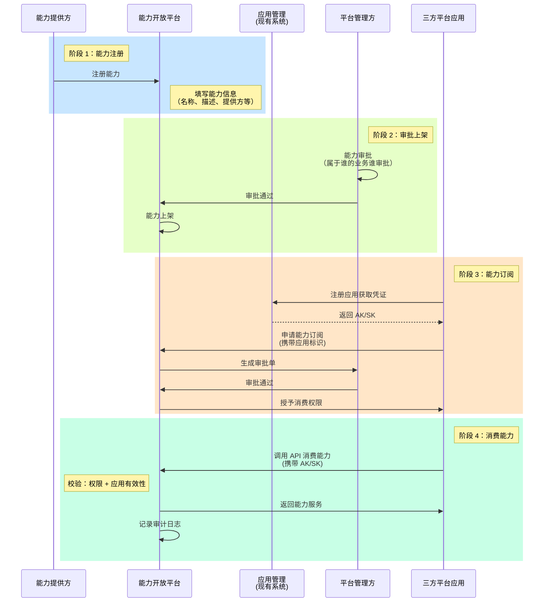

### 5.2 能力消费形式

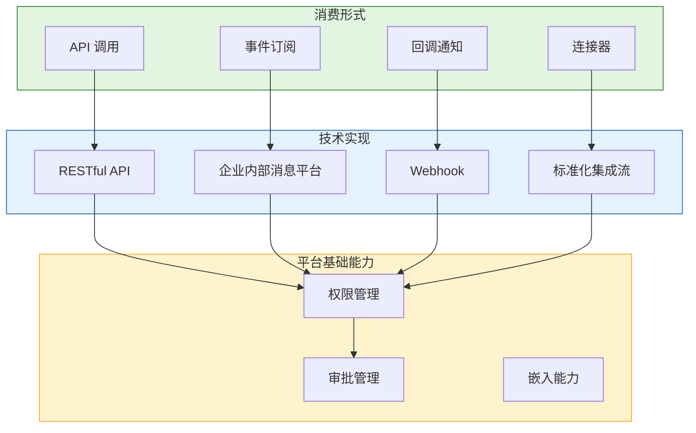

> 💡 **核心逻辑**：不同消费形式技术实现大相径庭，但都统一依赖平台基础能力（权限管理、审批管理等），实现"异构能力，统一治理"。

**消费形式对比**：

| 维度 | API 调用 | 事件订阅 | 回调通知 | 连接器 |
|------|---------|---------|---------|--------|
| **交互模式** | 同步请求-响应 | 异步发布-订阅 | 异步状态推送 | 预定义集成流 |
| **触发方** | 消费方主动调用 | 提供方发布事件 | 提供方触发回调 | 调度器定时/事件触发 |
| **技术实现** | RESTful API | 企业内部消息平台 | Webhook | 标准化集成流 |
| **适用场景** | 实时查询、操作执行 | 实时状态变更通知 | 异步结果推送 | 数据同步、流程编排 |
| **平台能力利用** | 权限鉴权 → 审批流控 | 权限鉴权 → 订阅管理 | 权限鉴权 → 回调注册 | 权限鉴权 → 流编排 |

**平台基础能力复用关系**：

| 平台能力 | API 调用 | 事件订阅 | 回调通知 | 连接器 |
|---------|---------|---------|---------|--------|
| **权限管理** | ✅ 应用 AKSK 鉴权 | ✅ 订阅权限控制 | ✅ 回调注册鉴权 | ✅ 连接器调用鉴权 |
| **审批管理** | ✅ 能力订阅审批 | ✅ 事件订阅审批 | ✅ 回调配置审批 | ✅ 连接器部署审批 |

> 💡 **嵌入能力**（平台基础能力之一）仅用于支撑**特有连接能力**（IM 卡片、云盘、邮件等）嵌入开放平台，与上述四种公共消费形式无直接关联，详见 §3.2 能力分类模型。

### 5.3 能力归属与治理

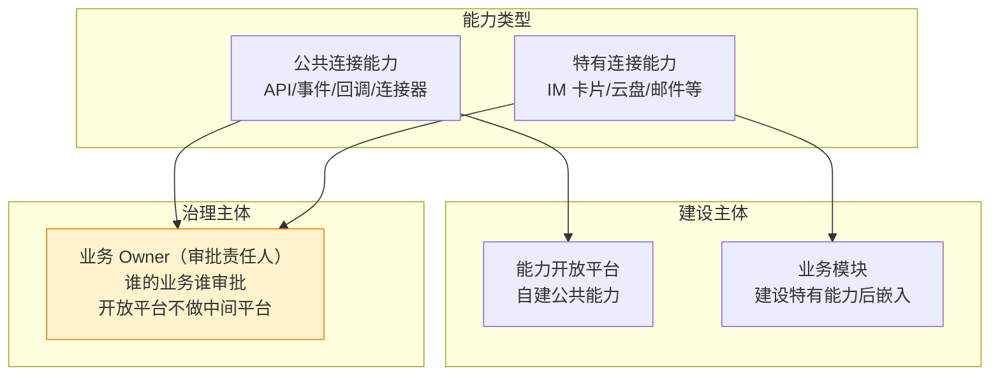

| 维度 | 设计决策 |
|------|---------|
| **归属原则** | 公共连接能力由开放平台建设，特有连接能力由业务模块建设后嵌入 |
| **治理原则** | 谁的业务谁审批，治理属于业务 Owner（审批责任人），无需区分平台与模块 |
| **平台定位** | 开放平台不做中间平台，避免多重依赖 |
| **审批流程** | 全流程线上审批，留痕可追溯 |

### 5.4 与数据开放平台的关系

> 💡 **说明**：整体关系见 §1.1 核心定位，本图聚焦能力开放平台内部结构如何支撑数据开放平台。

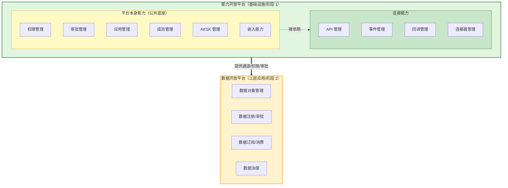

| 维度 | 关系说明 |
|------|---------|
| **定位** | 能力开放平台是基础设施，数据开放平台是上层业务应用 |
| **依赖关系** | 数据开放平台依赖能力开放平台的能力（API/事件通道、权限管理、审批管理等） |
| **建设顺序** | 能力开放平台先构建（阶段 1），数据开放平台后构建（阶段 2） |
| **权限模型** | 能力开放平台构建统一权限管理，数据开放平台将数据对象关联到权限后复用统一权限管理和审批管理 |
| **迁移策略** | 不存在迁移，两者长期并存 |
| **部署** | 按需做独立部署 |

> 💡 **关键理解**：数据开放平台是能力开放平台的"消费方"，而非"超集"。能力开放平台提供通用的能力管理框架，数据开放平台是上层业务应用，依赖能力开放平台的基础能力。

---

## 六、竞品对标

### 6.1 飞书/钉钉对标分析

| 对标维度 | 飞书做法 | 钉钉做法 | 我们的借鉴 |
|---------|---------|---------|-----------|
| **能力目录** | API 文档中心，分类清晰 | API 文档中心，分类清晰 | ✅ 在现有 API 中心基础上增强 |
| **能力注册** | 开发者提交 API 申请 | ISV 提交应用审核 | ✅ 能力提供方在线注册 |
| **审批机制** | 平台审核 + 管理员授权 | 平台审核 + 管理员授权 | ✅ 全流程线上审批，属于谁的业务谁审批 |
| **开放形式** | API + 事件订阅 + Webhook + 连接器 | API + 事件订阅 + Webhook + 连接器 | ✅ 支持多种形式 |
| **开发者体验** | 文档完善、SDK 支持好 | 文档完善、生态成熟 | ✅ 复用现有文档中心，增强 SDK |
| **低代码** | 飞书 aPaaS + 多维表格 | 宜搭（1000 万 + 应用） | ✅ 参考连接器设计 |

### 6.2 能力类型参考

参考飞书/钉钉的能力开放实践，能力可分为：

| 能力大类 | 典型能力 | 参考 |
|---------|---------|------|
| **基础能力** | 应用管理、成员管理、权限管理 | 飞书/钉钉基础 API |
| **消息能力** | 消息发送、群管理、回调通知 | 飞书消息 API、钉钉消息推送 |
| **协作能力** | 日历、会议、文档、云盘 | 飞书日历/会议/云文档、钉钉日程/钉盘 |
| **AI 能力** | 智能问答、智能推荐、自动化 | 飞书 Aily、钉钉 AI 智能体 |
| **连接器** | 第三方系统集成、数据同步 | 飞书 AnyCross、钉钉连接器 |

---

## 七、成功标准

**核心目标**: 
1. ✅ **能力成功被企业内部三方平台使用** - 有能力被开放，有消费方在使用
2. ✅ **能力使用很便捷** - 三方平台接入能力简单、快速
3. ✅ **能力使用流程安全可控合规** - 全流程线上审批、留痕可追溯、安全合规

### 7.1 定性指标

| 维度 | 成功标准 | 对应核心目标 |
|------|---------|-------------|
| **能力开放** | 有能力提供方愿意开放能力，能力成功上架 | 能力成功被使用 |
| **能力消费** | 有消费方订阅并使用开放的能力 | 能力成功被使用 |
| **接入效率** | 三方平台接入能力的时间显著降低，流程简单 | 能力使用很便捷 |
| **用户体验** | 能力提供方觉得开放方便，消费方觉得获取容易 | 能力使用很便捷 |
| **安全合规** | 全流程线上审批、留痕可追溯、符合企业合规要求 | 安全可控合规 |
| **风险控制** | 能力使用安全可控，无安全事件 | 安全可控合规 |

### 7.2 定量指标（系统提供度量能力）

| 指标类型 | 具体的指标 | 对应核心目标 |
|---------|-----------|-------------|
| **规模指标** | 开放的能力数量、能力类型数量 | 能力成功被使用 |
| **接入规模** | 订阅能力的三方平台数量、应用数量 | 能力成功被使用 |
| **活跃指标** | 每天/每月 API 调用量、事件订阅量 | 能力成功被使用 |
| **效率指标** | 三方平台接入能力的时间（从 X 天降低到 Y 天） | 能力使用很便捷 |
| **审批效率** | 审批平均时长、审批通过率 | 能力使用很便捷 |
| **治理指标** | 经过审批的能力开放比例（目标 100%） | 安全可控合规 |
| **安全指标** | 审计日志完整率、权限违规次数（目标 0） | 安全可控合规 |
| **价值评估指标** | API 调用量统计、能力使用频次、定期价值报告 | 能力成功被使用 |

> ⚠️ **注意**: 具体目标值取决于业务运营推广的投入力度，系统首先需要具备度量能力。

---

## 八、风险与假设

### 8.1 关键假设

| 假设 | 风险等级 | 验证方式/状态 |
|------|---------|---------|
| 能力提供方有开放能力的意愿 | 中 | 试点项目验证 |
| 企业内部三方平台有使用 XX 平台能力的需求 | 低 | 已有私下对接案例 |
| AI 开发可以满足质量和效率要求 | 低 | ✅ 已有其它产品成功使用 AI 开发上线的先例，无需预研 |
| 业务模块接受"属于谁的业务谁审批"原则 | 低 | 与业务方沟通确认 |

### 8.2 潜在风险

| 风险 | 影响 | 缓解措施 |
|------|------|---------|
| 能力提供方担心能力开放后的责任问题 | 高 | 提供完善的权限控制和审计日志 |
| 能力归属边界模糊导致管理混乱 | 中 | 明确"属于谁的业务谁审批"原则，开放平台不做中间平台 |
| AI 开发质量不稳定 | 低 | ✅ 已有其它产品成功案例，建立 AI 开发质量标准和审查机制即可 |
| 与现有系统集成复杂度高 | 中 | 分阶段实施，优先核心能力，明确集成边界，详细设计后置 |
| 平滑过渡挑战 | 中 | 重建模块需具备共存/迁移旧代码系统业务数据的能力，设计好与现有模块的对接 |

---

## 九、下一步建议

### 9.1 进入规范编写阶段

运行 `@sdd-spec 能力开放平台` 进入规范编写阶段，产出：
- 产品需求文档（PRD）
- 用户故事地图
- 详细功能规格
- 技术架构设计

### 9.2 并行业务调研

**能力清单梳理**（✅ 已完成）：
XX 通讯平台开放平台现有能力清单如下：

| 能力名称 | 建设策略 |
|---------|---------|
| 应用管理 | 沿用现有 |
| AKSK 凭证管理 | 沿用现有 |
| IM 卡片能力 | 沿用现有 |
| API 管理 | 重新构建（AI 开发） |
| API 权限管理 | 重新构建（AI 开发） |
| 事件与回调 | 重新构建（AI 开发） |
| 事件与回调权限管理 | 重新构建（AI 开发） |
| 操作日志 | 沿用现有 |
| 应用版本管理 | 沿用现有 |
| 审批管理 | 重新构建（AI 开发） |
| 开放文档管理 | 沿用现有 |

**提供方/消费方访谈**（⏳ 未来处理）：
- 暂缓安排，未来根据业务需要再进行

### 9.3 技术预研

**技术策略**（✅ 已确认）：

| 事项 | 策略 |
|------|------|
| **AI 开发** | 无需预研，已有其它产品成功使用 AI 开发上线的先例，直接实施 |
| **系统集成** | 需求挖掘阶段明确边界，详细设计后置到设计阶段 |
| **能力元数据** | 前期弱化，核心是将能力开放本身逻辑搭建起来 |
| **外部依赖** | 复用现有系统（内部消息平台、API 网关等），不重复搭建 |

**建设边界**：
- **现有模块**（沿用现有代码）：应用管理、成员管理、AKSK 凭证管理、IM 卡片能力、操作日志、应用版本管理、开放文档管理
- **重建模块**（AI 开发，需共存/迁移旧数据）：API 管理、事件/回调管理、权限管理、审批管理
- **外部依赖**（复用现有系统）：企业内部消息平台、API 网关、其他非开放平台系统

**关键设计点**：
- 设计好与现有模块（应用管理、成员管理等）的对接
- 处理与现有人工开发模块（API 管理等）的关系，实现平滑过渡
- 重建模块需具备共存/迁移旧代码系统业务数据的能力

### 9.4 与数据开放平台的协同

**平台关系**（✅ 已确认）：

| 维度 | 关系说明 |
|------|---------|
| **依赖关系** | 数据开放平台依赖能力开放平台的能力（API/事件通道等） |
| **建设顺序** | 能力开放平台先构建，数据开放平台后构建，先后依赖关系 |
| **迁移策略** | 不存在迁移，两者长期并存 |

**权限模型设计原则**：
- **能力开放平台**：构建统一的权限管理，适配不局限于 API、事件、数据等类型的权限管理
- **数据开放平台**：将数据对象关联到权限后，后续流程（审批、审计等）交给统一权限管理
- **复用关系**：各业务场景（API、事件、数据等）使用统一权限设计，将各自场景的业务逻辑设计进去

**架构关系**：
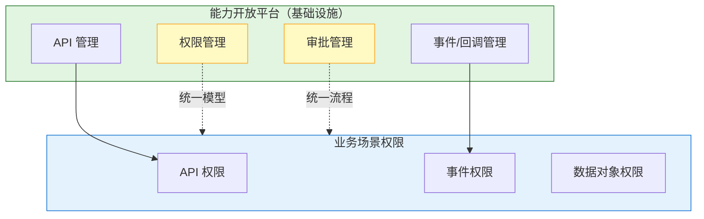

---

## 附录

### A. 会话记录

完整对话记录见：`.sddu/specs-tree-root/specs-tree-capability-open-platform/discovery-session-log.md`

### B. 分析笔记

分析总结见：`.sddu/specs-tree-root/specs-tree-capability-open-platform/discovery-analysis.md`

### C. 参考资料

- 数据开放平台需求挖掘报告
- 飞书开放平台文档
- 钉钉开放平台文档
- open-app 业务架构文档
- 代码仓库：https://github.com/give-my-dreams/OpenPlatform
- 前端参考：https://github.com/twq1250/twq

---

**报告状态**: ✅ 需求挖掘完成  
**下一步**: 运行 `@sdd-spec 能力开放平台` 开始规范编写

---

## 修订记录

| 版本 | 日期 | 修订内容 | 修订人 |
|------|------|---------|--------|
| v1.0 | 2026-04-13 | 初始版本 - 完成需求挖掘报告 | AI Assistant |
| v1.1 | 2026-04-13 | 更新第 9 章：并行业务调研（9.2）、技术预研（9.3）、与数据开放平台协同（9.4），基于用户逐项确认 | AI Assistant |
| v1.2 | 2026-04-13 | 全文审查修正： - 1.1 核心定位：明确能力开放平台是基础设施，数据开放平台是上层应用 - 2.2 业务驱动：补充 AI 开发可行性（无需预研） - 3.2 能力分类：补充现有能力清单（11 项） - 5.4 与数据开放平台关系：纠正为“依赖关系”而非“超集”，补充权限模型设计原则 - 8.1 关键假设：AI 开发风险降级为低（已有成功案例） - 8.2 潜在风险：AI 开发风险降级，新增平滑过渡挑战 | AI Assistant |
| v1.3 | 2026-04-13 | **3.2 能力分类模型逻辑修正**： - 修正 IM 卡片能力归类为特有连接能力 - 调整图形结构，体现开放平台 > 能力开放平台 > [平台本身 + 连接能力] 的层级关系 - 明确重建模块与现有模块的平滑过渡关系，区分“重新构建”与“完全新建” | AI Assistant |
| v1.4 | 2026-04-13 | **1.1 核心定位图表更新**： - 绘制包含 XX 通讯平台、开放平台、能力开放平台、数据开放平台及三方平台关系的复杂架构图 - 渲染失败修复：使用更兼容的语法，简化嵌套结构 | AI Assistant |
| v1.5 | 2026-04-13 | **第四章节与边界对齐**： - 移除“应用管理”等非本平台建设的需求 - 新增“应用集成”、“特有能力嵌入”需求 - 修正 3.4 旅程图和 5.1 流程图，展示与现有应用管理系统的集成交互 | AI Assistant |
| v1.6 | 2026-04-13 | **细化需求边界 (4.2)**： - 拆分混合能力需求：将 API 管理、事件管理、回调管理、连接器管理拆分为独立的核心需求 - 增加“核心本质”列，说明每种能力域的异构性 - 补充 Analysis 中关于需求挖掘本质的思考记录 | AI Assistant |
| v1.7 | 2026-04-14 | **能力分类模型重构（回归业务视角）**： - 业务驱动：从 AI 技术视角改为生态构建、提效降本等，明确 AI 是提效工具 - 痛点描述：从系统扩展性改为能力薄弱，无法支撑业务演进 - 能力分类修正：权限管理、审批管理移入平台本身能力（基础能力），不再属于连接能力 - 分类结构：平台能力（基础能力5项+辅助能力3项）+ 连接能力（公共连接4项+特有连接3项） - 依赖关系：连接能力依赖平台能力，图表和表格全面对齐 | AI Assistant |
| v1.8 | 2026-04-14 | **基础能力新增嵌入能力**： - 嵌入能力归入平台本身能力（基础能力），作为特有连接能力接入开放平台的基础支撑 - 修正 mermaid 图：简化依赖连线，连接能力整体依赖平台能力，嵌入能力节点内增加文字标注 - 表格和说明全面对齐，明确"通过嵌入能力接入开放平台，复用平台公共能力" | AI Assistant |
| v1.9 | 2026-04-14 | **3.2 能力分类模型增加颜色标注建设策略**： - mermaid 图用 4 种颜色区分建设策略：🟡沿用现有、🟢重新构建、🟣完全新建、🔵业务模块建设 - 表格逐行列出每个能力项的建设策略，与图中颜色一一对应 - 增加图例说明，丰富图的信息密度 | AI Assistant |
| v2.0 | 2026-04-14 | **结构优化与细节修正**： - 5.2 消费形式：重构图表突出差异化，新增多维对比与平台复用表 - 5.3 治理逻辑：简化为业务 Owner 统一治理，移除冗余区分 - 5.4 数据平台：优化为 Top-Down 结构，增强视觉协调性 - 9.4 架构图：修复渲染失败，简化业务场景分支 - 需求调整：嵌入能力改为完全新建，部分需求移至期望需求 (Should Have) | AI Assistant |

---

**最后更新**: 2026-04-14（结构优化与细节修正）
