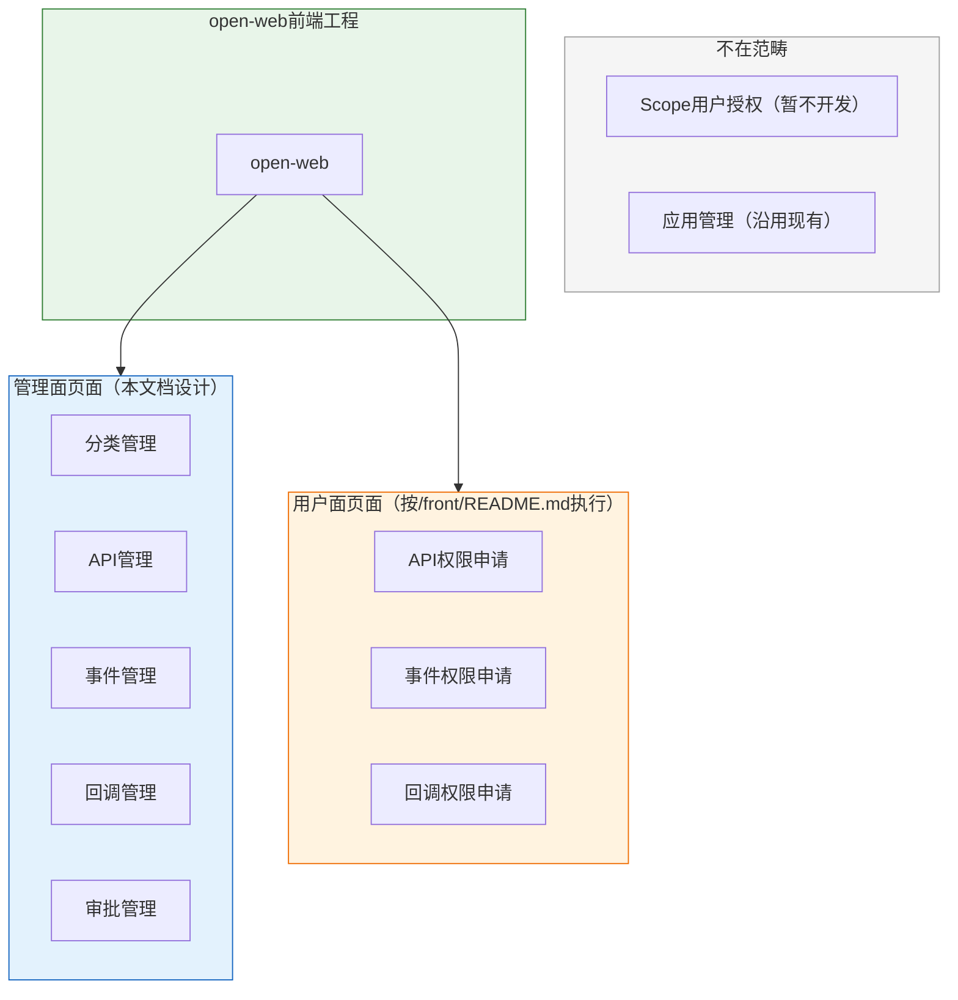

# 前端页面设计：能力开放平台（Capability Open Platform）

**Feature ID**: CAP-OPEN-001  
**规划版本**: v1.25  
**创建日期**: 2026-04-20  
**规划作者**: SDDU Plan Agent  
**规范版本**: spec.md v1.49

---

> ⚠️ **设计流程说明**（参考 plan.md 1.4 章节）：
> - **面向三方应用人员的界面**：统一按照 [`/front/README.md`](../../../front/README.md) 描述的内容和设计流程去执行生成代码
> - **其他页面**（如运营方管理后台、提供方管理后台）：本文档进行详细设计

---

## 1. 页面总览

### 1.1 页面清单

| 页面模块 | 对应 FR | 页面数 | 使用角色 | 设计流程 | 详细设计章节 |
|----------|---------|--------|----------|----------|--------------|
| **分类管理** | FR-001, FR-002 | 2 | 运营方 | 本文档详细设计 | 第2章 |
| **API 管理** | FR-004~FR-007 | 3 | 分类责任人 | 本文档详细设计 | 第3章 |
| **事件管理** | FR-008~FR-011 | 3 | 分类责任人 | 本文档详细设计 | 第4章 |
| **回调管理** | FR-012~FR-015 | 3 | 分类责任人 | 本文档详细设计 | 第5章 |
| **API 权限申请** | FR-016~FR-018 | 2 | 消费方 | 按 `/front/README.md` 执行 | - |
| **事件权限申请** | FR-019~FR-021 | 2 | 消费方 | 按 `/front/README.md` 执行 | - |
| **回调权限申请** | FR-022~FR-024 | 2 | 消费方 | 按 `/front/README.md` 执行 | - |
| **审批管理** | FR-025~FR-027 | 3 | 运营方/审批人 | 本文档详细设计 | 第6章 |
| **Scope 用户授权** | FR-031 | - | 用户 | 暂不开发/不在范畴 | - |
| **应用管理** | FR-016相关 | - | 三方应用人员 | 不涉及，沿用现有 | - |
| **总计** | **FR-001~FR-031** | **18** | - | - | - |

> 注：FR-003（资源类型扩展支持）为架构设计，无独立页面；FR-028~FR-030（消费网关）为数据面功能，无前端管理页面。

### 1.2 页面分层



---

## 2. 分类管理页面

### 2.1 分类列表页

#### 页面路径
`/pages/category/CategoryList.tsx`

#### 页面功能
- 展示分类树形结构
- 新增/编辑/删除分类
- 配置分类责任人
- 查看分类下的资源数量

#### 页面布局
```
+------------------------------------------------------------------+
|  分类管理                                        [+ 新增分类]     |
+------------------------------------------------------------------+
|  [搜索框]  [分类类型筛选]                                        |
+------------------------------------------------------------------+
|                                                                   |
|  📁 API分类 (api)                               [编辑] [删除]     |
|    ├── 📁 用户服务                               [编辑] [删除]    |
|    │     ├── 📄 发送消息 (3个API)                [编辑] [删除]    |
|    │     └── 📄 用户信息 (2个API)                [编辑] [删除]    |
|    └── 📁 消息推送                               [编辑] [删除]    |
|  📁 事件分类 (event)                           [编辑] [删除]     |
|    └── 📄 用户状态变更 (5个事件)                 [编辑] [删除]    |
|  📁 回调分类 (callback)                        [编辑] [删除]     |
|                                                                   |
+------------------------------------------------------------------+
```

#### 交互说明

| 操作 | 触发方式 | 交互效果 |
|------|----------|----------|
| 新增分类 | 点击"新增分类"按钮 | 弹出新增分类表单对话框 |
| 编辑分类 | 点击分类行的"编辑"按钮 | 弹出编辑分类表单对话框 |
| 删除分类 | 点击分类行的"删除"按钮 | 弹出删除确认对话框 |
| 查看详情 | 点击分类名称 | 展开子分类或跳转到资源列表 |
| 配置责任人 | 点击"责任人配置" | 弹出责任人选择对话框 |
| 搜索分类 | 输入搜索关键词 | 实时过滤分类树 |
| 筛选类型 | 选择分类类型下拉 | 过滤显示对应类型的分类树 |

#### 数据来源

| API接口 | 说明 |
|----------|------|
| `GET /api/v1/categories` | 获取分类树列表 |
| `POST /api/v1/categories` | 创建新分类 |
| `PUT /api/v1/categories/{id}` | 更新分类信息 |
| `DELETE /api/v1/categories/{id}` | 删除分类 |
| `GET /api/v1/categories/{id}/owners` | 获取分类责任人 |
| `PUT /api/v1/categories/{id}/owners` | 更新分类责任人 |

---

## 3. API管理页面

### 3.1 API列表页

#### 页面路径
`/pages/api/ApiList.tsx`

#### 页面功能
- 展示API列表
- 搜索/筛选API
- 查看API详情
- 进入API注册/编辑页面

#### 页面布局
```
+------------------------------------------------------------------+
|  API管理                                    [+ 注册API]         |
+------------------------------------------------------------------+
|  [搜索框]  [分类筛选▼]  [状态筛选▼]                              |
+------------------------------------------------------------------+
|                                                                   |
|  API名称         | 分类      | 路径        | 方法 | 状态   | 操作 |
|  发送消息        | 用户服务  | /im/send    | POST | 已发布 | [详情][编辑][删除] |
|  获取用户信息    | 用户服务  | /user/info  | GET  | 已发布 | [详情][编辑][删除] |
|  用户登录        | 用户服务  | /user/login | POST | 草稿   | [详情][编辑][删除] |
|                                                                   |
+------------------------------------------------------------------+
|  [上一页]  1 / 10  [下一页]                  共 50 条           |
+------------------------------------------------------------------+
```

### 3.2 API注册页

#### 页面路径
`/pages/api/ApiRegister.tsx`

#### 页面功能
- 注册新的API
- 配置API基本信息
- 配置API请求参数
- 配置API响应参数

#### 页面布局
```
+------------------------------------------------------------------+
|  注册API                                                          |
+------------------------------------------------------------------+
|                                                                   |
|  基本信息                                                         |
|  +------------------------------------------------------------+ |
|  | API名称（中文）: [__________________]                      | |
|  | API名称（英文）: [__________________]                      | |
|  | 所属分类:       [选择分类▼]                                | |
|  | API路径:        [__________________]  例: /user/info       | |
|  | HTTP方法:       [GET▼]                                     | |
|  | 描述:           [__________________]                       | |
|  +------------------------------------------------------------+ |
|                                                                   |
|  请求参数                                                         |
|  +------------------------------------------------------------+ |
|  | [+ 添加参数]                                               | |
|  | 参数名     | 类型   | 必填 | 描述         | 操作          | |
|  | userId     | String | 是   | 用户ID       | [编辑][删除]  | |
|  | msgType    | String | 是   | 消息类型     | [编辑][删除]  | |
|  +------------------------------------------------------------+ |
|                                                                   |
|  响应参数                                                         |
|  +------------------------------------------------------------+ |
|  | [+ 添加参数]                                               | |
|  | 参数名     | 类型   | 描述         | 操作          |        | |
|  | code      | Int    | 响应码       | [编辑][删除]  |        | |
|  | message   | String | 响应消息     | [编辑][删除]  |        | |
|  | data      | Object | 数据对象     | [编辑][删除]  |        | |
|  +------------------------------------------------------------+ |
|                                                                   |
|  [取消]                                           [提交注册]      |
+------------------------------------------------------------------+
```

---

## 4. 事件管理页面

### 4.1 事件列表页

#### 页面路径
`/pages/event/EventList.tsx`

#### 页面功能
- 展示事件列表
- 搜索/筛选事件
- 查看事件详情
- 进入事件注册/编辑页面

#### 页面布局
```
+------------------------------------------------------------------+
|  事件管理                                   [+ 注册事件]         |
+------------------------------------------------------------------+
|  [搜索框]  [分类筛选▼]  [状态筛选▼]                              |
+------------------------------------------------------------------+
|                                                                   |
|  事件名称         | 分类      | Topic          | 状态   | 操作   |
|  用户状态变更     | 用户服务  | user.status    | 已发布 | [详情][编辑][删除] |
|  消息发送成功     | 消息推送  | msg.send.ok    | 已发布 | [详情][编辑][删除] |
|  新用户注册       | 用户服务  | user.register  | 草稿   | [详情][编辑][删除] |
|                                                                   |
+------------------------------------------------------------------+
|  [上一页]  1 / 5  [下一页]                   共 25 条           |
+------------------------------------------------------------------+
```

---

## 5. 回调管理页面

### 5.1 回调列表页

#### 页面路径
`/pages/callback/CallbackList.tsx`

#### 页面功能
- 展示回调列表
- 搜索/筛选回调
- 查看回调详情
- 进入回调注册/编辑页面

#### 页面布局
```
+------------------------------------------------------------------+
|  回调管理                                   [+ 注册回调]         |
+------------------------------------------------------------------+
|  [搜索框]  [分类筛选▼]  [状态筛选▼]                              |
+------------------------------------------------------------------+
|                                                                   |
|  回调名称         | 分类      | 回调路径        | 状态   | 操作  |
|  订单状态回调     | 交易服务  /callback/order | 已发布 | [详情][编辑][删除] |
|  支付成功回调     | 交易服务  /callback/pay   | 已发布 | [详情][编辑][删除] |
|                                                                   |
+------------------------------------------------------------------+
```

---

## 6. 审批管理页面

> ⚠️ **权限申请页面**：API权限申请、事件权限申请、回调权限申请按 `/front/README.md` 执行，不在本文档详细设计。

### 6.1 待审批列表页

#### 页面路径
`/pages/approval/ApprovalCenter.tsx`

#### 页面功能
- 展示待审批列表
- 查看审批详情
- 执行审批操作（通过/拒绝）

#### 页面布局
```
+------------------------------------------------------------------+
|  审批中心                                                          |
+------------------------------------------------------------------+
|  [我的待审]  [我发起的]  [全部]                                   |
+------------------------------------------------------------------+
|                                                                   |
|  申请编号   | 申请人   | 申请类型   | 申请内容      | 状态  | 操作 |
|  APP-001   | 张三     | API权限    | 发送消息API   | 待审  | [详情][审批] |
|  APP-002   | 李四     | 事件订阅   | 用户状态变更  | 待审  | [详情][审批] |
|  APP-003   | 王五     | API权限    | 用户信息API   | 已通过| [详情]       |
|                                                                   |
+------------------------------------------------------------------+
```

---

## 8. 附录

### 8.1 参考文档

- 规范文档: `spec.md` v1.49
- 技术规划: `plan.md` v1.24
- 前端设计流程: `/front/README.md`

### 8.2 修订记录

| 版本 | 日期 | 修订内容 | 作者 |
|------|------|----------|------|
| v1.0 | 2026-04-20 | 初始版本，从 plan.md 拆分页面设计 | SDDU Plan Agent |
| v1.24 | 2026-04-20 | 调整页面清单：API/事件/回调权限申请改为按/front/README.md执行；Scope授权标记为暂不开发；应用管理标记为不涉及沿用现有 | SDDU Plan Agent |
| v1.25 | 2026-04-20 | 同步页面清单格式：增加"对应FR"和"页面数"列；"审批中心"改为"审批管理"；设计流程表述统一；页面分层图同步更新 | SDDU Plan Agent |

---

**文档状态**: ✅ 页面设计完成  
**下一步**: 配合 `plan.md` 完成技术规划，运行 `@sddu-tasks capability-open-platform` 开始任务分解