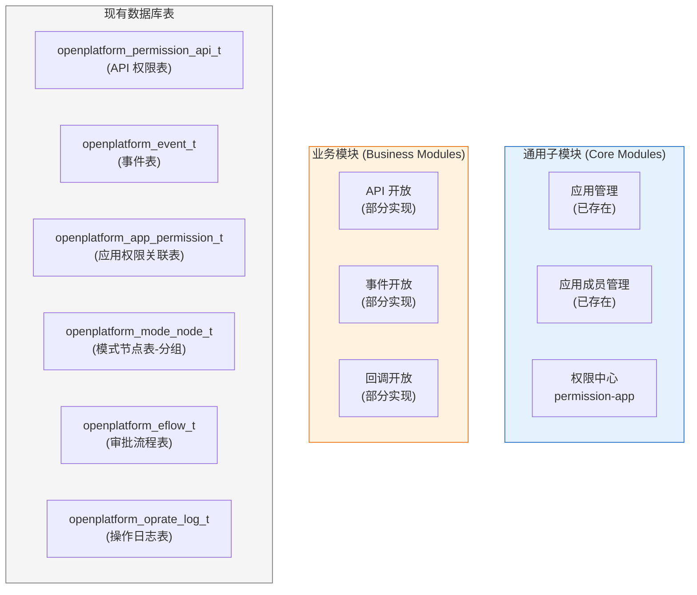
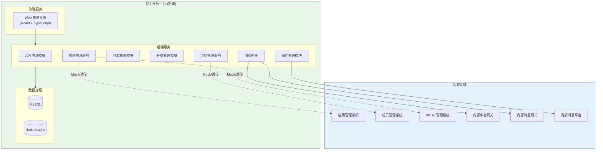
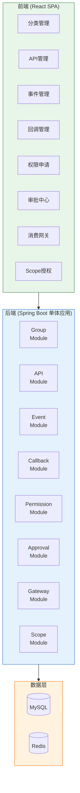
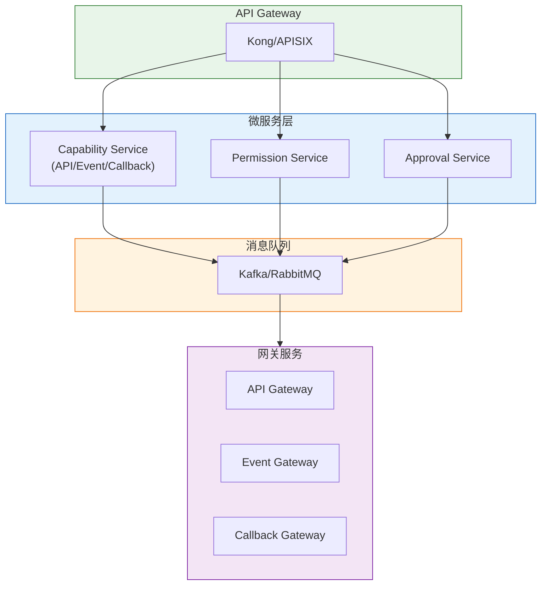
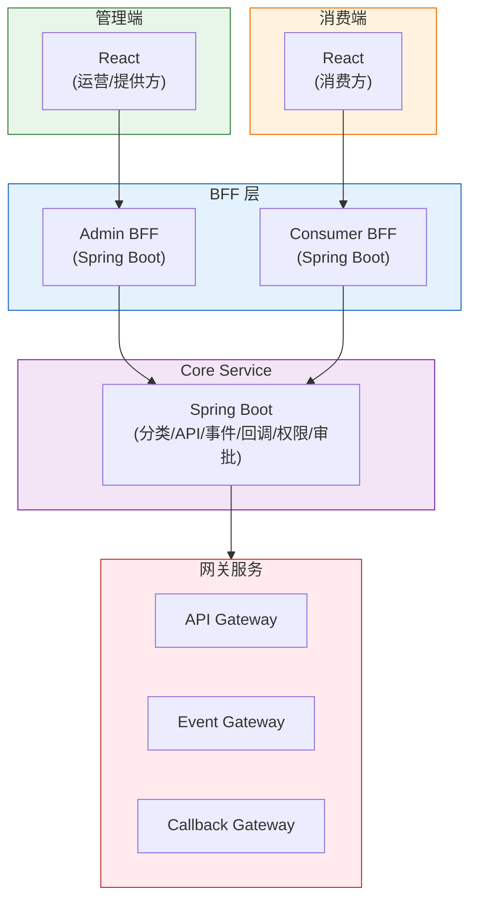
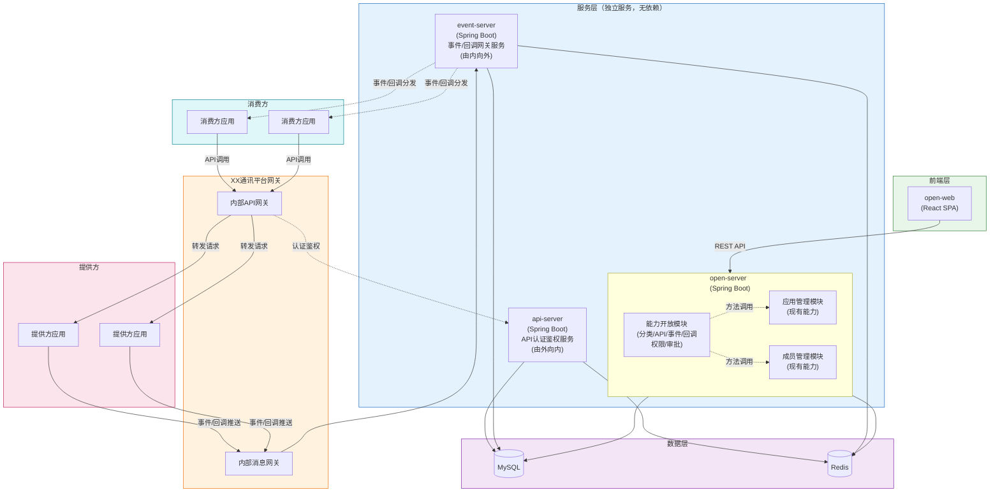
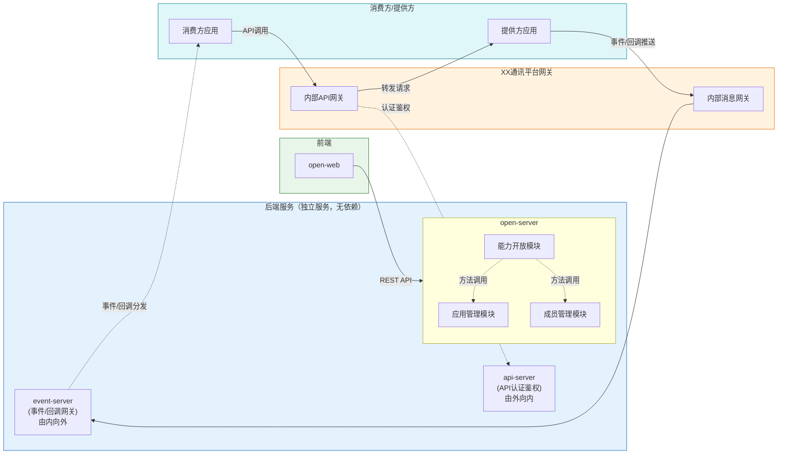
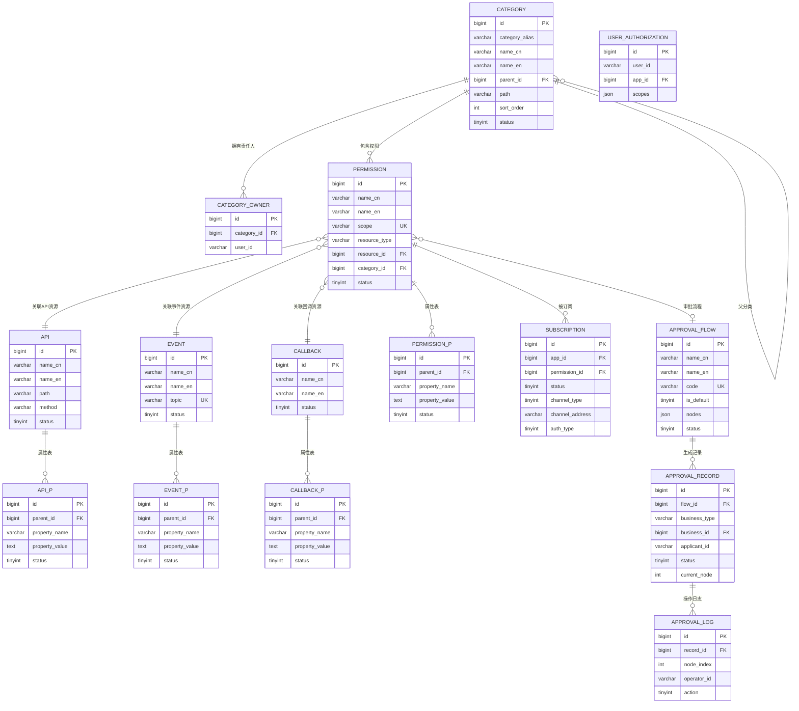

# 技术规划：能力开放平台（Capability Open Platform）

**Feature ID**: CAP-OPEN-001  
**规划版本**: v1.17  
**创建日期**: 2026-04-20  
**规划作者**: SDDU Plan Agent  
**规范版本**: spec.md v1.49

---

## 1. 架构分析

### 1.1 现有系统架构

基于 `docs/业务架构.md` 和 `docs/app-management-spec.json` 分析，现有系统架构如下：



### 1.2 新系统定位

能力开放平台作为 **统一的开放底座**，需要：

| 维度 | 现状 | 目标 |
|------|------|------|
| **API 管理** | 仅支持 API 注册与应用关联 | 支持完整生命周期（注册/编辑/删除/分类/权限树） |
| **事件管理** | 事件注册存在，但权限关联弱 | 支持事件与权限统一注册、通道配置、按应用隔离 |
| **回调管理** | 不存在 | 全新模块，支持通道类型/认证类型配置 |
| **权限模型** | API 与权限混合存储 | 权限资源独立抽象，支持多类型资源 |
| **审批流程** | 基础审批存在 | 动态审批流引擎，支持场景特有审批流 |
| **分类管理** | 存在模式节点表 | 统一分类治理，支持责任人配置 |

### 1.3 依赖关系图



### 1.4 技术栈确认

基于项目实际情况和团队技术栈：

#### 前端技术栈

| 层级 | 技术选型 | 版本 |
|------|----------|------|
| **语言** | TypeScript | 5.x |
| **框架** | React | 18.x |
| **状态管理** | Redux Toolkit / Zustand | - |
| **UI 组件库** | Ant Design / MUI | - |
| **构建工具** | Vite | 5.x |
| **HTTP 客户端** | Axios / React Query | - |
| **表单处理** | React Hook Form | - |
| **测试框架** | Vitest + React Testing Library | - |

#### 前端设计流程

> 💡 **设计流程说明**：
> - **面向三方应用人员的界面**：统一按照 [`/front/README.md`](../../../front/README.md) 描述的内容和设计流程去执行生成代码
> - **其他页面**（如运营方管理后台、提供方管理后台）：可在此 plan.md 文档进行详细设计

#### 后端技术栈

| 层级 | 技术选型 | 版本 |
|------|----------|------|
| **语言** | Java | 21 |
| **构建工具** | Maven | 3.9.x |
| **框架** | Spring Boot | 3.4.6 (Spring 6.2.12) |
| **ORM** | MyBatis | mybatis-spring-boot-starter 3.0.4 |
| **数据库** | MySQL | 5.7 |
| **缓存** | Redis | 6.0 |
| **接口文档** | SpringDoc OpenAPI | 2.x |
| **测试框架** | JUnit 5 + Mockito | - |

---

## 2. 技术方案对比

### 方案 A：单体应用 + 模块化设计（推荐）

#### 方案描述
在一个 Spring Boot 应用中，通过模块化设计实现各功能模块的解耦。前端同样采用单体 React 应用，通过路由和组件划分模块。

#### 架构图



#### 优点
| 优点 | 说明 |
|------|------|
| ✅ 开发效率高 | 统一代码仓库，减少跨服务协调成本 |
| ✅ 部署简单 | 单一部署单元，运维成本低 |
| ✅ 调试方便 | 本地开发无需启动多个服务 |
| ✅ 事务简单 | 模块间调用在同一进程内，事务管理简单 |
| ✅ 符合 MVP | 快速迭代，适合初期建设 |
| ✅ 团队熟悉 | 与现有 app-management 技术栈一致 |

#### 缺点
| 缺点 | 说明 |
|------|------|
| ⚠️ 单点故障 | 应用宕机影响全部功能 |
| ⚠️ 扩展受限 | 无法按模块独立扩缩容 |
| ⚠️ 代码耦合 | 随着功能增加，模块边界可能模糊 |

#### 风险评估
| 风险 | 级别 | 缓解措施 |
|------|------|----------|
| 单点故障 | 中 | 使用 PM2 集群模式 + 负载均衡 |
| 代码耦合 | 中 | 严格模块化设计 + 代码审查 |

#### 预估工作量
| 模块 | 人天 | 说明 |
|------|------|------|
| 前端框架搭建 | 3 | React + Ant Design + 状态管理 |
| 后端框架搭建 | 3 | Spring Boot + MyBatis + 模块划分 |
| 分类管理 | 5 | CRUD + 责任人配置 |
| API 管理 | 8 | 注册/编辑/删除/权限 |
| 事件管理 | 8 | 注册/订阅/通道配置 |
| 回调管理 | 8 | 注册/订阅/通道配置 |
| 权限管理 | 10 | 权限树/申请/审批 |
| 审批管理 | 8 | 审批流配置/执行 |
| 消费网关 | 12 | API/事件/回调网关 |
| Scope 授权 | 5 | OAuth 流程 |
| 测试 & 联调 | 10 | 单元测试 + 集成测试 |
| **总计** | **80** | 约 4 人月 |

---

### 方案 B：微服务架构

#### 方案描述
将能力开放平台拆分为多个独立服务：
- **能力管理服务**：API/事件/回调的注册与管理
- **权限服务**：权限资源管理与订阅关系
- **审批服务**：审批流程引擎
- **网关服务**：消费网关（API/事件/回调）

#### 架构图



#### 优点
| 优点 | 说明 |
|------|------|
| ✅ 独立部署 | 各服务可独立部署和升级 |
| ✅ 独立扩展 | 按服务负载独立扩缩容 |
| ✅ 故障隔离 | 单服务故障不影响其他服务 |
| ✅ 技术异构 | 不同服务可采用不同技术栈 |

#### 缺点
| 缺点 | 说明 |
|------|------|
| ❌ 运维复杂 | 需要服务发现、配置中心、链路追踪等基础设施 |
| ❌ 开发成本高 | 多代码仓库、跨服务调试困难 |
| ❌ 分布式事务 | 跨服务调用需要处理分布式事务 |
| ❌ 不符合 MVP | 初期建设成本过高，ROI 不划算 |

#### 风险评估
| 风险 | 级别 | 缓解措施 |
|------|------|----------|
| 运维复杂 | 高 | 引入 K8s + Istio 服务网格 |
| 分布式事务 | 高 | Saga 模式 + 补偿机制 |
| 团队经验 | 中 | 技术培训 + 外部顾问 |

#### 预估工作量
| 模块 | 人天 | 说明 |
|------|------|------|
| 基础设施搭建 | 15 | K8s + 服务网格 + 配置中心 |
| 服务拆分开发 | 90 | 4 个微服务 + 网关 |
| 服务间通信 | 10 | gRPC + 消息队列 |
| 运维工具 | 10 | 监控 + 日志 + 链路追踪 |
| 测试 & 联调 | 20 | 集成测试 + E2E 测试 |
| **总计** | **145** | 约 7 人月 |

---

### 方案 C：BFF 模式（Backend For Frontend）

#### 方案描述
采用 BFF 模式，为不同前端场景提供专属后端服务：
- **管理端 BFF**：面向运营方和提供方
- **消费端 BFF**：面向消费方
- **网关服务**：独立的消费网关

#### 架构图



#### 优点
| 优点 | 说明 |
|------|------|
| ✅ 前端优化 | BFF 可针对前端场景优化接口 |
| ✅ 关注点分离 | 管理端与消费端逻辑分离 |
| ✅ 扩展性好 | 可为新增前端快速添加 BFF |

#### 缺点
| 缺点 | 说明 |
|------|------|
| ⚠️ 代码重复 | BFF 层可能存在重复逻辑 |
| ⚠️ 维护成本 | 多个服务需要独立维护 |
| ⚠️ 调试复杂 | 跨 BFF 调试链路较长 |

#### 预估工作量
| 模块 | 人天 | 说明 |
|------|------|------|
| Core Service | 50 | 核心业务逻辑 |
| Admin BFF | 15 | 管理端接口聚合 |
| Consumer BFF | 15 | 消费端接口聚合 |
| Gateway Service | 12 | 消费网关 |
| 测试 & 联调 | 15 | 集成测试 |
| **总计** | **107** | 约 5 人月 |

---

### 方案 D：基于现有微服务架构（推荐）

#### 方案描述
基于现有微服务体系，将能力开放平台拆分为 4 个服务：

| 服务 | 职责 | 功能模块 |
|------|------|----------|
| **open-server** | 管理服务 | API管理、事件管理、回调管理、API权限管理、事件权限管理、审批管理 |
| **open-web** | 前端应用 | 对应 open-server 的前端界面 |
| **api-server** | API网关服务 | API消费网关、回调消费网关、Scope授权 |
| **event-server** | 事件网关服务 | 事件消费网关 |

#### 架构图



#### 服务职责明细

##### open-server（管理服务）

| 模块 | 功能说明 |
|------|----------|
| **分类管理** | 分类的 CRUD、树形结构维护、责任人配置 |
| **API管理** | API 注册、编辑、删除、版本管理 |
| **事件管理** | 事件注册、订阅配置、通道配置 |
| **回调管理** | 回调注册、订阅配置、通道配置 |
| **API权限管理** | API 权限资源管理、订阅关系维护 |
| **事件权限管理** | 事件权限资源管理、订阅关系维护 |
| **审批管理** | 审批流程配置、审批执行、审批记录 |

##### open-web（前端应用）

| 模块 | 功能说明 |
|------|----------|
| **分类管理页面** | 分类树管理、责任人配置 |
| **API管理页面** | API 列表、编辑、权限配置 |
| **事件管理页面** | 事件列表、编辑、订阅配置 |
| **回调管理页面** | 回调列表、编辑、订阅配置 |
| **权限申请页面** | 权限树浏览、权限申请 |
| **审批中心页面** | 待审批列表、审批操作 |

##### api-server（API认证鉴权服务）

> **使用者**：XX 通讯平台内部 API 网关，用于完成 API 调用的认证鉴权
> 
> **调用方向**：由外向内（消费方 → 提供方）

| 模块 | 功能说明 |
|------|----------|
| **API认证鉴权** | 接收内部API网关的认证鉴权请求，验证消费方对API的访问权限 |
| **Scope授权** | OAuth 2.0 Scope 授权流程 |

##### event-server（事件/回调网关服务）

> **使用者**：提供方应用，通过 XX 通讯平台内部消息网关访问
> 
> **调用方向**：由内向外（提供方 → 消费方）

| 模块 | 功能说明 |
|------|----------|
| **事件消费网关** | 接收提供方的事件推送，分发至订阅的消费方 |
| **回调消费网关** | 接收提供方的回调推送，分发至订阅的消费方 |

#### 优点
| 优点 | 说明 |
|------|------|
| ✅ 符合现有架构 | 与现有微服务架构一致，无需引入新技术栈 |
| ✅ 服务职责清晰 | 管理服务与网关服务分离，职责单一 |
| ✅ 独立扩展 | 网关服务可根据流量独立扩缩容 |
| ✅ 故障隔离 | 管理服务故障不影响网关服务 |
| ✅ 团队熟悉 | 沿用现有微服务开发模式，学习成本低 |

#### 缺点
| 缺点 | 说明 |
|------|------|
| ⚠️ 服务数量增加 | 新增 4 个服务，运维成本略增 |
| ⚠️ 服务间协调 | 需要处理服务间调用和数据一致性 |
| ⚠️ 部署复杂度 | 需要协调多个服务的部署顺序 |

#### 风险评估
| 风险 | 级别 | 缓解措施 |
|------|------|----------|
| 服务间调用 | 中 | 使用 Feign + 熔断降级 |
| 数据一致性 | 中 | 本地事务 + 最终一致性 |
| 部署协调 | 低 | CI/CD 流水线自动化 |

#### 预估工作量
| 服务 | 人天 | 说明 |
|------|------|------|
| open-server | 35 | 管理端核心业务逻辑 |
| open-web | 20 | 前端页面开发 |
| api-server | 12 | API认证鉴权 + Scope授权 |
| event-server | 12 | 事件/回调网关 |
| 公共模块 | 10 | 共享类型、工具类 |
| 测试 & 联调 | 15 | 单元测试 + 集成测试 |
| **总计** | **104** | 约 5 人月 |

---

### 方案推荐

| 维度 | 方案 A（单体） | 方案 B（微服务） | 方案 C（BFF） | 方案 D（现有微服务） |
|------|---------------|-----------------|---------------|---------------------|
| **开发效率** | ⭐⭐⭐⭐⭐ | ⭐⭐ | ⭐⭐⭐⭐ | ⭐⭐⭐⭐ |
| **运维成本** | ⭐⭐⭐⭐⭐ | ⭐⭐ | ⭐⭐⭐ | ⭐⭐⭐⭐ |
| **扩展性** | ⭐⭐⭐ | ⭐⭐⭐⭐⭐ | ⭐⭐⭐⭐ | ⭐⭐⭐⭐⭐ |
| **MVP 适配** | ⭐⭐⭐⭐⭐ | ⭐⭐ | ⭐⭐⭐⭐ | ⭐⭐⭐⭐ |
| **团队匹配** | ⭐⭐⭐⭐⭐ | ⭐⭐⭐ | ⭐⭐⭐⭐ | ⭐⭐⭐⭐⭐ |
| **架构一致性** | ⭐⭐⭐ | ⭐⭐⭐⭐ | ⭐⭐⭐ | ⭐⭐⭐⭐⭐ |
| **预估工期** | 80 人天 | 145 人天 | 107 人天 | 103 人天 |

**推荐方案：方案 D（基于现有微服务架构）**

**推荐理由**：
1. **架构一致性**：与现有微服务架构完全一致，无需引入新的架构模式
2. **团队匹配度高**：团队已具备微服务开发经验，学习成本最低
3. **职责清晰**：管理服务与网关服务分离，符合业务域划分
4. **扩展性好**：网关服务可根据流量独立扩缩容
5. **故障隔离**：管理服务故障不影响网关服务的高可用

---

## 3. 文件影响分析

### 3.1 目录结构规划

```
open-app/
├── services/                           # 服务目录（新增）
│   │
│   ├── open-server/                    # 管理服务
│   │   ├── src/
│   │   │   ├── main/
│   │   │   │   ├── java/
│   │   │   │   │   └── com/xxx/open/
│   │   │   │   │       ├── modules/
│   │   │   │   │       │   ├── category/           # 分类管理模块
│   │   │   │   │       │   ├── api/               # API 管理模块
│   │   │   │   │       │   ├── event/             # 事件管理模块
│   │   │   │   │       │   ├── callback/          # 回调管理模块
│   │   │   │   │       │   ├── permission/        # 权限管理模块（API+事件权限）
│   │   │   │   │       │   └── approval/          # 审批管理模块
│   │   │   │   │       ├── common/                # 公共模块
│   │   │   │   │       │   ├── config/            # 配置
│   │   │   │   │       │   ├── exception/         # 异常处理
│   │   │   │   │       │   ├── interceptor/       # 拦截器
│   │   │   │   │       │   └── util/              # 工具类
│   │   │   │   │       └── OpenServerApplication.java
│   │   │   │   └── resources/
│   │   │   │       ├── mapper/                    # MyBatis Mapper XML
│   │   │   │       └── application.yml
│   │   │   └── test/
│   │   ├── pom.xml
│   │   └── README.md
│   │
│   ├── api-server/                    # API网关服务
│   │   ├── src/
│   │   │   ├── main/
│   │   │   │   ├── java/
│   │   │   │   │   └── com/xxx/api/
│   │   │   │   │       ├── gateway/
│   │   │   │   │       │   ├── ApiGateway.java            # API消费网关
│   │   │   │   │       │   └── CallbackGateway.java       # 回调消费网关
│   │   │   │   │       ├── scope/
│   │   │   │   │       │   ├── ScopeController.java        # Scope授权控制器
│   │   │   │   │       │   └── ScopeService.java          # Scope授权服务
│   │   │   │   │       ├── common/
│   │   │   │   │       │   ├── config/
│   │   │   │   │       │   ├── filter/
│   │   │   │   │       │   └── util/
│   │   │   │   │       └── ApiServerApplication.java
│   │   │   │   └── resources/
│   │   │   │       └── application.yml
│   │   │   └── test/
│   │   ├── pom.xml
│   │   └── README.md
│   │
│   └── event-server/                  # 事件/回调网关服务
│       ├── src/
│       │   ├── main/
│       │   │   ├── java/
│       │   │   │   └── com/xxx/event/
│       │   │   │       ├── gateway/
│       │   │   │       │   ├── EventGateway.java          # 事件消费网关
│       │   │   │       │   └── CallbackGateway.java       # 回调消费网关
│       │   │   │       ├── common/
│       │   │   │       │   ├── config/
│       │   │   │       │   ├── filter/
│       │   │   │       │   └── util/
│       │   │   │       └── EventServerApplication.java
│       │   │   └── resources/
│       │   │       └── application.yml
│       │   └── test/
│       ├── pom.xml
│       └── README.md
│
├── web/                                # 前端应用目录
│   └── open-web/                       # 管理端前端
│       ├── src/
│       │   ├── pages/
│       │   │   ├── category/           # 分类管理页面
│       │   │   ├── api/               # API 管理页面
│       │   │   ├── event/             # 事件管理页面
│       │   │   ├── callback/          # 回调管理页面
│       │   │   ├── permission/        # 权限申请页面
│       │   │   ├── approval/          # 审批中心页面
│       │   │   └── scope/             # Scope 授权页面
│       │   ├── components/            # 公共组件
│       │   ├── hooks/                 # 自定义 Hooks
│       │   ├── services/              # API 服务
│       │   ├── stores/                # 状态管理
│       │   ├── utils/                 # 工具函数
│       │   └── App.tsx
│       ├── public/
│       ├── package.json
│       ├── vite.config.ts
│       └── tsconfig.json
│
├── packages/                          # 公共包
│   ├── open-common/                   # 共享公共模块
│   │   ├── src/
│   │   │   ├── entity/               # 共享实体类
│   │   │   ├── dto/                  # 共享 DTO
│   │   │   ├── enums/                # 共享枚举
│   │   │   └── util/                 # 共享工具类
│   │   └── pom.xml
│   │
│   └── shared-types/                  # 共享类型定义（前端使用）
│       ├── src/
│       │   ├── api.ts
│       │   ├── event.ts
│       │   ├── callback.ts
│       │   ├── permission.ts
│       │   └── approval.ts
│       └── package.json
│
└── docs/                              # 文档
```

### 3.2 服务职责划分

| 服务 | 职责 | 使用者 | 调用方向 | 端口（建议） |
|------|------|--------|----------|-------------|
| **open-server** | 管理服务：分类管理、API/事件/回调管理、权限管理、审批管理 | open-web | - | 8080 |
| **api-server** | API认证鉴权服务：API认证鉴权、Scope授权 | XX通讯平台内部API网关 | 由外向内 | 8081 |
| **event-server** | 事件/回调网关服务：事件消费网关、回调消费网关 | XX通讯平台内部消息网关 | 由内向外 | 8082 |
| **open-web** | 前端应用：对应 open-server 的管理界面 | 运营方/提供方/消费方管理员 | - | 3000 |

### 3.3 服务间调用关系



### 3.4 文件清单

#### 新建文件（[NEW]）

##### open-server 服务

| 文件路径 | 说明 |
|----------|------|
| `services/open-server/pom.xml` | 后端项目配置 |
| `services/open-server/src/main/java/.../OpenServerApplication.java` | 应用入口 |
| `services/open-server/src/main/java/.../modules/category/CategoryController.java` | 分类管理控制器 |
| `services/open-server/src/main/java/.../modules/category/CategoryService.java` | 分类管理服务 |
| `services/open-server/src/main/java/.../modules/category/entity/Category.java` | 分类实体 |
| `services/open-server/src/main/java/.../modules/category/mapper/CategoryMapper.java` | 分类 Mapper |
| `services/open-server/src/main/java/.../modules/api/ApiController.java` | API 管理控制器 |
| `services/open-server/src/main/java/.../modules/api/ApiService.java` | API 管理服务 |
| `services/open-server/src/main/java/.../modules/api/entity/Api.java` | API 实体 |
| `services/open-server/src/main/java/.../modules/api/mapper/ApiMapper.java` | API Mapper |
| `services/open-server/src/main/java/.../modules/event/EventController.java` | 事件管理控制器 |
| `services/open-server/src/main/java/.../modules/event/EventService.java` | 事件管理服务 |
| `services/open-server/src/main/java/.../modules/event/entity/Event.java` | 事件实体 |
| `services/open-server/src/main/java/.../modules/event/mapper/EventMapper.java` | 事件 Mapper |
| `services/open-server/src/main/java/.../modules/callback/CallbackController.java` | 回调管理控制器 |
| `services/open-server/src/main/java/.../modules/callback/CallbackService.java` | 回调管理服务 |
| `services/open-server/src/main/java/.../modules/callback/entity/Callback.java` | 回调实体 |
| `services/open-server/src/main/java/.../modules/callback/mapper/CallbackMapper.java` | 回调 Mapper |
| `services/open-server/src/main/java/.../modules/permission/PermissionController.java` | 权限管理控制器 |
| `services/open-server/src/main/java/.../modules/permission/PermissionService.java` | 权限管理服务 |
| `services/open-server/src/main/java/.../modules/permission/entity/Permission.java` | 权限实体 |
| `services/open-server/src/main/java/.../modules/permission/entity/Subscription.java` | 订阅实体 |
| `services/open-server/src/main/java/.../modules/approval/ApprovalController.java` | 审批管理控制器 |
| `services/open-server/src/main/java/.../modules/approval/ApprovalService.java` | 审批管理服务 |
| `services/open-server/src/main/java/.../modules/approval/entity/ApprovalFlow.java` | 审批流实体 |
| `services/open-server/src/main/java/.../modules/approval/entity/ApprovalRecord.java` | 审批记录实体 |
| `services/open-server/src/main/java/.../common/config/MockConfig.java` | Mock 配置 |
| `services/open-server/src/main/java/.../common/interceptor/MockInterceptor.java` | Mock 拦截器 |
| `services/open-server/src/main/resources/application.yml` | 应用配置 |
| `services/open-server/src/main/resources/mapper/*.xml` | MyBatis Mapper XML |

##### api-server 服务

| 文件路径 | 说明 |
|----------|------|
| `services/api-server/pom.xml` | 后端项目配置 |
| `services/api-server/src/main/java/.../ApiServerApplication.java` | 应用入口 |
| `services/api-server/src/main/java/.../gateway/ApiGateway.java` | API消费网关 |
| `services/api-server/src/main/java/.../gateway/CallbackGateway.java` | 回调消费网关 |
| `services/api-server/src/main/java/.../scope/ScopeController.java` | Scope授权控制器 |
| `services/api-server/src/main/java/.../scope/ScopeService.java` | Scope授权服务 |
| `services/api-server/src/main/resources/application.yml` | 应用配置 |

##### event-server 服务

| 文件路径 | 说明 |
|----------|------|
| `services/event-server/pom.xml` | 后端项目配置 |
| `services/event-server/src/main/java/.../EventServerApplication.java` | 应用入口 |
| `services/event-server/src/main/java/.../gateway/EventGateway.java` | 事件消费网关 |
| `services/event-server/src/main/java/.../gateway/CallbackGateway.java` | 回调消费网关 |
| `services/event-server/src/main/resources/application.yml` | 应用配置 |

##### open-web 前端

| 文件路径 | 说明 |
|----------|------|
| `web/open-web/package.json` | 前端项目配置 |
| `web/open-web/src/main.tsx` | 前端入口 |
| `web/open-web/src/App.tsx` | 应用根组件 |
| `web/open-web/src/router/index.tsx` | 路由配置 |
| `web/open-web/src/pages/category/CategoryList.tsx` | 分类列表页面 |
| `web/open-web/src/pages/api/ApiList.tsx` | API 列表页面 |
| `web/open-web/src/pages/api/ApiRegister.tsx` | API 注册页面 |
| `web/open-web/src/pages/event/EventList.tsx` | 事件列表页面 |
| `web/open-web/src/pages/callback/CallbackList.tsx` | 回调列表页面 |
| `web/open-web/src/pages/permission/PermissionTree.tsx` | 权限树组件 |
| `web/open-web/src/pages/approval/ApprovalCenter.tsx` | 审批中心页面 |
| `web/open-web/src/components/PermissionDrawer.tsx` | 权限选择抽屉 |
| `web/open-web/src/services/api.service.ts` | API 服务 |
| `web/open-web/src/stores/permission.store.ts` | 权限状态 |

##### 公共模块

| 文件路径 | 说明 |
|----------|------|
| `packages/open-common/pom.xml` | 公共模块配置 |
| `packages/open-common/src/main/java/.../entity/*.java` | 共享实体类 |
| `packages/open-common/src/main/java/.../dto/*.java` | 共享 DTO |
| `packages/open-common/src/main/java/.../enums/*.java` | 共享枚举 |
| `packages/shared-types/package.json` | 共享类型配置 |
| `packages/shared-types/src/index.ts` | 类型导出 |

#### 修改文件（[MODIFY]）

| 文件路径 | 修改内容 |
|----------|----------|
| `pom.xml` | 添加模块配置（Maven 多模块） |
| `web/open-web/tsconfig.json` | 添加 paths 配置 |
| `.env.example` | 添加新环境变量示例 |

#### 依赖文件（[DEPEND]）

| 文件路径 | 依赖方式 |
|----------|----------|
| 现有 `应用管理模块` | open-server 内部模块，方法调用 |
| 现有 `成员管理模块` | open-server 内部模块，方法调用 |
| 现有 `AKSK 管理系统` | 待确认（Feign/方法调用） |
| 现有 `内部中台网关` | HTTP 调用 |
| 现有 `内部消息网关` | HTTP/MQ 调用 |

---

## 4. 数据库设计

### 4.1 ER 图



> 💡 **核心关系说明**：
> - **分类树形结构**：`CATEGORY` 通过 `parent_id` 实现树形层级，支持多级分类
> - **分类包含权限**：`CATEGORY` 直接关联 `PERMISSION`，分类下展示的是权限数据
> - **权限关联资源**：`PERMISSION` 通过 `resource_type` + `resource_id` 关联具体的 API/事件/回调资源
> - **权限树展示**：分类树 + 权限列表 = 权限树，权限数据可附带展示对应资源的部分字段
> - **属性表**：`API_P`、`EVENT_P`、`CALLBACK_P`、`PERMISSION_P` 存储扩展属性，KV 模式灵活扩展

#### 分类类型说明

分类表通过 `category_alias` 字段区分不同的权限树，**每种凭证类型对应一棵独立的权限树**：

| category_alias 示例 | 说明 | 对应凭证 |
|--------------------|------|----------|
| `app_type_a` | A类应用权限树 | A类应用凭证 |
| `app_type_b` | B类应用权限树 | B类应用凭证 |
| `personal_aksk` | 个人AKSK权限树 | AKSK个人凭证 |
| `...` | 其他类型 | 其他凭证类型 |

**枚举值命名规范**：
- 格式：`{身份类型}_{凭证类型}`
- 使用小写字母 + 下划线
- 具体枚举值由前后端约定

**设计规则**：
- **只有根分类**需要设置 `category_alias`，子分类为 NULL
- 权限通过 `category_id` 关联分类，间接归属于某棵权限树
- 不同权限树之间完全隔离

**查询子分类所属权限树**：

通过 `path` 字段找到根节点，再查根节点的 `category_alias`：

```sql
-- 从子分类的 path 解析根节点 ID，查询权限树类型
SELECT root.category_alias
FROM openplatform_category_t child
JOIN openplatform_category_t root 
  ON root.id = CAST(SUBSTRING_INDEX(SUBSTRING_INDEX(child.path, '/', 2), '/', -1) AS UNSIGNED)
WHERE child.id = :category_id;
```

**子树查询优化（路径枚举法）**：

通过 `path` 字段存储从根节点到当前节点的路径，优化查询某节点及其所有子节点关联权限的场景：

| id | category_alias | name_cn | parent_id | path |
|----|----------------|---------|-----------|------|
| 1 | `app_type_a` | 根分类 | NULL | `/1/` |
| 2 | NULL | 子分类A | 1 | `/1/2/` |
| 3 | NULL | 子分类B | 1 | `/1/3/` |
| 4 | NULL | 孙分类A1 | 2 | `/1/2/4/` |

```sql
-- 查询节点2及其所有子节点的权限
SELECT p.* 
FROM openplatform_permission_t p
JOIN openplatform_category_t c ON p.category_id = c.id
WHERE c.path LIKE '/1/2/%';
```

> ⚠️ **注意**：
> - ER 图简化展示，属性表只显示核心字段（id、parent_id、property_name、property_value、status）
> - 属性表必备四个审计字段（create_time、last_update_time、create_by、last_update_by）已在规范中定义
> - 图中 `FK` 表示逻辑外键，不使用物理外键约束

#### Scope 命名规范

权限的 `scope` 字段命名遵循 `{资源类型}:{模块}:{资源标识}` 格式，确保全局唯一：

| 资源类型 | Scope 示例 | 说明 |
|----------|------------|------|
| API | `api:im:send-message` | IM 模块发送消息 API |
| API | `api:im:get-message` | IM 模块获取消息 API |
| Event | `event:im:message-received` | IM 模块消息接收事件 |
| Event | `event:meeting:meeting-started` | 会议模块会议开始事件 |
| Callback | `callback:approval:approval-completed` | 审批模块审批完成回调 |

**命名规则**：

| 部分 | 说明 | 示例 |
|------|------|------|
| `{资源类型}` | api / event / callback | `api` |
| `{模块}` | 业务模块名 | `im`、`meeting`、`approval` |
| `{资源标识}` | 具体资源的唯一标识 | `send-message`、`message-received` |

> 💡 **说明**：
> - **资源类型前缀**：确保 scope 全局唯一，避免不同类型资源冲突
> - **scope**：权限的外部标识，用于 OAuth 授权和消费方使用
> - **唯一性**：scope 在权限表全局唯一
> - 只有 **权限（PERMISSION）** 才有 `scope` 属性

### 4.2 表设计规则

遵循现有系统的数据库设计规范，统一命名和字段约定：

#### 命名规范

| 规则 | 说明 | 示例 |
|------|------|------|
| **表前缀** | 统一使用 `openplatform_` 前缀 | `openplatform_permission_api_t` |
| **表后缀** | 统一使用 `_t` 后缀表示表 | `openplatform_eflow_t` |
| **属性表后缀** | 扩展属性表使用 `_p_t` 后缀 | `openplatform_permission_api_p_t` |
| **命名风格** | 小写字母 + 下划线分隔 | `user_authorizations` → `openplatform_user_authorization_t` |

#### 主表与属性表设计规范

对于一般业务对象，采用 **主表 + 属性表** 的设计模式：

**主表设计原则**：

| 原则 | 说明 |
|------|------|
| **字段选择** | 存储业务对象的常用字段 |
| **列表展示** | 涉及在对象列表中展示的字段 |
| **搜索条件** | 作为列表搜索条件的字段 |
| **示例** | `name_cn`、`name_en`、`status`、`category_id` 等 |

**属性表设计规范**：

| 规则 | 说明 | 示例 |
|------|------|------|
| **用途** | 存储仅在对象详情中涉及的不常用字段 | 扩展配置、元数据等 |
| **表名格式** | `{前缀}_{业务对象名}_p_t` | `openplatform_api_p_t` |
| **表名示例** | API 属性表 → `openplatform_api_p_t` | |
| **表名示例** | 事件属性表 → `openplatform_event_p_t` | |
| **表名示例** | 权限属性表 → `openplatform_permission_p_t` | |

**属性表必备字段**：

| 字段名 | 类型 | 说明 |
|--------|------|------|
| `id` | BIGINT(20) | 主键，雪花ID |
| `parent_id` | BIGINT(20) | 父表ID（关联主表） |
| `property_name` | VARCHAR(100) | 属性名称 |
| `property_value` | TEXT | 属性值 |
| `status` | TINYINT(10) | 状态（0=禁用, 1=启用） |
| `create_time` | DATETIME(3) | 创建时间 |
| `last_update_time` | DATETIME(3) | 更新时间 |
| `create_by` | VARCHAR(100) | 创建人账号 |
| `last_update_by` | VARCHAR(100) | 更新人账号 |

**属性表示例**：

```sql
CREATE TABLE `openplatform_api_p_t` (
    `id` BIGINT(20) PRIMARY KEY,
    `parent_id` BIGINT(20) NOT NULL COMMENT '关联 API 主表 ID',
    `property_name` VARCHAR(100) NOT NULL COMMENT '属性名称',
    `property_value` TEXT COMMENT '属性值',
    `status` TINYINT(10) DEFAULT 1 COMMENT '0=禁用, 1=启用',
    `create_time` DATETIME(3) DEFAULT CURRENT_TIMESTAMP(3),
    `last_update_time` DATETIME(3) DEFAULT CURRENT_TIMESTAMP(3) ON UPDATE CURRENT_TIMESTAMP(3),
    `create_by` VARCHAR(100),
    `last_update_by` VARCHAR(100),
    KEY `idx_parent_id` (`parent_id`),
    KEY `idx_property_name` (`property_name`)
) ENGINE=InnoDB DEFAULT CHARSET=utf8mb4 COMMENT='API属性表';
```

> 💡 **说明**：
> - 属性表采用 **KV 模式**，灵活存储各种扩展属性
> - 属性名 `property_name` 和属性值 `property_value` 支持动态扩展
> - 主表保持简洁，便于列表查询和搜索
> - 属性表存放详情，避免主表字段膨胀

#### 名称和描述字段规范

涉及名称、描述场景的字段，统一使用中英文双语：

| 字段类型 | 字段命名 | 类型 | 说明 |
|----------|----------|------|------|
| **名称** | `name_cn` | VARCHAR(100) | 中文名称 |
| **名称** | `name_en` | VARCHAR(100) | 英文名称 |
| **描述** | `description_cn` | TEXT | 中文描述 |
| **描述** | `description_en` | TEXT | 英文描述 |

> 💡 **说明**：
> - 名称字段 `name_cn` 和 `name_en` 均为必填
> - 描述字段 `description_cn` 和 `description_en` 可选
> - 支持国际化场景，便于多语言展示

#### 必备审计字段

所有业务表必须包含以下四个审计字段：

| 字段名 | 类型 | 说明 |
|--------|------|------|
| `create_time` | DATETIME(3) | 创建时间，默认 CURRENT_TIMESTAMP(3) |
| `last_update_time` | DATETIME(3) | 更新时间，默认 CURRENT_TIMESTAMP(3) ON UPDATE CURRENT_TIMESTAMP(3) |
| `create_by` | VARCHAR(100) | 创建人账号 |
| `last_update_by` | VARCHAR(100) | 更新人账号 |

> 💡 **说明**：时间字段统一使用 `DATETIME(3)` 精确到毫秒，确保高并发场景下的时间精度。

#### 主键规范

| 规则 | 说明 |
|------|------|
| **主键类型** | BIGINT(20)，雪花ID |
| **主键命名** | 统一使用 `id` |
| **生成策略** | 应用层生成雪花ID，不使用数据库自增 |
| **关联字段** | 使用逻辑外键（存储关联 ID），不使用物理外键约束 |

#### 索引规范

| 规则 | 说明 |
|------|------|
| **索引命名** | `idx_字段名` 或 `idx_字段名1_字段名2` |
| **唯一索引命名** | `uk_字段名` |

> ⚠️ **禁止使用外键**：所有表关联关系通过存储逻辑字段实现，不使用数据库物理外键约束（FOREIGN KEY）。关联关系由应用层维护。

#### 枚举字段规范

| 规则 | 说明 |
|------|------|
| **字段类型** | 统一使用 `TINYINT` |
| **字段长度** | `TINYINT(10)`，显示宽度 10 位 |
| **默认值** | 使用数字默认值，如 `DEFAULT 0` |
| **注释说明** | 在 COMMENT 中说明枚举值含义 |

**枚举值示例**：

| 字段 | 枚举值 | 说明 |
|------|--------|------|
| `status` (资源状态) | 0=草稿, 1=待审, 2=已发布, 3=已下线 | draft, pending, published, offline |
| `status` (订阅状态) | 0=待审, 1=已授权, 2=已拒绝, 3=已取消 | pending, approved, rejected, cancelled |
| `status` (审批状态) | 0=待审, 1=已通过, 2=已拒绝, 3=已撤销 | pending, approved, rejected, cancelled |
| `is_default` | 0=否, 1=是 | 布尔类型枚举 |

#### 规划表正式命名对照

| 规划表名 | 正式表名 | 说明 |
|----------|----------|------|
| `categories` | `openplatform_category_t` | 分类主表 |
| `category_owners` | `openplatform_category_owner_t` | 分类责任人关联表 |
| `apis` | `openplatform_api_t` | API 资源主表 |
| `apis_p` | `openplatform_api_p_t` | API 资源属性表 |
| `events` | `openplatform_event_t` | 事件资源主表 |
| `events_p` | `openplatform_event_p_t` | 事件资源属性表 |
| `callbacks` | `openplatform_callback_t` | 回调资源主表 |
| `callbacks_p` | `openplatform_callback_p_t` | 回调资源属性表 |
| `permissions` | `openplatform_permission_t` | 权限资源主表 |
| `permissions_p` | `openplatform_permission_p_t` | 权限资源属性表 |
| `subscriptions` | `openplatform_subscription_t` | 订阅关系表 |
| `approval_flows` | `openplatform_approval_flow_t` | 审批流程模板表 |
| `approval_records` | `openplatform_approval_record_t` | 审批记录表 |
| `approval_logs` | `openplatform_approval_log_t` | 审批操作日志表 |
| `user_authorizations` | `openplatform_user_authorization_t` | 用户授权表 |

> 💡 **主表+属性表模式说明**：
> - **使用主表+属性表的对象**：API、事件、回调、权限（4 个业务对象）
> - **不使用属性表的对象**：分类、订阅、审批流程、审批记录、用户授权（固定字段，无需扩展）
> - **主表存储**：列表展示字段、搜索条件字段（name、status、path、method、topic 等）
> - **属性表存储**：详情展示字段、扩展属性（description、doc_url、approval_flow_id 等）

### 4.3 与现有表的关系

基于 spec.md §5.4 数据库表清单，规划表与现有表的对照关系如下：

| 正式表名 | 现有表 | 关系 | 处理策略 |
|----------|--------|------|----------|
| `openplatform_category_t` | `openplatform_mode_node_t` | 扩展 | 新建表，后续迁移数据 |
| `openplatform_category_owner_t` | - | 新建 | 分类责任人关联表 |
| `openplatform_api_t` | `openplatform_permission_api_t` | 扩展 | 新建表，保留原有表 |
| `openplatform_api_p_t` | - | 新建 | API 资源属性表 |
| `openplatform_event_t` | 现有同名表 | 扩展 | 新建表，保留原有表 |
| `openplatform_event_p_t` | - | 新建 | 事件资源属性表 |
| `openplatform_callback_t` | - | 新建 | 回调资源主表 |
| `openplatform_callback_p_t` | - | 新建 | 回调资源属性表 |
| `openplatform_permission_t` | - | 新建 | 权限资源主表（核心抽象） |
| `openplatform_permission_p_t` | - | 新建 | 权限资源属性表 |
| `openplatform_subscription_t` | `openplatform_app_permission_t` | 扩展 | 新建表，后续迁移数据 |
| `openplatform_approval_flow_t` | `openplatform_eflow_t` | 扩展 | 新建表，保留原有表 |
| `openplatform_approval_record_t` | `openplatform_eflow_log_t` | 扩展 | 新建表，保留原有表 |
| `openplatform_approval_log_t` | - | 新建 | 审批操作日志表 |
| `openplatform_user_authorization_t` | - | 新建 | 用户授权表（Scope 授权） |

**汇总**：
- 扩展现有表：6 个（主表）
- 纯新建主表：5 个（`openplatform_category_owner_t`、`openplatform_callback_t`、`openplatform_permission_t`、`openplatform_approval_log_t`、`openplatform_user_authorization_t`）
- 新建属性表：4 个（`openplatform_api_p_t`、`openplatform_event_p_t`、`openplatform_callback_p_t`、`openplatform_permission_p_t`）
- **总表数**：15 个

### 4.4 表结构设计

详细的表结构设计请参阅：[plan-db.md](./plan-db.md)

**表清单汇总**：

| 表名 | 类型 | 说明 |
|------|------|------|
| `openplatform_category_t` | 主表 | 分类表 |
| `openplatform_category_owner_t` | 关联表 | 分类责任人关联表 |
| `openplatform_api_t` | 主表 | API资源主表 |
| `openplatform_api_p_t` | 属性表 | API资源属性表 |
| `openplatform_event_t` | 主表 | 事件资源主表 |
| `openplatform_event_p_t` | 属性表 | 事件资源属性表 |
| `openplatform_callback_t` | 主表 | 回调资源主表 |
| `openplatform_callback_p_t` | 属性表 | 回调资源属性表 |
| `openplatform_permission_t` | 主表 | 权限资源主表 |
| `openplatform_permission_p_t` | 属性表 | 权限资源属性表 |
| `openplatform_subscription_t` | 主表 | 订阅关系表 |
| `openplatform_approval_flow_t` | 主表 | 审批流程模板表 |
| `openplatform_approval_record_t` | 主表 | 审批记录表 |
| `openplatform_approval_log_t` | 主表 | 审批操作日志表 |
| `openplatform_user_authorization_t` | 主表 | 用户授权表 |

**总计**：15 张表（10 张主表 + 4 张属性表 + 1 张关联表）

---

## 5. 接口设计

详细的接口设计请参阅：[plan-api.md](./plan-api.md)

### 5.1 接口清单概览

基于 spec.md 第 3 章 FR 清单编写，确保功能需求完整覆盖：

| 模块 | 对应 FR | 接口数 | 角色 |
|------|---------|--------|------|
| 分类管理 | FR-001, FR-002 | 8 | 运营方 |
| API 管理 | FR-004~FR-007 | 6 | 分类责任人 |
| 事件管理 | FR-008~FR-011 | 6 | 分类责任人 |
| 回调管理 | FR-012~FR-015 | 6 | 分类责任人 |
| API 权限管理 | FR-016~FR-018 | 4 | 消费方 |
| 事件权限管理 | FR-019~FR-021 | 5 | 消费方 |
| 回调权限管理 | FR-022~FR-024 | 5 | 消费方 |
| 审批管理 | FR-025~FR-027 | 10 | 运营方/审批人 |
| Scope 用户授权 | FR-031 | 3 | 用户 |
| 消费网关 | FR-028~FR-030 | 4 | 三方应用/业务模块 |
| **总计** | **FR-001~FR-031** | **57** | - |

### 5.2 接口分层

| 分层 | 说明 | 接口示例 |
|------|------|----------|
| **管理面** | 运营方、分类责任人、消费方使用的管理接口 | `/api/v1/categories`, `/api/v1/apis` |
| **数据面** | 三方应用、业务模块使用的消费网关接口 | `/gateway/api/*`, `/gateway/events/publish` |

---

## 6. 风险评估

### 6.1 技术风险

| 风险 | 级别 | 影响 | 缓解措施 |
|------|------|------|----------|
| Mock 服务与真实接口不一致 | 高 | 联调阶段大量返工 | 1. 定义接口契约（OpenAPI）<br/>2. Mock 服务严格按契约实现<br/>3. 契约测试验证一致性 |
| 权限模型设计缺陷 | 高 | 需求变更导致重构 | 1. 充分评审权限模型设计<br/>2. 预留扩展点 |
| 审批流程引擎复杂度 | 中 | 开发周期延长 | 1. MVP 阶段简化审批流<br/>2. 后期迭代增强 |
| 事件分发性能 | 中 | 高峰期延迟 | 1. 使用消息队列缓冲<br/>2. 水平扩展网关服务 |
| 数据迁移风险 | 中 | 历史数据丢失 | 1. 迁移前备份<br/>2. 双写策略过渡 |

### 6.2 依赖风险

| 风险 | 级别 | 影响 | 缓解措施 |
|------|------|------|----------|
| 现有系统接口变更 | 高 | 联调失败 | 1. 接口版本化<br/>2. 变更通知机制 |
| 内部网关稳定性 | 中 | API 调用失败 | 1. 重试机制<br/>2. 熔断降级 |
| 消息队列不可用 | 中 | 事件丢失 | 1. 持久化队列<br/>2. 死信队列 |

### 6.3 时间风险

| 风险 | 级别 | 影响 | 缓解措施 |
|------|------|------|----------|
| 需求范围蔓延 | 高 | 延期交付 | 1. 严格 Scope 管理<br/>2. 按优先级分批交付 |
| 联调时间不足 | 中 | 质量问题 | 1. 提前定义联调计划<br/>2. Mock 服务充分验证 |
| 人员变动 | 中 | 进度影响 | 1. 文档完善<br/>2. 代码注释充分 |

---

## 7. 开发计划

### 7.1 阶段划分

```
Phase 1: 基础框架（2 周）
├── 后端项目初始化
├── 前端项目初始化
├── 数据库表设计 & 迁移
├── 公共模块开发
└── Mock 服务搭建

Phase 2: 核心模块（4 周）
├── 分类管理
├── API 管理
├── 事件管理
├── 回调管理
└── 权限管理

Phase 3: 审批 & 网关（3 周）
├── 审批管理
├── 消费网关
└── Scope 授权

Phase 4: 联调 & 上线（3 周）
├── 系统联调
├── 性能测试
├── 安全测试
└── 生产部署
```

### 7.2 里程碑

| 里程碑 | 日期 | 交付物 |
|--------|------|--------|
| M1: 框架就绪 | Week 2 | 前后端框架、数据库、Mock 服务 |
| M2: 资源管理可用 | Week 6 | API/事件/回调管理功能 |
| M3: 权限审批可用 | Week 9 | 权限申请、审批流程 |
| M4: 网关可用 | Week 12 | 消费网关、Scope 授权 |
| M5: 上线 | Week 15 | 生产环境部署 |

---

## 8. 待确认事项

| ID | 问题 | 影响模块 | 建议 | 状态 |
|----|------|----------|------|------|
| PQ-001 | 事件分发使用哪种消息中间件？ | 事件管理 | 复用企业内部消息平台 | ⏳ 待确认 |
| PQ-002 | API 网关是否在本阶段实现？ | 消费网关 | 纳入 MVP 范围 | ⏳ 待确认 |
| PQ-003 | 审批流程是否需要集成现有 OA？ | 审批管理 | 自建轻量引擎，预留集成接口 | ⏳ 待确认 |
| PQ-004 | 现有系统接口文档在哪里？ | 所有模块 | 需要获取接口规范 | ⏳ 待确认 |

---

## 9. 附录

### 9.1 参考文档

- 规范文档: `spec.md` v1.49
- 需求挖掘报告: `discovery-report.md`
- 现有系统架构: `docs/业务架构.md`
- 现有系统技术栈: `docs/app-management-spec.json`

### 9.2 修订记录

| 版本 | 日期 | 修订内容 | 作者 |
|------|------|----------|------|
| v1.0 | 2026-04-20 | 初始版本 | SDDU Plan Agent |
| v1.1 | 2026-04-20 | 删除 code_name 字段，简化 scope 命名规范 | SDDU Plan Agent |
| v1.2 | 2026-04-20 | 删除审计日志表（不在本期范围） | SDDU Plan Agent |
| v1.3 | 2026-04-20 | 删除 USER/APP 表（复用已有能力） | SDDU Plan Agent |
| v1.4 | 2026-04-20 | 分类表增加 category_alias 区分权限树 | SDDU Plan Agent |
| v1.5 | 2026-04-20 | 分类表增加 path 字段优化子树查询 | SDDU Plan Agent |
| v1.6 | 2026-04-20 | category_alias 改为仅根分类设置，子分类为 NULL | SDDU Plan Agent |
| v1.7 | 2026-04-20 | 拆分表结构设计到 plan-db.md | SDDU Plan Agent |
| v1.8 | 2026-04-20 | API 清单按 spec.md FR 清单重写 | SDDU Plan Agent |
| v1.9 | 2026-04-20 | 拆分接口设计到 plan-api.md | SDDU Plan Agent |
| v1.10 | 2026-04-20 | 同步更新 ADR-003 为 MySQL + Spring Boot 技术栈 | SDDU Plan Agent |
| v1.11 | 2026-04-20 | 新增方案D（基于现有微服务架构），调整为微服务拆分方案 | SDDU Plan Agent |
| v1.12 | 2026-04-20 | 修正架构图：移除网关层，open-web直连open-server，api-server/event-server通过XX通讯平台网关访问 | SDDU Plan Agent |
| v1.13 | 2026-04-20 | 修正服务依赖关系：api-server/event-server为独立服务，不依赖open-server，直接访问数据库 | SDDU Plan Agent |
| v1.14 | 2026-04-20 | 修正调用方式：应用管理/成员管理改为open-server内部模块，通过方法调用而非Feign | SDDU Plan Agent |
| v1.15 | 2026-04-20 | 简化架构图：合并重复的open-server节点，内部模块作为open-server子图 | SDDU Plan Agent |
| v1.16 | 2026-04-20 | 修正API调用流程：内部API网关转发请求给提供方，非api-server转发；回调业务移至event-server（由内向外） | SDDU Plan Agent |
| v1.17 | 2026-04-20 | 修复Mermaid渲染错误：移除连接标签中的换行符，改用节点标签标注调用方向 | SDDU Plan Agent |

---

**文档状态**: ✅ 技术规划完成  
**下一步**: 运行 `@sddu-tasks capability-open-platform` 开始任务分解
