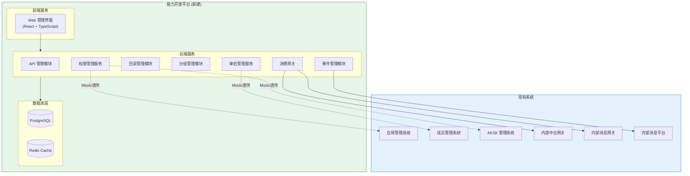

# 技术规划：能力开放平台（Capability Open Platform）

**Feature ID**: CAP-OPEN-001  
**规划版本**: v1.0  
**创建日期**: 2026-04-20  
**规划作者**: SDDU Plan Agent  
**规范版本**: spec.md v1.49

---

## 1. 架构分析

### 1.1 现有系统架构

基于 `docs/业务架构.md` 和 `docs/app-management-spec.json` 分析，现有系统架构如下：

```
┌─────────────────────────────────────────────────────────────────────────┐
│                         XXX 通讯系统现有架构                              │
├─────────────────────────────────────────────────────────────────────────┤
│                                                                          │
│  ┌─────────────────────────────────────────────────────────────────┐    │
│  │                      通用子模块 (Core Modules)                    │    │
│  │  ┌──────────────┐  ┌──────────────┐  ┌──────────────┐           │    │
│  │  │  应用管理    │  │  应用成员管理 │  │  权限中心    │           │    │
│  │  │ (已存在)     │  │ (已存在)     │  │ permission   │           │    │
│  │  │              │  │              │  │   -app       │           │    │
│  │  └──────────────┘  └──────────────┘  └──────────────┘           │    │
│  └─────────────────────────────────────────────────────────────────┘    │
│                                                                          │
│  ┌─────────────────────────────────────────────────────────────────┐    │
│  │                      业务模块 (Business Modules)                  │    │
│  │  ┌──────────────┐  ┌──────────────┐  ┌──────────────┐           │    │
│  │  │  API 开放    │  │  事件开放    │  │  回调开放    │           │    │
│  │  │ (部分实现)   │  │ (部分实现)   │  │ (部分实现)   │           │    │
│  │  └──────────────┘  └──────────────┘  └──────────────┘           │    │
│  └─────────────────────────────────────────────────────────────────┘    │
│                                                                          │
│  ┌─────────────────────────────────────────────────────────────────┐    │
│  │                      现有数据库表                                 │    │
│  │  • openplatform_permission_api_t  (API 权限表)                   │    │
│  │  • openplatform_permission_api_p_t (API 属性表)                  │    │
│  │  • openplatform_event_t           (事件表)                       │    │
│  │  • openplatform_event_p_t         (事件属性表)                   │    │
│  │  • openplatform_app_permission_t  (应用权限关联表)               │    │
│  │  • openplatform_mode_node_t       (模式节点表-分组)              │    │
│  │  • openplatform_eflow_t           (审批流程表)                   │    │
│  │  • openplatform_eflow_log_t       (审批日志表)                   │    │
│  │  • openplatform_oprate_log_t      (操作日志表)                   │    │
│  └─────────────────────────────────────────────────────────────────┘    │
│                                                                          │
└─────────────────────────────────────────────────────────────────────────┘
```

### 1.2 新系统定位

能力开放平台作为 **统一的开放底座**，需要：

| 维度 | 现状 | 目标 |
|------|------|------|
| **API 管理** | 仅支持 API 注册与应用关联 | 支持完整生命周期（注册/编辑/删除/分组/权限树） |
| **事件管理** | 事件注册存在，但权限关联弱 | 支持事件与权限统一注册、通道配置、按应用隔离 |
| **回调管理** | 不存在 | 全新模块，支持通道类型/认证类型配置 |
| **权限模型** | API 与权限混合存储 | 权限资源独立抽象，支持多类型资源 |
| **审批流程** | 基础审批存在 | 动态审批流引擎，支持场景特有审批流 |
| **分组管理** | 存在模式节点表 | 统一分组治理，支持责任人配置 |

### 1.3 依赖关系图



### 1.4 技术栈确认

基于 `docs/app-management-spec.json` 中定义的技术栈：

| 层级 | 技术选型 | 版本 |
|------|----------|------|
| **前端框架** | React + TypeScript | 18.x / 5.x |
| **状态管理** | Redux Toolkit / Zustand | - |
| **UI 组件库** | Ant Design / MUI | - |
| **构建工具** | Vite | 5.x |
| **后端框架** | NestJS | 10.x |
| **运行时** | Node.js | 20.x LTS |
| **数据库** | PostgreSQL | 15.x |
| **ORM** | Prisma / TypeORM | - |
| **缓存** | Redis | 7.x |

---

## 2. 技术方案对比

### 方案 A：单体应用 + 模块化设计（推荐）

#### 方案描述
在一个 NestJS 应用中，通过模块化设计实现各功能模块的解耦。前端同样采用单体 React 应用，通过路由和组件划分模块。

#### 架构图
```
┌─────────────────────────────────────────────────────────────────────────┐
│                         能力开放平台 - 单体架构                           │
├─────────────────────────────────────────────────────────────────────────┤
│                                                                          │
│  ┌─────────────────────────────────────────────────────────────────┐    │
│  │                      前端 (React SPA)                            │    │
│  │  ┌──────────┐ ┌──────────┐ ┌──────────┐ ┌──────────┐           │    │
│  │  │ 分组管理 │ │API管理   │ │事件管理  │ │回调管理  │           │    │
│  │  └──────────┘ └──────────┘ └──────────┘ └──────────┘           │    │
│  │  ┌──────────┐ ┌──────────┐ ┌──────────┐ ┌──────────┐           │    │
│  │  │ 权限申请 │ │审批中心  │ │消费网关  │ │Scope授权 │           │    │
│  │  └──────────┘ └──────────┘ └──────────┘ └──────────┘           │    │
│  └─────────────────────────────────────────────────────────────────┘    │
│                                   │                                      │
│                                   ▼                                      │
│  ┌─────────────────────────────────────────────────────────────────┐    │
│  │                      后端 (NestJS 单体应用)                       │    │
│  │  ┌──────────┐ ┌──────────┐ ┌──────────┐ ┌──────────┐           │    │
│  │  │ Group    │ │ API      │ │ Event    │ │ Callback │           │    │
│  │  │ Module   │ │ Module   │ │ Module   │ │ Module   │           │    │
│  │  └──────────┘ └──────────┘ └──────────┘ └──────────┘           │    │
│  │  ┌──────────┐ ┌──────────┐ ┌──────────┐ ┌──────────┐           │    │
│  │  │Permission│ │ Approval │ │ Gateway  │ │ Scope    │           │    │
│  │  │ Module   │ │ Module   │ │ Module   │ │ Module   │           │    │
│  │  └──────────┘ └──────────┘ └──────────┘ └──────────┘           │    │
│  └─────────────────────────────────────────────────────────────────┘    │
│                                   │                                      │
│                                   ▼                                      │
│  ┌─────────────────────────────────────────────────────────────────┐    │
│  │                      数据层                                      │    │
│  │  ┌──────────────┐  ┌──────────────┐                            │    │
│  │  │ PostgreSQL   │  │ Redis        │                            │    │
│  │  └──────────────┘  └──────────────┘                            │    │
│  └─────────────────────────────────────────────────────────────────┘    │
│                                                                          │
└─────────────────────────────────────────────────────────────────────────┘
```

#### 优点
| 优点 | 说明 |
|------|------|
| ✅ 开发效率高 | 统一代码仓库，减少跨服务协调成本 |
| ✅ 部署简单 | 单一部署单元，运维成本低 |
| ✅ 调试方便 | 本地开发无需启动多个服务 |
| ✅ 事务简单 | 模块间调用在同一进程内，事务管理简单 |
| ✅ 符合 MVP | 快速迭代，适合初期建设 |
| ✅ 团队熟悉 | 与现有 app-management 技术栈一致 |

#### 缺点
| 缺点 | 说明 |
|------|------|
| ⚠️ 单点故障 | 应用宕机影响全部功能 |
| ⚠️ 扩展受限 | 无法按模块独立扩缩容 |
| ⚠️ 代码耦合 | 随着功能增加，模块边界可能模糊 |

#### 风险评估
| 风险 | 级别 | 缓解措施 |
|------|------|----------|
| 单点故障 | 中 | 使用 PM2 集群模式 + 负载均衡 |
| 代码耦合 | 中 | 严格模块化设计 + 代码审查 |

#### 预估工作量
| 模块 | 人天 | 说明 |
|------|------|------|
| 前端框架搭建 | 3 | React + Ant Design + 状态管理 |
| 后端框架搭建 | 3 | NestJS + Prisma + 模块划分 |
| 分组管理 | 5 | CRUD + 责任人配置 |
| API 管理 | 8 | 注册/编辑/删除/权限 |
| 事件管理 | 8 | 注册/订阅/通道配置 |
| 回调管理 | 8 | 注册/订阅/通道配置 |
| 权限管理 | 10 | 权限树/申请/审批 |
| 审批管理 | 8 | 审批流配置/执行 |
| 消费网关 | 12 | API/事件/回调网关 |
| Scope 授权 | 5 | OAuth 流程 |
| 测试 & 联调 | 10 | 单元测试 + 集成测试 |
| **总计** | **80** | 约 4 人月 |

---

### 方案 B：微服务架构

#### 方案描述
将能力开放平台拆分为多个独立服务：
- **能力管理服务**：API/事件/回调的注册与管理
- **权限服务**：权限资源管理与订阅关系
- **审批服务**：审批流程引擎
- **网关服务**：消费网关（API/事件/回调）

#### 架构图
```
┌─────────────────────────────────────────────────────────────────────────┐
│                         能力开放平台 - 微服务架构                         │
├─────────────────────────────────────────────────────────────────────────┤
│                                                                          │
│  ┌─────────────────────────────────────────────────────────────────┐    │
│  │                      API Gateway (Kong/APISIX)                  │    │
│  └─────────────────────────────────────────────────────────────────┘    │
│                                   │                                      │
│          ┌────────────────────────┼────────────────────────┐            │
│          ▼                        ▼                        ▼            │
│  ┌──────────────┐        ┌──────────────┐        ┌──────────────┐      │
│  │ Capability   │        │ Permission   │        │ Approval     │      │
│  │ Service      │        │ Service      │        │ Service      │      │
│  │ (API/Event/  │        │              │        │              │      │
│  │  Callback)   │        │              │        │              │      │
│  └──────────────┘        └──────────────┘        └──────────────┘      │
│          │                        │                        │            │
│          └────────────────────────┼────────────────────────┘            │
│                                   ▼                                      │
│  ┌─────────────────────────────────────────────────────────────────┐    │
│  │                      Message Queue (Kafka/RabbitMQ)             │    │
│  └─────────────────────────────────────────────────────────────────┘    │
│                                   │                                      │
│                                   ▼                                      │
│  ┌─────────────────────────────────────────────────────────────────┐    │
│  │                      Gateway Service                            │    │
│  │  (API Gateway / Event Gateway / Callback Gateway)               │    │
│  └─────────────────────────────────────────────────────────────────┘    │
│                                                                          │
└─────────────────────────────────────────────────────────────────────────┘
```

#### 优点
| 优点 | 说明 |
|------|------|
| ✅ 独立部署 | 各服务可独立部署和升级 |
| ✅ 独立扩展 | 按服务负载独立扩缩容 |
| ✅ 故障隔离 | 单服务故障不影响其他服务 |
| ✅ 技术异构 | 不同服务可采用不同技术栈 |

#### 缺点
| 缺点 | 说明 |
|------|------|
| ❌ 运维复杂 | 需要服务发现、配置中心、链路追踪等基础设施 |
| ❌ 开发成本高 | 多代码仓库、跨服务调试困难 |
| ❌ 分布式事务 | 跨服务调用需要处理分布式事务 |
| ❌ 不符合 MVP | 初期建设成本过高，ROI 不划算 |

#### 风险评估
| 风险 | 级别 | 缓解措施 |
|------|------|----------|
| 运维复杂 | 高 | 引入 K8s + Istio 服务网格 |
| 分布式事务 | 高 | Saga 模式 + 补偿机制 |
| 团队经验 | 中 | 技术培训 + 外部顾问 |

#### 预估工作量
| 模块 | 人天 | 说明 |
|------|------|------|
| 基础设施搭建 | 15 | K8s + 服务网格 + 配置中心 |
| 服务拆分开发 | 90 | 4 个微服务 + 网关 |
| 服务间通信 | 10 | gRPC + 消息队列 |
| 运维工具 | 10 | 监控 + 日志 + 链路追踪 |
| 测试 & 联调 | 20 | 集成测试 + E2E 测试 |
| **总计** | **145** | 约 7 人月 |

---

### 方案 C：BFF 模式（Backend For Frontend）

#### 方案描述
采用 BFF 模式，为不同前端场景提供专属后端服务：
- **管理端 BFF**：面向运营方和提供方
- **消费端 BFF**：面向消费方
- **网关服务**：独立的消费网关

#### 架构图
```
┌─────────────────────────────────────────────────────────────────────────┐
│                         能力开放平台 - BFF 架构                           │
├─────────────────────────────────────────────────────────────────────────┤
│                                                                          │
│  ┌────────────────────┐    ┌────────────────────┐                       │
│  │   管理端 (React)    │    │   消费端 (React)    │                       │
│  │   (运营/提供方)     │    │   (消费方)          │                       │
│  └────────────────────┘    └────────────────────┘                       │
│            │                        │                                    │
│            ▼                        ▼                                    │
│  ┌────────────────────┐    ┌────────────────────┐                       │
│  │   Admin BFF        │    │   Consumer BFF     │                       │
│  │   (NestJS)         │    │   (NestJS)         │                       │
│  └────────────────────┘    └────────────────────┘                       │
│            │                        │                                    │
│            └────────────────────────┼────────────────────────┘           │
│                                     ▼                                    │
│  ┌─────────────────────────────────────────────────────────────────┐    │
│  │                      Core Service (NestJS)                       │    │
│  │  (分组/API/事件/回调/权限/审批 核心逻辑)                          │    │
│  └─────────────────────────────────────────────────────────────────┘    │
│                                     │                                    │
│                                     ▼                                    │
│  ┌─────────────────────────────────────────────────────────────────┐    │
│  │                      Gateway Service                             │    │
│  │  (API Gateway / Event Gateway / Callback Gateway)               │    │
│  └─────────────────────────────────────────────────────────────────┘    │
│                                                                          │
└─────────────────────────────────────────────────────────────────────────┘
```

#### 优点
| 优点 | 说明 |
|------|------|
| ✅ 前端优化 | BFF 可针对前端场景优化接口 |
| ✅ 关注点分离 | 管理端与消费端逻辑分离 |
| ✅ 扩展性好 | 可为新增前端快速添加 BFF |

#### 缺点
| 缺点 | 说明 |
|------|------|
| ⚠️ 代码重复 | BFF 层可能存在重复逻辑 |
| ⚠️ 维护成本 | 多个服务需要独立维护 |
| ⚠️ 调试复杂 | 跨 BFF 调试链路较长 |

#### 预估工作量
| 模块 | 人天 | 说明 |
|------|------|------|
| Core Service | 50 | 核心业务逻辑 |
| Admin BFF | 15 | 管理端接口聚合 |
| Consumer BFF | 15 | 消费端接口聚合 |
| Gateway Service | 12 | 消费网关 |
| 测试 & 联调 | 15 | 集成测试 |
| **总计** | **107** | 约 5 人月 |

---

### 方案推荐

| 维度 | 方案 A（单体） | 方案 B（微服务） | 方案 C（BFF） |
|------|---------------|-----------------|---------------|
| **开发效率** | ⭐⭐⭐⭐⭐ | ⭐⭐ | ⭐⭐⭐⭐ |
| **运维成本** | ⭐⭐⭐⭐⭐ | ⭐⭐ | ⭐⭐⭐ |
| **扩展性** | ⭐⭐⭐ | ⭐⭐⭐⭐⭐ | ⭐⭐⭐⭐ |
| **MVP 适配** | ⭐⭐⭐⭐⭐ | ⭐⭐ | ⭐⭐⭐⭐ |
| **团队匹配** | ⭐⭐⭐⭐⭐ | ⭐⭐⭐ | ⭐⭐⭐⭐ |
| **预估工期** | 80 人天 | 145 人天 | 107 人天 |

**推荐方案：方案 A（单体应用 + 模块化设计）**

**推荐理由**：
1. **符合 MVP 定位**：能力开放平台处于初期建设阶段，需要快速迭代
2. **技术栈一致**：与现有 `app-management` 系统技术栈一致，降低学习成本
3. **开发效率高**：单代码仓库，模块化设计，便于协作
4. **后期可演进**：模块化设计为后期微服务拆分预留空间

---

## 3. 文件影响分析

### 3.1 目录结构规划

```
open-app/
├── apps/                              # 应用目录（新增）
│   ├── capability-platform/           # 能力开放平台后端
│   │   ├── src/
│   │   │   ├── modules/
│   │   │   │   ├── group/             # 分组管理模块
│   │   │   │   ├── api/               # API 管理模块
│   │   │   │   ├── event/             # 事件管理模块
│   │   │   │   ├── callback/          # 回调管理模块
│   │   │   │   ├── permission/        # 权限管理模块
│   │   │   │   ├── approval/          # 审批管理模块
│   │   │   │   ├── gateway/           # 消费网关模块
│   │   │   │   └── scope/             # Scope 授权模块
│   │   │   ├── common/                # 公共模块
│   │   │   │   ├── decorators/
│   │   │   │   ├── filters/
│   │   │   │   ├── guards/
│   │   │   │   ├── interceptors/
│   │   │   │   └── pipes/
│   │   │   ├── config/                # 配置
│   │   │   ├── database/              # 数据库
│   │   │   │   ├── migrations/
│   │   │   │   └── seeds/
│   │   │   └── main.ts
│   │   ├── test/
│   │   ├── package.json
│   │   ├── tsconfig.json
│   │   └── nest-cli.json
│   │
│   └── capability-web/                # 能力开放平台前端
│       ├── src/
│       │   ├── pages/
│       │   │   ├── group/             # 分组管理页面
│       │   │   ├── api/               # API 管理页面
│       │   │   ├── event/             # 事件管理页面
│       │   │   ├── callback/          # 回调管理页面
│       │   │   ├── permission/        # 权限申请页面
│       │   │   ├── approval/          # 审批中心页面
│       │   │   └── scope/             # Scope 授权页面
│       │   ├── components/            # 公共组件
│       │   ├── hooks/                 # 自定义 Hooks
│       │   ├── services/              # API 服务
│       │   ├── stores/                # 状态管理
│       │   ├── utils/                 # 工具函数
│       │   └── App.tsx
│       ├── public/
│       ├── package.json
│       ├── vite.config.ts
│       └── tsconfig.json
│
├── packages/                          # 公共包（新增）
│   ├── shared-types/                  # 共享类型定义
│   │   ├── src/
│   │   │   ├── api.ts
│   │   │   ├── event.ts
│   │   │   ├── callback.ts
│   │   │   ├── permission.ts
│   │   │   └── approval.ts
│   │   └── package.json
│   │
│   ├── database-client/               # 数据库客户端
│   │   ├── src/
│   │   │   ├── schema.prisma
│   │   │   └── index.ts
│   │   └── package.json
│   │
│   └── mock-services/                 # Mock 服务
│       ├── src/
│       │   ├── app-management.mock.ts
│       │   ├── member.mock.ts
│       │   └── aksk.mock.ts
│       └── package.json
│
└── docs/                              # 文档（现有）
```

### 3.2 文件清单

#### 新建文件（[NEW]）

| 文件路径 | 说明 |
|----------|------|
| `apps/capability-platform/package.json` | 后端项目配置 |
| `apps/capability-platform/src/main.ts` | 应用入口 |
| `apps/capability-platform/src/app.module.ts` | 根模块 |
| `apps/capability-platform/src/modules/group/group.module.ts` | 分组管理模块 |
| `apps/capability-platform/src/modules/group/group.controller.ts` | 分组管理控制器 |
| `apps/capability-platform/src/modules/group/group.service.ts` | 分组管理服务 |
| `apps/capability-platform/src/modules/group/entities/group.entity.ts` | 分组实体 |
| `apps/capability-platform/src/modules/api/api.module.ts` | API 管理模块 |
| `apps/capability-platform/src/modules/api/api.controller.ts` | API 管理控制器 |
| `apps/capability-platform/src/modules/api/api.service.ts` | API 管理服务 |
| `apps/capability-platform/src/modules/api/entities/api.entity.ts` | API 实体 |
| `apps/capability-platform/src/modules/event/event.module.ts` | 事件管理模块 |
| `apps/capability-platform/src/modules/event/event.controller.ts` | 事件管理控制器 |
| `apps/capability-platform/src/modules/event/event.service.ts` | 事件管理服务 |
| `apps/capability-platform/src/modules/event/entities/event.entity.ts` | 事件实体 |
| `apps/capability-platform/src/modules/callback/callback.module.ts` | 回调管理模块 |
| `apps/capability-platform/src/modules/callback/callback.controller.ts` | 回调管理控制器 |
| `apps/capability-platform/src/modules/callback/callback.service.ts` | 回调管理服务 |
| `apps/capability-platform/src/modules/callback/entities/callback.entity.ts` | 回调实体 |
| `apps/capability-platform/src/modules/permission/permission.module.ts` | 权限管理模块 |
| `apps/capability-platform/src/modules/permission/permission.controller.ts` | 权限管理控制器 |
| `apps/capability-platform/src/modules/permission/permission.service.ts` | 权限管理服务 |
| `apps/capability-platform/src/modules/permission/entities/permission.entity.ts` | 权限实体 |
| `apps/capability-platform/src/modules/permission/entities/subscription.entity.ts` | 订阅实体 |
| `apps/capability-platform/src/modules/approval/approval.module.ts` | 审批管理模块 |
| `apps/capability-platform/src/modules/approval/approval.controller.ts` | 审批管理控制器 |
| `apps/capability-platform/src/modules/approval/approval.service.ts` | 审批管理服务 |
| `apps/capability-platform/src/modules/approval/entities/approval-flow.entity.ts` | 审批流实体 |
| `apps/capability-platform/src/modules/approval/entities/approval-record.entity.ts` | 审批记录实体 |
| `apps/capability-platform/src/modules/gateway/gateway.module.ts` | 消费网关模块 |
| `apps/capability-platform/src/modules/gateway/api-gateway.service.ts` | API 网关服务 |
| `apps/capability-platform/src/modules/gateway/event-gateway.service.ts` | 事件网关服务 |
| `apps/capability-platform/src/modules/gateway/callback-gateway.service.ts` | 回调网关服务 |
| `apps/capability-platform/src/modules/scope/scope.module.ts` | Scope 授权模块 |
| `apps/capability-platform/src/modules/scope/scope.controller.ts` | Scope 授权控制器 |
| `apps/capability-platform/src/modules/scope/scope.service.ts` | Scope 授权服务 |
| `apps/capability-platform/src/common/interceptors/mock.interceptor.ts` | Mock 拦截器 |
| `apps/capability-platform/src/config/configuration.ts` | 配置文件 |
| `apps/capability-platform/src/database/schema.prisma` | Prisma Schema |
| `apps/capability-platform/src/database/migrations/001_init.sql` | 初始化迁移 |
| `apps/capability-web/package.json` | 前端项目配置 |
| `apps/capability-web/src/main.tsx` | 前端入口 |
| `apps/capability-web/src/App.tsx` | 应用根组件 |
| `apps/capability-web/src/router/index.tsx` | 路由配置 |
| `apps/capability-web/src/pages/group/GroupList.tsx` | 分组列表页面 |
| `apps/capability-web/src/pages/api/ApiList.tsx` | API 列表页面 |
| `apps/capability-web/src/pages/api/ApiRegister.tsx` | API 注册页面 |
| `apps/capability-web/src/pages/event/EventList.tsx` | 事件列表页面 |
| `apps/capability-web/src/pages/callback/CallbackList.tsx` | 回调列表页面 |
| `apps/capability-web/src/pages/permission/PermissionTree.tsx` | 权限树组件 |
| `apps/capability-web/src/pages/approval/ApprovalCenter.tsx` | 审批中心页面 |
| `apps/capability-web/src/components/PermissionDrawer.tsx` | 权限选择抽屉 |
| `apps/capability-web/src/services/api.service.ts` | API 服务 |
| `apps/capability-web/src/stores/permission.store.ts` | 权限状态 |
| `packages/shared-types/package.json` | 共享类型配置 |
| `packages/shared-types/src/index.ts` | 类型导出 |
| `packages/database-client/package.json` | 数据库客户端配置 |
| `packages/database-client/src/schema.prisma` | Prisma Schema |
| `packages/mock-services/package.json` | Mock 服务配置 |
| `packages/mock-services/src/index.ts` | Mock 服务导出 |

#### 修改文件（[MODIFY]）

| 文件路径 | 修改内容 |
|----------|----------|
| `package.json` | 添加 monorepo 配置 |
| `tsconfig.json` | 添加 paths 配置 |
| `.env.example` | 添加新环境变量示例 |

#### 依赖文件（[DEPEND]）

| 文件路径 | 依赖方式 |
|----------|----------|
| 现有 `应用管理系统` | 通过 Mock/真实接口调用 |
| 现有 `成员管理系统` | 通过 Mock/真实接口调用 |
| 现有 `AKSK 管理系统` | 通过 Mock/真实接口调用 |
| 现有 `内部中台网关` | HTTP 调用 |
| 现有 `内部消息网关` | HTTP/MQ 调用 |

---

## 4. 数据库设计

### 4.1 表结构设计

基于 spec.md §5.4 数据库表清单，设计如下：

```sql
-- ============================================
-- 分组表（扩展现有 openplatform_mode_node_t）
-- ============================================
CREATE TABLE groups (
    id UUID PRIMARY KEY DEFAULT gen_random_uuid(),
    name VARCHAR(100) NOT NULL,
    resource_type VARCHAR(20) NOT NULL, -- 'api', 'event', 'callback'
    parent_id UUID REFERENCES groups(id),
    sort_order INT DEFAULT 0,
    status VARCHAR(20) DEFAULT 'active',
    created_at TIMESTAMP DEFAULT CURRENT_TIMESTAMP,
    updated_at TIMESTAMP DEFAULT CURRENT_TIMESTAMP,
    created_by UUID,
    updated_by UUID
);

-- 分组责任人关联表
CREATE TABLE group_owners (
    id UUID PRIMARY KEY DEFAULT gen_random_uuid(),
    group_id UUID NOT NULL REFERENCES groups(id) ON DELETE CASCADE,
    user_id UUID NOT NULL,
    created_at TIMESTAMP DEFAULT CURRENT_TIMESTAMP,
    UNIQUE(group_id, user_id)
);

-- ============================================
-- API 资源表（扩展现有 openplatform_permission_api_t）
-- ============================================
CREATE TABLE apis (
    id UUID PRIMARY KEY DEFAULT gen_random_uuid(),
    name VARCHAR(100) NOT NULL,
    code_name VARCHAR(100) NOT NULL UNIQUE,
    path VARCHAR(500) NOT NULL,
    method VARCHAR(10) NOT NULL,
    description TEXT,
    doc_url VARCHAR(500),
    group_id UUID REFERENCES groups(id),
    status VARCHAR(20) DEFAULT 'draft', -- draft, pending, published, offline
    created_at TIMESTAMP DEFAULT CURRENT_TIMESTAMP,
    updated_at TIMESTAMP DEFAULT CURRENT_TIMESTAMP,
    created_by UUID,
    updated_by UUID
);

-- ============================================
-- 事件资源表（扩展现有 openplatform_event_t）
-- ============================================
CREATE TABLE events (
    id UUID PRIMARY KEY DEFAULT gen_random_uuid(),
    name VARCHAR(100) NOT NULL,
    code_name VARCHAR(100) NOT NULL UNIQUE,
    topic VARCHAR(200) NOT NULL UNIQUE,
    description TEXT,
    doc_url VARCHAR(500),
    group_id UUID REFERENCES groups(id),
    status VARCHAR(20) DEFAULT 'draft',
    created_at TIMESTAMP DEFAULT CURRENT_TIMESTAMP,
    updated_at TIMESTAMP DEFAULT CURRENT_TIMESTAMP,
    created_by UUID,
    updated_by UUID
);

-- ============================================
-- 回调资源表（新建）
-- ============================================
CREATE TABLE callbacks (
    id UUID PRIMARY KEY DEFAULT gen_random_uuid(),
    name VARCHAR(100) NOT NULL,
    code_name VARCHAR(100) NOT NULL UNIQUE,
    description TEXT,
    doc_url VARCHAR(500),
    group_id UUID REFERENCES groups(id),
    status VARCHAR(20) DEFAULT 'draft',
    created_at TIMESTAMP DEFAULT CURRENT_TIMESTAMP,
    updated_at TIMESTAMP DEFAULT CURRENT_TIMESTAMP,
    created_by UUID,
    updated_by UUID
);

-- ============================================
-- 权限资源表（新建）
-- ============================================
CREATE TABLE permissions (
    id UUID PRIMARY KEY DEFAULT gen_random_uuid(),
    name VARCHAR(100) NOT NULL,
    code_name VARCHAR(100) NOT NULL UNIQUE, -- scope
    resource_type VARCHAR(20) NOT NULL, -- 'api', 'event', 'callback'
    resource_id UUID NOT NULL, -- 关联的 API/Event/Callback ID
    description TEXT,
    approval_flow_id UUID, -- 资源特有审批流
    status VARCHAR(20) DEFAULT 'active',
    created_at TIMESTAMP DEFAULT CURRENT_TIMESTAMP,
    updated_at TIMESTAMP DEFAULT CURRENT_TIMESTAMP,
    created_by UUID,
    updated_by UUID
);

-- ============================================
-- 订阅关系表（扩展现有 openplatform_app_permission_t）
-- ============================================
CREATE TABLE subscriptions (
    id UUID PRIMARY KEY DEFAULT gen_random_uuid(),
    app_id UUID NOT NULL,
    permission_id UUID NOT NULL REFERENCES permissions(id),
    status VARCHAR(20) DEFAULT 'pending', -- pending, approved, rejected, cancelled
    
    -- 事件/回调消费配置
    channel_type VARCHAR(20), -- 'internal_mq', 'webhook', 'sse', 'websocket'
    channel_address VARCHAR(500),
    auth_type VARCHAR(20), -- 'app_credential_a', 'app_credential_b', 'open_app_credential'
    
    created_at TIMESTAMP DEFAULT CURRENT_TIMESTAMP,
    updated_at TIMESTAMP DEFAULT CURRENT_TIMESTAMP,
    approved_at TIMESTAMP,
    approved_by UUID,
    
    UNIQUE(app_id, permission_id)
);

-- ============================================
-- 审批流程模板表（扩展现有 openplatform_eflow_t）
-- ============================================
CREATE TABLE approval_flows (
    id UUID PRIMARY KEY DEFAULT gen_random_uuid(),
    name VARCHAR(100) NOT NULL,
    code VARCHAR(50) NOT NULL UNIQUE, -- 'default', 'api_register', 'permission_apply'
    description TEXT,
    is_default BOOLEAN DEFAULT FALSE,
    nodes JSONB NOT NULL, -- 审批节点配置
    status VARCHAR(20) DEFAULT 'active',
    created_at TIMESTAMP DEFAULT CURRENT_TIMESTAMP,
    updated_at TIMESTAMP DEFAULT CURRENT_TIMESTAMP
);

-- ============================================
-- 审批记录表（扩展现有 openplatform_eflow_log_t）
-- ============================================
CREATE TABLE approval_records (
    id UUID PRIMARY KEY DEFAULT gen_random_uuid(),
    flow_id UUID NOT NULL REFERENCES approval_flows(id),
    business_type VARCHAR(50) NOT NULL, -- 'api_register', 'event_register', 'permission_apply'
    business_id UUID NOT NULL,
    applicant_id UUID NOT NULL,
    status VARCHAR(20) DEFAULT 'pending', -- pending, approved, rejected, cancelled
    current_node INT DEFAULT 0,
    created_at TIMESTAMP DEFAULT CURRENT_TIMESTAMP,
    completed_at TIMESTAMP
);

-- ============================================
-- 审批操作日志表
-- ============================================
CREATE TABLE approval_logs (
    id UUID PRIMARY KEY DEFAULT gen_random_uuid(),
    record_id UUID NOT NULL REFERENCES approval_records(id),
    node_index INT NOT NULL,
    operator_id UUID NOT NULL,
    action VARCHAR(20) NOT NULL, -- 'approve', 'reject', 'cancel', 'transfer'
    comment TEXT,
    created_at TIMESTAMP DEFAULT CURRENT_TIMESTAMP
);

-- ============================================
-- 用户授权表（Scope 授权）
-- ============================================
CREATE TABLE user_authorizations (
    id UUID PRIMARY KEY DEFAULT gen_random_uuid(),
    user_id UUID NOT NULL,
    app_id UUID NOT NULL,
    scopes TEXT[] NOT NULL,
    expires_at TIMESTAMP,
    created_at TIMESTAMP DEFAULT CURRENT_TIMESTAMP,
    revoked_at TIMESTAMP,
    UNIQUE(user_id, app_id)
);

-- ============================================
-- 审计日志表（扩展现有 openplatform_oprate_log_t）
-- ============================================
CREATE TABLE audit_logs (
    id UUID PRIMARY KEY DEFAULT gen_random_uuid(),
    user_id UUID,
    action VARCHAR(50) NOT NULL,
    resource_type VARCHAR(50) NOT NULL,
    resource_id UUID,
    old_value JSONB,
    new_value JSONB,
    ip_address VARCHAR(45),
    user_agent TEXT,
    created_at TIMESTAMP DEFAULT CURRENT_TIMESTAMP
);

-- ============================================
-- 索引设计
-- ============================================
CREATE INDEX idx_groups_resource_type ON groups(resource_type);
CREATE INDEX idx_groups_parent_id ON groups(parent_id);
CREATE INDEX idx_apis_group_id ON apis(group_id);
CREATE INDEX idx_apis_status ON apis(status);
CREATE INDEX idx_events_group_id ON events(group_id);
CREATE INDEX idx_events_topic ON events(topic);
CREATE INDEX idx_callbacks_group_id ON callbacks(group_id);
CREATE INDEX idx_permissions_resource ON permissions(resource_type, resource_id);
CREATE INDEX idx_permissions_code_name ON permissions(code_name);
CREATE INDEX idx_subscriptions_app_id ON subscriptions(app_id);
CREATE INDEX idx_subscriptions_permission_id ON subscriptions(permission_id);
CREATE INDEX idx_subscriptions_status ON subscriptions(status);
CREATE INDEX idx_approval_records_business ON approval_records(business_type, business_id);
CREATE INDEX idx_approval_records_applicant ON approval_records(applicant_id);
CREATE INDEX idx_approval_records_status ON approval_records(status);
CREATE INDEX idx_user_auth_user_app ON user_authorizations(user_id, app_id);
CREATE INDEX idx_audit_logs_user ON audit_logs(user_id);
CREATE INDEX idx_audit_logs_resource ON audit_logs(resource_type, resource_id);
```

### 4.2 与现有表的关系

| 规划表 | 现有表 | 关系 | 处理策略 |
|--------|--------|------|----------|
| `groups` | `openplatform_mode_node_t` | 扩展 | 新建表，后续迁移数据 |
| `apis` | `openplatform_permission_api_t` | 扩展 | 新建表，保留原有表 |
| `events` | `openplatform_event_t` | 扩展 | 新建表，保留原有表 |
| `callbacks` | - | 新建 | - |
| `permissions` | - | 新建 | - |
| `subscriptions` | `openplatform_app_permission_t` | 扩展 | 新建表，后续迁移数据 |
| `approval_flows` | `openplatform_eflow_t` | 扩展 | 新建表，保留原有表 |
| `approval_records` | `openplatform_eflow_log_t` | 扩展 | 新建表，保留原有表 |
| `audit_logs` | `openplatform_oprate_log_t` | 扩展 | 新建表，保留原有表 |

---

## 5. 接口设计

### 5.1 后端 API 清单

#### 分组管理

| Method | Path | 说明 | 角色 |
|--------|------|------|------|
| GET | `/api/v1/groups` | 获取分组列表（树形） | 运营方 |
| POST | `/api/v1/groups` | 创建分组 | 运营方 |
| PUT | `/api/v1/groups/:id` | 更新分组 | 运营方 |
| DELETE | `/api/v1/groups/:id` | 删除分组 | 运营方 |
| POST | `/api/v1/groups/:id/owners` | 添加分组责任人 | 运营方 |
| DELETE | `/api/v1/groups/:id/owners/:userId` | 移除分组责任人 | 运营方 |

#### API 管理

| Method | Path | 说明 | 角色 |
|--------|------|------|------|
| GET | `/api/v1/apis` | 获取 API 列表 | 分组责任人 |
| GET | `/api/v1/apis/:id` | 获取 API 详情 | 分组责任人 |
| POST | `/api/v1/apis` | 注册 API | 分组责任人 |
| PUT | `/api/v1/apis/:id` | 更新 API | 分组责任人 |
| DELETE | `/api/v1/apis/:id` | 删除 API | 分组责任人 |

#### 事件管理

| Method | Path | 说明 | 角色 |
|--------|------|------|------|
| GET | `/api/v1/events` | 获取事件列表 | 分组责任人 |
| GET | `/api/v1/events/:id` | 获取事件详情 | 分组责任人 |
| POST | `/api/v1/events` | 注册事件 | 分组责任人 |
| PUT | `/api/v1/events/:id` | 更新事件 | 分组责任人 |
| DELETE | `/api/v1/events/:id` | 删除事件 | 分组责任人 |

#### 回调管理

| Method | Path | 说明 | 角色 |
|--------|------|------|------|
| GET | `/api/v1/callbacks` | 获取回调列表 | 分组责任人 |
| GET | `/api/v1/callbacks/:id` | 获取回调详情 | 分组责任人 |
| POST | `/api/v1/callbacks` | 注册回调 | 分组责任人 |
| PUT | `/api/v1/callbacks/:id` | 更新回调 | 分组责任人 |
| DELETE | `/api/v1/callbacks/:id` | 删除回调 | 分组责任人 |

#### 权限管理（消费方）

| Method | Path | 说明 | 角色 |
|--------|------|------|------|
| GET | `/api/v1/permissions/tree` | 获取权限树 | 消费方 |
| GET | `/api/v1/permissions/subscriptions` | 获取应用订阅列表 | 消费方 |
| POST | `/api/v1/permissions/subscribe` | 申请权限 | 消费方 |
| PUT | `/api/v1/permissions/subscriptions/:id/config` | 配置消费参数 | 消费方 |
| DELETE | `/api/v1/permissions/subscriptions/:id` | 取消订阅 | 消费方 |

#### 审批管理

| Method | Path | 说明 | 角色 |
|--------|------|------|------|
| GET | `/api/v1/approvals/pending` | 获取待审批列表 | 审批人 |
| GET | `/api/v1/approvals/:id` | 获取审批详情 | 审批人 |
| POST | `/api/v1/approvals/:id/approve` | 同意审批 | 审批人 |
| POST | `/api/v1/approvals/:id/reject` | 驳回审批 | 审批人 |
| POST | `/api/v1/approvals/:id/cancel` | 撤销审批 | 申请人 |

#### Scope 授权

| Method | Path | 说明 | 角色 |
|--------|------|------|------|
| GET | `/api/v1/scope/authorizations` | 获取用户授权列表 | 用户 |
| POST | `/api/v1/scope/authorize` | 用户授权 | 用户 |
| DELETE | `/api/v1/scope/authorizations/:id` | 取消授权 | 用户 |

---

## 6. 风险评估

### 6.1 技术风险

| 风险 | 级别 | 影响 | 缓解措施 |
|------|------|------|----------|
| Mock 服务与真实接口不一致 | 高 | 联调阶段大量返工 | 1. 定义接口契约（OpenAPI）<br/>2. Mock 服务严格按契约实现<br/>3. 契约测试验证一致性 |
| 权限模型设计缺陷 | 高 | 需求变更导致重构 | 1. 充分评审权限模型设计<br/>2. 预留扩展点 |
| 审批流程引擎复杂度 | 中 | 开发周期延长 | 1. MVP 阶段简化审批流<br/>2. 后期迭代增强 |
| 事件分发性能 | 中 | 高峰期延迟 | 1. 使用消息队列缓冲<br/>2. 水平扩展网关服务 |
| 数据迁移风险 | 中 | 历史数据丢失 | 1. 迁移前备份<br/>2. 双写策略过渡 |

### 6.2 依赖风险

| 风险 | 级别 | 影响 | 缓解措施 |
|------|------|------|----------|
| 现有系统接口变更 | 高 | 联调失败 | 1. 接口版本化<br/>2. 变更通知机制 |
| 内部网关稳定性 | 中 | API 调用失败 | 1. 重试机制<br/>2. 熔断降级 |
| 消息队列不可用 | 中 | 事件丢失 | 1. 持久化队列<br/>2. 死信队列 |

### 6.3 时间风险

| 风险 | 级别 | 影响 | 缓解措施 |
|------|------|------|----------|
| 需求范围蔓延 | 高 | 延期交付 | 1. 严格 Scope 管理<br/>2. 按优先级分批交付 |
| 联调时间不足 | 中 | 质量问题 | 1. 提前定义联调计划<br/>2. Mock 服务充分验证 |
| 人员变动 | 中 | 进度影响 | 1. 文档完善<br/>2. 代码注释充分 |

---

## 7. 开发计划

### 7.1 阶段划分

```
Phase 1: 基础框架（2 周）
├── 后端项目初始化
├── 前端项目初始化
├── 数据库表设计 & 迁移
├── 公共模块开发
└── Mock 服务搭建

Phase 2: 核心模块（4 周）
├── 分组管理
├── API 管理
├── 事件管理
├── 回调管理
└── 权限管理

Phase 3: 审批 & 网关（3 周）
├── 审批管理
├── 消费网关
└── Scope 授权

Phase 4: 联调 & 上线（3 周）
├── 系统联调
├── 性能测试
├── 安全测试
└── 生产部署
```

### 7.2 里程碑

| 里程碑 | 日期 | 交付物 |
|--------|------|--------|
| M1: 框架就绪 | Week 2 | 前后端框架、数据库、Mock 服务 |
| M2: 资源管理可用 | Week 6 | API/事件/回调管理功能 |
| M3: 权限审批可用 | Week 9 | 权限申请、审批流程 |
| M4: 网关可用 | Week 12 | 消费网关、Scope 授权 |
| M5: 上线 | Week 15 | 生产环境部署 |

---

## 8. 待确认事项

| ID | 问题 | 影响模块 | 建议 | 状态 |
|----|------|----------|------|------|
| PQ-001 | 事件分发使用哪种消息中间件？ | 事件管理 | 复用企业内部消息平台 | ⏳ 待确认 |
| PQ-002 | API 网关是否在本阶段实现？ | 消费网关 | 纳入 MVP 范围 | ⏳ 待确认 |
| PQ-003 | 审批流程是否需要集成现有 OA？ | 审批管理 | 自建轻量引擎，预留集成接口 | ⏳ 待确认 |
| PQ-004 | 现有系统接口文档在哪里？ | 所有模块 | 需要获取接口规范 | ⏳ 待确认 |

---

## 9. 附录

### 9.1 参考文档

- 规范文档: `spec.md` v1.49
- 需求挖掘报告: `discovery-report.md`
- 现有系统架构: `docs/业务架构.md`
- 现有系统技术栈: `docs/app-management-spec.json`

### 9.2 修订记录

| 版本 | 日期 | 修订内容 | 作者 |
|------|------|----------|------|
| v1.0 | 2026-04-20 | 初始版本 | SDDU Plan Agent |

---

**文档状态**: ✅ 技术规划完成  
**下一步**: 运行 `@sddu-tasks capability-open-platform` 开始任务分解
