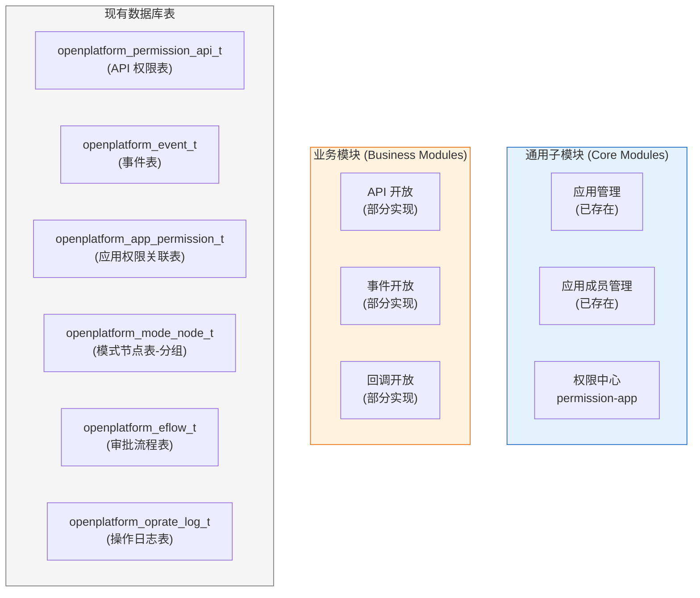
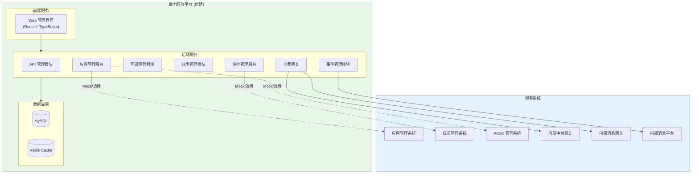
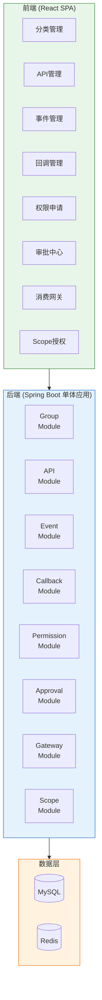
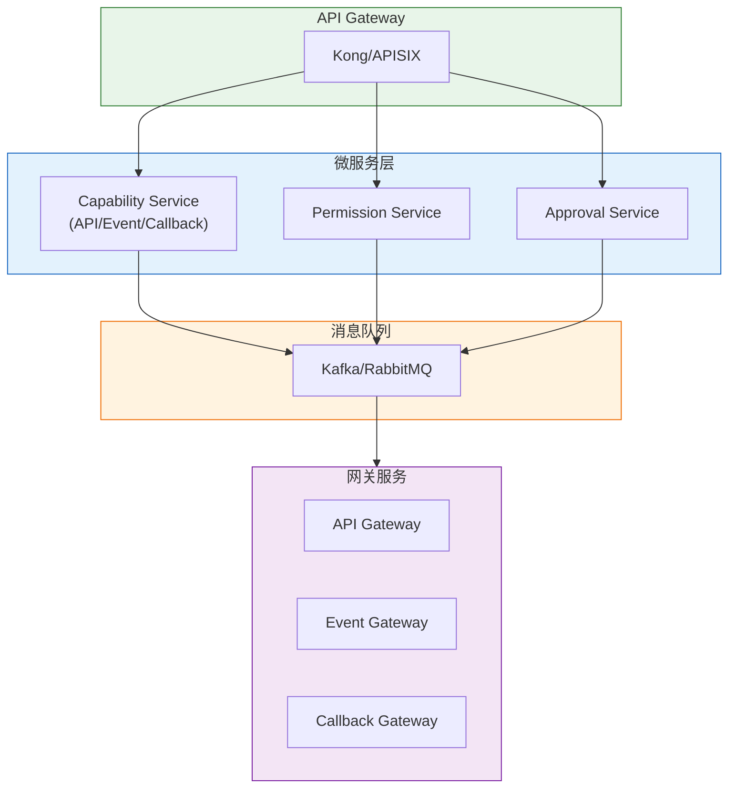
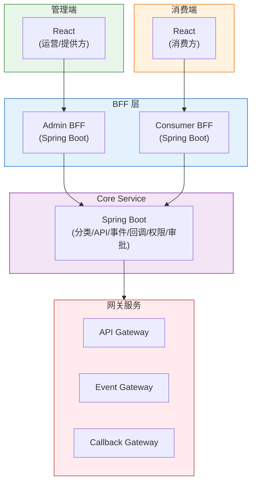
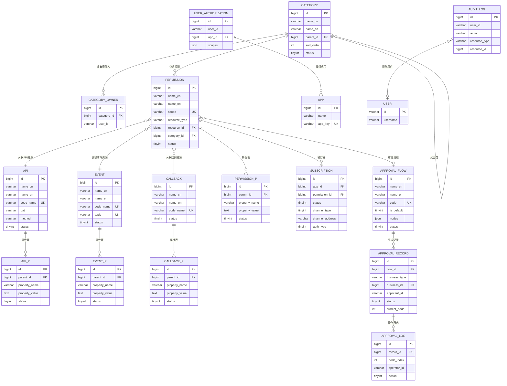

# 技术规划：能力开放平台（Capability Open Platform）

**Feature ID**: CAP-OPEN-001  
**规划版本**: v1.0  
**创建日期**: 2026-04-20  
**规划作者**: SDDU Plan Agent  
**规范版本**: spec.md v1.49

---

## 1. 架构分析

### 1.1 现有系统架构

基于 `docs/业务架构.md` 和 `docs/app-management-spec.json` 分析，现有系统架构如下：



### 1.2 新系统定位

能力开放平台作为 **统一的开放底座**，需要：

| 维度 | 现状 | 目标 |
|------|------|------|
| **API 管理** | 仅支持 API 注册与应用关联 | 支持完整生命周期（注册/编辑/删除/分类/权限树） |
| **事件管理** | 事件注册存在，但权限关联弱 | 支持事件与权限统一注册、通道配置、按应用隔离 |
| **回调管理** | 不存在 | 全新模块，支持通道类型/认证类型配置 |
| **权限模型** | API 与权限混合存储 | 权限资源独立抽象，支持多类型资源 |
| **审批流程** | 基础审批存在 | 动态审批流引擎，支持场景特有审批流 |
| **分类管理** | 存在模式节点表 | 统一分类治理，支持责任人配置 |

### 1.3 依赖关系图



### 1.4 技术栈确认

基于项目实际情况和团队技术栈：

#### 前端技术栈

| 层级 | 技术选型 | 版本 |
|------|----------|------|
| **语言** | TypeScript | 5.x |
| **框架** | React | 18.x |
| **状态管理** | Redux Toolkit / Zustand | - |
| **UI 组件库** | Ant Design / MUI | - |
| **构建工具** | Vite | 5.x |
| **HTTP 客户端** | Axios / React Query | - |
| **表单处理** | React Hook Form | - |
| **测试框架** | Vitest + React Testing Library | - |

#### 前端设计流程

> 💡 **设计流程说明**：
> - **面向三方应用人员的界面**：统一按照 [`/front/README.md`](../../../front/README.md) 描述的内容和设计流程去执行生成代码
> - **其他页面**（如运营方管理后台、提供方管理后台）：可在此 plan.md 文档进行详细设计

#### 后端技术栈

| 层级 | 技术选型 | 版本 |
|------|----------|------|
| **语言** | Java | 21 |
| **构建工具** | Maven | 3.9.x |
| **框架** | Spring Boot | 3.4.6 (Spring 6.2.12) |
| **ORM** | MyBatis | mybatis-spring-boot-starter 3.0.4 |
| **数据库** | MySQL | 5.7 |
| **缓存** | Redis | 6.0 |
| **接口文档** | SpringDoc OpenAPI | 2.x |
| **测试框架** | JUnit 5 + Mockito | - |

---

## 2. 技术方案对比

### 方案 A：单体应用 + 模块化设计（推荐）

#### 方案描述
在一个 Spring Boot 应用中，通过模块化设计实现各功能模块的解耦。前端同样采用单体 React 应用，通过路由和组件划分模块。

#### 架构图



#### 优点
| 优点 | 说明 |
|------|------|
| ✅ 开发效率高 | 统一代码仓库，减少跨服务协调成本 |
| ✅ 部署简单 | 单一部署单元，运维成本低 |
| ✅ 调试方便 | 本地开发无需启动多个服务 |
| ✅ 事务简单 | 模块间调用在同一进程内，事务管理简单 |
| ✅ 符合 MVP | 快速迭代，适合初期建设 |
| ✅ 团队熟悉 | 与现有 app-management 技术栈一致 |

#### 缺点
| 缺点 | 说明 |
|------|------|
| ⚠️ 单点故障 | 应用宕机影响全部功能 |
| ⚠️ 扩展受限 | 无法按模块独立扩缩容 |
| ⚠️ 代码耦合 | 随着功能增加，模块边界可能模糊 |

#### 风险评估
| 风险 | 级别 | 缓解措施 |
|------|------|----------|
| 单点故障 | 中 | 使用 PM2 集群模式 + 负载均衡 |
| 代码耦合 | 中 | 严格模块化设计 + 代码审查 |

#### 预估工作量
| 模块 | 人天 | 说明 |
|------|------|------|
| 前端框架搭建 | 3 | React + Ant Design + 状态管理 |
| 后端框架搭建 | 3 | Spring Boot + MyBatis + 模块划分 |
| 分类管理 | 5 | CRUD + 责任人配置 |
| API 管理 | 8 | 注册/编辑/删除/权限 |
| 事件管理 | 8 | 注册/订阅/通道配置 |
| 回调管理 | 8 | 注册/订阅/通道配置 |
| 权限管理 | 10 | 权限树/申请/审批 |
| 审批管理 | 8 | 审批流配置/执行 |
| 消费网关 | 12 | API/事件/回调网关 |
| Scope 授权 | 5 | OAuth 流程 |
| 测试 & 联调 | 10 | 单元测试 + 集成测试 |
| **总计** | **80** | 约 4 人月 |

---

### 方案 B：微服务架构

#### 方案描述
将能力开放平台拆分为多个独立服务：
- **能力管理服务**：API/事件/回调的注册与管理
- **权限服务**：权限资源管理与订阅关系
- **审批服务**：审批流程引擎
- **网关服务**：消费网关（API/事件/回调）

#### 架构图



#### 优点
| 优点 | 说明 |
|------|------|
| ✅ 独立部署 | 各服务可独立部署和升级 |
| ✅ 独立扩展 | 按服务负载独立扩缩容 |
| ✅ 故障隔离 | 单服务故障不影响其他服务 |
| ✅ 技术异构 | 不同服务可采用不同技术栈 |

#### 缺点
| 缺点 | 说明 |
|------|------|
| ❌ 运维复杂 | 需要服务发现、配置中心、链路追踪等基础设施 |
| ❌ 开发成本高 | 多代码仓库、跨服务调试困难 |
| ❌ 分布式事务 | 跨服务调用需要处理分布式事务 |
| ❌ 不符合 MVP | 初期建设成本过高，ROI 不划算 |

#### 风险评估
| 风险 | 级别 | 缓解措施 |
|------|------|----------|
| 运维复杂 | 高 | 引入 K8s + Istio 服务网格 |
| 分布式事务 | 高 | Saga 模式 + 补偿机制 |
| 团队经验 | 中 | 技术培训 + 外部顾问 |

#### 预估工作量
| 模块 | 人天 | 说明 |
|------|------|------|
| 基础设施搭建 | 15 | K8s + 服务网格 + 配置中心 |
| 服务拆分开发 | 90 | 4 个微服务 + 网关 |
| 服务间通信 | 10 | gRPC + 消息队列 |
| 运维工具 | 10 | 监控 + 日志 + 链路追踪 |
| 测试 & 联调 | 20 | 集成测试 + E2E 测试 |
| **总计** | **145** | 约 7 人月 |

---

### 方案 C：BFF 模式（Backend For Frontend）

#### 方案描述
采用 BFF 模式，为不同前端场景提供专属后端服务：
- **管理端 BFF**：面向运营方和提供方
- **消费端 BFF**：面向消费方
- **网关服务**：独立的消费网关

#### 架构图



#### 优点
| 优点 | 说明 |
|------|------|
| ✅ 前端优化 | BFF 可针对前端场景优化接口 |
| ✅ 关注点分离 | 管理端与消费端逻辑分离 |
| ✅ 扩展性好 | 可为新增前端快速添加 BFF |

#### 缺点
| 缺点 | 说明 |
|------|------|
| ⚠️ 代码重复 | BFF 层可能存在重复逻辑 |
| ⚠️ 维护成本 | 多个服务需要独立维护 |
| ⚠️ 调试复杂 | 跨 BFF 调试链路较长 |

#### 预估工作量
| 模块 | 人天 | 说明 |
|------|------|------|
| Core Service | 50 | 核心业务逻辑 |
| Admin BFF | 15 | 管理端接口聚合 |
| Consumer BFF | 15 | 消费端接口聚合 |
| Gateway Service | 12 | 消费网关 |
| 测试 & 联调 | 15 | 集成测试 |
| **总计** | **107** | 约 5 人月 |

---

### 方案推荐

| 维度 | 方案 A（单体） | 方案 B（微服务） | 方案 C（BFF） |
|------|---------------|-----------------|---------------|
| **开发效率** | ⭐⭐⭐⭐⭐ | ⭐⭐ | ⭐⭐⭐⭐ |
| **运维成本** | ⭐⭐⭐⭐⭐ | ⭐⭐ | ⭐⭐⭐ |
| **扩展性** | ⭐⭐⭐ | ⭐⭐⭐⭐⭐ | ⭐⭐⭐⭐ |
| **MVP 适配** | ⭐⭐⭐⭐⭐ | ⭐⭐ | ⭐⭐⭐⭐ |
| **团队匹配** | ⭐⭐⭐⭐⭐ | ⭐⭐⭐ | ⭐⭐⭐⭐ |
| **预估工期** | 80 人天 | 145 人天 | 107 人天 |

**推荐方案：方案 A（单体应用 + 模块化设计）**

**推荐理由**：
1. **符合 MVP 定位**：能力开放平台处于初期建设阶段，需要快速迭代
2. **技术栈一致**：与现有 `app-management` 系统技术栈一致，降低学习成本
3. **开发效率高**：单代码仓库，模块化设计，便于协作
4. **后期可演进**：模块化设计为后期微服务拆分预留空间

---

## 3. 文件影响分析

### 3.1 目录结构规划

```
open-app/
├── apps/                              # 应用目录（新增）
│   ├── capability-platform/           # 能力开放平台后端
│   │   ├── src/
│   │   │   ├── main/
│   │   │   │   ├── java/
│   │   │   │   │   └── com/xxx/capability/
│   │   │   │   │       ├── modules/
│   │   │   │   │       │   ├── category/           # 分类管理模块
│   │   │   │   │       │   ├── api/               # API 管理模块
│   │   │   │   │       │   ├── event/             # 事件管理模块
│   │   │   │   │       │   ├── callback/          # 回调管理模块
│   │   │   │   │       │   ├── permission/        # 权限管理模块
│   │   │   │   │       │   ├── approval/          # 审批管理模块
│   │   │   │   │       │   ├── gateway/           # 消费网关模块
│   │   │   │   │       │   └── scope/             # Scope 授权模块
│   │   │   │   │       ├── common/                # 公共模块
│   │   │   │   │       │   ├── config/            # 配置
│   │   │   │   │       │   ├── exception/         # 异常处理
│   │   │   │   │       │   ├── interceptor/       # 拦截器
│   │   │   │   │       │   └── util/              # 工具类
│   │   │   │   │       └── CapabilityPlatformApplication.java
│   │   │   │   └── resources/
│   │   │   │       ├── mapper/                    # MyBatis Mapper XML
│   │   │   │       ├── db/                        # 数据库迁移脚本
│   │   │   │       │   └── migration/
│   │   │   │       └── application.yml
│   │   │   └── test/
│   │   ├── pom.xml
│   │   └── README.md
│   │
│   └── capability-web/                # 能力开放平台前端
│       ├── src/
│       │   ├── pages/
│       │   │   ├── category/           # 分类管理页面
│       │   │   ├── api/               # API 管理页面
│       │   │   ├── event/             # 事件管理页面
│       │   │   ├── callback/          # 回调管理页面
│       │   │   ├── permission/        # 权限申请页面
│       │   │   ├── approval/          # 审批中心页面
│       │   │   └── scope/             # Scope 授权页面
│       │   ├── components/            # 公共组件
│       │   ├── hooks/                 # 自定义 Hooks
│       │   ├── services/              # API 服务
│       │   ├── stores/                # 状态管理
│       │   ├── utils/                 # 工具函数
│       │   └── App.tsx
│       ├── public/
│       ├── package.json
│       ├── vite.config.ts
│       └── tsconfig.json
│
├── packages/                          # 公共包（新增）
│   ├── shared-types/                  # 共享类型定义（前端使用）
│   │   ├── src/
│   │   │   ├── api.ts
│   │   │   ├── event.ts
│   │   │   ├── callback.ts
│   │   │   ├── permission.ts
│   │   │   └── approval.ts
│   │   └── package.json
│   │
│   └── mock-services/                 # Mock 服务
│       ├── src/
│       │   ├── app-management.mock.ts
│       │   ├── member.mock.ts
│       │   └── aksk.mock.ts
│       └── package.json
│
└── docs/                              # 文档（现有）
```

### 3.2 文件清单

#### 新建文件（[NEW]）

| 文件路径 | 说明 |
|----------|------|
| `apps/capability-platform/pom.xml` | 后端项目配置 |
| `apps/capability-platform/src/main/java/.../CapabilityPlatformApplication.java` | 应用入口 |
| `apps/capability-platform/src/main/java/.../modules/category/CategoryController.java` | 分类管理控制器 |
| `apps/capability-platform/src/main/java/.../modules/category/CategoryService.java` | 分类管理服务 |
| `apps/capability-platform/src/main/java/.../modules/category/entity/Category.java` | 分类实体 |
| `apps/capability-platform/src/main/java/.../modules/category/mapper/CategoryMapper.java` | 分类 Mapper |
| `apps/capability-platform/src/main/java/.../modules/api/ApiController.java` | API 管理控制器 |
| `apps/capability-platform/src/main/java/.../modules/api/ApiService.java` | API 管理服务 |
| `apps/capability-platform/src/main/java/.../modules/api/entity/Api.java` | API 实体 |
| `apps/capability-platform/src/main/java/.../modules/api/mapper/ApiMapper.java` | API Mapper |
| `apps/capability-platform/src/main/java/.../modules/event/EventController.java` | 事件管理控制器 |
| `apps/capability-platform/src/main/java/.../modules/event/EventService.java` | 事件管理服务 |
| `apps/capability-platform/src/main/java/.../modules/event/entity/Event.java` | 事件实体 |
| `apps/capability-platform/src/main/java/.../modules/event/mapper/EventMapper.java` | 事件 Mapper |
| `apps/capability-platform/src/main/java/.../modules/callback/CallbackController.java` | 回调管理控制器 |
| `apps/capability-platform/src/modules/callback/callback.controller.ts` | 回调管理控制器 |
| `apps/capability-platform/src/modules/callback/callback.service.ts` | 回调管理服务 |
| `apps/capability-platform/src/modules/callback/entities/callback.entity.ts` | 回调实体 |
| `apps/capability-platform/src/modules/permission/permission.module.ts` | 权限管理模块 |
| `apps/capability-platform/src/modules/permission/permission.controller.ts` | 权限管理控制器 |
| `apps/capability-platform/src/modules/permission/permission.service.ts` | 权限管理服务 |
| `apps/capability-platform/src/modules/permission/entities/permission.entity.ts` | 权限实体 |
| `apps/capability-platform/src/main/java/.../modules/callback/CallbackService.java` | 回调管理服务 |
| `apps/capability-platform/src/main/java/.../modules/callback/entity/Callback.java` | 回调实体 |
| `apps/capability-platform/src/main/java/.../modules/callback/mapper/CallbackMapper.java` | 回调 Mapper |
| `apps/capability-platform/src/main/java/.../modules/permission/PermissionController.java` | 权限管理控制器 |
| `apps/capability-platform/src/main/java/.../modules/permission/PermissionService.java` | 权限管理服务 |
| `apps/capability-platform/src/main/java/.../modules/permission/entity/Permission.java` | 权限实体 |
| `apps/capability-platform/src/main/java/.../modules/permission/entity/Subscription.java` | 订阅实体 |
| `apps/capability-platform/src/main/java/.../modules/approval/ApprovalController.java` | 审批管理控制器 |
| `apps/capability-platform/src/main/java/.../modules/approval/ApprovalService.java` | 审批管理服务 |
| `apps/capability-platform/src/main/java/.../modules/approval/entity/ApprovalFlow.java` | 审批流实体 |
| `apps/capability-platform/src/main/java/.../modules/approval/entity/ApprovalRecord.java` | 审批记录实体 |
| `apps/capability-platform/src/main/java/.../modules/gateway/ApiGatewayService.java` | API 网关服务 |
| `apps/capability-platform/src/main/java/.../modules/gateway/EventGatewayService.java` | 事件网关服务 |
| `apps/capability-platform/src/main/java/.../modules/gateway/CallbackGatewayService.java` | 回调网关服务 |
| `apps/capability-platform/src/main/java/.../modules/scope/ScopeController.java` | Scope 授权控制器 |
| `apps/capability-platform/src/main/java/.../modules/scope/ScopeService.java` | Scope 授权服务 |
| `apps/capability-platform/src/main/java/.../common/config/MockConfig.java` | Mock 配置 |
| `apps/capability-platform/src/main/java/.../common/interceptor/MockInterceptor.java` | Mock 拦截器 |
| `apps/capability-platform/src/main/resources/application.yml` | 应用配置 |
| `apps/capability-platform/src/main/resources/mapper/*.xml` | MyBatis Mapper XML |
| `apps/capability-platform/src/main/resources/db/migration/V1__init.sql` | 初始化迁移 |
| `apps/capability-web/package.json` | 前端项目配置 |
| `apps/capability-web/src/main.tsx` | 前端入口 |
| `apps/capability-web/src/App.tsx` | 应用根组件 |
| `apps/capability-web/src/router/index.tsx` | 路由配置 |
| `apps/capability-web/src/pages/category/CategoryList.tsx` | 分类列表页面 |
| `apps/capability-web/src/pages/api/ApiList.tsx` | API 列表页面 |
| `apps/capability-web/src/pages/api/ApiRegister.tsx` | API 注册页面 |
| `apps/capability-web/src/pages/event/EventList.tsx` | 事件列表页面 |
| `apps/capability-web/src/pages/callback/CallbackList.tsx` | 回调列表页面 |
| `apps/capability-web/src/pages/permission/PermissionTree.tsx` | 权限树组件 |
| `apps/capability-web/src/pages/approval/ApprovalCenter.tsx` | 审批中心页面 |
| `apps/capability-web/src/components/PermissionDrawer.tsx` | 权限选择抽屉 |
| `apps/capability-web/src/services/api.service.ts` | API 服务 |
| `apps/capability-web/src/stores/permission.store.ts` | 权限状态 |
| `packages/shared-types/package.json` | 共享类型配置 |
| `packages/shared-types/src/index.ts` | 类型导出 |
| `packages/mock-services/package.json` | Mock 服务配置 |
| `packages/mock-services/src/index.ts` | Mock 服务导出 |

#### 修改文件（[MODIFY]）

| 文件路径 | 修改内容 |
|----------|----------|
| `pom.xml` | 添加模块配置（如使用 Maven 多模块） |
| `apps/capability-web/tsconfig.json` | 添加 paths 配置 |
| `.env.example` | 添加新环境变量示例 |

#### 依赖文件（[DEPEND]）

| 文件路径 | 依赖方式 |
|----------|----------|
| 现有 `应用管理系统` | 通过 Mock/真实接口调用 |
| 现有 `成员管理系统` | 通过 Mock/真实接口调用 |
| 现有 `AKSK 管理系统` | 通过 Mock/真实接口调用 |
| 现有 `内部中台网关` | HTTP 调用 |
| 现有 `内部消息网关` | HTTP/MQ 调用 |

---

## 4. 数据库设计

### 4.1 ER 图



> 💡 **核心关系说明**：
> - **分类树形结构**：`CATEGORY` 通过 `parent_id` 实现树形层级，支持多级分类
> - **分类包含权限**：`CATEGORY` 直接关联 `PERMISSION`，分类下展示的是权限数据
> - **权限关联资源**：`PERMISSION` 通过 `resource_type` + `resource_id` 关联具体的 API/事件/回调资源
> - **权限树展示**：分类树 + 权限列表 = 权限树，权限数据可附带展示对应资源的部分字段
> - **属性表**：`API_P`、`EVENT_P`、`CALLBACK_P`、`PERMISSION_P` 存储扩展属性，KV 模式灵活扩展

> ⚠️ **注意**：
> - ER 图简化展示，属性表只显示核心字段（id、parent_id、property_name、property_value、status）
> - 属性表必备四个审计字段（create_time、last_update_time、create_by、last_update_by）已在规范中定义
> - 图中 `FK` 表示逻辑外键，不使用物理外键约束

#### Scope 命名规范

权限的 `scope` 字段命名遵循 `{模块}:{资源}:{操作}` 格式：

| 资源类型 | Scope 示例 | 说明 |
|----------|------------|------|
| API | `im:message:send` | IM 模块发送消息 API |
| API | `im:message:get` | IM 模块获取消息 API |
| Event | `im:message:received` | IM 模块消息接收事件 |
| Event | `meeting:started` | 会议模块会议开始事件 |
| Callback | `approval:completed` | 审批模块审批完成回调 |

> 💡 **说明**：
> - 只有 **权限（PERMISSION）** 才有 `scope` 属性
> - API/事件/回调资源表使用 `code_name` 作为代码标识，不叫 scope

### 4.2 表设计规则

遵循现有系统的数据库设计规范，统一命名和字段约定：

#### 命名规范

| 规则 | 说明 | 示例 |
|------|------|------|
| **表前缀** | 统一使用 `openplatform_` 前缀 | `openplatform_permission_api_t` |
| **表后缀** | 统一使用 `_t` 后缀表示表 | `openplatform_eflow_t` |
| **属性表后缀** | 扩展属性表使用 `_p_t` 后缀 | `openplatform_permission_api_p_t` |
| **命名风格** | 小写字母 + 下划线分隔 | `user_authorizations` → `openplatform_user_authorization_t` |

#### 主表与属性表设计规范

对于一般业务对象，采用 **主表 + 属性表** 的设计模式：

**主表设计原则**：

| 原则 | 说明 |
|------|------|
| **字段选择** | 存储业务对象的常用字段 |
| **列表展示** | 涉及在对象列表中展示的字段 |
| **搜索条件** | 作为列表搜索条件的字段 |
| **示例** | `name_cn`、`name_en`、`code_name`、`status`、`category_id` 等 |

**属性表设计规范**：

| 规则 | 说明 | 示例 |
|------|------|------|
| **用途** | 存储仅在对象详情中涉及的不常用字段 | 扩展配置、元数据等 |
| **表名格式** | `{前缀}_{业务对象名}_p_t` | `openplatform_api_p_t` |
| **表名示例** | API 属性表 → `openplatform_api_p_t` | |
| **表名示例** | 事件属性表 → `openplatform_event_p_t` | |
| **表名示例** | 权限属性表 → `openplatform_permission_p_t` | |

**属性表必备字段**：

| 字段名 | 类型 | 说明 |
|--------|------|------|
| `id` | BIGINT(20) | 主键，雪花ID |
| `parent_id` | BIGINT(20) | 父表ID（关联主表） |
| `property_name` | VARCHAR(100) | 属性名称 |
| `property_value` | TEXT | 属性值 |
| `status` | TINYINT(10) | 状态（0=禁用, 1=启用） |
| `create_time` | DATETIME(3) | 创建时间 |
| `last_update_time` | DATETIME(3) | 更新时间 |
| `create_by` | VARCHAR(100) | 创建人账号 |
| `last_update_by` | VARCHAR(100) | 更新人账号 |

**属性表示例**：

```sql
CREATE TABLE `openplatform_api_p_t` (
    `id` BIGINT(20) PRIMARY KEY,
    `parent_id` BIGINT(20) NOT NULL COMMENT '关联 API 主表 ID',
    `property_name` VARCHAR(100) NOT NULL COMMENT '属性名称',
    `property_value` TEXT COMMENT '属性值',
    `status` TINYINT(10) DEFAULT 1 COMMENT '0=禁用, 1=启用',
    `create_time` DATETIME(3) DEFAULT CURRENT_TIMESTAMP(3),
    `last_update_time` DATETIME(3) DEFAULT CURRENT_TIMESTAMP(3) ON UPDATE CURRENT_TIMESTAMP(3),
    `create_by` VARCHAR(100),
    `last_update_by` VARCHAR(100),
    KEY `idx_parent_id` (`parent_id`),
    KEY `idx_property_name` (`property_name`)
) ENGINE=InnoDB DEFAULT CHARSET=utf8mb4 COMMENT='API属性表';
```

> 💡 **说明**：
> - 属性表采用 **KV 模式**，灵活存储各种扩展属性
> - 属性名 `property_name` 和属性值 `property_value` 支持动态扩展
> - 主表保持简洁，便于列表查询和搜索
> - 属性表存放详情，避免主表字段膨胀

#### 名称和描述字段规范

涉及名称、描述场景的字段，统一使用中英文双语：

| 字段类型 | 字段命名 | 类型 | 说明 |
|----------|----------|------|------|
| **名称** | `name_cn` | VARCHAR(100) | 中文名称 |
| **名称** | `name_en` | VARCHAR(100) | 英文名称 |
| **描述** | `description_cn` | TEXT | 中文描述 |
| **描述** | `description_en` | TEXT | 英文描述 |

> 💡 **说明**：
> - 名称字段 `name_cn` 和 `name_en` 均为必填
> - 描述字段 `description_cn` 和 `description_en` 可选
> - 支持国际化场景，便于多语言展示

#### 必备审计字段

所有业务表必须包含以下四个审计字段：

| 字段名 | 类型 | 说明 |
|--------|------|------|
| `create_time` | DATETIME(3) | 创建时间，默认 CURRENT_TIMESTAMP(3) |
| `last_update_time` | DATETIME(3) | 更新时间，默认 CURRENT_TIMESTAMP(3) ON UPDATE CURRENT_TIMESTAMP(3) |
| `create_by` | VARCHAR(100) | 创建人账号 |
| `last_update_by` | VARCHAR(100) | 更新人账号 |

> 💡 **说明**：时间字段统一使用 `DATETIME(3)` 精确到毫秒，确保高并发场景下的时间精度。

#### 主键规范

| 规则 | 说明 |
|------|------|
| **主键类型** | BIGINT(20)，雪花ID |
| **主键命名** | 统一使用 `id` |
| **生成策略** | 应用层生成雪花ID，不使用数据库自增 |
| **关联字段** | 使用逻辑外键（存储关联 ID），不使用物理外键约束 |

#### 索引规范

| 规则 | 说明 |
|------|------|
| **索引命名** | `idx_字段名` 或 `idx_字段名1_字段名2` |
| **唯一索引命名** | `uk_字段名` |

> ⚠️ **禁止使用外键**：所有表关联关系通过存储逻辑字段实现，不使用数据库物理外键约束（FOREIGN KEY）。关联关系由应用层维护。

#### 枚举字段规范

| 规则 | 说明 |
|------|------|
| **字段类型** | 统一使用 `TINYINT` |
| **字段长度** | `TINYINT(10)`，显示宽度 10 位 |
| **默认值** | 使用数字默认值，如 `DEFAULT 0` |
| **注释说明** | 在 COMMENT 中说明枚举值含义 |

**枚举值示例**：

| 字段 | 枚举值 | 说明 |
|------|--------|------|
| `status` (资源状态) | 0=草稿, 1=待审, 2=已发布, 3=已下线 | draft, pending, published, offline |
| `status` (订阅状态) | 0=待审, 1=已授权, 2=已拒绝, 3=已取消 | pending, approved, rejected, cancelled |
| `status` (审批状态) | 0=待审, 1=已通过, 2=已拒绝, 3=已撤销 | pending, approved, rejected, cancelled |
| `is_default` | 0=否, 1=是 | 布尔类型枚举 |

#### 规划表正式命名对照

| 规划表名 | 正式表名 | 说明 |
|----------|----------|------|
| `categories` | `openplatform_category_t` | 分类主表 |
| `category_owners` | `openplatform_category_owner_t` | 分类责任人关联表 |
| `apis` | `openplatform_api_t` | API 资源主表 |
| `apis_p` | `openplatform_api_p_t` | API 资源属性表 |
| `events` | `openplatform_event_t` | 事件资源主表 |
| `events_p` | `openplatform_event_p_t` | 事件资源属性表 |
| `callbacks` | `openplatform_callback_t` | 回调资源主表 |
| `callbacks_p` | `openplatform_callback_p_t` | 回调资源属性表 |
| `permissions` | `openplatform_permission_t` | 权限资源主表 |
| `permissions_p` | `openplatform_permission_p_t` | 权限资源属性表 |
| `subscriptions` | `openplatform_subscription_t` | 订阅关系表 |
| `approval_flows` | `openplatform_approval_flow_t` | 审批流程模板表 |
| `approval_records` | `openplatform_approval_record_t` | 审批记录表 |
| `approval_logs` | `openplatform_approval_log_t` | 审批操作日志表 |
| `user_authorizations` | `openplatform_user_authorization_t` | 用户授权表 |
| `audit_logs` | `openplatform_audit_log_t` | 审计日志表 |

> 💡 **主表+属性表模式说明**：
> - **使用主表+属性表的对象**：API、事件、回调、权限（4 个业务对象）
> - **不使用属性表的对象**：分类、订阅、审批流程、审批记录、用户授权、审计日志（固定字段，无需扩展）
> - **主表存储**：列表展示字段、搜索条件字段（name、code_name、status、path、method、topic 等）
> - **属性表存储**：详情展示字段、扩展属性（description、doc_url、approval_flow_id 等）

### 4.3 与现有表的关系

基于 spec.md §5.4 数据库表清单，规划表与现有表的对照关系如下：

| 正式表名 | 现有表 | 关系 | 处理策略 |
|----------|--------|------|----------|
| `openplatform_category_t` | `openplatform_mode_node_t` | 扩展 | 新建表，后续迁移数据 |
| `openplatform_category_owner_t` | - | 新建 | 分类责任人关联表 |
| `openplatform_api_t` | `openplatform_permission_api_t` | 扩展 | 新建表，保留原有表 |
| `openplatform_api_p_t` | - | 新建 | API 资源属性表 |
| `openplatform_event_t` | 现有同名表 | 扩展 | 新建表，保留原有表 |
| `openplatform_event_p_t` | - | 新建 | 事件资源属性表 |
| `openplatform_callback_t` | - | 新建 | 回调资源主表 |
| `openplatform_callback_p_t` | - | 新建 | 回调资源属性表 |
| `openplatform_permission_t` | - | 新建 | 权限资源主表（核心抽象） |
| `openplatform_permission_p_t` | - | 新建 | 权限资源属性表 |
| `openplatform_subscription_t` | `openplatform_app_permission_t` | 扩展 | 新建表，后续迁移数据 |
| `openplatform_approval_flow_t` | `openplatform_eflow_t` | 扩展 | 新建表，保留原有表 |
| `openplatform_approval_record_t` | `openplatform_eflow_log_t` | 扩展 | 新建表，保留原有表 |
| `openplatform_approval_log_t` | - | 新建 | 审批操作日志表 |
| `openplatform_user_authorization_t` | - | 新建 | 用户授权表（Scope 授权） |
| `openplatform_audit_log_t` | `openplatform_oprate_log_t` | 扩展 | 新建表，保留原有表 |

**汇总**：
- 扩展现有表：7 个（主表）
- 纯新建主表：5 个（`openplatform_category_owner_t`、`openplatform_callback_t`、`openplatform_permission_t`、`openplatform_approval_log_t`、`openplatform_user_authorization_t`）
- 新建属性表：4 个（`openplatform_api_p_t`、`openplatform_event_p_t`、`openplatform_callback_p_t`、`openplatform_permission_p_t`）
- **总表数**：16 个

### 4.4 表结构设计

基于上述关系分析，具体表结构设计如下：

```sql
-- ============================================
-- 分类表（扩展现有 openplatform_mode_node_t）
-- ============================================
CREATE TABLE `openplatform_category_t` (
    `id` BIGINT(20) PRIMARY KEY,
    `name_cn` VARCHAR(100) NOT NULL COMMENT '中文名称',
    `name_en` VARCHAR(100) NOT NULL COMMENT '英文名称',
    `parent_id` BIGINT(20),
    `sort_order` INT DEFAULT 0,
    `status` TINYINT(10) DEFAULT 1 COMMENT '0=禁用, 1=启用',
    `create_time` DATETIME(3) DEFAULT CURRENT_TIMESTAMP(3),
    `last_update_time` DATETIME(3) DEFAULT CURRENT_TIMESTAMP(3) ON UPDATE CURRENT_TIMESTAMP(3),
    `create_by` VARCHAR(100),
    `last_update_by` VARCHAR(100),
    KEY `idx_parent_id` (`parent_id`)
) ENGINE=InnoDB DEFAULT CHARSET=utf8mb4 COMMENT='分类表';

-- 分类责任人关联表
CREATE TABLE `openplatform_category_owner_t` (
    `id` BIGINT(20) PRIMARY KEY,
    `category_id` BIGINT(20) NOT NULL,
    `user_id` VARCHAR(100) NOT NULL,
    `create_time` DATETIME(3) DEFAULT CURRENT_TIMESTAMP(3),
    `last_update_time` DATETIME(3) DEFAULT CURRENT_TIMESTAMP(3) ON UPDATE CURRENT_TIMESTAMP(3),
    `create_by` VARCHAR(100),
    `last_update_by` VARCHAR(100),
    UNIQUE KEY `uk_category_user` (`category_id`, `user_id`)
) ENGINE=InnoDB DEFAULT CHARSET=utf8mb4 COMMENT='分类责任人关联表';

-- ============================================
-- API 资源主表（扩展现有 openplatform_permission_api_t）
-- ============================================
CREATE TABLE `openplatform_api_t` (
    `id` BIGINT(20) PRIMARY KEY,
    `name_cn` VARCHAR(100) NOT NULL COMMENT '中文名称',
    `name_en` VARCHAR(100) NOT NULL COMMENT '英文名称',
    `code_name` VARCHAR(100) NOT NULL UNIQUE COMMENT '代码标识',
    `path` VARCHAR(500) NOT NULL COMMENT 'API路径',
    `method` VARCHAR(10) NOT NULL COMMENT 'HTTP方法',
    `status` TINYINT(10) DEFAULT 0 COMMENT '0=草稿, 1=待审, 2=已发布, 3=已下线',
    `create_time` DATETIME(3) DEFAULT CURRENT_TIMESTAMP(3),
    `last_update_time` DATETIME(3) DEFAULT CURRENT_TIMESTAMP(3) ON UPDATE CURRENT_TIMESTAMP(3),
    `create_by` VARCHAR(100),
    `last_update_by` VARCHAR(100),
    KEY `idx_status` (`status`),
    KEY `idx_code_name` (`code_name`)
) ENGINE=InnoDB DEFAULT CHARSET=utf8mb4 COMMENT='API资源主表';

-- API 资源属性表
CREATE TABLE `openplatform_api_p_t` (
    `id` BIGINT(20) PRIMARY KEY,
    `parent_id` BIGINT(20) NOT NULL COMMENT '关联 API 主表 ID',
    `property_name` VARCHAR(100) NOT NULL COMMENT '属性名称',
    `property_value` TEXT COMMENT '属性值',
    `status` TINYINT(10) DEFAULT 1 COMMENT '0=禁用, 1=启用',
    `create_time` DATETIME(3) DEFAULT CURRENT_TIMESTAMP(3),
    `last_update_time` DATETIME(3) DEFAULT CURRENT_TIMESTAMP(3) ON UPDATE CURRENT_TIMESTAMP(3),
    `create_by` VARCHAR(100),
    `last_update_by` VARCHAR(100),
    KEY `idx_parent_id` (`parent_id`),
    KEY `idx_property_name` (`property_name`)
) ENGINE=InnoDB DEFAULT CHARSET=utf8mb4 COMMENT='API资源属性表';

-- ============================================
-- 事件资源主表（扩展现有 openplatform_event_t）
-- ============================================
CREATE TABLE `openplatform_event_t` (
    `id` BIGINT(20) PRIMARY KEY,
    `name_cn` VARCHAR(100) NOT NULL COMMENT '中文名称',
    `name_en` VARCHAR(100) NOT NULL COMMENT '英文名称',
    `code_name` VARCHAR(100) NOT NULL UNIQUE COMMENT '代码标识',
    `topic` VARCHAR(200) NOT NULL UNIQUE COMMENT 'Topic',
    `status` TINYINT(10) DEFAULT 0 COMMENT '0=草稿, 1=待审, 2=已发布, 3=已下线',
    `create_time` DATETIME(3) DEFAULT CURRENT_TIMESTAMP(3),
    `last_update_time` DATETIME(3) DEFAULT CURRENT_TIMESTAMP(3) ON UPDATE CURRENT_TIMESTAMP(3),
    `create_by` VARCHAR(100),
    `last_update_by` VARCHAR(100),
    KEY `idx_topic` (`topic`),
    KEY `idx_status` (`status`)
) ENGINE=InnoDB DEFAULT CHARSET=utf8mb4 COMMENT='事件资源主表';

-- 事件资源属性表
CREATE TABLE `openplatform_event_p_t` (
    `id` BIGINT(20) PRIMARY KEY,
    `parent_id` BIGINT(20) NOT NULL COMMENT '关联事件主表 ID',
    `property_name` VARCHAR(100) NOT NULL COMMENT '属性名称',
    `property_value` TEXT COMMENT '属性值',
    `status` TINYINT(10) DEFAULT 1 COMMENT '0=禁用, 1=启用',
    `create_time` DATETIME(3) DEFAULT CURRENT_TIMESTAMP(3),
    `last_update_time` DATETIME(3) DEFAULT CURRENT_TIMESTAMP(3) ON UPDATE CURRENT_TIMESTAMP(3),
    `create_by` VARCHAR(100),
    `last_update_by` VARCHAR(100),
    KEY `idx_parent_id` (`parent_id`),
    KEY `idx_property_name` (`property_name`)
) ENGINE=InnoDB DEFAULT CHARSET=utf8mb4 COMMENT='事件资源属性表';

-- ============================================
-- 回调资源主表（新建）
-- ============================================
CREATE TABLE `openplatform_callback_t` (
    `id` BIGINT(20) PRIMARY KEY,
    `name_cn` VARCHAR(100) NOT NULL COMMENT '中文名称',
    `name_en` VARCHAR(100) NOT NULL COMMENT '英文名称',
    `code_name` VARCHAR(100) NOT NULL UNIQUE COMMENT '代码标识',
    `status` TINYINT(10) DEFAULT 0 COMMENT '0=草稿, 1=待审, 2=已发布, 3=已下线',
    `create_time` DATETIME(3) DEFAULT CURRENT_TIMESTAMP(3),
    `last_update_time` DATETIME(3) DEFAULT CURRENT_TIMESTAMP(3) ON UPDATE CURRENT_TIMESTAMP(3),
    `create_by` VARCHAR(100),
    `last_update_by` VARCHAR(100),
    KEY `idx_status` (`status`)
) ENGINE=InnoDB DEFAULT CHARSET=utf8mb4 COMMENT='回调资源主表';

-- 回调资源属性表
CREATE TABLE `openplatform_callback_p_t` (
    `id` BIGINT(20) PRIMARY KEY,
    `parent_id` BIGINT(20) NOT NULL COMMENT '关联回调主表 ID',
    `property_name` VARCHAR(100) NOT NULL COMMENT '属性名称',
    `property_value` TEXT COMMENT '属性值',
    `status` TINYINT(10) DEFAULT 1 COMMENT '0=禁用, 1=启用',
    `create_time` DATETIME(3) DEFAULT CURRENT_TIMESTAMP(3),
    `last_update_time` DATETIME(3) DEFAULT CURRENT_TIMESTAMP(3) ON UPDATE CURRENT_TIMESTAMP(3),
    `create_by` VARCHAR(100),
    `last_update_by` VARCHAR(100),
    KEY `idx_parent_id` (`parent_id`),
    KEY `idx_property_name` (`property_name`)
) ENGINE=InnoDB DEFAULT CHARSET=utf8mb4 COMMENT='回调资源属性表';

-- ============================================
-- 权限资源主表（新建）
-- ============================================
CREATE TABLE `openplatform_permission_t` (
    `id` BIGINT(20) PRIMARY KEY,
    `name_cn` VARCHAR(100) NOT NULL COMMENT '中文名称',
    `name_en` VARCHAR(100) NOT NULL COMMENT '英文名称',
    `scope` VARCHAR(100) NOT NULL UNIQUE COMMENT '权限标识，如 im:message:send',
    `resource_type` VARCHAR(20) NOT NULL COMMENT 'api, event, callback',
    `resource_id` BIGINT(20) NOT NULL COMMENT '关联的 API/Event/Callback ID',
    `category_id` BIGINT(20) NOT NULL COMMENT '所属分类ID',
    `status` TINYINT(10) DEFAULT 1 COMMENT '0=禁用, 1=启用',
    `create_time` DATETIME(3) DEFAULT CURRENT_TIMESTAMP(3),
    `last_update_time` DATETIME(3) DEFAULT CURRENT_TIMESTAMP(3) ON UPDATE CURRENT_TIMESTAMP(3),
    `create_by` VARCHAR(100),
    `last_update_by` VARCHAR(100),
    KEY `idx_resource` (`resource_type`, `resource_id`),
    KEY `idx_category_id` (`category_id`),
    KEY `idx_scope` (`scope`),
    KEY `idx_status` (`status`)
) ENGINE=InnoDB DEFAULT CHARSET=utf8mb4 COMMENT='权限资源主表';

-- 权限资源属性表
CREATE TABLE `openplatform_permission_p_t` (
    `id` BIGINT(20) PRIMARY KEY,
    `parent_id` BIGINT(20) NOT NULL COMMENT '关联权限主表 ID',
    `property_name` VARCHAR(100) NOT NULL COMMENT '属性名称',
    `property_value` TEXT COMMENT '属性值',
    `status` TINYINT(10) DEFAULT 1 COMMENT '0=禁用, 1=启用',
    `create_time` DATETIME(3) DEFAULT CURRENT_TIMESTAMP(3),
    `last_update_time` DATETIME(3) DEFAULT CURRENT_TIMESTAMP(3) ON UPDATE CURRENT_TIMESTAMP(3),
    `create_by` VARCHAR(100),
    `last_update_by` VARCHAR(100),
    KEY `idx_parent_id` (`parent_id`),
    KEY `idx_property_name` (`property_name`)
) ENGINE=InnoDB DEFAULT CHARSET=utf8mb4 COMMENT='权限资源属性表';

-- 属性表示例数据：
-- API 属性表示例
-- INSERT INTO openplatform_api_p_t (id, parent_id, property_name, property_value, status, ...) 
-- VALUES (1, 100, 'description_cn', '发送消息API的中文描述', 1, ...);
-- INSERT INTO openplatform_api_p_t (id, parent_id, property_name, property_value, status, ...) 
-- VALUES (2, 100, 'description_en', 'Send message API description', 1, ...);
-- INSERT INTO openplatform_api_p_t (id, parent_id, property_name, property_value, status, ...) 
-- VALUES (3, 100, 'doc_url', 'https://docs.example.com/api/send-message', 1, ...);

-- 权限属性表示例
-- INSERT INTO openplatform_permission_p_t (id, parent_id, property_name, property_value, status, ...)
-- VALUES (1, 200, 'description_cn', '发送消息权限的中文描述', 1, ...);
-- INSERT INTO openplatform_permission_p_t (id, parent_id, property_name, property_value, status, ...)
-- VALUES (2, 200, 'description_en', 'Send message permission description', 1, ...);
-- INSERT INTO openplatform_permission_p_t (id, parent_id, property_name, property_value, status, ...)
-- VALUES (3, 200, 'approval_flow_id', '1001', 1, ...);

-- ============================================
-- 订阅关系表（扩展现有 openplatform_app_permission_t）
-- ============================================
CREATE TABLE `openplatform_subscription_t` (
    `id` BIGINT(20) PRIMARY KEY,
    `app_id` BIGINT(20) NOT NULL,
    `permission_id` BIGINT(20) NOT NULL,
    `status` TINYINT(10) DEFAULT 0 COMMENT '0=待审, 1=已授权, 2=已拒绝, 3=已取消',
    `channel_type` TINYINT(10) COMMENT '0=内部消息队列, 1=WebHook, 2=SSE, 3=WebSocket',
    `channel_address` VARCHAR(500),
    `auth_type` TINYINT(10) COMMENT '0=应用类凭证A, 1=应用类凭证B, 2=开放应用凭证',
    `create_time` DATETIME(3) DEFAULT CURRENT_TIMESTAMP(3),
    `last_update_time` DATETIME(3) DEFAULT CURRENT_TIMESTAMP(3) ON UPDATE CURRENT_TIMESTAMP(3),
    `create_by` VARCHAR(100),
    `last_update_by` VARCHAR(100),
    `approved_at` DATETIME(3),
    `approved_by` VARCHAR(100),
    UNIQUE KEY `uk_app_permission` (`app_id`, `permission_id`),
    KEY `idx_app_id` (`app_id`),
    KEY `idx_permission_id` (`permission_id`),
    KEY `idx_status` (`status`)
) ENGINE=InnoDB DEFAULT CHARSET=utf8mb4 COMMENT='订阅关系表';

-- ============================================
-- 审批流程模板表（扩展现有 openplatform_eflow_t）
-- ============================================
CREATE TABLE `openplatform_approval_flow_t` (
    `id` BIGINT(20) PRIMARY KEY,
    `name_cn` VARCHAR(100) NOT NULL COMMENT '中文名称',
    `name_en` VARCHAR(100) NOT NULL COMMENT '英文名称',
    `code` VARCHAR(50) NOT NULL UNIQUE COMMENT 'default, api_register, permission_apply',
    `description_cn` TEXT COMMENT '中文描述',
    `description_en` TEXT COMMENT '英文描述',
    `is_default` TINYINT(10) DEFAULT 0 COMMENT '0=否, 1=是',
    `nodes` JSON NOT NULL COMMENT '审批节点配置',
    `status` TINYINT(10) DEFAULT 1 COMMENT '0=禁用, 1=启用',
    `create_time` DATETIME(3) DEFAULT CURRENT_TIMESTAMP(3),
    `last_update_time` DATETIME(3) DEFAULT CURRENT_TIMESTAMP(3) ON UPDATE CURRENT_TIMESTAMP(3),
    `create_by` VARCHAR(100),
    `last_update_by` VARCHAR(100)
) ENGINE=InnoDB DEFAULT CHARSET=utf8mb4 COMMENT='审批流程模板表';

-- ============================================
-- 审批记录表（扩展现有 openplatform_eflow_log_t）
-- ============================================
CREATE TABLE `openplatform_approval_record_t` (
    `id` BIGINT(20) PRIMARY KEY,
    `flow_id` BIGINT(20) NOT NULL,
    `business_type` VARCHAR(50) NOT NULL COMMENT 'api_register, event_register, permission_apply',
    `business_id` BIGINT(20) NOT NULL,
    `applicant_id` VARCHAR(100) NOT NULL,
    `status` TINYINT(10) DEFAULT 0 COMMENT '0=待审, 1=已通过, 2=已拒绝, 3=已撤销',
    `current_node` INT DEFAULT 0,
    `create_time` DATETIME(3) DEFAULT CURRENT_TIMESTAMP(3),
    `last_update_time` DATETIME(3) DEFAULT CURRENT_TIMESTAMP(3) ON UPDATE CURRENT_TIMESTAMP(3),
    `create_by` VARCHAR(100),
    `last_update_by` VARCHAR(100),
    `completed_at` DATETIME(3),
    KEY `idx_flow_id` (`flow_id`),
    KEY `idx_business` (`business_type`, `business_id`),
    KEY `idx_applicant` (`applicant_id`),
    KEY `idx_status` (`status`)
) ENGINE=InnoDB DEFAULT CHARSET=utf8mb4 COMMENT='审批记录表';

-- ============================================
-- 审批操作日志表
-- ============================================
CREATE TABLE `openplatform_approval_log_t` (
    `id` BIGINT(20) PRIMARY KEY,
    `record_id` BIGINT(20) NOT NULL,
    `node_index` INT NOT NULL,
    `operator_id` VARCHAR(100) NOT NULL,
    `action` TINYINT(10) NOT NULL COMMENT '0=同意, 1=拒绝, 2=撤销, 3=转交',
    `comment` TEXT,
    `create_time` DATETIME(3) DEFAULT CURRENT_TIMESTAMP(3),
    `last_update_time` DATETIME(3) DEFAULT CURRENT_TIMESTAMP(3) ON UPDATE CURRENT_TIMESTAMP(3),
    `create_by` VARCHAR(100),
    `last_update_by` VARCHAR(100),
    KEY `idx_record_id` (`record_id`)
) ENGINE=InnoDB DEFAULT CHARSET=utf8mb4 COMMENT='审批操作日志表';

-- ============================================
-- 用户授权表（Scope 授权）
-- ============================================
CREATE TABLE `openplatform_user_authorization_t` (
    `id` BIGINT(20) PRIMARY KEY,
    `user_id` VARCHAR(100) NOT NULL,
    `app_id` BIGINT(20) NOT NULL,
    `scopes` JSON NOT NULL COMMENT '权限范围数组',
    `expires_at` DATETIME(3),
    `create_time` DATETIME(3) DEFAULT CURRENT_TIMESTAMP(3),
    `last_update_time` DATETIME(3) DEFAULT CURRENT_TIMESTAMP(3) ON UPDATE CURRENT_TIMESTAMP(3),
    `create_by` VARCHAR(100),
    `last_update_by` VARCHAR(100),
    `revoked_at` DATETIME(3),
    UNIQUE KEY `uk_user_app` (`user_id`, `app_id`)
) ENGINE=InnoDB DEFAULT CHARSET=utf8mb4 COMMENT='用户授权表';

-- ============================================
-- 审计日志表（扩展现有 openplatform_oprate_log_t）
-- ============================================
CREATE TABLE `openplatform_audit_log_t` (
    `id` BIGINT(20) PRIMARY KEY,
    `user_id` VARCHAR(100),
    `action` VARCHAR(50) NOT NULL,
    `resource_type` VARCHAR(50) NOT NULL,
    `resource_id` BIGINT(20),
    `old_value` JSON,
    `new_value` JSON,
    `ip_address` VARCHAR(45),
    `user_agent` TEXT,
    `create_time` DATETIME(3) DEFAULT CURRENT_TIMESTAMP(3),
    `last_update_time` DATETIME(3) DEFAULT CURRENT_TIMESTAMP(3) ON UPDATE CURRENT_TIMESTAMP(3),
    `create_by` VARCHAR(100),
    `last_update_by` VARCHAR(100),
    KEY `idx_user` (`user_id`),
    KEY `idx_resource` (`resource_type`, `resource_id`)
) ENGINE=InnoDB DEFAULT CHARSET=utf8mb4 COMMENT='审计日志表';
```

---

## 5. 接口设计

### 5.1 后端 API 清单

#### 分类管理

| Method | Path | 说明 | 角色 |
|--------|------|------|------|
| GET | `/api/v1/categories` | 获取分类列表（树形） | 运营方 |
| POST | `/api/v1/categories` | 创建分类 | 运营方 |
| PUT | `/api/v1/categories/:id` | 更新分类 | 运营方 |
| DELETE | `/api/v1/categories/:id` | 删除分类 | 运营方 |
| POST | `/api/v1/categories/:id/owners` | 添加分类责任人 | 运营方 |
| DELETE | `/api/v1/categories/:id/owners/:userId` | 移除分类责任人 | 运营方 |

#### API 管理

| Method | Path | 说明 | 角色 |
|--------|------|------|------|
| GET | `/api/v1/apis` | 获取 API 列表 | 分类责任人 |
| GET | `/api/v1/apis/:id` | 获取 API 详情 | 分类责任人 |
| POST | `/api/v1/apis` | 注册 API | 分类责任人 |
| PUT | `/api/v1/apis/:id` | 更新 API | 分类责任人 |
| DELETE | `/api/v1/apis/:id` | 删除 API | 分类责任人 |

#### 事件管理

| Method | Path | 说明 | 角色 |
|--------|------|------|------|
| GET | `/api/v1/events` | 获取事件列表 | 分类责任人 |
| GET | `/api/v1/events/:id` | 获取事件详情 | 分类责任人 |
| POST | `/api/v1/events` | 注册事件 | 分类责任人 |
| PUT | `/api/v1/events/:id` | 更新事件 | 分类责任人 |
| DELETE | `/api/v1/events/:id` | 删除事件 | 分类责任人 |

#### 回调管理

| Method | Path | 说明 | 角色 |
|--------|------|------|------|
| GET | `/api/v1/callbacks` | 获取回调列表 | 分类责任人 |
| GET | `/api/v1/callbacks/:id` | 获取回调详情 | 分类责任人 |
| POST | `/api/v1/callbacks` | 注册回调 | 分类责任人 |
| PUT | `/api/v1/callbacks/:id` | 更新回调 | 分类责任人 |
| DELETE | `/api/v1/callbacks/:id` | 删除回调 | 分类责任人 |

#### 权限管理（消费方）

| Method | Path | 说明 | 角色 |
|--------|------|------|------|
| GET | `/api/v1/permissions/tree` | 获取权限树 | 消费方 |
| GET | `/api/v1/permissions/subscriptions` | 获取应用订阅列表 | 消费方 |
| POST | `/api/v1/permissions/subscribe` | 申请权限 | 消费方 |
| PUT | `/api/v1/permissions/subscriptions/:id/config` | 配置消费参数 | 消费方 |
| DELETE | `/api/v1/permissions/subscriptions/:id` | 取消订阅 | 消费方 |

#### 审批管理

| Method | Path | 说明 | 角色 |
|--------|------|------|------|
| GET | `/api/v1/approvals/pending` | 获取待审批列表 | 审批人 |
| GET | `/api/v1/approvals/:id` | 获取审批详情 | 审批人 |
| POST | `/api/v1/approvals/:id/approve` | 同意审批 | 审批人 |
| POST | `/api/v1/approvals/:id/reject` | 驳回审批 | 审批人 |
| POST | `/api/v1/approvals/:id/cancel` | 撤销审批 | 申请人 |

#### Scope 授权

| Method | Path | 说明 | 角色 |
|--------|------|------|------|
| GET | `/api/v1/scope/authorizations` | 获取用户授权列表 | 用户 |
| POST | `/api/v1/scope/authorize` | 用户授权 | 用户 |
| DELETE | `/api/v1/scope/authorizations/:id` | 取消授权 | 用户 |

---

## 6. 风险评估

### 6.1 技术风险

| 风险 | 级别 | 影响 | 缓解措施 |
|------|------|------|----------|
| Mock 服务与真实接口不一致 | 高 | 联调阶段大量返工 | 1. 定义接口契约（OpenAPI）<br/>2. Mock 服务严格按契约实现<br/>3. 契约测试验证一致性 |
| 权限模型设计缺陷 | 高 | 需求变更导致重构 | 1. 充分评审权限模型设计<br/>2. 预留扩展点 |
| 审批流程引擎复杂度 | 中 | 开发周期延长 | 1. MVP 阶段简化审批流<br/>2. 后期迭代增强 |
| 事件分发性能 | 中 | 高峰期延迟 | 1. 使用消息队列缓冲<br/>2. 水平扩展网关服务 |
| 数据迁移风险 | 中 | 历史数据丢失 | 1. 迁移前备份<br/>2. 双写策略过渡 |

### 6.2 依赖风险

| 风险 | 级别 | 影响 | 缓解措施 |
|------|------|------|----------|
| 现有系统接口变更 | 高 | 联调失败 | 1. 接口版本化<br/>2. 变更通知机制 |
| 内部网关稳定性 | 中 | API 调用失败 | 1. 重试机制<br/>2. 熔断降级 |
| 消息队列不可用 | 中 | 事件丢失 | 1. 持久化队列<br/>2. 死信队列 |

### 6.3 时间风险

| 风险 | 级别 | 影响 | 缓解措施 |
|------|------|------|----------|
| 需求范围蔓延 | 高 | 延期交付 | 1. 严格 Scope 管理<br/>2. 按优先级分批交付 |
| 联调时间不足 | 中 | 质量问题 | 1. 提前定义联调计划<br/>2. Mock 服务充分验证 |
| 人员变动 | 中 | 进度影响 | 1. 文档完善<br/>2. 代码注释充分 |

---

## 7. 开发计划

### 7.1 阶段划分

```
Phase 1: 基础框架（2 周）
├── 后端项目初始化
├── 前端项目初始化
├── 数据库表设计 & 迁移
├── 公共模块开发
└── Mock 服务搭建

Phase 2: 核心模块（4 周）
├── 分类管理
├── API 管理
├── 事件管理
├── 回调管理
└── 权限管理

Phase 3: 审批 & 网关（3 周）
├── 审批管理
├── 消费网关
└── Scope 授权

Phase 4: 联调 & 上线（3 周）
├── 系统联调
├── 性能测试
├── 安全测试
└── 生产部署
```

### 7.2 里程碑

| 里程碑 | 日期 | 交付物 |
|--------|------|--------|
| M1: 框架就绪 | Week 2 | 前后端框架、数据库、Mock 服务 |
| M2: 资源管理可用 | Week 6 | API/事件/回调管理功能 |
| M3: 权限审批可用 | Week 9 | 权限申请、审批流程 |
| M4: 网关可用 | Week 12 | 消费网关、Scope 授权 |
| M5: 上线 | Week 15 | 生产环境部署 |

---

## 8. 待确认事项

| ID | 问题 | 影响模块 | 建议 | 状态 |
|----|------|----------|------|------|
| PQ-001 | 事件分发使用哪种消息中间件？ | 事件管理 | 复用企业内部消息平台 | ⏳ 待确认 |
| PQ-002 | API 网关是否在本阶段实现？ | 消费网关 | 纳入 MVP 范围 | ⏳ 待确认 |
| PQ-003 | 审批流程是否需要集成现有 OA？ | 审批管理 | 自建轻量引擎，预留集成接口 | ⏳ 待确认 |
| PQ-004 | 现有系统接口文档在哪里？ | 所有模块 | 需要获取接口规范 | ⏳ 待确认 |

---

## 9. 附录

### 9.1 参考文档

- 规范文档: `spec.md` v1.49
- 需求挖掘报告: `discovery-report.md`
- 现有系统架构: `docs/业务架构.md`
- 现有系统技术栈: `docs/app-management-spec.json`

### 9.2 修订记录

| 版本 | 日期 | 修订内容 | 作者 |
|------|------|----------|------|
| v1.0 | 2026-04-20 | 初始版本 | SDDU Plan Agent |

---

**文档状态**: ✅ 技术规划完成  
**下一步**: 运行 `@sddu-tasks capability-open-platform` 开始任务分解
