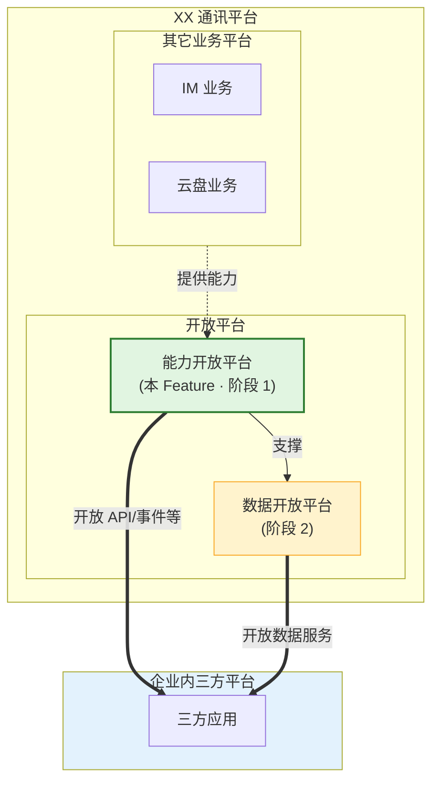
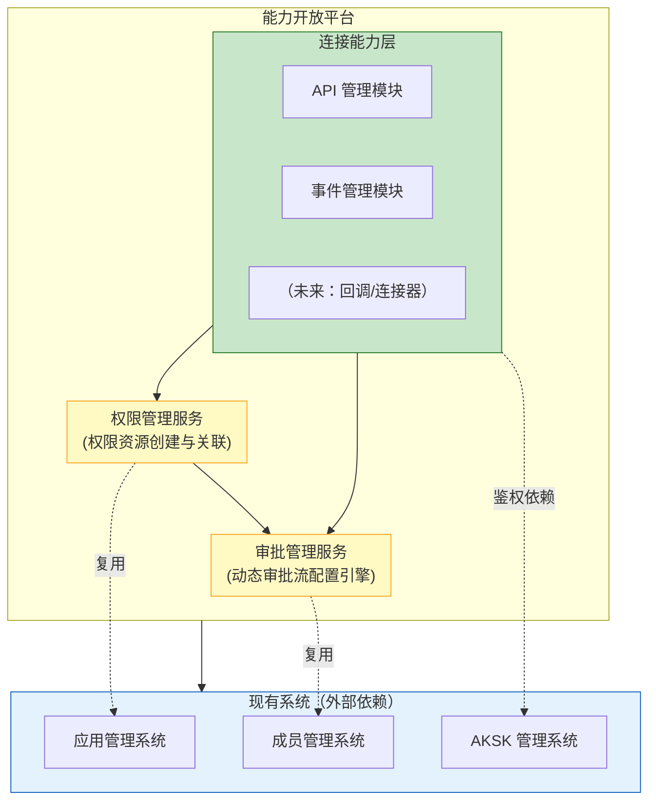
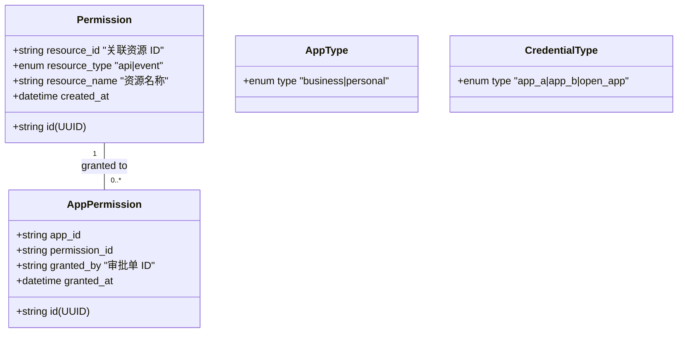
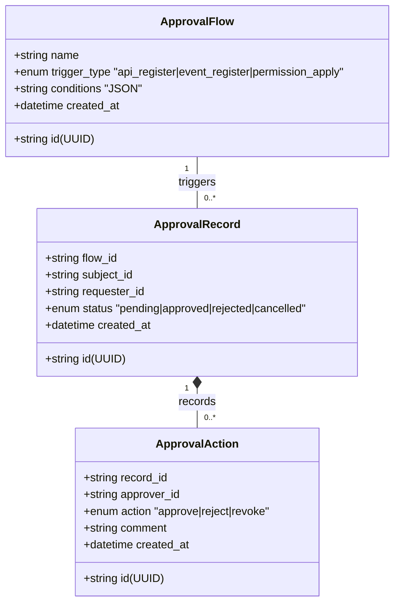
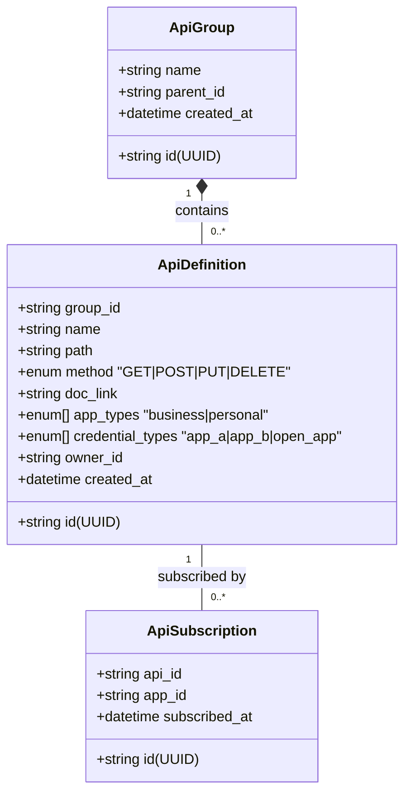
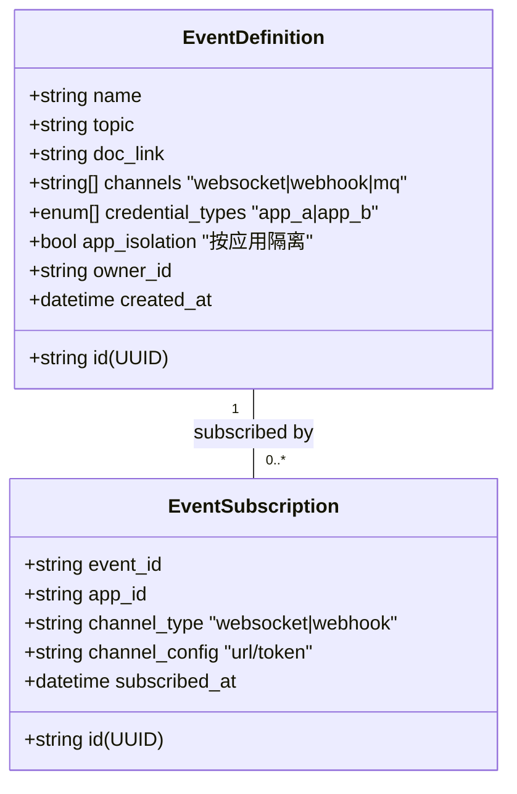

# 规范文档：能力开放平台

**Feature ID**: CAP-OPEN-001  
**名称**: 能力开放平台（Capability Open Platform）  
**状态**: specified  
**优先级**: P0  
**作者**: Summer  
**创建日期**: 2026-04-14  
**最后更新**: 2026-04-14  
**需求挖掘报告**: discovery-report.md (v2.0)

---

## 1. 概述

### 1.1 问题陈述

XX 通讯平台内部拥有丰富的业务能力（IM、云盘、邮件等），但缺乏统一的开放载体，导致：
- 能力封闭在平台内部，企业内三方平台无法获取
- 没有统一的能力目录，消费方不知道有哪些能力可用
- 能力对接依赖人工开发，效率低、成本高
- 在历史代码基础上继续迭代会增加技术债务

### 1.2 解决方案

构建**能力开放平台**作为统一的能力开放底座，提供：
- **统一的能力管理框架**：API、事件、回调、连接器的注册与治理
- **统一的基础设施**：权限管理、审批管理、嵌入能力
- **标准化的开放流程**：能力提供方注册 → 审批上架 → 消费方订阅 → 权限消费

### 1.3 定位



> 💡 **说明**：能力开放平台和数据开放平台**均面向企业内三方平台**开放能力，区别在于开放的内容类型不同（API/事件 vs 数据服务）。能力开放平台同时为数据开放平台提供底层支撑。

### 1.4 Goals

> 📐 **本章写作标准**
> - **视角**：业务目标（回答"这个 Feature 要达成什么业务目的"）
> - **粒度**：一句话 + 关键词覆盖能力边界
> - **不写什么**：不展开具体功能、不写用户角色、不写字段细节
> - **读者**：决策者/PM，快速了解 Feature 范围
>
> | 维度 | 写法 | 本 spec 示例 |
> |------|------|-------------|
> | ✅ 正确 | 关键词列举能力边界 | "支持 API 的注册、编辑、关联分组、分类、打标签…" |
> | ❌ 错误 | 写成用户故事 | ~~"作为业务负责人，我想要注册 API"~~ |
> | ❌ 错误 | 写成验收标准 | ~~"支持填写名称、描述、路径、方法、参数"~~ |

| # | 目标 | 衡量标准 |
|---|------|---------|
| G1 | 提供统一的权限管理底座 | 支持基于权限资源（API/事件/数据等）创建权限并关联到资源，申请权限即代表申请了权限关联的资源；衍生的权限可授予开放应用（业务应用、个人应用） |
| G2 | 提供统一的审批管理底座 | 支持动态审批流配置，覆盖 API 注册审批、事件注册审批、权限申请审批；支持同意、驳回、撤销操作 |
| G3 | 提供 API 管理能力 | 支持 API 的**注册、订阅、取消订阅**、编辑、关联分组、分类、树形分组管理；分类维度：应用类型（业务/个人）、凭证类型（应用类 A/B、开放应用凭证），多对多关系 |
| G4 | 提供事件管理能力 | 支持事件的**注册、订阅、取消订阅**、分组、分类；事件消费区分通道类型（企业内部消息队列/WebSocket/WebHook），区分凭证类型（应用类 A/B）；支持按应用隔离消费 |

> ⚠️ **说明**：本 Feature 仅做**整体设计**，明确前后端功能边界与资源清单。子 Feature（如 `capability-open-platform-serve`、`capability-open-platform-web`）将包含各自的详细设计、Plan/Tasks 等。本 Feature **不包含**后续的 Plan/Tasks 过程。

### 1.5 Non-Goals

| # | 非目标 | 原因 |
|---|--------|------|
| NG1 | 实现能力消费网关（API 网关/流控） | Should Have，已有代码涉及较多企业内部逻辑，可能人工开发 |
| NG2 | 实现回调管理 | Should Have，非 MVP 范围 |
| NG3 | 实现连接器管理 | Should Have，非 MVP 范围 |
| NG4 | 实现特有连接能力（IM 卡片、云盘、邮件） | 由业务模块建设，通过嵌入能力接入，本阶段仅搭建框架 |
| NG5 | 实现能力目录/市场、开发者工具链、用量统计、操作审计日志 | Should Have，非 MVP 范围 |
| NG6 | 替代现有应用管理、成员管理、AKSK 管理 | 沿用现有系统，不重复建设 |

---

## 2. 用户故事

> 📐 **本章写作标准**
> - **视角**：用户场景（回答"谁会用它、用来做什么、为什么需要"）
> - **格式**：`作为 [角色]，我想要 [功能]，以便 [价值]`
> - **粒度**：一个场景一条，不涉及系统字段、参数、状态
> - **读者**：产品/业务方，理解用户视角的价值
>
> | 维度 | 写法 | 本 spec 示例 |
> |------|------|-------------|
> | ✅ 正确 | 角色 + 动作 + 价值 | "作为 IM 模块负责人，我想要注册 API，以便三方平台使用" |
> | ❌ 错误 | 写成技术描述 | ~~"系统需要提供 REST API 注册接口"~~ |
> | ❌ 错误 | 写字段细节 | ~~"支持填写名称、描述、路径、方法"~~ |
>
> **三章节递进示例（以 API 注册为例）**:
> ```
> §1.4 Goals:     "支持 API 注册"                                    ← 关键词
> §2 用户故事:    "作为 IM 负责人，我想注册 API，以便三方平台使用"    ← 场景
> §3 功能需求:    "支持填写名称、定义路径、定义方法、定义参数…"       ← 验收标准
> ```

### 2.1 能力提供方（业务模块负责人）

| ID | 用户故事 | 优先级 | 验收标准 |
|----|---------|--------|---------|
| US-01 | 作为 **业务模块负责人**，我想要 **将 API/事件注册到能力开放平台**，以便 **三方平台可以发现和使用我模块的能力** | P0 | 提供方可以提交 API 或事件的注册申请，填写相关信息 |
| US-02 | 作为 **业务模块负责人**，我想要 **审批消费方的权限申请**，以便 **控制能力开放的风险** | P0 | 提供方可以查看待审批列表，执行同意/驳回操作，审批记录留痕 |

### 2.2 能力消费方（三方平台负责人）

| ID | 用户故事 | 优先级 | 验收标准 |
|----|---------|--------|---------|
| US-04 | 作为 **三方平台负责人**，我想要 **浏览 API/事件目录及跳转说明文档**，以便 **找到我需要的能力权限** | P0 | 消费方可以浏览已上架的 API/事件目录，并点击查看/跳转至说明文档 |
| US-05 | 作为 **三方平台负责人**，我想要 **申请能力权限**，以便 **获得调用权限** | P0 | 消费方可以发起权限申请，选择应用和需要的 API/事件权限，提交后等待审批 |
| US-06 | 作为 **三方平台负责人**，我想要 **配置事件的消费方式与凭证**，以便 **正确接收事件通知** | P0 | 支持针对不同事件配置消费类型（WebHook、WebSocket 等，**WebSocket 仅限个人应用**）及关联凭证（AKSK、应用类凭证等） |

### 2.3 平台管理方（开放平台运营人员）

| ID | 用户故事 | 优先级 | 验收标准 |
|----|---------|--------|---------|
| US-07 | 作为 **平台运营人员**，我想要 **审批 API/事件的注册申请**，以便 **确保上架能力的合规性** | P0 | 运营人员可以查看 API/事件注册申请，执行同意/驳回/撤销操作 |

---

## 3. 功能需求 (FR)

> 📐 **本章写作标准**
> - **视角**：功能需求 (FR) 与验收标准（回答"系统必须实现什么、怎么验证"）
> - **格式**：表格形式，按模块分表，列：FR | 名称 | 描述 | 验收标准
> - **粒度**：本 Feature 为整体设计，列出核心 FR 及验收标准，详细交互设计见子 Feature
> - **读者**：架构师、PM、子 Feature 负责人
> - **说明**：权限信息定义（名称、审批人等）在资源注册时附带处理，无独立权限管理模块

### 3.1 API 管理

> 💡 **定位**：API 资源生命周期管理（查看、注册、编辑、删除）。
> 🔒 **权限控制**：**分组责任人**（由平台运营方在分组配置中指定）拥有对应分组的增删改查权限。

| FR | 名称 | 描述 | 验收标准 |
|----|------|------|---------|
| FR-001 | API 权限列表查看 | 分组责任人查看本分组已注册的 API 列表及状态 | • 列表展示：权限名称、codeName、认证方式、分类、状态<br/>• 支持操作：查看文档、复制审批地址、撤回审核（审核中） |
| FR-002 | API 权限注册 | **分组责任人**提交权限信息，关联底层 API | • 支持填写权限基本信息（名称、标识、审批人）<br/>• 支持关联**底层 API**（自动同步 API 属性字段如路径、方法）<br/>• 支持选择所属的**权限分组**<br/>• 支持指定**资源特有审批流**（优先级高于全局/场景默认） |
| FR-003 | API 权限编辑 | **分组责任人**修改已注册的权限信息 | • 支持修改权限名称、审批人、分组<br/>• 关联的底层 API 变更需重新审批<br/>• 修改记录需留痕 |
| FR-004 | API 权限删除 | **分组责任人**下线已注册的 API 权限 | • 支持删除未关联应用的 API 权限<br/>• 已订阅的权限需提示或禁止删除<br/>• 删除记录需留痕 |

### 3.2 事件管理

> 💡 **定位**：事件资源生命周期管理（查看、注册、编辑、删除）。权限模型同 API 管理。

| FR | 名称 | 描述 | 验收标准 |
|----|------|------|---------|
| FR-005 | 事件权限列表查看 | 分组责任人查看本分组已注册的事件列表及状态 | • 同 API 权限列表查看逻辑 |
| FR-006 | 事件权限注册 | 分组责任人提交事件权限，关联底层事件 | • 支持填写权限基本信息（名称、标识、审批人）<br/>• 支持关联**底层事件**（Topic、通道类型等）<br/>• 支持配置**通道类型**（WebHook、WebSocket、内部消息队列）<br/>• **WebSocket 通道仅限个人应用场景下配置**<br/>• 支持指定**资源特有审批流** |
| FR-007 | 事件权限编辑 | 分组责任人修改已注册的事件权限信息 | • 支持修改权限基本信息、通道配置<br/>• 关联的底层事件变更需重新审批 |
| FR-008 | 事件权限删除 | 分组责任人下线已注册的事件权限 | • 支持删除未订阅的事件权限<br/>• 已订阅的事件需提示或禁止删除 |

### 3.3 分组管理

> 💡 **定位**：统一的目录结构治理。**仅限平台运营方**访问。
> 支持多种资源类型（API、事件、回调等）挂载于同一分组体系，实现统一的权限隔离与责任人分配。

| FR | 名称 | 描述 | 验收标准 |
|----|------|------|---------|
| FR-009 | 分组创建/编辑 | **运营方**维护通用目录结构（L1） | • 支持新增/编辑一级分组（如"IM 业务"、"云盘业务"）<br/>• 支持为分组指定**资源类型**（API/事件/回调等）<br/>• 支持拖拽调整顺序，删除时需检查关联资源 |
| FR-010 | 分组责任人配置 | **运营方**为分组配置权限责任人 | • 支持为一级分组配置**责任人清单**（各业务模块责任人）<br/>• 责任人自动获得该分组下（及子分组）对应资源类型的管理权限<br/>• 支持权限回收与转移 |
| FR-011 | 资源类型扩展支持 | 支持未来新增资源类型的分组管理 | • 架构设计支持动态扩展新资源类型（如 Callback、Connector）<br/>• 无需修改分组管理核心逻辑即可接入新类型 |

### 3.4 API 权限管理

> 💡 **定位**：消费方视角。查看当前应用权限列表、浏览全量权限树、提交申请。

| FR | 名称 | 描述 | 验收标准 |
|----|------|------|---------|
| FR-012 | 应用权限列表查看 | 消费方查看当前应用已申请/申请中的 API 权限状态 | • 列表展示：权限名称、codeName、认证方式、分类、状态<br/>• 支持操作：查看文档、复制审批地址、撤回审核（审核中）<br/>• 提供"添加 API"入口唤起申请弹框 |
| FR-013 | API 权限树形选择 | 消费方通过 L1-L4 树形结构浏览并选择 API 权限 | • 弹框内按**应用类型 -> 凭证类型 -> 分组 -> 权限列表**展示全量权限<br/>• 支持多选加入申请单<br/>• 支持搜索/过滤 |
| FR-014 | API 权限申请提交 | 消费方提交 API 权限申请单 | • 申请单自动汇总所选权限及对应审批流<br/>• 支持依赖自动级联（置灰不可取消）<br/>• 提交后等待提供方审批 |

### 3.5 事件权限管理

> 💡 **定位**：消费方视角。查看当前应用事件订阅、浏览全量事件权限、提交订阅申请。

| FR | 名称 | 描述 | 验收标准 |
|----|------|------|---------|
| FR-015 | 应用事件列表查看 | 消费方查看当前应用已订阅/申请中的事件权限 | • 同 API 应用权限列表查看逻辑 |
| FR-016 | 事件权限树形选择 | 消费方通过 L1-L4 树形结构浏览并选择事件权限 | • 同 API 权限树形选择逻辑 |
| FR-017 | 事件权限申请提交 | 消费方提交事件权限申请，配置消费通道 | • 支持配置事件**消费通道**（WebHook URL、WebSocket Token 等）<br/>• 提交后等待提供方审批 |

### 3.6 审批管理

> 💡 **定位**：统一审批引擎。覆盖 API/事件注册审批、权限申请审批，支持动态审批流配置。

| FR | 名称 | 描述 | 验收标准 |
|----|------|------|---------|
| FR-018 | 审批流程配置 | 支持多层级审批流配置，维护全局及场景默认审批流 | • 支持**全局默认**审批流<br/>• 支持**场景特有**审批流（如 API、事件通用审批流） |
| FR-019 | 资源注册审批 | 提供方注册 API/事件后，需经平台运营审批 | • 注册提交后自动生成审批单<br/>• 支持审批操作：**同意**（通过）、**驳回**（需填写原因）、**撤销**<br/>• 审批通过后资源变为「已上架」状态 |
| FR-020 | 权限申请审批 | 消费方申请权限后，需经资源提供方审批 | • 申请提交后，根据权限上定义的审批人自动生成审批单<br/>• 支持审批操作：**同意**（通过）、**驳回**（需填写原因）、**撤销**<br/>• 审批通过后自动激活订阅关系 |

---

## 4. 非功能需求 (NFR)

### 4.1 性能要求

| ID | 需求 | 目标值 |
|----|------|--------|
| NFR-001 | 权限数据查询响应时间 | P99 < 50ms（供网关/消费方查询权限分配情况） |
| NFR-002 | API/事件目录查询响应时间 | P99 < 200ms |
| NFR-003 | 事件分发延迟 | P99 < 1s（从发布到消费方接收） |
| NFR-004 | 系统可用性 | ≥ 99.9% |

### 4.2 安全性要求

| ID | 需求 | 描述 |
|----|------|------|
| NFR-005 | 身份认证 | 所有管理操作需通过现有 AK/SK 认证 |
| NFR-006 | 权限控制 | 操作权限基于角色（RBAC），提供方/消费方/管理方角色隔离 |
| NFR-007 | 审计日志 | 所有配置变更（注册/审批/权限分配）需记录审计日志 |
| NFR-008 | 数据传输安全 | 所有 API 调用需使用 HTTPS |

### 4.3 可用性要求

| ID | 需求 | 描述 |
|----|------|------|
| NFR-009 | 操作可回滚 | 关键操作（权限分配、审批决策）支持撤销/回滚 |
| NFR-010 | 错误提示 | 所有操作失败时提供明确的错误码和错误信息 |
| NFR-011 | 操作指引 | 能力提供方和消费方首次使用时有引导流程 |

### 4.4 兼容性要求

| ID | 需求 | 描述 |
|----|------|------|
| NFR-012 | 现有系统集成 | 复用现有应用管理、成员管理、AKSK 管理系统，不破坏现有功能 |
| NFR-013 | 数据开放平台兼容 | 权限模型和审批流程设计需支持数据开放平台复用 |
| NFR-014 | API 格式兼容 | API 管理支持 RESTful 标准，响应格式支持 JSON |

### 4.5 可扩展性要求

| ID | 需求 | 描述 |
|----|------|------|
| NFR-015 | 权限模型扩展 | 权限模型需支持未来扩展（如数据对象权限） |
| NFR-016 | 事件类型扩展 | 事件管理需支持未来扩展新的消费形式（如回调、连接器） |
| NFR-017 | 审批流程扩展 | 审批流程配置需支持未来扩展新的审批节点类型 |

---

## 5. 技术设计

### 5.1 架构设计



### 5.2 数据模型

#### 5.2.1 权限模型



#### 5.2.2 审批模型



#### 5.2.3 API 管理模型



#### 5.2.4 事件管理模型



### 5.3 API 接口设计（管理面）

#### 5.3.1 权限管理 API

| 方法 | 路径 | 描述 | 权限 |
|------|------|------|------|
| POST | `/api/v1/permissions` | 创建权限资源（关联到 API/事件） | 平台管理方 |
| GET | `/api/v1/permissions` | 查询权限资源列表 | 平台管理方 |
| POST | `/api/v1/permissions/grant` | 分配权限给应用（审批通过后调用） | 平台管理方 |
| POST | `/api/v1/permissions/revoke` | 撤销应用权限 | 平台管理方 |
| GET | `/api/v1/permissions/apps/{id}` | 查询某应用的已授权列表 | 消费方/提供方 |

#### 5.3.2 审批管理 API

| 方法 | 路径 | 描述 | 权限 |
|------|------|------|------|
| POST | `/api/v1/admin/approval-flows` | 创建审批流程模板 | 平台管理方 |
| GET | `/api/v1/approvals/{id}` | 查询审批详情 | 相关方 |
| POST | `/api/v1/approvals/{id}/actions` | 执行审批操作（同意/驳回/撤销） | 审批人 |
| GET | `/api/v1/approvals/pending` | 查询待审批列表 | 当前用户 |

#### 5.3.3 API 管理 API

| 方法 | 路径 | 描述 | 权限 |
|------|------|------|------|
| POST | `/api/v1/api-groups` | 创建 API 分组 | 能力提供方 |
| GET | `/api/v1/api-groups` | 查询 API 分组列表（树形） | 所有用户 |
| POST | `/api/v1/apis` | 注册 API | 能力提供方 |
| GET | `/api/v1/apis` | 查询 API 列表（目录） | 所有用户 |
| PUT | `/api/v1/apis/{id}` | 更新 API | 能力提供方 |
| POST | `/api/v1/apis/{id}/subscribe` | 订阅 API | 能力消费方 |
| POST | `/api/v1/apis/{id}/unsubscribe` | 取消订阅 API | 能力消费方 |

#### 5.3.4 事件管理 API

| 方法 | 路径 | 描述 | 权限 |
|------|------|------|------|
| POST | `/api/v1/events` | 注册事件 | 能力提供方 |
| GET | `/api/v1/events` | 查询事件列表（目录） | 所有用户 |
| PUT | `/api/v1/events/{id}` | 更新事件 | 能力提供方 |
| POST | `/api/v1/events/{id}/subscribe` | 订阅事件（配置通道/凭证） | 能力消费方 |
| POST | `/api/v1/events/{id}/unsubscribe` | 取消订阅事件 | 能力消费方 |

### 5.4 页面设计

| 页面名称 | 路由/路径 | 描述 | 目标用户 |
|----------|-----------|------|----------|
| **控制台** | `/dashboard` | 关键指标概览（待办审批、订阅统计等） | 运营方/提供方 |
| **API 管理** | `/apis/manage` | 注册/编辑 API 权限，管理分组树（**仅限白名单用户**） | 提供方（白名单） |
| **事件管理** | `/events/manage` | 注册/编辑事件权限，管理分组树（**仅限白名单用户**） | 提供方（白名单） |
| **API 权限申请** | `/apis/subscribe` | 外侧列表展示已申请/申请中权限；“添加 API"弹框按 L1-L4 树多选提交 | 消费方 |
| **事件权限申请** | `/events/subscribe` | 外侧列表展示已订阅事件；“添加事件”弹框配置通道/凭证 | 消费方 |
| **审批中心** | `/approvals` | 待办列表（资源注册审批、权限申请审批） | 运营方/提供方 |
| **我的订阅** | `/subscriptions` | 查看已授权权限，配置事件通道参数 | 消费方 |

### 5.5 第三方依赖

| 依赖 | 用途 | 集成方式 |
|------|------|---------|
| 应用管理系统 | 应用身份（AppID）、应用生命周期管理 | API 集成，复用现有接口 |
| 凭证管理系统 | 应用凭证（AKSK、应用类凭证 A/B、开放应用凭证等） | API 集成，复用现有接口 |
| 成员管理系统 | 用户身份、组织架构 | API 集成，复用现有接口 |
| 内部消息平台 | 事件分发、审批通知 | API 集成，调用消息发送接口 |
| 操作日志系统 | 审计日志记录 | API 集成，写入审计日志 |

---

## 6. 边界情况 (EC)

### 6.1 权限相关

| ID | 场景 | 处理策略 |
|----|------|---------|
| EC-001 | 消费方申请已不存在的权限资源 | 提示权限资源已失效，引导重新浏览目录 |
| EC-002 | 权限分配后被撤销 | 消费方将无法继续通过该权限调用能力（需由消费网关/通道执行） |
| EC-003 | 同一应用重复申请同一权限 | 幂等处理，返回已有授权记录 |

### 6.2 审批相关

| ID | 场景 | 处理策略 |
|----|------|---------|
| EC-004 | 审批人不在系统中（已离职） | 自动转交给审批人的上级或角色替代者 |
| EC-005 | 审批超时未处理 | 发送超时提醒，超时后可配置自动通过/拒绝/转交 |
| EC-006 | 消费方在审批期间撤销申请 | 审批流程终止，状态标记为 `cancelled` |
| EC-007 | 审批通过后被撤销 | 系统自动触发权限回收流程，通知相关方 |

### 6.3 API/事件管理相关

| ID | 场景 | 处理策略 |
|----|------|---------|
| EC-008 | 事件 Topic 命名冲突 | 系统校验 Topic 唯一性，冲突时拒绝注册 |
| EC-009 | 消费方配置了不支持的通道类型 | 校验配置：WebSocket 仅限个人应用，业务应用配置时拒绝 |
| EC-010 | API/事件注册信息变更 | 变更后需重新审批，审批期间原配置继续生效 |
| EC-011 | 消费方订阅配置错误（如 WebHook URL 无效） | 订阅创建时进行连通性检查或格式校验，提示错误 |

### 6.4 并发与一致性

| ID | 场景 | 处理策略 |
|----|------|---------|
| EC-012 | 并发权限分配（同一应用、同一资源） | 幂等处理，重复分配返回已有记录 |
| EC-013 | 并发审批（同一审批单、多个审批人） | 基于审批流配置（串行需等待，并行可并行处理） |
| EC-014 | 事件通道切换期间的消息丢失 | 建议消费方在切换通道时保持双通道监听一小段时间，或系统提供缓冲队列 |

---

## 7. 开放问题

| ID | 问题 | 影响范围 | 建议方案 | 状态 |
|----|------|---------|---------|------|
| OQ-001 | 事件分发使用哪种消息中间件？ | 事件管理模块 | 复用企业内部消息平台，待确认具体平台 | ⏳ 待确认 |
| OQ-002 | API 网关是否在本阶段实现？ | 能力消费 | 已有代码涉及内部逻辑，建议人工开发，本阶段仅定义接口规范 | ⏳ 待确认 |
| OQ-003 | 审批流程是否需要集成现有 OA 系统？ | 审批管理模块 | 若现有 OA 支持 API 集成则可对接，否则自建轻量审批引擎 | ⏳ 待确认 |
| OQ-005 | 与数据开放平台的接口契约如何定义？ | 跨平台集成 | 在数据开放平台规范中定义，本阶段保持权限模型可扩展 | ⏳ 待确认 |

---

## 8. 附录

### 8.1 术语表

| 术语 | 定义 |
|------|------|
| **权限资源 (Permission Resource)** | 需要权限管控的对象（如特定的 API、事件），系统基于此创建权限 |
| **能力 (Capability)** | 可开放的业务功能，包括 API、事件等 |
| **能力提供方 (Provider)** | 拥有业务能力并注册到开放平台的业务模块负责人 |
| **能力消费方 (Consumer)** | 使用开放平台能力的三方平台/应用 |
| **应用类型 (App Type)** | 应用的分类：业务应用（组织/项目级）、个人应用（个人级） |
| **凭证类型 (Credential Type)** | 身份验证方式：应用类凭证 A、应用类凭证 B、开放应用凭证等 |
| **通道类型 (Channel Type)** | 事件消费的传输方式：企业内部消息队列、WebSocket、WebHook |
| **平台管理方 (Admin)** | 开放平台的运营/研发人员 |
| **AK/SK** | Access Key / Secret Key，应用身份凭证之一 |
| **Topic** | 事件的主题标识，用于事件订阅和分发 |

### 8.2 与数据开放平台的关系

| 维度 | 关系说明 |
|------|---------|
| **定位** | 能力开放平台是基础设施（阶段 1），数据开放平台是上层应用（阶段 2） |
| **依赖** | 数据开放平台复用能力开放平台的权限管理、审批管理、API/事件通道 |
| **权限模型** | 统一权限模型，数据开放平台将数据对象映射到 Scope 后复用 |
| **不存在迁移** | 两者长期并存，非替代关系 |

### 8.3 参考文档

- 需求挖掘报告: `discovery-report.md` (v2.0)
- 需求挖掘分析: `discovery-analysis.md`
- 数据开放平台规范: `specs-tree-data-open-platform/spec.md`

---

**文档状态**: ✅ 规范编写完成  
**下一步**: 运行 `@sdd-plan 能力开放平台` 开始技术规划

---

## 修订记录

| 版本 | 日期 | 修订内容 | 修订人 |
|------|------|---------|--------|
| v1.0 | 2026-04-14 | **初始版本**：完成规范文档初稿，包含 Goals、用户故事、FR/NFR/EC 及技术设计 | AI Assistant |
| v1.1 | 2026-04-14 | **图表优化**：将 ASCII 图替换为 Mermaid 图（定位图、架构图、数据模型 ClassDiagram） | AI Assistant |
| v1.2 | 2026-04-14 | **定位修正**：§1.3 明确能力开放和数据开放均面向三方平台开放能力 | AI Assistant |
| v1.3 | 2026-04-14 | **目标对齐**：§1.4 Goals 与 discovery-report Must Have 严格对齐（权限、审批、API、事件） | AI Assistant |
| v1.4 | 2026-04-14 | **API 细化**：§3.3 API 管理 FR 细化为 8 个（注册、编辑、分类、打标签、树形分组等），事件 FR 重新编号 | AI Assistant |
| v1.5 | 2026-04-14 | **写作标准**：在 §1.4/§2/§3 开头添加写作标准和三章节递进示例 | AI Assistant |
| v1.6 | 2026-04-14 | **格式重构**：第三章 FR 从标题 + 列表格式改为表格形式，按模块分 4 个表 | AI Assistant |
| v1.7 | 2026-04-14 | **权限目标**：更新 G1 目标术语（管控对象→权限资源），明确申请权限即申请资源 | AI Assistant |
| v1.8 | 2026-04-14 | **全面修订**：基于用户逐项确认，全面更新 G1-G4 目标细节（权限资源、审批场景、API/事件分类维度） | AI Assistant |
| v1.9 | 2026-04-14 | **范围调整**：G1 移除鉴权（属 NG1 网关能力）；用户故事 US-01~08 范围调整（移除统计、管理模型等） | AI Assistant |
| v1.10 | 2026-04-14 | **用户故事更新**：新增 US-06（事件消费配置）；明确 US-04（目录跳转文档）、US-06（WebSocket 仅限个人应用） | AI Assistant |
| v1.11 | 2026-04-14 | **目标完善**：G4 增加按应用隔离消费；G3/G4 移除打标签；统一核心流程为注册、订阅、取消订阅 | AI Assistant |
| v1.12 | 2026-04-14 | **全章对齐**：基于最新 Goals/User Stories 全面更新第 3-8 章。移除版本/状态/鉴权/标签管理，重写数据模型与接口设计，新增订阅/事件通道配置功能，更新术语表 | AI Assistant |
| v1.13 | 2026-04-14 | **思路重构**：基于多维分类树思路重写第 3 章。明确权限隐式化（附着资源）、依赖级联、多维树形目录（应用类型->凭证类型->分组） | AI Assistant |
| v1.14 | 2026-04-14 | **架构调整**：第 3 章移除前后端归属列，回归纯功能视角；第 5 章新增"页面设计"清单，明确前端页面结构 | AI Assistant |
| v1.15 | 2026-04-16 | **审批 FR 拆分**：FR-004/005 拆分为 API/事件各两条（FR-004~007），后续 FR 编号顺延（FR-008~018），总计 18 个 FR；同步更新 spec.json | AI Assistant |
| v1.16 | 2026-04-16 | **UI/访问控制重构**：§3.3 明确注册/编辑仅限白名单用户；§3.5 消费方交互拆分为外侧列表+添加弹框（L1-L4 树多选）；§5.4 页面设计同步更新为提供方/消费方独立页面 | AI Assistant |
| v1.17 | 2026-04-16 | **API 管理拆分**：§3.3 聚焦权限分类（FR-008/011），注册/编辑剥离为独立 §3.4 API 管理（FR-009/010），职责更清晰 | AI Assistant |
| v1.18 | 2026-04-16 | **删除独立权限管理**：移除 §3.1 权限管理（FR-001），权限信息定义在资源注册时附带处理；FR 重新编号（FR-001~016），总计 16 个 FR | AI Assistant |
| v1.19 | 2026-04-16 | **生命周期对齐**：§3 按生命周期顺序重构：API/事件管理（查看/注册/编辑/删除）→ API/事件权限管理（查看/浏览/申请）→ 审批管理（注册/申请审批）；FR 扩展至 17 个 | AI Assistant |
| v1.20 | 2026-04-16 | **审批流配置迁移**：FR-015 移除"资源特有审批流"配置，迁移至 §3.1/3.2 的注册环节（FR-002/006），符合生命周期逻辑 | AI Assistant |
| v1.21 | 2026-04-16 | **分组治理模式升级**：§3.3 分组管理收归平台运营方（新增 FR-010 配置责任人）；§3.1/3.2 权限控制改为“分组责任人”模型；FR 扩展至 19 个 | AI Assistant |
| v1.22 | 2026-04-16 | **一级分组拆分**：§3.3 拆分为 API/事件一级分组管理（FR-009~012），区分 API/事件目录体系与责任人配置；FR 扩展至 21 个 | AI Assistant |
| v1.23 | 2026-04-16 | **分组管理统一化**：§3.3 合并为统一分组管理（FR-009~011），支持 API/事件/回调等多种资源类型挂载；FR 收敛至 20 个 | AI Assistant |

---

**最后更新**: 2026-04-16（统一分组管理支持多资源类型）
