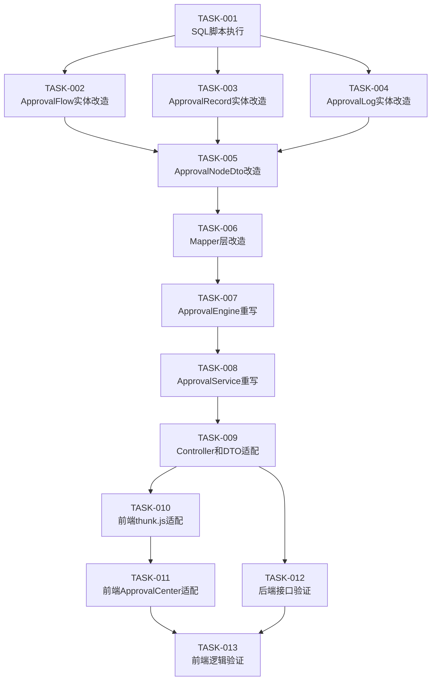

# 审批流程实现任务拆解

> **版本**: 1.0.0  
> **创建时间**: 2026-04-24  
> **状态**: 任务拆解完成  
> **基于设计**: plan-flow.md v2.8.0

---

## 📋 目录

- [1. 概述](#1-概述)
- [2. 任务汇总](#2-任务汇总)
- [3. 执行波次](#3-执行波次)
- [4. 详细任务清单](#4-详细任务清单)
- [5. 依赖关系](#5-依赖关系)
- [6. 验收标准](#6-验收标准)

---

## 1. 概述

### 1.1 任务背景

基于最新的审批流程设计（plan-flow.md v2.8.0），需要重新实现后端和前端审批功能。

### 1.2 主要变更

从 v2.1.0 到 v2.4.0 的设计变更：
- 移除 `is_default` 字段，改用 `code='global'` 标识全局审批
- 移除 `flow_id` 字段，审批记录只保留 `combined_nodes` VARCHAR(4000)
- 移除 `approval_flow_id`，权限表改用 `resource_nodes` VARCHAR(2000) 直接存储审批节点
- 调整审批顺序为"从具体到一般"：资源审批 → 场景审批 → 全局审批
- 三级审批是"串联组合"而非"选择执行"

### 1.3 实现范围

1. SQL 脚本执行（表结构调整）
2. 后端 open-server 审批功能改造
3. 前端 wecodesite 审批功能改造
4. 后端接口验证
5. 前端逻辑验证

---

## 2. 任务汇总

| 维度 | 统计 |
|------|------|
| **总任务数** | 13 个 |
| **SQL 任务** | 1 个 |
| **后端任务** | 8 个 |
| **前端任务** | 2 个 |
| **验证任务** | 2 个 |
| **复杂度分布** | S 级 4 个，M 级 7 个，L 级 2 个 |
| **执行波次** | 4 个波次 |
| **预估工期** | 3.5 人天 |

---

## 3. 执行波次

### Wave 1: SQL 脚本执行
- TASK-001: 执行 SQL 脚本（表结构调整）

### Wave 2: 后端核心实体改造
- TASK-002: ApprovalFlow 实体类改造
- TASK-003: ApprovalRecord 实体类改造
- TASK-004: ApprovalLog 实体类改造
- TASK-005: ApprovalNodeDto DTO改造
- TASK-006: Mapper 层改造

### Wave 3: 后端核心逻辑重写
- TASK-007: ApprovalEngine 重写（三级审批组合逻辑）
- TASK-008: ApprovalService 重写（适配最新设计）
- TASK-009: Controller 和 DTO 适配

### Wave 4: 前端和验证
- TASK-010: 前端 thunk.js 适配
- TASK-011: 前端 ApprovalCenter.jsx 适配
- TASK-012: 后端接口验证测试
- TASK-013: 前端逻辑验证测试

---

## 4. 详细任务清单

### TASK-001: 执行 SQL 脚本（表结构调整）

**任务描述**：
执行最新的 SQL 脚本，更新数据库表结构以适配 v2.8.0 设计。

**实现范围**：SQL

**依赖关系**：无依赖

**优先级**：P0（最高）

**预估工作量**：0.5 人天

**执行步骤**：
1. 执行 `docs/sql/00-drop-schema.sql` 清理旧表结构
2. 执行 `docs/sql/01-init-schema.sql` 创建新表结构
3. 执行 `docs/sql/02-insert-default-data.sql` 插入默认数据

**关键变更**：
- `openplatform_v2_permission_t`: 新增 `need_approval` 和 `resource_nodes` 字段
- `openplatform_v2_approval_flow_t`: 已移除 `is_default` 字段，使用 `code='global'` 标识全局审批
- `openplatform_v2_approval_record_t`: 已移除 `flow_id` 字段，直接存储 `combined_nodes`
- `openplatform_v2_approval_log_t`: 已包含 `level` 字段

**验证方式**：
```sql
-- 检查表结构
DESC openplatform_v2_approval_flow_t;
DESC openplatform_v2_approval_record_t;
DESC openplatform_v2_approval_log_t;
DESC openplatform_v2_permission_t;

-- 检查默认数据
SELECT * FROM openplatform_v2_approval_flow_t WHERE code='global';
```

---

### TASK-002: ApprovalFlow 实体类改造

**任务描述**：
改造 ApprovalFlow 实体类，移除 `isDefault` 字段，适配 v2.4.0 设计。

**实现范围**：后端 Java 实体类

**依赖关系**：依赖 TASK-001（SQL 脚本执行完成）

**优先级**：P0

**预估工作量**：0.25 人天

**文件位置**：
- `open-server/src/main/java/com/xxx/open/modules/approval/entity/ApprovalFlow.java`

**关键改造点**：
- ✅ 移除 `isDefault` 字段
- ✅ 保留 `code` 字段，使用 `code='global'` 标识全局审批
- ✅ 保留 `nodes` 字段（VARCHAR → String）
- ✅ 更新相关的 getter/setter 方法

**验证方式**：
```bash
# 编译检查
mvn clean compile

# 单元测试
mvn test -Dtest=ApprovalFlowTest
```

---

### TASK-003: ApprovalRecord 实体类改造

**任务描述**：
改造 ApprovalRecord 实体类，移除 `flowId` 相关字段，新增 `combinedNodes` 字段。

**实现范围**：后端 Java 实体类

**依赖关系**：依赖 TASK-001

**优先级**：P0

**预估工作量**：0.25 人天

**文件位置**：
- `open-server/src/main/java/com/xxx/open/modules/approval/entity/ApprovalRecord.java`

**关键改造点**：
- ✅ 移除 `globalFlowId`、`sceneFlowId`、`resourceFlowId`、`flowId` 字段
- ✅ 新增 `combinedNodes` 字段（String 类型，存储 JSON 字符串）
- ✅ 保留 `currentNode` 字段（当前审批节点索引）
- ✅ 更新相关的 getter/setter 方法

**验证方式**：
```bash
# 编译检查
mvn clean compile

# 单元测试
mvn test -Dtest=ApprovalRecordTest
```

---

### TASK-004: ApprovalLog 实体类改造

**任务描述**：
改造 ApprovalLog 实体类，新增 `level` 字段标记审批级别。

**实现范围**：后端 Java 实体类

**依赖关系**：依赖 TASK-001

**优先级**：P0

**预估工作量**：0.25 人天

**文件位置**：
- `open-server/src/main/java/com/xxx/open/modules/approval/entity/ApprovalLog.java`

**关键改造点**：
- ✅ 新增 `level` 字段（String 类型，存储：global/scene/resource）
- ✅ 保留其他字段不变
- ✅ 更新相关的 getter/setter 方法

**验证方式**：
```bash
# 编译检查
mvn clean compile

# 单元测试
mvn test -Dtest=ApprovalLogTest
```

---

### TASK-005: ApprovalNodeDto DTO改造

**任务描述**：
改造 ApprovalNodeDto，新增 `level` 字段标记审批节点级别。

**实现范围**：后端 Java DTO

**依赖关系**：依赖 TASK-002, TASK-003, TASK-004

**优先级**：P0

**预估工作量**：0.25 人天

**文件位置**：
- `open-server/src/main/java/com/xxx/open/modules/approval/dto/ApprovalNodeDto.java`

**关键改造点**：
- ✅ 新增 `level` 字段（String 类型，标记审批级别）
- ✅ 保留 `type`、`userId`、`userName`、`order` 字段
- ✅ 更新 JSON 序列化/反序列化逻辑

**验证方式**：
```bash
# 编译检查
mvn clean compile

# 单元测试
mvn test -Dtest=ApprovalNodeDtoTest
```

---

### TASK-006: Mapper 层改造

**任务描述**：
改造 Mapper 层，移除 `is_default` 和 `flow_id` 相关查询。

**实现范围**：后端 Java Mapper

**依赖关系**：依赖 TASK-002, TASK-003, TASK-004, TASK-005

**优先级**：P0

**预估工作量**：0.5 人天

**文件位置**：
- `open-server/src/main/java/com/xxx/open/modules/approval/mapper/ApprovalFlowMapper.java`
- `open-server/src/main/java/com/xxx/open/modules/approval/mapper/ApprovalRecordMapper.java`
- `open-server/src/main/java/com/xxx/open/modules/approval/mapper/ApprovalLogMapper.java`
- `open-server/src/main/resources/mapper/ApprovalFlowMapper.xml`
- `open-server/src/main/resources/mapper/ApprovalRecordMapper.xml`
- `open-server/src/main/resources/mapper/ApprovalLogMapper.xml`

**关键改造点**：
- ✅ ApprovalFlowMapper: 移除 `selectDefaultFlow()`，新增 `selectByCode(String code)`
- ✅ ApprovalRecordMapper: 移除 `flow_id` 相关字段，保留 `combined_nodes` 字段
- ✅ ApprovalLogMapper: 新增 `level` 字段相关查询

**验证方式**：
```bash
# 编译检查
mvn clean compile

# 单元测试
mvn test -Dtest=ApprovalMapperTest
```

---

### TASK-007: ApprovalEngine 重写（三级审批组合逻辑）

**任务描述**：
重写 ApprovalEngine，实现三级审批组合逻辑（资源审批 → 场景审批 → 全局审批）。

**实现范围**：后端 Java Service

**依赖关系**：依赖 TASK-002 到 TASK-006

**优先级**：P0

**预估工作量**：1 人天

**复杂度**：L 级（核心逻辑，需人工监督）

**文件位置**：
- `open-server/src/main/java/com/xxx/open/modules/approval/engine/ApprovalEngine.java`

**关键改造点**：

#### 1. 移除旧的组合逻辑
- ❌ 移除 `selectFlow()` 方法
- ❌ 移除 `is_default` 相关判断

#### 2. 实现新的组合逻辑
```java
/**
 * 组合三级审批节点
 * @param businessType 业务类型
 * @param resourceId 资源ID
 * @return 组合后的审批节点列表
 */
public List<ApprovalNodeDto> composeApprovalNodes(String businessType, Long resourceId) {
    List<ApprovalNodeDto> combinedNodes = new ArrayList<>();
    
    // 1. 第一级：资源审批节点（从 permission_t.resource_nodes 读取）
    List<ApprovalNodeDto> resourceNodes = getResourceApprovalNodes(resourceId);
    for (ApprovalNodeDto node : resourceNodes) {
        node.setLevel("resource");
        combinedNodes.add(node);
    }
    
    // 2. 第二级：场景审批节点（从 approval_flow_t.code='场景编码' 读取）
    List<ApprovalNodeDto> sceneNodes = getSceneApprovalNodes(businessType);
    for (ApprovalNodeDto node : sceneNodes) {
        node.setLevel("scene");
        combinedNodes.add(node);
    }
    
    // 3. 第三级：全局审批节点（从 approval_flow_t.code='global' 读取）
    List<ApprovalNodeDto> globalNodes = getGlobalApprovalNodes();
    for (ApprovalNodeDto node : globalNodes) {
        node.setLevel("global");
        combinedNodes.add(node);
    }
    
    return combinedNodes;
}

/**
 * 从权限表读取资源审批节点
 */
private List<ApprovalNodeDto> getResourceApprovalNodes(Long resourceId) {
    Permission permission = permissionMapper.selectById(resourceId);
    if (permission == null || !permission.getNeedApproval()) {
        return Collections.emptyList();
    }
    String resourceNodesJson = permission.getResourceNodes();
    return parseNodes(resourceNodesJson);
}

/**
 * 从审批流程表读取场景审批节点
 */
private List<ApprovalNodeDto> getSceneApprovalNodes(String businessType) {
    ApprovalFlow sceneFlow = approvalFlowMapper.selectByCode(businessType);
    if (sceneFlow == null) {
        return Collections.emptyList();
    }
    String nodesJson = sceneFlow.getNodes();
    return parseNodes(nodesJson);
}

/**
 * 从审批流程表读取全局审批节点
 */
private List<ApprovalNodeDto> getGlobalApprovalNodes() {
    ApprovalFlow globalFlow = approvalFlowMapper.selectByCode("global");
    if (globalFlow == null) {
        return Collections.emptyList();
    }
    String nodesJson = globalFlow.getNodes();
    return parseNodes(nodesJson);
}
```

**验证方式**：
```bash
# 编译检查
mvn clean compile

# 单元测试
mvn test -Dtest=ApprovalEngineTest

# 集成测试
mvn test -Dtest=ApprovalIntegrationTest
```

---

### TASK-008: ApprovalService 重写（适配最新设计）

**任务描述**：
重写 ApprovalService，适配 v2.8.0 设计变更。

**实现范围**：后端 Java Service

**依赖关系**：依赖 TASK-007

**优先级**：P0

**预估工作量**：0.75 人天

**复杂度**：L 级（核心逻辑，需人工监督）

**文件位置**：
- `open-server/src/main/java/com/xxx/open/modules/approval/service/ApprovalService.java`

**关键改造点**：

#### 1. 创建审批记录
```java
public void createApprovalRecord(String businessType, Long resourceId, String applicantId) {
    // 1. 组合审批节点
    List<ApprovalNodeDto> combinedNodes = approvalEngine.composeApprovalNodes(businessType, resourceId);
    
    // 2. 序列化为 JSON 字符串
    String combinedNodesJson = JSON.toJSONString(combinedNodes);
    
    // 3. 创建审批记录
    ApprovalRecord record = new ApprovalRecord();
    record.setBusinessType(businessType);
    record.setBusinessId(resourceId);
    record.setApplicantId(applicantId);
    record.setCombinedNodes(combinedNodesJson);  // 直接存储组合节点
    record.setStatus(0);  // 待审
    record.setCurrentNode(0);  // 当前节点索引
    
    approvalRecordMapper.insert(record);
}
```

#### 2. 执行审批操作
```java
public void approve(Long recordId, String operatorId, String operatorName, Integer action, String comment) {
    // 1. 查询审批记录
    ApprovalRecord record = approvalRecordMapper.selectById(recordId);
    
    // 2. 解析组合节点
    List<ApprovalNodeDto> combinedNodes = JSON.parseArray(record.getCombinedNodes(), ApprovalNodeDto.class);
    
    // 3. 获取当前节点
    int currentNodeIndex = record.getCurrentNode();
    ApprovalNodeDto currentNode = combinedNodes.get(currentNodeIndex);
    
    // 4. 创建审批日志
    ApprovalLog log = new ApprovalLog();
    log.setRecordId(recordId);
    log.setNodeIndex(currentNodeIndex);
    log.setLevel(currentNode.getLevel());  // 记录审批级别
    log.setOperatorId(operatorId);
    log.setOperatorName(operatorName);
    log.setAction(action);
    log.setComment(comment);
    approvalLogMapper.insert(log);
    
    // 5. 更新审批记录状态
    if (action == 0) {  // 同意
        if (currentNodeIndex < combinedNodes.size() - 1) {
            // 还有下一节点，继续审批
            record.setCurrentNode(currentNodeIndex + 1);
        } else {
            // 最后一个节点，审批通过
            record.setStatus(1);
            record.setCompletedAt(new Date());
        }
    } else if (action == 1) {  // 拒绝
        record.setStatus(2);
        record.setCompletedAt(new Date());
    }
    
    approvalRecordMapper.updateById(record);
}
```

**验证方式**：
```bash
# 编译检查
mvn clean compile

# 单元测试
mvn test -Dtest=ApprovalServiceTest

# 集成测试
mvn test -Dtest=ApprovalIntegrationTest
```

---

### TASK-009: Controller 和 DTO 适配

**任务描述**：
改造 Controller 和 DTO，适配 v2.8.0 设计。

**实现范围**：后端 Java Controller 和 DTO

**依赖关系**：依赖 TASK-007, TASK-008

**优先级**：P0

**预估工作量**：0.25 人天

**文件位置**：
- `open-server/src/main/java/com/xxx/open/modules/approval/controller/ApprovalController.java`
- `open-server/src/main/java/com/xxx/open/modules/approval/dto/*.java`

**关键改造点**：
- ✅ ApprovalFlowListResponse: 移除 `isDefault` 字段
- ✅ ApprovalFlowDetailResponse: 移除 `isDefault` 字段
- ✅ ApprovalFlowCreateRequest: 移除 `isDefault` 字段
- ✅ ApprovalFlowUpdateRequest: 移除 `isDefault` 字段
- ✅ ApprovalDetailResponse: 移除 `flowId` 字段，显示 `combinedNodes`

**验证方式**：
```bash
# 编译检查
mvn clean compile

# API 文档生成
mvn swagger:generate
```

---

### TASK-010: 前端 thunk.js 适配

**任务描述**：
改造前端 thunk.js，适配 v2.8.0 设计。

**实现范围**：前端 React Redux Thunk

**依赖关系**：依赖 TASK-002 到 TASK-009

**优先级**：P1

**预估工作量**：0.25 人天

**文件位置**：
- `wecodesite/src/pages/Admin/Approval/thunk.js`

**关键改造点**：
- ✅ 移除 `isDefault`、`flowId` 相关字段
- ✅ 新增 `level` 字段处理（资源审批/场景审批/全局审批）
- ✅ 更新 API 调用参数

**验证方式**：
```bash
# 前端编译检查
npm run build

# 前端单元测试
npm test
```

---

### TASK-011: 前端 ApprovalCenter.jsx 适配

**任务描述**：
改造前端 ApprovalCenter.jsx，适配 v2.8.0 设计。

**实现范围**：前端 React 组件

**依赖关系**：依赖 TASK-010

**优先级**：P1

**预估工作量**：0.25 人天

**文件位置**：
- `wecodesite/src/pages/Admin/Approval/ApprovalCenter.jsx`

**关键改造点**：
- ✅ 移除 `isDefault`、`flowId` 相关 UI 显示
- ✅ 新增 `level` 字段显示（资源审批/场景审批/全局审批）
- ✅ 更新审批流程展示逻辑

**验证方式**：
```bash
# 前端编译检查
npm run build

# 前端单元测试
npm test

# 前端 E2E 测试
npm run e2e
```

---

### TASK-012: 后端接口验证测试

**任务描述**：
验证后端接口是否正确实现 v2.8.0 设计。

**实现范围**：后端接口测试

**依赖关系**：依赖 TASK-002 到 TASK-009

**优先级**：P0

**预估工作量**：0.5 人天

**测试内容**：

#### 1. 审批流程模板接口测试
- ✅ 创建审批流程模板（不含 isDefault）
- ✅ 查询全局审批流程（code='global'）
- ✅ 查询场景审批流程（code='api_permission_apply'）
- ✅ 更新审批流程模板

#### 2. 审批组合逻辑测试
- ✅ 测试三级审批组合顺序：资源审批 → 场景审批 → 全局审批
- ✅ 测试审批节点 level 标记（resource/scene/global）
- ✅ 测试审批记录 combinedNodes 存储

#### 3. 审批执行流程测试
- ✅ 测试审批节点依次执行
- ✅ 测试审批日志 level 记录
- ✅ 测试审批状态流转

**验证方式**：
```bash
# 启动后端服务
mvn spring-boot:run

# 执行接口测试
curl -X POST http://localhost:8080/api/approval/create \
  -H "Content-Type: application/json" \
  -d '{"businessType":"api_permission_apply","resourceId":1,"applicantId":"user001"}'

# 查询审批记录
curl http://localhost:8080/api/approval/detail?recordId=1

# 执行审批操作
curl -X POST http://localhost:8080/api/approval/approve \
  -H "Content-Type: application/json" \
  -d '{"recordId":1,"operatorId":"admin001","operatorName":"管理员","action":0,"comment":"同意"}'
```

---

### TASK-013: 前端逻辑验证测试

**任务描述**：
验证前端逻辑是否正确适配 v2.8.0 设计。

**实现范围**：前端逻辑测试

**依赖关系**：依赖 TASK-010, TASK-011, TASK-012

**优先级**：P1

**预估工作量**：0.5 人天

**测试内容**：

#### 1. 审批流程管理页面测试
- ✅ 审批流程列表显示（不显示 isDefault）
- ✅ 创建审批流程（不提交 isDefault）
- ✅ 编辑审批流程（不提交 isDefault）
- ✅ 查询全局审批流程（code='global'）

#### 2. 审批中心页面测试
- ✅ 审批记录列表显示（不显示 flowId）
- ✅ 审批详情显示 combinedNodes
- ✅ 审批节点显示 level 标记
- ✅ 审批操作按钮（同意/拒绝/撤销）

#### 3. 审批流程展示测试
- ✅ 三级审批节点正确显示
- ✅ 审批节点 level 标记正确显示
- ✅ 当前审批节点高亮显示

**验证方式**：
```bash
# 启动前端服务
npm start

# 手动测试
# 1. 打开审批流程管理页面
# 2. 创建/编辑审批流程
# 3. 打开审批中心页面
# 4. 查看审批详情
# 5. 执行审批操作

# 前端 E2E 测试
npm run e2e
```

---

## 5. 依赖关系



---

## 6. 验收标准

### 6.1 SQL 脚本验收标准
- ✅ 数据库表结构正确创建
- ✅ 默认数据正确插入
- ✅ 字段类型正确（VARCHAR 而非 JSON）
- ✅ 索引正确创建

### 6.2 后端验收标准
- ✅ 实体类字段与数据库表一致
- ✅ Mapper 查询方法正确实现
- ✅ 三级审批组合逻辑正确
- ✅ 审批节点 level 标记正确
- ✅ 审批记录 combinedNodes 正确存储
- ✅ 审批日志 level 正确记录
- ✅ 所有单元测试通过
- ✅ 所有集成测试通过

### 6.3 前端验收标准
- ✅ 审批流程页面不显示 isDefault
- ✅ 审批详情页面不显示 flowId
- ✅ 审批节点显示 level 标记
- ✅ 三级审批流程正确展示
- ✅ 审批操作功能正常
- ✅ 所有单元测试通过
- ✅ 所有 E2E 测试通过

### 6.4 接口验收标准
- ✅ 创建审批记录接口返回正确
- ✅ 查询审批详情接口返回 combinedNodes
- ✅ 执行审批操作接口返回正确
- ✅ 审批日志包含 level 字段
- ✅ 审批状态流转正确

---

## 7. 风险与注意事项

### 7.1 数据迁移风险
- ⚠️ v2.8.0 不兼容旧版本数据
- ⚠️ 需要清空现有审批数据
- ⚠️ 建议先在测试环境验证

### 7.2 核心逻辑风险
- ⚠️ TASK-007 和 TASK-008 是 L 级任务，需人工监督
- ⚠️ 三级审批组合逻辑需仔细验证
- ⚠️ 审批节点顺序必须正确：资源审批 → 场景审批 → 全局审批

### 7.3 测试覆盖风险
- ⚠️ 需要完整的单元测试和集成测试
- ⚠️ 需要手动验证审批流程
- ⚠️ 需要验证边界情况

---

## 8. 相关文档

- [plan-flow.md](./plan-flow.md) - 审批流程设计方案（v2.8.0）
- [plan-db.md](./plan-db.md) - 数据库设计文档
- [plan-api.md](./plan-api.md) - API 接口设计文档
- [tasks.md](./tasks.md) - 完整任务分解文档

---

## 9. 版本更新记录

### v1.0.0 (2026-04-24)

**初始版本**：
- 基于 plan-flow.md v2.8.0 设计
- 创建 13 个实现任务
- 分为 4 个执行波次
- 明确依赖关系和验收标准
