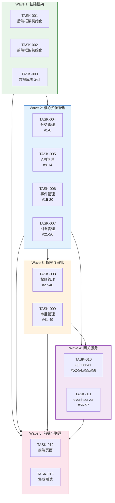
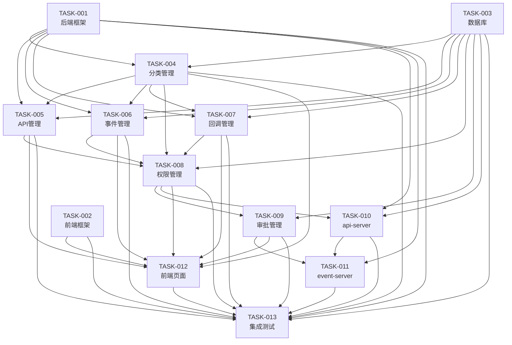

# 任务分解：能力开放平台（Capability Open Platform）

**Feature ID**: CAP-OPEN-001  
**任务版本**: v1.2  
**创建日期**: 2026-04-20  
**更新日期**: 2026-04-21  
**任务作者**: SDDU Tasks Agent  
**技术规划**: plan.md v1.26  
**接口设计**: plan-api.md v1.27

---

## 任务汇总

| 维度 | 统计 |
|------|------|
| **总任务数** | 13 个 |
| **接口覆盖** | 58 个接口（100%覆盖） |
| **复杂度分布** | S 级 3 个，M 级 7 个，L 级 3 个 |
| **执行波次** | 5 个波次 |
| **预估工期** | 103 人天（约 5 人月） |

---

## 执行波次概览



---

## TASK-001: 后端框架初始化

**复杂度**: L  
**前置依赖**: 无  
**执行波次**: 1  
**接口覆盖**: 无（基础框架）

### 描述

初始化三个后端 Spring Boot 工程：open-server、api-server、event-server，搭建项目基础框架，包括公共配置、异常处理、拦截器、Mock 策略等基础设施。

### 涉及文件

- [NEW] `open-server/pom.xml` - Maven 项目配置
- [NEW] `open-server/.gitignore` - Git 忽略配置（忽略 target、logs 等）
- [NEW] `open-server/src/main/java/.../OpenServerApplication.java` - 应用入口
- [NEW] `open-server/src/main/java/.../common/config/*.java` - 公共配置类
- [NEW] `open-server/src/main/java/.../common/exception/*.java` - 异常处理
- [NEW] `open-server/src/main/java/.../common/interceptor/*.java` - Mock 拦截器
- [NEW] `open-server/src/main/resources/application.yml` - 应用配置
- [NEW] `api-server/pom.xml` - Maven 项目配置
- [NEW] `api-server/.gitignore` - Git 忽略配置（忽略 target、logs 等）
- [NEW] `api-server/src/main/java/.../ApiServerApplication.java` - 应用入口
- [NEW] `api-server/src/main/java/.../common/config/*.java` - 公共配置类
- [NEW] `api-server/src/main/resources/application.yml` - 应用配置
- [NEW] `event-server/pom.xml` - Maven 项目配置
- [NEW] `event-server/.gitignore` - Git 忽略配置（忽略 target、logs 等）
- [NEW] `event-server/src/main/java/.../EventServerApplication.java` - 应用入口
- [NEW] `event-server/src/main/java/.../common/config/*.java` - 公共配置类
- [NEW] `event-server/src/main/resources/application.yml` - 应用配置
- [MODIFY] `pom.xml` - 添加 Maven 多模块配置

### 验收标准

- [ ] open-server 工程可独立启动，访问 `http://localhost:8080/actuator/health` 返回健康状态
- [ ] api-server 工程可独立启动，访问 `http://localhost:8081/actuator/health` 返回健康状态
- [ ] event-server 工程可独立启动，访问 `http://localhost:8082/actuator/health` 返回健康状态
- [ ] Mock 策略可通过配置开关（`mock.enabled=true/false`）一键切换
- [ ] 统一异常处理生效，返回标准错误格式 `{code, message, data}`
- [ ] 雪花 ID 生成器可用

### 验证命令

```bash
# 启动 open-server
cd open-server && mvn spring-boot:run
curl http://localhost:8080/actuator/health

# 启动 api-server
cd api-server && mvn spring-boot:run
curl http://localhost:8081/actuator/health

# 启动 event-server
cd event-server && mvn spring-boot:run
curl http://localhost:8082/actuator/health
```

---

## TASK-002: 前端框架初始化

**复杂度**: M  
**前置依赖**: 无  
**执行波次**: 1  
**接口覆盖**: 无（基础框架）

### 描述

初始化 React + Vite + Ant Design 前端工程 open-web，搭建项目基础框架，包括路由配置、状态管理、API 服务封装、公共组件等基础设施。

### 涉及文件

- [NEW] `open-web/package.json` - npm 项目配置
- [NEW] `open-web/.gitignore` - Git 忽略配置（忽略 node_modules、dist、.env 等）
- [NEW] `open-web/vite.config.ts` - Vite 构建配置
- [NEW] `open-web/src/main.tsx` - 应用入口
- [NEW] `open-web/src/App.tsx` - 应用根组件
- [NEW] `open-web/src/router/index.tsx` - 路由配置
- [NEW] `open-web/src/utils/request.ts` - API 请求封装
- [NEW] `open-web/src/components/Layout/index.tsx` - 布局组件
- [NEW] `open-web/src/components/Layout/index.m.less` - 布局样式
- [NEW] `open-web/src/stores/global.store.ts` - 全局状态管理

### 验收标准

- [ ] 前端工程可独立启动，访问 `http://localhost:3000` 显示欢迎页面
- [ ] Vite 构建成功，无 TypeScript 编译错误
- [ ] 路由配置生效，可访问 `/` 和 `/404` 页面
- [ ] API 请求封装支持统一错误处理和 Token 携带
- [ ] 布局组件包含侧边栏、顶部导航、内容区

### 验证命令

```bash
cd open-web
npm install
npm run dev
curl http://localhost:3000
```

---

## TASK-003: 数据库表设计与初始化

**复杂度**: S  
**前置依赖**: 无  
**执行波次**: 1  
**接口覆盖**: 无（数据库设计）

### 描述

根据 plan.md §4 数据库设计创建数据库表结构，包括 15 张表（10 张主表 + 4 张属性表 + 1 张关联表），编写 SQL 初始化脚本。

### 涉及文件

- [NEW] `docs/sql/init-schema.sql` - 数据库初始化脚本
- [NEW] `docs/sql/drop-schema.sql` - 数据库清理脚本（开发调试用）
- [NEW] `docs/sql/insert-default-data.sql` - 默认数据初始化（默认审批流等）

### 验收标准

- [ ] 执行 `init-schema.sql` 后，数据库包含 15 张表
- [ ] 所有表包含必备审计字段（create_time、last_update_time、create_by、last_update_by）
- [ ] 属性表主表关联正确，索引创建成功
- [ ] 默认审批流数据初始化成功（code='default'）

### 验证命令

```bash
mysql -u root -p openplatform < docs/sql/init-schema.sql
mysql -u root -p openplatform -e "SHOW TABLES LIKE 'openplatform_v2_%'"
# 期望输出 15 张表
```

---

## TASK-004: 分类管理模块

**复杂度**: M  
**前置依赖**: TASK-001, TASK-003  
**执行波次**: 2  
**接口覆盖**: 8 个接口（#1-8）

### 描述

实现分类管理功能，包括分类树形结构 CRUD、责任人配置等，覆盖 FR-001、FR-002。

> **设计要点**：分类接口同时作为权限树的"查树"接口，支持懒加载模式。

### 涉及文件

- [NEW] `open-server/src/main/java/.../modules/category/CategoryController.java`
- [NEW] `open-server/src/main/java/.../modules/category/CategoryService.java`
- [NEW] `open-server/src/main/java/.../modules/category/entity/Category.java`
- [NEW] `open-server/src/main/java/.../modules/category/entity/CategoryOwner.java`
- [NEW] `open-server/src/main/java/.../modules/category/mapper/CategoryMapper.java`
- [NEW] `open-server/src/main/java/.../modules/category/mapper/CategoryOwnerMapper.java`
- [NEW] `open-server/src/main/java/.../modules/category/dto/*.java` - DTO 类
- [NEW] `open-server/src/main/resources/mapper/CategoryMapper.xml`
- [NEW] `open-server/src/main/resources/mapper/CategoryOwnerMapper.xml`

### 验收标准

- [ ] **#1** GET `/api/v1/categories` 返回树形分类列表，支持 `category_alias` 过滤（权限树查树）
- [ ] **#2** GET `/api/v1/categories/:id` 返回分类详情
- [ ] **#3** POST `/api/v1/categories` 创建分类成功，`path` 字段自动生成
- [ ] **#4** PUT `/api/v1/categories/:id` 更新分类成功
- [ ] **#5** DELETE `/api/v1/categories/:id` 删除分类，检查关联资源
- [ ] **#6** POST `/api/v1/categories/:id/owners` 添加责任人成功
- [ ] **#7** GET `/api/v1/categories/:id/owners` 返回责任人列表
- [ ] **#8** DELETE `/api/v1/categories/:id/owners/:userId` 移除责任人成功
- [ ] 树形子分类查询优化生效（通过 `path` 字段）

### 验证命令

```bash
# 创建根分类
curl -X POST http://localhost:8080/api/v1/categories \
  -H "Content-Type: application/json" \
  -d '{"category_alias":"app_type_a","name_cn":"A类应用权限","name_en":"App Type A Permissions"}'

# 获取分类树（权限树查树）
curl http://localhost:8080/api/v1/categories?category_alias=app_type_a

# 添加责任人
curl -X POST http://localhost:8080/api/v1/categories/1/owners \
  -H "Content-Type: application/json" \
  -d '{"user_id":"user001"}'
```

---

## TASK-005: API 管理模块

**复杂度**: M  
**前置依赖**: TASK-001, TASK-003, TASK-004  
**执行波次**: 2  
**接口覆盖**: 6 个接口（#9-14）

### 描述

实现 API 资源管理功能，包括 API 注册、编辑、删除、撤回等，覆盖 FR-004~FR-007。API 注册时附带权限定义。

### 涉及文件

- [NEW] `open-server/src/main/java/.../modules/api/ApiController.java`
- [NEW] `open-server/src/main/java/.../modules/api/ApiService.java`
- [NEW] `open-server/src/main/java/.../modules/api/entity/Api.java`
- [NEW] `open-server/src/main/java/.../modules/api/entity/ApiProperty.java`
- [NEW] `open-server/src/main/java/.../modules/api/mapper/ApiMapper.java`
- [NEW] `open-server/src/main/java/.../modules/api/mapper/ApiPropertyMapper.java`
- [NEW] `open-server/src/main/java/.../modules/api/dto/*.java` - DTO 类
- [NEW] `open-server/src/main/resources/mapper/ApiMapper.xml`
- [NEW] `open-server/src/main/resources/mapper/ApiPropertyMapper.xml`

### 验收标准

- [ ] **#9** GET `/api/v1/apis` 返回 API 列表，支持按分类过滤
- [ ] **#10** GET `/api/v1/apis/:id` 返回 API 详情及权限信息、属性
- [ ] **#11** POST `/api/v1/apis` 注册 API 成功，同时创建权限资源
- [ ] **#12** PUT `/api/v1/apis/:id` 更新 API 成功，核心属性变更触发审批
- [ ] **#13** DELETE `/api/v1/apis/:id` 删除 API，检查订阅关系
- [ ] **#14** POST `/api/v1/apis/:id/withdraw` 撤回审核中的 API
- [ ] API 属性表 KV 模式正确存储扩展属性
- [ ] Scope 命名格式正确：`api:{module}:{identifier}`

### 验证命令

```bash
# 注册 API
curl -X POST http://localhost:8080/api/v1/apis \
  -H "Content-Type: application/json" \
  -d '{"name_cn":"发送消息","name_en":"Send Message","path":"/api/v1/messages","method":"POST","category_id":2,"permission":{"name_cn":"发送消息权限","name_en":"Send Message Permission","scope":"api:im:send-message"}}'

# 获取 API 详情
curl http://localhost:8080/api/v1/apis/100
```

---

## TASK-006: 事件管理模块

**复杂度**: M  
**前置依赖**: TASK-001, TASK-003, TASK-004  
**执行波次**: 2  
**接口覆盖**: 6 个接口（#15-20）

### 描述

实现事件资源管理功能，包括事件注册、编辑、删除、撤回等，覆盖 FR-008~FR-011。事件注册时附带权限定义。

### 涉及文件

- [NEW] `open-server/src/main/java/.../modules/event/EventController.java`
- [NEW] `open-server/src/main/java/.../modules/event/EventService.java`
- [NEW] `open-server/src/main/java/.../modules/event/entity/Event.java`
- [NEW] `open-server/src/main/java/.../modules/event/entity/EventProperty.java`
- [NEW] `open-server/src/main/java/.../modules/event/mapper/EventMapper.java`
- [NEW] `open-server/src/main/java/.../modules/event/mapper/EventPropertyMapper.java`
- [NEW] `open-server/src/main/java/.../modules/event/dto/*.java` - DTO 类
- [NEW] `open-server/src/main/resources/mapper/EventMapper.xml`
- [NEW] `open-server/src/main/resources/mapper/EventPropertyMapper.xml`

### 验收标准

- [ ] **#15** GET `/api/v1/events` 返回事件列表，支持按分类过滤
- [ ] **#16** GET `/api/v1/events/:id` 返回事件详情及权限信息、属性
- [ ] **#17** POST `/api/v1/events` 注册事件成功，同时创建权限资源，Topic 唯一性校验
- [ ] **#18** PUT `/api/v1/events/:id` 更新事件成功
- [ ] **#19** DELETE `/api/v1/events/:id` 删除事件，检查订阅关系
- [ ] **#20** POST `/api/v1/events/:id/withdraw` 撤回审核中的事件
- [ ] Scope 命名格式正确：`event:{module}:{identifier}`

### 验证命令

```bash
# 注册事件
curl -X POST http://localhost:8080/api/v1/events \
  -H "Content-Type: application/json" \
  -d '{"name_cn":"消息接收事件","name_en":"Message Received Event","topic":"im.message.received","category_id":2,"permission":{"name_cn":"消息接收权限","name_en":"Message Received Permission","scope":"event:im:message-received"}}'

# 获取事件列表
curl http://localhost:8080/api/v1/events
```

---

## TASK-007: 回调管理模块

**复杂度**: M  
**前置依赖**: TASK-001, TASK-003, TASK-004  
**执行波次**: 2  
**接口覆盖**: 6 个接口（#21-26）

### 描述

实现回调资源管理功能，包括回调注册、编辑、删除、撤回等，覆盖 FR-012~FR-015。回调注册时附带权限定义。

### 涉及文件

- [NEW] `open-server/src/main/java/.../modules/callback/CallbackController.java`
- [NEW] `open-server/src/main/java/.../modules/callback/CallbackService.java`
- [NEW] `open-server/src/main/java/.../modules/callback/entity/Callback.java`
- [NEW] `open-server/src/main/java/.../modules/callback/entity/CallbackProperty.java`
- [NEW] `open-server/src/main/java/.../modules/callback/mapper/CallbackMapper.java`
- [NEW] `open-server/src/main/java/.../modules/callback/mapper/CallbackPropertyMapper.java`
- [NEW] `open-server/src/main/java/.../modules/callback/dto/*.java` - DTO 类
- [NEW] `open-server/src/main/resources/mapper/CallbackMapper.xml`
- [NEW] `open-server/src/main/resources/mapper/CallbackPropertyMapper.xml`

### 验收标准

- [ ] **#21** GET `/api/v1/callbacks` 返回回调列表，支持按分类过滤
- [ ] **#22** GET `/api/v1/callbacks/:id` 返回回调详情及权限信息、属性
- [ ] **#23** POST `/api/v1/callbacks` 注册回调成功，同时创建权限资源
- [ ] **#24** PUT `/api/v1/callbacks/:id` 更新回调成功
- [ ] **#25** DELETE `/api/v1/callbacks/:id` 删除回调，检查订阅关系
- [ ] **#26** POST `/api/v1/callbacks/:id/withdraw` 撤回审核中的回调
- [ ] Scope 命名格式正确：`callback:{module}:{identifier}`

### 验证命令

```bash
# 注册回调
curl -X POST http://localhost:8080/api/v1/callbacks \
  -H "Content-Type: application/json" \
  -d '{"name_cn":"审批完成回调","name_en":"Approval Completed Callback","category_id":2,"permission":{"name_cn":"审批完成权限","name_en":"Approval Completed Permission","scope":"callback:approval:completed"}}'

# 获取回调列表
curl http://localhost:8080/api/v1/callbacks
```

---

## TASK-008: 权限管理模块

**复杂度**: L  
**前置依赖**: TASK-001, TASK-003, TASK-004, TASK-005, TASK-006, TASK-007  
**执行波次**: 3  
**接口覆盖**: 14 个接口（#27-40）

### 描述

实现权限申请与订阅管理功能，覆盖 FR-016~FR-024。

> **权限树设计说明**：采用懒加载模式
> - **查树**：使用分类接口 `GET /api/v1/categories`（TASK-004 #1）
> - **查权限**：点击分类节点后调用 `GET /api/v1/categories/:id/apis|events|callbacks` 获取权限列表

### 涉及文件

- [NEW] `open-server/src/main/java/.../modules/permission/PermissionController.java`
- [NEW] `open-server/src/main/java/.../modules/permission/PermissionService.java`
- [NEW] `open-server/src/main/java/.../modules/permission/entity/Permission.java`
- [NEW] `open-server/src/main/java/.../modules/permission/entity/PermissionProperty.java`
- [NEW] `open-server/src/main/java/.../modules/permission/entity/Subscription.java`
- [NEW] `open-server/src/main/java/.../modules/permission/mapper/PermissionMapper.java`
- [NEW] `open-server/src/main/java/.../modules/permission/mapper/PermissionPropertyMapper.java`
- [NEW] `open-server/src/main/java/.../modules/permission/mapper/SubscriptionMapper.java`
- [NEW] `open-server/src/main/java/.../modules/permission/dto/*.java` - DTO 类
- [NEW] `open-server/src/main/resources/mapper/PermissionMapper.xml`
- [NEW] `open-server/src/main/resources/mapper/PermissionPropertyMapper.xml`
- [NEW] `open-server/src/main/resources/mapper/SubscriptionMapper.xml`

### 验收标准

**API 权限管理（#27-30）**：
- [ ] **#27** GET `/api/v1/apps/:appId/apis` 返回应用 API 权限列表
- [ ] **#28** GET `/api/v1/categories/:id/apis` 返回分类下 API 权限列表（权限树懒加载）
- [ ] **#29** POST `/api/v1/apps/:appId/apis/subscribe` 申请 API 权限，**支持批量提交**，生成独立审批单
- [ ] **#30** POST `/api/v1/apps/:appId/apis/:id/withdraw` 撤回审核中的申请

**事件权限管理（#31-35）**：
- [ ] **#31** GET `/api/v1/apps/:appId/events` 返回应用事件订阅列表
- [ ] **#32** GET `/api/v1/categories/:id/events` 返回分类下事件权限列表（权限树懒加载）
- [ ] **#33** POST `/api/v1/apps/:appId/events/subscribe` 申请事件权限，**支持批量提交**
- [ ] **#34** PUT `/api/v1/apps/:appId/events/:id/config` 配置事件消费参数（通道/地址/认证）
- [ ] **#35** POST `/api/v1/apps/:appId/events/:id/withdraw` 撤回审核中的申请

**回调权限管理（#36-40）**：
- [ ] **#36** GET `/api/v1/apps/:appId/callbacks` 返回应用回调订阅列表
- [ ] **#37** GET `/api/v1/categories/:id/callbacks` 返回分类下回调权限列表（权限树懒加载）
- [ ] **#38** POST `/api/v1/apps/:appId/callbacks/subscribe` 申请回调权限，**支持批量提交**
- [ ] **#39** PUT `/api/v1/apps/:appId/callbacks/:id/config` 配置回调消费参数
- [ ] **#40** POST `/api/v1/apps/:appId/callbacks/:id/withdraw` 撤回审核中的申请

**批量操作验收**：
- [ ] 批量提交返回成功数量和失败项，支持失败重试
- [ ] 每条权限申请生成独立审批单，状态独立管理

### 验证命令

```bash
# 获取分类下 API 权限列表（权限树懒加载）
curl http://localhost:8080/api/v1/categories/2/apis

# 申请 API 权限
curl -X POST http://localhost:8080/api/v1/apps/100/apis/subscribe \
  -H "Content-Type: application/json" \
  -d '{"permission_id":200}'

# 配置事件消费参数
curl -X PUT http://localhost:8080/api/v1/apps/100/events/300/config \
  -H "Content-Type: application/json" \
  -d '{"channel_type":1,"channel_address":"https://webhook.example.com/events","auth_type":0}'
```

---

## TASK-009: 审批管理模块

**复杂度**: L  
**前置依赖**: TASK-001, TASK-003, TASK-008  
**执行波次**: 3  
**接口覆盖**: 11 个接口（#41-51）

### 描述

实现审批管理功能，包括审批流程配置、审批执行、待办查询等，覆盖 FR-025~FR-027。支持动态审批流配置。

### 涉及文件

- [NEW] `open-server/src/main/java/.../modules/approval/ApprovalController.java`
- [NEW] `open-server/src/main/java/.../modules/approval/ApprovalService.java`
- [NEW] `open-server/src/main/java/.../modules/approval/entity/ApprovalFlow.java`
- [NEW] `open-server/src/main/java/.../modules/approval/entity/ApprovalRecord.java`
- [NEW] `open-server/src/main/java/.../modules/approval/entity/ApprovalLog.java`
- [NEW] `open-server/src/main/java/.../modules/approval/mapper/ApprovalFlowMapper.java`
- [NEW] `open-server/src/main/java/.../modules/approval/mapper/ApprovalRecordMapper.java`
- [NEW] `open-server/src/main/java/.../modules/approval/mapper/ApprovalLogMapper.java`
- [NEW] `open-server/src/main/java/.../modules/approval/dto/*.java` - DTO 类
- [NEW] `open-server/src/main/java/.../modules/approval/engine/ApprovalEngine.java` - 审批引擎
- [NEW] `open-server/src/main/resources/mapper/ApprovalFlowMapper.xml`
- [NEW] `open-server/src/main/resources/mapper/ApprovalRecordMapper.xml`
- [NEW] `open-server/src/main/resources/mapper/ApprovalLogMapper.xml`

### 验收标准

**审批流程配置（#41-44）**：
- [ ] **#41** GET `/api/v1/approval-flows` 返回审批流程模板列表
- [ ] **#42** GET `/api/v1/approval-flows/:id` 返回审批流程模板详情（含节点配置）
- [ ] **#43** POST `/api/v1/approval-flows` 创建审批流程模板
- [ ] **#44** PUT `/api/v1/approval-flows/:id` 更新审批流程模板

**审批执行（#45-51）**：
- [ ] **#45** GET `/api/v1/approvals/pending` 返回待审批列表
- [ ] **#46** GET `/api/v1/approvals/:id` 返回审批详情（含节点状态、操作日志）
- [ ] **#47** POST `/api/v1/approvals/:id/approve` 同意审批，更新订阅状态
- [ ] **#48** POST `/api/v1/approvals/:id/reject` 驳回审批，需填写原因
- [ ] **#49** POST `/api/v1/approvals/:id/cancel` 撤销审批
- [ ] **#50** POST `/api/v1/approvals/batch-approve` 批量同意审批，支持一次处理多条
- [ ] **#51** POST `/api/v1/approvals/batch-reject` 批量驳回审批，需填写统一原因

**审批引擎**：
- [ ] 审批通过后自动激活订阅关系（status=1）
- [ ] 审批拒绝后订阅状态变为已拒绝（status=2）
- [ ] 审批记录和操作日志正确写入

**批量审批验收**：
- [ ] 批量同意接口返回成功数量，支持部分失败场景
- [ ] 批量驳回需填写统一原因，支持部分失败场景

### 验证命令

```bash
# 创建审批流程
curl -X POST http://localhost:8080/api/v1/approval-flows \
  -H "Content-Type: application/json" \
  -d '{"name_cn":"API注册审批流","name_en":"API Registration Approval Flow","code":"api_register","nodes":[{"type":"approver","user_id":"user001","order":1}]}'

# 获取待审批列表
curl http://localhost:8080/api/v1/approvals/pending

# 同意审批
curl -X POST http://localhost:8080/api/v1/approvals/1/approve \
  -H "Content-Type: application/json" \
  -d '{"comment":"同意该申请"}'
```

---

## TASK-010: api-server 消费网关模块

**复杂度**: M  
**前置依赖**: TASK-001, TASK-003, TASK-008  
**执行波次**: 4  
**接口覆盖**: 5 个接口（#52-55, #58）

### 描述

实现 api-server 消费网关功能，包括 API 认证鉴权、Scope 用户授权、数据查询接口等，覆盖 FR-028、FR-031。

> **服务定位**：由外向内（消费方 → 提供方），api-server 负责 API 认证鉴权和 Scope 授权管理。

### 涉及文件

- [NEW] `api-server/src/main/java/.../gateway/ApiGatewayController.java` - API 网关
- [NEW] `api-server/src/main/java/.../gateway/ApiGatewayService.java`
- [NEW] `api-server/src/main/java/.../scope/ScopeController.java` - Scope 授权
- [NEW] `api-server/src/main/java/.../scope/ScopeService.java`
- [NEW] `api-server/src/main/java/.../data/DataQueryController.java` - 数据查询接口
- [NEW] `api-server/src/main/java/.../data/DataQueryService.java`
- [NEW] `api-server/src/main/java/.../common/filter/AuthFilter.java`
- [NEW] `api-server/src/main/java/.../common/util/SignatureUtil.java`

### 验收标准

**Scope 用户授权（#52-54）**：
- [ ] **#52** GET `/api/v1/user-authorizations` 返回用户授权列表
- [ ] **#53** POST `/api/v1/user-authorizations` 用户授权成功（支持有效期设置）
- [ ] **#54** DELETE `/api/v1/user-authorizations/:id` 取消授权

**API 网关（#55）**：
- [ ] **#55** ANY `/gateway/api/*` API 请求代理与鉴权生效
- [ ] 验证应用身份（AKSK/Bearer Token）
- [ ] 查询应用订阅关系，验证请求路径在授权范围内
- [ ] 转发请求到内部中台网关

**数据查询接口（#58）**：
- [ ] **#58** GET `/gateway/permissions/check` 权限校验接口可用（供 event-server 调用）

### 验证命令

```bash
# API 鉴权测试
curl -X POST http://localhost:8081/gateway/api/v1/messages \
  -H "X-App-Id: 100" \
  -H "X-Auth-Type: 0" \
  -H "Authorization: Bearer token" \
  -H "Content-Type: application/json" \
  -d '{"content":"Hello World"}'

# 权限校验
curl http://localhost:8081/gateway/permissions/check?app_id=100&scope=api:im:send-message

# 用户授权
curl -X POST http://localhost:8081/api/v1/user-authorizations \
  -H "Content-Type: application/json" \
  -d '{"user_id":"user001","app_id":100,"scopes":["api:im:send-message"],"expires_at":"2026-12-31T23:59:59"}'
```

---

## TASK-011: event-server 事件/回调网关模块

**复杂度**: M  
**前置依赖**: TASK-001, TASK-010  
**执行波次**: 4  
**接口覆盖**: 2 个接口（#56-57）

### 描述

实现 event-server 事件/回调网关功能，覆盖 FR-029、FR-030。

> **服务定位**：由内向外（提供方 → 消费方），event-server 负责事件和回调的分发。
> - **事件流程**：提供方 → 内部消息网关 → event-server → 消费方
> - **回调流程**：提供方 → event-server → 消费方（不经内部消息网关）

### 涉及文件

- [NEW] `event-server/src/main/java/.../gateway/EventGatewayController.java`
- [NEW] `event-server/src/main/java/.../gateway/EventGatewayService.java`
- [NEW] `event-server/src/main/java/.../gateway/CallbackGatewayController.java`
- [NEW] `event-server/src/main/java/.../gateway/CallbackGatewayService.java`
- [NEW] `event-server/src/main/java/.../client/ApiServerClient.java` - api-server 调用客户端
- [NEW] `event-server/src/main/java/.../common/config/RedisConfig.java` - Redis 配置
- [NEW] `event-server/src/main/java/.../common/channel/WebHookChannel.java` - WebHook 通道实现

### 验收标准

**事件消费网关（#56）**：
- [ ] **#56** POST `/gateway/events/publish` 事件发布接口可用
- [ ] 验证 Topic 对应的事件资源存在
- [ ] 查询订阅该事件的应用列表（通过 api-server #58 接口）
- [ ] 按订阅配置分发事件（WebHook/内部消息队列）
- [ ] P99 分发延迟 < 1s

**回调消费网关（#57）**：
- [ ] **#57** POST `/gateway/callbacks/invoke` 回调触发接口可用
- [ ] 验证回调 Scope 存在
- [ ] 查询订阅该回调的应用列表
- [ ] 按订阅配置调用三方回调地址

**数据依赖**：
- [ ] event-server 无数据库，通过 api-server 接口获取数据
- [ ] Redis 缓存订阅关系数据

### 验证命令

```bash
# 事件发布
curl -X POST http://localhost:8082/gateway/events/publish \
  -H "Content-Type: application/json" \
  -d '{"topic":"im.message.received","payload":{"message_id":"msg001","content":"Hello World"}}'

# 回调触发
curl -X POST http://localhost:8082/gateway/callbacks/invoke \
  -H "Content-Type: application/json" \
  -d '{"callback_scope":"callback:approval:completed","payload":{"approval_id":"app001","status":"approved"}}'
```

---

## TASK-012: 前端页面开发

**复杂度**: L  
**前置依赖**: TASK-002, TASK-004, TASK-005, TASK-006, TASK-007, TASK-008, TASK-009  
**执行波次**: 5  
**接口覆盖**: 无（前端页面）

### 描述

开发 open-web 前端页面，包括分类管理、API/事件/回调管理、权限申请、审批中心等页面。

> **设计流程**：面向三方应用人员的界面按 `/front/README.md` 流程执行，其他管理页面在此设计。

### 涉及文件

- [NEW] `open-web/src/pages/category/CategoryList.tsx` - 分类管理页面
- [NEW] `open-web/src/pages/category/CategoryForm.tsx` - 分类表单组件
- [NEW] `open-web/src/pages/api/ApiList.tsx` - API 管理页面
- [NEW] `open-web/src/pages/api/ApiForm.tsx` - API 注册/编辑表单
- [NEW] `open-web/src/pages/api/ApiDetail.tsx` - API 详情页面
- [NEW] `open-web/src/pages/event/EventList.tsx` - 事件管理页面
- [NEW] `open-web/src/pages/event/EventForm.tsx` - 事件注册/编辑表单
- [NEW] `open-web/src/pages/callback/CallbackList.tsx` - 回调管理页面
- [NEW] `open-web/src/pages/callback/CallbackForm.tsx` - 回调注册/编辑表单
- [NEW] `open-web/src/pages/permission/ApiPermissionDrawer.tsx` - API 权限抽屉（懒加载）
- [NEW] `open-web/src/pages/permission/EventPermissionDrawer.tsx` - 事件权限抽屉
- [NEW] `open-web/src/pages/permission/CallbackPermissionDrawer.tsx` - 回调权限抽屉
- [NEW] `open-web/src/pages/approval/ApprovalCenter.tsx` - 审批中心页面
- [NEW] `open-web/src/pages/approval/ApprovalDetail.tsx` - 审批详情页面
- [NEW] `open-web/src/services/*.ts` - API 服务封装
- [NEW] `open-web/src/hooks/*.ts` - 自定义 Hooks
- [MODIFY] `open-web/src/router/index.tsx` - 路由配置更新

### 验收标准

**运营方页面**：
- [ ] 分类管理页面可创建/编辑/删除分类树，配置责任人
- [ ] 审批中心页面可查看待审批列表，执行同意/驳回/撤销

**提供方页面**：
- [ ] API 管理页面可查看本分类 API 列表，进行注册/编辑/删除
- [ ] 事件管理页面可查看本分类事件列表，进行注册/编辑/删除
- [ ] 回调管理页面可查看本分类回调列表，进行注册/编辑/删除

**消费方页面**：
- [ ] API 权限申请页面采用懒加载模式（点击分类节点加载权限列表）
- [ ] 事件权限申请页面可提交申请，配置消费参数
- [ ] 回调权限申请页面可提交申请，配置消费参数

**交互规范**：
- [ ] 权限申请提交后关闭抽屉，展示 Toast 提示
- [ ] 列表支持搜索（名称、Scope）
- [ ] 表单校验正确（必填项、Scope 格式等）

### 验证命令

```bash
cd open-web
npm run dev
# 手动验证页面功能
```

---

## TASK-013: 集成测试与系统联调

**复杂度**: M  
**前置依赖**: TASK-001~TASK-012  
**执行波次**: 5  
**接口覆盖**: 无（测试与联调）

### 描述

完成系统集成测试与联调，包括前后端联调、网关联调、Mock 策略切换、性能测试等，确保系统整体可用。

### 涉及文件

- [NEW] `open-server/src/test/java/.../*Test.java` - 后端单元测试
- [NEW] `open-server/src/test/java/.../*IntegrationTest.java` - 后端集成测试
- [NEW] `api-server/src/test/java/.../*Test.java` - api-server 测试
- [NEW] `event-server/src/test/java/.../*Test.java` - event-server 测试
- [NEW] `docs/test-plan.md` - 测试计划文档
- [NEW] `docs/deployment-guide.md` - 部署指南

### 验收标准

- [ ] 后端单元测试覆盖率 > 60%
- [ ] 集成测试通过，覆盖核心业务流程
- [ ] 前后端联调通过，所有页面功能可用
- [ ] Mock 策略切换测试通过（`mock.enabled=false`）
- [ ] api-server 与 event-server 联调通过
- [ ] 性能测试通过（权限查询 P99 < 50ms，事件分发 P99 < 1s）
- [ ] 安全测试通过（HTTPS、认证鉴权）
- [ ] 部署指南完整，生产环境部署成功

### 验证命令

```bash
# 后端测试
cd open-server && mvn test
cd api-server && mvn test
cd event-server && mvn test

# 集成测试
mvn verify

# 性能测试（示例）
curl -w "@curl-format.txt" http://localhost:8080/api/v1/apis?category_id=2
```

---

## 附录

### A. 接口分布汇总

| 任务 | 服务 | 接口编号 | 接口数量 |
|------|------|----------|----------|
| TASK-004 | open-server | #1-8 | 8 |
| TASK-005 | open-server | #9-14 | 6 |
| TASK-006 | open-server | #15-20 | 6 |
| TASK-007 | open-server | #21-26 | 6 |
| TASK-008 | open-server | #27-40 | 14 |
| TASK-009 | open-server | #41-51 | 11 |
| TASK-010 | api-server | #52-55, #58 | 5 |
| TASK-011 | event-server | #56-57 | 2 |
| **总计** | - | **#1-58** | **58** |

### B. 任务依赖关系图



### C. 权限树懒加载模式说明

**接口设计**：
- **查树**：`GET /api/v1/categories`（复用分类接口 #1）
- **查权限**：
  - `GET /api/v1/categories/:id/apis`（#28）- 获取分类下 API 权限列表
  - `GET /api/v1/categories/:id/events`（#32）- 获取分类下事件权限列表
  - `GET /api/v1/categories/:id/callbacks`（#37）- 获取分类下回调权限列表

**前端交互**：
1. 用户点击权限申请入口
2. 加载分类树（`GET /api/v1/categories?category_alias=xxx`）
3. 用户点击某个分类节点
4. 懒加载该分类下的权限列表（`GET /api/v1/categories/:id/apis`）
5. 用户勾选权限，提交申请

### D. 复杂度说明

| 等级 | 定义 | 本文档任务 |
|------|------|----------|
| **S** | 单一文件，<50 行代码，无外部依赖 | TASK-003（SQL 脚本） |
| **M** | 多文件，<200 行代码，有简单依赖 | TASK-002, TASK-004~007, TASK-010~011, TASK-013 |
| **L** | 复杂变更，>200 行代码，多依赖 | TASK-001, TASK-008, TASK-009, TASK-012 |

---

**文档状态**: ✅ 任务分解完成（v1.2）  
**更新说明**: 
- 更新接口覆盖（58个接口），新增 #50-51 批量审批接口
- 更新数据库表前缀为 `openplatform_v2_`
- 新增 .gitignore 文件到各工程
- 补充批量操作验收标准

**下一步**: 运行 `@sddu-build TASK-001` 开始实现第一个任务