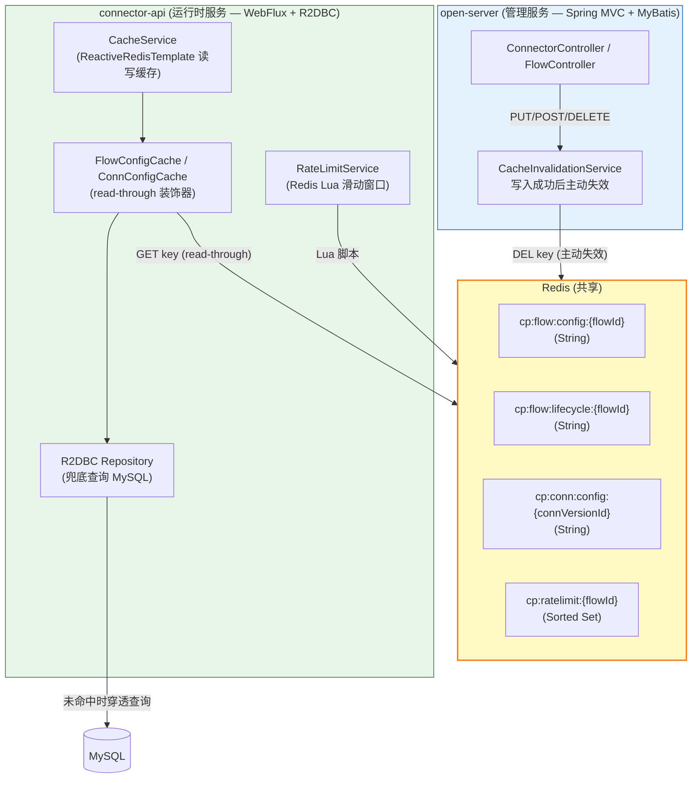
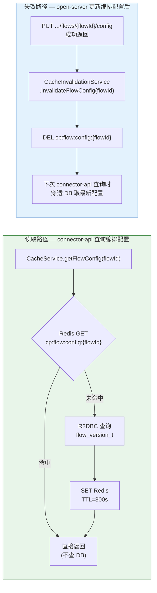
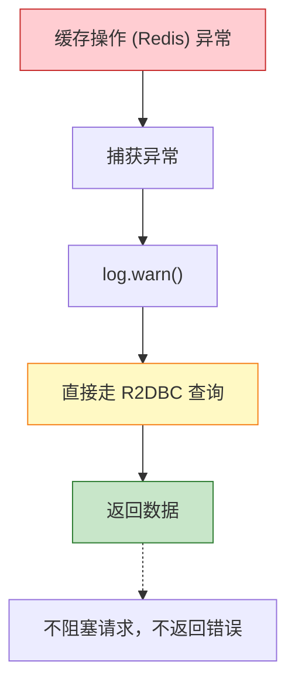
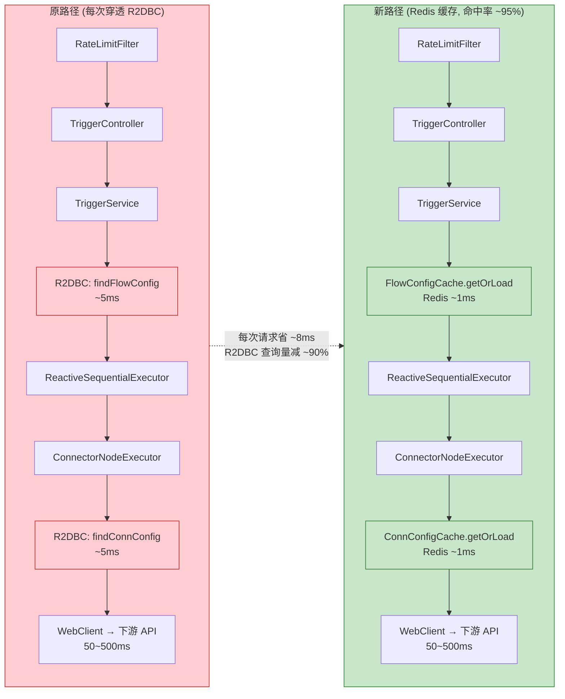
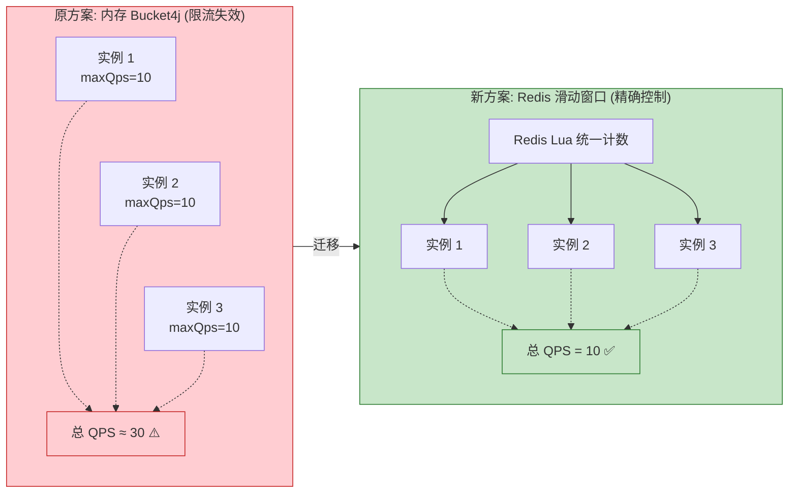

# 缓存与限流策略设计：连接器平台

**Feature ID**: CONN-PLAT-001  
**关联文档**: plan.md (§1.2 技术栈, §3 关键决策), plan-db.md (§3 表结构), plan-api.md  
**版本**: v1.0  
**创建日期**: 2026-05-27  
**最后更新**: 2026-05-27  
**对齐基线**: plan.md v2.8.1 + 代码现状分析（2026-05-27）

---

## 0. 动机与背景

### 0.1 当前痛点

根据 connector-api 代码现状分析（2026-05-27），存在以下高并发隐患：

| # | 痛点 | 影响 |
|---|------|------|
| 1 | **每次 HTTP 触发都查 R2DBC**：`TriggerService` → `FlowVersionReadRepository.findByFlowId()` 每次都穿透 MySQL，热点流高频触发时 DB 成为瓶颈 | QPS 受限于 R2DBC 连接池（当前 20）与 MySQL 吞吐 |
| 2 | **ConnectorNodeExecutor 每次执行都查 R2DBC**：获取 `connection_config` 也直接穿透 DB | 连接流节点越多，DB 压力线性增长 |
| 3 | **限流为内存级 Bucket4j**（`ConcurrentHashMap`），多实例部署时各实例独立计数 | 总 QPS ≈ 单实例 QPS × 实例数，限流失效 |
| 4 | **`ReactiveRedisTemplate` 已定义但全量生产代码未使用** | Redis 能力空置，白白消耗连接池资源 |
| 5 | **无编排配置热更新机制**：open-server 修改配置后 connector-api 不知情，依赖 TTL 自然过期 | 最坏情况下 TTL 窗口内使用旧配置 |

### 0.2 设计目标

| 目标 | 说明 | 度量 |
|------|------|:--:|
| **降低 R2DBC 读压力** | 热点 flow/connector 配置走 Redis 缓存，减少 MySQL 查询 | 缓存命中率 > 90% |
| **分布式限流** | 限流状态由 Redis 统一管理，多实例共享同一计数器 | 多实例总 QPS 可控 |
| **近实时配置生效** | open-server 写入后主动失效缓存，最坏 TTL 兜底 | 配置变更 < 5s 内生效 |
| **全链路 reactive** | 所有 Redis 操作使用 Reactive API，不引入阻塞 | 零 `.block()` 调用 |
| **最小侵入** | 不改动现有 R2DBC Repository 接口，以装饰器/Wrapper 模式叠加缓存层 | 现有代码改动 < 5 个文件 |

---

## 1. 缓存架构

### 1.1 整体架构



### 1.2 缓存模式：Read-Through + Write-Invalidate



### 1.3 为什么选 Read-Through + Write-Invalidate 而非 Write-Through？

| 方案 | 说明 | 是否采用 |
|------|------|:--:|
| **Cache-Aside** (读旁路) | 应用层自己管理缓存读写。connector-api 读时先查 Redis → 未命中查 DB → 回填 | ✅ **采用** (read-through) |
| **Write-Through** | open-server 写入 MySQL 的同时写入 Redis。需要 open-server 知道缓存 key 格式，耦合度高 | ❌ 不采用 |
| **Write-Invalidate** | open-server 写入 MySQL 后**仅删除**对应的 Redis key。耦合度最低（只需知道 key 名） | ✅ **采用** |
| **Write-Behind** | 先写 Redis，异步刷 MySQL。一致性风险高 | ❌ 不采用 |

**决策理由**：
- open-server 与 connector-api 是两个独立工程，不应让 open-server 依赖 connector-api 的序列化格式
- Invalidate 只需知道 key 名，是最低耦合的跨服务缓存一致性方案
- TTL 作为兜底：即使 open-server 失效消息丢失，最坏 5 分钟后自动一致

---

## 2. 缓存数据对象

### 2.1 缓存对象总览

| # | 缓存 Key 模式 | 数据类型 | 数据来源 | TTL | 命中场景 |
|---|-------------|:------:|------|:--:|---------|
| 1 | `cp:flow:config:{flowId}` | String (JSON) | `flow_version_t.orchestration_config` | 300s | HTTP 触发、测试运行加载编排配置 |
| 2 | `cp:flow:lifecycle:{flowId}` | String (number) | `flow_t.lifecycle_status` | 60s | HTTP 触发前置校验（是否 running） |
| 3 | `cp:conn:config:{connVersionId}` | String (JSON) | `connector_version_t.connection_config` | 600s | ConnectorNodeExecutor 获取下游 API 配置 |

> 💡 **设计决策**：`lifecycle_status` 单独缓存而非嵌入 `cp:flow:config`，理由：
> - 生命周期变更频率远高于编排配置变更（频繁 start/stop）
> - 单独缓存可设置更短 TTL（60s），避免 stop 操作后缓存窗口过长
> - 前置校验只需要 `lifecycle_status` 一个字段，无需加载整套 JSON

### 2.2 缓存 Value 结构

#### cp:flow:config:{flowId}

```
Value: JSON string = FlowVersionEntity.orchestration_config (TEXT 字段原值)
Size:  预估 1KB ~ 50KB (取决于节点/连线的数量)

示例:
{
  "nodes": [...],
  "edges": [...]
}
```

> 💡 **存储原始 JSON 字符串**：直接存储 `flow_version_t.orchestration_config` 的 TEXT 字段值，不做二次解析。减少序列化开销，与 DB 完全一致。

#### cp:flow:lifecycle:{flowId}

```
Value: "1" | "2" | "0"
对应 lifecycle_status 枚举: 1=running, 2=stopped, 0=undeployed
```

#### cp:conn:config:{connVersionId}

```
Value: JSON string = ConnectorVersionEntity.connection_config (TEXT 字段原值)
Size:  预估 500B ~ 5KB

示例:
{
  "protocol": "HTTP",
  "protocolConfig": {...},
  "authConfig": {...},
  "inputContract": {...},
  "outputContract": {...},
  "timeoutMs": 30000,
  "rateLimitConfig": {...}
}
```

---

## 3. 缓存 Key 设计

### 3.1 Key 命名规范

| 规则 | 说明 | 示例 |
|------|------|------|
| **前缀** | `cp:` (connector-platform 缩写) | `cp:flow:config:{flowId}` |
| **分隔符** | 冒号 `:` | 遵循 Redis 命名惯例 |
| **ID 格式** | BIGINT 雪花 ID 转为 String | `cp:flow:config:1234567890123456789` |
| **版本标记** | 不包含版本号（MVP 单版本模型，`flow_t` ↔ `flow_version_t` 为 1:1） | — |

### 3.2 Key 空间估算

假设：
- 连接器数量：100
- 连接流数量：500
- 对象大小见 §2.2

| Key 模式 | 数量 | 单条 Size | 总内存 |
|---------|:--:|:-------:|:-----:|
| `cp:flow:config:{flowId}` | 500 | 1~50 KB | ~5 MB |
| `cp:flow:lifecycle:{flowId}` | 500 | ~10 B | ~5 KB |
| `cp:conn:config:{connVersionId}` | 100 | 500~5KB | ~200 KB |
| **合计** | 1,100 | — | **≈ 5.2 MB** |

> 💡 内存占用极低（< 6 MB），远小于 Redis 典型实例内存（256MB~2GB），无需考虑淘汰策略。

---

## 4. TTL 策略

### 4.1 TTL 分配

| 缓存对象 | TTL | 理由 |
|---------|:--:|------|
| `cp:flow:config:{flowId}` | **300s (5min)** | 编排配置变更频率低（编辑即生效模型下，变更即主动失效），TTL 仅用于兜底 open-server 失效消息丢失场景 |
| `cp:flow:lifecycle:{flowId}` | **60s (1min)** | start/stop 操作频率相对高，需更快感知状态变化；TTL 短但配合主动失效，实际生效时间 < 1s |
| `cp:conn:config:{connVersionId}` | **600s (10min)** | 连接器配置变更频率最低，TTL 设长减少穿透；配合主动失效同样即时生效 |

### 4.2 TTL 与主动失效的关系

```mermaid
gantt
    title TTL 与主动失效时间线
    dateFormat mm:ss
    axisFormat %M:%S
    tickInterval 1minute

    section 正常路径
    配置写入 Redis (TTL=300s:00, 5min): done, 00:00, 5min
    open-server DEL key: milestone, 01:30, 0min
    下次查询穿透 DB 取最新: milestone, 01:31, 0min
    回填 Redis (重新 TTL=300s): 01:31, 5min

    section 最坏路径 (失效消息丢失)
    配置写入 Redis (TTL=300s): done, 00:00, 5min
    open-server DEL 失败: crit, milestone, 01:30, 0min
    旧配置持续生效 (不一致窗口): crit, 01:30, 3min
    TTL 到期自动穿透: milestone, 05:00, 0min
```

---

## 5. 缓存失效机制

### 5.1 open-server 侧失效触发点

open-server 在以下 API 成功写入后，**同步调用** Redis 删除对应 key：

| open-server API | 失效操作 | 影响缓存 Key |
|----------------|---------|-------------|
| `PUT .../flows/{flowId}/config` | `DEL cp:flow:config:{flowId}` | 编排配置 |
| `POST .../flows/{flowId}/start` | `DEL cp:flow:lifecycle:{flowId}` | 生命周期 |
| `POST .../flows/{flowId}/stop` | `DEL cp:flow:lifecycle:{flowId}` | 生命周期 |
| `DELETE .../flows/{flowId}` | `DEL cp:flow:config:{flowId}` + `DEL cp:flow:lifecycle:{flowId}` | 全部 flow 缓存 |
| `PUT .../connectors/{connectorId}/config` | `DEL cp:conn:config:{connVersionId}` | 连接器配置 |
| `DELETE .../connectors/{connectorId}` | `DEL cp:conn:config:{connVersionId}` | 连接器配置 |

> ⚠️ **同步调用但容错**：DEL 操作失败不应阻塞 API 响应。采用 `try-catch` + 日志告警，由 TTL 兜底。

### 5.2 Redis DEL 失败容错

```java
// open-server 侧伪代码
try {
    stringRedisTemplate.delete("cp:flow:config:" + flowId);
} catch (Exception e) {
    log.warn("缓存失效失败, TTL 将兜底: key=cp:flow:config:{}, error={}", flowId, e.getMessage());
    // 不抛出异常，不阻塞主流程
}
```

---

## 6. 分布式限流（Redis 实现）

### 6.1 现状 → 目标

| 维度 | 现状 (内存 Bucket4j) | 目标 (Redis 滑动窗口) |
|------|:--:|:--:|
| **一致性** | 单实例内一致，多实例间不一致 | Redis 统一计数器，多实例共享 |
| **精确度** | Token Bucket，允许突发 | 滑动窗口，N 秒内最多 M 次 |
| **内存** | 每个 flowId 一个 Bucket 对象 | 每个 flowId 一个 Redis Sorted Set |
| **重启** | 丢失 | 持久化 |
| **性能** | 纯内存，极快 | 一次 Lua 脚本调用，~1ms |

### 6.2 滑动窗口算法（Lua 脚本）

```lua
-- cp_rate_limit.lua
-- KEYS[1]: 限流 key (cp:ratelimit:{flowId})
-- ARGV[1]: 窗口大小 (秒)
-- ARGV[2]: 窗口内最大请求数 (maxQps)
-- ARGV[3]: 当前时间戳 (毫秒)
-- ARGV[4]: 唯一请求 ID (防止重复计数)

local key = KEYS[1]
local window = tonumber(ARGV[1])
local max_requests = tonumber(ARGV[2])
local now = tonumber(ARGV[3])
local request_id = ARGV[4]

-- 清理过期记录
local window_start = now - window * 1000
redis.call('ZREMRANGEBYSCORE', key, 0, window_start)

-- 统计当前窗口内请求数
local current = redis.call('ZCARD', key)

if current < max_requests then
    -- 未超限: 记录本次请求
    redis.call('ZADD', key, now, request_id)
    redis.call('EXPIRE', key, window + 1)
    return 1  -- 放行
else
    return 0  -- 限流
end
```

### 6.3 connector-api 侧调用方式

```java
// RateLimitService.java (reactive 版)
public Mono<Boolean> tryAcquire(String flowId, int maxQps) {
    String key = "cp:ratelimit:" + flowId;
    String requestId = UUID.randomUUID().toString();
    long now = System.currentTimeMillis();

    return reactiveRedisTemplate.execute(
        new DefaultRedisScript<>("cp_rate_limit.lua", Long.class),
        List.of(key),
        "1",                          // window: 1 秒
        String.valueOf(maxQps),
        String.valueOf(now),
        requestId
    ).map(result -> result == 1L);
}
```

### 6.4 滑动窗口 vs Token Bucket 对比

| 维度 | Token Bucket (Bucket4j) | 滑动窗口 (Redis Lua) |
|------|:--:|:--:|
| **精确度** | 允许瞬时突发（攒 token） | 严格 N 秒内 M 次 |
| **内存模型** | 在内存中维护 `availableTokens` + `lastRefillTime` | Redis Sorted Set 仅存最近 window 秒记录 |
| **分布式** | 需额外同步 | ✅ 天然支持 |
| **MVP 适用性** | ✅ 单实例够用 | ✅ 多实例必备 |

> 💡 **决策**：MVP 阶段**同时保留**两种实现。通过配置开关切换：
> - `connector.rate-limit.mode = memory` → 使用现有 `RateLimitFilter`（Bucket4j）
> - `connector.rate-limit.mode = redis` → 使用 Redis Lua 滑动窗口

---

## 7. 实现设计

### 7.1 新增/修改文件清单

#### connector-api 新增文件

| # | 文件路径 | 说明 |
|---|---------|------|
| 1 | `common/cache/CacheKeyPrefix.java` | 缓存 Key 前缀常量 |
| 2 | `common/cache/FlowConfigCache.java` | 连接流编排配置缓存（read-through 装饰器） |
| 3 | `common/cache/FlowLifecycleCache.java` | 连接流生命周期缓存 |
| 4 | `common/cache/ConnConfigCache.java` | 连接器配置缓存 |
| 5 | `common/interceptor/RedisRateLimiter.java` | Redis Lua 分布式限流器 |
| 6 | `src/main/resources/scripts/cp_rate_limit.lua` | 限流 Lua 脚本 |

#### connector-api 修改文件

| # | 文件路径 | 修改内容 |
|---|---------|---------|
| 7 | `modules/trigger/service/TriggerService.java` | 注入 `FlowConfigCache` + `FlowLifecycleCache`，替换直接 R2DBC 查询 |
| 8 | `modules/runtime/node/ConnectorNodeExecutor.java` | 注入 `ConnConfigCache`，替换直接 R2DBC 查询 |
| 9 | `modules/debug/service/TestRunService.java` | 注入 `FlowConfigCache`，替换直接 R2DBC 查询 |
| 10 | `common/interceptor/RateLimitFilter.java` | 支持切换 `memory` / `redis` 模式 |
| 11 | `common/config/ReactiveRedisConfig.java` | 新增 `ReactiveRedisTemplate<String, Object>` bean (Jackson 序列化) |
| 12 | `application.yml` | 新增缓存配置段 |

#### open-server 新增/修改文件

| # | 文件路径 | 修改内容 |
|---|---------|---------|
| 13 | `common/cache/CacheInvalidationService.java` | 🆕 缓存失效服务（调用 StringRedisTemplate 删除 key） |
| 14 | `modules/flow/service/FlowService.java` | 在 PUT/DELETE/POST start/POST stop 后调用 `CacheInvalidationService` |
| 15 | `modules/connector/service/ConnectorService.java` | 在 PUT/DELETE config 后调用 `CacheInvalidationService` |

### 7.2 connector-api 配置 (application.yml 新增段)

```yaml
# 缓存配置 (connector-api)
connector:
  cache:
    flow-config-ttl-seconds: 300      # 编排配置缓存 TTL
    flow-lifecycle-ttl-seconds: 60    # 生命周期状态缓存 TTL
    conn-config-ttl-seconds: 600      # 连接器配置缓存 TTL
  rate-limit:
    mode: memory                      # memory | redis
    default-max-qps: 10
```

### 7.3 open-server 配置 (application.yml 新增段)

```yaml
# 缓存失效配置 (open-server)
connector:
  cache:
    invalidation-enabled: true        # 是否启用主动失效
```

### 7.4 关键代码模式

#### read-through 装饰器模式

```java
// FlowConfigCache.java
@Component
public class FlowConfigCache {

    private final ReactiveRedisTemplate<String, String> redisTemplate;
    private final FlowVersionReadRepository repository;
    private final int ttlSeconds;

    /**
     * 读取连接流编排配置 (read-through)
     */
    public Mono<String> getOrLoad(Long flowId) {
        String key = CacheKeyPrefix.FLOW_CONFIG + flowId;
        return redisTemplate.opsForValue().get(key)
                .switchIfEmpty(loadFromDbAndCache(flowId, key));
    }

    private Mono<String> loadFromDbAndCache(Long flowId, String key) {
        return repository.findByFlowId(flowId)
                .map(FlowVersionEntity::getOrchestrationConfig)
                .flatMap(config ->
                        redisTemplate.opsForValue()
                                .set(key, config, Duration.ofSeconds(ttlSeconds))
                                .thenReturn(config)
                );
    }
}
```

---

## 8. 兼容性与迁移

### 8.1 向后兼容

- 现有 `RateLimitFilter` 不改动核心逻辑，仅在外层加 `mode` 判断
- 新增缓存层以**装饰器模式**包裹现有 Repository，不修改 Repository 接口
- 所有缓存操作失败时降级为直接 R2DBC 查询（fail-open 策略）

### 8.2 灰度开关

| 配置项 | 默认值 | 说明 |
|--------|:----:|------|
| `connector.cache.enabled` | `true` | 总开关，关闭后全走 R2DBC |
| `connector.rate-limit.mode` | `memory` | 限流模式切换 |

### 8.3 降级策略



---

## 9. 风险评估

| 风险 | 影响 | 概率 | 缓解措施 |
|------|------|:--:|---------|
| Redis 不可用导致缓存全部穿透 | R2DBC 压力突增 | 低 | 共享 Redis 实例由运维保障；降级策略直接查 DB |
| open-server DEL 失败导致配置不一致 | 最长 5 分钟内使用旧配置 | 低 | TTL 兜底；DEL 以异步/容错方式执行 |
| 缓存 Key 未及时失效导致连接流 stop 后仍可触发 | 安全风险（应 403 却放行） | 低 | lifecycle 缓存 TTL 仅 60s；DEL 在 API 响应前同步执行 |
| Redis Lua 脚本性能瓶颈 | 高并发下限流判断变慢 | 低-中 | Lua 脚本 O(1) 复杂度（ZCARD + ZADD）；热点 key 可用本地预检减少 Redis 调用 |
| 缓存雪崩（大量 key 同时过期） | 瞬时 DB 压力 | 极低 | TTL 按对象类型分散（60s/300s/600s），无同时过期风险；key 总数少（~1100） |

---

## 10. 性能预期

### 10.1 缓存命中场景（最佳）



### 10.2 分布式限流场景



---

## 11. 与 plan.md 的关联更新

本方案实施后，需同步更新 `plan.md` 以下章节：

| 章节 | 更新内容 |
|------|---------|
| §3 关键决策表 | 新增「缓存策略：Read-Through + Write-Invalidate (Redis)」行 |
| §4.1 模块划分 | `common/cache/` 模块 |
| §4.2 数据库设计 | 补充"编排配置 / 连接器配置热点数据由 Redis 缓存承载"说明 |
| §4.8 文件清单 | 新增 6 个缓存相关文件 |
| §4.10 文件影响统计 | +6 connector-api / +3 open-server |
| §5.1 风险 | 新增「Redis 不可用 → 缓存降级」风险 |

---

## 修订记录

| 版本 | 日期 | 修订内容 | 修订人 |
|------|------|---------|--------|
| v1.0 | 2026-05-27 | 初始版本 — 基于代码现状分析（2026-05-27）制定完整缓存与限流策略 | SDDU |
