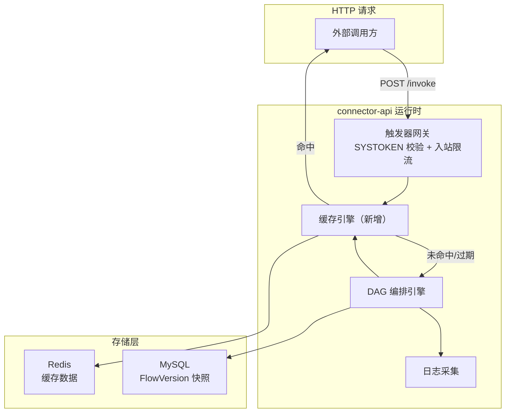
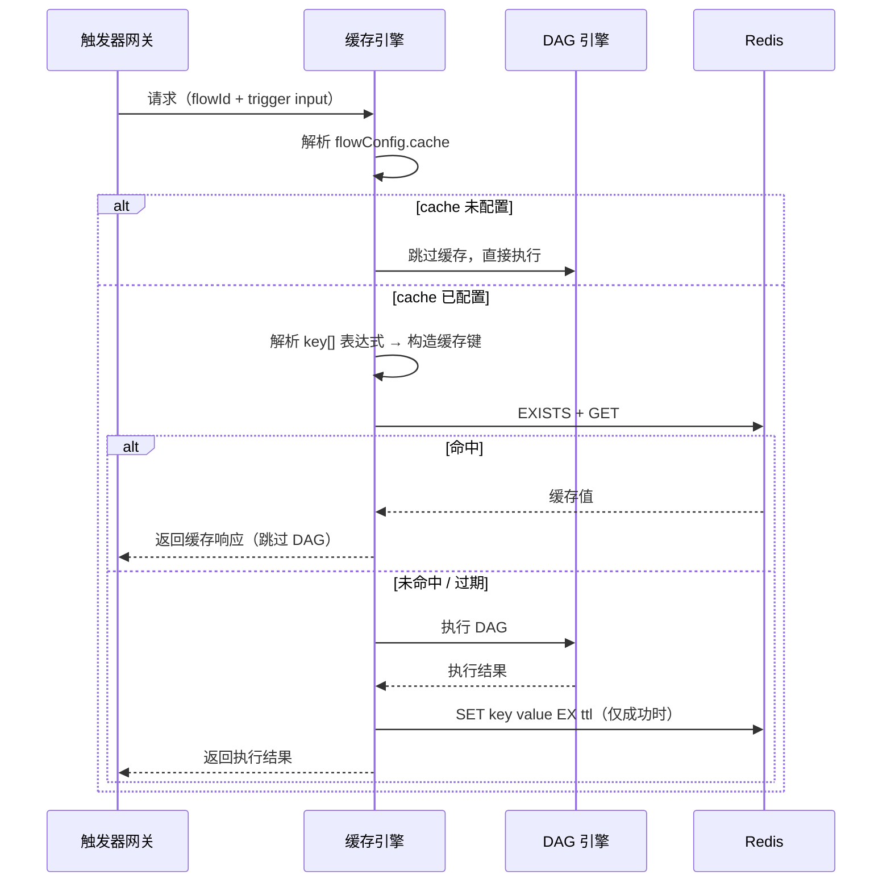

# 缓存设计方案：连接器平台 V2

**Feature ID**: CONN-PLAT-002
**关联文档**: spec.md（§3.7 FR-037）, plan-db.md（§0.6 JSON 字段规范）, plan-api.md（§3.4 #28/#29 flowConfig.cache）, plan-json-schema.md（§6.4 flowConfig.cache）
**版本**: v2.0
**创建日期**: 2026-06-12
**对齐基线**: spec.md v2.17-draft + plan-db.md v2.0 + plan-api.md v5.3 + plan-json-schema.md v9.7

---

## 1. 缓存定位

### 1.1 业务定位

缓存是连接流级配置，挂载在 `FlowVersion.orchestrationConfig.flowConfig.cache` 下。其核心目的是**缓存整个连接流对同一输入的执行结果，避免重复计算**，从而降低下游 API 调用压力、提升响应速度。

| 维度 | 说明 | 决策来源 |
|------|------|---------|
| **归属** | 连接流（Flow），非连接器 | spec §1.6 关键设计决策 |
| **配置位置** | `FlowVersion.orchestrationConfig.flowConfig.cache` | plan-json-schema §6.4 |
| **存储位置** | `flow_version_t.orchestration_config` MEDIUMTEXT JSON 字段内的 `flowConfig.cache` | plan-db §3.4 |
| **保护对象** | 后端系统 + 调用效率 | spec §1.6 |
| **配置角色** | 应用管理员在连接流编排时配置 | spec §2.2 US-08 |

### 1.2 与其他流级配置的关系

```
flowConfig（流级配置快照，存储在 FlowVersion JSON 内）
├── timeout          → 节点超时 / 全局超时
├── rateLimitConfig  → 入站限流（QPS/并发数）
└── cache            → 缓存配置（本方案）
    ├── key          → 缓存键表达式列表（数组，最少 1 个）
    └── ttl          → 缓存时长（秒，最小 1）
```

> 💡 三个流级配置统一快照在 FlowVersion 中，部署时随版本配置一起生效。

---

## 2. 缓存架构

### 2.1 整体架构



### 2.2 缓存引擎执行流程



### 2.3 缓存粒度决策

| 方案 | 描述 | 选择 | 理由 |
|------|------|:--:|------|
| **全流缓存** | 缓存整个连接流对同一输入的执行结果 | ✅ 选择 | 设计简单，与 spec FR-037 "缓存子图结果" 语义一致（子图 = 从触发器到出口的完整 DAG）；key 由管理员控制粒度 |
| 节点级缓存 | 缓存单个连接器节点的返回结果 | ❌ | 复杂度高，需处理节点间依赖和缓存一致性；V2 暂不引入 |
| 子图级缓存 | 管理员选择缓存 DAG 中某段子图 | ❌ | 需前端支持子图选择交互，超出 V2 scope |

> **缓存语义澄清**：spec FR-037 原文 "缓存子图结果" 指缓存整个连接流的执行结果，而非缓存 DAG 中某一段子图。缓存的"子图"语义 = 以触发器为入口、以出口为终点的完整 DAG 执行链路。V3 可扩展为可选子图缓存。

---

## 3. 缓存键设计

### 3.1 缓存键构成

缓存键由三部分组成，以冒号分隔：

```
cp:cache:{flowId}:{versionNumber}:{dynamicKeyValues}
```

| 段 | 来源 | 示例 | 说明 |
|----|------|------|------|
| `cp:cache` | 固定前缀 | `cp:cache` | 命名空间隔离，避免与其他业务模块的 Redis key 冲突 |
| `{flowId}` | `execution_record_t.flow_id` | `4444444444444444444` | 连接流 ID（雪花 ID 转 string），确保不同流的缓存隔离 |
| `{versionNumber}` | `flow_version_t.version_number` | `2` | 版本号，版本变更时自动隔离旧缓存 |
| `{dynamicKeyValues}` | `flowConfig.cache.key[]` 表达式解析值 | `u001` 或 `u001:active` | 管理员配置的缓存键表达式列表，运行时按序解析后以 `:` 拼接 |

### 3.2 缓存键表达式体系

缓存键表达式遵循 plan-json-schema §3 值表达式体系，**仅允许引用 `node` 作用域下 `trigger` 节点的 `input` 字段**。

| 限制项 | 规则 | 理由 |
|--------|------|------|
| 允许的作用域 | `node` | 缓存键必须可稳定提取自请求 |
| 允许的节点 | `trigger` | 触发器输入是整个流的唯一外部输入 |
| 允许的数据面 | `input` | 仅入参决定执行结果 |
| 禁止的作用域 | `constant` / `system` / `script` / `execution` | 这些值或为固定常量（无意义），或为运行时注入（不可作为键） |

**合法表达式示例**：

```
${$.node.trigger.input.body.userId}
${$.node.trigger.input.query.page}
${$.node.trigger.input.header.X-App-Id}
```

### 3.3 缓存键解析与构造

**示例配置**：

```json
{
  "cache": {
    "key": [
      "${$.node.trigger.input.body.userId}",
      "${$.node.trigger.input.body.action}"
    ],
    "ttl": 300
  }
}
```

**运行时解析**（假设请求 body 为 `{"userId":"u001","action":"send","content":"hello"}`）：

1. 解析 `${$.node.trigger.input.body.userId}` → `"u001"`
2. 解析 `${$.node.trigger.input.body.action}` → `"send"`
3. 拼接 dynamicKeyValues → `"u001:send"`
4. 完整缓存键 → `cp:cache:4444444444444444444:2:u001:send`

> ⚠️ **解析失败处理**：若某个表达式因字段缺失等原因无法解析，则该表达式对应的分量为空字符串 `""`，不中断缓存流程。例如 `userId` 不存在时 → `cp:cache:4444444444444444444:2::send`。

### 3.4 缓存键冲突风险

| 风险 | 说明 | 缓解措施 |
|------|------|---------|
| 不同流相同 key | 不同 `flowId` 前缀天然隔离 | ✅ 无需额外处理 |
| 不同版本相同 key | `versionNumber` 前缀天然隔离 | ✅ 无需额外处理 |
| 同一版本内冲突 | 由管理员配置 key 表达式控制粒度 | 配置提示：key 表达式应覆盖所有决定执行结果的入参字段 |
| 特殊字符 | 动态值可能含 `:` | key 值中的 `:` 进行 URL 编码为 `%3A` |

---

## 4. 缓存值设计

### 4.1 缓存值结构

缓存值存储连接流执行的完整 HTTP 响应，序列化为 JSON：

```json
{
  "statusCode": 200,
  "headers": {
    "Content-Type": "application/json",
    "X-Execution-Id": "exec-2026-001"
  },
  "body": {
    "executionId": "1234567890123456789",
    "status": 0,
    "resultData": { "msgId": "msg_xxxx", "code": 0 },
    "durationMs": 234
  }
}
```

| 字段 | 类型 | 说明 |
|------|------|------|
| `statusCode` | int | HTTP 状态码（200/201 等） |
| `headers` | object | 响应头（排除 `Set-Cookie` 等带会话信息的头） |
| `body` | object | 响应体，直接透传 DAG 出口节点的 output |

### 4.2 缓存条件

| 条件 | 是否缓存 | 理由 |
|------|:--:|------|
| 执行成功（HTTP 2xx） | ✅ | 正常结果可缓存 |
| 执行失败（HTTP 4xx/5xx 或引擎错误） | ❌ 不缓存 | 错误不应被缓存复用，否则会持续返回错误（EC-012） |
| 执行超时 | ❌ 不缓存 | 超时结果不应被缓存 |
| 调试触发（trigger_type = debug） | ❌ 不缓存 | 调试需要每次真实执行 |
| 缓存配置不存在或 key[] 为空 | ❌ 不缓存 | 无缓存配置则跳过 |
| 响应体超过阈值 | ❌ 不缓存 | 防止大对象占满 Redis 内存（见 §5.2） |

### 4.2a 缓存命中时的运行记录

> **设计决策**：缓存命中时**只写 `execution_record`**（标记 `cache_status=1`），**不写 `execution_step`**——因为没有节点实际执行。到 V3 节点级缓存时，`execution_step.cache_status` 字段可标识单个节点的命中状态。

| 表 | 写入内容 | 说明 |
|----|---------|------|
| `execution_record_t` | 正常写入 | `trigger_type=1`（http），`status=0`（success），**`cache_status=1`**（全流命中），`cache_key` 填解析后的缓存键，`cache_ttl_remaining` 填命中时剩余 TTL，`flow_version_snapshot` 填触发时的版本快照，`duration_ms` 填 Redis GET 实际耗时（< 5ms） |
| `execution_step_t` | **不写入** | 没有节点实际执行，无需步骤记录 |

**V2 → V3 演进路径**：

```
V2（全流缓存命中）:
  execution_record: cache_status=1, cache_key="cp:cache:...", cache_ttl_remaining=280
  execution_step:   (空 — 无节点执行)

V3（全流命中，同 V2）:
  execution_record: cache_status=1, ...

V3（部分命中，节点级缓存）:
  execution_record: cache_status=2(部分命中)
  execution_step:   每节点各自 cache_status=0/1
```

> 💡 这样设计的好处：① `execution_step` 不含伪数据，只记录真实执行；② 前端列表通过 `cache_status=1` 区分缓存命中行（展示为「缓存命中」标签 + 耗时 ~5ms）；③ 到 V3 时 `execution_step.cache_status` 字段零迁移，直接启用。

### 4.3 缓存值大小限制

| 限制项 | 值 | 说明 |
|--------|------|------|
| 最大响应体大小 | **1 MB**（可配置） | 超过此阈值的响应体不缓存，记录告警日志 |
| 序列化后总大小上限 | **1.5 MB** | 含 statusCode + headers + body |

---

## 5. 缓存存储方案

### 5.1 存储引擎选型

| 方案 | 描述 | 选择 | 理由 |
|------|------|:--:|------|
| **Redis** | 内存 KV 存储，原生 TTL 支持 | ✅ 选择 | 已有 Redis 基础设施（复用 V1 限流 Redis）；P99 < 1ms 延迟满足 NFR-001（命中 P99 < 500ms）；原生 EXPIRE 实现 TTL |
| 本地内存（Caffeine/Guava Cache） | JVM 堆内缓存 | ❌ | 多节点部署时缓存不一致；重启丢失；内存占用挤占 JVM 堆 |
| MySQL | 关系型数据库 | ❌ | 延迟高，不适合高频读写（NFR-001 要求 ≥ 300 TPS） |

### 5.2 Redis 数据结构与命令

| 操作 | Redis 命令 | 说明 |
|------|-----------|------|
| 写入 | `SET cp:cache:... <value> EX <ttl>` | 原子写入，带 TTL 自动过期 |
| 读取 | `GET cp:cache:...` | 读取后不续期 TTL |
| 批量失效 | `SCAN ... DEL` | 按 pattern 模糊匹配删除（版本失效时使用） |
| 存在性检查 | `EXISTS cp:cache:...` | 可选，通常 GET 的 nil 判断即可 |

**Redis Key 命名规范**：

```
cp:cache:{flowId}:{versionNumber}:{dynamicKeyValues}
```

- 前缀 `cp:cache` 统一命名空间
- 全部使用小写（Redis 惯例）
- 无特殊字符（动态值中的 `:` 已编码）

### 5.3 缓存驱逐策略

| 策略项 | 值 | 说明 |
|--------|-----|------|
| Redis maxmemory-policy | `volatile-lru`（服务端全局） | 仅驱逐带 TTL 的 key；最近最少使用优先 |
| 最大内存占比 | 不超过 Redis 实例 maxmemory 的 **30%**（建议） | 与限流令牌桶共享 Redis，需控制占比 |
| 应用层检查 | 写入前检查 value 大小，超过 1MB 拒绝写入 | 防止大对象挤占内存 |

### 5.4 缓存监控指标

| 指标 | 含义 | 采集方式 |
|------|------|---------|
| `cache_hit_total` | 缓存命中次数 | 每次命中 +1 |
| `cache_miss_total` | 缓存未命中次数 | 每次未命中 +1 |
| `cache_write_total` | 缓存写入次数 | 每次写入成功 +1 |
| `cache_write_skip_total` | 缓存写入跳过次数（失败/过大/调试） | 每次跳过 +1 |
| `cache_hit_rate` | 命中率 = hit/(hit+miss) | 计算指标 |
| `cache_value_size_bytes` | 缓存值大小分布（Histogram） | 每次写入时记录 |

---

## 6. 缓存生命周期

### 6.1 缓存创建

| 触发条件 | 操作 | 说明 |
|---------|------|------|
| DAG 执行成功 + 缓存未命中 + 非调试 + 响应体 ≤ 1MB | `SET key value EX ttl` | 正常缓存写入 |
| DAG 执行成功 + 缓存未命中 + 响应体 > 1MB | 跳过写入 + 记录告警 | 大对象保护 |
| DAG 执行失败 | 不写入 | 错误不缓存 |

### 6.2 缓存读取

| 触发条件 | 操作 | 说明 |
|---------|------|------|
| HTTP 触发 + 缓存已配置 + 非调试 | `GET key` | 命中返回缓存值，未命中执行 DAG |
| 调试触发 | 跳过缓存读取 | 调试强制真实执行 |

### 6.3 缓存失效

| 场景 | 操作 | 范围 | 说明 |
|------|------|------|------|
| **TTL 自然过期** | Redis 自动删除 | 单 key | 标准 TTL 机制，零运维 |
| **版本发布**（草稿→已发布） | 异步清理 `cp:cache:{flowId}:*` | 该流全部版本的所有缓存 | 新版本发布后旧缓存不再可信（编排可能变更）；异步清理不阻塞发布操作 |
| **版本失效**（已发布→已失效） | 异步清理 `cp:cache:{flowId}:{失效版本号}:*` | 仅该失效版本的缓存 | 失效版本的缓存不应被读取（但运行时已不再使用该版本） |
| **连接流部署**（切换部署版本） | 异步清理 `cp:cache:{flowId}:*` | 该流全部缓存 | 部署切换版本后，清理旧版本缓存避免脏读 |
| **连接流停止**（运行中→已停止） | 不清理 | — | 停止后无新触发，缓存自然过期即可 |
| **连接流恢复**（已失效→已停止） | 不清理 | — | 恢复后处于已停止状态，无新触发 |
| **连接器版本变更**（发布/失效） | 不主动清理 | — | 连接流缓存 key 由 flowId + versionNumber 组成，不包含 connector 版本号；连接器版本变更不影响缓存 key 解析 |

### 6.4 缓存失效实现

> **用户决策**：采用**异步消息队列**方式清理缓存，避免同步 SCAN+DEL 阻塞版本发布/部署操作。

**异步清理流程**：

```
版本发布 / 流部署
    │
    ▼
发送清理消息到异步队列（应用内队列或 Kafka）
    │
    ▼
返回发布/部署成功（不等待清理完成）
    │
    ▼
异步消费者：
    ├── SCAN cp:cache:{flowId}:* COUNT 100
    ├── 分批 DEL
    └── 记录清理日志（清理 key 数量 + 耗时）
```

**消息结构**：

```json
{
  "type": "CACHE_INVALIDATE",
  "flowId": "4444444444444444444",
  "versionNumber": 2,
  "scope": "ALL_VERSIONS",
  "trigger": "VERSION_PUBLISH",
  "timestamp": "2026-06-12T10:00:00Z"
}
```

| 字段 | 说明 |
|------|------|
| `scope=ALL_VERSIONS` | 清理该流全部版本的缓存（版本发布/部署时） |
| `scope=SINGLE_VERSION` | 仅清理指定版本的缓存（版本失效时） |
| `trigger` | 触发来源：`VERSION_PUBLISH` / `VERSION_INVALIDATE` / `FLOW_DEPLOY` |

**容错设计**：
- 清理失败自动重试 3 次，间隔递增（1s/5s/15s）
- 3 次均失败后记录 ERROR 日志 + 告警
- 即使清理失败，旧缓存也会在 TTL 到期后自然过期，不影响正确性

---

## 7. 运行时集成

### 7.1 缓存执行时序

```
HTTP 触发请求
    │
    ▼
① 网关层：SYSTOKEN 校验 + 入站限流
    │
    ▼
② 版本解析：flow.deployed_version_id → FlowVersion.orchestrationConfig
    │
    ▼
③ 缓存引擎（新增）：
    ├── flowConfig.cache 不存在？→ 跳过缓存，继续 DAG
    ├── triggerType == debug？→ 跳过缓存，继续 DAG
    ├── 解析 key[] 表达式 → 构造缓存键
    ├── GET Redis
    └── 命中？
        ├── 是 → ④a 写 execution_record(cache_status=1, cache_key, cache_ttl_remaining)
        │          → ⑤ 返回缓存响应
        └── 否 → ④ DAG 执行 → ④b 写 execution_record + execution_step（正常）
    │
    ▼
④ DAG 执行（缓存未命中时）
    │
    ▼
④b 正常写入 execution_record(cache_status=0) + execution_step（完整节点级详情）
    │
    ▼
⑤ 缓存写入（仅成功时）：
    ├── 检查 response body size ≤ 1MB
    └── SET key value EX ttl
    │
    ▼
⑥ 返回 HTTP 响应
```

### 7.2 缓存命中响应格式

缓存命中时返回的响应格式与正常执行完全一致，调用方**无需感知缓存**。`executionId` 由系统正常生成（雪花 ID），`durationMs` 为实际缓存读取耗时（通常 < 5ms）。运维侧通过 `execution_record.cache_status=1` 区分。

```json
// 缓存命中响应（对外格式与正常执行相同）
{
  "code": "200",
  "messageZh": "操作成功",
  "messageEn": "Success",
  "data": {
    "executionId": "9876543210987654321",
    "status": 0,
    "resultData": { "msgId": "msg_xxxx", "code": 0 },
    "durationMs": 2
  },
  "page": null
}
```

| 字段 | 缓存命中时的值 | 说明 |
|------|--------------|------|
| `executionId` | 正常雪花 ID | 每次请求独立生成，可追溯 |
| `durationMs` | 实际 Redis GET 耗时（< 5ms） | 真实耗时 |
| `resultData` | 与真实执行相同 | 从缓存值透传 |
| `execution_step` 详情 | **无**（不返回 steps 数组） | 没有节点实际执行 |

### 7.3 缓存与限流的交互

| 场景 | 行为 |
|------|------|
| 缓存命中 | **不计入**入站限流计数（因为未消费 DAG 资源） |
| 缓存未命中 | 正常计入入站限流计数 |

> 缓存命中时跳过限流统计，可进一步提升命中场景下的有效 TPS。

---

## 8. 设计决策记录

### ADR-008：Redis 全流缓存方案

**状态**：PROPOSED

**背景**：
V2 需要在连接流级别引入缓存能力（FR-037），通过缓存子图执行结果减少下游重复调用、提升响应速度。需决定缓存粒度、存储引擎、键设计、失效策略。

**决策**：
1. **全流缓存粒度**：缓存整个连接流对同一输入的完整 HTTP 响应，不做节点级/子图级拆分
2. **Redis 存储引擎**：使用 Redis SET/GET/DEL 命令，借助原生 EXPIRE 实现 TTL
3. **缓存键结构**：`cp:cache:{flowId}:{versionNumber}:{dynamicKeyValues}`，dynamicKeyValues 由管理员在 flowConfig.cache.key[] 中配置的 JSON Path 表达式列表运行时解析拼接
4. **仅成功结果缓存**：执行失败/超时/调试触发不写缓存
5. **版本发布/部署主动清理**：版本发布或部署时通过 `SCAN` + `DEL` 批量清理该流全部缓存

**后果**：

- ✅ **优点**：
  - 设计简单，实现复杂度低
  - Redis 原生 TTL 免除定时清理任务
  - NFR-001 缓存命中性能指标可达（P99 < 500ms，≥ 300 TPS）
  - 与现有 Redis 基础设施复用，零额外运维

- ⚠️ **注意事项**：
  - Redis 内存有限，需设置 value 大小上限（1MB）防止大对象
  - SCAN 批量清理在 key 数量极大时可能有延迟，需监控
  - 缓存 key 仅基于 trigger input，管理员需确保 key 表达式覆盖完整入参
  - 缓存一致性依赖版本发布/部署时的主动清理，不实时感知连接器版本变更

---

## 9. 边界情况与异常处理

| # | 场景 | 处理方式 | 对应 spec EC |
|----|------|---------|:--:|
| CE-01 | 缓存未命中或已过期 | 正常执行 DAG，不中断流程 | EC-012 |
| CE-02 | Redis 连接失败 / 超时 | **降级**：跳过缓存逻辑，直接执行 DAG；记录告警日志 | — |
| CE-03 | Redis 写入失败 | 不影响请求返回，记录告警日志；缓存写入为非关键路径 | — |
| CE-04 | 缓存 key 表达式解析失败 | 对应分量为空字符串 `""`，不中断缓存流程；记录 WARN 日志 | — |
| CE-05 | 缓存值超过 1MB | 跳过写入，记录 WARN 日志含 flowId + 大小 | — |
| CE-06 | 异步缓存清理失败（重试 3 次后仍失败） | 记录 ERROR 日志 + 告警；旧缓存在 TTL 到期后自然过期，不影响正确性 | — |
| CE-07 | 调试触发 | 强制跳过缓存读写，保证每次真实执行 | — |
| CE-08 | flowConfig.cache 存在但 key[] 为空 | 视为缓存未配置，跳过所有缓存逻辑 | — |
| CE-09 | 同一请求并发触发（缓存未命中时） | 首个请求 SET 缓存成功，后续请求可能读到缓存（无锁，不保证严格幂等）。每个请求各自写入 execution_record（雪花 ID 不冲突，无 execution_step） | — |
| CE-10 | 缓存命中时出口节点 output 定义变更 | 缓存值与当前版本的 output 定义可能不一致（因为缓存是响应快照）。**设计决策**：缓存返回的是历史执行结果，与触发时的版本配置一致；版本变更时已通过主动清理保证不会命中旧版本缓存 | — |
| CE-11 | 缓存命中但 execution_record 写入失败 | execution_record 写入失败不影响缓存返回（缓存响应已发送），记录 ERROR 日志供运维排查 | — |

---

## 10. 缓存配置校验

### 10.1 设计态校验

| 校验项 | 校验时机 | 违规处理 |
|--------|---------|---------|
| `cache.key[]` 不为空数组 | 编排保存 | 标红提示「缓存键至少需要一个表达式」 |
| `cache.key[]` 每个元素符合表达式语法 | 编排保存 | 标红提示具体语法错误 |
| `cache.ttl` ≥ 1 | 编排保存 | 标红提示「缓存时长最小为 1 秒」 |
| `cache.key[]` 表达式引用非 trigger.input | 编排保存 | WARN 提示「建议使用触发器输入字段作为缓存键」 |
| `cache.key[]` 表达式数量 > 5 | 编排保存 | WARN 提示「缓存键过多可能影响匹配效率」 |

### 10.2 运行态校验

| 校验项 | 校验时机 | 处理 |
|--------|---------|------|
| 缓存键表达式解析 | 每次请求 | 失败时该段为空字符串 |
| Redis 可用性 | 每次请求 | 不可用时降级跳过缓存 |

---

## 11. 性能预估

### 11.1 性能模型

基于 NFR-001/NFR-002 的 2C4G 单节点前提：

| 场景 | 预估延迟 | 预估 TPS |
|------|---------|---------|
| 缓存命中 | P99 < 30ms（Redis GET ~1ms + 写 execution_record ~5ms） | ≥ 400 |
| 缓存未命中（无缓存开销） | 同无缓存场景 | ≥ 40 |
| 缓存未命中 + 写入 | 同无缓存场景 + Redis SET（~1ms） | ≥ 40 |

> 缓存命中路径：触发器网关 → 版本解析（MySQL）→ 缓存引擎（Redis GET）→ 写 execution_record（MySQL INSERT）→ 返回。最重的 DAG 执行 + HTTP 下游调用被跳过，延迟从 ~2s 降到 ~50ms。

### 11.2 Redis 内存预估

| 假设 | 值 |
|------|-----|
| 活跃连接流数量 | 100 |
| 每流平均缓存 key 数 | 100 |
| 每缓存值平均大小 | 10 KB |
| 总缓存量 | 100 × 100 × 10 KB = **100 MB** |

在 maxmemory 1GB 的 Redis 实例中，占比 ~10%，安全。

---

## 12. 开放问题

| # | 问题 | 影响范围 | 建议决策时间 | 状态 |
|----|------|---------|-------------|:--:|
| OQ-C01 | 缓存命中时是否需要记录 execution_record | 运行记录查询 + 缓存监控 | Build 前 | ✅ **已决策**：execution_record 记录（cache_status=1），execution_step 不写（无节点实际执行） |
| OQ-C02 | 缓存值大小上限 1MB 是否合适？是否需要按应用可配？ | 大对象保护 | Build 前 | ✅ **已决策**：全局可配置（application.yml，默认 1MB），不按应用区分 |
| OQ-C03 | 缓存清理方式：同步 SCAN+DEL vs 异步消息队列？ | 大流量时的清理延迟 | Build 前 | ✅ **已决策**：采用异步消息队列清理，不阻塞发布/部署操作，失败重试 3 次 |
| OQ-C04 | V3 是否需要节点级缓存？（当前方案预留扩展点：缓存值中可按 nodeId 分段存储） | 后续版本规划 | V3 | 待 V3 讨论 |

---

## 13. 文件影响分析

| 操作 | 文件 | 说明 |
|:--:|------|------|
| NEW | `connector-api/.../cache/CacheEngine.java` | 缓存引擎核心逻辑（key 解析 + Redis 读写 + 降级 + 命中时写 execution_record） |
| NEW | `connector-api/.../cache/CacheKeyResolver.java` | 缓存键表达式解析器（基于值表达式体系） |
| NEW | `connector-api/.../cache/CacheMetrics.java` | 缓存监控指标采集 |
| NEW | `connector-api/.../cache/CacheConfig.java` | 缓存配置（大小阈值、TTL 上限等） |
| MODIFY | `connector-api/.../runtime/FlowExecutor.java` | DAG 执行入口增加缓存判断逻辑；缓存命中时写 execution_record（cache_status=1），**不写 execution_step** |
| MODIFY | `connector-api/.../config/RedisConfig.java` | Redis 连接配置（复用已有，可能需增加 cache 专用 connection） |
| MODIFY | `connector-api/src/main/resources/application.yml` | 缓存相关配置项 |
| NEW | `connector-api/.../cache/CacheInvalidateConsumer.java` | 异步缓存清理消费者（监听清理消息，执行 SCAN+DEL） |
| MODIFY | `open-server/.../service/FlowVersionService.java` | 版本发布/失效时**发送异步清理消息**（非阻塞） |
| MODIFY | `open-server/.../service/FlowDeployService.java` | 部署切换版本时**发送异步清理消息**（非阻塞） |
| MODIFY | `plan-db.md` §0.7 / §3.7 / §3.8 / §4.8-4.9 | execution_record_t +3 列（cache_status / cache_key / cache_ttl_remaining）+1 索引；execution_step_t +3 列同字段（V3 启用） |
| MODIFY | `plan-api.md` §1.8.9 | 新增 executionRecord.cacheStatus 枚举（0/1/2） |

---

## 附录 A：配置示例

### A.1 flowConfig.cache 完整示例

```json
{
  "flowConfig": {
    "timeout": { "perNode": 10, "global": 60 },
    "rateLimitConfig": { "maxQps": 100, "maxConcurrency": 10 },
    "cache": {
      "key": [
        "${$.node.trigger.input.body.userId}",
        "${$.node.trigger.input.query.action}"
      ],
      "ttl": 300
    }
  }
}
```

### A.2 缓存键解析示例

**配置**：`key: ["${$.node.trigger.input.body.userId}"]`, `ttl: 600`

**请求 1**：`{"userId": "alice", "content": "hello"}`
- 缓存键：`cp:cache:flow123:3:alice`
- 未命中 → 执行 DAG → 缓存结果（TTL 600s）

**请求 2**：`{"userId": "alice", "content": "world"}`
- 缓存键：`cp:cache:flow123:3:alice`
- 命中 → 直接返回请求 1 的缓存结果（content 不一致但 key 表达式只看 userId）

**请求 3**：`{"userId": "bob", "content": "hello"}`
- 缓存键：`cp:cache:flow123:3:bob`
- 未命中 → 执行 DAG → 缓存结果

> 💡 管理员可通过增加 key 表达式粒度来控制缓存精度。例如改为 `["${$.node.trigger.input.body.userId}", "${$.node.trigger.input.body.content}"]` 后，请求 2 将无法命中请求 1 的缓存。

---

## 附录 B：修订记录

| 版本 | 日期 | 修订内容 | 修订人 |
|------|------|---------|--------|
| v1.0 | 2026-06-12 | 初始版本 — 对齐 spec.md v2.17 + plan-json-schema.md v9.7 | SDDU Plan Agent |
| v1.1 | 2026-06-12 | 用户决策落地：① 缓存命中正常记录 ② 缓存值上限 1MB ③ 同步 SCAN+DEL ④ 不预热。同步更新 plan-db.md / plan-api.md | SDDU Plan Agent |
| v1.2 | 2026-06-12 | 用户决策落地第二轮：① OQ-C02 全局可配置（非按应用）② OQ-C03 改为异步消息队列清理 ③ OQ-C04 延后 V3。新增 CacheInvalidateConsumer 组件 | SDDU Plan Agent |

---

> **下一步**：确认本方案后运行 `@sddu-tasks connector-platform-v2` 进入任务分解。
