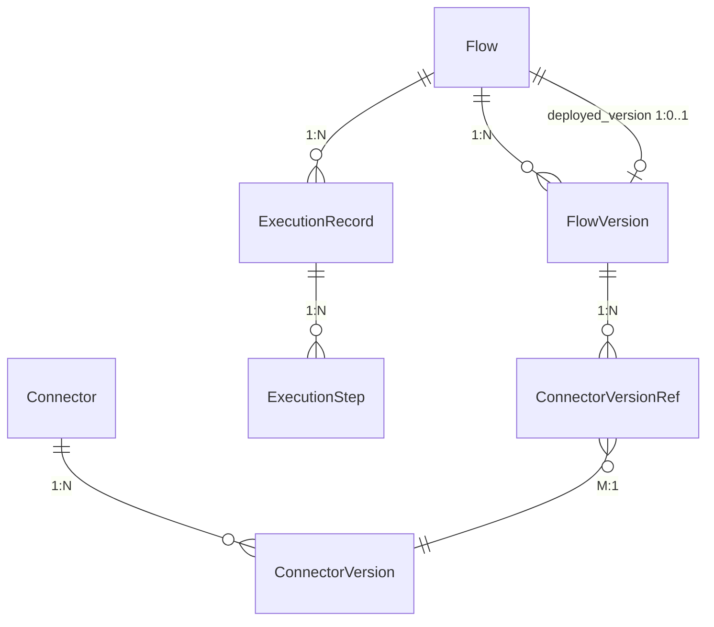

# 数据库设计：连接器平台 V2

**Feature ID**: CONN-PLAT-002
**关联文档**: plan.md（§3 数据库变更）, plan-json-schema.md（JSON 结构权威定义）
**版本**: v2.0
**创建日期**: 2026-06-09
**对齐基线**: spec.md v2.23-draft

---

## SQL 脚本输出位置

V2 DDL 脚本追加到 open-server 工程内，沿用 V1 的 FlywayDB 命名风格，但 **open-server 不新增 Flyway 依赖**，本规划也**不考虑脚本自动执行机制**。

**输出路径**：

```text
open-server/src/main/resources/db/migration/
├── V2__init_connector_platform_schema.sql   ← V1 已存在（7 张表）
└── V3__connector_platform_v2_schema.sql     ← V2 新增（4 张新表 + 8 张 ALTER）
```

约束：
- 不在 `connector-api` 中存放 DDL / migration 脚本
- 目录按 FlywayDB 默认风格统一为 `db/migration/`
- connector-api 仅通过 R2DBC 访问已初始化的开放平台共库表

---

## 0. 设计规范

> 💡 V2 全面沿用 V1 `plan-db.md §0` 已确立的设计规范，以下各子节从 V1 完整复制并标注 V2 变更项。

### 0.1 核心设计原则

| 原则 | 说明 |
|------|------|
| **表前缀** | 统一使用 `openplatform_v2_cp_`（openplatform=开放平台体系 / v2=平台第二代 / cp=connector platform 子域） |
| **表后缀** | 所有表统一 `_t` 后缀 |
| **主键** | 统一 BIGINT(20) **雪花 ID**（应用层生成），命名 `id` |
| **时间字段** | 统一 `DATETIME(3)`（毫秒精度） |
| **JSON 字段** | 统一 **TEXT/MEDIUMTEXT 存 JSON 字符串**（禁用 MySQL JSON 原生类型）；应用层 Jackson 序列化/反序列化 |
| **描述字段** | 统一 `VARCHAR(1000)` |
| **名称字段** | 中英文双语 `name_cn` / `name_en`，VARCHAR(100)，必填 |
| **物理外键** | ❌ 禁用，所有关联通过逻辑字段（`xxx_id` BIGINT）+ 应用层维护 |
| **软删除** | V1 不引入；V2 不引入（统一物理删除） |
| **审计字段** | 每表必备 `create_time` / `last_update_time` / `create_by` / `last_update_by` |
| **执行表分区** | V2 不分区；单表接近 500w 时按 `trigger_time` 月度分区 + 30 天定时清理 |
| **文件/图标字段** | 不直接存储完整 URL，统一使用 **文件 ID**（`icon_file_id`），`VARCHAR(128)`，选填 |

### 0.2 命名规范

| 规则 | 说明 | V2 示例 |
|------|------|---------|
| **完整前缀** | `openplatform_v2_cp_` | `openplatform_v2_cp_connector_t` |
| **表后缀** | 统一 `_t` | `openplatform_v2_cp_connector_url_whitelist_t` |
| **命名风格** | 小写字母 + 下划线分隔 | `connector_version_ref` / `approval_flow` |
| **索引命名** | `idx_字段1_字段2` | `idx_connector_version` / `idx_app_status` |
| **唯一索引命名** | `uk_字段1_字段2` | `uk_flow_node` / `uk_level_app` |

### 0.3 主键规范

| 规则 | 说明 |
|------|------|
| **主键类型** | BIGINT(20)，**应用层生成雪花 ID**（非自增） |
| **主键命名** | 统一使用 `id` |
| **业务 ID** | ❌ 不单独维护 `varchar(32)` 业务 ID——直接用 BIGINT 雪花 `id` 对外暴露（API 响应转 string 避免 JS 精度丢失） |
| **关联字段** | 使用**逻辑外键**（存储关联 ID），**严禁物理外键约束** |

### 0.4 审计字段规范

所有业务表必须包含以下 4 个审计字段：

| 字段名 | 类型 | 说明 |
|--------|------|------|
| `create_time` | DATETIME(3) | 创建时间，默认 `CURRENT_TIMESTAMP(3)` |
| `last_update_time` | DATETIME(3) | 更新时间，默认 `CURRENT_TIMESTAMP(3) ON UPDATE CURRENT_TIMESTAMP(3)` |
| `create_by` | VARCHAR(100) | 创建人账号 |
| `last_update_by` | VARCHAR(100) | 更新人账号 |

> ⚠️ **V2 新增表注意**：所有新增表均需完整 4 个审计字段（含 `connector_version_ref_t`）。

### 0.5 描述字段规范

| 规则 | 说明 |
|------|------|
| **类型** | 统一 `VARCHAR(1000)`（禁用 TEXT） |
| **双语** | `description_cn` / `description_en`，均选填 |
| **理由** | 行内存储+可索引+前端预览友好 |

### 0.6 JSON 字段规范

| 规则 | 说明 |
|------|------|
| **类型** | **TEXT / MEDIUMTEXT**（根据实际大小选定），存 JSON 字符串 |
| **禁用** | ❌ MySQL JSON 原生类型 |
| **序列化** | 应用层负责（Jackson 序列化/反序列化、格式校验） |
| **查询** | ❌ 不使用 `JSON_EXTRACT` / `JSON_TABLE` 等原生函数 |
| **内部字段命名** | JSON 内部字段统一使用 **camelCase**，与 API 响应一致 |
| **本平台长度选择** | 编排/连接配置类（`orchestration_config`、`connection_config`）：**MEDIUMTEXT**（最多 16MB）；流级配置（`flow_config`）：**MEDIUMTEXT**；执行 I/O 类（`input_data`/`output_data`）：**TEXT**（最多 64KB）；审批人配置（`approver_ids`）：**JSON** 列（MySQL 原生 JSON，仅此例外——数组结构简单，适合 MySQL JSON 类型） |
| **JSON 结构定义源** | 所有 MEDIUMTEXT/TEXT 字段中存储的 JSON 对象内部结构，以 **[plan-json-schema.md](./plan-json-schema.md)** 为**权威定义** |

### 0.7 枚举字段规范

| 规则 | 说明 |
|------|------|
| **字段类型** | **TINYINT(10)**（禁用 varchar 字符串枚举） |
| **默认值** | 数字字面量 |
| **注释说明** | 在 COMMENT 中说明所有枚举值含义（数字 → 含义） |
| **示例** | `TINYINT(10) NOT NULL DEFAULT 1 COMMENT '状态：1=草稿, 2=已发布, 3=已失效, 4=物理删除'` |

**V2 枚举字段汇总**：

| 表 | 字段 | 枚举值 | 说明 |
|----|------|--------|------|
| `connector_t` | `connector_type` | 1=HTTP | 协议类型（V2 新增：2=MySQL 预留） |
| `connector_t` | `status` | 1=有效不可用, 2=有效可用, 3=已失效, 4=物理删除 | V2 启用 |
| `connector_version_t` | `status` | 1=草稿, 2=已发布, 3=已失效, 4=物理删除 | V2 启用 |
| `flow_t` | `lifecycle_status` | 1=待部署, 2=运行中, 3=已停止, 4=已失效, 5=物理删除 | V2 扩展 |
| `flow_version_t` | `status` | 1=草稿, 2=待审批, 3=已撤回, 4=已驳回, 5=已发布, 6=已失效, 7=物理删除 | V2 新增 |
| `execution_record_t` | `trigger_type` | 1=http, 2=debug | V2 启用 |
| `execution_record_t` | `status` | 0=success, 1=failed, 2=timeout | V2 启用 |
| `execution_step_t` | `status` | 0=success, 1=failed, 2=timeout, 3=not_executed | 步骤执行结果 |
| `execution_step_t` | `node_type` | 1=trigger, 2=connector, 3=data_processor, 4=exit | V2 新增 data_processor |
| `execution_record_t` | `cache_status` | 0=未命中（正常执行）, 1=全流命中, 2=部分命中（V3） | V2 新增 |
| `execution_step_t` | `cache_status` | 0=未命中, 1=节点级命中（V3） | V2 预留，V3 启用 |

### 0.8 V2 规范变更（相对 V1）

| 规范项 | V1 | V2 |
|--------|-----|-----|
| 软删除 | MVP 不引入 | V2 不引入（统一物理删除） |
| 版本模型 | 单版本（1:1） | 多版本（1:N），每实体最多 1000 个版本 |
| 引用关系 | 无显式引用表 | 新增 `connector_version_ref_t` 中间表（M:N） |
| 审批 | 无 | 复用现有 `approval_flow_t`（新增 `app_id` 字段 + `connector_flow_version_publish` 模板） |
| 应用归属 | 无 | connector_t / flow_t 新增 `app_id`，实现应用级数据隔离 |
| 连接器状态 | 预留未用 | 启用 4 状态流转 |
| 流版本状态 | 预留未用 | 启用 7 状态流转（含审批中间状态） |

---

## 1. 表清单

| # | 表名 | 变更类型 | 归属模块 | 说明 |
|---|------|:---:|---------|------|
| 1 | `openplatform_v2_cp_connector_t` | MODIFY | connector | 启用 `status` 4状态流转；新增 `app_id` 应用归属 |
| 2 | `openplatform_v2_cp_connector_version_t` | MODIFY | connector | 1:1→1:N；新增 `version_number`/`status`/`published_time`（首次发布时刻）/`published_by`（发布操作人） |
| 3 | `openplatform_v2_cp_flow_t` | MODIFY | flow | 扩展 `lifecycle_status` 5状态；新增 `deployed_version_id`/`deployed_version_number`（冗余，避免列表 JOIN）/`app_id` |
| 4 | `openplatform_v2_cp_flow_version_t` | MODIFY | flow | 1:1→1:N；新增 `version_number`、7状态`status`、`published_time`（发布时间，审批通过时刻）、`published_by`（发布人，提交审批的人） |
| 5 | `openplatform_v2_cp_connector_version_ref_t` | **NEW** | flow | 连接器版本引用中间表（M:N）；含 `flow_id`/`connector_id` 冗余，不含 `node_id` |
| 6 | `openplatform_v2_cp_execution_record_t` | NEW | runtime | 运行记录表（V1 预留 DDL 但未使用），V2 全新启用并修正枚举值 |
| 7 | `openplatform_v2_cp_execution_step_t` | NEW | runtime | 运行日志表（V1 预留 DDL 但未使用），V2 全新启用；`node_type` VARCHAR→TINYINT |
| 8 | `openplatform_v2_approval_flow_t` | MODIFY | approval | 新增 `app_id` 字段；uk_code → uk_code_app；新增 `connector_flow_version_publish` 业务模板 |
| 9 | `openplatform_operate_log_t` | REUSE | audit | 操作日志（扩展 OperateEnum 枚举值），复用现有表，表结构不变 |
| 10 | `openplatform_property_t` | REUSE | security | URL 白名单规则（code=key, value=正则），复用现有字典表 |
| 11 | `openplatform_lookup_classify_t` | REUSE | security | 应用白名单分组（classify_code=`cp_app_whitelist`），复用现有 LookUp 分类表 |
| 12 | `openplatform_lookup_item_t` | REUSE | security | 应用白名单数据（classify_id + itemCode=appId），复用现有 LookUp 项表 |

**总计**：**12 张表**（5 MODIFY + 3 NEW + 4 REUSE）。

---

## 2. 表关系总览



| 关系 | 类型 | 实现方式 |
|------|:----:|---------|
| `connector_t` → `connector_version_t` | 1:N | `connector_version_t.connector_id` |
| `flow_t` → `flow_version_t` | 1:N | `flow_version_t.flow_id` |
| `flow_t` → `deployed_version` | 1:0..1 | `flow_t.deployed_version_id` 指针 |
| `flow_version_t` → `connector_version_ref_t` | 1:N | 中间表 `flow_version_id` |
| `connector_version_ref_t` → `connector_version_t` | M:1 | 中间表 `connector_version_id` |
| `connector_version_ref_t` → `flow_t` | M:1 | 冗余字段 `flow_id`（免 JOIN flow_version_t） |
| `connector_version_ref_t` → `connector_t` | M:1 | 冗余字段 `connector_id`（免 JOIN connector_version_t） |
| `flow_t` → `execution_record_t` | 1:N | `execution_record_t.flow_id` |
| `execution_record_t` → `execution_step_t` | 1:N | `execution_step_t.execution_id` |

> 💡 审批人配置复用现有 `approval_flow_t`（增加 `app_id` 区分应用），不建新表；URL 白名单复用 `openplatform_property_t`；应用白名单复用 `openplatform_lookup_item_t`。

> 💡 **V1→V2 关系变化**：V1 的 `flow_version_t` ⇢ `connector_version_t` 通过编排 JSON 中的 `connectorVersionId` 字段隐式引用，V2 新增 `connector_version_ref_t` 中间表显式管理，用于「标记版本失效/删除」的前置校验。

---

## 3. 表结构定义

> 💡 以下 DDL 全部遵循 §0 设计规范：BIGINT 雪花 ID 主键、TINYINT 枚举、MEDIUMTEXT 存 JSON、idx_xxx/uk_xxx 索引命名、不使用物理外键。MODIFY 表示在 V1 表基础上 ALTER；NEW 表示 V2 新建（含 V1 预留 DDL 但未实际使用的表）。

### 3.1 openplatform_v2_cp_connector_t（MODIFY）

**变更理由**：V2 引入连接器 4 状态生命周期（有效不可用/有效可用/已失效/物理删除）和应用级数据隔离。

```sql
ALTER TABLE openplatform_v2_cp_connector_t
    ADD COLUMN app_id BIGINT(20) NOT NULL DEFAULT 0 COMMENT '归属应用ID（0=全局，迁移前数据默认0）',
    MODIFY COLUMN status TINYINT(10) NOT NULL DEFAULT 1 COMMENT '状态：1=有效不可用（无已发布版本）, 2=有效可用（有已发布版本）, 3=已失效, 4=物理删除',
    ADD INDEX idx_app_status (app_id, status),
    ADD INDEX idx_app_name_cn (app_id, name_cn) COMMENT '按应用+中文名称查询',
    ADD INDEX idx_app_name_en (app_id, name_en) COMMENT '按应用+英文名称查询';
```

| 列 | 类型 | 变更 | 说明 |
|----|------|:--:|------|
| `app_id` | BIGINT(20) | NEW | 归属应用 ID，实现 G13 应用数据隔离 |
| `status` | TINYINT(10) | MODIFY | V1 预留未用 → V2 启用 4 状态（与 connector_version 的发布/失效联动） |

### 3.2 openplatform_v2_cp_connector_version_t（MODIFY）

**变更理由**：V1 单版本模型（1:1，`uk_connector_id` 唯一约束）→ V2 多版本模型（1:N），需要移除唯一约束并新增版本号、状态、发布时间字段。

```sql
ALTER TABLE openplatform_v2_cp_connector_version_t
    DROP INDEX uk_connector_id,
    ADD COLUMN version_number INT NOT NULL DEFAULT 1 COMMENT '版本号，实体内从1递增',
    ADD COLUMN status TINYINT(10) NOT NULL DEFAULT 1 COMMENT '状态：1=草稿, 2=已发布, 3=已失效, 4=物理删除',
    ADD COLUMN published_time DATETIME(3) NULL COMMENT '发布时间（首次发布时刻）',
    ADD COLUMN published_by VARCHAR(100) NULL COMMENT '发布人（发布操作人）',
    ADD INDEX idx_connector_version (connector_id, version_number),
    ADD INDEX idx_connector_status (connector_id, status);
```

| 列 | 类型 | 变更 | 说明 |
|----|------|:--:|------|
| `version_number` | INT | NEW | 版本号，实体内递增（ADR-004），发布时沿用 |
| `status` | TINYINT(10) | NEW | 4 状态：草稿→已发布→已失效→物理删除 |
| `published_time` | DATETIME(3) | NEW | 发布时间（首次发布时刻） |
| `published_by` | VARCHAR(100) | NEW | 发布人（发布操作人） |
| `uk_connector_id` | — | DROP | 移除 1:1 约束，允许多版本 |

### 3.3 openplatform_v2_cp_flow_t（MODIFY）

**变更理由**：V2 引入连接流 5 状态生命周期（待部署→运行中→已停止→已失效→物理删除）、部署版本指针、应用归属。

```sql
ALTER TABLE openplatform_v2_cp_flow_t
    ADD COLUMN deployed_version_id BIGINT(20) NULL COMMENT '当前部署的版本ID（运行时按此指针读取编排快照）',
    ADD COLUMN deployed_version_number INT NULL COMMENT '当前部署的版本号（冗余，避免列表查询 JOIN flow_version_t）',
    ADD COLUMN app_id BIGINT(20) NOT NULL DEFAULT 0 COMMENT '归属应用ID',
    MODIFY COLUMN lifecycle_status TINYINT(10) NOT NULL DEFAULT 1 COMMENT '生命周期：1=待部署, 2=运行中, 3=已停止, 4=已失效, 5=物理删除',
    ADD INDEX idx_deployed_version (deployed_version_id),
    ADD INDEX idx_app_status (app_id, lifecycle_status),
    ADD INDEX idx_app_name_cn (app_id, name_cn) COMMENT '按应用+中文名称查询',
    ADD INDEX idx_app_name_en (app_id, name_en) COMMENT '按应用+英文名称查询';
```

| 列 | 类型 | 变更 | 说明 |
|----|------|:--:|------|
| `deployed_version_id` | BIGINT(20) | NEW | 指向当前部署的 FlowVersion.id，运行时读取入口 |
| `deployed_version_number` | INT | NEW | 冗余字段，与 `deployed_version_id` 对应的版本号同步更新，列表查询无需 JOIN |
| `app_id` | BIGINT(20) | NEW | 归属应用 ID，实现 G13 应用数据隔离 |
| `lifecycle_status` | TINYINT(10) | MODIFY | V1: 1=running, 2=stopped → V2: 5 状态 |

### 3.4 openplatform_v2_cp_flow_version_t（MODIFY）

**变更理由**：V1 单版本模型 → V2 多版本模型，新增 7 状态生命周期（含审批中间状态）。流级配置（超时/限流/缓存）内嵌在 `orchestration_config` JSON 中，不单独建列。

```sql
ALTER TABLE openplatform_v2_cp_flow_version_t
    DROP INDEX uk_flow_id,
    ADD COLUMN version_number INT NOT NULL DEFAULT 1 COMMENT '版本号，实体内从1递增',
    ADD COLUMN status TINYINT(10) NOT NULL DEFAULT 1 COMMENT '状态：1=草稿, 2=待审批, 3=已撤回, 4=已驳回, 5=已发布, 6=已失效, 7=物理删除',
    ADD COLUMN published_time DATETIME(3) NULL COMMENT '发布时间（审批通过的时刻）',
    ADD COLUMN published_by VARCHAR(100) NULL COMMENT '发布人（提交审批的人）',
    ADD INDEX idx_flow_version (flow_id, version_number),
    ADD INDEX idx_flow_status (flow_id, status);
```

| 列 | 类型 | 变更 | 说明 |
|----|------|:--:|------|
| `version_number` | INT | NEW | 版本号，实体内递增 |
| `status` | TINYINT(10) | NEW | 7 状态（含审批中间态：待审批/已撤回/已驳回） |
| `published_time` | DATETIME(3) | NEW | 发布时间（审批通过的时刻）——与 connector_version 字段名一致 |
| `published_by` | VARCHAR(100) | NEW | 发布人（提交审批的人）——与 connector_version 字段名一致 |
| `uk_flow_id` | — | DROP | 移除 1:1 约束 |

### 3.5 openplatform_v2_cp_connector_version_ref_t（NEW）

**建表理由**：编排中 connector 节点引用特定 ConnectorVersion，需要显式管理引用关系以支持「标记版本失效/删除」的前置「被引用」校验（ADR-007）。`node_id` 定位编排画布中的具体连接器节点，`flow_id`/`connector_id` 冗余避免 JOIN 穿透版本表。编排保存时同步写入，编排删除时级联清理。

```sql
CREATE TABLE openplatform_v2_cp_connector_version_ref_t (
    id BIGINT(20) NOT NULL COMMENT '雪花ID',
    flow_id BIGINT(20) NOT NULL COMMENT '连接流ID（冗余，避免 JOIN flow_version_t）',
    flow_version_id BIGINT(20) NOT NULL COMMENT '连接流版本ID',
    node_id VARCHAR(64) NOT NULL COMMENT '编排画布中的连接器节点ID（React Flow node.id）',
    connector_id BIGINT(20) NOT NULL COMMENT '连接器ID（冗余，避免 JOIN connector_version_t）',
    connector_version_id BIGINT(20) NOT NULL COMMENT '连接器版本ID',
    create_time DATETIME(3) NOT NULL DEFAULT CURRENT_TIMESTAMP(3) COMMENT '创建时间',
    last_update_time DATETIME(3) NOT NULL DEFAULT CURRENT_TIMESTAMP(3) ON UPDATE CURRENT_TIMESTAMP(3) COMMENT '更新时间',
    create_by VARCHAR(100) NOT NULL DEFAULT '' COMMENT '创建人账号',
    last_update_by VARCHAR(100) NOT NULL DEFAULT '' COMMENT '更新人账号',
    PRIMARY KEY (id),
    INDEX idx_flow_version_node (flow_version_id, node_id) COMMENT '按流版本+节点ID定位唯一引用',
    INDEX idx_flow (flow_id) COMMENT '按连接流查询其全部引用',
    INDEX idx_connector (connector_id) COMMENT '按连接器查询被哪些流引用（失效/删除前置校验）',
    INDEX idx_connector_version (connector_version_id) COMMENT '按连接器版本查询被哪些流引用'
) ENGINE=InnoDB DEFAULT CHARSET=utf8mb4 COMMENT='连接器版本引用中间表（M:N，编排保存时同步维护）';
```

| 列 | 类型 | 说明 |
|----|------|------|
| `flow_id` | BIGINT(20) | 冗余字段，直接定位连接流，避免 JOIN flow_version_t |
| `flow_version_id` | BIGINT(20) | 引用的连接流版本 ID |
| `node_id` | VARCHAR(64) | 编排画布中的连接器节点 ID（React Flow node.id），同一流版本可包含多个连接器节点 |
| `connector_id` | BIGINT(20) | 冗余字段，直接定位连接器，避免 JOIN connector_version_t |
| `connector_version_id` | BIGINT(20) | 被引用的连接器版本 ID |

### 3.6 openplatform_v2_approval_flow_t（MODIFY）

**变更理由**：连接器平台复用现有审批引擎，三级审批人配置（应用级/平台级/全局级）通过 `approval_flow_t` 的 `nodes` JSON 存储。新增 `app_id` 字段区分不同应用的审批人配置。

```sql
ALTER TABLE openplatform_v2_approval_flow_t
    DROP INDEX uk_code,
    ADD COLUMN app_id BIGINT(20) NULL COMMENT '应用ID（NULL=全局配置，非NULL=指定应用配置）',
    ADD UNIQUE KEY uk_code_app (code, app_id);
```

**连接器平台审批流模板配置**（在现有平台手动注册，不需要脚本）：

| 字段 | 值 | 说明 |
|------|------|------|
| `code` | `connector_flow_version_publish` | 业务类型编码 |
| `name_cn` | `连接流版本发布审批` | — |
| `name_en` | `Flow Version Publish Approval` | — |
| `nodes` | 三级审批节点 JSON（应用级 → 平台连接流级 → 全局级） | 审批人按应用配置时指定 `app_id` |
| `app_id` | NULL（全局默认）/ 具体应用ID | 全局模板 app_id=NULL；应用级覆盖时指定 app_id |
| `status` | 1 | 启用 |

| 列 | 类型 | 变更 | 说明 |
|----|------|:--:|------|
| `app_id` | BIGINT(20) | NEW | 区分不同应用的审批配置（NULL=全局，非NULL=指定应用） |
| `uk_code` | — | MODIFY | `uk_code` → `uk_code_app (code, app_id)` |

> 💡 连接器平台的审批人配置管理复用 `open-server` 现有的 `ApprovalController` CRUD，仅新增 `connector_flow_version_publish` 业务类型模板。前端审批人配置页面调用现有 `/service/open/v2/approval-flows` 接口。

### 3.7 openplatform_v2_cp_execution_record_t（NEW）

**建表理由**：V1 预留 DDL 但未实际使用，V2 全新启用。运行记录仅存储列表查询所需字段（元数据），节点级 I/O 详情全部走 `execution_step_t`。`flow_version_snapshot` 冗余完整版本快照（编排拓扑 + 流级配置），确保版本删除后仍可还原执行现场。

```sql
CREATE TABLE IF NOT EXISTS `openplatform_v2_cp_execution_record_t` (
    `id`                      BIGINT(20)   NOT NULL COMMENT '雪花ID (应用层生成)',
    `flow_id`                 BIGINT(20)   NOT NULL COMMENT '关联连接流ID',
    `flow_version_id`         BIGINT(20)   DEFAULT NULL COMMENT '关联连接流版本ID',
    `flow_version_number`     INT          DEFAULT NULL COMMENT '关联连接流版本号（冗余，避免列表 JOIN）',
    `flow_version_snapshot`   MEDIUMTEXT   DEFAULT NULL COMMENT '执行时版本完整快照JSON（orchestrationConfig + flowConfig），版本删除后仍可还原执行现场',
    `flow_name_cn`            VARCHAR(128) NOT NULL COMMENT '连接流中文名称（触发时快照）',
    `flow_name_en`            VARCHAR(128) NOT NULL COMMENT '连接流英文名称（触发时快照）',
    `trigger_type`            TINYINT(10)  NOT NULL DEFAULT 1 COMMENT '触发方式：1=http（HTTP触发）, 2=debug（调试触发）',
    `trigger_account`         VARCHAR(100) DEFAULT NULL COMMENT '触发账号（HTTP=调用方凭证标识，debug=调试用户）',
    `status`        TINYINT(10)  NOT NULL DEFAULT 0 COMMENT '执行状态：0=success, 1=failed, 2=timeout',
    `cache_status`            TINYINT(1)   NOT NULL DEFAULT 0 COMMENT '缓存状态：0=未命中（正常执行）, 1=全流命中, 2=部分命中（V3）',
    `cache_key`               VARCHAR(500) DEFAULT NULL COMMENT '命中的缓存键（全流命中时有值，调试用）',
    `cache_ttl_remaining`     INT          DEFAULT NULL COMMENT '命中时缓存剩余 TTL（秒）',
    `error_message`           VARCHAR(1000) DEFAULT NULL COMMENT '错误信息（整体摘要，节点级详情在 execution_step_t）',
    `duration_ms`             INT(11)      DEFAULT NULL COMMENT '总执行耗时(毫秒)',
    `trigger_time`            DATETIME(3)  NOT NULL DEFAULT CURRENT_TIMESTAMP(3) COMMENT '触发时间',
    `create_time`             DATETIME(3)  NOT NULL DEFAULT CURRENT_TIMESTAMP(3) COMMENT '创建时间',
    `last_update_time`        DATETIME(3)  NOT NULL DEFAULT CURRENT_TIMESTAMP(3) ON UPDATE CURRENT_TIMESTAMP(3) COMMENT '最后更新时间',
    `create_by`               VARCHAR(100) NOT NULL DEFAULT 'SYSTEM' COMMENT '创建人（系统自动生成）',
    `last_update_by`          VARCHAR(100) NOT NULL DEFAULT 'SYSTEM' COMMENT '最后更新人（系统自动生成）',
    PRIMARY KEY (`id`),
    INDEX `idx_flow_trigger_time` (`flow_id`, `trigger_time`) COMMENT '按连接流+时间查询运行记录',
    INDEX `idx_trigger_time`       (`trigger_time`)           COMMENT '定时清理时按时间范围扫描',
    INDEX `idx_status`   (`status`)       COMMENT '按执行状态过滤',
    INDEX `idx_cache_status` (`cache_status`)  COMMENT '按缓存命中状态过滤'
) ENGINE=InnoDB DEFAULT CHARSET=utf8mb4 COMMENT='执行记录表';
```

| 列 | 类型 | 说明 |
|----|------|------|
| `flow_id` | BIGINT(20) | 连接流 ID |
| `flow_version_id` | BIGINT(20) | 执行的版本 ID |
| `flow_version_number` | INT | 冗余，列表查询免 JOIN flow_version_t |
| `flow_version_snapshot` | MEDIUMTEXT | 执行时版本快照（编排拓扑 + flowConfig），版本删除后仍可还原 |
| `flow_name_cn` / `flow_name_en` | VARCHAR(128) | 触发时快照 |
| `trigger_type` | TINYINT(10) | 1=http, 2=debug |
| `trigger_account` | VARCHAR(100) | 触发账号 |
| `status` | TINYINT(10) | 0=success, 1=failed, 2=timeout |
| `cache_status` | TINYINT(1) | 0=未命中, 1=全流命中, 2=部分命中（V3） |
| `cache_key` | VARCHAR(500) | 命中的缓存键（全流命中时有值） |
| `cache_ttl_remaining` | INT | 命中时缓存剩余 TTL（秒） |
| `trigger_time` | DATETIME(3) | 触发时间 |
| `duration_ms` | INT | 总耗时 |

### 3.8 openplatform_v2_cp_execution_step_t（NEW）

**建表理由**：V1 预留 DDL 但未实际使用，V2 全新启用。步骤表专注记录每个节点的执行现场（输入/输出/耗时/状态），拓扑还原依赖 `execution_record_t.flow_version_snapshot` 中的 `nodes[]` + `edges[]`。`iteration` 预留循环场景，`not_executed` 覆盖条件分支未走到的节点。

```sql
CREATE TABLE IF NOT EXISTS `openplatform_v2_cp_execution_step_t` (
    `id`                BIGINT(20)   NOT NULL COMMENT '雪花ID (应用层生成)',
    `execution_id`      BIGINT(20)   NOT NULL COMMENT '关联执行记录ID',
    `node_id`           VARCHAR(64)  NOT NULL COMMENT '节点ID（对应 flow_version_snapshot.nodes[].id）',
    `node_type`         TINYINT(10)  NOT NULL COMMENT '节点类型：1=trigger, 2=connector, 3=data_processor, 4=exit',
    `node_label_cn`     VARCHAR(128) DEFAULT NULL COMMENT '节点中文名称 (执行时快照)',
    `node_label_en`     VARCHAR(128) DEFAULT NULL COMMENT '节点英文名称 (执行时快照)',
    `iteration`         INT(11)      NOT NULL DEFAULT 0 COMMENT '循环轮次（0=首次或非循环，>0=第N轮循环）',
    `status`            TINYINT(10)  NOT NULL DEFAULT 0 COMMENT '步骤状态：0=success, 1=failed, 2=timeout, 3=not_executed（未执行，如分支未走到）',
    `cache_status`      TINYINT(1)   NOT NULL DEFAULT 0 COMMENT '节点级缓存状态：0=未命中（正常执行）, 1=节点级命中（V3 启用，V2 始终为0）',
    `cache_key`         VARCHAR(500) DEFAULT NULL COMMENT '命中的节点级缓存键（V3 启用，调试用）',
    `cache_ttl_remaining` INT        DEFAULT NULL COMMENT '命中时缓存剩余 TTL（秒，V3 启用）',
    `input_data`        MEDIUMTEXT   DEFAULT NULL COMMENT '步骤输入数据JSON',
    `output_data`       MEDIUMTEXT   DEFAULT NULL COMMENT '步骤输出数据JSON',
    `error_message`     TEXT         DEFAULT NULL COMMENT '步骤错误信息',
    `error_code`        VARCHAR(20)  DEFAULT NULL COMMENT '错误码（4xx=下游客户端, 5xx=下游服务端, 6xxxx=引擎内部）',
    `duration_ms`       INT(11)      DEFAULT NULL COMMENT '步骤耗时(毫秒)',
    `create_time`       DATETIME(3)  NOT NULL DEFAULT CURRENT_TIMESTAMP(3) COMMENT '创建时间',
    `last_update_time`  DATETIME(3)  NOT NULL DEFAULT CURRENT_TIMESTAMP(3) ON UPDATE CURRENT_TIMESTAMP(3) COMMENT '最后更新时间',
    `create_by`         VARCHAR(100) NOT NULL DEFAULT 'SYSTEM' COMMENT '创建人（系统自动生成）',
    `last_update_by`    VARCHAR(100) NOT NULL DEFAULT 'SYSTEM' COMMENT '最后更新人（系统自动生成）',
    PRIMARY KEY (`id`),
    INDEX `idx_execution_id` (`execution_id`) COMMENT '按执行记录ID查询全部步骤'
) ENGINE=InnoDB DEFAULT CHARSET=utf8mb4 COMMENT='执行步骤详情表';
```

| 列 | 类型 | 说明 |
|----|------|------|
| `execution_id` | BIGINT(20) | 关联 execution_record_t.id |
| `node_id` | VARCHAR(64) | 节点 ID，匹配 flow_version_snapshot.nodes[].id |
| `node_type` | TINYINT(10) | 1=trigger, 2=connector, 3=data_processor, 4=exit |
| `iteration` | INT | 循环轮次（预留），默认 0 |
| `status` | TINYINT(10) | 0=success, 1=failed, 2=timeout, 3=not_executed |
| `cache_status` | TINYINT(1) | 0=未命中, 1=节点级命中（V3 启用，V2 始终为 0） |
| `cache_key` | VARCHAR(500) | 命中的节点级缓存键（V3 启用，V2 始终 NULL） |
| `cache_ttl_remaining` | INT | 命中时缓存剩余 TTL 秒（V3 启用，V2 始终 NULL） |
| `input_data` / `output_data` | MEDIUMTEXT | 步骤输入/输出 JSON |
| `error_code` | VARCHAR(20) | 结构化错误码，方便告警分类 |

---

## 4. 状态枚举定义

> 💡 对外 API 返回的枚举值统一为 TINYINT 数字，与数据库存储一致。对应操作矩阵见 spec.md §1.7。

### 4.1 connector_t.status

| 值 | 含义 | 触发条件 | 可执行操作 |
|:--:|------|---------|---------|
| 1 | 有效不可用 | 创建连接器 / 最后一个已发布版本被失效 | 编辑基本信息、读写版本、标记失效 |
| 2 | 有效可用 | 首次发布版本 / 恢复时有已发布版本 | 编辑基本信息、读写版本、标记失效（无流引用时） |
| 3 | 已失效 | 管理员标记失效 | 读版本、恢复、删除 |
| 4 | 物理删除 | 删除操作 | —（终态，不可逆） |

### 4.2 connector_version_t.status

| 值 | 含义 | 触发条件 | 可执行操作 |
|:--:|------|---------|---------|
| 1 | 草稿 | 手动创建草稿版本（FR-005a）/ 创建连接器 / 复制到草稿 | 查看、编辑保存、发布（非空配置）、直接删除（FR-010） |
| 2 | 已发布 | 发布草稿 | 查看、复制到草稿、标记失效（无流引用时） |
| 3 | 已失效 | 标记失效 | 查看、复制到草稿、恢复、删除 |
| 4 | 物理删除 | 删除操作 | —（终态） |

### 4.3 flow_t.lifecycle_status

| 值 | 含义 | 触发条件 | 可执行操作 |
|:--:|------|---------|---------|
| 1 | 待部署 | 创建连接流 / 复制连接流 / 恢复时无部署版本 | 查看、读写版本、部署+启动、标记失效 |
| 2 | 运行中 | 部署+启动 / 启动 | 查看、读写版本、部署（替换运行版本）、停止 |
| 3 | 已停止 | 停止 / 恢复（通用安全中间态） | 查看、读写版本、启动、标记失效 |
| 4 | 已失效 | 标记失效 | 查看、读版本、恢复、删除 |
| 5 | 物理删除 | 删除操作 | —（终态） |

### 4.4 flow_version_t.status

| 值 | 含义 | 触发条件 | 可执行操作 |
|:--:|------|---------|---------|
| 1 | 草稿 | 手动创建草稿版本（FR-024a）/ 创建连接流 / 复制到草稿 / 已撤回-编辑 / 已驳回-编辑 | 查看、编辑保存、提交审批、直接删除（FR-029） |
| 2 | 待审批 | 提交审批 | 查看、撤回、审批通过/驳回、催办 |
| 3 | 已撤回 | 提交人撤回 | 查看、编辑保存（→草稿）、直接删除（FR-029） |
| 4 | 已驳回 | 审批人驳回 | 查看、编辑保存（→草稿）、直接删除（FR-029） |
| 5 | 已发布 | 审批通过 | 查看、复制到草稿、标记失效（未部署时） |
| 6 | 已失效 | 标记失效 | 查看、复制到草稿、恢复、删除 |
| 7 | 物理删除 | 删除操作 | —（终态） |

### 4.5 execution_record_t.trigger_type

| 值 | 含义 | 说明 |
|:--:|------|------|
| 1 | http | HTTP 触发，计入正常运行指标 |
| 2 | debug | 调试触发，不计入正常运行指标 |

### 4.6 execution_record_t.status

| 值 | 含义 | 说明 |
|:--:|------|------|
| 0 | success | 所有节点执行成功 |
| 1 | failed | 某节点执行失败 |
| 2 | timeout | 执行超过全流超时配置，强制终止 |

> 💡 同步执行模型下 `pending`/`running` 为内存瞬态，不持久化。

### 4.7 execution_step_t.node_type

| 值 | 含义 | 说明 |
|:--:|------|------|
| 1 | trigger | 触发器节点 |
| 2 | connector | 连接器节点 |
| 3 | data_processor | 数据处理节点（V2 新增） |
| 4 | exit | 出口节点 |

### 4.8 execution_record_t.cache_status（V2 新增）

| 值 | 含义 | 说明 |
|:--:|------|------|
| 0 | 未命中 | 正常执行 DAG，未使用缓存 |
| 1 | 全流命中 | 整个连接流结果从缓存返回，无节点实际执行 |
| 2 | 部分命中 | V3：部分节点缓存命中，部分实际执行 |

### 4.9 execution_step_t.cache_status（V2 预留，V3 启用）

| 值 | 含义 | 说明 |
|:--:|------|------|
| 0 | 未命中 | 该节点正常执行（V2 始终为 0） |
| 1 | 节点级命中 | V3：该节点结果从缓存返回 |

---

## 5. 数据初始化说明

V1 为内部验证 MVP，无真实用户数据，V2 **不执行数据迁移**：

- 已存在的 V1 表（connector_t / connector_version_t / flow_t / flow_version_t）：通过 §3 的 `ALTER TABLE` 变更
- V2 新建表（connector_version_ref_t）：通过 `CREATE TABLE` 新建
- V1 预留表（execution_record_t / execution_step_t）：V1 仅保留 DDL 未实际使用，V2 全新 `CREATE TABLE`（含完整修正）
- 初始数据（审批流模板等）在现有平台手动注册，不需要脚本

> 💡 无需编写 V1→V2 数据回填 SQL，也无需备份 V1 数据。

---

## 6. 数据归档与清理策略

### 6.1 执行记录清理

V2 启用 `execution_record_t` / `execution_step_t` 写入，需配套清理策略（ADR-006）。

| 策略项 | 说明 |
|--------|------|
| 保留周期 | **30 天**（可配置） |
| 清理方式 | 定时任务，每天凌晨 03:00 执行 |
| 清理范围 | `trigger_time < NOW() - INTERVAL 30 DAY` 的全部记录 |
| 分批删除 | 每批 1000 条，避免长事务锁表 |
| 关联清理 | 先删 `execution_step_t`（子表），再删 `execution_record_t`（主表） |

### 6.2 执行表分区策略

| 策略项 | 说明 |
|--------|------|
| V2 初期 | 不分区（单表数据量可控） |
| 分区触发条件 | 单表接近 **500 万行**时 |
| 分区方式 | 按 `trigger_time` **月度 RANGE 分区** |
| 冷归档 | 超过 30 天的分区可直接 DROP（与定时清理策略一致） |

### 6.3 版本表容量监控

| 策略项 | 说明 |
|--------|------|
| 版本上限 | 每实体（Connector/Flow）最多 **1000 个版本** |
| 告警阈值 | 版本数超过 **800** 时，管理端告警提示 |
| 上限处理 | 「复制到草稿」操作前校验，达上限禁止操作 |

---

## 7. ID 与版本号规则

### 7.1 主键 ID 规则

| 规则 | 说明 |
|------|------|
| **生成方式** | 应用层生成**雪花 ID**（Snowflake），非数据库自增 |
| **类型** | BIGINT(20) |
| **对外暴露** | API 响应转 **string**（避免 JS Number 精度丢失） |
| **唯一性保证** | 雪花算法保证全集群唯一，不依赖数据库 |

### 7.2 版本号规则

| 规则 | 说明 |
|------|------|
| **生成方式** | 每个 Connector/Flow 实体内独立递增，从 **1** 开始 |
| **分配时机** | 创建实体（自动生成 v1 草稿）/ 复制到草稿时分配 |
| **发布行为** | 发布时**沿用**草稿时的版本号，不重新分配 |
| **上限** | 最大 1000（INT 足够） |
| **存储列** | `version_number INT`（非 `varchar`） |

### 7.3 节点/连线内部 ID 规则

编排 JSON 中的 `node.id` 和 `edge.id` 使用 **React Flow 内部格式**（uuid 风格字符串），由前端生成，后端透传存储：

```
node.id: "node_trigger" / "node_1" / "node_exit"  — 前端生成
edge.id: "e1" / "e2" / "reactflow__edge-xxx"      — React Flow 生成
```

这些 ID 不在数据库中独立建表存储，仅作为 JSON 内嵌字段存在。

---

## 附录 A：修订记录

| 版本 | 日期 | 修订内容 | 修订人 |
|------|------|---------|--------|
| v1.0 | 2026-06-09 | 初始版本 — 对齐 spec.md v2.15，11 张表 DDL + 迁移 SQL | SDDU Plan Agent |
| v2.0 | 2026-06-09 | **全面对齐 V1 plan-db.md 结构**：① 新增 SQL 脚本输出位置；② §0 扩为 7 子节完整设计规范；③ §3 每表补充列级注释 + 字段理由 + 索引理由；④ §3.10 补充 execution_step_t 说明；⑤ 新增 §6 数据归档与清理策略（从 ADR-006 迁入）；⑥ 新增 §7 ID 与版本号规则；⑦ 新增附录 A/B | SDDU Plan Agent |
| v2.1 | 2026-06-15 | **对齐 spec v2.22**：① 对齐基线 2.15→2.22；② §4.2 草稿触发条件补手动创建草稿版本（FR-005a）、可执行操作补直接删除（FR-010）；③ §4.4 草稿触发条件补手动创建草稿版本（FR-024a）、可执行操作补直接删除（FR-029）；④ 已撤回/已驳回 可执行操作补直接删除（FR-029） | SDDU Plan Agent |

## 附录 B：V1→V2 表结构继承关系

| V2 表 | 继承自 | 继承方式 |
|-------|--------|---------|
| `connector_t` | V1 同名表 | ALTER：新增 `app_id` + 修改 `status` |
| `connector_version_t` | V1 同名表 | ALTER：移除唯一约束 + 新增版本号/状态列 |
| `flow_t` | V1 同名表 | ALTER：新增 `deployed_version_id`/`app_id` + 修改 `lifecycle_status` |
| `flow_version_t` | V1 同名表 | ALTER：移除唯一约束 + 新增版本号/7状态/flow_config/审批列 |
| `connector_version_ref_t` | — | **V2 全新建表** |
| `approval_flow_t` | V1 能力开放平台 | ALTER：新增 `app_id`；uk_code → uk_code_app；新增 businessType 模板 |
| `execution_record_t` | V1 预留 DDL（未使用） | NEW：V2 全新 `CREATE TABLE`，修正枚举值、审计字段 |
| `execution_step_t` | V1 预留 DDL（未使用） | NEW：V2 全新 `CREATE TABLE`；`node_type` VARCHAR→TINYINT |
