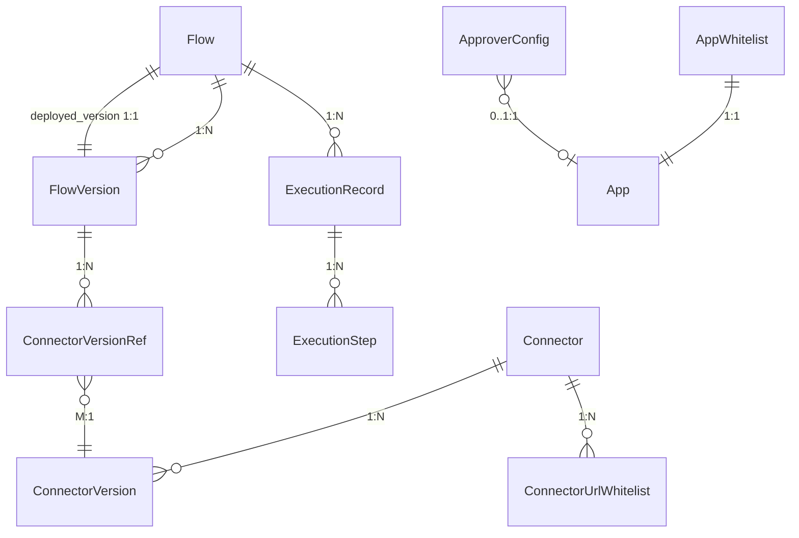

# 数据库设计：连接器平台 V2

**Feature ID**: CONN-PLAT-002  
**关联文档**: plan.md（§3 数据库变更）, plan-json-schema.md（JSON 结构权威定义）  
**版本**: v1.0  
**创建日期**: 2026-06-09  
**对齐基线**: spec.md v2.15-draft

---

## 0. 设计规范

> 💡 V2 全面沿用 V1 `plan-db.md §0` 已确立的设计规范（表前缀 `openplatform_v2_cp_`、BIGINT 雪花 ID、TINYINT 枚举、MEDIUMTEXT 存 JSON、禁用物理外键、4 审计字段等）。本章仅列出 V2 新增或变更的规范项。

### 0.1 V2 规范变更

| 规范项 | V1 | V2 |
|--------|-----|-----|
| 软删除 | MVP 不引入 | **仅 URL 白名单使用 `is_deleted`**（正则规则可能被误删后需恢复语义，其余表仍无软删除） |
| 版本模型 | 单版本（1:1） | 多版本（1:N），每 Connector/Flow 最多 1000 个版本 |
| 引用关系 | 无显式引用表 | 新增 `connector_version_ref_t` 中间表（M:N） |
| 审批 | 无 | 新增 `approver_config_t`，复用现有 `approval_flow_t` / `approval_record_t` |

---

## 1. 表清单

| # | 表名 | 变更类型 | 说明 |
|---|------|:---:|------|
| 1 | `openplatform_v2_cp_connector_t` | MODIFY | 启用 `status`；新增 `app_id` |
| 2 | `openplatform_v2_cp_connector_version_t` | MODIFY | 1:1→1:N；新增 `version_number`/`status`/`published_time`/`published_by` |
| 3 | `openplatform_v2_cp_flow_t` | MODIFY | 扩展 `lifecycle_status`；新增 `deployed_version_id`/`app_id` |
| 4 | `openplatform_v2_cp_flow_version_t` | MODIFY | 1:1→1:N；新增 `version_number`/`status`/`flow_config`/审批字段 |
| 5 | `openplatform_v2_cp_connector_version_ref_t` | **NEW** | 连接器版本引用中间表（M:N） |
| 6 | `openplatform_v2_cp_connector_url_whitelist_t` | **NEW** | URL 白名单正则规则 |
| 7 | `openplatform_v2_cp_app_whitelist_t` | **NEW** | 应用白名单准入 |
| 8 | `openplatform_v2_cp_approver_config_t` | **NEW** | 版本发布审批人配置 |
| 9 | `openplatform_v2_cp_execution_record_t` | ENABLE | 启用 V1 预留表，新增 `trigger_type`/`flow_version_id` |
| 10 | `openplatform_v2_cp_execution_step_t` | ENABLE | 启用 V1 预留表 |
| 11 | `openplatform_operate_log_t` | MODIFY | OperateEnum 扩展（复用现有操作日志表） |

**总计**：**11 张表**（4 修改 + 4 新建 + 2 启用 + 1 扩展），分属 connector / flow / security / approval / runtime 五个模块。

---

## 2. 表关系总览



| 关系 | 类型 | 实现方式 |
|------|:----:|---------|
| `connector_t` → `connector_version_t` | 1:N | `connector_version_t.connector_id` |
| `connector_t` → `url_whitelist_t` | 1:N | `url_whitelist_t.connector_id` |
| `flow_t` → `flow_version_t` | 1:N | `flow_version_t.flow_id` |
| `flow_t` → `deployed_version` | 1:0..1 | `flow_t.deployed_version_id` 指针 |
| `flow_version_t` → `connector_version_ref_t` | 1:N | 中间表 `flow_version_id` |
| `connector_version_ref_t` → `connector_version_t` | M:1 | 中间表 `connector_version_id` |
| `flow_t` → `execution_record_t` | 1:N | `execution_record_t.flow_id` |
| `execution_record_t` → `execution_step_t` | 1:N | `execution_step_t.execution_id` |

---

## 3. 核心 DDL

### 3.1 openplatform_v2_cp_connector_t（MODIFY）

```sql
ALTER TABLE openplatform_v2_cp_connector_t
    ADD COLUMN app_id BIGINT(20) NOT NULL DEFAULT 0 COMMENT '归属应用ID（0=全局）',
    MODIFY COLUMN status TINYINT(10) NOT NULL DEFAULT 1 COMMENT '状态：1=有效不可用, 2=有效可用, 3=已失效, 4=物理删除',
    ADD INDEX idx_app_status (app_id, status);
```

### 3.2 openplatform_v2_cp_connector_version_t（MODIFY）

```sql
ALTER TABLE openplatform_v2_cp_connector_version_t
    DROP INDEX uk_connector_id,
    ADD COLUMN version_number INT NOT NULL DEFAULT 1 COMMENT '版本号，实体内递增',
    ADD COLUMN status TINYINT(10) NOT NULL DEFAULT 1 COMMENT '状态：1=草稿, 2=已发布, 3=已失效, 4=物理删除',
    ADD COLUMN published_time DATETIME(3) NULL COMMENT '发布时间',
    ADD COLUMN published_by VARCHAR(100) NULL COMMENT '发布人',
    ADD INDEX idx_connector_version (connector_id, version_number),
    ADD INDEX idx_connector_status (connector_id, status);
```

### 3.3 openplatform_v2_cp_flow_t（MODIFY）

```sql
ALTER TABLE openplatform_v2_cp_flow_t
    ADD COLUMN deployed_version_id BIGINT(20) NULL COMMENT '当前部署的版本ID',
    ADD COLUMN app_id BIGINT(20) NOT NULL DEFAULT 0 COMMENT '归属应用ID',
    MODIFY COLUMN lifecycle_status TINYINT(10) NOT NULL DEFAULT 1 COMMENT '生命周期：1=待部署, 2=运行中, 3=已停止, 4=已失效, 5=物理删除',
    ADD INDEX idx_deployed_version (deployed_version_id),
    ADD INDEX idx_app_status (app_id, lifecycle_status);
```

### 3.4 openplatform_v2_cp_flow_version_t（MODIFY）

```sql
ALTER TABLE openplatform_v2_cp_flow_version_t
    DROP INDEX uk_flow_id,
    ADD COLUMN version_number INT NOT NULL DEFAULT 1 COMMENT '版本号，实体内递增',
    ADD COLUMN status TINYINT(10) NOT NULL DEFAULT 1 COMMENT '状态：1=草稿, 2=待审批, 3=已撤回, 4=已驳回, 5=已发布, 6=已失效, 7=物理删除',
    ADD COLUMN flow_config MEDIUMTEXT NULL COMMENT '流级配置JSON：超时/限流/缓存',
    ADD COLUMN submitted_time DATETIME(3) NULL COMMENT '提交审批时间',
    ADD COLUMN published_time DATETIME(3) NULL COMMENT '发布时间',
    ADD COLUMN published_by VARCHAR(100) NULL COMMENT '发布人',
    ADD INDEX idx_flow_version (flow_id, version_number),
    ADD INDEX idx_flow_status (flow_id, status);
```

### 3.5 openplatform_v2_cp_connector_version_ref_t（NEW）

```sql
CREATE TABLE openplatform_v2_cp_connector_version_ref_t (
    id BIGINT(20) NOT NULL COMMENT '雪花ID',
    flow_version_id BIGINT(20) NOT NULL COMMENT '连接流版本ID',
    connector_version_id BIGINT(20) NOT NULL COMMENT '连接器版本ID',
    node_id VARCHAR(64) NOT NULL COMMENT '编排节点ID（React Flow node id）',
    create_time DATETIME(3) NOT NULL DEFAULT CURRENT_TIMESTAMP(3),
    PRIMARY KEY (id),
    INDEX idx_flow_version (flow_version_id),
    INDEX idx_connector_version (connector_version_id),
    UNIQUE KEY uk_flow_node (flow_version_id, node_id)
) ENGINE=InnoDB DEFAULT CHARSET=utf8mb4 COMMENT='连接器版本引用中间表（M:N，编排保存时同步维护）';
```

### 3.6 openplatform_v2_cp_connector_url_whitelist_t（NEW）

```sql
CREATE TABLE openplatform_v2_cp_connector_url_whitelist_t (
    id BIGINT(20) NOT NULL COMMENT '雪花ID',
    connector_id BIGINT(20) NOT NULL COMMENT '连接器ID',
    pattern VARCHAR(512) NOT NULL COMMENT '正则表达式规则',
    description VARCHAR(256) NULL COMMENT '规则说明',
    is_deleted TINYINT(10) NOT NULL DEFAULT 0 COMMENT '逻辑删除：0=有效, 1=已删除',
    create_time DATETIME(3) NOT NULL DEFAULT CURRENT_TIMESTAMP(3),
    last_update_time DATETIME(3) NOT NULL DEFAULT CURRENT_TIMESTAMP(3) ON UPDATE CURRENT_TIMESTAMP(3),
    create_by VARCHAR(100) NOT NULL,
    last_update_by VARCHAR(100) NOT NULL,
    PRIMARY KEY (id),
    INDEX idx_connector (connector_id, is_deleted)
) ENGINE=InnoDB DEFAULT CHARSET=utf8mb4 COMMENT='连接器URL正则白名单规则';
```

### 3.7 openplatform_v2_cp_app_whitelist_t（NEW）

```sql
CREATE TABLE openplatform_v2_cp_app_whitelist_t (
    id BIGINT(20) NOT NULL COMMENT '雪花ID',
    app_id BIGINT(20) NOT NULL COMMENT '应用ID',
    create_time DATETIME(3) NOT NULL DEFAULT CURRENT_TIMESTAMP(3),
    create_by VARCHAR(100) NOT NULL COMMENT '创建人',
    PRIMARY KEY (id),
    UNIQUE KEY uk_app_id (app_id)
) ENGINE=InnoDB DEFAULT CHARSET=utf8mb4 COMMENT='连接器平台应用白名单（白名单内应用可使用连接器平台）';
```

### 3.8 openplatform_v2_cp_approver_config_t（NEW）

```sql
CREATE TABLE openplatform_v2_cp_approver_config_t (
    id BIGINT(20) NOT NULL COMMENT '雪花ID',
    level TINYINT(10) NOT NULL COMMENT '审批级别：1=应用级, 2=平台连接流级, 3=全局级',
    app_id BIGINT(20) NULL COMMENT '应用ID（仅 level=1 时使用，level=2/3 为 NULL）',
    approver_ids JSON NOT NULL COMMENT '审批人用户ID列表，JSON数组 ["uid1","uid2"]',
    create_time DATETIME(3) NOT NULL DEFAULT CURRENT_TIMESTAMP(3),
    last_update_time DATETIME(3) NOT NULL DEFAULT CURRENT_TIMESTAMP(3) ON UPDATE CURRENT_TIMESTAMP(3),
    PRIMARY KEY (id),
    UNIQUE KEY uk_level_app (level, app_id)
) ENGINE=InnoDB DEFAULT CHARSET=utf8mb4 COMMENT='连接流版本发布审批人配置';
```

### 3.9 openplatform_v2_cp_execution_record_t（ENABLE + MODIFY）

```sql
ALTER TABLE openplatform_v2_cp_execution_record_t
    ADD COLUMN trigger_type TINYINT(10) NOT NULL DEFAULT 1 COMMENT '触发方式：1=http, 2=debug',
    ADD COLUMN flow_version_id BIGINT(20) NULL COMMENT '执行的连接流版本ID',
    ADD INDEX idx_flow_trigger_time (flow_id, trigger_time),
    ADD INDEX idx_trigger_time (trigger_time);
```

---

## 4. 状态枚举定义

### 4.1 connector_t.status

| 值 | 含义 | 可执行操作 |
|:--:|------|---------|
| 1 | 有效不可用 | 编辑基本信息、读写版本、标记失效 |
| 2 | 有效可用 | 编辑基本信息、读写版本、标记失效（无流引用时） |
| 3 | 已失效 | 读版本、恢复、删除 |
| 4 | 物理删除 | —（终态） |

### 4.2 connector_version_t.status

| 值 | 含义 | 可执行操作 |
|:--:|------|---------|
| 1 | 草稿 | 查看、编辑保存、发布、删除 |
| 2 | 已发布 | 查看、复制到草稿、标记失效（无流引用时） |
| 3 | 已失效 | 查看、复制到草稿、恢复、删除 |
| 4 | 物理删除 | —（终态） |

### 4.3 flow_t.lifecycle_status

| 值 | 含义 | 可执行操作 |
|:--:|------|---------|
| 1 | 待部署 | 查看、读写版本、部署+启动、标记失效 |
| 2 | 运行中 | 查看、读写版本、部署（替换）、停止 |
| 3 | 已停止 | 查看、读写版本、启动、标记失效 |
| 4 | 已失效 | 查看、读版本、恢复、删除 |
| 5 | 物理删除 | —（终态） |

### 4.4 flow_version_t.status

| 值 | 含义 | 可执行操作 |
|:--:|------|---------|
| 1 | 草稿 | 查看、编辑保存、发布（提交审批） |
| 2 | 待审批 | 查看、撤回、审批通过/驳回、催办 |
| 3 | 已撤回 | 查看、编辑保存（→草稿） |
| 4 | 已驳回 | 查看、编辑保存（→草稿） |
| 5 | 已发布 | 查看、复制到草稿、标记失效（未部署时） |
| 6 | 已失效 | 查看、复制到草稿、恢复、删除 |
| 7 | 物理删除 | —（终态） |

### 4.5 execution_record_t.trigger_type

| 值 | 含义 |
|:--:|------|
| 1 | http（HTTP 触发） |
| 2 | debug（调试触发） |

---

## 5. V1→V2 数据迁移 SQL

```sql
-- ═══════════════════════════════════════════════════════════
-- 步骤 0：备份数据
-- 步骤 1：执行上述 DDL（ADD COLUMN 允许 NULL）
-- 步骤 2：回填数据
-- 步骤 3：加固 NOT NULL 约束
-- ═══════════════════════════════════════════════════════════

-- ========== 步骤 2：回填数据 ==========

-- 2.1 连接器版本：现有版本标记为 v1「已发布」
UPDATE openplatform_v2_cp_connector_version_t
SET version_number = 1,
    status = 2,
    published_time = COALESCE(published_time, create_time),
    published_by = COALESCE(published_by, create_by)
WHERE status IS NULL OR status = 0;

-- 2.2 连接器：根据是否已有已发布版本设置状态
UPDATE openplatform_v2_cp_connector_t c
SET status = CASE
    WHEN EXISTS (
        SELECT 1 FROM openplatform_v2_cp_connector_version_t v
        WHERE v.connector_id = c.id AND v.status = 2
    ) THEN 2
    ELSE 1
END
WHERE status IS NULL OR status NOT IN (1,2,3,4);

-- 2.3 连接流版本：现有版本标记为 v1「已发布」
UPDATE openplatform_v2_cp_flow_version_t
SET version_number = 1,
    status = 5,
    published_time = COALESCE(published_time, create_time),
    published_by = COALESCE(published_by, create_by)
WHERE status IS NULL OR status = 0;

-- 2.4 连接流：设置 deployed_version_id + 转换 lifecycle_status
UPDATE openplatform_v2_cp_flow_t f
SET deployed_version_id = (
    SELECT id FROM openplatform_v2_cp_flow_version_t v
    WHERE v.flow_id = f.id AND v.status = 5
    LIMIT 1
),
lifecycle_status = CASE
    WHEN lifecycle_status = 1 THEN 2
    WHEN lifecycle_status = 2 THEN 3
    ELSE lifecycle_status
END
WHERE lifecycle_status IN (1, 2);

-- ========== 步骤 3：加固约束 ==========
-- (在验证数据完整性后逐列执行)
-- ALTER TABLE ... MODIFY COLUMN ... NOT NULL;
```
