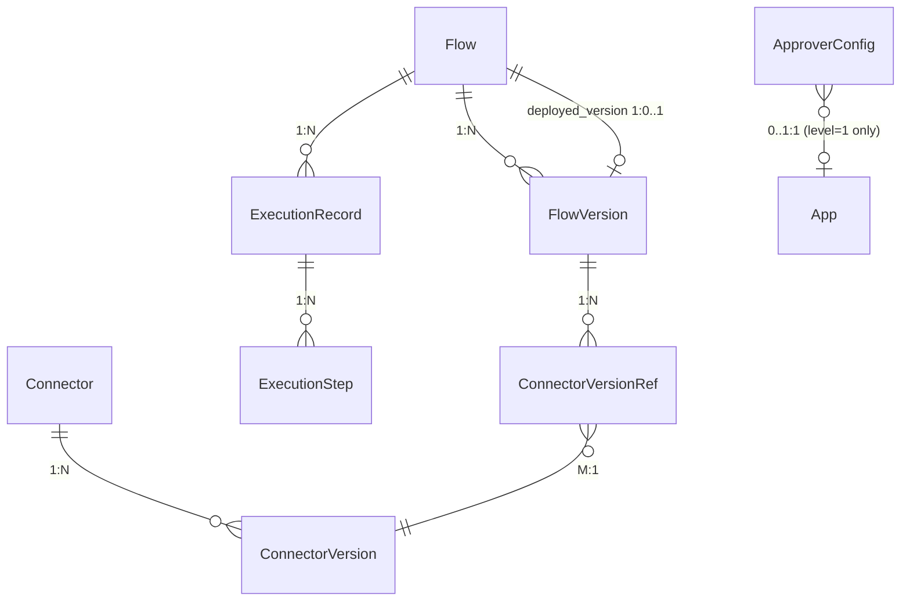

# 数据库设计：连接器平台 V2

**Feature ID**: CONN-PLAT-002
**关联文档**: plan.md（§3 数据库变更）, plan-json-schema.md（JSON 结构权威定义）
**版本**: v2.0
**创建日期**: 2026-06-09
**对齐基线**: spec.md v2.15-draft

---

## SQL 脚本输出位置

V2 DDL 脚本追加到 open-server 工程内，沿用 V1 的 FlywayDB 命名风格，但 **open-server 不新增 Flyway 依赖**，本规划也**不考虑脚本自动执行机制**。

**输出路径**：

```text
open-server/src/main/resources/db/migration/
├── V2__init_connector_platform_schema.sql   ← V1 已存在（7 张表）
└── V3__connector_platform_v2_schema.sql     ← V2 新增（4 张新表 + 8 张 ALTER）
```

约束：
- 不在 `connector-api` 中存放 DDL / migration 脚本
- 目录按 FlywayDB 默认风格统一为 `db/migration/`
- connector-api 仅通过 R2DBC 访问已初始化的开放平台共库表

---

## 0. 设计规范

> 💡 V2 全面沿用 V1 `plan-db.md §0` 已确立的设计规范，以下各子节从 V1 完整复制并标注 V2 变更项。

### 0.1 核心设计原则

| 原则 | 说明 |
|------|------|
| **表前缀** | 统一使用 `openplatform_v2_cp_`（openplatform=开放平台体系 / v2=平台第二代 / cp=connector platform 子域） |
| **表后缀** | 所有表统一 `_t` 后缀 |
| **主键** | 统一 BIGINT(20) **雪花 ID**（应用层生成），命名 `id` |
| **时间字段** | 统一 `DATETIME(3)`（毫秒精度） |
| **JSON 字段** | 统一 **TEXT/MEDIUMTEXT 存 JSON 字符串**（禁用 MySQL JSON 原生类型）；应用层 Jackson 序列化/反序列化 |
| **描述字段** | 统一 `VARCHAR(1000)` |
| **名称字段** | 中英文双语 `name_cn` / `name_en`，VARCHAR(100)，必填 |
| **物理外键** | ❌ 禁用，所有关联通过逻辑字段（`xxx_id` BIGINT）+ 应用层维护 |
| **软删除** | V1 不引入；V2 不引入（统一物理删除） |
| **审计字段** | 每表必备 `create_time` / `last_update_time` / `create_by` / `last_update_by` |
| **执行表分区** | V2 不分区；单表接近 500w 时按 `trigger_time` 月度分区 + 30 天定时清理 |
| **文件/图标字段** | 不直接存储完整 URL，统一使用 **文件 ID**（`icon_file_id`），`VARCHAR(128)`，选填 |

### 0.2 命名规范

| 规则 | 说明 | V2 示例 |
|------|------|---------|
| **完整前缀** | `openplatform_v2_cp_` | `openplatform_v2_cp_connector_t` |
| **表后缀** | 统一 `_t` | `openplatform_v2_cp_connector_url_whitelist_t` |
| **命名风格** | 小写字母 + 下划线分隔 | `connector_version_ref` / `approver_config` |
| **索引命名** | `idx_字段1_字段2` | `idx_connector_version` / `idx_app_status` |
| **唯一索引命名** | `uk_字段1_字段2` | `uk_flow_node` / `uk_level_app` |

### 0.3 主键规范

| 规则 | 说明 |
|------|------|
| **主键类型** | BIGINT(20)，**应用层生成雪花 ID**（非自增） |
| **主键命名** | 统一使用 `id` |
| **业务 ID** | ❌ 不单独维护 `varchar(32)` 业务 ID——直接用 BIGINT 雪花 `id` 对外暴露（API 响应转 string 避免 JS 精度丢失） |
| **关联字段** | 使用**逻辑外键**（存储关联 ID），**严禁物理外键约束** |

### 0.4 审计字段规范

所有业务表必须包含以下 4 个审计字段：

| 字段名 | 类型 | 说明 |
|--------|------|------|
| `create_time` | DATETIME(3) | 创建时间，默认 `CURRENT_TIMESTAMP(3)` |
| `last_update_time` | DATETIME(3) | 更新时间，默认 `CURRENT_TIMESTAMP(3) ON UPDATE CURRENT_TIMESTAMP(3)` |
| `create_by` | VARCHAR(100) | 创建人账号 |
| `last_update_by` | VARCHAR(100) | 更新人账号 |

> ⚠️ **V2 新增表注意**：`connector_version_ref_t` 为纯中间表（同步维护，无人工操作），不需要审计字段。其余新表均需完整 4 个审计字段。

### 0.5 描述字段规范

| 规则 | 说明 |
|------|------|
| **类型** | 统一 `VARCHAR(1000)`（禁用 TEXT） |
| **双语** | `description_cn` / `description_en`，均选填 |
| **理由** | 行内存储+可索引+前端预览友好 |

### 0.6 JSON 字段规范

| 规则 | 说明 |
|------|------|
| **类型** | **TEXT / MEDIUMTEXT**（根据实际大小选定），存 JSON 字符串 |
| **禁用** | ❌ MySQL JSON 原生类型 |
| **序列化** | 应用层负责（Jackson 序列化/反序列化、格式校验） |
| **查询** | ❌ 不使用 `JSON_EXTRACT` / `JSON_TABLE` 等原生函数 |
| **内部字段命名** | JSON 内部字段统一使用 **camelCase**，与 API 响应一致 |
| **本平台长度选择** | 编排/连接配置类（`orchestration_config`、`connection_config`）：**MEDIUMTEXT**（最多 16MB）；流级配置（`flow_config`）：**MEDIUMTEXT**；执行 I/O 类（`input_data`/`output_data`）：**TEXT**（最多 64KB）；审批人配置（`approver_ids`）：**JSON** 列（MySQL 原生 JSON，仅此例外——数组结构简单，适合 MySQL JSON 类型） |
| **JSON 结构定义源** | 所有 MEDIUMTEXT/TEXT 字段中存储的 JSON 对象内部结构，以 **[plan-json-schema.md](./plan-json-schema.md)** 为**权威定义** |

### 0.7 枚举字段规范

| 规则 | 说明 |
|------|------|
| **字段类型** | **TINYINT(10)**（禁用 varchar 字符串枚举） |
| **默认值** | 数字字面量 |
| **注释说明** | 在 COMMENT 中说明所有枚举值含义（数字 → 含义） |
| **示例** | `TINYINT(10) NOT NULL DEFAULT 1 COMMENT '状态：1=草稿, 2=已发布, 3=已失效, 4=物理删除'` |

**V2 枚举字段汇总**：

| 表 | 字段 | 枚举值 | 说明 |
|----|------|--------|------|
| `connector_t` | `connector_type` | 1=HTTP | 协议类型（V2 新增：2=MySQL 预留） |
| `connector_t` | `status` | 1=有效不可用, 2=有效可用, 3=已失效, 4=物理删除 | V2 启用 |
| `connector_version_t` | `status` | 1=草稿, 2=已发布, 3=已失效, 4=物理删除 | V2 启用 |
| `flow_t` | `lifecycle_status` | 1=待部署, 2=运行中, 3=已停止, 4=已失效, 5=物理删除 | V2 扩展 |
| `flow_version_t` | `status` | 1=草稿, 2=待审批, 3=已撤回, 4=已驳回, 5=已发布, 6=已失效, 7=物理删除 | V2 新增 |
| `execution_record_t` | `trigger_type` | 1=http, 2=debug | V2 启用 |
| `execution_record_t` | `status` | 0=pending, 1=running, 2=success, 3=failed, 4=timeout | V2 启用 |
| `execution_step_t` | `status` | 0=success, 1=failed | 步骤执行结果 |
| `execution_step_t` | `node_type` | 1=trigger, 2=connector, 3=data_processor, 4=exit | V2 新增 data_processor |
| `approver_config_t` | `level` | 1=应用级, 2=平台连接流级, 3=全局级 | V2 新增 |

### 0.8 V2 规范变更（相对 V1）

| 规范项 | V1 | V2 |
|--------|-----|-----|
| 软删除 | MVP 不引入 | V2 不引入（统一物理删除） |
| 版本模型 | 单版本（1:1） | 多版本（1:N），每实体最多 1000 个版本 |
| 引用关系 | 无显式引用表 | 新增 `connector_version_ref_t` 中间表（M:N） |
| 审批 | 无 | 新增 `approver_config_t`，复用现有 `approval_flow_t` / `approval_record_t` |
| 应用归属 | 无 | connector_t / flow_t 新增 `app_id`，实现应用级数据隔离 |
| 连接器状态 | 预留未用 | 启用 4 状态流转 |
| 流版本状态 | 预留未用 | 启用 7 状态流转（含审批中间状态） |

---

## 1. 表清单

| # | 表名 | 变更类型 | 归属模块 | 说明 |
|---|------|:---:|---------|------|
| 1 | `openplatform_v2_cp_connector_t` | MODIFY | connector | 启用 `status` 4状态流转；新增 `app_id` 应用归属 |
| 2 | `openplatform_v2_cp_connector_version_t` | MODIFY | connector | 1:1→1:N；新增 `version_number`/`status`/`published_time`/`published_by` |
| 3 | `openplatform_v2_cp_flow_t` | MODIFY | flow | 扩展 `lifecycle_status` 5状态；新增 `deployed_version_id`/`app_id` |
| 4 | `openplatform_v2_cp_flow_version_t` | MODIFY | flow | 1:1→1:N；新增 `version_number`/7状态`status`/`flow_config`/审批字段 |
| 5 | `openplatform_v2_cp_connector_version_ref_t` | **NEW** | flow | 连接器版本引用中间表（M:N），编排保存时同步维护 |
| 6 | `openplatform_v2_cp_approver_config_t` | **NEW** | approval | 三级审批人配置（应用级/平台级/全局级） |
| 8 | `openplatform_v2_cp_execution_record_t` | ENABLE | runtime | 启用 V1 预留表；修正枚举值 |
| 9 | `openplatform_v2_cp_execution_step_t` | ENABLE | runtime | 启用 V1 预留表；`node_type` VARCHAR→TINYINT |
| 10 | `openplatform_operate_log_t` | EXTEND | audit | OperateEnum 扩展（复用现有操作日志表，不新增表） |

**总计**：**9 张表**（4 MODIFY + 2 NEW + 2 ENABLE + 1 EXTEND）。URL 白名单规则复用现有 `openplatform_property_t` 字典表（key-value）；应用白名单复用现有 `openplatform_lookup_item_t`（classify 分组 + itemCode/itemValue 键值对）。

---

## 2. 表关系总览



| 关系 | 类型 | 实现方式 |
|------|:----:|---------|
| `connector_t` → `connector_version_t` | 1:N | `connector_version_t.connector_id` |
| `flow_t` → `flow_version_t` | 1:N | `flow_version_t.flow_id` |
| `flow_t` → `deployed_version` | 1:0..1 | `flow_t.deployed_version_id` 指针 |
| `flow_version_t` → `connector_version_ref_t` | 1:N | 中间表 `flow_version_id` |
| `connector_version_ref_t` → `connector_version_t` | M:1 | 中间表 `connector_version_id` |
| `flow_t` → `execution_record_t` | 1:N | `execution_record_t.flow_id` |
| `execution_record_t` → `execution_step_t` | 1:N | `execution_step_t.execution_id` |

> 💡 **V1→V2 关系变化**：V1 的 `flow_version_t` ⇢ `connector_version_t` 通过编排 JSON 中的 `connectorVersionId` 字段隐式引用，V2 新增 `connector_version_ref_t` 中间表显式管理，用于「标记版本失效/删除」的前置校验。

---

## 3. 表结构定义

> 💡 以下 DDL 全部遵循 §0 设计规范：BIGINT 雪花 ID 主键、TINYINT 枚举、MEDIUMTEXT 存 JSON、idx_xxx/uk_xxx 索引命名、不使用物理外键。MODIFY 表示在 V1 表基础上 ALTER；NEW 表示新 CREATE；ENABLE 表示 V1 已建表、V2 启用+追加列。

### 3.1 openplatform_v2_cp_connector_t（MODIFY）

**变更理由**：V2 引入连接器 4 状态生命周期（有效不可用/有效可用/已失效/物理删除）和应用级数据隔离。

```sql
ALTER TABLE openplatform_v2_cp_connector_t
    ADD COLUMN app_id BIGINT(20) NOT NULL DEFAULT 0 COMMENT '归属应用ID（0=全局，迁移前数据默认0）',
    MODIFY COLUMN status TINYINT(10) NOT NULL DEFAULT 1 COMMENT '状态：1=有效不可用（无已发布版本）, 2=有效可用（有已发布版本）, 3=已失效, 4=物理删除',
    ADD INDEX idx_app_status (app_id, status);
```

| 列 | 类型 | 变更 | 说明 |
|----|------|:--:|------|
| `app_id` | BIGINT(20) | NEW | 归属应用 ID，实现 G13 应用数据隔离 |
| `status` | TINYINT(10) | MODIFY | V1 预留未用 → V2 启用 4 状态（与 connector_version 的发布/失效联动） |

### 3.2 openplatform_v2_cp_connector_version_t（MODIFY）

**变更理由**：V1 单版本模型（1:1，`uk_connector_id` 唯一约束）→ V2 多版本模型（1:N），需要移除唯一约束并新增版本号、状态、发布时间字段。

```sql
ALTER TABLE openplatform_v2_cp_connector_version_t
    DROP INDEX uk_connector_id,
    ADD COLUMN version_number INT NOT NULL DEFAULT 1 COMMENT '版本号，实体内从1递增',
    ADD COLUMN status TINYINT(10) NOT NULL DEFAULT 1 COMMENT '状态：1=草稿, 2=已发布, 3=已失效, 4=物理删除',
    ADD COLUMN published_time DATETIME(3) NULL COMMENT '发布时间（首次发布时填充）',
    ADD COLUMN published_by VARCHAR(100) NULL COMMENT '发布人账号',
    ADD INDEX idx_connector_version (connector_id, version_number),
    ADD INDEX idx_connector_status (connector_id, status);
```

| 列 | 类型 | 变更 | 说明 |
|----|------|:--:|------|
| `version_number` | INT | NEW | 版本号，实体内递增（ADR-004），发布时沿用 |
| `status` | TINYINT(10) | NEW | 4 状态：草稿→已发布→已失效→物理删除 |
| `published_time` | DATETIME(3) | NEW | 首次发布时填充，版本恢复后不更新 |
| `published_by` | VARCHAR(100) | NEW | 发布人，恢复后不更新 |
| `uk_connector_id` | — | DROP | 移除 1:1 约束，允许多版本 |

### 3.3 openplatform_v2_cp_flow_t（MODIFY）

**变更理由**：V2 引入连接流 5 状态生命周期（待部署→运行中→已停止→已失效→物理删除）、部署版本指针、应用归属。

```sql
ALTER TABLE openplatform_v2_cp_flow_t
    ADD COLUMN deployed_version_id BIGINT(20) NULL COMMENT '当前部署的版本ID（运行时按此指针读取编排快照）',
    ADD COLUMN app_id BIGINT(20) NOT NULL DEFAULT 0 COMMENT '归属应用ID',
    MODIFY COLUMN lifecycle_status TINYINT(10) NOT NULL DEFAULT 1 COMMENT '生命周期：1=待部署, 2=运行中, 3=已停止, 4=已失效, 5=物理删除',
    ADD INDEX idx_deployed_version (deployed_version_id),
    ADD INDEX idx_app_status (app_id, lifecycle_status);
```

| 列 | 类型 | 变更 | 说明 |
|----|------|:--:|------|
| `deployed_version_id` | BIGINT(20) | NEW | 指向当前部署的 FlowVersion.id，运行时读取入口 |
| `app_id` | BIGINT(20) | NEW | 归属应用 ID，实现 G13 应用数据隔离 |
| `lifecycle_status` | TINYINT(10) | MODIFY | V1: 1=running, 2=stopped → V2: 5 状态 |

### 3.4 openplatform_v2_cp_flow_version_t（MODIFY）

**变更理由**：V1 单版本模型 → V2 多版本模型，新增 7 状态生命周期（含审批中间状态）、流级配置 JSON、审批时间字段。

```sql
ALTER TABLE openplatform_v2_cp_flow_version_t
    DROP INDEX uk_flow_id,
    ADD COLUMN version_number INT NOT NULL DEFAULT 1 COMMENT '版本号，实体内从1递增',
    ADD COLUMN status TINYINT(10) NOT NULL DEFAULT 1 COMMENT '状态：1=草稿, 2=待审批, 3=已撤回, 4=已驳回, 5=已发布, 6=已失效, 7=物理删除',
    ADD COLUMN flow_config MEDIUMTEXT NULL COMMENT '流级配置JSON：超时(perNode/global)/限流(mode/value)/缓存(enabled/keyTemplate/ttl)',
    ADD COLUMN submitted_time DATETIME(3) NULL COMMENT '提交审批时间',
    ADD COLUMN published_time DATETIME(3) NULL COMMENT '发布时间（审批通过时填充）',
    ADD COLUMN published_by VARCHAR(100) NULL COMMENT '发布人账号',
    ADD INDEX idx_flow_version (flow_id, version_number),
    ADD INDEX idx_flow_status (flow_id, status);
```

| 列 | 类型 | 变更 | 说明 |
|----|------|:--:|------|
| `version_number` | INT | NEW | 版本号，实体内递增 |
| `status` | TINYINT(10) | NEW | 7 状态（含审批中间态：待审批/已撤回/已驳回） |
| `flow_config` | MEDIUMTEXT | NEW | 流级配置 JSON，结构见 plan-json-schema.md |
| `submitted_time` | DATETIME(3) | NEW | 提交审批时填充 |
| `published_time` | DATETIME(3) | NEW | 审批通过时填充 |
| `published_by` | VARCHAR(100) | NEW | 审批通过时的操作人 |
| `uk_flow_id` | — | DROP | 移除 1:1 约束 |

### 3.5 openplatform_v2_cp_connector_version_ref_t（NEW）

**建表理由**：编排中 connector 节点引用特定 ConnectorVersion，需要显式管理引用关系以支持「标记版本失效/删除」的前置「被引用」校验（ADR-007）。编排保存时同步写入，编排删除时级联清理。

```sql
CREATE TABLE openplatform_v2_cp_connector_version_ref_t (
    id BIGINT(20) NOT NULL COMMENT '雪花ID',
    flow_version_id BIGINT(20) NOT NULL COMMENT '连接流版本ID',
    connector_version_id BIGINT(20) NOT NULL COMMENT '连接器版本ID',
    node_id VARCHAR(64) NOT NULL COMMENT '编排节点ID（React Flow node id，用于错误提示定位具体节点）',
    create_time DATETIME(3) NOT NULL DEFAULT CURRENT_TIMESTAMP(3) COMMENT '创建时间',
    PRIMARY KEY (id),
    INDEX idx_flow_version (flow_version_id) COMMENT '按流版本查询其全部引用',
    INDEX idx_connector_version (connector_version_id) COMMENT '按连接器版本查询被哪些流引用',
    UNIQUE KEY uk_flow_node (flow_version_id, node_id) COMMENT '同一流版本的同一节点唯一引用'
) ENGINE=InnoDB DEFAULT CHARSET=utf8mb4 COMMENT='连接器版本引用中间表（M:N，编排保存时同步维护，不含审计字段——纯中间表，无人工操作）';
```

| 列 | 类型 | 说明 |
|----|------|------|
| `flow_version_id` | BIGINT(20) | 引用的连接流版本 ID |
| `connector_version_id` | BIGINT(20) | 被引用的连接器版本 ID |
| `node_id` | VARCHAR(64) | 编排画布中的节点 ID，用于错误提示定位 |

> ⚠️ **不含审计字段**：此表为纯中间表，由编排保存/删除时自动同步维护，无人工操作入口，故不需要 `create_by`/`last_update_by`。

### 3.6 openplatform_v2_cp_approver_config_t（NEW）

**建表理由**：FR-032 要求平台管理员配置连接流版本发布的三级审批人，审批人可配置多人（任一审批即通过）。`level=1` 按应用独立配置。

```sql
CREATE TABLE openplatform_v2_cp_approver_config_t (
    id BIGINT(20) NOT NULL COMMENT '雪花ID',
    level TINYINT(10) NOT NULL COMMENT '审批级别：1=应用级, 2=平台连接流级, 3=全局级',
    app_id BIGINT(20) NULL COMMENT '应用ID（仅 level=1 时使用，level=2/3 为 NULL）',
    approver_ids JSON NOT NULL COMMENT '审批人用户ID列表，JSON数组 ["uid1","uid2"]（多人中任一审批通过即视为该级通过）',
    create_time DATETIME(3) NOT NULL DEFAULT CURRENT_TIMESTAMP(3) COMMENT '创建时间',
    last_update_time DATETIME(3) NOT NULL DEFAULT CURRENT_TIMESTAMP(3) ON UPDATE CURRENT_TIMESTAMP(3) COMMENT '更新时间',
    PRIMARY KEY (id),
    UNIQUE KEY uk_level_app (level, app_id) COMMENT '同一级别+应用唯一（level=2/3 时 app_id 为 NULL）'
) ENGINE=InnoDB DEFAULT CHARSET=utf8mb4 COMMENT='连接流版本发布审批人配置';
```

| 列 | 类型 | 说明 |
|----|------|------|
| `level` | TINYINT(10) | 1=应用级（按应用独立配置），2=平台级（全局唯一），3=全局级（全局唯一） |
| `app_id` | BIGINT(20) | 仅 level=1 时填充；level=2/3 为 NULL，唯一约束自动处理多 NULL |
| `approver_ids` | JSON | MySQL 原生 JSON 类型（仅此例外——数组结构简单，不需要 TEXT） |

### 3.7 openplatform_v2_cp_execution_record_t（ENABLE + MODIFY）

**启用理由**：V1 预留表结构完整，V2 启用写入。新增列支持调试触发方式标记和版本追溯。

```sql
ALTER TABLE openplatform_v2_cp_execution_record_t
    ADD COLUMN trigger_type TINYINT(10) NOT NULL DEFAULT 1 COMMENT '触发方式：1=http（HTTP触发）, 2=debug（调试触发）',
    ADD COLUMN flow_version_id BIGINT(20) NULL COMMENT '执行的连接流版本ID（用于追溯执行时使用的版本快照）',
    ADD INDEX idx_flow_trigger_time (flow_id, trigger_time) COMMENT '按连接流+时间范围查询运行记录',
    ADD INDEX idx_trigger_time (trigger_time) COMMENT '定时清理时按时间范围扫描';
```

| 列 | 类型 | 说明 |
|----|------|------|
| `trigger_type` | TINYINT(10) | 区分 HTTP 触发(1) 和调试触发(2) |
| `flow_version_id` | BIGINT(20) | 追溯执行时的版本快照，用于审计和分析 |

### 3.8 openplatform_v2_cp_execution_step_t（ENABLE）

**启用理由**：V1 预留表结构完整（含 `input_data`/`output_data` JSON 列 + `storage_blob_ref_t` 外置支持），V2 直接启用，无需 DDL 变更。V2 新增 `node_type=3 (data_processor)` 枚举值。

---

## 4. 状态枚举定义

> 💡 对外 API 返回的枚举值统一为 TINYINT 数字，与数据库存储一致。对应操作矩阵见 spec.md §1.7。

### 4.1 connector_t.status

| 值 | 含义 | 触发条件 | 可执行操作 |
|:--:|------|---------|---------|
| 1 | 有效不可用 | 创建连接器 / 最后一个已发布版本被失效 | 编辑基本信息、读写版本、标记失效 |
| 2 | 有效可用 | 首次发布版本 / 恢复时有已发布版本 | 编辑基本信息、读写版本、标记失效（无流引用时） |
| 3 | 已失效 | 管理员标记失效 | 读版本、恢复、删除 |
| 4 | 物理删除 | 删除操作 | —（终态，不可逆） |

### 4.2 connector_version_t.status

| 值 | 含义 | 触发条件 | 可执行操作 |
|:--:|------|---------|---------|
| 1 | 草稿 | 创建连接器 / 复制到草稿 | 查看、编辑保存、发布（非空配置） |
| 2 | 已发布 | 发布草稿 | 查看、复制到草稿、标记失效（无流引用时） |
| 3 | 已失效 | 标记失效 | 查看、复制到草稿、恢复、删除 |
| 4 | 物理删除 | 删除操作 | —（终态） |

### 4.3 flow_t.lifecycle_status

| 值 | 含义 | 触发条件 | 可执行操作 |
|:--:|------|---------|---------|
| 1 | 待部署 | 创建连接流 / 复制连接流 / 恢复时无部署版本 | 查看、读写版本、部署+启动、标记失效 |
| 2 | 运行中 | 部署+启动 / 启动 | 查看、读写版本、部署（替换运行版本）、停止 |
| 3 | 已停止 | 停止 / 恢复（通用安全中间态） | 查看、读写版本、启动、标记失效 |
| 4 | 已失效 | 标记失效 | 查看、读版本、恢复、删除 |
| 5 | 物理删除 | 删除操作 | —（终态） |

### 4.4 flow_version_t.status

| 值 | 含义 | 触发条件 | 可执行操作 |
|:--:|------|---------|---------|
| 1 | 草稿 | 创建连接流 / 复制到草稿 / 已撤回-编辑 / 已驳回-编辑 | 查看、编辑保存、提交审批 |
| 2 | 待审批 | 提交审批 | 查看、撤回、审批通过/驳回、催办 |
| 3 | 已撤回 | 提交人撤回 | 查看、编辑保存（→草稿） |
| 4 | 已驳回 | 审批人驳回 | 查看、编辑保存（→草稿） |
| 5 | 已发布 | 审批通过 | 查看、复制到草稿、标记失效（未部署时） |
| 6 | 已失效 | 标记失效 | 查看、复制到草稿、恢复、删除 |
| 7 | 物理删除 | 删除操作 | —（终态） |

### 4.5 execution_record_t.trigger_type

| 值 | 含义 | 说明 |
|:--:|------|------|
| 1 | http | HTTP 触发，计入正常运行指标 |
| 2 | debug | 调试触发，不计入正常运行指标 |

### 4.6 execution_record_t.status

| 值 | 含义 | 说明 |
|:--:|------|------|
| 0 | pending | 瞬时状态，记录刚创建 |
| 1 | running | 瞬时状态，执行中 |
| 2 | success | 所有节点执行成功 |
| 3 | failed | 某节点执行失败 |
| 4 | timeout | 执行超过全流超时配置，强制终止 |

### 4.7 execution_step_t.node_type

| 值 | 含义 | 说明 |
|:--:|------|------|
| 1 | trigger | 触发器节点 |
| 2 | connector | 连接器节点 |
| 3 | data_processor | 数据处理节点（V2 新增） |
| 4 | exit | 出口节点 |

---

## 5. 数据初始化说明

V1 为内部验证 MVP，无真实用户数据，V2 **不执行数据迁移**：

- 已存在的 V1 表（connector_t / connector_version_t / flow_t / flow_version_t）：通过 §3 的 `ALTER TABLE` 变更
- V2 新建表（connector_version_ref_t / approver_config_t）：通过 `CREATE TABLE` 新建
- V1 预留表（execution_record_t / execution_step_t）：表结构已存在，通过 §3 的 `ALTER TABLE` 修正
- 初始数据（审批流模板、默认审批人等）：通过独立 SQL 脚本灌入，不在本文档范围

> 💡 无需编写 V1→V2 数据回填 SQL，也无需备份 V1 数据。

---

## 6. 数据归档与清理策略

### 6.1 执行记录清理

V2 启用 `execution_record_t` / `execution_step_t` 写入，需配套清理策略（ADR-006）。

| 策略项 | 说明 |
|--------|------|
| 保留周期 | **30 天**（可配置） |
| 清理方式 | 定时任务，每天凌晨 03:00 执行 |
| 清理范围 | `trigger_time < NOW() - INTERVAL 30 DAY` 的全部记录 |
| 分批删除 | 每批 1000 条，避免长事务锁表 |
| 关联清理 | 先删 `execution_step_t`（子表），再删 `execution_record_t`（主表） |

### 6.2 执行表分区策略

| 策略项 | 说明 |
|--------|------|
| V2 初期 | 不分区（单表数据量可控） |
| 分区触发条件 | 单表接近 **500 万行**时 |
| 分区方式 | 按 `trigger_time` **月度 RANGE 分区** |
| 冷归档 | 超过 30 天的分区可直接 DROP（与定时清理策略一致） |

### 6.3 版本表容量监控

| 策略项 | 说明 |
|--------|------|
| 版本上限 | 每实体（Connector/Flow）最多 **1000 个版本** |
| 告警阈值 | 版本数超过 **800** 时，管理端告警提示 |
| 上限处理 | 「复制到草稿」操作前校验，达上限禁止操作 |

---

## 7. ID 与版本号规则

### 7.1 主键 ID 规则

| 规则 | 说明 |
|------|------|
| **生成方式** | 应用层生成**雪花 ID**（Snowflake），非数据库自增 |
| **类型** | BIGINT(20) |
| **对外暴露** | API 响应转 **string**（避免 JS Number 精度丢失） |
| **唯一性保证** | 雪花算法保证全集群唯一，不依赖数据库 |

### 7.2 版本号规则

| 规则 | 说明 |
|------|------|
| **生成方式** | 每个 Connector/Flow 实体内独立递增，从 **1** 开始 |
| **分配时机** | 创建实体（自动生成 v1 草稿）/ 复制到草稿时分配 |
| **发布行为** | 发布时**沿用**草稿时的版本号，不重新分配 |
| **上限** | 最大 1000（INT 足够） |
| **存储列** | `version_number INT`（非 `varchar`） |

### 7.3 节点/连线内部 ID 规则

编排 JSON 中的 `node.id` 和 `edge.id` 使用 **React Flow 内部格式**（uuid 风格字符串），由前端生成，后端透传存储：

```
node.id: "node_trigger" / "node_1" / "node_exit"  — 前端生成
edge.id: "e1" / "e2" / "reactflow__edge-xxx"      — React Flow 生成
```

这些 ID 不在数据库中独立建表存储，仅作为 JSON 内嵌字段存在。

---

## 附录 A：修订记录

| 版本 | 日期 | 修订内容 | 修订人 |
|------|------|---------|--------|
| v1.0 | 2026-06-09 | 初始版本 — 对齐 spec.md v2.15，11 张表 DDL + 迁移 SQL | SDDU Plan Agent |
| v2.0 | 2026-06-09 | **全面对齐 V1 plan-db.md 结构**：① 新增 SQL 脚本输出位置；② §0 扩为 7 子节完整设计规范；③ §3 每表补充列级注释 + 字段理由 + 索引理由；④ §3.10 补充 execution_step_t 说明；⑤ 新增 §6 数据归档与清理策略（从 ADR-006 迁入）；⑥ 新增 §7 ID 与版本号规则；⑦ 新增附录 A/B | SDDU Plan Agent |

## 附录 B：V1→V2 表结构继承关系

| V2 表 | 继承自 | 继承方式 |
|-------|--------|---------|
| `connector_t` | V1 同名表 | ALTER：新增 `app_id` + 修改 `status` |
| `connector_version_t` | V1 同名表 | ALTER：移除唯一约束 + 新增版本号/状态列 |
| `flow_t` | V1 同名表 | ALTER：新增 `deployed_version_id`/`app_id` + 修改 `lifecycle_status` |
| `flow_version_t` | V1 同名表 | ALTER：移除唯一约束 + 新增版本号/7状态/flow_config/审批列 |
| `connector_version_ref_t` | — | **V2 全新建表** |
| `approver_config_t` | — | **V2 全新建表** |
| `execution_record_t` | V1 预留表 | ENABLE：新增 `trigger_type`/`flow_version_id`，其余列沿用 |
| `execution_step_t` | V1 预留表 | ENABLE：无 DDL 变更，V2 新增 node_type=3 |
| `storage_blob_ref_t` | V1 预留表 | V2 暂不启用 |
