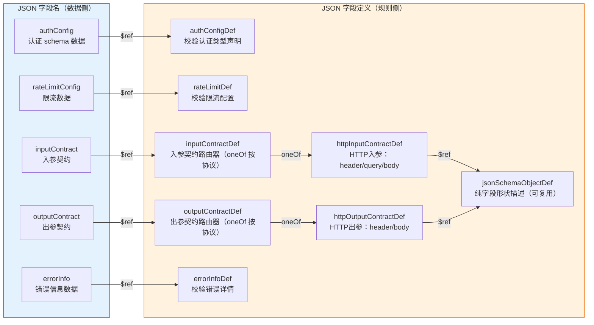
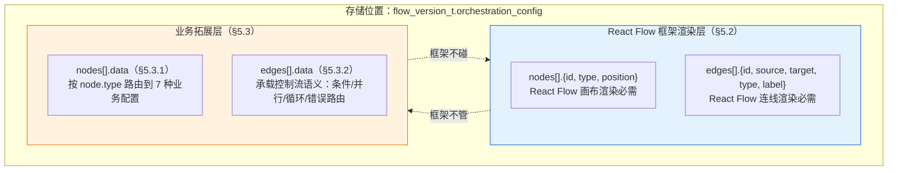
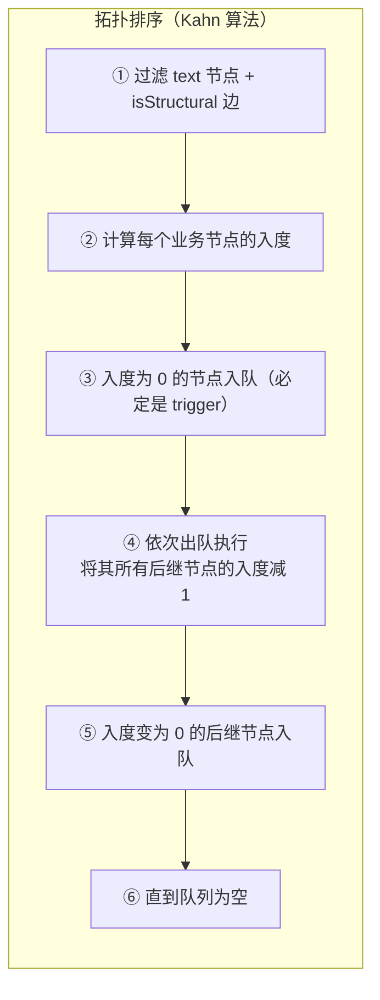

# JSON Schema 设计规范：连接器平台 V2

**关联文档**: plan.md, plan-db.md (§3 表结构定义), plan-api.md (§3 接口详细定义)  
**版本**: v7.0
**创建日期**: 2026-05-22  
**最后更新**: 2026-06-10
**修订说明**: v7.0 — V2 全量对齐重写：① node.type 按 React Flow 注册组件名扩展至 9 种（含结构节点 + text 标记）；② nodeDataDef oneOf 扩展至 7 分支；③ 新增 structureNodeDataDef / textMarkerDataDef；④ edge.data 承载完整控制流语义（businessType 扩展 + connectionMode + isStructural）；⑤ DAG 拓扑约束全面重设计，移除 MVP 线性限制；⑥ §12 合并入 §5.3.2

---

## 1. 设计哲学

### 1.1 设计目标

| 目标 | 说明 |
|------|------|
| **自描述** | Schema 本身说清字段含义、类型、约束，不散落在代码注释中 |
| **一致性** | 同一语义的字段在不同上下文中命名统一 |
| **可扩展** | 可新增字段，不破坏已有结构 |
| **无冗余** | 不用的字段不出现在 Schema 中 |

### 1.2 参考标准

| 标准 | 参考程度 | 说明 |
|------|---------|------|
| JSON Schema (draft-07) | 核心 | `type` / `properties` / `required` / `description` / `definitions` / `oneOf` / `allOf` / `if`-`then` 等元字段直接复用 |
| OpenAPI 3.0 components/schemas | 结构 | 可复用组件（authConfig / rateLimitConfig）+ 按场景组合的思想 |

### 1.3 核心原则

```
原则一：同一事物同一个名
  authConfig → 触发器和连接器用同一结构
  rateLimitConfig      → 入站和出站限流用同一结构
  inputContract    → 触发器和连接器统一命名

原则二：不用的字段不出现
  trigger 不需要 protocolConfig（HTTP 端点固定）
  trigger 不需要 timeoutMs（引擎统一控制）
  trigger 不需要 outputContract（由编排 exit 节点定义）

原则三：DAG（有向无环图）的边也是数据，需要语义
  edge 不仅是"谁连到谁"，还承载执行条件（condition）/
  错误路由（error）/ 优先级 / 并行标记（connectionMode）
  MVP 仅用 default 边，V2 扩展 condition / error / always / loop_entry / loop_exit

原则四：框架/业务字段严格分离
  node.id / node.type / node.position → React Flow 框架字段
  node.data 内的一切 → 业务字段
  edge.source / edge.target / edge.type(渲染) → React Flow 框架字段
  edge.data 内的一切 → 业务字段
```

### 1.4 节点间传值映射

#### 1.4.1 问题背景

DAG 中节点按拓扑顺序执行，上游节点的输出数据需要传递给下游节点使用。但每个节点所需的数据维度不同：

| 节点类型 | 需要什么数据 | 数据从哪来 |
|----------|-------------|-----------|
| **connector** | 连接器的 inputContract 声明的入参（HTTP 场景：header / query / body 各段字段） | 上游节点的输出（trigger 请求体、前一个 connector 的响应体等） |
| **data_processor** | 需要转换的字段及目标路径 | 上游节点的输出 |
| **exit** | 对外返回的字段（HTTP 场景：响应头 / 响应体） | 上游节点的输出 |

**核心问题**：编排设计时，用户需要显式声明「这个连接器需要的 `receiver` 字段，值取自上一步 trigger 的 `sender` 字段」。如果映射结构过于扁平，引擎运行时无法判断一个字段值应该放到 HTTP 请求的 header、query 还是 body 中。

#### 1.4.2 统一映射模型

所有节点的字段映射遵循同一个逻辑模型。该模型基于 **JSON 节点上下文对象**（JSON Node Context Object），区分 **设计态** 和 **运行态** 两个层次：

| | 设计态（Design-time） | 运行态（Runtime） |
|------|-------------------|---------------|
| **是什么** | 节点上下文对象的 **Schema 定义**——声明该节点有哪些输入/输出字段、每个字段的类型、是否必填等 | 引擎在运行时根据设计态定义构造出的 **实际 JSON 对象**，填充了真实的执行数据 |
| **谁来定义** | connector 的 inputContract/outputContract、trigger 的 inputContract、exit 的 outputMapping 声明 | 引擎在节点执行时自动构造 |
| **示例** | `{ type: "object", properties: { sender: { type: "string", required: true } } }` | `{ sender: "u001", content: "你好" }` |

> **设计态定义 → 运行态构造**：编排配置中存储的是设计态定义（字段名 + 类型 + 约束），引擎运行时根据这些定义构造出实际的 JSON 节点上下文对象，再将上游上下文字段按 mapping 映射到当前节点的 input 中。

```
┌─────────────────────────────────────────────────────────────────────────┐
│                      设计态定义 → 运行态构造                               │
│                                                                         │
│   设计态（编排配置中存储）                    运行态（引擎执行时构造）         │
│  ┌─────────────────────────┐              ┌─────────────────────────┐   │
│  │ trigger.inputContract   │              │ trigger.context         │   │
│  │ {                       │    构造      │ {                       │   │
│  │   header: {             │  ────────▶   │   input: {              │   │
│  │     type: "object",     │              │     sender: "u001",     │   │
│  │     properties: {       │              │     content: "你好"      │   │
│  │       sender: {         │              │   },                    │   │
│  │         type: "string", │              │   output: { ... }       │   │
│  │         required: true  │              │ }                       │   │
│  │       }                 │              └─────────────────────────┘   │
│  │     }                   │                                            │
│  │   }                     │              ┌─────────────────────────┐   │
│  │ }                       │              │ connector.context        │   │
│  └─────────────────────────┘    构造      │ {                       │   │
│                               ────────▶  │   input: {              │   │
│  ┌─────────────────────────┐              │     receiver: "u001",   │   │
│  │ connector.inputContract │              │     content: "你好"      │   │
│  │ {                       │              │   },                    │   │
│  │   body: {               │              │   output: {             │   │
│  │     properties: {       │              │     msgId: "m001"       │   │
│  │       receiver: {...},  │              │   }                     │   │
│  │       content:  {...}   │              │ }                       │   │
│  │     }                   │              └─────────────────────────┘   │
│  │   }                     │                                            │
│  │ }                       │                                            │
│  └─────────────────────────┘                                            │
└─────────────────────────────────────────────────────────────────────────┘
```

**表达式语法** — 引用上游节点 JSON 上下文对象中的字段，遵循 JSON Path 层级风格：

| 表达式 | 含义 | 示例 |
|--------|------|------|
| `${$.node.{nodeId}.{input/output}.xxx.yyy}` | 引用某节点的 JSON 上下文对象中指定路径的值 | `${$.node.trigger.input.sender}`、`${$.node.node_1.output.result.msgId}` |
| `${$.system.xxx.yyy}` | 引用系统级上下文（环境变量、全局常量等，V2） | `${$.system.env.region}`（V2） |
| `${$.constant:value}` | 固定字面值，不依赖上下文 | `${$.constant:0}`、`${$.constant:success}` |

> 💡 表达式层级：`$.` = 根 → `node`/`system` = 作用域 → `{nodeId}` = 节点标识 → `input`/`output` = 上下文分区 → `xxx.yyy` = 字段路径。

#### 1.4.3 设计原则

1. **映射结构镜像需求结构**：映射的结构由「被映射方」的需求结构决定——connector 的 inputContract 分 header/query/body，则 inputMapping 也分 header/query/body；exit 的 outputContract 分 header/body，则 outputMapping 也分 header/body

2. **Schema 不硬编码协议**：JSON Schema 层面将 inputMapping / outputMapping 定义为 `"type": "object"`（不做 additionalProperties 限制），具体的分段结构（header/query/body）由应用层根据连接器的协议类型动态校验。这样 REDIS、MySQL 等未来协议可直接扩展各自的映射结构，无需改 Schema

3. **表达式体系统一**：所有节点的映射值使用相同的 JSON Path 表达式语法（`${$.node.{nodeId}.{input/output}.xxx.yyy}` / `${$.constant:xxx}`），不因节点类型而异

4. **必填检查在应用层**：mapping 中的字段是否覆盖了 inputContract 中声明的 required 字段，由应用层在保存/发布时校验，JSON Schema 不做跨对象约束

---

## 2. 统一字段命名规则

| 上下文 | 规则 | 示例 |
|--------|------|------|
| JSON 内部所有键名 | camelCase | `nameCn` / `authConfig` / `connectorVersionId` |
| 引用外部资源 ID | `*Id` 后缀 + string 类型 | `connectorVersionId: "1234567890"` |
| 时间字段 | `*Time` 后缀 | `createTime` / `publishedTime` |
| 布尔字段 | `is*` 前缀 | `isDeleted` / `isTest` |
| 扩展字段（V1） | `x_*` 前缀 | `x_customMetadata` |
| **数据库列级枚举** | **TINYINT 数字**（plan-db.md §0.7 规范） | `connector_type=1`, `lifecycle_status=2` |
| **JSON 内嵌枚举** | **UPPER_SNAKE_CASE 字符串**（例外，见 §2.1） | `"SOA"` / `"APIG"` / `"SYSTOKEN"` / `"AKSK"` / `"NONE"` |
| **React Flow node.type** | **snake_case**（React Flow 注册组件名，全小写下划线） | `trigger` / `connector` / `loop_v2` / `condition_branch` |
| **React Flow 框架字段** | **遵循 React Flow 官方命名** | `source`/`target`（非 sourceNodeId/targetNodeId） |

### 2.1 JSON 内嵌枚举使用字符串的例外说明

> **设计决策**：`authConfig.type` 作为存储在 `MEDIUMTEXT` JSON 字段内的嵌套值，使用**字符串枚举**而非 TINYINT 数字。这与 `plan-db.md` §0.7「所有枚举字段统一 TINYINT(10)」规则表面冲突，但属于**有意为之的例外**：
>
> | 维度 | 数据库列级枚举 | JSON 内嵌枚举 |
> |------|--------------|-------------|
> | **字段位置** | MySQL 列（如 `connector_type tinyint`） | MEDIUMTEXT 列的 JSON 子字段 |
> | **枚举表示** | TINYINT 数字 | 字符串（`"SOA"` / `"AKSK"` 等） |
> | **设计理由** | 存储效率 + 索引效率 | 人类可读：前端属性面板直接展示；跨语言 debugging 无需查字典；版本快照 self-describing |
> | **ORM 映射** | MyBatis/R2DBC 直接映射 int | Jackson 序列化/反序列化字符串 → Java enum |
> | **规范适用** | plan-db.md §0.7 | 本文档 §2（本节） |
>
> 枚举值对应关系（JSON 字符串 ⇄ DB TINYINT，应用层映射）：
>
> | JSON 字符串 | TINYINT 代码 | 使用上下文 |
> |------------|:-----------:|-----------|
> | `SOA` | 1 | 连接器认证 |
> | `APIG` | 2 | 连接器认证 |
> | `NONE` | 4 | 连接器认证 |
> | `AKSK` | 5 | 连接器认证 |
> | `SYSTOKEN` | 7 | 触发器认证 |

---

## 3. 共享 Schema 组件定义

> 以下 §4（连接器配置）和 §5（连接流编排配置）均引用本章定义的共享组件。

### 3.1 设计思路

💡 所有 `$ref` 引用的共享组件在此聚合。以下 §4 节中的各上下文 Schema 通过 `#/definitions/xxx` 引用这些组件，保证 `$ref` 路径可解析。

#### §3.1.1 JSON 字段 ↔ 定义映射

为避免「JSON 字段与 JSON 字段定义同名」的歧义，本规范区分两者：
- **JSON 字段（field name）**：JSON 数据中的属性键，描述「存什么数据」（如 `authConfig`、`rateLimitConfig`）
- **JSON 字段定义（definition key）**：JSON 定义中的组件键名，描述「用什么规则校验」（如 `authConfigDef`、`rateLimitDef`）



### 3.2 完整组件 Schema

```json
{
  "$schema": "http://json-schema.org/draft-07/schema#",
  "$id": "urn:openapp:schema:definitions:v7",
  "title": "共享 Schema 组件聚合",
  "description": "所有上下文 Schema 共用的组件定义。v7：V2 对齐——nodeDataDef 扩展至 7 分支（含结构节点 + text 标记），新增 structureNodeDataDef / textMarkerDataDef",

  "definitions": {

    "authConfigDef": {
      "$id": "urn:openapp:schema:authConfigDef:v1",
      "title": "authConfigDef",
      "description": "认证类型声明。校验 JSON 字段 authConfig 的数据结构，声明调用方需携带的认证凭证。type 使用字符串枚举（见 §2.1 例外说明）",
      "type": "object",
      "additionalProperties": false,
      "properties": {
        "type": {
          "type": "string",
          "description": "认证类型枚举（JSON 内嵌字段用字符串，非 TINYINT；参见 §2.1）",
          "enum": ["SOA", "APIG", "SYSTOKEN", "AKSK", "NONE"]
        },
        "fields": {
          "type": "array",
          "description": "凭证字段列表，每个元素定义一个凭证字段的完整信息",
          "items": {
            "type": "object",
            "additionalProperties": false,
            "properties": {
              "name": { "type": "string", "description": "字段名，程序内部标识" },
              "carrier": { "type": "string", "description": "传递位置", "enum": ["header", "query"] },
              "fieldName": { "type": "string", "description": "实际携带时的字段名，如 Authorization / X-Sys-Token" },
              "required": { "type": "boolean", "default": true },
              "sensitive": { "type": "boolean", "default": false, "description": "运行时脱敏" }
            },
            "required": ["name", "carrier", "fieldName"]
          }
        }
      },
      "required": ["type"]
    },

    "rateLimitDef": {
      "$id": "urn:openapp:schema:rateLimitDef:v1",
      "title": "rateLimitDef",
      "description": "限流配置。校验 JSON 字段 rateLimitConfig 的数据结构，触发器和连接器复用同一类型",
      "type": "object",
      "additionalProperties": false,
      "properties": {
        "maxQps": {
          "type": "integer",
          "description": "每秒最大请求数（1-10000）",
          "minimum": 1,
          "maximum": 10000
        },
        "maxConcurrency": {
          "type": "integer",
          "description": "最大并发数（1-1000）",
          "minimum": 1,
          "maximum": 1000
        }
      }
    },

    "mappedFieldDef": {
      "$id": "urn:openapp:schema:mappedFieldDef:v1",
      "title": "mappedFieldDef",
      "description": "带映射值的字段定义。叶子字段在标准 JSON Schema 字段规则基础上增加 value（映射表达式），object/array 可递归嵌套。用于 inputMapping/outputMapping 的 properties",
      "oneOf": [
        {
          "description": "叶子字段：基本类型 + value 映射表达式",
          "type": "object",
          "additionalProperties": false,
          "properties": {
            "type":        { "type": "string", "enum": ["string", "integer", "number", "boolean"] },
            "description": { "type": "string" },
            "value":       { "type": "string", "description": "映射表达式。${$.node.{nodeId}.{input/output}.xxx.yyy} 引用节点上下文，${$.system.xxx.yyy} 引用系统上下文（V2），${$.constant:value} 固定值" },
            "enum":        { "type": "array" },
            "default":     {}
          },
          "required": ["type", "value"]
        },
        {
          "description": "嵌套 object：递归引用 mappedJsonSchemaObjectDef",
          "$ref": "#/definitions/mappedJsonSchemaObjectDef"
        },
        {
          "description": "数组字段：items 递归引用 mappedFieldDef",
          "type": "object",
          "additionalProperties": false,
          "properties": {
            "type":        { "type": "string", "enum": ["array"] },
            "description": { "type": "string" },
            "items":       { "$ref": "#/definitions/mappedFieldDef" }
          },
          "required": ["type", "items"]
        }
      ]
    },

    "mappedJsonSchemaObjectDef": {
      "$id": "urn:openapp:schema:mappedJsonSchemaObjectDef:v1",
      "title": "mappedJsonSchemaObjectDef",
      "description": "带映射值的对象字段定义。结构与 jsonSchemaObjectDef 一致，但 properties 中各字段使用 mappedFieldDef（含 value 映射表达式），支持递归嵌套",
      "type": "object",
      "properties": {
        "type": {
          "type": "string",
          "enum": ["object"],
          "description": "顶层固定为 object"
        },
        "properties": {
          "type": "object",
          "description": "字段定义，value 为标准 JSON Schema 字段规则 + value 映射表达式",
          "additionalProperties": { "$ref": "#/definitions/mappedFieldDef" }
        },
        "required": {
          "type": "array",
          "items": { "type": "string" },
          "description": "必填字段列表"
        }
      },
      "required": ["type", "properties"]
    },

    "jsonSchemaObjectDef": {
      "$id": "urn:openapp:schema:jsonSchemaObjectDef:v1",
      "title": "jsonSchemaObjectDef",
      "description": "JSON Schema draft-07 object 类型定义。纯字段形状描述，不包含协议位置信息。作为各协议 contract 中 header/query/body 的字段描述复用组件",
      "type": "object",
      "properties": {
        "type": {
          "type": "string",
          "description": "顶层固定为 object",
          "enum": ["object"]
        },
        "properties": {
          "type": "object",
          "description": "字段定义，value 为标准 JSON Schema 字段规则",
          "additionalProperties": {
            "type": "object",
            "properties": {
              "type": { "type": "string" },
              "description": { "type": "string" },
              "items": { "type": "object" },
              "enum": { "type": "array" },
              "default": {},
              "minimum": { "type": "number" },
              "maximum": { "type": "number" }
            },
            "required": ["type"]
          }
        },
        "required": {
          "type": "array",
          "description": "必填字段列表",
          "items": { "type": "string" }
        }
      },
      "required": ["type", "properties"]
    },

    "httpInputContractDef": {
      "$id": "urn:openapp:schema:httpInputContractDef:v1",
      "title": "httpInputContractDef",
      "description": "HTTP 协议入参契约。将入参按传输位置分为 header（请求头）/ query（Query 参数）/ body（请求体）三类，每类使用 jsonSchemaObjectDef 描述字段形状",
      "type": "object",
      "additionalProperties": false,
      "properties": {
        "protocol": {
          "type": "string",
          "const": "HTTP",
          "description": "协议标识，必须为 HTTP。与父级 connectionConfig.protocol 保持一致（应用层交叉校验）"
        },
        "header": {
          "$ref": "#/definitions/jsonSchemaObjectDef",
          "description": "请求头参数定义。固定值（如 Content-Type）在 protocolConfig.headers 中声明，此处仅声明运行时动态传入的 header 参数"
        },
        "query": {
          "$ref": "#/definitions/jsonSchemaObjectDef",
          "description": "Query 参数定义"
        },
        "body": {
          "$ref": "#/definitions/jsonSchemaObjectDef",
          "description": "请求体参数定义"
        }
      },
      "required": ["protocol"],
      "anyOf": [
        { "required": ["header"] },
        { "required": ["query"] },
        { "required": ["body"] }
      ]
    },

    "httpOutputContractDef": {
      "$id": "urn:openapp:schema:httpOutputContractDef:v1",
      "title": "httpOutputContractDef",
      "description": "HTTP 协议出参契约。将出参按传输位置分为 header（响应头）/ body（响应体）两类",
      "type": "object",
      "additionalProperties": false,
      "properties": {
        "protocol": {
          "type": "string",
          "const": "HTTP",
          "description": "协议标识，必须为 HTTP"
        },
        "header": {
          "$ref": "#/definitions/jsonSchemaObjectDef",
          "description": "响应头字段定义（如 X-Request-Id、X-RateLimit-Remaining）"
        },
        "body": {
          "$ref": "#/definitions/jsonSchemaObjectDef",
          "description": "响应体字段定义"
        }
      },
      "required": ["protocol"],
      "anyOf": [
        { "required": ["header"] },
        { "required": ["body"] }
      ]
    },

    "inputContractDef": {
      "$id": "urn:openapp:schema:inputContractDef:v1",
      "title": "inputContractDef",
      "description": "入参契约路由器。通过 oneOf 按协议类型路由到对应的协议入参定义。连接器和触发器统一使用此定义",
      "type": "object",
      "oneOf": [
        {
          "$ref": "#/definitions/httpInputContractDef",
          "description": "当 protocol='HTTP' 时，必须符合 httpInputContractDef 结构"
        }
      ]
    },

    "outputContractDef": {
      "$id": "urn:openapp:schema:outputContractDef:v1",
      "title": "outputContractDef",
      "description": "出参契约路由器。通过 oneOf 按协议类型路由到对应的协议出参定义",
      "type": "object",
      "oneOf": [
        {
          "$ref": "#/definitions/httpOutputContractDef",
          "description": "当 protocol='HTTP' 时，必须符合 httpOutputContractDef 结构"
        }
      ]
    },

    "errorInfoDef": {
      "$id": "urn:openapp:schema:errorInfoDef:v2",
      "title": "errorInfoDef",
      "description": "错误详情。校验 JSON 字段 errorInfo 的数据结构。v2：code 改为数字字符串（与 API 层风格一致），message 拆为双语 messageZh/messageEn，通过 code 编码范围区分错误来源",
      "type": "object",
      "additionalProperties": false,
      "properties": {
        "code": {
          "type": "string",
          "pattern": "^[1-9][0-9]{2,4}$",
          "description": "错误码，数字字符串。编码范围区分错误来源：4xx=下游客户端错误, 5xx=下游服务端错误, 6xxxx=内部引擎错误, 7xxxx=上游输入错误（V1）"
        },
        "messageZh": { "type": "string", "description": "错误中文描述，与 code 一一对应" },
        "messageEn": { "type": "string", "description": "错误英文描述，与 code 一一对应" },
        "cause": {
          "type": "string",
          "description": "根因描述，内部错误时携带（如 'JSON 解析失败：unexpected token at line 3'、'字段映射失败：source 字段 ${node_1.msgId} 不存在'）"
        },
        "downstreamStatus": { "type": "integer", "description": "下游 HTTP 状态码（下游错误时携带）" },
        "downstreamBody": { "type": "string", "description": "下游响应体片段（截断到 512 字符）" }
      },
      "required": ["code", "messageZh", "messageEn"],
      "oneOf": [
        { "required": ["cause"], "description": "内部错误（code 为 6xxxx 系列）" },
        { "required": ["downstreamStatus"], "description": "下游错误（code 为 4xx/5xx 系列）" }
      ]
    },

    "nodeDataDef": {
      "$id": "urn:openapp:schema:nodeDataDef:v2",
      "title": "nodeDataDef",
      "description": "节点业务数据 Schema。V2 扩展至 7 分支——按 node.type（React Flow 注册组件名）区分：4 种业务节点（trigger / connector / data_processor / exit）+ 结构体主节点（loop_v2 / parallel / condition_branch / error_handler）+ text 标记节点。该 Schema 被 §5.4 orchestrationConfig 的 node.data 通过 $ref 引用",
      "type": "object",
      "oneOf": [
        {
          "$ref": "#/definitions/triggerDataDef",
          "description": "当 node.type='trigger' 时，data 必须符合 triggerDataDef 结构"
        },
        {
          "$ref": "#/definitions/connectorDataDef",
          "description": "当 node.type='connector' 时，data 必须符合 connectorDataDef 结构"
        },
        {
          "$ref": "#/definitions/dataProcessorDataDef",
          "description": "当 node.type='data_processor' 时，data 必须符合 dataProcessorDataDef 结构"
        },
        {
          "$ref": "#/definitions/exitDataDef",
          "description": "当 node.type='exit' 时，data 必须符合 exitDataDef 结构"
        },
        {
          "$ref": "#/definitions/structureNodeDataDef",
          "description": "当 node.type='loop_v2' | 'parallel' | 'condition_branch' | 'error_handler' 时，data 必须符合 structureNodeDataDef 结构"
        },
        {
          "$ref": "#/definitions/textMarkerDataDef",
          "description": "当 node.type='text' 时，data 必须符合 textMarkerDataDef 结构。text 为纯渲染标记节点，不参与 DAG 拓扑排序"
        }
      ]
    },

    "triggerDataDef": {
      "$id": "urn:openapp:schema:triggerDataDef:v2",
      "title": "triggerDataDef",
      "description": "触发器节点业务数据。定义 node.type='trigger' 时 node.data 内的数据结构。v2：inputContract 的 $ref 从 dataContractDef 更新为 inputContractDef",
      "type": "object",
      "additionalProperties": false,
      "properties": {
        "labelCn": { "type": "string", "description": "节点中文标签" },
        "labelEn": { "type": "string", "description": "节点英文标签" },
        "type": {
          "type": "string",
          "description": "触发子类型。定义触发方式（注：test 非触发类型，是运行时调用模式）",
          "enum": ["http", "manual"]
        },
        "authConfig": {
          "$ref": "#/definitions/authConfigDef",
          "description": "HTTP 触发时声明外部调用方需携带的认证凭证类型（仅声明 schema，不含凭证值）"
        },
        "inputContract": {
          "$ref": "#/definitions/inputContractDef",
          "description": "触发请求体的数据契约（HTTP 触发时校验请求体）。通过 inputContractDef 按协议路由"
        },
        "rateLimitConfig": {
          "$ref": "#/definitions/rateLimitDef"
        }
      },
      "required": ["type"],
      "allOf": [
        {
          "if": {
            "properties": { "type": { "const": "http" } },
            "required": ["type"]
          },
          "then": {
            "required": ["authConfig", "inputContract"],
            "description": "HTTP 触发必须声明认证类型 schema 和入参 schema"
          }
        },
        {
          "if": {
            "properties": { "type": { "const": "manual" } },
            "required": ["type"]
          },
          "then": {
            "properties": {
              "authConfig": false,
              "inputContract": false
            },
            "description": "手动触发不需要认证和入参 schema（管理员手动填写参数）"
          }
        }
      ]
    },

    "connectorDataDef": {
      "$id": "urn:openapp:schema:connectorDataDef:v1",
      "title": "connectorDataDef",
      "description": "连接器节点业务数据。定义 node.type='connector' 时 node.data 内的数据结构",
      "type": "object",
      "additionalProperties": false,
      "properties": {
        "labelCn": { "type": "string", "description": "节点中文标签" },
        "labelEn": { "type": "string", "description": "节点英文标签" },
        "connectorVersionId": {
          "type": "string",
          "pattern": "^[1-9][0-9]{15,19}$",
          "description": "引用的连接器版本 ID（BIGINT 雪花 ID 转 string，18-20 位数字）。必须引用已发布（lifecycle_status=2）的连接器版本"
        },
        "inputMapping": {
          "type": "object",
          "description": "字段映射。结构镜像连接器 inputContract 的协议结构（HTTP: header/query/body），每个字段声明类型定义 + value 映射表达式，支持嵌套 object/array",
          "properties": {
            "header": { "$ref": "#/definitions/mappedJsonSchemaObjectDef", "description": "请求头映射定义" },
            "query":  { "$ref": "#/definitions/mappedJsonSchemaObjectDef", "description": "Query 参数映射定义" },
            "body":   { "$ref": "#/definitions/mappedJsonSchemaObjectDef", "description": "请求体映射定义" }
          }
        }
      },
      "required": ["connectorVersionId", "inputMapping"]
    },

    "dataProcessorDataDef": {
      "$id": "urn:openapp:schema:dataProcessorDataDef:v1",
      "title": "dataProcessorDataDef",
      "description": "数据处理器节点业务数据。定义 node.type='data_processor' 时 node.data 内的数据结构",
      "type": "object",
      "additionalProperties": false,
      "properties": {
        "labelCn": { "type": "string", "description": "节点中文标签" },
        "labelEn": { "type": "string", "description": "节点英文标签" },
        "config": {
          "type": "object",
          "additionalProperties": false,
          "description": "管道转换配置。data_processor 不改 DAG 拓扑，仅做原地数据转换",
          "properties": {
            "fieldMappings": {
              "type": "array",
              "description": "字段映射列表。source 支持 ${nodeId.contextSection.fieldPath} 或 constant:value 表达式",
              "minItems": 1,
              "items": {
                "type": "object",
                "additionalProperties": false,
                "properties": {
                  "source": {
                    "type": "string",
                    "pattern": "^(\$\{[a-zA-Z0-9_.]+\}|constant:[a-zA-Z0-9_]+)$",
                    "description": "数据来源表达式。${nodeId.contextSection.fieldPath} 引用上游节点输出，constant:xxx 为固定值"
                  },
                  "target": {
                    "type": "string",
                    "description": "目标字段路径，如 result.id / result.status"
                  }
                },
                "required": ["source", "target"]
              }
            }
          }
        }
      },
      "required": ["config"]
    },

    "exitDataDef": {
      "$id": "urn:openapp:schema:exitDataDef:v1",
      "title": "exitDataDef",
      "description": "出口节点业务数据。定义 node.type='exit' 时 node.data 内的数据结构",
      "type": "object",
      "additionalProperties": false,
      "properties": {
        "labelCn": { "type": "string", "description": "节点中文标签" },
        "labelEn": { "type": "string", "description": "节点英文标签" },
        "outputMapping": {
          "type": "object",
          "description": "字段映射。结构镜像连接器 outputContract 的协议结构（HTTP: header/body），每个字段声明类型定义 + value 映射表达式，支持嵌套 object/array",
          "properties": {
            "header": { "$ref": "#/definitions/mappedJsonSchemaObjectDef", "description": "响应头映射定义" },
            "body":   { "$ref": "#/definitions/mappedJsonSchemaObjectDef", "description": "响应体映射定义" }
          }
        }
      },
      "required": ["outputMapping"]
    },

    "structureNodeDataDef": {
      "$id": "urn:openapp:schema:structureNodeDataDef:v1",
      "title": "structureNodeDataDef",
      "description": "结构体主节点业务数据。覆盖 loop_v2 / parallel / condition_branch / error_handler 四种结构类型。前端注册为 React Flow 独立组件以渲染结构框架（循环框/并行分支线等），后端引擎根据 data.type 决定执行策略（迭代/并发/条件分发）。具体迭代/分支/条件配置字段待 V2 专项细化",
      "type": "object",
      "additionalProperties": false,
      "properties": {
        "labelCn": {
          "type": "string",
          "description": "节点中文标签"
        },
        "labelEn": {
          "type": "string",
          "description": "节点英文标签"
        },
        "type": {
          "type": "string",
          "enum": ["loop_v2", "parallel", "condition_branch", "error_handler"],
          "description": "结构体业务类型（与 node.type 一致，用于引擎策略分发）"
        },
        "config": {
          "type": "object",
          "description": "结构体配置（预留槽）。具体子字段待 V2 专项讨论后细化。预期包含：循环体—iterationSource/maxIterations/iterationVar；并行—parallelMode；条件分支—conditionBranches；错误处理—errorHandlingStrategy 等"
        }
      },
      "required": ["type"]
    },

    "textMarkerDataDef": {
      "$id": "urn:openapp:schema:textMarkerDataDef:v1",
      "title": "textMarkerDataDef",
      "description": "text 标记节点数据。纯渲染标记节点，不参与 DAG 执行。引擎拓扑排序时通过 node.type='text' 过滤。用于前端展示结构体边界（循环区域/循环开始/循环结束/循环跳出、分支开始/分支结束/分支合并等）",
      "type": "object",
      "additionalProperties": false,
      "properties": {
        "labelCn": {
          "type": "string",
          "description": "节点展示中文文本"
        },
        "labelEn": {
          "type": "string",
          "description": "节点展示英文文本"
        },
        "type": {
          "type": "string",
          "const": "text",
          "description": "text 节点业务类型（与 node.type 一致）"
        },
        "config": {
          "type": "object",
          "description": "text 节点归属配置（预留槽）。预期包含 groupId/role/branchId 等结构归属信息。具体 schema 待 groupingDef 专项讨论后细化"
        }
      }
    }
  }
}
```

### 3.3 字段定义详解

#### 3.3.1 authConfigDef

##### def

```json
{
  "$id": "urn:openapp:schema:authConfigDef:v1",
  "title": "authConfigDef",
  "description": "认证类型声明。type 使用字符串枚举（见 §2.1 例外说明）",
  "type": "object",
  "additionalProperties": false,
  "properties": {
    "type": {
      "type": "string",
      "enum": ["SOA", "APIG", "SYSTOKEN", "AKSK", "NONE"]
    },
    "fields": {
      "type": "array",
      "description": "凭证字段列表",
      "items": {
        "type": "object",
        "additionalProperties": false,
        "properties": {
          "name": { "type": "string" },
          "carrier": { "type": "string", "enum": ["header", "query"] },
          "fieldName": { "type": "string" },
          "required": { "type": "boolean", "default": true },
          "sensitive": { "type": "boolean", "default": false }
        },
        "required": ["name", "carrier", "fieldName"]
      }
    }
  },
  "required": ["type"]
}
```

##### 示例数据

```json
{
  "type": "SYSTOKEN",
  "fields": [
    { "name": "token", "carrier": "header", "fieldName": "X-Sys-Token", "required": true, "sensitive": true }
  ]
}
```

##### 字段说明

| JSON 字段 | 类型 | 必填 | 说明 |
|-----------|------|:----:|------|
| type | string | ✅ | 认证类型枚举：`SOA` / `APIG` / `SYSTOKEN` / `AKSK` / `NONE` |
| fields[] | array | ❌ | 凭证字段列表，每项定义一个凭证字段 |
| fields[].name | string | ✅ | 字段名，程序内部标识 |
| fields[].carrier | string | ✅ | 传递位置：`header` / `query` |
| fields[].fieldName | string | ✅ | 实际携带时的 HTTP 字段名，如 `X-Sys-Token` |
| fields[].required | boolean | ❌ | 是否必填，默认 `true` |
| fields[].sensitive | boolean | ❌ | 运行时脱敏，默认 `false` |

#### 3.3.2 rateLimitDef

```json
{
  "$id": "urn:openapp:schema:rateLimitDef:v1",
  "type": "object",
  "additionalProperties": false,
  "properties": {
    "maxQps": { "type": "integer", "minimum": 1, "maximum": 10000 },
    "maxConcurrency": { "type": "integer", "minimum": 1, "maximum": 1000 }
  }
}
```

| JSON 字段 | 类型 | 必填 | 说明 |
|-----------|------|:----:|------|
| maxQps | integer | ❌ | 每秒最大请求数，范围 1-10000 |
| maxConcurrency | integer | ❌ | 最大并发数，范围 1-1000 |

#### 3.3.3 jsonSchemaObjectDef

纯字段形状描述组件，不包含协议位置信息。被 httpInputContractDef / httpOutputContractDef 引用。

```json
{
  "$id": "urn:openapp:schema:jsonSchemaObjectDef:v1",
  "type": "object",
  "properties": {
    "type": { "type": "string", "enum": ["object"] },
    "properties": {
      "type": "object",
      "additionalProperties": {
        "type": "object",
        "properties": {
          "type": { "type": "string" },
          "description": { "type": "string" },
          "items": { "type": "object" },
          "enum": { "type": "array" },
          "default": {},
          "minimum": { "type": "number" },
          "maximum": { "type": "number" }
        },
        "required": ["type"]
      }
    },
    "required": {
      "type": "array",
      "items": { "type": "string" }
    }
  },
  "required": ["type", "properties"]
}
```

#### 3.3.4 httpInputContractDef

HTTP 入参契约：header / query / body 三段式。

```json
{
  "$id": "urn:openapp:schema:httpInputContractDef:v1",
  "type": "object",
  "additionalProperties": false,
  "properties": {
    "protocol": { "type": "string", "const": "HTTP" },
    "header": { "$ref": "#/definitions/jsonSchemaObjectDef" },
    "query":  { "$ref": "#/definitions/jsonSchemaObjectDef" },
    "body":   { "$ref": "#/definitions/jsonSchemaObjectDef" }
  },
  "required": ["protocol"],
  "anyOf": [
    { "required": ["header"] },
    { "required": ["query"] },
    { "required": ["body"] }
  ]
}
```

| JSON 字段 | 类型 | 必填 | 说明 |
|-----------|------|:----:|------|
| protocol | string | ✅ | 协议标识，固定为 `HTTP` |
| header | object | ❌ ⚡ | 请求头参数定义 |
| query | object | ❌ ⚡ | Query 参数定义 |
| body | object | ❌ ⚡ | 请求体参数定义 |

⚡ = anyOf 约束：必须至少声明 header / query / body 其中之一。

#### 3.3.5 httpOutputContractDef

HTTP 出参契约：header / body 两段式。

```json
{
  "$id": "urn:openapp:schema:httpOutputContractDef:v1",
  "type": "object",
  "additionalProperties": false,
  "properties": {
    "protocol": { "type": "string", "const": "HTTP" },
    "header": { "$ref": "#/definitions/jsonSchemaObjectDef" },
    "body":   { "$ref": "#/definitions/jsonSchemaObjectDef" }
  },
  "required": ["protocol"],
  "anyOf": [
    { "required": ["header"] },
    { "required": ["body"] }
  ]
}
```

| JSON 字段 | 类型 | 必填 | 说明 |
|-----------|------|:----:|------|
| protocol | string | ✅ | 协议标识，固定为 `HTTP` |
| header | object | ❌ ⚡ | 响应头字段定义 |
| body | object | ❌ ⚡ | 响应体字段定义 |

⚡ = anyOf 约束：必须至少声明 header / body 其中之一。

#### 3.3.6 inputContractDef

入参契约路由器，通过 oneOf 按协议路由：

| 协议 | 目标定义 | 说明 |
|------|---------|------|
| `HTTP` | `httpInputContractDef`（§3.3.4） | HTTP 入参：header / query / body |
| `REDIS`（V1） | `redisInputContractDef` | 待定义 |
| `MYSQL`（V1） | `mysqlInputContractDef` | 待定义 |

#### 3.3.7 outputContractDef

出参契约路由器：

| 协议 | 目标定义 | 说明 |
|------|---------|------|
| `HTTP` | `httpOutputContractDef`（§3.3.5） | HTTP 出参：header / body |
| `REDIS`（V1） | `redisOutputContractDef` | 待定义 |

#### 3.3.8 errorInfoDef

错误详情，code 为数字字符串，message 双语拆分。

| JSON 字段 | 类型 | 必填 | 说明 |
|-----------|------|:----:|------|
| code | string | ✅ | 错误码。4xx/5xx=下游错误，6xxxx=内部错误 |
| messageZh | string | ✅ | 错误中文描述 |
| messageEn | string | ✅ | 错误英文描述 |
| cause | string | ❌ ⚡ | 根因描述（内部错误时必填） |
| downstreamStatus | integer | ❌ ⚡ | 下游 HTTP 状态码（下游错误时必填） |
| downstreamBody | string | ❌ | 下游响应体片段（截断到 512 字符） |

##### 错误码字典

| Code | messageZh | messageEn | 来源 |
|:----:|-----------|-----------|:----:|
| `400` | 下游请求参数错误 | Bad Request | downstream |
| `401` | 下游未授权 | Unauthorized | downstream |
| `403` | 下游无权限 | Forbidden | downstream |
| `404` | 下游资源不存在 | Not Found | downstream |
| `500` | 下游内部错误 | Internal Server Error | downstream |
| `502` | 下游网关错误 | Bad Gateway | downstream |
| `503` | 下游服务不可用 | Service Unavailable | downstream |
| `504` | 下游网关超时 | Gateway Timeout | downstream |
| `6001` | 字段映射失败 | Field Mapping Failed | internal |
| `6002` | JSON 解析失败 | JSON Parse Failed | internal |
| `6003` | 编排执行超时 | Orchestration Timeout | internal |
| `6004` | 连接器版本未找到 | Connector Version Not Found | internal |

#### 3.3.9 nodeDataDef（路由汇总）

V2 扩展至 7 分支：

| `node.type` 值 | 对应 data Schema | $ref 目标 |
|----------------|-----------------|-----------|
| `trigger` | triggerDataDef | `#/definitions/triggerDataDef` |
| `connector` | connectorDataDef | `#/definitions/connectorDataDef` |
| `data_processor` | dataProcessorDataDef | `#/definitions/dataProcessorDataDef` |
| `exit` | exitDataDef | `#/definitions/exitDataDef` |
| `loop_v2` / `parallel` / `condition_branch` / `error_handler` | structureNodeDataDef | `#/definitions/structureNodeDataDef` |
| `text` | textMarkerDataDef | `#/definitions/textMarkerDataDef` |

#### 3.3.10 triggerDataDef

| JSON 字段 | 类型 | 必填 | 说明 |
|-----------|------|:----:|------|
| labelCn | string | ❌ | 节点中文标签 |
| labelEn | string | ❌ | 节点英文标签 |
| type | string | ✅ | 触发子类型：`http` / `manual` |
| authConfig | object | ❌ ⚡ | 认证配置（HTTP 触发时必填），见 §3.3.1 |
| inputContract | object | ❌ ⚡ | 入参数据契约（HTTP 触发时必填），见 §3.3.6 |
| rateLimitConfig | object | ❌ | 限流配置，见 §3.3.2 |

#### 3.3.11 connectorDataDef

| JSON 字段 | 类型 | 必填 | 说明 |
|-----------|------|:----:|------|
| labelCn | string | ❌ | 节点中文标签 |
| labelEn | string | ❌ | 节点英文标签 |
| connectorVersionId | string | ✅ | 引用的连接器版本 ID（18-20 位数字，必须为已发布版本） |
| inputMapping | object | ✅ | 字段映射，结构镜像连接器 inputContract 协议 |

#### 3.3.12 dataProcessorDataDef

| JSON 字段 | 类型 | 必填 | 说明 |
|-----------|------|:----:|------|
| labelCn | string | ❌ | 节点中文标签 |
| labelEn | string | ❌ | 节点英文标签 |
| config | object | ✅ | 管道转换配置 |
| config.fieldMappings[] | array | ✅ | 字段映射列表，至少 1 项 |
| config.fieldMappings[].source | string | ✅ | 数据来源表达式 |
| config.fieldMappings[].target | string | ✅ | 目标字段路径 |

#### 3.3.13 exitDataDef

| JSON 字段 | 类型 | 必填 | 说明 |
|-----------|------|:----:|------|
| labelCn | string | ❌ | 节点中文标签 |
| labelEn | string | ❌ | 节点英文标签 |
| outputMapping | object | ✅ | 字段映射，结构镜像连接器 outputContract 协议 |

#### 3.3.14 structureNodeDataDef（V2 新增）

| JSON 字段 | 类型 | 必填 | 说明 |
|-----------|------|:----:|------|
| labelCn | string | ❌ | 节点中文标签 |
| labelEn | string | ❌ | 节点英文标签 |
| type | string | ✅ | 结构体类型：`loop_v2` / `parallel` / `condition_branch` / `error_handler` |
| config | object | ❌ | 结构体配置（预留槽，具体子字段待 V2 专项细化） |

#### 3.3.15 textMarkerDataDef（V2 新增）

| JSON 字段 | 类型 | 必填 | 说明 |
|-----------|------|:----:|------|
| labelCn | string | ❌ | 节点展示中文文本 |
| labelEn | string | ❌ | 节点展示英文文本 |
| type | string | ✅ | 固定为 `text` |
| config | object | ❌ | 结构归属配置（预留槽，具体 schema 待 groupingDef 专项讨论后细化） |

---

## 4. 连接器配置 Schema

### 4.1 定位与存储

| 维度 | 说明 |
|------|------|
| 存储位置 | connector_version_t.connection_config (MEDIUMTEXT) |
| 框架归属 | 无 — 与 React Flow 完全无关 |
| 数据性质 | 连接器版本自身的对外 API 声明 |
| 生命周期 | 随连接器版本创建/发布，独立于编排 |
| 引用方式 | 编排中 connector 节点通过 connectorVersionId 引用已发布版本 |

### 4.2 Schema 定义

```json
{
  "$schema": "http://json-schema.org/draft-07/schema#",
  "$id": "urn:openapp:schema:connectionConfig:v3",
  "title": "connectionConfig",
  "description": "连接器配置，声明如何调用下游 API。存储在 connector_version_t.connection_config MEDIUMTEXT 字段中",
  "type": "object",
  "additionalProperties": false,
  "properties": {
    "labelCn": { "type": "string", "description": "连接器中文标签" },
    "labelEn": { "type": "string", "description": "连接器英文标签" },
    "protocol": {
      "type": "string",
      "description": "协议类型，MVP 仅 HTTP",
      "enum": ["HTTP"]
    },
    "protocolConfig": {
      "type": "object",
      "additionalProperties": false,
      "properties": {
        "url": { "type": "string", "description": "下游 API 完整 URL" },
        "method": { "type": "string", "enum": ["GET", "POST", "PUT", "DELETE", "PATCH"] },
        "headers": {
          "type": "object",
          "description": "固定请求头（如 Content-Type），运行时注入的认证头不在此声明"
        }
      },
      "required": ["url", "method"]
    },
    "authConfig": { "$ref": "#/definitions/authConfigDef" },
    "inputContract": { "$ref": "#/definitions/inputContractDef" },
    "outputContract": { "$ref": "#/definitions/outputContractDef" },
    "timeoutMs": {
      "type": "integer",
      "description": "单次调用超时（毫秒）",
      "default": 3000,
      "minimum": 1000,
      "maximum": 300000
    },
    "rateLimitConfig": { "$ref": "#/definitions/rateLimitDef" }
  },
  "required": ["protocol", "protocolConfig"]
}
```

### 4.3 字段说明

| 字段 | 类型 | 必填 | 说明 | 引用定义 |
|------|------|:----:|------|---------|
| labelCn | string | ❌ | 连接器中文标签 | — |
| labelEn | string | ❌ | 连接器英文标签 | — |
| protocol | string | ✅ | 协议类型，MVP 仅 `HTTP` | — |
| protocolConfig | object | ✅ | 协议配置（url / method / headers） | — |
| authConfig | object | ❌ | 认证类型声明 | §3.3.1 authConfigDef |
| inputContract | object | ❌ | 入参契约，按协议区分数据结构 | §3.3.6 inputContractDef |
| outputContract | object | ❌ | 出参契约，按协议区分数据结构 | §3.3.7 outputContractDef |
| timeoutMs | integer | ❌ | 单次调用超时（毫秒），默认 3000 | — |
| rateLimitConfig | object | ❌ | 限流配置 | §3.3.2 rateLimitDef |

---

## 5. 连接流编排配置 Schema

### 5.1 架构总览：框架层与业务层分离



| 层 | 职责 | 谁管 | Schema 定义位置 |
|----|------|------|----------------|
| React Flow 框架渲染层 | 节点渲染位置、连线拓扑、画布交互 | React Flow (@xyflow/react v12) | 本章 §5.2 |
| 业务拓展层 | 节点业务配置、字段映射、控制流语义 | 应用层（本项目） | 本章 §5.3 |

### 5.2 React Flow 框架渲染层

> 📌 本节定义连接流编排配置中属于 React Flow 框架管辖的字段。这些字段**不承载业务语义**，仅用于画布渲染与拓扑表达。

#### 5.2.1 Node 框架字段

```json
{
  "$id": "urn:openapp:schema:nodeFrameworkFields:v2",
  "title": "Node 框架字段（V2）",
  "description": "React Flow 画布渲染必需的节点字段。V2 扩展 node.type 枚举以覆盖前端注册的全部 React 组件",
  "type": "object",
  "additionalProperties": false,
  "properties": {
    "id": {
      "type": "string",
      "description": "节点 ID，编排内部唯一。由前端 React Flow 画布生成（如 'node_trigger' / 'loop-1'）"
    },
    "type": {
      "type": "string",
      "enum": [
        "trigger",
        "connector",
        "data_processor",
        "exit",
        "loop_v2",
        "error_handler",
        "parallel",
        "condition_branch",
        "text"
      ],
      "description": "React Flow 注册的节点组件名。注意：此字段仅决定前端使用哪个 React 组件渲染，不承载业务语义。text 为纯渲染标记节点，引擎拓扑排序时过滤。业务子类型由 node.data.type 承载"
    },
    "position": {
      "type": "object",
      "additionalProperties": false,
      "description": "画布坐标。React Flow (@xyflow/react) 使用浮点坐标",
      "properties": {
        "x": { "type": "number", "description": "画布 X 坐标" },
        "y": { "type": "number", "description": "画布 Y 坐标" }
      }
    }
  },
  "required": ["id", "type", "position"]
}
```

| JSON 字段 | 类型 | 必填 | 说明 |
|-----------|------|:----:|------|
| id | string | ✅ | 框架字段。节点 ID，编排内部唯一 |
| type | string | ✅ | 框架字段。React Flow 注册组件名，决定渲染组件。9 种：4 业务 + 4 结构 + `text`（纯标记） |
| position | object | ✅ | 框架字段。画布坐标 `{ x: number, y: number }` |

#### 5.2.2 Edge 框架字段

```json
{
  "$id": "urn:openapp:schema:edgeFrameworkFields:v1",
  "title": "Edge 框架字段",
  "description": "React Flow 连线渲染必需的边字段",
  "type": "object",
  "additionalProperties": false,
  "properties": {
    "id": { "type": "string", "description": "边 ID" },
    "source": { "type": "string", "description": "源节点 ID（React Flow 固定字段名）" },
    "target": { "type": "string", "description": "目标节点 ID（React Flow 固定字段名）" },
    "type": { "type": "string", "default": "smoothstep", "description": "边渲染样式（default/straight/smoothstep/step），React Flow 框架字段" },
    "label": { "type": "string", "description": "边标签（画布展示用），React Flow 内置字段" }
  },
  "required": ["id", "source", "target"]
}
```

| JSON 字段 | 类型 | 必填 | 说明 |
|-----------|------|:----:|------|
| id | string | ✅ | 框架字段。边 ID |
| source | string | ✅ | 框架字段。源节点 ID，React Flow 固定字段名 |
| target | string | ✅ | 框架字段。目标节点 ID，React Flow 固定字段名 |
| type | string | ❌ | 框架字段。边渲染样式（`default`/`straight`/`smoothstep`/`step`），不含业务语义 |
| label | string | ❌ | 框架字段。边标签，画布展示用 |

### 5.3 业务拓展层

> 📌 本节定义全部存放在 `node.data` 和 `edge.data` 内的业务字段。React Flow 框架不感知这些字段的内容。

#### 5.3.1 业务拓展 node.data 配置

| node.type | data Schema | 必填业务字段 | 说明 |
|-----------|------------|:----------:|------|
| `trigger` | triggerDataDef | type, authConfig(⍟), inputContract(⍟) | 触发器 |
| `connector` | connectorDataDef | connectorVersionId, inputMapping | 连接器 |
| `data_processor` | dataProcessorDataDef | config | 数据管道 |
| `exit` | exitDataDef | outputMapping | 出口 |
| `loop_v2` | structureNodeDataDef | type | 循环结构主节点 |
| `parallel` | structureNodeDataDef | type | 并行结构主节点 |
| `condition_branch` | structureNodeDataDef | type | 条件分支主节点 |
| `error_handler` | structureNodeDataDef | type | 错误处理结构主节点 |
| `text` | textMarkerDataDef | — | 纯渲染标记（引擎跳过） |

⍟ = HTTP 触发时必填。

各 data Schema 的完整定义见 §3.3.10 ~ §3.3.15。

#### 5.3.2 业务拓展 edge.data 配置

> 📌 edge.data 是边级别的业务扩展槽（React Flow V12 支持）。V2 新增完整控制流语义。

```json
{
  "$id": "urn:openapp:schema:edgeBusinessDataDef:v2",
  "title": "edgeBusinessDataDef",
  "description": "边业务扩展数据。校验 JSON 字段 edge.data 的数据结构。V2 新增条件路由、并行标记、循环边界、结构辅助边等控制流语义",
  "type": "object",
  "properties": {
    "businessType": {
      "type": "string",
      "enum": ["default", "condition", "error", "always", "loop_entry", "loop_exit"],
      "default": "default",
      "description": "边业务类型。default=无条件顺序传递；condition=条件匹配；error=失败路由；always=无论成败均执行；loop_entry/loop_exit=循环体入口/出口边"
    },
    "conditionExpr": {
      "type": "string",
      "description": "条件表达式（businessType=condition 时必填），遵循 JSON Path 表达式语法（如 ${$.node.node_1.output.result.status} == 'success'）"
    },
    "connectionMode": {
      "type": "string",
      "enum": ["serial", "parallel"],
      "default": "serial",
      "description": "连接模式。serial=串行顺序执行；parallel=并行——同一 source 的多条 parallel 出边对应分支并发执行。前端并行边用虚线渲染"
    },
    "isStructural": {
      "type": "boolean",
      "default": false,
      "description": "是否为结构辅助边。true 表示该边仅用于前端视觉效果（如循环区域→循环跳出的内部辅助线），引擎拓扑排序时跳过，对应前端 hideInsertButton=true"
    },
    "iterationVar": {
      "type": "string",
      "description": "循环迭代变量名（businessType=loop_entry 时使用），绑定当前迭代元素到引擎上下文"
    }
  }
}
```

| JSON 字段 | 类型 | 必填 | 默认值 | 说明 |
|-----------|------|:----:|:------:|------|
| businessType | string | ❌ | `"default"` | 边业务类型：`default` / `condition` / `error` / `always` / `loop_entry` / `loop_exit` |
| conditionExpr | string | ❌ | — | 条件表达式（businessType=condition 时必填），JSON Path 语法 |
| connectionMode | string | ❌ | `"serial"` | 连接模式：`serial`（串行）或 `parallel`（并行） |
| isStructural | boolean | ❌ | `false` | 是否为结构辅助边（引擎跳过），等价前端 hideInsertButton |
| iterationVar | string | ❌ | — | 循环迭代变量名（loop_entry 边时使用） |

### 5.4 完整编排配置 Schema（orchestrationConfig）

> 📌 完整的 orchestrationConfig JSON Schema——存储在 flow_version_t.orchestration_config MEDIUMTEXT 字段中。

```json
{
  "$schema": "http://json-schema.org/draft-07/schema#",
  "$id": "urn:openapp:schema:orchestrationConfig:v7",
  "title": "orchestrationConfig",
  "description": "连接流编排配置，以显式 DAG（nodes + edges）存储完整编排定义。遵循 React Flow 官方格式：框架字段（id/type/position/source/target）与业务字段（node.data/edge.data）严格分离。V7：node.type 扩展至 9 种（含结构节点 + text 标记），edge.data 承载完整控制流语义。存储在 flow_version_t.orchestration_config MEDIUMTEXT 字段中",
  "type": "object",
  "additionalProperties": false,
  "properties": {
    "nodes": {
      "type": "array",
      "minItems": 2,
      "description": "DAG 节点列表。遵循 React Flow Node 接口格式。最少 2 个（1 trigger + 1 exit），可包含结构节点和 text 标记节点",
      "items": {
        "type": "object",
        "additionalProperties": false,
        "properties": {
          "id": {
            "type": "string",
            "description": "节点 ID，编排内部唯一。→ React Flow 框架字段（§5.2.1）"
          },
          "type": {
            "type": "string",
            "enum": [
              "trigger", "connector", "data_processor", "exit",
              "loop_v2", "error_handler", "parallel", "condition_branch",
              "text"
            ],
            "description": "React Flow 注册组件名。→ React Flow 框架字段（§5.2.1）"
          },
          "position": {
            "type": "object",
            "additionalProperties": false,
            "description": "节点画布坐标。→ React Flow 框架字段（§5.2.1）",
            "properties": {
              "x": { "type": "number", "description": "画布 X 坐标" },
              "y": { "type": "number", "description": "画布 Y 坐标" }
            }
          },
          "data": {
            "$ref": "#/definitions/nodeDataDef",
            "description": "节点业务数据。按 node.type 路由到 7 种 data Schema。→ 业务拓展字段（§5.3.1）。text 节点的 data 不参与执行"
          }
        },
        "required": ["id", "type", "position", "data"]
      }
    },
    "edges": {
      "type": "array",
      "minItems": 1,
      "description": "DAG 边列表。遵循 React Flow Edge 接口格式。存储节点间的执行顺序与控制流语义",
      "items": {
        "type": "object",
        "additionalProperties": false,
        "properties": {
          "id": {
            "type": "string",
            "description": "边 ID，编排内部唯一。→ React Flow 框架字段（§5.2.2）"
          },
          "source": {
            "type": "string",
            "description": "源节点 ID（React Flow 框架字段，固定名 source）。→ React Flow 框架字段（§5.2.2）"
          },
          "target": {
            "type": "string",
            "description": "目标节点 ID（React Flow 框架字段，固定名 target）。→ React Flow 框架字段（§5.2.2）"
          },
          "type": {
            "type": "string",
            "default": "smoothstep",
            "description": "边渲染样式（React Flow 框架字段）。→ React Flow 框架字段（§5.2.2）"
          },
          "label": {
            "type": "string",
            "description": "边标签（React Flow 内置字段，画布展示用）。→ React Flow 框架字段（§5.2.2）"
          },
          "data": {
            "type": "object",
            "properties": {
              "businessType": {
                "type": "string",
                "enum": ["default", "condition", "error", "always", "loop_entry", "loop_exit"],
                "default": "default",
                "description": "边业务类型。→ 业务拓展字段（§5.3.2）"
              },
              "conditionExpr": {
                "type": "string",
                "description": "条件表达式（businessType=condition 时）"
              },
              "connectionMode": {
                "type": "string",
                "enum": ["serial", "parallel"],
                "default": "serial",
                "description": "连接模式。parallel=并发执行"
              },
              "isStructural": {
                "type": "boolean",
                "default": false,
                "description": "是否为结构辅助边（引擎跳过）"
              },
              "iterationVar": {
                "type": "string",
                "description": "循环迭代变量名（loop_entry 边时）"
              }
            },
            "description": "边业务扩展数据（React Flow V12 业务拓展槽）。→ 业务拓展字段（§5.3.2）"
          }
        },
        "required": ["id", "source", "target"]
      }
    }
  },
  "required": ["nodes", "edges"]
}
```

### 5.5 DAG 拓扑约束（应用层校验）

> 以下约束由应用层强制校验，JSON Schema 层面不覆盖（跨节点/跨边引用校验需图遍历，非声明式 Schema 可表达）。

| 规则 | 说明 | V2 | 校验时机 |
|------|------|:---:|---------|
| **节点 ID 唯一** | `nodes[].id` 在编排内不重复 | ✅ | 保存/发布 |
| **边引用存在** | `source` / `target` 必须对应 `nodes[]` 中已声明的 `id` | ✅ | 保存/发布 |
| **text 节点不参与拓扑** | `node.type === "text"` 的节点在拓扑排序前过滤，不纳入执行队列 | ✅ | 运行时 |
| **trigger 入度为 0** | trigger 节点不准有入边 | ✅ | 保存/发布 |
| **exit 出度为 0** | exit 节点不准有出边 | ✅ | 保存/发布 |
| **无环** | 非 text 节点间拓扑排序可完成（Kahn 算法） | ✅ | 保存/发布 |
| **禁止重复边** | 同一 source-target 对只允许一条边 | ✅ | 保存/发布 |
| **结构体完整性** | 结构主节点（loop_v2/parallel 等）必须有完整闭合的 text 标记链路，由应用层校验结构体内标记节点（start/end/break/merge）完整 | ✅ | 保存/发布 |
| **并行一致性** | `connectionMode === "parallel"` 的多条出边，其 source 必须相同，target 集合互不重叠 | ✅ | 保存/发布 |
| **isStructural 边不参与执行** | `edge.data.isStructural === true` 的边在拓扑排序前过滤 | ✅ | 运行时 |

### 5.6 DAG 拓扑排序与执行模型

引擎执行流程：
1. 从 `nodes[]` 中过滤掉 `node.type === "text"` 的标记节点
2. 从 `edges[]` 中过滤掉 `edge.data.isStructural === true` 的辅助边
3. 按过滤后的 nodes + edges 构建邻接表
4. Kahn 算法拓扑排序 → 分层执行队列
5. 同层节点（无依赖关系且 connectionMode 允许并行）通过 WebFlux `Mono.when()` 并发执行
6. 结构体主节点（loop_v2/parallel 等）按其 config 执行迭代/并发/分发策略



### 5.7 编排配置示例

**MVP 线性 DAG**：

```json
{
  "nodes": [
    {
      "id": "node_trigger",
      "type": "trigger",
      "position": { "x": 100.0, "y": 200.0 },
      "data": {
        "labelCn": "接收请求",
        "labelEn": "Receive Request",
        "type": "http",
        "authConfig": {
          "type": "SYSTOKEN",
          "fields": [
            { "name": "token", "carrier": "header", "fieldName": "X-Sys-Token" }
          ]
        },
        "inputContract": {
          "protocol": "HTTP",
          "body": {
            "type": "object",
            "properties": {
              "sender": { "type": "string" },
              "content": { "type": "string" }
            },
            "required": ["sender", "content"]
          }
        }
      }
    },
    {
      "id": "node_1",
      "type": "connector",
      "position": { "x": 350.0, "y": 200.0 },
      "data": {
        "labelCn": "发送消息",
        "labelEn": "Send Message",
        "connectorVersionId": "1234567890123456789",
        "inputMapping": {
          "body": {
            "type": "object",
            "properties": {
              "receiver": { "type": "string", "value": "${$.node.trigger.input.sender}" },
              "content":  { "type": "string", "value": "${$.node.trigger.input.content}" }
            },
            "required": ["receiver", "content"]
          }
        }
      }
    },
    {
      "id": "node_exit",
      "type": "exit",
      "position": { "x": 600.0, "y": 200.0 },
      "data": {
        "labelCn": "返回结果",
        "labelEn": "Return Result",
        "outputMapping": {
          "body": {
            "type": "object",
            "properties": {
              "msgId":  { "type": "string", "value": "${$.node.node_1.output.msgId}" },
              "status": { "type": "string", "value": "${$.constant:success}" }
            }
          }
        }
      }
    }
  ],
  "edges": [
    { "id": "e1", "source": "node_trigger", "target": "node_1",    "type": "smoothstep", "data": { "businessType": "default" } },
    { "id": "e2", "source": "node_1",       "target": "node_exit", "type": "smoothstep", "data": { "businessType": "default" } }
  ]
}
```

**V2 循环节点编排示例**（循环体内嵌一个 connector）：

```json
{
  "nodes": [
    {
      "id": "node_trigger",
      "type": "trigger",
      "position": { "x": 250, "y": 50 },
      "data": {
        "labelCn": "批量处理触发",
        "type": "http",
        "authConfig": { "type": "SYSTOKEN", "fields": [{"name":"token","carrier":"header","fieldName":"X-Sys-Token"}] },
        "inputContract": {
          "protocol": "HTTP",
          "body": {
            "type": "object",
            "properties": {
              "items": { "type": "array", "items": { "type": "string" }, "description": "待处理列表" }
            }
          }
        }
      }
    },
    {
      "id": "loop_1",
      "type": "loop_v2",
      "position": { "x": 250, "y": 160 },
      "data": {
        "labelCn": "遍历处理",
        "type": "loop_v2",
        "config": {}
      }
    },
    {
      "id": "loop_region_1",
      "type": "text",
      "position": { "x": -10, "y": 300 },
      "data": { "labelCn": "循环区域", "type": "text", "config": {} }
    },
    {
      "id": "loop_start_1",
      "type": "text",
      "position": { "x": 510, "y": 300 },
      "data": { "labelCn": "循环开始", "type": "text", "config": {} }
    },
    {
      "id": "node_conn_1",
      "type": "connector",
      "position": { "x": 760, "y": 300 },
      "data": {
        "labelCn": "处理单项",
        "connectorVersionId": "1234567890123456789",
        "inputMapping": {
          "body": {
            "type": "object",
            "properties": {
              "itemId": { "type": "string", "value": "${$.node.loop_1.output.currentItem}" }
            }
          }
        }
      }
    },
    {
      "id": "loop_end_1",
      "type": "text",
      "position": { "x": 510, "y": 500 },
      "data": { "labelCn": "循环结束", "type": "text", "config": {} }
    },
    {
      "id": "loop_break_1",
      "type": "text",
      "position": { "x": 250, "y": 580 },
      "data": { "labelCn": "循环跳出", "type": "text", "config": {} }
    },
    {
      "id": "node_exit",
      "type": "exit",
      "position": { "x": 250, "y": 740 },
      "data": {
        "labelCn": "返回结果",
        "outputMapping": {
          "body": {
            "type": "object",
            "properties": {
              "count": { "type": "integer", "value": "${$.node.loop_1.output.totalProcessed}" }
            }
          }
        }
      }
    }
  ],
  "edges": [
    { "id": "e_t_loop",    "source": "node_trigger",  "target": "loop_1",        "data": { "businessType": "default" } },
    { "id": "e_loop_rgn",  "source": "loop_1",        "target": "loop_region_1", "data": { "isStructural": true } },
    { "id": "e_rgn_brk",   "source": "loop_region_1", "target": "loop_break_1",  "data": { "isStructural": true } },
    { "id": "e_loop_start","source": "loop_1",        "target": "loop_start_1",  "data": { "isStructural": true } },
    { "id": "e_s_c",       "source": "loop_start_1",  "target": "node_conn_1",   "data": { "businessType": "loop_entry", "iterationVar": "currentItem" } },
    { "id": "e_c_e",       "source": "node_conn_1",   "target": "loop_end_1",    "data": { "businessType": "default" } },
    { "id": "e_end_brk",   "source": "loop_end_1",    "target": "loop_break_1",  "data": { "isStructural": true } },
    { "id": "e_brk_exit",  "source": "loop_break_1",  "target": "node_exit",     "data": { "businessType": "default" } }
  ]
}
```

---

## 6. 执行数据 Schema

执行数据的结构由对应节点的 inputContract / outputContract 动态决定，不在数据库层约束。errorInfo 统一使用结构化格式。

### errorInfo Schema

定义见 §3.3.8 errorInfoDef。示例：

```json
// 下游调用失败
{
  "code": "503",
  "messageZh": "下游服务不可用",
  "messageEn": "Downstream Service Unavailable",
  "downstreamStatus": 503,
  "downstreamBody": "Service Unavailable"
}

// 内部错误
{
  "code": "6001",
  "messageZh": "字段映射失败",
  "messageEn": "Field Mapping Failed",
  "cause": "source 字段 ${node_1.msgId} 在上游节点输出中不存在"
}
```

---

## 7. DAG 编排演进路线图

```mermaid
flowchart LR
    subgraph MVP["MVP (v1.0)"]
        direction TB
        M1["拓扑: 线性链"]
        M2["edge.data.businessType: [default]"]
        M3["节点类型: trigger, connector, data_processor, exit"]
        M4["执行: for 循环串行"]
        M5["数据流: 全量透传"]
    end

    subgraph V2["V2 (当前版本)"]
        direction TB
        V2_1["拓扑: DAG（分支+并行+循环）"]
        V2_2["businessType: [+condition, error, loop_entry, loop_exit]"]
        V2_3["connectionMode: [serial, parallel]"]
        V2_4["节点类型: +loop_v2, parallel, condition_branch, error_handler, text"]
        V2_5["执行: 拓扑层级并行 + 结构体迭代"]
        V2_6["数据流: 条件路由+聚合+循环迭代"]
    end

    subgraph V3["V3+"]
        direction TB
        V3_1["拓扑: DAG（子流嵌套）"]
        V3_2["节点类型: +iterator, sub_flow"]
        V3_3["执行: 事件驱动+背压"]
        V3_4["数据流: 流式+窗口"]
    end

    MVP --> V2 --> V3

    Foundation["数据结构不变: nodes[] + edges[]<br/>— 只增字段，不删不改，向后兼容"]
    MVP -.-> Foundation
    V2 -.-> Foundation
    V3 -.-> Foundation
```



关键设计决策：

| 决策 | 选择 | 理由 |
|------|------|------|
| **边语义化** | edge.data 承载完整控制流 | businessType 区分路由类型，connectionMode 区分串行并行，isStructural 标记辅助边 |
| **node.type 纯渲染** | node.type 仅决定 React Flow 组件，业务语义进 node.data | 框架/业务严格分离，前端注册新组件不影响后端 Schema |
| **text 标记持久化** | 全量持久化到 orchestrationConfig，执行时过滤 | 零翻译、版本 diff 清晰、前端加载无需重建 |
| **DAG 拓扑约束** | 应用层校验，JSON Schema 不覆盖 | 跨节点引用校验需图遍历，非声明式 Schema 可表达 |
| **V2 循环/并行** | 通过结构节点 + edge 语义组合实现 | 不引入新的数据结构层次，复用 nodes + edges 模型 |

---

## 8. 版本演进规则

| 场景 | 处理方式 |
|------|---------|
| **新增可选字段** | 直接加，不影响已有数据 |
| **新增必填字段** | 发新版本，旧数据迁移赋默认值 |
| **字段改名** | ❌ 不允许，废弃旧字段 + 新增新字段 |
| **字段废弃** | 保留字段名，标注 `deprecated: true` + `x_replacedBy: "newField"` |
| **枚举值新增** | 直接加，应用层做好未知值降级 |
| **枚举值删除** | ❌ 不允许，标记为 deprecated |
| **node.type 扩展** | V2 新增 loop_v2 / parallel / condition_branch / error_handler / text 时直接加枚举值，旧编排不受影响 |
| **edge.data 字段扩展** | 新增字段使用可选类型 + 默认值，旧编排不受影响 |

> **向后兼容**：加不加删、改不删。可以加新字段、新枚举值，不可以删已有字段、改已有字段名。

---

## 9. React Flow 标准格式参考

> 📌 本章为 React Flow (@xyflow/react v12) 框架标准接口的**参考文档**。

### 9.1 React Flow 标准 Node 与 Edge 接口

React Flow（@xyflow/react v12）是连接流编排画布的前端技术选型。React Flow 管的是「节点怎么拖、线怎么连、画布怎么缩放」，**不管**「节点长什么样、节点里有什么字段、节点之间数据怎么流转」。

| React Flow 管的（框架层） | 业务自己管的（应用层） |
|---|---|
| `node.id`、`node.position`、`node.type` 等框架字段 | `node.data` 里的一切（字段结构、节点配置） |
| 拖拽、选中、连线、Handle 交互 | 节点长什么样（图标、颜色、表单） |
| 画布缩放、平移、小地图 | 节点间的数据流转逻辑 |
| 边的渲染样式（贝塞尔/折线/动画） | 运行时 DAG 拓扑排序与执行 |

#### Node 接口

```typescript
// React Flow 标准 Node 接口（简化）
interface Node<TData = Record<string, unknown>> {
  id: string;                    // 节点唯一标识
  type: string;                  // 映射到注册的 React 组件名
  position: { x: number; y: number; };  // 画布坐标
  data: TData;                   // 所有自定义业务数据必须嵌套在此字段内
}
```

#### Edge 接口

```typescript
// React Flow 标准 Edge 接口（简化）
interface Edge<TData = Record<string, unknown>> {
  id: string;                    // 边唯一标识
  source: string;                // 源节点 ID（固定字段名）
  target: string;                // 目标节点 ID（固定字段名）
  type?: string;                 // 边渲染样式
  data?: TData;                  // V12 支持 edge.data，业务扩展数据
}
```

### 9.2 `node.type` 的语义边界

在 React Flow 中，`node.type` **仅是一个任意字符串**，在 `nodeTypes` 注册表中查找对应的 React 组件并渲染。React Flow **仅内置 `default` 类型**，其余全部由使用方自行注册。

本项目自定义注册的节点类型（V2）：

| node.type | React 组件渲染内容 | 业务语义承载 |
|-----------|-------------------|-------------|
| `trigger` | 触发器节点 UI | data.type = `http` \| `manual` |
| `connector` | 连接器节点 UI | data.connectorVersionId + inputMapping |
| `data_processor` | 数据处理器节点 UI | data.config.fieldMappings |
| `exit` | 出口节点 UI | data.outputMapping |
| `loop_v2` | 循环结构框架（框+标签） | data.type = `loop_v2` + config |
| `parallel` | 并行结构框架（分叉线） | data.type = `parallel` + config |
| `condition_branch` | 条件分支框架（菱形分叉） | data.type = `condition_branch` + config |
| `error_handler` | 错误处理结构框架 | data.type = `error_handler` + config |
| `text` | 纯文本标签 | data.labelCn / labelEn，不参与 DAG 执行 |

---

## 10. 决策记录

| 决策项 | 选择 | 理由 | 状态 |
|-------|------|------|:---:|
| 存储格式 | **React Flow 原生格式**（node.data 嵌套 + edge.source/target） | DAG 编辑器是 React Flow，其格式是事实标准；前端零翻译层，消除维护成本 | ✅ |
| 字段过滤 | JSON Schema `additionalProperties: false` | 编译期保证 + 明确错误提示 | ✅ |
| Node type 枚举 | V2 扩展至 9 种（含结构节点 + text） | `node.type` 纯 React Flow 注册组件名，不承载业务语义。结构节点是前端渲染需要的新组件类型 | ✅ v7.0 |
| Edge 语义拆分 | `edge.type` → 渲染样式；`edge.data.*` → 业务语义 | 严格遵循 React Flow 框架规范，不混用框架字段承载业务语义 | ✅ |
| node.data 路由 | nodeDataDef oneOf 从 4 分支扩展至 7 分支 | V2 新增结构节点 + text 标记节点，各自需要独立的 data Schema | ✅ v7.0 |
| 文档结构重构 | 按存储目标+框架归属分层（§4 连接器配置 / §5.2 框架层 / §5.3 业务层） | 边界清晰，阅读者可按关注点跳读 | ✅ |
| 入参出参按协议区分 | 删除 dataContractDef，新增协议专用 contract + 路由器 | 消除协议无感问题 | ✅ |
| 结构节点 data 规范化 | 新增 structureNodeDataDef / textMarkerDataDef，config 字段预留 | 先定义框架，具体子字段待 V2 专项细化 | ✅ v7.0 |
| text 标记节点持久化 | 全量持久化到 orchestrationConfig，执行时引擎过滤 | 零翻译、版本 diff 清晰、前端重建无需推导 | ✅ v7.0 |
| DAG 拓扑约束 | 移除 MVP 线性限制，新增 V2 结构体完整性 + 并行一致性校验 | V2 不再是线性 DAG，需要全新的约束体系 | ✅ v7.0 |

---

## 11. V2 增量：FR-047 数据结构类型严格校验规则

> 💡 FR-047 是 V2 跨连接器和连接流的通用数据模型层约束。以下规则对所有 JSON Schema 定义的数据结构生效。

### 11.1 基本类型限定

| 规则 | 说明 |
|------|------|
| 允许的基本类型 | `string`、`number`、`boolean`（仅三种） |
| null | **不作为合法字段类型** |
| number | **不区分** integer/float（统一为 `number`） |

### 11.2 object 类型约束

- object 类型字段 **必须定义子字段结构**（`properties` 非空）
- **禁止**无子结构的空 object（`{ "type": "object" }` 不合法）
- 每个子字段递归展开到基本类型

### 11.3 array 类型约束

- array 类型字段 **必须声明 `items` 元素类型**
- 若 items 为 object，需继续递归展开子字段到基本类型
- items 内各子字段的 value 表达式，**最多只能引用一个上游 array 类型字段**
- 禁止同时引用两个不同 array 源的字段（避免数组长度不一致歧义）
- 若 items 内所有 value 表达式均未引用任何 array 类型字段，数组最终长度为 1

### 11.4 映射引用约束

- **禁止**非基本类型（object/array）通过 value 表达式整体引用赋值
- object/array **必须逐字段展开**，每个叶子字段各自引用基本类型字段
- value 表达式引用的上游字段类型 **必须与当前字段声明的 type 一致**
- 类型必须严格匹配：`string→string`、`number→number`、`boolean→boolean`
- **严禁**隐式类型转换（string↔number 等跨类型赋值）
- 所有映射表达式的引用路径终点 **必须可解析到基本类型字段**

### 11.5 设计态校验时机

| 校验时机 | 校验内容 |
|---------|---------|
| Schema 编辑器输入 | object 无子字段 / array 无 items → **实时标红** |
| 连接器版本发布 | 入参/出参 Schema 合规性校验 → 不满足则 **禁止发布** |
| 连接流编排保存 | 所有节点间数据结构定义合规性校验 → 不满足则 **禁止保存** |
| 映射赋值检查 | value 表达式引用路径终点为 object/array → **标红禁止保存** |
| 类型一致性检查 | 引用源类型与声明类型不一致 → **标红提示具体不匹配字段** |

---

## 附录 A：修订记录

| 版本 | 日期 | 修订内容 | 修订人 |
|------|------|---------|--------|
| v1.0 | 2026-05-22 | 初始版本 | SDDU Plan Agent |
| v2.0 | 2026-05-22 | 重写为标准 JSON Schema 格式 + 示例分离 | SDDU Plan Agent |
| v3.0 | 2026-05-22 | 审查修复：definitions 聚合段、字段过滤、DAG 设计优化等 15 项 | SDDU Plan Agent |
| v3.1–v3.5 | 2026-05-25 | React Flow 格式对齐：记录框架标准接口、type 字段语义边界 | SDDU Plan Agent |
| v4.0 | 2026-05-25 | React Flow 官方格式全文档对齐：node.data 嵌套、edge.source/target | SDDU Plan Agent |
| v4.1 | 2026-05-25 | 字段命名体系重构：统一 Config/Contract/Mapping/Info/Fields/Id 后缀 | SDDU Plan Agent |
| v5.0 | 2026-05-26 | 结构性重构：按存储目标与框架归属明确边界（§4 连接器 / §5 编排） | SDDU Plan Agent |
| v5.1 | 2026-05-26 | 入参出参协议感知重构：httpInputContractDef / httpOutputContractDef + 路由器 | SDDU Plan Agent |
| v5.2 | 2026-05-26 | errorInfoDef 重构（数字字符串 + 双语 + 错误码字典）、删除 positionDef | SDDU Plan Agent |
| v5.3 | 2026-05-26 | triggerDataDef.type 枚举移除 test（test 是运行时调用模式非触发类型） | SDDU Plan Agent |
| v5.4 | 2026-05-26 | 节点间传值映射重构：设计态/运行态双层模型 + JSON Path 表达式体系 | SDDU Plan Agent |
| v5.5 | 2026-05-26 | triggerDataDef.type 枚举两处同步修复 | SDDU Plan Agent |
| v5.6 | 2026-05-27 | 映射字段结构化：mappedFieldDef / mappedJsonSchemaObjectDef + 表达式统一 | SDDU Plan Agent |
| v6.0 | 2026-06-09 | V2 增量对齐规划（未执行到正文，见修订说明） | SDDU Plan Agent |
| **v7.0** | **2026-06-10** | **V2 全量重写**：① node.type 枚举扩展至 9 种（trigger/connector/data_processor/exit + loop_v2/parallel/condition_branch/error_handler + text）；② nodeDataDef oneOf 从 4 分支扩展至 7 分支；③ 新增 §3.3.14 structureNodeDataDef + §3.3.15 textMarkerDataDef（config 字段预留）；④ edge.data 承载完整控制流语义：businessType 扩展（default/condition/error/always/loop_entry/loop_exit）+ connectionMode（serial/parallel）+ isStructural + iterationVar；⑤ DAG 拓扑约束全面重设计——移除 MVP 线性限制，新增结构体完整性 + 并行一致性校验 + isStructural 边过滤；⑥ §12 合并入 §5.3.2；⑦ §7 演进路线图更新为 MVP → V2 → V3；⑧ §10 决策记录新增 4 条；⑨ 全文 node.type 命名统一为 snake_case（loop_v2/error_handler/condition_branch），与 data_processor 一致 | SDDU Plan Agent |

---

> **相关文档**: plan.md, plan-db.md, plan-api.md  
> **V1 备份**: `.sddu/specs-tree-root/specs-tree-connector-platform/plan-json-schema.md`
