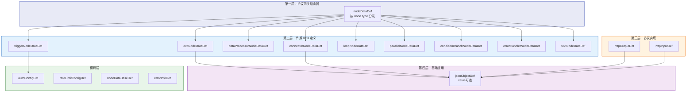
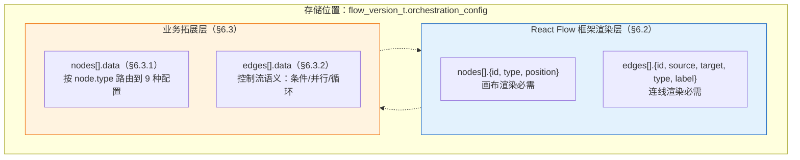
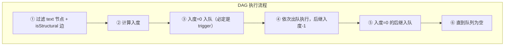

# JSON Schema 设计规范：连接器平台 V2

**关联文档**: plan.md, plan-db.md (§3 表结构定义), plan-api.md (§3 接口详细定义)  
**版本**: v9.3
**创建日期**: 2026-05-22  
**最后更新**: 2026-06-11
**修订说明**: v9.3 — §6 全线对齐 §1-4 最新内容，附录 C 更新

---

## 1. 设计哲学

### 1.1 设计目标

| 目标 | 说明 |
|------|------|
| **自描述** | Schema 本身说清字段含义、类型、约束，不散落在代码注释中 |
| **一致性** | 同一语义的字段在不同上下文中命名统一 |
| **可扩展** | 可新增字段，不破坏已有结构 |
| **无冗余** | 不用的字段不出现在 Schema 中 |

### 1.2 参考标准

| 标准 | 参考程度 | 说明 |
|------|---------|------|
| JSON Schema (draft-07) | 核心 | `type` / `properties` / `required` / `description` / `definitions` / `oneOf` / `allOf` / `if`-`then` 等元字段直接复用 |
| OpenAPI 3.0 components/schemas | 结构 | 可复用组件（authConfig / rateLimitConfig）+ 按场景组合的思想 |
| React Flow (@xyflow/react v12) | 格式 | Node（id/type/position/data）和 Edge（id/source/target/type/data）接口作为编排配置的存储格式骨架；框架字段与业务字段严格分层（见原则四） |

### 1.3 核心原则

| # | 原则 | 规则 | 示例 |
|:---:|------|------|------|
| 一 | **同名同构** | 同一语义的字段在不同上下文中使用同一 Schema 组件，不重复定义 | ① `authConfig` → 触发器和连接器共用 `authConfigDef`<br>② `rateLimitConfig` → 入站和出站共用 `rateLimitConfigDef`<br>③ `nodeInput` → 触发器和连接器统一走 `httpInputDef` |
| 二 | **无用不存** | 不适用于当前场景的字段不出现在 JSON 中，由 Schema 的 `if`-`then` + `additionalProperties: false` 约束 | ① trigger 不含 `protocolConfig`（端点固定）<br>② trigger 不含 `timeoutMs`（引擎控制）<br>③ trigger 不含 `nodeOutput`（由 exit 定义）<br>④ manual 触发不含 `authConfig` |
| 三 | **边即语义** | edge 不仅描述"谁连到谁"，还承载控制流语义——执行条件、错误路由、并行标记 | ① `businessType`：default / condition / error / loop_entry / loop_exit<br>② `connectionMode`：serial / parallel<br>③ `isStructural`：结构辅助边标记 |
| 四 | **框业分离** | React Flow 框架字段（id/type/position/source/target 等）不进 data，业务字段全在 data 内，两者不互串 | ① `node.id` / `node.type` / `node.position` → 框架字段<br>② `node.data.*` → 业务字段<br>③ `edge.source` / `edge.target` → 框架字段<br>④ `edge.data.*` → 业务字段 |

### 1.4 值表达式体系

编排中节点需要从多种来源取值——上游节点产出、固定常量、平台配置、内置函数、用户自定义脚本等。V2 统一为 `${$.scope.path}` 表达式语法，详细定义见 **[§3 值表达式体系](#3-值表达式体系)**。

> **核心要点**：① 5 种值来源（node / constant / system / script / execution）；② `node` 下分 `input`（入参）/ `output`（返回值）/ `current`（过程中参数，仅结构节点）；③ `system` 下分 `env`（环境变量）/ `fn`（内置函数）；④ 表达式支持嵌套引用。

---

## 2. 命名规范与数据约束

### 2.1 统一字段命名规则

| 上下文 | 规则 | 示例 |
|--------|------|------|
| JSON 内部所有键名 | camelCase | `nameCn` / `authConfig` / `connectorVersionId` |
| 引用外部资源 ID | `*Id` 后缀 + string 类型 | `connectorVersionId: "1234567890"` |
| 时间字段 | `*Time` 后缀 | `createTime` / `publishedTime` |
| 布尔字段 | `is*` 前缀 | `isDeleted` / `isTest` |
| 扩展字段 | `x_*` 前缀 | `x_customMetadata` |
| 数据库列级枚举 | TINYINT 数字（plan-db.md §0.7） | `connector_type=1` |
| JSON 内嵌枚举 | UPPER_SNAKE_CASE 字符串（例外，见 §2.2） | `"SOA"` / `"SYSTOKEN"` |
| React Flow node.type | snake_case（注册组件名） | `trigger` / `loop-v2` / `condition-branch` |
| React Flow 框架字段 | 遵循官方命名 | `source`/`target`（非 sourceNodeId） |

### 2.2 JSON 内嵌枚举使用字符串的例外说明

> **设计决策**：`authConfig.type` 作为 MEDIUMTEXT JSON 嵌套字段，使用字符串枚举，非 TINYINT。
>
> | 维度 | 数据库列级枚举 | JSON 内嵌枚举 |
> |------|--------------|-------------|
> | **字段位置** | MySQL 列 | MEDIUMTEXT 列的 JSON 子字段 |
> | **枚举表示** | TINYINT | 字符串（`"SOA"` / `"AKSK"` 等） |
> | **设计理由** | 存储/索引效率 | 人类可读、版本快照 self-describing |
> | **规范适用** | plan-db.md §0.7 | 本文档 §2.2 |
>
> 枚举值对应关系（JSON 字符串 ⇄ DB TINYINT）：

| JSON 字符串 | TINYINT | 使用上下文 |
|------------|:---:|-----------|
| `SOA` | 1 | 连接器认证 |
| `APIG` | 2 | 连接器认证 |
| `NONE` | 4 | 连接器认证 |
| `AKSK` | 5 | 连接器认证 |
| `SYSTOKEN` | 7 | 触发器认证 |
| `COOKIE` | 8 | 连接器认证 |
| `SIGNATURE` | 9 | 连接器认证 |

### 2.3 FR-047 数据结构类型严格校验规则

> FR-047 是 V2 跨连接器和连接流的通用数据模型层约束，对所有 JSON Schema 定义的数据结构生效。

#### 2.3.1 基本类型限定

| 规则 | 说明 |
|------|------|
| 允许的基本类型 | `string`、`number`、`boolean`（仅三种） |
| null | 不作为合法字段类型 |
| number | 不区分 integer/float（统一为 `number`） |

#### 2.3.2 object 类型约束

- object 类型字段必须定义子字段结构（`properties` 非空）
- 禁止无子结构的空 object
- 每个子字段递归展开到基本类型

#### 2.3.3 array 类型约束

- array 类型字段必须声明 `items` 元素类型
- items 为 object 时需继续递归展开子字段到基本类型
- items 内各子字段的 value 表达式，最多只能引用一个上游 array 类型字段
- 禁止同时引用两个不同 array 源的字段（避免数组长度不一致歧义）
- 若 items 内所有 value 表达式均未引用 array 类型字段，数组最终长度为 1

#### 2.3.4 映射引用约束

- 禁止非基本类型（object/array）通过 value 表达式整体引用赋值
- object/array 必须逐字段展开，每个叶子字段各自引用基本类型字段
- value 表达式引用的上游字段类型必须与当前字段声明的 type 一致（string→string、number→number、boolean→boolean）
- 严禁隐式类型转换
- 所有映射表达式引用路径终点必须可解析到基本类型字段

#### 2.3.5 设计态校验时机

| 校验时机 | 校验内容 |
|---------|---------|
| Schema 编辑器输入 | object 无子字段 / array 无 items → 实时标红 |
| 连接器版本发布 | 入参/出参 Schema 合规性校验 → 不满足则禁止发布 |
| 连接流编排保存 | 所有节点间数据结构定义合规性校验 → 不满足则禁止保存 |
| 映射赋值检查 | value 表达式引用路径终点为 object/array → 标红禁止保存 |
| 类型一致性检查 | 引用源类型与声明类型不一致 → 标红提示具体不匹配字段 |

---

## 3. 值表达式体系

编排中每个节点需要的字段值可能来自多种来源——不仅仅是上游节点的输出，也可能是固定常量、系统配置、或内置函数计算结果。V2 统一为**单一表达式语法**，覆盖全部值来源。

### 3.1 值来源总览

| # | 作用域 | 性质 | 语法 | 示例 | 说明 |
|:---:|------|:---:|------|------|------|
| 1 | `node` | 设计态 | `${$.node.{id}.{input\|output\|current}.path}` | 见下方示例 | 引用任意节点的三个数据面：`input`（入参）、`output`（返回值）、`current`（过程中参数，仅结构节点） |
| 2 | `constant` | 设计态 | `${$.constant:value}` | `${$.constant:0}` | 编排设计者填入的固定值 |
| 3 | `system` | 设计态 | `${$.system.env.{key}}` / `.fn.{name}(args)` | `${$.system.env.region}`、`${$.system.fn.upper(...)}` | 双子类：`env`（环境变量含密钥）、`fn`（内置函数，值=Java类全路径.invoke） |
| 4 | `script` | 设计态 | `${$.script.{name}(args)}` | `${$.script.normalize(...)}` | 用户预定义脚本，按名引用传参，脚本名对应 Java 类全路径 `com.openapp.script.XxxScript.invoke` |
| 5 | `execution` | 运行时注入 | `${$.execution.id}` / `.flowId` / `.triggerTime` | `${$.execution.flowId}` | 引擎每次执行时注入的运行时元数据 |

> 表达式层级：`$.` = 根 → `node`/`constant`/`system`/`script`/`execution` = 作用域 → 具体路径或参数。

**`node` 的三个数据面**：

| 路径 | 语义 | 生命周期 | 示例 |
|------|------|---------|------|
| `input` | 节点的入参 | 节点执行期间 | `${$.node.trigger.input.sender}` — 触发器收到的请求字段 |
| `output` | 节点的返回值 | 执行完成后下游可引用 | `${$.node.node_1.output.msgId}` — 连接器调用下游 API 的返回 |
| `current` | 节点的过程中参数 | 仅结构节点（loop/error_handler）体内有效 | `${$.node.loop_1.current.item}` — 循环体内当前迭代元素 |

**结构节点 `current` 引用示例**：

| 场景 | `input` | `output` | `current` |
|------|:--:|:--:|------|
| 触发器收到请求 | `${$.node.trigger.input.sender}` | —（无返回值） | — |
| 连接器调用结果 | — | `${$.node.conn_1.output.msgId}` | — |
| 循环体内当前元素 | — | `${$.node.loop_1.output.items}`（原始数组） | `${$.node.loop_1.current.item}` |
| 循环体内当前索引 | — | — | `${$.node.loop_1.current.index}` |
| 多重循环内层 | — | — | `${$.node.loop_inner.current.item}` |
| 多重循环同时引用外层 | — | — | `${$.node.loop_outer.current.item}` |
| 错误处理体内错误码 | — | — | `${$.node.err_1.current.code}` |

### 3.2 运行时上下文对象

表达式 `${$.node.trigger.input.body.sender}` 中的 `$` 代表引擎构造的**运行时上下文 JSON 根对象**。以下按 HTTP 协议场景完整展开 trigger（入参三段式）、connector（入参三段式 + 出参两段式）、exit（出参两段式）、loop/error_handler（current 运行时上下文）：

```json
{
  "node": {
    "trigger": {
      "input": {
        "header": {
          "Authorization": "Bearer token-xxx",
          "Content-Type": "application/json"
        },
        "query": {
          "page": "1",
          "size": "20"
        },
        "body": {
          "sender": "u001",
          "content": "你好",
          "items": ["a", "b", "c"]
        }
      }
    },
    "conn_1": {
      "input": {
        "header": {
          "Authorization": "Bearer sk-xxxxxxxxxxxx"
        },
        "query": {
          "page": "1"
        },
        "body": {
          "itemId": "b",
          "size": 20
        }
      },
      "output": {
        "header": {
          "X-Request-Id": "req-001",
          "X-RateLimit-Remaining": "99"
        },
        "body": {
          "msgId": "msg_001",
          "name": "alice",
          "data": "raw data"
        }
      }
    },
    "exit": {
      "output": {
        "header": {
          "X-Trace-Id": "trace-abc"
        },
        "body": {
          "total": 3,
          "execId": "exec-2026-001"
        }
      }
    },
    "loop_1": {
      "output": { "items": ["a", "b", "c"] },
      "current": { "item": "b", "index": 1, "total": 3 }
    },
    "err_1": {
      "current": {
        "code": "503",
        "messageZh": "下游服务不可用",
        "messageEn": "Service Unavailable",
        "cause": "连接超时"
      }
    }
  },
  "system": {
    "env": {
      "apiKey": "sk-xxxxxxxxxxxx",
      "region": "cn-east",
      "locale": "zh-CN",
      "timeout": 5000
    },
    "fn": {
      "upper":      "com.xxx.it.works.wecode.v2.modules.runtime.fn.string.UpperFunction.invoke",
      "concat":     "com.xxx.it.works.wecode.v2.modules.runtime.fn.string.ConcatFunction.invoke",
      "substring":  "com.xxx.it.works.wecode.v2.modules.runtime.fn.string.SubstringFunction.invoke",
      "add":        "com.xxx.it.works.wecode.v2.modules.runtime.fn.math.AddFunction.invoke",
      "length":     "com.xxx.it.works.wecode.v2.modules.runtime.fn.array.LengthFunction.invoke",
      "if":         "com.xxx.it.works.wecode.v2.modules.runtime.fn.logic.IfFunction.invoke",
      "toString":   "com.xxx.it.works.wecode.v2.modules.runtime.fn.convert.ToStringFunction.invoke",
      "toNumber":   "com.xxx.it.works.wecode.v2.modules.runtime.fn.convert.ToNumberFunction.invoke",
      "toBoolean":  "com.xxx.it.works.wecode.v2.modules.runtime.fn.convert.ToBooleanFunction.invoke",
      "formatDate": "com.xxx.it.works.wecode.v2.modules.runtime.fn.date.FormatDateFunction.invoke"
    }
  },
  "script": {
    "normalize":     "com.openapp.script.NormalizeScript.invoke",
    "randomUserInfo": "com.openapp.script.RandomUserInfoScript.invoke"
  },
  "execution": { "id": "exec-2026-001", "flowId": "flow-12345", "triggerTime": "2026-06-10T10:00:00Z" }
}
```

> `constant` 不在运行时 JSON 中：`${$.constant:20}` 的值 `20` 直接写在表达式里，引擎解析表达式语法即得值，无需存入运行时上下文对象。

**各节点的数据面**：

| 节点类型 | `input` | `output` | `current` | 说明 |
|---------|:------:|:------:|:------:|------|
| trigger | ✅ header / query / body | — | — | 仅入参，HTTP 请求的三段 |
| connector | ✅ header / query / body（镜像 nodeInput） | ✅ header / body（镜像 nodeOutput） | — | 入参 + 出参 |
| exit | — | ✅ header / body | — | 仅出参，对外 HTTP 响应 |
| loop_v2 | — | ✅（原始数组等） | ✅ item / index / total | output 为持久化属性，current 为迭代上下文 |
| error_handler | — | ✅（错误统计等） | ✅ code / messageZh / messageEn / cause | current 跟随 errorInfoDef |

**Path 解析对照 — 按作用域分组**：

| JSON Path | 解析结果 | 作用域 |
|-----------|---------|:---:|
| `$.node.trigger.input.header.Authorization` | `"Bearer token-xxx"` | node : input |
| `$.node.trigger.input.header.Content-Type` | `"application/json"` | node : input |
| `$.node.trigger.input.query.page` | `"1"` | node : input |
| `$.node.trigger.input.query.size` | `"20"` | node : input |
| `$.node.trigger.input.body.sender` | `"u001"` | node : input |
| `$.node.trigger.input.body.content` | `"你好"` | node : input |
| `$.node.trigger.input.body.items` | `["a", "b", "c"]` | node : input |
| `$.node.conn_1.input.header.Authorization` | `"Bearer sk-xxxxxxxxxxxx"` | node : input |
| `$.node.conn_1.input.query.page` | `"1"` | node : input |
| `$.node.conn_1.input.body.itemId` | `"b"` | node : input |
| `$.node.conn_1.input.body.size` | `20` | node : input |
| `$.node.conn_1.output.header.X-Request-Id` | `"req-001"` | node : output |
| `$.node.conn_1.output.header.X-RateLimit-Remaining` | `"99"` | node : output |
| `$.node.conn_1.output.body.msgId` | `"msg_001"` | node : output |
| `$.node.conn_1.output.body.name` | `"alice"` | node : output |
| `$.node.conn_1.output.body.data` | `"raw data"` | node : output |
| `$.node.exit.output.header.X-Trace-Id` | `"trace-abc"` | node : output |
| `$.node.exit.output.body.total` | `3` | node : output |
| `$.node.exit.output.body.execId` | `"exec-2026-001"` | node : output |
| `$.node.loop_1.current.item` | `"b"` | node : current |
| `$.node.loop_1.current.index` | `1` | node : current |
| `$.node.loop_1.current.total` | `3` | node : current |
| `$.node.err_1.current.code` | `"503"` | node : current |
| `$.node.err_1.current.messageZh` | `"下游服务不可用"` | node : current |
| `$.node.err_1.current.cause` | `"连接超时"` | node : current |
| `$.system.apiKey` | `"sk-xxxxxxxxxxxx"` | system |
| `$.system.env.region` | `"cn-east"` | system |
| `$.system.env.locale` | `"zh-CN"` | system |
| `$.system.fn.upper($.node.conn_1.output.body.name)` | `"ALICE"` | system.fn |
| `$.script.normalize($.node.conn_1.output.body.data, $.system.env.locale)` | `"normalized raw data"` | script |
| `$.execution.flowId` | `"flow-12345"` | execution |
| `$.execution.triggerTime` | `"2026-06-10T10:00:00Z"` | execution |

> `current` 不是独立作用域，是 `node` 下结构节点的运行时子路径，与 `input`/`output` 平级。仅在对应结构体内有效，多重循环按节点 ID 精确区分。
>
> `loop_v2` / `error_handler` 节点的 `output` 字段结构（持久化属性）和 `current` 下可用字段的完整列表，待 §4.3.12~§4.3.15 `loopNodeDataDef` / `errorHandlerNodeDataDef` 专项细化后确定。

### 3.3 设计原则

| # | 原则 | 说明 |
|:---:|------|------|
| 1 | **映射结构镜像需求结构** | connector 的 nodeInput 分 header/query/body，则 input 也分 header/query/body |
| 2 | **Schema 不硬编码协议** | input/output 定义为 `"type": "object"`，具体分段由应用层按协议校验 |
| 3 | **表达式体系统一** | 5 种值来源共用同一套 `${$.scope.path}` 语法，不因来源不同而异 |
| 4 | **必填检查在应用层** | mapping 是否覆盖 required 字段，由应用层校验，JSON Schema 不做跨对象约束 |

### 3.4 节点数据引用详述

DAG 中节点按拓扑顺序执行，上游节点的输出数据需要传递给下游节点。引用模型基于 **JSON 节点上下文对象**，区分设计态和运行态：

| | 设计态（Design-time） | 运行态（Runtime） |
|------|-------------------|---------------|
| **是什么** | 节点上下文对象的 Schema 定义 | 引擎根据设计态构造的实际 JSON 对象 |
| **谁来定义** | connector 的 nodeInput/nodeOutput 等 | 引擎在节点执行时自动构造 |
| **示例** | `{ type: "object", properties: { sender: { type: "string" } } }` | `{ sender: "u001", content: "你好" }` |

> 编排配置中存储设计态定义，引擎运行时根据定义构造 JSON 节点上下文对象，再按 mapping 映射到当前节点。

```

设计态（编排配置中存储）                    运行态（引擎执行时构造）
┌─────────────────────────┐              ┌─────────────────────────┐
│ trigger.nodeInput   │              │ trigger.context         │
│ {                       │    构造      │ {                       │
│   body: {               │  ────────▶   │   input: {             │
│     properties: {       │              │     sender: "u001",    │
│       sender: {...},    │              │     content: "你好"     │
│       content: {...}    │              │   },                   │
│     }                   │              │   output: { ... }      │
│   }                     │              │ }                      │
│ }                       │              └─────────────────────────┘
└─────────────────────────┘
```

### 3.5 系统内置函数

数据处理器（`data_processor`）节点可在映射表达式中使用系统内置函数。`system.fn.{name}` 在引擎中解析为 Java 类全路径，反射调用并返回值，参数由引擎自动传入：

| 类别 | 函数名 | 类路径 | 说明 |
|------|--------|--------|------|
| 字符串 | `upper` | `com.xxx.it.works.wecode.v2.modules.runtime.fn.string.UpperFunction.invoke` | 转大写 |
| 字符串 | `lower` | `com.xxx.it.works.wecode.v2.modules.runtime.fn.string.LowerFunction.invoke` | 转小写 |
| 字符串 | `concat` | `com.xxx.it.works.wecode.v2.modules.runtime.fn.string.ConcatFunction.invoke` | 多字符串拼接 |
| 字符串 | `substring` | `com.xxx.it.works.wecode.v2.modules.runtime.fn.string.SubstringFunction.invoke` | 截取子串 |
| 数学 | `add` | `com.xxx.it.works.wecode.v2.modules.runtime.fn.math.AddFunction.invoke` | 加法 |
| 数学 | `multiply` | `com.xxx.it.works.wecode.v2.modules.runtime.fn.math.MultiplyFunction.invoke` | 乘法 |
| 数学 | `round` | `com.xxx.it.works.wecode.v2.modules.runtime.fn.math.RoundFunction.invoke` | 四舍五入 |
| 数学 | `abs` | `com.xxx.it.works.wecode.v2.modules.runtime.fn.math.AbsFunction.invoke` | 绝对值 |
| 数组 | `length` | `com.xxx.it.works.wecode.v2.modules.runtime.fn.array.LengthFunction.invoke` | 数组长度 |
| 数组 | `first` | `com.xxx.it.works.wecode.v2.modules.runtime.fn.array.FirstFunction.invoke` | 首元素 |
| 数组 | `join` | `com.xxx.it.works.wecode.v2.modules.runtime.fn.array.JoinFunction.invoke` | 用分隔符连接 |
| 逻辑 | `if` | `com.xxx.it.works.wecode.v2.modules.runtime.fn.logic.IfFunction.invoke` | 三元条件 (cond, then, else) |
| 逻辑 | `equals` | `com.xxx.it.works.wecode.v2.modules.runtime.fn.logic.EqualsFunction.invoke` | 相等比较 |
| 逻辑 | `isEmpty` | `com.xxx.it.works.wecode.v2.modules.runtime.fn.logic.IsEmptyFunction.invoke` | 空值检测 |
| 类型转换 | `toString` | `com.xxx.it.works.wecode.v2.modules.runtime.fn.convert.ToStringFunction.invoke` | 转为 string |
| 类型转换 | `toNumber` | `com.xxx.it.works.wecode.v2.modules.runtime.fn.convert.ToNumberFunction.invoke` | 转为 number |
| 类型转换 | `toBoolean` | `com.xxx.it.works.wecode.v2.modules.runtime.fn.convert.ToBooleanFunction.invoke` | 转为 boolean |
| 日期 | `formatDate` | `com.xxx.it.works.wecode.v2.modules.runtime.fn.date.FormatDateFunction.invoke` | 日期格式转换 (value, fromFormat, toFormat) |

### 3.6 自定义脚本

用户可预先定义脚本（如 Groovy / JavaScript），存储到平台脚本库中。编排设计时按名引用，传入参数，引擎运行时执行并返回结果。

```

${$.script.validateItem($.node.loop_1.current.item, $.system.env.region)}
```

脚本参数可嵌套引用任意值来源（node / constant / system / system.fn / execution / script）。

### 3.7 嵌套规则

所有值来源的参数支持互相嵌套：

```

// 系统函数 + 节点引用 + 常量
${$.system.fn.concat($.node.trigger.input.firstName, $.constant:" ", $.node.trigger.input.lastName)}

// 自定义脚本 + 循环上下文 + 系统变量
${$.script.validate($.node.loop_1.current.item, $.system.env.region)}

// 错误处理中引用错误信息 + 执行元数据
${$.system.fn.format($.node.err_1.current.messageZh, $.execution.flowId)}
```

---

## 4. 共享 Schema 组件库

> 以下 §5（连接器配置）和 §6（连接流编排配置）均引用本章定义的共享组件。

### 4.1 设计思路与整体架构

为避免「JSON 字段与 JSON 字段定义同名」的歧义，本规范区分两者：
- **JSON 字段（field name）**：JSON 数据中的属性键，描述「存什么数据」（如 `authConfig`）
- **JSON 字段定义（definition key）**：校验规则组件键名（如 `authConfigDef`）

**命名规则**：

| # | 规则 | 适用对象 | 示例 |
|:---:|------|------|------|
| 1 | **字段全名 + `Def`** | 有直接对应 JSON 字段的组件 | `authConfig` → `authConfigDef`、`rateLimitConfig` → `rateLimitConfigDef`、`nodeInput` → `httpInputDef`、`errorInfo` → `errorInfoDef` |
| 2 | **`{type}NodeDataDef`** | 第二层节点 data 定义，通过 allOf 继承 `nodeDataBaseDef` | `triggerNodeDataDef`、`connectorNodeDataDef`、`exitNodeDataDef` 等 |
| 3 | **`{协议}InputDef` / `{协议}OutputDef`** | 第三层协议具体实现，不额外加 `Contract`/`Schema` 后缀 | `httpInputDef`、`httpOutputDef` |
| 4 | **语义化名 + `Def`** | 第四层基础复用组件，无直接对应 JSON 字段 | `jsonObjectDef`（v2 合并 mappedFieldDef/mappedJsonSchemaObjectDef，value 可选） |

**17 个组件的关系全景**：



| 层 | 职责 | 组件 |
|:--:|------|------|
| 第一层 | 路由器（oneOf 按 node.type 分发） | `nodeDataDef` |
| 第二层 | 9 种节点 data 定义（业务数据载体） | `triggerNodeDataDef` ~ `textNodeDataDef` |
| 第三层 | 协议具体实现（HTTP header/query/body） | `httpInputDef`、`httpOutputDef` |
| 第四层 | 基础复用组件（被上层引用） | `jsonObjectDef`（v2 合并 mappedFieldDef/mappedJsonSchemaObjectDef，value 可选） |
| 横跨层 | 多场景复用（认证/限流/基类/错误） | `authConfigDef`、`rateLimitConfigDef`、`nodeDataBaseDef`、`errorInfoDef` |

### 4.2 组件速查表

| # | 组件名 | 层 | 用途 | 被引用方 |
|:---:|--------|:---:|------|---------|
| 1 | `jsonObjectDef` | 第四层 | 基础复用：字段定义（value 可选，递归嵌套） | §6.4 orchestrationConfig 等全部组件 |
| 2 | `authConfigDef` | 横跨 | 认证类型声明（含凭证字段列表） | §5 connectionConfig, §4.3.8 triggerNodeDataDef |
| 3 | `rateLimitConfigDef` | 横跨 | 限流配置（QPS + 并发） | §5 connectionConfig, §4.3.8 triggerNodeDataDef |
| 4 | `errorInfoDef` | 横跨 | 错误详情（code + 双语 message + 根因） | §7 执行数据 |
| 5 | `nodeDataBaseDef` | 横跨 | 节点 data 公共基类（type / labelCn / labelEn / structConfig） | 全部节点 data 子 Def（allOf 继承） |
| 6 | `httpInputDef` | 第三层 | HTTP 入参声明（header/query/body 三段式） | §4.3.8 triggerNodeDataDef, §5 connectionConfig |
| 7 | `httpOutputDef` | 第三层 | HTTP 出参声明（header/body 两段式） | §5 connectionConfig |
| 8 | `triggerNodeDataDef` | 第二层 | 触发器节点业务数据 | §4.3.8 |
| 9 | `connectorNodeDataDef` | 第二层 | 连接器节点业务数据（版本引用 + 字段映射） | §4.3.9 |
| 10 | `dataProcessorNodeDataDef` | 第二层 | 数据处理器节点业务数据 | §4.3.10 |
| 11 | `exitNodeDataDef` | 第二层 | 出口节点业务数据 | §4.3.11 |
| 12 | `loopNodeDataDef` | 第二层 | 循环节点业务数据（继承 nodeDataBaseDef） | §4.3.12 |
| 13 | `parallelNodeDataDef` | 第二层 | 并行节点业务数据（继承 nodeDataBaseDef） | §4.3.13 |
| 14 | `conditionBranchNodeDataDef` | 第二层 | 条件分支节点业务数据（继承 nodeDataBaseDef） | §4.3.14 |
| 15 | `errorHandlerNodeDataDef` | 第二层 | 错误处理节点业务数据（继承 nodeDataBaseDef） | §4.3.15 |
| 16 | `textNodeDataDef` | 第二层 | text 标记节点数据（继承 nodeDataBaseDef） | §4.3.16 |
| 17 | `nodeDataDef` | 第一层 | 节点 data 路由器（oneOf 按 node.type 分发至 9 种 data） | §4.3.17, §6.4 orchestrationConfig |

### 4.3 组件详解

> 以 `jsonObjectDef` 为基础，按依赖关系逐层展开。

#### 4.3.1 jsonObjectDef

> 基础复用组件。value 可选——有值=编排映射场景，无值=纯声明场景。每个字段自维护所有属性（required/sensitive/value 等），不做顶层 `required` 数组。

> **Def**

```json
{
  "$id": "urn:openapp:schema:jsonObjectDef:v2",
  "type": "object",
  "properties": {
    "type": { "type": "string", "enum": ["object"] },
    "properties": {
      "type": "object",
      "additionalProperties": {
        "oneOf": [
          {
            "description": "叶子字段：基本类型",
            "type": "object",
            "properties": {
              "type":        { "type": "string", "enum": ["string", "number", "boolean"] },
              "description": { "type": "string" },
              "value":       { "type": "string", "description": "映射表达式（可选）。遵循 §3 值表达式体系" },
              "required":    { "type": "boolean", "default": false, "description": "是否必填" },
              "sensitive":   { "type": "boolean", "default": false, "description": "敏感字段标记：① 落库加密存储 ② 日志脱敏打印" },
              "readonly":    { "type": "boolean", "default": false, "description": "字段是否只读" },
              "deprecated":  { "type": "boolean", "default": false, "description": "是否已废弃" },
              "nullable":    { "type": "boolean", "default": false, "description": "字段值是否允许为 null（传 null 或不传）。注意：与字段类型声明无关——FR-047 禁止声明 type=\"null\"，nullable 仅控制值的可选性" },
              "placeholder": { "type": "string",  "description": "输入框占位提示" },
              "pattern":     { "type": "string",  "description": "正则校验表达式，如 ^1[3-9]\\d{9}$" },
              "minLength":   { "type": "number",  "description": "字符串最小长度" },
              "maxLength":   { "type": "number",  "description": "字符串最大长度" },
              "enum":        { "type": "array" },
              "default":     {},
              "minimum":     { "type": "number" },
              "maximum":     { "type": "number" }
            },
            "required": ["type"]
          },
          {
            "description": "嵌套 object：递归引用自身",
            "$ref": "#/definitions/jsonObjectDef"
          },
          {
            "description": "数组字段",
            "type": "object",
            "properties": {
              "type":        { "type": "string", "enum": ["array"] },
              "description": { "type": "string" },
              "required":    { "type": "boolean", "default": false },
              "readonly":    { "type": "boolean", "default": false },
              "deprecated":  { "type": "boolean", "default": false },
              "minItems":    { "type": "number",  "description": "数组最少元素数" },
              "maxItems":    { "type": "number",  "description": "数组最多元素数" },
              "items":       { "$ref": "#/definitions/jsonObjectDef" }
            },
            "required": ["type", "items"]
          }
        ]
      }
    }
  },
  "required": ["type", "properties"]
}
```

> **字段说明**

| JSON 字段 | 类型 | 必填 | 适用 | 说明 |
|-----------|------|:----:|:--:|------|
| type | string | ✅ | 全部 | 顶层固定 `"object"` |
| properties | object | ✅ | 全部 | 字段定义集合，每个字段自维护所有属性 |
| properties.{key}.type | string | ✅ | 全部 | 字段类型：`string` / `number` / `boolean` / `object`（递归）/ `array` |
| properties.{key}.required | boolean | ❌ | 全部 | 是否必填，默认 `false` |
| properties.{key}.value | string | ❌ | 叶子 | 映射表达式。遵循 §3 值表达式体系 |
| properties.{key}.sensitive | boolean | ❌ | 叶子 | 敏感字段标记：① 落库加密存储 ② 日志脱敏打印，默认 `false` |
| properties.{key}.readonly | boolean | ❌ | 全部 | 字段是否只读，默认 `false` |
| properties.{key}.deprecated | boolean | ❌ | 全部 | 是否已废弃，默认 `false` |
| properties.{key}.description | string | ❌ | 全部 | 字段描述 |
| properties.{key}.placeholder | string | ❌ | 叶子 | 输入框占位提示（string 类型可用） |
| properties.{key}.pattern | string | ❌ | 叶子 | 正则校验，如 `^1[3-9]\d{9}$`（string 类型可用） |
| properties.{key}.minLength | number | ❌ | 叶子 | 字符串最小长度（string 类型可用） |
| properties.{key}.maxLength | number | ❌ | 叶子 | 字符串最大长度（string 类型可用） |
| properties.{key}.enum | array | ❌ | 叶子 | 枚举值列表 |
| properties.{key}.default | any | ❌ | 叶子 | 默认值 |
| properties.{key}.minimum | number | ❌ | 叶子 | 最小值（number 类型可用） |
| properties.{key}.maximum | number | ❌ | 叶子 | 最大值（number 类型可用） |
| properties.{key}.nullable | boolean | ❌ | 叶子 | 字段值是否允许为 null（传 null 或不传）。与类型声明无关——FR-047 禁止 type="null"，nullable 仅控制值的可选性。默认 `false` |
| properties.{key}.minItems | number | ❌ | array | 数组最少元素数 |
| properties.{key}.maxItems | number | ❌ | array | 数组最多元素数 |
| properties.{key}.items | object | ❌ | array | 数组元素定义（type=array 时必填） |

> **示例** — sender/content 必填，phone 脱敏，全部字段级声明：

```json
{
  "type": "object",
  "properties": {
    "sender":  { "type": "string", "required": true,  "description": "发送者 ID" },
    "content": { "type": "string", "required": true,  "description": "消息内容" },
    "phone":   { "type": "string", "required": false, "description": "手机号", "sensitive": true }
  }
}
```

> **示例** — 带 value 映射 + 嵌套 object：

```json
{
  "type": "object",
  "properties": {
    "receiver": { "type": "string", "required": true, "value": "${$.node.trigger.input.body.sender}" },
    "content":  { "type": "string", "required": true, "value": "${$.node.trigger.input.body.content}" },
    "metadata": {
      "type": "object",
      "properties": {
        "source":    { "type": "string", "required": true,  "value": "${$.constant:openplatform}" },
        "timestamp": { "type": "string", "required": false, "value": "${$.node.trigger.input.body.ts}" }
      }
    }
  }
}
```

> **示例** — 带 value 映射（编排 input）：

```json
{
  "type": "object",
  "properties": {
    "receiver": { "type": "string", "value": "${$.node.trigger.input.body.sender}" },
    "content":  { "type": "string", "value": "${$.node.trigger.input.body.content}" },
    "phone":    { "type": "string", "value": "${$.node.trigger.input.body.phone}", "sensitive": true }
  },
  "required": ["receiver", "content"]
}
```

#### 4.3.2 authConfigDef

> **Def** — v2 重构：`fields[]` 自定结构改为 `header/query` 复用 `jsonObjectDef`，对齐参数定义规范。

```json
{
  "$id": "urn:openapp:schema:authConfigDef:v2",
  "type": "object",
  "additionalProperties": false,
  "properties": {
    "type": { "type": "string", "enum": ["SOA", "APIG", "SYSTOKEN", "AKSK", "NONE", "COOKIE", "SIGNATURE"] },
    "header": { "$ref": "#/definitions/jsonObjectDef", "description": "放置在请求头的认证字段。字段名即 HTTP 字段名" },
    "query":  { "$ref": "#/definitions/jsonObjectDef", "description": "放置在 Query 的认证字段。字段名即 Query 参数名" },
    "secretKey": {
      "$ref": "#/definitions/jsonObjectDef",
      "description": "签名密钥定义（仅 SIGNATURE 类型使用）。字段含 sensitive=true 标记加密存储 + 运行时脱敏"
    },
    "sysAccountWhitelist": {
      "type": "array",
      "items": { "type": "string" },
      "uniqueItems": true,
      "description": "允许触发此连接流的 SYSTOKEN 账号 ID 列表（仅触发器使用）。运行时凭证解析出 sysAccountId 后校验。空数组 = 全部禁止（EC-011）"
    }
  },
  "required": ["type"],
  "anyOf": [
    { "required": ["header"] },
    { "required": ["query"] }
  ],
  "allOf": [
    {
      "if": {
        "properties": { "type": { "const": "SYSTOKEN" } },
        "required": ["type"]
      },
      "then": {
        "required": ["sysAccountWhitelist"]
      }
    },
    {
      "if": {
        "properties": { "type": { "const": "SIGNATURE" } },
        "required": ["type"]
      },
      "then": {
        "required": ["secretKey"]
      }
    }
  ]
}
```

> **字段说明**

| JSON 字段 | 类型 | 必填 | 说明 |
|-----------|------|:----:|------|
| type | string | ✅ | 认证类型：`SOA` / `APIG` / `SYSTOKEN` / `AKSK` / `NONE` / `COOKIE` / `SIGNATURE` |
| header | object | ❌ ⚡ | 放置在请求头的认证字段。与 `query` 至少二选一。字段名即 HTTP 字段名 |
| query | object | ❌ ⚡ | 放置在 Query 的认证字段。与 `header` 至少二选一。字段名即 Query 参数名 |
| sysAccountWhitelist[] | array | ⚡⚡ | 允许触发此流的 SYSTOKEN 账号 ID 列表。运行时解析凭证得到 sysAccountId 后校验。type=SYSTOKEN 时必填。空数组=全部禁止 |
| secretKey | object | ⚡⚡⚡ | 签名密钥定义（仅 SIGNATURE 类型使用）。复用 jsonObjectDef，sensitive 标记加密 + 脱敏。type=SIGNATURE 时必填 |

⚡ = anyOf：`header` / `query` 至少声明其一。
⚡⚡ = allOf：`type=SYSTOKEN` 时必填。
⚡⚡⚡ = allOf：`type=SIGNATURE` 时必填。

> **认证类型值来源总览**

| 认证类型 | 凭据数 | 值来源 | value 表达式 |
|---------|:---:|------|-------------|
| `SOA` | 1 | 凭据库静态值 | `${$.system.env.soaToken}` |
| `APIG` | 2 | 凭据库静态值 | `${$.system.env.apigAppKey}` / `${$.system.env.apigAppSecret}` |
| `SYSTOKEN` | 1 | 凭据库静态值 + tokenId 白名单校验 | `${$.system.env.sysToken}` |
| `AKSK` | 1 个字段 | 凭据库密钥对，引擎动态签名 | `${$.system.env.akskSignature}` |
| `NONE` | 0 | — | — |
| `COOKIE` | 1 个字段 | 上游触发器请求头 | `${$.node.trigger.input.header.Cookie}` |
| `SIGNATURE` | 1 个字段 + 1 个密钥 | 用户配置常量为签名密钥；引擎动态签名 | 字段: `${$.system.env.signature}`；密钥: `secretKey` (jsonObjectDef) |

> **示例**

> **SOA** — 值来源：凭据库静态 token

```json
{
  "type": "SOA",
  "header": {
    "type": "object",
    "properties": {
      "X-Soa-Token": {
        "type": "string",
        "required": true,
        "sensitive": true,
        "value": "${$.system.env.soaToken}",
        "description": "SOA 认证令牌。值来源：凭据库"
      }
    }
  }
}
```

> **APIG** — 值来源：凭据库静态 key + secret

```json
{
  "type": "APIG",
  "query": {
    "type": "object",
    "properties": {
      "apigAppKey": {
        "type": "string",
        "required": true,
        "value": "${$.system.env.apigAppKey}",
        "description": "APIG 应用标识。值来源：凭据库"
      },
      "apigAppSecret": {
        "type": "string",
        "required": true,
        "sensitive": true,
        "value": "${$.system.env.apigAppSecret}",
        "description": "APIG 应用密钥。值来源：凭据库"
      }
    }
  }
}
```

> **SYSTOKEN** — 值来源：凭据库静态 token + 账号白名单

```json
{
  "type": "SYSTOKEN",
  "header": {
    "type": "object",
    "properties": {
      "X-Sys-Token": {
        "type": "string",
        "required": true,
        "sensitive": true,
        "value": "${$.system.env.sysToken}",
        "description": "系统凭证令牌。值来源：凭据库"
      }
    }
  },
  "sysAccountWhitelist": ["stk-u001", "stk-u002"]
}
```

> **AKSK** — 值来源：凭据库密钥对，引擎动态签名

```json
{
  "type": "AKSK",
  "header": {
    "type": "object",
    "properties": {
      "X-AKSK-Signature": {
        "type": "string",
        "required": true,
        "sensitive": true,
        "value": "${$.system.env.akskSignature}",
        "description": "AKSK 签名值。引擎运行时从凭据库取密钥对动态签名计算"
      }
    }
  }
}
```

> **NONE** — 无认证

```json
{
  "type": "NONE"
}
```

> **COOKIE** — 值来源：上游触发器请求头 Cookie 字段（用户浏览器/设备）

```json
{
  "type": "COOKIE",
  "header": {
    "type": "object",
    "properties": {
      "Cookie": {
        "type": "string",
        "required": true,
        "sensitive": true,
        "value": "${$.node.trigger.input.header.Cookie}",
        "description": "Cookie 请求头。值来源：上游触发器请求头中的 Cookie 字段（用户浏览器/设备携带）"
      }
    }
  }
}
```

> **SIGNATURE** — 值来源：用户配置常量签名密钥 + 引擎动态签名

```json
{
  "type": "SIGNATURE",
  "secretKey": {
    "type": "object",
    "properties": {
      "signSecretKey": {
        "type": "string",
        "required": true,
        "sensitive": true,
        "value": "${$.constant:user-configured-secret-key}",
        "description": "签名密钥。用户配置常量值，落库加密存储（sensitive 标记）"
      }
    }
  },
  "header": {
    "type": "object",
    "properties": {
      "X-Signature": {
        "type": "string",
        "required": true,
        "sensitive": true,
        "value": "${$.system.env.signature}",
        "description": "签名值。引擎运行时使用 secretKey 指向的密钥动态签名计算。密钥 + 签名值双脱敏"
      }
    }
  }
}
```

#### 4.3.3 rateLimitConfigDef

> **Def**

```json
{
  "$id": "urn:openapp:schema:rateLimitConfigDef:v1",
  "type": "object",
  "additionalProperties": false,
  "properties": {
    "maxQps": { "type": "integer", "minimum": 1, "maximum": 10000 },
    "maxConcurrency": { "type": "integer", "minimum": 1, "maximum": 1000 }
  }
}
```

> **字段说明**

| JSON 字段 | 类型 | 必填 | 说明 |
|-----------|------|:----:|------|
| maxQps | integer | ❌ | 每秒最大请求数，范围 1-10000 |
| maxConcurrency | integer | ❌ | 最大并发数，范围 1-1000 |

> **示例**

```json
{ "maxQps": 100, "maxConcurrency": 10 }
```

#### 4.3.4 errorInfoDef

> **Def**

```json
{
  "$id": "urn:openapp:schema:errorInfoDef:v2",
  "type": "object",
  "additionalProperties": false,
  "properties": {
    "code": { "type": "string", "pattern": "^[1-9][0-9]{2,4}$" },
    "messageZh": { "type": "string" },
    "messageEn": { "type": "string" },
    "cause": { "type": "string" },
    "downstreamStatus": { "type": "integer" },
    "downstreamBody": { "type": "string" }
  },
  "required": ["code", "messageZh", "messageEn"],
  "oneOf": [
    { "required": ["cause"] },
    { "required": ["downstreamStatus"] }
  ]
}
```

> **字段说明**

| JSON 字段 | 类型 | 必填 | 说明 |
|-----------|------|:----:|------|
| code | string | ✅ | 错误码。4xx/5xx=下游错误，6xxxx=内部错误 |
| messageZh | string | ✅ | 错误中文描述 |
| messageEn | string | ✅ | 错误英文描述 |
| cause | string | ❌ ⚡ | 根因描述（内部错误时必填） |
| downstreamStatus | integer | ❌ ⚡ | 下游 HTTP 状态码（下游错误时必填） |
| downstreamBody | string | ❌ | 下游响应体片段（截断到 512 字符） |

**错误码字典**：

| Code | messageZh | messageEn | 来源 |
|:----:|-----------|-----------|:----:|
| `400` | 下游请求参数错误 | Bad Request | downstream |
| `401` | 下游未授权 | Unauthorized | downstream |
| `403` | 下游无权限 | Forbidden | downstream |
| `404` | 下游资源不存在 | Not Found | downstream |
| `500` | 下游内部错误 | Internal Server Error | downstream |
| `502` | 下游网关错误 | Bad Gateway | downstream |
| `503` | 下游服务不可用 | Service Unavailable | downstream |
| `504` | 下游网关超时 | Gateway Timeout | downstream |
| `6001` | 字段映射失败 | Field Mapping Failed | internal |
| `6002` | JSON 解析失败 | JSON Parse Failed | internal |
| `6003` | 编排执行超时 | Orchestration Timeout | internal |
| `6004` | 连接器版本未找到 | Connector Version Not Found | internal |

> **示例**

```json
// 下游调用失败
{ "code": "503", "messageZh": "下游服务不可用", "messageEn": "Service Unavailable", "downstreamStatus": 503 }

// 内部错误
{ "code": "6001", "messageZh": "字段映射失败", "messageEn": "Field Mapping Failed", "cause": "source 字段 ${node_1.msgId} 不存在" }
```

#### 4.3.5 httpInputDef

> HTTP 入参，按传输位置分为 header / query / body 三段。

> **Def**

```json
{
  "$id": "urn:openapp:schema:httpInputDef:v1",
  "type": "object",
  "additionalProperties": false,
  "properties": {
    "protocol": { "type": "string", "const": "HTTP" },
    "header": { "$ref": "#/definitions/jsonObjectDef" },
    "query":  { "$ref": "#/definitions/jsonObjectDef" },
    "body":   { "$ref": "#/definitions/jsonObjectDef" }
  },
  "required": ["protocol"],
  "anyOf": [
    { "required": ["header"] },
    { "required": ["query"] },
    { "required": ["body"] }
  ]
}
```

> **字段说明**

| JSON 字段 | 类型 | 必填 | 说明 |
|-----------|------|:----:|------|
| protocol | string | ✅ | 协议标识，固定为 `HTTP` |
| header | object | ❌ ⚡ | 请求头参数定义 |
| query | object | ❌ ⚡ | Query 参数定义 |
| body | object | ❌ ⚡ | 请求体参数定义 |

⚡ = anyOf：必须至少声明 header / query / body 其中之一。

> **示例**

```json
{
  "protocol": "HTTP",
  "query": {
    "type": "object",
    "properties": { "page": { "type": "integer", "description": "页码" } },
    "required": ["page"]
  },
  "body": {
    "type": "object",
    "properties": {
      "receiver": { "type": "string", "description": "接收者 ID" },
      "content":  { "type": "string", "description": "消息内容" }
    },
    "required": ["receiver", "content"]
  }
}
```

#### 4.3.6 httpOutputDef

> HTTP 出参，按传输位置分为 header / body 两段。

> **Def**

```json
{
  "$id": "urn:openapp:schema:httpOutputDef:v1",
  "type": "object",
  "additionalProperties": false,
  "properties": {
    "protocol": { "type": "string", "const": "HTTP" },
    "header": { "$ref": "#/definitions/jsonObjectDef" },
    "body":   { "$ref": "#/definitions/jsonObjectDef" }
  },
  "required": ["protocol"],
  "anyOf": [
    { "required": ["header"] },
    { "required": ["body"] }
  ]
}
```

> **字段说明**

| JSON 字段 | 类型 | 必填 | 说明 |
|-----------|------|:----:|------|
| protocol | string | ✅ | 协议标识，固定为 `HTTP` |
| header | object | ❌ ⚡ | 响应头字段定义 |
| body | object | ❌ ⚡ | 响应体字段定义 |

⚡ = anyOf：必须至少声明 header / body 其中之一。

> **示例**

```json
{
  "protocol": "HTTP",
  "header": {
    "type": "object",
    "properties": { "X-Request-Id": { "type": "string", "description": "请求追踪 ID" } }
  },
  "body": {
    "type": "object",
    "properties": {
      "msgId": { "type": "string", "description": "消息 ID" },
      "code":  { "type": "integer", "description": "状态码" }
    }
  }
}
```

#### 4.3.7 nodeDataBaseDef

> 所有节点 data 的公共基类。`type` 为**业务节点类型**，与 React Flow 框架层的 `node.type`（渲染组件名）**分属两层**。

> **两层 type 对照**

| | React Flow `node.type` | `node.data.type`（本 Def 的 `type`） |
|------|------|------|
| 层 | 框架渲染层 | 业务数据层 |
| 用途 | 映射到注册的 React 组件，决定渲染样式 | 业务语义分类，引擎按此路由执行逻辑 |
| 命名风格 | 前端约定（如 `data_processor`） | camelCase（如 `dataProcessor`） |
| 结构节点 | `loop-v2` | `loop-v2`（两者通常一致） |
| trigger 子类型 | `trigger` | `http` / `manual`（在 triggerNodeDataDef 中进一步细分） |

> **Def**

```json
{
  "$id": "urn:openapp:schema:nodeDataBaseDef:v1",
  "type": "object",
  "properties": {
    "type": {
      "type": "string",
      "enum": ["trigger", "connector", "dataProcessor", "exit", "loop-v2", "parallel", "condition-branch", "error-handler", "text"],
      "description": "业务节点类型。与 React Flow node.type（渲染组件名）分离"
    },
    "labelCn": { "type": "string", "description": "节点中文标签" },
    "labelEn": { "type": "string", "description": "节点英文标签" },
    "structConfig": {
      "type": "object",
      "description": "DAG 拓扑配置。用于 React Flow 画布中构建、解析和运行流程 DAG 结构：\n- 结构节点（循环/并行/条件分支/错误处理）及文本标记节点通过此字段声明分组归属关系\n- 典型字段：loopV2GroupId / loopV2Role（循环/错误处理）；parallelGroupId / parallelRole / parallelBranchId / parallelBranchIndex（并行/条件分支）\n- 嵌套场景：parentLoopV2GroupId / parentParallelGroupId 等\n- 不参与运行时数据传递，仅用于前端布局与引擎拓扑解析"
    }
  },
  "required": ["type"]
}
```

> **字段说明**

| JSON 字段 | 类型 | 必填 | 说明 |
|-----------|------|:----:|------|
| type | string | ✅ | 业务节点类型：`trigger` / `connector` / `dataProcessor` / `exit` / `loop-v2` / `parallel` / `condition-branch` / `error-handler` / `text` |
| labelCn | string | ❌ | 节点中文标签 |
| labelEn | string | ❌ | 节点英文标签 |
| structConfig | object | ❌ | DAG 拓扑配置。结构节点和文本标记节点的分组归属关系，用于前端布局和引擎拓扑解析 |

> **示例**

```json
{ "type": "trigger", "labelCn": "接收请求", "labelEn": "Receive Request" }
```

#### 4.3.8 triggerNodeDataDef

> 继承 `nodeDataBaseDef`（type / labelCn / labelEn），扩展触发器独有字段。

> **Def**

```json
{
  "allOf": [
    { "$ref": "#/definitions/nodeDataBaseDef" },
    {
      "type": "object",
      "additionalProperties": false,
      "properties": {
        "authConfigs": {
          "type": "array",
          "minItems": 1,
          "items": { "$ref": "#/definitions/authConfigDef" },
          "description": "认证配置列表。支持多选组合，运行时按序校验。至少一种认证方式"
        },
        "nodeInput": { "$ref": "#/definitions/httpInputDef" },
        "rateLimitConfig": { "$ref": "#/definitions/rateLimitConfigDef" }
      }
    },
    {
      "if": { "properties": { "type": { "const": "http" } }, "required": ["type"] },
      "then": { "required": ["authConfigs", "nodeInput"] }
    },
    {
      "if": { "properties": { "type": { "const": "manual" } }, "required": ["type"] },
      "then": { "properties": { "authConfigs": false, "nodeInput": false } }
    }
  ]
}
```

> **字段说明**

| JSON 字段 | 类型 | 必填 | 来源 | 说明 |
|-----------|------|:----:|:--:|------|
| type | string | ✅ | 基类 | `"trigger"`。HTTP 触发下子类型为 `http` / `manual`（应用层校验） |
| labelCn | string | ❌ | 基类 | 节点中文标签 |
| labelEn | string | ❌ | 基类 | 节点英文标签 |
| authConfigs[] | array | ❌ ⚡ | 独有 | 认证配置列表，minItems 1。HTTP 触发时必填。每项见 §4.3.2 |
| nodeInput | object | ❌ ⚡ | 独有 | 入参声明。HTTP 触发时必填，见 §4.3.5 |
| rateLimitConfig | object | ❌ | 独有 | 限流配置，见 §4.3.3 |

⚡ = `type="http"` 时必填。

> **示例** — HTTP 触发，SYSTOKEN 认证：

```json
{
  "type": "trigger",
  "labelCn": "接收请求",
  "authConfigs": [
    {
      "type": "SYSTOKEN",
      "header": {
        "type": "object",
        "properties": {
          "X-Sys-Token": { "type": "string", "required": true, "sensitive": true }
        }
      }
    }
  ],
  "nodeInput": {
    "protocol": "HTTP",
    "body": {
      "type": "object",
      "properties": {
        "sender":  { "type": "string", "required": true },
        "content": { "type": "string", "required": true }
      }
    }
  },
  "rateLimitConfig": { "maxQps": 100 }
}
```

#### 4.3.9 connectorNodeDataDef

> 继承 `nodeDataBaseDef`（type / labelCn / labelEn / structConfig），扩展连接器独有字段。

> **Def**

```json
{
  "allOf": [
    { "$ref": "#/definitions/nodeDataBaseDef" },
    {
      "type": "object",
      "additionalProperties": false,
      "properties": {
        "connectorVersionId": {
          "type": "string",
          "pattern": "^[1-9][0-9]{15,19}$",
          "description": "引用的连接器版本 ID，必须为已发布版本"
        },
        "timeoutMs": {
          "type": "integer",
          "minimum": 0,
          "maximum": 300000,
          "default": 0,
          "description": "节点超时（毫秒）。0 = 不限制，走系统默认上限。运行时取 min(该值, 系统上限)"
        },
        "input": {
          "type": "object",
          "properties": {
            "header": { "$ref": "#/definitions/jsonObjectDef" },
            "query":  { "$ref": "#/definitions/jsonObjectDef" },
            "body":   { "$ref": "#/definitions/jsonObjectDef" }
          }
        }
      },
      "required": ["connectorVersionId", "input"]
    }
  ]
}
```

> **字段说明**

| JSON 字段 | 类型 | 必填 | 来源 | 说明 |
|-----------|------|:----:|:--:|------|
| type | string | ✅ | 基类 | `"connector"` |
| labelCn | string | ❌ | 基类 | 节点中文标签 |
| labelEn | string | ❌ | 基类 | 节点英文标签 |
| connectorVersionId | string | ✅ | 独有 | 引用的连接器版本 ID |
| timeoutMs | integer | ❌ | 独有 | 节点超时（ms）。0=不限制走系统默认。范围 0~300000 |
| input | object | ✅ | 独有 | 字段映射。value 遵循 §3 值表达式体系 |

> **示例**

```json
{
  "type": "connector",
  "labelCn": "发送消息",
  "connectorVersionId": "1234567890123456789",
  "input": {
    "body": {
      "type": "object",
      "properties": {
        "receiver": { "type": "string", "required": true, "value": "${$.node.trigger.input.body.sender}" },
        "content":  { "type": "string", "required": true, "value": "${$.node.trigger.input.body.content}" }
      }
    }
  }
}
```

#### 4.3.10 exitNodeDataDef

> 继承 `nodeDataBaseDef`（type / labelCn / labelEn / structConfig），扩展出口独有字段。

> **Def**

```json
{
  "allOf": [
    { "$ref": "#/definitions/nodeDataBaseDef" },
    {
      "type": "object",
      "additionalProperties": false,
      "properties": {
        "output": {
          "type": "object",
          "properties": {
            "header": { "$ref": "#/definitions/jsonObjectDef" },
            "body":   { "$ref": "#/definitions/jsonObjectDef" }
          }
        }
      },
      "required": ["output"]
    }
  ]
}
```

> **字段说明**

| JSON 字段 | 类型 | 必填 | 来源 | 说明 |
|-----------|------|:----:|:--:|------|
| type | string | ✅ | 基类 | `"exit"` |
| labelCn | string | ❌ | 基类 | 节点中文标签 |
| labelEn | string | ❌ | 基类 | 节点英文标签 |
| output | object | ✅ | 独有 | 字段映射，value 遵循 §3 值表达式体系 |

> **示例**

```json
{
  "type": "exit",
  "labelCn": "返回结果",
  "output": {
    "body": {
      "type": "object",
      "properties": {
        "msgId":  { "type": "string",  "value": "${$.node.conn_1.output.body.msgId}" },
        "status": { "type": "string",  "value": "${$.constant:success}" }
      }
    }
  }
}
```

#### 4.3.11 dataProcessorNodeDataDef（V2 新增）

> 继承 `nodeDataBaseDef`（type / labelCn / labelEn / structConfig），扩展数据处理器独有字段。无协议包袱，纯内存运行。

> **Def**

```json
{
  "allOf": [
    { "$ref": "#/definitions/nodeDataBaseDef" },
    {
      "type": "object",
      "additionalProperties": false,
      "properties": {
        "output": { "$ref": "#/definitions/jsonObjectDef" }
      },
      "required": ["output"]
    }
  ]
}
```

> **字段说明**

| JSON 字段 | 类型 | 必填 | 来源 | 说明 |
|-----------|------|:----:|:--:|------|
| type | string | ✅ | 基类 | `"dataProcessor"` |
| labelCn | string | ❌ | 基类 | 节点中文标签 |
| labelEn | string | ❌ | 基类 | 节点英文标签 |
| output | object | ✅ | 独有 | 输出字段定义。复用 jsonObjectDef，每个字段的 value 遵循 §3 值表达式体系（支持静态值/引用字段/函数输出） |

> **示例**

```json
{
  "type": "dataProcessor",
  "labelCn": "格式化输出",
  "output": {
    "type": "object",
    "properties": {
      "upperName": {
        "type": "string",
        "value": "${$.system.fn.upper($.node.conn_1.output.body.name)}",
        "description": "转大写的用户名"
      },
      "id": {
        "type": "string",
        "value": "${$.node.conn_1.output.body.msgId}"
      },
      "status": {
        "type": "string",
        "value": "${$.constant:processed}"
      }
    },
    "required": ["upperName"]
  }
}
```

#### 4.3.12 loopNodeDataDef（V2 新增）

> 继承 `nodeDataBaseDef`（含 `structConfig`）。循环结构的**入口主节点**。

> **设计说明**：一个完整的循环结构由 **1 个主节点（loop-v2）+ 4 个 text 标记节点 + 7 条 edge** 组成。前端插入时一次性生成全量 nodes + edges 并持久化。`structConfig.loopV2GroupId` 将这些分散的节点关联为一个逻辑整体——主节点和所有标记节点共享同一个 `loopV2GroupId`。引擎执行时通过 edge 拓扑找到 `loop-start → loop-end` 之间的子图作为循环体迭代执行。

> **Def**

```json
{
  "allOf": [{ "$ref": "#/definitions/nodeDataBaseDef" }]
}
```

> **structConfig 字段**

| 字段 | 类型 | 说明 |
|------|------|------|
| loopV2GroupId | string | 循环分组 ID，等于主节点 ID。主节点和 4 个标记节点通过此字段关联 |
| parentLoopV2GroupId | string? | 嵌套在父级循环右侧链路时，记录父循环 ID |
| parentLoopV2Role | string? | 属于父级循环右侧链路时，值为 `"right-column-node"` |
| parentParallelGroupId | string? | 嵌套在并行/条件分支内部时，记录父分支分组 ID |
| parentParallelBranchId | string? | 嵌套在并行/条件分支内部时，记录父分支 ID |

> **示例**

```json
{
  "type": "loop-v2",
  "labelCn": "遍历处理",
  "labelEn": "Loop",
  "structConfig": {
    "loopV2GroupId": "loop-1"
  }
}
```

> **循环结构的 5 个 node + 7 条 edge 完整示例**（来源：前端 FlowCanvas 持久化数据，已对齐 Schema 命名）

```json
{
  "nodes": [
    {
      "id": "trigger-1",
      "type": "trigger",
      "position": { "x": 250, "y": 50 },
      "data": {
        "type": "trigger",
        "labelCn": "触发器",
        "labelEn": "Trigger",
        "structConfig": {}
      }
    },
    {
      "id": "loop-1",
      "type": "loop-v2",
      "position": { "x": 250, "y": 160 },
      "data": {
        "type": "loop-v2",
        "labelCn": "循环节点",
        "labelEn": "Loop",
        "structConfig": {
          "loopV2GroupId": "loop-1"
        }
      }
    },
    {
      "id": "loop-region-1",
      "type": "text",
      "position": { "x": -10, "y": 300 },
      "data": {
        "type": "text",
        "labelCn": "循环区域",
        "labelEn": "Loop Region",
        "structConfig": {
          "loopV2GroupId": "loop-1",
          "loopV2Role": "region"
        }
      }
    },
    {
      "id": "loop-start-1",
      "type": "text",
      "position": { "x": 510, "y": 300 },
      "data": {
        "type": "text",
        "labelCn": "循环开始",
        "labelEn": "Loop Start",
        "structConfig": {
          "loopV2GroupId": "loop-1",
          "loopV2Role": "start"
        }
      }
    },
    {
      "id": "loop-end-1",
      "type": "text",
      "position": { "x": 510, "y": 500 },
      "data": {
        "type": "text",
        "labelCn": "循环结束",
        "labelEn": "Loop End",
        "structConfig": {
          "loopV2GroupId": "loop-1",
          "loopV2Role": "end"
        }
      }
    },
    {
      "id": "loop-break-1",
      "type": "text",
      "position": { "x": 250, "y": 580 },
      "data": {
        "type": "text",
        "labelCn": "循环跳出",
        "labelEn": "Loop Break",
        "structConfig": {
          "loopV2GroupId": "loop-1",
          "loopV2Role": "break"
        }
      }
    },
    {
      "id": "end-1",
      "type": "exit",
      "position": { "x": 250, "y": 740 },
      "data": {
        "type": "exit",
        "labelCn": "结束",
        "labelEn": "End",
        "output": {},
        "structConfig": {}
      }
    }
  ],
  "edges": [
    { "id":"edge-trigger-loop",   "source":"trigger-1",     "target":"loop-1",        "type":"smoothstep", "data":{ "businessType":"default",    "connectionMode":"serial" } },
    { "id":"edge-loop-region",    "source":"loop-1",        "target":"loop-region-1", "type":"smoothstep", "data":{ "isStructural":true } },
    { "id":"edge-loop-start",     "source":"loop-1",        "target":"loop-start-1",  "type":"smoothstep", "data":{ "isStructural":true } },
    { "id":"edge-start-end",      "source":"loop-start-1",  "target":"loop-end-1",    "type":"smoothstep", "data":{ "businessType":"loop_entry", "iterationVar":"item" } },
    { "id":"edge-region-break",   "source":"loop-region-1", "target":"loop-break-1",  "type":"smoothstep", "data":{ "isStructural":true } },
    { "id":"edge-end-break",      "source":"loop-end-1",    "target":"loop-break-1",  "type":"smoothstep", "data":{ "isStructural":true } },
    { "id":"edge-break-end",      "source":"loop-break-1",  "target":"end-1",         "type":"smoothstep", "data":{ "businessType":"default",    "connectionMode":"serial" } }
  ]
}
```

> **引擎解析逻辑**：
> 1. 过滤 `node.type === "text"` 的标记节点，过滤 `edge.data.isStructural === true` 的辅助边
> 2. 剩余节点中，从 `loop-start-1 → loop-end-1` 之间的子图即为循环体
> 3. 对循环体中的每个节点按 Kahn 算法拓扑排序后，按 `iterationVar` 声明的变量名进行迭代执行

#### 4.3.13 textNodeDataDef（V2 新增）

> 继承 `nodeDataBaseDef`（含 `structConfig`）。**结构节点的标记节点**——循环/错误处理中的"循环区域""循环开始""循环结束""循环跳出"，并行/条件分支中的"分支开始""分支结束""并行合并"。

**循环/错误处理** — `loopV2GroupId` + `loopV2Role`：

| loopV2Role | 含义 | 位置 |
|-----------|------|------|
| `region` | 左侧辅助说明节点 | 主节点左下方 |
| `start` | 右侧可编辑链路入口 | 引擎从此边的 target 开始识别循环体子图 |
| `end` | 右侧可编辑链路出口 | 引擎在此结束循环体子图 |
| `break` | 结构最终汇合出口 | 左侧路径和右侧路径在此汇合后进入下游 |

**并行/条件分支** — `parallelGroupId` + `parallelRole` + `parallelBranchId` + `parallelBranchIndex`：

| parallelRole | 含义 | 说明 |
|------------|------|------|
| `branch-start` | 分支入口 | 显示删除按钮，引擎从此边的 target 开始识别分支子图 |
| `branch-end` | 分支出口 | 引擎在此结束分支子图 |
| `merge` | 所有分支汇合点 | 各分支结束后在此汇合，进入下游 |

> **Def**

```json
{
  "allOf": [{ "$ref": "#/definitions/nodeDataBaseDef" }]
}
```

> **示例**

```json
// 循环区域说明
{ "type":"text", "labelCn":"循环区域", "structConfig":{ "loopV2GroupId":"loop-1", "loopV2Role":"region" } }

// 循环开始（引擎识别循环体入口）
{ "type":"text", "labelCn":"循环开始", "structConfig":{ "loopV2GroupId":"loop-1", "loopV2Role":"start" } }

// 分支开始（引擎识别分支子图入口）
{ "type":"text", "labelCn":"分支1开始", "structConfig":{ "parallelGroupId":"p-1", "parallelRole":"branch-start", "parallelBranchId":"b1", "parallelBranchIndex":1 } }

// 并行合并（引擎等待所有分支完成后汇合）
{ "type":"text", "labelCn":"并行合并", "structConfig":{ "parallelGroupId":"p-1", "parallelRole":"merge" } }
```

```json
{
  "allOf": [{ "$ref": "#/definitions/nodeDataBaseDef" }]
}
```

> **示例**

```json
{ "type": "text", "labelCn": "循环开始", "structConfig": { "loopV2GroupId": "loop-1", "loopV2Role": "start" } }
```

#### 4.3.14 parallelNodeDataDef（V2 新增）

> 继承 `nodeDataBaseDef`（含 `structConfig`）。并行处理结构的**入口主节点**。一个完整并行结构由 **1 个主节点（parallel）+ 默认 2 组分支标记节点 ×2（start+end）+ 1 个 merge 标记节点 = 6 个 node + 8 条 edge** 组成。每组分支的 start→end 之间是可编辑的子图。引擎执行时通过 edge 拓扑识别各分支，按 `connectionMode=parallel` 并发执行。

> **Def**

```json
{
  "allOf": [{ "$ref": "#/definitions/nodeDataBaseDef" }]
}
```

> **structConfig 字段**

| 字段 | 类型 | 说明 |
|------|------|------|
| parallelGroupId | string | 并行分组 ID，等于主节点 ID。主节点和所有标记节点通过此字段关联 |
| parallelRole | string | 固定为 `"root"`，标识为并行结构主节点 |
| parentParallelGroupId | string? | 嵌套在另一个并行/条件分支内部时，记录父分支分组 ID |
| parentParallelBranchId | string? | 嵌套在另一个并行/条件分支内部时，记录父分支 ID |
| parentParallelBranchIndex | number? | 嵌套在另一个并行/条件分支内部时，记录父分支序号 |

> **示例**

```json
{
  "type": "parallel",
  "labelCn": "并行处理",
  "labelEn": "Parallel",
  "structConfig": {
    "parallelGroupId": "parallel-1",
    "parallelRole": "root"
  }
}
```

> **并行结构的 6 个 node + 8 条 edge 完整示例**（来源：前端 FlowCanvas 持久化数据，已对齐 Schema 命名）

```json
{
  "nodes": [
    {
      "id": "trigger-1",
      "type": "trigger",
      "position": { "x": 250, "y": 50 },
      "data": { "type": "trigger", "labelCn": "触发器", "labelEn": "Trigger", "structConfig": {} }
    },
    {
      "id": "parallel-1",
      "type": "parallel",
      "position": { "x": 250, "y": 160 },
      "data": {
        "type": "parallel",
        "labelCn": "并行处理",
        "labelEn": "Parallel",
        "structConfig": { "parallelGroupId": "parallel-1", "parallelRole": "root" }
      }
    },
    {
      "id": "parallel-branch-1-start",
      "type": "text",
      "position": { "x": 250, "y": 320 },
      "data": {
        "type": "text", "labelCn": "分支1开始", "labelEn": "Branch1 Start",
        "structConfig": { "parallelGroupId":"parallel-1", "parallelRole":"branch-start", "parallelBranchId":"b1", "parallelBranchIndex":1 }
      }
    },
    {
      "id": "parallel-branch-1-end",
      "type": "text",
      "position": { "x": 250, "y": 520 },
      "data": {
        "type": "text", "labelCn": "分支1结束", "labelEn": "Branch1 End",
        "structConfig": { "parallelGroupId":"parallel-1", "parallelRole":"branch-end", "parallelBranchId":"b1", "parallelBranchIndex":1 }
      }
    },
    {
      "id": "parallel-branch-2-start",
      "type": "text",
      "position": { "x": 570, "y": 320 },
      "data": {
        "type": "text", "labelCn": "分支2开始", "labelEn": "Branch2 Start",
        "structConfig": { "parallelGroupId":"parallel-1", "parallelRole":"branch-start", "parallelBranchId":"b2", "parallelBranchIndex":2 }
      }
    },
    {
      "id": "parallel-branch-2-end",
      "type": "text",
      "position": { "x": 570, "y": 520 },
      "data": {
        "type": "text", "labelCn": "分支2结束", "labelEn": "Branch2 End",
        "structConfig": { "parallelGroupId":"parallel-1", "parallelRole":"branch-end", "parallelBranchId":"b2", "parallelBranchIndex":2 }
      }
    },
    {
      "id": "parallel-merge-1",
      "type": "text",
      "position": { "x": 410, "y": 580 },
      "data": {
        "type": "text", "labelCn": "并行合并", "labelEn": "Merge",
        "structConfig": { "parallelGroupId":"parallel-1", "parallelRole":"merge" }
      }
    },
    {
      "id": "end-1",
      "type": "exit",
      "position": { "x": 410, "y": 740 },
      "data": { "type": "exit", "labelCn": "结束", "labelEn": "End", "output": {}, "structConfig": {} }
    }
  ],
  "edges": [
    { "id":"e-t-parallel",       "source":"trigger-1",              "target":"parallel-1",              "type":"smoothstep", "data":{ "businessType":"default", "connectionMode":"serial" } },
    { "id":"e-p-b1start",        "source":"parallel-1",             "target":"parallel-branch-1-start",  "type":"smoothstep", "data":{ "isStructural":true } },
    { "id":"e-p-b2start",        "source":"parallel-1",             "target":"parallel-branch-2-start",  "type":"smoothstep", "data":{ "isStructural":true } },
    { "id":"e-b1start-b1end",    "source":"parallel-branch-1-start","target":"parallel-branch-1-end",    "type":"smoothstep", "data":{ "businessType":"default", "connectionMode":"parallel" } },
    { "id":"e-b2start-b2end",    "source":"parallel-branch-2-start","target":"parallel-branch-2-end",    "type":"smoothstep", "data":{ "businessType":"default", "connectionMode":"parallel" } },
    { "id":"e-b1end-merge",      "source":"parallel-branch-1-end",  "target":"parallel-merge-1",         "type":"smoothstep", "data":{ "isStructural":true } },
    { "id":"e-b2end-merge",      "source":"parallel-branch-2-end",  "target":"parallel-merge-1",         "type":"smoothstep", "data":{ "isStructural":true } },
    { "id":"e-merge-end",        "source":"parallel-merge-1",       "target":"end-1",                    "type":"smoothstep", "data":{ "businessType":"default", "connectionMode":"serial" } }
  ]
}
```

> **引擎解析逻辑**：
> 1. 过滤 `node.type === "text"` 的标记节点、`edge.data.isStructural === true` 的辅助边
> 2. 剩余节点中，`branch-start → branch-end` 之间的子图即为各分支体。`connectionMode=parallel` 的分支引擎并发执行
> 3. 所有分支完成后在 `merge` 节点汇合，继续下游

#### 4.3.15 conditionBranchNodeDataDef（V2 新增）

> 继承 `nodeDataBaseDef`（含 `structConfig`）。条件分支结构的**入口主节点**。与 parallel 同构——主节点结构、分组字段体系（`parallelGroupId` + `parallelRole`）、node/edge 数量（6+8）完全一致。区别：① 前端文案（"条件"替代"分支"）② 引擎按 `conditionExpr` 匹配分支执行（而非全部并发）。

> **Def**

```json
{
  "allOf": [{ "$ref": "#/definitions/nodeDataBaseDef" }]
}
```

> **示例**

```json
{
  "type": "condition-branch",
  "labelCn": "条件分支",
  "labelEn": "Condition",
  "structConfig": {
    "parallelGroupId": "cond-1",
    "parallelRole": "root"
  }
}
```

> **条件分支完整示例**（6 nodes + 8 edges，来源于前端 FlowCanvas 持久化数据）

```json
{
  "nodes": [
    { "id":"trigger-1",    "type":"trigger",         "position":{"x":250,"y":50},  "data":{ "type":"trigger",         "labelCn":"触发器",     "labelEn":"Trigger",      "structConfig":{} } },
    { "id":"cond-1",       "type":"condition-branch", "position":{"x":250,"y":160}, "data":{ "type":"condition-branch", "labelCn":"条件分支",   "labelEn":"Condition",    "structConfig":{ "parallelGroupId":"cond-1", "parallelRole":"root" } } },
    { "id":"cond-b1-start","type":"text",             "position":{"x":250,"y":320}, "data":{ "type":"text",             "labelCn":"条件1开始",  "labelEn":"Cond1 Start",  "structConfig":{ "parallelGroupId":"cond-1","parallelRole":"branch-start","parallelBranchId":"c1","parallelBranchIndex":1 } } },
    { "id":"cond-b1-end",  "type":"text",             "position":{"x":250,"y":520}, "data":{ "type":"text",             "labelCn":"条件1结束",  "labelEn":"Cond1 End",    "structConfig":{ "parallelGroupId":"cond-1","parallelRole":"branch-end",  "parallelBranchId":"c1","parallelBranchIndex":1 } } },
    { "id":"cond-b2-start","type":"text",             "position":{"x":570,"y":320}, "data":{ "type":"text",             "labelCn":"条件2开始",  "labelEn":"Cond2 Start",  "structConfig":{ "parallelGroupId":"cond-1","parallelRole":"branch-start","parallelBranchId":"c2","parallelBranchIndex":2 } } },
    { "id":"cond-b2-end",  "type":"text",             "position":{"x":570,"y":520}, "data":{ "type":"text",             "labelCn":"条件2结束",  "labelEn":"Cond2 End",    "structConfig":{ "parallelGroupId":"cond-1","parallelRole":"branch-end",  "parallelBranchId":"c2","parallelBranchIndex":2 } } },
    { "id":"cond-merge-1", "type":"text",             "position":{"x":410,"y":580}, "data":{ "type":"text",             "labelCn":"条件合并",   "labelEn":"Merge",        "structConfig":{ "parallelGroupId":"cond-1","parallelRole":"merge" } } },
    { "id":"end-1",        "type":"exit",             "position":{"x":410,"y":740}, "data":{ "type":"exit",             "labelCn":"结束",       "labelEn":"End",          "output":{}, "structConfig":{} } }
  ],
  "edges": [
    { "id":"e-t-cond",      "source":"trigger-1",   "target":"cond-1",        "type":"smoothstep", "data":{ "businessType":"default",    "connectionMode":"serial" } },
    { "id":"e-c-b1start",   "source":"cond-1",      "target":"cond-b1-start",  "type":"smoothstep", "data":{ "isStructural":true } },
    { "id":"e-c-b2start",   "source":"cond-1",      "target":"cond-b2-start",  "type":"smoothstep", "data":{ "isStructural":true } },
    { "id":"e-b1s-b1e",     "source":"cond-b1-start","target":"cond-b1-end",   "type":"smoothstep", "data":{ "businessType":"condition", "conditionExpr":"${$.node.trigger.input.body.type} == 'A'" } },
    { "id":"e-b2s-b2e",     "source":"cond-b2-start","target":"cond-b2-end",   "type":"smoothstep", "data":{ "businessType":"condition", "conditionExpr":"${$.node.trigger.input.body.type} == 'B'" } },
    { "id":"e-b1e-merge",   "source":"cond-b1-end",  "target":"cond-merge-1",   "type":"smoothstep", "data":{ "isStructural":true } },
    { "id":"e-b2e-merge",   "source":"cond-b2-end",  "target":"cond-merge-1",   "type":"smoothstep", "data":{ "isStructural":true } },
    { "id":"e-merge-end",   "source":"cond-merge-1", "target":"end-1",          "type":"smoothstep", "data":{ "businessType":"default",    "connectionMode":"serial" } }
  ]
}
```

> **引擎解析逻辑**：
> 1. 过滤 `node.type === "text"` 的标记节点、`edge.data.isStructural === true` 的辅助边
> 2. 对每条 `businessType=condition` 的边，按 `conditionExpr` 匹配，命中的分支执行其内部子图
> 3. 匹配完成后在 `merge` 节点汇合，继续下游

#### 4.3.16 errorHandlerNodeDataDef（V2 新增）

> 继承 `nodeDataBaseDef`（含 `structConfig`）。错误处理结构的**入口主节点**。与 loop 同构——主节点结构、分组字段体系（`loopV2GroupId`）、node/edge 数量（5+7）完全一致。区别：① 前端文案（"错误处理"替代"循环"）② 引擎在上游节点失败时路由到错误处理分支。

> **Def**

```json
{
  "allOf": [{ "$ref": "#/definitions/nodeDataBaseDef" }]
}
```

> **示例**

```json
{
  "type": "error-handler",
  "labelCn": "错误处理",
  "labelEn": "Error Handler",
  "structConfig": {
    "loopV2GroupId": "err-1"
  }
}
```

> **错误处理完整示例**（5 nodes + 7 edges，来源于前端 FlowCanvas 持久化数据）

```json
{
  "nodes": [
    { "id":"trigger-1",     "type":"trigger",      "position":{"x":250,"y":50},  "data":{ "type":"trigger",      "labelCn":"触发器",         "labelEn":"Trigger",        "structConfig":{} } },
    { "id":"err-1",         "type":"error-handler", "position":{"x":250,"y":160}, "data":{ "type":"error-handler", "labelCn":"错误处理节点",   "labelEn":"Error Handler",  "structConfig":{ "loopV2GroupId":"err-1" } } },
    { "id":"err-region-1",  "type":"text",          "position":{"x":-10,"y":300}, "data":{ "type":"text",          "labelCn":"错误处理区域",   "labelEn":"Error Region",   "structConfig":{ "loopV2GroupId":"err-1","loopV2Role":"region" } } },
    { "id":"err-start-1",   "type":"text",          "position":{"x":510,"y":300}, "data":{ "type":"text",          "labelCn":"错误处理开始",   "labelEn":"Error Start",    "structConfig":{ "loopV2GroupId":"err-1","loopV2Role":"start" } } },
    { "id":"err-end-1",     "type":"text",          "position":{"x":510,"y":500}, "data":{ "type":"text",          "labelCn":"错误处理结束",   "labelEn":"Error End",      "structConfig":{ "loopV2GroupId":"err-1","loopV2Role":"end" } } },
    { "id":"err-break-1",   "type":"text",          "position":{"x":250,"y":580}, "data":{ "type":"text",          "labelCn":"错误处理跳出",   "labelEn":"Error Break",    "structConfig":{ "loopV2GroupId":"err-1","loopV2Role":"break" } } },
    { "id":"end-1",         "type":"exit",          "position":{"x":250,"y":740}, "data":{ "type":"exit",          "labelCn":"结束",           "labelEn":"End",            "output":{}, "structConfig":{} } }
  ],
  "edges": [
    { "id":"e-t-err",         "source":"trigger-1",  "target":"err-1",        "type":"smoothstep", "data":{ "businessType":"error",      "connectionMode":"serial" } },
    { "id":"e-err-region",    "source":"err-1",      "target":"err-region-1", "type":"smoothstep", "data":{ "isStructural":true } },
    { "id":"e-err-start",     "source":"err-1",      "target":"err-start-1",  "type":"smoothstep", "data":{ "isStructural":true } },
    { "id":"e-start-end",     "source":"err-start-1", "target":"err-end-1",   "type":"smoothstep", "data":{ "businessType":"default",    "connectionMode":"serial" } },
    { "id":"e-region-break",  "source":"err-region-1","target":"err-break-1", "type":"smoothstep", "data":{ "isStructural":true } },
    { "id":"e-end-break",     "source":"err-end-1",   "target":"err-break-1", "type":"smoothstep", "data":{ "isStructural":true } },
    { "id":"e-break-end",     "source":"err-break-1", "target":"end-1",       "type":"smoothstep", "data":{ "businessType":"always",     "connectionMode":"serial" } }
  ]
}
```

> **引擎解析逻辑**：
> 1. 上游节点执行失败 → `businessType=error` 边激活，路由到错误处理主节点
> 2. 过滤 `node.type === "text"` 和 `isStructural` 辅助边后，`err-start → err-end` 之间为错误处理子图
> 3. 无论错误处理子图执行结果如何，`businessType=always` 边确保最终进入下游

#### 4.3.17 nodeDataDef（路由汇总）

> 节点业务数据路由器，按 `node.type` 分发到对应 data Schema。

| `node.type` 值 | 对应 data Schema | 详见 |
|----------------|-----------------|:--:|
| `trigger` | triggerNodeDataDef | §4.3.8 |
| `connector` | connectorNodeDataDef | §4.3.9 |
| `data_processor` | dataProcessorNodeDataDef | §4.3.11 |
| `exit` | exitNodeDataDef | §4.3.12 |
| `loop-v2` | loopNodeDataDef | §4.3.12 |
| `parallel` | parallelNodeDataDef | §4.3.13 |
| `condition-branch` | conditionBranchNodeDataDef | §4.3.14 |
| `error-handler` | errorHandlerNodeDataDef | §4.3.15 |
| `text` | textNodeDataDef | §4.3.13 |
### 4.4 完整组件定义

以下 JSON 为所有共享组件定义的聚合，是整个文档中 JSON Schema 定义的唯一权威来源。各组件通过 `#/definitions/xxx` 路径被 §5 和 §6 引用。

```json
{
  "$schema": "http://json-schema.org/draft-07/schema#",
  "$id": "urn:openapp:schema:definitions:v8",
  "title": "共享 Schema 组件聚合",
  "description": "所有上下文 Schema 共用的组件定义。v8：合并 mappedFieldDef/mappedJsonSchemaObjectDef 至 jsonObjectDef v2（value 可选）",

  "definitions": {

    "authConfigDef": {
      "$id": "urn:openapp:schema:authConfigDef:v2",
      "title": "authConfigDef",
      "description": "认证类型声明。v2 重构：fields[] 自定结构改为 header/query 复用 jsonObjectDef。type 使用字符串枚举（见 §2.2）",
      "type": "object",
      "additionalProperties": false,
      "properties": {
        "type": {
          "type": "string",
          "enum": ["SOA", "APIG", "SYSTOKEN", "AKSK", "NONE", "COOKIE", "SIGNATURE"]
        },
        "header": { "$ref": "#/definitions/jsonObjectDef", "description": "放置在请求头的认证字段" },
        "query":  { "$ref": "#/definitions/jsonObjectDef", "description": "放置在 Query 的认证字段" },
        "secretKey": {
          "$ref": "#/definitions/jsonObjectDef",
          "description": "签名密钥定义（仅 SIGNATURE 类型使用）。字段含 sensitive=true 标记加密存储 + 运行时脱敏"
        },
        "sysAccountWhitelist": {
          "type": "array",
          "items": { "type": "string" },
          "uniqueItems": true,
          "description": "允许触发此连接流的 SYSTOKEN 凭证标识列表（仅触发器使用）"
        }
      },
      "required": ["type"],
      "anyOf": [
        { "required": ["header"] },
        { "required": ["query"] }
      ],
      "allOf": [
        {
          "if": {
            "properties": { "type": { "const": "SYSTOKEN" } },
            "required": ["type"]
          },
          "then": {
            "required": ["sysAccountWhitelist"]
          }
        },
        {
          "if": {
            "properties": { "type": { "const": "SIGNATURE" } },
            "required": ["type"]
          },
          "then": {
            "required": ["secretKey"]
          }
        }
      ]
    },

    "rateLimitConfigDef": {
      "$id": "urn:openapp:schema:rateLimitConfigDef:v1",
      "title": "rateLimitConfigDef",
      "type": "object",
      "additionalProperties": false,
      "properties": {
        "maxQps": { "type": "integer", "minimum": 1, "maximum": 10000 },
        "maxConcurrency": { "type": "integer", "minimum": 1, "maximum": 1000 }
      }
    },

    "jsonObjectDef": {
      "$id": "urn:openapp:schema:jsonObjectDef:v2",
      "title": "jsonObjectDef",
      "description": "对象字段定义（v2 合并 mappedFieldDef/mappedJsonSchemaObjectDef）。properties 各字段可选 value（映射表达式）——有值=编排映射场景，无值=纯声明场景。支持递归嵌套 object/array",
      "type": "object",
      "properties": {
        "type": { "type": "string", "enum": ["object"] },
        "properties": {
          "type": "object",
          "additionalProperties": {
            "oneOf": [
              {
                "description": "叶子字段：基本类型 + 可选 value",
                "type": "object",
                "properties": {
                   "type":        { "type": "string", "enum": ["string", "number", "boolean"] },
                   "description": { "type": "string" },
                   "value":       { "type": "string", "description": "映射表达式（可选）。遵循 §3 值表达式体系" },
                   "required":    { "type": "boolean", "default": false, "description": "是否必填" },
                   "sensitive":   { "type": "boolean", "default": false, "description": "敏感字段标记：① 落库加密存储 ② 日志脱敏打印" },
                  "enum":        { "type": "array" },
                  "default":     {},
                  "minimum":     { "type": "number" },
                  "maximum":     { "type": "number" }
                },
                "required": ["type"]
              },
              {
                "description": "嵌套 object：递归引用自身",
                "$ref": "#/definitions/jsonObjectDef"
              },
              {
                "description": "数组字段：items 递归引用此组件",
                "type": "object",
                "properties": {
                  "type":        { "type": "string", "enum": ["array"] },
                  "description": { "type": "string" },
                  "required":    { "type": "boolean", "default": false },
                  "readonly":    { "type": "boolean", "default": false },
                  "deprecated":  { "type": "boolean", "default": false },
                  "minItems":    { "type": "number",  "description": "数组最少元素数" },
                  "maxItems":    { "type": "number",  "description": "数组最多元素数" },
                  "items":       { "$ref": "#/definitions/jsonObjectDef" }
                },
                "required": ["type", "items"]
              }
            ]
          }
        }
      },
      "required": ["type", "properties"]
    },

    "httpInputDef": {
      "$id": "urn:openapp:schema:httpInputDef:v1",
      "title": "httpInputDef",
      "description": "HTTP 入参——header / query / body 三段式",
      "type": "object",
      "additionalProperties": false,
      "properties": {
        "protocol": { "type": "string", "const": "HTTP" },
        "header": { "$ref": "#/definitions/jsonObjectDef" },
        "query":  { "$ref": "#/definitions/jsonObjectDef" },
        "body":   { "$ref": "#/definitions/jsonObjectDef" }
      },
      "required": ["protocol"],
      "anyOf": [
        { "required": ["header"] },
        { "required": ["query"] },
        { "required": ["body"] }
      ]
    },

    "httpOutputDef": {
      "$id": "urn:openapp:schema:httpOutputDef:v1",
      "title": "httpOutputDef",
      "description": "HTTP 出参——header / body 两段式",
      "type": "object",
      "additionalProperties": false,
      "properties": {
        "protocol": { "type": "string", "const": "HTTP" },
        "header": { "$ref": "#/definitions/jsonObjectDef" },
        "body":   { "$ref": "#/definitions/jsonObjectDef" }
      },
      "required": ["protocol"],
      "anyOf": [
        { "required": ["header"] },
        { "required": ["body"] }
      ]
    },

    "errorInfoDef": {
      "$id": "urn:openapp:schema:errorInfoDef:v2",
      "title": "errorInfoDef",
      "description": "错误详情。code 为数字字符串，message 双语拆分",
      "type": "object",
      "additionalProperties": false,
      "properties": {
        "code": { "type": "string", "pattern": "^[1-9][0-9]{2,4}$" },
        "messageZh": { "type": "string" },
        "messageEn": { "type": "string" },
        "cause": { "type": "string", "description": "根因描述（内部错误时携带）" },
        "downstreamStatus": { "type": "integer", "description": "下游 HTTP 状态码" },
        "downstreamBody": { "type": "string", "description": "下游响应体片段" }
      },
      "required": ["code", "messageZh", "messageEn"],
      "oneOf": [
        { "required": ["cause"] },
        { "required": ["downstreamStatus"] }
      ]
    },

    "nodeDataBaseDef": {
      "$id": "urn:openapp:schema:nodeDataBaseDef:v1",
      "title": "nodeDataBaseDef",
      "description": "节点 data 公共基类。所有节点 data 的 allOf 基础，type 为业务节点类型（与 React Flow node.type 分离）",
      "type": "object",
      "properties": {
        "type": {
          "type": "string",
          "enum": ["trigger", "connector", "dataProcessor", "exit", "loop-v2", "parallel", "condition-branch", "error-handler", "text"],
          "description": "业务节点类型"
        },
        "labelCn": { "type": "string", "description": "节点中文标签" },
        "labelEn": { "type": "string", "description": "节点英文标签" },
        "structConfig": {
          "type": "object",
          "description": "DAG 拓扑配置。结构节点和文本标记节点的分组归属关系，用于前端布局和引擎拓扑解析"
        }
      },
      "required": ["type"]
    },

    "nodeDataDef": {
      "$id": "urn:openapp:schema:nodeDataDef:v2",
      "title": "nodeDataDef",
      "description": "节点业务数据路由器。按 node.type 分发到对应 data Schema",
      "type": "object",
      "oneOf": [
        { "$ref": "#/definitions/triggerNodeDataDef",          "description": "node.type='trigger'" },
        { "$ref": "#/definitions/connectorNodeDataDef",         "description": "node.type='connector'" },
        { "$ref": "#/definitions/dataProcessorNodeDataDef",     "description": "node.type='data_processor'" },
        { "$ref": "#/definitions/exitNodeDataDef",              "description": "node.type='exit'" },
        { "$ref": "#/definitions/loopNodeDataDef",              "description": "node.type='loop-v2'" },
        { "$ref": "#/definitions/parallelNodeDataDef",           "description": "node.type='parallel'" },
        { "$ref": "#/definitions/conditionBranchNodeDataDef",    "description": "node.type='condition-branch'" },
        { "$ref": "#/definitions/errorHandlerNodeDataDef",       "description": "node.type='error-handler'" },
        { "$ref": "#/definitions/textNodeDataDef",         "description": "node.type='text'" }
      ]
    },

    "triggerNodeDataDef": {
      "$id": "urn:openapp:schema:triggerNodeDataDef:v2",
      "title": "triggerNodeDataDef",
      "description": "触发器节点业务数据",
      "allOf": [
        { "$ref": "#/definitions/nodeDataBaseDef" },
        {
          "type": "object",
          "additionalProperties": false,
          "properties": {
    "authConfigs": {
      "type": "array",
      "minItems": 1,
      "items": { "$ref": "#/definitions/authConfigDef" },
      "description": "认证配置列表。支持多选组合，运行时按数组顺序依次附加。至少一种认证方式"
    },
            "nodeInput": { "$ref": "#/definitions/httpInputDef" },
            "rateLimitConfig": { "$ref": "#/definitions/rateLimitConfigDef" }
          }
        },
        {
          "if": { "properties": { "type": { "const": "http" } }, "required": ["type"] },
          "then": { "required": ["authConfigs", "nodeInput"] }
        },
        {
          "if": { "properties": { "type": { "const": "manual" } }, "required": ["type"] },
          "then": { "properties": { "authConfigs": false, "nodeInput": false } }
        }
      ]
    },

    "connectorNodeDataDef": {
      "$id": "urn:openapp:schema:connectorNodeDataDef:v1",
      "title": "connectorNodeDataDef",
      "description": "连接器节点业务数据",
      "allOf": [
        { "$ref": "#/definitions/nodeDataBaseDef" },
        {
          "type": "object",
          "additionalProperties": false,
          "properties": {
            "connectorVersionId": {
              "type": "string",
              "pattern": "^[1-9][0-9]{15,19}$",
              "description": "引用的连接器版本 ID，必须为已发布版本"
            },
            "timeoutMs": {
              "type": "integer",
              "minimum": 0,
              "maximum": 300000,
              "default": 0,
              "description": "节点超时（毫秒）。0 = 不限制，走系统默认上限。运行时取 min(该值, 系统上限)"
            },
            "input": {
              "type": "object",
              "properties": {
                "header": { "$ref": "#/definitions/jsonObjectDef" },
                "query":  { "$ref": "#/definitions/jsonObjectDef" },
                "body":   { "$ref": "#/definitions/jsonObjectDef" }
              }
            }
          },
          "required": ["connectorVersionId", "input"]
        }
      ]
    },

    "dataProcessorNodeDataDef": {
      "$id": "urn:openapp:schema:dataProcessorNodeDataDef:v2",
      "title": "dataProcessorNodeDataDef",
      "description": "数据处理器节点业务数据。无协议包袱，纯内存运行",
      "allOf": [
        { "$ref": "#/definitions/nodeDataBaseDef" },
        {
          "type": "object",
          "additionalProperties": false,
          "properties": {
            "output": { "$ref": "#/definitions/jsonObjectDef" }
          },
          "required": ["output"]
        }
      ]
    },

    "exitNodeDataDef": {
      "$id": "urn:openapp:schema:exitNodeDataDef:v1",
      "title": "exitNodeDataDef",
      "description": "出口节点业务数据",
      "allOf": [
        { "$ref": "#/definitions/nodeDataBaseDef" },
        {
          "type": "object",
          "additionalProperties": false,
          "properties": {
            "output": {
              "type": "object",
              "properties": {
                "header": { "$ref": "#/definitions/jsonObjectDef" },
                "body":   { "$ref": "#/definitions/jsonObjectDef" }
              }
            }
          },
          "required": ["output"]
        }
      ]
    },

    "loopNodeDataDef": {
      "$id": "urn:openapp:schema:loopNodeDataDef:v1",
      "title": "loopNodeDataDef",
      "description": "循环节点业务数据。继承 nodeDataBaseDef，无额外独有字段",
      "allOf": [{ "$ref": "#/definitions/nodeDataBaseDef" }]
    },

    "parallelNodeDataDef": {
      "$id": "urn:openapp:schema:parallelNodeDataDef:v1",
      "title": "parallelNodeDataDef",
      "description": "并行节点业务数据。继承 nodeDataBaseDef，无额外独有字段",
      "allOf": [{ "$ref": "#/definitions/nodeDataBaseDef" }]
    },

    "conditionBranchNodeDataDef": {
      "$id": "urn:openapp:schema:conditionBranchNodeDataDef:v1",
      "title": "conditionBranchNodeDataDef",
      "description": "条件分支节点业务数据。继承 nodeDataBaseDef，无额外独有字段",
      "allOf": [{ "$ref": "#/definitions/nodeDataBaseDef" }]
    },

    "errorHandlerNodeDataDef": {
      "$id": "urn:openapp:schema:errorHandlerNodeDataDef:v1",
      "title": "errorHandlerNodeDataDef",
      "description": "错误处理节点业务数据。继承 nodeDataBaseDef，无额外独有字段",
      "allOf": [{ "$ref": "#/definitions/nodeDataBaseDef" }]
    },

    "textNodeDataDef": {
      "$id": "urn:openapp:schema:textNodeDataDef:v1",
      "title": "textNodeDataDef",
      "description": "text 标记节点数据。继承 nodeDataBaseDef，纯渲染，不参与 DAG 执行",
      "allOf": [{ "$ref": "#/definitions/nodeDataBaseDef" }]
    }
  }
}
```

---

## 5. 连接器配置 Schema

### 5.1 定位与存储

| 维度 | 说明 |
|------|------|
| 存储位置 | connector_version_t.connection_config (MEDIUMTEXT) |
| 框架归属 | 无 — 与 React Flow 完全无关 |
| 数据性质 | 连接器版本自身的对外 API 声明 |
| 生命周期 | 随连接器版本创建/发布，独立于编排 |
| 引用方式 | 编排中 connector 节点通过 connectorVersionId 引用已发布版本 |

### 5.2 Schema 定义

```json
{
  "$schema": "http://json-schema.org/draft-07/schema#",
  "$id": "urn:openapp:schema:connectionConfig:v3",
  "title": "connectionConfig",
  "description": "连接器配置，声明如何调用下游 API。存储在 connector_version_t.connection_config MEDIUMTEXT 字段中",
  "type": "object",
  "additionalProperties": false,
  "properties": {
    "labelCn": { "type": "string" },
    "labelEn": { "type": "string" },
    "protocol": { "type": "string", "enum": ["HTTP"] },
    "protocolConfig": {
      "type": "object",
      "additionalProperties": false,
      "properties": {
        "url": { "type": "string" },
        "method": { "type": "string", "enum": ["GET", "POST", "PUT", "DELETE", "PATCH"] }
      },
      "required": ["url", "method"]
    },
    "authConfigs": {
      "type": "array",
      "minItems": 1,
      "items": { "$ref": "#/definitions/authConfigDef" }
    },
    "input": { "$ref": "#/definitions/httpInputDef" },
    "output": { "$ref": "#/definitions/httpOutputDef" },
    "timeoutMs": { "type": "integer", "default": 3000, "minimum": 1000, "maximum": 300000 },
    "rateLimitConfig": { "$ref": "#/definitions/rateLimitConfigDef" }
  },
  "required": ["protocol", "protocolConfig"]
}
```

### 5.3 字段说明

| 字段 | 类型 | 必填 | 说明 | 引用 |
|------|------|:----:|------|------|
| labelCn | string | ❌ | 连接器中文标签 | — |
| labelEn | string | ❌ | 连接器英文标签 | — |
| protocol | string | ✅ | 协议类型，MVP 仅 `HTTP` | — |
| protocolConfig | object | ✅ | 协议配置（url / method / headers） | — |
| authConfigs[] | array | ❌ | 认证配置列表，minItems 1。每项见 §4.3.2 authConfigDef。支持多选，按序附加 | — |
| input | object | ❌ | 入参声明（仅 HTTP），见 §4.3.5 httpInputDef | §4.3.5 |
| output | object | ❌ | 出参声明（仅 HTTP），见 §4.3.6 httpOutputDef | §4.3.6 |
| timeoutMs | integer | ❌ | 单次调用超时（毫秒），默认 3000 | — |
| rateLimitConfig | object | ❌ | 限流配置 | §4.3.2 |

### 5.4 示例

完整连接器配置（HTTP POST，SOA + COOKIE 双认证，声明入参 receiver/content、出参 msgId）：

```json
{
  "labelCn": "发送消息",
  "labelEn": "Send Message",
  "protocol": "HTTP",
  "protocolConfig": {
    "url": "https://api.example.com/im/send",
    "method": "POST"
  },
  "authConfigs": [
    {
      "type": "SOA",
      "header": {
        "type": "object",
        "properties": {
          "X-Soa-Token": {
            "type": "string",
            "required": true,
            "sensitive": true,
            "value": "${$.system.env.soaToken}",
            "description": "SOA 认证令牌。值来源：凭据库"
          }
        }
      }
    },
    {
      "type": "COOKIE",
      "header": {
        "type": "object",
        "properties": {
          "Cookie": {
            "type": "string",
            "required": true,
            "sensitive": true,
            "value": "${$.node.trigger.input.header.Cookie}",
            "description": "Cookie 请求头。值来源：上游触发器"
          }
        }
      }
    }
  ],
  "input": {
    "protocol": "HTTP",
    "body": {
      "type": "object",
      "properties": {
        "receiver": { "type": "string", "description": "接收者 ID" },
        "content":  { "type": "string", "description": "消息内容" }
      },
      "required": ["receiver", "content"]
    }
  },
  "output": {
    "protocol": "HTTP",
    "body": {
      "type": "object",
      "properties": {
        "msgId": { "type": "string", "description": "消息 ID" },
        "code":  { "type": "integer", "description": "状态码" }
      }
    }
  },
  "timeoutMs": 5000,
  "rateLimitConfig": { "maxQps": 10, "maxConcurrency": 5 }
}
```

---

## 6. 连接流编排配置 Schema

### 6.1 架构总览



| 层 | 职责 | 谁管 | 定义位置 |
|----|------|------|---------|
| 框架渲染层 | 节点渲染位置、连线拓扑、画布交互 | React Flow (@xyflow/react v12) | §6.2 |
| 业务拓展层 | 节点业务配置、字段映射、控制流语义 | 应用层（本项目） | §6.3 |

### 6.2 框架层定义

#### 6.2.1 Node 框架字段

```json
{
  "$id": "urn:openapp:schema:nodeFrameworkFields:v2",
  "title": "Node 框架字段（V2）",
  "description": "React Flow 画布渲染必需的节点字段。V2 扩展 node.type 枚举至 9 种",
  "type": "object",
  "additionalProperties": false,
  "properties": {
    "id": { "type": "string", "description": "节点 ID，编排内部唯一" },
    "type": {
      "type": "string",
      "enum": [
        "trigger", "connector", "data_processor", "exit",
        "loop-v2", "error-handler", "parallel", "condition-branch",
        "text"
      ],
      "description": "React Flow 注册组件名。纯渲染类型，业务子类型由 node.data.type 承载。text 为纯渲染标记节点，引擎拓扑排序时过滤"
    },
    "position": {
      "type": "object",
      "additionalProperties": false,
      "properties": {
        "x": { "type": "number" },
        "y": { "type": "number" }
      }
    }
  },
  "required": ["id", "type", "position"]
}
```

| JSON 字段 | 类型 | 必填 | 说明 |
|-----------|------|:----:|------|
| id | string | ✅ | 框架字段。节点 ID |
| type | string | ✅ | 框架字段。React Flow 注册组件名（9 种）。不承载业务语义 |
| position | object | ✅ | 框架字段。画布坐标 `{ x: number, y: number }` |

#### 6.2.2 Edge 框架字段

```json
{
  "$id": "urn:openapp:schema:edgeFrameworkFields:v1",
  "title": "Edge 框架字段",
  "type": "object",
  "additionalProperties": false,
  "properties": {
    "id": { "type": "string" },
    "source": { "type": "string", "description": "源节点 ID（React Flow 固定字段名）" },
    "target": { "type": "string", "description": "目标节点 ID（React Flow 固定字段名）" },
    "type": { "type": "string", "default": "smoothstep", "description": "边渲染样式" },
    "label": { "type": "string", "description": "边标签（画布展示用）" }
  },
  "required": ["id", "source", "target"]
}
```

| JSON 字段 | 类型 | 必填 | 说明 |
|-----------|------|:----:|------|
| id | string | ✅ | 框架字段。边 ID |
| source | string | ✅ | 框架字段。源节点 ID |
| target | string | ✅ | 框架字段。目标节点 ID |
| type | string | ❌ | 框架字段。渲染样式（default/straight/smoothstep/step） |
| label | string | ❌ | 框架字段。边标签 |

### 6.3 业务层定义

#### 6.3.1 node.data 配置

| node.type | data Schema | 必填字段 | 说明 |
|-----------|------------|:----------:|------|
| `trigger` | triggerNodeDataDef | type, authConfigs(⍟), nodeInput(⍟) | 触发器 |
| `connector` | connectorNodeDataDef | connectorVersionId, input | 连接器 |
| `data_processor` | dataProcessorNodeDataDef | output | 数据管道 |
| `exit` | exitNodeDataDef | output | 出口 |
| `loop-v2` | loopNodeDataDef | type | 循环主节点 |
| `parallel` | parallelNodeDataDef | type | 并行主节点 |
| `condition-branch` | conditionBranchNodeDataDef | type | 条件分支主节点 |
| `error-handler` | errorHandlerNodeDataDef | type | 错误处理主节点 |
| `text` | textNodeDataDef | — | 纯渲染标记（引擎跳过） |
⍟ = HTTP 触发时必填。各 data Schema 完整定义见 §4.3.15 ~ §4.3.15。
#### 6.3.2 edge.data 配置
```json
{
  "$id": "urn:openapp:schema:edgeBusinessDataDef:v2",
  "title": "edgeBusinessDataDef",
  "description": "边业务扩展数据。V2 新增完整控制流语义",
  "type": "object",
  "properties": {
    "businessType": {
      "type": "string",
      "enum": ["default", "condition", "error", "always", "loop_entry", "loop_exit"],
      "default": "default"
    },
    "conditionExpr": {
      "type": "string",
      "description": "条件表达式（businessType=condition 时必填），遵循 §3 值表达式体系"
    },
    "connectionMode": {
      "type": "string",
      "enum": ["serial", "parallel"],
      "default": "serial"
    },
    "isStructural": {
      "type": "boolean",
      "default": false,
      "description": "是否为结构辅助边（引擎跳过），等价前端 hideInsertButton"
    },
    "iterationVar": {
      "type": "string",
      "description": "循环迭代变量名（loop_entry 边时使用）"
    }
  }
}
```

| JSON 字段 | 类型 | 必填 | 默认值 | 说明 |
|-----------|------|:----:|:------:|------|
| businessType | string | ❌ | `"default"` | 边业务类型：`default` / `condition` / `error` / `always` / `loop_entry` / `loop_exit` |
| conditionExpr | string | ❌ | — | 条件表达式（businessType=condition 时必填），遵循 §3 值表达式体系 |
| connectionMode | string | ❌ | `"serial"` | 连接模式：`serial`（串行）或 `parallel`（并行） |
| isStructural | boolean | ❌ | `false` | 是否为结构辅助边（引擎跳过） |
| iterationVar | string | ❌ | — | 循环迭代变量名（loop_entry 边时使用） |
### 6.4 完整编排 Schema 组装
> 完整的 orchestrationConfig JSON Schema，存储在 flow_version_t.orchestration_config MEDIUMTEXT 字段中。
```json
{
  "$schema": "http://json-schema.org/draft-07/schema#",
  "$id": "urn:openapp:schema:orchestrationConfig:v7",
  "title": "orchestrationConfig",
  "description": "连接流编排配置，以显式 DAG（nodes + edges）存储完整编排定义。V7：node.type 扩展至 9 种，edge.data 承载完整控制流语义",
  "type": "object",
  "additionalProperties": false,
  "properties": {
    "nodes": {
      "type": "array",
      "minItems": 2,
      "description": "DAG 节点列表。最少 2 个（1 trigger + 1 exit），可含结构节点和 text 标记",
      "items": {
        "type": "object",
        "additionalProperties": false,
        "properties": {
          "id": { "type": "string" },
          "type": {
            "type": "string",
            "enum": [
              "trigger", "connector", "data_processor", "exit",
              "loop-v2", "error-handler", "parallel", "condition-branch",
              "text"
            ]
          },
          "position": {
            "type": "object",
            "additionalProperties": false,
            "properties": { "x": { "type": "number" }, "y": { "type": "number" } }
          },
          "data": { "$ref": "#/definitions/nodeDataDef" }
        },
        "required": ["id", "type", "position", "data"]
      }
    },
    "edges": {
      "type": "array",
      "minItems": 1,
      "items": {
        "type": "object",
        "additionalProperties": false,
        "properties": {
          "id": { "type": "string" },
          "source": { "type": "string" },
          "target": { "type": "string" },
          "type": { "type": "string", "default": "smoothstep" },
          "label": { "type": "string" },
          "data": {
            "type": "object",
            "properties": {
              "businessType": { "type": "string", "enum": ["default","condition","error","always","loop_entry","loop_exit"], "default": "default" },
              "conditionExpr": { "type": "string" },
              "connectionMode": { "type": "string", "enum": ["serial","parallel"], "default": "serial" },
              "isStructural": { "type": "boolean", "default": false },
              "iterationVar": { "type": "string" }
            }
          }
        },
        "required": ["id", "source", "target"]
      }
    },
    "flowConfig": {
      "type": "object",
      "additionalProperties": false,
      "description": "连接流级配置（入站限流、缓存）。快照在 FlowVersion 中，不独立建表",
      "properties": {
        "rateLimitConfig": { "$ref": "#/definitions/rateLimitConfigDef" },
        "cache": {
          "type": "object",
          "additionalProperties": false,
          "properties": {
            "key": {
              "type": "array",
              "items": { "type": "string" },
              "minItems": 1,
              "description": "缓存键表达式列表。每个元素遵循 §3 值表达式体系，运行时按序解析后以冒号(:)拼接为完整缓存键"
            },
            "ttl": { "type": "integer", "minimum": 1, "description": "缓存时长（秒）" }
          },
          "required": ["key", "ttl"]
        }
      }
    }
  },
  "required": ["nodes", "edges"]
}
```

### 6.5 DAG 拓扑约束
> 以下约束由应用层强制校验，JSON Schema 不覆盖（跨节点引用需图遍历）。
| 规则 | 说明 | V2 | 校验时机 |
| **节点 ID 唯一** | `nodes[].id` 在编排内不重复 | ✅ | 保存/发布 |
| **边引用存在** | `source`/`target` 必须对应已声明的 `id` | ✅ | 保存/发布 |
| **text 节点不参与拓扑** | `node.type === "text"` 在拓扑排序前过滤 | ✅ | 运行时 |
| **trigger 入度为 0** | trigger 节点不准有入边 | ✅ | 保存/发布 |
| **exit 出度为 0** | exit 节点不准有出边 | ✅ | 保存/发布 |
| **无环** | 非 text 节点间拓扑排序可完成（Kahn 算法） | ✅ | 保存/发布 |
| **禁止重复边** | 同一 source-target 对只允许一条边 | ✅ | 保存/发布 |
| **结构体完整性** | 结构主节点必须有完整闭合的 text 标记链路 | ✅ | 保存/发布 |
| **并行一致性** | `connectionMode="parallel"` 的多条出边，source 相同、target 互不重叠 | ✅ | 保存/发布 |
| **isStructural 边不执行** | `edge.data.isStructural=true` 的边在拓扑排序前过滤 | ✅ | 运行时 |
### 6.6 执行模型
引擎执行流程：
1. 从 `nodes[]` 中过滤掉 `node.type === "text"` 的标记节点
2. 从 `edges[]` 中过滤掉 `edge.data.isStructural === true` 的辅助边
3. 按过滤后的 nodes + edges 构建邻接表
4. Kahn 算法拓扑排序 → 分层执行队列
5. 同层无依赖节点通过 WebFlux `Mono.when()` 并发执行（connectionMode 允许时）
6. 结构体主节点（loop_v2/parallel 等）按其 config 执行迭代/并发/分发策略


### 6.7 编排示例
#### 6.7.1 MVP 线性编排
```json
{
  "nodes": [
    {
      "id": "node_trigger", "type": "trigger",
      "position": { "x": 100, "y": 200 },
      "data": {
        "labelCn": "接收请求", "type": "http",
        "authConfigs": [{ "type": "SYSTOKEN", "header": { "type": "object", "properties": { "X-Sys-Token": { "type": "string", "required": true, "sensitive": true } } } }],
        "nodeInput": { "protocol": "HTTP", "body": { "type": "object", "properties": { "sender":{"type":"string"}, "content":{"type":"string"} }, "required":["sender","content"] } }
      }
    },
    {
      "id": "node_1", "type": "connector",
      "position": { "x": 350, "y": 200 },
      "data": {
        "labelCn": "发送消息", "connectorVersionId": "1234567890123456789",
        "input": { "body": { "type": "object", "properties": { "receiver":{"type":"string","value":"${$.node.trigger.input.sender}"}, "content":{"type":"string","value":"${$.node.trigger.input.content}"} }, "required":["receiver","content"] } }
      }
    },
    {
      "id": "node_exit", "type": "exit",
      "position": { "x": 600, "y": 200 },
      "data": {
        "labelCn": "返回结果",
        "output": { "body": { "type": "object", "properties": { "msgId":{"type":"string","value":"${$.node.node_1.output.msgId}"}, "status":{"type":"string","value":"${$.constant:success}"} } } }
      }
    }
  ],
  "edges": [
    { "id":"e1", "source":"node_trigger", "target":"node_1",    "data":{"businessType":"default"} },
    { "id":"e2", "source":"node_1",       "target":"node_exit", "data":{"businessType":"default"} }
  ]
}
```

#### 6.7.2 V2 循环编排

循环体内嵌 connector + data_processor + 嵌套 error_handler，展示结构节点间的包含关系。

```json
{
  "nodes": [
    // ==================== 流程入口 ====================
    {
      "id": "node_trigger", "type": "trigger",
      "position": { "x": 250, "y": 50 },
      "data": {
        "labelCn": "批量处理触发", "type": "http",
        "authConfigs": [{ "type": "SYSTOKEN", "header": { "type": "object", "properties": { "X-Sys-Token": { "type": "string", "required": true, "sensitive": true } } } }],
        "nodeInput": { "protocol": "HTTP", "body": { "type": "object", "properties": { "items": { "type":"array","items":{"type":"string"} } } } }
      }
    },

    // ==================== 循环结构 (5 nodes) ====================
    { "id":"loop_1",        "type":"loop-v2", "position":{"x":250,"y":160}, "data":{ "type":"loop-v2", "labelCn":"遍历处理",  "structConfig":{ "loopV2GroupId":"loop_1" } } },
    { "id":"loop_region_1", "type":"text",    "position":{"x":-10,"y":300}, "data":{ "type":"text",    "labelCn":"循环区域",  "structConfig":{ "loopV2GroupId":"loop_1","loopV2Role":"region" } } },
    // ↓ 循环体入口
    { "id":"loop_start_1",  "type":"text",    "position":{"x":510,"y":300}, "data":{ "type":"text",    "labelCn":"循环开始",  "structConfig":{ "loopV2GroupId":"loop_1","loopV2Role":"start" } } },

    // ==================== 循环体：connector → data_processor ====================
    {
      "id": "conn_1", "type": "connector",
      "position": { "x": 760, "y": 300 },
      "data": {
        "labelCn": "获取详情", "type": "connector", "connectorVersionId": "1234567890123456789",
        "input": { "body": { "type": "object", "properties": { "itemId": { "type":"string","value":"${$.node.loop_1.current.item}" } } } },
        "structConfig": { "parentLoopV2GroupId":"loop_1","parentLoopV2Role":"right-column-node" }
      }
    },
    {
      "id": "data_proc_1", "type": "data_processor",
      "position": { "x": 760, "y": 460 },
      "data": {
        "labelCn": "格式化结果",
        "type": "dataProcessor",
        "output": { "type": "object", "properties": { "upperName": { "type":"string","value":"${$.system.fn.upper($.node.conn_1.output.body.name)}" } } },
        "structConfig": { "parentLoopV2GroupId":"loop_1","parentLoopV2Role":"right-column-node" }
      }
    },

    // ==================== 嵌套错误处理 (5 nodes，位于循环体内部) ====================
    { "id":"err_1",        "type":"error-handler", "position":{"x":760,"y":620}, "data":{ "type":"error-handler", "labelCn":"错误处理",    "structConfig":{ "loopV2GroupId":"err_1","parentLoopV2GroupId":"loop_1" } } },
    { "id":"err_region_1", "type":"text",          "position":{"x":500,"y":760}, "data":{ "type":"text",          "labelCn":"错误处理区域","structConfig":{ "loopV2GroupId":"err_1","loopV2Role":"region" } } },
    { "id":"err_start_1",  "type":"text",          "position":{"x":1010,"y":760},"data":{ "type":"text",          "labelCn":"错误处理开始","structConfig":{ "loopV2GroupId":"err_1","loopV2Role":"start" } } },
    // err body: retry connector
    {
      "id": "conn_retry", "type": "connector",
      "position": { "x": 1260, "y": 760 },
      "data": {
        "labelCn": "重试请求", "type": "connector", "connectorVersionId": "1234567890123456789",
        "input": { "body": { "type": "object", "properties": { "itemId": { "type":"string","value":"${$.node.loop_1.current.item}" } } } },
        "structConfig": { "parentLoopV2GroupId":"err_1","parentLoopV2Role":"right-column-node" }
      }
    },
    { "id":"err_end_1",    "type":"text",          "position":{"x":1010,"y":920},"data":{ "type":"text",          "labelCn":"错误处理结束","structConfig":{ "loopV2GroupId":"err_1","loopV2Role":"end" } } },
    { "id":"err_break_1",  "type":"text",          "position":{"x":760,"y":1000},"data":{ "type":"text",          "labelCn":"错误处理跳出","structConfig":{ "loopV2GroupId":"err_1","loopV2Role":"break" } } },

    // ↑ 循环体出口
    { "id":"loop_end_1",   "type":"text", "position":{"x":760,"y":1160}, "data":{ "type":"text", "labelCn":"循环结束",  "structConfig":{ "loopV2GroupId":"loop_1","loopV2Role":"end" } } },
    { "id":"loop_break_1", "type":"text", "position":{"x":250,"y":1160}, "data":{ "type":"text", "labelCn":"循环跳出",  "structConfig":{ "loopV2GroupId":"loop_1","loopV2Role":"break" } } },

    // ==================== 流程出口 ====================
    {
      "id": "node_exit", "type": "exit",
      "position": { "x": 250, "y": 1320 },
      "data": {
        "labelCn": "返回结果", "type": "exit",
        "output": { "body": { "type": "object", "properties": { "count": { "type":"integer","value":"${$.node.loop_1.current.total}" } } } }
      }
    }
  ],
  "edges": [
    // trigger → loop
    { "id":"e_t_loop",       "source":"node_trigger", "target":"loop_1",        "data":{"businessType":"default",    "connectionMode":"serial" } },

    // loop 辅助边 (isStructural)
    { "id":"e_loop_rgn",     "source":"loop_1",       "target":"loop_region_1", "data":{"isStructural":true } },
    { "id":"e_rgn_brk",      "source":"loop_region_1","target":"loop_break_1",  "data":{"isStructural":true } },
    // loop 入口 → 循环体
    { "id":"e_loop_start",   "source":"loop_1",       "target":"loop_start_1",  "data":{"isStructural":true } },
    { "id":"e_s_conn",       "source":"loop_start_1", "target":"conn_1",        "data":{"businessType":"loop_entry","iterationVar":"item" } },
    // 循环体：connector → data_processor → error_handler
    { "id":"e_c_dp",         "source":"conn_1",       "target":"data_proc_1",   "data":{"businessType":"default",    "connectionMode":"serial" } },
    { "id":"e_dp_err",       "source":"data_proc_1",  "target":"err_1",         "data":{"businessType":"error",      "connectionMode":"serial" } },

    // error_handler 内部 (isStructural + error body)
    { "id":"e_err_rgn",      "source":"err_1",        "target":"err_region_1",  "data":{"isStructural":true } },
    { "id":"e_err_rgn_brk",  "source":"err_region_1", "target":"err_break_1",   "data":{"isStructural":true } },
    { "id":"e_err_start",    "source":"err_1",        "target":"err_start_1",   "data":{"isStructural":true } },
    { "id":"e_err_s_retry",  "source":"err_start_1",  "target":"conn_retry",    "data":{"businessType":"default",    "connectionMode":"serial" } },
    { "id":"e_retry_end",    "source":"conn_retry",   "target":"err_end_1",     "data":{"businessType":"default",    "connectionMode":"serial" } },
    { "id":"e_err_end_brk",  "source":"err_end_1",    "target":"err_break_1",   "data":{"isStructural":true } },
    // error_handler → 回到循环体
    { "id":"e_err_brk_end",  "source":"err_break_1",  "target":"loop_end_1",    "data":{"businessType":"always",      "connectionMode":"serial" } },

    // loop 出口
    { "id":"e_end_brk",      "source":"loop_end_1",   "target":"loop_break_1",  "data":{"isStructural":true } },
    // loop → exit
    { "id":"e_brk_exit",     "source":"loop_break_1", "target":"node_exit",     "data":{"businessType":"default",    "connectionMode":"serial" } }
  ]
}
```

> **结构解析示意**：
> ```
> trigger → loop ──┬── region ──────────────────────────▶ break ──▶ exit
>                  └── start
>                       │   // ====== 循环体 ======
>                       ├── conn_1 (获取详情)
>                       ├── data_proc_1 (格式化)
>                       └── err_1 ──┬── region ──▶ break
>                                   └── start → conn_retry → end ──▶ break
>                                           // ====== err body ======
>                       │   // ====== 循环体结束 ======
>                       └── end ──▶ break
> ```

---

## 7. 执行数据约定

执行数据的结构由对应节点的 nodeInput / nodeOutput 动态决定，不在数据库层约束。errorInfo 使用结构化格式（定义见 §4.3.5）。
示例：
```json
// 下游调用失败
{ "code":"503", "messageZh":"下游服务不可用", "messageEn":"Downstream Service Unavailable", "downstreamStatus":503 }
// 内部错误
{ "code":"6001", "messageZh":"字段映射失败", "messageEn":"Field Mapping Failed", "cause":"source 字段 ${node_1.msgId} 不存在" }
```

---

## 附录 A：DAG 编排演进路线图

```mermaid
flowchart LR
    subgraph MVP["MVP (v1.0)"]
        M1["拓扑: 线性链"]
        M2["businessType: [default]"]
        M3["节点: trigger, connector, data_processor, exit"]
        M4["执行: for 循环串行"]
    end
    subgraph V2["V2 (当前)"]
        V2_1["拓扑: DAG（分支+并行+循环）"]
        V2_2["businessType: +condition, error, loop_entry, loop_exit"]
        V2_3["connectionMode: serial, parallel"]
        V2_4["节点: +loop_v2, parallel, condition_branch, error_handler, text"]
        V2_5["执行: 拓扑层级并行 + 结构体迭代"]
    end
    subgraph V3["V3+"]
        V3_1["拓扑: DAG（子流嵌套）"]
        V3_2["节点: +iterator, sub_flow"]
        V3_3["执行: 事件驱动+背压"]
    end
    MVP --> V2 --> V3
    Foundation["数据结构不变: nodes[] + edges[]<br/>只增字段，不删不改，向后兼容"]
    MVP -.-> Foundation
    V2 -.-> Foundation
    V3 -.-> Foundation
```



| 决策 | 选择 | 理由 |
| **边语义化** | edge.data 承载完整控制流 | businessType 区分路由，connectionMode 区分串行并行，isStructural 标记辅助边 |
| **node.type 纯渲染** | node.type 仅决定 React Flow 组件，业务语义进 node.data | 框架/业务严格分离 |
| **text 标记持久化** | 全量持久化，执行时过滤 | 零翻译、版本 diff 清晰 |
| **V2 循环/并行** | 通过结构节点 + edge 语义组合 | 不引入新数据结构层次 |

---

## 附录 B：版本演进规则

| 场景 | 处理方式 |
|------|---------|
| **新增可选字段** | 直接加，不影响已有数据 |
| **新增必填字段** | 发新版本，旧数据迁移赋默认值 |
| **字段改名** | ❌ 不允许，废弃旧字段 + 新增新字段 |
| **字段废弃** | 保留字段名，标注 deprecated + replacedBy |
| **枚举值新增** | 直接加，应用层做好未知值降级 |
| **枚举值删除** | ❌ 不允许，标记为 deprecated |
| **node.type 扩展** | 新增类型直接加枚举值，旧编排不受影响 |
| **edge.data 字段扩展** | 新增字段使用可选类型 + 默认值 |
> **向后兼容**：加不加删、改不删。

---

## 附录 C：React Flow 标准格式参考

### C.1 React Flow 标准 Node 与 Edge 接口
React Flow (@xyflow/react v12) 是画布引擎，不管业务逻辑。
| React Flow 管的（框架层） | 业务自己管的（应用层） |
|---|---|
| `node.id`、`node.position`、`node.type` | `node.data` 里的一切 |
| 拖拽、选中、连线、Handle 交互 | 节点长什么样 |
| 边的渲染样式 | 节点间数据流转逻辑 |
**Node 接口**（简化）：
```typescript
interface Node<TData> {
  id: string;
  type: string;            // 映射到注册的 React 组件名
  position: { x: number; y: number };
  data: TData;             // 所有自定义业务数据
}
```

**Edge 接口**（简化）：
```typescript
interface Edge<TData> {
  id: string;
  source: string;          // 源节点 ID（固定字段名）
  target: string;          // 目标节点 ID（固定字段名）
  type?: string;           // 边框样式
  data?: TData;            // V12 业务扩展槽
}
```

### C.2 `node.type` 的语义边界
React Flow 中 `node.type` 仅是一个字符串，在 `nodeTypes` 注册表中查找对应组件。本项目注册的节点类型（V2）：
| node.type | React 组件渲染内容 | 业务语义承载 |
|-----------|-------------------|-------------|
| `trigger` | 触发器 UI | data.type = `http` \| `manual` |
| `connector` | 连接器 UI | data.connectorVersionId + input |
| `data_processor` | 数据处理器 UI | data.output |
| `exit` | 出口 UI | data.output |
| `loop-v2` | 循环结构框架 | data.structConfig = { loopV2GroupId } |
| `parallel` | 并行结构框架 | data.structConfig = { parallelGroupId, parallelRole: "root" } |
| `condition-branch` | 条件分支框架 | data.structConfig = { parallelGroupId, parallelRole: "root" } |
| `error-handler` | 错误处理框架 | data.structConfig = { loopV2GroupId } |
| `text` | 纯文本标签（结构标记节点） | data.structConfig 承载归属关系，不参与执行 |

---

## 附录 D：决策记录

| 决策项 | 选择 | 理由 | 状态 |
|-------|------|------|:---:|
| 存储格式 | React Flow 原生格式（node.data + edge.source/target） | DAG 编辑器是 React Flow，零翻译 | ✅ |
| 字段过滤 | JSON Schema `additionalProperties: false` | 编译期保证 | ✅ |
| Node type 枚举 | V2 扩展至 9 种（含结构节点 + text） | 纯渲染类型，业务语义进 data | ✅ |
| Edge 语义拆分 | `edge.type` → 渲染；`edge.data.*` → 业务 | 遵循 React Flow 规范 | ✅ |
| node.data 路由 | nodeDataDef oneOf 9 分支 | V2 新增 loop/parallel/condition-branch/error-handler 四个结构节点 + text 标记节点 | ✅ |
| 文档结构 | 正文按认知递进，参考材料归附录 | 减少阅读跳转 | ✅ |
| 值表达式体系 | 5 种值来源统一 `${$.scope.path}` 语法（node/constant/system/script/execution），node 下分 input/output/current | 覆盖全量设计态 + 运行时场景 | ✅ v7.2 |
| 入参出参按协议区分 | 删除 dataContractDef，新增协议专用 contract + 路由器 | 消除协议无感问题 | ✅ |
| 结构节点 data | 新增 loopNodeDataDef / parallelNodeDataDef / conditionBranchNodeDataDef / errorHandlerNodeDataDef，均继承 nodeDataBaseDef | 先定义框架，各节点独有字段待专项细化 | ✅ |
| text 标记持久化 | 全量持久化，执行时引擎过滤 | 零翻译、diff 清晰 | ✅ |
| DAG 拓扑约束 | 移除 MVP 线性限制，新增 V2 结构体完整性/并行一致性 | V2 不再是线性 DAG | ✅ |

---

## 附录 E：修订记录

| 版本 | 日期 | 修订内容 |
|------|------|---------|
| v1.0 | 2026-05-22 | 初始版本 |
| v2.0 | 2026-05-22 | 标准 JSON Schema 格式重写 |
| v3.0 | 2026-05-22 | 审查修复：definitions 聚合段、字段过滤等 15 项 |
| v3.1–v3.5 | 2026-05-25 | React Flow 格式对齐 |
| v4.0 | 2026-05-25 | React Flow 原生格式全文档对齐 |
| v4.1 | 2026-05-25 | 字段命名体系重构 |
| v5.0 | 2026-05-26 | 按存储目标与框架归属结构性重构 |
| v5.1 | 2026-05-26 | 入参出参协议感知重构 |
| v5.2 | 2026-05-26 | errorInfoDef 重构 + 删除 positionDef |
| v5.3 | 2026-05-26 | triggerNodeDataDef 移除 test |
| v5.4 | 2026-05-26 | 节点间传值映射重构 |
| v5.5 | 2026-05-26 | triggerNodeDataDef 两处同步修复 |
| v5.6 | 2026-05-27 | 映射字段结构化：mappedFieldDef / jsonObjectDef |
| v6.0 | 2026-06-09 | V2 增量对齐规划（未执行到正文） |
| v7.0 | 2026-06-10 | V2 全量重写：node.type 9 种 + oneOf 9 分支 + edge.data 5 字段 + DAG 约束重设计 |
| v7.1 | 2026-06-10 | 章节重构：正文按认知递进，§7-§11 降级为附录 A-D，新增组件速查表，§6 精简 |
| v7.2 | 2026-06-10 | §1.4 值表达式体系独立为 §3（原 §3→§4，§4→§5，§5→§6，§6→§7）；§1.4 精简为简述；值来源定为 5 种（node/constant/system/script/execution），node 下分 input/output/current；新增内置函数/自定义脚本/嵌套规则章节 |
| v7.3 | 2026-06-10 | 全文对齐 §1-3 最新内容：§1.4 核心要点重写、嵌套规则/编排示例修复过期引用、附录 8 种→5 种 |
| v8.0 | 2026-06-11 | 组件命名规范化：rateLimitDef→rateLimitConfigDef、httpInputContractDef→httpInputDef、httpOutputContractDef→httpOutputDef、inputContract/outputContract→nodeInput/nodeOutput、第二层统一 {type}NodeDataDef；§4.1 命名规则 4 条按层归类；§4.2 速查表新增「层」列；§4 章节重排（设计思路→速查表→JSON 聚合→详解） |
| v8.1 | 2026-06-11 | §4.4 全部 15 节重构为三段式（> **Def** → **字段说明** → **示例**），各节自包含 Def 不依赖 §4.3 聚合块；§1.3 核心原则表格化；§1.4 升级为值表达式体系独立 §3；§5 新增完整连接器配置示例 |
| v8.2 | 2026-06-11 | 第四层精简：合并 mappedFieldDef + mappedJsonSchemaObjectDef → jsonObjectDef v2（value 可选，递归嵌套）；组件数 17→15；jsonSchemaObjectDef→jsonObjectDef |
| v8.3 | 2026-06-11 | 删除 nodeInputDef/nodeOutputDef（单协议无存在价值），$ref 直指 httpInputDef/httpOutputDef；组件数 15→13；附录 A~E 格式修复 |
| v9.0 | 2026-06-11 | **V2 全量缺口修复**：① authConfigDef v2 重构（fields[]→header/query 复用 jsonObjectDef，新增 COOKIE/SIGNATURE）② 认证多选数组化（authConfig→authConfigs）③ sysAccountWhitelist（SYSTOKEN 账号白名单）④ dataProcessorNodeDataDef 重构（output→jsonObjectDef）+ Mapping 后缀移除 ⑤ 类型转换函数 4 个 + 全 18 函数路径对齐项目包 ⑥ 顶层 flowConfig（限流+缓存）⑦ 连接器节点超时 ⑧ 枚举统一 kebab-case ⑨ nullable 描述澄清 ⑩ structConfig 重构：回归 nodeDataBaseDef 基类，拆分 structureNodeDataDef → loop/parallel/conditionBranch/errorHandler 四个独立 Def，均继承基类 |
| v9.1 | 2026-06-11 | nodeDataBaseDef 重新引入 structConfig 作为 DAG 拓扑配置基类字段；structureNodeDataDef 拆分为 4 种独立节点 Def；nodeDataDef 路由扩展至 9 分支 |
| v9.2 | 2026-06-11 | 结构节点 Def 深度完善：依据前端 FlowCanvas 持久化数据补充 loop/parallel 完整 nodes+edges 示例（含 trigger/exit 上下文），condition-branch/error-handler 标注同构引用；textMarkerNodeDataDef → textNodeDataDef 命名简化 |
| v9.3 | 2026-06-11 | §6 全线对齐：mermaid 路由计数 7→9、§6.7.2 循环编排示例 structConfig 补全 + connector 节点嵌套归属标记、附录 C 组件映射表更新 kebab-case + structConfig 字段说明 |

---

> **相关文档**: plan.md, plan-db.md, plan-api.md  
> **V1 备份**: `.sddu/specs-tree-root/specs-tree-connector-platform/plan-json-schema.md`
