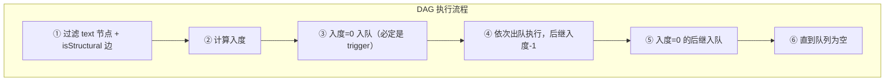

# JSON Schema 设计规范：连接器平台 V2

**关联文档**: plan.md, plan-db.md (§3 表结构定义), plan-api.md (§3 接口详细定义)  
**版本**: v7.2
**创建日期**: 2026-05-22  
**最后更新**: 2026-06-10
**修订说明**: v7.2 — §1.4 值表达式体系独立为 §3（原 §3~§6 顺延为 §4~§7）；§1.4 精简为简述并指向 §3

---

## 1. 设计哲学

### 1.1 设计目标

| 目标 | 说明 |
|------|------|
| **自描述** | Schema 本身说清字段含义、类型、约束，不散落在代码注释中 |
| **一致性** | 同一语义的字段在不同上下文中命名统一 |
| **可扩展** | 可新增字段，不破坏已有结构 |
| **无冗余** | 不用的字段不出现在 Schema 中 |

### 1.2 参考标准

| 标准 | 参考程度 | 说明 |
|------|---------|------|
| JSON Schema (draft-07) | 核心 | `type` / `properties` / `required` / `description` / `definitions` / `oneOf` / `allOf` / `if`-`then` 等元字段直接复用 |
| OpenAPI 3.0 components/schemas | 结构 | 可复用组件（authConfig / rateLimitConfig）+ 按场景组合的思想 |
| React Flow (@xyflow/react v12) | 格式 | Node（id/type/position/data）和 Edge（id/source/target/type/data）接口作为编排配置的存储格式骨架；框架字段与业务字段严格分层（见原则四） |

### 1.3 核心原则

| # | 原则 | 规则 | 示例 |
|:---:|------|------|------|
| 一 | **同名同构** | 同一语义的字段在不同上下文中使用同一 Schema 组件，不重复定义 | ① `authConfig` → 触发器和连接器共用 `authConfigDef`<br>② `rateLimitConfig` → 入站和出站共用 `rateLimitDef`<br>③ `inputContract` → 触发器和连接器统一走 `inputContractDef` |
| 二 | **无用不存** | 不适用于当前场景的字段不出现在 JSON 中，由 Schema 的 `if`-`then` + `additionalProperties: false` 约束 | ① trigger 不含 `protocolConfig`（端点固定）<br>② trigger 不含 `timeoutMs`（引擎控制）<br>③ trigger 不含 `outputContract`（由 exit 定义）<br>④ manual 触发不含 `authConfig` |
| 三 | **边即语义** | edge 不仅描述"谁连到谁"，还承载控制流语义——执行条件、错误路由、并行标记 | ① `businessType`：default / condition / error / loop_entry / loop_exit<br>② `connectionMode`：serial / parallel<br>③ `isStructural`：结构辅助边标记 |
| 四 | **框业分离** | React Flow 框架字段（id/type/position/source/target 等）不进 data，业务字段全在 data 内，两者不互串 | ① `node.id` / `node.type` / `node.position` → 框架字段<br>② `node.data.*` → 业务字段<br>③ `edge.source` / `edge.target` → 框架字段<br>④ `edge.data.*` → 业务字段 |

### 1.4 值表达式体系

编排中节点需要从多种来源取值——上游节点产出、固定常量、平台配置、内置函数、用户自定义脚本等。V2 统一为 `${$.scope.path}` 表达式语法，详细定义见 **[§3 值表达式体系](#3-值表达式体系)**。

> **核心要点**：① 5 种设计态值来源（node / constant / system / system.fn / script）；② 3 种引擎注入上下文（loop / error / execution — 路径设计态已知，值运行时注入）；③ 支持嵌套引用；④ 所有节点使用统一语法。

---

## 2. 命名规范与数据约束

### 2.1 统一字段命名规则

| 上下文 | 规则 | 示例 |
|--------|------|------|
| JSON 内部所有键名 | camelCase | `nameCn` / `authConfig` / `connectorVersionId` |
| 引用外部资源 ID | `*Id` 后缀 + string 类型 | `connectorVersionId: "1234567890"` |
| 时间字段 | `*Time` 后缀 | `createTime` / `publishedTime` |
| 布尔字段 | `is*` 前缀 | `isDeleted` / `isTest` |
| 扩展字段 | `x_*` 前缀 | `x_customMetadata` |
| 数据库列级枚举 | TINYINT 数字（plan-db.md §0.7） | `connector_type=1` |
| JSON 内嵌枚举 | UPPER_SNAKE_CASE 字符串（例外，见 §2.2） | `"SOA"` / `"SYSTOKEN"` |
| React Flow node.type | snake_case（注册组件名） | `trigger` / `loop_v2` / `condition_branch` |
| React Flow 框架字段 | 遵循官方命名 | `source`/`target`（非 sourceNodeId） |

### 2.2 JSON 内嵌枚举使用字符串的例外说明

> **设计决策**：`authConfig.type` 作为 MEDIUMTEXT JSON 嵌套字段，使用字符串枚举，非 TINYINT。
>
> | 维度 | 数据库列级枚举 | JSON 内嵌枚举 |
> |------|--------------|-------------|
> | **字段位置** | MySQL 列 | MEDIUMTEXT 列的 JSON 子字段 |
> | **枚举表示** | TINYINT | 字符串（`"SOA"` / `"AKSK"` 等） |
> | **设计理由** | 存储/索引效率 | 人类可读、版本快照 self-describing |
> | **规范适用** | plan-db.md §0.7 | 本文档 §2.2 |
>
> 枚举值对应关系（JSON 字符串 ⇄ DB TINYINT）：

| JSON 字符串 | TINYINT | 使用上下文 |
|------------|:---:|-----------|
| `SOA` | 1 | 连接器认证 |
| `APIG` | 2 | 连接器认证 |
| `NONE` | 4 | 连接器认证 |
| `AKSK` | 5 | 连接器认证 |
| `SYSTOKEN` | 7 | 触发器认证 |

### 2.3 FR-047 数据结构类型严格校验规则

> FR-047 是 V2 跨连接器和连接流的通用数据模型层约束，对所有 JSON Schema 定义的数据结构生效。

#### 2.3.1 基本类型限定

| 规则 | 说明 |
|------|------|
| 允许的基本类型 | `string`、`number`、`boolean`（仅三种） |
| null | 不作为合法字段类型 |
| number | 不区分 integer/float（统一为 `number`） |

#### 2.3.2 object 类型约束

- object 类型字段必须定义子字段结构（`properties` 非空）
- 禁止无子结构的空 object
- 每个子字段递归展开到基本类型

#### 2.3.3 array 类型约束

- array 类型字段必须声明 `items` 元素类型
- items 为 object 时需继续递归展开子字段到基本类型
- items 内各子字段的 value 表达式，最多只能引用一个上游 array 类型字段
- 禁止同时引用两个不同 array 源的字段（避免数组长度不一致歧义）
- 若 items 内所有 value 表达式均未引用 array 类型字段，数组最终长度为 1

#### 2.3.4 映射引用约束

- 禁止非基本类型（object/array）通过 value 表达式整体引用赋值
- object/array 必须逐字段展开，每个叶子字段各自引用基本类型字段
- value 表达式引用的上游字段类型必须与当前字段声明的 type 一致（string→string、number→number、boolean→boolean）
- 严禁隐式类型转换
- 所有映射表达式引用路径终点必须可解析到基本类型字段

#### 2.3.5 设计态校验时机

| 校验时机 | 校验内容 |
|---------|---------|
| Schema 编辑器输入 | object 无子字段 / array 无 items → 实时标红 |
| 连接器版本发布 | 入参/出参 Schema 合规性校验 → 不满足则禁止发布 |
| 连接流编排保存 | 所有节点间数据结构定义合规性校验 → 不满足则禁止保存 |
| 映射赋值检查 | value 表达式引用路径终点为 object/array → 标红禁止保存 |
| 类型一致性检查 | 引用源类型与声明类型不一致 → 标红提示具体不匹配字段 |

---

## 3. 值表达式体系

编排中每个节点需要的字段值可能来自多种来源——不仅仅是上游节点的输出，也可能是固定常量、系统配置、或内置函数计算结果。V2 统一为**单一表达式语法**，覆盖全部值来源。

### 3.1 值来源总览

| # | 作用域 | 性质 | 语法 | 示例 | 说明 |
|:---:|------|:---:|------|------|------|
| 1 | `node` | 设计态 | `${$.node.{id}.{input\|output\|current}.path}` | 见下方示例 | 引用任意节点的三个数据面：`input`（入参）、`output`（返回值）、`current`（过程中参数，仅结构节点） |
| 2 | `constant` | 设计态 | `${$.constant:value}` | `${$.constant:0}` | 编排设计者填入的固定值 |
| 3 | `system` | 设计态 | `${$.system.env.{key}}` / `.fn.{name}(args)` | `${$.system.env.region}`、`${$.system.fn.upper(...)}` | 双子类：`env`（环境变量含密钥）、`fn`（内置函数，值=Java类全路径.invoke） |
| 4 | `script` | 设计态 | `${$.script.{name}(args)}` | `${$.script.normalize(...)}` | 用户预定义脚本，按名引用传参，脚本名对应 Java 类全路径 `com.openapp.script.XxxScript.invoke` |
| 5 | `execution` | 运行时注入 | `${$.execution.id}` / `.flowId` / `.triggerTime` | `${$.execution.flowId}` | 引擎每次执行时注入的运行时元数据 |

> 表达式层级：`$.` = 根 → `node`/`constant`/`system`/`script`/`execution` = 作用域 → 具体路径或参数。

**`node` 的三个数据面**：

| 路径 | 语义 | 生命周期 | 示例 |
|------|------|---------|------|
| `input` | 节点的入参 | 节点执行期间 | `${$.node.trigger.input.sender}` — 触发器收到的请求字段 |
| `output` | 节点的返回值 | 执行完成后下游可引用 | `${$.node.node_1.output.msgId}` — 连接器调用下游 API 的返回 |
| `current` | 节点的过程中参数 | 仅结构节点（loop/error_handler）体内有效 | `${$.node.loop_1.current.item}` — 循环体内当前迭代元素 |

**结构节点 `current` 引用示例**：

| 场景 | `input` | `output` | `current` |
|------|:--:|:--:|------|
| 触发器收到请求 | `${$.node.trigger.input.sender}` | —（无返回值） | — |
| 连接器调用结果 | — | `${$.node.conn_1.output.msgId}` | — |
| 循环体内当前元素 | — | `${$.node.loop_1.output.items}`（原始数组） | `${$.node.loop_1.current.item}` |
| 循环体内当前索引 | — | — | `${$.node.loop_1.current.index}` |
| 多重循环内层 | — | — | `${$.node.loop_inner.current.item}` |
| 多重循环同时引用外层 | — | — | `${$.node.loop_outer.current.item}` |
| 错误处理体内错误码 | — | — | `${$.node.err_1.current.code}` |

### 3.2 运行时上下文对象

表达式 `${$.node.trigger.input.body.sender}` 中的 `$` 代表引擎构造的**运行时上下文 JSON 根对象**。以下按 HTTP 协议场景完整展开 trigger（入参三段式）、connector（入参三段式 + 出参两段式）、exit（出参两段式）、loop/error_handler（current 运行时上下文）：

```json
{
  "node": {
    "trigger": {
      "input": {
        "header": {
          "Authorization": "Bearer token-xxx",
          "Content-Type": "application/json"
        },
        "query": {
          "page": "1",
          "size": "20"
        },
        "body": {
          "sender": "u001",
          "content": "你好",
          "items": ["a", "b", "c"]
        }
      }
    },
    "conn_1": {
      "input": {
        "header": {
          "Authorization": "Bearer sk-xxxxxxxxxxxx"
        },
        "query": {
          "page": "1"
        },
        "body": {
          "itemId": "b",
          "size": 20
        }
      },
      "output": {
        "header": {
          "X-Request-Id": "req-001",
          "X-RateLimit-Remaining": "99"
        },
        "body": {
          "msgId": "msg_001",
          "name": "alice",
          "data": "raw data"
        }
      }
    },
    "exit": {
      "output": {
        "header": {
          "X-Trace-Id": "trace-abc"
        },
        "body": {
          "total": 3,
          "execId": "exec-2026-001"
        }
      }
    },
    "loop_1": {
      "output": { "items": ["a", "b", "c"] },
      "current": { "item": "b", "index": 1, "total": 3 }
    },
    "err_1": {
      "current": {
        "code": "503",
        "messageZh": "下游服务不可用",
        "messageEn": "Service Unavailable",
        "cause": "连接超时"
      }
    }
  },
  "system": {
    "env": {
      "apiKey": "sk-xxxxxxxxxxxx",
      "region": "cn-east",
      "locale": "zh-CN",
      "timeout": 5000
    },
    "fn": {
      "upper":     "com.openapp.fn.string.UpperFunction.invoke",
      "concat":    "com.openapp.fn.string.ConcatFunction.invoke",
      "substring": "com.openapp.fn.string.SubstringFunction.invoke",
      "add":       "com.openapp.fn.math.AddFunction.invoke",
      "length":    "com.openapp.fn.array.LengthFunction.invoke",
      "if":        "com.openapp.fn.logic.IfFunction.invoke"
    }
  },
  "script": {
    "normalize":     "com.openapp.script.NormalizeScript.invoke",
    "randomUserInfo": "com.openapp.script.RandomUserInfoScript.invoke"
  },
  "execution": { "id": "exec-2026-001", "flowId": "flow-12345", "triggerTime": "2026-06-10T10:00:00Z" }
}
```

> `constant` 不在运行时 JSON 中：`${$.constant:20}` 的值 `20` 直接写在表达式里，引擎解析表达式语法即得值，无需存入运行时上下文对象。

**各节点的数据面**：

| 节点类型 | `input` | `output` | `current` | 说明 |
|---------|:------:|:------:|:------:|------|
| trigger | ✅ header / query / body | — | — | 仅入参，HTTP 请求的三段 |
| connector | ✅ header / query / body（镜像 inputContract） | ✅ header / body（镜像 outputContract） | — | 入参 + 出参 |
| exit | — | ✅ header / body | — | 仅出参，对外 HTTP 响应 |
| loop_v2 | — | ✅（原始数组等） | ✅ item / index / total | output 为持久化属性，current 为迭代上下文 |
| error_handler | — | ✅（错误统计等） | ✅ code / messageZh / messageEn / cause | current 跟随 errorInfoDef |

**Path 解析对照 — 按作用域分组**：

| JSON Path | 解析结果 | 作用域 |
|-----------|---------|:---:|
| `$.node.trigger.input.header.Authorization` | `"Bearer token-xxx"` | node : input |
| `$.node.trigger.input.header.Content-Type` | `"application/json"` | node : input |
| `$.node.trigger.input.query.page` | `"1"` | node : input |
| `$.node.trigger.input.query.size` | `"20"` | node : input |
| `$.node.trigger.input.body.sender` | `"u001"` | node : input |
| `$.node.trigger.input.body.content` | `"你好"` | node : input |
| `$.node.trigger.input.body.items` | `["a", "b", "c"]` | node : input |
| `$.node.conn_1.input.header.Authorization` | `"Bearer sk-xxxxxxxxxxxx"` | node : input |
| `$.node.conn_1.input.query.page` | `"1"` | node : input |
| `$.node.conn_1.input.body.itemId` | `"b"` | node : input |
| `$.node.conn_1.input.body.size` | `20` | node : input |
| `$.node.conn_1.output.header.X-Request-Id` | `"req-001"` | node : output |
| `$.node.conn_1.output.header.X-RateLimit-Remaining` | `"99"` | node : output |
| `$.node.conn_1.output.body.msgId` | `"msg_001"` | node : output |
| `$.node.conn_1.output.body.name` | `"alice"` | node : output |
| `$.node.conn_1.output.body.data` | `"raw data"` | node : output |
| `$.node.exit.output.header.X-Trace-Id` | `"trace-abc"` | node : output |
| `$.node.exit.output.body.total` | `3` | node : output |
| `$.node.exit.output.body.execId` | `"exec-2026-001"` | node : output |
| `$.node.loop_1.current.item` | `"b"` | node : current |
| `$.node.loop_1.current.index` | `1` | node : current |
| `$.node.loop_1.current.total` | `3` | node : current |
| `$.node.err_1.current.code` | `"503"` | node : current |
| `$.node.err_1.current.messageZh` | `"下游服务不可用"` | node : current |
| `$.node.err_1.current.cause` | `"连接超时"` | node : current |
| `$.system.apiKey` | `"sk-xxxxxxxxxxxx"` | system |
| `$.system.env.region` | `"cn-east"` | system |
| `$.system.env.locale` | `"zh-CN"` | system |
| `$.system.fn.upper($.node.conn_1.output.body.name)` | `"ALICE"` | system.fn |
| `$.script.normalize($.node.conn_1.output.body.data, $.system.env.locale)` | `"normalized raw data"` | script |
| `$.execution.flowId` | `"flow-12345"` | execution |
| `$.execution.triggerTime` | `"2026-06-10T10:00:00Z"` | execution |

> `current` 不是独立作用域，是 `node` 下结构节点的运行时子路径，与 `input`/`output` 平级。仅在对应结构体内有效，多重循环按节点 ID 精确区分。
>
> `loop_v2` / `error_handler` 节点的 `output` 字段结构（持久化属性）和 `current` 下可用字段的完整列表，待 §4.4.14 `structureNodeDataDef.config` 专项细化后确定。

### 3.3 设计原则

| # | 原则 | 说明 |
|:---:|------|------|
| 1 | **映射结构镜像需求结构** | connector 的 inputContract 分 header/query/body，则 inputMapping 也分 header/query/body |
| 2 | **Schema 不硬编码协议** | inputMapping/outputMapping 定义为 `"type": "object"`，具体分段由应用层按协议校验 |
| 3 | **表达式体系统一** | 5 种值来源共用同一套 `${$.scope.path}` 语法，不因来源不同而异 |
| 4 | **必填检查在应用层** | mapping 是否覆盖 required 字段，由应用层校验，JSON Schema 不做跨对象约束 |

### 3.4 节点数据引用详述

DAG 中节点按拓扑顺序执行，上游节点的输出数据需要传递给下游节点。引用模型基于 **JSON 节点上下文对象**，区分设计态和运行态：

| | 设计态（Design-time） | 运行态（Runtime） |
|------|-------------------|---------------|
| **是什么** | 节点上下文对象的 Schema 定义 | 引擎根据设计态构造的实际 JSON 对象 |
| **谁来定义** | connector 的 inputContract/outputContract 等 | 引擎在节点执行时自动构造 |
| **示例** | `{ type: "object", properties: { sender: { type: "string" } } }` | `{ sender: "u001", content: "你好" }` |

> 编排配置中存储设计态定义，引擎运行时根据定义构造 JSON 节点上下文对象，再按 mapping 映射到当前节点。

```
设计态（编排配置中存储）                    运行态（引擎执行时构造）
┌─────────────────────────┐              ┌─────────────────────────┐
│ trigger.inputContract   │              │ trigger.context         │
│ {                       │    构造      │ {                       │
│   body: {               │  ────────▶   │   input: {             │
│     properties: {       │              │     sender: "u001",    │
│       sender: {...},    │              │     content: "你好"     │
│       content: {...}    │              │   },                   │
│     }                   │              │   output: { ... }      │
│   }                     │              │ }                      │
│ }                       │              └─────────────────────────┘
└─────────────────────────┘
```

### 3.5 系统内置函数

数据处理器（`data_processor`）节点可在映射表达式中使用系统内置函数。`system.fn.{name}` 在引擎中解析为 Java 类全路径，反射调用并返回值，参数由引擎自动传入：

| 类别 | 函数名 | 类路径 | 说明 |
|------|--------|--------|------|
| 字符串 | `upper` | `com.openapp.fn.string.UpperFunction.invoke` | 转大写 |
| 字符串 | `lower` | `com.openapp.fn.string.LowerFunction.invoke` | 转小写 |
| 字符串 | `concat` | `com.openapp.fn.string.ConcatFunction.invoke` | 多字符串拼接 |
| 字符串 | `substring` | `com.openapp.fn.string.SubstringFunction.invoke` | 截取子串 |
| 数学 | `add` | `com.openapp.fn.math.AddFunction.invoke` | 加法 |
| 数学 | `multiply` | `com.openapp.fn.math.MultiplyFunction.invoke` | 乘法 |
| 数学 | `round` | `com.openapp.fn.math.RoundFunction.invoke` | 四舍五入 |
| 数学 | `abs` | `com.openapp.fn.math.AbsFunction.invoke` | 绝对值 |
| 数组 | `length` | `com.openapp.fn.array.LengthFunction.invoke` | 数组长度 |
| 数组 | `first` | `com.openapp.fn.array.FirstFunction.invoke` | 首元素 |
| 数组 | `join` | `com.openapp.fn.array.JoinFunction.invoke` | 用分隔符连接 |
| 逻辑 | `if` | `com.openapp.fn.logic.IfFunction.invoke` | 三元条件 (cond, then, else) |
| 逻辑 | `equals` | `com.openapp.fn.logic.EqualsFunction.invoke` | 相等比较 |
| 逻辑 | `isEmpty` | `com.openapp.fn.logic.IsEmptyFunction.invoke` | 空值检测 |

### 3.6 自定义脚本

用户可预先定义脚本（如 Groovy / JavaScript），存储到平台脚本库中。编排设计时按名引用，传入参数，引擎运行时执行并返回结果。

```
${$.script.validateItem($.loop.item, $.system.env.region)}
```

脚本参数可嵌套引用任意值来源（node / constant / system / system.fn / loop / error / execution / script）。

### 3.7 嵌套规则

所有值来源的参数支持互相嵌套：

```
// 系统函数 + 节点引用 + 常量
${$.system.fn.concat($.node.trigger.input.firstName, $.constant:" ", $.node.trigger.input.lastName)}

// 自定义脚本 + 循环上下文 + 系统变量
${$.script.validate($.loop.item, $.system.env.region)}

// 错误处理中引用错误信息 + 执行元数据
${$.system.fn.format($.error.message, $.execution.flowId)}
```

---

## 4. 共享 Schema 组件库

> 以下 §5（连接器配置）和 §6（连接流编排配置）均引用本章定义的共享组件。

### 4.1 组件速查表

| # | 组件名 | 用途 | 被引用方 |
|:---:|--------|------|---------|
| 1 | `authConfigDef` | 认证类型声明（含凭证字段列表） | §5 connectionConfig, §4.4.10 triggerDataDef |
| 2 | `rateLimitDef` | 限流配置（QPS + 并发） | §5 connectionConfig, §4.4.10 triggerDataDef |
| 3 | `jsonSchemaObjectDef` | 纯字段形状描述（类型 + 属性 + 必填） | §4.4.4 httpInputContractDef, §4.4.5 httpOutputContractDef |
| 4 | `httpInputContractDef` | HTTP 入参契约（header/query/body 三段式） | §4.4.6 inputContractDef |
| 5 | `httpOutputContractDef` | HTTP 出参契约（header/body 两段式） | §4.4.7 outputContractDef |
| 6 | `inputContractDef` | 入参契约路由器（oneOf 按协议分发） | §5 connectionConfig, §4.4.10 triggerDataDef |
| 7 | `outputContractDef` | 出参契约路由器（oneOf 按协议分发） | §5 connectionConfig |
| 8 | `errorInfoDef` | 错误详情（code + 双语 message + 根因） | §7 执行数据 |
| 9 | `nodeDataDef` | 节点 data 路由器（oneOf 按 node.type 分发至 7 种 data Schema） | §6.4 orchestrationConfig |
| 10 | `triggerDataDef` | 触发器节点业务数据（触发类型 + 认证 + 入参契约） | §4.4.9 nodeDataDef |
| 11 | `connectorDataDef` | 连接器节点业务数据（版本引用 + 字段映射） | §4.4.9 nodeDataDef |
| 12 | `dataProcessorDataDef` | 数据处理器节点业务数据（字段映射管道） | §4.4.9 nodeDataDef |
| 13 | `exitDataDef` | 出口节点业务数据（出参字段映射） | §4.4.9 nodeDataDef |
| 14 | `structureNodeDataDef` | 结构体主节点业务数据（循环/并行/条件/错误处理，config 预留） | §4.4.9 nodeDataDef |
| 15 | `textMarkerDataDef` | text 标记节点数据（纯渲染，不参与执行，config 预留） | §4.4.9 nodeDataDef |
| — | `mappedFieldDef` | 带映射值的字段定义（叶子/嵌套/数组递归） | connectorDataDef.inputMapping, exitDataDef.outputMapping |
| — | `mappedJsonSchemaObjectDef` | 带映射值的对象字段定义（递归容器） | mappedFieldDef（递归引用） |

### 4.2 设计思路与字段↔定义映射

为避免「JSON 字段与 JSON 字段定义同名」的歧义，本规范区分两者：
- **JSON 字段（field name）**：JSON 数据中的属性键，描述「存什么数据」（如 `authConfig`）
- **JSON 字段定义（definition key）**：校验规则组件键名（如 `authConfigDef`）

```mermaid
graph LR
    subgraph Fields["JSON 字段名（数据侧）"]
        F1["authConfig"]  F2["rateLimitConfig"]
        F3["inputContract"]  F4["outputContract"]
        F5["errorInfo"]
    end
    subgraph Defs["JSON 字段定义（规则侧）"]
        D1["authConfigDef"]  D2["rateLimitDef"]
        D3["inputContractDef --oneOf--> httpInputContractDef"]
        D4["outputContractDef --oneOf--> httpOutputContractDef"]
        D0["jsonSchemaObjectDef（复用）"]  D5["errorInfoDef"]
    end
    F1 --"$ref"--> D1  F2 --"$ref"--> D2
    F3 --"$ref"--> D3  F4 --"$ref"--> D4
    D3 --"引用"--> D0  D4 --"引用"--> D0
    F5 --"$ref"--> D5
    style Fields fill:#e3f2fd,stroke:#1565c0
    style Defs fill:#fff3e0,stroke:#ef6c00
```

### 4.3 完整组件定义

以下 JSON 为所有共享组件定义的聚合，是整个文档中 JSON Schema 定义的唯一权威来源。各组件通过 `#/definitions/xxx` 路径被 §5 和 §6 引用。

```json
{
  "$schema": "http://json-schema.org/draft-07/schema#",
  "$id": "urn:openapp:schema:definitions:v7",
  "title": "共享 Schema 组件聚合",
  "description": "所有上下文 Schema 共用的组件定义。v7：V2 对齐——nodeDataDef 扩展至 7 分支（含结构节点 + text 标记），新增 structureNodeDataDef / textMarkerDataDef",

  "definitions": {

    "authConfigDef": {
      "$id": "urn:openapp:schema:authConfigDef:v1",
      "title": "authConfigDef",
      "description": "认证类型声明。type 使用字符串枚举（见 §2.2 例外说明）",
      "type": "object",
      "additionalProperties": false,
      "properties": {
        "type": {
          "type": "string",
          "enum": ["SOA", "APIG", "SYSTOKEN", "AKSK", "NONE"]
        },
        "fields": {
          "type": "array",
          "description": "凭证字段列表",
          "items": {
            "type": "object",
            "additionalProperties": false,
            "properties": {
              "name": { "type": "string", "description": "字段名" },
              "carrier": { "type": "string", "enum": ["header", "query"] },
              "fieldName": { "type": "string", "description": "实际 HTTP 字段名" },
              "required": { "type": "boolean", "default": true },
              "sensitive": { "type": "boolean", "default": false }
            },
            "required": ["name", "carrier", "fieldName"]
          }
        }
      },
      "required": ["type"]
    },

    "rateLimitDef": {
      "$id": "urn:openapp:schema:rateLimitDef:v1",
      "title": "rateLimitDef",
      "type": "object",
      "additionalProperties": false,
      "properties": {
        "maxQps": { "type": "integer", "minimum": 1, "maximum": 10000 },
        "maxConcurrency": { "type": "integer", "minimum": 1, "maximum": 1000 }
      }
    },

    "mappedFieldDef": {
      "$id": "urn:openapp:schema:mappedFieldDef:v1",
      "title": "mappedFieldDef",
      "description": "带映射值的字段定义。支持叶子字段 + 嵌套 object/array 递归",
      "oneOf": [
        {
          "description": "叶子字段：基本类型 + value 映射表达式",
          "type": "object",
          "additionalProperties": false,
          "properties": {
            "type": { "type": "string", "enum": ["string", "integer", "number", "boolean"] },
            "description": { "type": "string" },
            "value": { "type": "string", "description": "映射表达式，遵循 §3 值表达式体系语法" },
            "enum": { "type": "array" },
            "default": {}
          },
          "required": ["type", "value"]
        },
        {
          "description": "嵌套 object",
          "$ref": "#/definitions/mappedJsonSchemaObjectDef"
        },
        {
          "description": "数组字段",
          "type": "object",
          "additionalProperties": false,
          "properties": {
            "type": { "type": "string", "enum": ["array"] },
            "description": { "type": "string" },
            "items": { "$ref": "#/definitions/mappedFieldDef" }
          },
          "required": ["type", "items"]
        }
      ]
    },

    "mappedJsonSchemaObjectDef": {
      "$id": "urn:openapp:schema:mappedJsonSchemaObjectDef:v1",
      "title": "mappedJsonSchemaObjectDef",
      "description": "带映射值的对象字段定义，支持递归嵌套",
      "type": "object",
      "properties": {
        "type": { "type": "string", "enum": ["object"] },
        "properties": {
          "type": "object",
          "additionalProperties": { "$ref": "#/definitions/mappedFieldDef" }
        },
        "required": {
          "type": "array",
          "items": { "type": "string" }
        }
      },
      "required": ["type", "properties"]
    },

    "jsonSchemaObjectDef": {
      "$id": "urn:openapp:schema:jsonSchemaObjectDef:v1",
      "title": "jsonSchemaObjectDef",
      "description": "JSON Schema draft-07 object 类型定义。纯字段形状描述，被各协议 contract 复用",
      "type": "object",
      "properties": {
        "type": { "type": "string", "enum": ["object"] },
        "properties": {
          "type": "object",
          "additionalProperties": {
            "type": "object",
            "properties": {
              "type": { "type": "string" },
              "description": { "type": "string" },
              "items": { "type": "object" },
              "enum": { "type": "array" },
              "default": {},
              "minimum": { "type": "number" },
              "maximum": { "type": "number" }
            },
            "required": ["type"]
          }
        },
        "required": {
          "type": "array",
          "items": { "type": "string" }
        }
      },
      "required": ["type", "properties"]
    },

    "httpInputContractDef": {
      "$id": "urn:openapp:schema:httpInputContractDef:v1",
      "title": "httpInputContractDef",
      "description": "HTTP 入参契约——header / query / body 三段式",
      "type": "object",
      "additionalProperties": false,
      "properties": {
        "protocol": { "type": "string", "const": "HTTP" },
        "header": { "$ref": "#/definitions/jsonSchemaObjectDef" },
        "query":  { "$ref": "#/definitions/jsonSchemaObjectDef" },
        "body":   { "$ref": "#/definitions/jsonSchemaObjectDef" }
      },
      "required": ["protocol"],
      "anyOf": [
        { "required": ["header"] },
        { "required": ["query"] },
        { "required": ["body"] }
      ]
    },

    "httpOutputContractDef": {
      "$id": "urn:openapp:schema:httpOutputContractDef:v1",
      "title": "httpOutputContractDef",
      "description": "HTTP 出参契约——header / body 两段式",
      "type": "object",
      "additionalProperties": false,
      "properties": {
        "protocol": { "type": "string", "const": "HTTP" },
        "header": { "$ref": "#/definitions/jsonSchemaObjectDef" },
        "body":   { "$ref": "#/definitions/jsonSchemaObjectDef" }
      },
      "required": ["protocol"],
      "anyOf": [
        { "required": ["header"] },
        { "required": ["body"] }
      ]
    },

    "inputContractDef": {
      "$id": "urn:openapp:schema:inputContractDef:v1",
      "title": "inputContractDef",
      "description": "入参契约路由器——oneOf 按协议类型分发",
      "type": "object",
      "oneOf": [
        { "$ref": "#/definitions/httpInputContractDef" }
      ]
    },

    "outputContractDef": {
      "$id": "urn:openapp:schema:outputContractDef:v1",
      "title": "outputContractDef",
      "description": "出参契约路由器——oneOf 按协议类型分发",
      "type": "object",
      "oneOf": [
        { "$ref": "#/definitions/httpOutputContractDef" }
      ]
    },

    "errorInfoDef": {
      "$id": "urn:openapp:schema:errorInfoDef:v2",
      "title": "errorInfoDef",
      "description": "错误详情。code 为数字字符串，message 双语拆分",
      "type": "object",
      "additionalProperties": false,
      "properties": {
        "code": {
          "type": "string",
          "pattern": "^[1-9][0-9]{2,4}$"
        },
        "messageZh": { "type": "string" },
        "messageEn": { "type": "string" },
        "cause": { "type": "string", "description": "根因描述（内部错误时携带）" },
        "downstreamStatus": { "type": "integer", "description": "下游 HTTP 状态码" },
        "downstreamBody": { "type": "string", "description": "下游响应体片段" }
      },
      "required": ["code", "messageZh", "messageEn"],
      "oneOf": [
        { "required": ["cause"] },
        { "required": ["downstreamStatus"] }
      ]
    },

    "nodeDataDef": {
      "$id": "urn:openapp:schema:nodeDataDef:v2",
      "title": "nodeDataDef",
      "description": "节点业务数据路由器。V2 扩展至 7 分支——按 node.type 分发到对应 data Schema",
      "type": "object",
      "oneOf": [
        { "$ref": "#/definitions/triggerDataDef",          "description": "node.type='trigger'" },
        { "$ref": "#/definitions/connectorDataDef",         "description": "node.type='connector'" },
        { "$ref": "#/definitions/dataProcessorDataDef",     "description": "node.type='data_processor'" },
        { "$ref": "#/definitions/exitDataDef",              "description": "node.type='exit'" },
        { "$ref": "#/definitions/structureNodeDataDef",     "description": "node.type='loop_v2'|'parallel'|'condition_branch'|'error_handler'" },
        { "$ref": "#/definitions/textMarkerDataDef",        "description": "node.type='text'（不参与 DAG 执行）" }
      ]
    },

    "triggerDataDef": {
      "$id": "urn:openapp:schema:triggerDataDef:v2",
      "title": "triggerDataDef",
      "description": "触发器节点业务数据。node.type='trigger' 时 node.data 内的结构",
      "type": "object",
      "additionalProperties": false,
      "properties": {
        "labelCn": { "type": "string" },
        "labelEn": { "type": "string" },
        "type": { "type": "string", "enum": ["http", "manual"] },
        "authConfig": { "$ref": "#/definitions/authConfigDef" },
        "inputContract": { "$ref": "#/definitions/inputContractDef" },
        "rateLimitConfig": { "$ref": "#/definitions/rateLimitDef" }
      },
      "required": ["type"],
      "allOf": [
        {
          "if": { "properties": { "type": { "const": "http" } }, "required": ["type"] },
          "then": { "required": ["authConfig", "inputContract"] }
        },
        {
          "if": { "properties": { "type": { "const": "manual" } }, "required": ["type"] },
          "then": { "properties": { "authConfig": false, "inputContract": false } }
        }
      ]
    },

    "connectorDataDef": {
      "$id": "urn:openapp:schema:connectorDataDef:v1",
      "title": "connectorDataDef",
      "description": "连接器节点业务数据。node.type='connector' 时 node.data 内的结构",
      "type": "object",
      "additionalProperties": false,
      "properties": {
        "labelCn": { "type": "string" },
        "labelEn": { "type": "string" },
        "connectorVersionId": {
          "type": "string",
          "pattern": "^[1-9][0-9]{15,19}$",
          "description": "引用的连接器版本 ID，必须为已发布版本"
        },
        "inputMapping": {
          "type": "object",
          "properties": {
            "header": { "$ref": "#/definitions/mappedJsonSchemaObjectDef" },
            "query":  { "$ref": "#/definitions/mappedJsonSchemaObjectDef" },
            "body":   { "$ref": "#/definitions/mappedJsonSchemaObjectDef" }
          }
        }
      },
      "required": ["connectorVersionId", "inputMapping"]
    },

    "dataProcessorDataDef": {
      "$id": "urn:openapp:schema:dataProcessorDataDef:v1",
      "title": "dataProcessorDataDef",
      "description": "数据处理器节点业务数据。node.type='data_processor' 时 node.data 内的结构",
      "type": "object",
      "additionalProperties": false,
      "properties": {
        "labelCn": { "type": "string" },
        "labelEn": { "type": "string" },
        "config": {
          "type": "object",
          "additionalProperties": false,
          "properties": {
            "fieldMappings": {
              "type": "array",
              "minItems": 1,
              "items": {
                "type": "object",
                "additionalProperties": false,
                "properties": {
                  "source": { "type": "string", "description": "值表达式，遵循 §3 值表达式体系" },
                  "target": { "type": "string" }
                },
                "required": ["source", "target"]
              }
            }
          }
        }
      },
      "required": ["config"]
    },

    "exitDataDef": {
      "$id": "urn:openapp:schema:exitDataDef:v1",
      "title": "exitDataDef",
      "description": "出口节点业务数据。node.type='exit' 时 node.data 内的结构",
      "type": "object",
      "additionalProperties": false,
      "properties": {
        "labelCn": { "type": "string" },
        "labelEn": { "type": "string" },
        "outputMapping": {
          "type": "object",
          "properties": {
            "header": { "$ref": "#/definitions/mappedJsonSchemaObjectDef" },
            "body":   { "$ref": "#/definitions/mappedJsonSchemaObjectDef" }
          }
        }
      },
      "required": ["outputMapping"]
    },

    "structureNodeDataDef": {
      "$id": "urn:openapp:schema:structureNodeDataDef:v1",
      "title": "structureNodeDataDef",
      "description": "结构体主节点业务数据。覆盖 loop_v2 / parallel / condition_branch / error_handler。config 预留",
      "type": "object",
      "additionalProperties": false,
      "properties": {
        "labelCn": { "type": "string" },
        "labelEn": { "type": "string" },
        "type": {
          "type": "string",
          "enum": ["loop_v2", "parallel", "condition_branch", "error_handler"]
        },
        "config": {
          "type": "object",
          "description": "结构体配置（预留槽）"
        }
      },
      "required": ["type"]
    },

    "textMarkerDataDef": {
      "$id": "urn:openapp:schema:textMarkerDataDef:v1",
      "title": "textMarkerDataDef",
      "description": "text 标记节点数据。纯渲染，不参与 DAG 执行。config 预留",
      "type": "object",
      "additionalProperties": false,
      "properties": {
        "labelCn": { "type": "string" },
        "labelEn": { "type": "string" },
        "type": { "type": "string", "const": "text" },
        "config": { "type": "object", "description": "归属配置（预留槽）" }
      }
    }
  }
}
```

### 4.4 组件详解

#### 4.4.1 authConfigDef

```json
{
  "$id": "urn:openapp:schema:authConfigDef:v1",
  "type": "object",
  "additionalProperties": false,
  "properties": {
    "type": { "type": "string", "enum": ["SOA", "APIG", "SYSTOKEN", "AKSK", "NONE"] },
    "fields": {
      "type": "array",
      "items": {
        "type": "object",
        "additionalProperties": false,
        "properties": {
          "name": { "type": "string" },
          "carrier": { "type": "string", "enum": ["header", "query"] },
          "fieldName": { "type": "string" },
          "required": { "type": "boolean", "default": true },
          "sensitive": { "type": "boolean", "default": false }
        },
        "required": ["name", "carrier", "fieldName"]
      }
    }
  },
  "required": ["type"]
}
```

示例：

```json
{
  "type": "SYSTOKEN",
  "fields": [
    { "name": "token", "carrier": "header", "fieldName": "X-Sys-Token", "required": true, "sensitive": true }
  ]
}
```

| JSON 字段 | 类型 | 必填 | 说明 |
|-----------|------|:----:|------|
| type | string | ✅ | 认证类型：`SOA` / `APIG` / `SYSTOKEN` / `AKSK` / `NONE` |
| fields[] | array | ❌ | 凭证字段列表 |
| fields[].name | string | ✅ | 字段名，程序内部标识 |
| fields[].carrier | string | ✅ | 传递位置：`header` / `query` |
| fields[].fieldName | string | ✅ | 实际 HTTP 字段名，如 `X-Sys-Token` |
| fields[].required | boolean | ❌ | 是否必填，默认 `true` |
| fields[].sensitive | boolean | ❌ | 运行时脱敏，默认 `false` |

#### 4.4.2 rateLimitDef

```json
{
  "$id": "urn:openapp:schema:rateLimitDef:v1",
  "type": "object",
  "additionalProperties": false,
  "properties": {
    "maxQps": { "type": "integer", "minimum": 1, "maximum": 10000 },
    "maxConcurrency": { "type": "integer", "minimum": 1, "maximum": 1000 }
  }
}
```

| JSON 字段 | 类型 | 必填 | 说明 |
|-----------|------|:----:|------|
| maxQps | integer | ❌ | 每秒最大请求数，范围 1-10000 |
| maxConcurrency | integer | ❌ | 最大并发数，范围 1-1000 |

#### 4.4.3 jsonSchemaObjectDef

纯字段形状描述组件，不包含协议位置信息。被 httpInputContractDef / httpOutputContractDef 引用。

```json
{
  "$id": "urn:openapp:schema:jsonSchemaObjectDef:v1",
  "type": "object",
  "properties": {
    "type": { "type": "string", "enum": ["object"] },
    "properties": {
      "type": "object",
      "additionalProperties": {
        "type": "object",
        "properties": {
          "type": { "type": "string" },
          "description": { "type": "string" },
          "items": { "type": "object" },
          "enum": { "type": "array" },
          "default": {},
          "minimum": { "type": "number" },
          "maximum": { "type": "number" }
        },
        "required": ["type"]
      }
    },
    "required": { "type": "array", "items": { "type": "string" } }
  },
  "required": ["type", "properties"]
}
```

#### 4.4.4 httpInputContractDef

HTTP 入参契约，按传输位置分为 header / query / body 三段。

```json
{
  "$id": "urn:openapp:schema:httpInputContractDef:v1",
  "type": "object",
  "additionalProperties": false,
  "properties": {
    "protocol": { "type": "string", "const": "HTTP" },
    "header": { "$ref": "#/definitions/jsonSchemaObjectDef" },
    "query":  { "$ref": "#/definitions/jsonSchemaObjectDef" },
    "body":   { "$ref": "#/definitions/jsonSchemaObjectDef" }
  },
  "required": ["protocol"],
  "anyOf": [
    { "required": ["header"] },
    { "required": ["query"] },
    { "required": ["body"] }
  ]
}
```

| JSON 字段 | 类型 | 必填 | 说明 |
|-----------|------|:----:|------|
| protocol | string | ✅ | 协议标识，固定为 `HTTP` |
| header | object | ❌ ⚡ | 请求头参数定义 |
| query | object | ❌ ⚡ | Query 参数定义 |
| body | object | ❌ ⚡ | 请求体参数定义 |

⚡ = anyOf：必须至少声明 header / query / body 其中之一。

#### 4.4.5 httpOutputContractDef

HTTP 出参契约，按传输位置分为 header / body 两段。

```json
{
  "$id": "urn:openapp:schema:httpOutputContractDef:v1",
  "type": "object",
  "additionalProperties": false,
  "properties": {
    "protocol": { "type": "string", "const": "HTTP" },
    "header": { "$ref": "#/definitions/jsonSchemaObjectDef" },
    "body":   { "$ref": "#/definitions/jsonSchemaObjectDef" }
  },
  "required": ["protocol"],
  "anyOf": [
    { "required": ["header"] },
    { "required": ["body"] }
  ]
}
```

| JSON 字段 | 类型 | 必填 | 说明 |
|-----------|------|:----:|------|
| protocol | string | ✅ | 协议标识，固定为 `HTTP` |
| header | object | ❌ ⚡ | 响应头字段定义 |
| body | object | ❌ ⚡ | 响应体字段定义 |

⚡ = anyOf：必须至少声明 header / body 其中之一。

#### 4.4.6 inputContractDef

入参契约路由器。通过 oneOf 按协议类型分发：

```json
{
  "$id": "urn:openapp:schema:inputContractDef:v1",
  "type": "object",
  "oneOf": [
    { "$ref": "#/definitions/httpInputContractDef" }
  ]
}
```

| 协议 | 目标定义 | 说明 |
|------|---------|------|
| `HTTP` | `httpInputContractDef`（§4.4.4） | header / query / body |
| `REDIS`（V1） | `redisInputContractDef` | 待定义 |
| `MYSQL`（V1） | `mysqlInputContractDef` | 待定义 |

#### 4.4.7 outputContractDef

出参契约路由器：

```json
{
  "$id": "urn:openapp:schema:outputContractDef:v1",
  "type": "object",
  "oneOf": [
    { "$ref": "#/definitions/httpOutputContractDef" }
  ]
}
```

| 协议 | 目标定义 | 说明 |
|------|---------|------|
| `HTTP` | `httpOutputContractDef`（§4.4.5） | header / body |
| `REDIS`（V1） | `redisOutputContractDef` | 待定义 |

#### 4.4.8 errorInfoDef

```json
{
  "$id": "urn:openapp:schema:errorInfoDef:v2",
  "type": "object",
  "additionalProperties": false,
  "properties": {
    "code": { "type": "string", "pattern": "^[1-9][0-9]{2,4}$" },
    "messageZh": { "type": "string" },
    "messageEn": { "type": "string" },
    "cause": { "type": "string" },
    "downstreamStatus": { "type": "integer" },
    "downstreamBody": { "type": "string" }
  },
  "required": ["code", "messageZh", "messageEn"],
  "oneOf": [
    { "required": ["cause"] },
    { "required": ["downstreamStatus"] }
  ]
}
```

| JSON 字段 | 类型 | 必填 | 说明 |
|-----------|------|:----:|------|
| code | string | ✅ | 错误码。4xx/5xx=下游错误，6xxxx=内部错误 |
| messageZh | string | ✅ | 错误中文描述 |
| messageEn | string | ✅ | 错误英文描述 |
| cause | string | ❌ ⚡ | 根因描述（内部错误时必填） |
| downstreamStatus | integer | ❌ ⚡ | 下游 HTTP 状态码（下游错误时必填） |
| downstreamBody | string | ❌ | 下游响应体片段（截断到 512 字符） |

错误码字典：

| Code | messageZh | messageEn | 来源 |
|:----:|-----------|-----------|:----:|
| `400` | 下游请求参数错误 | Bad Request | downstream |
| `401` | 下游未授权 | Unauthorized | downstream |
| `403` | 下游无权限 | Forbidden | downstream |
| `404` | 下游资源不存在 | Not Found | downstream |
| `500` | 下游内部错误 | Internal Server Error | downstream |
| `502` | 下游网关错误 | Bad Gateway | downstream |
| `503` | 下游服务不可用 | Service Unavailable | downstream |
| `504` | 下游网关超时 | Gateway Timeout | downstream |
| `6001` | 字段映射失败 | Field Mapping Failed | internal |
| `6002` | JSON 解析失败 | JSON Parse Failed | internal |
| `6003` | 编排执行超时 | Orchestration Timeout | internal |
| `6004` | 连接器版本未找到 | Connector Version Not Found | internal |

#### 4.4.9 nodeDataDef（路由汇总）

节点业务数据路由器，根据 `node.type` 选择对应的 data Schema。V2 扩展至 **7 分支**：

| `node.type` 值 | 对应 data Schema | $ref 目标 | 详见 |
|----------------|-----------------|-----------|:--:|
| `trigger` | triggerDataDef | `#/definitions/triggerDataDef` | §4.4.10 |
| `connector` | connectorDataDef | `#/definitions/connectorDataDef` | §4.4.11 |
| `data_processor` | dataProcessorDataDef | `#/definitions/dataProcessorDataDef` | §4.4.12 |
| `exit` | exitDataDef | `#/definitions/exitDataDef` | §4.4.13 |
| `loop_v2` / `parallel` / `condition_branch` / `error_handler` | structureNodeDataDef | `#/definitions/structureNodeDataDef` | §4.4.14 |
| `text` | textMarkerDataDef | `#/definitions/textMarkerDataDef` | §4.4.15 |

#### 4.4.10 triggerDataDef

| JSON 字段 | 类型 | 必填 | 说明 |
|-----------|------|:----:|------|
| labelCn | string | ❌ | 节点中文标签 |
| labelEn | string | ❌ | 节点英文标签 |
| type | string | ✅ | 触发子类型：`http` / `manual` |
| authConfig | object | ❌ ⚡ | 认证配置（HTTP 触发时必填），见 §4.4.1 |
| inputContract | object | ❌ ⚡ | 入参数据契约（HTTP 触发时必填），见 §4.4.6 |
| rateLimitConfig | object | ❌ | 限流配置，见 §4.4.2 |

⚡ = `type="http"` 时必填。

#### 4.4.11 connectorDataDef

| JSON 字段 | 类型 | 必填 | 说明 |
|-----------|------|:----:|------|
| labelCn | string | ❌ | 节点中文标签 |
| labelEn | string | ❌ | 节点英文标签 |
| connectorVersionId | string | ✅ | 引用的连接器版本 ID（18-20 位数字，必须为已发布版本） |
| inputMapping | object | ✅ | 字段映射，结构镜像连接器 inputContract 协议，value 遵循 §3 值表达式体系 |

#### 4.4.12 dataProcessorDataDef

| JSON 字段 | 类型 | 必填 | 说明 |
|-----------|------|:----:|------|
| labelCn | string | ❌ | 节点中文标签 |
| labelEn | string | ❌ | 节点英文标签 |
| config | object | ✅ | 管道转换配置 |
| config.fieldMappings[] | array | ✅ | 字段映射列表，至少 1 项 |
| config.fieldMappings[].source | string | ✅ | 值表达式，遵循 §3 值表达式体系 |
| config.fieldMappings[].target | string | ✅ | 目标字段路径 |

#### 4.4.13 exitDataDef

| JSON 字段 | 类型 | 必填 | 说明 |
|-----------|------|:----:|------|
| labelCn | string | ❌ | 节点中文标签 |
| labelEn | string | ❌ | 节点英文标签 |
| outputMapping | object | ✅ | 字段映射，结构镜像连接器 outputContract 协议，value 遵循 §3 值表达式体系 |

#### 4.4.14 structureNodeDataDef（V2 新增）

| JSON 字段 | 类型 | 必填 | 说明 |
|-----------|------|:----:|------|
| labelCn | string | ❌ | 节点中文标签 |
| labelEn | string | ❌ | 节点英文标签 |
| type | string | ✅ | 结构体类型：`loop_v2` / `parallel` / `condition_branch` / `error_handler` |
| config | object | ❌ | 结构体配置（预留槽） |

#### 4.4.15 textMarkerDataDef（V2 新增）

| JSON 字段 | 类型 | 必填 | 说明 |
|-----------|------|:----:|------|
| labelCn | string | ❌ | 节点展示中文文本 |
| labelEn | string | ❌ | 节点展示英文文本 |
| type | string | ✅ | 固定为 `text` |
| config | object | ❌ | 结构归属配置（预留槽） |

---

## 5. 连接器配置 Schema

### 5.1 定位与存储

| 维度 | 说明 |
|------|------|
| 存储位置 | connector_version_t.connection_config (MEDIUMTEXT) |
| 框架归属 | 无 — 与 React Flow 完全无关 |
| 数据性质 | 连接器版本自身的对外 API 声明 |
| 生命周期 | 随连接器版本创建/发布，独立于编排 |
| 引用方式 | 编排中 connector 节点通过 connectorVersionId 引用已发布版本 |

### 5.2 Schema 定义

```json
{
  "$schema": "http://json-schema.org/draft-07/schema#",
  "$id": "urn:openapp:schema:connectionConfig:v3",
  "title": "connectionConfig",
  "description": "连接器配置，声明如何调用下游 API。存储在 connector_version_t.connection_config MEDIUMTEXT 字段中",
  "type": "object",
  "additionalProperties": false,
  "properties": {
    "labelCn": { "type": "string" },
    "labelEn": { "type": "string" },
    "protocol": { "type": "string", "enum": ["HTTP"] },
    "protocolConfig": {
      "type": "object",
      "additionalProperties": false,
      "properties": {
        "url": { "type": "string" },
        "method": { "type": "string", "enum": ["GET", "POST", "PUT", "DELETE", "PATCH"] },
        "headers": { "type": "object" }
      },
      "required": ["url", "method"]
    },
    "authConfig": { "$ref": "#/definitions/authConfigDef" },
    "inputContract": { "$ref": "#/definitions/inputContractDef" },
    "outputContract": { "$ref": "#/definitions/outputContractDef" },
    "timeoutMs": { "type": "integer", "default": 3000, "minimum": 1000, "maximum": 300000 },
    "rateLimitConfig": { "$ref": "#/definitions/rateLimitDef" }
  },
  "required": ["protocol", "protocolConfig"]
}
```

### 5.3 字段说明

| 字段 | 类型 | 必填 | 说明 | 引用 |
|------|------|:----:|------|------|
| labelCn | string | ❌ | 连接器中文标签 | — |
| labelEn | string | ❌ | 连接器英文标签 | — |
| protocol | string | ✅ | 协议类型，MVP 仅 `HTTP` | — |
| protocolConfig | object | ✅ | 协议配置（url / method / headers） | — |
| authConfig | object | ❌ | 认证类型声明 | §4.4.1 |
| inputContract | object | ❌ | 入参契约 | §4.4.6 |
| outputContract | object | ❌ | 出参契约 | §4.4.7 |
| timeoutMs | integer | ❌ | 单次调用超时（毫秒），默认 3000 | — |
| rateLimitConfig | object | ❌ | 限流配置 | §4.4.2 |

---

## 6. 连接流编排配置 Schema

### 6.1 架构总览


| 层 | 职责 | 谁管 | 定义位置 |
|----|------|------|---------|
| 框架渲染层 | 节点渲染位置、连线拓扑、画布交互 | React Flow (@xyflow/react v12) | §6.2 |
| 业务拓展层 | 节点业务配置、字段映射、控制流语义 | 应用层（本项目） | §6.3 |

### 6.2 框架层定义

#### 6.2.1 Node 框架字段

```json
{
  "$id": "urn:openapp:schema:nodeFrameworkFields:v2",
  "title": "Node 框架字段（V2）",
  "description": "React Flow 画布渲染必需的节点字段。V2 扩展 node.type 枚举至 9 种",
  "type": "object",
  "additionalProperties": false,
  "properties": {
    "id": { "type": "string", "description": "节点 ID，编排内部唯一" },
    "type": {
      "type": "string",
      "enum": [
        "trigger", "connector", "data_processor", "exit",
        "loop_v2", "error_handler", "parallel", "condition_branch",
        "text"
      ],
      "description": "React Flow 注册组件名。纯渲染类型，业务子类型由 node.data.type 承载。text 为纯渲染标记节点，引擎拓扑排序时过滤"
    },
    "position": {
      "type": "object",
      "additionalProperties": false,
      "properties": {
        "x": { "type": "number" },
        "y": { "type": "number" }
      }
    }
  },
  "required": ["id", "type", "position"]
}
```

| JSON 字段 | 类型 | 必填 | 说明 |
|-----------|------|:----:|------|
| id | string | ✅ | 框架字段。节点 ID |
| type | string | ✅ | 框架字段。React Flow 注册组件名（9 种）。不承载业务语义 |
| position | object | ✅ | 框架字段。画布坐标 `{ x: number, y: number }` |

#### 6.2.2 Edge 框架字段

```json
{
  "$id": "urn:openapp:schema:edgeFrameworkFields:v1",
  "title": "Edge 框架字段",
  "type": "object",
  "additionalProperties": false,
  "properties": {
    "id": { "type": "string" },
    "source": { "type": "string", "description": "源节点 ID（React Flow 固定字段名）" },
    "target": { "type": "string", "description": "目标节点 ID（React Flow 固定字段名）" },
    "type": { "type": "string", "default": "smoothstep", "description": "边渲染样式" },
    "label": { "type": "string", "description": "边标签（画布展示用）" }
  },
  "required": ["id", "source", "target"]
}
```

| JSON 字段 | 类型 | 必填 | 说明 |
|-----------|------|:----:|------|
| id | string | ✅ | 框架字段。边 ID |
| source | string | ✅ | 框架字段。源节点 ID |
| target | string | ✅ | 框架字段。目标节点 ID |
| type | string | ❌ | 框架字段。渲染样式（default/straight/smoothstep/step） |
| label | string | ❌ | 框架字段。边标签 |

### 6.3 业务层定义

#### 6.3.1 node.data 配置

| node.type | data Schema | 必填字段 | 说明 |
|-----------|------------|:----------:|------|
| `trigger` | triggerDataDef | type, authConfig(⍟), inputContract(⍟) | 触发器 |
| `connector` | connectorDataDef | connectorVersionId, inputMapping | 连接器 |
| `data_processor` | dataProcessorDataDef | config | 数据管道 |
| `exit` | exitDataDef | outputMapping | 出口 |
| `loop_v2` | structureNodeDataDef | type | 循环主节点 |
| `parallel` | structureNodeDataDef | type | 并行主节点 |
| `condition_branch` | structureNodeDataDef | type | 条件分支主节点 |
| `error_handler` | structureNodeDataDef | type | 错误处理主节点 |
| `text` | textMarkerDataDef | — | 纯渲染标记（引擎跳过） |

⍟ = HTTP 触发时必填。各 data Schema 完整定义见 §4.4.10 ~ §4.4.15。

#### 6.3.2 edge.data 配置

```json
{
  "$id": "urn:openapp:schema:edgeBusinessDataDef:v2",
  "title": "edgeBusinessDataDef",
  "description": "边业务扩展数据。V2 新增完整控制流语义",
  "type": "object",
  "properties": {
    "businessType": {
      "type": "string",
      "enum": ["default", "condition", "error", "always", "loop_entry", "loop_exit"],
      "default": "default"
    },
    "conditionExpr": {
      "type": "string",
      "description": "条件表达式（businessType=condition 时必填），遵循 §3 值表达式体系"
    },
    "connectionMode": {
      "type": "string",
      "enum": ["serial", "parallel"],
      "default": "serial"
    },
    "isStructural": {
      "type": "boolean",
      "default": false,
      "description": "是否为结构辅助边（引擎跳过），等价前端 hideInsertButton"
    },
    "iterationVar": {
      "type": "string",
      "description": "循环迭代变量名（loop_entry 边时使用）"
    }
  }
}
```

| JSON 字段 | 类型 | 必填 | 默认值 | 说明 |
|-----------|------|:----:|:------:|------|
| businessType | string | ❌ | `"default"` | 边业务类型：`default` / `condition` / `error` / `always` / `loop_entry` / `loop_exit` |
| conditionExpr | string | ❌ | — | 条件表达式（businessType=condition 时必填），遵循 §3 值表达式体系 |
| connectionMode | string | ❌ | `"serial"` | 连接模式：`serial`（串行）或 `parallel`（并行） |
| isStructural | boolean | ❌ | `false` | 是否为结构辅助边（引擎跳过） |
| iterationVar | string | ❌ | — | 循环迭代变量名（loop_entry 边时使用） |

### 6.4 完整编排 Schema 组装

> 完整的 orchestrationConfig JSON Schema，存储在 flow_version_t.orchestration_config MEDIUMTEXT 字段中。

```json
{
  "$schema": "http://json-schema.org/draft-07/schema#",
  "$id": "urn:openapp:schema:orchestrationConfig:v7",
  "title": "orchestrationConfig",
  "description": "连接流编排配置，以显式 DAG（nodes + edges）存储完整编排定义。V7：node.type 扩展至 9 种，edge.data 承载完整控制流语义",
  "type": "object",
  "additionalProperties": false,
  "properties": {
    "nodes": {
      "type": "array",
      "minItems": 2,
      "description": "DAG 节点列表。最少 2 个（1 trigger + 1 exit），可含结构节点和 text 标记",
      "items": {
        "type": "object",
        "additionalProperties": false,
        "properties": {
          "id": { "type": "string" },
          "type": {
            "type": "string",
            "enum": [
              "trigger", "connector", "data_processor", "exit",
              "loop_v2", "error_handler", "parallel", "condition_branch",
              "text"
            ]
          },
          "position": {
            "type": "object",
            "additionalProperties": false,
            "properties": { "x": { "type": "number" }, "y": { "type": "number" } }
          },
          "data": { "$ref": "#/definitions/nodeDataDef" }
        },
        "required": ["id", "type", "position", "data"]
      }
    },
    "edges": {
      "type": "array",
      "minItems": 1,
      "items": {
        "type": "object",
        "additionalProperties": false,
        "properties": {
          "id": { "type": "string" },
          "source": { "type": "string" },
          "target": { "type": "string" },
          "type": { "type": "string", "default": "smoothstep" },
          "label": { "type": "string" },
          "data": {
            "type": "object",
            "properties": {
              "businessType": { "type": "string", "enum": ["default","condition","error","always","loop_entry","loop_exit"], "default": "default" },
              "conditionExpr": { "type": "string" },
              "connectionMode": { "type": "string", "enum": ["serial","parallel"], "default": "serial" },
              "isStructural": { "type": "boolean", "default": false },
              "iterationVar": { "type": "string" }
            }
          }
        },
        "required": ["id", "source", "target"]
      }
    }
  },
  "required": ["nodes", "edges"]
}
```

### 6.5 DAG 拓扑约束

> 以下约束由应用层强制校验，JSON Schema 不覆盖（跨节点引用需图遍历）。

| 规则 | 说明 | V2 | 校验时机 |
|------|------|:---:|---------|
| **节点 ID 唯一** | `nodes[].id` 在编排内不重复 | ✅ | 保存/发布 |
| **边引用存在** | `source`/`target` 必须对应已声明的 `id` | ✅ | 保存/发布 |
| **text 节点不参与拓扑** | `node.type === "text"` 在拓扑排序前过滤 | ✅ | 运行时 |
| **trigger 入度为 0** | trigger 节点不准有入边 | ✅ | 保存/发布 |
| **exit 出度为 0** | exit 节点不准有出边 | ✅ | 保存/发布 |
| **无环** | 非 text 节点间拓扑排序可完成（Kahn 算法） | ✅ | 保存/发布 |
| **禁止重复边** | 同一 source-target 对只允许一条边 | ✅ | 保存/发布 |
| **结构体完整性** | 结构主节点必须有完整闭合的 text 标记链路 | ✅ | 保存/发布 |
| **并行一致性** | `connectionMode="parallel"` 的多条出边，source 相同、target 互不重叠 | ✅ | 保存/发布 |
| **isStructural 边不执行** | `edge.data.isStructural=true` 的边在拓扑排序前过滤 | ✅ | 运行时 |

### 6.6 执行模型

引擎执行流程：
1. 从 `nodes[]` 中过滤掉 `node.type === "text"` 的标记节点
2. 从 `edges[]` 中过滤掉 `edge.data.isStructural === true` 的辅助边
3. 按过滤后的 nodes + edges 构建邻接表
4. Kahn 算法拓扑排序 → 分层执行队列
5. 同层无依赖节点通过 WebFlux `Mono.when()` 并发执行（connectionMode 允许时）
6. 结构体主节点（loop_v2/parallel 等）按其 config 执行迭代/并发/分发策略



### 6.7 编排示例

#### 6.7.1 MVP 线性编排

```json
{
  "nodes": [
    {
      "id": "node_trigger", "type": "trigger",
      "position": { "x": 100, "y": 200 },
      "data": {
        "labelCn": "接收请求", "type": "http",
        "authConfig": { "type": "SYSTOKEN", "fields": [{"name":"token","carrier":"header","fieldName":"X-Sys-Token"}] },
        "inputContract": { "protocol": "HTTP", "body": { "type": "object", "properties": { "sender":{"type":"string"}, "content":{"type":"string"} }, "required":["sender","content"] } }
      }
    },
    {
      "id": "node_1", "type": "connector",
      "position": { "x": 350, "y": 200 },
      "data": {
        "labelCn": "发送消息", "connectorVersionId": "1234567890123456789",
        "inputMapping": { "body": { "type": "object", "properties": { "receiver":{"type":"string","value":"${$.node.trigger.input.sender}"}, "content":{"type":"string","value":"${$.node.trigger.input.content}"} }, "required":["receiver","content"] } }
      }
    },
    {
      "id": "node_exit", "type": "exit",
      "position": { "x": 600, "y": 200 },
      "data": {
        "labelCn": "返回结果",
        "outputMapping": { "body": { "type": "object", "properties": { "msgId":{"type":"string","value":"${$.node.node_1.output.msgId}"}, "status":{"type":"string","value":"${$.constant:success}"} } } }
      }
    }
  ],
  "edges": [
    { "id":"e1", "source":"node_trigger", "target":"node_1",    "data":{"businessType":"default"} },
    { "id":"e2", "source":"node_1",       "target":"node_exit", "data":{"businessType":"default"} }
  ]
}
```

#### 6.7.2 V2 循环编排

循环体内嵌一个 connector：

```json
{
  "nodes": [
    {
      "id": "node_trigger", "type": "trigger",
      "position": { "x": 250, "y": 50 },
      "data": {
        "labelCn": "批量处理触发", "type": "http",
        "authConfig": { "type": "SYSTOKEN", "fields": [{"name":"token","carrier":"header","fieldName":"X-Sys-Token"}] },
        "inputContract": { "protocol": "HTTP", "body": { "type": "object", "properties": { "items": { "type":"array","items":{"type":"string"} } } } }
      }
    },
    { "id":"loop_1", "type":"loop_v2", "position":{"x":250,"y":160}, "data":{"labelCn":"遍历处理","type":"loop_v2","config":{}} },
    { "id":"loop_region_1", "type":"text", "position":{"x":-10,"y":300}, "data":{"labelCn":"循环区域","type":"text","config":{}} },
    { "id":"loop_start_1",  "type":"text", "position":{"x":510,"y":300}, "data":{"labelCn":"循环开始","type":"text","config":{}} },
    {
      "id": "node_conn_1", "type": "connector",
      "position": { "x": 760, "y": 300 },
      "data": {
        "labelCn": "处理单项", "connectorVersionId": "1234567890123456789",
        "inputMapping": { "body": { "type": "object", "properties": { "itemId": { "type":"string","value":"${$.loop.item}" } } } }
      }
    },
    { "id":"loop_end_1",   "type":"text", "position":{"x":510,"y":500}, "data":{"labelCn":"循环结束","type":"text","config":{}} },
    { "id":"loop_break_1", "type":"text", "position":{"x":250,"y":580}, "data":{"labelCn":"循环跳出","type":"text","config":{}} },
    {
      "id": "node_exit", "type": "exit",
      "position": { "x": 250, "y": 740 },
      "data": {
        "labelCn": "返回结果",
        "outputMapping": { "body": { "type": "object", "properties": { "count": { "type":"integer","value":"${$.loop.total}" } } } }
      }
    }
  ],
  "edges": [
    { "id":"e_t_loop",    "source":"node_trigger",  "target":"loop_1",        "data":{"businessType":"default"} },
    { "id":"e_loop_rgn",  "source":"loop_1",        "target":"loop_region_1", "data":{"isStructural":true} },
    { "id":"e_rgn_brk",   "source":"loop_region_1", "target":"loop_break_1",  "data":{"isStructural":true} },
    { "id":"e_loop_start","source":"loop_1",        "target":"loop_start_1",  "data":{"isStructural":true} },
    { "id":"e_s_c",       "source":"loop_start_1",  "target":"node_conn_1",   "data":{"businessType":"loop_entry","iterationVar":"item"} },
    { "id":"e_c_e",       "source":"node_conn_1",   "target":"loop_end_1",    "data":{"businessType":"default"} },
    { "id":"e_end_brk",   "source":"loop_end_1",    "target":"loop_break_1",  "data":{"isStructural":true} },
    { "id":"e_brk_exit",  "source":"loop_break_1",  "target":"node_exit",     "data":{"businessType":"default"} }
  ]
}
```

---

## 7. 执行数据约定

执行数据的结构由对应节点的 inputContract / outputContract 动态决定，不在数据库层约束。errorInfo 使用结构化格式（定义见 §4.4.8）。

示例：

```json
// 下游调用失败
{ "code":"503", "messageZh":"下游服务不可用", "messageEn":"Downstream Service Unavailable", "downstreamStatus":503 }

// 内部错误
{ "code":"6001", "messageZh":"字段映射失败", "messageEn":"Field Mapping Failed", "cause":"source 字段 ${node_1.msgId} 不存在" }
```

---

## 附录 A：DAG 编排演进路线图

```mermaid
flowchart LR
    subgraph MVP["MVP (v1.0)"]
        M1["拓扑: 线性链"]
        M2["businessType: [default]"]
        M3["节点: trigger, connector, data_processor, exit"]
        M4["执行: for 循环串行"]
    end
    subgraph V2["V2 (当前)"]
        V2_1["拓扑: DAG（分支+并行+循环）"]
        V2_2["businessType: +condition, error, loop_entry, loop_exit"]
        V2_3["connectionMode: serial, parallel"]
        V2_4["节点: +loop_v2, parallel, condition_branch, error_handler, text"]
        V2_5["执行: 拓扑层级并行 + 结构体迭代"]
    end
    subgraph V3["V3+"]
        V3_1["拓扑: DAG（子流嵌套）"]
        V3_2["节点: +iterator, sub_flow"]
        V3_3["执行: 事件驱动+背压"]
    end
    MVP --> V2 --> V3
    Foundation["数据结构不变: nodes[] + edges[]<br/>只增字段，不删不改，向后兼容"]
    MVP -.-> Foundation
    V2 -.-> Foundation
    V3 -.-> Foundation
```



| 决策 | 选择 | 理由 |
|------|------|------|
| **边语义化** | edge.data 承载完整控制流 | businessType 区分路由，connectionMode 区分串行并行，isStructural 标记辅助边 |
| **node.type 纯渲染** | node.type 仅决定 React Flow 组件，业务语义进 node.data | 框架/业务严格分离 |
| **text 标记持久化** | 全量持久化，执行时过滤 | 零翻译、版本 diff 清晰 |
| **V2 循环/并行** | 通过结构节点 + edge 语义组合 | 不引入新数据结构层次 |

---

## 附录 B：版本演进规则

| 场景 | 处理方式 |
|------|---------|
| **新增可选字段** | 直接加，不影响已有数据 |
| **新增必填字段** | 发新版本，旧数据迁移赋默认值 |
| **字段改名** | ❌ 不允许，废弃旧字段 + 新增新字段 |
| **字段废弃** | 保留字段名，标注 deprecated + replacedBy |
| **枚举值新增** | 直接加，应用层做好未知值降级 |
| **枚举值删除** | ❌ 不允许，标记为 deprecated |
| **node.type 扩展** | 新增类型直接加枚举值，旧编排不受影响 |
| **edge.data 字段扩展** | 新增字段使用可选类型 + 默认值 |

> **向后兼容**：加不加删、改不删。

---

## 附录 C：React Flow 标准格式参考

### C.1 React Flow 标准 Node 与 Edge 接口

React Flow (@xyflow/react v12) 是画布引擎，不管业务逻辑。

| React Flow 管的（框架层） | 业务自己管的（应用层） |
|---|---|
| `node.id`、`node.position`、`node.type` | `node.data` 里的一切 |
| 拖拽、选中、连线、Handle 交互 | 节点长什么样 |
| 边的渲染样式 | 节点间数据流转逻辑 |

**Node 接口**（简化）：
```typescript
interface Node<TData> {
  id: string;
  type: string;            // 映射到注册的 React 组件名
  position: { x: number; y: number };
  data: TData;             // 所有自定义业务数据
}
```

**Edge 接口**（简化）：
```typescript
interface Edge<TData> {
  id: string;
  source: string;          // 源节点 ID（固定字段名）
  target: string;          // 目标节点 ID（固定字段名）
  type?: string;           // 边框样式
  data?: TData;            // V12 业务扩展槽
}
```

### C.2 `node.type` 的语义边界

React Flow 中 `node.type` 仅是一个字符串，在 `nodeTypes` 注册表中查找对应组件。本项目注册的节点类型（V2）：

| node.type | React 组件渲染内容 | 业务语义承载 |
|-----------|-------------------|-------------|
| `trigger` | 触发器 UI | data.type = `http` \| `manual` |
| `connector` | 连接器 UI | data.connectorVersionId + inputMapping |
| `data_processor` | 数据处理器 UI | data.config.fieldMappings |
| `exit` | 出口 UI | data.outputMapping |
| `loop_v2` | 循环结构框架 | data.type = `loop_v2` + config |
| `parallel` | 并行结构框架 | data.type = `parallel` + config |
| `condition_branch` | 条件分支框架 | data.type = `condition_branch` + config |
| `error_handler` | 错误处理框架 | data.type = `error_handler` + config |
| `text` | 纯文本标签 | data.labelCn/labelEn，不参与执行 |

---

## 附录 D：决策记录

| 决策项 | 选择 | 理由 | 状态 |
|-------|------|------|:---:|
| 存储格式 | React Flow 原生格式（node.data + edge.source/target） | DAG 编辑器是 React Flow，零翻译 | ✅ |
| 字段过滤 | JSON Schema `additionalProperties: false` | 编译期保证 | ✅ |
| Node type 枚举 | V2 扩展至 9 种（含结构节点 + text） | 纯渲染类型，业务语义进 data | ✅ |
| Edge 语义拆分 | `edge.type` → 渲染；`edge.data.*` → 业务 | 遵循 React Flow 规范 | ✅ |
| node.data 路由 | nodeDataDef oneOf 7 分支 | V2 新增结构节点 + text 标记 | ✅ |
| 文档结构 | 正文按认知递进，参考材料归附录 | 减少阅读跳转 | ✅ |
| 值表达式体系 | 8 种值来源统一 `${$.scope.path}` 语法 | 覆盖全量设计态 + 运行时场景 | ✅ v7.2 |
| 入参出参按协议区分 | 删除 dataContractDef，新增协议专用 contract + 路由器 | 消除协议无感问题 | ✅ |
| 结构节点 data | 新增 structureNodeDataDef / textMarkerDataDef，config 预留 | 先定义框架，子字段待专项细化 | ✅ |
| text 标记持久化 | 全量持久化，执行时引擎过滤 | 零翻译、diff 清晰 | ✅ |
| DAG 拓扑约束 | 移除 MVP 线性限制，新增 V2 结构体完整性/并行一致性 | V2 不再是线性 DAG | ✅ |

---

## 附录 E：修订记录

| 版本 | 日期 | 修订内容 |
|------|------|---------|
| v1.0 | 2026-05-22 | 初始版本 |
| v2.0 | 2026-05-22 | 标准 JSON Schema 格式重写 |
| v3.0 | 2026-05-22 | 审查修复：definitions 聚合段、字段过滤等 15 项 |
| v3.1–v3.5 | 2026-05-25 | React Flow 格式对齐 |
| v4.0 | 2026-05-25 | React Flow 原生格式全文档对齐 |
| v4.1 | 2026-05-25 | 字段命名体系重构 |
| v5.0 | 2026-05-26 | 按存储目标与框架归属结构性重构 |
| v5.1 | 2026-05-26 | 入参出参协议感知重构 |
| v5.2 | 2026-05-26 | errorInfoDef 重构 + 删除 positionDef |
| v5.3 | 2026-05-26 | triggerDataDef 移除 test |
| v5.4 | 2026-05-26 | 节点间传值映射重构 |
| v5.5 | 2026-05-26 | triggerDataDef 两处同步修复 |
| v5.6 | 2026-05-27 | 映射字段结构化：mappedFieldDef / mappedJsonSchemaObjectDef |
| v6.0 | 2026-06-09 | V2 增量对齐规划（未执行到正文） |
| v7.0 | 2026-06-10 | V2 全量重写：node.type 9 种 + oneOf 7 分支 + edge.data 5 字段 + DAG 约束重设计 |
| v7.1 | 2026-06-10 | 章节重构：正文按认知递进，§7-§11 降级为附录 A-D，新增组件速查表，§6 精简 |
| v7.2 | 2026-06-10 | §1.4 值表达式体系独立为 §3（原 §3→§4，§4→§5，§5→§6，§6→§7）；§1.4 精简为简述；值来源扩展为 8 种（5 设计态 + 3 引擎注入）；新增内置函数/自定义脚本/嵌套规则章节 |

---

> **相关文档**: plan.md, plan-db.md, plan-api.md  
> **V1 备份**: `.sddu/specs-tree-root/specs-tree-connector-platform/plan-json-schema.md`
