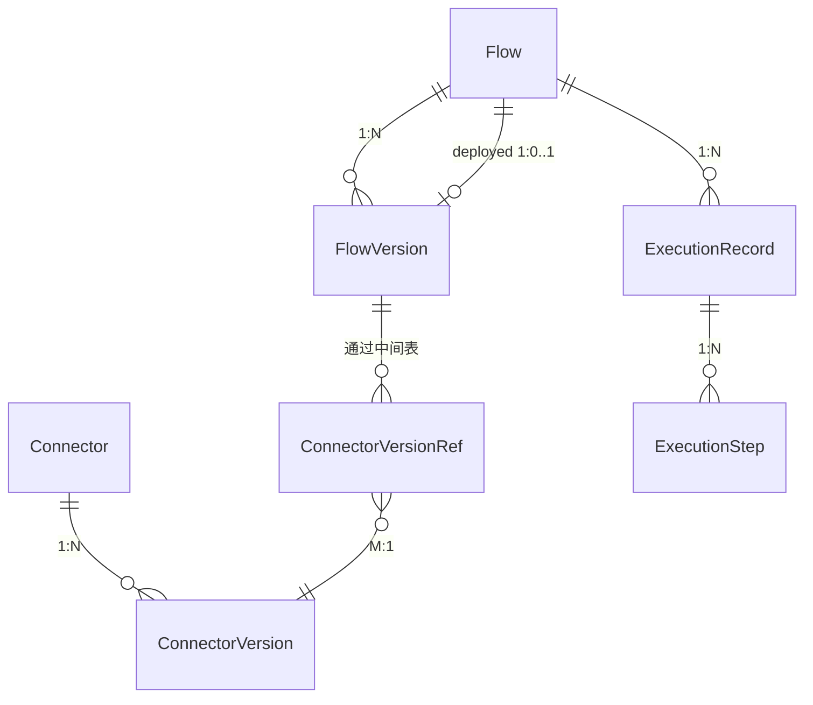

# 技术计划：连接器平台 V2 — 多版本与增强

**Feature ID**: CONN-PLAT-002
**规划版本**: v2.0
**创建日期**: 2026-06-09
**最近更新**: 2026-06-09
**规划作者**: SDDU Plan Agent
**规范版本**: [spec.md](./spec.md) v2.15-draft
**前置文档**: spec.md v2.15, [plan-json-schema.md](./plan-json-schema.md) v6.0, ADR-001~003（V1 已验证）, ../specs-tree-connector-platform/plan.md（V1 基线）

> 💡 **项目说明**：V1（CONN-PLAT-001）为内部验证 MVP，无真实用户使用。V2 不提供 V1 兼容，所有模块（数据库、接口、业务逻辑、前端）均按最新设计全新实施，无需考虑 V1 数据迁移或双轨代码路径。已存在的 V1 表通过 ALTER 变更，新表直接 CREATE。前端统一在 `wecodesite`，后端管理面在 `open-server`，运行时在 `connector-api`。

---

## 1. 架构分析

### 1.1 系统架构

V2 在 V1 三层架构（外部依赖层 → 编排层 → 执行层）基础上叠加增强层：

```mermaid
graph TB
    subgraph Ver["🔄 版本层（增强）"]
        CV["连接器版本管理\n草稿 → 发布 → 失效 → 删除"]
        FV["连接流版本管理\n草稿 → 待审批 → 发布 → 删除"]
    end

    subgraph Dep["📦 外部依赖层（增强）"]
        Conn["平台连接器\n多认证 · URL白名单"]
    end

    subgraph Flow["🔀 编排层（增强）"]
        EN["触发器节点"] -->|串行/并行| CN["连接器节点（可选版本）"]
        CN -->|串行/并行| PN["数据处理节点（新增）"]
        PN -->|串行/并行| EX["数据输出节点"]
        FC["flowConfig: 缓存 · 入站限流"]
    end

    subgraph RT["⚙️ 执行层（增强）"]
        R["调度引擎 · 版本配置解析"]
        M["监控层（新增）: 运行记录 · 日志采集"]
    end

    subgraph Sec["🔒 安全层（新增）"]
        WL["URL白名单校验"]
        ISO["应用数据隔离"]
        AWL["应用白名单准入"]
    end

    subgraph Appr["✅ 审批层（新增）"]
        DA["版本发布审批: 三级"]
        UR["审批催办"]
    end

    Ver --> Dep
    Ver --> Flow
    Flow --> RT
    RT --> M
    Sec --> Flow
    Sec --> RT
    Appr --> Flow
```



### 1.2 技术栈确认（沿用 V1）

| 层 | 技术 | 版本 |
|----|------|------|
| **前端** | React + Ant Design 4 + Vite + Less | React 18.2, antd 4.24.16, Vite 5 |
| **画布** | @xyflow/react (React Flow) | v12.10.1 |
| **后端管理面** | Spring Boot (open-server) + MyBatis | 3.4.6 |
| **后端运行时** | Spring Boot (connector-api) + WebFlux + R2DBC | 3.5.14 |
| **数据库** | MySQL | 5.7 |
| **缓存** | Redis (Lettuce) | — |
| **构建** | Maven | — |
| **语言** | Java 21 + JavaScript/JSX | — |

### 1.3 V1→V2 核心变更

| 变更项 | V1 | V2 |
|--------|-----|-----|
| 版本模型 | 单版本（编辑即生效） | 多版本（草稿→发布→失效→删除），最多 1000 个 |
| 认证方式 | SOA、APIG | 新增数字签名、Cookie，支持多选组合 |
| 编排模式 | 纯串行 | 串行 + 并行（边级并行） |
| 节点类型 | 触发器、连接器、数据输出 | 新增数据处理节点（字段类型转换） |
| 限流 | 平台默认不可配 | 连接流级入站限流（Redis 令牌桶） |
| 审批 | 无 | 版本发布三级审批 + 一键催办 |
| 安全 | 无 | URL 正则白名单、SYSTOKEN 白名单、应用白名单 |
| 运行监控 | 无 | 运行记录查看 + 节点日志采集 |
| 调试 | 必须部署后才能验证 | 草稿/已发布版本直接调试 |
| 数据模型 | 无强制类型展开 | object/array 必须递归展开到基本类型（FR-047） |
| 审计 | 无 | 变更操作日志（复用现有 OperateLog） |
| 数据隔离 | 无 | 按 app_id 应用维度归属隔离 |

### 1.4 数据流核心变更

```
V1: 编辑即生效 → 运行时直接读当前版本配置 → 执行

V2: 草稿 ──发布(审批)──▶ 已发布 ──部署──▶ deployed_version_id
                                               │
                          HTTP触发 ──▶ 运行时按指针读版本快照 ──▶ 执行
                                               │
                         调试触发 ──▶ 直接指定版本ID执行（不依赖deployed_version_id）
```

### 1.5 核心业务对象关系



| 对象 | 状态数 | 审批 | 多版本 |
|------|:---:|:---:|:---:|
| Connector | 4（有效不可用/有效可用/已失效/物理删除） | ❌ | — |
| ConnectorVersion | 4（草稿/已发布/已失效/物理删除） | ❌ | ✅ |
| Flow | 5（待部署/运行中/已停止/已失效/物理删除） | ❌ | — |
| FlowVersion | 7（草稿/待审批/已撤回/已驳回/已发布/已失效/物理删除） | ✅ 三级 | ✅ |

> 💡 完整状态机图、操作×状态矩阵见 [spec.md §1.7](./spec.md#17-核心业务对象生命周期)。

---

## 2. 关键决策

### 2.1 方案对比

V2 的 8 个开放问题（OQ-001~008）在规划阶段全部决策完成。

**OQ-001 版本快照存储**：

| 方案 | 描述 | 决策 |
|------|------|:--:|
| A: 完整快照 | 每个版本存储完整 JSON 配置 | ✅ **选用**（ADR-004） |
| B: 增量存储 | 仅存储与上一版本的 diff | ❌ 读取需重建，回滚慢 |
| C: 混合存储 | 每 N 版完整快照 + 中间 diff | ❌ 实现复杂度最高 |

**OQ-002 版本号策略**：

| 方案 | 描述 | 决策 |
|------|------|:--:|
| A: 实体内递增 | 每 Connector/Flow 独立从 1 递增 | ✅ **选用**（ADR-004） |
| B: 全局递增 | 全平台统一递增 | ❌ 跨实体不可比 |
| C: SemVer | 语义化版本 | ❌ V2 无需兼容性表达 |

**OQ-003 入站限流**：

| 方案 | 描述 | 决策 |
|------|------|:--:|
| A: Redis 令牌桶 + Lua | 原子令牌桶，已有 Redis 基础设施 | ✅ **选用**（ADR-005） |
| B: 内存 Guava | 进程内存限流 | ❌ 多实例不共享 |
| C: Sentinel | 引入新组件 | ❌ 功能远超需求 |

**OQ-004 限流配置取值**：使用已部署版本的 flowConfig。

**OQ-005 审批集成**：复用 ApprovalEngine + 新增 businessType 模板，不改造审批引擎。

**OQ-006 缓存一致性**：版本变更主动清空 + TTL 兜底。

**OQ-007 运行记录存储**：

| 方案 | 描述 | 决策 |
|------|------|:--:|
| A: MySQL + 定时清理 | 启用 V1 预留表 + 30 天清理 | ✅ **选用**（ADR-006） |
| B: Elasticsearch | 独立日志存储 | ❌ 引入新组件 |
| C: MySQL + 对象存储 | 热冷分层 | ❌ V2 日志量可控，预留扩展点 |

> ⚠️ V1 预留表（`execution_record_t` / `execution_step_t` / `storage_blob_ref_t`）未经生产验证，V2 启用前需重新审视：① 列级枚举值偏移修正；② `node_type` 从 VARCHAR 改为 TINYINT；③ 审计字段 `VARCHAR(50)` → `VARCHAR(100)`；④ 索引引用列存在性校验。详见 ADR-006。

**OQ-008 连接流复制版本历史**：完整复制所有版本（所有状态）。

### 2.2 决策汇总

| # | OQ | 决策 | ADR |
|:--:|-----|------|:--:|
| 1 | 版本快照存储 | 完整 JSON 快照 | ADR-004 |
| 2 | 版本号策略 | 实体内递增整数 | ADR-004 |
| 3 | 入站限流 | Redis 令牌桶 + Lua | ADR-005 |
| 4 | 限流配置取值 | 已部署版本的 flowConfig | — |
| 5 | 审批集成 | 复用 ApprovalEngine | — |
| 6 | 缓存一致性 | 主动清空 + TTL | — |
| 7 | 运行记录存储 | MySQL + 30 天清理 | ADR-006 |
| 8 | 复制版本历史 | 完整复制 | — |
| — | 引用稽核 | 中间表 + deployed_version_id 指针 | ADR-007 |

---

## 3. 模块与代码总览

### 3.1 模块划分

| 模块 | 服务 | 职责 | V2 变更 |
|------|------|------|:--:|
| 连接器管理 | open-server | CRUD + 版本管理 + URL 白名单 | 🆕 版本/白名单 |
| 连接流管理 | open-server | CRUD + 版本管理 + 生命周期 + 复制 + 运行记录查询 | 🆕 版本/部署/复制 |
| 审批集成 | open-server | 版本发布审批 + 催办 + 审批人配置 | 🆕 全新 |
| 安全准入 | open-server | 应用白名单管理 + 准入拦截 | 🆕 全新 |
| 操作日志 | open-server | OperateEnum 扩展 + EntitySnapshotLoader 扩展 | 🔧 扩展 |
| 运行时引擎 | connector-api | 版本解析 + 并行执行 + 限流 + 缓存 + 日志 + 调试 | 🆕 多模块 |
| 认证注入 | connector-api | Cookie/DigitalSign/MultiAuth 注入器 | 🆕 扩展 |
| 前端 | wecodesite | 版本历史/审批/调试/运行记录/白名单页面 | 🆕 14 新页面 |

### 3.2 服务职责详表

| 服务 | 端口 | 职责 | 接口数 |
|------|:---:|------|:--:|
| open-server | 18080 | 管理面：连接器/连接流 CRUD、版本管理、审批、安全、操作日志 | 46 |
| connector-api | 18180 | 运行时：HTTP 触发、调试执行、运行记录写入、健康检查 | 3 |
| api-server | 18081 | API 认证鉴权（V2 无变更） | — |
| event-server | 18083 | 事件/回调网关（V2 无变更） | — |

### 3.3 目录结构

```
open-app/
├── open-server/src/main/java/.../v2/modules/
│   ├── connector/        # [MODIFY] 多版本 + 认证增强 + URL白名单
│   ├── flow/             # [MODIFY] 多版本 + 生命周期 + 复制 + flowConfig
│   ├── approval/         # [MODIFY] businessType 模板扩展
│   ├── security/         # [NEW] 应用白名单 + 准入拦截
│   └── auditlog/         # [MODIFY] OperateEnum 扩展
│
├── connector-api/src/main/java/.../v2/modules/
│   ├── runtime/          # [MODIFY] 并行执行 + flowConfig 解析 + 版本解析
│   ├── ratelimit/        # [NEW] 入站限流（Redis 令牌桶）
│   ├── cache/            # [NEW] 连接流缓存管理
│   ├── execution/        # [NEW] 运行记录 + 日志采集 + 定时清理
│   ├── debug/            # [NEW] 调试执行器
│   ├── auth/credential/  # [NEW] Cookie/DigitalSign/MultiAuth 注入器
│   └── security/         # [NEW] URL白名单校验
│
└── wecodesite/src/pages/ConnectPlatform/
    ├── Connector/        # [MODIFY] 版本历史 + 认证增强 + URL白名单面板
    ├── Flow/             # [MODIFY] 生命周期管理 + 复制 + 运行记录
    ├── FlowEditor/       # [MODIFY] 并行边 + 版本选择 + flowConfig + 调试面板
    ├── FlowVersion/      # [NEW] 版本历史 + 审批面板
    └── ExecutionRecord/  # [NEW] 运行记录列表 + 详情
```

### 3.4 文件影响统计

| 类别 | 新增 | 修改 |
|------|:--:|:--:|
| open-server 后端 | ~15 | ~15 |
| connector-api 运行时 | ~15 | ~8 |
| 前端 wecodesite | ~14 | ~15 |
| 数据库 | 1 CREATE + 7 ALTER | 仅新增 `connector_version_ref_t`，其余均复用/ALTER |
| ADR | 4 | — |

### 3.5 子文档索引

| 文档 | 内容 |
|------|------|
| [plan-db.md](./plan-db.md) | **数据库设计** — 12 张表（5M+1N+2E+1X+3R），仅新增 connector_version_ref_t，其余均复用/ALTER |
| [plan-api.md](./plan-api.md) | **API 接口设计** — 49 端点完整定义、请求/响应示例、错误码、枚举字典 |
| [plan-page.md](./plan-page.md) | **前端页面设计** — 路由设计、版本历史/审批/调试/运行记录/白名单页面详设 |
| [plan-runtime.md](./plan-runtime.md) | **运行时引擎设计** — 版本解析、并行分支、限流、缓存、日志、调试、认证注入器 |
| [plan-json-schema.md](./plan-json-schema.md) | **JSON Schema 规范** — 数据契约定义、映射表达式体系、FR-047 类型校验规则 |
| [plan-code.md](./plan-code.md) | **代码规范** — 16 条规范（注释中文、日志英文、SQL 规范等） |
| [plan-cache.md](./plan-cache.md) | **缓存与限流策略** — Redis 配置缓存、令牌桶限流、版本切换失效 |

---

## 4. 风险评估

| 风险 | 等级 | 缓解措施 |
|------|:---:|---------|
| 1:N 版本模型迁移兼容 | 🔴 高 | 幂等迁移脚本；V1 数据标记为 v1「已发布」；灰度验证 |
| 审批引擎集成复杂度 | 🟡 中 | 复用现有三级节点模型；适配器封装差异；提前对齐接口 |
| 并行分支执行复杂度 | 🟡 中 | Reactor `Flux.merge()`；每分支独立超时+错误不扩散 |
| 版本快照数据量增长 | 🟡 中 | 1000 版本硬上限；物理删除真删除；>800 时告警 |
| 设计态硬校验破坏已有配置 | 🔴 高 | 新增配置强制校验；已有配置警告不阻塞；批量修复工具 |
| FR-047 数据模型严格化 | 🟡 中 | 新增配置强制校验（object 必须展开子字段）；存量标记警告 |
| 缓存与版本切换一致性 | 🟢 低 | 版本变更主动清空 + TTL 兜底（5 分钟） |
| 调试执行影响正常运行 | 🟢 低 | 独立线程池（max 5）；独立超时（30s）；不计入正常指标 |

---

## 5. 版本规划

### 6.1 迭代建议

| 阶段 | 范围 | 预估工期 | 可并行 |
|------|------|:--:|:--:|
| **Phase 1**: 版本 + 认证 | 连接器多版本（FR-001~011）、连接器认证增强（FR-012~014）、连接流多版本（FR-024~030）、数据模型严格化（FR-047） | 基准 | — |
| **Phase 2**: 审批 + 编排 | 版本发布审批（FR-031~033）、连接流生命周期增强（FR-018~023）、flowConfig + 并行 + 数据处理节点（FR-034~040）、一键复制（FR-017） | +2 周 | Phase 1 完成版本后即可开始 |
| **Phase 3**: 安全 + 运维 | URL 白名单（FR-015）、应用白名单（FR-045）、应用数据隔离（G13）、运行记录（FR-042）、运行时增强（FR-043~044）、调试（FR-041）、操作日志（FR-046） | +2 周 | 与 Phase 2 可并行 |

### 6.2 关键里程碑

```
Week 1-2: Phase 1 版本+认证 完成 → 里程碑 M1: 版本管理可演示
Week 3-4: Phase 2 审批+编排 完成 → 里程碑 M2: 审批流程可演示
Week 3-4: Phase 3 安全+运维 完成 → 里程碑 M3: 全功能集成测试
Week 5:   联调 + 数据迁移验证 + 灰度上线
```

---

## 6. 架构决策记录 (ADR)

| 编号 | 标题 | 文件 |
|:---:|------|------|
| ADR-004 | 版本完整快照存储与递增整数版本号 | [ADR-004.md](./ADR-004.md) |
| ADR-005 | Redis 令牌桶入站限流方案 | [ADR-005.md](./ADR-005.md) |
| ADR-006 | MySQL 主存储运行记录与日志 | [ADR-006.md](./ADR-006.md) |
| ADR-007 | 多版本模型下的引用稽核策略 | [ADR-007.md](./ADR-007.md) |

---

## ✅ 技术规划完成

**状态**: specified → **planned**
**8 个 OQ**: 全部决策完成
**4 个 ADR**: ADR-004 ~ ADR-007
**7 个子文档**: plan-db / plan-api / plan-page / plan-runtime / plan-json-schema / plan-code / plan-cache

### 下一步

👉 运行 `@sddu-tasks connector-platform-v2` 开始任务分解

---

## 附录 A：修订记录

| 版本 | 日期 | 修订内容 | 修订人 |
|------|------|---------|--------|
| v1.0 | 2026-06-09 | 初始版本：架构分析 + 8 OQ 决策 + 文件清单 + 风险评估 + 4 ADR | SDDU Plan Agent |
| v2.0 | 2026-06-09 | **对齐 V1 plan.md 结构**：① 新增 §1.1 架构 mermaid 图 + §1.2 技术栈 + §1.3 V1→V2 变更表 + §1.4 数据流 + §1.5 ER 图；② §2 展开 8 个 OQ 方案对比；③ §3 新增模块划分 + 目录结构 + 服务职责表；④ 新增 §6 版本规划（3 Phase 迭代）；⑤ 新增附录 A/B | SDDU Plan Agent |

## 附录 B：V1→V2 spec 变更对照

| 维度 | V1 (spec v5.0) | V2 (spec v2.15) |
|------|---------------|----------------|
| 版本模型 | 单版本 | 多版本（草稿→发布→失效→删除） |
| 认证方式 | SOA、APIG | 新增数字签名、Cookie，支持多选 |
| 编排模式 | 纯串行 | 串行 + 并行（边级） |
| 节点类型 | 3 种 | 4 种（新增数据处理节点） |
| 版本发布审批 | 无 | 三级审批 + 催办 |
| 运行监控 | 无 | 运行记录 + 节点日志 |
| 安全 | 无 | URL 白名单 + SYSTOKEN 白名单 + 应用白名单 |
| 数据模型 | 无强制类型展开 | object/array 递归展开到基本类型，设计态硬校验 |
| 调试 | 必须发布部署后验证 | 草稿/已发布版本直接调试 |
| 审计 | 无 | 变更操作日志 |
| 端点总数 | 18 | 45 |
| 表数量 | 7（4 启用 + 3 预留） | 12（5 MODIFY + 1 NEW + 2 ENABLE + 1 EXTEND + 3 REUSE） |
