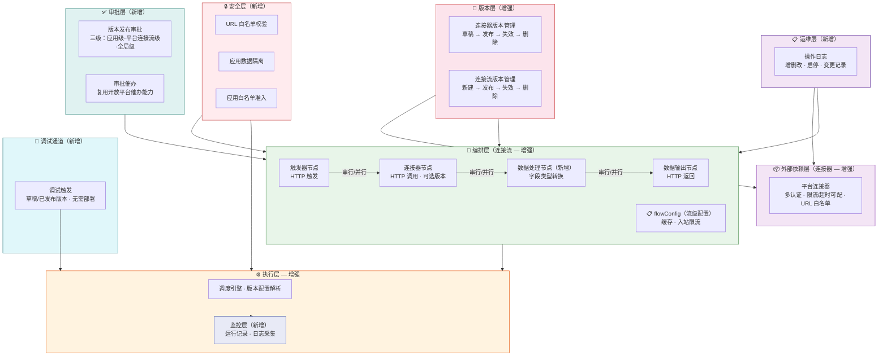
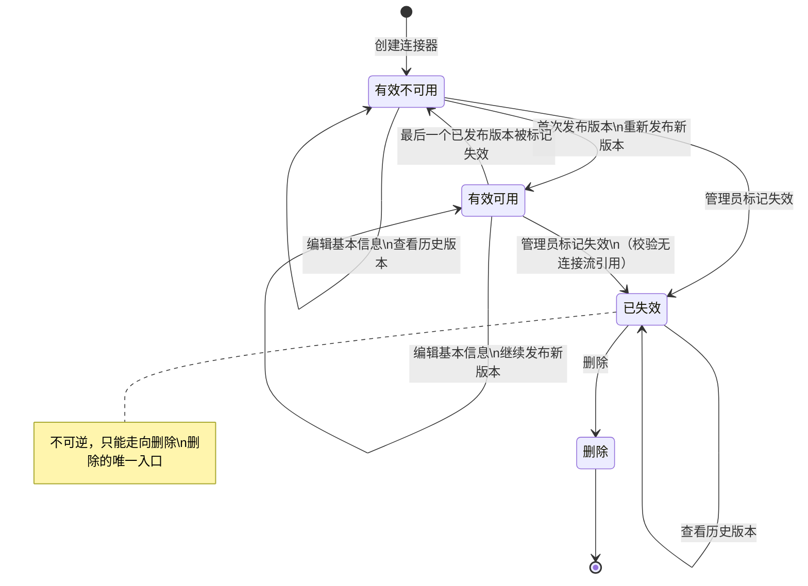
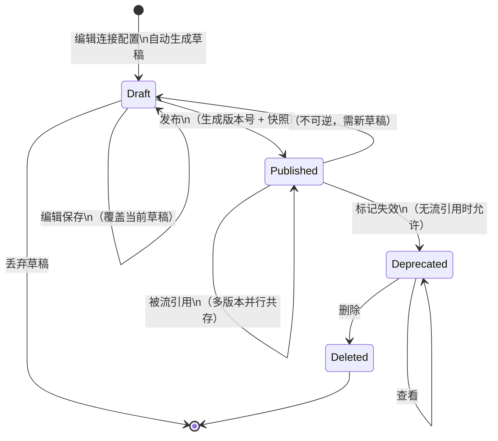
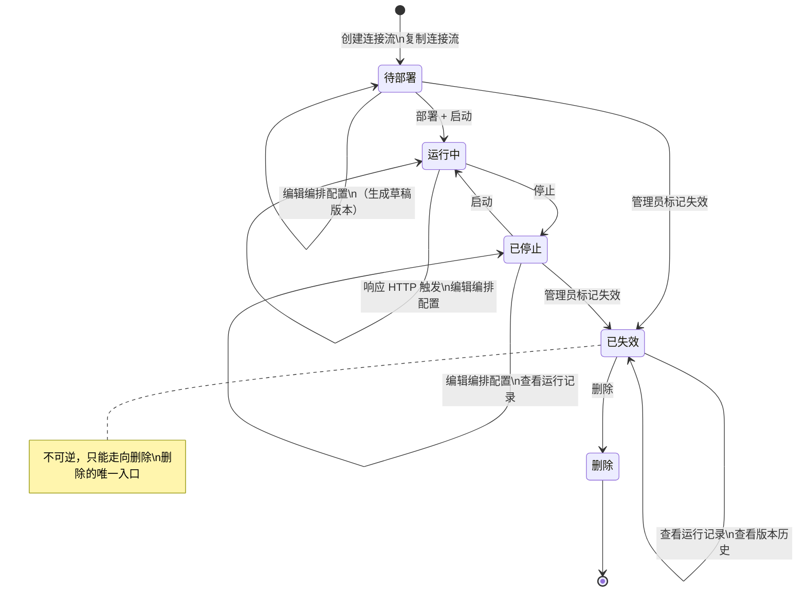
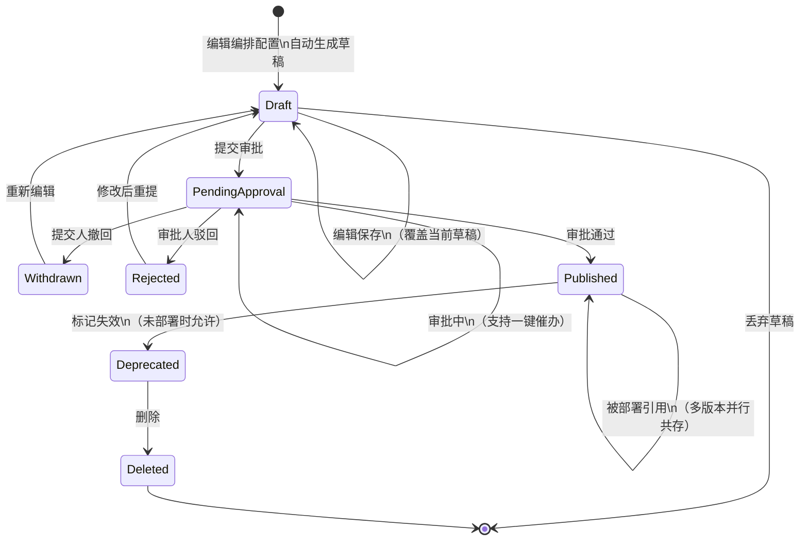
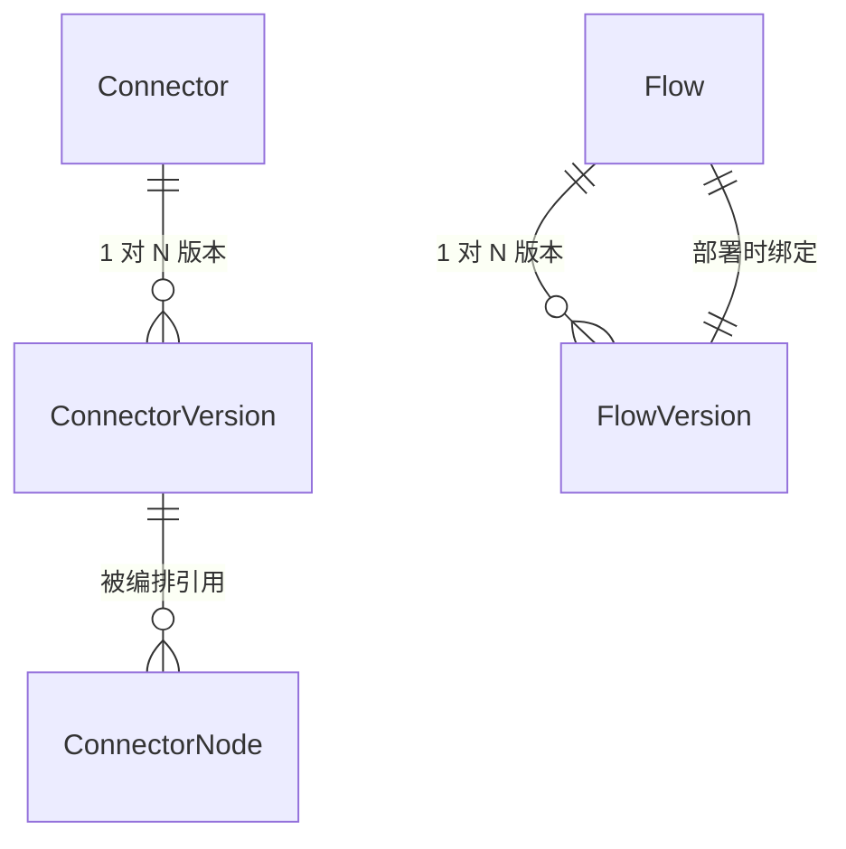

# 规范文档：连接器平台 V2 — 多版本与增强

**Feature ID**: CONN-PLAT-002  
**名称**: 连接器平台 V2 — 多版本与增强（Connector Platform V2 — Multi-Version & Enhancement）  
**状态**: draft  
**优先级**: P1  
**作者**: Summer  
**创建日期**: 2026-06-02  
**最后更新**: 2026-06-02  
**依赖**: CONN-PLAT-001（V1 MVP — 已建成并验证）  

---

## 1. 概述

### 1.1 问题陈述

V1（CONN-PLAT-001）已验证了**零代码编排**的核心价值。但随着使用深入，V1 的能力边界暴露出以下痛点：

- **无版本管理**：连接器和连接流编辑即生效，无法保留多版本配置，变更无追溯
- **配置能力不足**：认证方式单一，超时、限流不可配；编排仅支持串行，无并行分支和字段类型转换能力
- **安全防护薄弱**：缺少 URL 白名单和 SYSTOKEN 凭证白名单校验，连接器/连接流数据无应用级隔离，无应用白名单准入控制
- **发布缺少审批**：连接流版本发布无审批流程，关键变更缺少人工确认环节
- **运维不可见**：无运行记录监控，运行时缺乏版本配置解析和日志采集能力，变更操作无日志审计
- **调试效率低**：编排修改后必须发布、部署才能验证，迭代周期长
- **数据模型局限**：JSON Schema 参数传递和 HTTP 节点参数位置（header/query/body）支持不足

### 1.2 解决方案

V2 在 V1 基础上围绕**连接器增强、连接流增强、运行时增强、安全与准入、数据模型升级、调试体验、运维审计**七个方向升级：

- **连接器**：配置支持多版本管理（草稿→发布→失效→删除），认证类型扩展至数字签名，限流等运行参数可配
- **连接流**：配置支持多版本管理，生命周期增强为部署→启动→停止，版本发布需经过三级审批并支持一键催办，流程编排支持限流、超时控制、缓存、错误处理及并行分支，节点间数据支持字段类型转换，支持一键复制为独立连接流实体
- **运行时**：支持运行记录监控查看，运行时引擎升级以适配版本配置解析、日志采集等新特性
- **安全与准入**：连接器 URL 白名单校验，连接器/连接流数据按应用维度归属隔离，连接器平台能力按应用白名单逐步灰度开放
- **数据模型**：JSON Schema 增强，参数支持 input/output，HTTP 节点支持 header/query/body 参数位置
- **调试**：草稿版本和已发布版本均支持页面直接触发调用，无需部署
- **运维**：连接器、连接流的增删改、启停等变更操作支持记录操作日志

### 1.3 架构

V2 在 V1 三层架构（外部依赖层 → 编排层 → 执行层）基础上叠加七个增强层：

V2 架构核心变化：

| 层级 | V1 | V2 增强 |
|------|-----|--------|
| **版本层** | 单版本，运行时未校验 | 多版本管理（草稿→发布→失效→删除），运行时校验版本 |
| **外部依赖层** | 单一认证，超时/限流不可配 | 多认证（含数字签名），限流/超时可配，URL 白名单校验 |
| **编排层** | 纯串行，3 种节点（触发器/连接器/数据输出） | 新增数据处理节点（字段类型转换），4 种节点；编排支持串行/并行 |
| **执行层** | 调度执行 | 新增版本配置解析、运行记录监控、日志采集 |
| **安全层** | 无 | URL 白名单、应用数据隔离、应用白名单准入 |
| **审批层** | 无 | 版本发布审批（三级：应用级+平台连接流级+全局级）、审批一键催办 |
| **调试通道** | 无 | 草稿版本和已发布版本页面直调，无需部署 |
| **运维层** | 无 | 连接器/连接流增删改、启停等操作日志记录 |

### 1.4 Goals

| # | 目标 |
|---|------|
| **G1** | **连接器：配置多版本** — 支持多个已发布版本并行共存，可按需切换查看任意历史版本。生命周期：草稿 → 发布 → 失效 → 删除 |
| **G2** | **连接器：配置增强** — 连接器级可配置限流策略等运行参数 |
| **G3** | **连接器：认证类型增强** — 现有 SOA/APIG 基础上新增数字签名认证，凭证支持配置放置位置（Header/Query） |
| **G4** | **连接流：配置多版本** — 支持多个已发布版本并行共存，可按需切换查看任意历史版本。生命周期：草稿 → 发布 → 失效 → 删除 |
| **G5** | **连接流：生命周期增强** — 部署 → 启动 → 停止，生命周状态：待部署 → 运行中 → 已停止 |
| **G6** | **连接流：版本发布审批** — 连接流版本发布需经过三级审批：应用级版本发布审批人、平台级连接流统一审批人、全局审批人，全部通过后版本生效。平台管理员统一配置审批人，复用开放平台现有三级审批能力 |
| **G7** | **连接流：版本发布审批一键催办** — 连接流版本发布审批支持一键催办，复用开放平台现有审批催办能力，拓展至版本发布审批场景 |
| **G8** | **连接流：流程配置增强** — 编排支持触发器节点 SYSTOKEN 凭证白名单、连接器节点超时可配、连接流自身触发限流、错误处理、串行/并行分支（仅并行，无条件和循环）；连接器节点可选引用版本；新增数据处理节点 |
| **G9** | **连接流：字段数据类型转换** — 数据处理节点支持字段级数据类型转换（string↔int、日期格式转换等）。字段映射/脚本/表达式 → NG |
| **G18** | **连接流：一键复制** — 连接流列表支持一键复制，复制后生成独立连接流实体（含完整版本历史），名称自动追加 `_copy_xxxxx` 随机后缀，状态默认为「待部署」，仅限同应用内复制 |
| **G10** | **运行时：运行监控** — 连接流最近运行记录查看（触发时间、状态、耗时、触发方式） |
| **G11** | **运行时：运行时增强** — 运行时支持版本配置读取解析、日志采集记录、新增特性适配 |
| **G12** | **安全：连接器 URL 白名单校验** — 配置连接器时设置正则规则作为 URL 白名单，运行时按规则校验实际请求地址 |
| **G13** | **安全：数据按应用隔离** — 连接器、连接流数据按应用维度归属隔离，不同应用间资源互不可见 |
| **G14** | **安全：连接器平台应用白名单** — 平台管理员维护可开通连接器功能的应用白名单，白名单内应用才可使用连接器平台能力，支持逐步灰度 |
| **G15** | **数据模型：JSON Schema 增强** — 参数传递支持 input/output；HTTP 类型节点支持参数位置：header、query、body |
| **G16** | **调试：调试触发** — 连接流草稿版本和已发布版本均支持在页面直接触发调试调用，无需部署。失效版本不支持调试 |
| **G17** | **运维：操作日志** — 连接器、连接流的增删改、启停等变更操作支持记录操作日志 |

### 1.5 Non-Goals

| # | 非目标 | 原因 |
|---|--------|------|
| NG1 | AI 辅助编排 | V3 阶段 |
| NG2 | 连接器模板库 | 模板延后 |
| NG3 | 三方连接器开放发布 | V3 阶段 |
| NG4 | 连接器审批管控 | V2 无连接器审批流程 |
| NG5 | Scope 权限管控 | V2 仅做应用级隔离（G13），Scope 粒度权限待定 |
| NG6 | 连接器评分/评论系统 | V3 阶段 |
| NG7 | 开发者工具链（SDK/CLI/IDE 插件） | 后续版本 |
| NG8 | 社区市场/跨企业共享连接器 | 仅限企业内部 |
| NG9 | 计费/订阅系统 | 无需计费 |
| NG10 | 通用 iPaaS | 聚焦 XX 平台能力编排 |
| NG11 | 多集群/多云连接器运行时 | 企业内单一集群 |
| NG12 | 条件分支/循环/子流程编排 | V2 仅并行分支 |
| NG13 | 事件触发器 | V3 阶段 |
| NG14 | 定时触发器（Cron） | V3 阶段 |
| NG15 | 失败重试 | 延后评估 |
| NG16 | 字段映射/脚本/表达式等复杂数据处理 | V2 仅支持字段类型转换（G8） |

---

### 1.6 关键设计决策

| 维度 | 关键设计 | 保护对象 | 配置对象 | 归属 |
|------|---------|---------|---------|:--:|
| **超时** | 属于连接流，非连接器。超时是调用方诉求，不同流对同一连接器可设不同超时值 | 调用方（连接流）不长时间阻塞 | 应用管理员编排连接流时按节点配置 | G8 |
| **出站限流** | 属于连接器。限制连接器对后端系统的调用频率，防止打爆下游 | 后端系统 | 应用管理员在连接器配置中设定 | G2 |
| **入站限流** | 属于连接流。限制连接流被触发的频率，防止自身过载 | 连接流自身 | 应用管理员在连接流编排时配置 | G8 |
| **缓存** | 属于连接流。通过缓存子图结果减少重复调用 | 后端系统 + 调用效率 | 应用管理员在连接流运行时配置中设定 | G8 |
| **引用稽核** | 被引用方的校验通过查询引用方确定，不把引用关系固化到被引用方的状态或字段中。被引用方只关心自身配置，不关心"被谁用"。细则：① FlowVersion「已部署」不设独立状态，失效前查 `flow.deployed_version_id` 即可（1:1，O(1)）；② ConnectorVersion 的编排引用通过 `connector_version_ref` 中间表显式管理（M:N），保存编排时同步维护 | — | 引用关系存于引用方或中间表 | — |

### 1.7 核心业务对象生命周期

V2 有四个核心业务对象承载状态流转，是功能需求的基础约束。生命周期决定了 FR 中「可/不可」操作的边界条件，以及 EC 的处理逻辑。

> 💡 **关键认知**：连接器和连接流是状态容器，自身状态极简；版本是真正的配置载体，承载完整的发布/失效/审批流转。

| 对象 | 状态数 | 状态列表 | 审批 | 多版本并存 |
|------|:---:|------|:---:|:---:|
| 连接器 (Connector) | 4 | 有效可用 → 有效不可用 → 已失效 → 删除 | ❌ | — |
| 连接器版本 (ConnectorVersion) | 4 | 草稿 → 已发布 → 已失效 → 已删除 | ❌ | ✅ |
| 连接流 (Flow) | 5 | 待部署 → 运行中 ⇄ 已停止 → 已失效 → 删除 | ❌ | — |
| 连接流版本 (FlowVersion) | 7 | 草稿 → 待审批 → 已撤回 / 已驳回 → 已发布 → 已失效 → 已删除 | ✅ 三级 | ✅ |

---

#### 1.7.1 连接器生命周期

连接器状态反映两个维度：**实体有效性**（有效/无效/删除）和**版本可用性**（有无 ≥1 个已发布版本）。状态机保证编排选择列表只需单表查询，无需 JOIN 版本表。

| 状态 | 含义 | 实体有效？ | 有可用版本？ | 展示在编排选择列表？ |
|------|------|:---:|:---:|:---:|
| **有效可用** | 实体有效，≥1 个已发布版本 | ✅ | ✅ | ✅ |
| **有效不可用** | 实体有效，无已发布版本（从未发布过 / 全部失效） | ✅ | ❌ | ❌ |
| **已失效** | 管理员主动废弃，不再维护 | ❌ | ❌ | ❌ |

**两个"不可展示"状态的区别**：

| 维度 | 有效不可用 | 已失效 |
|------|-----------|--------|
| **触发方式** | 自动（创建后默认 / 版本全部失效） | 管理员手动标记 |
| **前提条件** | — | 无连接流引用即可，**不需要先让版本失效** |
| **可恢复？** | ✅ 重新发布版本即可回到有效可用 | ❌ 不可逆，只能走向删除 |
| **可发布新版本？** | ✅ | ❌ |
| **语义** | "当前没版本可用，但可能还会加" | "此连接器正式退役，不要再用了" |
| **版本历史** | 可查 | 可查 |

**状态转移规则**：

| 触发条件 | 状态变更 | 说明 |
|---------|---------|------|
| 创建连接器 | → 有效不可用 | 新连接器默认无任何版本 (FR-001) |
| 首次发布版本 | 有效不可用 → 有效可用 | 第一个已发布版本诞生 (FR-002) |
| 最后一个已发布版本被失效 | 有效可用 → 有效不可用 | 版本全部失效，自动进入不可用 (FR-004) |
| 重新发布新版本 | 有效不可用 → 有效可用 | 恢复可用 (FR-002) |
| 管理员标记失效 | → 已失效 | 校验无连接流引用该连接器的任何版本；无论当前是有效可用还是有效不可用，只要无引用即可退役 (FR-003, FR-004) |
| 删除 | 已失效 → 删除 | 仅已失效状态可删除；不可恢复 (FR-003) |

> 💡 **退役与删除的关系**：退役和删除的校验逻辑一致——都看有没有连接流在用。区别在于删除不可恢复、退役后仍可查历史。退役不需要先把版本全部失效。有效 → 已失效 → 删除，单向不可逆。

---

#### 1.7.2 连接器版本生命周期

连接器版本是连接配置的真正载体，多版本并行共存。**无审批流程**（与连接流版本的关键差异）。

| 状态 | 触发动作 | 允许操作 | 关键约束 |
|------|---------|---------|---------|
| **草稿 (Draft)** | 编辑连接配置时自动生成 | 保存（覆盖）、丢弃、发布 | 每连接器**仅一个草稿**，再次编辑覆盖当前草稿 (EC-008)；草稿配置为空时禁止发布 (EC-009) |
| **已发布 (Published)** | 草稿发布 | 查看、被连接流引用、标记失效 | 发布时**快照完整连接配置**（协议/地址/认证/入参出参/超时/限流），生成不可变版本；多已发布版本**并行共存** (FR-002) |
| **已失效 (Deprecated)** | 已发布版本标记失效 | 查看、删除 | **有连接流引用的版本禁止失效**，需提示影响范围 (EC-001, FR-004)；失效后不可被新连接流引用 |
| **已删除 (Deleted)** | 失效版本删除 | 无 | 仅失效版本可删除；不可恢复 (FR-005) |

---

#### 1.7.3 连接流生命周期

连接流状态反映**运行时**（运行中/已停止）和**实体有效性**（已失效/删除）。与连接器一样，已失效是不可逆的退役状态，删除只能从已失效进入。

| 状态 | 含义 | 响应外部触发？ | 展示？ | 约束 |
|------|------|:---:|:---:|------|
| **待部署** | 新创建或复制产生，尚未部署 | ❌ | ✅ | 编辑编排配置生成草稿版本；复制后名称追加 `_copy_xxxxx` 后缀 (FR-034) |
| **运行中** | 正在运行，响应触发 | ✅ | ✅ | 编辑编排配置不影响当前运行中的已发布版本；下次部署需选择新版本；编辑生成草稿版本 |
| **已停止** | 运行中被停止 | ❌ | ✅ | 编辑编排配置；停止时当前执行实例继续完成，新触发不响应 (EC-007) |
| **已失效** | 管理员主动废弃，不可恢复 | ❌ | ❌ | 不可启动；不可逆，只能走向删除；仍可查看运行记录和版本历史 |
| **删除** | 物理删除 | — | — | 仅已失效状态可删除；不可恢复 |

**状态转移规则**：

| 触发条件 | 状态变更 | 说明 |
|---------|---------|------|
| 创建 / 复制连接流 | → 待部署 | 默认初始状态 (FR-009, FR-034) |
| 部署 + 启动 | 待部署 → 运行中 | 选择已发布版本部署并启动 (FR-014) |
| 停止 | 运行中 → 已停止 | 停止后不再响应新触发 (FR-016) |
| 启动 | 已停止 → 运行中 | 恢复响应触发 (FR-015) |
| 管理员标记失效 | 待部署 / 已停止 → 已失效 | 运行中不可直接失效，必须先停止；不可逆 |
| 删除 | 已失效 → 删除 | 唯一删除入口 |

> 💡 **为什么已失效不可逆**：与连接器一致——退役是管理决策，不是运行时状态的延伸。一旦标记已失效，不能再启动，只能删除。

---

#### 1.7.4 连接流版本生命周期

连接流版本是编排配置的真正载体，**含三级审批流程**（与连接器版本的关键差异）。
撤回和驳回各自独立为状态，保证 FlowVersion 表自身就能回答"当前在哪"，无需回查审批表。

| 状态 | 含义 | 下一跳 | 关键约束 |
|------|------|--------|---------|
| **草稿 (Draft)** | 编辑中，未提交或已从撤回/驳回回到编辑态 | → 提交审批 / 丢弃 | 每连接流**仅一个草稿**；编排为空时禁止提交审批 (EC-010) |
| **待审批 (PendingApproval)** | 审批流转中 | → 通过 / 撤回 / 驳回 | 超时未处理保持此状态，支持一键催办 (EC-003, FR-019) |
| **已撤回 (Withdrawn)** | 提交人主动撤回，**尚未修改** | → 草稿（重新编辑） | 可查看审批进度（已产生的审批记录保留）；不可直接重提，必须先转 Draft |
| **已驳回 (Rejected)** | 审批人驳回，**尚未修改** | → 草稿（修改后重提） | 附带驳回原因 (FR-017)；不可直接重提，必须先转 Draft |
| **已发布 (Published)** | 审批通过，版本生效 | → 标记失效 | 发布时**快照完整编排配置**（nodes + edges + flowConfig）(FR-017) |
| **已失效 (Deprecated)** | 已废弃 | → 删除 | **已部署的版本禁止失效**，提示先停止 (EC-002, FR-012)；失效后不可部署 |
| **已删除 (Deleted)** | 已物理删除 | — | 不可恢复 (FR-013) |

**审批域三种"未通过"的差异**：

| 比较维度 | 撤回 (Withdrawn) | 驳回 (Rejected) | 丢弃草稿 |
|---------|------------------|-----------------|---------|
| **执行人** | 提交人（应用管理员） | 审批人 | 提交人 |
| **发生时机** | 审批中任意阶段 | 审批中任意一级 | 提交审批前 |
| **审批记录** | ✅ 已产生部分审批记录 | ✅ 已产生审批记录 + 驳回原因 | ❌ 无审批记录 |
| **回到 Draft 的条件** | 需显式执行「重新编辑」 | 需显式执行「修改后重提」 | 草稿本就可以编辑 |

> 💡 **为什么撤回/驳回要独立为状态**：若统一退回 Draft，查询 `SELECT status FROM flow_version` 无法区分「全新草稿」和「被驳回的草稿」，每次必须 JOIN 审批表。独立状态让 FlowVersion 表自身就具备完整可读性。

**三级审批流程**（平台管理员统一配置审批人）：

审批引擎内部的三级流转对 FlowVersion 是黑盒——无论内部多少级、何种流转策略，对版本而言收敛为 `PendingApproval` 这一个状态，出口只有三个：撤回、驳回、通过。

| 审批级别 | 配置人 | 说明 | 来源 |
|---------|------|------|------|
| ① 应用级 | 应用管理员 | 应用维度的版本发布审批人 | FR-018 |
| ② 平台连接流级 | 平台管理员 | 连接流统一审批人 | FR-018 |
| ③ 全局级 | 平台管理员 | 全局审批人 | FR-018 |

---

#### 1.7.5 四对象关系与约束总结

| 约束 | 涉及对象 | 说明 |
|------|---------|------|
| 删除连接器需检验无引用 | Connector → Flow (ConnectorNode) | 运行中流引用某连接器的任意版本，则该连接器不可删除 |
| 失效版本需检验无流引用 | ConnectorVersion → Flow (ConnectorNode) | 任何流引用该版本即禁止失效 |
| 失效流版本需检验未部署 | FlowVersion → Flow | 已部署到运行中/已停止流的版本禁止失效 |
| 删除流需已停止 | Flow | 仅已停止状态可删除 |
| 复制仅限同应用 | Flow → Application | 跨应用不可复制 |

---

## 2. 用户故事

> 💡 V2 面向两类角色：**平台管理员**负责平台级安全与审批配置；**应用管理员**负责自有应用下连接器和连接流的日常管理。

### 平台管理员

| ID | 用户故事 | 对应 Goal |
|----|---------|----------|
| US-01 | 配置连接器 URL 正则白名单规则，限制允许调用的目标地址范围 | G12 |
| US-02 | 维护连接器平台应用白名单，控制哪些应用开通连接器平台能力，支持逐步灰度 | G14 |
| US-03 | 配置连接流版本发布三级审批人（应用级/平台连接流级/全局级） | G6 |

### 应用管理员

| ID | 用户故事 | 对应 Goal |
|----|---------|----------|
| US-04 | 创建和管理连接器，管理连接器配置的多版本（草稿→发布→失效→删除），配置限流策略 | G1、G2 |
| US-05 | 选择连接器认证方式（SOA/APIG/数字签名），配置凭证放置位置（Header/Query） | G3 |
| US-06 | 创建和管理连接流，管理配置的多版本，发布版本需审批并支持催办，执行部署→启动→停止 | G4、G5、G6、G7 |
| US-07 | 提交连接流版本发布审批，支持一键催办 | G6、G7 |
| US-08 | 编排连接流：配置节点超时、流级限流、SYSTOKEN 白名单、缓存、错误处理、串行/并行，选择连接器引用版本，新增数据处理节点 | G8 |
| US-09 | 在数据处理节点中配置字段数据类型转换（string↔int、日期格式等） | G9 |
| US-10 | 查看连接流运行记录（触发时间、状态、耗时） | G10 |
| US-11 | 在草稿版本和已发布版本上直接触发调试调用，无需部署 | G16 |
| US-12 | 查看连接器、连接流的操作日志（增删改、启停等变更记录），复用应用现有操作日志模块 | G17 |
| US-13 | 在连接流列表一键复制连接流，得到独立连接流实体，名称自动加随机后缀，状态默认待部署 | G18 |

---

## 3. 功能需求

### 3.1 连接器：配置多版本（G1）

| FR | 名称 | 描述 |
|----|------|------|
| FR-001 | 创建草稿 | V1 无版本概念（编辑即生效）。V2 新增：编辑连接配置时生成草稿版本，保存覆盖当前草稿，可丢弃。不影响已发布版本 |
| FR-002 | 发布版本 | V2 新增：草稿发布为正式版本，生成版本号并快照完整配置，多已发布版本并行共存 |
| FR-003 | 版本查看 | V2 新增：查看已发布版本列表，可切换查看任意历史版本配置详情 |
| FR-004 | 版本失效 | V2 新增：已发布版本可标记失效。已有连接流引用的版本不可标记失效，失效后不可被引用 |
| FR-005 | 版本删除 | V2 新增：失效版本可删除 |

### 3.2 连接器：限流配置（G2）

| FR | 名称 | 描述 |
|----|------|------|
| FR-006 | 出站限流 | V1 仅平台级默认限流，不可配置。V2 新增：连接器级可配置 QPS 或并发数上限，运行时共享一个限流桶，保护后端系统 |

### 3.3 连接器：认证类型增强（G3）

| FR | 名称 | 描述 |
|----|------|------|
| FR-007 | 认证类型 | V1 已支持 SOA、APIG。V2 新增：数字签名认证方式 |
| FR-008 | 凭证位置 | V1 已支持自定义凭证位置。V2 增强：数字签名凭证支持配置放置位置（Header、Query） |

### 3.4 连接流：配置多版本（G4）

| FR | 名称 | 描述 |
|----|------|------|
| FR-009 | 创建草稿 | V1 无版本概念（编排配置编辑即生效）。V2 新增：编辑编排配置生成草稿版本，保存覆盖当前草稿，可丢弃 |
| FR-010 | 发布版本 | V2 新增：草稿发布为正式版本，生成版本号并快照完整配置（nodes + edges + flowConfig） |
| FR-011 | 版本查看 | V2 新增：查看已发布版本列表，可切换查看任意历史版本 |
| FR-012 | 版本失效 | V2 新增：已发布版本可标记失效。已部署的版本不可标记失效，失效后不可部署 |
| FR-013 | 版本删除 | V2 新增：失效版本可删除 |

### 3.5 连接流：生命周期增强（G5）

| FR | 名称 | 描述 |
|----|------|------|
| FR-014 | 部署 | V1 编辑保存即视为部署。V2 增强：选择已发布版本直接部署，状态「待部署」→ 启动后进入「运行中」 |
| FR-015 | 启动 | V1 已支持。V2 增强：启停操作记录操作日志 |
| FR-016 | 停止 | V1 已支持。V2 增强：启停操作记录操作日志 |

### 3.6 连接流：版本发布审批（G6、G7）

| FR | 名称 | 描述 |
|----|------|------|
| FR-017 | 提交审批 | V1 无审批。V2 新增：版本发布时提交审批，审批通过后版本生效，复用开放平台审批流程能力 |
| FR-018 | 审批人配置 | V2 新增：平台管理员配置三级审批人——应用级版本发布审批人、平台级连接流统一审批人、全局审批人 |
| FR-019 | 一键催办 | V2 新增：版本发布审批支持一键催办，复用开放平台催办能力 |

### 3.7 连接流：流程配置增强（G8）

| FR | 名称 | 描述 |
|----|------|------|
| FR-020 | 节点超时 | V1 无节点超时配置。V2 新增：连接器节点可配置超时时间，取 min(节点值, 系统上限) |
| FR-021 | 入站限流 | V1 仅平台级默认限流。V2 新增：连接流自身触发限流（QPS/并发数），保护连接流不被高频调用 |
| FR-022 | SYSTOKEN 白名单 | V1 无。V2 新增：触发器节点选择 SYSTOKEN 认证类型后，配置允许触发当前连接流的凭证白名单。空白名单=全部禁止 |
| FR-023 | 缓存配置 | V1 无。V2 新增：在 flowConfig 中配置缓存键（引用触发器输入参数）和缓存时长（TTL） |
| FR-024 | 串行/并行 | V1 仅串行。V2 新增：节点间边支持并行连接模式（不引入独立分支/汇聚节点） |
| FR-025 | 连接器版本选择 | V1 无版本概念。V2 新增：编排时连接器节点可选择引用连接器的已发布版本 |

### 3.8 连接流：字段数据类型转换（G9）

| FR | 名称 | 描述 |
|----|------|------|
| FR-026 | 数据处理节点 | V1 无数据处理节点。V2 新增：数据处理节点，支持字段级数据类型转换（string↔int、日期格式等） |

### 3.9 连接流：一键复制（G18）

| FR | 名称 | 描述 |
|----|------|------|
| FR-034 | 一键复制 | 连接流列表支持一键复制，复制后生成独立连接流实体（含完整版本历史），名称自动追加 `_copy_xxxxx` 随机后缀，状态默认为「待部署」。仅限同应用内复制 |

### 3.10 连接器：URL 白名单（G12）

| FR | 名称 | 描述 |
|----|------|------|
| FR-027 | URL 正则白名单 | V1 无。V2 新增：平台管理员为连接器配置正则规则白名单，设计态校验正则合法性，运行态校验实际请求地址 |

### 3.11 运行时：运行监控（G10）

| FR | 名称 | 描述 |
|----|------|------|
| FR-028 | 运行记录查看 | V1 无运行记录。V2 新增：查看连接流最近运行记录（触发时间、状态、耗时、触发方式） |

### 3.12 运行时：运行时增强（G11）

| FR | 名称 | 描述 |
|----|------|------|
| FR-029 | 版本配置解析 | V1 无版本概念。V2 新增：运行时按引用版本号读取对应版本的配置 |
| FR-030 | 日志采集 | V1 无运行日志。V2 新增：运行时采集节点输入/输出日志，关联执行实例 |

### 3.13 安全：应用白名单（G14）

| FR | 名称 | 描述 |
|----|------|------|
| FR-031 | 应用白名单管理 | V1 无应用准入控制。V2 新增：平台管理员维护可开通连接器功能的应用白名单，支持逐步灰度开放 |

### 3.14 调试：调试触发（G16）

| FR | 名称 | 描述 |
|----|------|------|
| FR-032 | 调试触发 | V1 无调试能力（必须发布部署后才能验证）。V2 新增：草稿版本和已发布版本支持页面直接触发调试调用，无需部署，同步返回执行结果 |

### 3.15 运维：操作日志（G17）

| FR | 名称 | 描述 |
|----|------|------|
| FR-033 | 操作日志 | V1 无变更审计。V2 新增：连接器、连接流增删改、启停等变更操作记录日志，复用应用现有操作日志模块 |

---

## 4. 非功能需求

### 4.1 性能要求

| ID | 需求 | 目标值 | 前提条件 |
|----|------|--------|---------|
| NFR-001 | 单连接流 TPS 与延迟（缓存命中） | ≥ 300 TPS，触发到返回 P99 < 500ms | 2C4G 单节点；单流独占执行 |
| NFR-002 | 单连接流 TPS 与延迟（无缓存） | ≥ 40 TPS，触发到返回 P99 < 2s | 2C4G 单节点；单流独占执行；三方接口支持 ≥ 50 TPS，响应稳定 20ms |
| NFR-003 | 多连接流并发性能 | ≥ 200 TPS（整体），≥ 10 流并发，各流正常执行不相互影响 | 2C4G 单节点 |
| NFR-004 | 页面操作接口响应 | 连接器/连接流列表、搜索、版本历史查看、调试触发等 P99 < 500ms，调试触发从触发到返回 P99 < 5s | 2C4G 单节点 |
| NFR-005 | 系统可用性 | ≥ 99.9%（沿用 V1） | — |

### 4.2 安全性要求

| ID | 需求 | 描述 |
|----|------|------|
| NFR-011 | 身份认证 | 沿用 V1：管理面企业内部认证；数据面 AKSK/OAuth |
| NFR-012 | 权限控制 | V2 仅限平台管理员和应用管理员 |
| NFR-013 | 凭证安全 | 沿用 V1：加密存储，界面脱敏，HTTPS 传输 |
| NFR-014 | HTTP 触发安全 | 沿用 V1：不可预测路径、请求签名验证 |
| NFR-015 | 审计日志 | 沿用 V1 + 新增：版本发布/失效、版本发布审批、操作日志记录 |

### 4.3 兼容性要求

| ID | 需求 | 描述 |
|----|------|------|
| NFR-016 | 设计一致性 | 无需保留 V1 兼容逻辑，所有功能按 V2 最新设计实现，不引入双轨代码路径 |
| NFR-017 | 能力开放平台兼容 | 与能力开放平台 MVP 兼容（沿用 V1） |
| NFR-018 | 浏览器兼容 | Chrome / Edge 最新 2 个大版本（沿用 V1） |

---

## 5. 技术设计

> 💡 V2 在 V1 基础上叠加增强。V1 组件（连接器 CRUD、编排引擎、运行时调度）保持不变。

### 5.1 V1→V2 核心变更

| 变更项 | V1 | V2 |
|--------|-----|-----|
| 版本模型 | 单版本（编辑即生效） | 多版本（草稿→发布→失效→删除），多版本并行共存 |
| 认证方式 | 已支持 SOA、APIG | 新增数字签名，凭证位置支持 Header/Query |
| 限流 | 平台默认不可配 | 连接器级出站限流（G2）+ 连接流级入站限流（G8） |
| 编排模式 | 纯串行 | 串行 + 并行（边级并行，不引入独立分支/汇聚节点） |
| 节点类型 | 触发器、连接器、数据输出 | 新增数据处理节点（字段类型转换） |
| 执行历史 | 无 | 运行记录查看 |
| 运行日志 | 无 | 节点输入/输出日志采集 |
| 审批 | 无 | 版本发布审批 + 一键催办 |
| 安全 | 无 | URL 正则白名单、SYSTOKEN 白名单（触发器认证）、应用白名单准入 |
| 调试 | 必须发布部署后才能验证 | 草稿/已发布版本直接调试触发 |

### 5.2 新增核心组件

| 组件 | 职责 |
|------|------|
| 版本管理服务 | 连接器和连接流的草稿、发布、版本查看、失效、删除 |
| 限流服务 | 连接器级出站限流（Redis）+ 连接流级入站限流 |
| 连接流运行配置引擎 | 解析 flowConfig（超时、入站限流、缓存） |
| 缓存服务 | 按 flowConfig 缓存配置管理缓存键和 TTL |
| 审批集成适配器 | 对接开放平台审批流程，处理版本发布三级审批和催办 |
| 运行记录服务 | 执行记录的写入、查询 |
| 日志采集服务 | 节点运行时输入/输出的采集、存储、查询 |
| URL 白名单校验器 | 正则白名单规则管理 + 运行时校验 |

### 5.3 接口模块

| 模块 | 主要接口 | 说明 |
|------|---------|------|
| 连接器版本 API | 草稿 CRUD、发布、版本列表、失效、删除 | V2 新增 |
| 连接器认证 API | 数字签名配置、凭证位置管理 | V2 增强 |
| 连接流版本 API | 草稿 CRUD、发布、版本列表、失效、删除 | V2 新增 |
| 连接流生命周期 API | 部署、启动、停止 | V2 增强 |
| 连接流复制 API | 一键复制连接流实体（含版本历史） | 新增 |
| 版本发布审批 API | 审批提交、催办、审批人配置 | V2 新增 |
| 编排配置 API | flowConfig（超时/限流/缓存）、节点编排、触发器认证配置 | V2 增强 |
| 运行记录 API | 运行记录列表 | V2 新增 |
| 运行日志 API | 按执行实例查询日志 | V2 新增 |
| 安全配置 API | URL 正则白名单、应用白名单管理 | V2 新增 |
| 调试 API | 草稿/已发布版本调试触发 | V2 新增 |

### 5.4 前端页面

| 页面 | 说明 |
|------|------|
| 连接器创建/编辑（增强） | 数字签名配置、限流配置、URL 白名单配置 |
| 连接器版本历史页 | 版本列表、详情、失效/删除、版本切换查看 |
| 连接流版本历史页 | 版本列表、详情、失效/删除、版本切换查看、一键复制 |
| 编排画布（增强） | 串行/并行边切换、连接器版本选择、数据处理节点、超时设置 |
| 连接流配置面板 | flowConfig（限流、缓存） |
| 版本发布审批页 | 提交审批、审批状态查看、一键催办 |
| 运行记录页 | 运行记录列表 |
| 运行日志页 | 按执行实例查询节点日志 |
| 调试面板 | 草稿/已发布版本触发调试、结果查看 |
| 应用白名单管理页 | 平台管理员配置应用白名单 |

### 5.5 依赖关系

| 依赖 | 用途 | 说明 |
|------|------|------|
| V1 编排引擎和运行时 | 串行节点调度执行 | 完全复用 |
| V1 连接器管理 | 连接器 CRUD 基础能力 | 叠加版本层 |
| 数据库（MySQL） | 版本快照、运行记录、日志存储 | 复用现有 |
| Redis | 限流令牌桶 | 复用现有 |
| 开放平台审批能力 | 版本发布审批流程 | 复用现有审批引擎和催办能力 |
| 应用现有操作日志模块 | 连接器/连接流变更日志记录 | 复用现有 |

---

## 6. 边界情况

| EC | 场景 | 处理方式 |
|----|------|---------|
| EC-001 | 连接器版本被标记失效时仍有连接流引用 | 已有引用的版本禁止失效，提示影响范围 |
| EC-002 | 连接流版本被标记失效时该版本正在运行 | 已部署的版本禁止失效，提示先停止 |
| EC-003 | 版本发布审批超时未处理 | 版本保持「待审批」状态，可催办 |
| EC-004 | 连接器版本引用被删除 | 连接流编排保存时校验，提示引用版本不可用 |
| EC-005 | HTTP 触发 URL 被非法调用 | 沿用 V1：签名失败 401 + 限流兜底 |
| EC-006 | 连接流执行超时 | 沿用 V1：强制终止，标记超时 |
| EC-007 | 连接流执行中被停止 | 沿用 V1：当前实例继续完成，新触发不响应 |
| EC-008 | 同一连接器多个草稿 | 每连接器仅一个草稿，再次编辑覆盖 |
| EC-009 | 草稿配置为空时发布 | 校验不通过，禁止发布 |
| EC-010 | URL 正则白名单规则语法错误 | 设计态实时校验正则合法性，不合法禁止保存 |
| EC-011 | SYSTOKEN 白名单为空 | 空即全部禁止，所有凭证不可触发，需至少配置一条白名单才能触发 |
| EC-012 | 缓存过期或未命中 | 正常执行 DAG，不中断流程 |
| EC-013 | 数据处理节点类型转换失败 | 标记节点失败，保留原始值和错误信息 |
| EC-014 | 调试触发时引用的连接器版本已失效 | 调试失败，提示引用版本不可用 |
| EC-015 | 应用被移出白名单 | 已开通的应用数据保留，新操作拒绝 |
| EC-016 | 复制时源连接流正在运行 | 不受影响，新流为独立实体，状态为待部署 |
| EC-017 | 复制后名称后缀碰撞 | 随机 4 位十六进制（0000~ffff），后端校验唯一性，碰撞自动重试 |

---

## 7. 开放问题

| # | 问题 | 影响范围 | 建议决策时间 |
|---|------|---------|-------------|
| OQ-001 | 版本快照存储：完整存储 vs 增量存储 | 存储空间和查询性能 | Plan 阶段 |
| OQ-002 | 版本号策略：SemVer vs 递增序号 | 版本标识体系 | Plan 阶段 |
| OQ-003 | 限流实现方案：基于 Redis 的原生限流 | 出站/入站限流实现 | Plan 阶段 |
| OQ-004 | 多版本并存时限流配置值的选取策略 | 运行时限流行为 | Plan 阶段 |
| OQ-005 | 版本发布审批对接开放平台审批流程的改造范围 | 审批集成复杂度 | Plan 阶段 |
| OQ-006 | 缓存一致性策略：版本变更后缓存处理 | 缓存可靠性 | Plan 阶段 |
| OQ-007 | 运行记录和日志的存储方案：MySQL vs 独立存储 | 查询性能和数据量 | Plan 阶段 |
| OQ-008 | 复制连接流时版本历史的清理策略 | 存储和版本管理复杂度 | Plan 阶段 |

---

## 8. 成功标准

### 8.1 定性指标

| 维度 | 成功标准 | 对应目标 |
|------|---------|---------|
| 版本可追溯 | 应用管理员可查看任意连接器/连接流的完整版本历史，支持切换查看 | G1、G4 |
| 安全迭代 | 多版本并行共存，通过选择版本部署实现安全迭代 | G1、G4、G5 |
| 认证升级 | 连接器支持数字签名认证，凭证位置可配 | G3 |
| 限流可控 | 连接器级和连接流级限流保护后端系统和连接流自身 | G2、G8 |
| 审批落地 | 连接流版本发布需审批通过，支持催办 | G6、G7 |
| 编排增强 | 串行/并行连接 + 数据处理节点 + 节点超时 | G8、G9 |
| 复制便捷 | 连接流列表一键复制，新流为独立实体，可独立管理 | G18 |
| 安全准入 | URL 白名单 + SYSTOKEN 白名单（触发器认证） + 应用白名单准入 | G12、G8、G14 |
| 运维可见 | 运行记录查看 + 运行日志 + 操作日志审计 | G10、G11、G17 |
| 调试高效 | 草稿和已发布版本直接调试触发 | G16 |

### 8.2 定量指标

| 指标 | 对应目标 |
|------|--------|
| 连接器/连接流版本历史完整保留 | G1、G4 |

---

## 9. 风险与假设

### 9.1 关键假设

| 假设 | 风险等级 | 验证方式 |
|------|---------|---------|
| 版本快照存储对数据库性能影响可控 | 中 | 性能测试验证快照写入和查询延迟 |
| 开放平台审批能力可无缝复用至连接流版本发布审批场景 | 中 | 技术预研对接 |
| Redis 限流方案可满足性能要求 | 低 | 技术栈无变化 |

### 9.2 潜在风险

| 风险 | 影响 | 缓解措施 |
|------|------|---------|
| 版本发布审批流程涉及多系统改造，集成复杂度高 | 中 | 复用开放平台审批引擎，减少自研 |
| 多版本快照数据量增长导致存储压力 | 中 | 评估增量存储方案（OQ-001） |
| 缓存与版本切换的交互导致脏数据 | 低 | 版本变更时主动清理对应缓存 |

---

## 10. 版本规划

| 版本 | 范围 | 核心价值 |
|------|------|---------|
| **V1（MVP）** ✅ | 连接器管理（单版本）+ 连接流线性编排 + 测试执行 + 托管运行时 | 验证"零代码编排" |
| **V2（本规范）** | 多版本管理 + 数字签名认证 + 限流增强 + 版本发布审批 + 串并行编排 + 数据处理节点 + 运行监控/日志 + URL/SYSTOKEN/应用白名单准入 + 调试触发 + 操作日志 | 安全迭代 · 灵活配置 · 运维可见 |
| **V2.5 建议** | 条件分支 + 事件/定时触发器 + 模板库 + 失败重试 | 编排能力补全 |
| **V3 展望** | AI 编排 + 三方开放发布 + 社区市场 + 多集群 | 生态与智能 |

---

## 附录

### A. 需求追溯

| 目标 | 对应 US | 对应 FR |
|------|---------|---------|
| G1 连接器配置多版本 | US-04 | FR-001 ~ FR-005 |
| G2 连接器限流配置 | US-04 | FR-006 |
| G3 连接器认证增强 | US-05 | FR-007 ~ FR-008 |
| G4 连接流配置多版本 | US-06 | FR-009 ~ FR-013 |
| G5 连接流生命周期增强 | US-06 | FR-014 ~ FR-016 |
| G6 连接流版本发布审批 | US-03、US-07 | FR-017 ~ FR-018 |
| G7 版本发布审批一键催办 | US-07 | FR-019 |
| G8 连接流流程配置增强 | US-08 | FR-020 ~ FR-025 |
| G9 字段数据类型转换 | US-09 | FR-026 |
| G18 连接流一键复制 | US-13 | FR-034 |
| G10 运行监控 | US-10 | FR-028 |
| G11 运行时增强 | —（系统级） | FR-029 ~ FR-030 |
| G12 URL 白名单 | US-01 | FR-027 |
| G14 应用白名单 | US-02 | FR-031 |
| G16 调试触发 | US-11 | FR-032 |
| G17 操作日志 | US-12 | FR-033 |

### B. V1→V2 变更摘要

| 变更项 | V1 | V2 |
|--------|-----|-----|
| 版本模型 | 单版本 | 多版本（草稿→发布→失效→删除） |
| 认证方式 | 已支持 SOA、APIG | 新增数字签名 |
| 出站限流 | 平台默认不可配 | 连接器级可配 |
| 入站限流 | 无 | 连接流级可配 |
| 编排模式 | 纯串行 | 串行 + 并行（边级） |
| 节点类型 | 触发器、连接器、数据输出 | 新增数据处理节点 |
| 版本发布审批 | 无 | 版本发布需审批，支持催办 |
| 运行监控 | 无 | 运行记录查看 |
| 运行日志 | 无 | 节点 I/O 日志采集 |
| 安全 | 无 | URL 正则白名单、SYSTOKEN 白名单、应用白名单 |
| 调试 | 必须发布部署后验证 | 草稿/已发布版本直接调试 |
| 审计 | 无 | 变更操作日志 |
| 角色 | 平台管理员 | 平台管理员 + 应用管理员 |
| 运行时 | HTTP 同步调度 | 完全复用 V1 |

### C. 参考资料

- V1 规范文档：`../specs-tree-connector-platform/spec.md`
- V1 技术计划：`../specs-tree-connector-platform/plan-code.md`
- V1 JSON Schema 设计：`plan-json-schema.md`
- V1 验证报告：`../specs-tree-connector-platform/validation-report.md`
- XX 平台能力开放平台规范：`../specs-tree-capability-open-platform/spec.md`
- 钉钉连接平台调研报告：`../../docs/software-connector-platform-research/钉钉连接平台调研报告.md`
- 飞书集成平台调研报告：`../../docs/software-connector-platform-research/飞书集成平台调研报告.md`

---

## 修订记录

| 版本 | 日期 | 修订内容 | 修订人 |
|------|------|---------|--------|
| v2.0-draft | 2026-06-02 | 初始版本：AI + 模板 + 三方发布 + 市场 | Summer |
| v2.1-draft | 2026-06-02 | 范围收窄：移除 AI/模板/三方发布/审批/评分，聚焦多版本+目录 | Summer |
| v2.2-draft | 2026-06-02 | 范围扩充：新增连接配置增强（多认证/超时/限流/串并行）和运行时监控增强（执行历史/运行日志/失败重试）；目录降为辅助功能 | Summer |
| v2.3-draft | 2026-06-02 | 全量重写：第 1~10 章完整对齐 17 条 Goal，双角色模型（平台管理员+应用管理员），33 条 FR | Summer |
| v2.4-draft | 2026-06-02 | 审批迁移：部署审批 → 版本发布审批；审批升级为三级（应用级+平台连接流级+全局级） | Summer |
| v2.5-draft | 2026-06-02 | SYSTOKEN 白名单从 flowConfig 迁移至触发器节点认证配置；空白名单=全部禁止 | Summer |
| v2.6-draft | 2026-06-03 | 新增 G18：连接流一键复制（含实体+版本历史），名称自动追加 _copy_xxxxx 随机后缀；NFR-016 改为设计一致性 | Summer |
| v2.7-draft | 2026-06-04 | 新增 §1.7 核心业务对象生命周期：Connector 4 状态（新增 Draft/Usable/Unusable，可用性自包含）；FlowVersion 7 状态（含 Withdrawn/Rejected）；四对象 mermaid 状态机 + 约束规则 + 关系图 | Summer |

---

**规范状态**: 📝 初稿（draft）  
**下一步**: 运行 `@sddu-discovery connector-platform-v2` 进行需求挖掘 → `@sddu-spec` 细化规范 → `@sddu-plan` 开始技术规划
