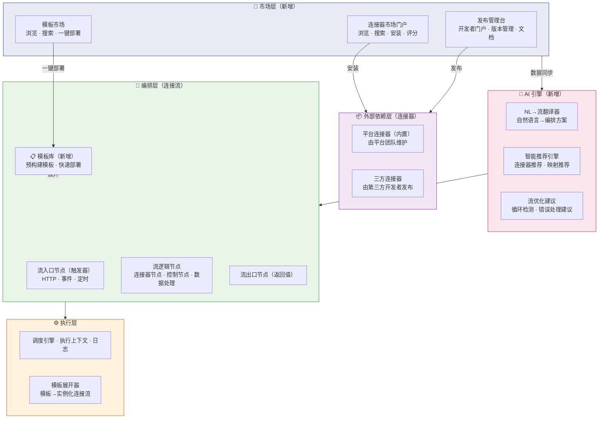
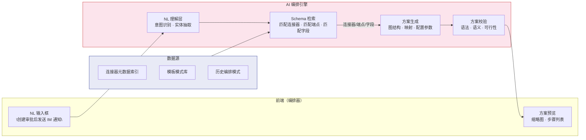

# 规范文档：连接器平台 V2 — 生态与智能

**Feature ID**: CONN-PLAT-002  
**名称**: 连接器平台 V2 — 生态与智能（Connector Platform V2 — Ecosystem & Intelligence）  
**状态**: draft  
**优先级**: P1  
**作者**: Summer  
**创建日期**: 2026-06-02  
**最后更新**: 2026-06-02  
**依赖**: CONN-PLAT-001（V1 MVP — 已建成并验证）  

---

## 1. 概述

### 1.1 问题陈述

V1（CONN-PLAT-001）已验证了**零代码编排**的核心价值——平台管理员可以通过拖拽配置连接流，无需编码即可完成跨系统集成。然而，随着试点用户增多和使用场景拓展，V1 的能力边界暴露出以下痛点：

- **连接器目录有限**：V1 仅提供平台内置连接器，用户遇到未封装的能力时仍需回归硬编码，连接器数量成为编排采纳率的瓶颈
- **无三方生态贡献**：业务部门和技术伙伴有能力封装自有系统的连接器，但缺乏发布渠道和管理机制，创新被抑制
- **编排仍需人工摸索**：用户面对空白画布不知从何下手——选择哪些连接器、如何编排、如何映射字段，学习成本依然较高
- **重复编排模式普遍**：相似的集成场景（如"审批通过后同步数据"）被反复配置，缺乏模版化复用机制
- **连接器可发现性差**：用户不知道平台有哪些连接器可用，已知连接器有哪些能力，只能逐个查看

### 1.2 解决方案

V2 在 V1 的零代码编排基础上，从**工具**升级为**平台**，围绕四个支柱构建：

1. **连接器市场与发现** — 可浏览、搜索、安装连接器的集中市场，用户按需选择
2. **连接器开放发布** — 第三方开发者可通过标准接口发布、版本化、管理自有连接器
3. **AI 辅助编排** — 基于自然语言描述自动生成编排方案，智能推荐连接器和映射
4. **模板库** — 预构建的通用集成模板，用户一键部署即可运行

### 1.3 架构

V2 在 V1 三层架构基础上新增市场层、AI 引擎、模板注册中心：

### 1.4 Goals

| # | 目标 | 衡量标准 |
|---|------|---------|
| **G1** | **连接器市场与发现** — 用户可浏览、搜索、安装来自市场和内部发布的连接器 | 市场连接器 ≥ 20（上线首季）；搜索响应 P99 < 500ms；用户可在一分钟内找到目标连接器 |
| **G2** | **连接器开放发布** — 第三方开发者可自助发布、版本化、管理连接器 | 发布流程 ≤ 5 步；版本管理支持 ≥ 3 个历史版本；从提交到上架 ≤ 24h（自动审核通过场景） |
| **G3** | **AI 辅助编排** — 用户通过自然语言描述可自动生成连接流编排方案 | NL→流转换成功率 ≥ 70%（人工判定可用）；生成方案后用户编辑调整 ≤ 3 步即可运行 |
| **G4** | **模板库** — 预构建的通用集成模板，用户可浏览、搜索、一键部署运行 | 模板数量 ≥ 10（上线首季）；模板部署成功率 ≥ 95%；模板覆盖率 ≥ 60% 常见集成场景 |

### 1.5 Non-Goals

| # | 非目标 | 原因 |
|---|--------|------|
| NG1 | 社区市场/公共市场 — 支持跨企业共享连接器 | V3 阶段；V2 仅限内部企业市场 |
| NG2 | 连接器开发者工具链（IDE 插件/CLI/SDK 调试器） | Should Have，V2.5 或 V3 |
| NG3 | 连接器认证与合规审核（安全扫描/沙箱测试） | Should Have，V2.5 |
| NG4 | 计费/订阅系统 | 企业内使用，无需计费 |
| NG5 | AI 自定义提示词/微调 | 基础能力聚焦，定制化延后 |
| NG6 | 多模态 AI 输入（语音/图片→编排） | 文本 NL→流先验证价值 |
| NG7 | 模板编辑器/模板 SDK | 模板先由平台团队创建 |
| NG8 | 连接器评分/评论系统防爬/防刷 | V2 MVP 采用简单机制 |
| NG9 | 通用 iPaaS — 与 Zapier/Make/集简云竞争 | 聚焦 XX 平台能力编排 |
| NG10 | 多集群/多云连接器运行时 | 企业内单一集群 |

---

## 2. 用户故事

> 💡 **定位**：V2 面向**三类角色**——平台管理员（继续使用 V1 能力）、**业务开发者**（编排消费方）、**三方开发者**（连接器供给方）。

| ID | 用户故事 | 优先级 | 验收标准 |
|----|---------|--------|---------|
| US-01 | 作为 **业务开发者**，我想要 **浏览连接器市场**，按分类/协议/标签搜索连接器，以便 **找到我需要集成的能力** | P1 | 市场展示连接器卡片列表（名称/图标/分类/简要描述/评分）；支持按分类（IM/云盘/审批/…）和协议（HTTP/事件/…）过滤；支持关键字搜索 |
| US-02 | 作为 **业务开发者**，我想要 **查看连接器详情并安装**，以便 **在连接流编排中使用它** | P1 | 详情页展示连接器说明、认证方式、可用端点列表、输入/输出 Schema、版本号、评分；点击"安装"即添加到我的连接器列表 |
| US-03 | 作为 **三方开发者**，我想要 **注册成为连接器发布者并提交我的连接器**，以便 **团队成员或其他业务开发者可使用我的连接器** | P1 | 注册发布者（企业身份验证）；提交连接器基本信息+连接配置+端点定义；提交后进入审核或自动上架 |
| US-04 | 作为 **三方开发者**，我想要 **管理已发布连接器的版本**，发布修复或新增端点，以便 **持续维护我的连接器** | P2 | 支持创建草稿→发布→下架流程；每个版本包含快照（基本信息+配置）；历史版本可查看回滚 |
| US-05 | 作为 **业务开发者**，我想要 **用自然语言描述我的集成需求**，让 AI 自动生成编排方案，以便 **快速搭建连接流** | P1 | 输入中文/英文描述（如"当用户提交审批后，发送 IM 通知审批人"）；AI 自动生成连接流编排方案（含连接器节点+映射）；支持方案确认/编辑/重新生成 |
| US-06 | 作为 **业务开发者**，我想要 **浏览模板库并一键部署模板**，以便 **快速完成常见集成场景** | P1 | 模板列表按场景分类（审批通知/数据同步/告警联动/…）；模板详情展示流程图/描述/所需连接器；点击"部署"自动创建连接流实例 |
| US-07 | 作为 **平台管理员**，我想要 **审核三方开发者提交的连接器**，确保其安全合规后再上架到市场 | P2 | 审核队列展示待审核连接器；可查看连接器配置/端点定义/Schema；支持通过/拒绝（附原因）；审核通过则自动上架 |
| US-08 | 作为 **业务开发者**，我想要 **对市场连接器进行评分和反馈**，帮助其他用户评估连接器质量 | P3 | 已安装连接器后可评分（1-5 星）+ 评论；评分聚合展示在连接器卡片和详情页 |

---

## 3. 功能需求 (FR)

### 3.1 连接器市场（对应 G1）

> 💡 **定位**：连接器市场是用户发现和获取连接器的唯一入口。市场中的连接器来源有二：① 平台团队内置发布的连接器 ② 三方开发者审核上架后的连接器。

| FR | 名称 | 描述 | 验收标准 |
|----|------|------|---------|
| FR-001 | 市场门户列表 | 展示市场中所有可用连接器 | • 卡片模式：名称/图标/分类/评分/安装量 • 支持列表/网格两种视图 • 分页加载，每页 20 条 |
| FR-002 | 搜索与过滤 | 按关键字、分类、协议、评分等条件筛选 | • 关键字搜索：连接器名称/描述/端点名 • 过滤：分类（标签体系）、协议类型、评分范围 • 排序：热门/最新/评分 |
| FR-003 | 连接器详情 | 查看连接器完整信息 | • 基本信息：名称/图标/详细描述/发布者/版本 • 技术信息：端点列表 + 入参/出参 Schema • 评分展示 + 评论列表 • 依赖信息（是否需要其他连接器配合） |
| FR-004 | 连接器安装 | 将市场连接器安装到工作区 | • 点击"安装"即添加到"我的连接器"列表 • 安装后即可在编排画布中引用 • 安装过程自动创建连接配置草稿（待用户补充凭证） • 已安装连接器有新版本时提示升级 |
| FR-005 | 分类与标签体系 | 对连接器进行分类管理 | • 系统预定义分类：IM消息/审批流程/云盘文档/组织架构/… • 每个连接器可关联 1-3 个分类 • 支持自定义标签（发布者维护） |

### 3.2 连接器发布与管理（对应 G2）

| FR | 名称 | 描述 | 验收标准 |
|----|------|------|---------|
| FR-006 | 发布者注册 | 三方开发者注册为连接器发布者 | • 提交企业信息/团队信息 • 平台管理员审批开通发布权限 • 发布者拥有独立的连接器管理空间 |
| FR-007 | 连接器提交 | 填写连接器信息并提交审核 | • 提交内容：基本信息 + 连接配置 + 端点定义 + 使用文档 • 支持提交草稿（暂不提交审核） • 提交后进入审核队列 |
| FR-008 | 连接器版本管理 | 支持多版本维护 | • 每次编辑创建新草稿版本 • 发布时生成版本号（语义化版本 SemVer） • 支持查看历史版本详情 • 支持回滚到历史版本 • 消费者端默认使用最新已发布版本 |
| FR-009 | 连接器审核 | 平台管理员审核三方提交的连接器 | • 审核工作台：待审核队列 + 审核历史 • 审核维度：配置完整性、文档质量、安全合规 • 审核通过 → 上架到市场；拒绝 → 退回（附原因） • 支持自动审核（基于规则）和人工审核 |
| FR-010 | 连接器下架 | 发布者或管理员下架连接器 | • 发布者可主动申请下架 • 管理员可强制下架（违规/安全） • 下架后市场不可搜索/安装 • 已安装用户不受影响（但后续无法使用新版本） |

### 3.3 AI 辅助编排（对应 G3）

| FR | 名称 | 描述 | 验收标准 |
|----|------|------|---------|
| FR-011 | 自然语言→连接流 | 输入自然语言描述，AI 自动生成编排方案 | • 输入框支持中文/英文描述 • AI 生成包含：触发器类型、连接器节点序列、节点间数据映射 • 生成结果以可视化缩略图展示 • 支持"重新生成"和"手动编辑" |
| FR-012 | 连接器智能推荐 | 在编排画布中推荐最合适的连接器 | • 基于上下文推荐：当前已选连接器 → 推荐关联连接器 • 基于场景推荐：根据输入参数类型推荐处理节点 • 推荐结果展示在画布侧边栏 |
| FR-013 | 字段映射智能建议 | 在数据映射配置中自动推荐字段对应关系 | • 基于字段名/类型/历史映射自动推荐映射 • 展示置信度（高/中/低） • 用户确认或手动调整 |
| FR-014 | 流优化建议 | 分析已有连接流，提供优化建议 | • 检测缺失的错误处理节点 → 建议添加 • 检测可合并为子流程的重复模式 → 建议重构 • 检测潜在性能问题（串行可改并行）→ 建议优化 |

### 3.4 模板库（对应 G4）

| FR | 名称 | 描述 | 验收标准 |
|----|------|------|---------|
| FR-015 | 模板浏览 | 浏览和搜索可用模板 | • 模板卡片展示：名称/场景分类/简要描述/所需连接器/复杂度 • 支持按场景分类过滤 • 支持关键字搜索 |
| FR-016 | 模板详情 | 查看模板完整信息 | • 模板流程图预览 • 步骤说明 • 所需连接器列表（标注是否已安装） • 前置条件说明 |
| FR-017 | 模板一键部署 | 从模板创建可运行的连接流实例 | • 点击"部署"→ 检查依赖连接器是否已安装 → 引导安装缺失连接器 → 创建连接流 • 部署后跳转到连接流编排器（可继续自定义） • 部署后的连接流与模板**解除绑定**（可独立编辑） |
| FR-018 | 模板管理 | 平台管理员管理模板库 | • 创建/编辑/下架模板 • 模板版本管理 • 模板分类管理 |

---

## 4. 非功能需求 (NFR)

### 4.1 性能要求

| ID | 需求 | 目标值 |
|----|------|--------|
| NFR-001 | 市场页面加载时间 | P99 < 1s（含连接器列表 + 分类数据） |
| NFR-002 | 市场搜索响应时间 | P99 < 500ms |
| NFR-003 | 连接器安装时间 | P99 < 3s（含配置初始化） |
| NFR-004 | AI NL→流生成延迟 | P95 < 5s |
| NFR-005 | AI 连接器推荐延迟 | P95 < 2s |
| NFR-006 | 模板一键部署时间 | P95 < 5s（含连接流创建 + 初始化） |
| NFR-007 | 市场可用性 | ≥ 99.9% |
| NFR-008 | 并行 AI 推理请求 | ≥ 10 并发 |

### 4.2 安全性要求

| ID | 需求 | 描述 |
|----|------|------|
| NFR-009 | 发布者身份认证 | 三方开发者需企业身份认证后才能提交连接器 |
| NFR-010 | 连接器安全审核 | 三方连接器在自动上架前需通过安全规则检查（禁止明文凭证、禁止危险 API 调用等） |
| NFR-011 | 连接器隔离 | 三方连接器运行时与平台连接器隔离，防止恶意连接器影响平台稳定性 |
| NFR-012 | AI 请求审计 | 所有 NL→流输入输出记录审计日志，用于 QA 和模型改进 |
| NFR-013 | 评分防刷 | 同一用户对同一连接器仅可评分一次；异常评分触发人工复核 |

### 4.3 兼容性要求

| ID | 需求 | 描述 |
|----|------|------|
| NFR-014 | V1 兼容 | V1 已创建的连接器和连接流在 V2 中可正常使用，不受影响 |
| NFR-015 | 连接器格式兼容 | 三方发布的连接器使用与平台连接器相同的配置格式标准 |
| NFR-016 | AI 多语言 | NL 输入支持中文和英文（优先级），其他语言以英文为后备 |

---

## 5. 技术设计

> 💡 以下为 V2 新增/变更的概要设计，已有 V1 组件（连接器管理、编排引擎、运行时等）保持不变。

### 5.1 新增核心组件

| 组件 | 职责 | 说明 |
|------|------|------|
| **市场服务** | 连接器市场的索引、搜索、安装、评分管理 | 基于连接器元数据索引；搜索使用搜索引擎（如 Elasticsearch） |
| **发布管理服务** | 三方开发者注册、连接器提交、审核、版本管理 | 工作流驱动：提交→审核→上架流程 |
| **AI 编排引擎** | NL→流翻译、连接器/映射推荐、流优化建议 | 调用大语言模型 API；提示词工程 + 连接器 Schema 上下文注入；结果后处理校验 |
| **模板注册中心** | 模板的创建、存储、检索、展开部署 | 模板采用结构化连接流定义格式；部署时展开为连接流实例 |
| **审核工作台** | 管理员审核三方连接器 | 展示审核队列；支持自动规则检查 + 人工审核 |

### 5.2 接口模块（新增/变更）

| 模块 | 主要接口 | 说明 |
|------|---------|------|
| 市场 API | 连接器检索、安装、评分 CRUD | 对外暴露市场数据 |
| 发布 API | 注册、提交、版本管理、下架 | 面向三方开发者 |
| AI API | NL→流翻译、连接器推荐、映射推荐、流优化 | 编排器前端调用 |
| 模板 API | 模板 CRUD、分类管理、一键部署 | 管理员和用户使用 |
| 审核 API | 审核队列、审核操作（通过/拒绝） | 审核工作台调用 |

### 5.3 前端页面（新增/变更）

| 页面 | 说明 |
|------|------|
| 连接器市场页 | 浏览/搜索/过滤/安装连接器 |
| 连接器详情页 | 展示连接器完整信息/评分/评论 |
| 发布者控制台 | 三方管理已发布连接器/版本/分析 |
| 连接器提交流程页 | 引导式表单提交流程 |
| AI 编排对话面板 | NL 输入框 + 方案预览/确认/编辑 |
| 模板市场页 | 浏览/搜索模板 |
| 模板部署向导 | 模板详情 + 依赖检查 + 一键部署 |
| 审核工作台 | 管理员审核三方连接器列表 + 详情 |

### 5.4 AI 编排引擎架构示意

### 5.5 依赖关系

| 依赖 | 用途 | 说明 |
|------|------|------|
| 大语言模型 API | AI NL→流翻译和推荐 | 选型待 ADR 决策（内部部署 vs 云端 API） |
| 搜索引擎（ES） | 连接器市场和模板搜索索引 | 若已有可复用 |
| 工作流引擎 | 发布→审核→上架流程编排 | 若已有审批流程引擎可复用 |
| V1 编排引擎和运行时 | 模板展开后生成连接流实例运行 | 复用现有能力 |

---

## 6. 边界情况 (EC)

| EC | 场景 | 处理方式 |
|----|------|---------|
| EC-001 | 市场中连接器被下架后已安装用户的操作 | 已安装用户继续使用当前版本；但无法获取新版本、无法重新安装；编排画布中已引用的连接器节点标记为"已下架"警告 |
| EC-002 | 三方开发者发布的连接器存在安全漏洞 | 平台管理员可强制下架；运行时监控发现异常调用自动阻断；触发安全事件告警 |
| EC-003 | AI 生成的编排方案存在不可达节点/循环依赖 | 方案校验阶段检测到语法错误则拒绝生成，改为返回错误提示并建议简化描述 |
| EC-004 | NL 输入过于模糊或缺少关键信息 | AI 返回引导式追问（"请指定触发条件""请指定需要通知的对象"），若追问 2 次后仍模糊则返回入参模板 |
| EC-005 | 模板部署时依赖的连接器未被安装 | 部署前端引导用户安装缺失连接器；提供安装链接，安装后继续部署流程 |
| EC-006 | 模板版本与当前平台版本不兼容 | 部署前校验模板兼容性；不兼容时展示差异说明，建议用户手动调整或选择其他模板 |
| EC-007 | 连接器新版本发布后，已有连接流引用旧版本 | 连接流继续使用旧版本（引用固定版本号）；画布中提示新版本可用，建议用户迁移 |
| EC-008 | 连接器安装过程中认证凭证配置失败 | 安装流程暂停，标记为"待配置"状态；引导用户完成凭证配置后再激活使用 |
| EC-009 | 同一连接器被多个发布者提交（同名/同功能） | 审核阶段人工判断：合并为同一连接器 by 不同发布者 vs 拒绝重复提交 |
| EC-010 | AI 服务不可用 | 降级策略：AI 功能展示"暂不可用"提示，用户可继续使用手动编排；模板和市场的功能不受影响 |
| EC-011 | 评分/评论包含恶意内容 | 评论内容经过敏感词过滤；支持管理员删除违规评论；用户可举报不当评论 |

---

## 7. 开放问题

| # | 问题 | 影响范围 | 建议决策时间 |
|---|------|---------|-------------|
| OQ-001 | **AI 模型选型**：内部部署的开源模型 vs 云端 API（如 GPT-4/DeepSeek）；成本和延迟如何平衡 | AI 编排整体架构 | Plan 阶段 ADR |
| OQ-002 | **AI 提示词方案**：是将连接器 Schema 一次性注入 vs 按需检索注入；Schema 规模大时的性能策略 | AI 编排生成质量 | Plan 阶段 ADR |
| OQ-003 | **连接器发布审核粒度**：自动审核规则（支持哪些自动检查）vs 人工审核（哪些必须人工） | 发布流程效率 | Plan 阶段 |
| OQ-004 | **模板来源策略**：首版模板全部由平台团队创建，还是开放部分高级用户创建模板的权利 | 模板库规模扩张 | Plan 阶段 |
| OQ-005 | **搜索技术选型**：基于 SQL LIKE 的简单搜索 vs 接入 Elasticsearch/OpenSearch | 市场搜索体验 | Plan 阶段 ADR |
| OQ-006 | **市场连接器安装权限**：是否需要对市场连接器的安装权限做基于 Scope 的管控 | 安全管控 | Plan 阶段 |
| OQ-007 | **AI 方案编辑相互作用**：AI 生成方案后用户手动编辑→再次请求 AI 优化时，如何保持用户编辑不被覆盖 | AI 编排交互体验 | Plan 阶段 UX 设计 |

---

## 8. 成功标准

### 8.1 定性指标

| 维度 | 成功标准 | 对应核心目标 |
|------|---------|-------------|
| **生态活跃** | 三方开发者主动发布有用连接器，形成正向循环 | G1/G2 |
| **编排智能化** | 用户从空白画布到运行连接流的平均时间显著缩短（vs V1 纯手动） | G3 |
| **模板复用率** | 用户部署模板后仅做少量定制即可上线，而非重头开始 | G4 |
| **发现高效** | 用户能找到想要的连接器，无需通过文档/问人 | G1 |

### 8.2 定量指标

| 指标类型 | 具体指标 | 对应核心目标 |
|---------|---------|-------------|
| **市场规模** | 市场上架连接器总数 | G1 |
| **安装转化率** | 市场浏览→安装转化率（目标 ≥ 15%） | G1 |
| **三方发布数** | 三方开发者发布的连接器数量 | G2 |
| **AI 采纳率** | 使用 AI 生成的连接流占比（目标 ≥ 30% 的新建流） | G3 |
| **AI 方案可用率** | NL→流生成方案经用户确认可用的比例（目标 ≥ 70%） | G3 |
| **模板部署数** | 从模板部署的连接流数量 | G4 |
| **模板覆盖率** | 模板覆盖的常见集成场景比例（目标 ≥ 60%） | G4 |
| **用户满意度** | 连接器市场 NPS 得分（目标 ≥ 30） | G1 |

---

## 9. 风险与假设

### 9.1 关键假设

| 假设 | 风险等级 | 验证方式 |
|------|---------|---------|
| 企业内部有足够的第三方开发者愿意贡献连接器 | **高** | 试点阶段邀请 2-3 个业务团队参与验证；若无人参与则 V2.5 优先推进 |
| AI 大模型对连接器编排场景的 NL→流生成质量可达可用水平（≥ 70%） | **高** | 技术预研阶段用真实 Schema 测试模型生成质量 |
| 用户愿意尝试 AI 辅助编排（而非信任手动编排） | 中 | V2 上线后 A/B 测试：AI 推荐组 vs 纯手动组 |
| 连接器市场/模板库可复用 V1 的编排运行时，无需重写 | 低 | 架构设计保持 V1 接口不变 |

### 9.2 潜在风险

| 风险 | 影响 | 缓解措施 |
|------|------|---------|
| AI 模型幻觉导致生成不可用的编排方案，打击用户信任 | 高 | 方案校验层严格检查语法可行性；生成结果标注「建议审核后使用」；允许用户评分反馈 |
| 三方连接器质量参差不齐，出现安全事件 | 高 | 自动审核规则持续强化；安全沙箱隔离三方连接器执行；明确免责声明 |
| LLM API 成本过高 | 中 | 规划 Token 用量预算；方案缓存（相同输入→直接返回）；考虑内部部署小模型做初级分类 |
| 市场内容冷启动——上架连接器不足，用户浏览后流失 | 中 | 平台团队首期预装 ≥ 15 个连接器；模板库优先覆盖 Top 10 场景 |
| 发布者活跃度不足——发布后无人维护导致版本过期 | 低 | 设置连接器健康度指标；不活跃连接器标记为"维护中"或归档 |

---

## 10. 版本规划

| 版本 | 范围 | 核心价值 |
|------|------|---------|
| **V1（MVP）** ✅ 已建成 | 平台管理员 + 连接器管理（单版本） + 连接流线性编排 + 测试执行 + 平台托管运行时 | **验证"零代码编排"核心价值** |
| **V2（本规范）** 目标 Q3 2026 | 连接器市场 + 开放发布 + AI 辅助编排 + 模板库 | **从工具升级为平台——生态+智能** |
| **V2.5 建议** | 连接器 CLI/SDK + 审核自动化 + 连接器运行分析与监控 + AI 可评价/反馈闭环 | 强化开发者体验和安全治理 |
| **V3 展望** | 社区市场（跨企业共享）+ 高级 AI（多模态/自定义提示词/Flow Copilot）+ 多集群连接器运行时 + 连接器计费/用量分析 | **成为企业集成标准"连接器即服务"** |

> **V1→V2 迁移策略**：V1 已上线的连接器和连接流保持完全兼容，零迁移成本。用户数据（连接器、连接流、执行历史）无缝升级，V2 功能作为"新增能力"叠加在 V1 之上。市场/发布/AI/模板均为可选采用，不强制升级。

---

## 附录

### A. 需求追溯

| V2 支柱 | 对应 US | 对应 FR |
|---------|---------|---------|
| G1 连接器市场与发现 | US-01, US-02, US-08 | FR-001 ~ FR-005 |
| G2 连接器开放发布 | US-03, US-04, US-07 | FR-006 ~ FR-010 |
| G3 AI 辅助编排 | US-05 | FR-011 ~ FR-014 |
| G4 模板库 | US-06 | FR-015 ~ FR-018 |

### B. V1→V2 变更摘要

| 变更项 | V1（已完成） | V2（新增） |
|--------|-------------|-----------|
| 连接器来源 | 仅平台内置 | 平台内置 + 三方发布 |
| 连接器发现 | 平铺列表 | 市场门户 + 搜索 + 分类 + 评分 |
| 编排方式 | 纯手动拖拽 | 手动 + AI 辅助生成 |
| 编排起点 | 空白画布 | 空白画布 + 模板一键部署 |
| 角色 | 平台管理员 | 平台管理员 + 业务开发者 + 三方开发者 |

### C. 参考资料

- V1 规范文档（v5.0）：`../specs-tree-connector-platform/spec-v5.0.md`
- V1 技术计划：`../specs-tree-connector-platform/plan-code.md`
- V1 验证报告：`../specs-tree-connector-platform/validation-report.md`
- V1 测试报告：`../specs-tree-connector-platform/test-report.md`
- XX 平台能力开放平台规范：`../specs-tree-capability-open-platform/spec.md`
- 钉钉连接平台调研报告：`../../docs/software-connector-platform-research/钉钉连接平台调研报告.md`
- 飞书集成平台调研报告：`../../docs/software-connector-platform-research/飞书集成平台调研报告.md`

---

## 修订记录

| 版本 | 日期 | 修订内容 | 修订人 |
|------|------|---------|--------|
| v2.0-draft | 2026-06-02 | 初始版本 — 基于 V1（v5.0）完成验证后的 V2 生态与智能扩展规范 | Summer |

---

**规范状态**: 📝 初稿（draft）  
**下一步**: 运行 `@sddu-discovery` 进行需求挖掘访谈 → `@sddu-spec` 细化规范 → `@sddu-plan` 开始技术规划  
