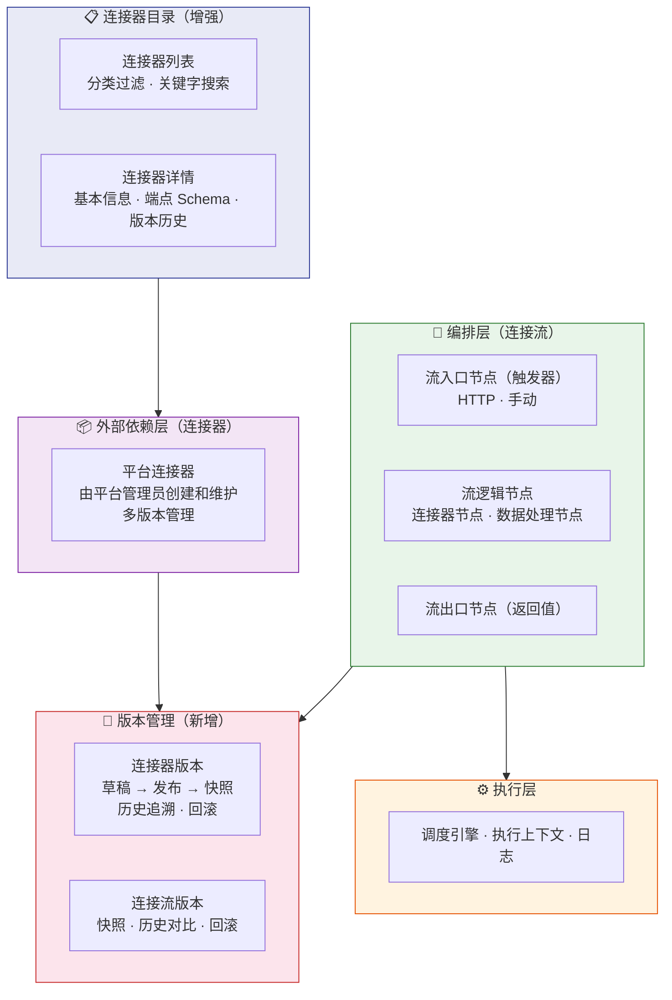

# 规范文档：连接器平台 V2 — 多版本与目录

**Feature ID**: CONN-PLAT-002  
**名称**: 连接器平台 V2 — 多版本与目录（Connector Platform V2 — Multi-Version & Directory）  
**状态**: draft  
**优先级**: P1  
**作者**: Summer  
**创建日期**: 2026-06-02  
**最后更新**: 2026-06-02  
**依赖**: CONN-PLAT-001（V1 MVP — 已建成并验证）  

---

## 1. 概述

### 1.1 问题陈述

V1（CONN-PLAT-001）已验证了**零代码编排**的核心价值——平台管理员可以通过拖拽配置连接流，无需编码即可完成跨系统集成。然而，随着连接器和连接流数量增长，V1 的单版本模型暴露出以下痛点：

- **无版本追溯能力**：V1 连接器和连接流配置编辑即生效，不保留历史版本。误操作或配置退化后无法回滚，缺乏变更审计
- **连接器可发现性差**：V1 连接器仅平铺列表，用户不知道平台有哪些连接器可用，已知连接器有哪些能力和端点，只能逐个查看
- **搜索体验不足**：无法按分类、协议、端点名等方式快速筛选定位目标连接器
- **连接流无快照机制**：连接流的编排配置变更后，历史配置不可追溯，无法对比不同版本的编排差异

### 1.2 解决方案

V2 在 V1 的零代码编排基础上，围绕两个核心升级：

1. **多版本管理** — 连接器和连接流均采用多版本模型（草稿→发布→快照），支持版本历史追溯和回滚
2. **连接器目录增强** — 提供分类过滤、关键字搜索、端点 Schema 预览，提升连接器可发现性

### 1.3 架构

V2 在 V1 三层架构基础上增强版本管理与目录检索：

### 1.4 Goals

| # | 目标 | 衡量标准 |
|---|------|---------|
| **G1** | **连接器目录增强** — 连接器列表支持分类过滤、关键字搜索，详情页展示端点 Schema 和版本历史 | 搜索响应 P99 < 500ms；用户可在一分钟内找到目标连接器 |
| **G2** | **连接器多版本管理** — 连接器支持创建草稿、发布生成版本号、查看版本历史、回滚 | 每次发布生成 SemVer 版本号；支持查看全部历史版本；回滚操作 ≤ 3 步 |
| **G3** | **连接流多版本管理** — 连接流编排配置支持创建快照、查看版本历史、回滚 | 快照创建 ≤ 2 步；历史版本可对比差异；回滚操作 ≤ 3 步 |

### 1.5 Non-Goals

| # | 非目标 | 原因 |
|---|--------|------|
| NG1 | AI 辅助编排（含 NL→流翻译、连接器智能推荐、字段映射建议、流优化） | V2 聚焦版本管理基础设施 |
| NG2 | 连接器模板库（模板浏览/搜索/一键部署） | 依赖多版本模型成熟后再构建 |
| NG3 | 三方连接器开放发布（含发布者注册/提交/审核/下架） | V2 聚焦平台管理员的版本管理能力 |
| NG4 | 连接器/连接流审批管控 | V2 无审批流程，平台管理员直接操作 |
| NG5 | 基于 Scope 的权限模型 | 沿用 V1 权限模型，V2 暂不扩展 |
| NG6 | 连接器评分/评论系统 | V2 聚焦功能增强，社区特性延后 |
| NG7 | 连接器开发者工具链（SDK/CLI/IDE 插件） | Should Have，后续版本 |
| NG8 | 社区市场/跨企业共享连接器 | 仅限企业内部使用 |
| NG9 | 计费/订阅系统 | 企业内使用，无需计费 |
| NG10 | 通用 iPaaS（与 Zapier/Make/集简云竞争） | 聚焦 XX 平台能力编排 |
| NG11 | 多集群/多云连接器运行时 | 企业内单一集群 |

---

## 2. 用户故事

> 💡 **定位**：V2 面向**平台管理员**单一角色，与 V1 一致。平台管理员负责连接器的注册与版本管理、连接流的编排与版本管理。

| ID | 用户故事 | 优先级 | 验收标准 |
|----|---------|--------|---------|
| US-01 | 作为 **平台管理员**，我想要 **浏览连接器目录**，按分类/协议/关键字搜索连接器，以便 **快速找到需要的连接器** | P1 | 目录展示连接器列表（名称/图标/分类/简要描述）；支持按分类和协议类型过滤；支持关键字搜索连接器名称/描述/端点名 |
| US-02 | 作为 **平台管理员**，我想要 **查看连接器详情**，包括端点列表和版本历史，以便 **全面了解连接器的能力和变更记录** | P1 | 详情页展示连接器基本信息、端点列表（入参/出参 Schema）、版本历史列表（版本号/发布时间/变更说明） |
| US-03 | 作为 **平台管理员**，我想要 **管理连接器的多版本**，创建草稿、发布版本、查看和回滚历史版本，以便 **安全地迭代连接器配置且有追溯能力** | P1 | 编辑连接器配置时创建草稿版本；点击"发布"生成 SemVer 版本号并快照；历史版本列表可查看详情；支持一键回滚到任意历史版本 |
| US-04 | 作为 **平台管理员**，我想要 **管理连接流的多版本**，创建快照、查看历史版本、对比差异、回滚，以便 **安全地迭代编排配置并有变更追溯** | P1 | 编排画布中可创建版本快照；历史版本列表展示版本号和创建时间；支持版本间差异对比（高亮变更节点）；支持回滚到任意历史版本 |
| US-05 | 作为 **平台管理员**，我想要 **在编排画布中引用连接器的指定版本**，以便 **控制连接器变更对连接流的影响** | P2 | 在编排画布中选择连接器节点时可指定版本号；默认引用最新已发布版本；连接流详情展示各连接器节点的引用版本 |

---

## 3. 功能需求 (FR)

### 3.1 连接器目录增强（对应 G1）

> 💡 **定位**：连接器目录是管理员浏览和搜索连接器的入口。所有连接器由平台管理员注册和管理。V2 在 V1 平铺列表基础上增加分类过滤、关键字搜索和详情增强。

#### 3.1.1 连接器目录

| FR | 名称 | 描述 | 验收标准 |
|----|------|------|---------|
| FR-001 | 连接器列表 | 展示平台所有连接器 | • 列表展示：名称、图标、分类、简要描述、最新版本号 • 支持分页加载 • 沿用 V1 的列表视图 |
| FR-002 | 搜索与过滤 | 按关键字、分类、协议等条件筛选连接器 | • 关键字搜索：连接器名称、描述、端点名 • 过滤：按分类、协议类型 • 排序：按名称、更新时间 |
| FR-003 | 分类体系 | 对连接器进行系统化分类 | • 系统预定义分类：IM消息、审批流程、云盘文档、组织架构等 • 每个连接器可关联 1-3 个分类 |

#### 3.1.2 连接器详情

| FR | 名称 | 描述 | 验收标准 |
|----|------|------|---------|
| FR-004 | 连接器详情 | 查看连接器完整信息 | • 基本信息：名称、图标、描述、分类、协议类型 • 端点信息：端点列表 + 入参/出参 Schema • 版本信息：当前最新版本号、版本历史入口 |

### 3.2 连接器多版本管理（对应 G2）

> 💡 **定位**：V2 连接器采用多版本模型，替代 V1 的"编辑即生效"单版本模型。每次编辑创建草稿，发布时生成 SemVer 版本号并快照。连接器由平台管理员统一注册和管理。

#### 3.2.1 连接器基本信息管理

| FR | 名称 | 描述 | 验收标准 |
|----|------|------|---------|
| FR-005 | 连接器创建 | 创建连接器基本信息 | • 名称、图标、描述、分类、协议类型（HTTP） • 创建后生成连接器基本信息，初版配置默认为空 |
| FR-006 | 连接器编辑 | 编辑连接器基本信息 | • 修改名称、图标、描述、分类 • 基本信息变更不影响已发布版本 |
| FR-007 | 连接器删除 | 删除连接器 | • 删除前校验：无运行中的连接流引用该连接器才允许删除 • 有引用时提示影响范围，禁止删除 • 删除后不可恢复 |

#### 3.2.2 连接器版本管理

| FR | 名称 | 描述 | 验收标准 |
|----|------|------|---------|
| FR-008 | 创建草稿版本 | 编辑连接器配置时创建草稿 | • 编辑连接配置（协议地址、认证方式、入参/出参 Schema、超时、限流）→ 创建草稿版本 • 草稿不影响已发布的当前版本 • 草稿可继续编辑，保存时覆盖当前草稿 • 草稿可随时丢弃 |
| FR-009 | 发布版本 | 将草稿发布为正式版本 | • 发布时生成 SemVer 版本号（主版本.次版本.修订号） • 快照当前连接配置完整内容 • 记录发布说明（变更描述） • 发布后草稿清空，版本进入历史列表 • 发布即生效——引用该连接器的连接流默认使用最新已发布版本 |
| FR-010 | 版本历史查看 | 查看连接器所有已发布版本 | • 版本列表展示：版本号、发布时间、发布说明 • 可查看任意历史版本的完整配置快照 • 标注当前生效版本 |
| FR-011 | 版本回滚 | 将连接器配置回滚到历史版本 | • 选择目标历史版本，点击"回滚" • 回滚操作创建新的草稿（复制历史版本配置） • 草稿需再次发布才生效 • 回滚操作记录审计日志 |

### 3.3 连接流多版本管理（对应 G3）

> 💡 **定位**：V2 连接流采用多版本模型，替代 V1 的"编辑即生效"单版本模型。编排配置支持创建快照、查看历史、对比差异和回滚。

#### 3.3.1 连接流基本信息管理（沿用 V1）

| FR | 名称 | 描述 | 验收标准 |
|----|------|------|---------|
| FR-012 | 连接流创建 | 创建连接流基本信息 | • 沿用 V1 FR-009：名称、描述 • 创建后生成连接流，编排配置默认为空 |
| FR-013 | 连接流编辑 | 编辑连接流基本信息 | • 沿用 V1 FR-010：修改名称、描述 |
| FR-014 | 连接流删除 | 删除连接流 | • 沿用 V1 FR-011：仅「已停止」状态可删除；删除后不可恢复 |
| FR-015 | 连接流部署 | 编排配置保存即视为部署 | • 沿用 V1 FR-013：编排配置保存即视为部署到运行环境 |
| FR-016 | 连接流启停 | 启动/停止连接流 | • 沿用 V1 FR-014/FR-015：启动后进入运行中状态；停止后不再响应触发 |
| FR-017 | 连接流列表 | 查看连接流列表 | • 沿用 V1 FR-012：展示名称、状态、最后运行时间；支持按状态过滤和搜索 |

#### 3.3.2 连接流编排配置（增强版）

| FR | 名称 | 描述 | 验收标准 |
|----|------|------|---------|
| FR-018 | 编排配置编辑 | 编辑连接流的编排内容 | • 沿用 V1 FR-017 的核心编排能力：流入口节点（HTTP）、连接器节点、数据处理节点、节点间数据映射、流出口节点 • 新增：编排画布中连接器节点可指定引用版本号（默认最新已发布版本） • 编辑保存后更新当前草稿配置，不影响已发布版本 |
| FR-019 | 测试执行 | 手动触发连接流测试运行 | • 沿用 V1 FR-020：手动触发、同步返回结果、每步执行详情、模拟数据输入 |

#### 3.3.3 连接流版本管理（新增）

| FR | 名称 | 描述 | 验收标准 |
|----|------|------|---------|
| FR-020 | 创建版本快照 | 将当前编排配置保存为版本快照 | • 在编排画布中点击"保存版本" • 快照包含完整编排配置（所有节点、映射关系、引用连接器版本号） • 记录快照说明（可选） • 快照创建后生成递增版本号 |
| FR-021 | 版本历史查看 | 查看连接流所有快照版本 | • 版本列表展示：版本号、创建时间、快照说明 • 标注哪个版本为当前运行版本 • 可查看任意历史版本的编排配置详情 |
| FR-022 | 版本差异对比 | 对比任意两个版本间的编排差异 | • 展示变更节点列表（新增/删除/修改） • 变更节点高亮标注 • 展示映射关系变更（如有） |
| FR-023 | 版本回滚 | 将连接流配置回滚到历史版本 | • 选择目标历史版本，点击"回滚" • 回滚后当前编排配置替换为目标版本配置 • 回滚操作记录审计日志 • 回滚后需手动启动（如当前为运行中，回滚后保持运行中） |

### 3.4 运行时与监控（沿用 V1）

> 💡 **定位**：V2 运行时与 V1 保持一致，沿用 V1 的调度执行、默认错误处理和限流能力。

| FR | 名称 | 描述 | 验收标准 |
|----|------|------|---------|
| FR-024 | HTTP 触发调度（同步） | 接收 HTTP 请求，同步执行连接流并返回结果 | • 沿用 V1 FR-021 |
| FR-025 | 默认错误处理 | 节点执行失败时的默认处理 | • 沿用 V1 FR-023 |
| FR-026 | 默认限流处理 | 触发请求超限时返回 429 | • 沿用 V1 FR-024 |

---

## 4. 非功能需求 (NFR)

### 4.1 性能要求

| ID | 需求 | 目标值 |
|----|------|--------|
| NFR-001 | 连接器目录查询响应时间 | P99 < 200ms（沿用 V1） |
| NFR-002 | 连接器搜索响应时间 | P99 < 500ms |
| NFR-003 | 连接流列表查询响应时间 | P99 < 200ms（沿用 V1） |
| NFR-004 | HTTP 触发到连接流开始执行的延迟 | P99 < 2s（沿用 V1） |
| NFR-005 | 版本列表查询响应时间 | P99 < 300ms |
| NFR-006 | 版本快照创建响应时间 | P99 < 1s |
| NFR-007 | 系统可用性 | ≥ 99.9%（沿用 V1） |
| NFR-008 | 单连接流并发执行支持 | ≥ 10 并发实例（沿用 V1） |

### 4.2 安全性要求

| ID | 需求 | 描述 |
|----|------|------|
| NFR-009 | 身份认证 | 沿用 V1 认证机制：管理面基于企业内部认证系统；数据面通过 AKSK/OAuth 验证 |
| NFR-010 | 权限控制 | 沿用 V1 权限模型：连接器/连接流操作仅限平台管理员 |
| NFR-011 | 凭证安全 | 沿用 V1：连接器认证凭证加密存储，界面脱敏显示；凭证传输使用 HTTPS |
| NFR-012 | HTTP 触发安全 | 沿用 V1：HTTP 触发 URL 使用不可预测路径；支持请求签名验证 |
| NFR-013 | 数据传输安全 | 沿用 V1：所有 API 调用使用 HTTPS |
| NFR-014 | 审计日志 | 沿用 V1：连接流启停等关键操作记录审计日志；新增：版本发布/回滚操作记录审计日志 |
| NFR-015 | 操作可撤销 | 沿用 V1：连接流启停可回退；新增：版本回滚提供操作撤销能力 |
| NFR-016 | 数据持久化 | 沿用 V1：配置数据持久化存储，系统重启不丢失；新增：版本快照数据持久化 |

### 4.3 兼容性要求

| ID | 需求 | 描述 |
|----|------|------|
| NFR-017 | V1 兼容 | V1 已创建的连接器和连接流在 V2 中可正常使用；V1 的单版本配置自动迁移为 V2 的第一个已发布版本 |
| NFR-018 | 能力开放平台兼容 | 与能力开放平台 MVP 版本 API/事件/回调接口兼容（沿用 V1） |
| NFR-019 | 浏览器兼容 | 支持 Chrome（最新 2 个大版本）、Edge（最新 2 个大版本）（沿用 V1） |

---

## 5. 技术设计

> 💡 以下为 V2 的概要设计。V1 已有组件（连接器管理、编排引擎、运行时等）保持不变，V2 在其上叠加版本管理层。

### 5.1 核心变更

| 变更项 | V1 模型 | V2 模型 |
|--------|---------|---------|
| 连接器配置模型 | 单版本（编辑即生效） | 多版本（草稿→发布→快照） |
| 连接流配置模型 | 单版本（编辑即生效） | 多版本（编辑→快照→版本历史） |
| 连接器目录 | 平铺列表 | 分类过滤 + 关键字搜索 + 端点详情 |
| 连接器版本引用 | 无（始终最新） | 连接流可引用指定版本号 |

### 5.2 新增核心组件

| 组件 | 职责 | 说明 |
|------|------|------|
| **版本管理服务** | 连接器和连接流的草稿、发布、快照、回滚 | 统一的版本生命周期管理 |
| **版本存储层** | 版本快照数据的持久化存储 | 每次发布/快照保存完整配置副本 |
| **版本比对引擎** | 连接流版本间编排差异对比 | 比较节点列表和映射关系的变更 |

### 5.3 接口模块（新增/变更）

| 模块 | 主要接口 | 说明 |
|------|---------|------|
| 连接器版本管理 | 创建草稿、发布版本、版本历史、版本回滚 | V2 新增 |
| 连接流版本管理 | 创建快照、版本历史、版本差异对比、版本回滚 | V2 新增 |
| 连接器搜索 | 关键字搜索、分类过滤 | V2 增强 |

### 5.4 前端页面（新增/变更）

| 页面 | 说明 |
|------|------|
| 连接器目录（增强） | 在 V1 平铺列表基础上增加分类过滤和关键字搜索 |
| 连接器详情（增强） | 新增端点 Schema 展示、版本历史入口 |
| 连接器版本历史页 | 版本列表、版本详情、回滚操作 |
| 连接流版本历史页 | 版本列表、版本差异对比、回滚操作 |
| 编排画布（增强） | 新增连接器版本选择器、版本快照保存入口 |

### 5.5 依赖关系

| 依赖 | 用途 | 说明 |
|------|------|------|
| V1 编排引擎和运行时 | 连接流调度执行 | 完全复用，无需变更 |
| V1 连接器管理 | 连接器 CRUD 基础能力 | 在其上叠加版本层 |
| 数据库 | 版本快照数据存储 | 复用现有 MySQL |
| 搜索引擎（可选） | 连接器搜索索引 | Plan 阶段 ADR 决策（SQL LIKE vs ES） |

---

## 6. 边界情况 (EC)

| EC | 场景 | 处理方式 |
|----|------|---------|
| EC-001 | 连接器的版本回滚后，引用旧版本的连接流行为 | 连接流继续使用其引用的版本号不变；若不指定版本号则默认使用最新已发布版本（回滚后新发布的版本仍为最新） |
| EC-002 | 连接流回滚时，引用连接器的版本已被删除 | 回滚失败，提示"引用的连接器版本不可用"，建议用户手动更新连接器版本引用 |
| EC-003 | 连接流执行中，被引用连接器的认证凭证过期 | 沿用 V1 EC-003：执行失败，提示更新凭证 |
| EC-004 | 连接流编排为空时创建版本快照 | 校验不通过，禁止创建快照，提示至少添加一个逻辑节点 |
| EC-005 | HTTP 触发 URL 被非法调用 | 沿用 V1 EC-005：签名验证失败返回 401；记录非法调用日志 |
| EC-006 | 连接流执行超时 | 沿用 V1 EC-007：单次执行超时后强制终止，标记为「执行超时」 |
| EC-007 | 字段映射中源字段在上游节点输出中不存在 | 沿用 V1 EC-008：执行时该字段值为空/null，不中断执行 |
| EC-008 | 能力开放平台 API 网关不可用 | 沿用 V1 EC-009：连接流执行失败 |
| EC-009 | 同一连接器存在多个草稿版本 | 每个连接器同时仅支持一个草稿版本；再次编辑草稿时覆盖已有草稿内容 |
| EC-010 | 连接流在执行中被用户停止 | 沿用 V1 EC-012：当前执行实例继续完成，后续不再响应新触发 |
| EC-011 | 连接器发布草稿时，草稿配置为空 | 校验不通过，禁止发布，提示至少完成连接配置 |
| EC-012 | 版本快照数据量过大（编排节点数量多） | 单版本快照大小不做硬限制；列表分页展示 |

---

## 7. 开放问题

| # | 问题 | 影响范围 | 建议决策时间 |
|---|------|---------|-------------|
| OQ-001 | **搜索技术选型**：基于 SQL LIKE 的简单搜索 vs 接入 Elasticsearch/OpenSearch | 连接器目录搜索体验 | Plan 阶段 ADR |
| OQ-002 | **版本快照存储策略**：每次快照完整存储 vs 增量存储（diff-based） | 版本存储空间和读取性能 | Plan 阶段 |
| OQ-003 | **V1 数据迁移方案**：V1 单版本的连接器和连接流如何迁移为 V2 的第一个已发布版本 | V1→V2 升级兼容性 | Plan 阶段 |
| OQ-004 | **版本号策略**：连接器使用 SemVer（主.次.修订），连接流使用递增序号还是 SemVer | 版本标识体系 | Plan 阶段 |
| OQ-005 | **连接流版本对比的实现深度**：仅对比节点拓扑 vs 对比节点+映射+参数 | 版本差异对比功能范围 | Plan 阶段 |

---

## 8. 成功标准

### 8.1 定性指标

| 维度 | 成功标准 | 对应核心目标 |
|------|---------|-------------|
| **版本可追溯** | 管理员可查看任意连接器/连接流的完整变更历史 | G2/G3 |
| **安全迭代** | 版本回滚操作简单可靠，误操作可快速恢复 | G2/G3 |
| **发现高效** | 管理员能在连接器目录中按分类和搜索快速定位目标连接器 | G1 |
| **接入提效** | V1 原有的低代码编排能力完整保留 | — |

### 8.2 定量指标

| 指标类型 | 具体指标 | 对应核心目标 |
|---------|---------|-------------|
| **目录效率** | 连接器搜索响应 P99 < 500ms | G1 |
| **版本追溯** | 版本历史完整保留（不限制数量上限） | G2/G3 |
| **回滚可靠性** | 版本回滚成功率 ≥ 99.9% | G2/G3 |
| **兼容性** | V1 连接器/连接流 100% 可迁移至 V2 | — |

---

## 9. 风险与假设

### 9.1 关键假设

| 假设 | 风险等级 | 验证方式 |
|------|---------|---------|
| V1 数据模型可平滑扩展为版本化模型，无需重写核心引擎 | 中 | Plan 阶段设计数据迁移方案并做兼容性验证 |
| 版本快照存储对数据库性能影响可控 | 中 | 需性能测试验证快照写入和查询延迟 |
| V1 现有的连接器和连接流数量不会导致版本数据爆炸 | 低 | 按当前规模估算存储量 |

### 9.2 潜在风险

| 风险 | 影响 | 缓解措施 |
|------|------|---------|
| V1 数据模型与版本化模型不兼容，需要大规模迁移 | 高 | Plan 阶段先做数据模型和迁移方案 Design Review |
| 版本快照数据量增长导致存储压力 | 中 | 制定版本快照保留策略（如保留最近 50 个版本）；OQ-002 评估增量存储 |
| 版本回滚操作复杂度超出预期，用户体验不佳 | 中 | 回滚采用"创建草稿→再发布"的两步模型降低风险；提供撤回功能 |
| 前端编排画布叠加版本选择器后交互复杂度增加 | 低 | 版本选择器作为轻量下拉，不干扰核心编排体验 |

---

## 10. 版本规划

| 版本 | 范围 | 核心价值 |
|------|------|---------|
| **V1（MVP）** ✅ 已建成 | 平台管理员 + 连接器管理（单版本） + 连接流线性编排 + 测试执行 + 平台托管运行时 | **验证"零代码编排"核心价值** |
| **V2（本规范）** 目标 Q3 2026 | 连接器/连接流多版本管理 + 连接器目录增强（分类/搜索/详情） | **版本追溯、安全迭代、快速发现** |
| **V2.5 建议** | 连接器模板库 + 连接器 CLI/SDK + 审批管控 + Scope 权限 | 生态建设与治理 |
| **V3 展望** | AI 辅助编排 + 三方连接器开放发布 + 社区市场 + 多集群运行时 | **连接器即服务** |

> **V1→V2 迁移策略**：V1 已上线的连接器和连接流保持完全兼容。V1 单版本配置自动迁移为 V2 的第一个已发布版本（版本号 v1.0.0 或 v1），零迁移成本。V2 的多版本管理功能作为"新增能力"叠加在 V1 之上，不影响已有连接流的正常运行。

---

## 附录

### A. 需求追溯

| V2 目标 | 对应 US | 对应 FR |
|---------|---------|---------|
| G1 连接器目录增强 | US-01, US-02 | FR-001 ~ FR-004 |
| G2 连接器多版本管理 | US-03 | FR-005 ~ FR-011 |
| G3 连接流多版本管理 | US-04, US-05 | FR-012 ~ FR-023 |
| — 运行时（沿用 V1） | — | FR-024 ~ FR-026 |

### B. V1→V2 变更摘要

| 变更项 | V1（已完成） | V2（新增/变更） |
|--------|-------------|----------------|
| 版本模型 | 单版本（编辑即生效） | **多版本（草稿→发布→快照）** |
| 连接器发现 | 平铺列表 | **分类过滤 + 关键字搜索 + 端点详情** |
| 版本追溯 | 无 | **版本历史查看 + 差异对比** |
| 版本回滚 | 无 | **一键回滚到历史版本** |
| 编排画布 | 连接器节点（仅引用连接器） | **连接器节点（可指定版本号）** |
| 角色 | 平台管理员 | 平台管理员（不变） |
| 连接器来源 | 平台管理员注册 | 平台管理员注册（不变） |
| 运行时 | HTTP 同步调度 | 完全复用 V1（不变） |

### C. 参考资料

- V1 规范文档（v5.0）：`../specs-tree-connector-platform/spec.md`
- V1 技术计划：`../specs-tree-connector-platform/plan-code.md`
- V1 验证报告：`../specs-tree-connector-platform/validation-report.md`
- V1 测试报告：`../specs-tree-connector-platform/test-report.md`
- XX 平台能力开放平台规范：`../specs-tree-capability-open-platform/spec.md`
- 钉钉连接平台调研报告：`../../docs/software-connector-platform-research/钉钉连接平台调研报告.md`
- 飞书集成平台调研报告：`../../docs/software-connector-platform-research/飞书集成平台调研报告.md`

---

## 修订记录

| 版本 | 日期 | 修订内容 | 修订人 |
|------|------|---------|--------|
| v2.0-draft | 2026-06-02 | 初始版本 — 基于 V1（v5.0）验证完成后的 V2 多版本与目录增强规范 | Summer |
| v2.1-draft | 2026-06-02 | 范围收窄：移除 AI 辅助编排、模板库、三方开放发布、审批管控、评分系统、权限模型 —— 聚焦连接器/连接流多版本管理和目录增强 | Summer |

---

**规范状态**: 📝 初稿（draft）  
**下一步**: 运行 `@sddu-discovery` 进行需求挖掘访谈 → `@sddu-spec` 细化规范 → `@sddu-plan` 开始技术规划
