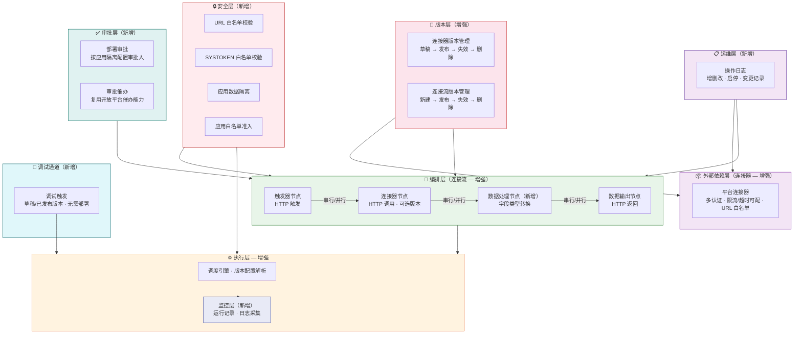

# 规范文档：连接器平台 V2 — 多版本与增强

**Feature ID**: CONN-PLAT-002  
**名称**: 连接器平台 V2 — 多版本与增强（Connector Platform V2 — Multi-Version & Enhancement）  
**状态**: draft  
**优先级**: P1  
**作者**: Summer  
**创建日期**: 2026-06-02  
**最后更新**: 2026-06-02  
**依赖**: CONN-PLAT-001（V1 MVP — 已建成并验证）  

---

## 1. 概述

### 1.1 问题陈述

V1（CONN-PLAT-001）已验证了**零代码编排**的核心价值。但随着使用深入，V1 的能力边界暴露出以下痛点：

- **无版本管理**：连接器和连接流编辑即生效，无法保留多版本配置，变更无追溯
- **配置能力不足**：认证方式单一，超时、限流不可配；编排仅支持串行，无并行分支和字段类型转换能力
- **安全防护薄弱**：缺少 URL 白名单和 SYSTOKEN 凭证白名单校验，连接器/连接流数据无应用级隔离，无应用白名单准入控制
- **部署审批缺失**：连接流部署无审批流程，关键变更缺少人工确认环节
- **运维不可见**：无运行记录监控，运行时缺乏版本配置解析和日志采集能力，变更操作无日志审计
- **调试效率低**：编排修改后必须发布、部署才能验证，迭代周期长
- **数据模型局限**：JSON Schema 参数传递和 HTTP 节点参数位置（header/query/body）支持不足

### 1.2 解决方案

V2 在 V1 基础上围绕**连接器增强、连接流增强、运行时增强、安全与准入、数据模型升级、调试体验、运维审计**七个方向升级：

- **连接器**：配置支持多版本管理（草稿→发布→失效→删除），认证类型扩展至数字签名，限流与超时等运行参数可配
- **连接流**：配置支持多版本管理，生命周期增强为部署→启动→停止，部署需经过审批并支持一键催办，流程编排支持限流、错误处理、超时控制及并行分支，节点间数据支持字段类型转换
- **运行时**：支持运行记录监控查看，运行时引擎升级以适配版本配置解析、日志采集等新特性
- **安全与准入**：连接器 URL 白名单校验，SYSTOKEN 凭证白名单校验，连接器/连接流数据按应用维度归属隔离，连接器平台能力按应用白名单逐步灰度开放
- **数据模型**：JSON Schema 增强，参数支持 input/output，HTTP 节点支持 header/query/body 参数位置
- **调试**：草稿版本和已发布版本均支持页面直接触发调用，无需部署
- **运维**：连接器、连接流的增删改、启停等变更操作支持记录操作日志

### 1.3 架构

V2 在 V1 三层架构（外部依赖层 → 编排层 → 执行层）基础上叠加七个增强层：

V2 架构核心变化：

| 层级 | V1 | V2 增强 |
|------|-----|--------|
| **版本层** | 单版本，运行时未校验 | 多版本管理（草稿→发布→失效→删除），运行时校验版本 |
| **外部依赖层** | 单一认证，超时/限流不可配 | 多认证（含数字签名），限流/超时可配，URL 白名单校验 |
| **编排层** | 纯串行，3 种节点（触发器/连接器/数据输出） | 新增数据处理节点（字段类型转换），4 种节点；编排支持串行/并行 |
| **执行层** | 调度执行 | 新增版本配置解析、运行记录监控、日志采集 |
| **安全层** | 无 | URL 白名单、SYSTOKEN 白名单、应用数据隔离、应用白名单准入 |
| **审批层** | 无 | 部署审批（按应用隔离审批人）、审批一键催办 |
| **调试通道** | 无 | 草稿版本和已发布版本页面直调，无需部署 |
| **运维层** | 无 | 连接器/连接流增删改、启停等操作日志记录 |

### 1.4 Goals

| # | 目标 |
|---|------|
| **G1** | **连接器：配置多版本** — 支持多个已发布版本并行共存，可按需切换查看任意历史版本。生命周期：草稿 → 发布 → 失效 → 删除 |
| **G2** | **连接器：配置增强** — 连接器级可配置限流策略、超时时间等运行参数 |
| **G3** | **连接器：认证类型增强** — 现有 SOA/APIG 基础上新增数字签名认证，凭证支持配置放置位置（Header/Query） |
| **G4** | **连接流：配置多版本** — 支持多个已发布版本并行共存，可按需切换查看任意历史版本。生命周期：新建 → 发布 → 失效 → 删除 |
| **G5** | **连接流：生命周期增强** — 部署 → 启动 → 停止，部署时选择已发布版本并提交审批 |
| **G6** | **连接流：部署审批** — 连接流部署需经过审批，审批通过后方可部署生效。审批人支持按应用维度隔离配置，由平台管理员设置。复用开放平台现有审批能力 |
| **G7** | **连接流：部署审批一键催办** — 连接流部署审批支持一键催办，复用开放平台现有审批催办能力，拓展至部署审批场景 |
| **G8** | **连接流：流程配置增强** — 编排运行时支持限流、错误处理、超时控制、串行/并行分支（仅并行，无条件和循环）；连接器节点可选引用版本；新增数据处理节点 |
| **G9** | **连接流：字段数据类型转换** — 数据处理节点支持字段级数据类型转换（string↔int、日期格式转换等）。字段映射/脚本/表达式 → NG |
| **G10** | **运行时：运行监控** — 连接流最近运行记录查看（触发时间、状态、耗时、触发方式） |
| **G11** | **运行时：运行时增强** — 运行时支持版本配置读取解析、日志采集记录、新增特性适配 |
| **G12** | **安全：连接器 URL 白名单校验** — 配置连接器时校验目标 URL 完全一致性（scheme+host+path），运行时校验实际请求地址 |
| **G13** | **安全：SYSTOKEN 白名单校验** — 连接流触发调用时对 SYSTOKEN 凭证进行白名单校验 |
| **G14** | **安全：数据按应用隔离** — 连接器、连接流数据按应用维度归属隔离，不同应用间资源互不可见 |
| **G15** | **安全：连接器平台应用白名单** — 平台管理员维护可开通连接器功能的应用白名单，白名单内应用才可使用连接器平台能力，支持逐步灰度 |
| **G16** | **数据模型：JSON Schema 增强** — 参数传递支持 input/output；HTTP 类型节点支持参数位置：header、query、body |
| **G17** | **调试：调试触发** — 连接流草稿版本和已发布版本均支持在页面直接触发调试调用，无需部署。失效版本不支持调试 |
| **G18** | **运维：操作日志** — 连接器、连接流的增删改、启停等变更操作支持记录操作日志 |

### 1.5 Non-Goals

| # | 非目标 | 原因 |
|---|--------|------|
| NG1 | AI 辅助编排 | V3 阶段 |
| NG2 | 连接器模板库 | 模板延后 |
| NG3 | 三方连接器开放发布 | V3 阶段 |
| NG4 | 连接器审批管控 | V2 无连接器审批流程 |
| NG5 | Scope 权限管控 | V2 仅做应用级隔离（G13），Scope 粒度权限待定 |
| NG6 | 连接器评分/评论系统 | V3 阶段 |
| NG7 | 开发者工具链（SDK/CLI/IDE 插件） | 后续版本 |
| NG8 | 社区市场/跨企业共享连接器 | 仅限企业内部 |
| NG9 | 计费/订阅系统 | 无需计费 |
| NG10 | 通用 iPaaS | 聚焦 XX 平台能力编排 |
| NG11 | 多集群/多云连接器运行时 | 企业内单一集群 |
| NG12 | 条件分支/循环/子流程编排 | V2 仅并行分支 |
| NG13 | 事件触发器 | V3 阶段 |
| NG14 | 定时触发器（Cron） | V3 阶段 |
| NG15 | 失败重试 | 延后评估 |
| NG16 | 字段映射/脚本/表达式等复杂数据处理 | V2 仅支持字段类型转换（G8） |

---

## 2. 用户故事

> 💡 V2 面向**平台管理员**单一角色，与 V1 一致。

| ID | 用户故事 | 优先级 | 验收标准 |
|----|---------|--------|---------|
| US-01 | 作为 **平台管理员**，我想要 **创建连接器并配置多认证方式**，以便 **适配不同外部系统的认证要求** | P1 | 创建连接器时可选择认证类型（API Key / OAuth2 / Basic Auth / Bearer Token / 自定义 Header）；每种认证类型有对应的凭证配置界面 |
| US-02 | 作为 **平台管理员**，我想要 **配置连接器的超时和限流策略**，以便 **控制调用行为保障系统稳定性** | P1 | 可配置连接超时、读取超时时间；可配置 QPS/并发数限流阈值；已配置策略在运行时生效 |
| US-03 | 作为 **平台管理员**，我想要 **管理连接器的多版本**，创建草稿、发布、查看历史、回滚，以便 **安全迭代且有变更追溯** | P1 | 编辑连接配置时创建草稿；发布生成 SemVer 版本号并快照；查看历史版本详情；一键回滚（创建草稿→再发布） |
| US-04 | 作为 **平台管理员**，我想要 **编排包含并行分支的连接流**，以便 **处理需要同时调用多个系统后汇总结果的场景** | P1 | 画布中可拖入并行分支节点，配置多条并行路径；汇聚合并节点等待所有分支完成；测试执行可验证并行效果 |
| US-05 | 作为 **平台管理员**，我想要 **管理连接流的多版本**，创建快照、查看历史、对比差异、回滚，以便 **安全迭代且有变更追溯** | P1 | 编排画布中保存版本快照；历史列表展示版本号和时间；支持版本差异对比；支持回滚 |
| US-06 | 作为 **平台管理员**，我想要 **查看连接流的执行历史和运行日志**，以便 **排查问题和分析执行效率** | P1 | 执行历史列表（触发时间/状态/耗时）；点击查看每步节点日志（输入/输出/错误）；支持按时间范围和状态过滤 |
| US-07 | 作为 **平台管理员**，我想要 **配置连接流的失败重试策略**，以便 **自动处理临时故障提高成功率** | P2 | 可配置最大重试次数、重试间隔、退避方式（固定/指数）；重试时保留上下文数据 |

---

## 3. 功能需求

### 3.1 多版本及生命周期增强（对应 G1）

#### 3.1.1 连接器生命周期与版本管理

| FR | 名称 | 描述 | 验收标准 |
|----|------|------|---------|
| FR-001 | 连接器创建 | 创建连接器基本信息并选择认证方式 | • 名称、图标、描述、分类、协议类型（HTTP） • 选择认证类型（API Key / OAuth2 Client Credentials / Basic Auth / Bearer Token / 自定义 Header / 无认证） • 创建后生成连接器，初始配置为草稿状态 |
| FR-002 | 连接器编辑 | 编辑连接器基本信息 | • 修改名称、图标、描述、分类 • 基本信息变更不影响已发布版本 |
| FR-003 | 连接器删除 | 删除连接器 | • 删除前校验：无连接流引用才允许删除 • 有引用时提示影响范围，禁止删除 • 删除后不可恢复 |
| FR-004 | 创建草稿版本 | 编辑连接配置时创建草稿 | • 编辑连接配置（认证凭证、协议地址、入参/出参 Schema、超时、限流）→ 创建草稿版本 • 草稿不影响已发布版本 • 保存覆盖当前草稿，可随时丢弃 |
| FR-005 | 发布版本 | 将草稿发布为正式版本 | • 发布时生成 SemVer 版本号 • 快照完整连接配置 • 记录发布说明 • 发布即生效——引用该连接器的连接流默认使用最新已发布版本 |
| FR-006 | 版本历史查看 | 查看连接器所有已发布版本 | • 版本列表：版本号、发布时间、发布说明 • 可查看任意历史版本完整配置快照 • 标注当前生效版本 |
| FR-007 | 版本回滚 | 将连接器配置回滚到历史版本 | • 选择目标历史版本 → "回滚" • 创建新草稿（复制历史版本配置） • 草稿需再次发布才生效 • 记录审计日志 |

#### 3.1.2 连接流生命周期与版本管理

| FR | 名称 | 描述 | 验收标准 |
|----|------|------|---------|
| FR-008 | 连接流创建 | 创建连接流基本信息 | • 沿用 V1：名称、描述，状态默认为已停止 |
| FR-009 | 连接流编辑基本信息 | 编辑连接流名称、描述 | • 沿用 V1 |
| FR-010 | 连接流删除 | 删除连接流 | • 沿用 V1：仅「已停止」状态可删除 |
| FR-011 | 连接流部署 | 编排配置保存即部署 | • 沿用 V1：保存后进入运行中状态 |
| FR-012 | 连接流启停 | 启动/停止连接流 | • 沿用 V1 |
| FR-013 | 连接流列表 | 查看连接流列表 | • 沿用 V1：名称、状态、最后运行时间；支持过滤和搜索 |
| FR-014 | 创建版本快照 | 将当前编排配置保存为快照 | • 编排画布中"保存版本"，快照完整编排配置（节点/映射/引用连接器版本号） • 记录快照说明 • 生成递增版本号 |
| FR-015 | 版本历史查看 | 查看连接流所有快照版本 | • 版本列表：版本号、创建时间、快照说明 • 标注当前运行版本 • 可查看任意历史版本编排详情 |
| FR-016 | 版本差异对比 | 对比任意两个版本的编排差异 | • 变更节点列表（新增/删除/修改） • 变更节点高亮标注 |
| FR-017 | 版本回滚 | 将连接流配置回滚到历史版本 | • 选择目标版本 → "回滚" • 当前编排替换为目标版本配置 • 记录审计日志 • 回滚后保持当前启停状态 |

### 3.2 连接配置增强（对应 G2）

#### 3.2.1 连接器多认证

| FR | 名称 | 描述 | 验收标准 |
|----|------|------|---------|
| FR-018 | 认证类型选择 | 创建/编辑连接器时选择认证方式 | • 支持类型：API Key（Header/Query）、OAuth2 Client Credentials、Basic Auth（用户名/密码）、Bearer Token、自定义 Header、无认证 • 选择后展示对应的凭证配置表单 |
| FR-019 | OAuth2 Client Credentials | 配置 OAuth2 客户端凭证模式 | • 配置项：Token URL、Client ID、Client Secret、Scope • 凭证加密存储 • 支持手动测试获取 Token |
| FR-020 | 认证凭证管理 | 查看和更新认证凭证 | • 凭证加密存储，界面脱敏显示 • 更新凭证 → 创建草稿 → 需发布才生效 |

#### 3.2.2 连接器超时与限流

| FR | 名称 | 描述 | 验收标准 |
|----|------|------|---------|
| FR-021 | 连接超时配置 | 配置连接器的连接和读取超时 | • 连接超时（默认 5s，范围 1-30s） • 读取超时（默认 30s，范围 1-300s） • 超时后标记节点执行失败 |
| FR-022 | 请求限流配置 | 配置连接器的请求限流策略 | • 可配置 QPS 上限（次/秒）或并发数上限 • 超出限流阈值时拒绝请求并记录 • 沿用 V1 平台级限流作为兜底 |
| FR-023 | 端点级覆盖 | 连接器的单个端点可覆盖全局超时/限流 | • 端点可在创建时指定独立的超时和限流值 • 未指定则继承连接器全局配置 |

#### 3.2.3 连接流串并行编排

| FR | 名称 | 描述 | 验收标准 |
|----|------|------|---------|
| FR-024 | 并行分支节点 | 在编排画布中添加并行分支 | • 画布中拖入"并行分支"节点 • 支持添加 ≥ 5 条并行分支 • 每条分支可独立编排（连接器节点/数据处理节点） |
| FR-025 | 汇聚合并节点 | 等待所有并行分支完成后合并结果 | • "汇聚合并"节点等待所有分支执行完成 • 合并策略：全部成功则继续 / 任一失败则标记失败 • 合并后数据可供下游节点引用 |
| FR-026 | 编排配置编辑 | 编辑连接流编排内容（增强） | • 沿用 V1 编排能力（流入口、连接器节点、数据处理节点、字段映射、流出口） • 新增：并行分支节点 + 汇聚合并节点 • 连接器节点可指定引用版本号 |
| FR-027 | 测试执行 | 手动触发连接流测试运行 | • 沿用 V1：手动触发、同步返回结果、每步执行详情 • 并行分支展示每条分支的执行结果 |

### 3.3 运行时与监控增强（对应 G3）

#### 3.3.1 执行历史

| FR | 名称 | 描述 | 验收标准 |
|----|------|------|---------|
| FR-028 | 执行历史列表 | 查看连接流的执行历史记录 | • 列表展示：触发时间、执行状态（执行中/成功/失败/超时）、总耗时、触发方式 • 支持按时间范围和状态过滤 • 分页加载 • HTTP 触发和测试执行均记录 |
| FR-029 | 执行详情 | 查看单次执行的完整信息 | • 触发数据（请求参数） • 各节点执行状态和耗时 • 最终返回值或错误信息 • 并行分支独立展示各分路执行情况 |
| FR-030 | 执行历史保留 | 执行历史数据保留策略 | • 默认保留 30 天 • 保留期内数据可查询 • 超期数据可配置自动清理 |

#### 3.3.2 运行日志

| FR | 名称 | 描述 | 验收标准 |
|----|------|------|---------|
| FR-031 | 节点运行日志 | 查看每步节点的输入/输出 | • 每个节点执行后记录：输入参数（脱敏）、输出结果、执行耗时 • 执行失败时记录错误堆栈 • 关联到执行实例 ID |
| FR-032 | 日志查询 | 按执行实例查询完整日志 | • 通过执行实例 ID 查询该次执行的所有节点日志 • 按时间顺序展示 • 日志查询响应 P99 < 1s |
| FR-033 | 日志级别控制 | 控制日志记录的详细程度 | • 默认记录：节点输入摘要 + 输出摘要 + 异常 • 可切换详细模式：记录完整输入/输出（含敏感字段脱敏标记） |

#### 3.3.3 失败重试

| FR | 名称 | 描述 | 验收标准 |
|----|------|------|---------|
| FR-034 | 重试策略配置 | 配置连接流节点级别的重试策略 | • 可配置项：最大重试次数（0-10）、重试间隔（秒）、退避方式（固定/指数） • 默认策略：不重试（最大次数=0） • 配置后对所有节点生效 |
| FR-035 | 重试执行 | 节点失败时按策略自动重试 | • 节点失败后按配置的策略重试 • 记录每次重试的时间戳和失败原因 • 全部重试失败后标记节点为失败 • 重试期间保持执行上下文不变 |
| FR-036 | 重试跳过 | 配置特定节点不参与重试 | • 可在节点属性中标记"跳过重试" • 标记后该节点失败直接终止，不重试 |

#### 3.3.4 HTTP 触发调度（沿用 V1）

| FR | 名称 | 描述 | 验收标准 |
|----|------|------|---------|
| FR-037 | HTTP 触发调度（同步） | 接收 HTTP 请求，同步执行连接流 | • 沿用 V1 FR-021 |
| FR-038 | 默认错误处理 | 节点执行失败时的默认处理 | • 沿用 V1 FR-023（无重试时的行为） |
| FR-039 | 默认限流处理 | 触发请求超限时返回 429 | • 沿用 V1 FR-024 |

### 3.4 连接器目录（辅助功能）

| FR | 名称 | 描述 | 验收标准 |
|----|------|------|---------|
| FR-040 | 连接器列表 | 展示平台所有连接器 | • 列表：名称、图标、分类、描述、最新版本号 • 支持分页 |
| FR-041 | 搜索与过滤 | 关键字搜索和分类过滤 | • 搜索：名称、描述、端点名 • 过滤：分类、协议类型 |
| FR-042 | 连接器详情 | 查看连接器完整信息 | • 基本信息 + 认证方式 + 端点 Schema + 版本历史入口 + 超时/限流配置摘要 |

---

## 4. 非功能需求

### 4.1 性能要求

| ID | 需求 | 目标值 |
|----|------|--------|
| NFR-001 | 连接器目录查询 | P99 < 200ms（沿用 V1） |
| NFR-002 | 连接器搜索响应 | P99 < 500ms |
| NFR-003 | 连接流列表查询 | P99 < 200ms（沿用 V1） |
| NFR-004 | HTTP 触发到执行开始延迟 | P99 < 2s（沿用 V1） |
| NFR-005 | 版本历史查询响应 | P99 < 300ms |
| NFR-006 | 版本快照创建响应 | P99 < 1s |
| NFR-007 | 执行历史查询响应 | P99 < 500ms |
| NFR-008 | 运行日志查询响应 | P99 < 1s |
| NFR-009 | 并行分支调度开销 | 单分支 ≤ 50ms |
| NFR-010 | 系统可用性 | ≥ 99.9%（沿用 V1） |
| NFR-011 | 单连接流并发执行 | ≥ 10 并发实例（沿用 V1） |

### 4.2 安全性要求

| ID | 需求 | 描述 |
|----|------|------|
| NFR-012 | 身份认证 | 沿用 V1：管理面企业内部认证；数据面 AKSK/OAuth |
| NFR-013 | 权限控制 | 沿用 V1：仅限平台管理员 |
| NFR-014 | 凭证安全 | 沿用 V1：加密存储，界面脱敏，HTTPS 传输 |
| NFR-015 | HTTP 触发安全 | 沿用 V1：不可预测路径、请求签名验证 |
| NFR-016 | 审计日志 | 沿用 V1：关键操作审计；新增：版本发布/回滚、重试配置变更 |
| NFR-017 | 数据持久化 | 沿用 V1 + 新增：版本快照、执行历史、运行日志持久化 |

### 4.3 兼容性要求

| ID | 需求 | 描述 |
|----|------|------|
| NFR-018 | V1 兼容 | V1 已创建的连接器和连接流可正常使用；单版本配置自动迁移为 V2 的第一个已发布版本 |
| NFR-019 | 能力开放平台兼容 | 与能力开放平台 MVP 兼容（沿用 V1） |
| NFR-020 | 浏览器兼容 | Chrome / Edge 最新 2 个大版本（沿用 V1） |

---

## 5. 技术设计

> 💡 V2 在 V1 基础上叠加增强。V1 组件（连接器 CRUD、编排引擎、运行时调度）保持不变。

### 5.1 V1→V2 核心变更

| 变更项 | V1 | V2 |
|--------|-----|-----|
| 版本模型 | 单版本（编辑即生效） | 多版本（草稿→发布→快照→回滚） |
| 认证方式 | 单一（自定义凭证） | 多认证（API Key / OAuth2 / Basic Auth / Bearer Token / 自定义 Header） |
| 超时限流 | 固定不可配 | 按连接器可配，端点级可覆盖 |
| 编排模式 | 纯串行（线性） | 串行 + 并行分支 + 汇聚合并 |
| 执行历史 | 无 | 完整记录（触发/状态/耗时/每步结果） |
| 运行日志 | 无 | 每步节点输入/输出日志 |
| 失败重试 | 无 | 可配置（次数/间隔/退避） |

### 5.2 新增核心组件

| 组件 | 职责 |
|------|------|
| 版本管理服务 | 连接器和连接流的草稿、发布、快照、回滚 |
| 认证适配器 | 多认证类型统一抽象（API Key / OAuth2 / Basic Auth / Bearer Token） |
| 并行执行引擎 | 并行分支的并发调度、汇聚合并、结果汇总 |
| 执行历史服务 | 执行记录的写入、查询、过期清理 |
| 日志采集服务 | 节点运行时输入/输出的采集、存储、查询 |
| 重试管理器 | 按策略调度重试、记录重试历史 |

### 5.3 接口模块

| 模块 | 主要接口 | 说明 |
|------|---------|------|
| 连接器版本 API | 草稿 CRUD、发布、版本历史、回滚 | V2 新增 |
| 连接器认证 API | 认证类型选择、凭证管理、OAuth2 Token 测试 | V2 新增 |
| 连接流版本 API | 快照、版本历史、差异对比、回滚 | V2 新增 |
| 编排 API（增强） | 新增并行分支/汇聚合并节点编排 | V2 增强 |
| 执行历史 API | 历史列表、执行详情 | V2 新增 |
| 运行日志 API | 按执行实例查询日志 | V2 新增 |
| 重试配置 API | 策略配置、节点跳过标记 | V2 新增 |

### 5.4 前端页面

| 页面 | 说明 |
|------|------|
| 连接器目录（增强） | 增加分类过滤和搜索 |
| 连接器创建/编辑（增强） | 多认证配置表单、超时/限流配置 |
| 连接器详情（增强） | 端点 Schema、版本历史入口、配置摘要 |
| 连接器版本历史页 | 版本列表、详情、回滚 |
| 编排画布（增强） | 并行分支节点、汇聚合并节点、连接器版本选择器 |
| 连接流版本历史页 | 版本列表、差异对比、回滚 |
| 执行历史页 | 历史列表、执行详情（含并行分支） |
| 运行日志页 | 按执行实例查询节点日志 |
| 重试策略配置页 | 次数/间隔/退避方式配置 |

### 5.5 依赖关系

| 依赖 | 用途 | 说明 |
|------|------|------|
| V1 编排引擎和运行时 | 串行节点调度执行 | 完全复用 |
| 并行执行引擎 | 并行分支的并发调度 | 自研或基于 Reactor 并发模型 |
| 数据库（MySQL） | 版本快照、执行历史、运行日志存储 | 复用现有 |
| 搜索引擎（可选） | 连接器搜索 | SQL LIKE vs ES（Plan 阶段 ADR） |
| OAuth2 客户端库 | OAuth2 Client Credentials 流程 | Spring Security OAuth2 或类似 |

---

## 6. 边界情况

| EC | 场景 | 处理方式 |
|----|------|---------|
| EC-001 | 连接器版本回滚后，引用旧版本的连接流行为 | 连接流引用版本号不变；不指定版本的连接流默认使用最新已发布版本 |
| EC-002 | 连接流回滚时，引用连接器版本已删除 | 回滚失败，提示"引用的连接器版本不可用" |
| EC-003 | 连接流执行中，被引用连接器认证凭证过期 | 执行失败，提示更新凭证 |
| EC-004 | 编排为空时创建快照 | 校验不通过，禁止创建 |
| EC-005 | HTTP 触发 URL 被非法调用 | 沿用 V1：签名失败 401 + 限流 |
| EC-006 | 连接流执行超时 | 沿用 V1：强制终止，标记超时 |
| EC-007 | 字段映射源字段不存在 | 沿用 V1：值为空/null，不中断 |
| EC-008 | 连接流执行中被停止 | 沿用 V1：当前实例继续完成，新触发不响应 |
| EC-009 | 同一连接器多个草稿 | 每连接器仅一个草稿，再次编辑覆盖 |
| EC-010 | 草稿配置为空时发布 | 校验不通过，禁止发布 |
| EC-011 | 并行分支中某条分支执行失败 | 汇聚节点收到失败后标记整体失败；其他分支继续完成但不影响结果 |
| EC-012 | 并行分支数量为 1 | 允许但提示建议使用串行模式 |
| EC-013 | 重试全部失败后 | 节点标记为失败，记录所有重试原因 |
| EC-014 | OAuth2 Token 刷新失败 | 节点执行失败，提示重新配置凭证 |
| EC-015 | 限流触发时重试 | 限流拒绝不计入重试次数，按限流策略处理 |
| EC-016 | 执行历史/日志数据量过大 | 30 天自动清理；列表分页；支持按时间范围筛选 |

---

## 7. 开放问题

| # | 问题 | 影响范围 | 建议决策时间 |
|---|------|---------|-------------|
| OQ-001 | 搜索技术选型：SQL LIKE vs Elasticsearch | 连接器搜索体验 | Plan 阶段 ADR |
| OQ-002 | 版本快照存储：完整存储 vs 增量存储 | 存储空间和查询性能 | Plan 阶段 |
| OQ-003 | V1 数据迁移方案：单版本如何迁移为多版本 | V1→V2 兼容性 | Plan 阶段 |
| OQ-004 | 版本号策略：连接器 SemVer + 连接流递增序号 vs 其他方案 | 版本标识体系 | Plan 阶段 |
| OQ-005 | 并行分支的执行线程模型：线程池 vs Reactor 并发 | 并行执行性能和资源 | Plan 阶段 ADR |
| OQ-006 | OAuth2 Token 管理：预刷新 vs 按需刷新 vs 定时刷新 | 认证可靠性和实现复杂度 | Plan 阶段 |
| OQ-007 | 执行历史和日志的存储方案：MySQL vs 独立日志存储（ES/Loki） | 查询性能和数据量 | Plan 阶段 ADR |

---

## 8. 成功标准

### 8.1 定性指标

| 维度 | 成功标准 | 对应目标 |
|------|---------|---------|
| 版本可追溯 | 管理员可查看任意连接器/连接流的完整变更历史并回滚 | G1 |
| 安全迭代 | 版本回滚操作简单可靠，误操作可快速恢复 | G1 |
| 认证灵活 | 连接器可适配企业内部常见的多种认证方式 | G2 |
| 编排增强 | 并行调用场景可在画布中可视化编排 | G2 |
| 运维可见 | 执行失败时可快速定位问题节点和原因 | G3 |
| 故障自愈 | 临时故障通过重试自动恢复，减少人工介入 | G3 |

### 8.2 定量指标

| 指标 | 目标值 | 对应目标 |
|------|--------|---------|
| 版本历史查询 P99 | < 300ms | G1 |
| 支持认证方式 | ≥ 5 种 | G2 |
| 并行分支数上限 | ≥ 5 条 | G2 |
| 执行历史查询 P99 | < 500ms | G3 |
| 日志查询 P99 | < 1s | G3 |
| 重试成功率（临时故障） | 提升 ≥ 30% vs 无重试 | G3 |
| V1 兼容性 | 100% 连接器/连接流可迁移 | — |

---

## 9. 风险与假设

### 9.1 关键假设

| 假设 | 风险等级 | 验证方式 |
|------|---------|---------|
| V1 数据模型可平滑扩展为多版本，无需重写核心引擎 | 中 | Plan 阶段设计迁移方案并验证 |
| 并行分支的线程/内存开销在可接受范围内 | 中 | 性能测试验证并发上限 |
| 执行历史和日志数据量可控（30 天保留） | 中 | 按当前规模估算存储量 |
| OAuth2 Token 刷新机制与现有系统兼容 | 低 | 技术预研测试 |

### 9.2 潜在风险

| 风险 | 影响 | 缓解措施 |
|------|------|---------|
| V1 数据模型与版本化不兼容，需大规模迁移 | 高 | Plan 阶段先做数据模型 Design Review |
| 并行执行引擎复杂度超预期 | 中 | MVP 先支持 ≤ 5 条分支，降低首版复杂度 |
| 执行历史+日志存储量增长导致 DB 压力 | 中 | 30 天清理策略；评估独立日志存储方案（OQ-007） |
| 多认证适配器实现覆盖不全 | 低 | 首版支持 5 种常用认证，通过适配器模式扩展 |

---

## 10. 版本规划

| 版本 | 范围 | 核心价值 |
|------|------|---------|
| **V1（MVP）** ✅ | 连接器管理（单版本）+ 连接流线性编排 + 测试执行 + 托管运行时 | 验证"零代码编排" |
| **V2（本规范）** | 多版本管理 + 多认证/超时/限流 + 串并行编排 + 执行历史/日志/重试 | 安全迭代 · 灵活配置 · 运维可见 |
| **V2.5 建议** | 条件分支 + 事件/定时触发器 + 模板库 | 编排能力补全 |
| **V3 展望** | AI 编排 + 三方开放发布 + 社区市场 + 多集群 | 生态与智能 |

> **V1→V2 迁移策略**：V1 连接器/连接流兼容运行，单版本配置自动迁移为 V2 首个已发布版本。V2 所有新增能力（多版本、多认证、并行、监控、重试）均为叠加增强，不影响已有功能。

---

## 附录

### A. 需求追溯

| 目标 | 对应 US | 对应 FR |
|------|---------|---------|
| G1 多版本及生命周期 | US-03, US-05 | FR-001 ~ FR-017 |
| G2 连接配置增强 | US-01, US-02, US-04 | FR-018 ~ FR-027 |
| G3 运行时与监控增强 | US-06, US-07 | FR-028 ~ FR-036 |
| — HTTP 触发（沿用 V1） | — | FR-037 ~ FR-039 |
| — 连接器目录（辅助） | — | FR-040 ~ FR-042 |

### B. V1→V2 变更摘要

| 变更项 | V1 | V2 |
|--------|-----|-----|
| 版本模型 | 单版本 | 多版本（草稿→发布→快照→回滚） |
| 认证方式 | 单一凭证 | API Key / OAuth2 / Basic Auth / Bearer Token / 自定义 Header |
| 超时限流 | 平台默认不可配 | 按连接器可配，端点级可覆盖 |
| 编排模式 | 纯串行 | 串行 + 并行分支 + 汇聚合并 |
| 执行历史 | 无 | 完整记录（30 天保留） |
| 运行日志 | 无 | 每步节点 I/O 日志 |
| 失败重试 | 无 | 可配置（次数/间隔/退避） |
| 角色 | 平台管理员 | 平台管理员（不变） |
| 连接器来源 | 平台管理员注册 | 平台管理员注册（不变） |
| 运行时 | HTTP 同步调度 | 完全复用 V1 |

### C. 参考资料

- V1 规范文档：`../specs-tree-connector-platform/spec.md`
- V1 技术计划：`../specs-tree-connector-platform/plan-code.md`
- V1 验证报告：`../specs-tree-connector-platform/validation-report.md`
- XX 平台能力开放平台规范：`../specs-tree-capability-open-platform/spec.md`
- 钉钉连接平台调研报告：`../../docs/software-connector-platform-research/钉钉连接平台调研报告.md`
- 飞书集成平台调研报告：`../../docs/software-connector-platform-research/飞书集成平台调研报告.md`

---

## 修订记录

| 版本 | 日期 | 修订内容 | 修订人 |
|------|------|---------|--------|
| v2.0-draft | 2026-06-02 | 初始版本：AI + 模板 + 三方发布 + 市场 | Summer |
| v2.1-draft | 2026-06-02 | 范围收窄：移除 AI/模板/三方发布/审批/评分，聚焦多版本+目录 | Summer |
| v2.2-draft | 2026-06-02 | 范围扩充：新增连接配置增强（多认证/超时/限流/串并行）和运行时监控增强（执行历史/运行日志/失败重试）；目录降为辅助功能 | Summer |

---

**规范状态**: 📝 初稿（draft）  
**下一步**: 运行 `@sddu-discovery connector-platform-v2` 进行需求挖掘 → `@sddu-spec` 细化规范 → `@sddu-plan` 开始技术规划
