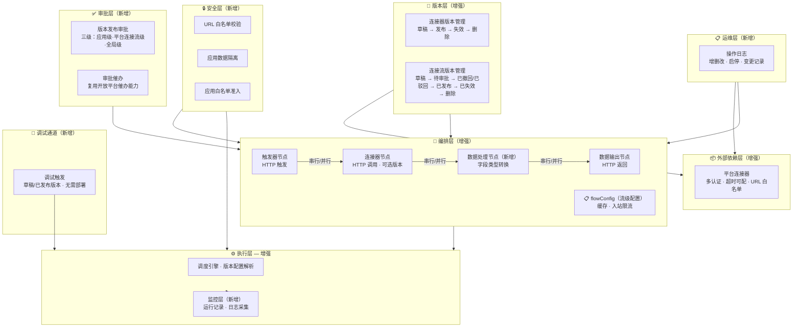
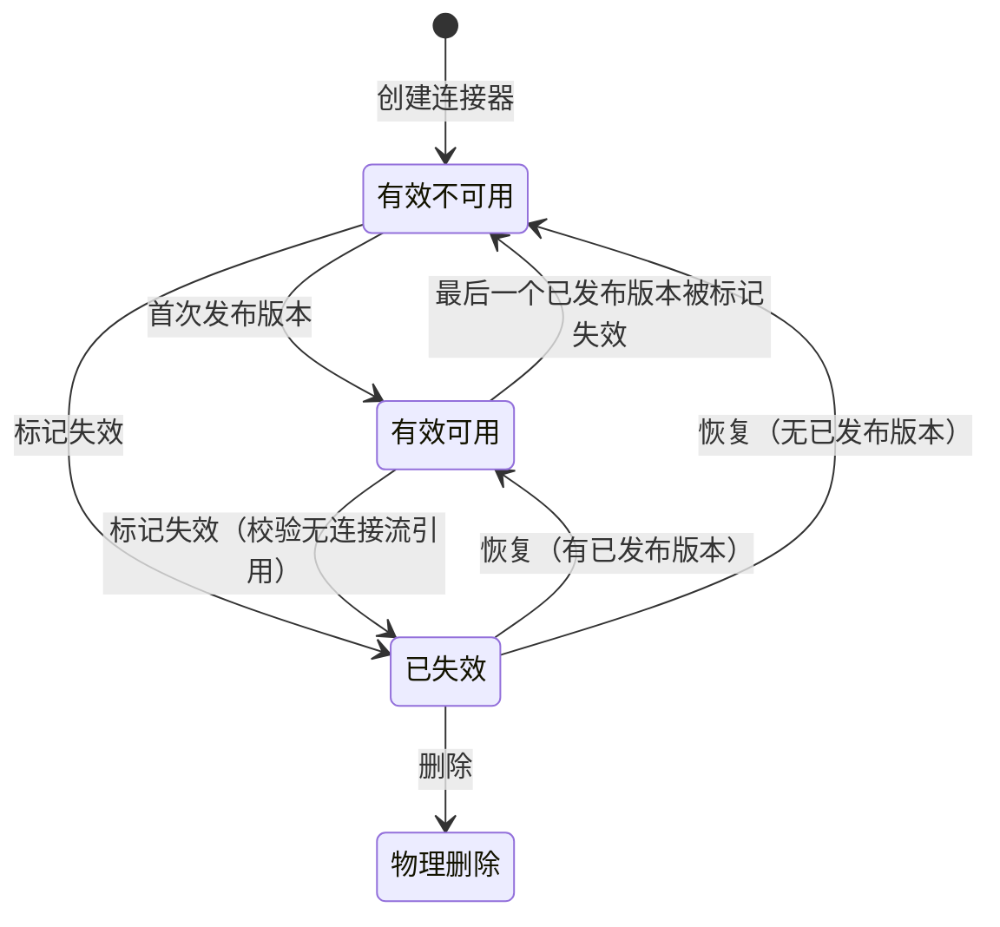
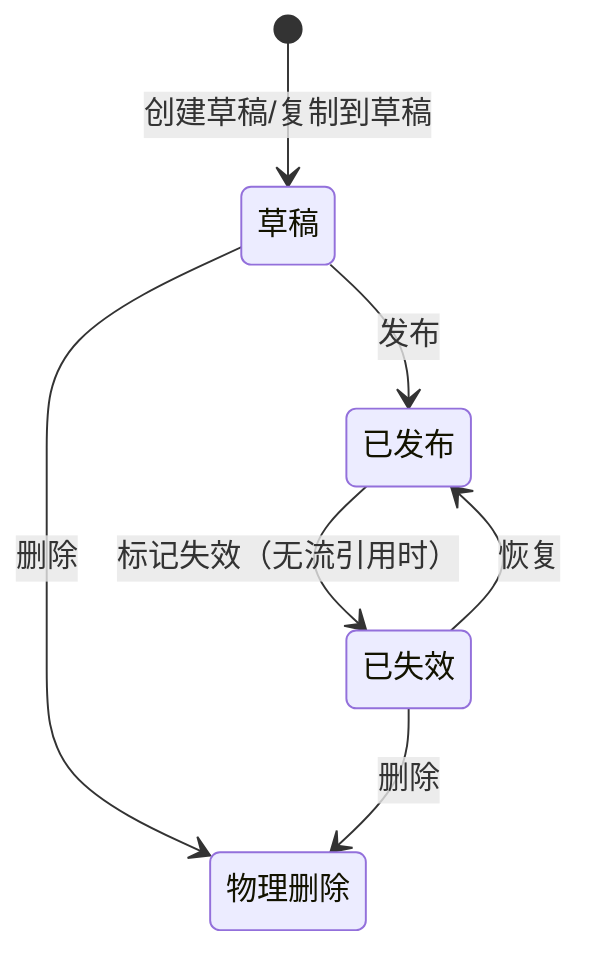
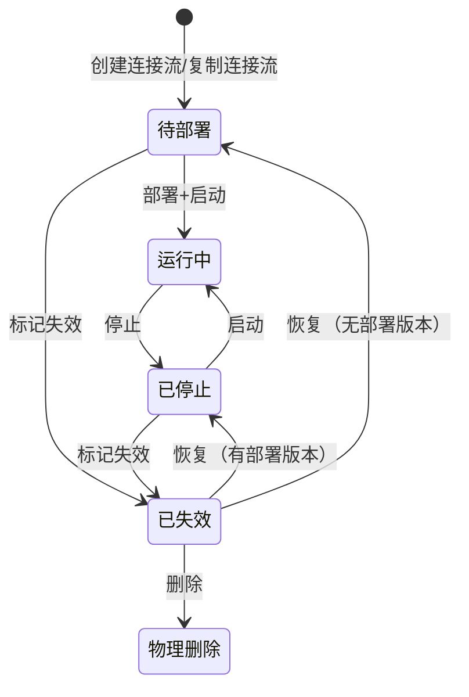
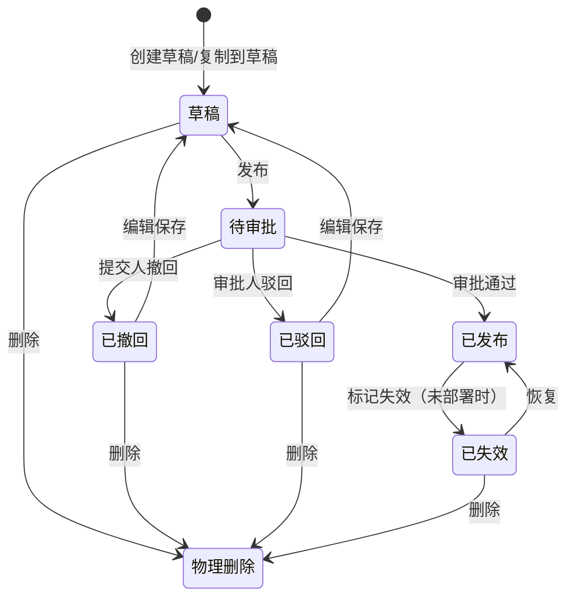
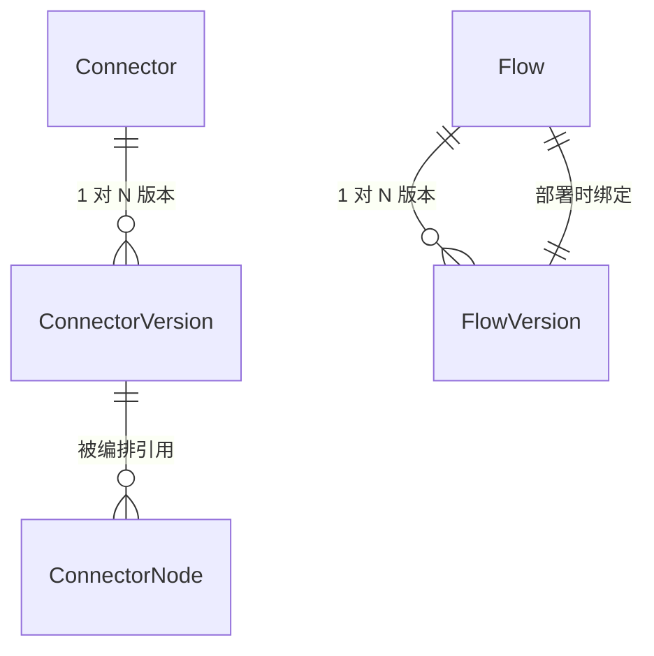
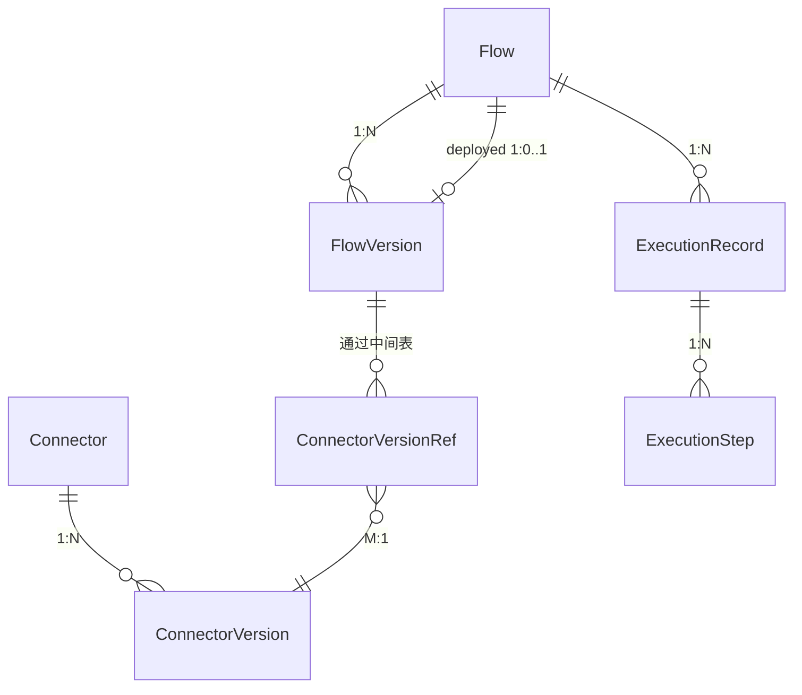
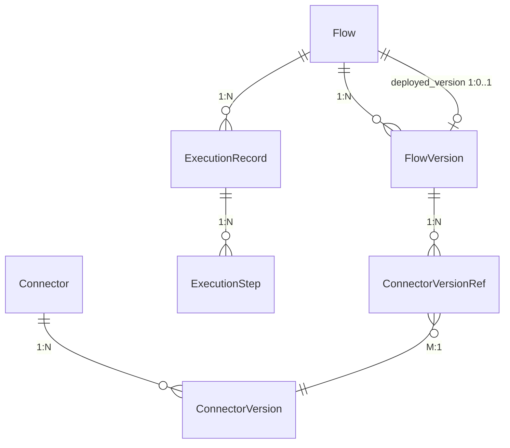

# 需求设计说明书：连接器平台 V2 — 多版本与增强

**Feature ID**: CONN-PLAT-002
**状态**: draft
**优先级**: P1
**作者**: Summer
**创建日期**: 2026-06-02
**最后更新**: 2026-06-16
**依赖**: CONN-PLAT-001（V1 MVP — 已建成并验证）

---

## 修订记录

| 版本 | 日期 | 修订内容 | 修订人 |
|------|------|---------|--------|
| v1.0 | 2026-06-16 | 合并 spec/plan/plan-db/plan-api/plan-json-schema/plan-cache 六份源文档为完整需求设计说明书 | SDDU |
| — | 2026-06-02 ~ 06-16 | spec.md 从 v2.0-draft 迭代至 v2.24-draft，28 次修订 | Summer |
| — | 2026-06-09 ~ 06-10 | plan.md v1.0 ~ v2.2，8 个 OQ 决策 + 4 个 ADR | SDDU Plan Agent |
| — | 2026-06-09 ~ 06-15 | plan-db.md v1.0 ~ v2.1，13 张表设计 | SDDU Plan Agent |
| — | 2026-06-09 ~ 06-12 | plan-api.md v1.0 ~ v6.0，56 个端点完整定义 | SDDU Plan Agent |
| — | 2026-05-22 ~ 06-15 | plan-json-schema.md v9.10，17 个共享组件 | SDDU Plan Agent |
| — | 2026-06-12 | plan-cache.md v4.0，完整缓存方案 | SDDU Plan Agent |

## 目录

- [1 需求价值和概述](#1-需求价值和概述)
- [2 上下文分析](#2-上下文分析)
- [3 初始需求分析](#3-初始需求分析)
- [4 需求影响分析](#4-需求影响分析)
- [5 系统用例分析](#5-系统用例分析)
- [6 功能设计](#6-功能设计)
- [7 系统级非功能设计](#7-系统级非功能设计)
- [8 checkList](#8-checklist)

## Keywords 关键字

SOA, APIG, SYSTOKEN, AKSK, Cookie, Signature, 连接器(Connector), 连接流(Flow), 版本管理(Version Management), 多版本(Multi-Version), 审批流程(Approval Workflow), 限流(Rate Limiting), 缓存(Caching), JSON Schema, 应用隔离(App Isolation), URL白名单(URL Whitelist), 调试(Debug), 操作日志(Operation Log), 零代码编排(Zero-Code Orchestration), DAG

## Abstract 摘要

**中文**：连接器平台 V2 在 V1 零代码编排验证基础上，围绕连接器增强、连接流增强、运行时增强、安全与准入、数据模型升级、调试体验、运维审计七个方向进行升级。核心引入多版本管理（草稿→发布→失效→删除）、三级审批流程、增强认证体系（数字签名/Cookie/多选组合）、入站限流/缓存/错误处理等流级配置、串并行编排、数据处理节点、URL白名单与应用白名单安全准入、调试通道和操作日志。目标是为企业级连接器平台提供安全迭代、灵活编排、运维可见的完整能力。

**English**: Connector Platform V2 builds upon V1's validated zero-code orchestration by upgrading in seven areas: connector enhancement, flow enhancement, runtime enhancement, security & access control, data model upgrade, debugging experience, and operational audit. Key introductions include multi-version management (draft→published→deprecated→deleted), three-level approval workflow, enhanced authentication (Digital Signature/Cookie/multi-select), flow-level configurations (rate limiting/caching/error handling), serial-parallel orchestration, data processor nodes, URL whitelist and app whitelist security controls, debug channels, and operation logging. The goal is to deliver a complete enterprise connector platform with safe iteration, flexible orchestration, and operational visibility.

## 缩略语清单

| 缩略语 | 英文全名 | 中文解释 |
|--------|----------|---------|
| SOA | Service-Oriented Architecture | 面向服务架构（认证方案） |
| APIG | API Gateway | API 网关认证 |
| SYSTOKEN | System Token | 系统凭证令牌 |
| AKSK | Access Key / Secret Key | 访问密钥对 |
| ADR | Architecture Decision Record | 架构决策记录 |
| DAG | Directed Acyclic Graph | 有向无环图（编排模型） |
| FIFO | First In First Out | 先进先出（记录清理策略） |
| QPS | Queries Per Second | 每秒请求数 |
| TPS | Transactions Per Second | 每秒事务数 |
| NFR | Non-Functional Requirement | 非功能需求 |
| FR | Functional Requirement | 功能需求 |
| EC | Edge Case | 边界情况 |
| MVP | Minimum Viable Product | 最小可行产品 |

---

## 1 需求价值和概述

### 1.1 问题陈述

V1（CONN-PLAT-001）已验证了**零代码编排**的核心价值。但随着使用深入，V1 的能力边界暴露出以下 7 大痛点：

- **无版本管理**：连接器和连接流编辑即生效，无法保留多版本配置，变更无追溯
- **配置能力不足**：认证方式单一，超时不可配；编排仅支持串行，无并行分支和字段类型转换能力
- **安全防护薄弱**：缺少 URL 白名单和 SYSTOKEN 凭证白名单校验，连接器/连接流数据无应用级隔离，无应用白名单准入控制
- **发布缺少审批**：连接流版本发布无审批流程，关键变更缺少人工确认环节
- **运维不可见**：无运行记录监控，运行时缺乏版本配置解析和日志采集能力，变更操作无日志审计
- **调试效率低**：编排修改后必须发布、部署才能验证，迭代周期长
- **数据模型局限**：JSON Schema 参数传递和 HTTP 节点参数位置（header/query/body）支持不足

### 1.2 解决方案

V2 在 V1 基础上围绕**连接器增强、连接流增强、运行时增强、安全与准入、数据模型升级、调试体验、运维审计**七个方向升级：

| # | 方向 | 说明 |
|---|------|------|
| 1 | 连接器增强 | 多版本管理（草稿→发布→失效→删除），认证类型扩展至数字签名、Cookie，支持多选组合 |
| 2 | 连接流增强 | 多版本管理，生命周期增强为部署→启动→停止，版本发布需三级审批并支持一键催办，流程编排支持入站限流、超时控制、缓存、错误处理（重试/忽略/终止）及并行分支，支持一键复制 |
| 3 | 运行时增强 | 运行记录监控查看，运行时版本配置解析、日志采集 |
| 4 | 安全与准入 | 连接器 URL 白名单校验，连接器/连接流数据按应用维度归属隔离，连接器平台能力按应用白名单逐步灰度开放 |
| 5 | 数据模型升级 | JSON Schema 增强，参数支持 input/output，HTTP 节点支持 header/query/body 参数位置；数据结构必须递归展开到基本类型 |
| 6 | 调试体验 | 草稿版本和已发布版本均支持页面直接触发调用，无需部署 |
| 7 | 运维审计 | 连接器、连接流的增删改、启停等变更操作支持记录操作日志 |

### 1.3 架构

V2 在 V1 三层架构（外部依赖层 → 编排层 → 执行层）基础上叠加七个增强层：



**V1 与 V2 架构对比**：

| 层级 | V1 | V2 增强 |
|------|-----|--------|
| **版本层** | 单版本，运行时未校验 | 多版本管理（草稿→发布→失效→删除），运行时校验版本 |
| **外部依赖层** | 单一认证，超时不可配 | 多认证（数字签名、Cookie），支持多选，超时可配，URL 白名单校验 |
| **编排层** | 纯串行，3 种节点（触发器/连接器/数据输出） | 新增数据处理节点（字段类型转换），4 种节点；编排支持串行/并行（并行处理节点上限 8 分支） |
| **数据模型层** | 基础 JSON Schema，无类型展开约束 | JSON Schema 增强：input/output 参数支持、header/query/body 参数位置；数据结构必须递归展开到基本类型，发布时硬校验 |
| **执行层** | 调度执行 | 新增版本配置解析、运行记录监控、日志采集 |
| **安全层** | 无 | URL 白名单、应用数据隔离、应用白名单准入 |
| **审批层** | 无 | 版本发布审批（三级：应用级+平台连接流级+全局级）、审批一键催办 |
| **调试通道** | 无 | 草稿版本和已发布版本页面直调，无需部署 |
| **运维层** | 无 | 连接器/连接流增删改、启停等操作日志记录 |

### 1.4 Goals

| # | 目标 | 说明 |
|---|------|------|
| **G1** | 连接器：配置多版本 | 支持多个已发布版本并行共存，可按需切换查看任意历史版本。生命周期：草稿 → 发布 → 失效 → 删除 |
| **G3** | 连接器：认证类型增强 | 现有 SOA/APIG 基础上新增数字签名认证、Cookie 认证，支持认证多选组合，凭证支持配置放置位置（Header/Query） |
| **G4** | 连接流：配置多版本 | 支持多个已发布版本并行共存，可按需切换查看任意历史版本。生命周期：草稿 → 发布 → 失效 → 删除 |
| **G5** | 连接流：生命周期增强 | 部署 → 启动 → 停止，生命周状态：待部署 → 运行中 → 已停止 |
| **G6** | 连接流：版本发布审批 | 连接流版本发布需经过三级审批：应用级版本发布审批人、平台级连接流统一审批人、全局审批人，全部通过后版本生效 |
| **G7** | 连接流：版本发布审批一键催办 | 复用开放平台现有审批催办能力，拓展至版本发布审批场景 |
| **G8** | 连接流：流程配置增强 | 编排支持触发器节点 SYSTOKEN 凭证白名单、连接器节点超时可配、连接流自身触发限流、错误处理（重试/忽略/终止策略）、串行/并行分支；连接器节点可选引用版本；新增数据处理节点 |
| **G9** | 连接流：字段数据类型转换 | 数据处理节点支持字段级数据类型转换（string↔int、日期格式转换等）。本期仅支持函数处理类型 |
| **G18** | 连接流：一键复制 | 连接流列表支持一键复制，复制后生成独立连接流实体（含完整版本历史），名称自动追加 `_copy_xxxxx` 随机后缀 |
| **G10** | 运行时：运行监控 | 连接流最近运行记录查看（触发时间、状态、耗时、触发方式） |
| **G11** | 运行时：运行时增强 | 运行时支持版本配置读取解析、日志采集记录、新增特性适配 |
| **G12** | 安全：连接器 URL 白名单校验 | 配置连接器时设置正则规则作为 URL 白名单，运行时按规则校验实际请求地址 |
| **G13** | 安全：数据按应用隔离 | 连接器、连接流数据按应用维度归属隔离，不同应用间资源互不可见 |
| **G14** | 安全：连接器平台应用白名单 | 平台管理员维护可开通连接器功能的应用白名单，白名单内应用才可使用连接器平台能力，支持逐步灰度 |
| **G15** | 数据模型：JSON Schema 增强 | 参数传递支持 input/output；HTTP 类型节点支持参数位置：header、query、body；全平台数据结构必须严格递归展开到基本数据类型 |
| **G16** | 调试：调试触发 | 连接流草稿版本和已发布版本均支持在页面直接触发调试调用，无需部署 |
| **G17** | 运维：操作日志 | 连接器、连接流的增删改、启停等变更操作支持记录操作日志 |

### 1.5 Non-Goals

| # | 非目标 | 原因 |
|---|--------|------|
| NG1 | AI 辅助编排 | V3 阶段 |
| NG2 | 连接器模板库 | 模板延后 |
| NG3 | 三方连接器开放发布 | V3 阶段 |
| NG4 | 连接器审批管控 | V2 无连接器审批流程 |
| NG5 | Scope 权限管控 | V2 仅做应用级隔离（G13），Scope 粒度权限待定 |
| NG6 | 连接器评分/评论系统 | V3 阶段 |
| NG7 | 开发者工具链（SDK/CLI/IDE 插件） | 后续版本 |
| NG8 | 社区市场/跨企业共享连接器 | 仅限企业内部 |
| NG9 | 计费/订阅系统 | 无需计费 |
| NG10 | 通用 iPaaS | 聚焦 XX 平台能力编排 |
| NG11 | 多集群/多云连接器运行时 | 企业内单一集群 |
| NG12 | 条件分支/循环/子流程编排 | V2 仅并行分支 |
| NG13 | 事件触发器 | V3 阶段 |
| NG14 | 定时触发器（Cron） | V3 阶段 |
| NG15 | 失败重试 | 延后评估 |
| NG16 | 脚本/表达式/其他函数处理类型等 | V2 仅支持字段类型转换系列函数（G9） |
| NG17 | 连接器级出站限流策略可配 | V2 移入，延后评估 |

### 1.6 关键设计决策

| 维度 | 关键设计 | 保护对象 | 配置对象 | 归属 |
|------|---------|---------|---------|:--:|
| **超时** | 属于连接流，非连接器。超时是调用方诉求，不同流对同一连接器可设不同超时值。平台管理员可按应用设置最大超时上限（平台统一默认 5s） | 调用方（连接流）不长时间阻塞 | 应用管理员编排连接流时按节点配置，运行时取 min(节点值, 应用最大超时值) | G8 |
| **入站限流** | 属于连接流。限制连接流被触发的频率，防止自身过载。平台管理员可按应用设置最大限流上限（平台统一默认 QPS=1000、并发=1000） | 连接流自身 | 应用管理员在连接流编排时配置，运行时取 min(流配置值, 应用最大限流值) | G8 |
| **缓存** | 属于连接流。通过缓存子图结果减少重复调用。TTL 上限默认 15 天 | 后端系统 + 调用效率 | 应用管理员在连接流运行时配置中设定 | G8 |
| **错误处理** | 属于连接流。每流最多 1 个，仅作用于连接器节点。三种策略：重试（1~5 次，间隔 1~300s）、忽略、终止执行 | 调用方（连接流） | 应用管理员编排连接流时配置 | G8 |
| **并行分支** | 属于连接流。并行处理节点内分支上限 8，防止资源过度拆分 | 连接流自身 | 应用管理员编排连接流时在并行处理节点中配置分支数 | G8 |
| **日志采集开关** | 属于平台 + 应用。控制是否写入节点级运行日志。平台管理员设置平台统一默认值（默认开启），可按应用覆盖 | 后端存储 | 平台管理员在应用级配置中设定；应用管理员在自己的应用内可操作开启/关闭 | G11 |
| **引用稽核** | 被引用方的校验通过查询引用方确定，不把引用关系固化到被引用方的状态或字段中。FlowVersion「已部署」不设独立状态；ConnectorVersion 的编排引用通过 `connector_version_ref` 中间表显式管理（M:N） | — | 引用关系存于引用方或中间表 | — |

### 1.7 核心业务对象生命周期

V2 有四个核心业务对象承载状态流转，是功能需求的基础约束。

| 对象 | 状态数 | 状态列表 | 审批 | 多版本并存 |
|------|:---:|------|:---:|:---:|
| 连接器 (Connector) | 4 | 有效可用 → 有效不可用 → 已失效 → 物理删除 | ❌ | — |
| 连接器版本 (ConnectorVersion) | 4 | 草稿 → 已发布 → 已失效 → 物理删除 | ❌ | ✅ |
| 连接流 (Flow) | 5 | 待部署 → 运行中 ⇄ 已停止 → 已失效 → 物理删除 | ❌ | — |
| 连接流版本 (FlowVersion) | 7 | 草稿 → 待审批 → 已撤回 / 已驳回 → 已发布 → 已失效 → 物理删除 | ✅ 三级 | ✅ |

#### 1.7.1 连接器生命周期



| 可执行的操作 | 有效可用 | 有效不可用 | 已失效 |
|------|:---:|:---:|:---:|
| 查看基本信息 | ✅ | ✅ | ✅ |
| 编辑基本信息 | ✅ | ✅ | ❌ |
| 读版本 | ✅ | ✅ | ✅ |
| 写版本 | ✅ | ✅ | ❌ |
| 标记失效 | ✅（无流引用） | ✅（无流引用） | — |
| 恢复 | — | — | ✅ |
| 删除 | ❌ | ❌ | ✅ |

#### 1.7.2 连接器版本生命周期



| 可执行的操作 | 草稿 | 已发布 | 已失效 |
|------|:---:|:---:|:---:|
| 查看 | ✅ | ✅ | ✅ |
| 编辑保存 | ✅ | ❌ | ❌ |
| 发布 | ✅（非空配置） | — | — |
| 创建草稿 | — | ✅ | ✅ |
| 复制到草稿 | ❌ | ✅（未达1000上限） | ✅（未达1000上限） |
| 标记失效 | — | ✅（无流引用） | — |
| 恢复 | — | — | ✅ |
| 删除 | ✅ | ❌ | ✅ |

#### 1.7.3 连接流生命周期



| 可执行的操作 | 待部署 | 运行中 | 已停止 | 已失效 |
|------|:---:|:---:|:---:|:---:|
| 查看 | ✅ | ✅ | ✅ | ✅ |
| 读版本 | ✅ | ✅ | ✅ | ✅ |
| 写版本 | ✅ | ✅ | ✅ | ❌ |
| 查看运行记录 | ✅ | ✅ | ✅ | ✅ |
| 部署+启动 | ✅ | ✅（替换） | ✅（启动） | — |
| 停止 | — | ✅ | — | — |
| 启动 | — | — | ✅（部署版本仍已发布） | — |
| 标记失效 | ✅ | ❌ | ✅ | — |
| 恢复 | — | — | — | ✅ |
| 删除 | ❌ | ❌ | ❌ | ✅ |

#### 1.7.4 连接流版本生命周期



| 可执行的操作 | 草稿 | 待审批 | 已撤回 | 已驳回 | 已发布 | 已失效 |
|------|:---:|:---:|:---:|:---:|:---:|:---:|
| 查看 | ✅ | ✅ | ✅ | ✅ | ✅ | ✅ |
| 编辑保存 | ✅ | ❌ | ✅（到草稿） | ✅（到草稿） | ❌ | ❌ |
| 发布 | ✅（非空编排） | — | — | — | — | — |
| 撤回 | — | ✅ | — | — | — | — |
| 驳回 | — | ✅ | — | — | — | — |
| 审批通过 | — | ✅ | — | — | — | — |
| 创建草稿 | — | — | — | — | ✅ | ✅ |
| 复制到草稿 | ❌ | ❌ | ❌ | ❌ | ✅ | ✅ |
| 标记失效 | — | — | — | — | ✅（未被运行中的流部署） | — |
| 恢复 | — | — | — | — | — | ✅ |
| 删除 | ✅ | ❌ | ✅ | ✅ | ❌ | ✅ |

#### 1.7.5 四对象关系与约束总结



| 约束 | 涉及对象 | 说明 |
|------|---------|------|
| 删除连接器需检验无引用 | Connector → Flow | 运行中流引用某连接器的任意版本，则该连接器不可删除 |
| 失效版本需检验无流引用 | ConnectorVersion → Flow | 任何流引用该版本即禁止失效 |
| 失效流版本需检验未部署 | FlowVersion → Flow | 已部署到运行中/已停止流的版本禁止失效 |
| 删除流需已失效 | Flow | 仅已失效状态可删除 |
| 复制仅限同应用 | Flow → Application | 跨应用不可复制 |

---

## 2 上下文分析

### 2.1 V1 痛点与 V2 动机

V1（CONN-PLAT-001）已验证了零代码编排的核心价值，但作为内部验证 MVP，其能力边界在 7 个维度上暴露出不足：无版本管理、配置能力不足、安全防护薄弱、发布缺少审批、运维不可见、调试效率低、数据模型局限（详见 §1.1）。

> V1 为内部验证 MVP，无真实用户使用。V2 不提供 V1 兼容，所有模块（数据库、接口、业务逻辑、前端）均按最新设计全新实施，无需考虑 V1 数据迁移或双轨代码路径。

### 2.2 技术栈

| 层 | 技术 | 版本 |
|----|------|------|
| **前端** | React + Ant Design 4 + Vite + Less | React 18.2, antd 4.24.16, Vite 5 |
| **画布** | @xyflow/react (React Flow) | v12.10.1 |
| **后端管理面** | Spring Boot (open-server) + MyBatis | 3.4.6 |
| **后端运行时** | Spring Boot (connector-api) + WebFlux + R2DBC | 3.5.14 |
| **数据库** | MySQL | 5.7 |
| **缓存** | Redis (Lettuce) | — |
| **构建** | Maven | — |
| **语言** | Java 21 + JavaScript/JSX | — |

### 2.3 V1→V2 核心变更

| 变更项 | V1 | V2 |
|--------|-----|-----|
| 版本模型 | 单版本（编辑即生效） | 多版本（草稿→发布→失效→删除），最多 1000 个 |
| 认证方式 | SOA、APIG | 新增数字签名、Cookie，支持多选组合 |
| 编排模式 | 纯串行 | 串行 + 并行（边级并行 + 并行处理节点，分支上限 8） |
| 节点类型 | 触发器、连接器、数据输出 | 新增数据处理节点（字段类型转换）、错误处理节点（重试/忽略/终止） |
| 限流 | 平台默认不可配 | 连接流级入站限流（Redis 令牌桶） |
| 审批 | 无 | 版本发布三级审批 + 一键催办 |
| 安全 | 无 | URL 正则白名单、SYSTOKEN 白名单、应用白名单 |
| 运行监控 | 无 | 运行记录查看 + 节点日志采集 |
| 调试 | 必须部署后才能验证 | 草稿/已发布版本直接调试 |
| 数据模型 | 无强制类型展开 | object/array 必须递归展开到基本类型（FR-047） |
| 审计 | 无 | 变更操作日志（复用现有 OperateLog） |
| 数据隔离 | 无 | 按 app_id 应用维度归属隔离 |

---

## 3 初始需求分析

### 3.1 初始需求场景分析

V2 面向两类角色：**平台管理员**负责平台级安全与审批配置；**应用管理员**负责自有应用下连接器和连接流的日常管理。

#### 3.1.1 平台管理员

| 所属场景 | 场景名称 | 场景简要说明 | 涉及角色 |
|------|-------|----------|-------|
| 安全配置 | 配置 URL 正则白名单 | 平台管理员为连接器配置正则规则白名单，限制允许调用的目标地址范围 | 平台管理员 |
| 准入控制 | 维护应用白名单 | 平台管理员维护可开通连接器功能的应用白名单，支持逐步灰度 | 平台管理员 |
| 审批配置 | 配置三级审批人 | 平台管理员配置连接流版本发布三级审批人（应用级/平台连接流级/全局级） | 平台管理员 |
| 系统配置 | 配置应用级系统参数 | 平台管理员按应用配置节点超时上限、入站限流上限、运行记录条数上限和日志采集开关 | 平台管理员 |

#### 3.1.2 应用管理员

| 所属场景 | 场景名称 | 场景简要说明 | 涉及角色 |
|------|-------|----------|-------|
| 连接器管理 | 创建和管理连接器 | 创建连接器实体，管理连接器配置的多版本（草稿→发布→失效→删除） | 应用管理员 |
| 认证配置 | 配置连接器认证方式 | 选择连接器认证方式（SOA/APIG/数字签名/Cookie），支持多选组合，配置凭证放置位置 | 应用管理员 |
| 连接流管理 | 创建和管理连接流 | 创建连接流实体，管理配置的多版本，发布版本需审批并支持催办，执行部署→启动→停止 | 应用管理员 |
| 审批操作 | 提交审批与催办 | 提交连接流版本发布审批，支持一键催办 | 应用管理员 |
| 编排设计 | 编排连接流 | 配置节点超时、流级限流、SYSTOKEN 白名单、缓存、错误处理节点、串行/并行，选择连接器引用版本，新增数据处理节点 | 应用管理员 |
| 数据处理 | 配置字段类型转换 | 在数据处理节点中配置字段数据类型转换（string↔int、日期格式等） | 应用管理员 |
| 运行监控 | 查看运行记录 | 查看连接流运行记录（触发时间、状态、耗时、触发方式）和节点详细日志 | 应用管理员 |
| 调试 | 调试触发 | 在草稿版本和已发布版本上直接触发调试调用，无需部署 | 应用管理员 |
| 运维审计 | 查看操作日志 | 查看连接器、连接流的操作日志（增删改、启停等变更记录） | 应用管理员 |
| 连接流复制 | 一键复制连接流 | 在连接流列表一键复制连接流，得到独立连接流实体 | 应用管理员 |

### 3.2 结构化IR

| IR属性 | 具体信息 |
|--------|---------|
| **IR标识** | CONN-PLAT-002 |
| **名称** | 连接器平台 V2 — 多版本与增强 |
| **描述** | 在 V1 零代码编排验证基础上，升级为支持多版本管理、增强认证、审批流程、运行监控、安全准入、调试和运维审计的企业级连接器平台 |
| **优先级** | P1 |
| **需求描述（why）** | V1 已验证零代码编排价值，但因缺少版本管理、审批、安全等能力无法用于生产环境，需升级以满足企业级要求 |
| **what** | ①连接器增强（多版本+多认证+URL白名单）②连接流增强（多版本+审批+生命周期+流级配置+并行+数据处理+复制）③运行时增强（监控+版本解析+日志）④安全（URL白名单+应用隔离+白名单准入）⑤数据模型升级（FR-047类型严格化）⑥调试通道⑦操作日志 |
| **who** | 开发团队：open-server后端、connector-api运行时、wecodesite前端；测试团队：功能/性能/安全测试；平台管理员+应用管理员 |
| **对架构要素的影响** | 架构：新增版本层/审批层/安全层/调试通道/运维层；安全：URL白名单+应用隔离+应用白名单；高可靠：审批流程+缓存降级+限流保护；性能：Redis缓存+限流+运行记录FIFO清理 |

---

## 4 需求影响分析

### 4.1 特性影响分析

**【新增】**：
- 版本管理：连接器版本（FR-005~011）+ 连接流版本（FR-024~030）
- 认证增强：数字签名认证、Cookie 认证、认证多选、凭证位置配置（FR-012~014）
- 审批流程：连接流版本发布三级审批 + 一键催办（FR-031~033）
- 运行监控：运行记录查看（FR-042）+ 日志采集（FR-044）
- URL 白名单：连接器 URL 正则白名单配置与运行时校验（FR-015）
- 应用白名单：连接器平台应用白名单准入控制（FR-045）
- 操作日志：连接器/连接流变更操作日志记录（FR-046）
- 调试通道：草稿/已发布版本直接调试触发（FR-041）
- 数据处理节点：字段类型转换（FR-040）
- 错误处理节点：重试/忽略/终止策略（FR-039a）
- 并行处理节点：结构化并行组，2~8 分支（FR-038a）
- 连接流复制：一键复制连接流（FR-017）
- 数据模型严格化：FR-047 类型约束

**【修改】**：
- 连接器 CRUD：新增 app_id 归属、status 4 状态流转、恢复能力（FR-001~004）
- 连接流 CRUD：新增 app_id 归属、deployed_version_id 指针、5 状态流转、恢复能力（FR-016~023）
- 编排引擎：从纯串行升级为串行+并行，新增版本配置解析，支持 flowConfig（限流/缓存）
- 审批引擎：拓展 connector_flow_version_publish 场景，审批人配置增加应用隔离

**【删除】**：
- V1 单版本模型：连接器/连接流的 1:1 版本关系
- V1 test-run：由 V2 调试触发（FR-041）替代
- V1 的 `GET/PUT /config` 接口：由版本化接口替代

---

## 5 系统用例分析

### 5.1 用例清单

| 角色名称 | UseCase名称 | UseCase简要说明 | 是否需要细化分析 |
|-------|----------|--------------|-------------|
| 平台管理员 | US-01 配置 URL 白名单 | 配置连接器 URL 正则白名单规则 | 否 |
| 平台管理员 | US-02 维护应用白名单 | 维护连接器平台应用白名单，支持灰度 | 否 |
| 平台管理员 | US-03 配置三级审批人 | 配置连接流版本发布三级审批人 | 否 |
| 平台管理员 | US-03a 配置应用级系统参数 | 按应用配置超时上限/限流上限/运行记录上限/日志开关 | 否 |
| 应用管理员 | US-04 管理连接器版本 | 创建和管理连接器，管理配置多版本 | 否 |
| 应用管理员 | US-05 配置认证方式 | 选择认证方式，支持多选组合 | 否 |
| 应用管理员 | US-06 管理连接流生命周期 | 创建和管理连接流，管理多版本，执行部署/启动/停止 | 否 |
| 应用管理员 | US-07 提交审批与催办 | 提交连接流版本发布审批，支持一键催办 | 是 |
| 应用管理员 | US-08 编排连接流 | 配置节点超时/限流/缓存/错误处理/串并行/版本选择/数据处理 | 是 |
| 应用管理员 | US-09 配置字段类型转换 | 在数据处理节点中配置字段类型转换 | 否 |
| 应用管理员 | US-10 查看运行记录 | 查看连接流运行记录和节点日志 | 否 |
| 应用管理员 | US-11 调试触发 | 在草稿/已发布版本上直接调试 | 是 |
| 应用管理员 | US-12 查看操作日志 | 查看连接器/连接流变更操作日志 | 否 |
| 应用管理员 | US-13 一键复制连接流 | 在连接流列表一键复制连接流 | 否 |

### 5.2 用例分析

#### 5.2.1 用例：版本发布审批（US-07）

**【简要说明】**：应用管理员提交连接流版本发布审批，经过三级审批（应用级→平台连接流级→全局级）全部通过后版本生效，支持一键催办。

**【Actor】**：应用管理员（提交人/催办人）、审批人（应用级/平台连接流级/全局级）

**【前置条件】**：连接流存在草稿版本；编排配置非空；三级审批人已配置

**【最小保证】**：提交失败时版本保持草稿状态，给出明确错误提示

**【成功保证】**：三级审批全部通过后，版本状态变为"已发布"，可被部署

**【主成功场景】**：
1. 应用管理员在草稿版本页点击「提交审批」
2. 系统执行发布时全部校验（业务必填 + 平台要求限制）
3. 校验通过后版本状态变为「待审批」，系统向应用级审批人发起审批
4. 应用级审批人审批通过 → 平台连接流级审批人审批通过 → 全局审批人审批通过
5. 三级全部通过后版本状态变为「已发布」

**【扩展场景】**：
- 任意一级驳回：版本状态变为「已驳回」，提交人可修改草稿后重新提交
- 提交人撤回：版本状态变为「已撤回」，可编辑后重新提交
- 审批超时未处理：版本保持「待审批」状态，可催办
- 一键催办：向当前审批节点的审批人发送通知

**【DFX属性】**：审批流程可靠性（审批引擎复用）；审批人配置隔离（按应用维度）

#### 5.2.2 用例：连接流编排（US-08）

**【简要说明】**：应用管理员在编排画布中设计连接流，配置节点超时、流级限流、缓存、错误处理、串行/并行、连接器版本选择、数据处理节点。

**【Actor】**：应用管理员

**【前置条件】**：连接器存在已发布版本；连接流存在草稿版本

**【最小保证】**：草稿保存不做平台要求限制校验，仅做数据库存储级别约束

**【成功保证】**：发布时全部校验通过，版本进入待审批状态

**【主成功场景】**：
1. 应用管理员打开连接流草稿版本的编排画布
2. 拖入触发器节点、连接器节点（选择已发布版本）、数据处理节点、数据输出节点
3. 配置节点间连线（串行/并行模式）
4. 配置 flowConfig：入站限流（QPS/并发数）、缓存（键表达式+TTL）
5. 配置错误处理节点：选择策略（重试/忽略/终止）和错误类型
6. 保存草稿（不做严格校验）
7. 提交发布（触发全部校验）

**【扩展场景】**：
- 发布时校验失败：拒绝提交，提示具体错误

**【DFX属性】**：编排画布响应性能；并行分支执行性能

#### 5.2.3 用例：调试触发（US-11）

**【简要说明】**：应用管理员在草稿版本或已发布版本上直接触发调试调用，同步返回执行结果，无需部署。

**【Actor】**：应用管理员

**【前置条件】**：版本为草稿或已发布状态（已失效版本不支持调试）；连接器引用版本存在

**【最小保证】**：调试失败时返回明确错误信息，不影响正常运行指标

**【成功保证】**：同步返回各节点执行状态、输入输出数据、耗时

**【主成功场景】**：
1. 应用管理员进入版本详情页，点击「调试」按钮
2. 在调试面板输入模拟触发数据（JSON 格式）
3. 点击「执行」，系统直接指定版本 ID 执行（不依赖 deployed_version_id）
4. 同步返回完整执行结果（各节点状态、I/O 数据、耗时）

**【扩展场景】**：
- 引用版本已失效：调试失败，提示引用版本不可用
- 执行超时（独立 30s 超时）

**【DFX属性】**：调试独立线程池（max 5），独立超时（30s），不计入正常运行指标

#### 5.2.4 影响的功能列表和需求分解

| 功能编号 | 功能名称 | 功能规格描述 | 类型 | 需求标号 | 需求名称 |
|-------|------|----------|---|-------|-------|
| F-01 | 连接器多版本管理 | 支持创建/编辑/发布/失效/恢复/删除版本，版本查看 | 新增 | G1 | 连接器配置多版本 |
| F-02 | 连接器认证增强 | 支持数字签名/Cookie/多选组合/凭证位置 | 新增 | G3 | 连接器认证类型增强 |
| F-03 | 连接流多版本管理 | 支持创建/编辑/发布/失效/恢复/删除版本，版本查看 | 新增 | G4 | 连接流配置多版本 |
| F-04 | 连接流生命周期 | 部署→启动→停止，5 状态流转 | 修改 | G5 | 连接流生命周期增强 |
| F-05 | 版本发布审批 | 三级审批流程 + 一键催办 | 新增 | G6/G7 | 审批与催办 |
| F-06 | 流级配置 | 超时/限流/缓存/错误处理/并行 | 新增 | G8 | 流级配置增强 |
| F-07 | 数据处理节点 | 字段类型转换（toString/toNumber/toBoolean/formatDate） | 新增 | G9 | 字段类型转换 |
| F-08 | 连接流复制 | 一键复制独立连接流实体 | 新增 | G18 | 一键复制 |
| F-09 | 运行记录 | 运行记录列表/详情/节点日志 | 新增 | G10 | 运行监控 |
| F-10 | 运行时增强 | 版本配置解析 + 日志采集 | 修改 | G11 | 运行时增强 |
| F-11 | URL白名单 | 正则白名单配置 + 运行时校验 | 新增 | G12 | URL白名单 |
| F-12 | 应用白名单 | 应用准入控制 | 新增 | G14 | 应用白名单 |
| F-13 | 调试触发 | 草稿/已发布版本直调 | 新增 | G16 | 调试触发 |
| F-14 | 操作日志 | 变更操作审计 | 新增 | G17 | 操作日志 |
| F-15 | 数据模型严格化 | FR-047类型约束 | 修改 | G15 | JSON Schema增强 |

---

## 6 功能设计

### 6.1 业界方案实现

V2 的 8 个关键开放问题（OQ-001~008）在规划阶段全部决策完成，以下为方案对比与选择。

**OQ-001 版本快照存储**：

| 方案 | 描述 | 决策 |
|------|------|:--:|
| A: 完整快照 | 每个版本存储完整 JSON 配置 | ✅ **选用**（ADR-004） |
| B: 增量存储 | 仅存储与上一版本的 diff | ❌ 读取需重建，回滚慢 |
| C: 混合存储 | 每 N 版完整快照 + 中间 diff | ❌ 实现复杂度最高 |

**OQ-002 版本号策略**：

| 方案 | 描述 | 决策 |
|------|------|:--:|
| A: 实体内递增 | 每 Connector/Flow 独立从 1 递增 | ✅ **选用**（ADR-004） |
| B: 全局递增 | 全平台统一递增 | ❌ 跨实体不可比 |
| C: SemVer | 语义化版本 | ❌ V2 无需兼容性表达 |

**OQ-003 入站限流**：

| 方案 | 描述 | 决策 |
|------|------|:--:|
| A: Redis 令牌桶 + Lua | 原子令牌桶，已有 Redis 基础设施 | ✅ **选用**（ADR-005） |
| B: 内存 Guava | 进程内存限流 | ❌ 多实例不共享 |
| C: Sentinel | 引入新组件 | ❌ 功能远超需求 |

**OQ-007 运行记录存储**：

| 方案 | 描述 | 决策 |
|------|------|:--:|
| A: MySQL + 定时清理 | 启用 V1 预留表 + 30 天清理 | ✅ **选用**（ADR-006） |
| B: Elasticsearch | 独立日志存储 | ❌ 引入新组件 |
| C: MySQL + 对象存储 | 热冷分层 | ❌ V2 日志量可控 |

**OQ-005 审批集成**：审批引擎 — 拓展新场景（透传场景标识 + 关联 FlowVersion ID），不改造核心逻辑；三级审批人配置 — 改造 open-server 侧增加应用隔离 + 拓展连接流版本发布审批场景配置项。

**OQ-006 缓存一致性**：版本变更主动清空 + TTL 兜底。

**OQ-008 连接流复制版本历史**：完整复制所有版本（所有状态）。

**OQ-004 限流配置取值**：使用已部署版本的 flowConfig。

| # | OQ | 决策 | ADR |
|:--:|-----|------|:--:|
| 1 | 版本快照存储 | 完整 JSON 快照 | ADR-004 |
| 2 | 版本号策略 | 实体内递增整数 | ADR-004 |
| 3 | 入站限流 | Redis 令牌桶 + Lua | ADR-005 |
| 4 | 限流配置取值 | 已部署版本的 flowConfig | — |
| 5 | 审批集成 | 审批引擎拓展场景 + 审批人配置改造应用隔离 | — |
| 6 | 缓存一致性 | 主动清空 + TTL | — |
| 7 | 运行记录存储 | MySQL + 30 天清理 | ADR-006 |
| 8 | 复制版本历史 | 完整复制 | — |
| — | 引用稽核 | 中间表 + deployed_version_id 指针 | ADR-007 |

### 6.2 功能实现整体设计方案

#### 6.2.1 整体方案

V2 在 V1 三层架构基础上叠加增强层，核心技术路线：
- 版本管理：完整 JSON 快照 + 实体内递增版本号
- 审批集成：复用开放平台审批引擎，拓展业务场景
- 限流：Redis 令牌桶 + Lua 原子操作
- 缓存：Redis 全流缓存 + 版本变更主动清理
- 运行记录：MySQL 主存储 + 30 天定时清理 + FIFO 1000 条上限
- 安全：市场服务 Lookup/Property 复用 + 应用级数据隔离

系统架构 mermaid 图见 §1.3，此处不再重复。

#### 6.2.2 架构设计

**模块划分**：

| 模块 | 服务 | 职责 | V2 变更 |
|------|------|------|:--:|
| 连接器管理 | open-server | CRUD + 版本管理 + URL 白名单 | 🆕 版本/白名单 |
| 连接流管理 | open-server | CRUD + 版本管理 + 生命周期 + 复制 + 运行记录查询 | 🆕 版本/部署/复制/草稿手动创建 |
| 审批集成 | open-server | 审批引擎（拓展场景） + 审批人配置（改造应用隔离） | 🆕 拓展+改造 |
| 安全准入 | open-server | 应用白名单 + URL白名单 + 准入拦截 | 🆕 全新 |
| 操作日志 | open-server | OperateEnum 扩展 + EntitySnapshotLoader 扩展 | 🔧 扩展 |
| 运行时引擎 | connector-api | 版本解析 + 并行执行 + 限流 + 缓存 + 日志 + 调试 + 错误处理执行 | 🆕 多模块 |
| 认证注入 | connector-api | Cookie/DigitalSign/MultiAuth 注入器 | 🆕 扩展 |
| 错误处理 | connector-api | 重试/忽略/终止策略执行 | 🆕 新增 |
| 前端 | wecodesite | 版本历史/审批/调试/运行记录/白名单页面 | 🆕 14 新页面 |

**服务职责**：

| 服务 | 端口 | 职责 | 接口数 |
|------|:---:|------|:--:|
| open-server | 18080 | 管理面：连接器/连接流 CRUD、版本管理、审批、安全、操作日志 | 49 |
| connector-api | 18180 | 运行时：HTTP 触发、调试执行、运行记录写入、健康检查 | 2 |
| api-server | 18081 | API 认证鉴权（V2 无变更） | — |
| event-server | 18083 | 事件/回调网关（V2 无变更） | — |

**目录结构**：

```
open-app/
├── open-server/src/main/java/.../v2/modules/
│   ├── connector/        # [MODIFY] 多版本 + 认证增强 + URL白名单
│   ├── flow/             # [MODIFY] 多版本 + 生命周期 + 复制 + flowConfig
│   ├── approval/         # [MODIFY] businessType 模板扩展
│   ├── security/         # [NEW] 应用白名单 + 准入拦截
│   └── auditlog/         # [MODIFY] OperateEnum 扩展
│
├── connector-api/src/main/java/.../v2/modules/
│   ├── runtime/          # [MODIFY] 并行执行 + flowConfig 解析 + 版本解析
│   ├── errorhandler/     # [NEW] 错误处理执行器（重试/忽略/终止）
│   ├── ratelimit/        # [NEW] 入站限流（Redis 令牌桶）
│   ├── cache/            # [NEW] 连接流缓存管理
│   ├── execution/        # [NEW] 运行记录 + 日志采集 + 定时清理
│   ├── debug/            # [NEW] 调试执行器
│   ├── auth/credential/  # [NEW] Cookie/DigitalSign/MultiAuth 注入器
│   └── security/         # [NEW] URL白名单校验
│
└── wecodesite/src/pages/ConnectPlatform/
    ├── Connector/        # [MODIFY] 版本历史 + 认证增强 + URL白名单面板
    ├── Flow/             # [MODIFY] 生命周期管理 + 复制 + 运行记录
    ├── FlowEditor/       # [MODIFY] 并行边 + 版本选择 + flowConfig + 调试面板
    ├── FlowVersion/      # [NEW] 版本历史 + 审批面板
    └── ExecutionRecord/  # [NEW] 运行记录列表 + 详情
```

### 6.3 功能实现

#### 6.3.1 实现思路

**数据流核心变更**：

```
V1: 编辑即生效 → 运行时直接读当前版本配置 → 执行

V2: 草稿 ──发布(审批)──▶ 已发布 ──部署──▶ deployed_version_id
                                               │
                          HTTP触发 ──▶ 运行时按指针读版本快照 ──▶ 执行
                                               │
                         调试触发 ──▶ 直接指定版本ID执行（不依赖deployed_version_id）
```

**核心业务对象关系 ER 图**：



**核心设计原则**：
- 草稿保存时不执行平台要求限制校验，仅做数据库存储级别约束校验
- 发布时统一执行全部校验（业务必填 + 平台要求限制）
- 版本为完整 JSON 快照，无增量存储
- 引用稽核通过中间表 + deployed_version_id 指针实现

#### 6.3.2 实现设计

V2 共 47 条功能需求（FR-001~FR-047），按子分类组织如下。

##### 连接器实体（FR-001~004）

| FR | 名称 | 描述 |
|----|------|------|
| **FR-001** | 创建连接器 | 创建时不自动生成草稿版本，仅创建连接器实体，进入「有效不可用」状态。创建时不校验业务必填字段 |
| **FR-002** | 恢复连接器 | 已失效的连接器可恢复，恢复后状态由是否存在已发布版本决定 |
| **FR-003** | 失效连接器 | 有效可用或有效不可用的连接器可标记为已失效，失效前校验无连接流引用 |
| **FR-004** | 删除连接器 | 仅已失效状态可删除，删除前二次确认，不可恢复 |

##### 连接器版本（FR-005~011）

| FR | 名称 | 描述 |
|----|------|------|
| **FR-005** | 编辑草稿 | 草稿版本配置可修改，保存后覆盖当前草稿，保存时不校验平台要求 |
| **FR-005a** | 创建草稿版本 | 连接器支持手动创建空草稿版本，版本号递增；已有草稿时提示 |
| **FR-006** | 复制到草稿 | 在已发布版本上复制到草稿，以快照为内容生成新草稿；若已有草稿则覆盖 |
| **FR-007** | 发布版本 | 草稿发布为正式版本，发布时统一执行全部校验；多已发布版本并行共存 |
| **FR-008** | 版本查看 | 查看已发布版本列表，可切换查看任意历史版本配置详情 |
| **FR-009** | 版本失效 | 已发布版本可标记失效；有连接流引用时禁止失效 |
| **FR-010** | 版本删除 | 草稿和已失效版本可删除；已发布需先标记失效 |
| **FR-011** | 恢复版本 | 已失效的连接器版本可恢复至已发布状态 |

##### 连接器配置（FR-012~015）

| FR | 名称 | 描述 |
|----|------|------|
| **FR-012** | 认证类型 | 新增数字签名认证、Cookie 认证，凭证加密存储 |
| **FR-013** | 凭证位置 | 数字签名凭证支持配置放置位置（Header、Query） |
| **FR-014** | 认证多选 | 同一连接器支持同时选择多种认证方式，运行时按次序附加 |
| **FR-015** | URL 正则白名单 | 平台管理员为连接器配置正则规则白名单，发布时校验正则合法性，运行态校验 |

##### 连接流实体（FR-016~023）

| FR | 名称 | 描述 |
|----|------|------|
| **FR-016** | 创建连接流 | 创建时不自动生成草稿版本，进入「待部署」状态。创建时不校验业务必填 |
| **FR-017** | 一键复制 | 连接流列表一键复制，生成独立实体（含完整版本历史），名称追加随机后缀 |
| **FR-018** | 部署 | 选择已发布版本部署并启动，状态变为「运行中」 |
| **FR-019** | 启动 | 已停止的连接流可启动，恢复运行 |
| **FR-020** | 停止 | 运行中的连接流可停止，当前执行中的实例继续完成 |
| **FR-021** | 恢复连接流 | 已失效的连接流可恢复至「已停止」状态 |
| **FR-022** | 失效连接流 | 待部署或已停止的连接流可标记失效 |
| **FR-023** | 删除连接流 | 仅已失效状态可删除 |

##### 连接流版本（FR-024~030）

| FR | 名称 | 描述 |
|----|------|------|
| **FR-024** | 编辑草稿 | 草稿版本编排可修改，保存时不校验平台要求 |
| **FR-024a** | 创建草稿版本 | 连接流支持手动创建空草稿版本 |
| **FR-025** | 复制到草稿 | 在已发布版本上复制到草稿，校验当前无待审批/已驳回/已撤回版本 |
| **FR-026** | 发布版本 | 草稿提交发布，发布时统一执行全部校验（含FR-047类型约束）；校验通过进入待审批 |
| **FR-027** | 版本查看 | 查看已发布版本列表，切换查看 |
| **FR-028** | 版本失效 | 已发布版本可标记失效；已部署的版本禁止失效 |
| **FR-029** | 版本删除 | 草稿/已撤回/已驳回/已失效版本可删除 |
| **FR-030** | 恢复版本 | 已失效的连接流版本可恢复至已发布状态 |

##### 版本发布审批（FR-031~033）

| FR | 名称 | 描述 |
|----|------|------|
| **FR-031** | 提交审批 | 草稿版本发布时提交审批，走三级审批流程 |
| **FR-032** | 审批人配置 | 平台管理员配置三级审批人（应用级/平台连接流级/全局级），按应用隔离 |
| **FR-033** | 一键催办 | 处于待审批状态的版本，提交人可一键催办，向当前审批节点审批人发送通知 |

##### 连接流编排·流级配置（FR-034~039a）

| FR | 名称 | 描述 |
|----|------|------|
| **FR-034** | 节点超时 | 连接器节点可配置超时时间，系统有应用级可配置的最大超时上限（平台统一默认 5s），运行时取 min(节点值, 应用最大超时值) |
| **FR-035** | 入站限流 | 连接流自身触发限流（QPS/并发数），平台统一默认 QPS=1000/并发=1000，可按应用覆盖，运行时取 min |
| **FR-036** | SYSTOKEN 白名单 | 触发器节点选择 SYSTOKEN 认证类型后，配置允许触发当前连接流的凭证白名单 |
| **FR-037** | 缓存配置 | 在 flowConfig 中配置缓存键（引用触发器输入参数）和缓存时长（TTL 1~1296000 秒） |
| **FR-038** | 串行/并行 | 节点间边支持并行连接模式，同一节点多条出边可并发执行 |
| **FR-038a** | 并行处理节点 | 结构化并行组节点，支持 2~8 个并行分支 |
| **FR-039** | 连接器版本选择 | 编排时连接器节点可选择引用连接器的已发布版本 |
| **FR-039a** | 错误处理节点 | 连接流级错误处理，每流最多 1 个，仅作用于连接器节点。三种策略：重试（1~5 次，间隔 1~300s）、忽略、终止执行 |

##### 数据处理节点（FR-040）

| FR | 名称 | 描述 |
|----|------|------|
| **FR-040** | 数据处理节点 | 定义输出字段结构（字段名+类型+值来源），值来源支持静态值/引用字段/函数输出三种，本期支持 toString/toNumber/toBoolean/formatDate |

##### 调试触发（FR-041）

| FR | 名称 | 描述 |
|----|------|------|
| **FR-041** | 调试触发 | 草稿版本和已发布版本支持页面直接触发调试调用，同步返回执行结果，已失效版本不支持调试 |

##### 运行记录（FR-042~044）

| FR | 名称 | 描述 |
|----|------|------|
| **FR-042** | 运行记录查看 | 查看连接流运行记录（触发时间、状态、耗时、触发方式），每流最大 1000 条 FIFO，30 天定时清理 |
| **FR-043** | 版本配置解析 | 运行时按引用版本号读取对应版本的配置，构建执行 DAG |
| **FR-044** | 日志采集 | 运行时采集节点输入/输出日志，关联执行实例；日志采集开关按应用可配 |

##### 安全准入（FR-045）

| FR | 名称 | 描述 |
|----|------|------|
| **FR-045** | 应用白名单管理 | 平台管理员维护可开通连接器功能的应用白名单，支持逐步灰度，非白名单应用拒绝操作 |

##### 操作日志（FR-046）

| FR | 名称 | 描述 |
|----|------|------|
| **FR-046** | 操作日志 | 连接器、连接流增删改、启停等变更操作记录日志，复用应用现有操作日志模块 |

##### 数据模型严格化（FR-047）

| FR | 名称 | 描述 |
|----|------|------|
| **FR-047** | 数据结构定义与引用类型约束 | 全平台所有数据结构必须递归展开到基本数据类型（string/number/boolean），object 和 array 不允许作为未展开的叶子类型；映射赋值时禁止 object/array 整体引用，引用路径终点必须为基本类型且源目标类型一致；数组 items 最多引用一个 array 源；草稿保存不校验，发布时统一校验 |

#### 6.3.3 功能可靠性分析

| 风险 | 等级 | 缓解措施 |
|------|:---:|---------|
| 1:N 版本模型迁移兼容 | 🔴 高 | 幂等迁移脚本；V1 数据标记为 v1「已发布」；灰度验证 |
| 审批集成复杂度 | 🟡 中 | 审批引擎仅拓展场景；提前对齐接口 |
| 并行分支执行复杂度 | 🟡 中 | Reactor `Flux.merge()`；每分支独立超时+错误不扩散 |
| 版本快照数据量增长 | 🟡 中 | 1000 版本硬上限；物理删除真删除；>800 时告警 |
| 设计态校验放宽后存量配置兼容风险 | 🟢 低 | 保存时不校验，仅温和提示；发布时统一校验 |
| FR-047 数据模型严格化 | 🟡 中 | 新增配置强制校验；存量标记警告 |
| 缓存与版本切换一致性 | 🟢 低 | 版本变更主动清空 + TTL 兜底 |
| 调试执行影响正常运行 | 🟢 低 | 独立线程池（max 5）；独立超时（30s）；不计入正常指标 |
| market-server 依赖可用性 | 🟡 中 | 白名单功能降级策略 |
| 错误处理策略重构 | 🟡 中 | 单元测试覆盖三种策略+错误类型组合 |
| FIFO 记录清理失败 | 🟢 低 | 定时删除失败不影响正常写入，告警兜底 |
| 日志开关状态迁移一致性 | 🟢 低 | 开关操作记录操作日志，历史日志保留不变 |

#### 6.3.4 功能安全分析

- **连接器 URL 白名单校验（G12）**：配置正则规则白名单，运行时按规则校验实际请求地址，发布时校验正则合法性
- **数据按应用隔离（G13）**：连接器/连接流数据按 app_id 归属隔离，不同应用资源互不可见
- **应用白名单准入（G14）**：平台管理员维护白名单，非白名单应用拒绝操作，支持逐步灰度
- **凭证安全（NFR-013）**：加密存储，界面脱敏，HTTPS 传输
- **HTTP 触发安全（NFR-014）**：不可预测路径、请求签名验证、SYSTOKEN 白名单校验
- **平台配置缓存安全**：实体缓存 7 天 + 随机抖动 TTL；缓存穿透防护（空值标记）；缓存击穿防护（互斥锁）；热点 Key 防护（Caffeine L1）

#### 6.3.5 架构元素影响列表

| 类别 | 新增 | 修改 |
|------|:--:|:--:|
| open-server 后端 | ~15 | ~15 |
| connector-api 运行时 | ~15 | ~8 |
| 前端 wecodesite | ~14 | ~15 |
| 数据库 | 4 张新表 + 8 张 ALTER | 详见 plan-db.md |
| ADR | 4 | — |

#### 6.3.6 结构图元素实现列表

##### 6.3.6.1 接口设计

**设计规范**：
- 基础路径：`/service/open/v2` (open-server 管理面) / `/api/v1` (connector-api 执行面)
- 字段命名：camelCase（如 `connectorId`, `versionStatus`, `nameCn`）
- BIGINT 雪花 ID 统一返回 string 类型（避免 JS 精度丢失）
- 枚举字段统一返回 TINYINT 数字，与数据库存储一致
- 响应格式统一：`{ code, messageZh, messageEn, data, page }`
- 时间格式：`yyyy-MM-dd HH:mm:ss`
- URL 路径使用中划线（kebab-case），如 `/connector-versions`

**接口清单总表（56 个端点）**：

| # | 方法 | 路径 | 接口名称 | V2 变更 |
|---|------|------|---------|:---:|
| — | — | **open-server — 连接器 CRUD** | — | — |
| 1 | POST | `/connectors` | 创建连接器 | 改造 |
| 2 | GET | `/connectors` | 查询连接器列表 | 改造 |
| 3 | GET | `/connectors/{connectorId}` | 查询连接器详情 | 改造 |
| 4 | PUT | `/connectors/{connectorId}` | 更新连接器 | 改造 |
| 5 | PUT | `/connectors/{connectorId}/invalidate` | 失效连接器 | 新增 |
| 6 | PUT | `/connectors/{connectorId}/recover` | 恢复连接器 | 新增 |
| 7 | DELETE | `/connectors/{connectorId}` | 删除连接器 | 改造 |
| — | — | **open-server — 连接器版本** | — | — |
| 8 | POST | `/connectors/{connectorId}/versions` | 创建连接器草稿版本 | 新增 |
| 9 | GET | `/connectors/{connectorId}/versions` | 查询连接器版本列表 | 新增 |
| 10 | GET | `/connectors/{connectorId}/versions/{versionId}` | 查询连接器版本详情 | 新增 |
| 11 | PUT | `/connectors/{connectorId}/versions/{versionId}` | 更新连接器版本 | 新增 |
| 12 | PUT | `/connectors/{connectorId}/versions/{versionId}/publish` | 发布连接器版本 | 新增 |
| 13 | POST | `/connectors/{connectorId}/versions/{versionId}/copy-to-draft` | 复制连接器版本到草稿 | 新增 |
| 14 | PUT | `/connectors/{connectorId}/versions/{versionId}/invalidate` | 失效连接器版本 | 新增 |
| 15 | PUT | `/connectors/{connectorId}/versions/{versionId}/recover` | 恢复连接器版本 | 新增 |
| 16 | DELETE | `/connectors/{connectorId}/versions/{versionId}` | 删除连接器版本 | 新增 |
| — | — | **open-server — 连接流 CRUD** | — | — |
| 17 | POST | `/flows` | 创建连接流 | 改造 |
| 18 | GET | `/flows` | 查询连接流列表 | 改造 |
| 19 | GET | `/flows/{flowId}` | 查询连接流详情 | 改造 |
| 20 | PUT | `/flows/{flowId}` | 更新连接流 | 改造 |
| 21 | POST | `/flows/{flowId}/copy` | 复制连接流 | 新增 |
| 22 | POST | `/flows/{flowId}/deploy` | 部署连接流 | 新增 |
| 23 | POST | `/flows/{flowId}/start` | 启动连接流 | 改造 |
| 24 | POST | `/flows/{flowId}/stop` | 停止连接流 | 改造 |
| 25 | PUT | `/flows/{flowId}/invalidate` | 失效连接流 | 新增 |
| 26 | PUT | `/flows/{flowId}/recover` | 恢复连接流 | 新增 |
| 27 | DELETE | `/flows/{flowId}` | 删除连接流 | 改造 |
| — | — | **open-server — 连接流版本** | — | — |
| 28 | POST | `/flows/{flowId}/versions` | 创建连接流草稿版本 | 新增 |
| 29 | GET | `/flows/{flowId}/versions` | 查询连接流版本列表 | 新增 |
| 30 | GET | `/flows/{flowId}/versions/{versionId}` | 查询连接流版本详情 | 新增 |
| 31 | PUT | `/flows/{flowId}/versions/{versionId}` | 更新连接流版本 | 新增 |
| 32 | POST | `/flows/{flowId}/versions/{versionId}/publish` | 发布连接流版本 | 新增 |
| 33 | POST | `/flows/{flowId}/versions/{versionId}/copy-to-draft` | 复制连接流版本到草稿 | 新增 |
| 34 | PUT | `/flows/{flowId}/versions/{versionId}/invalidate` | 失效连接流版本 | 新增 |
| 35 | PUT | `/flows/{flowId}/versions/{versionId}/recover` | 恢复连接流版本 | 新增 |
| 36 | DELETE | `/flows/{flowId}/versions/{versionId}` | 删除连接流版本 | 新增 |
| — | — | **open-server — 审批操作** | — | — |
| 37 | POST | `/flows/{flowId}/versions/{versionId}/cancel` | 撤回连接流版本审批 | 新增 |
| 38 | POST | `/flows/{flowId}/versions/{versionId}/urge` | 催办连接流版本审批 | 新增 |
| — | — | **open-server — 审批记录** | — | — |
| 39 | GET | `/approvals/pending` | 查询审批列表 | 改造 |
| 40 | GET | `/approvals/{id}` | 查询审批详情 | 改造 |
| 41 | POST | `/approvals/{id}/approve` | 审批通过 | 改造 |
| 42 | POST | `/approvals/{id}/reject` | 审批驳回 | 改造 |
| 43 | POST | `/approvals/batch-approve` | 批量审批通过 | 改造 |
| 44 | POST | `/approvals/batch-reject` | 批量审批驳回 | 改造 |
| — | — | **open-server — 审批流模板** | — | — |
| 45 | GET | `/approval-flows` | 查询审批流模板列表 | 改造 |
| 46 | GET | `/approval-flows/{id}` | 查询审批流模板详情 | 改造 |
| 47 | POST | `/approval-flows` | 创建审批流模板 | 改造 |
| 48 | PUT | `/approval-flows/{id}` | 更新审批流模板 | 改造 |
| — | — | **open-server — 运行记录** | — | — |
| 49 | GET | `/flows/{flowId}/executions` | 查询运行记录列表 | 新增 |
| 50 | GET | `/flows/{flowId}/executions/{executionId}` | 查询运行记录详情 | 新增 |
| — | — | **open-server — 调试代理** | — | — |
| 51 | POST | `/flows/{flowId}/versions/{versionId}/debug` | 调试连接流版本（代理） | 新增 |
| — | — | **open-server — 函数列表** | — | — |
| 52 | GET | `/data-processor/functions` | 查询数据处理函数列表 | 新增 |
| — | — | **connector-api — 运行时** | — | — |
| 53 | POST | `/flows/{flowId}/versions/{versionId}/debug` | 调试执行 | 新增 |
| 54 | POST | `/flows/{flowId}/invoke` | 调用连接流 | 改造 |

> 端点统计：新增 35 + 改造 16 + 删除 5 = 56 个（open-server 54 + connector-api 2）。详细请求/响应定义（含 connectionConfig、orchestrationConfig 等嵌套字段结构）见 [plan-api.md](./plan-api.md) §3。

**状态枚举字典**：

| 枚举 | 值 | 含义 |
|------|:--:|------|
| connector.status | 1/2/3/4 | 有效不可用/有效可用/已失效/物理删除 |
| connectorVersion.status | 1/2/3/4 | 草稿/已发布/已失效/物理删除 |
| flow.lifecycleStatus | 1/2/3/4/5 | 待部署/运行中/已停止/已失效/物理删除 |
| flowVersion.status | 1/2/3/4/5/6/7 | 草稿/待审批/已撤回/已驳回/已发布/已失效/物理删除 |
| executionRecord.status | 0/1/2 | success/failed/timeout |
| executionRecord.triggerType | 1/2 | http/debug |
| executionStep.nodeType | 1/2/3/4 | trigger/connector/data_processor/exit |
| executionStep.status | 0/1/2/3 | success/failed/timeout/not_executed |
| approvalNode.status | 0/1/2/3 | pending/approved/rejected/cancelled |
| executionRecord.cacheStatus | 0/1/2 | 未命中/全流命中/部分命中（V3） |
| connectorType | 1 | HTTP |
| logSwitch | 0/1 | 关闭/开启 |

**关键接口示例**（精简，完整定义见 plan-api.md）：

**#1 创建连接器** — `POST /connectors`：请求体含 nameCn/nameEn/descriptionCn/descriptionEn/connectorType，响应返回 connectorId（雪花ID转string）、status=1（有效不可用）、appId、note 提示需手动创建草稿版本。

**#9 查询连接器版本列表** — `GET /connectors/{connectorId}/versions?status=2`：响应体 data[] 含 versionId/versionNumber/status/publishedTime/publishedBy/createTime/createBy，支持按 status=2 过滤已发布版本。

**#10 查询连接器版本详情** — `GET /connectors/{connectorId}/versions/{versionId}`：响应体 data.connectionConfig 含 labelCn/labelEn/protocol/protocolConfig/authConfigs[]/urlWhitelist[]/input(httpInputDef三段式)/output(httpOutputDef两段式)/timeoutMs/rateLimitConfig。完整字段结构见 plan-json-schema.md §5.2。

**#17 创建连接流** — `POST /flows`：请求体含 nameCn/nameEn/descriptionCn/descriptionEn，响应返回 flowId、lifecycleStatus=1（待部署）、appId。

**#18 查询连接流列表** — `GET /flows?lifecycleStatus=2&keyword=xxx`：响应体 data[] 含 flowId/nameCn/nameEn/lifecycleStatus/deployedVersionId/deployedVersionNumber/latestPublishedVersionNumber/draftVersionNumber/appId/createTime。

**#31 更新连接流版本** — `PUT /flows/{flowId}/versions/{versionId}`：请求体 orchestrationConfig 含 flowConfig（rateLimitConfig/cache）+ nodes[]（9 种 node.type）+ edges[]（含 businessType/connectionMode）。

**#32 发布连接流版本** — `POST /flows/{flowId}/versions/{versionId}/publish`：执行发布时全部校验，校验通过进入待审批，响应含 approvalId。

**#49 查询运行记录列表** — `GET /flows/{flowId}/executions?status=0&triggerType=1`：响应体 data[] 含 executionId/flowNameCn/triggerTime/triggerType/triggerAccount/status/durationMs/flowVersionNumber。

**#51 调试连接流版本（代理）** — `POST /flows/{flowId}/versions/{versionId}/debug`：前端调用 open-server 代理到 connector-api #53，请求体含 triggerData，同步返回执行结果。

##### 6.3.6.2 数据模型设计

**设计规范总结**（完整规范见 [plan-db.md §0](./plan-db.md)）：
- 表前缀：`openplatform_v2_cp_`
- 表后缀：`_t`
- 主键：BIGINT(20) 雪花 ID，应用层生成，命名 `id`
- JSON 字段：TEXT/MEDIUMTEXT 存 JSON 字符串，禁用 MySQL JSON 原生类型
- 枚举字段：TINYINT(10)，禁用 varchar 字符串枚举
- 物理外键：❌ 禁用，所有关联通过逻辑字段 + 应用层维护
- 软删除：不引入，统一物理删除
- 审计字段：每表必备 `create_time` / `last_update_time` / `create_by` / `last_update_by`

**表清单（13 张表）**：

| # | 表名 | 变更类型 | 归属模块 | 说明 |
|---|------|:---:|---------|------|
| 1 | `connector_t` | MODIFY | connector | 启用 status 4状态流转；新增 app_id |
| 2 | `connector_version_t` | MODIFY | connector | 1:1→1:N；新增 version_number/status/published_time/published_by |
| 3 | `flow_t` | MODIFY | flow | 扩展 lifecycle_status 5状态；新增 deployed_version_id/app_id |
| 4 | `flow_version_t` | MODIFY | flow | 1:1→1:N；新增 version_number/7状态status/published_time/published_by |
| 5 | `connector_version_ref_t` | **NEW** | flow | 连接器版本引用中间表（M:N） |
| 6 | `execution_record_t` | NEW | runtime | 运行记录表（V1 预留 DDL 未使用，V2 全新启用） |
| 7 | `execution_step_t` | NEW | runtime | 运行日志表（V1 预留 DDL 未使用，V2 全新启用） |
| 8 | `approval_flow_t` | MODIFY | approval | 新增 app_id；uk_code → uk_code_app |
| 9 | `operate_log_t` | REUSE | audit | 操作日志（扩展 OperateEnum 枚举值） |
| 10 | `property_t` | REUSE | security | URL 白名单规则（复用现有字典表） |
| 11 | `lookup_classify_t` | REUSE | security | 应用白名单分组 |
| 12 | `lookup_item_t` | REUSE | security | 应用白名单数据 |
| 13 | `property_t`（market-server） | REUSE | security | 系统配置（超时上限/限流上限/记录条数上限/日志开关） |

**表关系 ER 图**：



**核心表结构**（精简 DDL，完整定义见 [plan-db.md §3](./plan-db.md)）：

- **connector_t（MODIFY）**：新增 `app_id` BIGINT(20) NOT NULL DEFAULT 0；`status` 改为 TINYINT(10) 4状态（1=有效不可用,2=有效可用,3=已失效,4=物理删除）
- **connector_version_t（MODIFY）**：DROP INDEX uk_connector_id；新增 `version_number` INT、`status` TINYINT(10)（1=草稿,2=已发布,3=已失效,4=物理删除）、`published_time` DATETIME(3)、`published_by` VARCHAR(100)
- **flow_t（MODIFY）**：新增 `deployed_version_id` BIGINT(20)、`deployed_version_number` INT、`app_id` BIGINT(20)；`lifecycle_status` 改为 5状态（1=待部署,2=运行中,3=已停止,4=已失效,5=物理删除）
- **flow_version_t（MODIFY）**：DROP INDEX uk_flow_id；新增 `version_number` INT、`status` TINYINT(10) 7状态（1=草稿,2=待审批,3=已撤回,4=已驳回,5=已发布,6=已失效,7=物理删除）
- **connector_version_ref_t（NEW）**：M:N 中间表，含 flow_id/flow_version_id/node_id/connector_id/connector_version_id + 4 审计字段
- **execution_record_t（NEW）**：运行记录表，含 app_id/flow_id/flow_version_id/flow_version_snapshot(MEDIUMTEXT)/trigger_type/status/cache_status/duration_ms 等
- **execution_step_t（NEW）**：步骤详情表，含 execution_id/node_id/node_type/status/input_data/output_data(MEDIUMTEXT)/duration_ms 等

**状态枚举定义**（完整定义见 [plan-db.md §4](./plan-db.md) 和 [plan-api.md §1.8](./plan-api.md#18-状态枚举字典)）：

| 表 | 字段 | 枚举值 |
|----|------|--------|
| connector_t | status | 1=有效不可用, 2=有效可用, 3=已失效, 4=物理删除 |
| connector_version_t | status | 1=草稿, 2=已发布, 3=已失效, 4=物理删除 |
| flow_t | lifecycle_status | 1=待部署, 2=运行中, 3=已停止, 4=已失效, 5=物理删除 |
| flow_version_t | status | 1=草稿, 2=待审批, 3=已撤回, 4=已驳回, 5=已发布, 6=已失效, 7=物理删除 |
| execution_record_t | status | 0=success, 1=failed |
| execution_record_t | trigger_type | 1=http |
| execution_record_t | cache_status | 0=未命中, 1=全流命中, 2=部分命中（V3） |
| execution_step_t | node_type | 1=trigger, 2=connector, 3=data_processor, 4=exit |

**JSON Schema 设计**（精简引用，完整定义见 [plan-json-schema.md](./plan-json-schema.md)）：

- **设计哲学**：自描述、一致性、可扩展、无冗余；参考 JSON Schema draft-07 + OpenAPI 3.0 + React Flow 节点/边格式；四大核心原则：同名同构、无用不存、边即语义、框业分离

- **值表达式体系（5 种值来源）**：

| # | 作用域 | 语法 | 示例 |
|:---:|------|------|------|
| 1 | node | `${$.node.{id}.{input\|output\|current}.path}` | `${$.node.trigger.input.body.sender}` |
| 2 | constant | `${$.constant:value}` | `${$.constant:0}` |
| 3 | system | `${$.system.env.{key}}` / `.fn.{name}(args)` | `${$.system.fn.upper(...)}` |
| 4 | script | `${$.script.{name}(args)}` | `${$.script.normalize(...)}` |
| 5 | execution | `${$.execution.id}` | `${$.execution.flowId}` |

- **共享 Schema 组件速查表（17 个组件）**：

| # | 组件名 | 层 | 用途 |
|:---:|--------|:---:|------|
| 1 | `jsonObjectDef` | 第四层 | 基础复用：字段定义（value 可选，递归嵌套） |
| 2 | `authConfigDef` | 横跨 | 认证类型声明（7 种认证，支持多选） |
| 3 | `rateLimitConfigDef` | 横跨 | 限流配置（QPS + 并发） |
| 4 | `errorInfoDef` | 横跨 | 错误详情（code + 双语 message + 根因） |
| 5 | `nodeDataBaseDef` | 横跨 | 节点 data 公共基类 |
| 6 | `httpInputDef` | 第三层 | HTTP 入参声明（header/query/body 三段式） |
| 7 | `httpOutputDef` | 第三层 | HTTP 出参声明（header/body 两段式） |
| 8 | `triggerNodeDataDef` | 第二层 | 触发器节点（triggerType: http/manual） |
| 9 | `connectorNodeDataDef` | 第二层 | 连接器节点（版本引用 + 字段映射 + 超时） |
| 10 | `exitNodeDataDef` | 第二层 | 出口节点（字段映射） |
| 11 | `dataProcessorNodeDataDef` | 第二层 | 数据处理器节点（output 字段定义） |
| 12 | `errorHandlerNodeDataDef` | 第二层 | 错误处理节点（策略映射） |
| 13~17 | loop/parallel/conditionBranch/text/nodeDataDef | — | 其他结构节点和路由组件 |

- **FR-047 数据结构类型严格校验规则**：
  - 基本类型限定为 string/number/boolean 三种
  - object 必须定义子字段结构（properties 非空），禁止空 object
  - array 必须声明 items 元素类型
  - 禁止 object/array 整体引用赋值，必须逐字段展开
  - value 表达式引用路径终点必须为基本类型且源目标类型一致
  - 数组 items 内最多引用一个 array 源
  - 校验时机：草稿保存不校验，发布时统一硬校验

#### 6.3.7 功能实现分解分配清单

**三阶段迭代规划**：

| 阶段 | 范围 | 预估工期 | 关键内容 |
|------|------|:--:|------|
| **Phase 1**: 版本 + 认证 | FR-001~011（连接器多版本）、FR-012~014（认证增强）、FR-024~030（连接流多版本）、FR-047（数据模型严格化） | 基准 | 版本管理核心、认证体系 |
| **Phase 2**: 审批 + 编排 | FR-031~033（审批）、FR-018~023（生命周期）、FR-034~040（flowConfig+编排+数据处理+错误处理）、FR-017（复制） | +2 周 | 审批流程、编排增强 |
| **Phase 3**: 安全 + 运维 | FR-015（URL白名单）、FR-045（应用白名单）、FR-042~044（运行记录+运行时增强）、FR-041（调试）、FR-046（操作日志） | +2 周 | 安全准入、运维审计 |

**关键里程碑**：

```
Week 1-2: Phase 1 版本+认证 完成 → 里程碑 M1: 版本管理可演示
Week 3-4: Phase 2 审批+编排 完成 → 里程碑 M2: 审批流程可演示
Week 3-4: Phase 3 安全+运维 完成 → 里程碑 M3: 全功能集成测试
Week 5:   联调 + 数据迁移验证 + 灰度上线
```

---

## 7 系统级非功能设计

### 7.1 FMEA 影响分析

| 风险 | 等级 | 缓解措施 | 影响范围 |
|------|:---:|---------|------|
| 版本快照数据量增长导致存储压力 | 🟡 中 | 1000 版本硬上限；物理删除真删除；>800 时告警 | 存储 |
| 1:N 版本模型数据库迁移失败 | 🔴 高 | 幂等迁移脚本；V1 数据标记为 v1「已发布」；灰度验证 | 上线 |
| 审批引擎核心逻辑变更导致现有业务中断 | 🟡 中 | 仅拓展场景（低风险），不改造核心逻辑 | 审批 |
| 并行分支执行时资源竞争 | 🟡 中 | Reactor `Flux.merge()`；每分支独立超时+错误不扩散 | 运行时 |
| 设计态校验放宽后存量配置发布失败 | 🟢 低 | 发布时统一校验；批量修复工具 | 配置 |
| market-server 不可用时白名单功能降级 | 🟡 中 | 确保 SLA 对齐 | 准入 |
| FIFO 记录清理失败 | 🟢 低 | 不影响正常写入；告警兜底 | 运维 |
| Redis 不可用时限流/缓存不可用 | 🟢 低 | 限流降级放行；缓存降级跳过 | 运行时 |

### 7.2 安全影响分析

- **应用数据隔离（G13）**：连接器/连接流数据按 app_id 归属，所有管理面接口三层校验（白名单准入→用户权限→数据归属）
- **URL 白名单校验（G12）**：发布时校验正则合法性，运行时校验实际请求地址
- **应用白名单准入（G14）**：非白名单应用拒绝操作，已开通应用被移出后数据保留但新操作拒绝
- **平台配置缓存安全**：缓存穿透防护（空值标记 60s TTL）、缓存击穿防护（Redis SETNX 互斥锁）、热点 Key 防护（Caffeine L1 本地缓存）

### 7.3 兼容性

- **后向兼容性**：V2 不兼容 V1，全新设计。V1 为内部验证 MVP，无真实用户使用，无需 V1 数据迁移或双轨代码路径
- **前向兼容性**：版本快照存储为完整 JSON，未来 V3 可读取 V2 版本数据
- **浏览器兼容**：Chrome / Edge 最新 2 个大版本
- **能力开放平台兼容**：与能力开放平台 MVP 兼容（沿用 V1）

### 7.4 可运维

**缓存监控指标**：

| 指标 | 含义 | 采集方式 |
|------|------|---------|
| `cache_hit_total` | 缓存命中次数 | 每次命中 +1 |
| `cache_miss_total` | 缓存未命中次数 | 每次未命中 +1 |
| `cache_write_total` | 缓存写入次数 | 每次写入成功 +1 |
| `cache_hit_rate` | 命中率 = hit/(hit+miss) | 计算指标 |
| `cache_value_size_bytes` | 缓存值大小分布 | 每次写入时记录 |

**数据归档与清理策略**：

| 策略项 | 说明 |
|--------|------|
| 保留周期 | **30 天**（可配置） |
| 清理方式 | 定时任务，每天凌晨 03:00 执行 |
| 清理范围 | `trigger_time < NOW() - INTERVAL 30 DAY` 的全部记录 |
| 分批删除 | 每批 1000 条，先删 execution_step_t（子表），再删 execution_record_t（主表） |
| 记录条数上限 | 每连接流最大 **1000 条**（平台默认，按应用可配），每次新记录写入后按 FIFO 清理最早多余记录 |
| 版本表容量 | 每实体最多 1000 个版本，>800 时告警 |
| 执行表分区 | V2 初期不分区；单表接近 500 万行时按 trigger_time 月度 RANGE 分区 |

**操作日志**（FR-046）：连接器/连接流增删改、启停等变更操作记录日志，复用应用现有操作日志模块。日志内容包含操作人、操作时间、操作类型、操作对象 ID、变更前/后快照。

### 7.5 资料

**子文档索引**：

| 文档 | 内容 |
|------|------|
| [spec.md](./spec.md) | 规范文档 — 17 条 Goal、47 条 FR、边界情况、开放问题 |
| [plan.md](./plan.md) | 技术计划 — 架构分析、8 个 OQ 决策、模块划分、风险评估、迭代规划 |
| [plan-db.md](./plan-db.md) | 数据库设计 — 13 张表（5M+3N+5R）、DDL、枚举定义、归档策略 |
| [plan-api.md](./plan-api.md) | API 接口设计 — 56 个端点完整定义、请求/响应示例、错误码、枚举字典 |
| [plan-json-schema.md](./plan-json-schema.md) | JSON Schema 规范 — 17 个共享组件、值表达式体系、FR-047 类型校验规则 |
| [plan-cache.md](./plan-cache.md) | 缓存方案 — 业务缓存（全流）+ 平台配置缓存（四实体）+ 穿透/击穿/热点防护 |
| ADR-004.md | 版本完整快照存储与递增整数版本号 |
| ADR-005.md | Redis 令牌桶入站限流方案 |
| ADR-006.md | MySQL 主存储运行记录与日志 |
| ADR-007.md | 多版本模型下的引用稽核策略 |

---

## 8 checkList

### 8.1 设计自检清单

| check点 | 是否达标 |
|------|------|
| **版本管理** | |
| 连接器支持多版本（草稿→发布→失效→删除），多已发布版本并行共存 | ✅ |
| 连接流支持多版本（含审批中间状态：待审批/已撤回/已驳回） | ✅ |
| 版本上限 1000，超限禁止操作 | ✅ |
| 版本号实体内递增，发布时沿用 | ✅ |
| 草稿保存不做平台要求限制校验，仅做数据库存储级别校验 | ✅ |
| 发布时统一执行全部校验（业务必填+平台要求限制） | ✅ |
| 连接器/连接流创建时不自动生成草稿版本，需手动创建 | ✅ |
| 已失效版本可恢复 | ✅ |
| **认证增强** | |
| 新增数字签名认证、Cookie 认证 | ✅ |
| 支持认证多选组合，运行时按序附加 | ✅ |
| 凭证位置支持 Header/Query 配置 | ✅ |
| **审批流程** | |
| 连接流版本发布需三级审批（应用级→平台连接流级→全局级） | ✅ |
| 支持一键催办 | ✅ |
| 审批人按应用隔离配置 | ✅ |
| **编排增强** | |
| 支持串行/并行编排 | ✅ |
| 并行处理节点支持 2~8 分支 | ✅ |
| 支持入站限流（QPS/并发数），取值 min(流配置值, 应用最大限流值) | ✅ |
| 支持节点超时配置，取值 min(节点值, 应用最大超时值) | ✅ |
| 支持 SYSTOKEN 凭证白名单 | ✅ |
| 支持缓存配置（缓存键表达式+TTL 1~15天） | ✅ |
| 支持错误处理节点（重试/忽略/终止，每流最多 1 个） | ✅ |
| 支持连接器版本选择 | ✅ |
| 支持数据处理节点（字段类型转换：toString/toNumber/toBoolean/formatDate） | ✅ |
| 支持一键复制连接流（含完整版本历史） | ✅ |
| **安全准入** | |
| URL 正则白名单配置与运行时校验 | ✅ |
| 应用数据按 app_id 归属隔离 | ✅ |
| 应用白名单准入控制，支持灰度 | ✅ |
| **运行监控** | |
| 运行记录列表/详情查看 | ✅ |
| 日志采集（节点输入/输出） | ✅ |
| 日志采集开关按应用可配 | ✅ |
| 运行记录 1000 条 FIFO 上限 + 30 天定时清理 | ✅ |
| 调试触发（草稿/已发布版本直调，无需部署） | ✅ |
| **运维审计** | |
| 连接器/连接流变更操作日志记录 | ✅ |
| 审批操作日志记录 | ✅ |
| 缓存监控指标采集 | ✅ |
| **数据模型** | |
| FR-047 类型约束：object/array 递归展开到基本类型 | ✅ |
| 映射引用禁止 object/array 整体引用 | ✅ |
| 引用路径终点必须为基本类型且源目标类型一致 | ✅ |
| 数组 items 最多引用一个 array 源 | ✅ |
| **架构** | |
| 模块划分清晰（open-server 管理面 + connector-api 运行时） | ✅ |
| 目录结构定义完整 | ✅ |
| 数据库设计 13 张表 | ✅ |
| API 设计 56 个端点 | ✅ |
| JSON Schema 17 个共享组件 | ✅ |
| 缓存方案完整（业务缓存+平台配置缓存+穿透/击穿/热点防护） | ✅ |
| **非功能** | |
| 性能指标定义（NFR-001~005） | ✅ |
| 安全指标定义（NFR-011~015） | ✅ |
| 风险评估含缓解措施 | ✅ |
| 数据归档与清理策略 | ✅ |
| **兼容性** | |
| 不提供 V1 兼容（V1 为内部验证 MVP） | ✅ |
| 前向兼容（完整 JSON 快照） | ✅ |

---

## 参考子文档

| 文档 | 路径 |
|------|------|
| 规范文档（spec） | [spec.md](./spec.md) |
| 技术计划（plan） | [plan.md](./plan.md) |
| 数据库设计 | [plan-db.md](./plan-db.md) |
| API 接口设计 | [plan-api.md](./plan-api.md) |
| JSON Schema 规范 | [plan-json-schema.md](./plan-json-schema.md) |
| 缓存方案 | [plan-cache.md](./plan-cache.md) |
| ADR-004 版本快照存储 | [ADR-004.md](./ADR-004.md) |
| ADR-005 入站限流方案 | [ADR-005.md](./ADR-005.md) |
| ADR-006 运行记录存储 | [ADR-006.md](./ADR-006.md) |
| ADR-007 引用稽核策略 | [ADR-007.md](./ADR-007.md) |
