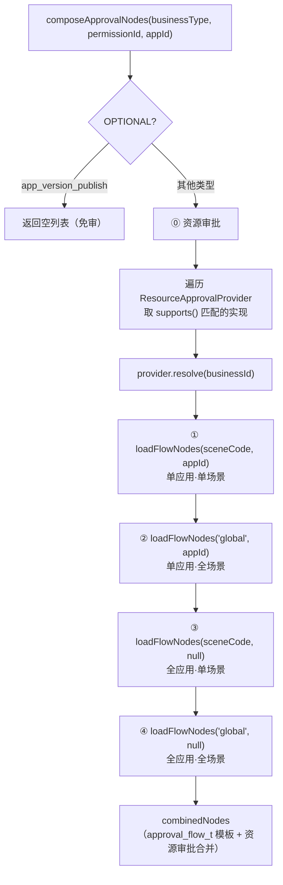
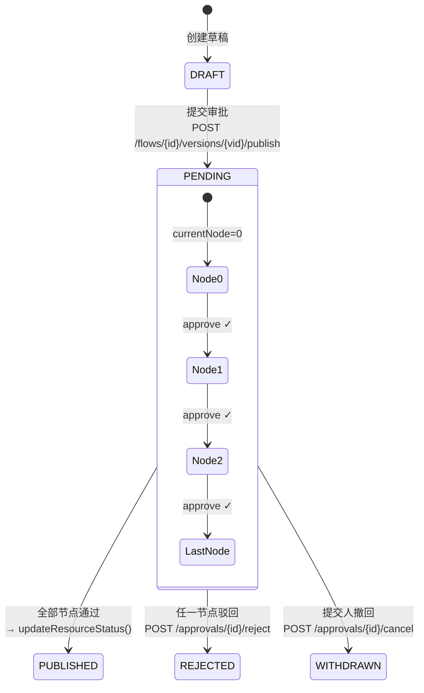
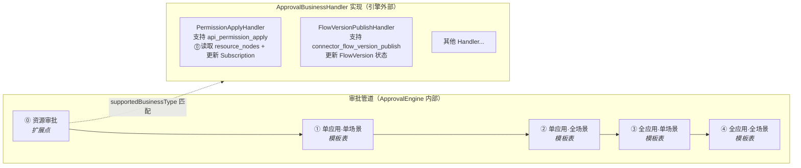
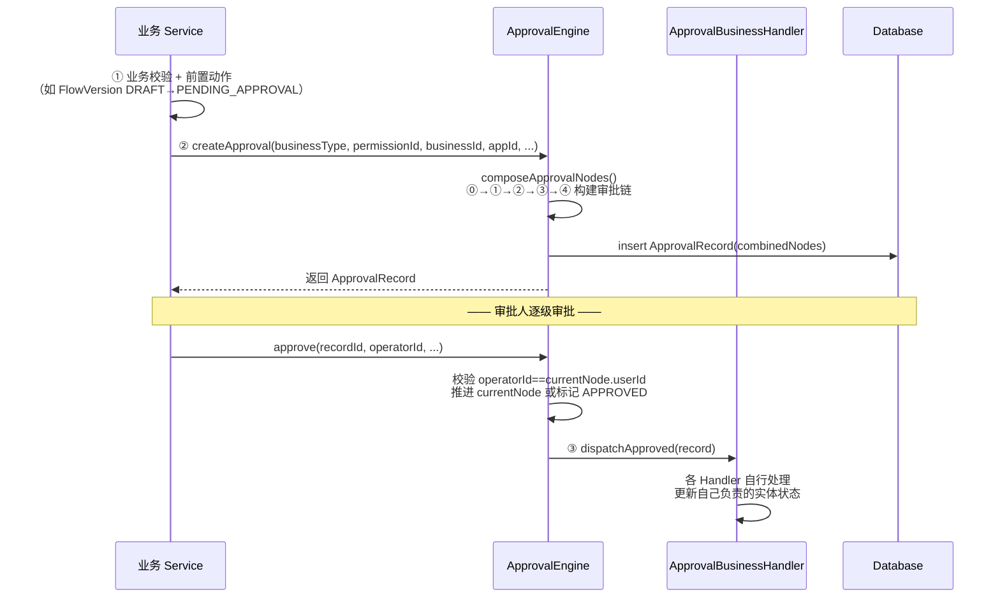
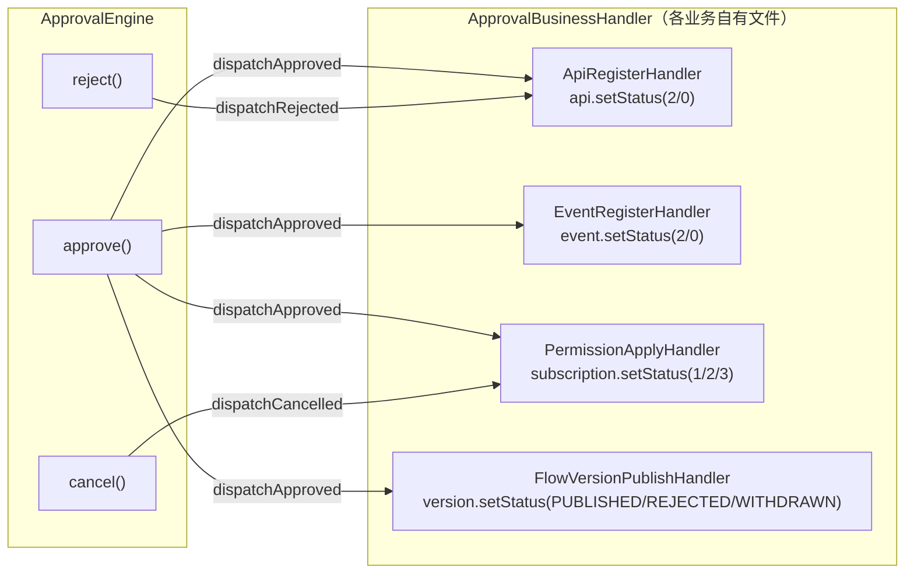

# 审批设计：连接器平台 V3 — 审批引擎统一接入

**Feature ID**: CONN-PLAT-003
**关联文档**: [spec.md](./spec.md) v3.0 §3.6, [plan-config.md](./plan-config.md), [review-approval.md](./review-approval.md)
**版本**: v1.0
**创建日期**: 2026-07-09
**说明**: 系统化记录全部 8 种审批业务类型的统一设计，覆盖模板叠加策略、审批层级路由、回调节点、DB 模型。本文档取代 review-approval.md 中的优化建议，为该建议的落地设计。

---

## 目录

- [1 业务场景总览](#1-业务场景总览)
- [2 审批模板叠加模型](#2-审批模板叠加模型)
- [3 审批层级路由策略](#3-审批层级路由策略)
- [4 引擎核心流程](#4-引擎核心流程)
- [5 引擎架构与扩展](#5-引擎架构与扩展)
- [6 数据模型](#6-数据模型)
- [7 回调设计](#7-回调设计)
- [8 接口与生效路径](#8-接口与生效路径)
- [9 附录：与 V2 标准体系的融合说明](#9-附录与-v2-标准体系的融合说明)
- [10 代码改造清单](#10-代码改造清单)
- [11 修订记录](#11-修订记录)

---

## 1 业务场景总览

open-server 审批引擎支持 8 种业务类型，覆盖能力开放平台（V2）和连接器平台（V3）：

| # | businessType | 分类 | 层级 | 说明 | 来源 |
|---|-------------|------|:---:|------|:---:|
| 1 | `api_register` | 资源注册 | 2 级 | API 注册审批 | V2 |
| 2 | `event_register` | 资源注册 | 2 级 | 事件注册审批 | V2 |
| 3 | `callback_register` | 资源注册 | 2 级 | 回调注册审批 | V2 |
| 4 | `api_permission_apply` | 权限申请 | 3 级 | API 权限申请审批 | V2 |
| 5 | `event_permission_apply` | 权限申请 | 3 级 | 事件权限申请审批 | V2 |
| 6 | `callback_permission_apply` | 权限申请 | 3 级 | 回调权限申请审批 | V2 |
| 7 | `app_version_publish` | 版本发布 | 可选 | 应用版本发布（无审批人时免审） | V2 |
| 8 | `connector_flow_version_publish` | 版本发布 | 2 级 | 连接流版本发布审批 | **V3** |

> **关键区分**：
> - 层级数由 `businessType` 决定（`*_register` → 2 级，`*_permission_apply` → 3 级，`app_version_publish` → 可选）。
> - 每级内部是否叠加多个模板由两个正交维度决定：`code`（场景维度，`global`=全部场景）和 `appId`（应用范围维度，NULL=全部应用范围），详见 §2。

---

## 2 审批模板叠加模型

### 2.1 核心设计：两个正交维度

审批模板由 **code**（场景维度）和 **appId**（应用范围维度）两个字段组合定位：

| 维度 | 字段 | 值 | 语义 |
|---|---|---|---|
| 应用范围维度 | `code` | 具体场景编码（如 `connector_flow_version_publish`） | 仅该场景生效（单场景） |
| | `code` | **`global`** | **全部场景**生效（全场景审批，所有场景的最后一关） |
| 应用范围维度 | `appId` | 具体值（如 328...） | 仅该应用生效 |
| | `appId` | **NULL** | **全部应用范围**生效 |

> **关键区分**：
> - `code = 'global'` 指全部场景（不区分 api/event/connector_flow，所有审批的最后一级）。
> - `appId = NULL` 指全部应用范围（不区分 app A / app B，所有应用共享此模板）。

两个维度是正交的，可组合出 4 种模板：

| code | appId | 生效范围 |
|---|---|---|
| `connector_flow_version_publish` | 328...（应用A） | 仅应用 A 的连接流版本发布场景 |
| `connector_flow_version_publish` | NULL | 全部应用的连接流版本发布场景 |
| `global` | 328...（应用A） | 应用 A 的全部场景 |
| `global` | NULL | 全部应用的全部场景（最宽泛） |

### 2.2 示例：连接流版本发布

用户发布了应用 A 的连接流版本，审批模板配置如下：

| code | appId | nodes | 来源 |
|---|---|---|---|
| `connector_flow_version_publish` | 328...(应用A) | [张三] | 应用 A 专属 |
| `connector_flow_version_publish` | NULL | [李四] | 全部应用范围 |
| `global` | NULL | [王五] | 全部场景 + 全部应用范围 |

生效的审批链：

```
第1级 (scene): [张三(应用专属), 李四(全部应用范围)]
    ↓ 两人都需审批通过
第2级 (global): [王五(全部场景)]
    ↓ 需审批通过
→ 版本发布
```

### 2.3 叠加规则

**查询逻辑**：每级同时查应用专属和全部应用范围两条模板，有节点的都加入，合并为同级审批节点列表。不为优选（二选一）。

```
scene 层 = selectByCodeAndAppId(sceneCode, appId)   ← 应用专属（有则加入）
         + selectByCodeAndAppId(sceneCode, null)    ← 全部应用范围（有则加入）

global 层 = selectByCodeAndAppId("global", appId)   ← 应用专属全场景
          + selectByCodeAndAppId("global", null)    ← 全部应用范围 + 全部场景
```

> 空模板（未配置或 nodes 为空）不贡献节点。最终节点数为 0 且非 OPTIONAL 类型时，`createApproval()` 抛出 400。

**按配置生效**：

5 级优先级统一适用于所有业务类型，配了哪些就哪些生效（`app_version_publish` 除外，直接免审）。

| ⓪ 资源<br>resource | ① 单应用·单场景<br>scene(app) | ② 单应用·全场景<br>global(app) | ③ 全应用·单场景<br>scene(null) | ④ 全应用·全场景<br>global(null) | 审批链 |
|---|---|---|---|---|---|
| ✅ | ✅ | ✅ | ✅ | ✅ | ⓪ → ① → ② → ③ → ④ |
| — | ✅ | ✅ | ✅ | ✅ | ① → ② → ③ → ④ |
| — | ✅ | ❌ | ✅ | ✅ | ① → ③ → ④ |
| — | ❌ | ❌ | ✅ | ✅ | ③ → ④ |
| — | ❌ | ❌ | ❌ | ✅ | ④ |
| — | ❌ | ❌ | ❌ | ❌ | 空 → 400 |

> ⓪ 是审批流的固定一环，当前仅 `_permission_apply` 场景实现（从 `permission_t.resource_nodes` 读取）。其余场景未实现，`getResourceApprovalNodes()` 返回空，自然跳过。后续场景如需资源审批，自行扩展即可。
> appId=null 时①②为 `—`（不触发查询），实际效果为 ③ → ④。
> 空模板（未配置或 nodes 为空）视为 `❌`。

### 2.4 审批节点顺序

审批链中节点按优先级从高到低排列——范围越窄越靠前：

```
  ⓪ 资源审批节点    （通用槽位，默认不实现，各场景按需扩展）
  ↓
  ① 单应用·单场景  scene(app)
  ↓
  ② 单应用·全场景  global(app)
  ↓
  ③ 全应用·单场景  scene(null)
  ↓
  ④ 全应用·全场景  global(null)
```

> ⓪ 是审批流的固定一环，`getResourceApprovalNodes(permissionId)` 默认返回空。`_permission_apply` 场景实现了该逻辑（从 `permission_t.resource_nodes` 读取）。其他场景未实现则自然跳过。后续场景如需资源审批，在自己场景下扩展查询逻辑即可，无需改动引擎。

对应 `composeApprovalNodes` 伪代码：

```java
// ⓪ 资源审批（通用槽位，未实现则返回空）
combinedNodes.addAll(getResourceApprovalNodes(permissionId));
// ① 单应用·单场景
if (appId != null) combinedNodes.addAll(loadFlowNodes(sceneCode, appId));
// ② 单应用·全场景
if (appId != null) combinedNodes.addAll(loadFlowNodes("global", appId));
// ③ 全应用·单场景
combinedNodes.addAll(loadFlowNodes(sceneCode, null));
// ④ 全应用·全场景
combinedNodes.addAll(loadFlowNodes("global", null));
```

> 存量 6 种类型传 `appId=null`，①和②为空，实际效果为 scene(null) → global(null)，与旧行为一致。

---

## 3 审批层级路由策略

### 3.1 `composeApprovalNodes()` 路由表

`ApprovalEngine.composeApprovalNodes(businessType, permissionId, appId)` 是唯一入口。路由逻辑：

```
OPTIONAL_APPROVER_TYPES.contains(businessType)? → 返回空列表（免审）
    ↓ No
businessType.endsWith("_register")? → 2级：scene(appId叠加) + global(appId叠加)
    ↓ No
businessType.endsWith("_permission_apply")? → 3级：resource(permissionId) + scene(appId叠加) + global(appId叠加)
    ↓ No
default → 2级：scene(appId叠加) + global(appId叠加)
```

| businessType | 路由分支 | 第一级来源 | 第二级 | 第三级 |
|---|---|---|---|---|
| `api_register` / `event_register` / `callback_register` | `_register` | scene(code+appId叠加) | global(appId叠加) | — |
| `api_permission_apply` / `event_permission_apply` / `callback_permission_apply` | `_permission_apply` | resource(permission.resourceNodes, 详见 §3.4) | scene(code+appId叠加) | global(appId叠加) |
| `app_version_publish` | OPTIONAL | — | — | — |
| `connector_flow_version_publish` | default (2级) | scene(code+appId叠加) | global(appId叠加) | — |

### 3.2 scene code 映射

`getSceneCodeByBusinessType(businessType)` 返回模板的 `code` 字段值：

| businessType | sceneCode |
|---|---|
| `api_register` | `"api_register"` |
| `event_register` | `"event_register"` |
| `callback_register` | `"callback_register"` |
| `api_permission_apply` | `"api_permission_apply"` |
| `event_permission_apply` | `"event_permission_apply"` |
| `callback_permission_apply` | `"callback_permission_apply"` |
| `app_version_publish` | `"app_version_publish"` |
| `connector_flow_version_publish` | `"connector_flow_version_publish"` |

### 3.3 叠加查询

见 §2.4 审批节点顺序中的伪代码。此处不再重复。

> `selectByCodeAndAppId(code, null)` 等价于旧版 `selectByCode(code)`（仅按 code 查，无需 `appId IS NULL` 兜底），存量 6 种类型传 `appId=null` 时行为不变。

### 3.4 资源审批（仅 `_permission_apply` 类型）

`_permission_apply` 类型在场景层之前额外增加**资源审批级**，形成 3 级审批链：

```
资源审批 (resource) → 单场景审批 (scene) → 全场景审批 (global)
```

资源审批等级特殊——其审批人**不来自 `approval_flow_t` 模板表**，而是直接从权限记录 `permission_t.resource_nodes` 内联读取：

```java
List<ApprovalNodeDto> getResourceApprovalNodes(Long permissionId) {
    Permission permission = permissionMapper.selectById(permissionId);
    if (permission == null || permission.getNeedApproval() != 1) {
        return Collections.emptyList();   // 无需审批则跳过该级
    }
    return parseNodes(permission.getResourceNodes());  // JSON → List<ApprovalNodeDto>
}
```

| 维度 | 资源审批 | 单场景审批 / 全场景审批 |
|---|---|---|
| 数据来源 | `permission_t.resource_nodes` | `approval_flow_t.nodes` |
| 配置者 | 资源提供方 | 平台管理员 |
| 配置粒度 | 每个权限独立配置 | 按 code+appId 统一模板 |
| 是否叠加 | 否（单条记录） | 是（app + NULL 合并） |
| level 值 | `"resource"` | `"scene"` / `"global"` |

> 资源审批不参与 template 叠加——每个权限只有一条记录，`getResourceApprovalNodes` 直接取 `resource_nodes` 解析即可。

---

## 4 引擎核心流程

### 4.1 构建审批链



> appId=null 时①②不触发查询，自然跳过。各级空模板跳过不报错。

### 4.2 审批全生命周期



| 操作 | 发起人 | 接口 | 效果 |
|---|---|---|---|
| 提交 | 版本提交人 | `POST /flows/{id}/versions/{vid}/publish` | DRAFT → PENDING_APPROVAL，创建 ApprovalRecord |
| 通过 | 当前节点审批人 | `POST /approvals/{id}/approve` | 推进 currentNode，末节点则 status=APPROVED → 回调发布 |
| 驳回 | 当前节点审批人 | `POST /approvals/{id}/reject` | status=REJECTED → 回调标记已驳回 |
| 撤回 | 审批发起人 | `POST /approvals/{id}/cancel` | status=CANCELLED → 回调标记已撤回 |
| 催办 | 审批发起人 | `POST /approvals/{id}/urge` | 通知当前节点审批人，可重复 |

---

## 5 引擎架构与扩展

### 5.1 固定管道 + 可扩展槽位

审批引擎的核心设计理念：**固定 5 级管道，每级可扩展但不强制**。



- ①~④：统一走 `selectByCodeAndAppId(code, appId)` 从 `approval_flow_t` 模板表查询，引擎内聚实现。
- ⓪：通过 `ApprovalBusinessHandler` 接口开放，各场景独立实现，引擎不感知具体业务。

### 5.2 业务 Handler（`ApprovalBusinessHandler`）

每个业务类型实现一个独立的 Handler，封装该场景的全部特定逻辑：资源审批节点（⓪）+ 审批结果回调。新增场景只需新增一个 Handler Bean，**零侵入引擎**。

```java
public interface ApprovalBusinessHandler {
    String supportedBusinessType();                            // 我负责哪个业务类型？
    default List<ApprovalNodeDto> resolveResourceNodes(Long id);  // ⓪ 资源审批（默认空）
    void onApproved(ApprovalRecord record);                    // 全部通过
    void onRejected(ApprovalRecord record);                    // 驳回
    void onCancelled(ApprovalRecord record);                   // 撤回
}
```

引擎通过 `List<ApprovalBusinessHandler>` 自动装配所有 Bean，按 `supportedBusinessType()` 匹配分发。

**当前实现**：

| Handler | 文件位置 | 支持类型 | 职责 |
|---|---|---|---|
| `ApiRegisterHandler` | `api/approval/` | `api_register` | 更新 API 状态 |
| `EventRegisterHandler` | `event/approval/` | `event_register` | 更新 Event 状态 |
| `CallbackRegisterHandler` | `callback/approval/` | `callback_register` | 更新 Callback 状态 |
| `ApiPermissionApplyHandler` | `permission/approval/` | `api_permission_apply` | ⓪读取 resource_nodes + 更新 Subscription |
| `EventPermissionApplyHandler` | `permission/approval/` | `event_permission_apply` | → 全部委托 `PermissionApplyHandler` |
| `CallbackPermissionApplyHandler` | `permission/approval/` | `callback_permission_apply` | → 全部委托 `PermissionApplyHandler` |
| `AppVersionPublishHandler` | `version/approval/` | `app_version_publish` | 更新 AppVersion 状态 |
| `FlowVersionPublishHandler` | `flowversion/approval/` | `connector_flow_version_publish` | 更新 FlowVersion 状态 |

**引擎瘦身**：`ApprovalEngine` 不再注入 `ApiMapper`、`EventMapper` 等 8 个业务 Mapper，删除 `updateResourceStatus()` 和 `updateSubscriptionStatus()` 两个大 switch 方法（-150 行）。引擎只保留核心管道和审批执行逻辑。

### 5.3 提交流程

各业务 Service 各自处理各自的业务校验，之后**统一走引擎的同一个入口** `createApproval()`。引擎负责构建审批链 + 创建记录，回调由 Handler 各自实现。



| 业务场景 | 提交入口 | businessType | appId | 特点 |
|---|---|---|---|---|
| API 注册 | `ApiService` | `api_register` | null | 无⓪资源审批 |
| 权限申请 | `PermissionService` | `api_permission_apply` | null | 有⓪（PermissionApplyHandler） |
| 连接流版本发布 | `FlowVersionApprovalService` | `connector_flow_version_publish` | appId | 唯一传非 null appId |

---

## 6 数据模型

### 6.1 审批流模板表 `openplatform_v2_approval_flow_t`

| 列 | 类型 | 说明 |
|---|---|---|
| `id` | BIGINT(20) PK | Snowflake ID |
| `name_cn` | VARCHAR(100) | 中文名称 |
| `name_en` | VARCHAR(100) | 英文名称 |
| **`code`** | VARCHAR(50) | 流程编码（sceneCode 或 `"global"`） |
| **`app_id`** | BIGINT(20) NULL | NULL=全部应用范围，具体值=应用专属（内部 App.id） |
| `nodes` | VARCHAR(2000) | JSON 审批人列表 |
| `status` | TINYINT | 0=禁用, 1=启用 |
| `create_time` / `last_update_time` | DATETIME(3) | |
| `create_by` / `last_update_by` | VARCHAR(100) | |

**唯一约束**（V3 变更）：
```sql
-- V2（旧）:
UNIQUE KEY uk_code (code)

-- V3（新）:
ALTER TABLE DROP INDEX uk_code;
ALTER TABLE ADD COLUMN app_id BIGINT(20) NULL;
ALTER TABLE ADD UNIQUE KEY uk_code_app (code, app_id);
```

> 允许 `(code='connector_flow_version_publish', app_id=NULL)` 和 `(code='connector_flow_version_publish', app_id=328...)` 同时存在。

### 6.2 nodes JSON 格式

```json
[
  {
    "type": "approver",
    "userId": "zhangsan",
    "userName": "张三",
    "order": 1,
    "level": "scene"
  }
]
```

### 6.3 审批记录表 `openplatform_v2_approval_record_t`

| 列 | 说明 |
|---|---|
| `id` | 记录 ID |
| `combined_nodes` | 序列化的完整审批链 JSON（从模板查询后固化） |
| `business_type` | 业务类型（如 `connector_flow_version_publish`） |
| `business_id` | 业务对象 ID（如 FlowVersion.id） |
| `applicant_id` / `applicant_name` | 申请人 |
| `status` | 0=待审, 1=通过, 2=驳回, 3=撤销 |
| `current_node` | 当前审批节点索引 |
| `completed_at` | 完成时间 |

### 6.4 权限资源表 `openplatform_v2_permission_t`（仅 `_permission_apply` 相关）

资源审批等级不依赖 `approval_flow_t`，审批人直接从 `permission_t` 的内联字段读取：

| 列 | 类型 | 说明 |
|---|---|---|
| `need_approval` | TINYINT | 0=无需审批, 1=需审批 |
| `resource_nodes` | VARCHAR(2000) | JSON 审批人列表，由资源提供方配置 |

> `resource_nodes` 是**单条记录内联**，不参与 template 叠加。`getResourceApprovalNodes(permissionId)` 直接解析该字段。

```json
// resource_nodes 示例
[
  {"type":"approver","userId":"payment_leader","userName":"支付团队负责人","order":1},
  {"type":"approver","userId":"finance_admin","userName":"财务管理员","order":2}
]
```

---

## 7 回调设计

审批通过/驳回/撤回后，引擎调用 `ApprovalBusinessHandler` 的对应方法。各 Handler 在自己的文件里独立处理，**与审批执行在同一事务内**。



### 7.1 各 Handler 回调行为

| Handler | onApproved | onRejected | onCancelled |
|---|---|---|---|
| `ApiRegisterHandler` | API.status=2(已发布) | API.status=0(草稿) | API.status=0 |
| `EventRegisterHandler` | Event.status=2 | Event.status=0 | Event.status=0 |
| `CallbackRegisterHandler` | Callback.status=2 | Callback.status=0 | Callback.status=0 |
| `PermissionApplyHandler` | Subscription.status=1(已授权) | Subscription.status=2(已拒绝) | Subscription.status=3(已取消) |
| `AppVersionPublishHandler` | AppVersion.status=4(已发布) | AppVersion.status=1(待发布) | AppVersion.status=1 |
| `FlowVersionPublishHandler` | version=5(已发布)+publishedTime | version=4(已驳回) | version=3(已撤回) |

### 7.2 FlowVersion 状态与审批结果对应

| 审批结果 | FlowVersion.status |
|---|---|
| 提交审批 | DRAFT(1) → PENDING_APPROVAL(2) |
| 全部通过 | PENDING_APPROVAL(2) → PUBLISHED(5) |
| 驳回 | PENDING_APPROVAL(2) → REJECTED(4) |
| 撤回 | PENDING_APPROVAL(2) → WITHDRAWN(3) |

---

## 8 接口与生效路径

### 8.1 管理面：审批流模板 CRUD

| 方法 | 路径 | 说明 |
|---|---|---|
| GET | `/approval-flows` | 列表（?keyword, ?appId 过滤） |
| GET | `/approval-flows/{id}` | 详情（含 appId） |
| POST | `/approval-flows` | 创建（body 含 code, appId, nodes） |
| PUT | `/approval-flows/{id}` | 更新（可修改 appId） |
| DELETE | `/approval-flows/{id}` | 删除 |

> 权限：`@PlatformAdminPermission`。

### 8.2 执行面：审批操作

| 方法 | 路径 | 说明 |
|---|---|---|
| GET | `/approvals/pending` | 待审批列表（?businessType 过滤） |
| GET | `/approvals/{id}` | 审批详情（含 combinedNodes） |
| POST | `/approvals/{id}/approve` | 通过 |
| POST | `/approvals/{id}/reject` | 驳回 |
| POST | `/approvals/{id}/cancel` | 撤销（审批中心入口） |
| POST | `/approvals/{id}/urge` | 催办 |

### 8.3 发布入口（触发审批）

| 方法 | 路径 | businessType |
|---|---|---|
| POST | `/flows/{flowId}/versions/{versionId}/publish` | `connector_flow_version_publish` |

> 当前 scope：仅 `connector_flow_version_publish` 场景使用 `appId` 叠加。存量 6 种类型传 `appId=null`，行为不变。

---

## 9 附录：与 V2 标准体系的融合说明

V3 连接流版本发布审批接入标准审批引擎后，review-approval.md 中记录的偏离处置如下：

| # | 偏离项 | 处置 |
|---|--------|:--:|
| 1 | BusinessType 未注册 | ✅ 已注册到 `ApprovalEngine.BusinessType` |
| 2 | 绕过 composeApprovalNodes | ✅ 走引擎统一入口 |
| 3 | 绕过 createApproval | ✅ 走引擎统一入口 |
| 4 | 非标准 level 值 | ✅ 引擎返回标准 `scene`/`global`/`resource` |
| 5 | 独立回调机制 | ✅ 并入 `updateResourceStatus`，同事务 |
| 6 | 取消/催办重复 | ⚠️ 保留 — 两条入口路径是设计意图（审批中心 vs 业务详情页） |
| 7 | 审批前状态管理 | ⚠️ 保留 — `DRAFT → PENDING_APPROVAL` 是各 Service 业务前置动作 |
| 8 | 模板匹配引入 appId | ✅ **变为特性** — 引擎统一支持的叠加维度 |
| 9 | Controller 耦合 | ✅ 消除 — Controller 回归纯粹路由 |
| 10 | 两套取消入口 | ⚠️ 保留 — 同偏离 6 |

---

## 10 代码改造清单

本节记录从当前代码（回退逻辑）到最新设计（叠加逻辑）所需的改动。

### 9.1 改造点：叠加查询

**文件**：`ApprovalEngine.java`

**当前**（回退——先查 appId，未命中兜底 null）：

```java
private List<ApprovalNodeDto> getSceneApprovalNodes(String businessType, Long appId) {
    String sceneCode = getSceneCodeByBusinessType(businessType);
    ApprovalFlow sceneFlow = null;
    if (appId != null) {
        sceneFlow = flowMapper.selectByCodeAndAppId(sceneCode, appId);
    }
    if (sceneFlow == null) {
        sceneFlow = flowMapper.selectByCodeAndAppId(sceneCode, null);
    }
    if (sceneFlow == null) return Collections.emptyList();
    return parseNodes(sceneFlow.getNodes());
}
```

**目标**（叠加——appId 和 null 都查，合并节点）：

```java
private List<ApprovalNodeDto> getSceneApprovalNodes(String businessType, Long appId) {
    String sceneCode = getSceneCodeByBusinessType(businessType);
    List<ApprovalNodeDto> nodes = new ArrayList<>();
    if (appId != null) nodes.addAll(loadFlowNodes(sceneCode, appId));
    nodes.addAll(loadFlowNodes(sceneCode, null));
    return nodes;
}
```

`getGlobalApprovalNodes(Long appId)` 同理，code 固定为 `"global"`。

**新增辅助方法**：

```java
private List<ApprovalNodeDto> loadFlowNodes(String code, Long appId) {
    ApprovalFlow flow = flowMapper.selectByCodeAndAppId(code, appId);
    if (flow == null) return Collections.emptyList();
    return parseNodes(flow.getNodes());  // JSON → List<ApprovalNodeDto>，空 JSON 返回空 List
}
```

### 9.2 改造影响

| 影响项 | 说明 |
|---|---|
| 存量 6 种类型 | `appId` 传 `null`， `loadFlowNodes(code, null)` 即原逻辑——只查 null，行为不变 |
| `connector_flow_version_publish` | `appId` 传具体值，两层叠加：app + null 同时生效 |
| 编译依赖 | 无新增，`parseNodes` 和 `selectByCodeAndAppId` 已就绪 |
| 测试断言 | `test_approval_both_app_and_global` 需从 "不含 GlobalFallback" 改为 "含 AppSpecific + GlobalFallback" |

### 9.3 测试验证

3 个 L4 用例覆盖：

| 用例 | 配置 | 验证点 |
|---|---|---|
| 仅应用专属 | scene(app) + global(null) | 发布 200 → 两级审批 → status=5 |
| 仅全应用 | scene(null) + global(null) | 同上 |
| 两者叠加 | scene(app) + scene(null) + global(null) | 发布 200 → 审批链含 AppSpecific **且**含 GlobalFallback |

---

## 11 修订记录

| 版本 | 变更说明 | 日期 | 修订人 |
|------|---------|------|--------|
| v1.1 | §9 新增代码改造清单（回退→叠加）；§2 术语统一为单场景/全场景/全应用 | 2026-07-09 | SDDU |
| v1.0 | 初始版本：8 种审批业务类型统一设计，叠加模型、路由策略、回调方案 | 2026-07-09 | SDDU |
